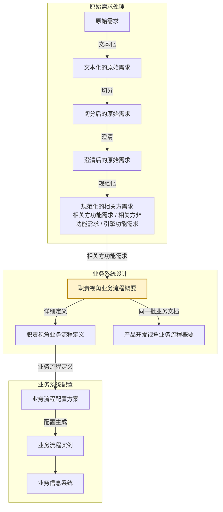

# eos-biz01abr · 相关方需求 → 职责视角业务流程概要
**SKILL 指南ID**：biz01abr-stfr2rbpl

> **本文件是什么**：EOS 设计线业务路径首个任务位里**职责视角这一半**的 SKILL 指南。它说明本任务这一步的 X→Y：输入文档 X 是相关方需求，输出文档 Y 是职责视角业务流程概要，转换规则是组装规则在本需求-方案对上的实例化。
>
> **命名约定**：本文件内不设任务代号与文档编号简称——文档一律称其本名，如「相关方需求」「职责视角业务流程概要」；相邻任务按链上位置称呼，如「原始需求处理」「职责视角业务流程定义任务」「产品开发视角业务流程任务」「引擎能力设计任务」。
>
> **自足声明**：本任务的过程判据就地成文；其余一律引权威单源——
>
> - **91 号规范《EOS平台-业务-引擎规范》**：领域设计模式、产品数据文档结构 §11、Skill 运行时协议 附录A
> - **94 号文档《EOS 系统设计产品数据分解结构》**：各产品数据的树形与各级语义
> - **00-doc-conventions《文档编写约定》**：表达风格 §八、Skill 文档操作流程 Step 布局约定 §十三
>
> **创建**：2026-09-04 | **版本**：第 56 版

---

## 一、目的与目标

### 1.1 主要目的

> 将碎片化的相关方需求组装成端到端职责业务，便于相关方理解与确认其业务过程。

### 1.2 在设计链上的位置

EOS 业务设计链由需求到方案逐对生成，相邻两份产品数据构成一个**需求-方案对**；链分**原始需求处理**、**业务系统设计**、**业务系统配置**三段，逐段把上一段的产出转成下一段的产品数据：



本任务落在**业务系统设计**这一段的首个需求-方案对「相关方需求 → 业务流程」上：X 是**相关方需求**，不分形态，末级即用例场景；Y 是**职责视角业务流程概要**。这一对分两个阶段——阶段一产出业务流程概要，阶段二把概要补成业务流程定义；阶段一由两个并列任务分担、合占一个任务位，**职责视角业务流程概要**由本任务产出，**产品开发视角业务流程概要**由产品开发视角业务流程任务产出。

本任务把**框架与概要合做**，两级一手做完，叶的详细定义留给下一个任务位；交出的**概要**是根到叶、各级只到说明，框架只是概要内部的一层截面。人类在两处介入：产出后「整体确认」，节点状态由 `待确认方案` 推进；覆盖检查检出缺口后，候选去留由人类裁决。

### 1.3 主要目标

在已有的职责视角业务流程概要上，把新进的相关方功能需求自上而下组装到位：业务域、相关方角色、E2E职责、业务文档先各归其位，任务节点与用例场景再整理到位。文档排出处理的序，每张文档初步定下业务实现方式。再逐 E2E职责核对业务对象闭环，没走完的补成原始需求材料，交回原始需求处理。

1. **组装 R 树高阶框架**：在已有的职责视角业务流程概要上，为输入的相关方功能需求里的业务文档确定节点位置——业务域、相关方角色、角色职责、E2E职责，以及业务文档本身。
2. **整理新业务文档之任务节点**：业务文档经合并或变更后，基于语义分析与业务逻辑分析，重新整理设计该业务文档下的全部任务节点。
3. **整理新任务节点之用例场景**：任务节点经合并或变更后，基于语义分析与业务逻辑分析，重新整理设计该任务节点下的全部用例场景。
4. **整理 E2E职责的文档秩序**：排出该 E2E职责处理这批业务文档的序，并加需求明示的任务触发关系；均以业务语言表达。
5. **初步确定业务文档实现方式**：为每张业务文档给出封面模式、正文实体类型，以及支撑引擎候选——后者的权威值由下一个任务位校验落定。
6. **审查 E2E职责并补充需求**：逐 E2E职责核对它的业务对象闭环是否走完——执行类从接收需求到需求被确认得到满足，管理类按计划→监控→分析→纠正；走不完即缺了应有的业务文档或任务节点，记 `[业务链缺口]`，生成补充原始需求材料。

### 1.4 与上下游的衔接

| 方向 | 任务 | 交接内容 |
|------|------|---------|
| 上游，X 的来源 | 原始需求处理的规范化 | 产出 X：相关方功能需求树——业务文档 → 任务节点 → 用例场景，业务文档上落五个属性；业务功能需求条目置状态 `待处理`。X 的结构与切分、建树规则由原始需求处理与相关方需求数据文件单源 |
| 回向，补缺出口 | 原始需求处理 | 收本任务交出的补充原始需求材料，加工成业务功能需求条目后归业务路径 |
| 下游，同一任务位 | 产品开发视角业务流程任务 | 在同一批业务文档上组装 P 树；消费本任务传出的节点，状态为 `可以srb设计`；检出缺陷退回 `需biz01修订` + 缺失说明 |
| 下游，下一任务位 | 职责视角业务流程定义任务 | 取本任务传出的概要，在说明级之上补各节点的详细定义；检出缺陷退回 `需biz01修订` + 缺失说明 |

> **本任务传出的概要有两个下游**：同一任务位的**产品开发视角业务流程任务**按对位取同一批业务文档，下一个任务位在说明级之上补详细定义。两棵树的业务文档、任务节点、用例场景三级同批，实体由职责视角业务流程概要持有。
>
> **退回是反向迭代**——下游检出缺陷 → 节点标 `需biz01修订`，也就是方案迭代需求；上游需求汇入 → 节点按状态分流。

---

## 二、输入文档结构及规则

输入文档（X） = 相关方需求，为需求-方案对的需求侧文档。

X 是相关方需求中的功能需求部分，由**原始需求处理**产出。下图是该树的展开，树形与各级语义以 94 号文档 §2.1.1 为准；结构、字段与读写约定以 91 号规范 §11 与相关方需求数据文件自身为准。

**图2-1：相关方功能需求树**

```
相关方功能需求
└── 业务文档 ──── ① 根
    └── 任务节点 ──── ②
        └── 用例场景 ──── ③
```

**表2-1：X 树各级节点的意义**

| 级 | 节点 | 意义 |
|----|------|------|
| ① | 业务文档 | 业务运行结束后应输出的产品数据文档，本质上是文档开发后生成业务，在信息系统中对应一个窗口标签页。带五个属性：所属业务域 × 所属主责角色 × 所属E2E职责 × 所属产品类型 × 所属产品构件 |
| ② | 任务节点 | 一般情况下，文档开发或生成业务包括多个步骤，一个步骤对应一个任务节点，在信息系统中对应一个表单标签页 |
| ③ | 用例场景 | 一个任务节点有多个用例场景构成，用例场景对应信息系统中的一个功能按钮、一个右键操作项，或一个功能快捷键 |

> **文档的五个属性，不占级位**：所属业务域／所属主责角色／所属E2E职责／所属产品类型／所属产品构件随业务文档携带——这五个是 R／P 两树的坐标，在本份数据里作**索引／分片轴**，不是归集级。本任务消费其中三个：所属业务域、所属主责角色、所属E2E职责。

> **同一个文档可对应多个相关方需求**：需求捕获时，不同的相关方，其业务对象可能是同一个文档；亦或，同一个相关方对同一个文档的业务，后续可能有改进的需求。

---

## 三、输出文档结构及规则

输出文档（Y） = 职责视角业务流程概要，为需求-方案对的方案侧文档。

### 3.1 Y 的树形结构与各级语义

本任务的 Y 是业务流程的 **R 树**，一份文档，根到叶，各级节点只到说明。**R 树（各业务域 · 业务运行职责视角）**回答「某角色在哪个场景、按什么序、处理哪些业务文档，完成端到端的职责闭环」。同一批业务文档在 **P 树**里另有一面，由产品开发视角业务流程任务产出。两树经**认亲**互指，末三级同名同批。

**图3-1：R 树（各业务域 · 业务运行职责视角）**

```
职责业务 ──── 根
└── 业务域 ──── ①
    └── 相关方角色 ──── ②
        └── 角色职责 ──── ③
            └── E2E职责 ──── ④
                └── 业务文档 ──── ⑤
                    └── 任务节点 ──── ⑥
                        └── 用例场景 ──── ⑦
```

**表3-1：R 树各级节点的意义**

| 级 | 节点 | 意义 |
|----|------|------|
| ① | 业务域 | 企业运营体系顶层按业务职能领域对其业务所作的结构分解，落在业务流程 1 级。一个业务域是围绕同一职能领域的一组业务流程与业务能力的逻辑聚类，域内聚合若干端到端项目业务 |
| ② | 相关方角色 | 在 EOS 上履职的业务运行角色，是业务对象生命周期的主推动者：提出需求、负责完成、确认结果。业务对象与主责角色一一对应，其余参与角色为配合角色，不另立节点 |
| ③ | 角色职责 | 一个相关方角色承担的职责清单，由该角色下的多个 E2E职责聚类而成。它是 R 树上唯一不出自业务文档属性的一级，随职责视角业务流程概要演进 |
| ④ | E2E职责 | 一个主责角色的一个业务对象闭环，即角色职责中的一项端到端业务。归入哪些业务文档由端到端定：执行类从接收需求到需求被确认得到满足；管理类按计划→监控→分析→纠正走完一轮，即 PCA |
| ⑤ | 业务文档 | 同 X 树的同名节点。它的类型分正式与轻量，判据是有没有独立于正文 CRUD 的生命周期——需要审批流转、版本追溯、派发验收或独立状态变迁的，是**正式文档**，有封面实体；都不需要的，是**轻量文档**，无封面、正文即文档。E2E职责里第一个带任务类型的文档，其任务类型必然是计划——该 E2E职责的业务由这份计划启动（策划 → 发布）；文档本体不受此限，它仍是开发/记录类文档，正文是产品数据或管理数据，不是计划清单 |
| ⑥ | 任务节点 | 同 X 树的同名节点。在 R 树上是**枝梢节点**，即框架的最深一级 |
| ⑦ | 用例场景 | 同 X 树的同名节点。在 R 树上是**叶节点**，即概要的末级 |

> **末三级与 X 同指，实体归 Y**：业务文档、任务节点、用例场景三级与 X 指向同一张文档——**X 给出这批节点，归并成树由本任务做**；在 R／P 两棵树里它们是文档开发任务，在产品数据文件里是末三级实体的落位。三级的**实体由职责视角业务流程概要持有**，产品开发视角那份带同名视图；**认亲**，即逐文档标定 P 坐标，由产品开发视角业务流程任务做。

### 3.2 Y 树各节点实现规则

本任务交出概要，各级只写到**结构判定**为止——判它在树上存在与否、落在哪一级，不写实现内容。

**表3-2：R 树各级节点实现规则**

| 级 | 节点 | 实现规则 |
|----|------|---------|
| ① | 业务域 | **本任务产出**，取自 X 的「所属业务域」；节点不存在时新建；R／P 两棵树各有一份节点，同值、不共享；本任务以此作定位与对账域 |
| ② | 相关方角色 | **本任务产出**，取自 X 的「所属主责角色」；节点不存在时与同类角色合并或新建；本任务以此作分片与复用宿主范围 |
| ③ | 角色职责 | **本任务产出**，随职责视角业务流程概要演进；由 AI 给出 E2E职责聚类方案，人类反馈修订建议或确认 |
| ④ | E2E职责 | **本任务产出**，取自 X 的「所属E2E职责」；与 R 树上同一业务域、相关方角色下的已有 E2E职责节点作语义与业务逻辑分析，或合并或新建（**端到端为判据**）；本任务的新建／修订单位 + 人类确认挂点：归拢条目、职责边界、收敛自查。**用于新建的构建规则**：识别触发 → 追踪自然终点，不得在终点之后扩展 → 闭合验证 → 边界四标准，即完整性、一致性、紧凑性、粒度匹配，产出场景职责边界陈述 |
| ⑤ | 业务文档 | **本任务产出**，取自 X 的「业务文档」；与 R 树上同一业务域、相关方角色、E2E职责下的已有文档节点作语义与业务逻辑分析，或合并或新建，并整理该业务文档下的任务节点，AI 给出方案，人类反馈意见或确认。**写到结构判定为止**——是否存在，以及它的**业务文档实现方式**：封面模式、正文实体类型、支撑引擎**候选**；封面映射、正文实体结构、支撑引擎权威值、数据权限由下一个任务位补。**文档序列构建规则**：执行类按输入-输出传递链排列，管理类按计划→监控→分析循环排列，须含计划清单文档 + 承载监控与分析环节的业务文档；需求明示的任务触发关系照录 |
| ⑥ | 任务节点 | **本任务产出**，取自 X 的「任务节点」；与 R 树上该业务文档下的已有任务节点作语义与业务逻辑分析，逐节点定**复用 → 改进 → 新增**，并整理该任务节点下的用例场景，AI 给出方案，人类反馈意见或确认。**写到任务类型与节点名称**；处理角色与状态变迁由下一个任务位补 |
| ⑦ | 用例场景 | **本任务产出**，取自 X 的「用例场景」；与 R 树上该任务节点下的已有用例场景作语义与业务逻辑分析，逐节点定**复用 → 改进 → 新增**，AI 给出方案，人类反馈意见或确认。**写到名称**；四级页面的写实由下一个任务位补 |

- **收敛自查**：父节点语义覆盖子节点语义之并，即覆盖完整；同层兄弟不重叠，即兄弟互斥。新文档归不进现有干枝，才上溯建更高层。

### 3.3 Y 树各级节点属性

写入 Y 的各级节点，除通同项——块ID、节点类型 bpd-biz、当前状态——外，还须带齐下列各表所列要素；字段对齐 Y 的数据文件 §4.1 的模板。表中「说明」一句话简述该节点是什么、做什么，说的是这一个节点自身，与该级的级语义不同——级语义见表3-1。封面模式、正文实体类型、支撑引擎候选三项合称**业务文档实现方式**，每张业务文档一段。

**表3-3：① 业务域**

| 要素 | 说明 |
|------|------|
| 名称 | 该业务域的域名 |
| 说明 | 一句话说清本域的业务边界 |

**表3-4：② 相关方角色**

| 要素 | 说明 |
|------|------|
| 名称 | 该角色在本域内的角色名 |
| 说明 | 一句话说清本角色是谁、主责哪个业务对象 |

**表3-5：③ 角色职责**

| 要素 | 说明 |
|------|------|
| 名称 | 该角色职责的名称 |
| 说明 | 一句话说清这份职责清单管哪些事 |
| 职责清单 | 本角色承担的职责条目 |

**表3-6：④ E2E职责**

| 要素 | 说明 |
|------|------|
| 说明 | 一句话说清这条端到端业务从哪起、到哪止 |
| 类型 | 执行类或管理类 |
| 主责角色 | 本 E2E职责的主推动者，与业务对象一一对应 |
| 场景职责边界陈述 | 本 E2E职责的边界——触发是什么、自然终点在哪 |
| 承接的条目引用 | 取 X 的用例场景条目引用，N:1 汇聚、**跨批追加不覆盖**，作覆盖与追溯锚点；治理预置节点无独立需求时按治理覆盖口径 |
| 文档序列 | 该 E2E职责下这批业务文档的处理序；需求明示的任务触发关系照录 |
| 推理依据与补全说明 | 本节点哪些是推出来的、依据是什么 |
| 完备性检查结果 | 覆盖检查的结论 |
| 补充材料引用 | 缺口产出的补充原始需求材料 |
| 变更影响声明、版本号 | 本次改动波及哪些下游节点，以及本节点的版本 |

**表3-7：⑤ 业务文档**

| 要素 | 说明 |
|------|------|
| 说明 | 一句话说清这份文档承载什么 |
| 封面模式 | 正式或轻量 |
| 正文实体类型 | 该文档正文的实体类型 |
| 支撑引擎候选 | 全量标 `[推断]`，权威值由下一个任务位落定 |
| 在文档序列中的位置 | 本 E2E职责里这份文档排第几 |

**表3-8：⑥ 任务节点**

| 要素 | 说明 |
|------|------|
| 说明 | 一句话说清这一步做什么 |
| 任务类型 | 计划、流程或工单 |
| 名称 | 业务语言名称 |
| 内联稳定标签 | 下游逐级对上的追溯键 |

**表3-9：⑦ 用例场景**

| 要素 | 说明 |
|------|------|
| 说明 | 一句话说清这个场景操作用户在做什么 |
| 名称 | 业务语言名称 |
| 内联稳定标签 | 下游逐级对上的追溯键 |

**传出承诺**

本任务把方案节点交给下游时，承诺节点达到：

1. 状态 = `可以srb设计`，在人类「整体确认」之后；
2. 各表所列属性齐备；
3. **每张业务文档带任务节点与用例场景**，到业务语言名称级并带内联稳定标签；末三级的实体在职责视角业务流程概要里，两个下游都按对位取用；
4. 覆盖检查结果已落账于节点——**节点累计承接的**全部需求语义 ⊆ 其业务链所能实现的范围；缺口已走补充材料回路，不是隐藏遗漏。

> **本任务的传出承诺与两个下游任务的受理前提互为对侧**，逐条映射的核对方法见 93 号规范 §4.2。

---

## 四、输出与输入转换规则

### 4.1 归拢与长枝规则（X 已给末三级，本任务长干枝）

- **归拢由属性定**：每张业务文档落进哪一支，由它身上带的属性决定——「所属业务域」定它走哪个域，「所属主责角色」定它走哪条 R 树分片，「所属E2E职责」定它落在 R 树的哪个场景。这三个属性齐备且唯一，是本任务唯一的归拢依据。
- **逐级分流**：文档按属性在 R 树上查到哪一级、缺哪一级，就在哪一级定 合并还是新建——相关方角色与 E2E职责 两级判**合并／新建**，其中 E2E职责以**端到端**为判据；业务文档一级判**新增文档节点**；任务节点与用例场景两级以**语义与业务逻辑**为判据，逐节点按 **复用 → 改进 → 新增** 定档。
- **语义跨界**：同一张业务文档下的条目指向不同业务对象 → 属 X 的缺陷，标 `需退回重切` 回原始需求处理，不在 Y 侧就地分。
- **Y 侧装不下时**：节点拆分，或横切式承接走独立分支并作影响面标注——动的是 Y 的节点。
- **改进 = 影响面复查**：对已有干枝做扩展/拆分/合并后，须复查其下已归位的文档是否失配 → 批量重归位或回退。

### 4.2 要素生成判定（从 X 推导 Y 要素）

| 生成项 | 判定规则与判据出处 |
|--------|--------------------|
| 业务域与角色 | 读业务文档的「所属业务域」→ 定 R 树的域；读「所属主责角色」→ 定 R 树的角色 |
| E2E职责类型 | 需求动作词偏向执行类/管理类；存疑标 `[推断]` |
| 文档清单 | **以 X 的业务文档为准**——本任务不另立清单；覆盖检查发现应有而未列者 → 走补充材料回路 |
| 封面模式 | 由需求读该文档的生效动作要求——有则判正式，无则判轻量 |
| 任务类型 | 读任务节点直接捕获；只给出管理模式→判定+`[推断]`；任务节点缺失→推断+`[推断]` |
| 支撑引擎 | 按正文数据类型匹配平台引擎，**全量 `[推断]`** |
| 用例场景 | 取 X 的条目原文，不另拟名 |
| 文档间关系 | 需求语义定处理序；需求明示的任务触发关系照录 |

### 4.3 修订转换（新需求并入已有 Y）

边界匹配检查，分 边界内／边界扩展／退回需求侧／宿主误匹配 → 业务链关系检测，分 确认／无新增／引擎判定变更／补充／过时 → 变更影响声明，分 无／增量／修订／结构 → 影响面复查。

### 4.4 缺口规则

覆盖检查检出缺口，**业务链类**一条通道：闭合检查核对这条业务对象闭环是否走完——执行类从接收需求到需求被确认得到满足，管理类按计划→监控→分析→纠正；走不完即缺了应有的业务文档或任务节点 → 记 `[业务链缺口]`。它锚在业务链上，是这张业务文档序列自身的缺口，不挂在别处。

缺口生成**补充原始需求材料**，回原始需求处理，由它加工成业务功能需求条目、归业务路径。人类裁决「需要」→ 落地；「不要」→ 废弃。**本任务不脑补节点**。

> **另外两类缺口不在本任务**，按锚定归属：**产品数据类**——"本批涉及的 WBS 包对照闭合模型，应有而缺失的产品数据"，锚在 P 树，归产品开发视角业务流程任务；**引擎类**——"用例场景逐一对照平台引擎，接不住的操作"，锚在用例场景，归职责视角业务流程定义任务，那时用例场景已有详细定义，对照才判得准。

---

## 五、转换流程及检验规则

### 5.1 设计过程（Step 序列）

Step Start 与 Step End 两端由 [91 附录A](91-eos-biz-eng-spec.md) 统一承载，下表一并列出以便看全序列。受理判定按入口检验表特化；下表列定义引 00-doc-conventions §十三。

| Step | 名称 | 职责 | 人类参与 | 执行模式 | 产出 | 写资产 |
|------|------|------|---------|---------|------|--------|
| Start | 前置校验与路由 | 变更感知 + 入口检测、受理判定、退回优先路由 | 无（AI 自动） | 统一 | 就绪 / 结束 | — |
| 1 | 设计材料加载 | 读待处理条目与同域存量方案节点 | 无（AI 自动） | 统一 | 设计材料全景 | — |
| 2 | 反馈处理 | 处理人类修改意见与整体确认 | **有**——对话修改 / 整体确认 | 对话 | 人类反馈落账 | — |
| 3 | 组装 R 树 | 长 E2E职责及其以上的干枝，定场景职责边界与文档序列，归位业务文档、任务节点、用例场景 | 无（AI 产出，之后对话反馈） | 统一 | R 树干枝 + 场景职责边界陈述 + 文档序列 + 业务文档实现方式 + 用例场景名称 | — |
| 4 | 覆盖检查与补充原始需求 | 闭合检查核对业务链是否走完；缺的应有业务文档或任务节点记 `[业务链缺口]`，生成补充原始需求材料 | **有**——裁决候选去留 | 对话 | 闭合检查结论 + 补充原始需求材料 | — |
| 5 | 写回与落账 | 写回产品数据、推进状态、提交基线 | 无（AI 自动） | 统一 | 状态推进 + 基线 | 职责视角业务流程概要 |
| End | 运行结束输出 | 三区摘要输出 + 人类下一步操作提示 | **有**——查看摘要、对话反馈 | 对话 | 行动清单 | — |

#### 5.1.1 Step 1 · 设计材料加载

读 `待处理` 业务功能需求条目 + 同一业务文档／同域候选存量方案节点；加载按读取协议。

#### 5.1.2 Step 2 · 反馈处理

人类对话修改／整体确认／线下修订；反馈双轨按 91 号规范 §A.5 记录。

#### 5.1.3 Step 3 · 组装 R 树

逐一对新进的业务文档，按它自带的属性——所属主责角色、所属E2E职责——在 R 树上查找位置；查到哪一级缺节点，就在哪一级定"合并还是新建"：

- **相关方角色节点已在** → 看 **E2E职责**节点：
  - **E2E职责已在** → 看 **业务文档**节点：
    - **业务文档节点已存在** → 该业务文档即**合并或变更**，对它下面的**全部**任务节点做**语义分析与业务逻辑分析**，逐节点给出**复用、改进还是新增**的建议方案；再对其中经**合并或变更**的任务节点，把它下面的**全部**用例场景做同样的分析，逐节点给出**复用、改进还是新增**的建议方案
    - **业务文档节点不存在** → 把新进的业务文档作为该 E2E职责下的一个**新增文档节点**
  - **E2E职责不存在** → 分析该相关方角色下已有的 E2E职责，判断新进的 E2E职责能否与其中之一**合并**——**端到端是判据**；能合则合，不能则**新增 E2E职责节点**，判执行类或管理类、命名、定边界，边界即主责角色的业务对象闭环，产出场景职责边界陈述
- **相关方角色节点不存在** → 分析该业务域下已有的相关方角色，判断新进的相关方角色能否与其中之一**合并**；能合则合，不能则**新增角色节点**

节点落定之后：

- **角色职责随 E2E职责集合重聚类**：本批有 E2E职责新增或合并时，其上层的角色职责归属可能随之变化——给出 **E2E职责聚类方案**，即这些 E2E职责归成哪几个角色职责，交人类反馈修订建议或确认，确认后把角色职责节点落定；
- 写文档序列：排出该 E2E职责下这批业务文档的处理序，加需求明示的任务触发关系；
- 为每张业务文档补封面模式，用例场景到名称级并带内联稳定标签；
- 有新增或改进 → 自下而上调树至收敛，判据是覆盖完整 + 兄弟互斥。

#### 5.1.4 Step 4 · 覆盖检查与补充原始需求

执行关口检查，其中**端到端闭合**是本需求-方案对的关口——执行类从接收需求到需求被确认得到满足；管理类按计划→监控→分析→纠正核对，须含计划清单文档与承载监控、分析环节的业务文档。检出缺口即缺了应有的业务文档或任务节点，记 `[业务链缺口]`。

缺口生成**补充原始需求材料**交原始需求处理，加工成业务功能需求条目归业务路径。候选去留由**人类裁决**。

#### 5.1.5 Step 5 · 写回与落账

职责视角业务流程概要落账 + 状态推进 + 基线，引 91 号规范 §A.3.3 与 §A.6。

### 5.2 检验规则

**入口检验，对 X**

| 校验条件 | 判定 | 动作 |
|---------|------|------|
| 条目状态 = `需退回重切` | 不可处理 | 输出退回记录 → 退出 |
| 条目状态 ≠ `待处理` | 不可处理 | 输出当前状态 → 退出 |
| 同一批业务文档的主责角色不唯一 | 不可处理 | 输出角色分布 → 退出 |
| 某张业务文档的五个属性缺标或矛盾 | 软限制 | 该文档的条目挂 `[需确认]`，本批其余照常 |
| 某张业务文档下的条目不同指一个业务对象 | 退回上游 | 输出退回记录 → 标 `需退回重切` → 退出 |
| 条目类型含引擎能力功能需求 / 非功能需求 | 路由错误 | 输出类型分布 + 路由指引 → 退出 |
| 一批条目 > 10 条 | 软限制 | 输出超限提示 → 人类确认 |
| 无待处理条目 + 无待反馈 + 无退回 | 无待处理对象 | 输出提示 → 退出 |

读 X 时取树中处于 `待处理` 的业务功能需求条目，按业务文档聚集、同一张业务文档下的条目优先成批；按树定位、按属性归拢。**判的是归属，不是内容**：不同相关方、不同时期提的需求各说各事，都落在这一张文档上即成立。加载遵循 91 号规范 §A.3.3 读取协议——处理节点优先、逐节点加载、按需扩大，不默认加载全文。

X 的切分与建树权在原始需求处理：业务对象闭环的切分、业务文档的五个属性、任务节点与条目的落位，都由它制定并执行，**本任务不重切 X、不重定属性**。挂起的条目不算退回，下一轮重试。

**关口，对 Y**

- **覆盖检查**，这是本需求-方案对的关口：**节点累计承接的**全部需求语义 ⊆ 其叶节点即用例场景之并——叶由上游直接给出，这一面即 X 的用例场景**整段进入 Y**、一个不少、同名同级；业务链这一面则核其兑现，即 ⊆ 其业务链所能实现的范围。同一张业务文档的需求分多批到来，故检查范围累计——每批检新增部分；本批改动了已有干枝，另按影响面复查其下已归位部分。EOS 实例化 = **端到端闭合检查**——执行类从接收需求到需求被确认得到满足；管理类按计划→监控→分析→纠正核对，须含计划清单文档 + 承载监控与分析环节的业务文档，这两环节的运行时推进结果不作需求缺口。缺口 → 生成补充原始需求材料 → 经原始需求处理补回，**不脑补节点**。
- **要素机械检查**：逐文档要素非空或合理空置 + 标注齐备，含 `[推断]`／`[待下游推断]`。
- **治理覆盖检查**：预置治理业务流程的业务链按角色预定文档集核对；无需求锚点的缺口标 `[治理缺口]`，提示人类渐进增补，不自动补。

### 5.3 状态推进与退回

```
待确认方案 ──人类确认──→ 可以srb设计 ──下游锁定──→ 在srb设计 ──下游完成──→ 已srb设计
     ↑                       ↑                      │
     │                       │          下游退回     │
     └── 本任务修订 ──── 需biz01修订 ←───────────────┘
```

上游变更，即新需求汇入，按状态分流：`可以srb设计`→版本递增，未消费；`在srb设计`→版本递增，增量处理；`已srb设计`→`待补充srb设计`→下游补全。节点生命周期与写回范围引 91 号规范 §A.6，此处为本任务特化。

**两种退回，方向相反**：X 有缺陷、且缺陷的处置权不在本任务（切分与建树归原始需求处理）→ 标 `需退回重切`，交回原始需求处理；Y 被下游挑出缺陷 → 标 `需biz01修订`，由本任务修订。

### 5.4 运行时特化参数

- **锚点需求** = 节点累计承接的全部业务功能需求条目，跨批追加
- **操作条目** = 场景职责边界 + 干枝 + 业务文档实现方式段 + 用例场景名称 + 补充原始需求材料候选
- **推进目标** = `可以srb设计`
- **退回节点状态值** = `需biz01修订`，退回修订走修订转换
- **清除与级联条件**由状态机与上游分流定
- 其余运行时机制——Step Start／Step End、入口条件与优先级、反馈双轨状态机、git 基线、Step End 三区模板——按 91 号规范 附录A 执行；本任务的入口检验已就地成文

---

## 六、关联产品数据及规则（接口）

**R 树本身就是资产**——本任务不另读资产文档，除 X 之外没有外部输入。本节记本任务读什么、写什么。

### 6.1 读

| 产品数据 | 读什么 | 用途 |
|---------|--------|------|
| 相关方需求（X） | 业务文档 → 任务节点 → 用例场景，及业务文档上的五个属性 | 本任务的唯一外部输入 |

> 治理节点的预定文档集不由外部给出，由人类按平台治理业务增补。

### 6.2 写

本任务只写 **Y = 职责视角业务流程概要**——R 树即资产，写在 Y 里，不另立一册。写回动作与状态推进引 91 号规范 §A.6。

---

## 七、收尾

### 7.1 AI 标记约定

`[新增]`/`[变更]`/`[确认]`/`[需裁决]` + `[推断]`/`[待下游推断]`/`供人类确认`——标记的定义与使用、三区输出格式见 91 号规范 §A.3.1／§A.3.2；本任务增量清单对操作条目逐条标注；并附覆盖检查结果行。

### 7.2 自检清单

本任务自检——一次运行收尾前，按本任务流程分组逐项核对：

- **入口/受理**：入口检验已校验通过；退回优先，`需biz01修订` 时读缺失说明走修订转换；无待处理已退出。
- **载入与校验**：待处理业务功能需求 + 同一业务文档／域存量方案节点已按 91 号规范 §A.3.3 加载、不全载全文；条目正文与业务文档的五个属性自洽。
- **组装**：R 树组装完成，逐级定位与合并／新建判定正确——E2E职责以端到端为判据、任务节点与用例场景以语义与业务逻辑为判据；修订转换的边界匹配／关系检测／变更影响声明已执行；业务文档、任务节点、用例场景已按属性归位；角色职责的重聚类已交人类确认；树收敛，判据是覆盖完整 + 兄弟互斥。
- **Y 侧要素**：每张业务文档齐封面模式与正文实体类型；用例场景到名称级并带内联稳定标签；加支撑引擎候选 `[推断]`、任务关系；要素非空或合理空置。
- **关口**：覆盖检查已执行，检的是节点累计承接的全部需求语义；缺口以闭合检查产出补充原始需求材料交原始需求处理，候选去留有人类裁决，**不脑补节点**；治理覆盖已核对。
- **写回**：R 树写进职责视角业务流程概要；加状态推进 `可以srb设计`、AI 最近变更/可处理节点分节维护、基线提交。
