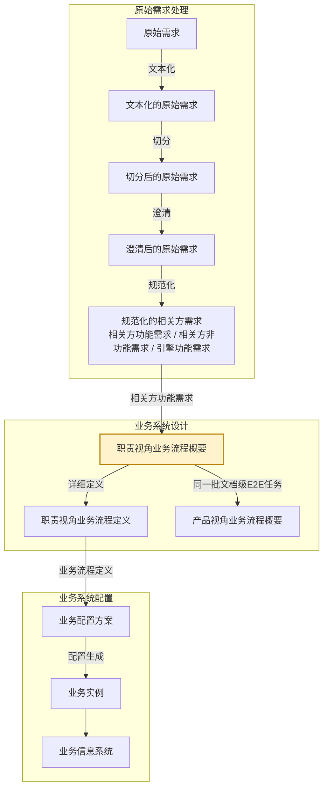

# eos-biz01abr · 相关方需求 → 职责视角业务流程概要
**SKILL 指南ID**：biz01abr-stfr2rbpl

> **本文件是什么**：EOS 设计线业务路径首个任务位里**职责视角这一半**的 SKILL 指南。它说明本任务这一步的 X→Y：输入文档 X 是相关方需求，输出文档 Y 是职责视角业务流程概要，转换规则是组装规则在本需求-方案对上的实例化。
>
> **命名约定**：本文件内不设任务代号与文档编号简称——文档一律称其本名，如「相关方需求」「职责视角业务流程概要」；相邻任务按链上位置称呼，如「原始需求处理」「职责视角业务流程定义任务」「产品视角业务流程任务」「引擎能力设计任务」。
>
> **自足声明**：本任务的过程判据就地成文；其余一律引权威单源——
>
> - **[91 号规范《EOS平台-业务-引擎规范》](91-eos-biz-eng-spec.md)**：领域设计模式、产品数据文档结构 §11、Skill 运行时协议 附录A
> - **[94 号文档《EOS 系统设计产品数据分解结构》](94-eos-sys-dev-dbs.md)**：各产品数据的树形与各级语义
> - **[00-doc-conventions《文档编写约定》](../../../00-generalspec/00-doc-conventions.md)**：表达风格 §八、Skill 文档操作流程 Step 布局约定 §十三
>
> **创建**：2026-09-04 | **版本**：第 90 版

---

## 一、目的与目标

### 1.1 主要目的

> 将碎片化的相关方需求组装成端到端职责业务，便于相关方理解与确认其业务过程。

### 1.2 在设计链上的位置

EOS 业务设计链由需求到方案逐对生成，相邻两份产品数据构成一个**需求-方案对**；链分**原始需求处理**、**业务系统设计**、**业务系统配置**三段，逐段把上一段的产出转成下一段的产品数据：

**图1-1：业务设计链与本任务的位置**



本任务落在**业务系统设计**这一段的首个需求-方案对「相关方需求 → 业务流程」上：X 是**相关方需求**，只有一份、不分框架与概要，末级即用例场景；Y 是**职责视角业务流程概要**。这个需求-方案对分两个阶段——阶段一产出业务流程概要，阶段二把概要补成业务流程定义。阶段一由两个并列任务分担、合占一个任务位。**任务位**是链上一步的位置，由一个需求-方案对与一个阶段定出。**职责视角业务流程概要**由本任务产出，**产品视角业务流程概要**由产品视角业务流程任务产出。

本任务把**框架与概要合做**，两级一手做完，叶的详细定义留给下一个任务位；交出的**概要**是根到叶、各级只到说明，框架只是概要内部的一层截面。人类在轮内介入三处：先在 Step Start 从候选清单中选定本次处理的对象，再在 Step 2 的对话里讨论并确认方案，最后在 Step 4 的对话里裁决覆盖检查检出的缺口候选。没讨论完的方案留在 `待确认方案`，由下一轮接着讨论。

### 1.3 主要目标

在已有的职责视角业务流程概要上，把新进的相关方功能需求自上而下组装到位：业务域、相关方角色、岗位级E2E业务、文档级E2E任务先各归其位，任务节点与用例场景再整理到位。再排出文档序列，初步定下每张文档的实现方式。再逐 岗位级E2E业务核对业务对象闭环，没走完的补成原始需求材料，交回原始需求处理。

1. **组装 R 树高阶框架**：在已有的职责视角业务流程概要上，为输入的相关方功能需求里的文档级E2E任务确定节点位置——业务域、相关方角色、职责级E2E业务、岗位级E2E业务，以及文档级E2E任务本身。
2. **整理新文档级E2E任务之任务节点**：文档级E2E任务经合并或变更后，把该文档级E2E任务下的全部任务节点与本次带来的逐一对上，各定复用、改进还是新增。
3. **整理新任务节点之用例场景**：任务节点经合并或变更后，把该任务节点下的全部用例场景与本次带来的逐一对上，各定复用、改进还是新增。
4. **整理 岗位级E2E业务的文档序列**：排出该 岗位级E2E业务处理这批文档级E2E任务的序，并加需求明示的任务触发关系；均以业务语言表达。
5. **初步确定文档级E2E任务实现方式**：为每张文档级E2E任务给出封面模式、正文实体类型，以及支撑引擎候选——后者的权威值由下一个任务位校验落定。
6. **覆盖检查与补充原始需求**：逐 岗位级E2E业务核对它的业务对象闭环是否闭合——执行类从接收需求到需求被确认得到满足，管理类按计划→监控→分析→纠正。闭环不完整即缺了应有的文档级E2E任务或任务节点，记 `[文档序列缺口]`，生成文档序列类补充原始需求材料。

### 1.4 与上下游的衔接

**表1-1：与上下游的衔接**

| 方向 | 任务 | 交接内容 |
|------|------|---------|
| 上游，X 的来源 | 原始需求处理的规范化 | 产出 X：相关方功能需求树——文档级E2E任务 → 任务节点 → 用例场景，文档级E2E任务上落五个属性；业务功能需求条目置状态 `待处理` |
| 回向，补缺出口 | 原始需求处理 | 收本任务交出的补充原始需求材料，加工成业务功能需求条目后归业务路径 |
| 下游，同一任务位 | 产品视角业务流程任务 | 在同一批文档级E2E任务上组装 P 树；消费本任务交出的节点，状态为 `可以srb设计` |
| 下游，下一任务位 | 职责视角业务流程定义任务 | 取本任务交出的概要，在说明级之上补各节点的详细定义 |

> **交出的概要由两个下游取用**：同一任务位的**产品视角业务流程任务**按对位取同一批文档级E2E任务，下一个任务位在说明级之上补详细定义。两棵树的文档级E2E任务、任务节点、用例场景三级同批，实体由职责视角业务流程概要持有。

---

## 二、输入文档结构及规则

输入文档（X） = 相关方需求，为需求-方案对的需求侧文档。

X 是相关方需求中的功能需求部分，由**原始需求处理**产出。下图是该树的展开。

**图2-1：相关方功能需求树**

```
相关方功能需求
└── 文档级E2E任务 ──── ① 根
    └── 任务节点 ──── ②
        └── 用例场景 ──── ③
```

**表2-1：X 树各级节点的意义**

| 级 | 节点 | 意义 |
|----|------|------|
| ① | 文档级E2E任务 | 开发或生成文档的E2E业务，从接到文档需求开始到开发或生成满足需求的文档结束，文档级E2E任务一般包括多个步骤。一份文档（或其中一个专业内容）的开发或生成业务由单个员工承担，因此也被看做是个人级E2E业务。带五个属性：所属业务域 × 所属主责角色 × 所属岗位级E2E业务 × 所属产品级E2E业务 × 所属构件级E2E业务，在信息系统中对应一个窗口标签页 |
| ② | 任务节点 | 文档级E2E任务一般由一个主责角色负责开发或生成，并由多个参与角色负责其他工作，比如验证、审批等，每个角色的工作被看做一个步骤，一个步骤就是一个任务节点。在信息系统中对应一个表单标签页 |
| ③ | 用例场景 | 文档任务中的主责角色或参与角色在信息系统上开展自己负责的工作时，其操作表单标签页上提供功能按钮（右键操作项，或快捷键操作）所对应的业务 |

> **文档的五个属性，不占级位**：所属业务域／所属主责角色／所属岗位级E2E业务／所属产品级E2E业务／所属构件级E2E业务随文档级E2E任务携带——这五个是 R／P 两树的坐标，在本份数据里作**索引／分片轴**，不是归集级。

> **同一个文档可对应多个相关方需求**：需求捕获时，不同的相关方，其业务对象可能是同一个文档；亦或，同一个相关方对同一个文档的业务，后续可能有改进的需求。

---

## 三、输出文档结构及规则

输出文档（Y） = 职责视角业务流程概要，为需求-方案对的方案侧文档。

### 3.1 Y 的树形结构与各级语义

本任务的 Y 是业务流程的 **R 树**，一份文档，根到叶，各级节点只到说明。**R 树（各业务域 · 业务运行职责视角）**回答「某角色在哪个场景、按什么序、处理哪些文档级E2E任务，完成端到端的职责闭环」。同一批文档级E2E任务在 **P 树**里另有一面，由产品视角业务流程任务产出。两树以**认亲**互指，即逐文档标定 P 坐标，末三级同名同批。

**图3-1：R 树（各业务域 · 业务运行职责视角）**

```
职责业务 ──── 根
└── 业务域 ──── ①
    └── 相关方角色 ──── ②
        └── 职责级E2E业务 ──── ③
            └── 岗位级E2E业务 ──── ④
                └── 文档级E2E任务 ──── ⑤
                    └── 任务节点 ──── ⑥
                        └── 用例场景 ──── ⑦
```

**表3-1：R 树各级节点的意义**

| 级 | 节点 | 意义 |
|----|------|------|
| ① | 业务域 | 企业运营体系顶层按业务职能领域对其业务所作的结构分解，落在业务流程 1 级。一个业务域是围绕同一职能领域的一组业务流程与业务能力的逻辑聚类，域内聚合若干端到端项目业务 |
| ② | 相关方角色 | 在 EOS 上履职的业务运行角色，是业务对象生命周期的主推动者：提出需求、负责完成、确认结果。业务对象与主责角色一一对应，其余参与角色为配合角色，不另立节点 |
| ③ | 职责级E2E业务 | 一个相关方角色承担的职责清单，由该角色下的多个 岗位级E2E业务聚类而成。它是 R 树上唯一不出自文档级E2E任务属性的一级，随职责视角业务流程概要演进 |
| ④ | 岗位级E2E业务 | 一个主责角色的一个业务对象闭环，即职责级E2E业务中的一项端到端业务。归入哪些文档级E2E任务由端到端定：执行类从接收需求到需求被确认得到满足；管理类按计划→监控→分析→纠正完成一轮 |
| ⑤ | 文档级E2E任务 | 开发或生成文档的E2E业务，从接到文档需求开始到开发或生成满足需求的文档结束，文档级E2E任务一般包括多个步骤。一份文档（或其中一个专业内容）的开发或生成业务由单个员工承担，因此也被看做是个人级E2E业务。它的类型分正式与轻量，判据是有没有独立于正文 CRUD 的生命周期——需要审批流转、版本追溯、派发验收或独立状态变迁的，是**正式文档**，有封面实体；都不需要的，是**轻量文档**，无封面、正文即文档。岗位级E2E业务里第一个带任务类型的文档，其任务类型必然是计划——该 岗位级E2E业务的业务由这份计划启动（策划 → 发布）；文档本体不受此限，它仍是开发/记录类文档，正文是产品数据或管理数据，不是计划清单 |
| ⑥ | 任务节点 | 文档级E2E任务一般由一个主责角色负责开发或生成，并由多个参与角色负责其他工作，比如验证、审批等，每个角色的工作被看做一个步骤，一个步骤就是一个任务节点。在信息系统中对应一个表单标签页。在 R 树上是**枝梢节点**，即框架的最深一级 |
| ⑦ | 用例场景 | 文档任务中的主责角色或参与角色在信息系统上开展自己负责的工作时，其操作表单标签页上提供功能按钮（右键操作项，或快捷键操作）所对应的业务。在 R 树上是**叶节点**，即概要的末级 |

> **末三级与 X 同指，实体归 Y**：文档级E2E任务、任务节点、用例场景三级与 X 指向同一张文档——**X 给出这批节点，归并成树由本任务做**。在 R／P 两棵树里它们是文档开发任务，在产品数据文件里是末三级实体的落位。三级的**实体由职责视角业务流程概要持有**，产品视角那份带同名视图。**认亲**由产品视角业务流程任务做。

### 3.2 Y 树各节点实现规则

本任务交出概要，各级节点判的是**结构判定**——在树上存在与否、落在哪一级。内容写到名称与说明，文档级E2E任务另写到**文档级E2E任务实现方式**的三项候选。

**表3-2：R 树各级节点实现规则**

| 级 | 节点 | 实现规则 |
|----|------|---------|
| ① | 业务域 | **本任务产出**；R／P 两棵树各有一份节点，同值、不共享；本任务以此作定位域，相关方角色的比对在本域内做 |
| ② | 相关方角色 | **本任务产出**；本任务以此作分片与复用宿主范围 |
| ③ | 职责级E2E业务 | **本任务产出**，随职责视角业务流程概要演进；由 AI 给出 岗位级E2E业务聚类方案，人类反馈修订建议或确认 |
| ④ | 岗位级E2E业务 | **本任务产出**；本任务的新建／修订单位。**用于新建的构建规则**：识别触发 → 追踪自然终点，不得在终点之后扩展 → 闭合验证 → 边界四标准，即完整性、一致性、紧凑性、粒度匹配，产出场景职责边界陈述 |
| ⑤ | 文档级E2E任务 | **承袭**，取自 X 的「文档级E2E任务」；AI 给出方案，人类反馈意见或确认。**写到结构判定为止**——是否存在，以及它的**文档级E2E任务实现方式**：封面模式、正文实体类型、支撑引擎**候选**；封面映射、正文实体结构、支撑引擎权威值、数据权限由下一个任务位补。**文档序列构建规则**：执行类按输入-输出传递链排列，管理类按计划→监控→分析循环排列，须含计划清单文档 + 承载监控与分析环节的文档级E2E任务；需求明示的任务触发关系照录 |
| ⑥ | 任务节点 | **承袭**，取自 X 的「任务节点」；AI 给出方案，人类反馈意见或确认。**写到任务类型与节点名称**；处理角色与状态变迁由下一个任务位补 |
| ⑦ | 用例场景 | **承袭**，取自 X 的「用例场景」；AI 给出方案，人类反馈意见或确认。**写到名称**；四级页面的写实由下一个任务位补 |

- **收敛自查**：父节点语义覆盖子节点语义之并，即覆盖完整；同层兄弟不重叠，即兄弟互斥。新文档归不进现有干枝，才上溯建更高层。

### 3.3 Y 树各级节点的要素

写入 Y 的各级节点，除块头三字段——块ID、节点类型 bpd-biz、当前状态——外，还须带齐下列各表所列要素。表中「说明」一句话简述该节点是什么、做什么，说的是这一个节点自身，与该级的级语义不同——级语义见表3-1。封面模式、正文实体类型、支撑引擎候选三项合称**文档级E2E任务实现方式**，每张文档级E2E任务一段。

**表3-3：业务域**

| 要素 | 说明 |
|------|------|
| 名称 | 该业务域的域名 |
| 说明 | 一句话说清本域的业务边界 |

**表3-4：相关方角色**

| 要素 | 说明 |
|------|------|
| 名称 | 该角色在本域内的角色名 |
| 说明 | 一句话说清本角色是谁、主责哪个业务对象 |

**表3-5：职责级E2E业务**

| 要素 | 说明 |
|------|------|
| 名称 | 该职责级E2E业务的名称 |
| 说明 | 一句话说清这份职责清单管哪些事 |
| 职责清单 | 本角色承担的职责条目 |

**表3-6：岗位级E2E业务**

| 要素 | 说明 |
|------|------|
| 说明 | 一句话说清这条端到端业务从哪起、到哪止 |
| 类型 | 执行类或管理类 |
| 主责角色 | 本 岗位级E2E业务的主推动者，与业务对象一一对应 |
| 场景职责边界陈述 | 本 岗位级E2E业务的边界——触发是什么、自然终点在哪 |
| 承接的条目引用 | 取 X 的用例场景条目引用，多条汇聚成一条、**跨批追加不覆盖**，作覆盖与追溯锚点 |
| 文档序列 | 该 岗位级E2E业务下这批文档级E2E任务的处理序；需求明示的任务触发关系照录 |
| 推理依据与补全说明 | 本节点哪些是推出来的、依据是什么 |
| 完备性检查结果 | 覆盖检查的结论 |
| 补充材料引用 | 缺口产出的补充原始需求材料 |
| 变更影响声明、版本号 | 本次改动波及哪些下游节点，以及本节点的版本 |

**表3-7：文档级E2E任务**

| 要素 | 说明 |
|------|------|
| 说明 | 一句话说清这份文档承载什么 |
| 封面模式 | 正式或轻量 |
| 正文实体类型 | 该文档正文的实体类型 |
| 支撑引擎候选 | 全量标 `[推断]`，权威值由下一个任务位落定 |
| 在文档序列中的位置 | 本 岗位级E2E业务里这份文档排第几 |
| 内联稳定标签 | 下游逐级对上的追溯键 |

**表3-8：任务节点**

| 要素 | 说明 |
|------|------|
| 说明 | 一句话说清这一步做什么 |
| 任务类型 | 计划、流程或工单 |
| 名称 | 业务语言名称 |
| 内联稳定标签 | 下游逐级对上的追溯键 |

**表3-9：用例场景**

| 要素 | 说明 |
|------|------|
| 说明 | 一句话说清这个场景操作用户在做什么 |
| 名称 | 业务语言名称 |
| 内联稳定标签 | 下游逐级对上的追溯键 |

**移交承诺**

本任务把方案节点交给下游时，承诺节点达到：

1. 状态 = `可以srb设计`，在人类「整体确认」之后；
2. 各表所列属性齐备；
3. **每张文档级E2E任务带任务节点与用例场景**，到业务语言名称级并带内联稳定标签；末三级的实体在职责视角业务流程概要里，两个下游都按对位取用；
4. 覆盖检查结果已落账于节点——**节点累计承接的**全部需求语义 ⊆ 其文档序列所能实现的范围。缺口已走补充材料回路，不是隐藏遗漏。

> **移交承诺就是两个下游任务的受理前提**——同一组条件，两侧各读一遍。

---

## 四、输入到输出的过程及规则

### 4.1 X 与 Y 的对应

X 是一棵以文档级E2E任务为根的树，三级。Y 是 R 树，七级。X 只给属性值与一批节点，**不给干枝**——干枝即文档级E2E任务之上的各级节点，由本任务在 Y 上落出。

**表4-1：X 三级与 Y 七级的对应**

| X 的树 | Y 的树 |
|--------|--------|
| — | ① 业务域 |
| — | ② 相关方角色 |
| — | ③ 职责级E2E业务 |
| — | ④ 岗位级E2E业务 |
| ① 文档级E2E任务（根，带五个属性） | ⑤ 文档级E2E任务 |
| ② 任务节点 | ⑥ 任务节点 |
| ③ 用例场景 | ⑦ 用例场景 |

> **Y 的业务域、相关方角色、职责级E2E业务、岗位级E2E业务在 X 里没有对应**。本任务只取文档级E2E任务五个属性中的三个——所属业务域、所属主责角色、所属岗位级E2E业务；另两个即所属产品级E2E业务、所属构件级E2E业务，归 P 树，由产品视角业务流程任务消费。

**承接记录**——这条对应关系要回写到 X 上，按 X 已有的追溯关系体例，六项一组。

**源节点**是本条所属的文档级E2E任务名下的条目——一次运行处理的就是一张文档级E2E任务及其下级，故一轮只产出一条记录，写在该文档级E2E任务名下的全部条目上。

**关系类型**是承接。

**目标节点**是承接它的那张文档级E2E任务，即 Y 上文档级E2E任务级的一级节点，写它的内联稳定标签。

**目标文档**是职责视角业务流程概要。文档级E2E任务级的标签与 岗位级E2E业务节点的块ID，在职责视角业务流程定义里是同一套；不写目标文档就无从确定指的是哪一份。

**状态**随覆盖检查落。

**说明**记可以承接的理由一句话：这份业务落在该 岗位级E2E业务的触发到自然终点之内、属同一个业务对象闭环，且它就是要输出的那份产品数据。理由的完整成文落进承接它的那个 岗位级E2E业务节点的推理依据与补全说明。

### 4.2 转换过程

一次转换依次走四步。

#### 4.2.1 第一步 · 长干枝

根上的三个属性值在 Y 上逐级落位，每级拿**同一父节点下**的已有节点作比对：

**表4-2：干枝由属性落地**

| 级 | 取根上哪个属性 | 判定 | 比对范围 | 处置 |
|----|--------------|------|--------|------|
| ① 业务域 | 「所属业务域」 | 这个域在不在 | — | 不在时新建，在则不动 |
| ② 相关方角色 | 「所属主责角色」 | 这个角色在不在该域下 | 同域**同类角色** | 不存在时与同类角色合并，或新建 |
| ④ 岗位级E2E业务 | 「所属岗位级E2E业务」 | 这个业务对象闭环在不在该角色下 | 同域·同角色下的已有 岗位级E2E业务 | 合并或新建，**以端到端为判据** |

岗位级E2E业务分两支。**合并**——新进这条闭环与同一相关方角色下已有的某个 岗位级E2E业务是同一个，并入该节点；**新建**——都不是，则新建，并按该级的构建规则把边界成文，产出**场景职责边界陈述**。

岗位级E2E业务的**类型**由需求动作词判：偏向执行的判执行类，偏向计划、监控、分析、纠正的判管理类；存疑标 `[推断]`。

> **三处确认都挂在 岗位级E2E业务上**——归拢条目经候选清单由人类选定，职责边界与收敛自查随方案进对话确认。

#### 4.2.2 第二步 · 生成职责级E2E业务

Y 的职责级E2E业务在 X 里没有对应——它由相关方角色之下的 岗位级E2E业务集合聚成。本次没有 岗位级E2E业务新增或合并时，职责级E2E业务不动；有新增或合并的，给出 岗位级E2E业务聚类方案，落定以人类的确认结论为准。

#### 4.2.3 第三步 · 生成文档级E2E任务与任务节点及用例场景

X 的文档级E2E任务、任务节点、用例场景整段搬入 Y，判的是它挂到哪儿。挂到哪个 岗位级E2E业务下由「所属岗位级E2E业务」定，长干枝那一步已落定。这一步判的是并入已有的一张，还是新建一张。

**表4-3：末三级的落位**

| 级 | 判定 | 判据 | 处置 |
|----|------|------|------|
| ⑤ 文档级E2E任务 | 与该 岗位级E2E业务已有文档级E2E任务的关系 | 是不是同一份业务输出的产品数据 | 并入的走文档序列的关系检测；新建的把 X 的三级整段搬入 |
| ⑥ 任务节点 | 与该文档级E2E任务下已有任务节点的关系 | 任务节点的名称与业务含义是否同一 | 复用 → 改进 → 新增 |
| ⑦ 用例场景 | 与该任务节点下已有用例场景的关系 | 用例场景的名称与业务含义是否同一 | 复用 → 改进 → 新增 |

该 岗位级E2E业务下已有承接这份业务的文档，就并入那一张，把它的节点与本次带来的逐一对上：判该文档级E2E任务下的**全部**任务节点，以及其中经合并或变更的任务节点之下的**全部**用例场景，各定复用、改进还是新增。该 岗位级E2E业务下没有承接它的文档，就新建一张，X 的三级整段搬入。

**任务类型**与**用例场景的名称**在这一步写出。任务类型读 X 的任务节点：明示则照判，只给出管理模式（审批、派发等）则按模式判类型，两者皆无则按业务语义推断。**推断只及类型，不及节点**：X 未给的任务节点不推断，它是缺口，不在本步补。用例场景取 X 的条目原文，不另拟名。

> **判到哪里为止**：判的是结构判定——节点在树上存在与否、落在哪一级。内容写到名称级：任务节点写到任务类型与节点名称，用例场景写到名称；两者都带内联稳定标签。

#### 4.2.4 第四步 · 确定文档序列与文档级E2E任务实现方式

这条 岗位级E2E业务有了文档级E2E任务之后，把该 岗位级E2E业务补全成一条完整的枝。

**文档序列**——把这张文档级E2E任务排进该 岗位级E2E业务的文档序列。

**文档级E2E任务实现方式**——给这张文档级E2E任务三项：**封面模式**，按表3-1 的正式／轻量判据定；**正文实体类型**，读该文档正文承载的业务对象定，如申请行、指标项行、看板条目行；**支撑引擎候选**，按文档类型匹配平台引擎（台账、工单、指标、看板、项目、WBS、计划、进展等），**全量 `[推断]`**，权威值由下一个任务位落定。

**文档清单**以 X 的文档级E2E任务为准——本任务不另立清单。

### 4.3 并入已有 Y

岗位级E2E业务在 Y 上已有节点时，四步都按并入处理，依次做三项。

**边界匹配检查**——判本次输入的条目是否仍落在这条 岗位级E2E业务的边界内，即是否仍属同一个业务对象闭环：

**表4-4：边界匹配检查**

| 结果 | 判定 | 处置 |
|------|------|------|
| 边界内 | 全部落在现有触发到自然终点的范围内 | 进入文档序列关系检测 |
| 边界扩展 | 超出当前自然终点，但仍属同一个业务对象闭环 | 更新场景职责边界陈述 + 重追踪终点；粒度不一致时标 `[推断]` 供人类裁决 |
| 边界外 | 不属于同一个业务对象闭环 | 不入本 岗位级E2E业务——退回干枝判定另择节点；无法判定的标 `[需裁决]` 交人类 |

**文档序列关系检测**——并入已有文档的，逐文档与该 岗位级E2E业务的文档序列比对，以文档名称与职责为准：

**表4-5：文档序列关系检测**

| 关系 | 判定 | 处置 |
|------|------|------|
| 确认／无新增 | 文档已在文档序列上，本次条目的语义已被现有节点覆盖 | 追加承接条目引用，节点定义不动 |
| 引擎判定变更 | 文档已在，本次条目改变它的正文特征，支撑引擎候选随之改变 | 更新支撑引擎候选，不新增文档 |
| 补充 | 文档不在文档序列上 | 新增文档节点，并整理其下的任务节点与用例场景 |
| 过时 | 文档序列上的已有文档本次无条目覆盖，且边界扩展后不再落入闭环范围 | 标 `[需裁决]` 交人类——移除节点是架构决策，本任务不自行删 |

**变更影响声明与影响面复查**——本次有修订时，按 [91 号规范 §A.7.2](91-eos-biz-eng-spec.md) 判变更类型、按 §A.7.3 的格式写入节点末尾；判为修订型或结构型的，须复查被改动干枝之下的文档级E2E任务是否失配——失配的批量重归位或回退。

---


## 五、执行步骤及检验规则

一次运行起于 Step Start，依次走 Step 1~4 的设计动作，收于 Step End。

**表5-1：Step 布局总览**

| Step | 名称 | 职责 | 人类参与 | 执行模式 | 产出 | 写资产 |
|------|------|------|---------|---------|------|--------|
| Start | 为任务选择并校验需求 | 受理门槛校验、给出候选清单、检出存量节点、按状态路由 | **有**——从候选清单中选定 | 对话 | 受理结论 + 候选清单 | 相关方需求 |
| 1 | 基于需求生成 R 树方案 | 读取需求；长干枝、生成职责级E2E业务、生成文档级E2E任务与任务节点及用例场景、确定文档序列与文档级E2E任务实现方式 | 无（AI 自动） | 统一 | R 树方案 + 岗位级E2E业务聚类方案 | — |
| 2 | 基于对话确认 R 树方案 | 列出未确认清单、讨论修改；要素机械检查后写回；承接记录回写 X | **有**——讨论与确认 | 对话 | 确认结论 + 未确认清单 | 相关方需求、职责视角业务流程概要 |
| 3 | 岗位级E2E业务检查并补充需求 | 覆盖检查取两面；承接记录复核；缺口生成文档序列类补充原始需求材料候选 | 无（AI 自动） | 统一 | 覆盖结论 + 缺口候选 | 相关方需求 |
| 4 | 基于对话确认补充需求 | 列出缺口候选、裁决去留；复跑覆盖检查后写回 | **有**——缺口裁决 | 对话 | 缺口裁决结论 + 补充材料清单 | 职责视角业务流程概要 |
| End | 给出本轮任务成果总结 | 汇总本轮写回结果、三区摘要输出 | **有**——查看结果摘要 | 对话 | 本轮成果总结 + 下一步 | — |

### 5.1 Step Start · 为任务选择并校验需求

**选定本次处理对象**——X 的物理文件以角色分片直接挂着条目，本步先按条目正文语义把它们归拢到所属文档级E2E任务，再给出**候选清单**交人类选定：每张待处理的文档级E2E任务一行，列出它名下的 `待处理` 条目数；归拢结果尚未在上游物理文件落位的，该行标 `[待复核]`。人类选定其中之一，该文档下全部处于 `待处理` 的业务功能需求条目一次读完、一并组装，**不跨文档成批**。

**存量节点**——待本任务处理的存量节点由入口检出，与本次选定的需求一并作为处理对象。其中状态为 `待确认方案` 的即上一轮没讨论完留下的方案，可以分布在本任务产出的任意位置，与本轮新生成的方案按同一方式处置。

受理门槛如下，逐条判；不满足的按「判定」「动作」两列处置。

**表5-2：受理门槛（对 X）**

| 校验条件 | 判定 | 动作 |
|---------|------|------|
| 条目状态 = `需退回重切` | 不可处理 | 输出退回记录 → 退出 |
| 条目状态 ≠ `待处理` | 不可处理 | 输出当前状态 → 退出 |
| 这张文档级E2E任务的五个属性缺标或矛盾 | 软提示 | 本次其余条目照常，该文档的条目挂 `[需确认]` |
| 这张文档级E2E任务下的条目不同指一个业务对象 | 退回上游 | 输出退回记录 → 标 `需退回重切` → 退出 |
| 条目类型含引擎能力功能需求 / 非功能需求 | 路由错误 | 输出类型分布 + 路由指引 → 退出 |
| 本次的 `待处理` 条目跨了多张文档级E2E任务 | 软提示 | 输出文档分布 → 人类从候选清单中选定一张，其余下一轮重试 |
| 这张文档级E2E任务下的条目 > 10 条 | 软提示 | 输出超限提示 → 人类确认 |
| 无待处理条目 + 无入口检出的存量节点 | 无待处理对象 | 输出提示 → 退出 |

X 的切分与建树权在原始需求处理：业务对象闭环的切分、文档级E2E任务的五个属性、任务节点与条目的落位，都由它制定并执行，**本任务不重新切分 X、不重新确定属性**。受理门槛判为软提示的条目不占退回，下一轮重试。

**状态推进**——本任务写入 `待确认方案`／`可以srb设计`／`待补充srb设计` 三个状态，并在 X 侧写 `需退回重切`；`在srb设计`／`已srb设计` 由下游写入。Start 按状态路由，Step 2 在确认后写回。

上游变更，即新需求汇入，按状态分流：`可以srb设计`→版本递增，未消费；`在srb设计`→版本递增，增量处理；`已srb设计`→`待补充srb设计`→下游补全。

**退回上游**：X 有缺陷、且缺陷的处置权不在本任务 → 标 `需退回重切`，交回原始需求处理，本轮不再受理。

### 5.2 Step 1 · 基于需求生成 R 树方案

有新输入汇入，或入口检出待本任务处理的存量节点时，走本步；两者都没有时本步不走。存量节点先于新输入处理，按并入已有 Y 的方式处理。

**读取需求**——相关方需求的功能需求部分：本次这一张文档级E2E任务下全部条目的正文，文档级E2E任务上的所属业务域、所属主责角色、所属岗位级E2E业务三个属性，以及同一文档级E2E任务／同域的候选存量方案节点。**判的是归属，不是内容**——不同相关方、不同时期提的需求各说各事，都落在同一张文档级E2E任务上即成立。X 是本任务唯一的外部输入，R 树即资产、就在本任务的产出里，不另读资产文档。加载读取协议是处理节点优先、逐节点加载、按需扩大，不默认加载全文。

对本次这一张文档级E2E任务，依次走四项：**长干枝、生成职责级E2E业务、生成文档级E2E任务与任务节点及用例场景、确定文档序列与文档级E2E任务实现方式**。该 岗位级E2E业务在 Y 上已有节点的，四项都按并入处理。

四项走完，有新增或改进 → 自下而上调树至收敛，判据是覆盖完整 + 兄弟互斥；无法调整收敛的标 `[需裁决]` 随方案一并交 Step 2，不自定架构。X 自身的缺陷不在本步补，按受理门槛的退回处置。

**产出去向**——生成的 R 树方案与 岗位级E2E业务聚类方案都不作状态写入，随方案一并交 Step 2 讨论确认。

**失败处置**——条目与文档级E2E任务的五个属性不自洽、或节点 ID 定位不到的，该条目挂 `[需确认]` 交 Step 2 的对话讨论，其余条目照常；这张文档级E2E任务的条目整体归拢不到位的，按受理门槛的退回处置退出。

### 5.3 Step 2 · 基于对话确认 R 树方案

本步每轮都走。本步讨论确认两样——Step 1 刚生成的方案，以及状态停在 `待确认方案` 的遗留节点，两者处置一样。

**未确认清单**——把本轮新生成的方案（含 岗位级E2E业务聚类方案）与状态为 `待确认方案` 的遗留节点一并列出交人类讨论。这份清单就是本步的界面。

**逐条讨论与确认**——修改落在方案上即按讨论结果改；人类确认后，对该节点的全部条目追加 `[已处理]`、反馈要点写入 `## AI最近变更`，方案转为已确认。确认的单位是节点——一份方案一条结论，可以逐份给，也可以一次全认。

**写回前的要素机械检查**——逐文档要素非空或合理空置 + 标注齐备，含 `[推断]`／`[待下游推断]`。检查不过的就地补齐；无法补齐的说明它是结构性缺陷，回 Step 1 重排，不带不合的要素写回。

**写回**——确认即写回，按确认结果分四种情形：

**表5-3：确认后写回的四种情形**

| 对象 | 讨论结果 | 写回动作 |
|------|---------|---------|
| 本轮生成或修订的方案 | 已确认 | 写入，状态写 `可以srb设计` |
| 本轮生成或修订的方案 | 未确认 | 写入，状态写 `待确认方案`，留作下一轮的处理对象 |
| 遗留的待确认节点 | 已确认 | 推状态到 `可以srb设计`，方案本体按讨论结果改或不改 |
| 遗留的待确认节点 | 仍未确认 | 不动 |

**已被下游消费过的节点本次被修订**，写回时另按上游变更分流定状态——状态为 `可以srb设计` 或 `在srb设计` 的维持原状态、版本递增；状态为 `已srb设计` 的写 `待补充srb设计`，待下游补全。

**写的是 Y**——职责视角业务流程概要：R 树即资产，写在 Y 里，不另立一册。写回时一并维护 `## AI最近变更` 与 `## AI可以处理节点` 两个分节、递增节点版本号。

**也写的是 X**——本次这张文档级E2E任务的承接记录回写进相关方需求：源节点、关系类型、目标节点、目标文档、状态、说明六项写在该文档级E2E任务名下的条目上，同一张文档级E2E任务的条目写同一套值。

**本步的特化参数**：

- **锚点需求** = 节点累计承接的全部业务功能需求条目，跨批追加
- **操作条目** = 场景职责边界 + 干枝 + 文档级E2E任务实现方式段 + 用例场景名称
- **推进目标** = `可以srb设计`
- **清除条件** = 已有 `[已处理]` 的条目默认跳过。本轮新输入满足下列任一条件时，清除该条目的 `[已处理]`，使其回到待处理：它是该条目的直接上游；它与该条目同属一个架构层级且边界重叠；它导致该条目的定义被修订
- **级联触发条件** = 改动使 岗位级E2E业务的边界或干枝发生拆分、合并 → 重验受影响节点是否仍满足其承接的需求，重验由 Step 3 的覆盖检查承担。改动超出本步可处理的范围 → 受影响条目标 `[需重设计]`

**产出去向**——本步写回的方案交 Step 3 做覆盖检查。**人类参与点在本节**——讨论并确认方案与 岗位级E2E业务聚类方案。

**失败处置**——同一处反复退改超过一次的，停止处理，标 `[需重设计]` 留待下一轮。

### 5.4 Step 3 · 岗位级E2E业务检查并补充需求

Step 1 走过就走本步；Step 2 写回后即执行本需求-方案对的关口——覆盖检查。**检查取两面**：

- **叶这一面**——X 的用例场景整段进入 Y，一个不少、同名同级。叶由上游直接给出，这一面是把同一批节点搬全。
- **文档序列这一面**——**节点累计承接的**全部需求语义 ⊆ 其文档序列所能实现的范围，即这批条目由该 岗位级E2E业务的文档级E2E任务兑现。

同一张文档级E2E任务的需求会跨多次运行陆续汇入，故检查范围累计：每次只核本次新增部分。本次改动了已有干枝的，另按影响面复查其下已归位部分。

本检查落到 EOS 实例上即**端到端闭合检查**——按表3-1 的端到端判据核到闭合，按表3-2 的文档序列构建规则核到齐备。监控与分析两环节的运行时推进结果不作需求缺口。

检出缺口即缺了应有的文档级E2E任务或任务节点，记 `[文档序列缺口]`，生成**文档序列类补充原始需求材料**候选，去留在 Step 4 的对话里交人类裁决。材料交原始需求处理补回，**不脑补节点**。

> **另外两类缺口不在本任务**，按锚定归属：**产品数据类**——"该构件级E2E业务应有的产品数据，应有而缺失"，锚在 P 树，归产品视角业务流程任务；**引擎类**——"用例场景逐一对照平台引擎，接不住的操作"，锚在用例场景，归职责视角业务流程定义任务，那时用例场景已有详细定义，对照才判得准。

**承接记录复核**——两面核完，把结论落进 X 上这张文档级E2E任务的承接记录的状态：核过的写已承接；核不过的写缺口，不认它已承接。

**产出去向**——覆盖结论与缺口候选交 Step 4。本步无人类参与点。

**失败处置**——检查所依据的文档序列不可读时，该节点标 `[需确认]` 交 Step 4 讨论，不静默通过。

### 5.5 Step 4 · 基于对话确认补充需求

本步每轮都走，逐条裁决 Step 3 检出的缺口候选。

**缺口候选清单**——把 Step 3 的覆盖结论与缺口候选一并列出交人类讨论：每条写明它锚在哪张文档级E2E任务或哪个任务节点上、缺的是哪一样。这份清单就是本步的界面。

**逐条裁决**——逐条判「需要」即落地、判「不要」即废弃；结构性改动触及缺口面的，材料留待下一轮重判。

**复跑覆盖检查**——本步每执行一处修改即复跑 Step 3 的覆盖检查，范围限被改动的节点；改动触及文档序列、边界，或使 岗位级E2E业务聚类发生变更的，按 [91 号规范 §A.5.3](91-eos-biz-eng-spec.md) 的级联处理标 `[需重设计]` 回 Step 1 重走。同一处反复退改超过一次的，停止处理，标 `[需重设计]` 留待下一轮。

**写回**——判「需要」的缺口按**文档序列类补充原始需求材料**成文，材料交原始需求处理补回；覆盖检查的结论写入该 岗位级E2E业务节点的完备性检查结果，材料写入补充材料引用。本步改动使某张文档级E2E任务的承接记录变更了目标节点或状态的，记录随之改。

**本步的操作条目** = 补充原始需求材料候选。

**产出去向**——缺口裁决结论与补充材料清单一并交 Step End 汇总。**人类参与点在本节**——裁决缺口候选的去留。

### 5.6 Step End · 给出本轮任务成果总结

本步只汇总本轮结果并给出下一步。

**三区输出**——第一区的状态与结果摘要行就地写实：

```text
当前状态：<待确认方案 / 可以srb设计>
  本轮 R 树：<新建 / 修订 / 版本变化 / 承接条目数>
  覆盖检查：<通过 / 检出缺口 N 处>
  补充原始需求材料：<无 / YYYYMMDD-biz01abr-批次ID-文档序列类补充原始需求材料.md>

一、未确认的方案
  <本轮未确认 N 份：节点名 + 状态；无则写「无」，下一轮运行接着讨论>

二、下一步
  本任务 → 选择新一批 `待处理` 的业务功能需求条目重新运行
  下游    → 产品视角业务流程任务（同一批文档级E2E任务，按对位取）
           职责视角业务流程定义任务（在说明级之上补各节点的详细定义）
```

**收尾**——更新产品数据文档的 `HEAD @上次 AI 运行`、提交基线。

**增量标记**——`[新增]`/`[变更]`/`[确认]`/`[需裁决]` 与 `[推断]`/`[待下游推断]`/`供人类确认` 的定义与使用按 [91 号规范 §A.3.1](91-eos-biz-eng-spec.md) 执行。本任务另用到四枚：`[需确认]` 与 `[需重设计]` 按 [91 号规范 §A.3.3 与 §A.5.3](91-eos-biz-eng-spec.md) 处理；`[待复核]` 标候选清单中归拢结果尚未在相关方需求物理文件落位的行；`[文档序列缺口]` 标覆盖检查检出的缺口。本任务增量清单对操作条目逐条标注，并附覆盖检查结果行。

**自检清单**——一次运行收尾前，按本任务流程分组逐项核对：

- **受理**：受理门槛已校验通过；候选清单已给出、人类已选定其中一张文档级E2E任务；入口检出的存量节点已并作本次处理对象；无待处理对象已退出。
- **载入与校验**：待处理业务功能需求 + 未确认的存量方案节点 + 同一文档级E2E任务／域存量方案节点已按读取协议加载、不全载全文；条目正文与文档级E2E任务的五个属性自洽。
- **生成**：R 树组装完成，逐级定位与合并／新建判定正确；修订转换的边界匹配／关系检测／变更影响声明已执行；文档级E2E任务、任务节点、用例场景已按属性归位；职责级E2E业务的 岗位级E2E业务聚类方案已随方案交 Step 2 确认；树收敛，判据是覆盖完整 + 兄弟互斥。
- **Y 侧要素**：每张文档级E2E任务齐封面模式、正文实体类型与内联稳定标签；任务节点与用例场景到名称级并带内联稳定标签；加支撑引擎候选 `[推断]`、任务关系；要素非空或合理空置。
- **确认与写回**：要素机械检查已执行；R 树方案与 岗位级E2E业务聚类方案已列全、逐条确认；确认结果已按表5-3 写回，已被下游消费过的节点已按上游变更分流落定状态与版本；每张文档级E2E任务的承接记录已回写 X 各条目；`## AI最近变更` 与 `## AI可以处理节点` 分节已维护、版本号已递增。
- **检查**：覆盖检查已执行、两面都取；承接记录的复核已执行；缺口以闭合检查产出文档序列类补充原始需求材料候选，去留有人类裁决，**不脑补节点**。
- **补充需求确认与写回**：缺口候选已逐条裁决；本步每处改动的复跑已执行；覆盖结论已写入完备性检查结果、材料已写入补充材料引用；承接记录的改动已随写回落定。
- **收尾**：三区摘要已输出、下一步已给出；`HEAD @上次 AI 运行` 已更新、基线已提交。
