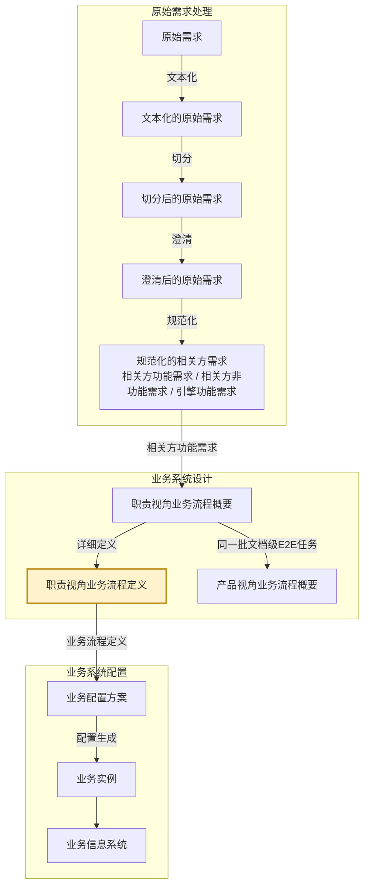

# eos-biz01cr · 职责视角业务流程概要 → 职责视角业务流程定义
**SKILL 指南ID**：biz01cr-rbpl2rbpd

> **本文件是什么**：本文件是 EOS 设计线业务路径环节三（详细定义）的 SKILL 指南。本任务的输入文档 X 是职责视角业务流程概要，输出文档 Y 是职责视角业务流程定义。本任务把 X 深化成 Y，写出各级节点在信息系统界面与数据上的需求。
>
> **命名约定**：本文件内不设任务代号与文档编号简称——文档一律称其本名，如「职责视角业务流程概要」「职责视角业务流程定义」；相邻任务按链上位置称呼，如「原始需求处理」「职责视角业务流程任务」「产品视角业务流程任务」「业务配置方案任务」「引擎能力设计任务」。
>
> **自足声明**：本任务的过程判据就地成文；其余一律引权威单源——
>
> - **[91 号规范《EOS平台-业务-引擎规范》](91-eos-biz-eng-spec.md)**：领域设计模式、页面组件与交互模型 §1、产品数据文档结构 §11、Skill 运行时协议 附录A
> - **[94 号文档《EOS 系统设计产品数据分解结构》](94-eos-sys-dev-dbs.md)**：各产品数据的树形与各级语义
> - **[00-doc-conventions《文档编写约定》](../../../00-generalspec/00-doc-conventions.md)**：表达风格 §八、Skill 文档操作流程 Step 布局约定 §十三
>
> **创建**：2026-09-16 | **版本**：第 29 版

---

## 一、目的与目标

### 1.1 主要目的

> 把职责视角已归拢的这批业务，在说明级之上写出各级节点在信息系统界面与数据上的需求，使业务需求能在信息系统上可以实现。

### 1.2 在设计链上的位置

EOS 业务设计链由需求到方案逐对生成，相邻两份产品数据构成一个**需求-方案对**；链分**原始需求处理**、**业务系统设计**、**业务系统配置**三个阶段，逐阶段把上一阶段的产出转成下一阶段的产品数据：

**图1-1：业务设计链与本任务的位置**



本任务把**职责视角业务流程概要**深化成**职责视角业务流程定义**。

- **本任务所在的阶段**：业务系统设计，业务设计链的第二阶段。
- **本任务所在的需求-方案对**：业务设计链的第二阶段的第一个需求-方案对——需求侧是相关方需求，方案侧是业务流程。
- **本任务所在的环节**：业务设计链的第二阶段的环节三。框架与概要在上游那一处合做，环节一与环节二并作一环；本任务做的是最后一环，这一环没有并列任务分担。
- **本任务**：单独做这一环——把概要的各级节点深化到详细定义。它的输入 X 是职责视角业务流程概要，产出 Y 即职责视角业务流程定义。

这棵 R 树有三种详细程度不同的形态——**框架**最浅、**概要**居中、**定义**最深。三个形态都是方案，都不占需求-方案对的一端。上游交出的是概要，本任务交出的是定义，也就是在概要之上，再写出各级节点**在界面与数据上的需求**。

**详细定义的落点是界面**——R 树各级节点各有它的界面落点：业务域、相关方角色两级落在菜单上，分别是**一级菜单**与**二级菜单**，两级合称**非末级菜单**；岗位级E2E业务、文档级E2E任务、任务节点、用例场景四级落在岗位标签页、窗口标签页、表单标签页、功能操作项上，其中岗位级E2E业务同时是**三级菜单**、也是**末级菜单**，末级菜单与岗位标签页一对一。**职责级E2E业务没有界面落点**，本任务不深化它。所以定义只做职责视角，产品视角那一份止于概要，没有定义形态。

在本任务处理过程中，有一个步骤需要人类介入：**Step 3**——讨论并确认方案、裁决引擎能力对照检出的缺口候选。

没讨论完的方案留在 `待确认方案`，由下一轮接着讨论；人类确认之后，方案的状态推进到 `可以srb设计`。

### 1.3 主要目标

本任务在已有的职责视角业务流程概要上，把 X 已就位的各级节点深化到需求定义：逐级写出这一级在界面与数据上的需求，再逐级对照平台引擎的能力清单查缺口。目标有七项：

1. **定义菜单需求**：针对选定的业务域、相关方角色，或岗位级E2E业务，分别定义一级菜单、二级菜单、三级菜单名称及其可见性需求。
2. **定义岗位标签页需求**：针对选定的岗位级E2E业务，定义其对应岗位标签页的名称、可见性，以及其构成窗口标签页秩序等需求。
3. **定义窗口标签页需求**：针对选定的文档级E2E任务，定义其对应的窗口标签页的名称、封面映射、正文实体结构、数据权限、支撑引擎校验权威值与显示模式等需求。
4. **定义表单标签页需求**：针对选定的任务节点，定义其对应的表单标签页的名称、表单字段、处理角色、可执行动作、状态变迁、页面间流转规则与支持信息引用等需求。
5. **定义功能操作项需求**：针对选定的用例场景，定义其对应的功能操作项的形态与出现位置、可用条件与执行结果等需求。
6. **定义需求实现支撑引擎**：针对选定的各层级节点，给出兑现本级需求所需的引擎能力——精确到**配置单元与配置信息组**；再对照平台引擎的能力清单，查已有引擎的缺口，接不住的记 `[引擎缺口]`、补成引擎类补充原始需求材料交回原始需求处理。
7. **写回与推进**：要素齐备、检验结论写进节点；人类确认之后写回并推进状态，受理下游的退回与上游的变更。

### 1.4 与上下游的衔接

**表1-1：与上下游的衔接**

| 方向 | 任务 | 交接内容 |
|------|------|---------|
| 上游，X 的来源 | 职责视角业务流程任务 | 产出 X：R 树——业务域 → 相关方角色 → 职责级E2E业务 → 岗位级E2E业务 → 文档级E2E任务 → 任务节点 → 用例场景；各级节点到说明为止，末三级带内联稳定标签；节点状态置 `可以srb设计` |
| 回向，补缺出口 | 原始需求处理 | 收本任务交出的引擎类补充原始需求材料，加工成引擎能力功能需求条目后归引擎路径 |
| 下游 | 业务配置方案任务 | 取本任务交出的**职责视角业务流程定义**（根到叶，各级带详细定义），产出**业务配置方案**；并把 FR-BIZ 指标分配到引擎与配置单元 |
| 同级 | 引擎能力设计任务 / 非功能需求设计任务 | 各自处理引擎能力功能需求 / 非功能需求 |
| 上游，并列任务 | 产品视角业务流程任务 | 与职责视角业务流程任务合占上游那一环；它交出的那份止于概要，本任务不取它的产出 |
| 产品数据 | 职责视角业务流程概要（X）／职责视角业务流程定义（Y） | 本任务读 X、写 Y |

> **下游逐级取用**：本任务交出的定义根到叶，每一级都作业务配置的输入——菜单、岗位级E2E业务方案、输出文档实体、正文功能表单、表单标签页序列、任务关系，各对着其中某一级。X 各级只到说明，供不出这些内容。

---

## 二、输入文档结构及规则

输入文档（X）是职责视角业务流程概要，与 Y 同属需求-方案对的方案侧，是同一条产品数据的概要形态。

X 由**职责视角业务流程任务**产出。它的结构、字段与读写约定，出处是 91 号规范 §11 与职责视角业务流程概要数据文件自身。下图是这棵树的展开。

**图2-1：职责视角业务流程概要树**

```
职责业务 ──── 根
└── 业务域 ──── ①
    └── 相关方角色 ──── ②
        └── 职责级E2E业务 ──── ③
            └── 岗位级E2E业务 ──── ④
                └── 文档级E2E任务 ──── ⑤
                    └── 任务节点 ──── ⑥
                        └── 用例场景 ──── ⑦
```

**表2-1：X 树各级节点的意义**

| 级 | 节点 | 意义 |
|----|------|------|
| ① | 业务域 | 企业运营体系顶层按业务职能领域对其业务所作的结构分解，落在业务流程 1 级。一个业务域是围绕同一职能领域的一组业务流程与业务能力的逻辑聚类，域内聚合若干端到端项目业务 |
| ② | 相关方角色 | 在 EOS 上履职的业务运行角色，是业务对象生命周期的主推动者：提出需求、负责完成、确认结果。业务对象与主责角色一一对应，其余参与角色为配合角色，不另立节点 |
| ③ | 职责级E2E业务 | 一个相关方角色承担的职责清单，由该角色下的多个岗位级E2E业务聚类而成。它是 R 树上唯一不出自文档级E2E任务属性的一级，随职责视角业务流程概要演进 |
| ④ | 岗位级E2E业务 | 一个主责角色的一个业务对象闭环，即职责级E2E业务中的一项端到端业务。归入哪些文档级E2E任务由端到端定：执行类从接收需求到需求被确认得到满足；管理类按计划→监控→分析→纠正完成一轮 |
| ⑤ | 文档级E2E任务 | 开发或生成文档的E2E业务，从接到文档需求开始到开发或生成满足需求的文档结束，文档级E2E任务一般包括多个步骤。一份文档（或其中一个专业内容）的开发或生成业务由单个员工承担，因此也被看做是个人级E2E业务。它的类型分正式与轻量，判据是有没有独立于正文 CRUD 的生命周期——需要审批流转、版本追溯、派发验收或独立状态变迁的，是**正式文档**，有封面实体；都不需要的，是**轻量文档**，无封面、正文即文档。在信息系统中对应一个窗口标签页 |
| ⑥ | 任务节点 | 文档级E2E任务一般由一个主责角色负责开发或生成，并由多个参与角色负责其他工作，比如验证、审批等，每个角色的工作被看做一个步骤，一个步骤就是一个任务节点。在信息系统中对应一个表单标签页。在 R 树上是**枝梢节点**，也就是框架的最深一级 |
| ⑦ | 用例场景 | 文档任务中的主责角色或参与角色在信息系统上开展自己负责的工作时，其操作表单标签页上提供功能按钮（右键操作项，或快捷键操作）所对应的业务。在 R 树上是**叶节点**，也就是概要的末级 |

> **五个坐标随文档级E2E任务携带、不占级位**：所属业务域、所属主责角色、所属岗位级E2E业务、所属产品级E2E业务、所属构件级E2E业务随这一级节点一起携带，不各占一级。它们是 R 树与 P 树两棵树的坐标——前三项在 R 树上定位本任务名下的各级，后两项由产品视角业务流程任务取用。

> **同一个节点可对应多条上游需求**：相关方需求整合上 R 树时，落在同一节点名下的多条汇聚成该节点的一段**需求说明**；需求说明只挂在文档级E2E任务及其下两级，**跨批追加不覆盖**。

> **各级只到说明**：X 从根到叶，各级节点都写到说明为止——本级是什么、做什么，一句话说清；界面与数据上的需求一概不写，那是本任务的活。

> **概要里叶已是树节点**：用例场景在 X 里就是说明级树节点，带内联稳定标签，作概要到定义的追溯键。

> **平台侧的 R 树**：各业务域走各业务域的 R 树；平台自身的治理业务走**平台侧的 R 树**——同一棵 R 树在「平台本身」这一侧**少「职责级E2E业务」一级**：业务域 → 相关方角色 → 岗位级E2E业务 → 文档级E2E任务 → 任务节点 → 用例场景，因为业务配置角色不按角色类型再归纳。X 里预置的治理节点 `bpd-biz-GOV-*` 即平台侧场景，本任务对其照常深化，不另立一套写法。

---

## 三、输出文档结构及规则

输出文档（Y）是职责视角业务流程定义，与 X 同属需求-方案对的方案侧，是同一条产品数据的定义形态，即 X 的整棵树加上各级节点的需求详细定义。

### 3.1 Y 的树形结构与各级语义

Y 是 R 树的定义形态，一份文档，根到叶。**R 树（各业务域 · 业务运行职责视角）**回答「某角色在哪个场景、按什么序、处理哪些文档级E2E任务，在页面上怎么操作完成闭环」；在概要里只到说明为止的各级节点，到这里都带上详细定义——**职责级E2E业务没有界面落点，本任务不深化它**。同一批文档级E2E任务在 **P 树**里另有一面，由产品视角业务流程概要持有；**两树在文档级E2E任务这一级上认亲互指，同名同批**。

**Y 与 X 是同一棵树**：树的画法与各级节点的意义见图2-1 与表2-1。

> **实体归 X**：整棵 R 树的节点实体由职责视角业务流程概要持有，Y 是它们的定义形态；**认亲**由产品视角业务流程任务做。

### 3.2 Y 树各级节点需求定义实现规则

逐级写出的，是各级节点在信息系统界面与数据上的需求。平台的功能引擎按配置生成页面组件，页面本身不由本任务交出。逐级的需求定义实现规则见表3-2，各级要素见表3-3~表3-9。

**表3-2：R 树各级节点需求定义实现规则**

| 级 | 节点 | 实现规则 |
|----|------|---------|
| ① | 业务域 | **定义一级菜单需求**——菜单名、下挂的二级菜单与可见性等需求；**定义平台能力需求**——兑现它的配置单元与配置信息组需求 |
| ② | 相关方角色 | **定义二级菜单需求**——菜单名、下挂的末级菜单与可见性等需求；**定义平台能力需求**——兑现它的配置单元与配置信息组需求 |
| ③ | 职责级E2E业务 | **不定义**——该级没有界面落点，本任务不写它的需求；它随职责视角业务流程概要演进 |
| ④ | 岗位级E2E业务 | **定义末级菜单需求**——菜单名与可见性等需求；**定义岗位标签页需求**——名称、可见性与构成窗口标签页秩序等需求；**定义访问权限需求**——可进入的角色需求；**定义场景职责边界需求**——触发与自然终点等需求，值承 X；**定义平台能力需求**——兑现它的配置单元与配置信息组需求 |
| ⑤ | 文档级E2E任务 | **分析本级的需求说明**，**定义窗口标签页需求**——名称、封面映射、正文实体结构、数据权限、支撑引擎校验权威值与显示模式等需求；**定义平台能力需求**——兑现它的配置单元与配置信息组需求 |
| ⑥ | 任务节点 | **分析本级的需求说明**，**定义表单标签页需求**——名称、表单字段、处理角色、可执行动作、状态变迁、页面间流转规则与支持信息引用等需求；**定义平台能力需求**——兑现它的配置单元与配置信息组需求 |
| ⑦ | 用例场景 | **分析本级的需求说明**，**定义功能操作项需求**——有新增需求的，形态、出现位置、可用条件与执行结果等需求，其中形态取功能按钮、右键操作项或快捷键，并**定义平台能力需求**——兑现它的配置单元与配置信息组需求；**没有新增需求、只是复用 Y 上已有功能操作项的，只定义出现位置与可用条件等需求** |

- **需求来源分两段**：文档级E2E任务及其下两级**分析本级的需求说明**、逐级定义，取证与补足的分法见第四章的**需求说明分析规则**；其上各级的需求**由下级生成**，只到名称、可见性与所有者，不分析需求说明。
- **收敛自查**：父节点语义覆盖子节点语义之并，即覆盖完整；同层兄弟不重叠，即兄弟互斥。

### 3.3 Y 树各级节点的要素

写入 Y 的各级节点都带块头的三个字段（块ID、节点类型 bpd-biz、当前状态）与下列各表所列的要素。各表的「说明」写该节点自身是什么、做什么，与表2-1 的级语义不同；**岗位级E2E业务这一级以场景职责边界陈述当这一句**。

**表3-3：业务域**

| 要素 | 说明 |
|------|------|
| 名称 | 该业务域的域名 |
| 说明 | 一句话说清本域的业务边界 |
| 菜单 | 本域作**一级菜单**——菜单名、下挂的二级菜单、可见性 |
| 配置单元及配置信息组 | 兑现一级菜单的平台能力——由哪个配置单元、哪些配置信息组供应，引其名；平台没有的记 `[引擎缺口]` |

**表3-4：相关方角色**

| 要素 | 说明 |
|------|------|
| 名称 | 该角色在本域内的角色名 |
| 说明 | 一句话说清本角色是谁、主责哪个业务对象 |
| 菜单 | 本角色作**二级菜单**——菜单名、下挂的末级菜单、可见性 |
| 配置单元及配置信息组 | 兑现二级菜单的平台能力——由哪个配置单元、哪些配置信息组供应，引其名；平台没有的记 `[引擎缺口]` |

**表3-5：职责级E2E业务**

| 要素 | 说明 |
|------|------|
| 名称 | 该职责级E2E业务的名称 |
| 说明 | 一句话说清这份职责清单管哪些事 |
| 职责清单 | 本角色承担的职责条目 |

**表3-6：岗位级E2E业务**

| 要素 | 说明 |
|------|------|
| 类型 | 执行类或管理类 |
| 主责角色 | 本岗位级E2E业务的主推动者，与业务对象一一对应 |
| 访问权限需求 | 可进入本业务岗位标签页的角色 |
| 菜单 | 本业务作**末级菜单**——菜单名与可见性，菜单名即岗位标签页名 |
| 场景职责边界陈述 | 本岗位级E2E业务的边界——触发是什么、自然终点在哪 |
| 文档序列 | 该岗位级E2E业务下这批文档级E2E任务的处理序 |
| 任务间触发关系 | **文档之间与同一文档内**任务之间的启动关系——**触发条件**（上一任务走到什么状态）与**启动参数**（指派给谁、期限、初值、附件）；可任意类型互相触发 |
| 场景装配 | 岗位标签页由本业务名下的窗口标签页编排而成——收入哪些窗口标签页、按什么序 |
| 配置单元及配置信息组 | 兑现末级菜单与岗位标签页的平台能力——由哪个配置单元、哪些配置信息组供应，引其名；平台没有的记 `[引擎缺口]` |
| 完备性检查结果 | 入口检验与自检的结论 |
| 补充材料引用 | 缺口产出的补充原始需求材料 |
| 变更影响声明、版本号 | 本次改动波及哪些下游节点，以及本节点的版本 |

**表3-7：文档级E2E任务**

| 要素 | 说明 |
|------|------|
| 说明 | 一句话说清这份文档承载什么 |
| 需求说明 | 本节点名下的相关方需求，**整合成一段说明写在节点上、不挂指针**，多条汇聚成一条、**跨批追加不覆盖**；窗口标签页需求由它分析得出 |
| 名称 | 窗口标签页的名，承 X 的同名节点，不另拟 |
| 封面映射 | 正式文档走封面实体的字段映射；轻量文档无封面、正文即文档 |
| 正文实体结构 | 该文档正文的实体表与字段集，含类型与约束 |
| 支撑引擎校验权威值 | 本任务校验落定的值；存疑的仍标 `[推断]` |
| 配置单元及配置信息组 | 兑现这张文档的平台能力——支撑引擎之下由哪个配置单元、哪些配置信息组供应，引其名；平台没有的记 `[引擎缺口]` |
| 推理依据与补全说明 | 本节点哪些栏取到了证、取自需求说明的哪一句，哪些栏是补足的 |
| 数据权限 | 本张文档的角色与数据范围——角色由这份数据自身定谁看，与本业务岗位标签页的访问权限需求是两件事 |
| 窗口标签页显示模式 | 常规数据取列表／单据／指标；指标清单取图示·指标；看板清单取图示·看板 |
| 在文档序列中的位置 | 本岗位级E2E业务里这份文档排第几 |
| 内联稳定标签 | X 与 Y 上同一个节点的对上键——节点在本形态与概要形态之间靠它对上，下游凭它逐级追溯 |
| P 树归位记录 | 本张文档在 P 树上被归位到的节点 ID，以及该节点当前的状态值；尚未归位的为空 |

> **业务文档实现方式**：表3-7 的封面映射、正文实体结构、支撑引擎校验权威值、数据权限、窗口标签页显示模式五项合称，每张文档级E2E任务一段。

**表3-8：任务节点**

| 要素 | 说明 |
|------|------|
| 说明 | 一句话说清这一步做什么 |
| 需求说明 | 本节点名下的相关方需求，**整合成一段说明写在节点上、不挂指针**；表单标签页需求由它分析得出 |
| 任务类型 | 计划、流程或工单 |
| 名称 | 本步的名，承 X 的同名节点，不另拟 |
| 表单字段 | 本步这一页上应有的字段，名称级；承文档级E2E任务的正文实体结构，本步要填而正文里没有的一并列出 |
| 处理角色 | 本步由哪个角色办理 |
| 可执行动作 | 本步在表单标签页上可执行的动作 |
| 状态变迁 | 本步把该文档的状态从什么迁到什么 |
| 页面间流转规则 | 本步的表单标签页与同一文档其余各页之间的流转规则 |
| 支持信息引用 | 本步作业所依据的规范、指南、资源与 AI 提示词——引其名与位置，不复制内容 |
| 配置单元及配置信息组 | 兑现表单标签页与任务类型对应引擎的平台能力——由哪个配置单元、哪些配置信息组供应，引其名；平台没有的记 `[引擎缺口]` |
| 推理依据与补全说明 | 本节点哪些栏取到了证、取自需求说明的哪一句，哪些栏是补足的 |
| 内联稳定标签 | X 与 Y 上同一个节点的对上键——节点在本形态与概要形态之间靠它对上，下游凭它逐级追溯 |

**表3-9：用例场景**

| 要素 | 说明 |
|------|------|
| 说明 | 一句话说清这个场景操作用户在做什么 |
| 需求说明 | 本节点名下的相关方需求原文，**写在节点上、不挂指针**——叶是需求条目落得最细的一级；功能操作项需求由它分析得出 |
| 名称 | 本场景的名，取 X 的叶节点原文，不另拟 |
| 功能操作项 | 本场景对应的可点操作——形态（功能按钮／右键操作项／快捷键）与出现位置、**本操作项的可用条件**、执行结果；**复用 Y 上已有操作项的，只到出现位置与可用条件** |
| 配置单元及配置信息组 | 兑现功能操作项的平台能力——由哪个配置单元、哪些配置信息组供应，引其名；平台没有的记 `[引擎缺口]`。复用 Y 上已有操作项的，本栏不填 |
| 推理依据与补全说明 | 本节点哪些栏取到了证、取自需求说明的哪一句，哪些栏是补足的 |
| 内联稳定标签 | X 与 Y 上同一个节点的对上键——节点在本形态与概要形态之间靠它对上，下游凭它逐级追溯 |

> **可用条件含两面**：一是**角色**——谁能点这个操作项，与岗位级E2E业务那一级的访问权限需求同族，只是它管的是这一个操作项，不管能不能进工作区；二是**状态前提**——这份数据走到什么状态，它才可用。两面合起来才是可用条件，比「权限」宽。

> **配置单元与配置信息组各级都有，职责级E2E业务那一级除外，且只引用不设计**：它是兑现本级需求所需的平台能力，其能力边界、配置入口、配置要素与运行期输出由引擎路径设计（判据引 91 号规范 §3.3）。本任务只给出它是哪一个、哪几个——平台已有的引其名；平台没有的记 `[引擎缺口]` 并给**建议名**，名字作候选交引擎路径设计。

> **任务间触发关系挂在 ④，也写在 ④ 那一步**：转换自下而上，走到这一级时其下各任务节点已齐全；触发关系可能跨文档，只有 ④ 这一级同时看得到这批文档。

**移交承诺**

本任务把方案节点交给下游时，承诺节点达到：

1. 节点状态为 `可以srb设计`，且在人类「整体确认」之后；
2. 各表所列要素齐备——菜单、岗位标签页、窗口标签页、表单标签页、功能操作项五级已写实到位；
3. **每个叶都定义功能操作项需求**，内联稳定标签与 X 的叶节点逐一对上，可作下游的承接源；
4. 检验结论已写进节点；取证与补足的分野已登记在推理依据与补全说明；引擎类缺口已走补充材料回路，不是隐藏遗漏。

> **移交承诺就是下游任务的受理前提**：下游以要素清单与移交承诺为对照，可承接对象写在它第二章的输入文档结构里，门槛与检验写在它第五章的入口检验里。

---

## 四、输入到输出的过程及规则

一次转换按节点层级自下而上走五步：定义功能操作项需求，落在用例场景；定义表单标签页需求，落在任务节点；定义窗口标签页需求，落在文档级E2E任务；定义末级菜单与岗位标签页需求，落在岗位级E2E业务；定义非末级菜单需求，落在相关方角色与业务域。

各级需求的来源分两段：用例场景、任务节点、文档级E2E任务三级由分析本级的需求说明得出；岗位级E2E业务、相关方角色、业务域三级由下级生成——菜单的可见性由下级取并，岗位标签页的编排、文档序列与任务间触发关系都成于下级。

职责级E2E业务没有界面落点，不设步。

### 4.1 X 与 Y 的对应

X 与 Y 是同一条产品数据的两个形态，也是同一棵 R 树：级位逐级对上，都是七级；两侧每一对指向同一个节点，编号相同、名称相同。X 只写到说明，Y 写到详细定义，**逐级的深度不同**。

本任务不另做承接，也不另做分配——相关方需求在 X 那一处已随它的节点整合上树，成为**文档级E2E任务及其下两级**的需求说明；本任务做的是分析这些需求说明，自下而上写出定义。**形态之间不是承接**（[94 号文档 §1.4](94-eos-sys-dev-dbs.md)）——X 与 Y 深浅不同、同属一条产品数据，其间没有可拒收的交付物。

**需求说明分析规则**——文档级E2E任务及其下两级的定义由分析本级的需求说明得出，分**取证**与**补足**两半；其上各级不在此列，它们的值由下级生成。

- **取证**——拿本级的要素表逐栏问需求说明，看这句话答的是哪一栏。答得上的，那一栏的值就取自句中的成分：**动词**落可执行动作与功能操作项，**数据项名词**落表单字段与正文实体，**施动者**落处理角色，**前提从句**落可用条件，**结果从句**落执行结果，**状态词对**落状态变迁，**可见范围词**落数据权限。取证来的值可逐句回溯到需求说明，是本级定义里不标 `[推断]` 的那一半。
- **补足**——需求说明是业务语言，页面与数据上有些栏它天然不说，如封面映射、显示模式、页面间流转、控件形态。这些栏按各级的界面落点与业务语义补，补出来的一律标 `[推断]`。
- **三个出口**——需求说明里没有这句话的，归补足；这句话说的是别的级的事的，归那一级；这句话读不出，即术语含义、动作主体或边界范围不清的，标 `[需确认]` 交人类，不猜。

> **逐级同指**：X 的每一级在 Y 上都是同名的同一个节点，编号沿用 X 的；末三级另带内联稳定标签，也沿用 X 的。Y 不新增级、不新增节点、不改动名称与次序。

> **两端粗细不同**：本任务加的是各级节点**在界面与数据上的需求**——节点本身由 X 给出，本任务写足这些需求。

### 4.2 第一步 · 定义功能操作项需求

#### 转换过程

一次转换起于叶。上游交来的用例场景带着它在 X 上的原文与**需求说明**；本步逐用例场景分析它的需求说明，写出它所在页上的需求。

1. 分析本级的需求说明——使用**需求说明分析规则**，取证与补足分记。
2. 定义功能操作项需求——形态、出现位置、可用条件与执行结果等需求；使用**功能操作项写实规则**。
3. 定义平台能力需求——使用**引擎化规则**；本叶作复用档的，这一项不写。

本步定义这批用例场景的功能操作项需求，内联稳定标签随叶携带。

#### 转换规则

**功能操作项写实规则**——一个用例场景对应一个功能操作项，不多不少。**叶分两档**：本叶的需求说明**没有新增需求**、即它要的能力在 Y 上已有功能操作项兑现的，作**复用档**——形态与执行结果都随那个已有操作项，本步只定义出现位置与可用条件，**不给出配置单元与配置信息组**；**有新增需求**的，作**新增档**——形态取功能按钮、右键操作项或快捷键，出现位置、可用条件与执行结果都定义，并按**引擎化规则**给出配置单元与配置信息组。两档的取值都按**需求说明分析规则**从本级的需求说明里取证、取不到的归补足并标 `[推断]`；**可点它的角色属可用条件之一，也在这里定**。叶的名称、次序与内联稳定标签由 X 给出，照搬不改；本任务不新增叶节点，发现应有而未被列出的叶，标 `[需确认]` 交人类，不就地新增。

**引擎化规则**——逐级**定义平台能力需求**，沿**引擎 → 配置单元 → 配置信息组**三级落下去：先定兑现本级需求的是哪个引擎，再定该引擎之下由哪个配置单元供应，最后定该配置单元里由**哪些配置信息组**兑现这一项需求，引其名；平台没有的记 `[引擎缺口]` 并给**建议名**，缺口写到配置信息组这一级。

### 4.3 第二步 · 定义表单标签页需求

#### 转换过程

叶落定之后，本步逐任务节点分析它的需求说明，写出它这一页上的需求，并把同一文档的若干页排成序列。

1. 分析本级的需求说明——使用**需求说明分析规则**，取证与补足分记。
2. 逐任务节点定义表单字段需求——这一页上应有的字段，名称级；使用**表单字段规则**。
3. 逐任务节点定义处理角色、可执行动作与状态变迁等需求——使用**表单标签页写实规则**。
4. 定义页面间流转需求——同一文档下各表单标签页之间的流转；使用**表单标签页序列规则**。
5. 逐任务节点定义支持信息引用需求——使用**支持信息引用规则**。
6. 定义平台能力需求——使用**引擎化规则**。

本步定义这批任务节点的表单标签页需求。

#### 转换规则

**表单字段规则**——与文档级E2E任务的正文实体结构**同源于 X 的正文实体类型**：那一级展开整体，本步只取这一页上应有的字段，名称级；本步要填而正文里没有的字段一并列出，**该文档的正文实体结构在下一步把这些字段并进去**；取不到的归**需求说明分析规则**的补足并标 `[推断]`。

**表单标签页写实规则**——一个任务节点对应一张表单标签页，不并页、不拆页；**表单标签页的名承 X 的同名节点，不另拟**。X 这一级只到名称与说明，处理角色、可执行动作与状态变迁由本任务按**需求说明分析规则**从本级的需求说明里取证，取不到的归补足并标 `[推断]`。**处理角色 ⊇ 本节点之下各用例场景的可点角色；可执行动作即本节点之下各功能操作项之并**——叶先定，本步认得它们。

**表单标签页序列规则**——同一文档的若干表单标签页按任务节点的顺序构成序列，页与页之间的流转规则由本任务写足。

**支持信息引用规则**——逐任务节点写出本步作业所依据的规范、指南、资源与 AI 提示词，**引其名与位置、不复制内容**；没有的留空。

### 4.4 第三步 · 定义窗口标签页需求

#### 转换过程

页落定之后，本步逐张文档级E2E任务分析它的需求说明，写出它的窗口标签页需求。

1. 分析本级的需求说明——使用**需求说明分析规则**，取证与补足分记。
2. 逐文档定义窗口标签页名称需求——名承 X 的同名节点，不另拟。
3. 逐文档定义封面映射需求——使用**封面映射规则**。
4. 逐文档定义正文实体结构需求——使用**正文实体结构规则**。
5. 逐文档定义数据权限需求——使用**数据权限规则**。
6. 逐文档定义支撑引擎校验权威值需求——使用**支撑引擎校验权威值规则**。
7. 逐文档定义窗口标签页显示模式需求——使用**窗口标签页显示模式规则**。
8. 逐文档定义平台能力需求——使用**引擎化规则**。

本步定义这批文档级E2E任务的窗口标签页需求。

#### 转换规则

**封面映射规则**——读该文档在 X 上的类型：正式文档走封面实体的字段映射；轻量文档无封面，正文即文档。类型判据见表2-1 的正式／轻量一项。

**正文实体结构规则**——承 X 的正文实体类型，逐文档展开为实体表与字段集，含类型与约束；**任务节点那一步在页上列出的字段在这一步并进来**；X 未给的、本步推断的标 `[推断]`。

**数据权限规则**——逐文档定它的角色与数据范围。角色由**该文档自己的性质**定——谁看这份数据；数据范围指行级范围。它与岗位级E2E业务那一级的访问权限需求是两件事，后者管能不能进这个工作区。

**支撑引擎校验权威值规则**——X 给的支撑引擎候选一律是 `[推断]`；本任务在定义的上下文里校验，确认／修正／推翻，落定为本任务给出的校验权威值，仍存疑的标 `[推断]`。X 未给候选的，按文档类型推出，同样标 `[推断]`。落定值下游据此分配指标。

**窗口标签页显示模式规则**——按该文档正文的数据源类型定：常规数据取列表／单据／指标三档；指标清单取图示·指标；看板清单取图示·看板。档次出自 91 号规范 §1.1.1。

### 4.5 第四步 · 定义末级菜单与岗位标签页需求

#### 转换过程

文档与页都落定之后，本步给岗位级E2E业务这一级写出它的两面：一面作末级菜单，一面作岗位标签页。一条岗位级E2E业务对应一页岗位标签页。

1. 定义场景职责边界需求——触发与自然终点等需求，值承 X，本任务不另定。
2. 定义访问权限需求——可进入本业务岗位标签页的角色需求；使用**访问权限需求规则**。
3. 定义末级菜单需求——菜单名与可见性等需求，菜单名即岗位标签页名；使用**末级菜单规则**。
4. 定义文档序列需求——本业务名下这批文档级E2E任务的次序；使用**文档序列规则**。
5. 定义场景装配需求——岗位标签页由哪些窗口标签页、按什么序编排；使用**场景装配规则**。
6. 定义任务间触发关系需求——触发条件与启动参数等需求；使用**任务间触发关系规则**。
7. 定义平台能力需求——使用**引擎化规则**。

本步定义该岗位级E2E业务的末级菜单与岗位标签页需求，以及这批文档级E2E任务的文档序列。

#### 转换规则

**访问权限需求规则**——可进入本业务岗位标签页的角色：取本业务的主责角色，并含其下各任务节点的处理角色之并。这个集合就是本业务岗位标签页与末级菜单的**可见性**——一处定值，两处落点。

**末级菜单规则**——本业务作末级菜单：写出它的菜单名；可见性取本业务的访问权限需求。

**文档序列规则**——这批文档级E2E任务的次序：执行类按输入-输出传递链排列，管理类按计划→监控→分析→纠正循环排列。X 已排定的照此复核，失配的改正；本任务不另立序。次序落定后，各张文档在表3-7 的**在文档序列中的位置**栏记下自己的序号。

**场景装配规则**——岗位标签页由它名下的窗口标签页按**文档序列**编排而成；页面侧说它的**构成窗口标签页秩序**，指的就是这个次序。

**任务间触发关系规则**——**文档之间与同一文档内**任务之间的启动关系：**触发条件**（上一任务走到什么状态）与**启动参数**（指派给谁、期限、初值、附件）；可任意类型互相触发。两头都取自下级——触发条件看上一任务节点已定的状态变迁，启动参数看下一任务节点已定的处理角色。

### 4.6 第五步 · 定义非末级菜单需求

#### 转换过程

菜单的叶子落定之后，本步向上写成两级菜单的需求：先逐相关方角色，再逐业务域。

1. 逐相关方角色定义二级菜单需求——使用**非末级菜单规则**。
2. 逐业务域定义一级菜单需求——使用**非末级菜单规则**。
3. 逐节点定义平台能力需求——使用**引擎化规则**。

本步定义二级菜单与一级菜单的需求，两级合称非末级菜单需求。

#### 转换规则

**非末级菜单规则**——相关方角色作二级菜单、业务域作一级菜单；各写出菜单名与它下挂的下一级菜单；两级的可见性均由下一级菜单的可见性取并得出。

### 4.7 修订转换、变更影响声明与影响面复查

一条岗位级E2E业务的定义不止来一批；X 汇入新版本时，本任务在这一节里定改哪一层、改到什么程度。

**修订转换规则**——该节点在 Y 上已有定义的，改动按本条落；尚无定义的，本任务写一条定义。概要与定义同为一棵树的两个形态，节点编号相同，故变更以节点为粒度落地：X 的新版本大于本任务消费的版本时，比对节点的版本差，按变更影响声明的分型增量写实或重组。**引擎判定变更**是本任务独有的一档——本次汇入改动某张文档的正文特征，它的支撑引擎校验权威值随之改变，处置是更新该值，不新增文档。

**变更影响声明规则**——本次有修订时，本任务按 [91 号规范 §A.7.2](91-eos-biz-eng-spec.md) 判变更类型，按 §A.7.3 的格式写入节点末尾。

**影响面复查规则**——判为修订型或结构型的，本任务复查被改动节点之下已写实的部分是否失配；失配的批量重写实或回退。

---

## 五、执行步骤及检验规则

一次运行起于 Step Start，依次走 Step 1~4 的设计动作，收于 Step End。

**表5-1：Step 布局总览**

| Step | 名称 | 职责 | 人类参与 | 执行模式 | 产出 | 写资产 |
|------|------|------|---------|---------|------|--------|
| Start | 前置校验与路由 | 受理门槛校验、检出待处理的节点、按状态路由 | 无（AI 自动） | 统一 | 就绪 / 结束 | — |
| 1 | 设计材料加载 | 读待处理的节点、同域存量定义节点、平台引擎的能力清单 | 无（AI 自动） | 统一 | 设计材料全景 | — |
| 2 | 逐级定义需求 | 按层级自下而上定义各级需求；逐级对照平台引擎的能力清单，接不住的检出为缺口候选 | 无（AI 产出，之后对话反馈） | 统一 | 各级需求定义 + 缺口候选 | — |
| 3 | 反馈处理 | 列出未确认清单、讨论修改；裁决缺口候选；要素机械检查后确认 | **有**——讨论修改 / 整体确认 / 裁决候选去留 | 对话 | 确认结论 + 缺口裁决结论 + 未确认清单 | — |
| 4 | 写回与落账 | 写回产品数据、回写 X 的节点状态、推进状态、提交基线 | 无（AI 自动） | 统一 | 状态推进 + 基线 | 职责视角业务流程定义、职责视角业务流程概要 |
| End | 运行结束输出 | 三区摘要输出 + 人类下一步操作提示 | **有**——查看摘要、对话反馈 | 对话 | 行动清单 | — |

### 5.1 Step Start · 前置校验与路由

**处理对象**——入口检出待本任务处理的节点，取两处。**X 这一处**：处于 `可以srb设计` 或 `待补充srb设计` 的节点——**可落在任意一级**，落在哪一级就做那一级的档，其下级是另一次运行的事；状态为 `待补充srb设计` 的，即 X 汇入的版本大于本任务消费的版本，按上游的变更影响声明分型读增量部分。**Y 这一处**：状态为 `需biz01cr修订` 的节点，即下游检出缺陷退回的，本任务捡起它、按修订转换处理。**职责级E2E业务不在其列**——该级没有界面落点，本任务不认领它，其状态随职责视角业务流程概要演进，由那一处维护。

**共用祖先写一次**——业务域与相关方角色两级是同一批岗位级E2E业务共用的祖先，两处各写一次供全批沿用，不逐批重写；本轮新输入使它们的下挂菜单或可见性发生变化的，按 Step 3 的**清除条件**重新认领。

**上一轮未确认的遗留方案**——入口还检出状态停在 `待确认方案` 的方案节点，它们是上一轮没讨论完留下的，可以分布在 Y 的任意位置。它们不作本轮的生成对象，只与本轮新生成的方案、本轮检出的缺口候选一并交 Step 3 的对话讨论确认。

受理门槛如下，逐条判；不满足条件的，按「判定」「动作」两列处置。

**表5-2：受理门槛（对 X）**

| 校验条件 | 判定 | 动作 |
|---------|------|------|
| 节点状态 ≠ `可以srb设计` 且 ≠ `待补充srb设计` | 不可处理 | 输出当前状态 → 退出 |
| 节点为职责级E2E业务——该级没有界面落点，本任务不深化 | 路由错误 | 输出本任务受理范围 → 退出 |
| 用例场景缺内联稳定标签，或同层重号 | 软提示 | 该节点挂 `[需确认]`，其余照常 |
| 用例场景与所属任务节点不同指一个业务对象 | 软提示 | 该节点挂 `[需确认]`，其余照常 |
| 承接的业务功能需求条目与叶对不上——某条承接在叶定义里找不到落点 | 软提示 | 该节点挂 `[需确认]`，其余照常 |
| 无待处理节点 + 无上一轮未确认的方案 | 无待处理对象 | 输出提示 → 退出 |

R 树的组装权在职责视角业务流程任务的手里：业务域、相关方角色、职责级E2E业务、岗位级E2E业务、文档序列、文档级E2E任务及其下两级的落位，都由它制定并执行，**本任务不重新长 R 侧干枝，也不重新界定边界**。

**状态推进与退回**——本任务写入 `待确认方案`／`可以srb设计`／`待补充srb设计` 三个状态；`在srb设计`／`已srb设计` 与 `需biz01cr修订` 由下游写入，后者是下游检出缺陷、把节点退回本任务时的值。Start 按状态路由，Step 4 在写回时推进。**本任务不外退**——X 与 Y 是同一条产品数据的概要形态与定义形态，其间不是承接、没有可拒收的交付物，故没有退回上游这一路；本任务处理中的缺陷出口有三条：判得出的按**需求说明分析规则**取证，取不到的归补足并标 `[推断]`；判不准或自相矛盾的挂 `[需确认]` 或 `[需裁决]` 随方案交 Step 3；平台接不住的记 `[引擎缺口]` 走回向补料。

上游变更，即概要汇入新版本，按状态分流：

- `可以srb设计`→版本递增，节点尚未被下游消费；
- `在srb设计`→版本递增，按增量处理；
- `已srb设计`→`待补充srb设计`→本任务补全。

### 5.2 Step 1 · 设计材料加载

本步每轮都走。

**读取设计材料**——读的是三处。**X 这一处**：本次认领的节点，及其所在岗位级E2E业务名下的文档级E2E任务、任务节点、用例场景，连带各节点的说明、需求说明与内联稳定标签。**Y 这一处**：同一岗位级E2E业务或同域的存量定义节点。**平台引擎这一处**：引擎能力清单，供支撑引擎候选校验与引擎能力对照。X 是本任务唯一的外部输入，R 树即资产、就在本任务的产出里，不另读资产文档。加载按读取协议执行——处理节点优先、逐节点加载、按需扩大，不默认加载全文。

**产出去向**——设计材料全景交 Step 2 逐级定义需求。**本步无人类参与点**。

**失败处置**——节点 ID 定位不到、或 X 与 Y 的同名节点对不上的，该节点挂 `[需确认]` 交 Step 3 的对话讨论，其余节点照常。

### 5.3 Step 2 · 逐级定义需求

入口检出待本任务处理的节点时，本步就走；没有的时候，本步不走。

**逐级定义需求**——对本次认领的节点，按各自所在的层级自下而上逐级定义：层级数大的先做，同一层级内一并做。一次运行认领到哪一级，就走第四章对应的那一步；层级高的节点的需求由层级低的合成——菜单的可见性由下级取并，岗位标签页的编排、文档序列与任务间触发关系都成于下级——下级未定义到位则本级无据可依，下级是另一次运行的事。五步与层级的对应如下：

1. 分析本级的需求说明，定义功能操作项需求——使用**需求说明分析规则**、**功能操作项写实规则**与**引擎化规则**。
2. 分析本级的需求说明，定义表单标签页需求——使用**需求说明分析规则**、**表单字段规则**、**表单标签页写实规则**、**表单标签页序列规则**、**支持信息引用规则**与**引擎化规则**。
3. 分析本级的需求说明，定义窗口标签页需求——使用**需求说明分析规则**、**封面映射规则**、**正文实体结构规则**、**数据权限规则**、**支撑引擎校验权威值规则**、**窗口标签页显示模式规则**与**引擎化规则**。
4. 定义末级菜单与岗位标签页需求——使用**访问权限需求规则**、**末级菜单规则**、**文档序列规则**、**场景装配规则**、**任务间触发关系规则**与**引擎化规则**。
5. 定义非末级菜单需求——使用**非末级菜单规则**与**引擎化规则**。

**本侧特有两处**：一是窗口标签页的显示模式按数据源类型定，指标与看板两档还要看它挂在哪张清单文档上；二是用例场景这一级取 X 的叶节点原文，不另拟名，本任务不新增叶节点。

**本步的关口**——定义到位之后就地在本次认领的范围内核三样，核出的问题按各自的出口处置，不静默通过：

- **叶的对上**——每个用例场景都已定出功能操作项需求，内联稳定标签与 X 的叶节点逐一对上，一个不少，可作下游的承接源。
- **树收敛自查**——有新增或改进时自下而上调树至收敛，判据是覆盖完整 + 兄弟互斥，实例化为界面闭合；无法调整收敛的标 `[需裁决]` 随方案一并交 Step 3，不自定架构。
- **引擎能力对照**——逐级定义时按**引擎化规则**给出的配置单元与配置信息组，本身就是对平台能力的一次逐节点对照：叫得出名的即平台接得住，使本任务的产出既是对下游的需求，也是对平台能力的台账；叫不出名的记 `[引擎缺口]`，缺口写到配置信息组这一级。对照的判据引 [91 号规范 §4.4](91-eos-biz-eng-spec.md) 的扩展规则，引用数据即平台引擎的能力清单。缺口指向的是引擎能力、不是业务数据，故不挂在任何一棵树上。检出缺口即生成**引擎类补充原始需求材料**候选，随方案交 Step 3，去留由人类裁决。**本任务只出「接不住」这一件事**——业务类的不确定不出材料，标 `[需确认]` 交 Step 3；本任务不脑补节点，也不代替引擎做设计。

**产出去向**——生成的方案与缺口候选都不作状态写入，随方案一并交 Step 3 讨论确认。**本步无人类参与点**。

**失败处置**——支撑引擎候选校验不出结论的、页面间流转规则判不出的，标 `[推断]` 交 Step 3 讨论；平台引擎的能力清单读不到的，该节点标 `[需确认]` 交 Step 3，不静默通过；其余照常。X 自身的缺陷不在本步补，按受理门槛处置。

### 5.4 Step 3 · 反馈处理

本步每轮都走。本步讨论确认两件事——Step 2 刚生成的方案，以及状态停在 `待确认方案` 的遗留节点，两者处置一样；并就 Step 2 检出的缺口候选逐条裁决。

**未确认清单**——把本轮新生成的方案、状态为 `待确认方案` 的遗留节点，以及本轮检出的**引擎类补充原始需求材料**候选一并列出交人类讨论。这份清单就是本步的界面。

**逐条讨论与确认**——讨论中提出修改的，按讨论结果把方案改在 Y 上；人类确认后，方案转为已确认。确认的单位是节点——一份方案一条结论，可以逐份给，也可以一次全认。

**逐条裁决缺口候选**——每条候选写明它锚在哪一级、缺的是哪一样，逐条判「需要」即落地、判「不要」即废弃；落地与废弃都在 Step 4 落账。业务类的不确定不出材料，以 `[需确认]` 随清单一并交人类。

**写回前的要素机械检查**——逐节点检查要素非空，或属**合理空置**——还没到产生它的时点，即完备性检查结果与补充材料引用由后面的 Step 产生、P 树归位记录由下游的产品视角业务流程任务在归位时写入；标注齐备，含 `[推断]`／`[待下游推断]`。检查不过的就地补齐；无法补齐的说明它是结构性缺陷，回 Step 2 重排，不带不合的要素写回。**写归 Step 4**——本步只落确认结论与缺口裁决结论，写回动作与状态推进在 Step 4。

**本步的特化参数**：

- **锚点需求** = 节点累计承接的全部业务功能需求条目，跨批追加
- **操作条目** = 菜单需求 + 岗位标签页需求 + 窗口标签页需求 + 表单标签页需求 + 功能操作项需求 + 引擎类补充原始需求材料候选
- **推进目标** = `可以srb设计`
- **清除条件** = 已有定义的节点默认跳过。本轮新输入满足下列任一条件时，清除该节点的已定义标记、使其回到待处理：它是该节点的直接上游；它与该节点同属一个岗位级E2E业务且边界重叠；它导致该节点的定义被修订——业务域与相关方角色两级是共用祖先，靠本条在它们身上生效
- **级联触发条件** = 改动使岗位级E2E业务的边界或干枝发生拆分、合并 → 重验受影响节点的定义是否仍与 X 对得上，重验由**影响面复查规则**承担。改动超出本步可处理的范围 → 受影响的节点标 `[需重设计]`

**产出去向**——本步的确认结论与缺口裁决结论一并交 Step 4 落账。**人类参与点在本节**——讨论修改、整体确认与裁决候选去留。

**失败处置**——同一处反复退改超过一次的，停止处理，标 `[需重设计]` 留待下一轮。

### 5.5 Step 4 · 写回与落账

本步每轮都走，把确认结论与缺口裁决结论一次落账。

**写的是 Y**——职责视角业务流程定义：R 树即资产，写在 Y 里，不另立一册。写回时一并维护节点索引与状态，递增节点版本号。按确认结果分四种情形：

**表5-3：写回的四种情形**

| 对象 | 讨论结果 | 写回动作 |
|------|---------|---------|
| 本轮生成或修订的方案 | 已确认 | 写入，状态写 `可以srb设计` |
| 本轮生成或修订的方案 | 未确认 | 写入，状态写 `待确认方案`，留作下一轮的处理对象 |
| 遗留的待确认节点 | 已确认 | 推状态到 `可以srb设计`，方案本体按讨论结果改或不改 |
| 遗留的待确认节点 | 仍未确认 | 不动 |

**已被下游消费过的节点本次被修订**，写回时另按上游变更分流定状态：状态为 `可以srb设计` 或 `在srb设计` 的，维持原状态、版本递增；状态为 `已srb设计` 的，写 `待补充srb设计`，待本任务补全。

**也写的是 X**——本任务把 X 侧同名节点的状态随本轮一并刷新，使两处对得上。

**缺口落账**——判「需要」的缺口按**引擎类补充原始需求材料**成文，交原始需求处理补回；检验结论写入该岗位级E2E业务节点的完备性检查结果，材料写入补充材料引用。**变更影响声明**按 91 号规范 §A.7.2 判变更类型、按 §A.7.3 的格式写入节点末尾。

**提交基线**——写回动作与状态推进引 91 号规范 §A.3.3 与 §A.6。

**产出去向**——状态推进与基线交 Step End 汇总。**本步无人类参与点**。

**失败处置**——写回撞上节点 ID 冲突或同名节点不唯一的，停止写回、标 `[需确认]` 交下一轮的 Step 3 讨论，不半写。

### 5.6 Step End · 运行结束输出

本步只汇总本轮结果并给出下一步。

**三区输出**——第一区的状态与结果摘要行就地写实：

```text
当前状态：<待确认方案 / 可以srb设计>
  本轮 R 树定义：<新建 / 修订 / 版本变化 / 写实节点数>
  引擎能力对照：<通过 / 检出缺口 N 处>
  引擎类补充原始需求材料：<无 / YYYYMMDD-biz01cr-批次ID-引擎类补充原始需求材料.md>

一、未确认的方案
  <本轮未确认 N 份：节点名 + 状态；无则写「无」，下一轮运行接着讨论>

二、下一步
  本任务 → 选择新一批处于 `可以srb设计` 的节点重新运行
  下游    → 业务配置方案任务（取本任务交出的定义，根到叶）
```

**收尾**——更新产品数据文档的 `HEAD @上次 AI 运行`、提交基线。

**增量标记**——`[新增]`/`[变更]`/`[确认]`/`[需裁决]` 与 `[推断]`/`[待下游推断]`/`供人类确认` 的定义与使用按 [91 号规范 §A.3.1](91-eos-biz-eng-spec.md) 执行。本任务另用到三枚标记：`[需确认]` 与 `[需重设计]` 按 [91 号规范 §A.3.3 与 §A.5.3](91-eos-biz-eng-spec.md) 处理；`[引擎缺口]` 标引擎能力对照检出的缺口。本任务增量清单对操作条目逐条标注，并附检验结论行。

**自检清单**——一次运行收尾前，按本任务流程分组逐项核对：

- **受理与路由**
  - 受理门槛已校验通过，判为软提示的已挂 `[需确认]`。
  - 待处理的节点已按状态检出，`需biz01cr修订` 的已并入本次处理对象。
  - 上一轮未确认的遗留方案已并入 Step 3 的未确认清单。
  - 无待处理对象时本任务已退出。
- **材料加载**
  - 本次认领的节点、同域的存量定义节点、平台引擎的能力清单，都已按读取协议加载，不全载全文。
  - 用例场景的内联稳定标签齐备且唯一。
- **逐级定义需求**
  - 各级需求定义完成——菜单、岗位标签页、窗口标签页、表单标签页、功能操作项。
  - 各按第四章的规则给出，层级数大的先做：功能操作项按**需求说明分析规则**、**功能操作项写实规则**与**引擎化规则**；表单标签页按**需求说明分析规则**、**表单字段规则**、**表单标签页写实规则**、**表单标签页序列规则**、**支持信息引用规则**与**引擎化规则**；窗口标签页按**需求说明分析规则**、**封面映射规则**、**正文实体结构规则**、**数据权限规则**、**支撑引擎校验权威值规则**、**窗口标签页显示模式规则**与**引擎化规则**；末级菜单与岗位标签页按**访问权限需求规则**、**末级菜单规则**、**文档序列规则**、**场景装配规则**、**任务间触发关系规则**与**引擎化规则**；非末级菜单按**非末级菜单规则**与**引擎化规则**。
  - 叶的名称与次序照搬 X，未新增叶节点、未改动名称、未重排次序。
  - 支撑引擎校验权威值已落定，未留全量 `[推断]`。
  - 修订转换按**修订转换规则**执行，变更影响声明按**变更影响声明规则**执行，影响面复查按**影响面复查规则**执行。
  - 叶与详细定义已逐一对上，本次认领范围内无遗留的叶未定出功能操作项需求。
  - 树收敛，判据是覆盖完整加兄弟互斥，实例化为界面闭合。
  - 引擎能力对照已执行，接住的已引配置单元与配置信息组之名，接不住的已记 `[引擎缺口]` 并成候选，去留有人类裁决，**不脑补节点**。
- **Y 侧要素**
  - 每个业务域带齐菜单与配置单元及配置信息组。
  - 每个相关方角色带齐菜单与配置单元及配置信息组。
  - 每条岗位级E2E业务带齐访问权限需求、菜单、文档序列、任务间触发关系、场景装配与配置单元及配置信息组。
  - 每张文档级E2E任务带齐封面映射、正文实体结构、支撑引擎校验权威值、数据权限、窗口标签页显示模式、配置单元及配置信息组与内联稳定标签。
  - 每个任务节点带齐表单字段、处理角色、可执行动作、状态变迁、页面间流转规则、支持信息引用与配置单元及配置信息组。
  - 每个用例场景带齐功能操作项、配置单元及配置信息组与内联稳定标签。
  - 要素非空或合理空置。
- **确认与写回**
  - 要素机械检查已执行。
  - 方案已列全、逐条确认，含上一轮遗留的待确认节点。
  - 引擎类缺口候选已逐条裁决，判「需要」的已成文交原始需求处理补回，业务类的不确定已挂 `[需确认]`、不出材料。
  - 检验结论已写入完备性检查结果，材料已写入补充材料引用。
  - 确认结果已按表5-3 写回，已被下游消费过的节点已按上游变更分流落定状态与版本。
  - X 侧同名节点的状态已随本轮刷新，节点索引与版本号已维护。
- **收尾**
  - 三区摘要已输出，下一步已给出。
  - `HEAD @上次 AI 运行` 已更新，基线已提交。
