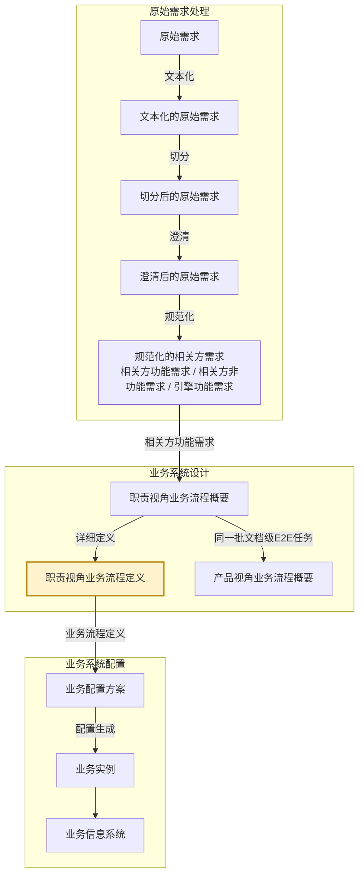

# eos-biz01cr · 职责视角业务流程概要 → 职责视角业务流程定义
**SKILL 指南ID**：biz01cr-rbpl2rbpd

> **本文件是什么**：本文件是 EOS 设计线业务路径环节三（详细定义）的 SKILL 指南。它说明本任务这一次转换：输入文档 X 是职责视角业务流程概要，输出文档 Y 是职责视角业务流程定义，转换规则是深化规则在本需求-方案对上的实例化。
>
> **命名约定**：本文件内不设任务代号与文档编号简称——文档一律称其本名，如「职责视角业务流程概要」「职责视角业务流程定义」；相邻任务按链上位置称呼，如「原始需求处理」「职责视角业务流程任务」「产品视角业务流程任务」「系统需求框架设计任务」「引擎能力设计任务」。
>
> **自足声明**：本任务的过程判据就地成文；其余一律引权威单源——
>
> - **[91 号规范《EOS平台-业务-引擎规范》](91-eos-biz-eng-spec.md)**：领域设计模式、页面组件与交互模型 §1、产品数据文档结构 §11、Skill 运行时协议 附录A
> - **[94 号文档《EOS 系统设计产品数据分解结构》](94-eos-sys-dev-dbs.md)**：各产品数据的树形与各级语义
> - **[00-doc-conventions《文档编写约定》](../../../00-generalspec/00-doc-conventions.md)**：表达风格 §八、Skill 文档操作流程 Step 布局约定 §十三
>
> **创建**：2026-09-16 | **版本**：第 19 版

---

## 一、目的与目标

### 1.1 主要目的

> 把职责视角已归拢的这批业务，在说明级之上深化到对信息系统界面与数据的具体要求，使业务需求能在信息系统上可以实现。

### 1.2 在设计链上的位置

EOS 业务设计链由需求到方案逐对生成，相邻两份产品数据构成一个**需求-方案对**；链分**原始需求处理**、**业务系统设计**、**业务系统配置**三个阶段，逐阶段把上一阶段的产出转成下一阶段的产品数据：

**图1-1：业务设计链与本任务的位置**



本任务把**职责视角业务流程概要**深化成**职责视角业务流程定义**。

- **本任务所在的阶段**：业务系统设计，业务设计链的第二阶段。
- **本任务所在的需求-方案对**：业务设计链的第二阶段的第一个需求-方案对——需求侧是相关方需求，方案侧是业务流程。
- **本任务所在的环节**：业务设计链的第二阶段的环节三。框架与概要在上游那一处合做，环节一与环节二并作一环；本任务做的是最后一环，这一环没有并列任务分担。
- **本任务**：单独做这一环——把概要的各级节点深化到详细定义。它的输入 X 是职责视角业务流程概要，产出 Y 即职责视角业务流程定义。

这棵 R 树有三种深浅不同的形态——**框架**最浅、**概要**居中、**定义**最深。三个形态都是方案的不同详细程度，都不占需求-方案对的一端。上游交出的是概要，本任务交出的是定义，也就是在概要之上，再写出各级节点**在界面与数据上的要求**。

**详细定义的落点是界面**——R 树各级节点各有它的界面落点：业务域与相关方角色两级落在菜单的一、二级分组上；岗位级E2E业务、文档级E2E任务、任务节点、用例场景四级落在一站式业务标签页、窗口标签页、表单标签页、功能操作项上，末级菜单与一站式业务标签页一对一。**职责级E2E业务没有界面落点**，本任务不深化它。所以定义只做职责视角，产品视角那一份止于概要，没有定义形态。

在本任务处理过程中，有两个步骤需要人类介入：

- **Step 3**——讨论并确认方案。
- **Step 4**——裁决覆盖自查检出的缺口候选。

没讨论完的方案留在 `待确认方案`，由下一轮接着讨论；人类确认之后，方案的状态推进到 `可以srb设计`。

### 1.3 主要目标

本任务在已有的职责视角业务流程概要上，把 X 已就位的各级节点深化到对信息系统界面与数据的具体要求：逐级补上这一级在界面与数据上的要求，再对深化的结果做覆盖检查、缺什么就补什么。目标有八项：

1. **写实菜单分组**：逐业务域写足对一级菜单分组的要求、逐相关方角色写足对二级菜单分组的要求——分组名与它下挂的分组；职责级E2E业务没有界面落点，本任务不深化。
2. **写实场景装配**：逐岗位级E2E业务写足对一站式业务标签页的要求——初始态单窗、双击下钻的分屏双窗、持续下钻的层级上限、面包屑导航；场景职责边界承接自上游，本任务不再重定；并排出该岗位级E2E业务下这批文档级E2E任务的**文档序列**。
3. **写实业务文档实现方式**：逐文档写足对窗口标签页的要求——封面映射、正文实体结构、支撑引擎**校验权威值**、数据权限与显示模式；并点出支撑这张文档的平台能力，即它的引擎、配置单元与配置信息组。
4. **写实表单标签页序列**：逐任务节点写足对表单标签页的要求——本页应有的**表单字段**、处理角色、可执行动作、状态变迁与页面间流转规则；同一文档的若干表单标签页按任务顺序构成序列；并写出任务之间的**触发关系**——触发条件与启动参数。
5. **写实叶定义**：逐用例场景取 X 的叶节点原文，写足对功能操作项的要求——形态、触发条件与执行结果；一个用例场景一个功能操作项，不多不少。
6. **逐级引擎化**：逐级给出兑现本级需求所需的引擎能力——精确到**配置单元与配置信息组**；再对照平台引擎的能力清单，查已有引擎的缺口，接不住的记 `[引擎缺口]`。
7. **覆盖检查与补充原始需求**：X 的每个叶都对上一个详细定义；**节点累计承接的**全部需求语义不超出其叶定义之并；缺口走补充材料回路，补成引擎类补充原始需求材料交回原始需求处理。
8. **写回与推进**：要素齐备、覆盖结论写进节点；人类确认之后写回并推进状态，受理下游的退回与上游的变更。

### 1.4 与上下游的衔接

**表1-1：与上下游的衔接**

| 方向 | 任务 | 交接内容 |
|------|------|---------|
| 上游，X 的来源 | 职责视角业务流程任务 | 产出 X：R 树——业务域 → 相关方角色 → 职责级E2E业务 → 岗位级E2E业务 → 文档级E2E任务 → 任务节点 → 用例场景；各级节点到说明为止，末三级带内联稳定标签；节点状态置 `可以srb设计` |
| 回向，补缺出口 | 原始需求处理 | 收本任务交出的引擎类补充原始需求材料，加工成引擎能力功能需求条目后归引擎路径 |
| 下游 | 系统需求框架设计任务 | 承接职责视角业务流程定义的**叶**，产出系统需求框架，末级枝梢为用例场景功能节点 |
| 同级 | 引擎能力设计任务 / 非功能需求设计任务 | 各自处理引擎能力功能需求 / 非功能需求 |
| 上游，并列任务 | 产品视角业务流程任务 | 与职责视角业务流程任务合占上游那一环；它交出的那份止于概要，本任务不取它的产出 |
| 产品数据 | 职责视角业务流程概要（X）／职责视角业务流程定义（Y） | 本任务读 X、写 Y |

> **下游承接的是叶**：本任务交出的定义里，用例场景这一级写足了功能操作项的要求，是下游逐级对上的承接源；X 的概要形态不供下游承接。

---

## 二、输入文档结构及规则

输入文档（X）是职责视角业务流程概要，为需求-方案对的需求侧文档。

X 由**职责视角业务流程任务**产出。它的结构、字段与读写约定，出处是 91 号规范 §11 与职责视角业务流程概要数据文件自身。下图是这棵树的展开。

**图2-1：职责视角业务流程概要树**

```
职责业务 ──── 根
└── 业务域 ──── ①
    └── 相关方角色 ──── ②
        └── 职责级E2E业务 ──── ③
            └── 岗位级E2E业务 ──── ④
                └── 文档级E2E任务 ──── ⑤
                    └── 任务节点 ──── ⑥
                        └── 用例场景 ──── ⑦
```

**表2-1：X 树各级节点的意义**

| 级 | 节点 | 意义 |
|----|------|------|
| ① | 业务域 | 企业运营体系顶层按业务职能领域对其业务所作的结构分解，落在业务流程 1 级。一个业务域是围绕同一职能领域的一组业务流程与业务能力的逻辑聚类，域内聚合若干端到端项目业务 |
| ② | 相关方角色 | 在 EOS 上履职的业务运行角色，是业务对象生命周期的主推动者：提出需求、负责完成、确认结果。业务对象与主责角色一一对应，其余参与角色为配合角色，不另立节点 |
| ③ | 职责级E2E业务 | 一个相关方角色承担的职责清单，由该角色下的多个岗位级E2E业务聚类而成。它是 R 树上唯一不出自文档级E2E任务属性的一级，随职责视角业务流程概要演进 |
| ④ | 岗位级E2E业务 | 一个主责角色的一个业务对象闭环，即职责级E2E业务中的一项端到端业务。归入哪些文档级E2E任务由端到端定：执行类从接收需求到需求被确认得到满足；管理类按计划→监控→分析→纠正完成一轮 |
| ⑤ | 文档级E2E任务 | 开发或生成文档的E2E业务，从接到文档需求开始到开发或生成满足需求的文档结束，文档级E2E任务一般包括多个步骤。一份文档（或其中一个专业内容）的开发或生成业务由单个员工承担，因此也被看做是个人级E2E业务。它的类型分正式与轻量，判据是有没有独立于正文 CRUD 的生命周期——需要审批流转、版本追溯、派发验收或独立状态变迁的，是**正式文档**，有封面实体；都不需要的，是**轻量文档**，无封面、正文即文档。在信息系统中对应一个窗口标签页 |
| ⑥ | 任务节点 | 文档级E2E任务一般由一个主责角色负责开发或生成，并由多个参与角色负责其他工作，比如验证、审批等，每个角色的工作被看做一个步骤，一个步骤就是一个任务节点。在信息系统中对应一个表单标签页。在 R 树上是**枝梢节点**，也就是框架的最深一级 |
| ⑦ | 用例场景 | 文档任务中的主责角色或参与角色在信息系统上开展自己负责的工作时，其操作表单标签页上提供功能按钮（右键操作项，或快捷键操作）所对应的业务。在 R 树上是**叶节点**，也就是概要的末级 |

> **各级只到说明**：X 从根到叶，各级节点都写到说明为止——本级是什么、做什么，一句话说清；对界面与数据的要求一概不写，那是本任务的活。

> **概要里叶已是树节点**：用例场景在 X 里就是说明级树节点，带内联稳定标签，作概要到定义的追溯键。

> **平台侧的 R 树**：各业务域走各业务域的 R 树；平台自身的治理业务走**平台侧的 R 树**——同一棵 R 树在「平台本身」这一侧**少「职责级E2E业务」一级**：业务域 → 相关方角色 → 岗位级E2E业务 → 文档级E2E任务 → 任务节点 → 用例场景，因为业务配置角色不按角色类型再归纳。X 里预置的治理节点 `bpd-biz-GOV-*` 即平台侧场景，本任务对其照常深化，不另立一套写法。

---

## 三、输出文档结构及规则

输出文档（Y）是职责视角业务流程定义，为需求-方案对的方案侧文档。

### 3.1 Y 的树形结构与各级语义

Y 是同一棵 **R 树**的定义，一份文档，根到叶。**R 树（各业务域 · 业务运行职责视角）**回答「某角色在哪个场景、按什么序、处理哪些文档级E2E任务，在页面上怎么操作完成闭环」；在概要里只到说明为止的各级节点，到这里都带上详细定义。同一批文档级E2E任务在 **P 树**里另有一面，由产品视角业务流程概要持有。两树经**认亲**互指，末三级同名同批。

**图3-1：R 树（各业务域 · 业务运行职责视角）**

```
职责业务 ──── 根
└── 业务域 ──── ①
    └── 相关方角色 ──── ②
        └── 职责级E2E业务 ──── ③
            └── 岗位级E2E业务 ──── ④
                └── 文档级E2E任务 ──── ⑤
                    └── 任务节点 ──── ⑥
                        └── 用例场景 ──── ⑦
```

**表3-1：R 树各级节点的意义**

| 级 | 节点 | 意义 |
|----|------|------|
| ① | 业务域 | 企业运营体系顶层按业务职能领域对其业务所作的结构分解，落在业务流程 1 级。一个业务域是围绕同一职能领域的一组业务流程与业务能力的逻辑聚类，域内聚合若干端到端项目业务 |
| ② | 相关方角色 | 在 EOS 上履职的业务运行角色，是业务对象生命周期的主推动者：提出需求、负责完成、确认结果。业务对象与主责角色一一对应，其余参与角色为配合角色，不另立节点 |
| ③ | 职责级E2E业务 | 一个相关方角色承担的职责清单，由该角色下的多个岗位级E2E业务聚类而成。它是 R 树上唯一不出自文档级E2E任务属性的一级，随职责视角业务流程概要演进 |
| ④ | 岗位级E2E业务 | 一个主责角色的一个业务对象闭环，即职责级E2E业务中的一项端到端业务。归入哪些文档级E2E任务由端到端定：执行类从接收需求到需求被确认得到满足；管理类按计划→监控→分析→纠正完成一轮 |
| ⑤ | 文档级E2E任务 | 开发或生成文档的E2E业务，从接到文档需求开始到开发或生成满足需求的文档结束，文档级E2E任务一般包括多个步骤。一份文档（或其中一个专业内容）的开发或生成业务由单个员工承担，因此也被看做是个人级E2E业务。它的类型分正式与轻量，判据是有没有独立于正文 CRUD 的生命周期——需要审批流转、版本追溯、派发验收或独立状态变迁的，是**正式文档**，有封面实体；都不需要的，是**轻量文档**，无封面、正文即文档。在信息系统中对应一个窗口标签页 |
| ⑥ | 任务节点 | 文档级E2E任务一般由一个主责角色负责开发或生成，并由多个参与角色负责其他工作，比如验证、审批等，每个角色的工作被看做一个步骤，一个步骤就是一个任务节点。在信息系统中对应一个表单标签页。在 R 树上是**枝梢节点**，也就是框架的最深一级 |
| ⑦ | 用例场景 | 文档任务中的主责角色或参与角色在信息系统上开展自己负责的工作时，其操作表单标签页上提供功能按钮（右键操作项，或快捷键操作）所对应的业务。在 R 树上是**叶节点**，也就是概要的末级 |

> **末三级与 X 同指，实体归 X**：文档级E2E任务、任务节点、用例场景三级与 X 指向同一张文档——X 给出这批节点，本任务给它们补详细定义。在 R／P 两棵树里它们是文档开发任务，在产品数据文件里是末三级实体的落位。三级的**实体由职责视角业务流程概要持有**，Y 这一份是它们的定义形态。**认亲**由产品视角业务流程任务做。

### 3.2 Y 树各节点实现规则

Y 与 X 是同一条产品数据的两个形态——X 是它的概要，Y 是它的定义。**Y 复述 X 的整棵树**：各级节点一律承袭 X 的同名节点，编号与内联稳定标签沿用 X 的；本任务不重定域、不重定角色、不重定职责清单，也不新增或改动末三级节点。本任务**逐级补详细定义**：业务域、相关方角色两级补对菜单一、二级分组的要求，岗位级E2E业务、文档级E2E任务、任务节点、用例场景四级补对一站式业务标签页、窗口标签页、表单标签页、功能操作项的要求；**职责级E2E业务没有界面落点，不补定义**。**写的是对信息系统界面与数据的要求**——平台的功能引擎按配置生成页面组件，页面本身不由本任务交出。逐级的实现规则见表3-2，各级要素见表3-3~表3-9。

**表3-2：R 树各级节点实现规则**

| 级 | 节点 | 实现规则 |
|----|------|---------|
| ① | 业务域 | **承袭**，与 X 同名同级；写足**对一级菜单分组的要求**——分组名与它下挂的分组；并点出兑现它的配置单元与配置信息组 |
| ② | 相关方角色 | **承袭**，与 X 同名同级；写足**对二级菜单分组的要求**——分组名与它下挂的岗位级E2E业务；并点出兑现它的配置单元与配置信息组 |
| ③ | 职责级E2E业务 | **只读**——该级没有界面落点，本任务不写定义；它随职责视角业务流程概要演进 |
| ④ | 岗位级E2E业务 | **承袭**，与 X 同名同级；写足**对一站式业务标签页的要求**——单窗／双窗／下钻层级／面包屑；场景职责边界照搬 X；并点出兑现它的配置单元与配置信息组 |
| ⑤ | 文档级E2E任务 | **承袭**，与 X 同名同级；写足**对窗口标签页的要求**——封面映射、正文实体结构、支撑引擎校验权威值、数据权限与显示模式；点出支撑它的引擎、配置单元与配置信息组 |
| ⑥ | 任务节点 | **承袭**，与 X 同名同级；写足**对表单标签页的要求**——表单字段、处理角色、可执行动作、状态变迁与页面间流转规则；并点出兑现它的配置单元与配置信息组 |
| ⑦ | 用例场景 | **承袭**，与 X 同名同级；**叶的详细定义本任务产出**——写足**对功能操作项的要求**：形态取功能按钮、右键操作项或快捷键，触发条件与执行结果按该场景的业务语义写实；并点出兑现它的配置单元与配置信息组 |

- **收敛自查**：父节点语义覆盖子节点语义之并，即覆盖完整；同层兄弟不重叠，即兄弟互斥。

### 3.3 Y 树各级节点的要素

写入 Y 的各级节点都带块头的三个字段：块ID、节点类型 bpd-biz、当前状态。此外，各级节点还须带齐下列各表所列的要素。各表里的「说明」，写的是这一个节点自身是什么、做什么，与该级的级语义不同；级语义见表3-1。封面映射、正文实体结构、支撑引擎校验权威值、数据权限、窗口标签页显示模式五项合称**业务文档实现方式**，每张文档级E2E任务一段；**配置单元及配置信息组**是逐级都有的要素，写的是兑现本级需求所需的平台能力。

**表3-3：业务域**

| 要素 | 说明 |
|------|------|
| 名称 | 该业务域的域名 |
| 说明 | 一句话说清本域的业务边界 |
| 菜单分组 | 本域作**一级菜单分组**——分组名与它下挂的分组 |
| 配置单元及配置信息组 | 兑现一级菜单分组的平台能力——由哪个配置单元、哪些配置信息组供应，引其名；平台没有的记 `[引擎缺口]` |

**表3-4：相关方角色**

| 要素 | 说明 |
|------|------|
| 名称 | 该角色在本域内的角色名 |
| 说明 | 一句话说清本角色是谁、主责哪个业务对象 |
| 菜单分组 | 本角色作**二级菜单分组**——分组名与它下挂的岗位级E2E业务 |
| 配置单元及配置信息组 | 兑现二级菜单分组的平台能力——由哪个配置单元、哪些配置信息组供应，引其名；平台没有的记 `[引擎缺口]` |

**表3-5：职责级E2E业务**

| 要素 | 说明 |
|------|------|
| 名称 | 该职责级E2E业务的名称 |
| 说明 | 一句话说清这份职责清单管哪些事 |
| 职责清单 | 本角色承担的职责条目 |

**表3-6：岗位级E2E业务**

| 要素 | 说明 |
|------|------|
| 说明 | 一句话说清这条端到端业务从哪起、到哪止 |
| 类型 | 执行类或管理类 |
| 主责角色 | 本岗位级E2E业务的主推动者，与业务对象一一对应 |
| 场景职责边界陈述 | 本岗位级E2E业务的边界——触发是什么、自然终点在哪 |
| 承接的条目引用 | 经 X 的承接记录引用业务功能需求条目，多条汇聚成一条、**跨批追加不覆盖**，作覆盖与追溯锚点 |
| 文档序列 | 该岗位级E2E业务下这批文档级E2E任务的处理序 |
| 任务间触发关系 | **文档之间与同一文档内**任务之间的启动关系——**触发条件**（上一任务走到什么状态）与**启动参数**（指派给谁、期限、初值、附件）；可任意类型互相触发 |
| 场景装配 | 一站式业务标签页——初始态单窗、双击下钻的分屏双窗、持续下钻的层级上限、面包屑导航 |
| 配置单元及配置信息组 | 兑现末级菜单与一站式业务标签页的平台能力——由哪个配置单元、哪些配置信息组供应，引其名；平台没有的记 `[引擎缺口]` |
| 推理依据与补全说明 | 本节点哪些是写实出来的、依据是什么 |
| 完备性检查结果 | 覆盖自查的结论 |
| 补充材料引用 | 缺口产出的补充原始需求材料 |
| 变更影响声明、版本号 | 本次改动波及哪些下游节点，以及本节点的版本 |

**表3-7：文档级E2E任务**

| 要素 | 说明 |
|------|------|
| 说明 | 一句话说清这份文档承载什么 |
| 封面映射 | 正式文档走封面实体的字段映射；轻量文档无封面、正文即文档 |
| 正文实体结构 | 该文档正文的实体表与字段集，含类型与约束 |
| 支撑引擎校验权威值 | 本任务校验落定的值；存疑的仍标 `[推断]`，下游据此分配能力与指标 |
| 配置单元及配置信息组 | 兑现这张文档的平台能力——支撑引擎之下由哪个配置单元、哪些配置信息组供应，引其名；平台没有的记 `[引擎缺口]` |
| 数据权限 | 本张文档的角色与数据范围 |
| 窗口标签页显示模式 | 常规数据取列表／单据／指标；指标清单取图示·指标；看板清单取图示·看板 |
| 在文档序列中的位置 | 本岗位级E2E业务里这份文档排第几 |
| 内联稳定标签 | 下游逐级对上的追溯键 |
| P 树归位记录 | 本张文档在 P 树上被归位到的节点 ID，以及该节点当前的状态值；尚未归位的为空 |

**表3-8：任务节点**

| 要素 | 说明 |
|------|------|
| 说明 | 一句话说清这一步做什么 |
| 任务类型 | 计划、流程或工单 |
| 名称 | 业务语言名称 |
| 表单字段 | 本步这一页上应有的字段，名称级；承文档级E2E任务的正文实体结构，本步要填而正文里没有的一并列出 |
| 处理角色 | 本步由哪个角色办理 |
| 可执行动作 | 本步在表单标签页上可执行的动作 |
| 状态变迁 | 本步把该文档的状态从什么迁到什么 |
| 页面间流转规则 | 本步的表单标签页与同一文档其余各页之间的流转规则 |
| 配置单元及配置信息组 | 兑现表单标签页与任务类型对应引擎的平台能力——由哪个配置单元、哪些配置信息组供应，引其名；平台没有的记 `[引擎缺口]` |
| 内联稳定标签 | 下游逐级对上的追溯键 |

**表3-9：用例场景**

| 要素 | 说明 |
|------|------|
| 说明 | 一句话说清这个场景操作用户在做什么 |
| 名称 | 业务语言名称 |
| 功能操作项 | 本场景对应的可点操作——形态（功能按钮／右键操作项／快捷键）、**本操作项的可用条件**、执行结果 |
| 配置单元及配置信息组 | 兑现功能操作项的平台能力——由哪个配置单元、哪些配置信息组供应，引其名；平台没有的记 `[引擎缺口]` |
| 内联稳定标签 | 下游逐级对上的追溯键 |

> **任务节点有两级语言**：上游写到业务语言一级，也就是任务类型与节点名称；本任务往上补架构语言一级，也就是处理角色、可执行动作、状态变迁与页面间流转规则，落成一张表单标签页。

> **支撑引擎权威值落在本文件**：X 给的候选一律是 `[推断]`；本任务在定义的上下文里校验，确认／修正／推翻，**权威以本任务的落定值为准**，下游据此分配能力与指标。

> **配置单元与配置信息组只引用不设计**：二者的能力边界、配置入口、配置要素与运行期输出由引擎路径设计（判据引 91 号规范 §3.3）。本任务只点出兑现本级需求的是哪一个、哪几个——平台已有的引其名；平台没有的记 `[引擎缺口]` 并给**建议名**，名字作候选交引擎路径设计。

> **任务间触发关系挂在 ④ 而写在 ⑥ 那一步**：触发关系要等任务节点齐全才判得出，且它可能跨文档——只有 ④ 这一级同时看得到这批文档。

**移交承诺**

本任务把方案节点交给下游时，承诺节点达到：

1. 节点状态为 `可以srb设计`，且在人类「整体确认」之后；
2. 各表所列要素齐备——场景装配、业务文档实现方式、表单标签页序列、叶定义已写实到位；
3. **每个叶都写足对功能操作项的要求**，内联稳定标签与 X 的叶节点逐一对上，可作下游的承接源；
4. 覆盖检查结果已写进节点——**节点累计承接的**全部需求语义 ⊆ 其叶定义之并；缺口已走补充材料回路，不是隐藏遗漏。

> **移交承诺就是下游任务的受理前提**：下游以要素清单与移交承诺为对照，可承接对象写在它第二章的输入文档结构里，门槛与检验写在它第五章的入口检验里。

---

## 四、输入到输出的过程及规则

一次转换依次走五步：写实菜单分组，落在业务域与相关方角色这两级；写实场景装配，落在岗位级E2E业务这一级；写实业务文档实现方式，落在文档级E2E任务这一级；写实表单标签页序列，落在任务节点这一级；写实叶定义，落在用例场景这一级。

### 4.1 X 与 Y 的对应

X 与 Y 是同一条产品数据的两个形态，级位逐级对上，都是七级；两侧每一对指向同一个节点，编号相同、名称相同。X 只写到说明，Y 写到详细定义，**逐级的深度不同**。

**表4-1：X 七级与 Y 七级的对应**

| X 的树 | Y 的树 |
|--------|--------|
| ① 业务域 | ① 业务域 |
| ② 相关方角色 | ② 相关方角色 |
| ③ 职责级E2E业务 | ③ 职责级E2E业务 |
| ④ 岗位级E2E业务 | ④ 岗位级E2E业务 |
| ⑤ 文档级E2E任务 | ⑤ 文档级E2E任务 |
| ⑥ 任务节点 | ⑥ 任务节点 |
| ⑦ 用例场景 | ⑦ 用例场景 |

> **逐级同指**：X 的每一级在 Y 上都是同名的同一个节点，编号与内联稳定标签沿用 X 的；Y 不新增级、不新增节点、不改动名称与次序。

> **两端粗细不同**：本任务补的是各级节点**在界面与数据上的要求**——节点本身由 X 给出，本任务写足这些要求。

### 4.2 第一步 · 写实菜单分组

#### 转换过程

上游交来的业务域与相关方角色带着它们的名称与说明，本步在这两级上各加一级菜单分组。

1. 逐业务域写足对一级菜单分组的要求——使用**菜单分组规则**。
2. 逐相关方角色写足对二级菜单分组的要求——使用**菜单分组规则**。
3. 逐节点点出兑现它的配置单元与配置信息组——使用**引擎化规则**。

本步写出业务域与相关方角色对菜单一、二级分组的要求。

#### 转换规则

**菜单分组规则**——业务域作一级菜单分组、相关方角色作二级菜单分组；各写足分组名与它下挂的分组。职责级E2E业务没有界面落点，不在本步。

**引擎化规则**——逐级给出兑现本级需求所需的平台能力，沿**引擎 → 配置单元 → 配置信息组**三级落下去：先定兑现它的引擎，再定该引擎之下由哪个配置单元供应，最后定该配置单元里由**哪些配置信息组**兑现这一项要求，引其名；平台没有的记 `[引擎缺口]` 并给**建议名**，缺口写到配置信息组这一级，走引擎类补充原始需求。

### 4.3 第二步 · 写实文档序列与场景装配

#### 转换过程

菜单分组落定之后，本步给岗位级E2E业务这一级加一站式业务标签页；一条岗位级E2E业务对应一页一站式业务标签页。

1. 取该节点的场景职责边界与类型，照搬 X，本任务不重定。
2. 排出这批文档级E2E任务的文档序列——使用**文档序列规则**。
3. 写出该场景工作区形态上的要求——使用**场景装配规则**。
4. 点出兑现它的配置单元与配置信息组——使用**引擎化规则**。

本步写出该岗位级E2E业务对一站式业务标签页的要求，以及这批文档级E2E任务的文档序列。

#### 转换规则

**文档序列规则**——这批文档级E2E任务的次序：执行类按输入-输出传递链排列，管理类按计划→监控→分析→纠正循环排列。X 已排定的照此复核，失配的改正；本任务不另立序。

**场景装配规则**——一站式业务标签页由它名下的窗口标签页编排而成，场景内窗口标签页的序列即**文档序列规则**排出的文档序列。场景职责边界取自 X 的场景职责边界陈述与类型，照搬不改。工作区形态取四档，出自 91 号规范 §1.2 的交互模式：初始态单窗；双击窗口标签页下钻时进分屏双窗；持续下钻按层级上限终止；下钻路径以面包屑导航呈现。

### 4.4 第三步 · 写实业务文档实现方式

#### 转换过程

上一步把一站式业务标签页落定之后，本步逐张文档级E2E任务补它的实现方式与展示载体。

1. 逐文档定封面映射——使用**封面映射规则**。
2. 逐文档写正文实体结构——使用**正文实体结构规则**。
3. 逐文档定数据权限——使用**数据权限规则**。
4. 逐文档校验上游给的支撑引擎候选，把权威值落定——使用**支撑引擎权威值规则**。
5. 逐文档定窗口标签页的显示模式——使用**窗口标签页显示模式规则**。
6. 逐文档点出兑现它的平台能力——使用**引擎化规则**。

本步写出这批文档级E2E任务对窗口标签页的要求，并点出支撑它们的平台能力。

#### 转换规则

**封面映射规则**——读该文档在 X 上的类型：正式文档走封面实体的字段映射；轻量文档无封面，正文即文档。类型判据见表3-1 的正式／轻量一项。

**正文实体结构规则**——承 X 的正文实体类型，逐文档展开为实体表与字段集，含类型与约束。

**数据权限规则**——逐文档定它的角色与数据范围。

**支撑引擎权威值规则**——X 给的支撑引擎候选一律是 `[推断]`；本任务在定义的上下文里校验，确认／修正／推翻，落定为本任务给出的校验权威值，仍存疑的标 `[推断]`。落定值下游据此分配能力与指标。

**窗口标签页显示模式规则**——按该文档正文的数据源类型定：常规数据取列表／单据／指标三档；指标清单取图示·指标；看板清单取图示·看板。档次出自 91 号规范 §1.1.1。

### 4.5 第四步 · 写实表单标签页序列

#### 转换过程

业务文档的实现方式落定之后，本步逐任务节点补它在页面上的形态，并把同一文档的若干页排成序列。

1. 逐任务节点写这一页应有的表单字段——使用**表单字段规则**。
2. 逐任务节点写处理角色、可执行动作与状态变迁——使用**表单标签页写实规则**。
3. 写足同一文档下各表单标签页之间的流转规则要求——使用**表单标签页序列规则**。
4. 写出任务之间触发关系上的要求——使用**任务间触发关系规则**。

本步写出这批文档级E2E任务对表单标签页的要求，以及任务之间触发关系上的要求。

#### 转换规则

**表单字段规则**——承文档级E2E任务的正文实体结构，写足本步在这一页上应有的字段，名称级；本步要填而正文里没有的字段一并列出；判不出的按业务语义写实并标 `[推断]`。

**表单标签页写实规则**——一个任务节点对应一张表单标签页，不并页、不拆页。X 只写到业务语言名称级，处理角色、可执行动作与状态变迁由本任务补到架构语言一级，判不出的按业务语义写实并标 `[推断]`。

**表单标签页序列规则**——同一文档的若干表单标签页按任务节点的顺序构成序列，页与页之间的流转规则由本任务写足。

**任务间触发关系规则**——文档之间与同一文档内任务之间的启动关系：**触发条件**（上一任务走到什么状态）与**启动参数**（指派给谁、期限、初值、附件）；可任意类型互相触发。

### 4.6 第五步 · 写实叶定义

#### 转换过程

上一步把表单标签页序列落定之后，本步逐用例场景补它所在页上的可点操作。

1. 取 X 的叶节点原文作它的名，不另拟名。
2. 写足对功能操作项的要求——形态、触发条件与执行结果，使用**功能操作项写实规则**。
3. 点出兑现它的配置单元与配置信息组——使用**引擎化规则**。

本步写出这批用例场景对功能操作项的要求，内联稳定标签随叶携带。

#### 转换规则

**功能操作项写实规则**——一个用例场景对应一个功能操作项，不多不少。形态取功能按钮、右键操作项或快捷键；触发条件与执行结果按该场景的业务语义写实。叶的名称、次序与内联稳定标签由 X 给出，照搬不改；本任务不新增叶节点，发现应有而未被列出的叶，走补充材料回路，不就地新增。

### 4.7 修订转换与影响面复查

一条岗位级E2E业务的定义不止来一批；X 汇入新版本时，本任务在这一节里定改哪一层、改到什么程度。

**修订转换规则**——该节点在 Y 上已有定义的，改动按本条落；尚无定义的，本任务写一条定义。概要与定义同为一棵树的两个形态，节点编号相同，故变更以节点为粒度落地：X 的新版本大于本任务消费的版本时，比对节点的版本差，按变更影响声明的分型增量写实或重组。**引擎判定变更**是本任务独有的一档——本次汇入改动某张文档的正文特征，它的支撑引擎权威值随之改变，处置是更新该值，不新增文档。

**变更影响声明规则**——本次有修订时，本任务按 [91 号规范 §A.7.2](91-eos-biz-eng-spec.md) 判变更类型，按 §A.7.3 的格式写入节点末尾。

**影响面复查规则**——判为修订型或结构型的，本任务复查被改动节点之下已写实的部分是否失配；失配的批量重写实或回退。

---

## 五、执行步骤及检验规则

一次运行起于 Step Start，依次走 Step 1~5 的设计动作，收于 Step End。

**表5-1：Step 布局总览**

| Step | 名称 | 职责 | 人类参与 | 执行模式 | 产出 | 写资产 |
|------|------|------|---------|---------|------|--------|
| Start | 前置校验与路由 | 受理门槛校验、检出待处理的节点、按状态路由 | 无（AI 自动） | 统一 | 就绪 / 结束 | — |
| 1 | 设计材料加载 | 读待处理的节点、同岗位级E2E业务与同域的存量定义节点、平台引擎的能力清单 | 无（AI 自动） | 统一 | 设计材料全景 | — |
| 2 | 逐级写实 | 菜单分组 → 文档序列与场景装配 → 业务文档实现方式 → 表单标签页序列 → 叶定义，五级的要求逐级写足 | 无（AI 产出，之后对话反馈） | 统一 | 菜单分组 + 文档序列与场景装配 + 业务文档实现方式 + 表单标签页序列 + 叶定义 | — |
| 3 | 反馈处理 | 列出未确认清单、讨论修改；要素机械检查后确认 | **有**——讨论修改 / 整体确认 | 对话 | 确认结论 + 未确认清单 | — |
| 4 | 覆盖自查与补充引擎类原始需求 | 叶与详细定义逐一对上、覆盖检查；用例场景对照平台引擎，接不住的操作生成引擎类补充原始需求材料 | **有**——裁决候选去留 | 对话 | 覆盖自查结论 + 引擎类补充原始需求材料 | — |
| 5 | 写回与落账 | 写回产品数据、回写 X 的节点状态、推进状态、提交基线 | 无（AI 自动） | 统一 | 状态推进 + 基线 | 职责视角业务流程定义、职责视角业务流程概要 |
| End | 运行结束输出 | 三区摘要输出 + 人类下一步操作提示 | **有**——查看摘要、对话反馈 | 对话 | 行动清单 | — |

### 5.1 Step Start · 前置校验与路由

**处理对象**——入口检出待本任务处理的节点，取两处。**X 这一处**：处于 `可以srb设计` 或 `待补充srb设计` 的节点，按岗位级E2E业务聚集；状态为 `待补充srb设计` 的，即 X 汇入的版本大于本任务消费的版本，按上游的变更影响声明分型读增量部分。**Y 这一处**：状态为 `需biz01cr修订` 的节点，即下游检出缺陷退回的，本任务捡起它、按修订转换处理。

**共用祖先不重写**——业务域与相关方角色两级是同一批岗位级E2E业务共用的祖先，它们的菜单分组只在该批次首次处理时写一次；后续轮次命中的，沿用既有定义，不重写。

**上一轮未确认的遗留方案**——入口还检出状态停在 `待确认方案` 的方案节点，它们是上一轮没讨论完留下的，可以分布在 Y 的任意位置。它们不再作为处理对象，只在 Step 3 与本轮新生成的方案一并交人类讨论确认。

受理门槛如下，逐条判；不满足条件的，按「判定」「动作」两列处置。

**表5-2：受理门槛（对 X）**

| 校验条件 | 判定 | 动作 |
|---------|------|------|
| 节点状态 = `需biz01修订` | 不可处理 | 输出退回记录 → 退出 |
| 节点状态 ≠ `可以srb设计` 且 ≠ `待补充srb设计` | 不可处理 | 输出当前状态 → 退出 |
| 用例场景缺内联稳定标签，或同层重号 | 软限制 | 该节点挂 `[需确认]`，其余照常 |
| 文档级E2E任务缺封面模式 / 正文实体类型 / 支撑引擎候选 | 退回上游 | 输出缺项清单 → 标 `需biz01修订` → 退出 |
| 用例场景与所属任务节点不同指一个业务对象 | 退回上游 | 输出差异清单 → 标 `需biz01修订` → 退出 |
| 无待处理节点 + 无上一轮未确认的方案 | 无待处理对象 | 输出提示 → 退出 |

R 树的组装权在职责视角业务流程任务的手里：业务域、相关方角色、职责级E2E业务、岗位级E2E业务、文档序列、文档级E2E任务及其下两级的落位，都由它制定并执行，**本任务不重新长 R 侧干枝，也不重新界定边界**。受理门槛判为软限制的，不算退回，下一轮重试。

**状态推进**——本任务写入 `待确认方案`／`可以srb设计`／`待补充srb设计` 三个状态，并在 X 侧写 `需biz01修订`；`在srb设计`／`已srb设计` 与 `需biz01cr修订` 由下游写入，后者是下游检出缺陷、把节点退回本任务时的值。Start 按状态路由，Step 5 在写回时推进。

上游变更，即概要汇入新版本，按状态分流：

- `可以srb设计`→版本递增，节点尚未被下游消费；
- `在srb设计`→版本递增，按增量处理；
- `已srb设计`→`待补充srb设计`→本任务补全。

**退回上游**：X 有缺陷、且缺陷的处置权不在本任务 → 标 `需biz01修订`，交回职责视角业务流程任务，本轮不再受理。**被下游退回**时，节点的状态值为 `需biz01cr修订`，本任务按状态路由捡起。

### 5.2 Step 1 · 设计材料加载

本步每轮都走。

**读取设计材料**——读的是三处。**X 这一处**：本次待处理的岗位级E2E业务节点及其名下的文档级E2E任务、任务节点、用例场景，以及各节点的说明与内联稳定标签。**Y 这一处**：同一岗位级E2E业务或同域的存量定义节点。**平台引擎这一处**：引擎能力清单，供支撑引擎候选校验与引擎能力对照。X 是本任务唯一的外部输入，R 树即资产、就在本任务的产出里，不另读资产文档。加载按读取协议执行——处理节点优先、逐节点加载、按需扩大，不默认加载全文。

**产出去向**——设计材料全景交 Step 2 逐级写实。**本步无人类参与点**。

**失败处置**——节点 ID 定位不到、或 X 与 Y 的同名节点对不上的，该节点挂 `[需确认]` 交 Step 3 的对话讨论，其余节点照常。

### 5.3 Step 2 · 逐级写实

入口检出待本任务处理的节点时，本步就走；没有的时候，本步不走。

**逐级写实**——针对一条岗位级E2E业务，自外向内五级写实，依次走第四章的五步：

1. 写实菜单分组——使用**菜单分组规则**与**引擎化规则**。
2. 写实文档序列与场景装配——使用**文档序列规则**、**场景装配规则**与**引擎化规则**。
3. 写实业务文档实现方式——使用**封面映射规则**、**正文实体结构规则**、**数据权限规则**、**支撑引擎权威值规则**、**窗口标签页显示模式规则**与**引擎化规则**。
4. 写实表单标签页序列——使用**表单字段规则**、**表单标签页写实规则**、**表单标签页序列规则**、**任务间触发关系规则**与**引擎化规则**。
5. 写实叶定义——使用**功能操作项写实规则**与**引擎化规则**。

**本侧特有两处**：一是窗口标签页的显示模式按数据源类型定，指标与看板两档还要看它挂在哪张清单文档上；二是用例场景这一级取 X 的叶节点原文，不另拟名，本任务不新增叶节点。

五级走完，有新增或改进时 → 自下而上调树至收敛，判据是覆盖完整 + 兄弟互斥；无法调整收敛的标 `[需裁决]` 随方案一并交 Step 3，不自定架构。X 自身的缺陷不在本步补，按受理门槛的退回处置。

**产出去向**——生成的方案不作状态写入，随方案一并交 Step 3 讨论确认。**本步无人类参与点**。

**失败处置**——支撑引擎候选校验不出结论的、或页面间流转规则判不出的，标 `[推断]` 交 Step 3 讨论，其余照常。

### 5.4 Step 3 · 反馈处理

本步每轮都走。本步讨论确认两件事——Step 2 刚生成的方案，以及状态停在 `待确认方案` 的遗留节点，两者处置一样。

**未确认清单**——把本轮新生成的方案与状态为 `待确认方案` 的遗留节点一并列出交人类讨论。这份清单就是本步的界面。

**逐条讨论与确认**——讨论中提出修改的，按讨论结果把方案改在 Y 上；人类确认后，方案转为已确认。确认的单位是节点——一份方案一条结论，可以逐份给，也可以一次全认。

**写回前的要素机械检查**——逐节点检查要素非空，或属**合理空置**——还没到产生它的时点，即完备性检查结果与补充材料引用由后面的 Step 产生、P 树归位记录由下游的产品视角业务流程任务在归位时写入；标注齐备，含 `[推断]`／`[待下游推断]`。检查不过的就地补齐；无法补齐的说明它是结构性缺陷，回 Step 2 重排，不带不合的要素写回。**写归 Step 5**——本步只落确认结论，写回动作与状态推进在 Step 5。

**本步的特化参数**：

- **锚点需求** = 节点累计承接的全部业务功能需求条目，跨批追加
- **操作条目** = 场景装配 + 业务文档实现方式段 + 表单标签页序列 + 叶定义
- **推进目标** = `可以srb设计`
- **清除条件** = 已有定义的节点默认跳过。本轮新输入满足下列任一条件时，清除该节点的已定义标记、使其回到待处理：它是该节点的直接上游；它与该节点同属一个岗位级E2E业务且边界重叠；它导致该节点的定义被修订
- **级联触发条件** = 改动使岗位级E2E业务的边界或干枝发生拆分、合并 → 重验受影响节点的定义是否仍与 X 对得上，重验由 Step 4 的覆盖自查承担。改动超出本步可处理的范围 → 受影响的节点标 `[需重设计]`

**产出去向**——本步的确认结论交 Step 4 做覆盖自查。**人类参与点在本节**——讨论修改与整体确认。

**失败处置**——同一处反复退改超过一次的，停止处理，标 `[需重设计]` 留待下一轮。

### 5.5 Step 4 · 覆盖自查与补充引擎类原始需求

Step 2 走过就走本步。本步执行本需求-方案对的关口——覆盖自查，检出缺口后生成补充原始需求材料候选，**候选去留由人类裁决**。

**叶与详细定义的对上检查**——X 的每个叶节点都有且只有一个详细定义与之对应，内联稳定标签一一对齐；缺一个就说明有叶没拿到定义。

**覆盖检查**——**节点累计承接的**全部需求语义 ⊆ 其叶定义之并。同一节点的需求分多批到来，故检查范围累计——每批检新增部分；本批改动了已有干枝的，另按影响面复查其下已写实的部分。落到 EOS 实例上就是**界面闭合检查**——每个用例场景落在至少一个功能操作项上、每个任务节点落在至少一张表单标签页上、每张文档级E2E任务落在至少一个窗口标签页上、每条岗位级E2E业务落在至少一页一站式业务标签页上。

**引擎能力对照**——两半各管一头。**接住的那一半**：**逐节点**点出兑现它的配置单元与配置信息组，沿平台引擎的能力清单引其名，见 Step 2 的**引擎化规则**；这一半使本任务的产出既是对下游的要求，也是对平台能力的台账。**接不住的那一半**：**逐节点**对照平台引擎的能力清单——每个节点都问一句「它由哪一层引擎、哪一个引擎兑现」，接不住的记 `[引擎缺口]`。它指向的是引擎能力、不是业务数据，故不挂在任何一棵树上。判据引 91 号规范 §4.4 的扩展规则，引用数据即平台引擎的能力清单。

**缺口成材料**——检出缺口即生成**引擎类补充原始需求材料**候选，交原始需求处理补回，**本任务不脑补节点，也不代替引擎做设计**。候选去留由人类裁决。本任务只出「接不住」这一件事。

**产出去向**——缺口裁决结论与覆盖自查结论一并交 Step 5 写回。**人类参与点在本节**——裁决缺口候选的去留。

**失败处置**——检查所依据的文档序列不可读时，该节点标 `[需确认]` 交本节讨论，不静默通过。

### 5.6 Step 5 · 写回与落账

本步每轮都走，把确认结论与缺口裁决结论一次落账。

**写的是 Y**——职责视角业务流程定义：R 树即资产，写在 Y 里，不另立一册。写回时一并维护节点索引与状态，递增节点版本号。按确认结果分四种情形：

**表5-3：写回的四种情形**

| 对象 | 讨论结果 | 写回动作 |
|------|---------|---------|
| 本轮生成或修订的方案 | 已确认 | 写入，状态写 `可以srb设计` |
| 本轮生成或修订的方案 | 未确认 | 写入，状态写 `待确认方案`，留作下一轮的处理对象 |
| 遗留的待确认节点 | 已确认 | 推状态到 `可以srb设计`，方案本体按讨论结果改或不改 |
| 遗留的待确认节点 | 仍未确认 | 不动 |

**已被下游消费过的节点本次被修订**，写回时另按上游变更分流定状态：状态为 `可以srb设计` 或 `在srb设计` 的，维持原状态、版本递增；状态为 `已srb设计` 的，写 `待补充srb设计`，待本任务补全。

**也写的是 X**——本任务把 X 侧同名节点的状态随本轮一并刷新，使两处对得上。

**缺口落账**——判「需要」的缺口按**引擎类补充原始需求材料**成文，交原始需求处理补回；覆盖自查的结论写入该岗位级E2E业务节点的完备性检查结果，材料写入补充材料引用。**变更影响声明**按 91 号规范 §A.7.2 判变更类型、按 §A.7.3 的格式写入节点末尾。

**提交基线**——写回动作与状态推进引 91 号规范 §A.3.3 与 §A.6。

**产出去向**——状态推进与基线交 Step End 汇总。**本步无人类参与点**。

**失败处置**——写回撞上节点 ID 冲突或同名节点不唯一的，停止写回、标 `[需确认]` 交下一轮的 Step 3 讨论，不半写。

### 5.7 Step End · 运行结束输出

本步只汇总本轮结果并给出下一步。

**三区输出**——第一区的状态与结果摘要行就地写实：

```text
当前状态：<待确认方案 / 可以srb设计>
  本轮 R 树定义：<新建 / 修订 / 版本变化 / 写实节点数>
  覆盖自查：<通过 / 检出缺口 N 处>
  引擎类补充原始需求材料：<无 / YYYYMMDD-biz01cr-批次ID-引擎类补充原始需求材料.md>

一、未确认的方案
  <本轮未确认 N 份：节点名 + 状态；无则写「无」，下一轮运行接着讨论>

二、下一步
  本任务 → 选择新一批处于 `可以srb设计` 的节点重新运行
  下游    → 系统需求框架设计任务（取本任务交出的叶）
```

**收尾**——更新产品数据文档的 `HEAD @上次 AI 运行`、提交基线。

**增量标记**——`[新增]`/`[变更]`/`[确认]`/`[需裁决]` 与 `[推断]`/`[待下游推断]`/`供人类确认` 的定义与使用按 [91 号规范 §A.3.1](91-eos-biz-eng-spec.md) 执行。本任务另用到三枚标记：`[需确认]` 与 `[需重设计]` 按 [91 号规范 §A.3.3 与 §A.5.3](91-eos-biz-eng-spec.md) 处理；`[引擎缺口]` 标引擎能力对照检出的缺口。本任务增量清单对操作条目逐条标注，并附覆盖自查结论行。

**自检清单**——一次运行收尾前，按本任务流程分组逐项核对：

- **受理**
  - 受理门槛已校验通过。
  - 待处理的节点已按状态检出，`需biz01cr修订` 的已并入本次处理对象。
  - 上一轮未确认的遗留方案已并入 Step 3 的未确认清单。
  - 无待处理对象时本任务已退出。
- **载入与校验**
  - 待处理节点、同岗位级E2E业务与同域的存量定义节点，都已按读取协议加载，不全载全文。
  - 用例场景的内联稳定标签齐备且唯一。
- **写实**
  - 五级写实完成——菜单分组、文档序列与场景装配、业务文档实现方式、表单标签页序列、叶定义。
  - 五级各按第四章的规则给出：菜单分组按**菜单分组规则**与**引擎化规则**；文档序列与场景装配按**文档序列规则**、**场景装配规则**与**引擎化规则**；业务文档实现方式按**封面映射规则**、**正文实体结构规则**、**数据权限规则**、**支撑引擎权威值规则**、**窗口标签页显示模式规则**与**引擎化规则**；表单标签页序列按**表单字段规则**、**表单标签页写实规则**、**表单标签页序列规则**、**任务间触发关系规则**与**引擎化规则**；叶定义按**功能操作项写实规则**与**引擎化规则**。
  - 叶的名称与次序照搬 X，未新增叶节点、未改动名称、未重排次序。
  - 支撑引擎权威值已落定，未留全量 `[推断]`。
  - 修订转换按**修订转换规则**执行，变更影响声明按**变更影响声明规则**执行，影响面复查按**影响面复查规则**执行。
  - 树收敛，判据是覆盖完整加兄弟互斥。
- **Y 侧要素**
  - 每个业务域带齐菜单分组与配置单元及配置信息组。
  - 每个相关方角色带齐菜单分组与配置单元及配置信息组。
  - 每条岗位级E2E业务带齐场景装配与配置单元及配置信息组。
  - 每张文档级E2E任务带齐封面映射、正文实体结构、支撑引擎校验权威值、数据权限、窗口标签页显示模式、配置单元及配置信息组与内联稳定标签。
  - 每个任务节点带齐表单字段、处理角色、可执行动作、状态变迁、页面间流转规则与配置单元及配置信息组。
  - 每个用例场景带齐功能操作项、配置单元及配置信息组与内联稳定标签。
  - 要素非空或合理空置。
- **确认与写回**
  - 要素机械检查已执行。
  - 方案已列全、逐条确认。
  - 确认结果已按表5-3 写回，已被下游消费过的节点已按上游变更分流落定状态与版本。
  - X 侧同名节点的状态已随本轮刷新，节点索引与版本号已维护。
- **关口**
  - 叶与详细定义的对上检查、覆盖检查已执行，后者检的是节点累计承接的全部需求语义，实例化为界面闭合。
  - 引擎能力对照已执行，缺口以用例场景对照平台引擎产出引擎类补充原始需求材料候选，去留有人类裁决，**不脑补节点**。
  - 覆盖自查结论已写入完备性检查结果，材料已写入补充材料引用。
- **收尾**
  - 三区摘要已输出，下一步已给出。
  - `HEAD @上次 AI 运行` 已更新，基线已提交。
