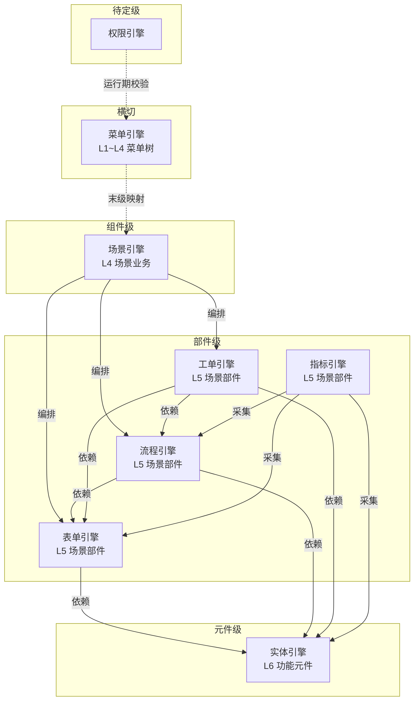

# EOS 引擎资产
**EOS Engine Assets**

**文档版本**：v1.6
**创建日期**：2026-06-13
**修订日期**：2026-06-30
**状态**：文档结构重构——人类优先
**资产类型**：平台引擎资产
**权威状态源**：本文档 `附录C 状态处理队列`

> **文档定位**：EOS 平台引擎的详细定义资产清单。`wft02` 将 A1 引擎 BA IPO 的引擎详细定义写入本文件；`23-eos-output-architecture.md` 中 `/流程与IT/引擎` E2E 项目下的构件类型行引用本文件；`wft05` 和引擎开发者按需读取引擎定义。

---

## §1 引擎总览

### 1.1 引擎全景

| 引擎ID | 名称 | 层级 | 一句话定义 | 配置单元数 | 状态 |
|--------|------|------|-----------|-----------|------|
| @engine-scene | [场景引擎](#eng-scene) | 组件级 | 将多个场景部件编排为场景业务（L4），生成四级末级菜单 | 待填充 | 待确认 |
| @engine-menu | [菜单引擎](#eng-menu) | 横切 | 维护 L1~L4 菜单树的 CRUD、权限和末级节点到场景业务的映射 | 1 | 待确认 |
| @engine-form | [表单引擎](#eng-form) | 部件级 | 配置表单结构/字段/布局/校验/行为/权限/发布，生成场景部件（L5）的数据录入和展示页面 | 7 | 已确认 |
| @engine-flow | [流程引擎](#eng-flow) | 部件级 | 配置流程节点/流转规则/审批行为/状态迁移，生成场景部件的业务流程运行能力 | 3 | 待确认 |
| @engine-indicator | [指标引擎](#eng-indicator) | 部件级 | 配置指标维度/度量口径/聚合规则/展示方式，采集各引擎运行数据生成看板和报表 | 3 | 待确认 |
| @engine-workorder | [工单引擎](#eng-workorder) | 部件级 | 配置工单类型/派发规则/处理流程/验收标准/归档策略，生成任务派发和执行跟踪能力 | 待填充 | 待确认 |
| @engine-entity | [实体引擎](#eng-entity) | 元件级 | 配置业务对象的属性/关系/约束/生命周期，生成功能元件（L6），是其他引擎的元数据基础 | 8 | 待确认 |
| @engine-permission | [权限引擎](#eng-permission) | 待定 | 角色与属性组的定义、权限配置和运行期权限校验 | 4 | 待确认 |

| 统计 | 引擎数 8 | 配置单元类型数 26 | 自研 8 | 外购 0 | 自研+外购 0 | 待确认 7 | 已确认 1 | 废弃 0 |
|------|---------|------------------|--------|--------|-------------|----------|----------|--------|

### 1.2 引擎层次关系



**关键编排关系**：

- 场景引擎调用表单/流程/工单引擎，将场景部件编排为场景菜单中的多 TAB。场景部件 : 输出文档 = 1 : 1（每个场景部件是一个部件级引擎的一次配置实例，产出一份输出文档）
- 表单引擎配置主表单的子业务 TAB 群时，只能从实体引擎的实体关系图谱中选取——实体 A 未关联实体 E → E 不可作为 A 的子业务 TAB
- 菜单引擎不参与业务生成，仅维护 L1~L4 菜单树并将末级节点映射到场景业务。若菜单引擎未将场景业务映射到末级菜单，场景业务在平台上只是不可达的哑资产
- 下钻层级由实体关系穿越次数决定，达到系统层级数限制时停止

**配置单元选配模型**：每个引擎包含若干配置单元（可独立选配的 IPO），部分配置单元即可让业务运行——引擎提供能力池，配置人员按业务需要从中挑选组合，非全量必配。

---

## §2 引擎定义

### 2.1 场景引擎

<!-- BLOCK: ENGINE-SCENE -->
<a id="eng-scene"></a>
#### 2.1.1 场景引擎定义

**当前状态**：待确认
**引擎层级**：组件级
**实现策略**：自研
**块ID**：ENGINE-SCENE

| 要素 | 内容 |
|------|------|
| 定义 | 将多个场景部件编排为场景业务的能力引擎。配置人员通过场景引擎定义场景业务包含哪些场景部件及其编排顺序，生成 L4 场景业务（四级末级菜单），打开后为多窗口布局 |
| 依赖引擎 | 表单引擎、流程引擎、工单引擎（场景部件由部件级引擎生成） |
| 对外接口简述 | 场景编排配置 / 保存 / 发布接口；运行期场景菜单加载、多窗口布局和场景部件导航接口 |
| 配置单元类型 | 待填充 |
| 支持的业务 | L4 场景业务 |
| 来源节点 | @node-scene |
| 实现约束 | 依赖部件级引擎提供的场景部件注册；场景编排需支持跨场景部件的流程衔接和上下文传递 |

##### 反馈交互区

人类反馈

结论（同意 / 修改 / 删除）：—

意见（修改或删除时填写）：—

AI处理

结论（已处理 / 待反馈）：—

建议（待反馈时填写）：—

#### 2.1.2 配置单元总览

> 待填充

##### 反馈交互区

人类反馈

结论（同意 / 修改 / 删除）：—

意见（修改或删除时填写）：—

AI处理

结论（已处理 / 待反馈）：—

建议（待反馈时填写）：—

<!-- /BLOCK: ENGINE-SCENE -->

### 2.2 菜单引擎

<!-- BLOCK: ENGINE-MENU -->
<a id="eng-menu"></a>
#### 2.2.1 菜单引擎定义

**当前状态**：待确认
**引擎层级**：横切（不参与业务生成）
**实现策略**：自研
**块ID**：ENGINE-MENU

| 要素 | 内容 |
|------|------|
| 定义 | EOS 平台菜单树的维护引擎，职责为：① L1~L4 四级菜单树节点的增删改查；② 菜单权限管理；③ 将末级菜单节点（L4）映射到场景引擎生成的场景业务。菜单引擎不生成业务内容，只提供导航路径 |
| 依赖引擎 | —（不依赖场景引擎；菜单引擎仅做末级映射，场景业务由场景引擎独立生成。若菜单引擎未将场景业务映射到末级菜单，场景业务在平台上只是不可达的哑资产） |
| 对外接口简述 | 菜单树 CRUD 接口 / 菜单权限配置接口 / 末级节点→场景业务映射接口；运行期菜单树加载、权限校验和场景导航接口 |
| 配置单元类型 | @menu-cu-basic |
| 支持的业务 | L1~L4 菜单树（L1 业务系统、L2 项目业务、L3 构件业务、L4 场景业务） |
| 来源节点 | @node-menu |
| 实现约束 | 菜单树固定四级，末级为 L4 场景业务；新增场景业务时需要通过菜单引擎建立菜单映射方可被用户访问 |

##### 反馈交互区

人类反馈

结论（同意 / 修改 / 删除）：—

意见（修改或删除时填写）：—

AI处理

结论（已处理 / 待反馈）：—

建议（待反馈时填写）：—

#### 2.2.2 配置单元总览

| 配置单元类型ID | 名称 | 对应系统实体 | 依赖配置单元 |
|-----------|------|--------------|----------|
| @menu-cu-basic | [菜单标签配置单元](#cu-menu-cu-basic) | MenuLabel | — |

##### 反馈交互区

人类反馈

结论（同意 / 修改 / 删除）：—

意见（修改或删除时填写）：—

AI处理

结论（已处理 / 待反馈）：—

建议（待反馈时填写）：—

<a id="cu-menu-cu-basic"></a>
#### 2.2.3 @menu-cu-basic — 菜单标签配置单元

| 要素 | 内容 |
|------|------|
| 对应系统实体 | MenuLabel |
| 配置页面 | 菜单管理页 |
| Input | 菜单名称、层级（L1~L4）、父级节点、访问权限、末级映射场景业务 |
| Process | 校验菜单层级和权限配置，保存菜单节点元数据 |
| Output | 运行期菜单树渲染、导航和权限校验能力 |
| 依赖配置单元 | — |
| 实例化规则 | 当业务需要构建菜单导航或新增场景业务入口时实例化 |

##### 反馈交互区

人类反馈

结论（同意 / 修改 / 删除）：—

意见（修改或删除时填写）：—

AI处理

结论（已处理 / 待反馈）：—

建议（待反馈时填写）：—

<!-- /BLOCK: ENGINE-MENU -->

### 2.3 表单引擎

<!-- BLOCK: ENGINE-FORM -->
<a id="eng-form"></a>
#### 2.3.1 表单引擎定义

**当前状态**：已确认
**引擎层级**：部件级
**实现策略**：自研
**块ID**：ENGINE-FORM

| 要素 | 内容 |
|------|------|
| 定义 | 通过配置表单结构、字段、布局、校验、行为、权限和发布信息，生成场景部件（L5 窗口）中数据录入、展示和提交页面能力的引擎 |
| 依赖引擎 | @engine-entity（实体引擎提供业务对象数据模型） |
| 对外接口简述 | 配置保存 / 校验 / 发布接口；运行期表单渲染、数据读取、数据提交和校验接口 |
| 配置单元类型 | @form-cu-structure, @form-cu-field, @form-cu-layout, @form-cu-validation, @form-cu-behavior, @form-cu-permission, @form-cu-release |
| 支持的业务 | 需要数据录入、展示、编辑、提交或附件采集的场景部件 |
| 来源节点 | @node-form |
| 实现约束 | 运行期表单能力依赖业务对象数据模型、字段权限、字典引用和版本发布机制 |

##### 反馈交互区

人类反馈

结论（同意 / 修改 / 删除）：—

意见（修改或删除时填写）：—

AI处理

结论（已处理 / 待反馈）：—

建议（待反馈时填写）：—

#### 2.3.2 配置单元总览

| 配置单元类型ID | 名称 | 对应系统实体 | 依赖配置单元 |
|-----------|------|--------------|----------|
| @form-cu-structure | [表单结构配置单元](#cu-form-cu-structure) | FormDefinition | — |
| @form-cu-field | [字段定义配置单元](#cu-form-cu-field) | FieldDefinition | @form-cu-structure |
| @form-cu-layout | [布局配置单元](#cu-form-cu-layout) | LayoutDefinition | @form-cu-field |
| @form-cu-validation | [校验规则配置单元](#cu-form-cu-validation) | ValidationRule | @form-cu-field |
| @form-cu-behavior | [表单行为配置单元](#cu-form-cu-behavior) | BehaviorRule | @form-cu-field |
| @form-cu-permission | [表单权限配置单元](#cu-form-cu-permission) | FormPermission | @form-cu-field |
| @form-cu-release | [表单发布配置单元](#cu-form-cu-release) | FormVersion / ReleaseRecord | @form-cu-structure / @form-cu-field / @form-cu-layout |

##### 反馈交互区

人类反馈

结论（同意 / 修改 / 删除）：—

意见（修改或删除时填写）：—

AI处理

结论（已处理 / 待反馈）：—

建议（待反馈时填写）：—

<a id="cu-form-cu-structure"></a>
#### 2.3.3 @form-cu-structure — 表单结构配置单元

| 要素 | 内容 |
|------|------|
| 对应系统实体 | FormDefinition |
| 配置页面 | 表单设计器 / 表单基本信息页 |
| Input | 表单名称、业务对象、数据源、表单类型、版本策略 |
| Process | 校验表单唯一性和业务对象绑定关系，保存表单定义元数据 |
| Output | 业务获得可被渲染的表单页面骨架 |
| 依赖配置单元 | — |
| 实例化规则 | 当业务需要录入、展示或提交业务对象时实例化 |

##### 反馈交互区

人类反馈

结论（同意 / 修改 / 删除）：—

意见（修改或删除时填写）：—

AI处理

结论（已处理 / 待反馈）：—

建议（待反馈时填写）：—

<a id="cu-form-cu-field"></a>
#### 2.3.4 @form-cu-field — 字段定义配置单元

| 要素 | 内容 |
|------|------|
| 对应系统实体 | FieldDefinition |
| 配置页面 | 表单设计器字段面板 |
| Input | 字段名、字段类型、标签、默认值、必填、引用对象、业务字段映射 |
| Process | 校验字段定义并绑定表单、业务对象字段和数据源 |
| Output | 运行期表单字段渲染、录入、展示和业务实体字段映射能力 |
| 依赖配置单元 | @form-cu-structure |
| 实例化规则 | 当业务包含可录入、展示、计算或引用的字段时实例化 |

##### 反馈交互区

人类反馈

结论（同意 / 修改 / 删除）：—

意见（修改或删除时填写）：—

AI处理

结论（已处理 / 待反馈）：—

建议（待反馈时填写）：—

<a id="cu-form-cu-layout"></a>
#### 2.3.5 @form-cu-layout — 布局配置单元

| 要素 | 内容 |
|------|------|
| 对应系统实体 | LayoutDefinition |
| 配置页面 | 表单设计器布局面板 |
| Input | 分组、列数、标签页、显示顺序、折叠区、明细表布局 |
| Process | 校验布局引用的字段，保存布局元数据并绑定表单版本 |
| Output | 运行期页面分组、标签页、明细区和显示顺序能力 |
| 依赖配置单元 | @form-cu-field |
| 实例化规则 | 当业务需要友好的录入 / 查看页面时实例化 |

##### 反馈交互区

人类反馈

结论（同意 / 修改 / 删除）：—

意见（修改或删除时填写）：—

AI处理

结论（已处理 / 待反馈）：—

建议（待反馈时填写）：—

<a id="cu-form-cu-validation"></a>
#### 2.3.6 @form-cu-validation — 校验规则配置单元

| 要素 | 内容 |
|------|------|
| 对应系统实体 | ValidationRule |
| 配置页面 | 字段 / 表单校验配置页 |
| Input | 必填、范围、格式、唯一性、跨字段表达式、提交校验规则 |
| Process | 解析并保存校验规则，绑定字段、表单和触发点 |
| Output | 用户录入、保存、提交时的校验和提示能力 |
| 依赖配置单元 | @form-cu-field |
| 实例化规则 | 当业务存在数据质量、规则或合规校验要求时实例化 |

##### 反馈交互区

人类反馈

结论（同意 / 修改 / 删除）：—

意见（修改或删除时填写）：—

AI处理

结论（已处理 / 待反馈）：—

建议（待反馈时填写）：—

<a id="cu-form-cu-behavior"></a>
#### 2.3.7 @form-cu-behavior — 表单行为配置单元

| 要素 | 内容 |
|------|------|
| 对应系统实体 | BehaviorRule |
| 配置页面 | 表单行为 / 联动配置页 |
| Input | 字段联动、自动带出、提交前后动作、按钮动作、附件动作 |
| Process | 解析行为规则，绑定触发事件和执行动作 |
| Output | 页面联动、自动填充、按钮操作和提交处理能力 |
| 依赖配置单元 | @form-cu-field |
| 实例化规则 | 当业务需要页面交互、自动处理或提交动作时实例化 |

##### 反馈交互区

人类反馈

结论（同意 / 修改 / 删除）：—

意见（修改或删除时填写）：—

AI处理

结论（已处理 / 待反馈）：—

建议（待反馈时填写）：—

<a id="cu-form-cu-permission"></a>
#### 2.3.8 @form-cu-permission — 表单权限配置单元

| 要素 | 内容 |
|------|------|
| 对应系统实体 | FormPermission |
| 配置页面 | 表单权限配置页 |
| Input | 角色、组织范围、字段可见性、字段可编辑性、按钮权限 |
| Process | 保存权限规则并绑定表单、字段、角色和状态 |
| Output | 不同角色 / 状态下的字段可见、可编辑和操作按钮控制能力 |
| 依赖配置单元 | @form-cu-field |
| 实例化规则 | 当业务涉及角色分工、状态控制或敏感字段时实例化 |

##### 反馈交互区

人类反馈

结论（同意 / 修改 / 删除）：—

意见（修改或删除时填写）：—

AI处理

结论（已处理 / 待反馈）：—

建议（待反馈时填写）：—

<a id="cu-form-cu-release"></a>
#### 2.3.9 @form-cu-release — 表单发布配置单元

| 要素 | 内容 |
|------|------|
| 对应系统实体 | FormVersion / ReleaseRecord |
| 配置页面 | 表单发布页 |
| Input | 版本号、生效范围、生效时间、灰度范围、回滚策略 |
| Process | 校验配置完整性，生成版本记录并发布到运行期 |
| Output | 正式可用、可回滚、可审计的表单运行能力 |
| 依赖配置单元 | @form-cu-structure / @form-cu-field / @form-cu-layout |
| 实例化规则 | 当表单配置需要上线运行时实例化 |

##### 反馈交互区

人类反馈

结论（同意 / 修改 / 删除）：—

意见（修改或删除时填写）：—

AI处理

结论（已处理 / 待反馈）：—

建议（待反馈时填写）：—

<!-- /BLOCK: ENGINE-FORM -->

### 2.4 流程引擎

<!-- BLOCK: ENGINE-FLOW -->
<a id="eng-flow"></a>
#### 2.4.1 流程引擎定义

**当前状态**：待确认
**引擎层级**：部件级
**实现策略**：自研
**块ID**：ENGINE-FLOW

| 要素 | 内容 |
|------|------|
| 定义 | 通过配置流程节点、流转规则、审批行为和状态迁移，生成场景部件（L5 窗口）中业务流程运行能力的引擎 |
| 依赖引擎 | @engine-form, @engine-entity |
| 对外接口简述 | 流程设计 / 保存 / 发布接口；运行期流程驱动、状态迁移、审批执行和流程监控接口 |
| 配置单元类型 | @flow-cu-definition, @flow-cu-version, @flow-cu-node-config |
| 支持的业务 | 需要审批流转、状态迁移或步骤驱动的场景部件 |
| 来源节点 | @node-flow |
| 实现约束 | 流程运行依赖表单引擎提供的操作页面和实体引擎提供的业务对象 |

##### 反馈交互区

人类反馈

结论（同意 / 修改 / 删除）：—

意见（修改或删除时填写）：—

AI处理

结论（已处理 / 待反馈）：—

建议（待反馈时填写）：—

#### 2.4.2 配置单元总览

| 配置单元类型ID | 名称 | 对应系统实体 | 依赖配置单元 |
|-----------|------|--------------|----------|
| @flow-cu-definition | [流程定义配置单元](#cu-flow-cu-definition) | FlowDefinition | — |
| @flow-cu-version | [流程版本配置单元](#cu-flow-cu-version) | FlowVersion | @flow-cu-definition |
| @flow-cu-node-config | [流程节点配置单元](#cu-flow-cu-node-config) | FlowNodeConfig | @flow-cu-definition |

##### 反馈交互区

人类反馈

结论（同意 / 修改 / 删除）：—

意见（修改或删除时填写）：—

AI处理

结论（已处理 / 待反馈）：—

建议（待反馈时填写）：—

<a id="cu-flow-cu-definition"></a>
#### 2.4.3 @flow-cu-definition — 流程定义配置单元

| 要素 | 内容 |
|------|------|
| 对应系统实体 | FlowDefinition |
| 配置页面 | 流程设计器 / 流程定义页 |
| Input | 流程名称、业务对象、流程分类、启动方式 |
| Process | 校验流程定义唯一性和业务对象绑定，保存流程定义元数据 |
| Output | 业务获得可被编排的流程定义骨架 |
| 依赖配置单元 | — |
| 实例化规则 | 当业务需要审批流转或步骤驱动时实例化 |

##### 反馈交互区

人类反馈

结论（同意 / 修改 / 删除）：—

意见（修改或删除时填写）：—

AI处理

结论（已处理 / 待反馈）：—

建议（待反馈时填写）：—

<a id="cu-flow-cu-version"></a>
#### 2.4.4 @flow-cu-version — 流程版本配置单元

| 要素 | 内容 |
|------|------|
| 对应系统实体 | FlowVersion |
| 配置页面 | 流程设计器版本管理页 |
| Input | 版本号、版本说明、生效策略、升版规则 |
| Process | 校验版本定义，保存版本记录，管理版本生命周期 |
| Output | 业务获得可发布、可回滚、可审计的流程版本能力 |
| 依赖配置单元 | @flow-cu-definition |
| 实例化规则 | 当流程定义需要管理版本时实例化 |

##### 反馈交互区

人类反馈

结论（同意 / 修改 / 删除）：—

意见（修改或删除时填写）：—

AI处理

结论（已处理 / 待反馈）：—

建议（待反馈时填写）：—

<a id="cu-flow-cu-node-config"></a>
#### 2.4.5 @flow-cu-node-config — 流程节点配置单元

| 要素 | 内容 |
|------|------|
| 对应系统实体 | FlowNodeConfig |
| 配置页面 | 流程设计器节点配置面板 |
| Input | 流程图绘制、全局变量定义、节点基本信息、节点关联表单、节点办理人/传阅人配置、节点操作项、子业务校验规则、节点事件配置、超时流转规则 |
| Process | 校验并保存节点配置，绑定流转关系、表单和组织数据 |
| Output | 运行期流程按配置执行节点流转、审批、事件触发和超时处理能力 |
| 依赖配置单元 | @flow-cu-definition |
| 实例化规则 | 当流程定义需要配置具体节点和流转路径时实例化 |

##### 反馈交互区

人类反馈

结论（同意 / 修改 / 删除）：—

意见（修改或删除时填写）：—

AI处理

结论（已处理 / 待反馈）：—

建议（待反馈时填写）：—

<!-- /BLOCK: ENGINE-FLOW -->

### 2.5 指标引擎

<!-- BLOCK: ENGINE-INDICATOR -->
<a id="eng-indicator"></a>
#### 2.5.1 指标引擎定义

**当前状态**：待确认
**引擎层级**：部件级
**实现策略**：自研
**块ID**：ENGINE-INDICATOR

| 要素 | 内容 |
|------|------|
| 定义 | 通过配置指标维度、度量口径、聚合规则和展示方式，采集各引擎运行数据，生成指标看板和报表能力的引擎 |
| 依赖引擎 | @engine-form, @engine-flow, @engine-entity（从各引擎运行数据中采集指标源数据） |
| 对外接口简述 | 指标维度配置 / 聚合规则配置 / 保存 / 发布接口；运行期指标数据采集、计算、看板渲染和报表导出接口 |
| 配置单元类型 | @indicator-cu-metric, @indicator-cu-component, @indicator-cu-view |
| 支持的业务 | 需要度量、监控、分析和持续改进的各层业务定义（L0 平台级/L1 业务系统级/L2 项目业务级/L3 构件业务级/L4 场景业务级/L5 场景部件级/L6 功能元件级七层指标） |
| 来源节点 | — |
| 实现约束 | 指标引擎不直接生成业务操作，而是对各引擎运行数据进行聚合计算和可视化呈现；聚合口径需与业务定义的类型和层级对齐 |

##### 反馈交互区

人类反馈

结论（同意 / 修改 / 删除）：—

意见（修改或删除时填写）：—

AI处理

结论（已处理 / 待反馈）：—

建议（待反馈时填写）：—

#### 2.5.2 配置单元总览

| 配置单元类型ID | 名称 | 对应系统实体 | 依赖配置单元 |
|-----------|------|--------------|----------|
| @indicator-cu-metric | [指标定义配置单元](#cu-indicator-cu-metric) | MetricDefinition | — |
| @indicator-cu-component | [看板组件配置单元](#cu-indicator-cu-component) | DashboardComponent | @indicator-cu-metric |
| @indicator-cu-view | [看板视图配置单元](#cu-indicator-cu-view) | DashboardView | @indicator-cu-component |

##### 反馈交互区

人类反馈

结论（同意 / 修改 / 删除）：—

意见（修改或删除时填写）：—

AI处理

结论（已处理 / 待反馈）：—

建议（待反馈时填写）：—

<a id="cu-indicator-cu-metric"></a>
#### 2.5.3 @indicator-cu-metric — 指标定义配置单元

| 要素 | 内容 |
|------|------|
| 对应系统实体 | MetricDefinition |
| 配置页面 | 指标定义设计器 |
| Input | 指标名称、维度、度量口径、聚合规则、数据源 |
| Process | 校验指标定义，绑定数据源，保存指标元数据 |
| Output | 运行期指标数据采集、汇总计算和统计分析能力 |
| 依赖配置单元 | — |
| 实例化规则 | 当业务需要度量、监控或分析业务数据时实例化 |

##### 反馈交互区

人类反馈

结论（同意 / 修改 / 删除）：—

意见（修改或删除时填写）：—

AI处理

结论（已处理 / 待反馈）：—

建议（待反馈时填写）：—

<a id="cu-indicator-cu-component"></a>
#### 2.5.4 @indicator-cu-component — 看板组件配置单元

| 要素 | 内容 |
|------|------|
| 对应系统实体 | DashboardComponent |
| 配置页面 | 看板组件设计器 |
| Input | 组件类型、图表配置、关联指标、展示方式 |
| Process | 校验组件配置，绑定指标定义，保存组件元数据 |
| Output | 运行期看板组件渲染的可视化图表能力 |
| 依赖配置单元 | @indicator-cu-metric |
| 实例化规则 | 当业务需要以图表形式展示指标数据时实例化 |

##### 反馈交互区

人类反馈

结论（同意 / 修改 / 删除）：—

意见（修改或删除时填写）：—

AI处理

结论（已处理 / 待反馈）：—

建议（待反馈时填写）：—

<a id="cu-indicator-cu-view"></a>
#### 2.5.5 @indicator-cu-view — 看板视图配置单元

| 要素 | 内容 |
|------|------|
| 对应系统实体 | DashboardView |
| 配置页面 | 看板视图设计器 |
| Input | 视图布局、组件引入、展示范围、过滤条件 |
| Process | 校验视图配置，编排组件布局，保存视图元数据 |
| Output | 运行期完整的看板页面展示和报表导出能力 |
| 依赖配置单元 | @indicator-cu-component |
| 实例化规则 | 当业务需要将多个看板组件编排为完整看板页面时实例化 |

##### 反馈交互区

人类反馈

结论（同意 / 修改 / 删除）：—

意见（修改或删除时填写）：—

AI处理

结论（已处理 / 待反馈）：—

建议（待反馈时填写）：—

<!-- /BLOCK: ENGINE-INDICATOR -->

### 2.6 工单引擎

<!-- BLOCK: ENGINE-WORKORDER -->
<a id="eng-workorder"></a>
#### 2.6.1 工单引擎定义

**当前状态**：待确认
**引擎层级**：部件级
**实现策略**：自研
**块ID**：ENGINE-WORKORDER

| 要素 | 内容 |
|------|------|
| 定义 | 通过配置工单类型、派发规则、处理流程、验收标准和归档策略，生成场景部件（L5 窗口）中任务派发、执行跟踪和结果验收能力的引擎 |
| 依赖引擎 | @engine-form（工单操作页面）, @engine-flow（工单流转审批）, @engine-entity（工单业务对象） |
| 对外接口简述 | 工单类型配置 / 派发规则配置 / 处理流程配置 / 保存 / 发布接口；运行期工单生成、派发、接收、处理、验收和归档接口 |
| 配置单元类型 | 待填充 |
| 支持的业务 | 需要任务派发、执行跟踪、结果验收或服务闭环的场景部件（如采购执行工单、质量检验工单、设备维修工单） |
| 来源节点 | — |
| 实现约束 | 工单引擎依赖表单引擎提供操作页面、流程引擎提供流转审批、实体引擎提供工单对象定义；工单是流程驱动+表单承载的复合业务形态 |

##### 反馈交互区

人类反馈

结论（同意 / 修改 / 删除）：—

意见（修改或删除时填写）：—

AI处理

结论（已处理 / 待反馈）：—

建议（待反馈时填写）：—

#### 2.6.2 配置单元总览

> 待填充

##### 反馈交互区

人类反馈

结论（同意 / 修改 / 删除）：—

意见（修改或删除时填写）：—

AI处理

结论（已处理 / 待反馈）：—

建议（待反馈时填写）：—

<!-- /BLOCK: ENGINE-WORKORDER -->

### 2.7 实体引擎

<!-- BLOCK: ENGINE-ENTITY -->
<a id="eng-entity"></a>
#### 2.7.1 实体引擎定义

**当前状态**：待确认
**引擎层级**：元件级
**实现策略**：自研
**块ID**：ENGINE-ENTITY

| 要素 | 内容 |
|------|------|
| 定义 | 通过配置业务对象的属性、关系、约束和生命周期，生成功能元件（L6）的能力引擎。实体引擎是其他引擎的基础——表单引擎、流程引擎和工单引擎均依赖实体引擎提供的业务对象定义 |
| 依赖引擎 | — |
| 对外接口简述 | 实体定义配置 / 保存 / 发布接口；运行期实体查询、创建、更新、删除和关系管理接口 |
| 配置单元类型 | @entity-cu-basic, @entity-cu-field, @entity-cu-action, @entity-cu-builtin-subbiz, @entity-cu-subbiz, @entity-cu-derive, @entity-cu-lifecycle, @entity-cu-notification |
| 支持的业务 | L6 功能元件（实体对象、事件、定时任务等） |
| 来源节点 | @node-entity |
| 实现约束 | 实体引擎是底层引擎，不依赖其他 EOS 引擎；实体定义是所有上层业务的元数据基础 |

##### 反馈交互区

人类反馈

结论（同意 / 修改 / 删除）：—

意见（修改或删除时填写）：—

AI处理

结论（已处理 / 待反馈）：—

建议（待反馈时填写）：—

#### 2.7.2 配置单元总览

| 配置单元类型ID | 名称 | 对应系统实体 | 依赖配置单元 |
|-----------|------|--------------|----------|
| @entity-cu-basic | [实体基本信息配置单元](#cu-entity-cu-basic) | EntityDefinition | — |
| @entity-cu-field | [实体字段配置单元](#cu-entity-cu-field) | FieldDefinition | @entity-cu-basic |
| @entity-cu-action | [功能操作项配置单元](#cu-entity-cu-action) | ActionDefinition | @entity-cu-basic |
| @entity-cu-builtin-subbiz | [内置子业务配置单元](#cu-entity-cu-builtin-subbiz) | BuiltinSubBusiness | @entity-cu-basic |
| @entity-cu-subbiz | [子业务配置单元](#cu-entity-cu-subbiz) | SubBusiness | @entity-cu-basic |
| @entity-cu-derive | [派生配置单元](#cu-entity-cu-derive) | DeriveDefinition | @entity-cu-basic |
| @entity-cu-lifecycle | [生命周期状态配置单元](#cu-entity-cu-lifecycle) | LifecycleState | @entity-cu-basic |
| @entity-cu-notification | [提示信息配置单元](#cu-entity-cu-notification) | NotificationRule | @entity-cu-basic |

##### 反馈交互区

人类反馈

结论（同意 / 修改 / 删除）：—

意见（修改或删除时填写）：—

AI处理

结论（已处理 / 待反馈）：—

建议（待反馈时填写）：—

<a id="cu-entity-cu-basic"></a>
#### 2.7.3 @entity-cu-basic — 实体基本信息配置单元

| 要素 | 内容 |
|------|------|
| 对应系统实体 | EntityDefinition |
| 配置页面 | 实体设计器 / 实体基本信息页 |
| Input | 实体名称、数据表名、显示规则、指示灯配置 |
| Process | 校验实体唯一性和业务对象绑定关系，保存实体定义元数据 |
| Output | 业务获得可被引用的实体定义骨架 |
| 依赖配置单元 | — |
| 实例化规则 | 当业务需要定义业务对象时实例化 |

##### 反馈交互区

人类反馈

结论（同意 / 修改 / 删除）：—

意见（修改或删除时填写）：—

AI处理

结论（已处理 / 待反馈）：—

建议（待反馈时填写）：—

<a id="cu-entity-cu-field"></a>
#### 2.7.4 @entity-cu-field — 实体字段配置单元

| 要素 | 内容 |
|------|------|
| 对应系统实体 | FieldDefinition |
| 配置页面 | 实体设计器字段面板 |
| Input | 字段名、字段类型、数据类型、引用对象、业务字段映射 |
| Process | 校验字段定义并绑定实体，保存字段元数据 |
| Output | 运行期实体字段存储、数据类型校验和关联查询能力 |
| 依赖配置单元 | @entity-cu-basic |
| 实例化规则 | 当业务实体包含需要存储或引用的属性时实例化 |

##### 反馈交互区

人类反馈

结论（同意 / 修改 / 删除）：—

意见（修改或删除时填写）：—

AI处理

结论（已处理 / 待反馈）：—

建议（待反馈时填写）：—

<a id="cu-entity-cu-action"></a>
#### 2.7.5 @entity-cu-action — 功能操作项配置单元

| 要素 | 内容 |
|------|------|
| 对应系统实体 | ActionDefinition |
| 配置页面 | 实体设计器操作项面板 |
| Input | 操作项名称、操作类型、前后置事件配置 |
| Process | 校验并保存操作项定义，绑定实体和触发事件 |
| Output | 运行期实体操作按钮和前后置业务逻辑执行能力 |
| 依赖配置单元 | @entity-cu-basic |
| 实例化规则 | 当业务需要自定义实体操作时实例化 |

##### 反馈交互区

人类反馈

结论（同意 / 修改 / 删除）：—

意见（修改或删除时填写）：—

AI处理

结论（已处理 / 待反馈）：—

建议（待反馈时填写）：—

<a id="cu-entity-cu-builtin-subbiz"></a>
#### 2.7.6 @entity-cu-builtin-subbiz — 内置子业务配置单元

| 要素 | 内容 |
|------|------|
| 对应系统实体 | BuiltinSubBusiness |
| 配置页面 | 实体设计器内置子业务配置页 |
| Input | 内置子业务类型（进展填报/模板/变更记录/文档版本/节点分支版本/变更） |
| Process | 校验并激活内置子业务模板，绑定实体关系 |
| Output | 实体自动获得标准子业务功能能力 |
| 依赖配置单元 | @entity-cu-basic |
| 实例化规则 | 当业务需要标准子业务功能时实例化 |

##### 反馈交互区

人类反馈

结论（同意 / 修改 / 删除）：—

意见（修改或删除时填写）：—

AI处理

结论（已处理 / 待反馈）：—

建议（待反馈时填写）：—

<a id="cu-entity-cu-subbiz"></a>
#### 2.7.7 @entity-cu-subbiz — 子业务配置单元

| 要素 | 内容 |
|------|------|
| 对应系统实体 | SubBusiness |
| 配置页面 | 实体设计器子业务配置页 |
| Input | 关联实体、子业务配置、联动规则 |
| Process | 保存子业务定义和规则 |
| Output | 运行期实体关联业务的数据访问和联动能力 |
| 依赖配置单元 | @entity-cu-basic |
| 实例化规则 | 当业务需要关联其他实体的数据时实例化 |

##### 反馈交互区

人类反馈

结论（同意 / 修改 / 删除）：—

意见（修改或删除时填写）：—

AI处理

结论（已处理 / 待反馈）：—

建议（待反馈时填写）：—

<a id="cu-entity-cu-derive"></a>
#### 2.7.8 @entity-cu-derive — 派生配置单元

| 要素 | 内容 |
|------|------|
| 对应系统实体 | DeriveDefinition |
| 配置页面 | 实体设计器派生配置页 |
| Input | 派生类型（派生主台账/派生主流程/派生子台账/派生子流程）、派生规则 |
| Process | 校验派生规则，保存派生定义 |
| Output | 实体自动生成派生的数据视图或流程实例能力 |
| 依赖配置单元 | @entity-cu-basic |
| 实例化规则 | 当业务需要从当前实体派生出新业务对象或流程时实例化 |

##### 反馈交互区

人类反馈

结论（同意 / 修改 / 删除）：—

意见（修改或删除时填写）：—

AI处理

结论（已处理 / 待反馈）：—

建议（待反馈时填写）：—

<a id="cu-entity-cu-lifecycle"></a>
#### 2.7.9 @entity-cu-lifecycle — 生命周期状态配置单元

| 要素 | 内容 |
|------|------|
| 对应系统实体 | LifecycleState |
| 配置页面 | 实体设计器生命周期配置页 |
| Input | 状态定义、状态切换规则、初始状态 |
| Process | 校验并保存状态定义和切换关系 |
| Output | 实体运行期按预定义状态机进行状态迁移和约束能力 |
| 依赖配置单元 | @entity-cu-basic |
| 实例化规则 | 当业务实体需要状态管理和状态驱动行为时实例化 |

##### 反馈交互区

人类反馈

结论（同意 / 修改 / 删除）：—

意见（修改或删除时填写）：—

AI处理

结论（已处理 / 待反馈）：—

建议（待反馈时填写）：—

<a id="cu-entity-cu-notification"></a>
#### 2.7.10 @entity-cu-notification — 提示信息配置单元

| 要素 | 内容 |
|------|------|
| 对应系统实体 | NotificationRule |
| 配置页面 | 实体设计器提示信息配置页 |
| Input | 提示信息内容、触发条件、展示方式 |
| Process | 校验并保存提示规则，绑定实体事件 |
| Output | 实体运行期按条件触发提示信息展示能力 |
| 依赖配置单元 | @entity-cu-basic |
| 实例化规则 | 当业务需要实体操作时的提示反馈时实例化 |

##### 反馈交互区

人类反馈

结论（同意 / 修改 / 删除）：—

意见（修改或删除时填写）：—

AI处理

结论（已处理 / 待反馈）：—

建议（待反馈时填写）：—

<!-- /BLOCK: ENGINE-ENTITY -->

### 2.8 权限引擎

<!-- BLOCK: ENGINE-PERMISSION -->
<a id="eng-permission"></a>
#### 2.8.1 权限引擎定义

**当前状态**：待确认
**引擎层级**：待定
**实现策略**：自研
**块ID**：ENGINE-PERMISSION

| 要素 | 内容 |
|------|------|
| 定义 | EOS 平台权限管理的引擎，职责为：① 角色定义（CRUD+发布）；② 属性组定义（CRUD+发布）；③ 角色与属性组的菜单权限配置；④ 角色与属性组的操作项权限配置 |
| 依赖引擎 | —（不依赖其他引擎，但其他引擎运行期需调用权限引擎校验用户权限） |
| 对外接口简述 | 角色/属性组 CRUD 和发布接口；菜单权限和操作项权限配置接口；运行期用户权限校验接口 |
| 配置单元类型 | @perm-cu-role, @perm-cu-attr-group, @perm-cu-role-perm, @perm-cu-attr-group-perm |
| 支持的业务 | L1~L6 各层业务的权限管控（角色分离、属性维度控制、菜单级和操作项级权限） |
| 来源节点 | — |
| 实现约束 | 权限引擎的运行期校验需各引擎和前端统一集成权限 SDK；菜单权限依赖菜单引擎的菜单树定义 |

##### 反馈交互区

人类反馈

结论（同意 / 修改 / 删除）：—

意见（修改或删除时填写）：—

AI处理

结论（已处理 / 待反馈）：—

建议（待反馈时填写）：—

#### 2.8.2 配置单元总览

| 配置单元类型ID | 名称 | 对应系统实体 | 依赖配置单元 |
|-----------|------|--------------|----------|
| @perm-cu-role | [角色定义配置单元](#cu-perm-cu-role) | RoleDefinition | — |
| @perm-cu-attr-group | [属性组定义配置单元](#cu-perm-cu-attr-group) | AttributeGroup | — |
| @perm-cu-role-perm | [角色权限配置单元](#cu-perm-cu-role-perm) | RolePermission | @perm-cu-role |
| @perm-cu-attr-group-perm | [属性组权限配置单元](#cu-perm-cu-attr-group-perm) | AttrGroupPermission | @perm-cu-attr-group |

##### 反馈交互区

人类反馈

结论（同意 / 修改 / 删除）：—

意见（修改或删除时填写）：—

AI处理

结论（已处理 / 待反馈）：—

建议（待反馈时填写）：—

<a id="cu-perm-cu-role"></a>
#### 2.8.3 @perm-cu-role — 角色定义配置单元

| 要素 | 内容 |
|------|------|
| 对应系统实体 | RoleDefinition |
| 配置页面 | 角色管理页 |
| Input | 角色名称、角色标识、所属范围、启用状态 |
| Process | 校验角色定义唯一性，保存角色元数据 |
| Output | 业务获得可被授权的角色定义 |
| 依赖配置单元 | — |
| 实例化规则 | 当业务需要角色分工和权限隔离时实例化 |

##### 反馈交互区

人类反馈

结论（同意 / 修改 / 删除）：—

意见（修改或删除时填写）：—

AI处理

结论（已处理 / 待反馈）：—

建议（待反馈时填写）：—

<a id="cu-perm-cu-attr-group"></a>
#### 2.8.4 @perm-cu-attr-group — 属性组定义配置单元

| 要素 | 内容 |
|------|------|
| 对应系统实体 | AttributeGroup |
| 配置页面 | 属性组管理页 |
| Input | 属性组名称、属性维度、成员规则 |
| Process | 校验属性组定义，保存属性组元数据 |
| Output | 业务获得属性维度的权限分组能力 |
| 依赖配置单元 | — |
| 实例化规则 | 当业务需要按属性维度（如组织/区域/分类）控制权限时实例化 |

##### 反馈交互区

人类反馈

结论（同意 / 修改 / 删除）：—

意见（修改或删除时填写）：—

AI处理

结论（已处理 / 待反馈）：—

建议（待反馈时填写）：—

<a id="cu-perm-cu-role-perm"></a>
#### 2.8.5 @perm-cu-role-perm — 角色权限配置单元

| 要素 | 内容 |
|------|------|
| 对应系统实体 | RolePermission |
| 配置页面 | 角色权限配置页 |
| Input | 角色、可访问菜单、可操作操作项、数据范围 |
| Process | 校验并保存角色权限规则，绑定菜单和操作项 |
| Output | 运行期角色菜单导航和操作按钮的可见/可操作控制能力 |
| 依赖配置单元 | @perm-cu-role |
| 实例化规则 | 当角色需要分配菜单和操作权限时实例化 |

##### 反馈交互区

人类反馈

结论（同意 / 修改 / 删除）：—

意见（修改或删除时填写）：—

AI处理

结论（已处理 / 待反馈）：—

建议（待反馈时填写）：—

<a id="cu-perm-cu-attr-group-perm"></a>
#### 2.8.6 @perm-cu-attr-group-perm — 属性组权限配置单元

| 要素 | 内容 |
|------|------|
| 对应系统实体 | AttrGroupPermission |
| 配置页面 | 属性组权限配置页 |
| Input | 属性组、可访问菜单、可操作操作项 |
| Process | 校验并保存属性组权限规则，绑定菜单和操作项 |
| Output | 运行期属性组维度的菜单和操作权限控制能力 |
| 依赖配置单元 | @perm-cu-attr-group |
| 实例化规则 | 当属性组需要分配菜单和操作权限时实例化 |

##### 反馈交互区

人类反馈

结论（同意 / 修改 / 删除）：—

意见（修改或删除时填写）：—

AI处理

结论（已处理 / 待反馈）：—

建议（待反馈时填写）：—

<!-- /BLOCK: ENGINE-PERMISSION -->

---

## §3 平台基础资源

以下资源是 EOS 平台提供的基础设施能力，非独立引擎，但可为各引擎的配置单元实例化提供支撑数据。

### 定时任务

| 配置单元 | 对应系统实体 | 配置页面 | 说明 |
|---------|--------------|----------|------|
| 新建定时任务 | ScheduledTask | 定时任务管理页 | 定义定时触发任务 |
| 编辑定时任务 | ScheduledTask | 定时任务管理页 | 修改任务定义 |
| 删除定时任务 | ScheduledTask | 定时任务管理页 | 移除任务定义 |
| 发布定时任务 | ScheduledTask | 定时任务管理页 | 激活定时任务 |
| 关闭定时任务 | ScheduledTask | 定时任务管理页 | 停用定时任务 |
| 设置任务事件 | TaskEvent | 定时任务事件配置页 | 配置任务触发的前置/后置事件 |

### 基础资源库

| 资源类型 | 包含配置单元 | 说明 |
|---------|-------------|------|
| 数据字典库 | 新建/编辑/删除/发布/关闭数据字典定义，设置数据字典项 | 提供全局字典值集，供各引擎字段引用 |
| 事件库 | 新建/编辑/删除/发布/关闭事件定义 | 提供全局事件定义，供操作项和流程节点引用 |
| 编码规则库 | 新建/编辑/删除/发布/关闭编码规则 | 提供统一编码生成规则 |
| 版本规则库 | 新建/编辑/删除/发布/关闭版本规则 | 提供业务对象的版本管理规则 |
| 状态库 | 新建/编辑/删除/发布/关闭状态 | 提供全局状态定义，供实体生命周期引用 |
| 弹窗标签库 | 新建/编辑/删除/发布/关闭弹窗标签 | 提供弹窗提示标签定义 |

---

## §4 追溯关系

| 源节点 | 关系类型 | 目标节点 | 目标文档 | 状态 | 说明 |
|--------|----------|----------|----------|------|------|
| @def-* | uses_asset | @engine-* | [本文档](#cu-engine-*) | 模板 | 业务依赖引擎 |
| @node-* | implemented_by | @engine-* | [本文档](#cu-engine-*) | 模板 | `23` 构件类型由引擎承接 |
| @engine-* | depends_on | @engine-* | [本文档](#cu-engine-*) | 模板 | 引擎之间的依赖 |
| @engine-form | has_config_unit | @form-cu-* | [本文档](#cu-form-cu-*) | 已确认 | 表单引擎支持的配置单元类型 |
| @engine-entity | has_config_unit | @entity-cu-* | [本文档](#cu-entity-cu-*) | 待确认 | 实体引擎支持的配置单元类型 |
| @engine-flow | has_config_unit | @flow-cu-* | [本文档](#cu-flow-cu-*) | 待确认 | 流程引擎支持的配置单元类型 |
| @engine-indicator | has_config_unit | @indicator-cu-* | [本文档](#cu-indicator-cu-*) | 待确认 | 指标引擎支持的配置单元类型 |
| @engine-menu | has_config_unit | @menu-cu-* | [本文档](#cu-menu-cu-*) | 待确认 | 菜单引擎支持的配置单元类型 |
| @engine-permission | has_config_unit | @perm-cu-* | [本文档](#cu-perm-cu-*) | 待确认 | 权限引擎支持的配置单元类型 |
| BA-A1-* | instantiates | @form-cu-* | [`04-eos-business-architecture.md`](#cu-form-cu-*) | 模板 | 具体 A1 BA 配置单元实例化表单引擎配置单元类型 |

---

## 附录A 规则区与口径区

1. 引擎描述平台能力边界，不替代产品架构组件或代码实现设计。
2. 引擎应能追溯到 `23` 构件类型、`24` 业务或 `04` BA A1 方案。
3. 同一引擎可被多个业务复用；复用关系记录在索引和追溯区。
4. 外购、自研、自研+外购是架构级实现策略，不代表采购或开发已经完成。
5. 对外接口只记录架构级能力和输入输出摘要，详细 API 规格应在后续产品本体或开发文档中定义。
6. 引擎配置单元类型描述某个引擎可独立配置、校验、发布、复用或版本管理的元数据对象类型；具体业务的配置单元实例不写入本文档，应由 `04-eos-business-architecture.md` 的 A1 BA 方案或后续 PA / 配置资产承载。
7. `wft02` 生成 A1 引擎配置单元建议时，应优先查询本文档的配置单元类型库，再按当前 Bn 业务、A2 场景业务或公共业务实例化；若本文档不存在可承接的配置单元类型，应形成 25 资产新增 / 扩展建议或引擎能力缺口反馈。
8. **术语统一**：本文档与 wft01 统一使用"配置单元"术语。配置单元的三个核心字段为 Input（配置要素）/ Process（处理说明）/ Output（业务说明）。

### Skill 读写契约

| Skill | 操作 | 说明 |
|-------|------|------|
| `wft01-eng` | 读 | 读取引擎的配置单元类型清单，作为 STR-E 节点的**配置单元**候选集（配置要素 / 处理说明 / 业务说明） |
| `wft02` | 读 + 写 | 读取 A1 引擎能力，新增或扩展引擎 |
| `wft05` | 读 | 作为 PA 架构引用的平台组件来源 |
| 引擎开发者 | 填充 | 在 EOS 开发过程中实例化每个引擎的技术定义 |

---

## 附录B AI 读取导航

### AI 读取顺序

本文件是引擎资产文档。AI 读取本文件时应先读取引擎总览和索引，再按引擎 ID 定位目标正文块。

默认读取顺序：

1. 读取文档元信息和本说明，确认本文档承载引擎资产。
2. 读取 `§1 引擎总览`，了解引擎层级、依赖关系和实现策略。
3. 读取 `附录C 状态处理队列`，确认待新增、待扩展、待替换或待废弃引擎。
4. 读取 `B.1 分片索引` 和 `B.2 引擎索引`，按引擎 ID、引擎层级、实现策略或依赖关系定位目标块。
5. 仅读取目标模型正文块、必要依赖模型块和相关追溯关系。

扩大读取范围仅在以下情况允许：

- 多个引擎存在职责边界冲突或替代关系。
- 需要判断业务是否已有可复用引擎支持。
- 依赖链断裂或接口边界无法判断。
- 人类明确要求通读引擎资产。

禁止事项：

- 不得在常规 Skill 运行中默认读取全部引擎正文块。
- 不得将候选引擎直接作为 PA 或开发强依赖。
- 不得在本文档复制完整技术实现方案；这里只记录架构级引擎资产。

### B.1 分片索引

| 分片ID | 分片名称 | 范围 | 默认读取场景 | 条目数 | 入口 |
|--------|----------|------|--------------|--------|------|
| ENGINE-SHARD-L1 | 组件级引擎 | 场景引擎 | 场景业务承接 | — | `§2.1 场景引擎` |
| ENGINE-SHARD-L2 | 部件级引擎 | 表单引擎、流程引擎、指标引擎、工单引擎 | 场景部件承接 | — | `§2.3~§2.6` |
| ENGINE-SHARD-L3 | 元件级引擎 | 实体引擎 | 功能元件承接 | — | `§2.7 实体引擎` |
| ENGINE-SHARD-X | 横切引擎 | 菜单引擎 | 菜单树 CRUD + 权限 | — | `§2.2 菜单引擎` |
| ENGINE-SHARD-P | 待定级引擎 | 权限引擎 | 权限配置 | — | `§2.8 权限引擎` |

### B.2 引擎索引

| 引擎ID | 名称 | 引擎层级 | 实现策略 | 生命周期状态 | 依赖引擎 | 引用业务 | 引用 23 节点 | 块ID | 最后更新 |
|--------|------|----------|----------|--------------|----------|----------|-------------|------|----------|
| @engine-scene | 场景引擎 | 组件级 | 自研 | 待确认 | — | — | @node-scene | ENGINE-SCENE | 2026-06-27 |
| @engine-menu | 菜单引擎 | 横切 | 自研 | 待确认 | —（不依赖场景引擎，仅末级映射） | — | @node-menu | ENGINE-MENU | 2026-06-27 |
| @engine-form | 表单引擎 | 部件级 | 自研 | 已确认 | @engine-entity | 待实例化 | @node-form | ENGINE-FORM | 2026-06-27 |
| @engine-flow | 流程引擎 | 部件级 | 自研 | 待确认 | @engine-form, @engine-entity | — | @node-flow | ENGINE-FLOW | 2026-06-27 |
| @engine-indicator | 指标引擎 | 部件级 | 自研 | 待确认 | @engine-form, @engine-flow, @engine-entity | — | — | ENGINE-INDICATOR | 2026-06-27 |
| @engine-workorder | 工单引擎 | 部件级 | 自研 | 待确认 | @engine-form, @engine-flow, @engine-entity | — | — | ENGINE-WORKORDER | 2026-06-27 |
| @engine-entity | 实体引擎 | 元件级 | 自研 | 待确认 | — | — | @node-entity | ENGINE-ENTITY | 2026-06-27 |
| @engine-permission | 权限引擎 | 待定 | 自研 | 待确认 | — | — | — | ENGINE-PERMISSION | 2026-06-30 |

### B.3 配置单元类型索引

| 配置单元类型ID | 名称 | 所属引擎 | 对应系统实体 | 依赖配置单元 | 生命周期状态 | 块ID | 最后更新 |
|-----------|------|----------|--------------|----------|--------------|------|----------|
| @form-cu-structure | 表单结构配置单元 | @engine-form | FormDefinition | — | 已确认 | ENGINE-FORM | 2026-06-26 |
| @form-cu-field | 字段定义配置单元 | @engine-form | FieldDefinition | @form-cu-structure | [已确认](#cu-form-cu-structure) | ENGINE-FORM | 2026-06-26 |
| @form-cu-layout | 布局配置单元 | @engine-form | LayoutDefinition | @form-cu-field | [已确认](#cu-form-cu-field) | ENGINE-FORM | 2026-06-26 |
| @form-cu-validation | 校验规则配置单元 | @engine-form | ValidationRule | @form-cu-field | [已确认](#cu-form-cu-field) | ENGINE-FORM | 2026-06-26 |
| @form-cu-behavior | 表单行为配置单元 | @engine-form | BehaviorRule | @form-cu-field | [已确认](#cu-form-cu-field) | ENGINE-FORM | 2026-06-26 |
| @form-cu-permission | 表单权限配置单元 | @engine-form | FormPermission | @form-cu-field | [已确认](#cu-form-cu-field) | ENGINE-FORM | 2026-06-26 |
| @form-cu-release | 表单发布配置单元 | @engine-form | FormVersion / ReleaseRecord | @form-cu-structure / @form-cu-field / @form-cu-layout | 已确认 | ENGINE-FORM | 2026-06-26 |
| @entity-cu-basic | 实体基本信息配置单元 | @engine-entity | EntityDefinition | — | 待确认 | ENGINE-ENTITY | 2026-06-30 |
| @entity-cu-field | 实体字段配置单元 | @engine-entity | FieldDefinition | @entity-cu-basic | [待确认](#cu-entity-cu-basic) | ENGINE-ENTITY | 2026-06-30 |
| @entity-cu-action | 功能操作项配置单元 | @engine-entity | ActionDefinition | @entity-cu-basic | [待确认](#cu-entity-cu-basic) | ENGINE-ENTITY | 2026-06-30 |
| @entity-cu-builtin-subbiz | 内置子业务配置单元 | @engine-entity | BuiltinSubBusiness | @entity-cu-basic | [待确认](#cu-entity-cu-basic) | ENGINE-ENTITY | 2026-06-30 |
| @entity-cu-subbiz | 子业务配置单元 | @engine-entity | SubBusiness | @entity-cu-basic | [待确认](#cu-entity-cu-basic) | ENGINE-ENTITY | 2026-06-30 |
| @entity-cu-derive | 派生配置单元 | @engine-entity | DeriveDefinition | @entity-cu-basic | [待确认](#cu-entity-cu-basic) | ENGINE-ENTITY | 2026-06-30 |
| @entity-cu-lifecycle | 生命周期状态配置单元 | @engine-entity | LifecycleState | @entity-cu-basic | [待确认](#cu-entity-cu-basic) | ENGINE-ENTITY | 2026-06-30 |
| @entity-cu-notification | 提示信息配置单元 | @engine-entity | NotificationRule | @entity-cu-basic | [待确认](#cu-entity-cu-basic) | ENGINE-ENTITY | 2026-06-30 |
| @flow-cu-definition | 流程定义配置单元 | @engine-flow | FlowDefinition | — | 待确认 | ENGINE-FLOW | 2026-06-30 |
| @flow-cu-version | 流程版本配置单元 | @engine-flow | FlowVersion | @flow-cu-definition | [待确认](#cu-flow-cu-definition) | ENGINE-FLOW | 2026-06-30 |
| @flow-cu-node-config | 流程节点配置单元 | @engine-flow | FlowNodeConfig | @flow-cu-definition | [待确认](#cu-flow-cu-definition) | ENGINE-FLOW | 2026-06-30 |
| @indicator-cu-metric | 指标定义配置单元 | @engine-indicator | MetricDefinition | — | 待确认 | ENGINE-INDICATOR | 2026-06-30 |
| @indicator-cu-component | 看板组件配置单元 | @engine-indicator | DashboardComponent | @indicator-cu-metric | [待确认](#cu-indicator-cu-metric) | ENGINE-INDICATOR | 2026-06-30 |
| @indicator-cu-view | 看板视图配置单元 | @engine-indicator | DashboardView | @indicator-cu-component | [待确认](#cu-indicator-cu-component) | ENGINE-INDICATOR | 2026-06-30 |
| @menu-cu-basic | 菜单标签配置单元 | @engine-menu | MenuLabel | — | 待确认 | ENGINE-MENU | 2026-06-30 |
| @perm-cu-role | 角色定义配置单元 | @engine-permission | RoleDefinition | — | 待确认 | ENGINE-PERMISSION | 2026-06-30 |
| @perm-cu-attr-group | 属性组定义配置单元 | @engine-permission | AttributeGroup | — | 待确认 | ENGINE-PERMISSION | 2026-06-30 |
| @perm-cu-role-perm | 角色权限配置单元 | @engine-permission | RolePermission | @perm-cu-role | [待确认](#cu-perm-cu-role) | ENGINE-PERMISSION | 2026-06-30 |
| @perm-cu-attr-group-perm | 属性组权限配置单元 | @engine-permission | AttrGroupPermission | @perm-cu-attr-group | [待确认](#cu-perm-cu-attr-group) | ENGINE-PERMISSION | 2026-06-30 |

### B.4 引擎模板（供 wft02 新增引擎时参考）

<!-- BLOCK: ENGINE-TEMPLATE -->
#### @engine-template 引擎模板

**当前状态**：模板
**引擎层级**：模板
**实现策略**：自研 / 外购 / 自研+外购
**块ID**：ENGINE-TEMPLATE

| 要素 | 内容 |
|------|------|
| 定义 | 功能职责和技术边界的一句话说明 |
| 依赖引擎 | `@engine-*` 依赖引擎 ID |
| 对外接口简述 | 接口名、输入、输出和能力摘要 |
| 配置单元类型 | 该引擎支持的配置单元类型 ID 清单 |
| 支持的业务 | 引用 `24-eos-business-assets.md` 的 `@def-*` |
| 来源节点 | `23` 构件类型或 `04` BA A1 节点 |
| 实现约束 | 架构级技术依赖、采购约束或替代关系 |

##### 引擎配置单元类型模板

<!-- BLOCK: ENGINE-CU-TEMPLATE -->
| 要素 | 内容 |
|------|------|
| 配置单元类型ID | `@engine-cu-*` |
| 配置单元类型名称 | `{配置对象类型}配置单元` |
| 所属引擎 | `@engine-*` |
| 对应系统实体 | 引擎内部元数据实体，如 `FieldDefinition` |
| 配置页面 | 人类配置该元数据实体的页面 / 设计器 / 配置面板 |
| Input | 配置页面及关键配置信息 |
| Process | 系统对配置信息执行校验、解析、存储、编译、发布、版本管理和运行期装载等处理 |
| Output | 引擎运行期基于该元数据生成的业务能力、操作页面、规则、流程、视图或指标能力 |
| 依赖配置单元 | 前置配置单元类型 ID |
| 适用业务类型 | 可实例化该配置单元类型的业务类型 |
| 实例化规则 | `wft02` 如何从 Bn 业务或场景业务派生具体配置单元实例 |
| 生命周期状态 | 模板 / 已确认 / 待确认 / 废弃 |
<!-- /BLOCK: ENGINE-CU-TEMPLATE -->

##### 反馈交互区

人类反馈

结论（同意 / 修改 / 删除）：—

意见（修改或删除时填写）：—

AI处理

结论（已处理 / 待反馈）：—

建议（待反馈时填写）：—

<!-- /BLOCK: ENGINE-TEMPLATE -->

---

## 附录C 状态处理队列

| 建议ID | 建议类型 | 模型ID | 来源节点 | 当前状态 | AI建议 | 人类决策 | 目标块ID | 反馈入口 | 最后更新 |
|--------|----------|--------|----------|----------|--------|----------|----------|----------|----------|
| — | 新增 / 扩展 / 替换 / 归并 / 废弃 | — | BA / 23 / 24 / 人类反馈 | — | — | — | — | — | 2026-06-21 |

---

## 附录D 反馈区

| 反馈ID | 来源 | 关联模型ID | 反馈类型 | 内容 | AI建议 | 人类决策 | 状态 | 最后更新 |
|--------|------|------------|----------|------|--------|----------|------|----------|
| — | — | — | 新增 / 修改 / 替换 / 归并 / 废弃 | — | — | — | — | 2026-06-21 |

---

## 附录E 业务层级 L0~L6

EOS 平台的业务分为七级。L1~L4 为菜单层级（由菜单引擎生成），L4~L6 为业务内容（由场景/部件/元件级引擎生成）：

| 层级 | 业务名称 | 定义 | EOS 平台体现 | 生成引擎 |
|------|---------|------|-------------|---------|
| L0 | EOS 平台 | 全部业务模块集合 | 平台自身 | — |
| L1 | 业务系统 | 一个业务域的所有业务集合 | 一级菜单 | 菜单引擎 |
| L2 | 项目业务（业务模块） | 一个 E2E 项目的所有构件业务场景集合 | 二级菜单 | 菜单引擎 |
| L3 | 构件业务 | 一个构件的所有场景业务集合 | 三级菜单 | 菜单引擎 |
| L4 | 场景业务 | 某角色的 E2E 场景或某构件的业务场景 | **四级菜单（末级）**，打开后多窗口 | 场景引擎（组件级） |
| L5 | 场景部件 | 场景中的一个功能业务 | 一个窗口 = 一个场景部件 | 表单引擎、流程引擎、指标引擎、工单引擎（部件级） |
| L6 | 功能元件 | 原子级业务构件 | 实体对象、事件、定时任务等 | 实体引擎（元件级） |

---

## 附录F EOS 平台 UI 交互模型

EOS 平台的运行时 UI 遵循以下交互模型，所有场景引擎、部件级引擎和菜单引擎的配置实例在运行期均以此模型呈现。

#### 初始态（单窗全宽）

单击场景菜单（L4 场景业务）→ 浏览器窗口为**单窗全宽**，顶部多 TAB 对应场景业务下的多个场景部件。

```
┌─────────────────────────────────────────────────────────┐
│ [TAB: 场景部件A] [TAB: 场景部件B] [TAB: 场景部件C]      │
│                                                         │
│  ┌───────────────────────────────────────────────┐      │
│  │ 主表单（列表/树表）                              │      │
│  │ ┌────┬────┬────┬────┐                         │      │
│  │ │行1 │    │    │    │                         │      │
│  │ │行2*│ ← 双击选中行                              │      │
│  │ │行3 │    │    │    │                         │      │
│  │ └────┴────┴────┴────┘                         │      │
│  └───────────────────────────────────────────────┘      │
│                                                         │
│  底部导航面包屑：场景业务 > 场景部件A                     │
└─────────────────────────────────────────────────────────┘
```

#### 分屏态（下钻触发）

双击行数据 → 窗口分裂为左右双窗：左窗为原窗（变窄），右窗为新开子业务窗口。右窗 TAB 对应选中行数据的子业务实体视图，每个关联实体占一个 TAB。

```
┌───────────────────────┬─────────────────────────────────┐
│ 左窗（原窗变窄）        │ 右窗（新开）                     │
│                       │                                 │
│ [TAB: 部件A]          │ [TAB: 子业务X] [TAB: 子业务Y]    │
│ ┌──────────────┐      │ ┌─────────────────────────┐     │
│ │行1           │      │ │ 选中行的子业务数据         │     │
│ │行2*          │      │ │ ┌────┬────┬────┬────┐   │     │
│ │行3           │      │ │ │行a │    │    │    │   │     │
│ └──────────────┘      │ │ │行b*│ ← 可继续双击下钻     │     │
│                       │ │ └────┴────┴────┴────┘   │     │
│                       │ └─────────────────────────┘     │
│                       │                                 │
│ 导航：场景业务 > 部件A │ 导航：场景业务 > 部件A           │
│                       │       > 子业务X                 │
└───────────────────────┴─────────────────────────────────┘
```

#### 持续下钻

在右窗双击行 → 右窗移至左窗，新子业务 TAB 出现在右窗位置。可一直下钻直至系统下钻层级数限制。

```
┌───────────────────────┬─────────────────────────────────┐
│ 左窗：子业务X          │ 右窗：子子业务Z                   │
│ ...                   │ ...                             │
└───────────────────────┴─────────────────────────────────┘
```

#### 面包屑导航

页面底部常驻导航条，形如资源管理器目录路径，显示当前表单的层级路径：

```
场景业务 > 场景部件A > 子业务X > 子子业务Z
```

- 双击导航条中任意节点 → 该节点对应表单成为左窗，右窗为其子业务视图
- 可用于任意跳转到下钻路径中的任何层级
- 导航路径由实体引擎的实体关系图谱驱动——每个 `>` 对应一次实体关系穿越

#### 交互规则汇总

| 规则 | 说明 |
|------|------|
| 初始单窗 | 进入场景业务时为单窗全宽，不下钻不分屏 |
| 首次下钻 | 双击数据行触发分屏，左窗变窄、右窗新开 |
| 无限下钻 | 右窗→左窗，新右窗出现，直到系统层级数限制 |
| 面包屑导航 | 底部常驻，显示当前层级路径，由实体关系图谱驱动 |
| 面包屑跳转 | 双击导航条中任意节点，跳至该层级 |
| 多 TAB | 每个窗含多个 TAB——场景部件 TAB（顶部）+ 子业务 TAB（右窗） |

#### 场景部件业务的两种方式

同一 UI 交互模型下，场景部件业务按开发方式分为两种：

| 维度 | 内置 CAX | 外置 CAX |
|------|-----------------|-----------------|
| **处理主体** | 引擎算法 | 人类 + CAX 工具 |
| **人类角色** | 操作引擎界面 | 使用专业工具完成实质转换 |
| **场景部件职责** | 提供操作界面 + 处理算法 | 提供规则/知识/合规/资源，收纳输出附件 |
| **输入文档** | 引擎读取并处理 | 人类取出，导入 CAX 工具 |
| **输出文档** | 引擎生成 | 人类在 CAX 中产出，作为附件回传 |
| **CU 选配剖面** | 完整选配（含校验/行为联动） | 轻量选配（不选校验/行为） |

两种方式均由现有部件级引擎支撑，区别在**配置单元的选配剖面**不同，不需要新引擎类型。wft02-biz 展开时按开发方式推荐 CU 选配剖面。

---

## 变更记录

| 日期 | 版本 | 变更类型 | 变更摘要 | 操作 Skill |
|------|------|----------|----------|-----------|
| 2026-06-30 | v1.6 | 结构重构 | 文档结构翻面——人类优先：§1 仅保留引擎全景+层次关系图（Mermaid），原§1.3(业务层级)/§1.4(UI交互模型)移至附录E/F；§2 引擎定义正文前移（原§4）；"场景部件产生方式"→"场景部件业务的两种方式"，"引擎直产/人工外设"→"内置CAX/外置CAX"对齐wft01-biz；§1.1引擎名称增加锚点链接跳转§2详情；AI基础设施沉入附录A~D | 人类重构 |
| 2026-06-30 | v1.5 | 配置单元填充 | 基于Excel引擎及配置单元清单填充各引擎配置单元类型清单：@engine-entity(8个CU)、@engine-flow(3个CU)、@engine-indicator(3个CU)、@engine-menu(1个CU)；新增@engine-permission权限引擎(4个CU)；新增§4.6平台基础资源(定时任务+基础资源库)；引擎数8/配置单元类型数26 | Excel导入 |
| 2026-06-27 | v1.3 | 术语重构 | 业务层级标准化：新增 L0~L6 七级业务层级（L0平台/L1业务系统/L2项目业务/L3构件业务/L4场景业务/L5场景部件/L6功能元件）；引擎层次从四级→三级+横切（组件级/部件级/元件级 + 横切菜单引擎）；原L3单元级并入部件级；@engine-menu 职责从"编排功能模块生成功能业务"→"菜单树CRUD+权限+末级映射"；废弃"功能菜单"概念；"场景定义"→"场景业务"；分片索引/引擎索引/正文块/规则区全量同步 | 术语重构 |
| 2026-06-26 | v1.2 | 术语重构 | 三术语→两术语重构："引擎模型"→"引擎"；引擎分类从四能力类型→四级层次（L1组件级/L2部件级/L3单元级/L4元件级）×五引擎（场景/菜单/表单/流程/实体）；@engine-form 从§4.1移至§4.3（单元级）；新增@engine-scene/@engine-menu/@engine-flow/@engine-entity骨架；分片索引/引擎索引/规则区/追溯关系全量同步 | 术语重构 |
| 2026-06-23 | v1.3 | 术语统一 | "配置 IPO"全量→"配置单元"（配置单元类型/配置单元类型ID/配置单元类型名称/依赖配置单元，ID @form-ipo-*→@form-cu-*）；规则 8 从术语映射→术语统一声明；Skill 读写契约同步 | wft01a Step 4 讨论 |
| 2026-06-22 | v1.2 | 关系补充 | 新增规则 8 明确术语映射（配置单元类型 → wft01a 配置单元／wft02a 配置单元）；Skill 读写契约补充 wft01a 读角色 | wft01a 修订 |
| 2026-06-21 | v1.1 | 结构扩展 | 增加引擎配置单元类型库口径、索引和模板；新增表单引擎配置单元类型样板 | Codex |
| 2026-06-21 | v1.0 | 结构改造 | 改为树形资产文档结构，新增 AI 读取说明、状态队列、索引、正文块和追溯关系区 | Codex |
| 2026-06-13 | v0.1 | 初始化 | 初始创建骨架模板 | — |
