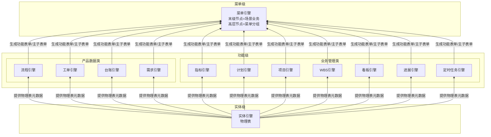

# EOS 引擎资产
**EOS Engine Assets**

**文档版本**：v1.23
**创建日期**：2026-06-13
**修订日期**：2026-07-03
**状态**：主子表单引擎→功能引擎合并——三层装配链
**资产类型**：平台引擎资产
**权威状态源**：本文档 `附录C 状态处理队列`

> **文档定位**：EOS 平台引擎的详细定义资产清单。`wft02` 将 A1 引擎 BA IPO 的引擎详细定义写入本文件；`23-eos-output-architecture.md` 中 `/流程与IT/引擎` E2E 项目下的构件类型行引用本文件；`wft05` 和引擎开发者按需读取引擎定义。

---

## §1 平台架构总览


### 业务视角层级体系

EOS 平台使用四套视角层级描述业务在不同维度上的组织结构：

| 视角 | 编号 | 自上而下 |
|------|------|---------|
| **ML**（菜单视角） | M0→M4 | 平台 → 一级菜单 → 二级菜单 → 三级菜单 → 末级菜单（→SL5） |
| **SL**（角色场景视角） | SL0→SL6 | 平台 → 业务域 → 产品类型 → 角色 → 角色职责 → 场景业务 → 场景部件/主子表单 |
| **PL**（输出产品视角） | PL0→PL5 | 平台 → 业务域 → 产品类型 → 构件 → WBS → 输出文档（→SL6） |
| **EL**（引擎视角） | EL1→EL3 | 菜单引擎 → 功能引擎 → 实体引擎 |

> 本文档聚焦 **EL**（引擎视角）和 **SL5**（场景业务）层级。其余视角层级的完整定义见 `23-eos-output-architecture.md` 和 `24-eos-business-assets.md`。

### 1.1 引擎全景

| 序号 | 引擎ID | 名称 | 层级 | 一句话定义 | 配置单元数 | 状态 |
|------|--------|------|------|-----------|-----------|------|
| 1 | @engine-entity | [实体引擎](#eng-entity) | 实体级 | 基于数据库生成物理表，并为该物理表配置访问权限 | 9 | 待确认 |
| 2 | @engine-ledger | 台账引擎 | 功能级（产品数据类） | 基于物理表配置台账视图、查询条件、列表列和汇总规则，为物理表生成台账型功能表单 | 待填充 | 待确认 |
| 3 | @engine-requirement | 需求引擎 | 功能级（产品数据类） | 待填充 | 待填充 | 待确认 |
| 4 | @engine-flow | [流程引擎](#eng-flow) | 功能级（产品数据类） | 配置流程节点、流转规则、审批行为和状态迁移，为物理表生成流程型功能表单 | 3 | 待确认 |
| 5 | @engine-workorder | [工单引擎](#eng-workorder) | 功能级（产品数据类） | 配置工单类型、派发规则、处理流程、验收标准和归档策略，为物理表生成工单型功能表单 | 待填充 | 待确认 |
| 6 | @engine-project | 项目引擎 | 功能级（业务管理类） | 基于物理表配置项目对象、阶段、里程碑、成员和项目状态，为物理表生成项目型功能表单 | 待填充 | 待确认 |
| 7 | @engine-wbs | WBS 引擎 | 功能级（业务管理类） | 基于物理表配置 WBS 层级、分解规则、节点属性和进度汇总方式，为物理表生成 WBS 型功能表单 | 待填充 | 待确认 |
| 8 | @engine-task | 计划引擎 | 功能级（业务管理类） | 基于物理表配置计划任务、时间约束、依赖关系和执行状态，为物理表生成计划型功能表单 | 待填充 | 待确认 |
| 9 | @engine-kanban | 看板引擎 | 功能级（业务管理类） | 基于物理表配置看板视图、卡片布局、状态泳道和筛选规则，为物理表生成看板型功能表单 | 待填充 | 待确认 |
| 10 | @engine-indicator | [指标引擎](#eng-indicator) | 功能级（业务管理类） | 配置指标维度、度量口径、聚合规则和展示方式，为物理表生成指标型功能表单 | 3 | 待确认 |
| 11 | @engine-progress | 进展引擎 | 功能级（业务管理类） | 基于物理表配置进展填报、进度口径、状态更新和进展记录，为物理表生成进展型功能表单 | 待填充 | 待确认 |
| 12 | @engine-scheduler | 定时任务引擎 | 功能级（业务管理类） | 基于物理表配置定时触发规则、任务事件和执行策略，为物理表生成定时任务型功能表单 | 待填充 | 待确认 |
| 13 | @engine-menu | [菜单引擎](#eng-menu) | 菜单级 | 配置菜单树节点：非末级节点定义所属节点、显示顺序、可见性和可达性权限；末级节点定义所包含的主子表单部件、显示顺序和依赖关系（即场景业务），以及节点可见性和可达性权限 | 1 | 待确认 |

| 统计 | 引擎资产项 13 | 配置单元类型数 22 | 自研 13 | 外购 0 | 自研+外购 0 | 待确认 13 | 已确认 0 | 废弃 0 |
|------|---------|------------------|--------|--------|-------------|----------|----------|--------|

> **EL 层级说明**：EL 三层中，「功能引擎」是层级（EL2）而非独立引擎资产。§1.1 表中 11 个具体功能引擎（台账/需求/流程/工单/项目/WBS/计划/看板/指标/进展/定时任务）均归属功能级，共享 §2.2 定义的表单能力与组装能力。菜单引擎（EL1）和实体引擎（EL3）同时是层级名称和该层级唯一的引擎资产。
|------|---------|------------------|--------|--------|-------------|----------|----------|--------|

### 1.2 引擎层次关系

**图1：引擎装配层次**


```mermaid
graph BT
  subgraph 实体级
    ENTITY[实体引擎<br/>物理表]
  end
  subgraph 功能级
    subgraph 产品数据类
      LEDGER[台账引擎]
      REQ[需求引擎]
      FLOW[流程引擎]
      WO[工单引擎]
    end
    subgraph 业务管理类
      PROJ[项目引擎]
      WBS[WBS引擎]
      TASK[计划引擎]
      KANBAN[看板引擎]
      IND[指标引擎]
      PROG[进展引擎]
      SCH[定时任务引擎]
    end
  end
  subgraph 菜单级
    MENU[菜单引擎<br/>末级节点=场景业务<br/>高层节点=菜单分组]
  end
  ENTITY -->|提供物理表元数据| FLOW
  ENTITY -->|提供物理表元数据| WO
  ENTITY -->|提供物理表元数据| LEDGER
  ENTITY -->|提供物理表元数据| REQ
  ENTITY -->|提供物理表元数据| IND
  ENTITY -->|提供物理表元数据| TASK
  ENTITY -->|提供物理表元数据| PROJ
  ENTITY -->|提供物理表元数据| WBS
  ENTITY -->|提供物理表元数据| KANBAN
  ENTITY -->|提供物理表元数据| PROG
  ENTITY -->|提供物理表元数据| SCH
  FLOW -->|生成功能表单/主子表单| MENU
  WO -->|生成功能表单/主子表单| MENU
  IND -->|生成功能表单/主子表单| MENU
  LEDGER -->|生成功能表单/主子表单| MENU
  REQ -->|生成功能表单/主子表单| MENU
  TASK -->|生成功能表单/主子表单| MENU
  PROJ -->|生成功能表单/主子表单| MENU
  WBS -->|生成功能表单/主子表单| MENU
  KANBAN -->|生成功能表单/主子表单| MENU
  PROG -->|生成功能表单/主子表单| MENU
  SCH -->|生成功能表单/主子表单| MENU
```

**图2：三层装配链文本图**

```text
实体引擎 ──→ 物理表
  │
  └── 功能引擎 ──→ 功能表单 / 主子表单
        │
        └── 菜单引擎 ──→ 菜单树高层节点 + 末级菜单（场景业务）
```

三层引擎自底向上逐级装配：实体引擎产出物理表，功能引擎将其转换为功能表单并按主子关系组装为主子表单，菜单引擎编排场景业务并生成菜单树。上层消费下层产物，逐级递进。

---

### 1.3 引擎职责与横切规则

**实体引擎**：

- 基于数据库生成物理表，并为物理表配置行/列级数据访问权限。
- 物理表是功能引擎和菜单引擎的元数据基础。

**功能引擎**：

- 将物理表转换为功能表单——功能表单以一定样式展现，并使得物理表中的数据具有运算、流转和被操作的能力。
- 承载三方面能力：① 表单能力——表单结构/字段/布局/校验/行为/发布，是各具体功能引擎的共享展现基础设施；② 功能能力——各具体功能引擎为功能表单增加的功能；③ 组装能力——将一组（1+N 个，N≥0）功能表单按主子业务关系组装为主子表单，基于主表单行数据内容匹配子表单显示规则，动态确定展示子表单集合，支持双击下钻和持续下钻。
- 功能引擎分为两个子类（仅为分类口径，非独立引擎资产）：
  - **产品数据类**：台账引擎、需求引擎、流程引擎、工单引擎。支撑各类产品数据的开发与管理；同一功能引擎所支撑的不同类型产品数据，一般对应不同实体。
  - **业务管理类**：项目引擎、WBS 引擎、计划引擎、看板引擎、指标引擎、进展引擎、定时任务引擎。支撑过程管理数据的生成与管理；同一功能引擎支撑的管理数据，一般对应同一实体。

**菜单引擎**（含场景编排）：

- **非末级节点**：定义所属父节点、显示顺序、可见性和可达性权限。
- **末级节点**：定义所包含的主子表单部件、显示顺序和依赖关系——此主子表单序列称为**场景业务**（SL5）；同时定义该末级节点的可见性和可达性权限。
- 场景业务定义后，菜单引擎生成并维护多级菜单树，控制角色/人员的导航可达性。

**权限归属**：

- 菜单节点对角色/人员的可见或不可见规则，由菜单引擎承载。
- 物理表数据行或列对角色/人员的权限，由实体引擎承载。

**配置单元选配模型**：每个引擎包含若干配置单元（可独立选配的 IPO），部分配置单元即可让业务运行——引擎提供能力池，配置人员按业务需要从中挑选组合，非全量必配。

---

### 1.4 场景业务及输出文档

STR-F（相关方功能需求架构末级节点）以场景业务为组织单元。每个 STR-F 对应一条场景业务，内部为一组有先后流转依赖的**输出文档序列**。

场景业务由菜单引擎的末级节点编排支撑（详见 [§1.3](#13-引擎职责与横切规则) 菜单引擎）——末级节点定义所包含的主子表单部件、显示顺序和依赖关系，此主子表单序列即场景业务（SL5）。菜单引擎对每条场景业务无条件支撑，无需判定。

```
场景业务
  │
  ├── 输出文档1
  ├── 输出文档2
  ├── 输出文档3
  ├── ...
  └── 输出文档N
```

**输出文档**是 STR-F 的组成单元。输出文档按业务输出物形态判定文档类型、开发方式和候选引擎支撑链，一个文档只对应一种文档类型。文档之间有先后依赖和流转关系。

输出文档按生成方式分为两类：

**内置 CAX**（平台内引擎生成）：输出文档的内容由 EOS 功能引擎直接生成，用户在平台上操作引擎界面完成。其条目化内容沿三层装配链（详见 [§1.2](#12-引擎层次关系)）逐级生成——对应一个物理表（实体引擎），物理表转换为功能表单并由功能引擎按主子关系组装为主子表单。例如：流程引擎生成审批记录、台账引擎生成台账数据、指标引擎生成指标值。

**外置 CAX**（平台外工具生成）：输出文档由平台外部 CAX 工具生成，用户在 CAX 工具中完成实质转换。文档以文件名及附件形式回传至 EOS 平台，平台负责管理其任务、状态、责任人、版本、附件、评审和归档。

两种方式对应不同的引擎支撑链和配置单元选配剖面（详见 [§1.6](#16-业务生成与引擎推导)），不需要新引擎类型。

**STR-F 的两种类型**（由 AI 根据 OR 语义判定，同一角色可同时有两种类型）：

| 类型 | 识别词 |
|------|--------|
| **执行类（D）** | OR 描述执行活动——创建/提交/审批/交付/验收等动作词 |
| **管理类（PCA）** | OR 描述管理活动——计划/监控/分析/纠正/识别等动作词 |

**执行类（D）场景业务**：覆盖从需求提出到需求满足的完整链路，文档之间有明确的输入-输出传递关系，串行推进。端到端闭环标准为 **D 闭合**——从需求提出到需求被满足，无缺失环节。输出文档由产品数据类功能引擎（台账/需求/流程/工单）为主支撑。例如：

- 系统设计：原始需求→相关方需求→业务架构→产品架构
- 构件开发：构件方案→构件代码/图纸/工艺→测试方案/工艺→测试报告
- 物料采购：物料需求计划→采购订单→采购合同→物料接收记录→物料检验记录→物料入库记录

**管理类（PCA）场景业务**：覆盖策划→监控→改进的管理闭环，文档序列以管理对象为锚点，监控文档指回策划文档，改进文档源自监控发现。端到端闭环标准为 **PCA 闭合**——从目标提出到目标被实现，无缺失环节。输出文档由业务管理类功能引擎（项目/WBS/计划/看板/指标/进展/定时任务）为主支撑。例如：

- 策划：计划清单、指标清单
- 监控：计划进展、指标值、问题清单、风险清单
- 改进：行动项（计划）清单、个人和组织绩效评价

两类场景业务的输出文档在功能引擎组装时，其功能表单可互为子表单。例如：WBS（管理类）的子业务可以是产品数据文档（执行类），零部件清单（执行类）也可下挂检验计划（管理类）作为子表单。通过主子表单的交叉嵌套，执行类与管理类不是两条平行线，而是管理驱动业务、业务承载管理的融合闭环。

---

### 1.5 用户界面

用户单击菜单引擎发布的末级菜单进入场景业务，运行时 UI 遵循以下交互模型：

**初始态**：浏览器窗口为**单窗全宽**，顶部多 TAB 对应场景业务下的多个主子表单；选中一行数据双击可下钻。

```
┌─────────────────────────────────────────────────────────┐
│ [TAB: 主子表单A] [TAB: 主子表单B] [TAB: 主子表单C]      │
│                                                         │
│  ┌───────────────────────────────────────────────┐      │
│  │ 主表单（列表/树表）                              │      │
│  │ ┌────┬────┬────┬────┐                         │      │
│  │ │行1 │    │    │    │                         │      │
│  │ │行2*│ ← 双击选中行                              │      │
│  │ │行3 │    │    │    │                         │      │
│  │ └────┴────┴────┴────┘                         │      │
│  └───────────────────────────────────────────────┘      │
│                                                         │
│  底部导航面包屑：场景业务 > 主子表单A                     │
└─────────────────────────────────────────────────────────┘
```

**分屏态**（下钻触发）：双击主表单行数据 → 窗口分裂为左右双窗。左窗为原主子表单（变窄），右窗显示选中行数据的子表单；右窗 TAB 对应子业务，每个关联实体占一个 TAB。

```
┌───────────────────────┬─────────────────────────────────┐
│ 左窗（原窗变窄）        │ 右窗（新开）                     │
│                       │                                 │
│ [TAB: 主子表单A]      │ [TAB: 子业务X] [TAB: 子业务Y]    │
│ ┌──────────────┐      │ ┌─────────────────────────┐     │
│ │行1           │      │ │ 选中行的子业务数据         │     │
│ │行2*          │      │ │ ┌────┬────┬────┬────┐   │     │
│ │行3           │      │ │ │行a │    │    │    │   │     │
│ └──────────────┘      │ │ │行b*│ ← 可继续双击下钻     │     │
│                       │ │ └────┴────┴────┴────┘   │     │
│                       │ └─────────────────────────┘     │
│                       │                                 │
│ 导航：场景业务 > 主子表单A│ 导航：场景业务 > 主子表单A      │
│                       │       > 子业务X                 │
└───────────────────────┴─────────────────────────────────┘
```

**持续下钻**：在右窗双击行 → 右窗移至左窗，新子业务 TAB 出现在右窗位置。可一直下钻直至系统下钻层级数限制。

```
┌───────────────────────┬─────────────────────────────────┐
│ 左窗：子业务X          │ 右窗：子子业务Z                   │
│ ...                   │ ...                             │
└───────────────────────┴─────────────────────────────────┘
```

**面包屑导航**：页面底部常驻导航条，显示当前层级路径，支持双击任意节点跳转至该层级。

```
场景业务 > 主子表单A > 子业务X > 子子业务Z
```

**交互规则**：

| 规则 | 说明 |
|------|------|
| 初始单窗 | 进入场景业务时为单窗全宽，不下钻不分屏 |
| 主子表单 TAB | 顶部 TAB 对应该场景业务下的多个主子表单 |
| 首次下钻 | 在主表单双击某一行数据触发分屏，右窗显示子表单数据 |
| 递归下钻 | 右窗→左窗，新右窗出现，直到系统层级数限制 |
| 面包屑导航 | 底部常驻，显示当前层级路径；双击任意节点跳转至该层级 |
| 子表单显示规则 | 功能引擎基于主表单行数据内容匹配规则，动态确定展示子表单集合 |

---

### 1.6 业务生成与引擎推导

**三层装配链**（自底向上，各引擎职责详见 [§1.3](#13-引擎职责与横切规则)）：

- **物理表**（实体引擎）→ **功能表单 / 主子表单**（功能引擎）→ **场景业务 + 菜单树**（菜单引擎）
- 每一层引擎消费上一层的产物，生成下一层的输入，逐级装配直至平台可发布的末级菜单。

**输出文档推导**（自顶向下）：

STR-F 架构末级节点是场景业务（详见 [§1.4](#14-场景业务及输出文档)），场景业务由输出文档序列细化定义——每个输出文档描述一件业务输出物的内容、流转关系和功能需求。输出文档按是否条目化且在 EOS 平台上运行管理，分两条路径推导其支撑引擎链（两种生成方式详见 [§1.4](#14-场景业务及输出文档)）：

**内置 CAX**（输出文档条目化且在 EOS 平台运行管理）——沿三层装配链逐级推导：

- **文档内容 → 实体引擎**：输出文档的条目化内容对应一个物理表，由实体引擎生成并配置访问权限。
- **物理表 → 功能引擎**：物理表由功能引擎转换为功能表单，按文档内容需求确定支撑其功能集的具体功能引擎；若该输出文档与其他文档存在主子业务关系，由功能引擎将对应的功能表单按1+N组装为主子表单。

**外置 CAX**（输出文档非条目化或不在 EOS 平台管理）——文档以文件名及附件形式存在于 EOS 平台，简化装配链：

- **承载表单 → 计划引擎**：输出文档挂接到计划功能表单，由计划引擎作为承载型主表单，管理其任务、状态、责任人、版本、附件、评审和归档。
- **附件能力 → 实体引擎**：附件能力由实体引擎的内置子业务配置单元（`@entity-cu-builtin-subbiz`）提供。
- **组装 → 功能引擎**：计划功能表单作为主表单，N=0（无额外功能表单作为子表单），由功能引擎按1+N组装为主子表单。

**汇聚**：无论内置或外置 CAX，全部主子表单序列由菜单引擎末级节点编排，并生成平台菜单入口。

---

## §2 引擎定义

### 2.1 菜单引擎

<!-- BLOCK: ENGINE-MENU -->
<a id="eng-menu"></a>
#### 2.1.1 菜单引擎定义

**当前状态**：待确认
**引擎层级**：菜单级
**实现策略**：自研
**块ID**：ENGINE-MENU

| 要素 | 内容 |
|------|------|
| 定义 | EOS 平台菜单树的生成与维护引擎，含场景编排能力。配置菜单树节点时：① 若节点为非末级节点，定义其所属父节点、显示顺序、可见性和可达性权限；② 若节点为末级节点，定义该节点所包含的主子表单部件、显示顺序和依赖关系——此主子表单序列称为**场景业务**（SL5），同时定义该末级节点的可见性和可达性权限 |
| 依赖引擎 | @engine-function（末级节点编排的主子表单由功能引擎生成） |
| 对外接口简述 | 场景编排配置/保存/发布接口；菜单树 CRUD 接口；菜单节点可见性配置接口；运行期菜单树加载、场景业务加载、多窗口布局、主子表单导航、菜单可见性判断和场景导航接口 |
| 配置单元类型 | @menu-cu-basic |
| 支持的业务 | 菜单树（末级菜单 为末级菜单，高层菜单节点 为高层菜单分组）；场景业务（末级节点编排的主子表单序列） |
| 来源节点 | @node-menu |
| 实现约束 | 菜单树固定四级，末级为 末级菜单；一个 末级菜单对应一个 场景业务；高层菜单节点 只承载分组、菜单节点可见性和导航；场景编排依赖功能引擎提供的主子表单注册，需支持跨主子表单的流程衔接、上下文传递和端到端业务闭环 |

##### 反馈交互区

人类反馈

结论（同意 / 修改 / 删除）：—

意见（修改或删除时填写）：—

AI处理

结论（已处理 / 待反馈）：—

建议（待反馈时填写）：—

#### 2.1.2 配置单元总览

| 配置单元类型ID | 名称 | 对应系统实体 | 依赖配置单元 |
|-----------|------|--------------|----------|
| @menu-cu-basic | [菜单标签配置单元](#cu-menu-cu-basic) | MenuLabel | — |

##### 反馈交互区

人类反馈

结论（同意 / 修改 / 删除）：—

意见（修改或删除时填写）：—

AI处理

结论（已处理 / 待反馈）：—

建议（待反馈时填写）：—

<a id="cu-menu-cu-basic"></a>
#### 2.1.3 @menu-cu-basic — 菜单标签配置单元

| 要素 | 内容 |
|------|------|
| 对应系统实体 | MenuLabel |
| 配置页面 | 菜单管理页 |
| Input | 菜单名称、层级（菜单树层级）、父级节点、末级映射场景业务、可见角色 / 人员清单、不可见角色 / 人员清单 |
| Process | 校验菜单层级、场景业务映射和可见性规则，保存菜单节点元数据 |
| Output | 运行期菜单树渲染、导航和菜单节点可见性判断能力 |
| 依赖配置单元 | — |
| 实例化规则 | 当业务需要构建菜单导航或新增场景业务入口时实例化 |

##### 反馈交互区

人类反馈

结论（同意 / 修改 / 删除）：—

意见（修改或删除时填写）：—

AI处理

结论（已处理 / 待反馈）：—

建议（待反馈时填写）：—

<!-- /BLOCK: ENGINE-MENU -->

### 2.2 功能引擎

<!-- BLOCK: ENGINE-FUNCTION -->
<a id="eng-function"></a>
#### 2.2.1 功能引擎定义

**资产定位**：功能引擎层级的共享能力定义（非独立引擎资产）。§1.1 中的 11 个具体功能引擎均归属本层级，共享表单能力与组装能力
**当前状态**：待确认
**引擎层级**：功能级
**实现策略**：自研
**块ID**：ENGINE-FUNCTION

| 要素 | 内容 |
|------|------|
| 定义 | 将物理表转换为功能表单，并将功能表单按主子关系组装为主子表单的能力引擎。承载三方面能力：① 表单能力——表单结构/字段/布局/校验/行为/发布，是各具体功能引擎的共享展现基础设施；② 功能能力——各具体功能引擎为功能表单增加的功能；③ 组装能力——将一组（1+N 个，N≥0）功能表单按主子业务关系组装为主子表单，基于主表单行数据内容匹配子表单显示规则，动态确定展示子表单集合，支持双击下钻和持续下钻。具体功能引擎分为两子类（仅为分类口径，非独立引擎资产）：**产品数据类**（台账引擎、需求引擎、流程引擎、工单引擎）支撑各类产品数据开发与管理，同一引擎支撑的不同类型产品数据一般对应不同实体；**业务管理类**（项目引擎、WBS 引擎、计划引擎、看板引擎、指标引擎、进展引擎、定时任务引擎）支撑过程管理数据的生成与管理，同一引擎支撑的管理数据一般对应同一实体 |
| 依赖引擎 | @engine-entity（实体引擎提供物理表元数据和主子业务关系） |
| 对外接口简述 | 表单能力接口：配置保存/校验/发布，运行期功能表单渲染、数据读取、字段取值计算、显示规则执行、数据提交和校验；功能能力接口：各具体功能引擎的功能配置保存/校验/发布，运行期功能表单加载、功能按钮/右键操作项/快捷键触发、执行、状态更新和结果输出；组装能力接口：主子表单配置/保存/发布，子表单显示规则配置，运行期主子表单加载、子表单显示规则匹配、主表单与子表单切换、主子上下文传递、双击下钻和下钻导航 |
| 配置单元类型 | 表单能力：@form-cu-structure, @form-cu-field, @form-cu-layout, @form-cu-validation, @form-cu-behavior, @form-cu-release；各具体功能引擎的功能配置单元类型见各自章节（§2.3~§2.6） |
| 支持的业务 | 需要数据录入、展示、编辑、字段取值联动、显示控制、提交或附件采集的功能表单；产品数据类功能表单（台账管理/需求管理/审批流转/工单派发执行跟踪）；业务管理类功能表单（项目管理/WBS分解/计划任务管理/看板展示/指标度量/进展填报/定时任务）；主子表单 |
| 来源节点 | — |
| 实现约束 | 功能引擎是实体引擎的下游消费引擎，依赖实体引擎提供的物理表元数据、数据行/列权限、实体关系和字典引用；各具体功能引擎共享表单能力作为功能表单的展现基础设施；一个物理表可生成多个功能表单，功能表单通过表单标签上的功能按钮、右键操作项或快捷键触发具体功能；主子表单组装受实体关系约束，必须有且只有一个主表单，可有 N 个子表单（N≥0）；子表单显示由规则驱动，主表单行数据双击下钻时按上下文和显示规则过滤展示；未建立主子关系的功能表单不应被强行组装 |

##### 反馈交互区

人类反馈

结论（同意 / 修改 / 删除）：—

意见（修改或删除时填写）：—

AI处理

结论（已处理 / 待反馈）：—

建议（待反馈时填写）：—

#### 2.2.2 配置单元总览

| 配置单元类型ID | 名称 | 对应系统实体 | 依赖配置单元 |
|-----------|------|--------------|----------|
| @form-cu-structure | [表单结构配置单元](#cu-form-cu-structure) | FormDefinition | — |
| @form-cu-field | [字段定义配置单元](#cu-form-cu-field) | FieldDefinition | @form-cu-structure |
| @form-cu-layout | [布局配置单元](#cu-form-cu-layout) | LayoutDefinition | @form-cu-field |
| @form-cu-validation | [校验规则配置单元](#cu-form-cu-validation) | ValidationRule | @form-cu-field |
| @form-cu-behavior | [表单行为配置单元](#cu-form-cu-behavior) | BehaviorRule | @form-cu-field |
| @form-cu-release | [表单发布配置单元](#cu-form-cu-release) | FormVersion / ReleaseRecord | @form-cu-structure / @form-cu-field / @form-cu-layout |

##### 反馈交互区

人类反馈

结论（同意 / 修改 / 删除）：—

意见（修改或删除时填写）：—

AI处理

结论（已处理 / 待反馈）：—

建议（待反馈时填写）：—

<a id="cu-form-cu-structure"></a>
#### 2.2.3 @form-cu-structure — 表单结构配置单元

| 要素 | 内容 |
|------|------|
| 对应系统实体 | FormDefinition |
| 配置页面 | 表单设计器 / 表单基本信息页 |
| Input | 表单名称、业务对象、数据源、表单类型、版本策略 |
| Process | 校验表单唯一性和业务对象绑定关系，保存表单定义元数据 |
| Output | 业务获得可被渲染的表单页面骨架 |
| 依赖配置单元 | — |
| 实例化规则 | 当业务需要录入、展示或提交业务对象时实例化 |

##### 反馈交互区

人类反馈

结论（同意 / 修改 / 删除）：—

意见（修改或删除时填写）：—

AI处理

结论（已处理 / 待反馈）：—

建议（待反馈时填写）：—

<a id="cu-form-cu-field"></a>
#### 2.2.4 @form-cu-field — 字段定义配置单元

| 要素 | 内容 |
|------|------|
| 对应系统实体 | FieldDefinition |
| 配置页面 | 表单设计器字段面板 |
| Input | 字段名、字段类型、标签、默认值、必填、引用对象、业务字段映射 |
| Process | 校验字段定义并绑定表单、业务对象字段和数据源 |
| Output | 运行期表单字段渲染、录入、展示和业务实体字段映射能力 |
| 依赖配置单元 | @form-cu-structure |
| 实例化规则 | 当业务包含可录入、展示、计算或引用的字段时实例化 |

##### 反馈交互区

人类反馈

结论（同意 / 修改 / 删除）：—

意见（修改或删除时填写）：—

AI处理

结论（已处理 / 待反馈）：—

建议（待反馈时填写）：—

<a id="cu-form-cu-layout"></a>
#### 2.2.5 @form-cu-layout — 布局配置单元

| 要素 | 内容 |
|------|------|
| 对应系统实体 | LayoutDefinition |
| 配置页面 | 表单设计器布局面板 |
| Input | 分组、列数、标签页、显示顺序、折叠区、明细表布局、字段显示 / 隐藏规则、字段只读 / 可编辑规则 |
| Process | 校验布局引用字段和显示规则，保存布局元数据并绑定表单版本 |
| Output | 运行期页面分组、标签页、明细区、显示顺序、字段显示 / 隐藏和只读 / 可编辑控制能力 |
| 依赖配置单元 | @form-cu-field |
| 实例化规则 | 当业务需要友好的录入 / 查看页面时实例化 |

##### 反馈交互区

人类反馈

结论（同意 / 修改 / 删除）：—

意见（修改或删除时填写）：—

AI处理

结论（已处理 / 待反馈）：—

建议（待反馈时填写）：—

<a id="cu-form-cu-validation"></a>
#### 2.2.6 @form-cu-validation — 校验规则配置单元

| 要素 | 内容 |
|------|------|
| 对应系统实体 | ValidationRule |
| 配置页面 | 字段 / 表单校验配置页 |
| Input | 必填、范围、格式、唯一性、跨字段表达式、字段间取值约束、提交校验规则 |
| Process | 解析并保存校验规则和字段间取值约束，绑定字段、表单和触发点 |
| Output | 用户录入、保存、提交时的字段取值校验和提示能力 |
| 依赖配置单元 | @form-cu-field |
| 实例化规则 | 当业务存在数据质量、规则或合规校验要求时实例化 |

##### 反馈交互区

人类反馈

结论（同意 / 修改 / 删除）：—

意见（修改或删除时填写）：—

AI处理

结论（已处理 / 待反馈）：—

建议（待反馈时填写）：—

<a id="cu-form-cu-behavior"></a>
#### 2.2.7 @form-cu-behavior — 表单行为配置单元

| 要素 | 内容 |
|------|------|
| 对应系统实体 | BehaviorRule |
| 配置页面 | 表单行为 / 联动配置页 |
| Input | 字段联动、字段间取值规则、自动带出、条件显示、提交前后动作、按钮动作、附件动作 |
| Process | 解析行为规则、字段取值规则和显示规则，绑定触发事件和执行动作 |
| Output | 页面联动、自动填充、字段取值计算、条件显示、按钮操作和提交处理能力 |
| 依赖配置单元 | @form-cu-field |
| 实例化规则 | 当业务需要页面交互、自动处理或提交动作时实例化 |

##### 反馈交互区

人类反馈

结论（同意 / 修改 / 删除）：—

意见（修改或删除时填写）：—

AI处理

结论（已处理 / 待反馈）：—

建议（待反馈时填写）：—

<a id="cu-form-cu-release"></a>
#### 2.2.8 @form-cu-release — 表单发布配置单元

| 要素 | 内容 |
|------|------|
| 对应系统实体 | FormVersion / ReleaseRecord |
| 配置页面 | 表单发布页 |
| Input | 版本号、生效范围、生效时间、灰度范围、回滚策略 |
| Process | 校验配置完整性，生成版本记录并发布到运行期 |
| Output | 正式可用、可回滚、可审计的表单运行能力 |
| 依赖配置单元 | @form-cu-structure / @form-cu-field / @form-cu-layout |
| 实例化规则 | 当表单配置需要上线运行时实例化 |

##### 反馈交互区

人类反馈

结论（同意 / 修改 / 删除）：—

意见（修改或删除时填写）：—

AI处理

结论（已处理 / 待反馈）：—

建议（待反馈时填写）：—

<!-- /BLOCK: ENGINE-FUNCTION -->

### 2.3 流程引擎

<!-- BLOCK: ENGINE-FLOW -->
<a id="eng-flow"></a>
#### 2.3.1 流程引擎定义

**当前状态**：待确认
**引擎层级**：功能级
**实现策略**：自研
**块ID**：ENGINE-FLOW

| 要素 | 内容 |
|------|------|
| 定义 | 通过配置流程节点、流转规则、审批行为和状态迁移，为物理表生成流程型功能表单的引擎 |
| 依赖引擎 | @engine-entity |
| 对外接口简述 | 流程设计 / 保存 / 发布接口；运行期流程驱动、状态迁移、审批执行和流程监控接口 |
| 配置单元类型 | @flow-cu-definition, @flow-cu-version, @flow-cu-node-config |
| 支持的业务 | 需要审批流转、状态迁移或步骤驱动的功能表单 |
| 来源节点 | @node-flow |
| 实现约束 | 流程运行依赖功能引擎提供的功能表单和实体引擎提供的物理表 |

##### 反馈交互区

人类反馈

结论（同意 / 修改 / 删除）：—

意见（修改或删除时填写）：—

AI处理

结论（已处理 / 待反馈）：—

建议（待反馈时填写）：—

#### 2.3.2 配置单元总览

| 配置单元类型ID | 名称 | 对应系统实体 | 依赖配置单元 |
|-----------|------|--------------|----------|
| @flow-cu-definition | [流程定义配置单元](#cu-flow-cu-definition) | FlowDefinition | — |
| @flow-cu-version | [流程版本配置单元](#cu-flow-cu-version) | FlowVersion | @flow-cu-definition |
| @flow-cu-node-config | [流程节点配置单元](#cu-flow-cu-node-config) | FlowNodeConfig | @flow-cu-definition |

##### 反馈交互区

人类反馈

结论（同意 / 修改 / 删除）：—

意见（修改或删除时填写）：—

AI处理

结论（已处理 / 待反馈）：—

建议（待反馈时填写）：—

<a id="cu-flow-cu-definition"></a>
#### 2.3.3 @flow-cu-definition — 流程定义配置单元

| 要素 | 内容 |
|------|------|
| 对应系统实体 | FlowDefinition |
| 配置页面 | 流程设计器 / 流程定义页 |
| Input | 流程名称、业务对象、流程分类、启动方式 |
| Process | 校验流程定义唯一性和业务对象绑定，保存流程定义元数据 |
| Output | 业务获得可被编排的流程定义骨架 |
| 依赖配置单元 | — |
| 实例化规则 | 当业务需要审批流转或步骤驱动时实例化 |

##### 反馈交互区

人类反馈

结论（同意 / 修改 / 删除）：—

意见（修改或删除时填写）：—

AI处理

结论（已处理 / 待反馈）：—

建议（待反馈时填写）：—

<a id="cu-flow-cu-version"></a>
#### 2.3.4 @flow-cu-version — 流程版本配置单元

| 要素 | 内容 |
|------|------|
| 对应系统实体 | FlowVersion |
| 配置页面 | 流程设计器版本管理页 |
| Input | 版本号、版本说明、生效策略、升版规则 |
| Process | 校验版本定义，保存版本记录，管理版本生命周期 |
| Output | 业务获得可发布、可回滚、可审计的流程版本能力 |
| 依赖配置单元 | @flow-cu-definition |
| 实例化规则 | 当流程定义需要管理版本时实例化 |

##### 反馈交互区

人类反馈

结论（同意 / 修改 / 删除）：—

意见（修改或删除时填写）：—

AI处理

结论（已处理 / 待反馈）：—

建议（待反馈时填写）：—

<a id="cu-flow-cu-node-config"></a>
#### 2.3.5 @flow-cu-node-config — 流程节点配置单元

| 要素 | 内容 |
|------|------|
| 对应系统实体 | FlowNodeConfig |
| 配置页面 | 流程设计器节点配置面板 |
| Input | 流程图绘制、全局变量定义、节点基本信息、节点关联表单、节点办理人/传阅人配置、节点操作项、子业务校验规则、节点事件配置、超时流转规则 |
| Process | 校验并保存节点配置，绑定流转关系、表单和组织数据 |
| Output | 运行期流程按配置执行节点流转、审批、事件触发和超时处理能力 |
| 依赖配置单元 | @flow-cu-definition |
| 实例化规则 | 当流程定义需要配置具体节点和流转路径时实例化 |

##### 反馈交互区

人类反馈

结论（同意 / 修改 / 删除）：—

意见（修改或删除时填写）：—

AI处理

结论（已处理 / 待反馈）：—

建议（待反馈时填写）：—

<!-- /BLOCK: ENGINE-FLOW -->

### 2.4 指标引擎

<!-- BLOCK: ENGINE-INDICATOR -->
<a id="eng-indicator"></a>
#### 2.4.1 指标引擎定义

**当前状态**：待确认
**引擎层级**：功能级
**实现策略**：自研
**块ID**：ENGINE-INDICATOR

| 要素 | 内容 |
|------|------|
| 定义 | 通过配置指标维度、度量口径、聚合规则和展示方式，为物理表生成指标型功能表单的引擎 |
| 依赖引擎 | @engine-entity（从各引擎运行数据中采集指标源数据） |
| 对外接口简述 | 指标维度配置 / 聚合规则配置 / 保存 / 发布接口；运行期指标数据采集、计算、看板渲染和报表导出接口 |
| 配置单元类型 | @indicator-cu-metric, @indicator-cu-component, @indicator-cu-view |
| 支持的业务 | 需要度量、监控、分析和持续改进的功能表单，以及跨物理表、功能表单、主子表单、场景业务和菜单层级的指标汇总 |
| 来源节点 | — |
| 实现约束 | 指标引擎不直接生成业务操作，而是对各引擎运行数据进行聚合计算和可视化呈现；聚合口径需与业务定义的类型和层级对齐 |

##### 反馈交互区

人类反馈

结论（同意 / 修改 / 删除）：—

意见（修改或删除时填写）：—

AI处理

结论（已处理 / 待反馈）：—

建议（待反馈时填写）：—

#### 2.4.2 配置单元总览

| 配置单元类型ID | 名称 | 对应系统实体 | 依赖配置单元 |
|-----------|------|--------------|----------|
| @indicator-cu-metric | [指标定义配置单元](#cu-indicator-cu-metric) | MetricDefinition | — |
| @indicator-cu-component | [看板组件配置单元](#cu-indicator-cu-component) | DashboardComponent | @indicator-cu-metric |
| @indicator-cu-view | [看板视图配置单元](#cu-indicator-cu-view) | DashboardView | @indicator-cu-component |

##### 反馈交互区

人类反馈

结论（同意 / 修改 / 删除）：—

意见（修改或删除时填写）：—

AI处理

结论（已处理 / 待反馈）：—

建议（待反馈时填写）：—

<a id="cu-indicator-cu-metric"></a>
#### 2.4.3 @indicator-cu-metric — 指标定义配置单元

| 要素 | 内容 |
|------|------|
| 对应系统实体 | MetricDefinition |
| 配置页面 | 指标定义设计器 |
| Input | 指标名称、维度、度量口径、聚合规则、数据源 |
| Process | 校验指标定义，绑定数据源，保存指标元数据 |
| Output | 运行期指标数据采集、汇总计算和统计分析能力 |
| 依赖配置单元 | — |
| 实例化规则 | 当业务需要度量、监控或分析业务数据时实例化 |

##### 反馈交互区

人类反馈

结论（同意 / 修改 / 删除）：—

意见（修改或删除时填写）：—

AI处理

结论（已处理 / 待反馈）：—

建议（待反馈时填写）：—

<a id="cu-indicator-cu-component"></a>
#### 2.4.4 @indicator-cu-component — 看板组件配置单元

| 要素 | 内容 |
|------|------|
| 对应系统实体 | DashboardComponent |
| 配置页面 | 看板组件设计器 |
| Input | 组件类型、图表配置、关联指标、展示方式 |
| Process | 校验组件配置，绑定指标定义，保存组件元数据 |
| Output | 运行期看板组件渲染的可视化图表能力 |
| 依赖配置单元 | @indicator-cu-metric |
| 实例化规则 | 当业务需要以图表形式展示指标数据时实例化 |

##### 反馈交互区

人类反馈

结论（同意 / 修改 / 删除）：—

意见（修改或删除时填写）：—

AI处理

结论（已处理 / 待反馈）：—

建议（待反馈时填写）：—

<a id="cu-indicator-cu-view"></a>
#### 2.4.5 @indicator-cu-view — 看板视图配置单元

| 要素 | 内容 |
|------|------|
| 对应系统实体 | DashboardView |
| 配置页面 | 看板视图设计器 |
| Input | 视图布局、组件引入、展示范围、过滤条件 |
| Process | 校验视图配置，编排组件布局，保存视图元数据 |
| Output | 运行期完整的看板页面展示和报表导出能力 |
| 依赖配置单元 | @indicator-cu-component |
| 实例化规则 | 当业务需要将多个看板组件编排为完整看板页面时实例化 |

##### 反馈交互区

人类反馈

结论（同意 / 修改 / 删除）：—

意见（修改或删除时填写）：—

AI处理

结论（已处理 / 待反馈）：—

建议（待反馈时填写）：—

<!-- /BLOCK: ENGINE-INDICATOR -->

### 2.5 工单引擎

<!-- BLOCK: ENGINE-WORKORDER -->
<a id="eng-workorder"></a>
#### 2.5.1 工单引擎定义

**当前状态**：待确认
**引擎层级**：功能级
**实现策略**：自研
**块ID**：ENGINE-WORKORDER

| 要素 | 内容 |
|------|------|
| 定义 | 通过配置工单类型、派发规则、处理流程、验收标准和归档策略，为物理表生成工单型功能表单的引擎 |
| 依赖引擎 | @engine-entity |
| 对外接口简述 | 工单类型配置 / 派发规则配置 / 处理流程配置 / 保存 / 发布接口；运行期工单生成、派发、接收、处理、验收和归档接口 |
| 配置单元类型 | 待填充 |
| 支持的业务 | 需要任务派发、执行跟踪、结果验收或服务闭环的功能表单（如采购执行工单、质量检验工单、设备维修工单） |
| 来源节点 | — |
| 实现约束 | 工单引擎依赖功能引擎提供功能表单、实体引擎提供物理表；工单是流程驱动+功能表单承载的复合业务形态 |

##### 反馈交互区

人类反馈

结论（同意 / 修改 / 删除）：—

意见（修改或删除时填写）：—

AI处理

结论（已处理 / 待反馈）：—

建议（待反馈时填写）：—

#### 2.5.2 配置单元总览

> 待填充

##### 反馈交互区

人类反馈

结论（同意 / 修改 / 删除）：—

意见（修改或删除时填写）：—

AI处理

结论（已处理 / 待反馈）：—

建议（待反馈时填写）：—

<!-- /BLOCK: ENGINE-WORKORDER -->

### 2.6 计划引擎

<!-- BLOCK: ENGINE-TASK -->
<a id="eng-task"></a>
#### 2.6.1 计划引擎定义

**当前状态**：待确认
**引擎层级**：功能级
**实现策略**：自研
**块ID**：ENGINE-TASK

| 要素 | 内容 |
|------|------|
| 定义 | 通过配置计划任务、时间约束、依赖关系和执行状态，为物理表生成计划型功能表单的引擎。计划功能表单除支撑计划任务管理外，还承载外置 CAX 主子表单的主表单职责——管理输出文档的任务、状态、责任人、版本、附件、评审和归档 |
| 依赖引擎 | @engine-entity |
| 对外接口简述 | 计划任务类型配置 / 保存 / 发布接口；运行期计划任务生成、派发、执行跟踪、状态更新、附件管理和版本记录接口 |
| 配置单元类型 | 待填充 |
| 支持的业务 | 需要计划任务管理、任务派发、进度跟踪或外部 CAX 输出文档承载的业务 |
| 来源节点 | — |
| 实现约束 | 当计划功能表单用作外置 CAX 主子表单的主表单时，输出文档以附件 / 交付物 / 版本化成果挂接，不生成子表单；需支持任务派发、状态跟踪、附件管理和版本记录 |

##### 反馈交互区

人类反馈

结论（同意 / 修改 / 删除）：—

意见（修改或删除时填写）：—

AI处理

结论（已处理 / 待反馈）：—

建议（待反馈时填写）：—

#### 2.6.2 配置单元总览

> 待填充

##### 反馈交互区

人类反馈

结论（同意 / 修改 / 删除）：—

意见（修改或删除时填写）：—

AI处理

结论（已处理 / 待反馈）：—

建议（待反馈时填写）：—

<!-- /BLOCK: ENGINE-TASK -->

### 2.7 实体引擎

<!-- BLOCK: ENGINE-ENTITY -->
<a id="eng-entity"></a>
#### 2.8.1 实体引擎定义

**当前状态**：待确认
**引擎层级**：实体级
**实现策略**：自研
**块ID**：ENGINE-ENTITY

| 要素 | 内容 |
|------|------|
| 定义 | 基于数据库生成物理表，并为该物理表配置访问权限的能力引擎。通过配置业务对象的数据表元数据、字段名称、字段类型、字段格式、主键、外键、索引字段、字段业务逻辑、生命周期和行/列级数据权限，生成物理表及其元数据。实体引擎是上层引擎的基础，功能引擎依赖实体引擎提供的物理表元数据和数据权限结果 |
| 依赖引擎 | — |
| 对外接口简述 | 实体定义配置 / 保存 / 发布接口；运行期实体查询、创建、更新、删除和关系管理接口 |
| 配置单元类型 | @entity-cu-basic, @entity-cu-field, @entity-cu-action, @entity-cu-builtin-subbiz, @entity-cu-subbiz, @entity-cu-derive, @entity-cu-lifecycle, @entity-cu-notification, @entity-cu-data-permission |
| 支持的业务 | 物理表及其元数据、实体关系、字段业务逻辑、实体生命周期和实体数据权限定义 |
| 来源节点 | @node-entity |
| 实现约束 | 实体引擎是底层引擎，不依赖其他 EOS 引擎；物理表定义是所有上层业务的元数据基础；实体元数据应覆盖物理表、字段、主键、外键、索引和字段业务逻辑；实体数据权限规则应同时覆盖数据行和字段列对角色 / 人员的可见、可编辑或不可访问约束 |

##### 反馈交互区

人类反馈

结论（同意 / 修改 / 删除）：—

意见（修改或删除时填写）：—

AI处理

结论（已处理 / 待反馈）：—

建议（待反馈时填写）：—

#### 2.8.2 配置单元总览

| 配置单元类型ID | 名称 | 对应系统实体 | 依赖配置单元 |
|-----------|------|--------------|----------|
| @entity-cu-basic | [实体基本信息配置单元](#cu-entity-cu-basic) | EntityDefinition | — |
| @entity-cu-field | [实体字段配置单元](#cu-entity-cu-field) | FieldDefinition | @entity-cu-basic |
| @entity-cu-action | [功能操作项配置单元](#cu-entity-cu-action) | ActionDefinition | @entity-cu-basic |
| @entity-cu-builtin-subbiz | [内置子业务配置单元](#cu-entity-cu-builtin-subbiz) | BuiltinSubBusiness | @entity-cu-basic |
| @entity-cu-subbiz | [子业务配置单元](#cu-entity-cu-subbiz) | SubBusiness | @entity-cu-basic |
| @entity-cu-derive | [派生配置单元](#cu-entity-cu-derive) | DeriveDefinition | @entity-cu-basic |
| @entity-cu-lifecycle | [生命周期状态配置单元](#cu-entity-cu-lifecycle) | LifecycleState | @entity-cu-basic |
| @entity-cu-notification | [提示信息配置单元](#cu-entity-cu-notification) | NotificationRule | @entity-cu-basic |
| @entity-cu-data-permission | [实体数据权限配置单元](#cu-entity-cu-data-permission) | EntityDataPermission | @entity-cu-basic / @entity-cu-field |

##### 反馈交互区

人类反馈

结论（同意 / 修改 / 删除）：—

意见（修改或删除时填写）：—

AI处理

结论（已处理 / 待反馈）：—

建议（待反馈时填写）：—

<a id="cu-entity-cu-basic"></a>
#### 2.8.3 @entity-cu-basic — 实体基本信息配置单元

| 要素 | 内容 |
|------|------|
| 对应系统实体 | EntityDefinition |
| 配置页面 | 实体设计器 / 实体基本信息页 |
| Input | 实体名称、物理表名、表说明、主键策略、外键关系、索引字段清单、显示规则、指示灯配置 |
| Process | 校验实体唯一性、物理表命名、主键 / 外键 / 索引定义和业务对象绑定关系，保存实体定义元数据 |
| Output | 业务获得可被引用的实体定义骨架、物理表元数据、主键 / 外键关系和索引元数据 |
| 依赖配置单元 | — |
| 实例化规则 | 当业务需要定义业务对象时实例化 |

##### 反馈交互区

人类反馈

结论（同意 / 修改 / 删除）：—

意见（修改或删除时填写）：—

AI处理

结论（已处理 / 待反馈）：—

建议（待反馈时填写）：—

<a id="cu-entity-cu-field"></a>
#### 2.8.4 @entity-cu-field — 实体字段配置单元

| 要素 | 内容 |
|------|------|
| 对应系统实体 | FieldDefinition |
| 配置页面 | 实体设计器字段面板 |
| Input | 字段名称、字段编码、字段类型、数据类型、数据格式、长度 / 精度、默认值、是否必填、是否唯一、是否索引字段、引用对象、字段业务逻辑、业务字段映射 |
| Process | 校验字段名称 / 编码唯一性、字段类型和格式合法性、索引字段约束、引用对象关系和字段业务逻辑，绑定实体并保存字段元数据 |
| Output | 运行期实体字段存储、类型 / 格式校验、索引查询、关联查询和字段业务逻辑执行能力 |
| 依赖配置单元 | @entity-cu-basic |
| 实例化规则 | 当业务实体包含需要存储或引用的属性时实例化 |

##### 反馈交互区

人类反馈

结论（同意 / 修改 / 删除）：—

意见（修改或删除时填写）：—

AI处理

结论（已处理 / 待反馈）：—

建议（待反馈时填写）：—

<a id="cu-entity-cu-action"></a>
#### 2.8.5 @entity-cu-action — 功能操作项配置单元

| 要素 | 内容 |
|------|------|
| 对应系统实体 | ActionDefinition |
| 配置页面 | 实体设计器操作项面板 |
| Input | 操作项名称、操作类型、前后置事件配置 |
| Process | 校验并保存操作项定义，绑定实体和触发事件 |
| Output | 运行期实体操作按钮和前后置业务逻辑执行能力 |
| 依赖配置单元 | @entity-cu-basic |
| 实例化规则 | 当业务需要自定义实体操作时实例化 |

##### 反馈交互区

人类反馈

结论（同意 / 修改 / 删除）：—

意见（修改或删除时填写）：—

AI处理

结论（已处理 / 待反馈）：—

建议（待反馈时填写）：—

<a id="cu-entity-cu-builtin-subbiz"></a>
#### 2.8.6 @entity-cu-builtin-subbiz — 内置子业务配置单元

| 要素 | 内容 |
|------|------|
| 对应系统实体 | BuiltinSubBusiness |
| 配置页面 | 实体设计器内置子业务配置页 |
| Input | 内置子业务类型（进展填报/模板/变更记录/文档版本/节点分支版本/变更） |
| Process | 校验并激活内置子业务模板，绑定实体关系 |
| Output | 实体自动获得标准子业务功能能力 |
| 依赖配置单元 | @entity-cu-basic |
| 实例化规则 | 当业务需要标准子业务功能时实例化 |

##### 反馈交互区

人类反馈

结论（同意 / 修改 / 删除）：—

意见（修改或删除时填写）：—

AI处理

结论（已处理 / 待反馈）：—

建议（待反馈时填写）：—

<a id="cu-entity-cu-subbiz"></a>
#### 2.8.7 @entity-cu-subbiz — 子业务配置单元

| 要素 | 内容 |
|------|------|
| 对应系统实体 | SubBusiness |
| 配置页面 | 实体设计器子业务配置页 |
| Input | 关联实体、子业务配置、联动规则 |
| Process | 保存子业务定义和规则 |
| Output | 运行期实体关联业务的数据访问和联动能力 |
| 依赖配置单元 | @entity-cu-basic |
| 实例化规则 | 当业务需要关联其他实体的数据时实例化 |

##### 反馈交互区

人类反馈

结论（同意 / 修改 / 删除）：—

意见（修改或删除时填写）：—

AI处理

结论（已处理 / 待反馈）：—

建议（待反馈时填写）：—

<a id="cu-entity-cu-derive"></a>
#### 2.8.8 @entity-cu-derive — 派生配置单元

| 要素 | 内容 |
|------|------|
| 对应系统实体 | DeriveDefinition |
| 配置页面 | 实体设计器派生配置页 |
| Input | 派生类型（派生主台账/派生主流程/派生子台账/派生子流程）、派生规则 |
| Process | 校验派生规则，保存派生定义 |
| Output | 实体自动生成派生的数据视图或流程实例能力 |
| 依赖配置单元 | @entity-cu-basic |
| 实例化规则 | 当业务需要从当前实体派生出新业务对象或流程时实例化 |

##### 反馈交互区

人类反馈

结论（同意 / 修改 / 删除）：—

意见（修改或删除时填写）：—

AI处理

结论（已处理 / 待反馈）：—

建议（待反馈时填写）：—

<a id="cu-entity-cu-lifecycle"></a>
#### 2.8.9 @entity-cu-lifecycle — 生命周期状态配置单元

| 要素 | 内容 |
|------|------|
| 对应系统实体 | LifecycleState |
| 配置页面 | 实体设计器生命周期配置页 |
| Input | 状态定义、状态切换规则、初始状态 |
| Process | 校验并保存状态定义和切换关系 |
| Output | 实体运行期按预定义状态机进行状态迁移和约束能力 |
| 依赖配置单元 | @entity-cu-basic |
| 实例化规则 | 当业务实体需要状态管理和状态驱动行为时实例化 |

##### 反馈交互区

人类反馈

结论（同意 / 修改 / 删除）：—

意见（修改或删除时填写）：—

AI处理

结论（已处理 / 待反馈）：—

建议（待反馈时填写）：—

<a id="cu-entity-cu-notification"></a>
#### 2.8.10 @entity-cu-notification — 提示信息配置单元

| 要素 | 内容 |
|------|------|
| 对应系统实体 | NotificationRule |
| 配置页面 | 实体设计器提示信息配置页 |
| Input | 提示信息内容、触发条件、展示方式 |
| Process | 校验并保存提示规则，绑定实体事件 |
| Output | 实体运行期按条件触发提示信息展示能力 |
| 依赖配置单元 | @entity-cu-basic |
| 实例化规则 | 当业务需要实体操作时的提示反馈时实例化 |

##### 反馈交互区

人类反馈

结论（同意 / 修改 / 删除）：—

意见（修改或删除时填写）：—

AI处理

结论（已处理 / 待反馈）：—

建议（待反馈时填写）：—

<a id="cu-entity-cu-data-permission"></a>
#### 2.8.11 @entity-cu-data-permission — 实体数据权限配置单元

| 要素 | 内容 |
|------|------|
| 对应系统实体 | EntityDataPermission |
| 配置页面 | 实体设计器数据权限配置页 |
| Input | 实体、字段列、行级过滤条件、可见角色 / 人员、不可见角色 / 人员、可编辑角色 / 人员、不可编辑角色 / 人员 |
| Process | 校验数据权限规则，绑定实体、字段、角色和人员，生成运行期行级过滤与列级可见 / 可编辑控制规则 |
| Output | 实体运行期按角色 / 人员控制数据行可访问范围，以及字段列可见、可编辑或不可访问的权限能力 |
| 依赖配置单元 | @entity-cu-basic / @entity-cu-field |
| 实例化规则 | 当业务实体存在敏感数据、分级可见、按人 / 角色控制数据范围或字段列控制要求时实例化 |

##### 反馈交互区

人类反馈

结论（同意 / 修改 / 删除）：—

意见（修改或删除时填写）：—

AI处理

结论（已处理 / 待反馈）：—

建议（待反馈时填写）：—

<!-- /BLOCK: ENGINE-ENTITY -->

---

## §3 平台基础资源

以下资源是 EOS 平台提供的基础设施能力，非独立引擎，但可为各引擎的配置单元实例化提供支撑数据。

### 定时任务

| 配置单元 | 对应系统实体 | 配置页面 | 说明 |
|---------|--------------|----------|------|
| 新建定时任务 | ScheduledTask | 定时任务管理页 | 定义定时触发任务 |
| 编辑定时任务 | ScheduledTask | 定时任务管理页 | 修改任务定义 |
| 删除定时任务 | ScheduledTask | 定时任务管理页 | 移除任务定义 |
| 发布定时任务 | ScheduledTask | 定时任务管理页 | 激活定时任务 |
| 关闭定时任务 | ScheduledTask | 定时任务管理页 | 停用定时任务 |
| 设置任务事件 | TaskEvent | 定时任务事件配置页 | 配置任务触发的前置/后置事件 |

### 基础资源库

| 资源类型 | 包含配置单元 | 说明 |
|---------|-------------|------|
| 数据字典库 | 新建/编辑/删除/发布/关闭数据字典定义，设置数据字典项 | 提供全局字典值集，供各引擎字段引用 |
| 事件库 | 新建/编辑/删除/发布/关闭事件定义 | 提供全局事件定义，供操作项和流程节点引用 |
| 编码规则库 | 新建/编辑/删除/发布/关闭编码规则 | 提供统一编码生成规则 |
| 版本规则库 | 新建/编辑/删除/发布/关闭版本规则 | 提供业务对象的版本管理规则 |
| 状态库 | 新建/编辑/删除/发布/关闭状态 | 提供全局状态定义，供实体生命周期引用 |
| 弹窗标签库 | 新建/编辑/删除/发布/关闭弹窗标签 | 提供弹窗提示标签定义 |

---

## §4 追溯关系

| 源节点 | 关系类型 | 目标节点 | 目标文档 | 状态 | 说明 |
|--------|----------|----------|----------|------|------|
| @def-* | uses_asset | @engine-* | [本文档](#cu-engine-*) | 模板 | 业务依赖引擎 |
| @node-* | implemented_by | @engine-* | [本文档](#cu-engine-*) | 模板 | `23` 构件类型由引擎承接 |
| @engine-* | depends_on | @engine-* | [本文档](#cu-engine-*) | 模板 | 引擎之间的依赖 |
| @engine-function | has_config_unit | @form-cu-* | [本文档](#cu-form-cu-*) | 已确认 | 功能引擎的表单配置单元类型 |
| @engine-entity | has_config_unit | @entity-cu-* | [本文档](#cu-entity-cu-*) | 待确认 | 实体引擎支持的配置单元类型 |
| @engine-flow | has_config_unit | @flow-cu-* | [本文档](#cu-flow-cu-*) | 待确认 | 流程引擎支持的配置单元类型 |
| @engine-indicator | has_config_unit | @indicator-cu-* | [本文档](#cu-indicator-cu-*) | 待确认 | 指标引擎支持的配置单元类型 |
| @engine-menu | has_config_unit | @menu-cu-* | [本文档](#cu-menu-cu-*) | 待确认 | 菜单引擎支持的配置单元类型 |
| BA-A1-* | instantiates | @form-cu-* | [`04-eos-business-architecture.md`](#cu-form-cu-*) | 模板 | 具体 A1 BA 配置单元实例化功能引擎配置单元类型 |

---

## 附录A 规则区与口径区

1. 引擎描述平台能力边界，不替代产品架构组件或代码实现设计。
2. 引擎应能追溯到 `23` 构件类型、`24` 业务或 `04` BA A1 方案。
3. 同一引擎可被多个业务复用；复用关系记录在索引和追溯区。
4. 外购、自研、自研+外购是架构级实现策略，不代表采购或开发已经完成。
5. 对外接口只记录架构级能力和输入输出摘要，详细 API 规格应在后续产品本体或开发文档中定义。
6. 引擎配置单元类型描述某个引擎可独立配置、校验、发布、复用或版本管理的元数据对象类型；具体业务的配置单元实例不写入本文档，应由 `04-eos-business-architecture.md` 的 A1 BA 方案或后续 PA / 配置资产承载。
7. `wft02` 生成 A1 引擎配置单元建议时，应优先查询本文档的配置单元类型库，再按当前 Bn 业务、A2 场景业务或公共业务实例化；若本文档不存在可承接的配置单元类型，应形成 25 资产新增 / 扩展建议或引擎能力缺口反馈。
8. **术语统一**：本文档与 wft01 统一使用"配置单元"术语。配置单元的三个核心字段为 Input（配置要素）/ Process（处理说明）/ Output（业务说明）。
9. **功能表单口径**：功能表单是功能引擎将物理表转换后的产物，以一定样式展现，并使得物理表中的数据具有一定的运算、流转和被操作的能力；实体引擎的产物称为物理表。
10. **三层装配链**：物理表 → 功能表单 / 主子表单 → 末级菜单（含场景业务）是 EOS 平台引擎装配的主链路。
11. **权限配置归属**：不设置独立权限引擎。菜单节点可见 / 不可见规则由菜单引擎承载；物理表数据行 / 列权限由实体引擎承载。
12. **功能引擎两子类**：产品数据类（台账/需求/流程/工单）支撑各类产品数据开发与管理，同一引擎支撑的不同类型产品数据一般对应不同实体；业务管理类（项目/WBS/计划/看板/指标/进展/定时任务）支撑过程管理数据的生成与管理，同一引擎支撑的管理数据一般对应同一实体。两子类仅为分类口径，非独立引擎资产。
13. **以输出文档为引擎推导锚点**：相关方功能需求架构末级节点是业务输出文档（指文档内容而非文档名称）。若输出文档A条目化且在 EOS 平台上运行管理，则：① 输出文档A的条目化内容对应一个实体A，由实体引擎生成物理表；② 输出文档A的内容所需的功能集，由功能引擎赋予（确定支撑其功能集的具体功能引擎）；③ 输出文档A若有其他文档Bi作为其子业务数据，则由功能引擎将A与Bi按1+N组装为主子表单。简言之，由输出文档可识别或定义其对应的实体，由输出文档的需求可确定支撑其功能集的功能引擎，由端到端业务需求可识别和定义其子业务文档。

### Skill 读写契约

| Skill | 操作 | 说明 |
|-------|------|------|
| `wft01-eng` | 读 | 读取引擎的配置单元类型清单，作为 STR-E 节点的**配置单元**候选集（配置要素 / 处理说明 / 业务说明） |
| `wft02` | 读 + 写 | 读取 A1 引擎能力，新增或扩展引擎 |
| `wft05` | 读 | 作为 PA 架构引用的平台组件来源 |
| 引擎开发者 | 填充 | 在 EOS 开发过程中实例化每个引擎的技术定义 |

---

## 附录B AI 读取导航

### AI 读取顺序

本文件是引擎资产文档。AI 读取本文件时应先读取引擎总览和索引，再按引擎 ID 定位目标正文块。

默认读取顺序：

1. 读取文档元信息和本说明，确认本文档承载引擎资产。
2. 读取 `§1 引擎总览`，了解引擎层级、依赖关系和实现策略。
3. 读取 `附录C 状态处理队列`，确认待新增、待扩展、待替换或待废弃引擎。
4. 读取 `B.1 分片索引` 和 `B.2 引擎索引`，按引擎 ID、引擎层级、实现策略或依赖关系定位目标块。
5. 仅读取目标模型正文块、必要依赖模型块和相关追溯关系。

扩大读取范围仅在以下情况允许：

- 多个引擎存在职责边界冲突或替代关系。
- 需要判断业务是否已有可复用引擎支持。
- 依赖链断裂或接口边界无法判断。
- 人类明确要求通读引擎资产。

禁止事项：

- 不得在常规 Skill 运行中默认读取全部引擎正文块。
- 不得将候选引擎直接作为 PA 或开发强依赖。
- 不得在本文档复制完整技术实现方案；这里只记录架构级引擎资产。

### B.1 分片索引

| 分片ID | 分片名称 | 范围 | 默认读取场景 | 条目数 | 入口 |
|--------|----------|------|--------------|--------|------|
| ENGINE-SHARD-ENTITY | 实体级引擎 | 实体引擎 | 物理表承接 | — | `§2.7 实体引擎` |
| ENGINE-SHARD-FUNCTION | 功能级引擎 | 产品数据类（台账/需求/流程/工单）+ 业务管理类（项目/WBS/计划/看板/指标/进展/定时任务） | 功能表单 / 主子表单承接 | — | `§2.2~§2.6` |
| ENGINE-SHARD-MENU | 菜单级引擎 | 菜单引擎 | 菜单树+场景业务承接 | — | `§2.1 菜单引擎` |

### B.2 引擎索引

| 引擎ID | 名称 | 引擎层级 | 实现策略 | 生命周期状态 | 依赖引擎 | 引用业务 | 引用 23 节点 | 块ID | 最后更新 |
|--------|------|----------|----------|--------------|----------|----------|-------------|------|----------|
| @engine-entity | 实体引擎 | 实体级 | 自研 | 待确认 | — | — | @node-entity | ENGINE-ENTITY | 2026-07-01 |
| @engine-ledger | 台账引擎 | 功能级（产品数据类） | 自研 | 待确认 | @engine-entity | — | — | — | 2026-07-02 |
| @engine-requirement | 需求引擎 | 功能级（产品数据类） | 自研 | 待确认 | @engine-entity | — | — | — | 2026-07-02 |
| @engine-flow | 流程引擎 | 功能级（产品数据类） | 自研 | 待确认 | @engine-entity | — | @node-flow | ENGINE-FLOW | 2026-07-01 |
| @engine-workorder | 工单引擎 | 功能级（产品数据类） | 自研 | 待确认 | @engine-entity | — | — | ENGINE-WORKORDER | 2026-07-01 |
| @engine-project | 项目引擎 | 功能级（业务管理类） | 自研 | 待确认 | @engine-entity | — | — | — | 2026-07-02 |
| @engine-wbs | WBS 引擎 | 功能级（业务管理类） | 自研 | 待确认 | @engine-entity | — | — | — | 2026-07-02 |
| @engine-task | 计划引擎 | 功能级（业务管理类） | 自研 | 待确认 | @engine-entity | — | — | ENGINE-TASK | 2026-07-01 |
| @engine-kanban | 看板引擎 | 功能级（业务管理类） | 自研 | 待确认 | @engine-entity | — | — | — | 2026-07-02 |
| @engine-indicator | 指标引擎 | 功能级（业务管理类） | 自研 | 待确认 | @engine-entity | — | — | ENGINE-INDICATOR | 2026-07-01 |
| @engine-progress | 进展引擎 | 功能级（业务管理类） | 自研 | 待确认 | @engine-entity | — | — | — | 2026-07-02 |
| @engine-scheduler | 定时任务引擎 | 功能级（业务管理类） | 自研 | 待确认 | @engine-entity | — | — | — | 2026-07-02 |
| @engine-menu | 菜单引擎 | 菜单级 | 自研 | 待确认 | @engine-function | — | @node-menu | ENGINE-MENU | 2026-07-01 |

### B.3 配置单元类型索引

| 配置单元类型ID | 名称 | 所属引擎 | 对应系统实体 | 依赖配置单元 | 生命周期状态 | 块ID | 最后更新 |
|-----------|------|----------|--------------|----------|--------------|------|----------|
| @form-cu-structure | 表单结构配置单元 | @engine-function | FormDefinition | — | 已确认 | ENGINE-FUNCTION | 2026-06-26 |
| @form-cu-field | 字段定义配置单元 | @engine-function | FieldDefinition | @form-cu-structure | [已确认](#cu-form-cu-structure) | ENGINE-FUNCTION | 2026-06-26 |
| @form-cu-layout | 布局配置单元 | @engine-function | LayoutDefinition | @form-cu-field | [已确认](#cu-form-cu-field) | ENGINE-FUNCTION | 2026-06-26 |
| @form-cu-validation | 校验规则配置单元 | @engine-function | ValidationRule | @form-cu-field | [已确认](#cu-form-cu-field) | ENGINE-FUNCTION | 2026-06-26 |
| @form-cu-behavior | 表单行为配置单元 | @engine-function | BehaviorRule | @form-cu-field | [已确认](#cu-form-cu-field) | ENGINE-FUNCTION | 2026-06-26 |
| @form-cu-release | 表单发布配置单元 | @engine-function | FormVersion / ReleaseRecord | @form-cu-structure / @form-cu-field / @form-cu-layout | 已确认 | ENGINE-FUNCTION | 2026-06-26 |
| @entity-cu-basic | 实体基本信息配置单元 | @engine-entity | EntityDefinition | — | 待确认 | ENGINE-ENTITY | 2026-06-30 |
| @entity-cu-field | 实体字段配置单元 | @engine-entity | FieldDefinition | @entity-cu-basic | [待确认](#cu-entity-cu-basic) | ENGINE-ENTITY | 2026-06-30 |
| @entity-cu-action | 功能操作项配置单元 | @engine-entity | ActionDefinition | @entity-cu-basic | [待确认](#cu-entity-cu-basic) | ENGINE-ENTITY | 2026-06-30 |
| @entity-cu-builtin-subbiz | 内置子业务配置单元 | @engine-entity | BuiltinSubBusiness | @entity-cu-basic | [待确认](#cu-entity-cu-basic) | ENGINE-ENTITY | 2026-06-30 |
| @entity-cu-subbiz | 子业务配置单元 | @engine-entity | SubBusiness | @entity-cu-basic | [待确认](#cu-entity-cu-basic) | ENGINE-ENTITY | 2026-06-30 |
| @entity-cu-derive | 派生配置单元 | @engine-entity | DeriveDefinition | @entity-cu-basic | [待确认](#cu-entity-cu-basic) | ENGINE-ENTITY | 2026-06-30 |
| @entity-cu-lifecycle | 生命周期状态配置单元 | @engine-entity | LifecycleState | @entity-cu-basic | [待确认](#cu-entity-cu-basic) | ENGINE-ENTITY | 2026-06-30 |
| @entity-cu-notification | 提示信息配置单元 | @engine-entity | NotificationRule | @entity-cu-basic | [待确认](#cu-entity-cu-basic) | ENGINE-ENTITY | 2026-06-30 |
| @entity-cu-data-permission | 实体数据权限配置单元 | @engine-entity | EntityDataPermission | @entity-cu-basic / @entity-cu-field | 待确认 | ENGINE-ENTITY | 2026-07-01 |
| @flow-cu-definition | 流程定义配置单元 | @engine-flow | FlowDefinition | — | 待确认 | ENGINE-FLOW | 2026-06-30 |
| @flow-cu-version | 流程版本配置单元 | @engine-flow | FlowVersion | @flow-cu-definition | [待确认](#cu-flow-cu-definition) | ENGINE-FLOW | 2026-06-30 |
| @flow-cu-node-config | 流程节点配置单元 | @engine-flow | FlowNodeConfig | @flow-cu-definition | [待确认](#cu-flow-cu-definition) | ENGINE-FLOW | 2026-06-30 |
| @indicator-cu-metric | 指标定义配置单元 | @engine-indicator | MetricDefinition | — | 待确认 | ENGINE-INDICATOR | 2026-06-30 |
| @indicator-cu-component | 看板组件配置单元 | @engine-indicator | DashboardComponent | @indicator-cu-metric | [待确认](#cu-indicator-cu-metric) | ENGINE-INDICATOR | 2026-06-30 |
| @indicator-cu-view | 看板视图配置单元 | @engine-indicator | DashboardView | @indicator-cu-component | [待确认](#cu-indicator-cu-component) | ENGINE-INDICATOR | 2026-06-30 |
| @menu-cu-basic | 菜单标签配置单元 | @engine-menu | MenuLabel | — | 待确认 | ENGINE-MENU | 2026-06-30 |

### B.4 引擎模板（供 wft02 新增引擎时参考）

<!-- BLOCK: ENGINE-TEMPLATE -->
#### @engine-template 引擎模板

**当前状态**：模板
**引擎层级**：模板
**实现策略**：自研 / 外购 / 自研+外购
**块ID**：ENGINE-TEMPLATE

| 要素 | 内容 |
|------|------|
| 定义 | 功能职责和技术边界的一句话说明 |
| 依赖引擎 | `@engine-*` 依赖引擎 ID |
| 对外接口简述 | 接口名、输入、输出和能力摘要 |
| 配置单元类型 | 该引擎支持的配置单元类型 ID 清单 |
| 支持的业务 | 引用 `24-eos-business-assets.md` 的 `@def-*` |
| 来源节点 | `23` 构件类型或 `04` BA A1 节点 |
| 实现约束 | 架构级技术依赖、采购约束或替代关系 |

##### 引擎配置单元类型模板

<!-- BLOCK: ENGINE-CU-TEMPLATE -->
| 要素 | 内容 |
|------|------|
| 配置单元类型ID | `@engine-cu-*` |
| 配置单元类型名称 | `{配置对象类型}配置单元` |
| 所属引擎 | `@engine-*` |
| 对应系统实体 | 引擎内部元数据实体，如 `FieldDefinition` |
| 配置页面 | 人类配置该元数据实体的页面 / 设计器 / 配置面板 |
| Input | 配置页面及关键配置信息 |
| Process | 系统对配置信息执行校验、解析、存储、编译、发布、版本管理和运行期装载等处理 |
| Output | 引擎运行期基于该元数据生成的业务能力、操作页面、规则、流程、视图或指标能力 |
| 依赖配置单元 | 前置配置单元类型 ID |
| 适用业务类型 | 可实例化该配置单元类型的业务类型 |
| 实例化规则 | `wft02` 如何从 Bn 业务或场景业务派生具体配置单元实例 |
| 生命周期状态 | 模板 / 已确认 / 待确认 / 废弃 |
<!-- /BLOCK: ENGINE-CU-TEMPLATE -->

##### 反馈交互区

人类反馈

结论（同意 / 修改 / 删除）：—

意见（修改或删除时填写）：—

AI处理

结论（已处理 / 待反馈）：—

建议（待反馈时填写）：—

<!-- /BLOCK: ENGINE-TEMPLATE -->

---

## 附录C 状态处理队列

| 建议ID | 建议类型 | 模型ID | 来源节点 | 当前状态 | AI建议 | 人类决策 | 目标块ID | 反馈入口 | 最后更新 |
|--------|----------|--------|----------|----------|--------|----------|----------|----------|----------|
| — | 新增 / 扩展 / 替换 / 归并 / 废弃 | — | BA / 23 / 24 / 人类反馈 | — | — | — | — | — | 2026-06-21 |

---

## 附录D 反馈区

| 反馈ID | 来源 | 关联模型ID | 反馈类型 | 内容 | AI建议 | 人类决策 | 状态 | 最后更新 |
|--------|------|------------|----------|------|--------|----------|------|----------|
| — | — | — | 新增 / 修改 / 替换 / 归并 / 废弃 | — | — | — | — | 2026-06-21 |

---

## 附录E 业务层级与引擎装配链

EOS 平台的用户可见业务由三层引擎逐级装配生成。物理表是底座，功能引擎负责转换和组装，菜单引擎负责场景编排和导航：

| 装配层 | 产物 | 定义 | EOS 平台体现 | 生成引擎 |
|--------|------|------|-------------|---------|
| A1 | 物理表 | 业务对象的数据结构、物理存储结构和关系约束 | 物理表及其元数据、字段名称 / 类型 / 格式、主键、外键、索引字段、字段业务逻辑、实体关系、生命周期 | 实体引擎 |
| A2 | 功能表单 / 主子表单 | 物理表经功能引擎转换为功能表单，并按主子关系（1+N）组装为主子表单；功能表单以一定样式展现，使得物理表中的数据具有运算、流转和被操作的能力；主子表单支持主表单行数据双击下钻到子表单 | 功能表单承载样式展现、字段间取值规则、显示规则、校验、行为、发布，以及流程、工单、指标、台账、看板、WBS、项目、定时任务、进展等功能能力；主子表单支持按规则动态展示子表单集合、双击下钻和持续下钻 | 功能引擎 |
| A3 | 末级菜单（含场景业务） | 末级菜单节点定义所包含的主子表单序列即为场景业务（SL5），同时生成菜单树和可见性权限 | 末级菜单；高层菜单分组；场景业务 | 菜单引擎 |

**与设计视角层级的映射**：功能表单及主子表单由功能引擎承接；场景业务（SL5）由菜单引擎末级节点编排；末级菜单由菜单引擎承接并指向单个场景业务。高层菜单节点是菜单分组路径，不直接生成业务内容。

---


## 变更记录

| 日期 | 版本 | 变更类型 | 变更摘要 | 操作 Skill |
|------|------|----------|----------|-----------|
| 2026-07-03 | v1.23 | 主子表单引擎→功能引擎合并 + §1 全章审视 | 主子表单引擎合并入功能引擎（三层装配链：实体引擎→功能引擎→菜单引擎）；§1 全章审视——§1 重命名"平台架构总览"、删除附录F（UI重复内容移入§1.5/§1.6）、新增四视角层级体系表（ML/SL/PL/EL）、取消 L0~L6 统一为 SL5、Mermaid 图补全11引擎双边连接、§1.6 合并原"输出文档生成方式"与"输出文档推导"为"业务生成与引擎推导"，补外置 CAX 分支、§2.7 主子表单引擎整节删除、§2.2 功能引擎扩展吸收组装能力、§2.1 菜单引擎依赖更新、§2.8→§2.7 重编号、附录E A4→A3、B.1/B.2/§4/规则区全量同步 | 人类审视+Codex |
| 2026-07-02 | v1.22 | 场景引擎+菜单引擎合并为菜单引擎 | 场景引擎与菜单引擎合二为一：菜单引擎统管场景编排+菜单发布；末级节点定义主子表单序列=场景业务（SL5，组件级），非末级节点定义层级/显示顺序/权限；五层装配链→四层（实体引擎→功能引擎→主子表单引擎→菜单引擎）；§1.1 移除 @engine-scene，引擎 15→14；§2.1 场景引擎块移除，§2.2 菜单引擎扩展吸收场景编排；§2.2~§2.9 重编号为 §2.1~§2.8；Mermaid/文本图/附录E/F/B.1/B.2/规则区全量同步 | 人类审视+Codex |
| 2026-07-02 | v1.21 | 功能引擎两子类+输出文档推导锚点+§1拆分+术语重命名 | 功能引擎按业务特征划分为产品数据类（台账/需求/流程/工单——不同产品数据对应不同实体）和业务管理类（项目/WBS/计划/看板/指标/进展/定时任务——管理数据对应同一实体）；新增 @engine-requirement 需求引擎（待填充）；术语重命名：部件引擎→主子表单引擎、场景部件→主子表单、部件级→部件级、父子→主子；§1.1 引擎全景按两子类重排序；B.2 引擎索引补全缺失的6个功能引擎；§1.2 拆分为 1.2（层次关系可视化）/1.3（引擎职责与横切规则）/1.4（业务生成与引擎推导）；关键编排关系段落拆分便于阅读；§2.3 功能引擎定义/附录A 规则12~13 同步 | 人类审视+Codex |
| 2026-07-02 | v1.20 | 五层引擎模型重构 | 表单引擎+功能引擎合并为统一"功能引擎"：六层装配链→五层装配链（物理表→功能表单→主子表单→场景业务→末级菜单）；§1.1 移除 @engine-form 行，引擎资产项 15→14；§1.2 Mermaid 图移除表单级、关键编排关系重写；§2.3 表单引擎→功能引擎（吸收表单CUs为共享展现基础设施）；§2.8 功能引擎族移除；§2.9/§2.10 重编号为 §2.8/§2.9；全文术语统一：功能元件→功能表单、实体（物理表）→物理表、六层→五层；附录A/E/F、B.1/B.2/B.3、§4 追溯关系全量同步 | 人类审视+Codex |
| 2026-07-01 | v1.19 | 主子表单实现形态+计划引擎定义 | 新增附录F"主子表单实现形态"节（内置CAX/外置CAX规则定义+装配链+全景图）；新增 §2.7 @engine-task 计划引擎独立定义节；明确外置CAX主子表单与主子表单引擎装配模型的关系（N=0，附件由实体引擎内置子业务配置单元提供）；B.2 引擎索引新增 @engine-task 行；后续编号顺移（2.8→2.9→2.10） | 人类重构 |
| 2026-07-01 | v1.18 | 装配链文本图 | 在 §1.2 增加六层装配链文本图，展示实体引擎到菜单引擎的逐级生成关系，并按当前术语使用"功能元件" | Codex |
| 2026-07-01 | v1.17 | 功能引擎族定位修正 | 将 `@engine-function-family` 从 §1.1 引擎全景和 B.2 引擎索引中移除，明确功能引擎族是分类说明而非具体引擎资产；引擎资产项调整为 15 个 | Codex |
| 2026-07-01 | v1.16 | 引擎全景同步 | 将 §1.1 引擎全景同步到功能引擎清单，补充看板、WBS、计划、项目、台账、定时任务、进展等具体功能引擎行，并调整统计为引擎资产项 16 个 | Codex |
| 2026-07-01 | v1.15 | 功能引擎清单调整 | 调整功能引擎清单顺序，新增 `@engine-task` 计划引擎，形成看板、指标、WBS、计划、项目、工单、台账、流程、定时任务、进展的清单口径 | Codex |
| 2026-07-01 | v1.14 | 部件下钻规则细化 | 明确父元件表单标签页双击某一数据行时，应下钻显示对应子元件表单标签上的子业务数据；同步主子表单引擎定义、接口、约束和 UI 规则 | Codex |
| 2026-07-01 | v1.13 | 部件/场景/菜单职责细化 | 明确主子表单引擎将 1+N 个功能元件组装为一主多子模式主子表单；场景引擎编排端到端业务的多个主子表单；菜单引擎为业务场景生成末级菜单并维护多级菜单高层节点、可见性和导航可达性 | Codex |
| 2026-07-01 | v1.12 | 功能引擎口径细化 | 明确功能引擎基于一个表单生成一个功能元件，理论上可生成多个；功能元件相当于为表单增加引擎能力，通常通过表单标签上的功能按钮、右键操作项或快捷键触发 | Codex |
| 2026-07-01 | v1.11 | 表单规则细化 | 明确表单引擎决定实体在不同业务上下文中的展示方式，以及字段间取值规则和显示规则；同步布局、校验和行为配置单元 | Codex |
| 2026-07-01 | v1.10 | 实体元数据细化 | 细化实体引擎职责：生成物理表及其元数据，覆盖字段名称 / 类型 / 格式、主键、外键、索引字段和字段业务逻辑；同步实体基本信息与字段配置单元 | Codex |
| 2026-07-01 | v1.9 | 权限能力归属调整 | 取消独立权限引擎；菜单节点可见 / 不可见规则归菜单引擎；实体数据行 / 列权限归实体引擎；移除表单权限配置单元和 `@perm-cu-*` 配置单元，新增 `@entity-cu-data-permission` | Codex |
| 2026-07-01 | v1.8 | 六层装配链 | 按实体引擎→表单引擎→功能引擎→主子表单引擎→场景引擎→菜单引擎重构总览、层次图、规则区和索引；明确功能引擎产物为功能元件，实体引擎产物为实体（物理表）；新增功能引擎族和主子表单引擎正文块 | Codex |
| 2026-06-30 | v1.7 | 层级映射 | 引擎支持对象继续按业务本体 `L0~L6` 描述；附录E新增设计视角映射说明：`SL5→L4` 由场景引擎支撑，`PL5→L5` 由部件级引擎支撑，`PL6→L6` 由实体引擎支撑，`菜单树层级` 由菜单引擎维护且末级映射到 `SL5 / L4` | Codex |
| 2026-06-30 | v1.6 | 结构重构 | 文档结构翻面——人类优先：§1 仅保留引擎全景+层次关系图（Mermaid），原§1.3(业务层级)/§1.4(UI交互模型)移至附录E/F；§2 引擎定义正文前移（原§4）；"主子表单产生方式"→"主子表单业务的两种方式"，"引擎直产/人工外设"→"内置CAX/外置CAX"对齐wft01-biz；§1.1引擎名称增加锚点链接跳转§2详情；AI基础设施沉入附录A~D | 人类重构 |
| 2026-06-30 | v1.5 | 配置单元填充 | 基于Excel引擎及配置单元清单填充各引擎配置单元类型清单：@engine-entity(8个CU)、@engine-flow(3个CU)、@engine-indicator(3个CU)、@engine-menu(1个CU)；新增@engine-permission权限引擎(4个CU)；新增§4.6平台基础资源(定时任务+基础资源库)；引擎数8/配置单元类型数26 | Excel导入 |
| 2026-06-27 | v1.3 | 术语重构 | 业务层级标准化：新增 L0~L6 七级业务层级（L0平台/L1业务系统/L2项目业务/L3构件业务/L4场景业务/L5主子表单/L6功能元件）；引擎层次从四级→三级+横切（组件级/部件级/元件级 + 横切菜单引擎）；原L3单元级并入部件级；@engine-menu 职责从"编排功能模块生成功能业务"→"菜单树CRUD+权限+末级映射"；废弃"功能菜单"概念；"场景定义"→"场景业务"；分片索引/引擎索引/正文块/规则区全量同步 | 术语重构 |
| 2026-06-26 | v1.2 | 术语重构 | 三术语→两术语重构："引擎模型"→"引擎"；引擎分类从四能力类型→四级层次（L1组件级/L2部件级/L3单元级/L4元件级）×五引擎（场景/菜单/表单/流程/实体）；@engine-form 从§4.1移至§4.3（单元级）；新增@engine-scene/@engine-menu/@engine-flow/@engine-entity骨架；分片索引/引擎索引/规则区/追溯关系全量同步 | 术语重构 |
| 2026-06-23 | v1.3 | 术语统一 | "配置 IPO"全量→"配置单元"（配置单元类型/配置单元类型ID/配置单元类型名称/依赖配置单元，ID @form-ipo-*→@form-cu-*）；规则 8 从术语映射→术语统一声明；Skill 读写契约同步 | wft01a Step 4 讨论 |
| 2026-06-22 | v1.2 | 关系补充 | 新增规则 8 明确术语映射（配置单元类型 → wft01a 配置单元／wft02a 配置单元）；Skill 读写契约补充 wft01a 读角色 | wft01a 修订 |
| 2026-06-21 | v1.1 | 结构扩展 | 增加引擎配置单元类型库口径、索引和模板；新增表单引擎配置单元类型样板 | Codex |
| 2026-06-21 | v1.0 | 结构改造 | 改为树形资产文档结构，新增 AI 读取说明、状态队列、索引、正文块和追溯关系区 | Codex |
| 2026-06-13 | v0.1 | 初始化 | 初始创建骨架模板 | — |
