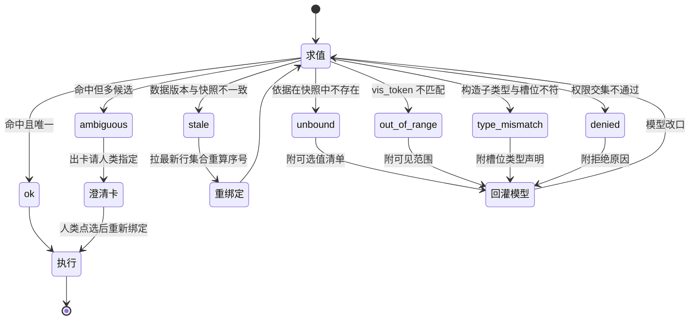
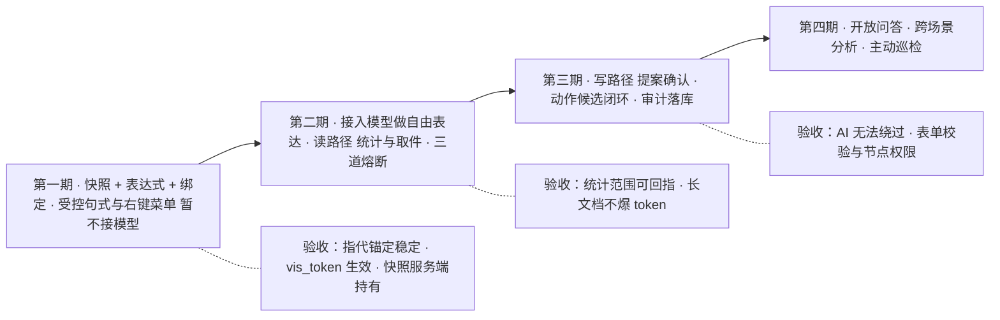

# EOS 平台 AI 能力方案
**EOS Platform AI Capability Design**

**文档版本**：v1.0
**创建日期**：2026-09-18
**修订日期**：2026-09-18
**用途**：定义 EOS 平台基于对话的 AI 能力——辅助栏 AI 对话标签页、页面上下文协议、表达式—绑定机制、执行回灌协议与权限审计，覆盖"人类在对话中获取当前页面数据行及其子业务数据并据此运算"的完整链路。

---

## 一、方案概述

### 1.1 需求与难点

EOS 平台在辅助栏增设 **AI 对话标签页**：切入该标签，辅助栏成为与 AI 的对话窗口；人类在对话中获取或操作当前页面内容，例如"请将左窗的数据进行统计"、"请分析左窗中第三行文件中的内容"。

困难不在对话窗口本身，而在三件事：

| 难点 | 表现 | 方案对策 |
|------|------|---------|
| **指代消解** | "左窗""第三行""这个文件"是屏幕语言，不是数据语言 | 轻量快照定义可寻址单元（§三） |
| **操作落地** | 统计、取附件、改字段须落到引擎的正规入口 | 意图白名单 + 能力层工具（§八、§五） |
| **配置驱动适配** | 平台由配置生成业务积木，表单种类无穷 | AI 消费引擎元数据，不为每个表单定制（§三） |

### 1.2 设计前提

**瓶颈不在模型的语言理解力，而在指代能否稳定锚定到数据。** 自然语言理解是模型的强项，"第三行"指哪条记录则是系统的事实。本方案据此确立前提：

> **系统的每个数据单元必须具备稳定、可校验、可审计的地址；AI 只负责表达，地址由系统解释。**

完整的自然语言解析交由 AI 完成，系统不建立本地的意图识别与同义词体系——那会把语言适配的负担摊给业务配置者，与配置驱动的平台理念相悖。

### 1.3 核心分工

| 环节 | 承担者 | 产出 |
|------|--------|------|
| 语言理解 | AI | 意图 + 带未绑定变量的表达式 |
| 指代绑定 | 系统 | 具体记录、附件，含鉴权校验 |
| 取数与运算 | 引擎 | 权威数据与聚合结果，模型不做算术 |
| 分析与回答 | AI | 带引用定位的结论 |
| 写入 | 系统 + 人类 | 字段级提案经确认后由页面执行 |

---

## 二、协议四段

AI 能力由四段协议构成，每段有明确的输入、输出与不变量：


| 协议段 | 输入 | 输出 | 不变量 |
|--------|------|------|--------|
| **① 快照** | 页面运行时状态 | 轻量快照 | 不装数据，只装标识与结构 |
| **② 表达** | 人类原句 + 轻量快照 | 意图 + 表达式 | 模型输出无标识位，只能写相对表达式 |
| **③ 绑定** | 表达式 + 服务端快照 | 绑定对象 + 鉴权结论 | 行号只用于绑定，落库用主键；数据一律回源取 |
| **④ 执行回灌** | 绑定对象 + 意图 | ToolResult 信封 + AI 回答 | 写操作只出提案，人来确认 |

### 2.1 五条不变量

| # | 不变量 | 破坏后果 |
|---|--------|---------|
| 1 | 快照不装数据，只装标识与结构 | token 膨胀、隐私外泄、权限过滤失效 |
| 2 | 模型输出无标识位，只能写相对表达式 | 模型可编造或越权访问任意记录 |
| 3 | 行号只用于绑定，落库用主键 | 排序、筛选、分页一变，操作打到别的行 |
| 4 | 数据一律回源取，不信快照中的值 | 页面停留久了，分析与操作基于陈旧数据 |
| 5 | 写操作只出提案，由人类确认 | AI 绕过表单校验与流程节点权限 |

---

## 三、协议段①：轻量快照

### 3.1 快照装什么

| 装 | 内容 | 作用 |
|----|------|------|
| 导航路径 | 面包屑 | 消解"这个""刚才那条"的场景归属 |
| 场景标签页 | 标签页序列、当前标签、显示模式 | 消解"当前页面" |
| 窗口枚举 | 方位 + 活动窗口标签页 + 激活表单标签页 | 消解"左窗""右窗" |
| 实体元数据 | 实体名、主键、字段清单（名/类型/单位/精度/可编辑/可筛选）、枚举值 | 模型据此把"交期"对上字段、把"文件"对上附件字段 |
| 指标定义 | 该实体已定义的指标与口径 | 统计时对齐口径 |
| 视图状态 | 筛选条件、排序、总行数 | 约束统计范围 |
| 可见行清单 | `display_index + pk + label`，仅首屏 | `row(3)` 的绑定依据 |
| 选中行 | `pk + label` | 消解"这一行" |
| 附件清单 | 选中行附件的 id、文件名、类型、大小 | 判歧义，不含正文 |
| 会话锚点栈 | 人类已确认过的 pk 与附件 id | 消解"它""刚才那份" |

### 3.2 快照不装什么

| 不装 | 理由 | 何时才取 |
|------|------|---------|
| 行内数据（金额、交期等字段值） | 消解指代不需要它们 | 统计或查看时按需查询 |
| 全量行 | 送"128 行"这个数与筛选条件即可 | AI 需要明细时按范围拉取 |
| 未展开行 | 树表折叠时只送展开可见的行 | 人类展开后下次快照自动包含 |
| 附件正文 | token 成本高，且未经安全扫描 | 取件时解析，且只回灌相关段落 |
| DOM 与样式 | 平台由配置生成，DOM 结构无业务含义 | 永不 |
| 人类无权字段 | 权限在采集侧过滤，不靠提示词约束 | 永不 |

### 3.3 快照结构

```json
{
  "nav": "采购管理 > 采购订单 > 订单执行",
  "scene": { "tabs": ["订单执行"], "focus_tab": "订单执行", "mode": "single" },
  "windows": [{
    "pos": "left",
    "active_window_tab": { "id": "wt-po-list", "mode": "list" },
    "active_form_tab": { "id": "ft-po-main", "task_node": "订单维护" },
    "entity": {
      "name": "采购订单",
      "pk": "order_no",
      "fields": [
        { "n": "order_no", "t": "string",  "label": "单号", "ro": true },
        { "n": "supplier", "t": "ref",     "label": "供应商" },
        { "n": "amount",   "t": "decimal", "label": "金额", "scale": 2, "unit": "CNY" },
        { "n": "status",   "t": "enum",    "label": "状态",
          "opts": ["草稿", "审批中", "已下达", "已关闭"] },
        { "n": "due_date", "t": "date",    "label": "交期" },
        { "n": "attach",   "t": "attachment", "label": "附件", "multi": true }
      ],
      "relations": [
        { "rel": "订单行", "entity": "采购订单行", "card": "1:N", "child_tab": true },
        { "rel": "收货单", "entity": "收货单",     "card": "1:N", "child_tab": true }
      ],
      "indicators": [
        { "label": "金额合计", "agg": "sum(amount)" },
        { "label": "逾期率",   "agg": "count(due_date < today) / count(*)" }
      ]
    },
    "view": { "filter": "status='审批中'", "sort": "created_at desc",
              "total": 128, "visible_count": 12 },
    "visible_rows": [
      { "i": 1, "pk": "PO-2026-0001", "label": "××科技", "status": "审批中" },
      { "i": 2, "pk": "PO-2026-0002", "label": "××精密", "status": "审批中" },
      { "i": 3, "pk": "PO-2026-0003", "label": "××机电", "status": "审批中" },
      { "i": 4, "pk": "PO-2026-0004", "label": "××重工", "status": "草稿" }
    ],
    "selection": {
      "pk": "PO-2026-0003",
      "label": "××机电",
      "attachments": [
        { "id": "att-91", "name": "技术协议 v2.pdf", "type": "pdf",  "size": 3355443 },
        { "id": "att-92", "name": "检验报告.xlsx",  "type": "xlsx", "size": 245760 }
      ]
    }
  }],
  "anchors": [ { "kind": "row", "pk": "PO-2026-0002", "label": "××精密" } ]
}
```

量级为几 KB、约 1~3 千 token。

### 3.4 服务端持有

前端上送的快照不可信，因此**快照全文由服务端会话持有**，前端只上送版本号：

- 绑定使用服务端那份快照；
- 前端那份仅用于 UI 回显与版本一致性断言；
- 版本号不一致说明 UI 状态在消息飞行途中已变，立即重采并重新绑定，或提示"页面已变化，请再说一次"。

### 3.5 索引化与可见性令牌

绑定要按键取值并准确报错，因此快照在网关侧先重排为字典：

| 索引 | 键 | 来源 | 可信级别 |
|------|----|------|---------|
| `windows` | 方位 `single`/`left`/`right` | 前端快照 | 仅用于定位 |
| `rows` | 屏上序号 | 前端快照 | 仅用于定位 |
| `row_by_pk` | 主键 | 前端快照，须回源校验 | 中 |
| `fields_by_label` | 字段标签 | **实体元数据** | 权威 |
| `attachments` | 位次 | 前端快照 | 仅用于定位 |
| `anchors` | 位次 | 会话锚点栈 | 系统 |

字段标签取自实体元数据而非前端——否则前端可把"交期"映射到任意列。

**可见性令牌**：采集快照时为每行计算
`vis_token = HMAC(会话密钥, snapshot_version | pos | index | pk)`。
绑定结果的令牌必须与服务端登记的一致，否则拒绝。该令牌同时挡住模型编造记录与前端篡改快照两条路。

**索引生命周期分两类**：元数据索引慢变，按实体名缓存在网关、跨请求复用、元数据发布时失效；快照索引快变，每条消息重建、用完即弃，绝不缓存。

---

## 四、协议段②：表达

### 4.1 表达式文法

AI 输出的参数是**带未绑定变量的表达式**，构造子与绑定依据如下：

| 构造子 | 类型 | 绑定依据 |
|--------|------|---------|
| `here()` | Human | 当前场景标签页 |
| `win(single\|left\|right)` | Window | `windows` 索引 |
| `tab(win, 序号\|名称\|active)` | WindowTab | 窗口标签页序列 |
| `row(序号)` / `row(pk="…")` | Row | `rows` / `row_by_pk` |
| `sel()` | Row | 当前选中行 |
| `field("标签")` | Column | `fields_by_label` |
| `attach(位次\|名称\|field)` | Attachment | 选中行的附件集合 |
| `range(all\|visible\|row(n).children)` | RowSet | 视图状态与实体关系图 |
| `anchor(位次)` | 任意 | 会话锚点栈 |
| `lit(值)` | 字面量 | 无需绑定 |

模型可写的是序号与字面量；**唯一不能写的是它没见过的标识**——附件只能按相对位置取得，记录只能按屏上序号或主键取得。

### 4.2 输出形态

```json
{
  "intent": "analyze_attachment",
  "confidence": 0.91,
  "args": {
    "window": { "kind": "deixis", "expr": { "op": "win",  "arg": "left" }, "phrase": "左窗" },
    "row":    { "kind": "deixis", "expr": { "op": "row",  "arg": 3 },
                "phrase": "第三行", "hint": "PO-2026-0003" },
    "target": { "kind": "attr",   "expr": { "op": "attach", "field": "附件" },
                "phrase": "文件" },
    "scope":  "full_text"
  },
  "unresolved": []
}
```

`arg: 3` 是屏上序号；`hint` 是模型依快照自算的对号，仅供人类可读回显，不参与绑定；`field` 用字段标签而非字段名。

### 4.3 表达式是树

节点为 `{op, …}` 加可选的 `of` 子节点：

```json
{ "op": "attach", "arg": 2,
  "of": { "op": "row", "arg": 3,
          "of": { "op": "win", "arg": "left" } } }
```

叶子只有 `win`、`lit`、`anchor` 三种。表达式深度上限 4 层。

### 4.4 为何由系统绑定而非 AI 直给标识

假设让 AI 直接返回记录主键，多数情况下结果相同，差别在少数情形：

| 维度 | AI 直给标识 | AI 给表达式、系统绑定 |
|------|------------|---------------------|
| 出错时 | 系统照着错的标识执行，静默分析错数据 | 绑定与可见集不符即拒绝，原因回灌模型改口或反问 |
| 越权时 | 模型可拼出任意记录号，只能靠提示词约束 | 模型**没有标识位可填**，协议层即不可能越界 |
| 可追溯 | 只能记录"AI 说是这条" | 留痕完整：原表达式 → 快照 → 绑定结果 → 鉴权结论 |

---

## 五、协议段③：绑定

### 5.1 递归解释器

绑定是遍历表达式树的求值过程：**环境沿路径向下传**，每一步把已解析的上下文带给子节点。

```
win("left")  →  WinEnv
   ↓ 带入环境
row(3)       →  RowRef{PO-2026-0003}
   ↓ 带入环境
attach(2)    →  该行的第 2 个附件
```

求值环境与核心函数：

```python
@dataclass(frozen=True)
class Env:
    human: str; scene_tab: str
    snap: SnapshotEnv
    anchors: list[Anchor]
    win: WinEnv | None = None      # 沿路径绑定
    row: RowRef | None = None      # 沿路径绑定
    depth: int = 0                 # 守卫

def bind(expr, slot_type, env) -> Outcome:
    if env.depth > MAX_DEPTH:      return Fail("too_deep", expr)
    if env.nodes_used > MAX_NODES: return Fail("too_large", expr)

    if expr["op"] in ("attach", "field", "tab", "range"):
        parent = bind(expr["of"], PARENT_SLOT[expr["op"]], env)   # 递归点
        if isinstance(parent, Fail): return parent                # 短路
        return resolve_local(expr, parent.value, parent.env)

    match expr["op"]:
        case "win":    v, e = env.snap.windows.get(expr["arg"]), replace(env, win=…)
        case "row":    v, e = lookup_row(env.win, expr["arg"]),  replace(env, row=…)
        case "sel":    v, e = env.win.selected,                   env
        case "anchor": v, e = at(env.anchors, expr["arg"]),       env
        case "lit":    v, e = expr["arg"],                        env
    if v is None: return Fail(diagnose(expr, env))               # 诊断含可选值清单
    return check(v, expr, slot_type, e)                          # 四道校验
```

三个要点：

- **`of` 的槽位类型由父节点决定**，`PARENT_SLOT = {"attach": "row", "field": "row", "tab": "win", "range": "win"}`，类型错误在递归下降前即可判掉；
- **`Fail` 作为值向上冒泡**而非抛异常，因为失败需携带"哪个子表达式失败、为什么"回灌模型；
- **`depth` 每层递增**，作为防滥用守卫。

意图的各槽位共用一个环境，因此 `row(3)` 在两个槽里绑定同一行，不会漂移。

### 5.2 四道校验

| # | 校验 | 实现 | 失败码 |
|---|------|------|--------|
| 1 | 类型 | 构造子返回类型等于槽位声明类型 | `type_mismatch` |
| 2 | 可绑 | 绑定依据在快照中存在且唯一 | `unbound` / `ambiguous` |
| 3 | 在界 | `vis_token` 与服务端登记一致 | `out_of_range` |
| 4 | 权限 | 向实体引擎批量鉴权 | `denied` / `stale` |

第 4 道同时完成三件事：真权限校验、记录是否已删除、**数据版本是否与快照一致**。版本不一致时标记 `stale`，按主键拉最新数据并重算可见序号后重新绑定，而非直接报错。

鉴权为一次批量调用：

```python
verdict = entity_engine.authorize(
    user   = session.human_id,
    checks = [ ("采购订单", pk="PO-2026-0003", fields=["attach"], op="read"),
               ("附件",     id="att-92", op="read") ])
```

### 5.3 结果状态机



**`unbound` 与 `ambiguous` 必须分开报**：前者要模型重新表达，后者只需人类点一下。

### 5.4 歧义消解规则

按意图声明，规则属 AI 能力清单配置：

| 意图 | 情形 | 消解方式 |
|------|------|---------|
| `analyze_attachment` | `target` 多候选 | 出确认卡 |
| `summarize_document` | `target` 多候选 | 默认最新并显式声明分析对象 |
| `stat_dataset` | `range` 缺省 | 取当前可见集，回复中回显范围 |

未配置规则的意图默认出确认卡。

### 5.5 留痕

绑定产出完整轨迹并写入审计：表达式树、快照哈希、绑定结果、鉴权结论。事后可回答"AI 请求了什么、系统绑成了哪条记录、凭什么放行"。

---

## 六、子业务数据的寻址

子业务数据经两条路径进入对话，均以实体引擎的关系图为约束：

| 路径 | 触发 | 快照体现 | 表达式体现 |
|------|------|---------|-----------|
| **横向下钻** | 人类双击行 → 右窗打开子业务 | 快照多出一个窗口，含子实体元数据与可见行 | `win("right")` + `row(n)` |
| **关系取数** | 人类直接问"这条订单的收货情况" | `entity.relations` 声明子实体与基数 | `range(row(3).children)` 或跨实体查询 |

实体引擎的实体关系图谱决定哪些实体可作为子业务 TAB、哪些能横向下钻；表单引擎消费该图谱配置子业务 TAB 群。AI 侧不新增关系判定，只消费同一份元数据。

**快照只告知"屏幕上现在有哪几个窗口"**，子业务的存在与合法范围由关系图谱回答——这使 AI 在不下钻的情况下也能取到子业务数据，同时不越过关系约束。

---

## 七、协议段④：执行与回灌

### 7.1 执行分三条路

| 路 | 判据 | 走法 | 是否回灌 AI |
|----|------|------|------------|
| A｜数据读 | 产出为数据 | 引擎聚合查询 | 是 |
| B｜取件理解 | 产出为待理解素材 | 取件 → 沙箱解析 → 切块 | 是 |
| C｜纯操作 | 产出为页面状态变化 | 直接执行或出提案 | **否** |

C 路不回灌——否则每个简单操作都要强加一次模型往返，手感和成本都不成立。

**取数时即瘦身**：聚合不返回明细行；长文档走"解析 → 切块 → 相关性排序 → 取前 N 块"；超预算内容一律打 `truncated` 标记，绝不静默截断，使模型知道"未看到全部"。

### 7.2 ToolResult 信封

```json
{
  "status": "ok",
  "intent": "analyze_attachment",
  "bound": {
    "row":    { "pk": "PO-2026-0003", "label": "××机电", "display_index": 3 },
    "target": { "id": "att-92", "name": "检验报告.xlsx", "type": "xlsx", "bytes": 245760 }
  },
  "data": {
    "kind": "document_excerpt",
    "pages_total": 12, "blocks_used": 4, "truncated": true,
    "blocks": [
      { "ref": "R1", "loc": "工作表:检验记录!A1:F30",
        "text": "本批 12 件，外观检验 12 件合格；尺寸抽检 3 件……" },
      { "ref": "R2", "loc": "工作表:结论!B2", "text": "判定：合格，允许入库。" }
    ]
  },
  "citations": [
    { "ref": "R1", "label": "检验记录!A1:F30" },
    { "ref": "R2", "label": "结论!B2" }
  ],
  "answer_policy": {
    "cite_required": true, "declare_scope": true,
    "no_extrapolation": true, "language": "zh-CN"
  },
  "action_candidates": [
    { "intent": "extract_table",   "label": "把检验记录提取成表格" },
    { "intent": "propose_update",  "label": "把判定结论写入「检验结论」字段" },
    { "intent": "open_attachment", "label": "打开原件" }
  ]
}
```

五段各有不可替代的作用：

| 段 | 作用 |
|----|------|
| `bound` | 供人类核验——AI 须在回答开头声明分析对象，绑错时人类可即时打断 |
| `data` | 模型要理解的瘦身素材 |
| `citations` | 溯源——正文标注引用编号，前端渲染为可点击角标 |
| `answer_policy` | 回答纪律随每次执行下发，因意图而异 |
| `action_candidates` | 后续动作，意图白名单校验过、绑定结果已复用，人类点选即执行 |

### 7.3 第二段回答与流式输出

AI 的第二段输入为：对话技能包、会话历史、ToolResult 信封、任务指令。输出流式渲染，顺序固定：

```
绑定声明 → 分析正文（带引用角标）→ 结论 → 动作按钮
```

绑定声明先出，等于给人类一个可即时打断的窗口：若声明的对象不是他所问，可立即中断，不必等完整分析生成完。

### 7.4 循环与熔断

模型可能继续索取素材，形成 `执行 → 回灌 → 模型 → tool_call → 绑定 → 执行` 的循环，须设熔断：

| 熔断项 | 阈值 | 触发后 |
|--------|------|--------|
| 工具调用轮次 | ≤ 4 | 停止取数，用已有素材作答并声明信息不完整 |
| 累计回灌 token | ≤ 30k | 优先砍明细、保摘要 |
| 单次用户等待 | ≤ 60s | 转异步作业，对话区显示进度，允许离开页面 |

### 7.5 失败即对话

失败作为回灌内容而非错误弹窗：

```json
{ "status": "failed", "code": "parse_failed",
  "reason": "该 xlsx 受密码保护，无法解析",
  "recoverable": true,
  "suggestions": ["尝试另一份附件：技术协议 v2.pdf", "请提供解密码"] }
```

模型据此应答"这份检验报告有密码保护，我读不了。要不要改分析《技术协议 v2.pdf》？"

---

## 八、权限、安全与审计

### 8.1 三重交集

任一不满足即拒绝：

| 维度 | 内容 | 承载 |
|------|------|------|
| 人类权限 | 对实体、字段、数据行的权限 | 功能引擎的数据与字段权限、菜单引擎的可见性 |
| AI 工具白名单 | 该场景业务允许 AI 调用的工具集合 | AI 能力清单 |
| 上下文合法性 | 目标须落在当前页面上下文可达范围内 | 页面运行时与快照 |

### 8.2 结构性防线

| 威胁 | 防线 |
|------|------|
| 模型编造记录 | 表达式无标识位可填 + `vis_token` 校验 |
| 前端篡改快照 | 快照服务端持有 + 令牌由服务端签发 |
| 提示注入（附件内藏指令） | 解析在隔离沙箱、产物以纯数据身份进入上下文、`answer_policy` 声明其不可作为指令 |
| 越权读取 | 鉴权在工具执行前、快照采集侧已过滤无权字段 |
| 绕过流程节点权限 | 写操作只出提案，由页面调用原引擎 API 执行 |

工具清单按配置过滤后下发：人类看不到的字段、无权使用的操作，对应工具不出现在模型中——既省 token，也避免模型幻觉出不存在的操作。

### 8.3 审计

每轮对话留痕七项：表达式树、快照哈希、绑定结果、鉴权结论、ToolResult 信封、AI 答案、提案与确认记录。写入记录带 `发起者=AI、指示者=人类账号` 双标识，不可删改。

---

## 九、意图与能力层

### 9.1 能力层工具

| 工具 | 类型 | 承担引擎 |
|------|------|---------|
| `page.get_context` / `page.get_selection` / `page.get_visible_dataset` | 读 | 页面运行时 |
| `entity.describe` / `entity.query` / `entity.stat` | 读 | 实体引擎 |
| `form.describe` | 读 | 表单引擎 |
| `indicator.match` | 读 | 指标引擎 |
| `attachment.list` / `attachment.fetch` / `attachment.extract_table` | 读 | 实体引擎、附件解析器、CAX 引擎 |
| `record.propose_update` / `record.propose_create` | 写（提议） | 表单引擎 |
| `flow.propose_action` | 写（提议） | 流程引擎、工单引擎 |
| `page.propose_navigate` | 写（提议） | 场景编排能力、菜单引擎 |

工具按引擎能力划分，不按业务功能划分——这是配置驱动平台下 AI 零定制适配全部表单的前提。

**写入路径唯一**：AI 没有直接写入工具，全部写操作产出提案对象，经人类确认后由页面调用原引擎 API 执行，由此继承表单校验、流程节点权限、字段只读性等既有约束。

### 9.2 意图档位

| 档 | 例子 | 模型参与 | 人工确认 | 时延 |
|----|------|---------|---------|------|
| 纯操作 | 打开第三行、按金额倒序 | 不参与，本地正则通道 | 否 | 毫秒级 |
| 读数据 | 按供应商汇总左窗金额 | 协议段② | 否 | 秒级 |
| 取件理解 | 分析第三行的文件内容 | 协议段②④ | 歧义时确认 | 秒级至分钟级 |
| 写操作 | 把交期改成 7 月 20 日 | 协议段② | 必须 | 秒级 |

本地正则通道只承担高频纯操作，不承担理解职责；其存在保证模型不可用时基础操作不受影响。

### 9.3 运算口径

统计优先对齐指标引擎已定义的指标：AI 先查该实体的指标定义，命中则按既有口径与当前筛选范围计算，并在回复中回显范围；库中无对应指标时执行一次性临时聚合，显式标注"临时口径"并给出聚合表达式；人类可将满意的临时口径存为指标定义，使一次性分析沉淀为平台资产。

**模型不做算术**——数字一律由引擎算出。

### 9.4 配置产出

| 产出 | 内容 | 位置 |
|------|------|------|
| AI 能力清单 | 工具白名单、歧义消解规则、回答纪律 | 配置定义 |
| 对话技能包 | 业务域系统提示词、术语表、知识引用 | 配置定义 |

---

## 十、辅助栏交互

### 10.1 标签页形态

辅助栏内容区为多标签并存：

```
┌──────────────────────────────┬──────────────────────────────┐
│ 左窗（列表/树表）             │ 辅助栏                        │
│                              │ [详情] [AI 对话]      [关闭]  │
│  ┌────┬────┬────┬────┐       │ ────────────────────────────  │
│  │行1 │    │    │    │       │ 你：请将左窗的数据进行统计      │
│  │行2*│ ← 选中            │ │ AI：将按【采购订单】的 3 个指标 │
│  │行3 │    │    │    │       │     统计当前筛选后的 128 行…   │
│  └────┴────┴────┴────┘       │     [确认] [改为临时聚合]      │
│                              │ ────────────────────────────  │
│                              │ 输入框…                  [发送]│
└──────────────────────────────┴──────────────────────────────┘
```

- **[详情]** 标签即 91 规范 §1.1.1 定义的辅助栏标签页，以两列显示选中行字段，行为不变；
- **[AI 对话]** 标签切入后内容区为对话窗口；
- 两标签**并存不互斥**——否则 AI 无法引用当前选中行，人类也无法边看字段边对话；
- 辅助栏宽度可拖拽伸缩，主内容区实时联动。

### 10.2 页面层级归属

AI 对话标签属**平台级页面组件**，不计入业务流程树的页面层级（§1.1.1 的四级对应关系不变），其渲染与交互机制由平台统一提供。

---

## 十一、技术实现

### 11.1 模块划分

| 模块 | 职责 |
|------|------|
| 快照采集器（前端） | 生成轻量快照与版本号 |
| 快照索引器（网关） | 重排为字典、计算 `vis_token` |
| 表达式解释器（网关） | 求值、四道校验、歧义与越界诊断 |
| 执行分派器（网关） | 意图到执行体的声明表、取数与瘦身 |
| 回灌与循环控制（网关） | ToolResult 组装、熔断 |
| 对话与提案 UI（前端） | 流式渲染、澄清卡、提案卡、动作按钮 |
| AI 能力清单（配置） | 工具白名单、消歧规则、回答纪律 |

### 11.2 通信

对话流用 SSE 或 WebSocket，事件类型驱动 UI：

| 事件 | 载荷 | UI 动作 |
|------|------|---------|
| `stage` | 定位 / 取件 / 解析 / 阅读 | 显示进度 |
| `text` | 增量 token | 打字机渲染 |
| `tool_call` | 工具名与入参 | 显示"正在读取……" |
| `tool_result` | 摘要或计数 | 折叠展示，可展开 |
| `answer` | 正文与引用 | 渲染答案卡 |
| `actions` | 后续动作候选 | 渲染动作按钮 |
| `error` | 错误码与说明 | 提示并可重试 |

长任务走异步作业与进度推送。

### 11.3 部署约束

内网部署时模型可替换，支持本地或专有云；数据出域范围由部署策略决定，快照与素材的脱敏在网关侧完成。附件解析器可插拔，专业格式委托 CAX 引擎转换，解析结果按内容哈希缓存。

---

## 十二、术语

| 术语 | 英文 | 定义 |
|------|------|------|
| **轻量快照** | Lightweight Snapshot | 随每条消息上送、仅含标识与结构的页面上下文 |
| **指代表达式** | Deixis Expression | AI 产出的带未绑定变量的寻址表达式 |
| **绑定** | Binding | 系统解释表达式、确定具体记录并鉴权的过程 |
| **可见性令牌** | Visibility Token | 服务端为快照中每行签发的校验令牌 |
| **澄清卡** | Clarification Card | 绑定结果不唯一时请人类指定的交互卡 |
| **提案** | Proposal | 写操作的字段级差异预览，经确认后执行 |
| **回灌信封** | Result Envelope | 执行结果交给 AI 的结构化封装 |
| **会话锚点栈** | Anchor Stack | 人类已确认过的对象引用，供"它""刚才那份"消解 |

---

## 附录A、实施分期



第一期不接模型即可实施：以右键菜单与受控句式先验证"快照—表达式—绑定"骨架，重点是可见性令牌与服务端持有快照两处。

---

## 附录B、参数与配置项

以下项在实施时确定取值，均为配置而非代码：

| 项 | 说明 |
|----|------|
| AI 引擎的体系定位 | 横切引擎，与菜单引擎并列，不生成业务积木 |
| 工具白名单粒度 | 按场景业务配置 |
| AI 工具级权限维度 | 新增独立维度，或复用功能引擎的数据权限表达 |
| 自治边界 | 限定在当前场景标签页上下文内；跨场景与提交类动作一律提议加确认 |
| 表达式深度与节点数上限 | 建议 4 层与 32 节点 |
| 循环熔断阈值 | 建议 4 轮、30k token、60 秒 |
| 统计口径策略 | 优先对齐已定义指标，临时口径显式标注且可沉淀 |

---

## 附录C、落地需修订的文件

| 文件 | 修订内容 |
|------|---------|
| `20-pl4eos/10-pl4eos-subpl-sysdev/10-wfsysdev-4-eos/91-eos-biz-eng-spec.md` §1.1.1 | 辅助栏标签页增加 AI 对话类；页面类型计数相应变更 |
| 同上，新增章节 | 平台 AI 交互协议：快照、表达式、绑定、回灌四段 |
| `30-eos/00-eos-product-spec/11-eos-engine-catalog.md` | 新增 AI 引擎条目 |
| `30-eos/00-eos-product-spec/10-eos-architecture.md` §二 | 引擎三级加横切表中增加 AI 引擎行 |
| `30-eos/20-eos-configs/` | 新增 AI 能力清单配置定义 |
| `20-pl4eos/.../eos-wft03-biz-bpd2srb.md` | AI 可调用工具白名单是否作为设计输入项 |
