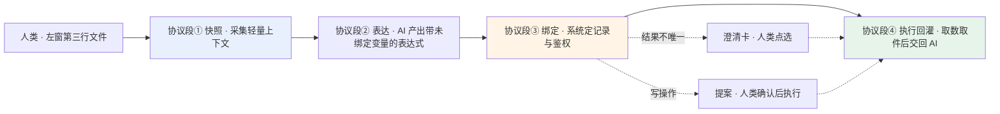
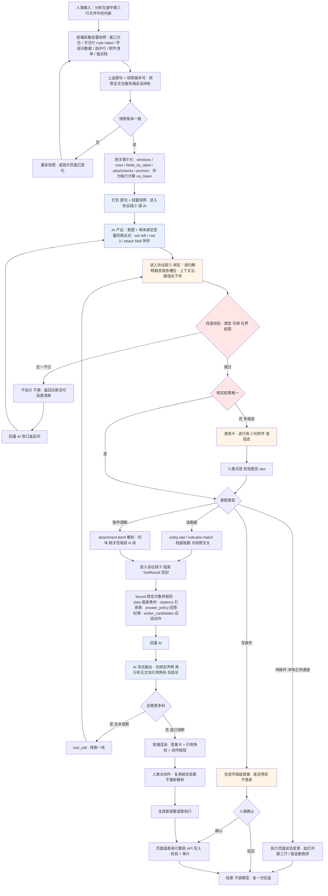
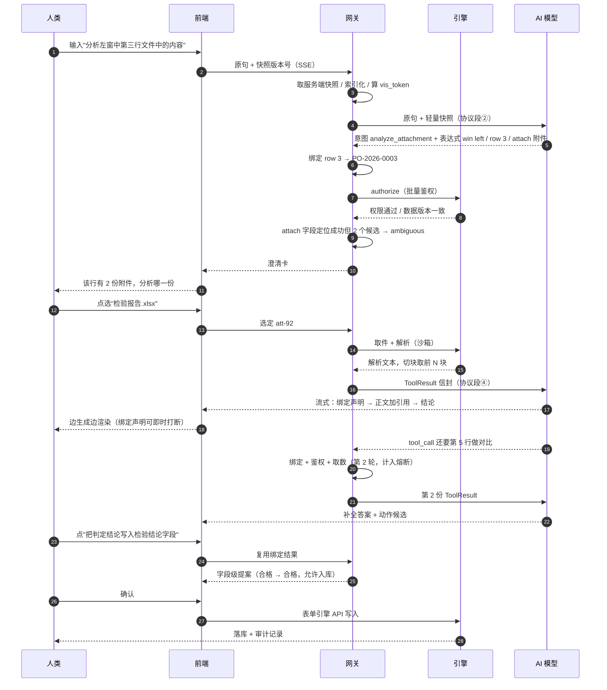
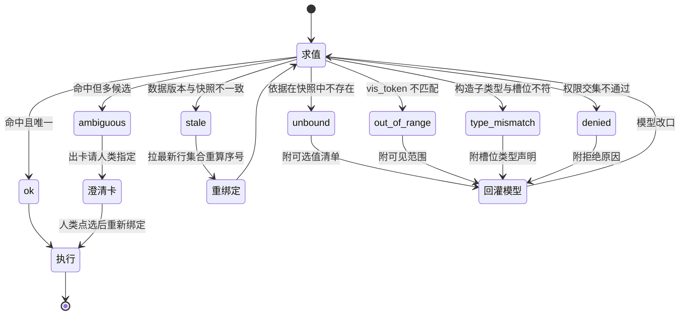
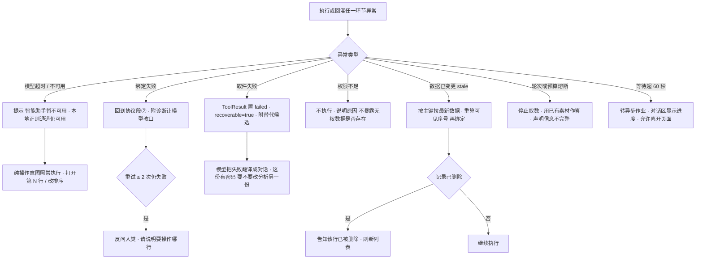
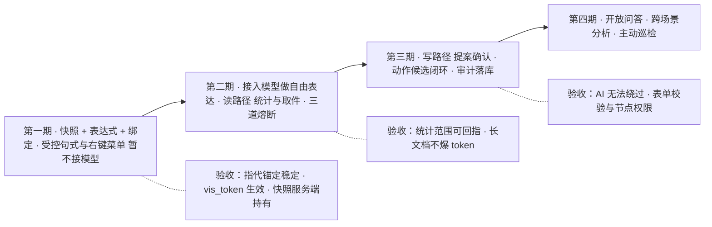

# AI 对话取数与运算 —— 操作流程

**文档版本**：v0.2
**配套方案**：[AI 引擎方案](05-eos-engine-ai.md)
**说明**：本文件是配套方案的操作视图，五张图分别回答"整体怎么走""人机怎么交互""绑定结果怎么判""出错怎么办""怎么分期"。文中"协议段①②③④"沿用配套方案 §一的四段划分。

---

## 一、协议四段总览

**两段分工**：①②是"AI 说怎么找"，③是"系统定是哪个"（唯一的权限关口），④是"系统给料、AI 说话"。澄清卡与提案是仅有的两处人工插入点。

---

## 二、主流程（含三条岔路）

**七个卡口**（图中判断框与人工节点）：快照版本一致 → 四道校验 → 绑定唯一 → 意图分岔 → 人类确认（仅写）→ 熔断判断 → 人类点动作。

---

## 三、人机交互时序

---

## 四、绑定结果状态机

**报错必须区分 `unbound` 与 `ambiguous`**：前者要模型重新表达，后者只需人类点一下——混为一谈会让模型白重试或让人白等。

---

## 五、异常与降级

---

## 六、三档路径对照

| 档次 | 例子 | 是否调模型 | 是否人工确认 | 端到端时延 |
|------|------|-----------|-------------|-----------|
| 纯操作（本地正则通道） | 打开第三行 / 按金额倒序 | 不调 | 否 | 毫秒级 |
| 模型解析 + 引擎执行 | 按供应商汇总左窗金额 | 协议段② | 否（读操作） | 秒级 |
| 模型解析 + 取件 + 模型分析 | 分析第三行的文件内容 | 协议段②④ | 歧义时确认 | 秒级至分钟级 |
| 写操作 | 把交期改成 7 月 20 日 | 协议段② | **必须** | 秒级 |

---

## 七、实现分期

**第一期不接模型也能做**——用右键菜单与受控句式先把"快照—表达式—绑定"骨架验证扎实。瓶颈从来不是模型的理解力，而是指代能否稳定锚定到数据。本地正则通道自始至终保留，只承担高频纯操作，不承担理解职责。
