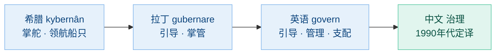
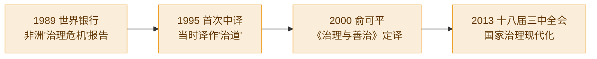
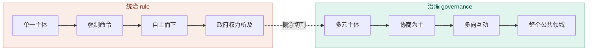
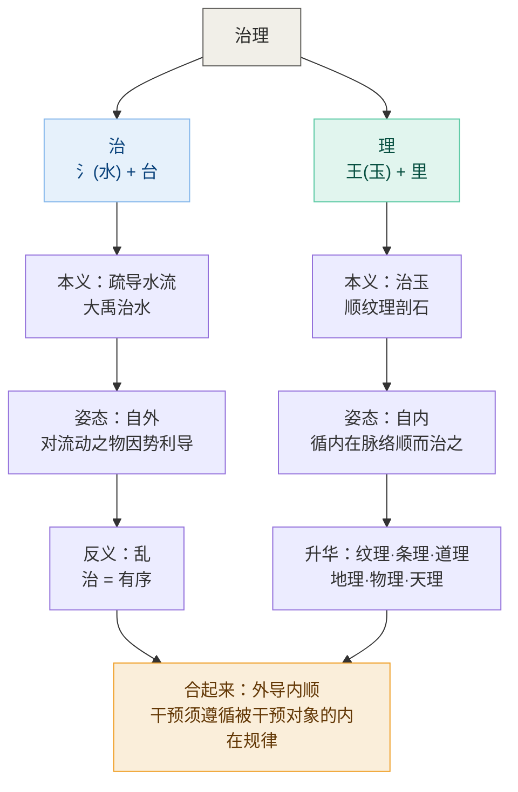
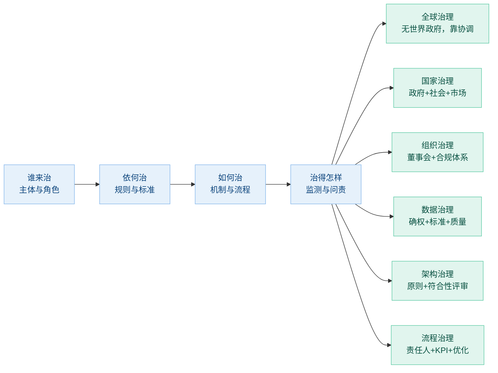
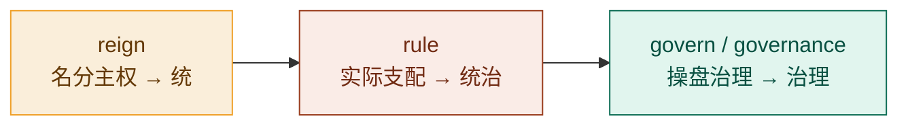

# 从掌舵到治理 —— govern 的词源、翻译史与跨域迁移

> 一场有意识的概念选择：为什么英文 govern 被译成"治理"而非"统治"，以及为什么这个词能从全球治理一路用到数据治理。

---

## 一、词源：govern 本义是"掌舵"，不是"命令"

英文 govern 源自希腊语 **kybernân**（κυβερνᾶν），本义是"掌舵、领航船只"。舵手不是船的主人——他不拥有船、不骑在船头上，只是根据风向和水流调整方向。这个词经拉丁语 **gubernare**（引导、掌管）进入英语。

> 同根词 **cybernetics（控制论）** 保留了"掌舵"本义——其核心思想是"通过反馈调节方向"，而非"通过强制实现服从"。这是 govern 语义基因的最佳佐证。

如果用中文"统治"去对译 govern，等于给这个词塞进了原文并不核心的"支配、征服"含义。"统"（统一控制）+"治"，预设了一个高高在上的主权者和被支配的臣属对象，靠强制力自上而下压下来。

---

## 二、概念史：governance 如何成为热词

governance 作为一个独立政治概念，起点是 **1989 年世界银行**的报告《撒哈拉以南非洲：从危机到可持续增长》，其中首次提出"治理危机"（crisis of governance），定义是"行使政治权力以管理国家事务"。此后 governance 迅速取代 government 成为国际组织话语的关键词。

在中文世界，这个词的翻译经历了几个关键节点：

俞可平明确指出：强调"国家治理"而非"国家统治"，"不是简单的词语变化，而是思想观念的变化"。

---

## 三、统治 vs 治理：五个维度的区别

俞可平（2014）提出统治与治理的五个实质性区别：

| 维度 | 统治（rule） | 治理（governance） |
|------|------------|-------------------|
| **主体** | 单一：政府公共权力 | 多元：政府 + 企业 + 社会组织 |
| **性质** | 强制、命令 | 协商为主、强制为辅 |
| **来源** | 国家法律 | 法律 + 契约 + 共识 |
| **向度** | 自上而下，单向 | 多向互动：上下 + 平行 |
| **范围** | 政府权力所及领域 | 整个公共领域（更宽） |

> 俞可平："从统治走向治理，是人类政治发展的普遍趋势。"

翻译选"治理"，就是在语言上完成这场切割——让 governance 在中文里拥有独立词位，与 rule 划清界限。

---

## 四、"治"与"理"：各自的字义

翻译选"治理"，还借了中文古典的正资产。两个字各有来历。

### 治 —— 从治水来，核心是"疏导"

《说文解字》中"治"原本是一条河的名字，但这个字真正的生命力来自它的字形：**三点水**。中国人对"治"的全部想象，都来自治水。

> 鲧治水用"堵"，九年失败被殛于羽山；大禹改用"疏"，疏导河川入海，功成。

这是中国政治文明的第一课——**对付有活力、会流动的东西（水、人心、社会、市场），压制必败，疏导方成**。"治"字从此带上这个基因：治国、治病、治学，全是"把一个失序的领域引回有序"。

另外，"治"还能当名词用：治世对乱世，"天下大治"——治本身就是秩序达成的状态。

### 理 —— 从治玉来，核心是"顺纹"

"理"字左边的"王"其实是**玉**（作偏旁时"玉"写作"王"，如珠、琳、琅）。《说文解字》："理，治玉也。"

玉不能像石头那样硬凿——那样会碎。匠人必须先读懂玉石内在的纹理脉络，顺着纹理下刀，才能剖出美玉。所以"理"的第一层意思是动词"治玉"，第二层意思升华为名词——**事物内在的脉络本身**：纹理、肌理、条理、道理。

这个词族的扩张特别壮观：

| 词 | 含义 |
|---|---|
| 地理 | 大地的脉络 |
| 物理 | 万物的脉络 |
| 心理 | 心的脉络 |
| 肌理 | 肌肉的纹理 |
| 天理（宋明理学） | 宇宙最高本体 |

一个从剖玉石来的字，最后统治了中国形而上学七百年。

---

## 五、治理的通用公式：为什么能跨领域

"统治"预设了主权者和臣属者，天然锁死在政治领域——你只能说"统治国家"，不能说"统治数据"。

而"治理"只预设了**一个领域 + 规则 + 角色 + 问责**，这四样东西任何领域都有。无论治的是一个国家还是一张数据表，回答的都是同样四个问题：

**全球治理是这套逻辑最好的试金石。** 政治学家罗西瑙（James Rosenau）1992 年有本书叫《没有政府的治理》（*Governance without Government*）——地球上不存在一个能"统治"全球的世界政府，只有主权国家、国际组织、NGO、跨国企业通过规则和协商来协调事务。说"全球统治"一句话就露馅了；说"全球治理"，精确成立。

---

## 六、统治的英文词族

英文里"统治"不是单个词，而是一个词族，各有侧重：

| 英文 | 侧重 | 例子 |
|------|------|------|
| **rule** | 最通用的"统治"，靠权力支配 | colonial rule 殖民统治；ruler 统治者 |
| **reign** | 君主"在位"统治，偏名义主权 | the Queen's reign 女王在位期间 |
| **dominate / domination** | 支配、主宰，压迫感更强 | foreign domination 外国统治 |
| **dominion** | 统治权、统治疆域 | exercise dominion over… |
| **regime** | 统治体制、政权（常带贬义或中立） | authoritarian regime 威权政权 |
| **tyranny / despotism** | 暴政、专制统治（极端形态） | tyranny of the majority 多数人的暴政 |

英国君主立宪的经典写照把三层一次说清：

> **"The king reigns, but does not rule."**
> 国王临朝（在位），但不理政（实际统治）。——**统而不治**。

完整的对照是三层：

reign 是名分上的主权，rule 是实际支配，govern 是日常操盘管理。在现代政治学和企业管理语境里，governance 已专指那套"多元主体 + 规则 + 问责"的框架，所以规范的学术翻译坚持分立：**rule 译"统治"，governance 译"治理"**。这是一条被术语标准刻意"掰直"的翻译规则，而不是天然一一对应。

---

## 七、总结：翻译的三重目的

把 govern 译成"治理"，一次性完成了四件事：

| 层次 | 原因 | 目的 |
|------|------|------|
| **词义层** | govern 本义是"掌舵、引导"，不是"强制支配" | 避免"统治"塞入原文没有的压迫色彩 |
| **历史层** | 1989 年世行报告后，governance 刻意与 rule 切割 | 在中文里保留这场概念革命的独立词位 |
| **文化层** | "治"（大禹治水）与"理"（治玉循纹理）自带正资产 | 让外来概念接上本土两千年的语感 |
| **结构层** | "统治"锁死在"主权者—臣属"关系里 | "治理"只需"领域 + 规则 + 角色 + 问责"，可自由迁移 |

一句话总结：

> **"统治"回答的是"谁骑在谁头上"，"治理"回答的是"这条船往哪开、由谁来掌舵、按什么规则掌"。**
>
> 翻译选"治理"，就是把这套"掌舵逻辑"原封不动地搬进了中文——这也是为什么今天从联合国到企业数据中台，都用同一个词：因为它们做的确实是同一件事的不同尺度版本。

---

## 参考来源

- 俞可平《推进国家治理体系和治理能力现代化》，《前线》2014 年
- 俞可平《治理和善治引论》，《马克思主义与现实》1999 年
- 俞可平主编《治理与善治》，社会科学文献出版社，2000 年
- World Bank, *Sub-Saharan Africa: From Crisis to Sustainable Growth*, 1989
- World Bank, *Governance and Development*, 1992
- James N. Rosenau, *Governance without Government: Order and Change in World Politics*, 1992
- Etymonline, "govern" 词条：希腊 kybernân → 拉丁 gubernare → 英语 govern

---

*本文整理自 2026 年 8 月 17 日的对话讨论，涉及词源学、翻译史、政治学与组织管理学的交叉。*
