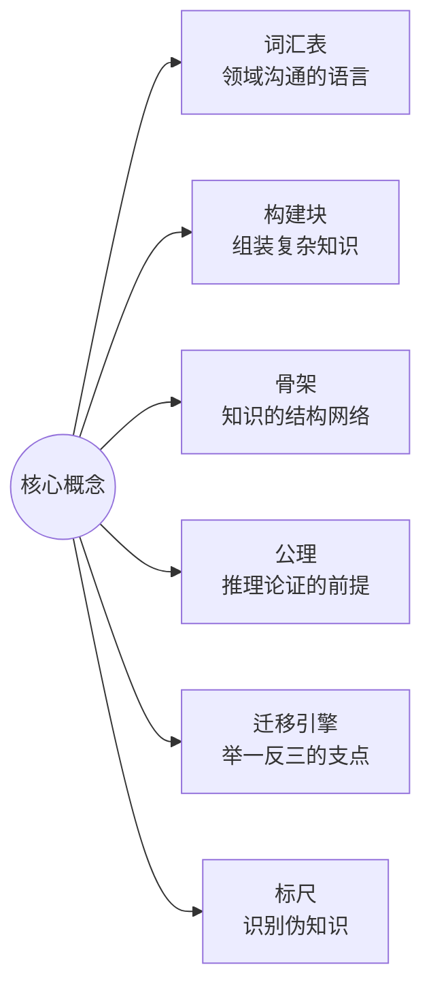
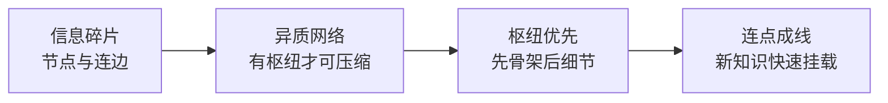
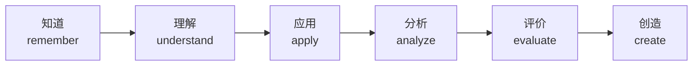
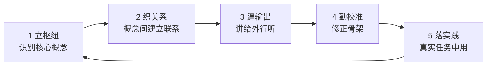
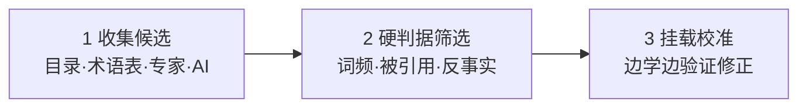
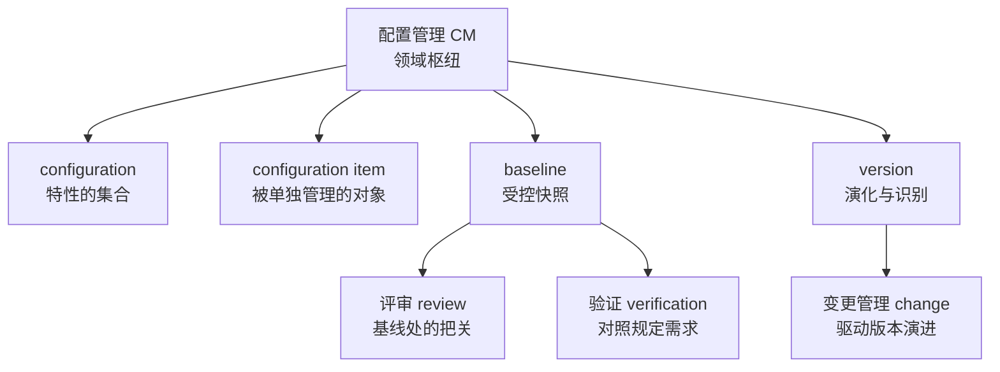
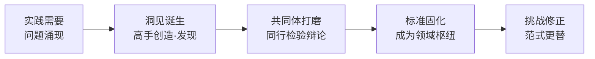
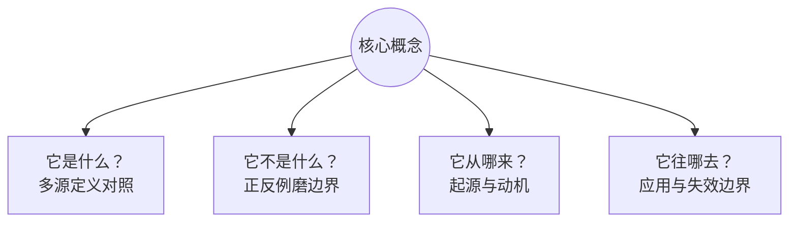

# 概念学习方法论：从压缩学习到知识掌握

> 一份以"枢纽—骨架"视角整合压缩学习研究与学习方法的研习笔记 —— 为什么研究核心概念、它有什么科学证据、如何用它掌握一个专业领域
>
> 2026-08-22 · 整理自概念研习对话（含北大"压缩学习"论文分析与多轮方法论讨论）
>
> v1.8：通读一致性修正——更新 §1.2 档案引用名、头部讨论轮次描述、§4.1 挂定义链引用
>
> v1.7：文末档案区升级为「概念档案（术语族）」——补"概念""核心概念""核心概念能力"三张九格卡（共四张）
>
> v1.6：§1.2 定义块升级为术语定义链——在"概念"基础上补"核心概念""核心概念能力"定义（四概念串链）
>
> v1.5：§1.3 补"杠杆第一性是方向"论——核心概念能力（枢纽识别）管方向；术语三角关系落位
>
> v1.4：吸收《聪明的对手》融合讨论——新增 §1.3 杠杆模型、§4.4 商业域枢纽识别示范、§1 补"AI 时代稀缺性"论证
>
> v1.3：补入"概念能力"术语工作定义（§1.2）+ 文末九格概念档案卡
>
> v1.2：补入"概念能力的定位：枢纽，不是全集"（§1.2，防"概念决定论"误读）
>
> v1.1：补入"有框架 vs 无框架"路径对比、布鲁姆阶梯图、配置管理枢纽概念骨架图

---

## 目录

1. [为什么研究核心概念](#1-为什么研究核心概念)
2. [压缩学习：人脑偏好的学习结构（科学证据）](#2-压缩学习人脑偏好的学习结构科学证据)
3. [掌握专业知识的五环模型](#3-掌握专业知识的五环模型)
4. [如何识别核心概念与核心原理（枢纽）](#4-如何识别核心概念与核心原理枢纽)
5. [核心概念的来源与本质](#5-核心概念的来源与本质)
6. [如何真正理解核心概念（四问法）](#6-如何真正理解核心概念四问法)
7. [附录：参考资料](#附录参考资料)
8. [附录：概念档案（术语族）](#附录概念档案术语族)

---

## 1. 为什么研究核心概念

**一句话结论：基本概念是专业领域的"操作系统"——它们决定了领域内所有讨论的语言、边界和推理逻辑。不研究它们，学到的只是碎片化的"招式"；研究透它们，才能拥有可迁移的"体系"。**

**为什么在 AI 时代尤其重要**：记忆与信息处理已外包给机器，人剩下的稀缺能力正是概念性的——压缩、组织、迁移、辨伪。商业世界的《聪明的对手》（朱峰、曹沂宁）讲的是同一逻辑：传统企业不学巨头（均匀化必败），而是守住自己的异质优势（暗知识、信任、非标）并用数字技术放大。**异质结构原理在认知层与商业层同时成立——概念能力就是个人版的"底牌放大器"。**（商业域示范见 §4.4）

核心概念在专业学习中至少承担六种功能：

| 功能 | 含义 | 类比 |
|------|------|------|
| 词汇表 | 概念是领域内"说话的方式"，没有共同词汇就无法精确沟通 | 学外语先学字母与语法 |
| 构建块 | 人的知识以概念网络存储，新知识必须挂载到已有概念上才有意义（图式理论/有意义学习） | 乐高基础件 |
| 骨架 | 学科是有层级、有关系的体系，概念决定知识如何组织 | 地图的经纬度与主地标 |
| 公理 | 领域内论证从概念定义出发，定义含糊则推导皆飘 | 数学公理、游戏规则 |
| 迁移引擎 | 概念知识属深层结构，可跨场景迁移；事实知识绑定场景 | "输入—处理—输出"看遍所有系统 |
| 标尺 | 概念精确才能识别概念偷换与术语忽悠 | 分得清"需求"与"期望" |

> 研究基本概念 = 给大脑装操作系统，之后学的所有细节都是"应用"。核心概念变动的速度远慢于外围知识（范式是最稳定的内核），地基打得越早，复利越大。

### 1.1 有框架 vs 无框架：两条学习路径

"先立概念"与"只背结论"的差别，是理解整套方法论的关键对照：

| 先学核心概念（先立骨架） | 只背结论和招式（无框架） |
|---|---|
| 知识有挂载点——新概念迅速入网 | 碎片化记忆——学完就忘 |
| 举一反三——跨场景自由迁移 | 绑定具体场景——换个题就失灵 |
| 能辨伪——识别概念偷换 | 易被带偏——分不清概念边界 |

> 先立骨架再填血肉，会越学越轻松；先切入细节，会越学越累——这正是第 2 节压缩学习实验的结论。

### 1.2 概念能力的定位：枢纽，不是全集

**术语定义链（从基础到派生，四个概念）**：

- **概念（concept）**：对一类对象共同特征的抽象概括，思维的最小单位。判据：可指称（一个词/短语）+ 可界定（内涵与外延）。依据：ISO 1087-1 术语学——"通过对特征的独特组合而形成的知识单元"。
- **核心概念（core concept / hub）**：概念网络中处于枢纽地位的概念——解释领域内其他概念都要用到它，而理解它自己只需要很少前置知识。判据：反事实检验（去掉它领域还成立吗？）+ 被引用度（其他概念定义引用它最多）+ 前置数（理解它所需前置概念最少）；筛选方法详见 §4.2。
- **概念能力（conceptual ability）**：以概念为单位的压缩与组织能力——识别枢纽（抓出决定其余部分的核心概念）× 织关系（把概念连成有结构的网络）× 迁移（把网络搬到新场景）× 辨边界（用反例划清适用与失效范围）。**可检验判据：转述测试（陌生领域三五句话讲清）+ 辨伪测试（能举反例划边界）。** 注：本定义为工作定义，非标准术语；锚点与完整九格档案见文末「概念档案（术语族）」。
- **核心概念能力（core-concept ability）**：识别、验证并运用核心概念的能力——概念能力的子能力（枢纽识别），学习杠杆的方向盘。判据：20 分钟对一个陌生领域给出"3~5 个核心概念及其关系"，并能用反事实检验为每个候选辩护。

**一句话结论：概念能力是个人能力系统的枢纽（母能力）——它决定学习的起点速度、理解的深度、表达的清晰度和跨领域迁移的半径，并放大执行、信任等其他一切能力；但它不是能力的全部——核心竞争力是「概念能力 × 执行 × 信任 × 情境经验」的组合结构，概念能力决定上限，挂载能力决定下限。**

概念能力强的人容易把"想清楚了"当成"做成了"，这是枢纽思维的误用。精确的定位分两层看：

- **对内（学习能力）**：概念能力是学习引擎的"第一缸"——入口与放大器。它主导五环模型的第 1 环（立枢纽）与第 2 环（织关系）；输出检索（第 3 环）、元认知校准（第 4 环）、动机坚持是其余气缸。概念能力决定学得多快、看得多深；后三者决定学不学得动、学不学得远。测试效应（输出）、概念转变（校准）、动机缺一不可。
- **对外（竞争力）**：核心竞争力从来是组合结构，不是单点能力。概念能力是枢纽节点，执行落地、人际信任、情境经验、专业技能挂载其上——相乘关系，任一归零，整体归零。枢纽决定系统的上限，挂载决定系统的下限。

> 学习上：概念能力 = 入口与杠杆，不是全部引擎。
> 竞争上：核心竞争力 = 概念能力（枢纽）× 挂载（执行 · 信任 · 情境经验）。
> 类比：概念能力是能力系统的操作系统——应用跑在它上面，价值却在应用。

### 1.3 概念能力的作用方式：学习能力的杠杆

**一句话结论：概念能力是学习能力的杠杆——以小的投入撬动大的学习产出；但杠杆是双向的、需要支点、自己不发力，所以它决定的是效率，不是产出本身。**

为什么说"杠杆"而非"核心"：核心描述位置（易被误读为"全部"），杠杆描述作用方式（乘数效应）。概念能力确实以小搏大：压缩学习实验中先花 20 分钟立枢纽，换来整个学习网络数百轮的优势扩散，投入产出比极高。

三个限定（物理对应 + 方法论对应）：

| 限定 | 物理对应 | 方法论对应 | 含义 |
|------|---------|-----------|------|
| 杠杆是双向的 | 放大的是力，不分方向 | 勤校准（第 4 环） | 枢纽选错则放大错误——学得越快，偏得越远 |
| 需要支点 | 无支点只是根棍子 | 落实践（第 5 环） | 概念不落真实任务，力臂悬空撬不动任何东西 |
| 自己不发力 | 杠杆只放大施力，不产生力 | 动机 | 没有投入，力臂无穷长也是零产出 |

**杠杆的第一性是方向**：四个部件里最根本的不是力臂，是方向——方向由枢纽识别决定，即"核心概念能力"。其余子能力（关系组织、迁移、辨边界）决定力臂质量与用力技巧，但方向错了，力臂越长、撬得越欢，错得越远。压缩学习实验的 HubToLeaf 优势正来自"先识别枢纽"这一下，其后 800 轮都是它的展开。

**术语三角**：核心概念（对象，枢纽节点）→ 被「核心概念能力」（子能力，枢纽识别）把握 → 隶属「概念能力」（全集，另含关系组织/迁移/辨边界）。正式术语保持"概念能力"；"核心概念能力"仅作强调表述，特指杠杆的方向盘。

**完整公式：学习产出 = 核心概念能力（方向）× 概念能力（力臂）× 学习投入（施力）× 实践场景（支点）。** 与 §1.2 核心竞争力公式同构：概念能力永远是乘数，不是被乘数；是放大器，不是本体。

---

## 2. 压缩学习：人脑偏好的学习结构（科学证据）

### 2.1 论文信息（已核实）

- **标题**：Compressive learning scaffolds higher-order network structure to enhance human knowledge acquisition（《压缩学习支撑高阶网络结构以增强人类知识获取》）
- **期刊**：《自然·通讯》(Nature Communications)，2026-07-17，DOI: 10.1038/s41467-026-75843-7
- **团队**：北京大学心理与认知科学学院 + IDG-麦戈文脑科学研究所（罗欢、方方）× 先进制造与机器人学院（李阿明）
- **共同一作**：任祥娟、王牧之、秦婷婷；共同通讯：罗欢、方方、李阿明
- **方法**：认知心理学、脑磁图（MEG）、图论、计算建模四学科交叉

### 2.2 资料核心内容（用户提供资料要点）

> 原文资料为科普转述（播客/自媒体风格），以下要点与其原始出处一并整理。

- **问题**：为什么有的人学东西又快又深？传统解释（记忆力、天赋、一万小时定律）都不完整。北大团队给出的答案：**高手和普通人的差距不在于记性好，而在于擅长"压缩"——把全量信息转化成关键信号。**
- **例证**：经验医生把成千上万疾病知识压缩成几个关键信号；资深调查记者只关注文件中的"异常"部分——他们都在做"压缩学习"。
- **学界背景**：认知心理学早有"组块化"（chunking）概念；北大团队的突破在于**首次用脑磁图直接观察到大脑压缩信息的过程**，并量化出"什么样的信息结构最容易被压缩"。
- **时代意义**：记忆力层面人类无法与 AI 竞争，人的优势从来不是死记硬背，而是压缩学习。
- **方法论三步**：
  1. **找到枢纽**：学任何新东西前先花 20 分钟找枢纽节点（解释别的概念要用到它、解释它自己却不需要太多前置知识的核心概念）。来源：书目录、百科开头、问 AI。例：《思考，快与慢》的枢纽 = 系统一、系统二、偏见。
  2. **建立联系，填充细节**：先弄清枢纽之间的关系，再学细节（如"系统一是快速自动的直觉思维……人类大多数偏见来自系统一在不该出手时出手"）。
  3. **转述**：把学的东西讲给完全外行的人听，三五句话讲清楚即压缩成功。转述是"压缩测试"，强迫大脑把散落信息重新组织成有骨架的结构（费曼技巧的机制正是压缩学习）。
- **收束论调**：学习不是做加法（获取更多信息），也不是做减法（减去不重要部分），而是**做除法/编码**——先搭四梁八柱，之后输入再多信息，只需看一眼就知道该存放在哪里，结构只会更坚固，不会变乱。

### 2.3 实验设计与结果（与原文核对）

1. **网络结构实验**：设计 4 类 16 节点人工知识网络（晶格/网格网、随机网、小世界网、无标度网），节点数连边数完全相同，仅节点度分布不同；用奇异值分解（SVD）量化压缩性，**无标度网（少数枢纽占据大量连接）压缩性最优**；160 名被试通过图片序列预测学习网络结构，无标度网组成绩显著最高。
2. **预学习路径实验**：238 名被试分三组——HubToLeaf（枢纽优先）、LeafToHub（边缘优先）、RandomWalk（随机游走）；200 轮预学习后进入完全相同的 800 轮正式学习，**HubToLeaf 组优势随时间扩大，且优势扩散到整个网络（包括纯叶子节点的连边）**。
3. **脑磁图实验**：40 名被试，表征相似性分析（RSA）显示 HubToLeaf 组在**背侧前扣带回（dACC）**维持更稳定持续的网络结构表征；LeafToHub 组早期有表征但迅速衰减。
4. **计算建模**：两阶段模型（先基于高阶结构建骨架、再整合新输入）能更好拟合人类学习行为。

**核心机制链：**

**关键结论**：
- 人脑不是存储器，而是**压缩机器**：异质性越强的信息结构（有主有次、有轻有重）越容易掌握；均匀对称的结构反而不易学。
- 先搭建框架会越学越轻松（新信息只需判断"挂在框架的哪个位置"）；先切入细节会越学越累（后期积压太多零散节点，整合不动）。
- 每个人最初接触的信息不同 → 初始框架不同；框架一旦形成，后续信息大概率**强化而非改变**它（此点需谨慎对待，见 2.5 批判）。

### 2.4 转述质量对照（资料 vs 原文）

| 资料的说法 | 原文核对 | 判定 |
|---|---|---|
| "设计了均匀/随机/无标度三种网络" | 实际是四种：晶格网、随机网、小世界网、无标度网 | ⚠️ 漏了一种 |
| "三种路径接触的信息完全一样，唯一不同是顺序" | 预学习 200 轮序列不同；正式学习 800 轮完全相同且只比较第二阶段 | ✅ 方向对，细节简化 |
| "第一次用脑磁图直接观察到压缩过程" | MEG 观察到的是稳定持续的网络结构表征（RSA 间接推断），非字面"压缩过程" | ⚠️ 措辞略拔高 |
| "框架一旦形成，只强化不改变" | 原文未如此表述；两阶段模型有路径依赖含义，但"只强化不改变"过于绝对 | ⚠️ 过度引申 |
| 医生/记者例子、三步法、转述=压缩测试 | 科普作者的方法论延伸，非论文内容，但方向与原文一致 | ✅ 合理桥接 |

### 2.5 批判性评估（三个问号）

1. **生态效度**：实验用 16 节点抽象网络，真实知识（教科书、标准）结构复杂得多；"如何识别真实领域的枢纽"仍是手艺活，论文未解决。
2. **测的是预测而非应用**：范式测的是预测下一张图片（隐含结构学习），未直接测应用与迁移（做对一道新题、写好一份文档）；"转述"作为验证手段是科普补充，非论文结论。
3. **先有鸡还是先有蛋**：枢纽优先的前提是知道枢纽在哪；完全陌生的领域只能靠二手信号（目录、百科、专家、AI）先取"候选枢纽"，边学边修正。

---

## 3. 掌握专业知识的五环模型

**核心论点：学习专业知识的关键不是"输入信息"，而是"建构结构"。掌握 ≠ 记住，掌握 = 大脑里长出一个能用、能迁移、能修正的知识结构。**

先用布鲁姆认知目标分类学（Bloom's taxonomy，Anderson & Krathwohl 2001 修订版）定义"掌握"：六级阶梯——知道 → 理解 → 应用 → 分析 → 评价 → 创造。**掌握线位于"应用"之上：会用才算掌握。** 大多数人的学习停在"知道/理解"层，能复述、能听懂，但换场景就用不出来。

> 掌握线：**会用才算掌握**。五环模型就是一条把知识从阶梯底部推到顶部的生产线。

五环模型（循环迭代，每转一圈骨架更准、网络更密、输出更顺）：

| 环节 | 做什么 | 为什么（依据） |
|------|--------|----------------|
| 1 立枢纽 | 学新领域前先花 20 分钟识别枢纽概念（目录/百科/AI/专家） | 压缩学习实验：HubToLeaf 预学习优势扩散全网络；认知负荷最低 |
| 2 织关系 | 弄清枢纽间关系（包含/依赖/对立）再填细节 | 知识是网络不是列表；记忆靠连接检索；图式理论——细节挂在关系上才有意义 |
| 3 逼输出 | 三五句话讲给外行、写成文档、做题、教别人 | 测试效应（Roediger & Karpicke 2006）：检索比重读记忆更强；输出暴露认知缺口 |
| 4 勤校准 | 随时准备推翻自己：枢纽选错、关系画反就改 | 概念转变理论（Posner et al. 1982）：错误概念须被更准确解释主动替换；专家与新手差距在骨架准确性 |
| 5 落实践 | 在真实任务中用：做项目、审文档、解真问题 | 惰性知识（Whitehead）：不拿来解决问题的知识是死的；情境学习（Lave & Wenger）：技能 = 概念结构 × 情境经验 |

> 掌握 = 用结构消化信息，用输出验证结构，用实践淬炼结构。学习不是把知识装进脑子，而是让脑子长出一棵能结知识的树。

---

## 4. 如何识别核心概念与核心原理（枢纽）

**一句话结论：找枢纽有三条路——借现成的标尺（目录/术语表/专家/AI）、用量化的硬指标筛（词频/被引用度/反事实检验）、靠追问挖到底（5 个为什么），最后边学边校准。**

### 4.1 先区分两个层级

- **核心概念 = 节点（名词）**：领域的"词汇"，如 configuration、configuration item、baseline、version（定义见 §1.2 术语定义链）。
- **核心原理 = 边/规则（命题）**：概念之间反复出现的规律，通常用"当……必须……""……取决于……"表达，如"基线一经批准，变更须走受控流程"、"验证以规定需求为参照"。**原理是更高级的枢纽：掌握原理，概念自动串联。**

### 4.2 三步识别法

**第一步：收集候选（借现成的标尺，20 分钟）**——领域共同体已帮你压缩过，直接"抄"：

| 来源 | 为什么有效 |
|------|-----------|
| 教材目录/章节标题 | 好教材的顺序本身是枢纽优先的（先基础后应用） |
| 专业术语表 Glossary | 共同词汇的浓缩，出现即被共同体认可 |
| 课程大纲/综述论文 | 专家设计并经多年检验；综述是高手压缩成的"地图" |
| 问 AI/问专家 | 直接要"10 个核心概念及其关系"，再交叉验证 |

**第二步：硬判据筛选（用枢纽的数学定义验证）**：
- **词频**：领域文本高频名词是候选（枢纽被反复调用）；
- **被引用度**：统计概念定义中被引用的其他概念，被引用最多者最基础（如 `requirement` 的定义被整个质量体系引用）；
- **反事实检验**：问"如果这个概念/原理不存在，这个领域还成立吗？"不成立者才是枢纽（如经济学少了"供需"整个框架就塌了）。

**第三步：挂载校准（让骨架自己浮出来）**：
- **挂载测试**：每学一个新概念问"它挂在哪个枢纽下？"挂不上去说明枢纽清单有漏洞；
- **概念依赖图**：边学边画"概念 → 依赖 → 被依赖"有向图，连线最多的就是枢纽；
- **清单是活的**：随理解加深增删；专家与新手的区别不是清单长度，而是清单准不准。

### 4.3 实战示范：配置管理的枢纽概念骨架

把三步法应用到 AOS 配置管理领域，得到的骨架示意（枢纽定义以标准为准，可调整）：

> 用法：之后读 ISO 10007、IPD 配置管理章节时，每个条文先问一句"它挂在哪根柱子上"——这就是"连点成线"的实战操作。

### 4.4 跨域示范：商业战略的枢纽识别（《聪明的对手》）

异质结构原理不只适用认知层——商业层同样成立：企业找"底牌"就是找枢纽，巨头复制不了的正是异质优势（暗知识、信任、非标）；均匀化（照抄巨头）必败，守住枢纽再用技术放大必胜。用反事实检验验证（去掉它，企业还成立吗？）：

| 企业 | 枢纽（底牌） | 反事实检验 | 放大器 |
|------|------------|-----------|--------|
| 达美乐 | 配送网络效率（出餐与配送衔接的暗知识） | 没有配送优势，它只是普通披萨店 | 数字订餐系统、订单预测 AI |
| 胖东来 | 信任（面对面互动积累） | 没有信任，它就是普通超市 | 无 APP，把人性化服务做到极致 |
| 诺基亚 | 通信基础设施能力 | 没有通信技术，转型无路可走 | 聚焦诺基亚网络 |
| 新东方 | 名师表达力（把复杂知识讲得引人入胜） | 没有表达力，直播带货无门 | 东方甄选直播间 |

> 枢纽识别三步法可跨域复用：候选（行业里"最笨、最重、最不怕算法"的东西）→ 硬判据（反事实检验：去掉它企业是否还成立）→ 挂载校准（验证放大器是否真的放大了它，不行就换）。

---

## 5. 核心概念的来源与本质

**一句话结论：核心概念和原理是领域共同体（以顶尖高手为主要贡献者）长期实践的智慧结晶——一部分是创造，一部分是发现，大部分是凝结；它们是当前共识，不是终极真理。**

### 5.1 概念的生命周期

### 5.2 三种出生方式

| 方式 | 含义 | 例子 | 归因 |
|------|------|------|------|
| 创造（invented） | 人造的工具，无自然界对应物 | 变量（笛卡尔/韦达）、图灵机（图灵）、`requirement` 术语体系（ISO 委员会） | 可归功于个人或机构 |
| 发现（discovered） | 规律本来就在，被揭开 | 万有引力、能量守恒 | 归功于揭示者 |
| 凝结（distilled） | 共同体长期实践经验的结晶被固化 | baseline（源自美国国防部军品工程实践，后由 ISO 10007 固化） | 无单一发明者 |

> 例：**baseline 不是哪位科学家发明的**。它来自军品工程"版本失控、改坏了找不回来"的惨痛教训，工程共同体逐步摸索出"受控快照"的做法，最后才被标准组织写成条文——无数无名工程师用教训"酿"出来的。

### 5.3 贡献者不只是"个人天才"

| 角色 | 例子 |
|------|------|
| 个人高手 | 牛顿、图灵、爱因斯坦 |
| 权威机构/委员会 | ISO、IEEE、CMMI（`requirement`、`baseline` 的定义是委员会博弈的产物） |
| 实践共同体 | 国防工程、医疗、法律传统（概念先在实践长出来，再被理论化） |

### 5.4 共识 ≠ 真理

- 化学的"燃素"、物理的"以太"都曾是核心概念，后被推翻；
- 库恩"范式转换"：每个时代的枢纽清单是那个时代认知的天花板，不是终点；
- 呼应五环模型第 4 环：连领域公认的枢纽都可以怀疑、修正。

> 学核心概念 = 以最小成本继承共同体几百年的最大公约数智慧；但它是共识不是真理——**枢纽是起点，不是天花板**。

---

## 6. 如何真正理解核心概念（四问法）

**一句话结论：真正理解一个概念，就是能回答它的四问——它是什么、它不是什么、它从哪来、它往哪去。能答全四问才算拥有它；只能答第一问，只是见过它。**

### 6.1 假懂 vs 真懂

| | 假懂（记忆层） | 真懂（理解层） |
|---|---|---|
| 定义 | 能背诵原文 | 能用自己的话重述 |
| 例子 | 举不出或照抄 | 能举正例，更能举反例 |
| 边界 | 不知道何时失效 | 知道它不是什么、何时不成立 |
| 关系 | 孤立记住 | 知道挂在哪个枢纽下、与谁冲突 |
| 来源 | 不关心 | 知道解决什么问题、为何被发明 |
| 检验 | 考试能答 | 讲给外行能懂、新情境能用 |

> 理论依据：维特根斯坦"意义即用法"（meaning is use）——概念的意义不在字典里，在它的用法里；理解概念 = 会用它，而不是会背它。

### 6.2 四问法

| 问 | 操作 | 理由 |
|----|------|------|
| 它是什么？ | 找三四个来源（标准、教材、百科、高手著作）对照定义，差异处即本质处 | 定义的差异暴露概念本质（如 `requirement` 在 ISO 9000 与 IEEE 表述不同） |
| 它不是什么？ | 找正例和反例，用反例磨边界 | 边界靠反例定型；原型与样例理论（Rosch）：概念靠典型例子活，靠反例定型 |
| 它从哪来？ | 回到概念被创造时的问题现场：解决什么问题？没有它之前人们怎么受苦 | 动机是记忆钩子；词源（如 baseline = 测量学"基准线"）让概念"活" |
| 它往哪去？ | 挂在什么流程、被谁使用、何时失效 | 用得越熟越知道适用条件；掌握失效边界 = 深度理解 |

### 6.3 实战示范：baseline 四问

- **是什么**：configuration item 在特定时点被正式批准的受控状态集合，作为后续开发与变更的参照基准；
- **不是什么**：不是备份，不是普通版本快照——备份只管恢复，基线管"治理"（谁批准、谁可改、改完怎么评估）；
- **从哪来**：军品工程"改坏了找不回来"的教训；词源来自测量学"基准线"（以它为基准，一切变更可测量、可追溯）；
- **往哪去**：变更控制（CCB 评估）、验证参照、配置审计依据；失效边界——变更不受控时它只是废纸。

> 理解不是记住定义，而是重建概念诞生的现场、画出它的边界、看清它的去处。四问答全，概念才从书里搬进脑子里。

---

## 附录：概念档案（术语族）

> 九格尺子格式见《00-全书框架.md》第四节；四张卡组成术语族，供《架构师》附录 B 档案集收录。术语定义与判据见 §1.2 术语定义链。

### 概念档案 · 概念

| 格 | 内容 |
|---|---|
| ① 定义 | 对一类对象共同特征的抽象概括，思维的最小单位。判据：可指称（一个词/短语）+ 可界定（内涵与外延）。依据：ISO 1087-1——"通过对特征的独特组合而形成的知识单元"。 |
| ⑥ 对立面 | 站在"个别"的对立面：感知（percept，个别具体印象）与实例（individual）。概念是"一般"，把无限具体压缩成可沟通的有限单元。 |
| ⑦ 辨析 | 术语 term（指称概念的语言符号）vs 概念（被指称的思想单元）；定义 definition（对概念的描述）vs 概念本身；范畴 category（分类学上位）vs 概念。 |
| ⑨ 术语英文来源 | 概念 ↔ concept。拉丁语 conceptus（concipere：con-"一起" + capere"抓取"），本义"被把握住的东西"。 |
| ② 背景 | 人需要把无限具体经验压缩成可沟通的有限符号单元——概念是压缩的产物；术语学（terminology）由此成为学科。 |
| ③ 演化的历史 | 亚里士多德范畴论 → 逻辑学/认识论 → 术语学标准（ISO 1087、GB/T 15237）→ 认知科学（原型理论 Rosch）→ 本方法论（概念 = 网络节点）。 |
| ④ 问题 | 没有概念之前，人只能用具体事例交流（"那个红的圆的"），无法抽象沟通。它回答："如何用最少符号承载最多经验？" |
| ⑤ 场景 | 一切思维与沟通的前提；何时不用——需精确指称个体时改用专名（专有名词）。 |
| ⑧ 误区 | "概念 = 词语" → 词语是符号，概念是意义；"概念 = 事物" → 概念是对事物的抽象，不是事物本身；"概念有绝对正误" → 概念只有共识强弱（燃素曾是共识）。 |

### 概念档案 · 核心概念

| 格 | 内容 |
|---|---|
| ① 定义 | 概念网络中处于枢纽地位的概念：解释领域内其他概念都要用到它，理解它自己只需很少前置知识。判据：反事实检验 + 被引用度 + 前置数（筛选详见 §4.2）。 |
| ⑥ 对立面 | 站在"边缘概念（叶子 leaf）"的对立面：叶子处于网络末端、被枢纽解释、不解释别的东西。维度：网络地位。 |
| ⑦ 辨析 | 基本概念 basal concept（入门次序，偏教学先后）vs 核心概念（结构地位，偏被依赖程度）；关键概念 key concept（重要但未必枢纽）vs 核心概念（强调"被依赖"）。 |
| ⑨ 术语英文来源 | 核心概念 ↔ core concept / hub concept。hub 原义"轮毂"——辐条都连到它；图论无标度网络的枢纽节点。 |
| ② 背景 | 压缩学习实验发现无标度网（少数枢纽占据大量连接）最易学——识别枢纽成为学习的第一步；图论"枢纽"概念进入认知科学。 |
| ③ 演化的历史 | 图论 hub（无标度网络，Barabási）→ 认知科学压缩学习（北大 2026）→ 学习方法论"先立枢纽" → 本方法论（枢纽 = 核心概念）。 |
| ④ 问题 | 没有核心概念识别之前，学习不知道从哪下手（信息过载、细节淹没）。它回答："领域知识的四梁八柱是什么？" |
| ⑤ 场景 | 学习新领域的第一步（20 分钟立枢纽）、课程设计、教材编写（先枢纽后细节）；何时不用——领域已有共识框架时直接采用。 |
| ⑧ 误区 | "核心概念 = 看起来最重要的概念" → 是"被依赖最多"，不是"看起来重要"；"一个领域只有一个核心概念" → 通常 3~5 个构成骨架；"核心概念固定不变" → 随范式更替。 |

### 概念档案 · 概念能力

| 格 | 内容 |
|---|---|
| ① 定义 | 以概念为单位的压缩与组织能力：识别枢纽（抓出决定其余部分的核心概念）→ 织关系（连成有结构的网络）→ 迁移（搬到新场景）→ 辨边界（用反例划清适用与失效范围）。**判据：转述测试（陌生领域三五句话讲清）+ 辨伪测试（能举反例划边界）。** |
| ⑥ 对立面 | 站在"机械执行"与"信息搬运"的对立面：对立面是程序性熟练（不动脑的重复）与碎片化记忆（无结构的信息堆积）。维度：组织信息 vs 存储信息。 |
| ⑦ 辨析 | 概念技能 conceptual skill（Katz，管理视角，偏"看全局"）；抽象思维（更宽，含演绎推理）；理解力（偏接收端，概念能力还含输出端：迁移与辨伪）；口才（表达只是验证手段，不是本体）。 |
| ⑨ 术语英文来源 | 概念能力 ↔ conceptual ability。concept ← 拉丁语 conceptus（concipere：con-"一起" + capere"抓取"），本义"被把握住的东西"——概念能力字面即"抓取的能力"。 |
| ② 背景 | 诞生于"AI 时代人还剩什么"的处境：记忆与信息处理外包给机器，人剩下的稀缺能力是压缩与组织。科学支撑：北大压缩学习实验（2026，Nature Communications）；管理传统：Katz 1955 概念技能。 |
| ③ 演化的历史 | conceptual skill（Katz 1955，管理）→ conceptual knowledge（布鲁姆修订版 2001，教育）→ concept learning（认知科学）→ 本方法论整合为"概念能力"并给出可训练路径（五环模型第 1、2 环）。 |
| ④ 问题 | 没有它之前：学习是碎片堆砌（越学越累）、表达是复读（讲不清）、跨领域是重来（换赛道归零）。它回答："如何把混沌信息变成可用结构？" |
| ⑤ 场景 | 用：学习新领域（立枢纽）、诊断概念误解（辨边界）、写作与教学（讲给外行听）、跨域转型（迁移）。不用：纯程序性操作为主的场景（如流水线操作培训），概念先行边际收益低。 |
| ⑧ 误区 | "概念能力强 = 懂得多" → 组织得好才关键；"概念能力强 = 口才好" → 转述是测试，结构是本体；"概念能力 = 核心竞争力" → 是枢纽不是全集（§1.2）；"概念能力是天生的" → 五环模型就是训练流水线。 |

### 概念档案 · 核心概念能力

| 格 | 内容 |
|---|---|
| ① 定义 | 识别、验证并运用核心概念的能力——概念能力的子能力（枢纽识别），学习杠杆的方向盘。判据：20 分钟对陌生领域给出 3~5 个核心概念及其关系，并能用反事实检验为每个候选辩护。 |
| ⑥ 对立面 | 站在"细节优先的学习习惯"（LeafToHub）的对立面——从边缘概念入手、不看骨架、被细节淹没。 |
| ⑦ 辨析 | 概念能力（全集：识别/组织/迁移/辨边界）vs 核心概念能力（子集：枢纽识别）；判断力/洞察力（更宽，含价值判断）vs 核心概念能力（特指结构性判断）。 |
| ⑨ 术语英文来源 | 核心概念能力 ↔ core-concept ability。core（核心，拉丁语 cor"心脏"）——心脏之于身体，如枢纽之于网络。 |
| ② 背景 | 压缩学习实验 HubToLeaf 组优势（预学习 200 轮，优势扩散至 800 轮）——"先识别枢纽"是可训练且回报极高的技能。 |
| ③ 演化的历史 | 专家直觉（老手知道什么重要）→ 压缩学习实验证实其可训练 → 三步识别法（收集候选/硬判据/挂载校准）→ 本方法论第 1 环（立枢纽）。 |
| ④ 问题 | 没有它之前，新手被细节淹没、学得慢而累。它回答："面对陌生领域，20 分钟内找到那 3~5 根柱子。" |
| ⑤ 场景 | 学新领域、做课程大纲、审一份陌生标准、跨界转型；何时不用——已有权威框架时直接采用，不必每次重找。 |
| ⑧ 误区 | "核心概念能力 = 知识渊博" → 知识多不等于会抓枢纽；"是天赋" → 三步识别法可训练；"一次定终身" → 骨架必须勤校准（五环第 4 环）。 |

---

## 附录：参考资料

1. Xiangjuan Ren, Muzhi Wang, Tingting Qin, et al. *Compressive learning scaffolds higher-order network structure to enhance human knowledge acquisition*. Nature Communications, 2026-07-17. DOI: 10.1038/s41467-026-75843-7. （北京大学新闻网转载说明：罗欢、方方、李阿明团队）
2. Bloom's taxonomy（Anderson & Krathwohl 修订版, 2001）：认知目标六级分类。
3. Roediger, H. L., & Karpicke, J. D. (2006). *The power of testing memory*. Perspectives on Psychological Science. —— 测试效应。
4. Posner, G. J., et al. (1982). *Accommodation of a scientific conception*. Science Education. —— 概念转变。
5. Whitehead, A. N. (1929). *The Aims of Education*. —— 惰性知识。
6. Lave, J., & Wenger, E. (1991). *Situated Learning*. —— 情境学习。
7. 费曼技巧：Feynman, R. P. —— "讲给六岁小孩听"。
8. 用户提供科普资料：《关于学习的新研究：压缩学习》转述文本（播客/自媒体风格，2026-07 前后）。
9. 朱峰、曹沂宁《聪明的对手》——商业层"异质结构原理"的案例源（守住防线/合纵连横/废墟重生），§1 与 §4.4 案例出处。

---

*本文档由概念研习对话整理，供 AOS 项目研究使用。*
