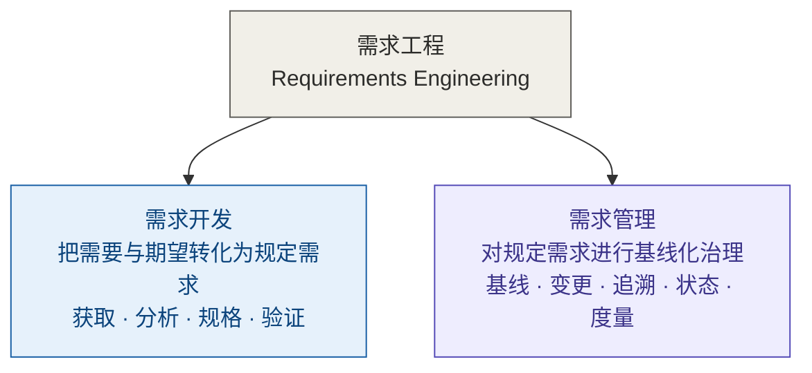
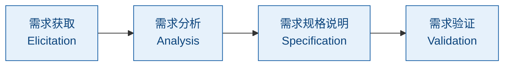
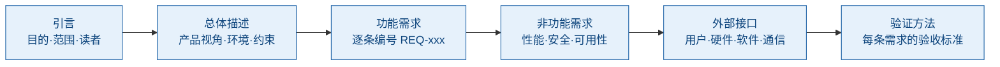
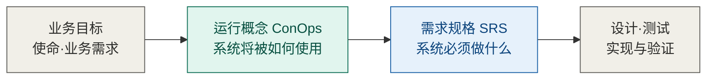
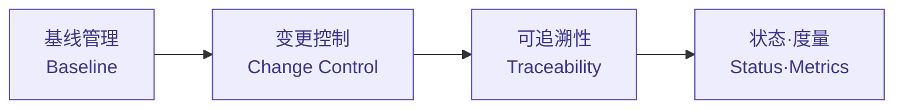
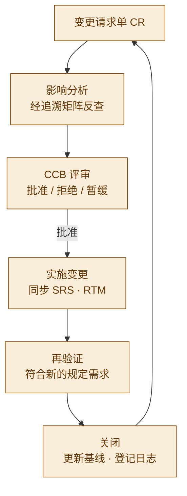
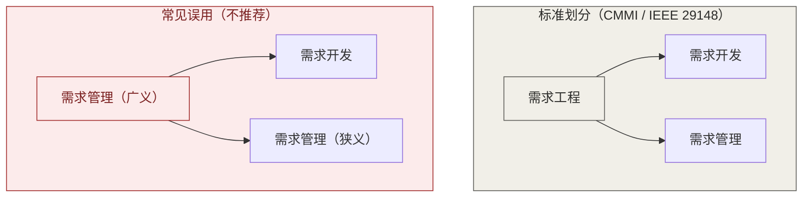
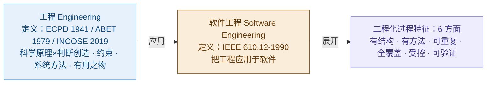
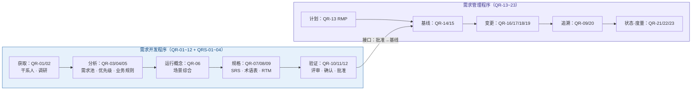

# 需求工程概念精讲：从需求开发到需求管理

> **整理日期**：2026-08-19
> **主题**：需求工程 / 需求开发 / 需求管理 / 运行概念 ConOps / 规定需求 / 需求管理计划 RMP / 工程六方面
> **说明**：本文档由一次连续的概念对话整理而成，所有图表均以 Mermaid 实现，支持 Typora / Obsidian / GitHub / VS Code 等渲染器直接显示。与《工程概念精讲笔记》（2026-08-17）互为姊妹篇。

## 目录

1. [需求工程：一个定义，两大过程](#1-需求工程一个定义两大过程)
2. [需求开发：把需要与期望转化为规定需求](#2-需求开发把需要与期望转化为规定需求)
   - [2.3 需求开发文档体系](#23-需求开发文档体系受控-12-份--支撑-4-份)
3. [运行概念 ConOps：问题域到解空间的桥](#3-运行概念conops问题域到解空间的桥)
4. [需求管理：对规定需求进行基线化治理](#4-需求管理对规定需求进行基线化治理)
   - [4.4 需求管理文档体系](#44-需求管理文档体系受控-11-份)
5. [术语边界：需求工程 ≠ 需求管理](#5-术语边界需求工程--需求管理)
6. [工程化：六个方面与出处考证](#6-工程化六个方面与出处考证)
   - [6.1 工程解读的四个层面](#61-工程解读的四个层面先定层面再谈数目)
7. [体系落地：两份程序与文档编号](#7-体系落地两份程序与文档编号)
   - [7.1 需求质量六性](#71-需求质量六性srs编写与评审的准绳)
   - [7.2 程序文件的裁剪建议](#72-程序文件的裁剪建议)
8. [全篇速查：一张表带走](#8-全篇速查一张表带走)

---

## 1. 需求工程：一个定义，两大过程

> **需求工程（Requirements Engineering）= 需求开发 + 需求管理**（并列，非包含）

需求工程是一套系统化的工程学科：把干系人的**需要（need）与期望（expectation）**转化为清晰、可验证的**规定需求（specified requirement）**，并对其全生命周期进行受控治理。一句话：**把"模糊的诉求"变成"可靠的依据"**。

*图 1｜需求工程全景：开发管"生"，管理管"养"*

**为什么叫"工程"**：因为它有工程学科的三件套——方法（访谈/原型/排序/评审）、过程（标准活动序列，每步有输入输出角色准则）、纪律（基线/变更控制/可追溯）。六方面解读见第 6 节。

## 2. 需求开发：把需要与期望转化为规定需求

### 2.1 四个活动

*图 2｜需求开发四活动*

| 活动 | 做什么 | 典型输出 |
|------|--------|---------|
| 获取 | 访谈、调研、竞品分析，收集需要与期望 | 干系人登记册、访谈调研记录 |
| 分析 | 澄清、分解、排序、建模、协商冲突 | 需求池、优先级排序表、业务规则清单 |
| 规格说明 | 把分析结果写成可验证条文 | SRS、术语表、追溯矩阵初版 |
| 验证 | 确认需求正确、完整、一致、可实现 | 评审报告、验证确认记录、批准记录 |

### 2.2 验证与确认：两个必须分开的环节

| | 验证 verification | 确认 validation |
|---|---|---|
| 对照 | **规定需求** | **用户真实意图** |
| 问的问题 | "表述对不对" | "是不是用户要的" |
| 输出 | 需求评审报告 | 验证·确认记录 |

> **术语约定（ISO 9000:2015 §3.6.4）**：需求 = 明示的、通常隐含的或必须履行的**需要或期望**；规定需求 = 被明示的需求，**验证的参照**。三者（stated / implied / obligatory）并列，无主次。

### 2.3 需求开发文档体系（受控 12 份 + 支撑 4 份）

| 编号 | 文档 | 用途 | 关键点 |
|---|---|---|---|
| QR-01 | 干系人登记册 | 识别相关方 | 评审、确认环节关键干系人覆盖 100% |
| QR-02 | 访谈调研记录 | 需要与期望的第一手证据 | 含对象/时间/原始记录/结论/待跟进；追溯"来源"底账 |
| QR-03 | 需求池 | 需求统一入口 | 无来源需求不得入池；入 SRS 的需求必须出自本池 |
| QR-04 | 优先级排序表 | 决定做什么、先做什么 | MoSCoW / Kano；无理由的排序无效 |
| QR-05 | 业务规则清单 | 识别隐藏约束 | 法规规则必须标注出处 |
| QR-06 | 运行概念（ConOps） | 系统怎么被用（问题域） | 见第 3 章 |
| QR-07 | 需求规格说明书（SRS） | **核心交付物**，规定需求的载体 | 六章结构（见下） |
| QR-08 | 术语表 | 统一概念定义 | SRS 术语收录率 100% |
| QR-09 | 需求追溯矩阵（RTM 初版） | 需求↔来源对应 | 无来源需求不得进入 SRS |
| QR-10 | 需求评审报告 | 验证（verification） | "表述对不对"；结论：通过/有条件通过/重审 |
| QR-11 | 验证·确认记录 | 确认（validation） | "是不是用户要的"；未确认不得批准 |
| QR-12 | 需求批准记录 | 权威性凭证 | 未经批准不得移交基线化 |
| QRS-01~04 | 竞品分析 / 用户故事 / 原型模型 / 可行性分析 | SRS 编制依据 | 支撑文档，随项目归档 |

**SRS 六章结构**（核心交付物的骨架）：

*图 4｜SRS 六章：每条需求须完整、一致、无歧义、可验证、可追溯、有优先级*

**文档分类视角**（帮助记忆 16 份）：素材类（干系人/调研/竞品/用户故事——需求从哪来）→ 分析类（需求池/优先级/业务规则/原型/可行性——需求怎么定）→ 正式交付（SRS/术语表/RTM——需求是什么）→ 验证交接（评审/确认/批准/基线——对不对、交出去）。骨架 5 份不可省：**SRS、需求池、RTM、评审报告、基线**。

## 3. 运行概念 ConOps：问题域到解空间的桥

运行概念（Concept of Operations）是从**用户/运营者视角**描述"系统将如何被使用"的文档——需求工程里唯一一份"叙事性"的正式输出（IEEE 1362 定义其结构）。

**它在链条中的位置**（需求开发中最重要的位置判断之一）：

*图 3｜问题域（怎么用）→ 解空间（做什么）：ConOps 讲"故事"，SRS 讲"条款"*

**位置判据**：ConOps 的完整定稿（运行场景、异常、应急、角色）必须建立在已经摸清需要的基础上——先获取分析，再综合成运行概念，最后翻译成 SRS 条文。因此 ConOps 置于**分析之后、规格之前**（编号 QR-06），而非流程最前。

**ConOps 六部分**（IEEE 1362）：引言 / 系统概述 / 运行环境 / 运行场景（正常·异常·应急）/ 干系人与角色 / 运行支持（部署·培训·维护·升级）。

## 4. 需求管理：对规定需求进行基线化治理

### 4.1 四大活动

*图 5｜需求管理四活动：开发管"生"，管理管"养"*

### 4.2 变更控制闭环（需求管理的核心战场）

*图 6｜变更控制闭环：无 CR 不得变更；不分析不得上会；验证通过方可关闭*

**变更分级**：微小（需求负责人批）/ 一般（PM 批）/ 重大（CCB 全体评审）。

### 4.3 需求管理计划（RMP）的定位

**本程序（组织级规程）** 与 **RMP（项目级计划）** 是两个层级：

- 程序文件规定组织内"怎么管需求"的通用要求；
- RMP 是每个项目启动时按程序文件编制的执行计划（本项目 CCB 组成、基线策略、变更流程、工具与度量安排）。

RMP 六模块：目的范围 / 角色职责 / 需求组织规则 / 基线策略 / 变更控制流程 / 追溯与度量安排。

### 4.4 需求管理文档体系（受控 11 份）

| 编号 | 文档 | 用途 | 关键点 |
|---|---|---|---|
| QR-13 | 需求管理计划（RMP） | 项目级执行计划 | 程序文件的落项目版本；六模块 |
| QR-14 | 需求基线（冻结版 SRS） | 变更判定基准 | 未经批准不得建基线；版本"主.次" |
| QR-15 | 基线登记表 | 基线版本台账 | 每次变更留痕；与 CR 可对账 |
| QR-16 | 变更请求单（CR） | 变更立案单 | 无 CR 不得实施变更 |
| QR-17 | 影响分析报告 | 变更波及评估 | 经 RTM 反查；不分析不得上会 |
| QR-18 | CCB 评审记录 | 变更决策凭证 | 重大变更须全体出席 |
| QR-19 | 变更验证记录 | 变更闭环凭证 | 验证通过方可关闭 CR |
| QR-20 | 覆盖分析记录 | 追溯"体检报告" | 覆盖率 100%；缺口须整改闭环 |
| QR-21 | 需求状态报告 | 需求整体快照 | 状态须与 RTM 一致 |
| QR-22 | 变更日志 | 变更流水账 | 只追加不修改；审计调取 |
| QR-23 | 需求度量报告 | 过程质量数据 | 预警阈值驱动改进（见下） |

**关键机制**：

- **基线是分界线**——线左是需求开发的产物，线右进入需求管理管辖；基线后一切改动走变更控制；
- **RTM 的三个身份**——变更影响分析的"地图"、测试覆盖的"账本"、合规审计的"证据"；
- **变更时限**——SRS 完成后 5 个工作日内评审；影响分析 3 个工作日；CCB 5 个工作日内决策；紧急变更 24 小时内追认；
- **度量预警阈值**——变更率 ≥15%、稳定性 ≤80%、追溯覆盖率 <100%、变更平均周期 ≥10 天，触发即启动根因分析。

## 5. 术语边界：需求工程 ≠ 需求管理

一个常见的误用：把"需求管理"当作包含"需求开发"的大概念。**标准划分（CMMI：REQM/RD 并列过程域；IEEE 29148）是并列，需求工程才是总称**。

*图 7｜并列 vs 包含：严谨场合用"需求工程"作总称*

**为什么值得较真**：两类活动本质不同——开发是**创造性**（收集、分析、建模、写规格），管理是**控制性**（冻结、变更、追溯、跟踪）。把开发包进管理，会模糊"需求是开发出来的，不是管出来的"；且验证的参照（规定需求）由谁负责产生，职责会糊。若组织习惯广义用法，文档开头加一句定义钉死即可。

**术语三不混用**（贯穿全部需求工程文档的约定）：

| 英文 | 中文 | 定义 |
|---|---|---|
| requirement | 需求 | 明示的、通常隐含的或必须履行的需要或期望 |
| need | 需要 | 基本诉求 |
| expectation | 期望 | 理想诉求 |

specified requirement → **规定需求**（被明示的需求，验证的参照；国标 GB/T 19000 用"要求"，按本体系约定统一用"需求"）。

## 6. 工程化：六个方面与出处考证

"工程"解读有四个层面（定义/过程/结构/定位），本文聚焦**过程层**：工程化的完整过程特征为**六个方面**，直接出处是 IEEE 610.12-1990 对**软件工程**的定义。

> **(1) The application of a systematic, disciplined, quantifiable approach to the development, operation, and maintenance of software; that is, the application of engineering to software.**
> 中文：将系统化的、规范的、可度量的方法应用于软件的开发、运行与维护——也就是把工程应用于软件。

*图 8｜出处层级：工程定义 → 软件工程定义 → 六方面*

| # | 方面 | 出处 | 一句话 |
|---|------|------|--------|
| 1 | 有结构 | systematic 的展开 | 分解为清晰步骤与阶段 |
| 2 | 有方法（含判断） | systematic 的展开 | 有章法，非算法执行 |
| 3 | 可重复 | systematic 的展开 | 换人执行结果仍稳定 |
| 4 | 全覆盖 | systematic 的展开 | 从获取到退役无遗漏 |
| 5 | 受控（有纪律） | disciplined | 有基线、有变更控制 |
| 6 | 可验证（可度量） | quantifiable | 有证据、可检查、可度量 |

**出处层级澄清（重要）**：IEEE 610.12 定义的是**软件工程**，不是工程本身——"the application of engineering to software" 引用而未定义工程。因此：

- **工程是什么** → ECPD / ABET / INCOSE（四要素：科学原理 × 判断创造，约束下，系统方法，造有用之物）；
- **工程做起来是什么样** → IEEE 610.12 的三个形容词（工程过程特征的权威外显）。

严谨表述："据 IEEE 610.12 对软件工程的定义，工程化的过程表现为……"。

### 6.1 工程解读的四个层面（先定层面，再谈数目）

"工程"的解读框架有多个，数目不同是因为回答的问题不同，不是谁对谁错：

| 层面 | 回答的问题 | 框架 |
|---|---|---|
| 定义层 | 工程是什么 | 4 要素：科学原理 × 判断创造，约束下，系统方法，造有用之物 |
| 过程层 | 怎么做才像工程 | 6 方面：有结构·有方法·可重复·全覆盖·受控·可验证（本节） |
| 结构层 | 工程靠什么撑起来 | 4 层：工程科学 · 方法论 · 工具实践 · 价值与伦理 |
| 定位层 | 工程和谁有别 | 3 对立：科学（认识论）· 手艺（方法论）· 艺术（目标） |

**试金石（定位层）**：换个团队、换个人，用同样的需求文档和约束，能交付质量相当的成果——能，是工程；不能，那是手艺。

**价值与伦理层（结构层最易失守的一层）**：泰坦尼克号、挑战者号、波音 737 MAX——重大工程事故背后几乎都不是方法论出错，而是价值层失守。落到需求工程：需求必须锚定客户真实价值，隐私、安全、合规这些"通常隐含"的需求正是价值层的体现。

**需求缺陷成本数据**（工程化投入的回报依据）：同一缺陷在需求阶段修复成本为 1，发布后修复为 30~70 倍——需求工程的每一分投入都在给下游省十倍百倍返工钱。

## 7. 体系落地：两份程序与文档编号

需求工程体系由两份程序文件构成，接口在"批准 → 建立基线"处咬合：

*图 9｜两份程序、一个接口：QR-12 批准 → QR-14 基线*

**全体系文档编号**（27 份）：

| 域 | 编号 | 文档 |
|---|---|---|
| 开发（12 受控） | QR-01~05 | 干系人登记册 · 访谈调研记录 · 需求池 · 优先级排序表 · 业务规则清单 |
| | QR-06 | 运行概念（ConOps） |
| | QR-07~09 | 需求规格说明书（SRS）· 术语表 · 需求追溯矩阵（RTM） |
| | QR-10~12 | 需求评审报告（验证）· 验证确认记录（确认）· 需求批准记录 |
| 支撑（4 份） | QRS-01~04 | 竞品分析 · 用户故事 · 原型模型 · 可行性分析 |
| 管理（11 受控） | QR-13~15 | 需求管理计划（RMP）· 需求基线 · 基线登记表 |
| | QR-16~19 | 变更请求单（CR）· 影响分析 · CCB 评审记录 · 变更验证记录 |
| | QR-20~23 | 覆盖分析 · 需求状态报告 · 变更日志 · 需求度量报告 |

**落地要点**：每份文档按过程活动五要素管理——**何时 / 谁 / 做什么 / 以什么标准 / 输出·流转**。"以什么标准"必须可判定（如覆盖率 100%、5 个工作日内、无 CR 不得变更）。

### 7.1 需求质量六性（SRS 编写与评审的准绳）

每条需求工程意义上合格，须同时满足：**完整**（该有的都有，含隐含需求）· **一致**（互不打架）· **无歧义**（只能有一种理解）· **可验证**（能设计测试证明）· **可追溯**（知道从哪来、到哪去）· **有优先级**（知道先做哪个）。

落地表现：SRS 中禁止"快速/大约/友好"等不可验证表述——这正是"无歧义 + 可验证"的检查项。

### 7.2 程序文件的裁剪建议

- **骨架 5 份不可省**（任何规模项目）：SRS、需求池、RTM、评审报告、基线；
- 素材类文档（竞品分析、用户故事等）即使不写成正式文档，也要留原始记录——它们是追溯链的最底层；
- 需求管理域台账/凭证类（CR、CCB 记录、变更日志）是"命根子"——审计、扯皮、追责全靠它们。

## 8. 全篇速查：一张表带走

### 核心概念定义

| 概念 | 一句话定义 |
|---|---|
| 需求工程 | 需求开发 + 需求管理；把需要与期望转化为规定需求并治理其生命周期 |
| 需求开发 | 获取 → 分析 → 规格 → 验证，产出规定需求（SRS 为载体） |
| 需求管理 | 基线 → 变更 → 追溯 → 状态 → 度量，对规定需求进行基线化治理 |
| 规定需求 | 被明示的需求；**验证的参照**（ISO 9000:2015 §3.6.4） |
| 运行概念 ConOps | 从用户/运营视角描述系统将如何被使用（问题域，IEEE 1362） |
| 需求管理计划 RMP | 项目级执行计划，程序文件的落项目版本 |
| 需求质量六性 | 完整 · 一致 · 无歧义 · 可验证 · 可追溯 · 有优先级 |

### 关键对偶关系

| 对比 | 本质区别 |
|---|---|
| 需求开发 ↔ 需求管理 | 创造性 ↔ 控制性；"生" ↔ "养" |
| 验证 ↔ 确认 | 对照规定需求查"表述对不对" ↔ 对照用户意图查"是不是要的" |
| ConOps ↔ SRS | 问题域"怎么用" ↔ 解空间"做什么" |
| 程序文件 ↔ RMP | 组织级规程 ↔ 项目级计划 |
| 需求工程 ↔ 需求管理 | 总称（并列） ↔ 子过程（不包含开发） |

### 金句

- **开发的活是"造血"，管理的活是"防腐"**——管理再严，来源没摸清、分析没做透，一样出烂需求。
- **ConOps 讲"故事"，SRS 讲"条款"**——先讲清楚系统怎么被用，才谈得上系统必须做什么。
- **无 CR 不得变更，不分析不得上会，验证通过方可关闭**——变更控制的三条铁律。
- **基线是分界线**——线左是开发的产物，线右进入管理的管辖。
- **RTM 的三个身份**——变更影响分析的"地图"、测试覆盖的"账本"、合规审计的"证据"。
- **工程 = 有结构 + 有方法 + 可重复 + 全覆盖 + 受控 + 可验证**——六方面，出处 IEEE 610.12（软件工程定义）。

---

## 一句话总结全文

**需求工程**是"把模糊的诉求变成可靠的依据"的工程学科：**需求开发**负责"生"（把需要与期望转化为规定需求，以 ConOps 为桥、SRS 为载体），**需求管理**负责"养"（基线、变更、追溯、状态、度量）；两者并列构成需求工程，接口在"批准 → 基线"处咬合。这套体系之所以是"工程"而非"手艺"，是因为它占全了工程化的六个方面——有结构、有方法、可重复、全覆盖、受控、可验证。
