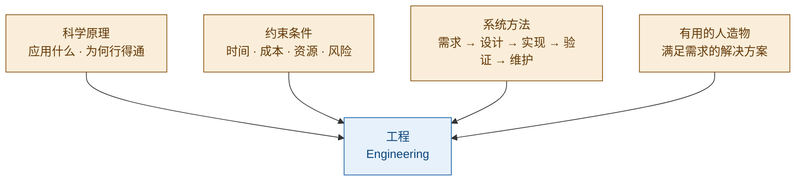
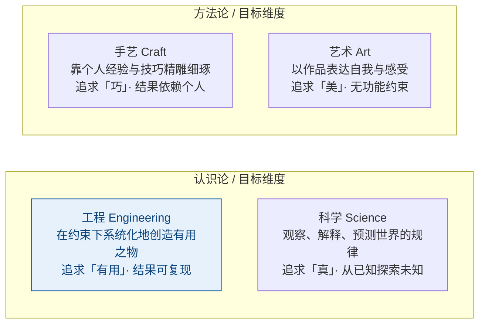
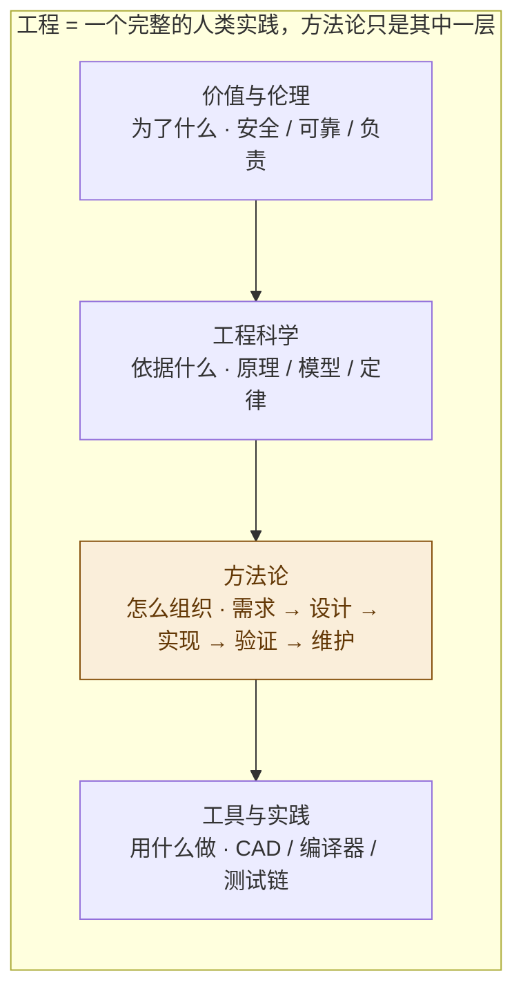
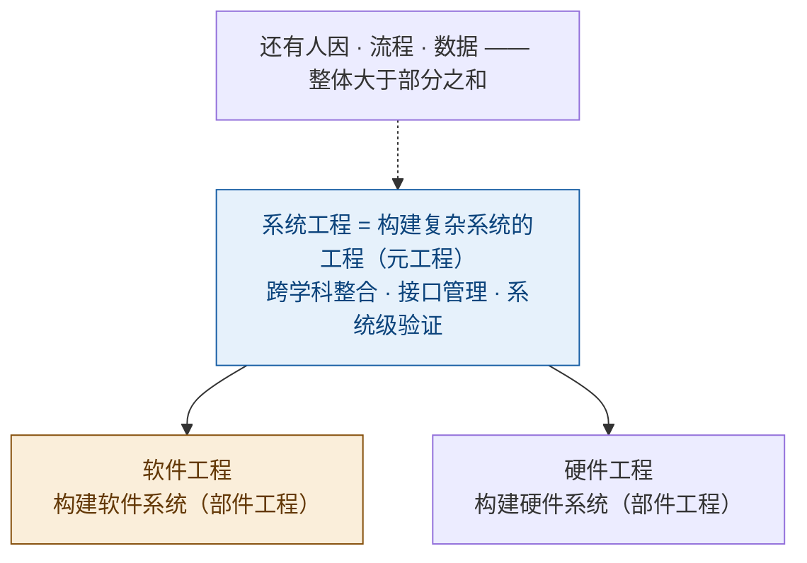
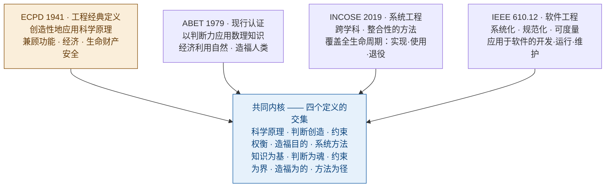
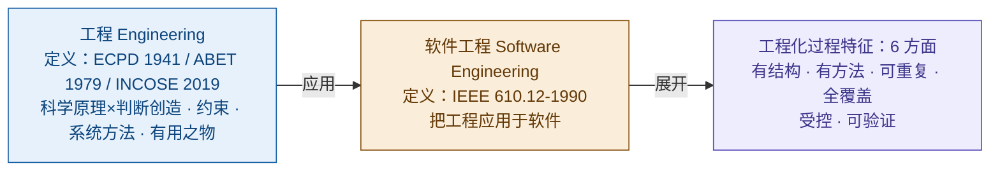
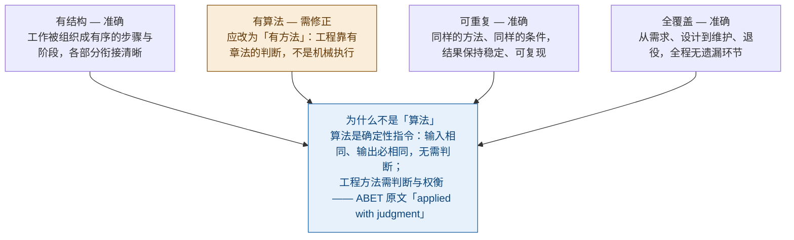
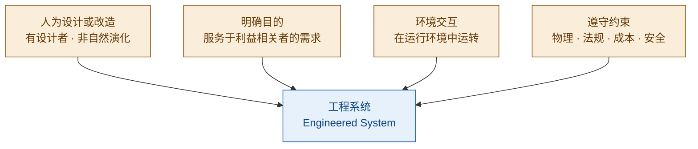
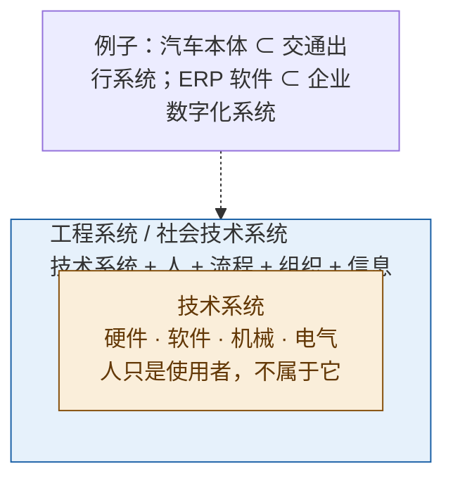

# 工程概念精讲：从定义到系统思维

> **整理日期**：2026-08-17
> **主题**：工程 / 方法论 / 系统工程 / 软件工程 / 工程系统 / 技术系统
> **说明**：本文档由一次连续的概念对话整理而成，所有图表均以 Mermaid 实现，支持 Typora / Obsidian / GitHub / VS Code 等渲染器直接显示。

## 目录

1. [工程是什么：一个定义，四个要素](#1-工程是什么一个定义四个要素)
2. [工程的对立面：科学 · 手艺 · 艺术](#2-工程的对立面科学--手艺--艺术)
3. [工程是方法论吗：方法 < 方法论 < 工程](#3-工程是方法论吗方法--方法论--工程)
4. [系统工程与软件工程：构建什么，包含什么](#4-系统工程与软件工程构建什么包含什么)
5. [权威定义：80 年四个机构的共识](#5-权威定义80-年四个机构的共识)
6. [系统化（Systematic）到底是什么意思](#6-系统化systematic到底是什么意思)
7. [系统化 ≠ 机械化：算法与方法之别](#7-系统化--机械化算法与方法之别)
8. [工程系统（Engineered System）](#8-工程系统engineered-system)
9. [技术系统（Technical System）与工程系统](#9-技术系统technical-system与工程系统)
10. [全篇速查：一张表带走](#10-全篇速查一张表带走)

---

## 1. 工程是什么：一个定义，四个要素

"工程"一词被使用得很滥（信息工程、管理工程……），但在系统工程、软件工程、硬件工程里，它有一个非常硬核的共同内核：

> **工程 = 在现实约束下，系统化地应用科学原理，创造有用的人造物。**

*图 1｜工程的四个支柱：科学原理、约束条件、系统方法，产出有用的人造物*

四个要素各司其职：

| 要素 | 作用 | 要点 |
|------|------|------|
| **科学原理** | 地基 | 工程是*应用*原理而非*发现*原理；物理定律、数学模型、算法理论是依托。 |
| **约束条件** | 精髓 | 成本、工期、资源、风险、法规、物理极限——工程是*戴着镣铐跳舞*。 |
| **系统方法** | 过程 | 需求分析→架构设计→实现→验证→运维，保证*可计划、可度量、可复现*。 |
| **有用的人造物** | 目的 | 一切为了交付能用的东西；没有约束的"创造"不叫工程，叫发明或艺术。 |

航空航天领域那句流传甚广的话，把工程与科学的分工说得很透（常被归于空气动力学之父冯·卡门 Theodore von Kármán）：

> **"科学家研究现存的世界，工程师创造从未存在的世界。"**（Scientists study the world as it is; engineers create the world that never has been.）

> 系统工程、软件工程、硬件工程的差异只是**载体**不同——系统的层级结构、代码、物理器件——内核完全一致。

## 2. 工程的对立面：科学 · 手艺 · 艺术

反直觉的答案：**"工程"没有单一对立面，它的对立面取决于你站在哪个维度看。**

*图 2｜工程的三个维度对立面*

| 维度 | 对立面 | 区别 |
|------|--------|------|
| **认识论** | 科学 | 科学问"世界是什么"，工程问"应该造出什么"。科学家的失败可贵（推翻假说），工程师的失败是灾难（垮了就垮了）。 |
| **方法论** | 手艺 / 即兴 | 手艺靠个人经验与灵感，结果依赖人；工程靠流程、标准、文档、评审、测试，*换个人也能交付*。 |
| **目标** | 艺术 | 艺术为表达自我，功能约束让位于审美；工程为满足用户，一切决策向可用、可靠、可维护汇报。 |

> **试金石：** 换个团队、换个人，用同样的需求文档和约束，能不能交付质量相当的成果？能，是工程；不能，那是手艺——哪怕它碰巧也用了代码、图纸或电路。

## 3. 工程是方法论吗：方法 < 方法论 < 工程

方法论确实是工程的心脏，但**工程 ≠ 方法论**。先分清三个词：

- **方法（method）**：一条具体做法，比如"排序用快速排序"。
- **方法论（methodology）**：关于"怎么组织工作、怎么选方法"的系统学说，如瀑布模型、敏捷、CMMI。
- **工程（engineering）**：比前两者都大的整体——方法论只是它的一部分。

*图 3｜工程的四层结构：方法论只是"怎么组织"那一层*

为什么说方法论是心脏？**正是这一层把工程和手艺区分开**——方法论意味着"换个团队也能用同样的方式交付"。但工程绝不止方法论：

- **工程科学**：方法论不告诉你"为什么这样能行"。没有力学定律，土木工程师只是个会搭积木的人；没有算法理论，软件工程师只是在瞎调参数。
- **工具与实践**：方法论必须落地成工具和动作才产生价值。
- **价值与伦理**：最容易被忽略的一层。泰坦尼克号、挑战者号、波音 737 MAX……每次重大工程事故背后几乎都不是方法论出了问题，而是价值层失守——为成本、进度、利润牺牲安全。只讲方法论不讲伦理，那不叫工程，叫"有组织的赌博"。

> **常见误区：** "我们用敏捷，所以我们在做软件工程。"——不。敏捷只是方法论这一层的代表之一，而且常被用歪（只有仪式没有落地）。完整软件工程是知识 + 方法论 + 实践 + 价值四层同时在场。

## 4. 系统工程与软件工程：构建什么，包含什么

"可以理解为构建系统的工程、构建软件的工程吗？"——方向正确，但"系统"这个词是**递归的**：

- **软件工程 = 构建软件系统的工程**。软件本身就是一个系统：模块、接口、数据流、运行时环境、版本演进……软件工程内部同样需要系统思维（架构、接口、集成测试）。
- **系统工程 = 构建复杂系统的工程**。但这里的"系统"特指由多个异构部件（硬件 + 软件 + 人 + 流程 + 数据）组成的整体；系统工程的重心不在"造部件"，而在**整合**。

*图 4｜系统工程是"元工程"，软件/硬件工程是其中的部件工程*

关键区分：**系统工程不造任何部件，它负责"把部件整合成整体"**——把总需求分解分配给各部件工程、定义接口、在系统层面做集成与验证。单个部件都合格，不等于整体合格，这叫**涌现属性（emergent behavior）**：每个发动机都正常、每块机翼都达标，飞机未必能飞。

而"递归性"体现在：当软件足够大（操作系统、微服务集群），软件工程内部也会长出系统工程的子集——系统架构师、接口契约、集成测试、端到端验证，即"软件系统工程"。

> **实践含义：** 服务级工程做得好 ≠ 系统级工程做得好。微服务每个单独健康，但调用链、数据一致性、超时熔断没人管，上线必出事——这些"灰色地带"就是系统工程的地盘。

## 5. 权威定义：80 年四个机构的共识

"工程"有多个国际权威机构的正式定义，横跨 80 年、三个领域（通用工程、系统工程、软件工程），却惊人地收敛到同一组要素。

> **ECPD（美国工程师职业发展委员会，ABET 前身，1941）**
> "The creative application of scientific principles to design or develop structures, machines, apparatus, or manufacturing processes … all as respects an intended function, economics of operation and safety to life and property."
> （创造性地应用科学原理，设计或开发结构、机器、装置、制造过程……着眼于预期功能、运行经济性以及对生命财产的安全。）

> **ABET（1979，现行认证标准）**
> "The profession in which a knowledge of the mathematical and natural sciences gained by study, experience, and practice is applied with judgment to develop ways to utilize, economically, the materials and forces of nature for the benefit of mankind."
> （将通过学习、经验和实践获得的数学与自然科学知识，运用判断力加以应用，以经济地利用自然的物质与力量，造福人类。）

> **INCOSE（国际系统工程学会，2019 年批准）**
> "Systems Engineering is a transdisciplinary and integrative approach to enable the successful realization, use, and retirement of engineered systems …"
> （系统工程是一种跨学科、整合性的方法，运用系统原理以及科学、技术和管理方法，使工程系统的成功实现、使用与退役成为可能。）

> **IEEE 610.12-1990（IEEE 标准术语）**
> "The application of a systematic, disciplined, quantifiable approach to the development, operation, and maintenance of software; that is, the application of engineering to software."
> （将系统化的、规范的、可度量的方法应用于软件的开发、运行与维护——也就是把工程应用于软件。）

*图 5｜四个权威定义收敛到五个共同要素*

逐条对照四个定义，可以看到每个共同要素分别出自哪里：

| 要素 | ECPD 1941 | ABET 1979 | INCOSE 2019 | IEEE 610.12 |
|------|-----------|-----------|-------------|-------------|
| **知识基础** | 科学原理 | 数理知识 | 科学、技术方法 | — |
| **判断与创造** | creative | with judgment | — | disciplined |
| **约束** | 经济、安全 | economically | — | — |
| **造福目的** | intended function | 造福人类 | 成功实现 | 开发·运行·维护 |
| **系统方法** | — | — | 跨学科整合 | systematic, quantifiable |

注意一个细节：**连 1941 年最早的工程定义里，就同时出现了"运行经济性"和"生命财产安全"**——约束从来不是工程的附加项，而是定义的组成部分。

### 综合定义（有权威出处背书）

> **完整版：** 工程是以数学与自然科学知识为基础，运用专业判断与创造力，在功能、经济、安全等现实约束下，以系统化、规范化、可度量的方法，设计、构建、运行并维护满足人类需求的工程系统与人造物的专业实践。

> **精炼版：** 工程 = 科学原理 × 判断与创造，在约束下，用系统方法，造出有用且安全的东西。

### 5.1 出处层级澄清：IEEE 610.12 定义的是"软件工程"，不是"工程"（2026-08-19 补充）

IEEE 610.12-1990 全称《IEEE Standard Glossary of Software Engineering Terminology》（软件工程术语标准）。其中 **Software Engineering** 词条的定义：

> **(1) The application of a systematic, disciplined, quantifiable approach to the development, operation, and maintenance of software; that is, the application of engineering to software.**
> **(2) The study of approaches as in (1).**
>
> 中文：(1) 将系统化的、规范的、可度量的方法应用于软件的开发、运行与维护——也就是把工程应用于软件；(2) 对(1)中所述方法的研究。
>
> （该定义被 SWEBOK、NASA NPR 7150.2、SEBoK 等权威体系全文采用。）

**三点关键澄清：**

1. 该定义的对象是**软件工程（Software Engineering）**，不是工程（Engineering）本身；
2. 定义句 "the application of engineering to software" 把"工程"当作已知概念引用，**并未定义工程**；
3. "工程"本身的权威定义见本笔记第 5 节（ECPD 1941 / ABET 1979 / INCOSE 2019），二者**互补不冲突**：
   - ECPD / ABET / INCOSE 回答"**工程是什么**"（4 要素：科学原理 × 判断创造，约束下，系统方法，造有用之物）；
   - IEEE 610.12 回答"**工程做起来是什么样**"——systematic、disciplined、quantifiable 三个形容词。

**六个方面的正确引用方式：**

| 方面 | 直接出处 | 层级说明 |
|---|---|---|
| 有结构 | systematic 的展开 | IEEE 610.12 软件工程定义 |
| 有方法（含判断） | systematic 的展开 | IEEE 610.12 软件工程定义 |
| 可重复 | systematic 的展开 | IEEE 610.12 软件工程定义 |
| 全覆盖 | systematic 的展开 | IEEE 610.12 软件工程定义 |
| 受控（有纪律） | disciplined | IEEE 610.12 软件工程定义 |
| 可验证（可度量） | quantifiable | IEEE 610.12 软件工程定义 |

*图 5.1｜出处层级：工程定义 → 软件工程定义 → 六方面过程特征*

> **引用规范：** 六个方面是对"工程的过程特征"的解读，但**直接出处是 IEEE 610.12 的软件工程定义**——因其定义"软件工程 = 把工程应用于软件"，三个形容词可视为工程过程特征的权威外显。严谨表述应写："据 IEEE 610.12 对软件工程的定义，工程化的过程表现为……"。

## 6. 系统化（Systematic）到底是什么意思

"系统化"是 IEEE 定义里的**第一个词**，它不是随便放的。词源上，"系统化"来自"系统"——字面意思就是**"像系统一样做事"**：把工作组织成一个有结构、有序、各部分衔接良好的整体。它有四个可操作的特征：

*图 6｜系统化与即兴发挥的正反对照*

### 一个中文翻译造成的经典混淆

英文里有两个同源但不同的词，中文都译成"系统的"：

| 词 | 含义 | 回答的问题 |
|----|------|-----------|
| **systematic（系统化）** | 过程有条理——步骤清晰、方法规范、可检查可复现 | 怎么做事（IEEE 定义用词） |
| **systemic / systems thinking（系统性 / 系统思维）** | 视角看整体——关注部分间关系、涌现行为、与环境交互 | 怎么看问题（INCOSE 定义的落脚点） |

**systematic 是"做事有章法"，systemic 是"看问题有全局"。** 好的工程两者都要——用系统思维发现问题，用系统化方法解决问题。

### 例子：同样给软件加一个新功能

**非系统化：** 想起需求直接开写 → 写一半发现要改数据库 → 顺手改了表结构 → 没测旧功能 → 上线后报表挂了 → 连夜回滚 → 三个月后没人知道为什么多了个字段。

**系统化：** 需求写清楚并评审 → 评估影响范围 → 设计评审 → 编码 + 单元测试 → 集成测试回归旧功能 → 代码评审 → 预发布验证 → 上线 → 记录变更。每一步有明确的输入、输出和检查点。

> 系统化的本质不是"流程繁琐"，而是：**每一步都可检查、每个决策都可追溯、整个活动可复制**——这正是工程区别于手艺的那个"换个人也能交付"的来源。

## 7. 系统化 ≠ 机械化：算法与方法之别

"像系统一样做事，就是有结构、有算法、可重复、全覆盖吗？"——方向对，四个词里三个准确，但**"有算法"是错的，必须换成"有方法（含判断）"**。

*图 7｜四特征逐条检验："有算法"修正为"有方法"*

为什么"有算法"不对：**算法（algorithm）是确定性的**——给定相同输入，必定产生相同输出，中间不需要任何人做判断。排序算法不会因为"今天心情不好"就排乱。**工程方法不是这样**：它是有章法的（有步骤、有标准、有检查点），但每一步都留有人做判断的空间——材料公差、需求变化、成本权衡、风险取舍，没有唯一正确答案，要靠工程师的判断。

- **机械化执行（算法化）**：不需要思考，可以被自动化——流水线、编译器干的事。
- **系统化工程（方法 + 判断）**：有流程但不失判断，有章法但能应变。

这也修正了"像系统一样做事"这个比喻——**不是"像机器一样"（按固定程序走），而是"像有组织的整体一样"**（各部分分工协作、有接口、有反馈、能应变）。更准确的类比是**乐队**：每个乐手按总谱演奏，但指挥会根据现场情况调整节奏——这才是系统性，不是机械性。

> **精髓：** 系统化的目的不是消灭不确定性，而是把不确定性纳入可控范围。工程面对的世界从来不是确定性的——需求会变、环境会变、人会犯错。系统化方法通过检查点、评审、测试、反馈回路来管理这些不确定性。软件行业最典型的例子就是敏捷：它有完整的流程，但每一步都依赖人的判断——**高度系统化，但一点都谈不上"算法化"**。

## 8. 工程系统（Engineered System）

"工程系统"是 INCOSE 系统工程定义里的核心对象，但常被误读为"工程领域的系统"或"技术系统"。正式定义：

> **INCOSE（2019）：** "A system designed or adapted to interact with an anticipated operational environment to achieve one or more intended purposes while complying with applicable constraints."
> （一个被**设计或改造**的、与**预期的运行环境**交互、以达成一个或多个**预期目的**、同时**遵守适用约束**的系统。）

关键就在"engineered（被工程化的）"这个词——它把工程系统和所有其他系统区分开。四个特征：

*图 8｜工程系统的四个特征*

"人为设计或改造"是分水岭：

| 系统类型 | 例子 | 是工程系统吗 |
|----------|------|-------------|
| 自然系统 | 山脉、天气、生态系统 | 否 —— 自然演化，无设计者 |
| 社会系统 | 市场、语言、城市文化 | 否 —— 集体行为涌现，非被设计 |
| 概念系统 | 数学理论、法律框架 | 否 —— 纯信息，无运行环境 |
| **工程系统** | 汽车、电网、软件、机场 | 是 —— 被设计、有目的、与环境交互、受约束 |

两个容易踩的坑：

- **工程系统 ≠ 技术系统。** INCOSE 特别说明：工程系统可以由**人、产品、服务、信息、流程、甚至自然元素**组成。最典型的例子是**机场**——跑道和航站楼（物理）、雷达和行李分拣（技术）、塔台和地勤（人）、安检和调度（流程）、航班数据（信息），还有气象条件（环境），合起来才产生"机场顺利运行"这个涌现行为。
- **软件系统是工程系统。** 它虽然看不见摸不着（概念系统），但它是被设计出来的、有明确目的、与运行环境交互（操作系统、网络、用户）、受约束（性能、安全、法规）的——四条全中。

> **生命周期：** INCOSE 定义说工程系统要被"实现、使用、退役"——意味着工程系统**有生命周期**，要为"退役"做设计（系统能安全关停、数据能迁移）。

## 9. 技术系统（Technical System）与工程系统

**技术系统 = 由人工技术组件构成的系统**——硬件、软件、机械、电气，它们协同实现功能。人可以操作它，但人**不属于**它——技术系统的边界就是设备的边界。

- **纯人工制品**：没有自然物、没有"活的"组件；
- **功能靠技术实现**：性能可量化、可测试（吞吐量、负载、响应时间）；
- **人只是外部使用者**：司机、操作员都在系统之外，不是组成部分。

*图 9｜技术系统是工程系统的内核*

为什么这个区分如此重要？因为**系统工程史上最昂贵的教训之一，就是"把工程系统当成技术系统来管"**。20 世纪 70-80 年代，系统工程界发现大量项目失败——系统造出来了、性能达标，但**用不起来**。德国系统理论家 Ropohl 等人提出，很多"系统"其实是**社会技术系统（socio-technical system）**：技术子系统 + 人的子系统 + 组织子系统耦合在一起，单独优化技术部分没有意义。这也是为什么 INCOSE 2019 特意把定义从"technical system"改写为"engineered system"并注明可含人、流程、信息——把视野从设备扩到整个运行环境。

### 最经典的翻车案例：ERP（企业资源计划系统）

- 按**技术系统**视角：软件部署好了、服务器跑起来了、模块上线了——"系统成功"。
- 按**工程系统**视角：采购流程没改、财务人员不会用、数据没清洗——"系统失败"。

砸了几千万，最后发现"系统"根本没被用起来。这不是技术问题，是**把技术系统误当成了工程系统来验收**——忘了人、流程、组织也是这个系统的一部分。

> **收尾：** 软件系统本身是技术系统（代码、数据、服务器）；**"软件 + 用户 + 业务流程 + 运维组织"才是工程系统**。说"我们构建了一个技术系统"，说的是设备的集合；说"我们构建了一个工程系统"，承诺的是整个社会技术系统能运转起来——技术达标、人会用、流程顺、组织撑得住。这后一种承诺，才是系统工程真正的活儿。

## 10. 全篇速查：一张表带走

### 核心概念定义

| 概念 | 一句话定义 |
|------|-----------|
| **工程** | 科学原理 × 判断与创造，在约束下，用系统方法，造出有用且安全的东西。 |
| **系统工程** | 构建复杂系统的元工程——跨学科整合、接口管理、系统级验证，使工程系统成功实现、使用与退役。 |
| **软件工程** | 将系统化、规范化、可度量的方法应用于软件的开发、运行与维护（IEEE 610.12）。 |
| **工程系统** | 被设计或改造的、与环境交互、有明确目的、受约束的系统（INCOSE 2019）。 |
| **技术系统** | 仅由人工技术组件（硬件、软件、机械、电气）构成的系统，人只是使用者。 |

### 关键对偶关系

| 对比 | 本质区别 |
|------|----------|
| 工程 ↔ 科学 | 创造 vs 发现；追求"有用" vs 追求"真" |
| 工程 ↔ 手艺 | 可复现 vs 依赖个人；系统化 vs 即兴 |
| 工程 ↔ 艺术 | 满足需求 vs 自我表达；受约束 vs 自由 |
| 系统化 ↔ 机械化 | 有章法 + 判断 vs 确定性执行；工程靠方法，不靠算法 |
| 工程系统 ↔ 技术系统 | 含人、流程、组织 vs 纯设备；社会技术系统 vs 设备集合 |

### 金句

- **试金石**：换个团队、换个人，用同样的需求文档和约束，能交付质量相当的成果——能，是工程；不能，那是手艺。
- **约束即定义**：连 1941 年最早的工程定义里，同时出现了"运行经济性"和"生命财产安全"。约束不是附加项，是定义的一部分。
- **系统化 ≠ 机械化**：systematic 是做事有章法，systemic 是看问题有全局。工程有流程但不失判断，有章法但能应变。
- **涌现属性**：每个部件都正常，系统未必正常。整体行为不是部分行为的简单相加——这就是系统工程存在的原因。

---

## 一句话总结全文

**工程是在现实约束下，用系统化方法把科学原理锻造成有用之物的实践；** 它的对立面取决于维度——认识论上是科学，方法论上是手艺，目标上是艺术。**系统工程**是整合部件、管理涌现的元工程，**软件工程**是其面向软件载体的子类；两者共同的服务对象是**工程系统**——被设计、有目的、与环境交互、受约束、有生命周期的系统，而不是仅仅由设备构成的**技术系统**。
