# 从概念到架构：ISO/IEC/IEEE 42010 架构定义深度解析

> **整理日期**：2026-08-17
> **修订日期**：2026-08-26
> **主题**：概念 · 符号学 · IPD · 架构定义 · 架构描述
> **说明**：本文档由一次连续的概念对话整理而成，所有图表均以 Mermaid 实现，支持 Typora / Obsidian / GitHub / VS Code 等渲染器直接显示。
> **修订记录**：2026-08-26 补充——§7.4 新增「ISO/IEC/IEEE 42010:2022 的变化」（EoI、ADF、视图组件、多候选架构）；§8 扩展 8.3~8.7（「基本」的语法精读 / 判据锚点 IEV Note 2 / 不变量判据与同一性目的论 / 与粒度正交 / 去除测试修正）；§14.4 新增第三段认知链路（目的→同一性→不变量→fundamental→架构）。

## 目录

1. [概念：是什么、为什么、解决什么](#1-概念是什么为什么解决什么)
2. [术语 vs 概念](#2-术语-vs-概念)
3. [符号学视角：概念的位置](#3-符号学视角概念的位置)
4. [概念设计](#4-概念设计)
5. [IPD 六个阶段](#5-ipd-六个阶段)
6. ["概念"一词的三种语境](#6-概念一词的三种语境)
7. [架构的定义](#7-架构的定义)
8. [Fundamental 的深层含义](#8-fundamental-的深层含义)
9. [架构是什么](#9-架构是什么)
10. [设计原则与演进原则](#10-设计原则与演进原则)
11. [架构描述：Stakeholders & Concerns](#11-架构描述stakeholders--concerns)
12. [Viewpoints & Views](#12-viewpoints--views)
13. [Architecture Frameworks](#13-architecture-frameworks)
14. [完整链路总结](#14-完整链路总结)

---

## 1. 概念：是什么、为什么、解决什么

### 1.1 什么是概念

**概念（Concept）** 是捕捉事物本质的命名抽象。它剥离实现细节，回答"是什么"而非"怎么做"。

概念的核心特征：
- **命名**：给一类事物一个可引用的名字
- **抽象**：从无限细节中提取可操作的本质
- **剥离**：忽略非本质的实现方式

### 1.2 为什么用"概念"这个术语

在架构定义和概念设计中，使用"概念"而非"术语"或"定义"，是因为**概念强调的是事物的本质**，而非标签本身。术语只是一个名字（能指），概念是这个名字指向的本质（所指/涵义）。

### 1.3 概念解决什么问题

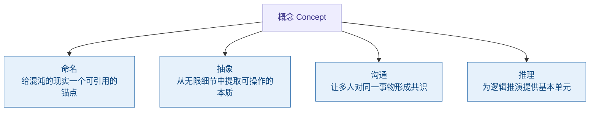

*图 1｜概念解决的四个核心问题*

---

## 2. 术语 vs 概念

### 2.1 本质区别

**术语（Term）** 是能指——一个标签、一个名字。
**概念（Concept）** 是所指/涵义——事物不可还原的本质。

同一个术语可以指向不同的概念（不同领域对"架构"有不同理解），同一个概念也可以有不同的术语（"微服务"和"微服务架构"指同一概念）。

### 2.2 名牌比喻

把术语想象成名牌，把概念想象成名牌背后的人。名牌可以换（同一个概念可以用不同术语表达），但人没变。反过来，同名名牌可以挂在不同人身上（同一个术语在不同领域指向不同概念）。

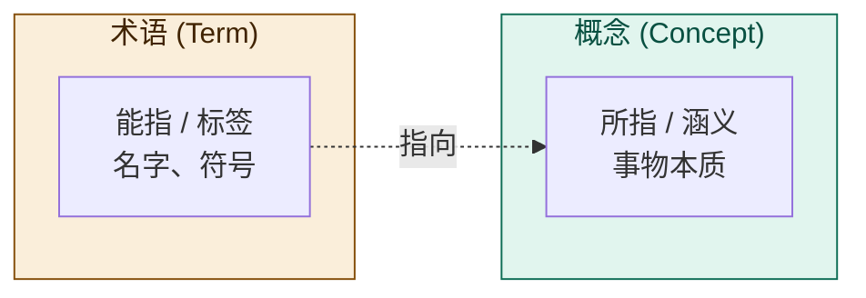

*图 2｜术语是能指（标签），概念是所指/涵义（本质）*

---

## 3. 符号学视角：概念的位置

### 3.1 Saussure 二元模型

瑞士语言学家 Ferdinand de Saussure 提出符号的二元结构：

> **符号（Sign）= 能指（Signifier）+ 所指（Signified）**

- **能指**：符号的形式——声音形象、文字标记
- **所指**：符号的内容——概念、心理印象

在 Saussure 的模型中，**概念 = 所指**。

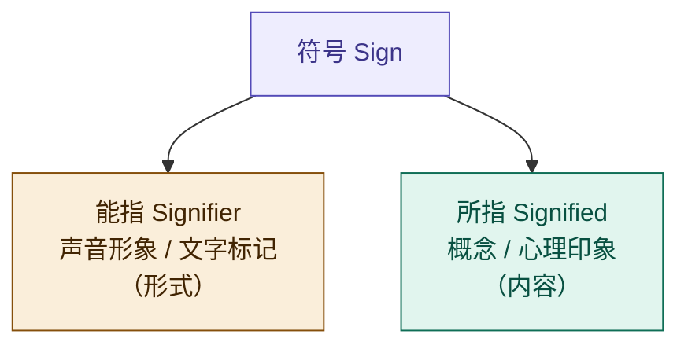

*图 3｜Saussure 二元模型：符号 = 能指 + 所指*

### 3.2 Frege 三元模型

德国哲学家 Gottlob Frege 提出了一个更精细的三元结构，区分了"涵义"和"指称"：

> **符号（Zeichen）→ 涵义（Sinn）→ 指称（Bedeutung）**

- **符号**：标记本身（如"晨星"这个词）
- **涵义（Sinn）**：符号呈现对象的方式——概念、意义
- **指称（Bedeutung）**：符号指向的实际对象（金星这颗行星）

Frege 的经典例子："晨星"和"暮星"是不同符号、不同涵义（呈现方式不同），但指称相同（都是金星）。

在 Frege 的模型中，**概念 = 涵义（Sinn）**，不是指称。


*图 4｜Frege 三元模型：符号 → 涵义 → 指称*

### 3.3 两个模型的关键差异

| | Saussure | Frege |
|---|---|---|
| 结构 | 二元 | 三元 |
| 概念的位置 | 所指 (Signified) | 涵义 (Sinn) |
| 是否区分涵义与指称 | 否 | **是** |
| 核心贡献 | 符号 = 形式 + 内容 | 涵义 ≠ 指称 |

Frege 模型的关键洞察：**涵义不等于指称**。同一个对象（指称）可以有多种呈现方式（涵义）。这对后续理解"系统 ≠ 架构 ≠ 架构描述"至关重要。

---

## 4. 概念设计

### 4.1 什么是概念设计

**概念设计（Conceptual Design）** 是从混乱的问题域中提取结构化概念模型的活动。它不是画 UI、不是写代码，而是在"怎么做"之前先搞清楚"是什么"。

### 4.2 概念设计的四步过程

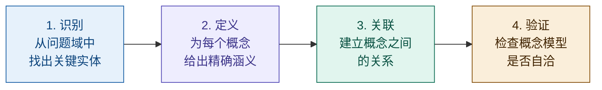

*图 5｜概念设计的四步过程*

### 4.3 每步的产出

概念设计不是空转，每一步都有明确的交付物：

| 步骤 | 产出 | 说明 |
|------|------|------|
| 识别 | **概念清单** | 一份尚未定义的原始实体列表 |
| 定义 | **概念词典** | 每个概念的精确涵义，消除歧义 |
| 关联 | **概念模型图** | 概念之间的关系拓扑（类图、ER 图等） |
| 验证 | **自洽性检查** | 模型是否内部一致、是否有遗漏或矛盾 |

概念设计遵循 **"What before How"** 原则——先定义"是什么"，再讨论"怎么做"。这与 IPD 概念阶段的精神一脉相承。

---

## 5. IPD 六个阶段

IPD（Integrated Product Development，集成产品开发）将产品开发分为六个阶段，每个阶段有明确的目标和决策评审点。

### 5.1 总览

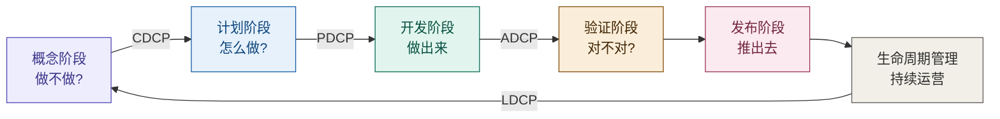

*图 6｜IPD 六个阶段及决策评审点（CDCP → PDCP → ADCP → LDCP）*

### 5.2 概念阶段（Concept）

**核心问题：做不做？**

回答的是市场机会和产品构想是否值得投入。不关注技术细节，关注的是：
- 市场有没有需求？
- 我们能不能做？
- 做出来能不能赚钱？

概念阶段在四个维度上并行展开：

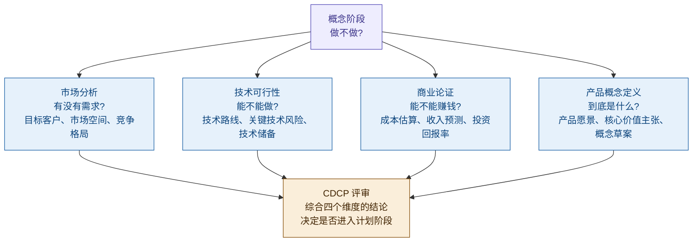

*图 7｜概念阶段的四个维度*

**决策评审点 CDCP（Concept Decision Checkpoint）**：综合四个维度的结论，决定是否进入计划阶段。

### 5.3 计划阶段（Plan）

**核心问题：怎么做？**

概念阶段确定了"做什么"，计划阶段要给出完整的施工方案。计划阶段在六个模块上展开：

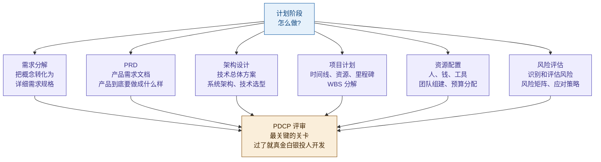

*图 8｜计划阶段的六个模块*

**决策评审点 PDCP（Plan Decision Checkpoint）**：决定是否进入开发阶段。这是最关键的关卡——过了就要真金白银地投人开发了。

计划阶段产出的是"总图"——框架级的设计。开发阶段拿着总图画"施工详图"——实现级的设计。

### 5.4 开发阶段（Develop）

**核心问题：做出来。**

开发团队拿着计划阶段的总图，画出施工详图，然后照着详图把东西造出来。不是边想边干——What 和 How 都已经在计划阶段定了，执行的是已经验证过的方案。

开发阶段在六个模块上展开，同时由偏差管理贯穿全程：

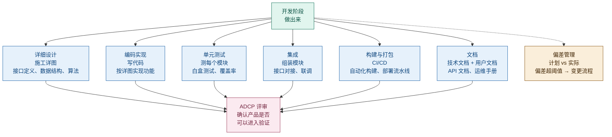

*图 9｜开发阶段的六个模块 + 偏差管理*

**偏差管理**是开发阶段的关键：实际进度与计划偏差超过阈值时，需要走变更流程，不能默默偏下去。

**决策评审点 ADCP（Availability Decision Checkpoint）**：确认产品是否可以进入验证。

#### 关于"图纸"的澄清

> **讨论背景**：最初文档中将开发阶段描述为"开发团队照着图纸干活"，引发了"图纸到底指什么"的讨论。

这里的"图纸"是**比喻**，不是硬件或结构设计图纸。在软件产品开发语境下：

| 层级 | 产出物 | 产生阶段 | 作用 |
|------|--------|----------|------|
| **总图**（框架级） | PRD、架构方案、项目计划 | 计划阶段 | 定义"做什么"和"怎么做"的框架 |
| **施工详图**（实现级） | 接口定义、数据结构、算法设计 | 开发阶段 | 将框架细化为可编码的实现规格 |

开发团队拿着计划阶段的**总图**，画出**施工详图**，然后照着详图把东西造出来。总图在开发阶段之前就有了（计划阶段产出），施工详图是开发阶段自己产出的。

### 5.5 验证阶段（Verify）

**核心问题：对不对？**

验证阶段做两件事——Verification（验证）和 Validation（确认），两者缺一不可：

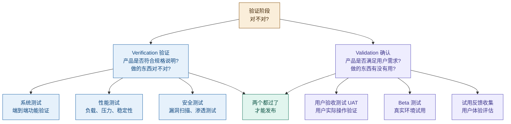

*图 10｜验证阶段：Verification + Validation*

- **Verification（验证）**：产品是否符合规格说明？——做的东西对不对？
- **Validation（确认）**：产品是否满足用户需求？——做的东西有没有用？

一个是"对不对"，一个是"有没有用"。两个都过了才能发布。

### 5.6 发布阶段（Release）

**核心问题：推出去。**

发布不是"把代码部署到服务器"那么简单。五条线并行推进，任何一条线没准备好都会导致发布失败：

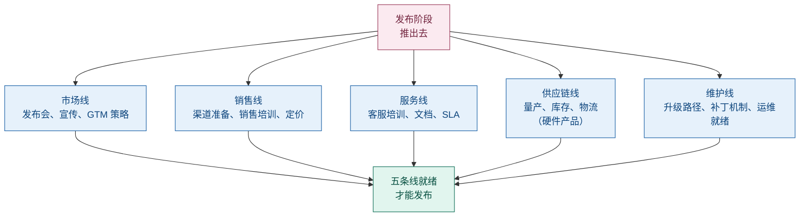

*图 11｜发布阶段的五条线并行*

| 线 | 内容 |
|---|---|
| 市场 | 发布会、宣传、GTM 策略 |
| 销售 | 渠道准备、销售培训、定价 |
| 服务 | 客服培训、文档、SLA |
| 供应链 | 量产、库存、物流（硬件产品） |
| 维护 | 升级路径、补丁机制、运维就绪 |

### 5.7 生命周期管理（Lifecycle）

**核心问题：持续运营 + 反馈。**

产品发布后进入持续运营阶段。关键不是"维护"这么简单，而是形成**反馈环路**：

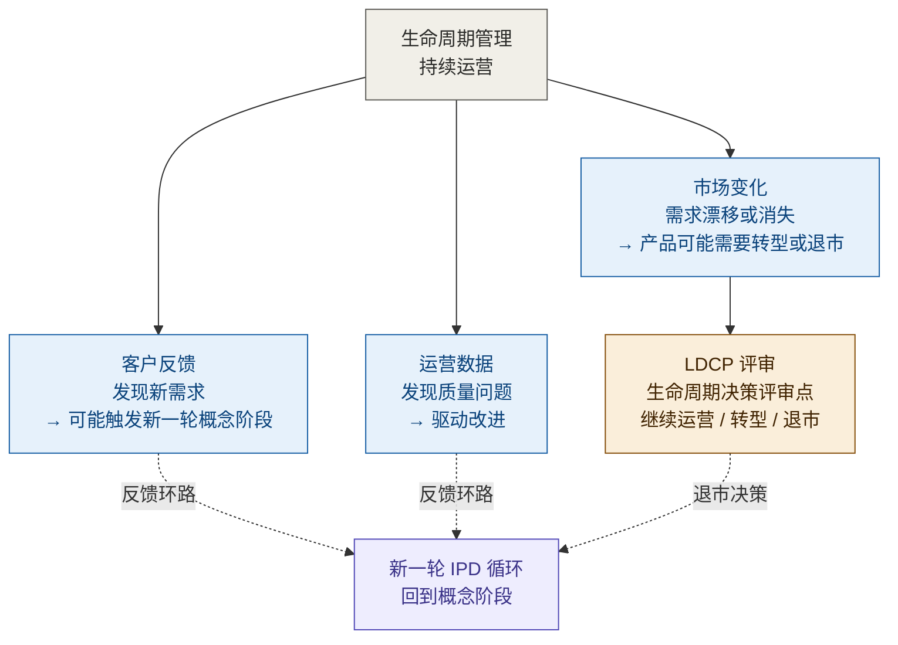

*图 12｜生命周期管理：反馈环路 + LDCP*

- 客户反馈 → 发现新需求 → 可能触发新一轮概念阶段
- 运营数据 → 发现质量问题 → 驱动改进
- 市场变化 → 产品可能需要转型或退市

**决策评审点 LDCP（Lifecycle Decision Checkpoint）**：生命周期决策评审点，决定产品是继续运营、转型还是退市。

生命周期管理的终点不是"下线"，而是"反馈到下一轮 IPD 循环"。

---

## 6. "概念"一词的三种语境

同一个"概念"能指，在不同语境下指向不同涵义：

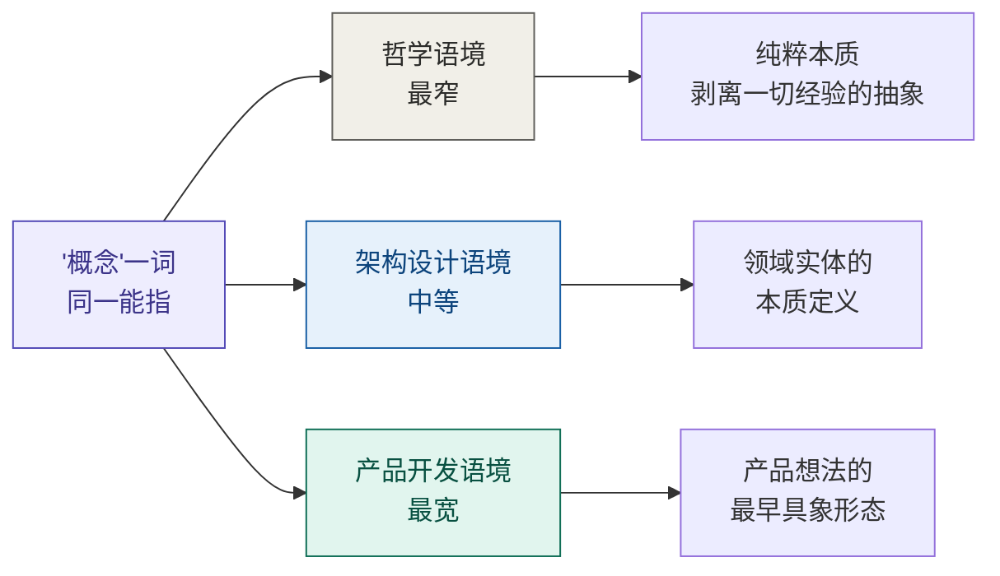

*图 13｜"概念"一词在三种语境下的不同涵义*

- **哲学**：概念是最纯粹的抽象——"椅子"的概念剥离了所有具体的椅子，只留下"可供坐的、有靠背的家具"这个本质。
- **架构设计**：概念是领域实体的本质定义——"订单"的概念不是某张数据库表，而是"一次交易意图的记录"这个涵义。
- **产品开发（IPD 概念阶段）**：概念是产品想法的最早具象形态——"我们要做一个能帮人管理日程的 AI 助手"，这是产品从无到有的第一步。

IPD 概念阶段的"概念"用的是最宽的含义。它不是哲学意义上的纯粹抽象，而是"这个产品到底是个什么东西"的最早回答。

---

## 7. 架构的定义

### 7.1 ISO/IEC/IEEE 42010:2011 原文

> **"Architecture: Fundamental concepts or properties of a system in its environment embodied in its elements, relationships, and in the principles of its design and evolution."**

中文常见翻译：架构是系统在其环境中的基本概念或属性，体现在其元素、关系以及设计和演进的原则中。

### 7.2 逐词拆解

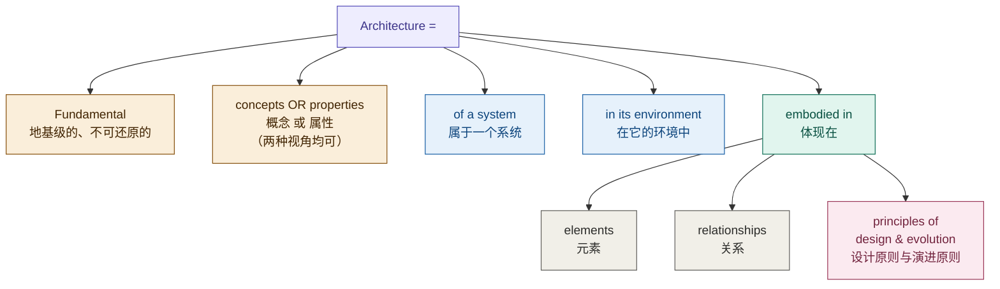

*图 14｜架构定义逐词拆解*

### 7.3 "or" vs "and" 的区别

英文原文用 **"or"**（concepts **or** properties），中文常见翻译用"和"（概念**和**属性）。这不仅仅是语法差异，而是理解方式的不同：

- **"or"（原文）**：你可以用概念角度或属性角度来描述架构——两种视角都是有效的，任选其一即可。
- **"and"（翻译）**：概念和属性共同构成架构——暗示两者缺一不可。

英文 "or" 的语义更宽松：你可以从"这个系统的核心概念是什么"切入，也可以从"这个系统的核心属性是什么"切入，两条路都能走到架构。

### 7.4 ISO/IEC/IEEE 42010:2022 的变化

42010:2022（2022-11 发布，取代 2011 版）对定义框架做了四处关键修订：

| 变化 | 2011 版 | 2022 版 | 影响 |
|---|---|---|---|
| 被架对象 | system of interest（系统关注点） | **entity of interest**（EoI，关注实体） | 被架对象不再限于「系统」——enterprise、organization、solution、system、subsystem、**process**、business、data、application、product、service、product line 等都可以拥有自己的架构 |
| 框架术语 | architecture framework | **architecture description framework**（ADF） | 与其他架构框架（如评估框架 42030）区分开 |
| 视图构成 | architecture model | **architecture view component**（视图组件） | 容纳非模型化的视图组成部分 |
| 架构数量 | 概念模型隐含一个系统一个架构 | 明确用不定冠词 "an architecture of an entity"，承认**多个候选架构**并存（各由 AD 表达，供权衡分析） | 「一个实体一个架构」精确化为：采纳决策时收敛到一个，多架构只并存于分析与决策阶段 |

另外，定义正文的 "embodied in" 在 2022 版移到条款 5.2.2 展开为五条清单：constituent elements；元素间的交互/关系；与环境（含其他实体）的交互；behaviour and structure；principles governing its design, use, operation and evolution。

**对本文档的影响**：§8 的 fundamental 判读、§9 的「系统 ≠ 架构 ≠ 架构描述」三元结构在 2022 版下依然成立，只需把「系统」读作「被架对象（EoI）」——流程、数据、产品同样适用。

---

## 8. Fundamental 的深层含义

### 8.1 词源

**Fundamental** 来自拉丁语 **fundamentum**，意为"地基、基础"。词根 fundus = "底部"。

地基的隐喻：
- 地基在建筑的最底层，承托一切
- 地基一旦改动，整栋建筑都要动
- 地基决定了建筑能盖多高、多稳

### 8.2 三个判定标准

一个概念或属性是否"fundamental"，可以用三个标准检验：

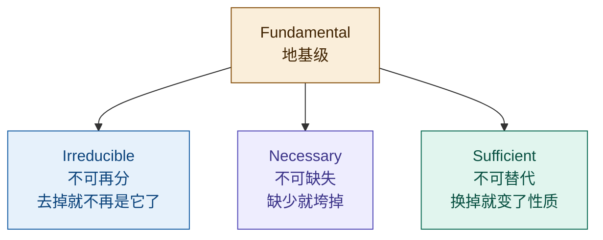

*图 15｜Fundamental 的三个判定标准*

以微服务架构为例：
- **不可再分**："服务独立部署"是基本概念，不能再拆成更小的概念
- **不可缺失**：没有"服务独立部署"，微服务就不是微服务了
- **不可替代**：用"单体部署"替代"服务独立部署"，架构性质就变了

### 8.3 语法精读：「基本」修饰什么

逐字读定义原文："fundamental concepts or properties ... **embodied in** its elements, relationships, and in the principles ..."——句子骨架是：

> **「基本」管辖 concepts or properties；elements/relationships/principles 是这些概念的体现（embodiment），是载体不是本体。**

佐证是标准自身的演进：IEEE 1471:2000 说架构是 "fundamental **organization**"（根本的组织结构），42010:2011 把它换成了 "fundamental **concepts or properties**"——架构从具体结构上提到概念层。两个推论：

- **同一架构可以换实现**：换一种语言重写系统，架构不变；
- **同一堆元素可以属于不同架构**：换一种概念组织，就是另一个架构。

### 8.4 判据锚点：对目的而言必要且充分

IEV 831-01-01（等同采用 42010:2011 §3.2）的 Note 2 把判据钉死：

> "the set of fundamental concepts or properties of a system provides **necessary and sufficient** information targeted to the **purposes** of the system."

因此 fundamental 是**关系性谓词**，不是绝对谓词——永远要补全「对**这个**系统、在**它的**环境中、针对**它的**目的而言根本」。同一段定时算法，在心脏起搏器里是 fundamental（错了会死人），在计算器 App 里只是实现细节。定义里 "in its environment" 不是修辞，是判定条件的组成部分。

### 8.5 不变量判据与同一性的目的论

把「概念层本体」（§8.3）与定义末尾的 "principles of its design **and evolution**" 接起来：演进原则规定的就是「怎么变都还是这个系统」的边界——

> **fundamental = 在演化、重实现、实例替换中必须守住不变、否则系统就沦为另一个系统的那些概念与属性。**

判别问句只有一句：「这个东西变了，系统还能不能达成它的目的——它还是不是为那个目的的这个系统？」

注意这个问句的后半必须挂到目的上：**人造系统的同一性是目的论的，不是实体论的**（15288 界定系统是 man-made）。忒修斯之船是最好的思想实验——木板一块块全换掉，它还是那条船（目的延续）；一块木板不换、拖进博物馆当展品，它反而不再是原来那条船（目的改变）。同一性跟着目的走，不跟着物质走。推论：**目的漂移是架构失效的第一病因**；目的变更 = 架构重审的强制触发器。

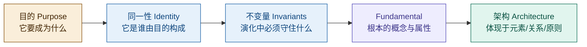

*图 15a｜从目的到架构的判据链*

### 8.6 「基本」与「粗细」正交

fundamental 不是 high-level 的同义词。两个维度展开成四象限：

| | **基本（fundamental）** | **非基本** |
|---|---|---|
| **粗粒度** | 典型架构决策：分层划分、技术选型、能力地图 | 看似架构实则不是：随手画的模块框图、仅反映组织惯例的划分 |
| **细粒度** | 关键细节仍是架构：起搏器定时算法、数据主键策略、接口协议 | 实现细节：变量命名、控件布局、可自由替换的局部方案 |

架构分布在上面一行，与粗细无关；下面一行画得再高层级也不是架构。顺带排除一个误读：**基本 ≠ 简单**（basic/elementary）——共识算法很复杂但可以 fundamental，变量命名很简单但不是。

### 8.7 去除测试的修正

§8.2 的「不可缺失」如果被读成朴素的去除测试（「去掉它系统就变了，所以它是基本的」），会产生归谬：照此所有流程细节都被判进架构，判据失去区分度。修正为**三重过滤**，三关都过才算 fundamental：

| 过滤关 | 精确表述 | 排除的反例 |
|--------|---------|-----------|
| 目的层面 | 去掉该**角色**，系统目的是否失败？（而非系统描述是否变化） | 去掉审批流一个抄送节点，目的不失败 → 非基本 |
| 角色层面 | 该元素是否其角色的难替代载体？（角色必要 ≠ 实例必要） | 节点可轻易改道/重实现 → 非基本 |
| 层级层面 | 判定在当前被架对象（EoI）的架构粒度上进行，元素内部细节不参与本级判定 | 细节节点属于流程内部，不属于系统架构层 |

第三关的依据是 42010:2022 的分形承认（见 §7.4）：process 被明确列为可作 EoI 的实体——流程不仅可以是架构视图的**内容**，流程本身还可以是**被架对象**、拥有自己的架构。一个细节节点只在「流程」这个 EoI 下参与 fundamental 判定，在「系统」这个 EoI 下它从一开始就不在判定视野里。

---

## 9. 架构是什么

### 9.1 架构 = 系统的不可还原涵义

把前面所有概念串起来：

- **概念** = 一个事物的不可还原涵义
- **架构** = 一个系统的不可还原涵义（fundamental concepts or properties）

就像概念是一个事物的本质，架构是一个系统的本质。它是系统的"地基级涵义"——去掉任何一个就不再是这个系统了。

### 9.2 系统 ≠ 架构 ≠ 架构描述

对应 Frege 三元模型：

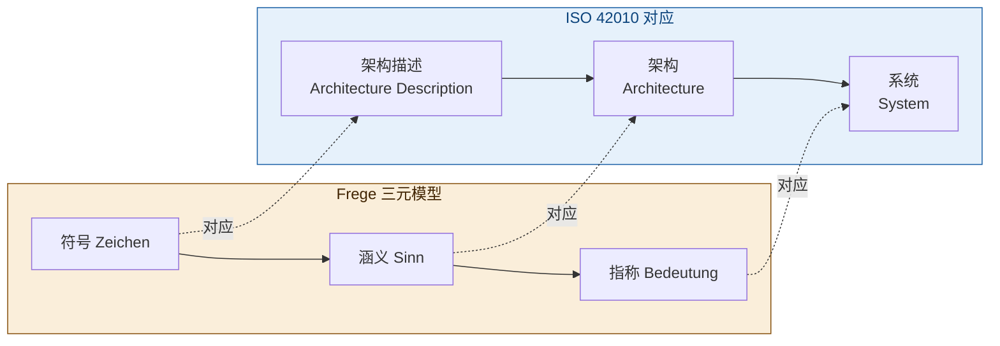

*图 16｜系统 ≠ 架构 ≠ 架构描述，对应 Frege 的指称 ≠ 涵义 ≠ 符号*

- **系统**（指称）：实际存在的那个东西——运行中的代码、服务器、网络
- **架构**（涵义）：系统的不可还原本质——去掉就不再是这个系统的那些概念和属性
- **架构描述**（对涵义的表达）：把架构写下来给人看的文档、图、模型

三者不等同：同一架构可以有多种描述（不同框架、不同视图），同一系统可以有多种架构视角（不同 stakeholder 看到不同方面）。

---

## 10. 设计原则与演进原则

架构定义最后一句："in the principles of its design and evolution"——体现在其设计和演进的原则中。

### 10.1 两种原则的分工

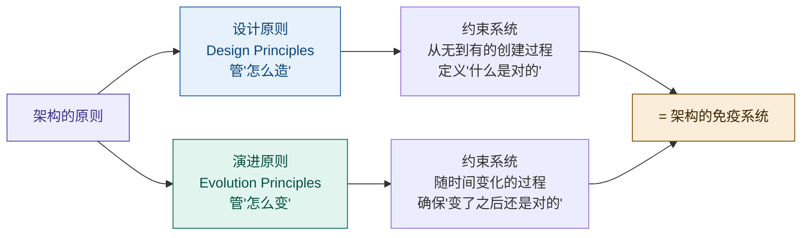

*图 17｜设计原则 + 演进原则 = 架构的免疫系统*

### 10.2 设计原则（Design Principles）

管"怎么造"——约束系统从无到有的创建过程。

以微服务架构为例：
- 每个服务独立部署
- 服务间通过 API 通信，不共享数据库
- 服务按业务能力划分，不按技术层划分

设计原则定义了"什么是对的"——遵循这些原则，系统就是微服务架构；违背了，就不是。

### 10.3 演进原则（Evolution Principles）

管"怎么变"——约束系统随时间变化的过程。

以微服务架构为例：
- 新增服务不能直接耦合已有服务的内部实现
- 服务拆分必须保持向后兼容
- 技术栈升级逐个服务进行，不能全局停机

演进原则确保"变了之后还是对的"——没有演进原则，微服务会退化为"分布式的单体"（Distributed Monolith）：服务越来越多，但耦合越来越紧，最终变成了分布在不同进程里的单体应用。

### 10.4 为什么两者缺一不可

- 只有设计原则，没有演进原则：系统建出来是对的，但一改就坏
- 只有演进原则，没有设计原则：系统知道怎么变，但建出来就不对
- 两者合一：架构的免疫系统——既定义正确，又维护正确

---

## 11. 架构描述：Stakeholders & Concerns

### 11.1 为什么需要架构描述

架构是系统的涵义（Sinn），但涵义锁在脑子里没用，必须**传达给人**。问题是：不同的人关心不同的东西。

ISO 42010 用三层概念解决"一个涵义，多种表达"的问题：

```mermaid
flowchart LR
    A["Stakeholders<br/>利益相关者<br/>谁"] -->|"have"| B["Concerns<br/>关注点<br/>关心什么"]
    B -->|"addressed by"| C["Viewpoints<br/>视点<br/>看的规则"]
    C -->|"frame"| D["Views<br/>视图<br/>看到的东西"]
    D -->|"compose"| E["Architecture<br/>Description<br/>架构描述"]
    E -->|"expresses"| F["Architecture<br/>架构 = 涵义"]
    F -->|"of"| G["System<br/>系统 = 指称"]
    style A fill:#E6F1FB,stroke:#185FA5,color:#0C447C
    style B fill:#E6F1FB,stroke:#185FA5,color:#0C447C
    style C fill:#EEEDFE,stroke:#534AB7,color:#3C3489
    style D fill:#EEEDFE,stroke:#534AB7,color:#3C3489
    style E fill:#E1F5EE,stroke:#0F6E56,color:#085041
    style F fill:#E1F5EE,stroke:#0F6E56,color:#085041
    style G fill:#F1EFE8,stroke:#5F5E5A,color:#2C2C2A
```

*图 18｜ISO 42010 架构描述的三层结构：问题层 → 机制层 → 结果层*

### 11.2 Stakeholders（利益相关者）

ISO 42010 定义：对系统有利益的任何个体、团队或组织。不只是"用户"——开发者、运维、安全团队、业务方、甚至未来的维护者、合规审计员，都是 stakeholder。

### 11.3 Concerns（关注点）

任何对系统的兴趣——功能性的（能不能做？）、非功能性的（快不快？安不安全？）、约束性的（合规吗？预算够吗？）。

### 11.4 核心问题：关注点天然冲突

ISO 42010 原文：

> *"The concerns of stakeholders are frequently broad, varied, and conflicting."*

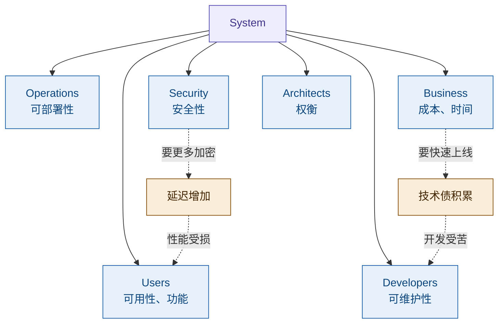

*图 19｜不同利益相关者的关注点天然冲突*

关注点冲突**不可消除**，只能**权衡**。权衡的前提是：你得能**看到**每个方面。一张图不可能同时满足所有人的关注点——这就引出了 Viewpoints & Views。

---

## 12. Viewpoints & Views

### 12.1 定义

**Viewpoint（视点）** 是构建视图的规则集。它规定了：
- 这个角度要关注什么 concerns
- 服务于哪些 stakeholders
- 用什么建模语言/符号（UML 类图？部署图？数据流图？）
- 必须画什么，可以忽略什么

**View（视图）** 是按某个视点的规则，实际产出的系统表示。它是具体的东西——一张类图、一份部署拓扑、一个用例模型。

### 12.2 相机比喻

| | 相机 | 架构 |
|---|------|------|
| 规则/设置 | 角度、镜头、滤镜 | **Viewpoint**（视点） |
| 产物 | 照片 | **View**（视图） |
| 被拍的对象 | 风景/人物 | **System**（系统） |

同一个建筑，正面拍和俯拍是不同照片（View），用什么镜头、什么角度是拍摄规则（Viewpoint）。照片服从于规则，一个规则可以拍很多照片。

```mermaid
flowchart LR
    S["System<br/>被拍的对象"] -->|"viewed through"| VP["Viewpoint<br/>镜头设置（规则）"]
    VP -->|"produces"| V["View<br/>照片（产物）"]
    style S fill:#EEEDFE,stroke:#534AB7,color:#3C3489
    style VP fill:#E6F1FB,stroke:#185FA5,color:#0C447C
    style V fill:#E1F5EE,stroke:#0F6E56,color:#085041
```

*图 20｜Viewpoint → View：规则产出表示*

### 12.3 每个视图都是刻意的"不完整"

Logical View 不展示部署，Physical View 不展示类关系——这不是缺陷，是设计目的。每个视图都是一个**概念**：剥离掉你不关心的部分，只保留本质。

### 12.4 经典实例：Kruchten 4+1 View Model

Philippe Kruchten 于 1995 年提出的 4+1 视图模型是最经典的视点集合：

| View | For Whom | Concerns | Notation |
|------|----------|----------|----------|
| Logical | 设计师 / 用户 | 类、对象、关系 | UML 类图 |
| Process | 集成者 | 进程、线程、并发 | 活动图 |
| Development | 程序员 | 模块、层次、包 | 组件图 |
| Physical | 系统工程师 | 节点、网络、部署 | 部署图 |
| **Scenarios (+1)** | **所有人** | **用例、场景（验证其余 4 个视图）** | **用例图** |

**+1 Scenarios** 不是"第五个视图"，而是**胶水**：用真实场景穿过去验证另外四个视图是否一致。"用户下单"这个场景，能从 Logical（哪些类参与）→ Process（哪些线程跑）→ Development（哪些模块实现）→ Physical（哪些节点部署）一路走通吗？走不通，说明四个视图之间有矛盾。

```mermaid
flowchart TD
    S["Scenarios +1<br/>用例 / 场景"]
    S -->|"验证一致性"| L["Logical View<br/>类、对象"]
    S -->|"验证一致性"| P["Process View<br/>进程、线程"]
    S -->|"验证一致性"| D["Development View<br/>模块、包"]
    S -->|"验证一致性"| PH["Physical View<br/>节点、部署"]
    style S fill:#FAEEDA,stroke:#854F0B,color:#412402
    style L fill:#E6F1FB,stroke:#185FA5,color:#0C447C
    style P fill:#E6F1FB,stroke:#185FA5,color:#0C447C
    style D fill:#E6F1FB,stroke:#185FA5,color:#0C447C
    style PH fill:#E6F1FB,stroke:#185FA5,color:#0C447C
```

*图 21｜4+1 View Model：Scenarios 作为验证其余四个视图一致性的胶水*

---

## 13. Architecture Frameworks

### 13.1 什么是架构框架

**Architecture Framework（架构框架）** = 预定义的视点集合 + 使用规则 + 方法论。

为什么要标准化？如果每个项目都自己发明视点，A 项目的架构描述 B 项目看不懂，没法积累、比较、复用。框架解决的是"大家用同一套语言"的问题。

```mermaid
flowchart LR
    F["Architecture Framework<br/>预定义 Viewpoints + 规则 + 方法"] -->|"produces"| AD["Architecture Description<br/>一组标准化的 Views"]
    style F fill:#FAEEDA,stroke:#854F0B,color:#412402
    style AD fill:#E1F5EE,stroke:#0F6E56,color:#085041
```

*图 22｜架构框架产生标准化的架构描述*

### 13.2 主要框架对比

| Framework | 领域 / 来源 | 核心 Viewpoints | 特点 |
|-----------|-----------|----------------|------|
| 4+1 View Model | 软件 / Kruchten 1995 | Logical, Process, Development, Physical, Scenarios | 最早最经典 |
| TOGAF | 企业 / The Open Group | Business, Data, Application, Technology | 企业级 + ADM 方法论 |
| DoDAF | 国防 / US DoD | CV, OV, SV, TV, PV 等 8 个 | 军事系统标准 |
| C4 Model | 软件 / Simon Brown | Context, Container, Component, Code | 简洁实用，4 层缩放 |
| Zachman | 企业 / John Zachman | 6 行 × 6 列 矩阵 | 分类法，非流程 |

### 13.3 如何选择

框架不是"对错"的选择，是"适配"的选择——匹配你的领域、团队和问题：
- **软件架构**：常用 4+1 或 C4
- **企业架构**：常用 TOGAF 或 Zachman
- **军事/政府**：用 DoDAF

---

## 14. 完整链路总结

### 14.1 从"概念"到"架构描述"的认知链路

```mermaid
flowchart TB
    C["概念 = 事物的不可还原涵义<br/>Frege: Sinn"]
    C --> A["架构 = 系统的不可还原涵义<br/>fundamental concepts or properties"]
    A --> AD["架构描述 = 对涵义的表达<br/>Architecture Description"]
    AD --> V["Views = 涵义的不同切面<br/>每个视图是一种刻意的不完整"]
    V --> VP["Viewpoints = 切面的规则<br/>怎么切"]
    VP --> CO["Concerns = 切面的动机<br/>为什么切"]
    CO --> ST["Stakeholders = 驱动切面的人<br/>谁要切"]
    ST --> F["Frameworks = 标准化的切面集合<br/>大家约定好怎么切"]
    style C fill:#EEEDFE,stroke:#534AB7,color:#3C3489
    style A fill:#FAEEDA,stroke:#854F0B,color:#412402
    style AD fill:#E1F5EE,stroke:#0F6E56,color:#085041
    style V fill:#E6F1FB,stroke:#185FA5,color:#0C447C
    style VP fill:#E6F1FB,stroke:#185FA5,color:#0C447C
    style CO fill:#E6F1FB,stroke:#185FA5,color:#0C447C
    style ST fill:#E6F1FB,stroke:#185FA5,color:#0C447C
    style F fill:#F1EFE8,stroke:#5F5E5A,color:#2C2C2A
```

*图 23｜从"概念"到"架构描述"的完整认知链路*

### 14.2 符号学对应关系

| 符号学 (Frege) | ISO 42010 | 说什么 |
|---|---|---|
| 指称 (Bedeutung) | **System** | 实际存在的那个东西 |
| 涵义 (Sinn) | **Architecture** | 不可还原的本质 |
| 对涵义的表达 | **Architecture Description** | 把本质写出来给人看 |
| — | **Views** | 涵义的不同切面 |
| — | **Viewpoints** | 切面的规则（怎么切） |
| — | **Concerns** | 切面的动机（为什么切） |
| — | **Stakeholders** | 驱动切面的人（谁要切） |
| — | **Frameworks** | 标准化的切面集合（大家约定好） |

### 14.3 两段认知链路

**第一段：什么是架构（回答涵义是什么）**

> 概念 = 事物的不可还原涵义
> → 架构 = 系统的不可还原涵义（fundamental concepts or properties）
> → 对应符号学：系统 = 指称，架构 = 涵义

**第二段：怎么表达架构（回答涵义怎么传达）**

> 架构是涵义，但涵义要传达给人
> → 不同的人（Stakeholders）关心不同的事（Concerns）
> → 一个视图满足不了所有人，需要多个视图
> → 视图由规则框定（Viewpoints → Views）
> → 所有视图组合 = Architecture Description（对涵义的表达）
> → 把视点标准化打包 = Architecture Framework

**一句话总结：架构是系统的涵义，架构描述是把这个涵义从不同角度切给不同的人看，框架是让切法标准化。**

### 14.4 第三段：架构的判据从哪来（2026-08-26 增补）

前两段回答「架构是什么」「怎么表达架构」，第三段回答更上游的问题——**凭什么判定什么是 fundamental**：

> 目的（Purpose）= 系统要成为什么
> → 同一性（Identity）= 系统「是谁」由目的构成（目的论，非实体论）
> → 不变量（Invariants）= 演化与重实现中必须守住的东西
> → fundamental = 对目的必要且充分的概念与属性（IEV 831-01-01 Note 2）
> → 架构 = 这些概念与属性，体现于元素、关系、设计与演进原则

**一句话总结：架构的判据链最终锚在目的上——定义系统架构之前必须先定义系统目的（连同其环境），判据方向从目的指向架构，不可逆。**

---

> **参考标准**：ISO/IEC/IEEE 42010:2011 *Systems and software engineering — Architecture description*；ISO/IEC/IEEE 42010:2022（第 2 版，取代 2011 版，见 §7.4）；IEV 831-01-01（architecture，源自 42010:2011 §3.2）
>
> **参考模型**：Saussure, F. de. *Course in General Linguistics* · Frege, G. "On Sense and Reference" (1892) · Kruchten, P. "The 4+1 View Model of Architecture" (IEEE Software, 1995)
