# 从掌舵到治理 —— govern 的词源、翻译史与跨域迁移

> 一场有意识的概念选择：为什么英文 govern 被译成"治理"而非"统治"，以及为什么这个词能从全球治理一路用到数据治理。

> **补充记录（2026-08-26）**：§九 末尾增补「架构治理深化」四则——治理对象的不变量链模型、三种侵蚀力量、权责分离的架构版（业务方=目的所有者）、豁免通道设计；§十一 补目的变更/目的漂移两类扳机；§十九 总结同步。（上述内容已按 2026-09-01 口径修订，见下条）

> **补充记录（2026-08-27）**：§九 TOGAF 引言后收束「治理 vs 管理本质分界」一句话核心判据——治理 = 跨层级远程校正机制、守护不变量（标准/原则/基线）；管理 = 框架内调变量、达成运行目标。与深化五 AG-01「治理管该不该/什么不许变、管理管怎么调」互证。（上述内容已按 2026-09-01 口径修订，见下条）

> **补充记录（2026-09-01）**：按 ISO/IEC 38500:2024 与参考答案第九组口径全面对齐——治理定义=基于人类的系统，包括指导、监督、问责（的职能）（§3.3）；治理执行=§6 模型四活动（相关方参与、评估、指导、监督）循环、持续系统不靠事件启动（§6 vs §3.3：执行看模型、定义看三成分）；治理 vs 管理=授权与报告的纵向链（治理在管理层之上定组织方向与框架、管理在框架内执行、对象是组织而非管理本身）；治理目的=绩效/受托/伦理（§4）；委托=具体责任下放（§7.2.5）、问责不可委托（§5.6）、委托不是治理前提（§3.3）；企业架构治理=企业架构=企业运营体系架构，架构由运营目的评判、目的归治理机构，治理机构对架构持续行使三职能、把它保持在目的上，组织=治理机构下的架构委员会。旧框架（EDM 三动词、事件/时间触发、代理鸿沟三道裂缝为治理根据、决策系统/执行系统、掌舵划桨为分界模型、三活动循环、三条件判别模型、守护不变量、跨层级远程校正）已按标准口径修订/移除；§一~§七 词源/翻译史保留。

---

## 一、词源：govern 本义是"掌舵"，不是"命令"

英文 govern 源自希腊语 **kybernân**（κυβερνᾶν），本义是"掌舵、领航船只"。舵手不是船的主人——他不拥有船、不骑在船头上，只是根据风向和水流调整方向。这个词经拉丁语 **gubernare**（引导、掌管）进入英语。

> 同根词 **cybernetics（控制论）** 保留了"掌舵"本义——其核心思想是"通过反馈调节方向"，而非"通过强制实现服从"。这是 govern 语义基因的最佳佐证。

如果用中文"统治"去对译 govern，等于给这个词塞进了原文并不核心的"支配、征服"含义。"统"（统一控制）+"治"，预设了一个高高在上的主权者和被支配的臣属对象，靠强制力自上而下压下来。

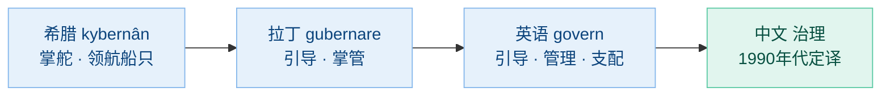

---

## 二、概念史：governance 如何成为热词

governance 作为一个独立政治概念，起点是 **1989 年世界银行**的报告《撒哈拉以南非洲：从危机到可持续增长》，其中首次提出"治理危机"（crisis of governance），定义是"行使政治权力以管理国家事务"。此后 governance 迅速取代 government 成为国际组织话语的关键词。

在中文世界，这个词的翻译经历了几个关键节点：

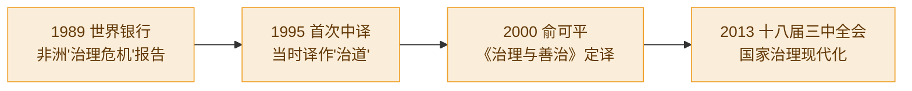

俞可平明确指出：强调"国家治理"而非"国家统治"，"不是简单的词语变化，而是思想观念的变化"。

---

## 三、统治 vs 治理：五个维度的区别

俞可平（2014）提出统治与治理的五个实质性区别：

| 维度 | 统治（rule） | 治理（governance） |
|------|------------|-------------------|
| **主体** | 单一：政府公共权力 | 多元：政府 + 企业 + 社会组织 |
| **性质** | 强制、命令 | 协商为主、强制为辅 |
| **来源** | 国家法律 | 法律 + 契约 + 共识 |
| **向度** | 自上而下，单向 | 多向互动：上下 + 平行 |
| **范围** | 政府权力所及领域 | 整个公共领域（更宽） |

> 俞可平："从统治走向治理，是人类政治发展的普遍趋势。"

翻译选"治理"，就是在语言上完成这场切割——让 governance 在中文里拥有独立词位，与 rule 划清界限。

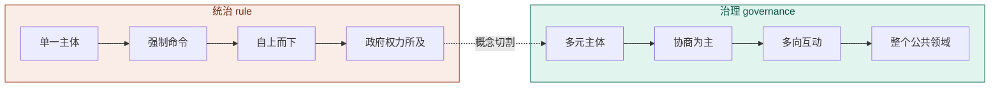

---

## 四、"治"与"理"：各自的字义

翻译选"治理"，还借了中文古典的正资产。两个字各有来历。

### 治 —— 从治水来，核心是"疏导"

《说文解字》中"治"原本是一条河的名字（山东的一条水），但这个字真正的生命力来自它的字形：**三点水**。中国人对"治"的全部想象，都来自治水。

> 鲧治水用"堵"，九年失败被殛于羽山；大禹改用"疏"，疏导河川入海，功成。

这是中国政治文明的第一课——**对付有活力、会流动的东西（水、人心、社会、市场），压制必败，疏导方成**。"治"字从此带上这个基因：治国、治病、治学，全是"把一个失序的领域引回有序"。

另外，"治"还能当名词用：治世对乱世，"天下大治"——治本身就是秩序达成的状态。

### 理 —— 从治玉来，核心是"顺纹"

"理"字左边的"王"其实是**玉**（作偏旁时"玉"写作"王"，如珠、琳、琅）。《说文解字》："理，治玉也。"

玉不能像石头那样硬凿——那样会碎。匠人必须先读懂玉石内在的纹理脉络，顺着纹理下刀，才能剖出美玉。所以"理"的第一层意思是动词"治玉"，第二层意思升华为名词——**事物内在的脉络本身**：纹理、肌理、条理、道理。

这个词族的扩张特别壮观：

| 词 | 含义 |
|---|---|
| 地理 | 大地的脉络 |
| 物理 | 万物的脉络 |
| 心理 | 心的脉络 |
| 肌理 | 肌肉的纹理 |
| 天理（宋明理学） | 宇宙最高本体 |

一个从剖玉石来的字，最后统治了中国形而上学七百年。

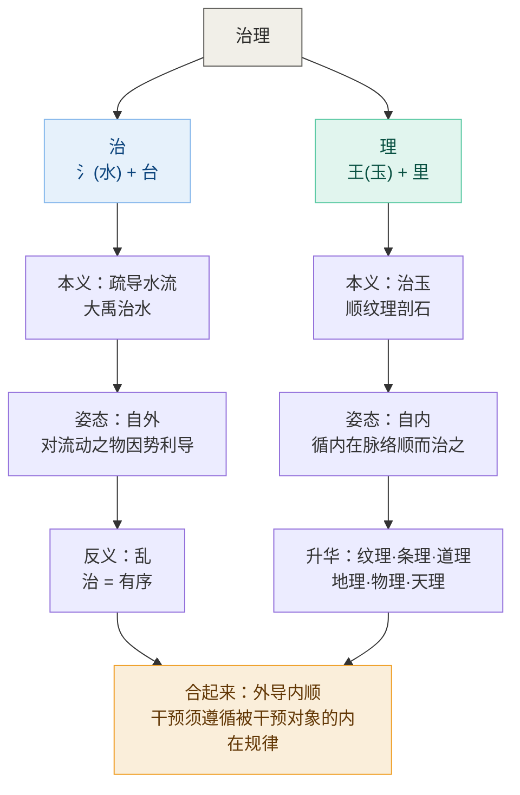

---

## 五、治理的通用公式：为什么能跨领域

"统治"预设了主权者和臣属者，天然锁死在政治领域——你只能说"统治国家"，不能说"统治数据"。

而"治理"只预设了**一个领域 + 规则 + 角色 + 问责**，这四样东西任何领域都有。无论治的是一个国家还是一张数据表，回答的都是同样四个问题：

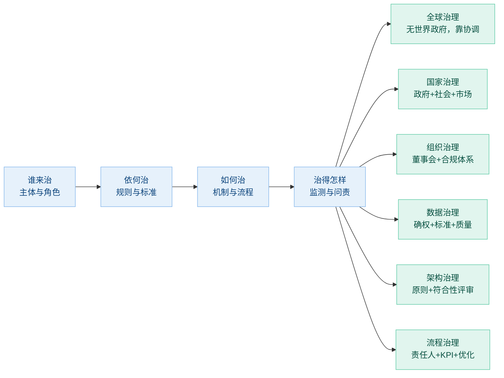

**全球治理是这套逻辑最好的试金石。** 政治学家罗西瑙（James Rosenau）1992 年有本书叫《没有政府的治理》（*Governance without Government*）——地球上不存在一个能"统治"全球的世界政府，只有主权国家、国际组织、NGO、跨国企业通过规则和协商来协调事务。说"全球统治"一句话就露馅了；说"全球治理"，精确成立。

---

## 六、统治的英文词族

英文里"统治"不是单个词，而是一个词族，各有侧重：

| 英文 | 侧重 | 例子 |
|------|------|------|
| **rule** | 最通用的"统治"，靠权力支配 | colonial rule 殖民统治；ruler 统治者 |
| **reign** | 君主"在位"统治，偏名义主权 | the Queen's reign 女王在位期间 |
| **dominate / domination** | 支配、主宰，压迫感更强 | foreign domination 外国统治 |
| **dominion** | 统治权、统治疆域 | exercise dominion over… |
| **regime** | 统治体制、政权（常带贬义或中立） | authoritarian regime 威权政权 |
| **tyranny / despotism** | 暴政、专制统治（极端形态） | tyranny of the majority 多数人的暴政 |

英国君主立宪的经典写照把三层一次说清：

> **"The king reigns, but does not rule."**
> 国王临朝（在位），但不理政（实际统治）。——**统而不治**。

完整的对照是三层：

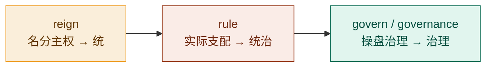

reign 是名分上的主权，rule 是实际支配，govern 是日常操盘管理。在现代政治学和企业管理语境里，governance 已专指那套"多元主体 + 规则 + 问责"的框架，所以规范的学术翻译坚持分立：**rule 译"统治"，governance 译"治理"**。这是一条被术语标准刻意"掰直"的翻译规则，而不是天然一一对应——英文里 govern 并非绝对不能译"统治"（"The country is governed by…" 直译就是"这个国家被……统治着"），只是现代术语规范刻意把它与 rule 分立。

---

## 七、翻译的四重目的

把 govern 译成"治理"，一次性完成了四件事：

| 层次 | 原因 | 目的 |
|------|------|------|
| **词义层** | govern 本义是"掌舵、引导"，不是"强制支配" | 避免"统治"塞入原文没有的压迫色彩 |
| **历史层** | 1989 年世行报告后，governance 刻意与 rule 切割 | 在中文里保留这场概念革命的独立词位 |
| **文化层** | "治"（大禹治水）与"理"（治玉循纹理）自带正资产 | 让外来概念接上本土两千年的语感 |
| **结构层** | "统治"锁死在"主权者—臣属"关系里 | "治理"只需"领域 + 规则 + 角色 + 问责"，可自由迁移 |

一句话总结：

> **"统治"回答的是"谁骑在谁头上"，"治理"回答的是"这条船往哪开、由谁来掌舵、按什么规则掌"。**
>
> 翻译选"治理"，就是把这套"掌舵逻辑"原封不动地搬进了中文——这也是为什么今天从联合国到企业数据中台，都用同一个词：因为它们做的确实是同一件事的不同尺度版本。

---

## 八、治理与管理：定方向与框架、框架内执行

治理和管理都有"谁管、管什么、依据什么、怎么管、监督问责"四要素，所以区别不在"有没有要素"，而在**要素的层次和权力关系**。ITIL、ISO 38500 和公司治理学的奠基人 Bob Tricker 把这条线划得很明确：

> **治理在管理层之上定组织方向与框架**——行使指导（定方向和规矩、传达期望的目的与结果）、监督（查执行、依既定原则与目标核查符合性与绩效、发现偏差即处置）、问责（担责）三职能；
> **管理在框架内执行**——达成运行目标。区别在职能层级与对象（治理的对象是组织，不是管理本身），不在触发方式。

Tricker（1984）说得更直白：

> *"If management is about running the business, governance is about seeing that it is run properly."*
> 管理是经营企业，治理是确保企业经营得当。

治理不是"另一种管理"，但它的对象是**组织**（方向、框架、整体结果），不是管理本身，也不替管理干活——监督管理层只是手段。治理层执行用的是 **ISO/IEC 38500:2024 §6 模型四活动**（相关方参与→评估→指导→监督）循环，管理层用的是 **PDCA 循环**（计划→执行→检查→处置，属 ISO 9000 族执行循环、非 ISO 38500 内容），两者之间是**授权与报告**的纵向关系，不是并列。

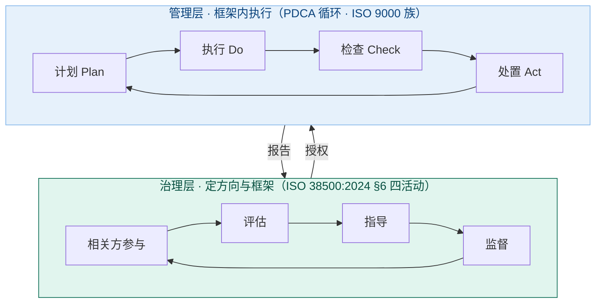

用"四要素"做精确对比，同一个要素在两个层次回答的问题完全不同：

| 四要素 | 治理层 | 管理层 |
|---|---|---|
| **谁管 & 管什么** | 董事会/委员会/理事会；管方向、规则、边界 | CEO/经理/团队负责人；管执行、运营、交付 |
| **依据什么** | 章程、法律、战略意图、利益相关方期望 | 治理层制定的政策、标准、SOP |
| **怎样管** | §6 四活动：相关方参与→评估→指导→监督 | PDCA 循环：计划→执行→检查→处置（ISO 9000 族） |
| **监督问责** | 监督管理层，向利益相关方（股东/公众）问责 | 监督执行层，向治理层问责 |

关键在第二行：**管理的"依据什么"恰恰是治理的产出。** 治理层制定政策、标准、边界框架，管理层在这些框架内做事。于是形成一条权力链：**所有权 → 治理 → 管理 → 执行**。

---

## 九、架构治理：治理理论在架构领域的落地

架构治理的"治理"就是同一个 governance——ISO/IEC 38500:2024 §3.3：**基于人类的系统，包括指导、监督、问责（的职能）**。TOGAF 的定义：

> *"Architecture Governance is the practice of managing and controlling enterprise architecture at an enterprise-wide level."*

关键词是 **controlling（控制）**，不是 building（构建）。治理层不设计架构、不写代码、不做部署，它做三件事——三大支柱：

| 三支柱 | 做什么 | 不做什么 |
|---|---|---|
| **架构委员会** Architecture Board | 审批架构方案、解决争议、批准标准 | 不设计架构 |
| **合规评审** Compliance Review | 检查项目是否符合架构标准和原则 | 不写代码 |
| **架构合同** Architecture Contracts | 约定交付物、标准、责任、验收准则 | 不执行项目 |

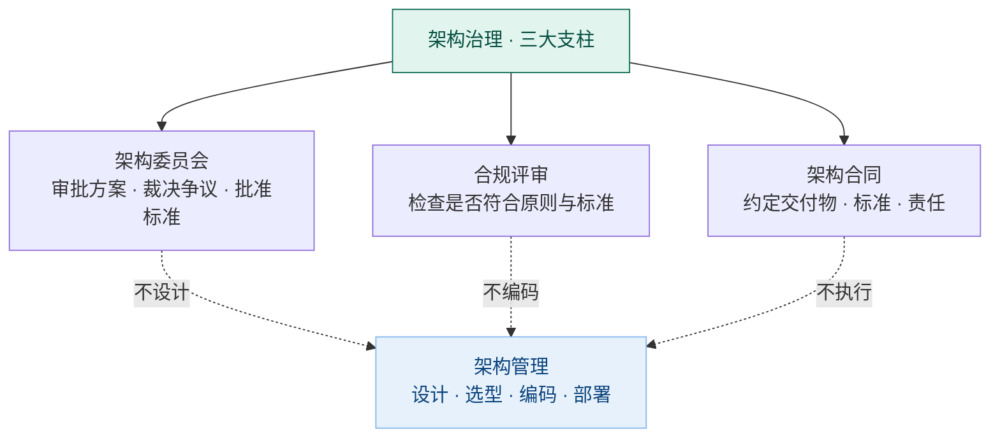

**为什么架构需要治理？** 一句话：架构由运营体系目的评判，而运营目的归治理机构、不在执行者手里；架构与目的的一致不会自己保持——企业战略随环境调整，运营体系目的随之改变，原架构或不合格；运营体系在演化运行中也会偏离目的，架构不会自行纠正。所以必须由治理机构对架构持续行使指导、监督、问责，把它保持在目的上。TOGAF 也强调治理不是阻止工作，而是确保工作与战略对齐（"not about stopping work, but about ensuring work aligns with strategic objectives"）。缺了治理会发生五件事：**一致性丧失**（三个团队做三个认证系统）、**技术债务安静积累**、**战略偏离**（做技术上有趣但业务上无价值的事）、**供应商锁定**、**复杂性失控**（REST/gRPC/文件交换混用）。

比喻：没有治理的架构就像没有城市规划的城市——每栋楼单独看都设计精良，但道路不通、水电不配、功能区混乱，因为没人管"楼与楼之间的关系"。

**更深一层：治理本身也需要被治理**（meta-governance）。TOGAF 的 Preliminary Phase 干的就是这件事——在开始任何架构工作前先定义治理框架本身：委员会章程由谁授予？原则多久审查一次？治理流程本身是否有效（合规率、审批周期、例外数量、技术债务趋势）？如果每个项目都在申请豁免，说明标准本身有问题。治理过强会变成审批瓶颈（团队绕过治理走"影子 IT"），治理过弱则监督形同虚设。

> TOGAF 的经典表述：*"Governance sets the rules. Management plays the game within those rules."* 治理设定规则，管理在规则内博弈。

> **一句话核心判据（治理 vs 管理的本质分界，2026-09-01 对齐 ISO/IEC 38500:2024）**：治理 = 治理机构对组织行使指导（定方向和规矩）、监督（查执行）、问责（担责）三职能——在管理层之上定组织方向与框架；管理 = 在治理定下的框架内执行、达成运行目标。对象不同层级（治理的对象是组织，不是管理本身），管理不能取代治理。

### 架构治理深化（2026-08-26 增补）

上文三大支柱回答"治理用什么机构"。再往下钻一层，回答另外三个问题：治的对象到底是什么、为什么非治不可、权责怎么分。

**深化一：治理对象不是"架构文档"，是"架构与运营目的的一致"。** 架构治理守的是「**架构是否仍符合运营目的、变更是否受控、实现是否遵从**」——治理机构把它保持在目的上。四层对象：

| 治理对象 | 具体问题 |
|---|---|
| 架构决策 | fundamental 的概念与属性是否仍与目的一致（决策本身对不对） |
| 决策遵从 | 实现/设计是否偏离已确立的元素、关系、原则（决策有没有被执行） |
| 架构演化 | 变更是否受控、不变量是否被守住、变体是否在允许范围内（决策怎么变） |
| 架构资产 | 架构描述、原则库、视点、可追溯链是否完整可信（决策的载体） |

三大支柱（委员会/合规评审/架构合同）因此各就各位：委员会守第一层（决策对不对），合规评审守第二层（有没有被执行），架构合同守第二、三层的契约化，基线与变更控制（ISO 10007）守第三、四层。

**深化二：为什么非治不可——目的变两路。** 上文的"五件事"是症状，病因是架构与目的的一致不会自己保持（组9 Q5 口径），目的变化有两条路：

1. **战略调整** — 企业战略随环境调整，运营体系目的随之显性重定（相关方重定目的），原架构或不再合格；
2. **日常局部决策悄悄带偏** — 运营体系在演化运行中，日常局部决策会悄悄改变实际方向（更隐蔽、更需监督），架构不会自行纠正。

**深化三：权责分离的架构版——运营目的归治理机构。** 运营目的归治理机构、不在执行者手里（组9 Q5 口径；组6 口径：业务方作为相关方签字确认），架构师与开发团队是目的的执行者。架构师对目的有**质询权**（澄清、用可行性权衡反哺）和**守护责**（做符合性判断、发现偏差即报告），但**不定义目的**——开发与维护架构、做符合性判断并报告偏差，目的定义归治理机构。治理架的就是这两者之间的桥：确保架构师的根本决策忠于运营目的，也确保目的变化被传导为架构重审。

**深化四：豁免通道是治理的安全阀。** 豁免（dispensation）= 有期限、有补救计划的受控偏离。它的设计价值不在"放水"，而在：**没有豁免通道的治理会逼出隐瞒**——偏离从显式转入地下，治理反而失明。每条豁免登记在册、到期强制复审，偏离就始终是治理视野内的受控对象（呼应上文 meta-governance：如果每个项目都在申请豁免，说明标准本身有问题——豁免数量是治理框架的健康指标）。

**深化五：判例 AG-01｜目的漂移处置链——治理与管理分界的教学案例（2026-08-26 增补，2026-09-01 对齐口径）。** "目的漂移后调整架构，算治理吗？"——拆开处置链逐段定性：① 评估（定期以目的为参照检视，捕捉无症状漂移）= 治理（§6 评估活动）；② 显式化与裁决（治理机构行使目的归属：**追认**漂移为新目的，或**拉回**原目的）= 治理（§6 指导活动）——注意拉回则根本不动架构、纠的是业务行为，可见"架构调整"甚至不是漂移的必然响应；③ 根本集合重审（清点哪些概念与属性保留/过期/新增，批准原则与基线更新）= 治理；④ 架构调整（候选、权衡、修订架构描述）= 管理；⑤ 实施迁移 = 管理。结论：**目的漂移的处置是治理的持续运转（评估发现偏差即调整指导），架构调整是处置后的执行输出**——②③只能是治理，因为漂移动的是目的本身，而管理层在治理定下的框架内部；治理管"该不该调、往哪调"，管理管"怎么调"。

**为什么必须走治理而不是管理自己消化**（组9 Q5 口径）：

| 条件 | 本判例中的对应 |
|---|---|
| 目的归治理机构 | **运营目的归治理机构**、不在执行者手里——漂移动的是目的本身，架构师不定义目的、无权自行裁决 |
| 架构不自纠 | 目的漂移**无症状、无宣告**——业务在日常中一点点变，没有任何一个环节报警；架构师天天用旧判据做决策，对漂移最易失敏 |
| 框架级 | 漂移动的是**评判架构的判据（运营目的）本身**——超出管理层权限：管理层只在既定框架内做决策，无权重审框架 |

反向验证：若只是某个接口实现偏差（执行层问题），管理权限内就能消化，不必惊动治理——但这不说明治理可有可无：治理是组织常态（§3.3，无委托时治理同样是组织常态），委托使治理成为不可回避的必需。

**深化六：同构展开——流程治理与数据治理（2026-08-27 增补，2026-09-01 对齐口径）。** 治理三职能（指导、监督、问责，§3.3）对任何领域对象原样成立，只换三样填充：领域对象、目的（判据）的归属者、执行的系统（管理）。

| 骨架 | 架构治理 | 流程治理 | 数据治理 |
|---|---|---|---|
| 领域对象（EoI） | 企业运营体系架构 | 业务流程（42010:2022 明文列 process 为可架实体） | 数据资产 |
| 目的（判据）归属者 | 治理机构（运营目的） | 治理机构下的流程负责人（process owner）/价值流业务方 | 治理机构下的数据所有者（data owner，业务侧） |
| 守护对象 | 根本概念/属性、原则、接口契约 | 流程阶段结构、关键控制点、合规要求、服务水平（流程架构） | 数据定义与口径、数据标准、权属责任、质量基线、安全分级 |
| 目的变化两路 | 战略调整 / 日常局部决策带偏 | 业务变流程不变（流程僵化）/ 环节各自优化→端到端劣化 | 业务语义变定义没跟上 / 各系统自定口径→数据孤岛、同名异义 |
| 治理机制 | ARB、合规评审、架构契约、豁免 | 流程负责人制、流程评审与审计、流程绩效监控、流程变更控制、特事特办通道 | 所有者/管家制（owner/steward）、数据标准委员会、数据质量审计、元数据与主数据管理 |
| 执行系统（管理） | 架构定义/设计/实施 | 流程设计、建模、执行、优化（BPM 生命周期） | 数据建模、采集、存储、应用（数据管理 11 领域） |
| 权威框架 | 42010 / TOGAF / 42030 | ABPMP CBOK（"process governance is a component of BPM"） | DAMA-DMBOK（数据治理是 11 知识领域之一） |

治理是组织常态（§3.3）：任何领域对象的目的都可能变化、都不会自己保持，所以流程与数据同样需要治理机制——由治理机构对领域对象行使指导、监督、问责、保持在目的上。同时防术语膨胀（§十六）：三者都是各自管理伞下的一个领域——**流程管理 = 流程治理 + 流程开发与运营；数据管理 = 数据治理 + 数据开发与运营**——§6 四活动在上（治理），PDCA 在下（管理），同一张结构图。

---

## 十、治理的目的：委托、问责与"更好的决策"

Good Governance Institute 有一句话点出了治理的目的：

> *"The purpose of governance is to ensure better decisions."*
> 治理的目的不是做决策（那是管理的事），而是确保决策系统的健康。

换一种更直白的说法：**管理把事做对（do things right），治理确保做的是对的事（do the right thing）。** 把事做对是效率问题，做对的事是方向问题——治理盯着后者。

**为什么需要治理？** ISO/IEC 38500:2024 的表述是委托与问责的分层：治理机构把**具体责任下放管理层**（委托，§7.2.5），但**问责不可下放**（§5.6）——治理机构对组织整体负最终责任。下放后的执行若脱离指导、监督、问责，组织目的就无法保证，而最终问责仍落在治理机构；所以委托必有治理，由治理机构对被下放部分持续行使指导、监督、问责（§3.3）。治理的目的（§4）= 让组织有效达成目的（绩效）、负责守护资源（受托）、合乎伦理行事（伦理），符合相关方期望。

**历史视角（公司治理理论，非 ISO 38500 标准内容，参考答案组9 不采用）**：Berle & Means（1932）最早指出现代组织的根本特征是**所有权和控制权的分离**：所有者出钱定方向但不管日常，管理者管日常但不是所有者。这个分离制造了一个结构性的**代理鸿沟**，有三道裂缝：

1. **信息不对称** — 管理者比所有者更懂业务细节，所有者看不到全貌
2. **激励不对齐** — 管理者可能追求任期、薪酬、声誉，偏离所有者的长期利益
3. **权力不对等** — 管理者有实际决策权，所有者只有名义权

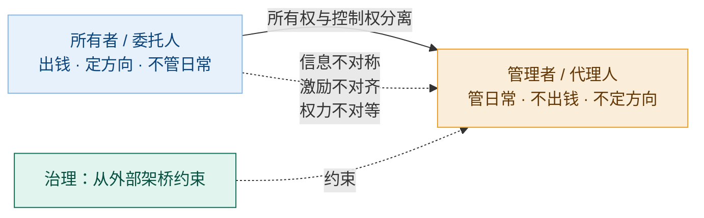

**关键：这个鸿沟是结构性的，不是人品问题。** Jensen & Meckling（1976）讲得很清楚——即使所有人都诚实能干，只要委托代理关系存在，三道裂缝就在。偏离会"安静地积累"（quietly accumulate），直到爆雷——安然、雷曼都是治理缺位的结果。

**为什么管理自己搞不定？** 因为管理层在鸿沟内部——你没法站在鸿沟里看到鸿沟本身。让管理者自己监督自己，等于让狐狸看鸡舍。所以需要在鸿沟上面架一座桥，从**外部**约束**内部**，这就是治理。

**那治理和管理怎么分界？** Barry Bader 提出七个判别问题：影响大吗？涉及未来吗？触及使命核心吗？需要高层政策决策吗？有红旗信号吗？有外部监督者在看吗？CEO 需要董事会支持吗？——**任一为"是"归治理，全"否"归管理。**

IRSA Institute 还发现了一条**决议衰减链**：董事会的意图没有可执行约束时，从 100% 一路衰减——高管层解读剩 75%，管理层执行剩 50%，到运营层现实只剩 30%。不是有人作恶，而是每过一层组织意图都被重新解读、稀释、偏移。治理的价值就是用**可执行的约束**（enforceable constraints）把这个衰减链拦住。

> Good Governance Institute 的区分：**Management makes decisions（管理层"做"决策——收集数据、分析选项、提建议），Directors take decisions（董事"拿"决策——承担责任，从"负责"变为"担责"）。**

### 治理为什么必然存在：委托与问责的分层（2026-08-26 增补，2026-09-01 对齐口径）

治理不是被设计出来的奢侈品：组织要长大就要**委托**——治理机构把具体责任下放管理层（§7.2.5），但问责不可委托（§5.6）。这一分层必然要求下放的执行始终处在指导、监督、问责之下，否则组织目的无法保证：

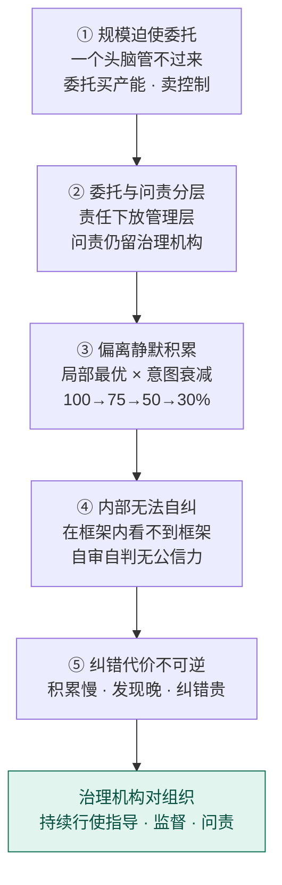

1. **规模迫使委托**——合作规模超过单个头脑的直接看管上限，委托成为唯一选择；不委托，组织长不大；
2. **委托与问责分层**——具体责任可委托（下放管理层，§7.2.5），问责不可委托（留治理机构，§5.6）；
3. **偏离静默积累**——下放后的执行若脱离治理，局部最优（每个单步都合理）× 意图衰减（每过一层稀释一次），无警报地积累；
4. **内部无法自我纠偏**——管理层在治理定下的框架内部，自己定规则自己执行自己检查，回答不了"规则该不该这样定"（Q3 口径：自审自判无公信力）；
5. **纠错代价不可逆**——若偏离即时可见、随手可改，管理的反馈环（PDCA）就够，人类不必发明治理；偏偏框架级问题积累慢、发现晚、纠错贵，需要在便宜时拦截的机制。

五步走完，结论自己长出来：必须由治理机构对组织持续行使指导、监督、问责——在管理层之上定组织方向与框架、查执行、担责。回到词源完全自洽：**kybernân（掌舵）= 反馈控制**，治理就是社会/组织系统的控制回路。

**本质收束**：治理是组织目的的保障机制——**目的归治理机构、不在执行者手里，而治理机构把组织（架构）持续保持在目的上。** 架构治理里的每一件器物都是"目的在场化"的技术：治理机构定方向和规矩（指导）、依既定原则与目标核查符合性与绩效（监督）、对结果负责交代（问责）。人类创造治理，是因为目的不会自己保持，需要有人持续把它盯住。

---

## 十一、治理的执行：持续系统、不靠事件启动

前面常把治理说成"有偏差才响应、没事不扰"——按 ISO/IEC 38500:2024 口径修正：**治理是持续系统、不靠事件启动**（Q4 口径）。

治理执行 = 治理机构持续运用 §6 模型四活动（相关方参与、评估、指导、监督）循环：识别并参与相关方、评估方向与执行、指导定方向和规矩、监督核查符合性与绩效——循环往复。评估持续进行，发现偏差即调整指导，所谓"启动"只是评估发现偏差后的一轮处置。

那"定期评审"算什么？它是治理运转的一种节奏（§6 评估活动的具体形态），不是治理的"启动器"——治理不存在"平时不运转、有事才开会"的状态，评估一直在进行。管理同样持续运转、不设"启动"：在治理框架内按 PDCA（计划-执行-检查-处置，属 ISO 9000 族执行循环）持续达成运行目标。

回到词源也自洽：**kybernân（掌舵）= 反馈控制**——舵手持续观察风向水流、持续调整方向，不是等风暴来了才动；治理的评估就是持续观察，指导就是持续调向。

**架构治理的目的变化两路（2026-08-26 增补，2026-09-01 对齐口径）**：目的变化有两条路（组9 Q5 解析）——**战略调整**（企业战略随环境调整，运营体系目的随之显性重定，原架构或不再合格）与**日常局部决策悄悄带偏**（更隐蔽、更需监督）。治理的评估活动持续以目的为参照检视，两条路都会被发现——这也正是"评审以目标而非需求为参照"的深层理由。

> 一个扎心的反例：如果一个治理委员会只在季度会议上工作、平时完全不运转，那它不是持续治理，而是例行会议——真正的治理是持续行使指导、监督、问责，评估发现偏差即处置。

---

## 十二、治理：组织常态，委托使其成为必需

治理是**组织的常态系统**，不是"三个条件齐备才需要的特例装置"（Q2 口径）：委托不是治理的前提——**无委托时治理同样是组织常态**（§3.3），同一个人兼任治理与管理两角色时，两角色仍须清晰；委托只是让治理成为不可回避的必需。

那"哪些问题归治理、哪些归管理"怎么分？按**职能层级与对象**分（Q3 口径）：治理在管理层之上定组织方向与框架（指导、监督、问责），管理在框架内执行达成运行目标。规则该不该这样定、目的如何变化、方向对不对——归治理（对象是组织层面）；框架内的执行与调优——归管理。

**验证（目的归治理机构，组9 Q5）**：目的如何变化、架构是否仍符合目的，不是管理层的权衡，而是治理机构对组织（架构）行使指导、监督、问责的职责；单个 bug、一次部署失败、一次需求延期，都是执行层问题，管理权限内就能解决。

**用五个领域看治理的普遍形态：**

| 领域 | 治理机构 | 治理行使 | 目的（判据）归属 |
|---|---|---|---|
| 国家 | 宪法法院、选举 | 定方向规矩、监督、问责 | 人民（通过代议） |
| 组织 | 董事会、审计 | 定方向规矩、监督、问责 | 股东 |
| 流程 | 委员会、审批 | 定流程规则、监督符合性 | 治理机构下的流程负责人 |
| 架构 | 治理机构下的架构委员会、合规评审 | 定架构规则与标准、监督符合性 | 治理机构（运营目的） |
| 数据 | steward、质量审计 | 定数据标准、监督符合性 | 治理机构下的数据所有者 |

形式各异，内核相同：治理机构对组织（领域对象）行使指导、监督、问责，把它保持在目的上。从国家到数据，尺度差了十个数量级，结构一模一样。

---

## 十三、两种失效与治理的响应

"坏了"和"不适合了"是两种完全不同的失效模式，治理对它们的响应也不一样。

**"坏了"是内部失效——框架自身有缺陷。** 架构原则互相矛盾（"买不造"和"避免供应商锁定"同时存在但没说怎么调和），数据标准同一个字段三个系统三种定义，流程审批出现循环依赖。框架的内部逻辑断了。

**"不适合了"是外部过时——框架没错，但世界变了。** 架构为单体设计但业务要微服务化，数据治理为结构化表格设计但 AI 来了要管非结构化训练数据，流程为瀑布设计但组织转了敏捷。框架的内部逻辑没断，但它在解决昨天的问题。

| | 坏了（内部失效） | 不适合了（外部过时） |
|---|---|---|
| 问题在哪 | 框架自身 | 框架与环境的匹配 |
| 有没有症状 | **有** — 矛盾、冲突、故障、违规 | **没有** — 一切按旧标准看都合规 |
| 治理怎么发现 | 依既定原则与目标核查（§3.3 监督） | 评估持续进行（§6 评估活动） |
| 治理怎么响应 | **修** — 修复缺陷，恢复一致性 | **演** — 更新框架，适配新环境 |

两者经常连锁：

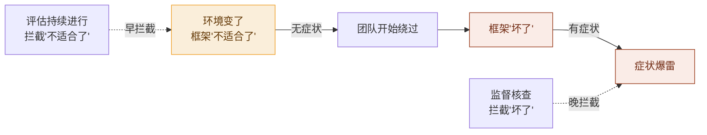

逻辑：当框架不适合新环境时，团队按框架做就会慢、会错、会做无用功。没人想故意违规，但为了把活干完会开始"灵活处理"——这次跳过评审、那次用临时方案、下回绕过标准。每一次绕过都合理，但这些绕过会积累成框架的内部损伤。**不适合了最终导致了坏了。**

**最危险的状态是"不适合了但还没坏"**：没有症状（监督也核查不到）、管理看不出来（管理在框架内部，看不到框架与环境的匹配度）、团队不会主动报（每次绕过都是"临时处理"）。这个状态只能被治理的评估活动发现：以目的为参照持续检视（§6 评估），有人从外部视角问一句"我们的框架还在解决今天的问题吗？"。

> 一句话：**坏了要修，不适合了要演，治理两个都要管——监督核查抓"坏了"（有症状），评估持续进行抓"不适合了"（无症状）。**

---

## 十四、边界、精力与过滤器

这一轮回答三个层层递进的挑战：同一个问题到底归管理还是归治理？企业里一切不都归老板吗？治理委员会比老板更没精力，岂不是更糟？

**第一，跨出单管理层权限就要治理介入。** "三个系统三种字段定义"如果三个系统归同一个团队，数据 steward 直接拍板统一，一个管理者权限内就能解决——这是数据管理（DAMA 里数据标准化的日常操作）。如果三个系统归三个不同团队，A 说"我们的定义对接监管不能改"，B 说"我们的定义跟供应商一致改不了"，C 说"历史遗留改成本太高"——三个管理者谁都没权限命令另外两个改。这时需要的不是更好的管理，而是一个**跨管理边界的权威**：裁决哪个定义做标准、定新系统准入规则、让拍板的人担责。循环依赖同理：一个部门内是管理，跨财务和法务两个部门就是治理。

**所以准确的说法是：框架内的修正在管理权限内是管理；当"修框架"需要超越任何单个管理者权限时，治理机构就要介入——治理是持续系统，定规矩（指导）让绝大多数情况自动有章可循，只对规则覆盖不了的例外亲裁。**

**第二，权力与精力的鸿沟。** 用户挑战："一个企业内部所有事都归老板，这是一个管理者。"——权力上完全对，一切最终可归老板。但这里有一道裂缝：**权力覆盖 100%，精力覆盖不到 1%。** 一个企业一年做几万个决策，老板不可能每个都亲眼看、亲口定。他必须授权，而授权的那一刻分层就重新出现——每一层授权都复制了一个缩小版的"问责在治理机构、执行在管理层"的分层。所以治理不是在老板权力之上加一层，而是在老板精力够不到的地方替他延伸：

> **治理 = 把"老板如果有时间会做的决定"制度化，不需要老板亲自在场。**

而且更深一层：**老板自己也是代理人。** 在权力链（股东 → 董事会 → CEO → VP → 团队）里，老板坐在第三个位置，不是第一个——他是最高管理者，不是最高所有者。他上面还有董事会、审计、股东会，这些就是治理老板本人的机制。CEO 也可能追求任期安全、做账美化业绩、过度扩张帝国——这些偏离同样"安静地积累"。

**第三，治理委员会是过滤器不是处理器。** 用户挑战："委员会比老板更没精力。"——如果委员会是"多一层人来审管理层的每个决定"，那确实更管不过来。但委员会不是这么干的：

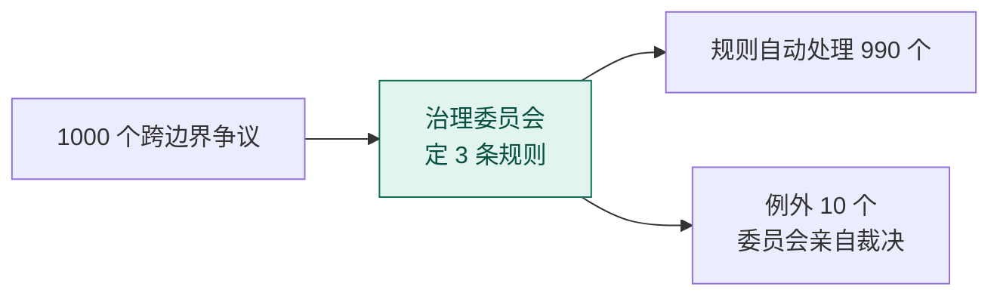

没有治理时，1000 个争议全部到老板桌上，每个都需要亲自裁决。有治理时，委员会定 3 条规则（"字段标准由 steward 按业务域归口""新系统上线必须过架构合规检查""跨部门流程变更需审批"），990 个争议**不需要任何人看**——规则已经说了怎么办。只有 10 个规则覆盖不了的例外才到委员会。

**所以委员会一年实际干的事：定几条规则 + 处理 10 个例外，约 20 小时的活，不是 1000 小时。** 老板花 1 小时定 1 条规则，替自己挡住了 1000 次 escalation。这就是**力量倍增器**（force multiplier）——委员会不是处理器，是过滤器的滤芯。滤芯不需要处理流过的全部水，它只需要在那里，水自己就被过滤了。

治理是持续系统：委员会日常行使指导（定规矩）与监督（查执行），不是"有事才开会"。如果委员会天天开会审一堆执行层的事，说明规则没定好，或者委员会退化成了管理层。

---

## 十五、治理的执行：§6 模型四活动

治理执行 = 治理机构持续运用 ISO/IEC 38500:2024 §6 模型四活动循环（Q4 口径）：

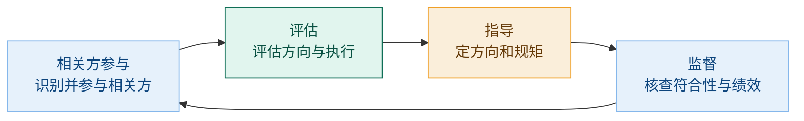

四活动循环往复：识别并参与相关方、评估方向与执行、指导定方向和规矩、监督核查符合性与绩效。这是治理的**执行模型**；治理的**定义**看 §3.3 三成分（指导、监督、问责）——**执行看模型、定义看三成分，勿混**（Q4 解析：2024 版较旧版新增相关方参与，旧版评估/指导/监督为三活动）。

治理是**持续系统、不靠事件启动**：评估持续进行，发现偏差即调整指导，所谓"启动"只是评估发现偏差后的一轮处置。管理执行 = 在治理框架内按 PDCA（计划-执行-检查-处置，属 ISO 9000 族执行循环）持续达成运行目标，同样持续运转、不设"启动"。

---

## 十六、术语膨胀：数据/架构/流程的同一个病

许多人把"数据治理"的内涵扩大了——既包括治理，也包括依据规则开展的数据质量提升工作。后者在 DAMA 框架里的正式名称是**数据质量管理（Data Quality Management）**，属于"数据管理"这个伞下面的执行领域，跟数据治理是**平级**关系，不是包含关系。

而且这个"膨胀病"不止数据领域——架构和流程都被同一种病传染了：

| | 伞（大概念） | 治理（指导监督问责） | 管理（框架内执行） |
|---|---|---|---|
| **数据** | 数据管理（DAMA-DMBOK，11 个知识领域） | 数据治理（定标准·定权属·监督问责） | 数据质量、元数据、架构、安全、集成… |
| **架构** | 企业架构（TOGAF） | 架构治理（委员会·合规评审·架构合同） | 架构设计/建模、技术选型、系统构建/部署 |
| **流程** | 流程管理 BPM（ABPMP） | 流程治理（归属·政策·跨部门裁决） | 流程设计/BPMN 建模、执行/自动化、监控/优化 |

注意第一行——**每个领域的伞都是"管理"而不是"治理"。** 这跟"治理在管理之上"恰好反过来了：企业层面治理 ⊃ 管理（董事会在 CEO 之上），但领域层面**管理 ⊃ 治理**（数据管理是伞，数据治理是 1/11；BPM 是伞，流程治理是组件之一）。为什么？因为企业层面的治理对象是"整个组织"，而领域层面的"XX 治理"对象是"XX 这个东西"——对象不同，层级关系就不同。

**三个领域的权威框架其实都划了线：**

- **TOGAF** 官方对照表白纸黑字——架构治理管"控制与合规"（标准、政策、决策），架构管理管"执行与交付"（设计、代码、部署）。ADM 的 B-H 阶段（设计业务/数据/技术架构）全是管理的活，治理只在审查点介入（Phase A 审批架构愿景、Phase G 实施监管、Phase H 变更管理）。
- **BPM 文献** 同样明确——"Process governance is a component of BPM"。管理回答"流程怎么跑"，治理回答"流程该不该这么跑、出了问题谁负责"。
- **DAMA** ——数据治理是数据管理 11 个知识领域之一，不是数据管理的上位概念（数据治理的经典框架是 DGI，数据管理的经典框架是 DAMA-DMBOK）。

**膨胀的根源三个领域完全一样："治理"听起来比"管理"高级 → 厂商和顾问膨胀用词 → 一词跨两层 → 角色混乱。** "数据治理平台"卖的是 ETL 清洗，"架构治理"包含设计编码，"流程治理"等于 BPM 全套——全都是用治理的名字干管理的活。后果是团队分不清哪些决策该上委员会、哪些自己拍板就行，要么事事上报变成瓶颈，要么事事自己搞绕过治理。

---

## 十七、伞结构、自包含与统称

**管理要包含治理吗？不。管理不包含治理，治理也不包含管理——两者是学科伞下的平行流。** 治理行使指导、监督、问责（定方向与框架、查执行、担责），管理在框架内执行优化，伞是那辆车。治理**指导**管理，但不**包含**管理——治理在管理层之上管组织层面的事，不替管理干活。

三个领域的准确称呼：

| 领域 | 伞（学科名） | 治理子域 | 执行子域 |
|---|---|---|---|
| 数据 | **数据管理**（DAMA，11 领域） | 数据治理 | 数据质量、元数据、架构、安全… |
| 架构 | **企业架构**（TOGAF） | 架构治理 | ADM、架构库、架构能力… |
| 流程 | **流程管理 BPM**（ABPMP，6 要素） | 流程治理 | 建模、分析、设计、绩效… |

**"管理"不能既当伞名又当子流名——那就是 A ⊃ A，自包含。** 三个框架实际上都靠**子层不重复伞名**来避开这个逻辑坑：DAMA 伞叫数据管理，但下面 11 个领域各有专名（数据治理、数据质量、元数据……），没有一个叫"数据管理"；TOGAF 伞叫企业架构（甚至不用"架构管理"这个词），子组件用 ADM 等专名。所以正确的结构不是"治理+管理"二分，而是**一个伞下 N 个各有专名的领域，治理是其中之一**。需要功能二分时，用**"治理性活动 + 执行性活动"**，不用"治理 + 管理"。

那治理之外的执行性部分总得有个统称（不能叫"管理"跟伞撞，不能叫"其他"太模糊）。四种方案：

| 方案 | 公式 | 评价 |
|---|---|---|
| A | XX管理 = XX治理 + XX管理 | **否决**——自包含 |
| B | XX管理 = XX治理 + XX运营 | ITIL/COBIT 先例，实用但"运营"偏日常、设计类活动勉强 |
| C | XX管理 = XX治理 + 各专名（不统称） | DAMA 实际做法，最精确但沟通不便 |
| D | XX体系 = XX治理 + XX管理 | TOGAF 做法（换伞名），最干净但已有框架改不了伞名 |

---

## 十八、最终公式：从领域到国家

用户提出一个收编以上四方案的最终公式：

> **XX管理 = XX治理 + XX开发与运营**

"开发与运营"借 DevOps（Development + Operations）概念：**开发** = 设计 + 构建（从无到有造东西：建模、ETL、架构设计、流程自动化）；**运营** = 运行 + 维护 + 优化（造完之后让它持续跑好：DBA、运维、质量修复、调优）。这正好是 PDCA 循环里 P（计划/设计）+ D（执行/构建）+ C（检查/监控）+ A（改进/优化）的完整映射。

三个领域全部验证通过：

| 领域 | XX治理 | XX开发与运营 |
|---|---|---|
| **数据** | 标准·权属·审计·steward | 建模/ETL（开发）+ DBA/质量修复/BI（运营） |
| **架构** | 委员会·合规·合同 | ADM 设计/编码（开发）+ 运维/调优（运营） |
| **流程** | 归属·政策·裁决 | BPMN 建模/自动化（开发）+ 执行/监控/优化（运营） |

架构领域尤其顺——TOGAF 的核心方法就叫 **ADM（Architecture Development Method，架构开发方法）**，"开发"是官方用语。这个公式干净地解决了全部问题：无自包含、无术语膨胀、执行层完整覆盖、有行业认知基础、三领域通用。

**推到国家层面时层级反转过来了。** 领域层面"管理是伞、治理是子流"（XX管理 = XX治理 + XX开发与运营），国家层面"治理是伞、管理是子流"——因为国家的核心活动不是"造产品"而是"行使权力和提供公共服务"。

但"国家治理 + 国家管理 = 国家治理"就是 A + B = A 的自包含（跟方案 A 同一个漏洞）。伞名不能是加数之一，所以先后否掉了"国家治理""治国"（"治国"含"治"，跟"治理"字重叠），最终落到：

> **国家发展与运行 = 国家治理 + 国家管理**

四大优势：①无自包含（伞名不含任一加数）；②无字重叠；③描述性（"治国"只说"治"，"发展与运行"说清国家做什么 = 发展 + 运行）；④**DevOps 跨尺度完美平行**——开发→发展、运营→运行，造产品→建国家，跑系统→跑国家。

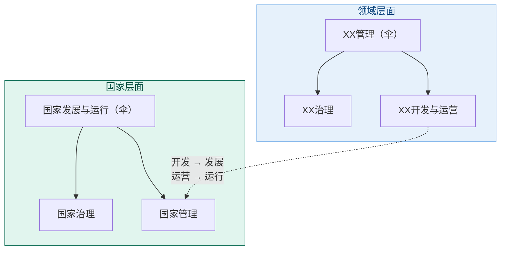

两层面公式完全同构：

| 层面 | 伞（做什么） | 治理层（指导监督问责） | 执行层（框架内执行） |
|---|---|---|---|
| 领域 | XX**管理** | XX治理 | XX开发与运营 |
| 国家 | 国家**发展与运行** | 国家治理 | 国家管理 |

两行结构一模一样，区别只在尺度——产品级造系统、跑系统，国家级建国家、跑国家。治理在两个层面都是那个方向盘：行使指导、监督、问责——定方向与框架、查执行、担责。

---

## 十九、全文总结

从"为什么 govern 译成治理"出发，一路推到了"治理是什么、什么时候需要、跟管理怎么分、术语该怎么定"。

**上午的主线（翻译层）：** govern 本义是"掌舵"（希腊 kybernân），不是"统治"；1990 年代被有意定译为"治理"，借了"治"（治水疏导）和"理"（治玉顺纹）的古典正资产，完成了与"统治"（rule）的概念切割，也保留了跨领域迁移的能力。

**下午的主线（理论层，2026-09-01 对齐 ISO/IEC 38500:2024 与参考答案第九组）：**

1. **治理 vs 管理** — 治理=治理机构在管理层之上定组织方向与框架，行使指导（定方向和规矩）、监督（查执行）、问责（担责）三职能（§3.3）；管理=在框架内执行、达成运行目标；授权与报告的纵向链，对象是组织而非管理本身，管理不能取代治理（自审自判无公信力）。
2. **为什么需要** — 委托（具体责任下放管理层 §7.2.5）但问责不可委托（§5.6）；下放后的执行若脱离指导、监督、问责，组织目的无法保证；治理目的=绩效/受托/伦理（§4）。
3. **执行模型** — 治理执行=§6 模型四活动（相关方参与、评估、指导、监督）循环，持续系统、不靠事件启动；管理按 PDCA 持续执行（属 ISO 9000 族执行循环）。
4. **委托不是前提** — 无委托时治理同样是组织常态（§3.3）；委托使治理成为不可回避的必需。
5. **两种失效** — 坏了（内部失效）要修 vs 不适合了（外部过时）要演，治理两者都管。
6. **边界与精力** — 治理在管理层之上管组织层面的事；委员会靠定规则（指导）让绝大多数情况自动有章可循，只裁例外。
7. **企业架构治理** — 架构由运营目的评判、目的归治理机构；架构与目的的一致不会自己保持（战略调整 + 日常局部决策带偏两路）；治理机构对架构持续行使三职能、把它保持在目的上；组织=治理机构下的架构委员会；架构师=开发与维护架构、做符合性判断并报告偏差、不定义运营体系目的。
8. **术语精确化** — 伞叫"管理"（数据管理/企业架构/流程管理），治理是伞下的一个领域；市场用"治理"命名整个伞是膨胀。
9. **最终公式** — XX管理 = XX治理 + XX开发与运营；国家发展与运行 = 国家治理 + 国家管理。

一句话收束全部：

> **治理回答的不是"谁骑在谁头上"（那是统治），也不是"怎么把事做完"（那是管理），而是"这条船往哪开、由谁来掌舵、偏航了谁来纠"——治理机构对组织行使指导、监督、问责，把它保持在目的上。从国家到数据表，这是同一件事的不同尺度版本。**

---

## 参考来源

**翻译与概念史**
- 俞可平《推进国家治理体系和治理能力现代化》，《前线》2014 年
- 俞可平《治理和善治引论》，《马克思主义与现实》1999 年
- 俞可平主编《治理与善治》，社会科学文献出版社，2000 年
- World Bank, *Sub-Saharan Africa: From Crisis to Sustainable Growth*, 1989
- World Bank, *Governance and Development*, 1992
- James N. Rosenau, *Governance without Government: Order and Change in World Politics*, 1992
- Etymonline, "govern" 词条：希腊 kybernân → 拉丁 gubernare → 英语 govern

**治理与管理**
- Bob Tricker, *Corporate Governance*, 1984（"management runs the business, governance sees it run properly"——管理是经营企业、治理是确保经营得当）
- Adolf Berle & Gardiner Means, *The Modern Corporation and Private Property*, 1932（所有权与控制权分离）
- Michael Jensen & William Meckling, "Theory of the Firm", 1976（代理理论）
- ISO/IEC 38500:2024（治理 IT 的标准：§3.3 定义三职能（指导/监督/问责）、§4 目的三成果、§6 执行模型四活动（相关方参与/评估/指导/监督））
- ITIL（治理与管理的区分）
- Good Governance Institute（"governance ensures better decisions"；"management makes decisions, directors take decisions"）
- Barry Bader（治理 vs 管理的七问判别法）
- IRSA Institute（董事会决议衰减链 100%→75%→50%→30%）

**架构 / 流程 / 数据治理**
- TOGAF（架构治理定义、三大支柱、ADM、Preliminary Phase、架构合同与豁免）
- ABPMP CBOK（BPM 生命周期，"process governance is a component of BPM"）
- DAMA-DMBOK（数据管理 11 个知识领域，数据治理与数据质量管理的关系）
- ISO/IEC/IEEE 42010:2011/2022（架构定义——架构=系统在其环境中的基本概念与属性；架构治理守护"架构与运营目的的一致"，2026-08-26 增补引用）
- IEV 831-01-01 Note 2（fundamental 对系统目的必要且充分——架构由运营目的评判的依据，同上）
- ISO 10007（配置管理——架构描述基线化与变更控制，同上）

---

*本文整理自 2026 年 8 月 17 日的完整对话讨论，涉及词源学、翻译史、政治学、组织管理学与术语学。上午部分回答"govern 为何译成治理"，下午部分从治理与管理的关系一路推到术语公式的定版；治理理论部分已于 2026-09-01 按 ISO/IEC 38500:2024 与参考答案第九组口径对齐。*
