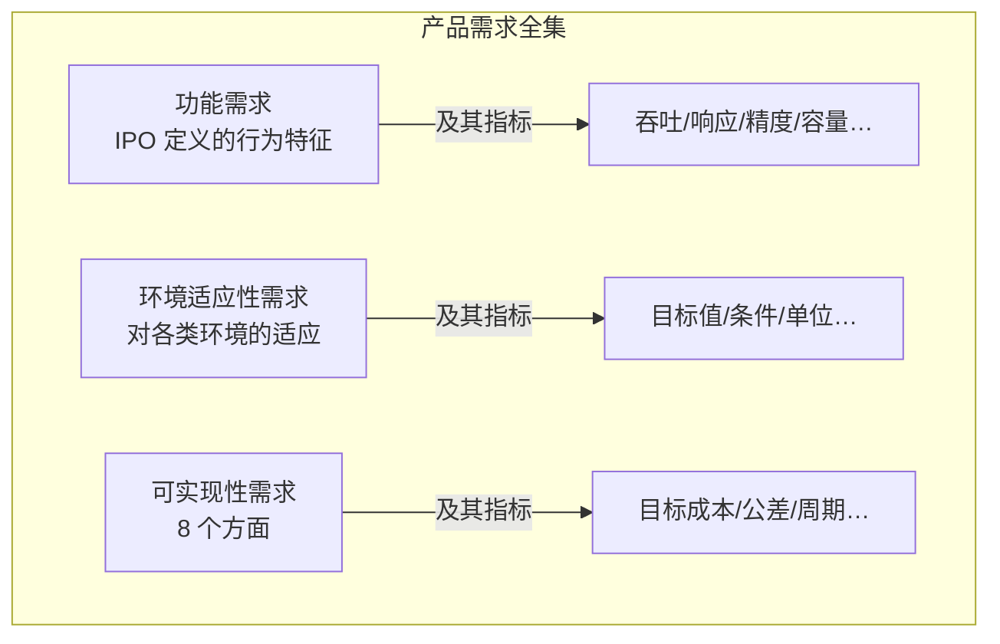
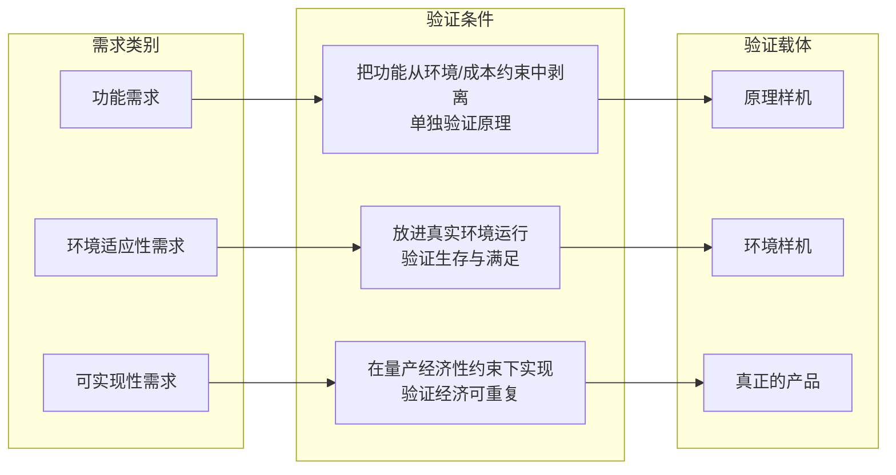
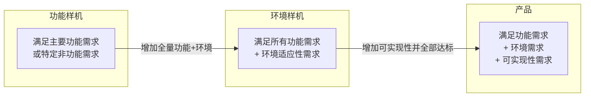
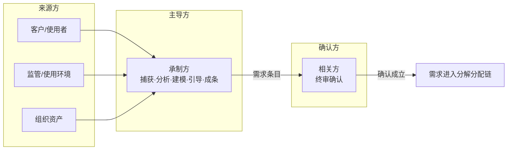
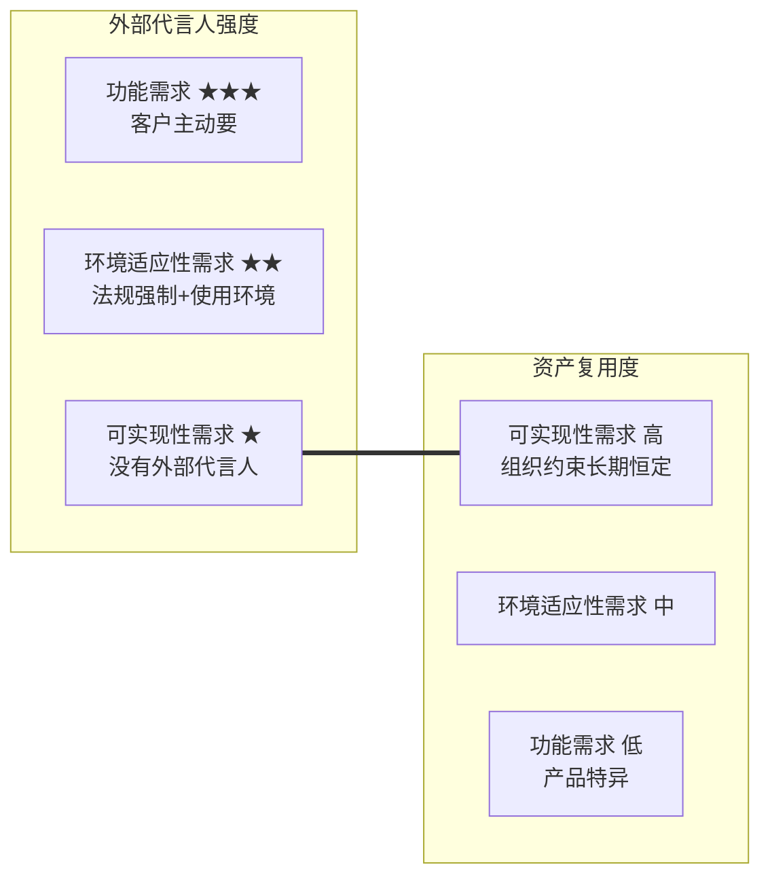
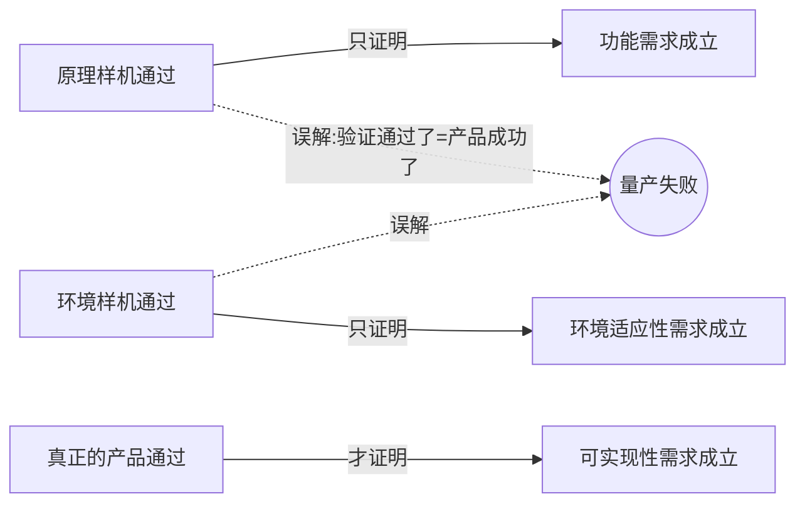

# 产品需求的完整性：从三类需求到验证载体

> **整理日期**：2026-08-19
> **主题**：产品需求（相关方需求）的完整性 / 三类需求 / 验证载体 / 承制方主导
> **说明**：本文档由一次连续的概念讨论整理而成，围绕一个核心问题——"产品需求应该包括哪些才算全"。依据素材为《高效研制优质低成本的产品——正向设计》PDF（50-research/00-系统工程相关研究报告/20250326-高效研制优质低成本的产品——正向设计.pdf），其中 §4、§5、§7、§8、§18、§25 为直接依据。所有图表以 Mermaid 实现，支持 Typora / Obsidian / GitHub / VS Code 等渲染器直接显示。

## 目录

1. [一个核心答案：三类需求](#1-一个核心答案三类需求)
2. [三类需求 ↔ 三类验证载体：同构对应](#2-三类需求--三类验证载体同构对应)
3. [需求完整的判据](#3-需求完整的判据)
4. [功能需求：包括什么，来自哪里](#4-功能需求包括什么来自哪里)
5. [环境适应性需求：包括什么，来自哪里](#5-环境适应性需求包括什么来自哪里)
6. [可实现性需求：包括什么，来自哪里](#6-可实现性需求包括什么来自哪里)
7. [承制方：主导方而非来源方](#7-承制方主导方而非来源方)
8. [可实现性需求的积累闭环：问题 → 资产 → 需求](#8-可实现性需求的积累闭环问题--资产--需求)
9. [缺失诊断：症状反推缺失的需求](#9-缺失诊断症状反推缺失的需求)
10. [三类需求对照总表](#10-三类需求对照总表)

---

## 1. 一个核心答案：三类需求

产品需求（相关方需求）要"全"，根本结构是**三个类别**，且**每一类都必须"及其指标"**（正向设计 §7.2）。

| 类别 | 定义 | 细化展开（§25.2） |
|------|------|------|
| **① 功能需求** | 系统所具备的行为特征，以 **IPO（输入、处理、输出）** 方式定义 | 业务用例、业务场景、系统用例、用例场景 |
| **② 环境适应性需求** | 气候、国家、文化、风俗、法律等各类环境的适应性 | 可靠性、安全性、测试性、保障性、适航性、气候适应性、电磁兼容性、法律合规性 |
| **③ 可实现性需求** | 共 **8 个方面**：经济可承受性、物料可采购性、可制造性、可测试性、可交付性、可部署性、可运维性、可回收性 | 相关方是产品的**承制方**（各业务代表 + 市场代表，§5.3） |

这个三分类在**系统级（§7.2）和构件级（§8.2）同构复现**——构件需求同样由功能 + 环境适应性 + 可实现性三块构成，说明它是**系统级和构件级通用**的完整性模板。

> **重要**：需求 = 需求描述 + 指标（不可衡量则不成为需求）。三类的每一类都必须"及其指标"，指标不是可选项。这与仓库通用设计规范 §1.2 的口径一致（性能指标分定量/二元判定两类）。

---

## 2. 三类需求 ↔ 三类验证载体：同构对应

三类需求各自对应一个**专属的验证载体（交付物形态）**。这不是分类的巧合，而是因果——**需求类别 → 决定验证条件 → 决定交付物形态**：

| 需求类别 | 验证载体 | 被验证的问题 | 确认方 |
|---|---|---|---|
| 功能需求 | **原理样机** | 原理/功能能否成立？ | 客户/使用者 |
| 环境适应性需求 | **环境样机** | 真实环境下能否存活、满足？ | 环境相关方（监管/法律/气候…） |
| 可实现性需求 | **真正的产品** | 能否经济、可重复地实现出来？ | 承制方（各业务代表 + 市场代表） |

### 机理：为什么是三对三

每一类需求**只能在特定的验证条件下才能被验证**，而这三类需求需要的验证条件互不相同：

- **功能需求**要验证"这个原理对不对"，就必须把功能从环境约束、量产成本约束里**剥离**出来单独验证 → 所以需要原理样机（越简单、越不受干扰越好）。
- **环境适应性需求**要验证"在真实环境下能不能活"，就必须把产品放进**真实环境**去跑 → 所以需要环境样机（覆盖气候、可靠性、安全性、合规等）。
- **可实现性需求**要验证"能不能经济可重复地造出来"，就必须在**量产经济性**约束下去实现 → 所以需要真正的产品（可采购、可制造、可测试、可交付、可部署、可运维、可回收 + 经济可承受）。

### 与"逐级累加"的关系

交付物确实**逐级完备**（环境样机必须先满足功能，产品必须先满足功能+环境），但**每类需求有且只有一个专属验证载体**：功能靠原理样机验收，环境靠环境样机验收，可实现靠真正的产品验收。

- 原理样机、环境样机**不验证可实现性需求**——那是量产产品的事。
- 文档自身措辞就埋着这个对应：§25.2 把第三类直接写成"**可实现（产品化）需求**"——可实现性 = 产品化，产品化 = 真正的产品。

### 术语待定：功能样机 vs 原理样机

§5.1 用"功能样机"，§25.2 用"原理样机"。若是同一回事，文档用词不严谨；若原理样机验证"理论/技术可行性"、功能样机验证"行为特征实现"，则阶段变为四段。**写进书/培训前需定口径。**

---

## 3. 需求完整的判据

### 判据一：内容覆盖

功能、环境适应性、可实现性三类都捕获，每类"及其指标"。

### 判据二：验证载体覆盖

每一类需求都能回答"用什么交付物验证它？"——**答不上来的那一类，就是需求没写全的证据。**

### 判据三：需求三性质（元层面）

§4.3：需求的**全面性、明确性、可度量性**直接影响对产品质量的评价和度量。这是对"全"的元层面要求，三类需求都适用。

### 判据四：从"产品 vs 样机"反推

§5.1 给出最干净的完整性判据——**从"产品"的定义反推需求必须覆盖什么**：

**需求缺了哪一类，交付物就降格为样机。** 可实现性需求是"产品"区别于"样机"的最后一块拼图——它把全生命周期 8 个过程（物料采购/制造/测试/交付/部署/运维/回收，§5.2）对产品的"方便实现"期望显性化成了需求。

### 判据五：成本必须显式写进需求

§5.4：**产品成本是需求分解、分配、分析的结果，不是设计出来的。** 因此**相关方需求中必须包含成本相关需求**（经济可承受性 + 影响全生命周期成本的可实现性需求），否则设计没有成本依据和目标——成本属于"必须显式写进需求"，而不是后续"算出来"。

---

## 4. 功能需求：包括什么，来自哪里

### 包括什么

**定义（§7.2）**：功能需求是系统所具备的**行为特征**，以 **IPO（输入、处理、输出）** 方式定义的需求。功能需求不是"要有个什么按钮"，而是"给定输入 X，系统处理，产出输出 Y"——这样才可构造、可验证。

**四层展开（§25.2）**：功能需求 = 业务用例 → 业务场景 → 系统用例 → 用例场景。这是从**相关方业务层**到**系统行为层**的一条细化链：

| 层 | 回答的问题 |
|---|---|
| 业务用例 | 相关方用产品完成什么业务 |
| 业务场景 | 该业务的典型/具体过程实例 |
| 系统用例 | 系统为支撑该业务必须提供的参与行为 |
| 用例场景 | 系统行为的可运行具体过程 |

**及其指标**（§7.2）：功能需求同样带指标——吞吐、响应时间、精度、容量等。功能需求的性能指标是它自带的，不是 NFR 的专利。

### 层次结构本身的意义

§3.1 说设计与开发 = 对需求的**持续分解、分配与分析**。功能需求从"业务用例"细化到"系统用例"，正是这条分解链的**第一段**。这是功能需求在三类里唯一的特殊之处：**它是唯一自带"从业务到系统"分解通道的类别**。环境需求和可实现性需求没有这条层次通道（它们的通道分别是环境分析和实现方案）。

### 来自哪里：五个来源

1. **客户/使用者的需要与期望——最强外部代言人。** 对比可实现性需求"没人要你提"，功能需求是客户最愿意、也最能主动表达的。这是它"热闹"的原因。
2. **业务用例与场景分析。** §18.2：针对每一相关方，基于相关方需求资产捕获其需要或期望，**基于业务用例和场景资产，开发业务用例和场景**。功能需求不是听客户罗列功能，而是把业务建模成用例/场景再展开。
3. **需求分析师的专业捕获——因为"隐含性"（§4.2）。** 客户以为自己在提需求，往往提的是"想要的东西"甚至"解决方案"；分析师要穿透到"需要"。"客户要 A 其实是想要 B，而 B 的真正需要是 C"——这就是功能需求的陷阱所在。
4. **组织资产（复用度低但有）。** §18.2：基于相关方资产定义产品相关方清单；基于相关方需求资产捕获需要或期望。场景资产可跨产品复用，但功能需求的主体仍是产品特异的。
5. **相关方确认。** §4.2：需求是对相关方需要或期望的规范性陈述，**并得到相关方的确认**。功能需求必须在相关方确认后才算成立。

---

## 5. 环境适应性需求：包括什么，来自哪里

### 包括什么

**概括层（§7.2）**：环境适应性需求是"对气候、国家、文化、风俗、法律等**各类环境**的适应性"。

**展开层（§25.2）**：可靠性、安全性、测试性、保障性、适航性、气候适应性、电磁兼容性、法律合规性等。

注意"环境"在这里是**广义**的——不只是自然环境，还包括法规环境、社会文化环境。每一条展开项都能写成同一种模式：**"在 X 环境下，产品必须 Y"**。

| 需求条目 | 它所对应的"环境" | 一句话表述 |
|---|---|---|
| 气候适应性 | 自然气候（温/湿/盐雾/海拔/沙尘） | 在投放地气候下正常工作 |
| 电磁兼容性 | 电磁环境 | 在电磁环境中既不受扰也不扰人 |
| 可靠性 | 时间 + 环境应力的持续作用 | 在寿命期内、应力作用下不失效 |
| 安全性 | 正常/异常使用条件 | 在任何条件下不危害人、财、物 |
| 适航性 | 航空运行环境（法规） | 在适航法规环境下可安全运行 |
| 法律合规性 | 法规环境 | 在目标市场法律框架下合法 |
| 测试性 | 维护/测试环境 | 在使用/维护环境下可测试 |
| 保障性 | 部署与后勤环境 | 在部署地可被保障（备件、支援） |
| 文化风俗适应性 | 社会文化环境 | 在使用地文化风俗下可接受、可用 |

### 与可实现性有重叠：同一个特性，两个主人

文档自己有两处措辞重叠：§25.2 把**测试性**、**保障性**归入环境需求，而 §5.3/§7.2/§8.2 把**可测试性**、**可运维性**归入可实现性需求。这不是笔误，而是这两种特性**同时服务两个主人**：

- 面向**使用环境**：产品在役期间可测试、可保障 → 环境适应性；
- 面向**承制方**：生产/交付/运维过程中方便测试、方便运维 → 可实现性。

**分类的判据不是特性本身，而是相关方。**

### 来自哪里：五个来源

1. **产品投放地域的自然与电磁环境本身。** 产品打算卖到哪、用在什么环境，环境需求就从哪来——热带就要高温高湿盐雾，高原就要低气压，电磁环境复杂就要 EMC 强。来源是**市场/部署决策**。
2. **强制性的标准、法律、法规。** §4.2："有的需求是标准、法律、文化和风俗的要求，应将这些内容**摘录到产品的需求条目中**。"适航、EMC、安全、合规都不是可选项，是强制项，捕获动作是"摘录"——从法规文本摘进需求条目。
3. **文化、风俗、国家。** §7.2 把国家、文化、风俗和气候并列——使用地的社会文化环境决定人机交互、内容、外观、操作习惯等方面的要求。
4. **环境相关方，并得到确认。** §4.2：需求 = 对相关方需要或期望的规范性陈述 + **得到相关方的确认**。环境相关方包括监管方（确认合规）、最终用户（确认在真实环境下的使用预期）、受产品影响的第三方。
5. **组织的非功能需求资产库/框架（BB 资产）。** §18.2："**基于非功能相关方需求资产和框架，开发非功能相关方需求**。"环境需求不应从零发明，应基于组织沉淀的 NFR 资产（过去产品在这些环境中的失败教训、已验证的通用环境需求）来开发。

**一句话收束**：环境适应性需求 = 产品与其所处环境之间的一张"契约清单"，来源是"投放环境的客观条件 + 强制法规 + 社会文化 + 环境相关方确认 + 组织资产沉淀"；捕获它们的关键不是技术，而是**先决定产品将投放的完整环境集**，然后逐项确认。

---

## 6. 可实现性需求：包括什么，来自哪里

### 包括什么：8 项，与全生命周期过程一一对应

§5.2 给出全生命周期 7 个主要过程（物料采购、制造、测试、交付、部署、运维、回收），§5.3 给出 8 项可实现性需求。**前 7 项就是"对 7 个过程各自方便实现的期望"，第 8 项经济可承受性是横切的总账**：

| 全生命周期过程（§5.2） | 可实现性需求（§5.3） | 对应的实现方案（§7.3/9.2/10.2） | 提出者（§5.3） |
|---|---|---|---|
| 物料采购 | 物料可采购性 | 物料采购方案 | 物料采购业务代表 |
| 制造 | 可制造性 | 制造（集成/生产）方案 | 制造业务代表 |
| 测试 | 可测试性 | 测试方案 | 测试业务代表 |
| 交付 | 可交付性 | 交付方案 | 交付业务代表 |
| 部署 | 可部署性 | 部署方案 | 部署业务代表 |
| 运维 | 可运维性 | 运维方案 | 运维业务代表 |
| 回收 | 可回收性 | 回收方案 | 回收业务代表 |
| 全生命周期 | **经济可承受性** | 成本方案 | 市场代表 |

§9.3 / §10.3 把这个对称说得更透：**实现方案是对可实现性需求对应内容的"符合性解答"**——物料采购方案回答物料可采购性需求，制造方案回答可制造性需求……所以三条线（过程 → 需求 → 方案）是锁死的。一条可实现性需求缺了，对应的方案和过程就没有依据。

> 小注：§8.2 构件级用"可服务性"代替系统级的"可运维性"，文档自身措辞略有摇摆，写书时定一个口径即可。

### 来自哪里：第一答案是"承制方各业务代表"

§5.3："这些需求的相关方**都是产品的承制方**，包括物料采购、制造、测试、交付、部署、运维、回收业务代表，以及市场代表。"

**可实现性需求不是客户提的，是组织对自己提的。** 客户不在乎你制造方不方便；是组织自己要在市场上活下去，才必须把"方便采购、方便制造、方便运维、成本可承受"写成需求。也正因为如此它最容易缺失——提出者默认"这是我该克服的困难"，而不是"这是我要写进需求、设指标、让设计承接的目标"。

### 来源还有另外四层

1. **承制方现有能力与资源约束（人、机、料、法、环）。** 可实现性需求的指标边界由承制方现状决定——有什么制造能力、什么供应链、什么设备，需求就据此设门槛。§6.5：编制产线方案/工艺规程/工艺卡片的前提是"生产所需的各种人机料环元素皆成熟且可按需获得"。
2. **开发过程中的现实检验（§6.2–6.4）。** 产品开发过程**本身就包括**开发构件的加工/装配/检验技术、开发物料供应商、研制新设备/工装。可实现性不是"假定成立"，而是要在开发中被实现出来；**一旦某条实现不了（物料买不到、技术不成熟、设备拿不到），必须回头改技术实现方案，而不是静默绕过需求**。开发受阻点，就是可实现性需求没定义好的证据。
3. **组织资产（BB 资产）。** 可实现性需求基于组织的工艺资产、供应商资产、设备资产沉淀而来；§16.5 说越早用 BB 资产价值越大——因为可实现性需求的满足往往依赖这些已有资产。
4. **市场与竞争研究（经济可承受性）。** §5.4：市场代表基于对竞品/替代产品的价格成本研究提出价格和成本建议，其他人负责承接和实现。成本需求的来源不是拍脑袋，是对标。

### 客户不关心，所以必须自己提

可实现性需求是唯一"没有外部代言人"的一类需求——客户只关心结果（价格、交期、质量、售后），不关心需求条目（成本结构、物料好不好采购、好不好制造）。**正因为没人替你要，它才必须由组织自己提出、自己积累。**

更刺眼的是，客户甚至可能**反向挤压**可实现性——定制化要求（违背 COTS 策略）、不停加功能（增加制造难度）、压缩报价（挤压成本空间）。功能需求和可实现性需求之间存在**真实张力**。§4.5 承认了这种张力——"在综合考虑成本和进度等效率需求的前提下，**与相关方沟通需求范围**"。可实现性需求常常是那个需要组织**顶住客户压力**才能守住的底线。

**一句话收束**：可实现性需求 = 承制方对自己"方便实现 + 成本可承受"的八项自我要求，来源是承制方各业务代表 + 现有能力约束 + 开发中的现实检验 + 组织资产 + 市场对标。

---

## 7. 承制方：主导方而非来源方

承制方对产品更专业，因此是**重要的来源方，甚至是引导方**——进一步说，是**需求开发的主导方**。需求捕获从"单向接收客户诉求"变成了"双向共同演化"。

### 三方分工

| 角色 | 是谁 | 干什么 |
|---|---|---|
| **主导方** | **承制方** | 驱动需求开发全过程：捕获、分析、用例建模、范围引导、形成条目（§18.2 的整个流程就是承制方在跑） |
| 来源方 | 客户/使用者、监管环境、组织资产 | 提供原始素材：需要与期望、强制性标准、经验建议问题 |
| **确认方** | **相关方** | 终审：需求条目成立以相关方确认为准（§4.2） |

来源方提供**原料**，承制方主导**加工**，相关方执行**验收**。客户说了算的不是"需求是什么"，而是"这需求成不成立"——**内容由承制方主导，成立由相关方确认**。

### 为什么承制方更专业

客户知道**自己要什么**（他的业务、他的痛点），但不知道：

- **什么技术可能**——有没有更优的实现路线（§15.2 正向设计的理论推导内核，恰是承制方基于科学原理知道"能走到哪"）；
- **行业横向视野**——服务过很多客户/产品，知道同类业务普遍缺什么、普遍踩什么坑，单客户永远没有这个广度；
- **标准与环境**——法规、环境、行业规范（§4.2 的强制性摘录，是承制方在摘）；
- **资产沉淀**——组织长期自觉积累的经验、建议、问题，这是专业性的物质基础。

### "引导方"在文档中的证据

1. **§4.2 的"隐含性"**：客户的需要"连他自己都没有意识到"，需要**专业的产品需求分析师**去捕获——分析师就是承制方团队。客户提不完整不是懒，是**不专业**。
2. **§4.5 的范围沟通**：承制方"与相关方沟通需求范围"——范围是引导出来的，不是客户单方面划定的。
3. **§5.4 的成本建议**：市场代表基于竞品研究"提出价格和成本建议"——引导成本需求。
4. **§16.4 的 COTS 引导**：承制方引导物料清单优先标准外购件——这是把可实现性约束主动注入需求。
5. **§18.2 的资产化捕获**：用承制方的相关方/场景/NFR 资产去启发需求——资产本身就是引导工具。

### 引导的边界：主导 ≠ 独裁

承制方主导的是**过程与专业内容**，确认权始终在相关方手里。引导过头，就会**把自己的约束伪装成客户需求**——为了可制造性悄悄删功能、为了 COTS 硬塞标准件、用"客户其实不需要"来压需求。文档的机制是**双轨**：

> **承制方引导（可以激进）+ 相关方确认（不能缺席）。**

引导的激进程度和组织信心可以拉满，确认这个动作一次都不能省。一旦越界替相关方做决定，需求就失去"对需要或期望的规范性陈述"的本质。

### 主导方的推论：责任在承制方

既然是主导方，那么"需求全不全、明不明确、可不可度量"（§4.1/4.3 决定质量的三条）就是**承制方的责任，不是客户的**。客户可以说"不知道自己要什么"，那是他的本分；承制方不能说"客户没提，所以需求不全"，那是失职。

### 顺带推论：引导能力 = 正向设计能力的体现

只能逆向/模仿的承制方，是被动接收客户规格的执行者，谈不上引导；只有具备**理论推导内核**（§15.2）的承制方，才可能提出客户自己都想不到的需求——因为他理解技术可能性，知道"还可以这样做"。**正向设计的意义不止于设计，它从需求捕获那一刻就开始了。**

---

## 8. 可实现性需求的积累闭环：问题 → 资产 → 需求

可实现性需求"大都是组织长期自觉积累的资产，从经验、建议、问题中转化而来"。这是它的来源**根基层**，也正是它与另两类最本质的差别——**可复用性最高**。

### 为什么可实现性需求大都是资产复用

功能需求多大程度是"每个产品重新捕获"的（功能随产品而变，环境随投放市场而变）。但可实现性需求不同——**组织的供应链、工艺、设备、人员约束跨产品持续存在**。过去产品在制造上踩过的坑，下一个产品十有八九还会踩；采购难、装配难、运维难，这些痛点在同一个组织里几乎是常量。

| 类别 | 重新捕获的占比 | 资产复用的占比 |
|---|---|---|
| 功能需求 | 高（产品特异） | 低 |
| 环境适应性需求 | 中（随投放环境） | 中（法规/标准类可沉淀） |
| **可实现性需求** | **低** | **高（组织约束长期恒定）** |

§16 整套 BB 资产开发方法论的落点正是此——可实现性需求是**最适合**基于资产开发、也**最应该**基于资产开发的一类需求。§25.1 里"新增 / 引用修改 / 引用复制 / 引用链接"四种方式，对可实现性需求而言大多走"引用"——新产品的可采购性、可制造性需求，是从资产库里继承下来的。

### 四步闭环

这正是 OBOM → DBOM 反馈环（运维记录反哺下一代设计）在**需求层**的体现。关键是"**转化**"——问题不是照抄进需求，而是被提炼成规范性需求条目：

- 问题："这批零件公差太严，装配车间返工率 30%" → 转化 → 可制造性需求："零件关键尺寸公差 ≥ X，装配间隙 ≥ Y"，并设指标；
- 建议："建议把接口统一成标准件" → 转化 → 可采购性需求："优先标准外购件（COTS）"；
- 经验："上代产品低温试验反复失败" → 转化 → 环境需求资产条目（如果跨类）。

### "自觉"的反面才是关键

"自觉"两字是这套积累成立的前提，也定义了它的反面——**不自觉的组织**：

- 问题靠口口相传、个人经验，只在现场被"救火"解决，从不沉淀成资产；
- 每个新产品重新踩一遍同样的可实现性坑；
- 组织看似在积累，其实资产是散的、隐性的、无法复用的。

判断一个组织自不自觉，就看一条：**它有没有一个制度化的回路——问题 → 分析 → 转成需求条目 → 入库 → 新产品复用 → 复盘更新**（§18.2"基于非功能相关方需求资产和框架开发 NFR"、§13.4 数字化转型第 4 条"持续引导和赋能员工提升产品数据质量"）。

### 一个尖锐推论

既然可实现性需求"大都是组织长期自觉积累的资产"，那就得出反向结论：**没有资产库、没有自觉积累机制的组织，天然捕获不到全面的可实现性需求——不是承制方代表不肯说，是组织根本没有可复用的资产可以拿来提需求。** 这才是"大部分团队都不考虑可实现性需求"的结构性根源：不是一次需求访谈的疏漏，是组织知识管理缺位的必然结果。

---

## 9. 缺失诊断：症状反推缺失的需求

大部分团队都不太考虑可实现性需求，结果研发出来的东西**充其量是环境样机**——物料不方便采购、零部件不方便制造、不方便测试、不方便交付、不方便部署、不方便运维、不方便退役，亦或这些工作的成本很大。

### 症状清单 = 八条可实现性需求的反面

§5.2 说"各过程对产品的共同期望是**方便实现**"，这些症状恰好是"方便实现"的反面——**每一个"不方便"，都对应一条缺失的需求**：

| 事后症状 | 缺失的需求条目 |
|---|---|
| 物料不方便采购 | 物料可采购性 |
| 零部件不方便制造 | 可制造性 |
| 不方便测试 | 可测试性 |
| 不方便交付 | 可交付性 |
| 不方便部署 | 可部署性 |
| 不方便运维 | 可运维性 |
| 不方便退役 | 可回收性 |
| 成本很大 | 经济可承受性 |

这是一个**逆向诊断工具**：团队每抱怨一个"不方便"，就等于在供认一条当初没写进相关方需求的可实现性需求。诊断方向整个反过来——不是"执行要不要改进"，而是"**需求起点全不全**"。

### 为什么"大部分团队都不考虑"——四个错位

这不是能力问题，是结构性原因：

1. **相关方错位**：可实现性需求的相关方是**承制方**（采购/制造/测试/交付/部署/运维/回收代表 + 市场代表），不是客户。团队习惯只访谈客户，自然捕获不到——承制方自己"方便采购、方便制造"的诉求，从没被当成需求提出来过。
2. **时间错位（延迟爆发）**：功能需求缺失，原理样机阶段就爆；环境需求缺失，环境样机阶段爆；**可实现性需求缺失，要到量产/交付/运维才爆**——最晚、最贵，所以短期评估里显得"不重要"。
3. **话语权错位**：研发阶段由研发主导，采购/制造/运维的代表没有在需求阶段发声的机制，等产品定稿了才说"做不出来"。
4. **认知错位**：团队把可实现性当成"后续工艺/实现的事"，而 §18.1 明说这些**是产品的固有特性**，必须体现在相关方需求中；§5.4 明说**成本是需求分解、分配、分析的结果**——没设成本需求，设计就没有优化目标。

### 更阴的循环：样机被当产品接收，让缺失永远不被发现

团队跳过可实现性需求 → 交付"环境样机" → 客户把它当产品接收（"样机=产品"的误解）→ 可实现性缺失到量产才爆 → 团队归咎执行 → 下一轮还是不问承制方、还是不写可实现性需求。**误解本身维持了需求缺失**，形成了一个自洽的救火闭环。

按 §5.1 的定义，一个"不方便采购、不方便制造、不方便交付、不方便运维、退役很贵"的交付物，**按定义就是环境样机，不是产品**。团队说"我们研发出来了"——严格讲只研发出了环境样机。

### 经济可承受性：八条里的"总账"

成本这条和其他七条不一样，它是**总症状**——经济可承受性差，几乎总是"物料不方便采购 + 不方便制造 + 不方便测试 + …"共同把成本堆上去的结果。它有独特之处：

- **成本是需求，不是结果**。§5.4："产品的成本是相关需求及其分解、分配、分析的结果，并非只是设计出来的。没有成本相关需求，设计就没有依据和目标。"团队不做成本需求 → 设计没有成本目标 → 每次决策都**没有预算约束可以对着优化** → 成本"自由落体"。等量产报价发现太贵，再开"降本大会"换供应商、压工艺——**每次降本动作，都等于承认经济可承受性需求当初就没写过。**
- **专属相关方是市场代表**。提出成本需求的不是财务、不是客户，是**市场代表**（§5.4）——基于竞品/替代产品的价格成本研究给出价格和成本**建议**；其他人负责**承接和实现**。团队没让市场代表在需求阶段发声 → 成本需求缺位；即使设了成本目标，如果没确认相关方、没落到具体承接者 → 仍然不是需求。
- **验证时机最晚，几乎不可逆**。§17.5："产品成本是……产品全生命周期的**成本记录**"——只有真正的产品阶段（量产、交付、运维）才能用全生命周期成本记录验证经济可承受性需求。杠杆在设计期就定死了（§16.4：优先 COTS、避免定制化外包、自研核心技术模块做 BB 资产）——等发现贵了再改，架构和 BOM 已冻结。
- **需要指标**。目标成本、全生命周期成本上限、降本目标——不可衡量就不成为需求。

### 完整闭环诊断

| 症状 | 缺失的需求 | 专属相关方 |
|---|---|---|
| 物料/零部件/测试/交付/部署/运维/退役各种不方便 | 可采购/可制造/可测试/可交付/可部署/可运维/可回收性 | 承制方各业务代表 |
| 经济可承受性差、成本失控 | 经济可承受性（含目标成本等指标） | **市场代表** |
| 样机通过即交付 | 可实现性需求整体缺失 → 交付物停在环境样机 | — |

---

## 10. 三类需求对照总表

### 三类需求 × 全维度

| 维度 | 功能需求 | 环境适应性需求 | 可实现性需求 |
|---|---|---|---|
| 定义（§7.2） | 行为特征，以 IPO 定义 | 对各类环境的适应 | 全生命周期"方便实现"+经济可承受 |
| 内容结构 | 业务用例→业务场景→系统用例→用例场景 | 可靠/安全/测试/保障/适航/气候/EMC/法律合规等 | 8 方面：可采购/可制造/可测试/可交付/可部署/可运维/可回收+经济可承受 |
| 专属验证载体 | 原理样机 | 环境样机 | 真正的产品 |
| 主要来源 | 客户需要、用例场景分析、分析师专业捕获（隐含性）、组织资产、相关方确认 | 投放环境、强制法规（摘录）、文化风俗、环境相关方确认、NFR 资产库 | 承制方各业务代表、能力约束、开发现实检验、组织资产、市场对标 |
| 相关方 | 客户/使用者 | 监管方、使用环境相关方 | 承制方（各业务代表+市场代表） |
| 外部代言人 | **最强**（客户主动要） | 中（法规强制+使用环境） | **无**（只有自己） |
| 资产复用度 | 低（产品特异） | 中 | **高（组织约束长期恒定）** |
| 层次/通道 | 业务用例→系统用例（自带分解链） | 环境分析 | 实现方案（符合性解答） |
| 主要陷阱 | 提了但没提对（隐含性） | 摘录不全（漏强制项/漏环境） | 压根没人提（自觉积累缺失） |

### 三类需求的"代言人 × 复用度"反向

三类的"代言人强度"和"复用度"正好**反向**——这解释了为什么需求捕获总在功能上花时间（有人催、有得聊），而在可实现性上系统性欠账（没人提、只能靠自觉）：

### 需求完整性清单（可操作版）

1. **内容覆盖**：功能、环境适应性、可实现性三类都捕获，每类"及其指标"；
2. **验证载体覆盖**：每一类需求都能回答"用什么交付物验证它？"——答不上来的那一类，就是需求没写全的证据；
3. **成本显式化**：相关方需求中必须包含成本相关需求（经济可承受性 + 影响全生命周期成本的可实现性需求）；
4. **承制方参与**：是否让承制方各业务代表（含市场代表）在需求阶段发声？是否让承制方行使主导/引导职能？
5. **资产回路**：有没有制度化的"问题 → 分析 → 需求条目 → 入库 → 新产品复用 → 复盘更新"回路？
6. **相关方确认**：三类需求的每条条目，是否都得到对应相关方的确认？

---

## 附：正反对照——"样机验证通过了 = 产品成功了"是误解

本框架天然是一个误解靶点：**"样机验证通过了 = 产品就成功了"**。

真相是：原理样机通过只证明了功能需求成立；环境样机通过只证明了环境适应性需求成立；**唯有真正产品验证通过，才证明了可实现性需求成立**——而大部分"样机成功、量产失败"的案例，都是第三类需求（成本、可制造性、可测试性…）压根没被捕获，或没有真正的产品阶段去验证它。

