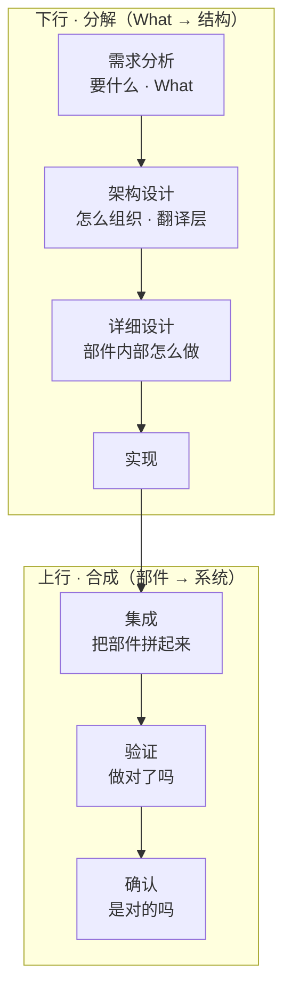
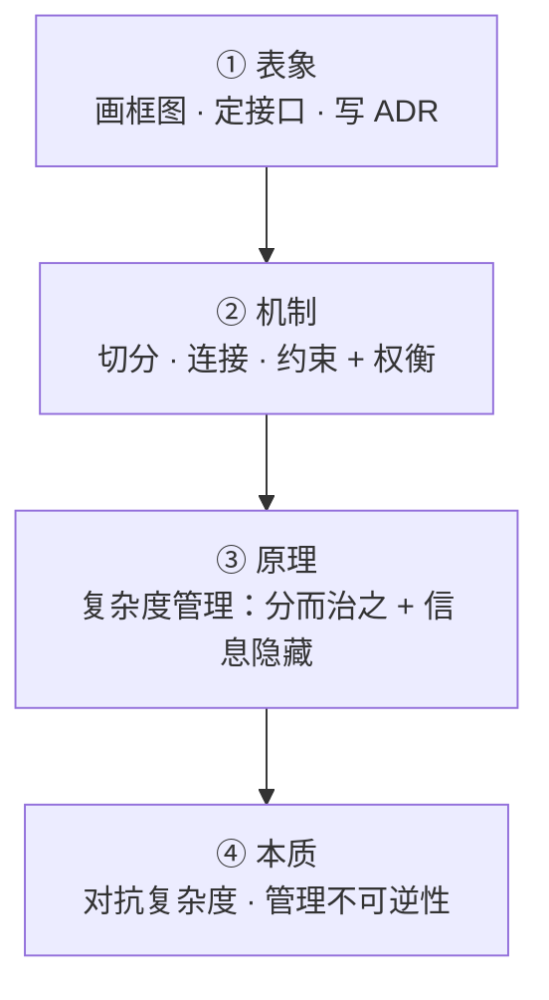
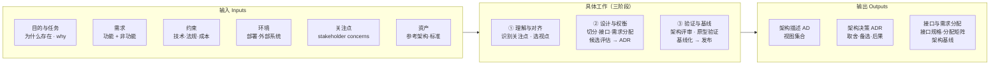
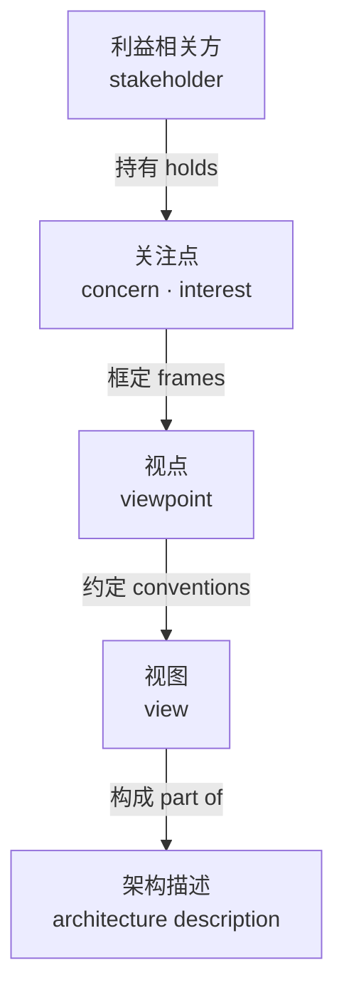
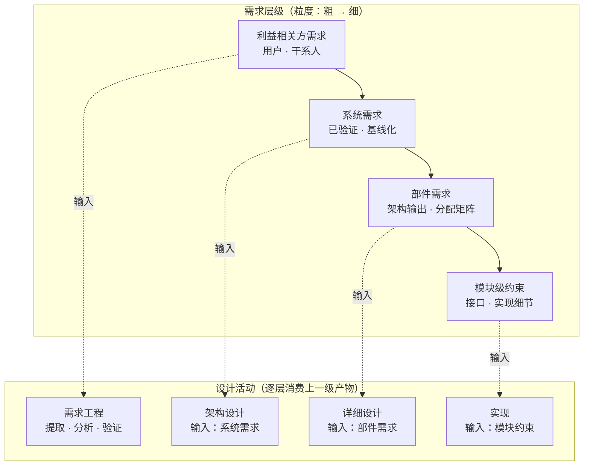
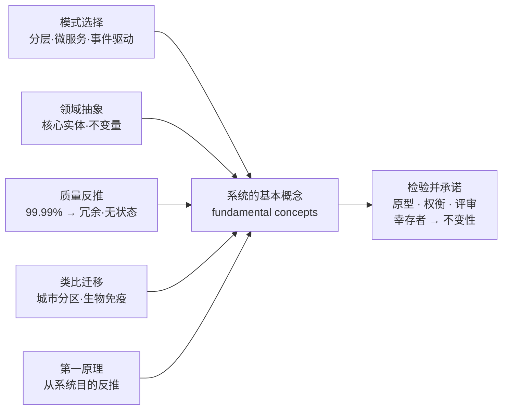
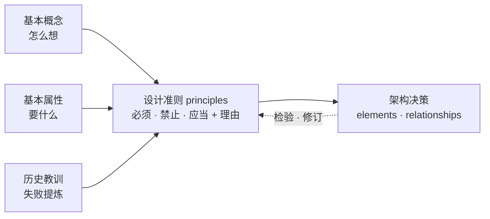

# 架构设计方法论全景 —— 从 ISO/IEC/IEEE 42010 定义到五块设计方法

> **文档说明**：本文档整理自 2026-08-21 概念探索对话（当日补充：①"定义 vs 设计"元概念辨析；②"关注点（concern）"完整展开与识别方法论），系统性回答"产品开发领域的架构设计"这一主题。
> 主线：**标准定义（42010）→ 本质 → 输入与工作（含关注点识别）→ 需求层级 → 五块设计方法（概念 / 属性 / 设计原则 / 演进原则 / 关系）→ 五块输入整合**。
> 配套标准：ISO/IEC/IEEE 42010:2011、42020:2019、ISO/IEC/IEEE 15288、ISO/IEC/IEEE 25010、ISO/IEC/IEEE 29148、ISO 704（术语工作）、ISO 9000:2015（质量管理术语）。
>
> **术语约定**（本系列统一）：
> - requirement → **需求**（need → 需要；expectation → 期望，三者不混用）
> - specified requirement → **规定需求**（验证的参照 = 规定需求，即被明示的需求）
> - ISO 9000:2015 §3.6.4：requirement = 明示的、通常隐含的或必须履行的需要或期望
>
> **补充记录（2026-08-26）**：§1.2 补 42010:2022 注；§2.4 补「判据的主从」（**目的判据居首位、起决定作用**，代价判据为从属经济校验；先过目的关、再过代价关）；§3.1 输入五类→六类（补「目的与任务」首类 + 判据/选项空间职能分组，判据侧"目的为纲、关切与需求为目"）；§3.2 新增论断 3（目的居判据首位、有否决权 + 《系统目的或任务理解确认单》入场券）；§1.5 交付物新增《系统基本概念和基本属性清单》（目的判据的裁决产物，四样交付物之纲）；§11.2/§11.3 术语表与标准索引同步。

---

## 目录

1. [架构设计是什么（定义与定位）](#1-架构设计是什么定义与定位)
2. [架构设计的本质](#2-架构设计的本质)
3. [架构设计的输入与具体工作](#3-架构设计的输入与具体工作)
4. [需求层级：架构设计与详细设计的输入差异](#4-需求层级架构设计与详细设计的输入差异)
5. [基本概念（fundamental concepts）的设计](#5-基本概念fundamental-concepts的设计)
6. [基本属性（fundamental properties）的设计](#6-基本属性fundamental-properties的设计)
7. [设计准则（principles of design）的设计](#7-设计准则principles-of-design的设计)
8. [演进准则（principles of evolution）的设计](#8-演进准则principles-of-evolution的设计)
9. [元素间关系（relationships）的设计](#9-元素间关系relationships的设计)
10. [五块设计的输入整合](#10-五块设计的输入整合)
11. [附录](#11-附录)

---

## 1. 架构设计是什么（定义与定位）

### 1.1 一句话定位

**架构设计是"把需求翻译成系统结构"的活动**——它决定系统由哪些部分组成、部分之间怎么连接、以及后续设计与演进必须遵守什么规则。它不是"画个框图"，而是产品开发中**最不可逆、返工代价最高**的那组决策。

### 1.2 标准定义

**ISO/IEC/IEEE 42010:2011 §3.2**（"架构"的权威定义，架构设计就是产生它的活动）：

> **architecture** — fundamental concepts or properties of a system in its environment embodied in its *elements*, *relationships*, and in the *principles* of its design and evolution

> **架构** = 系统在其环境中体现的基本概念或属性，落实在它的**要素（elements）**、**要素间关系（relationships）**、以及**设计与演进的原则（principles）**之中。

定义拆解为五块（本文档第 5~10 章逐一展开）：
- **基本概念**（fundamental concepts）——系统"怎么想"
- **基本属性**（fundamental properties）——系统"具备什么性质"
- **要素**（elements）——系统由什么组成
- **关系**（relationships）——要素之间如何连接
- **设计准则 + 演进准则**（principles of design & evolution）——"怎么设计对 + 怎么变而不破坏对"

> **2022 版注（2026-08-26 补）**：ISO/IEC/IEEE 42010:2022（2022-11 发布，取代 2011 版）将被架对象从 system of interest 扩展为 **entity of interest**（EoI）——企业、产品、产品族、流程、数据等皆可被架，本文档的"系统"均可读作 EoI；同时承认同一实体可有多个候选架构（供权衡分析，采纳时收敛）。定义的五块结构与本文档主线不受影响。

### 1.3 在开发流程中的位置（V 模型）

架构设计位于**需求分析之后、详细设计之前**，是 V 模型下行分解的第二个环节、上行合成的"成败决定者"——需求没分对、接口定错了，集成阶段必然爆雷。



关键点：**架构设计是唯一一个"既管下行、又决定上行成败"的环节**。业界因此称架构决策为"延迟成本最高"的决策。

### 1.4 架构设计 vs 详细设计

| 维度 | 架构设计（Architectural design） | 详细设计（Detailed design） |
|---|---|---|
| 作用对象 | 系统 / 子系统级 | 部件 / 模块内部 |
| 核心问题 | 系统如何**切分与组织** | 部件如何**实现** |
| 决策内容 | 边界、接口、权衡、原则 | 算法、数据结构、逻辑流程 |
| 变更代价 | 高——牵一发动全身 | 相对低，局限在部件内 |
| 发生时机 | 概念/方案阶段（IPD 概念→计划） | 开发阶段 |
| 典型产出 | 架构描述、视图、ADR | 详细设计说明书、类图、伪码 |
| 检验方式 | 架构评审 | 设计走查 / 代码评审 |

**一句话记法**：架构设计决定"哪些墙该砌、哪里开门"；详细设计决定"每个房间怎么装修"。墙砌错了要拆楼，装修错了重新刷一遍就行。

**横竖分工**：架构设计是**横向切**——切成几块、块之间怎么对接；详细设计是**纵向挖**——每块内部挖多深。先横后纵。

### 1.5 交付物（Artifacts）

| 交付物 | 内容 | 说明 |
|---|---|---|
| **系统目的或任务理解确认单**（2026-08-26 补） | 目的或任务原文引用 + 架构师复述理解 + 业务方确认签字 | **架构设计的入场券**——目的判据的锚点凭证；签字之前，后续一切交付物都没有判据（纯理解、零架构，见 §3.2 论断 3） |
| **系统基本概念和基本属性清单**（2026-08-26 补） | fundamental 成员资格登记表：每条注明 ① 概念/属性的定义 ② 对目的的必要性论证（不变量判据判别问句的答案）③ 到目的/需求的追溯链 | **目的判据的裁决产物**——五块设计（第 5~10 章）的总纲、架构评审的第一张核对单。清单本身基线化，条目增删走变更控制（命名取"清单"后缀 = 受控枚举，见术语纪律） |
| **架构描述 AD**（Architecture Description） | 视图 View × 视点 Viewpoint | 同一座系统，不同利益相关方看到不同"图"：每个**视点**定义一类人关心的问题集，每个**视图**是对该视点的具体表达。**架构不是一张框图，而是一组按视角组织的视图集合** |
| **架构决策 ADR** | 取舍、备选方案、后果 | 记录"为什么这么选"——补上决策的理由，防止后人（包括三个月后的自己）对决策一脸懵 |
| **接口与需求分配** | 接口规格书、需求分配矩阵 | 部件间接口定义 + 需求逐条落到部件（traceability） |

> 这三样正是**架构评审（architecture review）**逐条核查的对象。

五样的分工一句话：**确认单锚定判据（目的进场），概念属性清单裁决"什么是根本的"（目的关的产出），AD 表达"根本的长什么样"（视图集合），ADR 记录"为什么这么定"（权衡留痕），接口与分配落实"根本怎么分到部件"（追溯落地）。** 确认单是锚，概念属性清单是纲，其余三样是目——锚不定则纲不举、目不张：没有判据锚点，成员资格裁决无从谈起；没有清单，AD 的视图取舍、ADR 的决策边界都没有参照，评审只能就图论图。

### 1.6 定义 vs 设计：先分清两个词

架构领域有三个天天混用的词——需求定义、架构定义、设计定义。先厘清"定义（definition）"与"设计（design）"这对元概念，才能看懂 15288 的命名逻辑。

| 维度 | 定义 Definition | 设计 Design |
|---|---|---|
| 回答的问题 | 它是什么（what it is） | 怎么做 / 怎么造（how） |
| 语言性质 | 陈述性 descriptive（描述事实） | 规范性 prescriptive（给出方案） |
| 评价判据 | 求真：准确、无歧义、可验证 | 求优：满足需求、权衡取舍、可实现 |
| 典型产出 | 术语表、需求规格、边界、接口 | 架构视图、蓝图、详细特性、规范 |
| 代表出处 | ISO 704、15288 需求定义过程 | ISO 9000:2015 §3.4.8、15288 设计定义过程 |
| 生命周期位置 | 前端，框定**问题空间** | 中段，在**解空间**里创造 |

**词源定盘**：define ← 拉丁语 **de-finis**——de（彻底地）+ finis（界限）→ **"划出边界"**。定义 = **划界 + 陈述**：先确定它覆盖什么、不含什么，再写成精确的描述。（同源家族：concern 来自 concernere = con + cernere"筛取"→"被牵涉进来的"，见 3.5。）

**ISO 9000:2015 §3.4.8**（设计的标准定义）：
> 设计和开发（design and development）——将需求转化为产品、服务或系统的**详细特性**或**规范**的一组过程。

注意动词：设计是**转化（transform）**——输入是已定义好的需求，输出是解决方案的特性描述。它不负责说"系统是什么"，负责说"系统怎么兑现承诺"。

**四层"定义"是同一个动作**（划界 + 陈述）在不同对象上的重复：

| 定义过程 | 划什么界 | 陈述成什么 |
|---|---|---|
| 术语定义 | 与相邻概念区分 | 一句精确的陈述（ISO 704） |
| 需求定义 | 系统范围与边界 | 可验证的需求条目 |
| 架构定义 | 要素 · 关系 · 边界 | 架构描述与视图（42010） |
| 设计定义 | 各元素的规格 · 接口 | 设计特性与详细规范 |

**关键洞察**：设计本质上也是"定义"的一种——只是定义的对象从"问题/术语"换成了"解决方案"。15288 里只有"架构定义过程""设计定义过程"，没有"架构设计过程"，因为**过程以产出物命名，而产物必须被定义**（构思无法评审，描述才能评审、验证、基线化）。一句话：**设计是动词（构思），定义是它的完成时（定形）。**

---

## 2. 架构设计的本质

### 2.1 一句话本质

**架构设计是产品开发对抗"不可逆性"的机制——在信息最不完整的时候，做最难撤销的决策。**

（注意区分：第 1 章回答"它做什么"（功能定位），本章回答"它为什么存在"（本质）。）

### 2.2 论证：两个事实的矛盾

| 事实 | 内容 | 后果 |
|---|---|---|
| **信息随时间递增** | 需求永远不可能一开始就完全清楚——隐含需求、未来需求、技术变化全在之后浮现 | 决策时信息总是不足的 |
| **改动代价随时间爆炸** | 结构定下后，部件间潜在交互是 n² 量级；越晚改，要重新理解、重新验证的越多，代价指数上升 | 决策后反悔成本越来越高 |

**矛盾**：最难改的决策（切分、接口、原则），偏偏必须在信息最少的时候做。
**架构设计的本质** = 优化"决策的时间分布"——把"难改的决策"尽量提前、把"易改的决策"尽量推迟。

### 2.3 四层拆解（表象 → 本质）

| 层级 | 内容 | 说明 |
|---|---|---|
| ① 表象 | 画框图、定接口、写 ADR | 外人看到的"架构工作长什么样"，不是它为什么存在 |
| ② 机制 | 切分 · 连接 · 约束 + 权衡 | "它怎么干"（三要素） |
| ③ 原理 | **复杂度管理**：分而治之 + 信息隐藏 | 系统规模一大，部件间潜在交互 n² 级，单个头脑装不下；用 Parnas 1972 的模块划分判据把复杂度**局部化**——部件内部可以复杂，部件之间的复杂度被接口锁死 |
| ④ 本质 | **对抗复杂度、管理不可逆性** | 复杂度带来时间后果：规模越大，改动越不可逆。架构设计 = 在复杂度爆炸前做对切分，用现在的判断换取未来的自由度 |



### 2.4 关键引文（判断"什么是架构"的终极判据）

> **"Architecture is about the important stuff. Whatever that is."**
> —— Ralph Johnson（GoF 作者之一）
> 架构是关于"重要的事"的——管它是什么。

这句话把定义推到了极限：什么算"重要"？**唯一客观的判据是：改了它，代价有多大。** 难以改变的，就是架构；容易改的，不是。

> **架构 = 把"难改的"提前定义好；架构设计 = 决定哪些东西应该变成"难改的"。**

**范围问题的推论**：不同系统"架构"的边界不同——微服务里 API 契约是架构，单机脚本里连数据库 schema 都不算。**复杂度没有到达不可逆的程度，就不构成架构决策。**

**判据的主从（2026-08-26 补）**：Ralph Johnson 的判据（改动代价）是**经济属性**——它回答"为什么值得提前定"；但它不是与目的判据并列的"另一半"。**判据有严格的主从位次**：

> **目的判据居首位、起决定作用**：什么是 fundamental，由目的单独裁决——**fundamental = 对系统在其环境中的目的而言必要且充分的概念与属性**（IEV 831-01-01 Note 2，等同采用 42010:2011 §3.2）。这是架构概念集合的**成员资格判据**，没有商量余地。
>
> **代价判据是从属的经济校验**：在目的裁决出的根本集合**之内**，决定"哪些要提前锁死、锁到什么程度、哪些保留自由度"——它不产生新的架构成员，只做优先级与时机的排序。

操作化为**不变量判据**：在演化与重实现中必须守住、否则系统就沦为另一个系统（不再能达成其目的）的那些概念与属性。判别问句：「这个东西变了，系统还能不能达成它的目的——它还是不是为那个目的的这个系统？」

**顺序不可颠倒**：先过目的关（是不是根本的），再过代价关（值不值得现在定死）。两种错位都是病——用代价判据越过目的判据：把难改但无关紧要的东西误当架构；跳过代价校验：把根本的东西不分轻重全部锁死，演化窒息。

配套修正——朴素的"去除测试"（去掉就变 = 基本）会误把所有细节判进架构，须过**三重过滤**：目的层面失败（而非描述层面变化）＋角色层面不可缺（而非实例独有）＋本级被架对象视野内（元素内部细节不参与本级判定）。注意三重过滤的第一关就是目的关——判据的首位性在操作层面的体现。

配套修正——朴素的"去除测试"（去掉就变 = 基本）会误把所有细节判进架构，须过**三重过滤**：目的层面失败（而非描述层面变化）＋角色层面不可缺（而非实例独有）＋本级被架对象视野内（元素内部细节不参与本级判定）。

### 2.5 类比：围棋开局

开局时你对对手的意图了解最少，但开局落子决定了整盘格局，中盘几乎无法推翻——所以高手开局求"厚"、落子留余地。架构里对应"**保持选择权**"：好架构不是把路都铺好，而是把改不动的定死、把能改的留活。最烂的架构是"开局就把自己下死"。

---

## 3. 架构设计的输入与具体工作

### 3.1 输入六类

| 类别 | 具体内容 | 典型例子 |
|---|---|---|
| **目的与任务** ⭐（2026-08-26 补） | 系统为什么存在（why）——使命、业务目标、商业论证、问题空间 | 企业战略目标、产品定位陈述、任务书（上游：15288 业务或任务分析流程） |
| **需求·功能** | 系统要做什么（what） | 用例、功能规格 |
| **需求·非功能** ⭐ | 做到什么程度（质量属性） | "3 秒内响应"、"99.99% 可用"、"支持 10 倍扩容" |
| **约束** | 不可谈判的限制 | 指定技术栈、法规合规、成本上限、工期 |
| **环境** | 系统所处的上下文（42010 的 environment） | 部署在边缘设备、必须对接遗留系统、团队能力 |
| **关注点** | 利益相关方关心的（concerns） | 老板关心成本、运维关心可观测性、安全官关心隔离（完整展开 + 识别方法论见 [3.5](#35-关注点concern架构设计的起点)） |
| **资产** | 可复用的输入 | 参考架构、既有代码、行业标准 |

**六类的两组职能（2026-08-26 补）**：判据侧与空间侧分开——**约束、环境、资产**圈定**选项空间**（约束砍候选、环境定舞台、资产提供可继承的不变量）；**目的与任务、关注点、需求**（功能+非功能）供给**判据**。判据侧内部有严格位次，不是并列投票：**目的与任务居首位、起决定作用**——它是 fundamental 成员资格的裁决者（对目的必要且充分）；关注点与需求是目的的操作化展开——关注点源于干系人对目的的利益关切，规定需求是目的的可验证表达。三者是"**目的为纲、关切与需求为目**"的从属结构：与目的冲突的需求要么被澄清、要么被拒绝，没有和需求平级谈判的位置。两组职能对应工作六步的前两步与后两步：先用判据理解与对齐（目的先行），再在空间内设计与权衡。

### 3.2 三个必须记住的论断

1. **非功能需求（质量属性）才是架构的主要驱动**（Bass / Clements / Kazman，*Software Architecture in Practice*）。功能需求告诉你"做什么"，质量属性告诉你"做到什么程度"，而**"做到什么程度"才真正决定结构形态**：要 99.99% 可用 → 冗余与故障域设计；要 10 倍扩容 → 无状态与分片；要快速上市 → 最少部件数。功能相同的系统，质量属性不同，架构可以完全不同。
2. **输入必须是稳定的需求基线**——架构设计的输入应当是**规定需求（specified requirements）**级别的产物：经过评审、被明示、可追溯的需求。在流沙上画架构图，等于开局自损一目。
3. **输入中"目的"居判据首位、有否决权（2026-08-26 补）**——六类输入里，目的是唯一居首位的判据：需求、约束、资产都可以权衡取舍，唯有目的不能由架构师自行改写，也不能被任何其他输入对冲——判据方向永远从目的指向架构，不可逆。目的的定义权与问责在业务方（赞助人/产品管理），架构师对目的只有质询权与守护责。两个操作要点：① **入场券**——架构设计开工前，先产出《系统目的或任务理解确认单》（目的或任务原文引用 + 架构师复述理解 + 业务方确认签字；纯理解、零架构）；② **回溯义务**——发现判据缺失（目的模糊、关注点冲突）时向上游回溯澄清（42020 的架构概念化过程），而不是带着模糊目的硬架。

> **治理的本质分界（与 08 号 §九 一句话核心判据一致）**：治理 = 治理机构对组织行使指导（定方向和规矩）、监督（查执行）、问责（担责）三职能——在管理层之上定组织方向与框架；管理 = 在治理定下的框架内执行、达成运行目标。上条「目的归治理机构、架构师不定义目的」正是该分界在「目的」上的具体化——判据主从（目的居首、有否决权）不是管理层的权衡，而是治理层对目的归属的职责。

### 3.3 工作三阶段六步（迭代而非严格串行）

| 步骤 | 具体工作 | 对应输出 |
|---|---|---|
| 1 | **识别利益相关方与关注点**——搞清楚"谁在乎什么"（方法论见 [3.5](#35-关注点concern架构设计的起点)） | 关注点清单 |
| 2 | **选定视点、规划视图**（如 4+1：逻辑/开发/进程/物理/场景） | 视图规划 |
| 3 | **生成候选方案**——至少 2~3 个，不许只有一个方案就开工 | 候选架构集 |
| 4 | **权衡评估 + 记录决策**——用 ATAM / CBAM 之类方法比较候选，把"为什么"写进 ADR | ADR |
| 5 | **切分、定义接口、需求分配**——把每条需求逐条落到部件（traceability） | 结构模型 + 分配矩阵 |
| 6 | **验证与基线化**——架构评审、关键技术原型（spike）、通过后基线化进入配置管理 | 评审结论 + 架构基线 |



### 3.4 三个容易被误解的点

1. **架构工作的本质是决策，画图只是决策的记录。** 图是决策的"投影"——架构评审查的不是图好不好看，而是**决策链**：每条需求 → 每个结构选择 → 每个权衡理由，能不能串起来。
2. **最常被跳过的是第 4 步（权衡评估）和第 6 步（评审）。** 很多团队直接从 1 跳到 5，架构成了"画出来的"而不是"设计出来的"——没有候选比较、没有权衡记录、没有评审，架构就失去了它最值钱的部分：**可辩护性（defensibility）**。日后被问"为什么这么切"，拿不出 ADR，只能答"当时就是这么画的"。
3. **第 6 步的基线化直接接上配置管理**——架构基线（architecture baseline）一旦建立，后续变更就要走架构变更评审，这是 baseline 在配置管理里"冻结"语义的第一次实际应用。

### 3.5 关注点（concern）：架构设计的起点

3.3 工作六步的第一步是"识别利益相关方与关注点"——为什么排第一？因为 **concern 是 42010 概念链的起点，也是全部架构工作的"为什么"层**。

**标准定义**（ISO/IEC/IEEE 42010:2011 术语表）：
> **concern** — interest in a system relevant to one or more of its stakeholders
> 关注点 = 与系统的一个或多个利益相关方相关的、对系统的**兴趣**。

三个要素，缺一不可：**有主体**（必须挂在某个 stakeholder 名下——没有"谁在关心"，就没有 concern）、**有对象**（是对系统的 interest，而非对团队/过程的）、**本质是 interest**（特意不用 requirement——concern 是"利益相关"，不是"可验证的陈述"）。

**概念链**（concern 如何驱动架构描述）：



这条链的关键在关系动词：concern 不是"被表达"的，而是**框定（frames）视点**的——关注点决定"从哪个角度、用什么约定来表达架构"。同一个系统，性能关注点引出性能视点（负载视图），安全关注点引出安全视点（威胁模型），架构还是那个架构，视图完全不同。（类比：同一座山，游客关心风景选观景台视角，登山者关心路线选地图视角——**关注点决定取景方式，视图是拍出来的照片**。）

**辨析表**（concern 与四个邻居）：

| 概念 | 它是什么 | 与 concern 的关系 |
|---|---|---|
| stakeholder 利益相关方 | 对系统有利害关系的主体 | concern 必须挂在它名下（主体） |
| **concern 关注点** | 对系统的 interest（42010） | —— |
| requirement 需求 | 明示/隐含/必须履行的需要（ISO 9000 §3.6.4），**可验证** | concern 是需求的原料；需求是 concern 的"定义化"（呼应 1.6：定义 = 划界 + 陈述） |
| viewpoint 视点 | 为框定特定关注点而建立的表达约定（42010） | concern 决定选哪个视点 |
| view 视图 | 从特定关注点视角表达架构的工作产品（42010） | 视点构造视图，视图处理 concern |

**纠偏：concern 不是被"设计"出来的，而是被"识别"出来的。** 42010 从头到尾用的动词是 **identify（识别）**——concern 是 stakeholder 的**利益**，已存在于其头脑、组织和契约里；架构师的工作是发现、提取、陈述，而不是发明。一个"设计"出来的、没有 stakeholder 真正关心的 concern，不是架构洞察，是自嗨。识别 concern 本身就是一次"定义"（划界 + 陈述，呼应 1.6）——对象是"利益空间"。

**识别五步**：


| 步骤 | 工作 | 工具 / 要点 |
|---|---|---|
| **① 识别利益相关方** | 谁在关心 | 业务组织图、合同协议、监管机构、用户群体、开发/运维团队；洋葱模型（内核=系统角色 → 中层=直接交互方 → 外层=监管/社会环境）。**漏掉一个 stakeholder，就是漏掉一整类 concern** |
| **② 提取关注点** | 关心什么 | 访谈/工作坊、既有文档（业务计划、需求、契约）、场景分析、**遗留系统教训复盘**（上一代系统在哪翻的车，就是最真实的 concern）；防漏检查清单：ISO/IEC 25010 质量模型 + 42010 附录 A 的 concern 示例 + 法规合规检索。**合规 concern 是被"查"出来的，不是被"问"出来的** |
| **③ 划界与陈述** | 写成条目（= 定义） | 合并重叠的兴趣、区分含糊的表述，确定边界；一句话写清，**挂到 stakeholder 名下**。产出：concern 清单（catalogue） |
| **④ 组织编排** | 结构化 | stakeholder × concern 矩阵（谁关心什么）；相关 concern 分组 → 为选 viewpoint 铺路；**标记冲突组 = 权衡点（trade-off），是架构决策的主战场**——没有冲突的清单多半抽象到失去意义 |
| **⑤ 验证完备性** | 别漏 | 正向追溯（每个视图/决策都能追到 concern 吗？）；反向追溯（有 concern 没被任何视图覆盖吗？）；**清单是活的**——设计过程中不断浮现新 concern（性能不达标、合规变化、组织政治），需迭代更新 |

**好 concern 五判据**：**有主**（挂 stakeholder）· **有界**（一句话说清覆盖范围）· **可权衡**（能与别的 concern 形成取舍）· **可追溯**（驱动视图/决策）· **完备**（矩阵无空行空列）。

**三个作用**（评审架构文档时的标尺）：
1. **驱动视点选择**——架构描述的章节结构（视图集）由 concern 清单推出；缺了清单，视图集失去正当性。
2. **承载权衡**——架构设计本质是 concern 之间的取舍（性能 vs 成本、安全 vs 易用）；显式的 concern 列表 = 权衡的棋盘，缺一个棋子，决策就可能是盲的。
3. **提供架构理由（rationale）**——每个"为什么"最终都要能追溯到某个 stakeholder 的某个 concern；没有 concern，rationale 是无源之水。

**检验三问**（判断一个东西是不是 concern）：①它挂在哪个 stakeholder 名下？②它是"兴趣"而不是可验证的陈述？③它能影响视点选择或架构决策？三条都答"是"，才是。

---

## 4. 需求层级：架构设计与详细设计的输入差异

### 4.1 核心答案

**都不是"全部需求"，而是需求树上不同层级的果子。**

- **架构设计**的输入 = **系统级需求的全部**（系统粒度、已验证基线），但不是需求原文的全部——它吃的是需求工程提炼后的**系统需求**（即规定需求在系统层的形态），且吃的是"尚未分配到部件"的需求（**需求分配是架构设计自己的工作，不是输入**）。
- **详细设计**的输入 = **分配矩阵中指向该部件的需求子集 + 部件间接口契约**。它不需要全局视野。
- 机制：**需求分配（allocation）+ 可追溯性（traceability）**——"详细设计的输入 = 架构设计输出的一角"，设计链是**接力**关系。



### 4.2 质量属性的特殊性：涌现属性（emergent property）

功能需求可以逐条分配，但**质量属性是涌现属性**——"可用性 99.99%"是**整个系统**的属性，没法切碎了分给某个部件。它只能被架构**机制**满足（冗余、故障转移、隔离），再**翻译成部件级的设计约束**：

> 系统级："可用性 ≥ 99.99%"（架构输入）
> 部件级："本模块必须无状态，状态存外部存储"（架构翻译后的详细设计输入）

**质量属性不能"分"，只能"译"。** 这也是非功能需求必须在架构阶段由架构师亲自解读的原因。

### 4.3 标准支撑

**ISO/IEC/IEEE 15288** 干脆把两个过程分开定义：
- **架构定义过程（6.4.4）**：输入 = 系统需求
- **设计定义过程（6.4.5）**：输入 = 架构定义过程的输出

标准层面就承认了："下一层吃的，是上一层产出的。"

**命名玄机**：15288 用"定义"而不是"设计"命名这两个过程（没有"架构设计过程"），因为**过程以产出物命名，而产物必须被定义**——架构定义/设计定义的交付物是**描述制品**（架构描述、设计特性），构思无法评审，描述才能评审、验证、基线化（进入配置管理）。呼应 1.6：设计是动词（构思），定义是完成时（定形）；设计本质上就是"对解决方案的定义"。

### 4.4 与配置管理的呼应

这套"层级 + 分配 + 追溯"结构，正是**配置项（configuration item）划分和基线管理**的底层逻辑——每个层级的产物都是独立的配置项，各自基线化、各自受控。

---

## 5. 基本概念（fundamental concepts）的设计

### 5.1 破预设

**"基本概念"不是凭空"设计"出来的，而是"选出来 + 逼出来 + 幸存下来"的。**
90% 的情况下，架构师做的不是发明概念，而是**从已验证的概念库中选择**；剩下的 10%，是需求和质量属性**逼**着生成的。生成出来的只是"候选"，要经过检验活下来，才配叫"基本概念"。

### 5.2 四副面孔

| 面孔 | 是什么 | 例子 |
|---|---|---|
| **组织范式**（organizing paradigm） | 系统在根本上是"一种什么形态" | 分层栈、管道、事件驱动、微服务 |
| **核心抽象**（central abstractions） | 领域里"永恒"的实体与关系 | ERP 的订单-物料-库存；银行的钱-账户-流水 |
| **根本机制**（governing mechanism） | 系统赖以工作的基本机理 | 消息传递、事件溯源、状态机、共享内存 |
| **根隐喻**（root metaphor） | 用"什么眼光"看这个系统 | 城市（分区/市政）、有机体（免疫）、机器（管线） |

它们共同回答："**这个系统在概念层面，到底是什么、怎么想？**"

### 5.3 五条生成路径



| 路径 | 方法 | 说明 |
|---|---|---|
| **① 模式选择**（最常见） | 从架构模式库/参考架构"选" | 分层、管道-过滤器、事件驱动、微内核、微服务、六边形……先识别"我的问题属于哪一类"，再去货架选。选型本身就是设计——选哪个概念、为什么选它，就是第一条 ADR |
| **② 领域抽象** | 从需求中"提" | 问"剥掉所有实现细节，这个领域里什么永远成立？"——答案就是核心抽象（如"钱不能凭空多出来"是不变量 → 账务必须走流水）。DDD 的 bounded context、aggregate 干的就是这件事 |
| **③ 质量属性反推** | 约束"逼" | "99.99% 可用"→ 冗余+故障域；"10 倍扩容"→ 无状态+分片；"不可篡改"→ 只追加日志/链式结构。质量属性驱动架构的"驱动"机制就在这里 |
| **④ 类比迁移** | 从成熟领域"借" | 操作系统给了微服务"进程/调度/隔离"；城市给了模块化"分区/市政"；生物给了安全"免疫/纵深防御"。借来的概念最成熟，因为已在原领域被检验几十年 |
| **⑤ 第一原理**（兜底） | 从系统目的"推" | 当货架没有、领域太新、类比失效时，回到系统存在的**目的**：它最根本要保证什么？（如比特币从"互不信任双方无需第三方即可交易"推出"去中心化账本+共识"） |

### 5.4 深层本质：幸存者逻辑

**基本概念 = 对"不变性"的承诺。** 它之所以"基本"，正因为它是全部决策里最难改的那一层（呼应第 2 章的"难改的"）。

诞生过程是**假设-检验循环**，不是一次"设计"就完成：
1. **提出**：按五条路径生成**候选**概念（这是"设计"）；
2. **检验**：用原型（spike）、权衡分析（ATAM）、架构评审去检验候选；
3. **淘汰/幸存**：大多数候选会死掉，活下来的才升级为"基本概念"，被**命名**、被写进架构描述、成为后续所有决策的锚。

> 所以严格说：**基本概念不是"设计"出来的，是"幸存"下来的**——设计只负责把候选摆上桌，检验负责决定谁配得上"基本"二字。

**标志性现象**：概念设计完成的标志，是它有了名字——"事件溯源""六边形架构""双写分离"。一旦结构被命名，它就从想法变成了**可共享、可讨论、可传承**的概念。**命名就是概念化的完成仪式。**

### 5.5 标准分工

- **ISO/IEC/IEEE 42010** 负责**"怎么说"**——怎么描述基本概念（视图、视点、模型都是表达工具）；
- **ISO/IEC/IEEE 42020（架构过程，2019）** 负责**"怎么想"**——把架构定义过程展开，其中 **架构综合（architecture synthesis）** 正是"生成候选架构概念"的环节，后面接评估、选择。

一句话：**42010 是语法书，42020 是创作手册。**

---

## 6. 基本属性（fundamental properties）的设计

### 6.1 关键辨析：概念 vs 属性

- **概念** = "系统是什么"（骨架、范式、抽象）——可以**切**、可以**选**；
- **属性** = "系统具备什么本质特征"（可观察、可度量的表现）——**不是"设计"出来的，是"涌现"出来的**。

> **你设计的是结构，属性是结构运转之后的宏观效果。** 所以"设计属性"的正确姿势是**逆向工程**：先定目标属性（来自需求与关注点），再设计结构让属性涌现，最后验证它真的涌出来了。

类比（材料科学）：钢铁的强度、韧性、导热性是宏观属性，由微观晶格结构决定——**不能直接设计强度，只能设计微观结构让强度涌现**。架构同理：**不能直接设计"可用性"，只能设计冗余机制让可用性涌现**。属性的"设计"，本质是**结构的设计 + 涌现的验证**。

### 6.2 四步流水线


| 步骤 | 内容 | 说明 |
|---|---|---|
| **① 场景化（QAS）** | 属性从"形容词"变"可测指标" | 刺激（Stimulus）→ 环境（Environment）→ 响应（Response）→ 度量（Measure）。例："交易模块进程崩溃时（刺激），正常负载下（环境），30 秒内自动切换备用实例（响应），P99 恢复时间 ≤ 30 秒（度量）"。场景化之后的属性才是能进入设计的输入、能用于验收的标尺。这是 SEI 属性驱动设计（ADD）的起点 |
| **② 战术选择（tactics）** | 从战术库挑战术并组合 | 战术是属性的"实现单元"，模式是战术的编排 |
| **③ 结构落位（placement）** | 机制放对位置 | 属性是涌现的，**不能"切"给部件，只能"放"进结构**。同一个战术，放的位置不同，效果天差地别。属性和概念在这里第一次握手：战术要落到概念定义的骨架上 |
| **④ 验证度量** | 属性必须可测 | 负载测试验性能、故障注入验可用性、渗透测试验安全。**没度量过的属性承诺等于没有**。这正是 verification（验证："实现对不对"）的主场 |

**贯穿四步的是权衡**：属性之间天然冲突——性能 vs 安全、可用性 vs 成本、一致性 vs 延迟。**"基本属性"的设计实质就是排优先级**（ATAM 的活：把属性冲突摆到桌面上，逼出取舍）。

### 6.3 战术库示例

| 属性 | 常用战术 |
|---|---|
| 性能 | 缓存、并发、资源池化、异步、调度 |
| 可用性 | 冗余、心跳、故障转移、隔离、状态检查 |
| 安全性 | 认证、授权、加密、审计、纵深防御 |
| 可维护性 | 模块化、抽象层、标准接口、自描述 |

### 6.4 两个必须想明白的点

- **属性 vs 概念：概念定上限，属性定验收线。** 选了单体概念，横向可扩展性上限被锁死；选了微服务概念，延迟和一致性天然受限。两者互相逼迫、迭代收敛。
- **"基本"由什么定：关键性分析（criticality analysis）。** 基本属性 = **生命线属性**：系统可以平庸但不能没有的那些。飞机的安全、银行的账务准确是生命线；界面的美观不是。识别生命线属性决定权衡时的优先级与资源投向。

### 6.5 标准台账

- **ISO/IEC/IEEE 25010（SQuaRE 质量模型）**：八大质量特性——功能适用性、性能效率、兼容性、易用性、可靠性、安全性、可维护性、可移植性（属性清单有标准可查）；
- **SEI 属性驱动设计（ADD）**：从 QAS 出发、选战术、放结构元素。

---

## 7. 设计准则（principles of design）的设计

### 7.1 澄清：原则是"决策的决策"（meta-decision）

| | 来源 | 性质 | 例子 |
|---|---|---|---|
| **约束**（constraints） | 外部强加 | 不可谈判，**接受** | 法规、指定技术栈、成本上限 |
| **决策**（decisions） | 架构师选择 | 具体结构选择 | "缓存用 Redis" |
| **原则**（principles） | 架构师**自加** | 指导决策的规则 | "状态必须外置"、"禁止循环依赖" |

关键区别：约束是被迫的，原则是**自愿的自我限制**——架构师主动给自己上的纪律（因为踩过坑、或预见会踩坑）。定义里特意写 "design **and evolution**"：原则既管当下怎么设计，也管未来怎么演进（第 8 章）。

### 7.2 三个生成源



| 生成源 | 机制 | 示例 |
|---|---|---|
| **概念 → 执行细则** | 概念回答"怎么想"，原则把它落地成可判定的规矩 | 概念"无状态" → 原则"任何服务不得在本地保存会话状态（必须外置）" |
| **属性 → 必须句式** | 属性回答"要什么"，原则翻译成"因此必须怎么做" | 属性"可用性 99.99%" → 原则"任何单点故障不得导致整体不可用（禁止单点）" |
| **教训 → 禁止句式** | 失败的反向提炼；**原则的典型句式是"禁止"，因为大部分原则是禁止重蹈覆辙** | 循环依赖拖垮过项目 → 原则"模块间只允许单向依赖（禁止循环依赖）" |

（第四条源：成熟实践借鉴——SOLID、12-Factor App 这类被验证过的原则集。）

### 7.3 句式与有效性判据

**标准句式：`必须/禁止/应当 + 规则` + `理由（rationale）`**。理由不可省——没有理由的原则是教条，有理由的原则是纪律。

四条有效性判据：
1. **可判定（decidable）**：能对一个具体决策判定"它违反了吗"。"使用标准接口"可以判定，"追求优雅"不可判定——后者不配当原则。
2. **有理由（rationale）**：每条都能答出"为什么"。答不出，删掉。
3. **少而精（few）**：一般 **5~15 条**。原则太多等于没有原则。
4. **可入评审（enforceable）**：能变成架构评审的检查项（compliance check）。**原则写出来不是给人看的，是给评审用的。**

### 7.4 设计方法论：两条路径对撞

- **回顾式提炼（bottom-up）**：先做了一批决策，然后问"这些好决策背后共同的规矩是什么？"——原则是好决策的**公约数**。
- **前瞻式预设（top-down）**：从概念和属性出发，**先立规矩再让决策遵守**。

实践里两者必须对撞：先预设一批（来自概念/属性），再在决策实践中提炼修订（来自教训），最终沉淀出少量真正站得住的。原则是**宪法 + 判例的互驯**：宪法（原则）指导判例（决策），判例反过来修宪。**僵死的原则和没有原则一样有害**（如"禁止用 NoSQL"在数据模型根本变化后就该重写）。

### 7.5 一个必须守住的分寸

原则是**自加的约束**，所以它永远面对一个诱惑：**用原则代替思考**。正确的用法是——每个决策先过原则（快检），原则没覆盖的地方才进入完整权衡（慢想）。**原则负责"不需要重新想的事"，权衡负责"必须重新想的事"**。如果一条原则让团队不再权衡，它就已经从纪律退化成教条了。

---

## 8. 演进准则（principles of evolution）的设计

### 8.1 本质

**演进准则 = 设计准则的"时间维"延伸。** 设计准则管"怎么设计对"，演进准则管"**怎么变而不破坏对**"——同一个原则体系，一个管当下，一个管未来。

### 8.2 为什么必须有：架构的熵增

架构在无人管束时必然退化：

- **架构漂移（architectural drift）**：实现一点点偏离设计意图（往往是"这次赶时间"累积的）；
- **架构侵蚀（architectural erosion）**：结构性问题累积，依赖纠缠、边界模糊，直到"没人敢改"；
- **技术债（technical debt）**：捷径欠的债不断滚利息。

演进准则就是给"变"上的制度保险——**系统不是不变，而是变的方式受约束**。

### 8.3 演进准则管什么

| 准则类别 | 示例句式 | 防的是什么 |
|---|---|---|
| **兼容性** | 接口变更必须向后兼容或走版本化 | 变，但不能打断已存在的东西 |
| **可替换性** | 部件必须可独立替换 | 变，但不要牵一发动全身 |
| **渐进性** | 变更必须小步、可独立发布 | 变，但不要大爆炸式豪赌 |
| **可逆性** | 关键变更必须留回退路径 | 变，错了要能回来 |
| **受控性** | 一切变更必须走配置管理 | 变，但不能失控 |
| **审查关口** | 超规模的变更必须走架构评审 | 变，但不能悄悄侵蚀 |
| **留痕** | 变更后 ADR 与架构描述必须同步 | 变，但不能让架构失忆 |
| **技术债** | 走捷径必须记债、定还期 | 变，但不能债滚债 |

**判别设计准则与演进准则的最快方法**：这条规矩是关于"怎么建"的，还是关于"怎么改"的？（主语全是"变"的是演进准则）

### 8.4 四个生成源

| 生成源 | 机制 | 示例 |
|---|---|---|
| **① 设计准则的"时间维化"**（最直接） | 拿每条设计准则问一句"这条规矩在变更时怎么执行？" | "禁止循环依赖" → "新增依赖必须先检查依赖方向"；"状态外置" → "新增状态必须先设计存储方案"。**演进准则 = 设计准则 × 时间轴** |
| **② 质量属性反推** | 属性里有一类天然面向未来：可维护性、可扩展性、可移植性——"演进的属性" | 属性"可扩展" → 准则"新功能不得要求重写既有模块" |
| **③ 历史教训** | 演进教训杀伤力更大，因为代价在线上 | 不兼容升级搞挂过生产 → "接口变更必须双版本并行期"；大爆炸重构失败过 → "重构必须增量、可回滚" |
| **④ 配置管理纪律的翻译** | 把配置管理纪律翻译成架构语言 | 见 8.6 对照表 |

### 8.5 演进循环


**演进准则总纲：让『变』受控 · 小步 · 可逆 · 留痕。**

### 8.6 与配置管理的勾连

**演进准则 = 架构层的配置管理承诺**——两者不是两套东西，是同一套制度的两层皮：配置管理管"物"（configuration item 怎么受控），演进准则管"形"（架构怎么在受控下变形）。

| 配置管理概念 | 翻译成演进准则 |
|---|---|
| 变更管理（change management） | 一切变更受控，先请求后执行 |
| 基线（baseline） | 变更是从基线出发、到新基线为止的受控旅程（**基线是演进的地板**） |
| 版本（version） | 每次演进必须有版本足迹，可追溯（**版本是演进的足迹**） |
| 配置审计（audit） | 变更后必须核对架构描述与实际实现一致 |

### 8.7 两个分寸

1. **渐变优于突变（evolution over revolution），但要留"例外通道"。** 架构重写（renaissance）也是演进的一种——技术断代、业务剧变时走更重的流程（独立立项 + 更高级别评审）。**好准则会给自己留一条"宪法修正案"通道**，否则准则会逼出地下变更。
2. **演进准则最难的不是设计，是执行。** 违反演进准则的代价是"现在就能上线"，所以落地不靠自觉，靠**评审关口 + 工具检查**（架构符合性检查 architectural conformance checking、依赖扫描、CI 里的架构守护）。

---

## 9. 元素间关系（relationships）的设计

### 9.1 核心洞察：关系是成本

n 个要素如果全互联，是 n² 条关系——**每一条关系，都是未来变更时的一处牵动**。所以关系设计的第一原则是"**克制**"：能没有的关系就不要有。好的架构往往是**关系稀疏**的架构——关系少，独立性才强，可演进性才高（呼应演进准则的"可替换性"）。

### 9.2 关系类型学（设计关系的第一步是"定性"）

| 类型 | 例子 | 典型强度 |
|---|---|---|
| **结构关系** | 包含（part-of）、聚合、泛化（is-a）、依赖 | 强（编译期绑死） |
| **行为关系** | 调用、消息传递、事件、数据流、控制流 | 中 |
| **接口关系** | 提供/消费（provide/require）、契约 | 契约本身弱，但承载强交互 |
| **部署关系** | 逻辑要素 → 物理资源（allocation） | 视场景而定 |
| **时序关系** | 顺序、并发、同步/异步 | 中 |

（UML/SysML 的关系语汇——association、dependency、realization……就是这个分类的标准化版本。）

### 9.3 耦合光谱：关系设计的本质动作

**关系的"强度"是设计的自由变量**——同一对要素之间，可以选择强关系（同步调用、共享状态）或弱关系（事件、消息、契约）。关系设计的艺术，就是**在满足需求的前提下，把每条关系往弱的方向推**：

| 光谱位置 | 关系类型 | 代价/收益 |
|---|---|---|
| **强** | 同步调用 · 共享状态 · 编译期依赖 | 变更牵动整片 |
| **中** | 消息 · 事件 · 异步 | 解耦但保持连接 |
| **弱** | 契约 · 运行时发现 · 事件总线 | 可替换性最高 |

### 9.4 六步动作

1. **识别必要关系**——从行为流、数据流、控制流需求里提取"必须存在的连接"（谁调用谁、谁消费谁、数据从哪里来）。每记一条都问一句："真的必须吗？"
2. **分类定性**——标出每条关系的类型（结构/行为/部署/时序）。
3. **定方向**——**依赖方向是关系设计的头号决策**。健康的依赖图必须无环（DAG）：允许 A→B，就不允许 B→A。循环依赖是架构腐蚀的头号元凶，要配**环检测**。
4. **降耦合（核心动作）**——强关系降级为弱关系：同步调用 → 异步消息；直接调用 → 事件发布/订阅；共享状态 → 消息传递。每降一级，变更的牵动范围就小一圈。
5. **契约化**——把剩下的关系写成**显式契约**：接口规格、协议、时序约束、错误语义。关系必须"白纸黑字"，否则就是隐式耦合（实现之间悄悄握手）。
6. **检查**——环检测、扇入扇出（fan-in/fan-out）检查、层次合规检查、架构评审。关系的健康度是架构健康度的直接指标。

### 9.5 五条判据

- **有方向**：依赖无环（DAG），方向即权力——被依赖的一方负责稳定，依赖方负责变化；
- **够稀疏**：关系少而必要（邓巴数式的直觉：**一个部件能稳定维护的关系数量有限**，关系过多，维护成本爆表）；
- **尽量弱**：能异步不同步、能事件不调用、能契约不共享；
- **要显式**：依赖抽象，不依赖实现（依赖倒置 DIP）——关系要建立在"接口"上，而不是"具体类"上；
- **不穿越**：迪米特法则（Law of Demeter）——"**talk to your friends, not strangers**"：只与直接关联者说话，不要隔着一层关系去够另一个要素。穿越关系是隐式耦合的重灾区。

### 9.6 关系与概念、属性的握手

关系不是独立存在的——**它是概念的"具身化"，也是属性的"实现通道"**：
- 概念"管道" → 关系"数据流沿管道流动"；概念"分层" → 关系"层间单向依赖"；
- 属性"可用性 99.99%" → 关系"主备切换 + 心跳"；属性"性能" → 关系"缓存调用路径"。

**概念定"有哪些骨架"，属性定"骨架要有什么性质"，关系定"骨架怎么连起来才具备这些性质"。**

**类比（布线）**：元件（要素）放好了，线（关系）怎么走决定机器的可维护性——线越少、越直、越有规矩（走线槽、分颜色、单向走），机器越好修。乱拉线（穿越、交叉、隐式搭接）的机器，谁都不敢碰。

---

## 10. 五块设计的输入整合

### 10.1 元结构：外部原始输入 + 内部级联

**五块的输入不是并列的**，分两个来源：
- **外部原始输入**：需求（功能/非功能）、约束、关注点、环境、资产——从外部进入架构活动；
- **内部派生输入**：前面层的输出——形成一条**内部输入链**。

> **只有"基本概念"直接面对外部原始输入；越往后的块，输入里"内部成分"占比越高。**


### 10.2 五块输入清单（加粗 = 内部派生输入）

| 设计块 | 外部原始输入 | 内部派生输入 | 一句话说明 |
|---|---|---|---|
| **基本概念** | 功能需求、质量属性需求、约束/法规、关注点、环境、资产/参考架构、系统目的、领域知识 | —（最底层） | **唯一直接面对原始世界的层**，其余四块都吃它的输出 |
| **基本属性** | 非功能需求、法规合规、业务目标、关注点 | **概念**（限幅） | 属性受概念约束：概念定上限，属性定验收线 |
| **设计原则** | 历史教训、组织信条、行业最佳实践 | **概念 + 属性**（执行细则） | 原则是概念/属性的"必须·禁止·应当"句式化 |
| **演进原则** | 生命周期预期、配置管理规范、运维现实、组织变更能力、市场趋势 | **设计原则**（时间维化） | 演进原则 = 设计原则 × 时间轴 + CM 纪律翻译 |
| **元素关系** | 行为/数据流需求、部署环境、接口/协议标准 | **概念 + 属性**（具身化） | 关系是概念的具身化、属性的实现通道 |

### 10.3 内部链总结

```
概念 →(限幅) 属性 →(细则) 设计原则 →(时间化) 演进原则
概念 + 属性 →(具身) 关系
```

### 10.4 推论

1. **只有概念是"翻译"，其余是"翻译的翻译"。** 概念直接接触需求原文、约束、市场；属性已把概念当成"已知前提"；原则和关系吃的是提炼物。**概念设计错了，后面四块全部跟着错，而且错得越来越远**——概念阶段值得最重的人力。
2. **内部链是一条"失信放大器"。** 每一层的输出质量 = 上一层输入质量 × 本层加工质量。**输入链断裂的症状**：设计原则不是从概念/属性提炼的，而是抄来的——于是原则和架构互相矛盾（概念说"无状态"，原则却是抄来的"共享缓存"）。评审时发现原则跟概念对不上，基本可以断定链断过。
3. **反向校验是免费的架构体检。** 因为输入有内部依赖，可以**从后往前核查**：逐条问"这条关系服务于哪个属性？这个属性被哪个概念限幅？这个原则从哪个概念/教训提炼？"——答不出来的，就是架构里的"无源之水"。**ADR 的价值在此再次显现：它是这条输入链的书面凭证。**
4. **与需求层级的呼应**：不仅需求有层级，**设计输入也有层级**——外部输入是"原材料"，内部输入是"半成品"，每一层设计消费的是上一层的产物（ISO/IEC/IEEE 15288 正是这样设计的）。

---

## 11. 附录

### 11.1 类比集锦

| 类比 | 用途 | 要点 |
|---|---|---|
| **建筑** | 架构 vs 详细设计 | 架构 ≈ 总平面 + 结构体系；详细设计 ≈ 施工图、钢筋表。墙砌错了拆楼，装修错了重刷 |
| **乐队** | 架构 vs 详细设计 | 架构 ≈ 编制与曲式结构；详细设计 ≈ 指法弓法 |
| **围棋开局** | 架构本质 | 信息最少时落子，求"厚"、保持选择权；好架构把改不动的定死、把能改的留活 |
| **材料科学** | 属性设计 | 钢铁强度是宏观属性，由微观晶格结构决定——设计微观结构让强度涌现 |
| **宪法 vs 判例** | 原则设计 | 原则指导决策，决策实践反过来修订原则（宪法修正案式，慎重但不僵死） |
| **家规** | 原则设计 | 几乎所有的"禁止"都来自踩过的坑 |
| **布线** | 关系设计 | 线越少、越直、越有规矩，机器越好修；乱拉线的机器谁都不敢碰 |
| **邓巴数** | 关系设计 | 一个部件能稳定维护的关系数量有限，关系过多维护成本爆表 |
| **军队** | 需求层级 | 司令部吃全部战略目标，师长只吃分配的任务 |
| **翻译** | 输入层级 | 概念是"整本书目录级摘要的翻译"，详细设计是"分配到章节的提纲的翻译" |
| **身份证 vs 施工图** | 定义 vs 设计 | 定义像给系统办身份证（姓名/边界/对世界承诺什么，判据=描述得准不准）；设计像画施工图（结构/材料/管线怎么走，判据=能不能兑现承诺） |
| **相机取景** | 关注点→视点→视图 | 同一座山：游客关心风景用观景台视角，登山者关心路线用地图视角——关注点决定取景，视图是拍出来的照片，山还是那座山 |

### 11.2 术语表（中英对照）

| 中文 | English | 出处/说明 |
|---|---|---|
| 架构 | architecture | ISO/IEC/IEEE 42010:2011 §3.2 |
| 架构描述 | architecture description (AD) | 42010 |
| 定义 | definition | 拉丁语 de-finis = 划界 + 陈述；ISO 704（术语工作） |
| 设计 / 设计和开发 | design / design and development | ISO 9000:2015 §3.4.8（将需求转化为详细特性或规范的过程） |
| 关注点 | concern | 42010：interest in a system relevant to one or more of its stakeholders |
| 视点 / 视图 | viewpoint / view | 42010（视点=为框定关注点而建立的表达约定；视图=从关注点视角的表达） |
| 架构决策记录 | architecture decision record (ADR) | 实践术语 |
| 要素 / 关系 / 原则 | elements / relationships / principles | 42010 定义三件套 |
| 设计准则 / 演进准则 | principles of design / of evolution | 42010 定义 |
| 基本概念 / 基本属性 | fundamental concepts / properties | 42010 定义 |
| 质量属性（非功能需求） | quality attribute / non-functional requirement | Bass et al. |
| 涌现属性 | emergent property | 系统整体属性，不可分配只能翻译 |
| 需求分配 / 可追溯性 | requirements allocation / traceability | 15288 |
| 利益相关方 | stakeholder | 42010（持有 concern 的主体） |
| 架构综合 | architecture synthesis | ISO/IEC/IEEE 42020:2019 |
| 权衡分析方法 | ATAM（Architecture Tradeoff Analysis Method） | SEI |
| 属性驱动设计 | ADD（Attribute-Driven Design） | SEI |
| 战术 | tactics | ADD |
| 质量属性场景 | quality attribute scenario (QAS) | ADD |
| 规定需求 | specified requirement | 按本项目术语约定（验证的参照） |
| 需求 / 需要 / 期望 | requirement / need / expectation | ISO 9000:2015 §3.6.4 |
| 架构漂移 / 侵蚀 | architectural drift / erosion | 演进退化 |
| 技术债 | technical debt | — |
| 配置项 / 基线 / 版本 | configuration item / baseline / version | 配置管理 |
| 被架对象 / 关注实体 | entity of interest (EoI) | 42010:2022（由 system of interest 扩展；企业/产品/流程/数据皆可被架） |
| 不变量判据 | invariance test | fundamental 的操作化：演化与重实现中必须守住、否则系统沦为另一个系统的概念与属性（2026-08-26 补） |
| 目的漂移 | purpose drift | 目的悄然变化而架构未跟随——架构失效的第一病因；目的变更 = 架构重审强制触发器（2026-08-26 补） |
| 系统目的或任务理解确认单 | — | 架构设计的入场券：原文引用+复述理解+业务方签字，纯理解零架构（2026-08-26 补，见 §3.2 论断 3） |
| 系统基本概念和基本属性清单 | — | fundamental 成员资格登记表：定义+对目的的必要性论证+追溯链；目的判据的裁决产物、五块设计总纲（2026-08-26 补，见 §1.5） |

### 11.3 标准索引

| 标准 | 主题 | 本系列中的角色 |
|---|---|---|
| ISO/IEC/IEEE 42010:2011 | 架构描述（architecture description） | 架构定义的权威来源；管"怎么说"；concern 定义的出处 |
| ISO/IEC/IEEE 42010:2022 | 架构描述（第 2 版，取代 2011 版） | EoI 取代 SoI（企业/产品/流程/数据皆可被架）；承认多候选架构（2026-08-26 补） |
| IEV 831-01-01 | 电工词汇·智慧城市基础概念 | architecture 词条（源自 42010:2011 §3.2）；Note 2：fundamental 集合对系统目的必要且充分——目的判据的出处（2026-08-26 补） |
| ISO/IEC/IEEE 42020:2019 | 架构过程（architecture processes） | 管"怎么想"——架构综合生成候选架构 |
| ISO/IEC/IEEE 15288 | 系统生命周期过程 | 架构定义过程（6.4.4）vs 设计定义过程（6.4.5）；需求分配与追溯；"定义"命名逻辑（过程以产物命名） |
| ISO/IEC/IEEE 25010 | 系统与软件质量模型（SQuaRE） | 八大质量特性清单（concern 提取的防漏检查清单） |
| ISO/IEC/IEEE 29148 | 需求工程 | 需求层级与规格 |
| ISO 704 | 术语工作——原则与方法 | definition（定义）的权威来源：对概念的表征 |
| ISO 9000:2015 | 质量管理术语 | requirement 定义（§3.6.4）；design and development 定义（§3.4.8） |

### 11.4 关键引文

1. **ISO/IEC/IEEE 42010:2011 §3.2**（架构定义）：
   > fundamental concepts or properties of a system in its environment embodied in its elements, relationships, and in the principles of its design and evolution

2. **Ralph Johnson（GoF）**（架构 = 重要的事）：
   > "Architecture is about the important stuff. Whatever that is."

3. **一句话钉死**（本质）：
   > 架构 = 把"难改的"提前定义好；架构设计 = 决定哪些东西应该变成"难改的"。

4. **迪米特法则**（关系设计）：
   > "talk to your friends, not strangers"——只与直接关联者说话。

5. **材料科学类比**（属性设计）：
   > 不能直接设计强度，只能设计微观结构让强度涌现；架构同理，不能直接设计"可用性"，只能设计冗余机制让可用性涌现。

6. **ISO/IEC/IEEE 42010:2011**（关注点定义）：
   > concern — interest in a system relevant to one or more of its stakeholders

7. **ISO 9000:2015 §3.4.8**（设计定义）：
   > 设计和开发——将需求转化为产品、服务或系统的详细特性或规范的一组过程。

8. **一句话钉死**（定义 vs 设计）：
   > define ← de-finis（划出边界）；定义 = 划界 + 陈述。设计是动词（构思），定义是它的完成时（定形）。

---

*本文档结束。后续可扩展方向：① 拿 AOS 具体子系统做一次完整实操（概念五路径 → 属性四步 → 要素切分 → 关系布线 → 准则提炼 → 基线化）；② review vs verification vs validation 对比（在案欠项）；③ 42020 架构过程完整展开；④ concern 清单实例化（stakeholder × concern 矩阵模板，用于 AOS 具体子系统）。*
