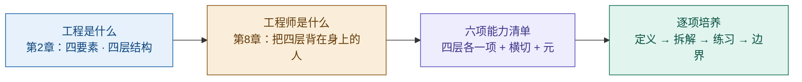
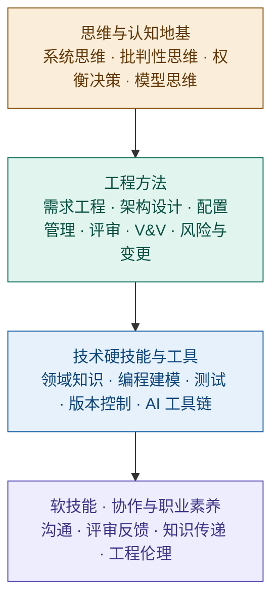
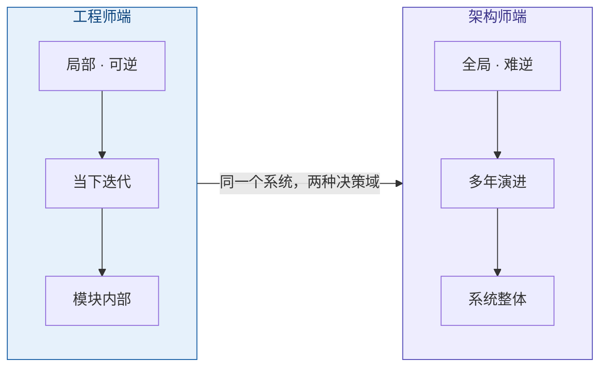
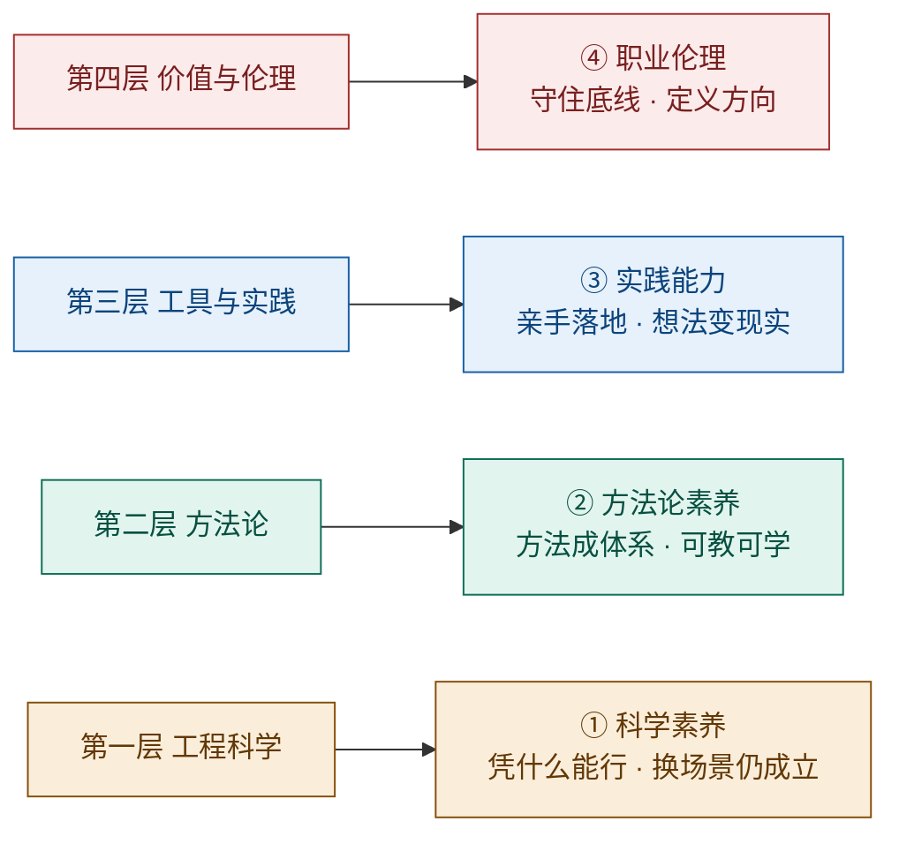
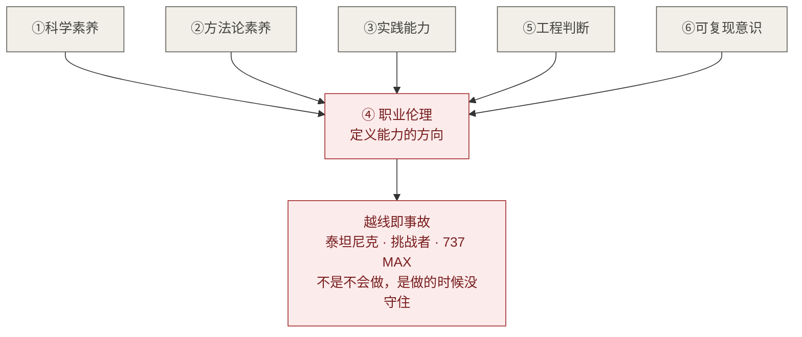
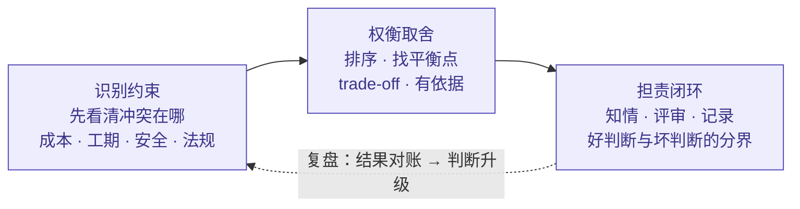
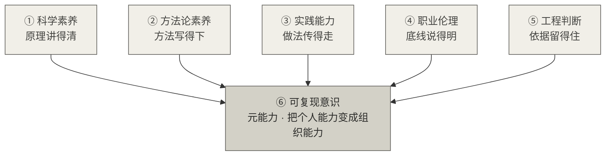
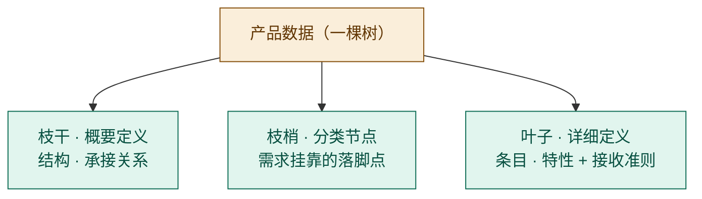

# 工程师六项能力精讲：从工程定义到能力培养

> **整理日期**：2026-08-21
> **主题**：工程师 / 六项能力 / 科学素养 / 方法论素养 / 实践能力 / 职业伦理 / 工程判断 / 可复现意识 / 工程师与架构师 / 产品数据
> **说明**：本文档由一次连续的概念对话整理而成，所有图表均以 Mermaid 实现，支持 Typora / Obsidian / GitHub / VS Code 等渲染器直接显示。与《教材书/02-第2章-工程.md》《教材书/08-第8章-工程师.md》《12-工程师与架构师能力精讲》互为姊妹篇；本文档侧重"六项能力的逐项拆解与培养练习"。

## 目录

1. [总览：从"工程是什么"到"工程师要会什么"](#1-总览从工程是什么到工程师要会什么)
2. [工程师技能的分层框架](#2-工程师技能的分层框架)
3. [工程师与架构师：两种决策域](#3-工程师与架构师两种决策域)
4. [核心推导：工程四层 → 工程师六项能力](#4-核心推导工程四层--工程师六项能力)
5. [三个领域：系统工程 / 软件工程 / 硬件工程](#5-三个领域系统工程--软件工程--硬件工程)
6. [六项能力逐项精讲](#6-六项能力逐项精讲)
   - [6.1 ① 科学素养](#61--科学素养)
   - [6.2 ② 方法论素养](#62--方法论素养)
   - [6.3 ③ 实践能力](#63--实践能力)
   - [6.4 ④ 职业伦理](#64--职业伦理)
   - [6.5 ⑤ 工程判断](#65--工程判断)
   - [6.6 ⑥ 可复现意识](#66--可复现意识)
7. [交叉验证：五要素 / ABET 7 条 / 术语分层](#7-交叉验证五要素--abet-7-条--术语分层)
8. [清单用法：六把尺子 / 成长路径 / 失败四式](#8-清单用法六把尺子--成长路径--失败四式)
9. [全篇速查：一张表带走](#9-全篇速查一张表带走)
10. [能力的最终载体：产品数据（文档）](#10-能力的最终载体产品数据文档)
11. [一句话总结全文](#11-一句话总结全文)

---

## 1. 总览：从"工程是什么"到"工程师要会什么"

这条认知链贯穿全文：**先有"工程"的定义，才有"工程师"的画像；工程师的技能清单不是拍脑袋列的，是从工程概念里长出来的。**



*图 1｜认知链：工程定义 → 工程师画像 → 六项能力 → 培养*

**先立住工程的定义**（第2章，四要素）：

> **工程 = 科学原理 × 判断创造，在约束下，用系统方法，造出有用且安全的东西。**

四要素各司其职：科学原理是"料"，约束是"框"，系统方法是"路"，有用且安全是"果"。缺了"料"是空谈，缺了"框"是失控，缺了"路"是碰运气，缺了"果"是自娱自乐。

---

## 2. 工程师技能的分层框架

从"通用视角"看，工程师技能是一个分层体系——**底层是思维方式，中层是工程方法，上层才是具体技术和工具**：



*图 2｜分层框架：技术栈决定走多快，工程方法决定走多稳，思维地基决定走多远*

**一句话**：技能清单的意义不在"背下来"，在于拿来对照自己——哪层是短板，短板往往在下一层。

---

## 3. 工程师与架构师：两种决策域

一个常见的误解：**工程师 = "还没当上架构师的架构师"**。不是职级高低，是两种决策域。

**权威锚点（SWEBOK）**：设计分两层——**架构设计（architectural design）**管系统级结构、组件划分、接口契约、技术选型；**详细设计（detailed design）**管模块内部、算法、数据结构、接口实现。**架构师主战场在第一层，工程师主战场在第二层 + 实现 + 验证。**

| 维度 | 工程师 | 架构师 |
|---|---|---|
| 决策 | 局部、可逆、低成本 | 全局、难逆、高代价 |
| 时间视野 | 当下迭代 | 多年演进 |
| 视野 | 深（模块内） | 广（系统级） |
| 核心问题 | 怎么实现才正确、够快、可维护 | 系统怎么分、边界在哪 |
| 失败代价 | 修 bug、局部返工 | 结构性返工、推倒重来 |



*图 3｜决策光谱：工程师横着做深，架构师横着铺广——没有高低，只有分工*

**判断一个工程师好不好，不看他知道多少架构，而看他负责的那块是不是无可挑剔。**

---

## 4. 核心推导：工程四层 → 工程师六项能力

### 4.1 工程的四层结构（第2章）

工程是一个完整的人类实践，有四层，缺一层都不是完整的工程：

```
第四层 价值与伦理  为了什么？安全 / 可靠 / 负责   ← 最容易被忽略、最致命的一层
第三层 工具与实践  用什么做？CAD / 编译器 / 测试链
第二层 方法论      怎么组织？需求 → 设计 → 实现 → 验证 → 维护
第一层 工程科学    依据什么？原理 / 模型 / 定律
```

| 缺哪层 | 后果 |
|---|---|
| 工程科学 | 只会做，不知道为什么——换场景就抓瞎 |
| 方法论 | 靠人传人——人走了，方法走了 |
| 工具实践 | 方法论悬空——有想法，落不了地 |
| 价值与伦理 | 事故——泰坦尼克、挑战者、737 MAX |

**缺前三层是"不专业"，缺最后一层是"会出事"。**

### 4.2 六项能力清单（第8章）

工程不会自己成立，靠**工程师**这个人撑起来。四层结构长在人身上，就是六项能力——**前四项与四层一一对应，⑤横切四层，⑥是元能力**：



*图 4｜四层各长一项能力；⑤工程判断横切四层（任何一层都需要取舍）；⑥可复现意识是元能力（管着全部）*

**六项能力总表**：

| 能力 | 对应层 | 缺了会怎样 | 底层概念 |
|---|---|---|---|
| ① 科学素养 | 工程科学 | 换场景就抓瞎，只会套模板 | "凭什么能行"——应用原理求有用，不是发现原理 |
| ② 方法论素养 | 方法论 | 靠人传人，人走方法走 | systematic 有章法 ≠ algorithmic 算法化，留判断空间 |
| ③ 实践能力 | 工具与实践 | 有想法落不了地 | 自动化提纯判断：机器接执行，人接最难判断 |
| ④ 职业伦理 | 价值与伦理 | 会出事——三大事故 | 能力不中性，④定义方向；失守三判据：知情/评审/记录 |
| ⑤ 工程判断 | 横切四层 | 有流程也选不对 | 约束越多判断越值钱；判断不能写全成规则 |
| ⑥ 可复现意识 | 元能力 | 手艺——你在质量在，你走质量走 | 试金石的个人版：换个人能交付，才是工程 |

**关键反转**：技术栈（编码/建模/工具）只是③实践能力的"载体"——**"会写代码"不是判据，就像"会用刀"不是厨师**。清单的重心在判断（⑤）与责任（④），不在技能树。

---

## 5. 三个领域：系统工程 / 软件工程 / 硬件工程

三者**共用同一内核（四要素）**，区别在各层权重不同：

| 领域 | 工程特征（第2章） | 技能侧重 |
|---|---|---|
| **系统工程** | **元工程**：整合部件、管接口、系统级验证，不造部件 | ① + ⑤ 最重：接口管理、**涌现意识**（部件全对≠系统对）、全生命周期（工程系统⊃技术系统，人/流程/组织也是系统一部分） |
| **软件工程** | IEEE 610.12 定义源头，工程化**六方面**（有结构/有方法/可重复/全覆盖/受控/可验证） | ② + ③ 最重：方法论与工具实践层是主战场；"受控"和"可验证"是软件工程的强调 |
| **硬件工程** | 物理约束最硬（力学/材料/制造/安全裕量） | ① + ④ 最重：工程科学层权重最高；安全伦理是红线 |

**一句话**：系统工程管"缝"，软件工程管"过程"，硬件工程管"物理"——六项能力一样都不能少，只是权重不同。

---

## 6. 六项能力逐项精讲

> 每项按同一结构展开：**先正名（它不是什么）→ 拆解（它是什么）→ 怎么培养（练习）→ 边界（防跑偏）**。

### 6.1 ① 科学素养

**先正名**："科学素养"在工程语境和科普语境是两个意思：

| | 科普/通识语境 | 工程语境（第8章 ①） |
|---|---|---|
| 英文 | scientific literacy | 工程科学层长在人身上的能力 |
| 对象 | 公众 | 工程师 |
| 定义 | 理解科学、识破伪科学 | **"我做的东西凭什么能行？换个上下文还成立吗？"** |
| 判据 | 不被忽悠 | 换场景不抓瞎、不只会套模板 |

第2章说死：**"方法论不告诉你为什么这样能行。没有力学定律，土木工程师只是个会搭积木的人；没有算法理论，软件工程师只是在瞎调参数。"**

**拆解：三个动作**——① 理解原理（不是背公式，知道成立逻辑）；② 判断边界（成立条件、失效场景——"换上下文还成立吗"是判据）；③ 应用建模（把场景简化成模型、量化、数量级估算）。

**培养循环**（核心：预测对账。没有预测的实践不产生科学素养，只有"调参数调到对"——那是手艺）：


*图 5｜科学素养培养循环：落点是第2章"错误可见"——要能看见偏差，不是假装零错误*

| 练习 | 动作 | 练的是 |
|---|---|---|
| 反向追问 | 每个"能用的工具"问一句"凭什么" | 原理理解 |
| 边界地图 | 给常用原理各写 3 条成立条件 + 3 条失效场景 | 边界判断 |
| 数量级估算 | 不查资料，先推量级（费曼式） | 模型应用 |
| 预测对账 | 改动前写下预测，事后对账找偏差来源 | 预测验证 |
| 失效分析 | 研究事故案例，找"哪条原理越了界" | 边界 + 复盘 |
| 费曼输出 | 把原理讲给外行听，讲不通就是没懂 | 整合 |
| 读一手源 | 教科书、标准、论文原文，替代二手博客 | 原理理解 |

**关键区分**：判断一个人的科学素养，就看他面对"没遇过的情况"时——**从原理推，还是翻旧经验，还是信玄学**。

### 6.2 ② 方法论素养

**先正名**：方法论素养 ≠ 会背方法论名词（敏捷/瀑布/CMMI 张口就来，那是"方法论词典"）。第2章排过序：

> **方法（method）< 方法论（methodology）< 工程（engineering）**——方法论是"关于怎么组织工作、怎么选方法的系统学说"。

方法论素养是**"把工作组织成方法的能力"**：能设计过程、能写成标准、能让人照做、能检查过程是否真在跑。它的反面是第8章那句——**"靠人传人，人走方法走"**。

**拆解：三个动作**——① 过程设计（每步有明确的输入、输出、检查点——系统化四特征：有结构/有章法/可重复/全覆盖）；② 显性化（把个人做法写成文档、规则、标准，可教可学——试金石）；③ 过程治理（检查过程在不在跑、识别偏差、改进过程——六方面里的"受控"与"可验证"）。

**转化路径**（从隐性判断到组织能力，每步都有风险）：


*图 6｜转化路径：风险——写不出的死于"人走方法走"，写了没人看的死于"装饰"，写过头死于"算法化"*

| 练习 | 动作 | 对应环节 |
|---|---|---|
| 写 SOP | 把你最近一次做对的事写成标准操作程序 | 显性化 |
| 换人演练 | 把写好的方法交给同事照做，看结果打几分 | 标准化 |
| 三问审计 | 现有流程过三问：每步有输入输出吗？有可检验检查点吗？换执行者稳定吗？ | 过程设计 |
| 找断点 | 找现有流程里"没有检查点"的环节（大概率是事故多发处） | 过程治理 |
| 方法论对比 | 挑两种方法论说清各自适用边界——练"怎么选方法" | 过程设计 |
| 读标准原文 | 读 ISO 9001 程序文件、IEEE 1028 评审流程 | 显性化 |
| 留白练习 | 故意给流程留一个"规则没覆盖的地方"，练习在那里判断 | 防算法化 |

**两条边界**：① 会背名词 ≠ 有素养（恒信万晖全上敏捷/CI/CD，但"先上再说"既没变更控制也没容量验证）；② 有章法 ≠ 算法化——**方法必须留判断空间**，写过头就退化成"技术员照单执行"。

### 6.3 ③ 实践能力

**先正名**：实践能力 ≠ 会写代码/会画图——第8章反复敲打：**"写代码是工程师的载体，不是判据"**。实践能力 = **亲手把方案变成现实、让方法落地生根的能力**：把"想法"变成"能用的东西"，且东西坏了能修好。体检问题：**"我最近一次亲手落地，是什么时候？"**

**拆解：三个动作**——① 动手实现（设计/方案 → 现实制品：代码、图纸、电路、样机）；② 工具驾驭（编辑器、调试器、CI、CAD、测试环境——"方法论必须落地成工具和动作才产生价值"）；③ 排错集成（不 work 时能定位；把部件接起来跑通——第2章"涌现属性"：缝里的问题靠实践发现）。

**强度光谱**（实践只能从"做"里长出来，读和听几乎不产生它）：


*图 7｜只有后两级长出真正的实践能力：独立做让判断进场，救火练排错定力*

| 练习 | 动作 | 练的是 |
|---|---|---|
| 最小可运行 | 任何事都先做一个能跑的骨架再迭代 | 落地思维 |
| 从零复现 | 不复看答案，独立复现一个已知功能/作品 | 独立做 |
| 主动救火 | 接"没人愿意接的坑" | 排错定力 |
| 故障注入 | 故意弄坏刚做好的东西，再定位修复 | 调试肌肉 |
| 集成接缝 | 把别人的/旧系统的部件接起来跑通 | 集成能力 |
| 工具深潜 | 从"会用"挖到"懂原理" | 工具驾驭 + ① |
| 限时交付 | 给自己定硬期限，出可用结果 | 落地压强 |

**三条边界**：① 不是埋头苦干（做完要显性化，配合⑥，否则是水忠的手艺）；② 不是工具集（换个工具就抓瞎，说明缺的是①科学素养）；③ 自动化时代它更值钱（机器接执行，人接住的是判断密度最高的执行）。

### 6.4 ④ 职业伦理

**先正名**：职业伦理 ≠ 道德说教，更不是规章制度。它是**"工程师"这个身份的定义性特征**——ABET 把工程定义为 **the profession**（职业，不是 job 也不是 skill）；NSPE 伦理准则：工程师的服务**必须致力于保护公众健康、安全与福祉**（public health, safety, and welfare）。

第8章说狠：**"能力不是中性的，④定义能力的方向。"** ①②③⑤⑥决定你能做成多大的事，④决定这些事朝哪个方向——没有④，能力越强越危险（737 MAX 里不缺"会算的工程师"，缺"守住底线的工程师"）。

**拆解：两个功能 + 一把尺**：

| 功能 | 含义 |
|---|---|
| 定义方向 | 能力是"选择的规模"，伦理是"选择的方向"——把能力导向公众安全福祉，而不是进度/业绩 |
| 守底线 | 在压力面前不越线——价值层失守从来不是"不会做"，是"做的时候没守住" |

**当场可打勾的尺子（失守三判据）**：一次妥协算不算"客观原因"，问三句——**相关方知不知情？有没有评审？有没有记录？** 客观原因不留记录；价值层失守恰恰发生在"没有记录"的地方。



*图 8｜能力在④这条红线上运转，越线即事故*

**怎么培养——为什么说"不靠练，靠守"**：前五项都是"增量型"能力，④不是——它不能通过"多做练习"增值，只能通过**"在压力下不越线"来证明**。但"守"的肌肉可以训练：

| 练习 | 动作 | 练的是什么 |
|---|---|---|
| 灾难复盘 | 复盘三大事故 + 自己团队的真实妥协案例，逐条过三判据 | 识别"失守"长什么样 |
| 情境预演 | 模拟压力场景，练习说"不" | 第一次为可靠性说不 |
| 决策留痕 | 每次做取舍主动记录：谁知情了？评审了吗？留记录了吗 | 把"守"变成可检查动作 |
| 红线段位 | 写下自己的不可越线清单：安全、合规、隐私、数据真实性 | 先划线，才谈得上守线 |
| 签字自问 | 每次妥协前问：如果这被公开，我敢签字吗？ | 压垮侥幸心理 |
| 机制兜底 | 把评审、记录制度化——不靠个人自觉，靠流程锁死 | 守底线 + 制度双保险 |
| 读准则原文 | 读 NSPE / IEEE Code of Ethics 原文 | 知道底线写在哪儿 |

**三条边界**：① 不是规章清单（规则背不完，压力时刻判断要在场）；② 不是风险管理（风险管理算概率，伦理定立场——哪怕概率极低，红线也不能越）；③ 不是服从组织（NSPE 要求对**公众**负责，不是对老板负责——挑战者号里工程师反对发射、管理者施压）。

**与工程体系的咬合**：评审、记录、基线这些机制，本质上就是把"守底线"从个人自觉变成组织动作——变更控制闭环（无 CR 不得变更、不分析不得上会、验证通过方可关闭）就是④的工程化形态。

### 6.5 ⑤ 工程判断

**先正名**：工程判断 ≠ 会做决定。第8章设定很扎心：**万晖不是没有判断力，"先上再说"本身就是个判断——问题是那是坏的判断**（做了取舍，却没让相关方知情、没走评审）。工程判断 = **在约束下做对的取舍**，有权威出处：ABET 定义是 **applied with judgment**（运用判断力加以应用）；12-精讲列为工程师五要素之一——约束冲突时做 trade-off（与技术员的分界）。

**拆解：三步闭环**：



*图 9｜判断的质量不只看选得对不对，还看有没有让人知情、走评审、留记录——这是⑤和④的交界*

**怎么培养——判断力是唯一"必须亲自做错"的能力**：它不能教，只能长；生长点不是"决定"，是**复盘**：

> **做错的决定 + 认真复盘 > 做对的决定 + 不复盘。**

| 练习 | 动作 | 练的是什么 |
|---|---|---|
| 决策日记 | 每个重要取舍记下来：哪些约束在打架？选了哪个？后果？重来选什么？ | 复盘（最核心） |
| 约束清单 | 做决定前先列出全部约束 | 识别约束 |
| trade-off 画像 | 把冲突量化：多花 10% 成本换 30% 可靠性，值不值？ | 权衡取舍 |
| 案例裁决 | 拿恒信"先上再说"、挑战者号发射决策，先自己裁决再对答案 | 无风险的判断练习 |
| 留白识别 | 找流程没覆盖的地方，练习在那里判断 | 规则留白处 |
| 反事实推演 | 对已做的决定问"当时选另一个会怎样" | 权衡的广度 |
| 三判据自检 | 每次判断后过三问：知情？评审？记录？ | 判断与伦理的交界 |

**三条边界**：① 不是直觉/拍脑袋（判断要有依据——informed judgments，直觉只是线索）；② 不是规则/决策树（**判断不能写全成规则**：约束一变，写好的规则就失效）；③ 不是勇气/魄力（魄力是敢拍板，判断是拍得对、拍得能负责）。

### 6.6 ⑥ 可复现意识

**先正名**：可复现意识 ≠ 爱写文档的习惯（写文档只是表现）。它的本质是一种**"元自觉"**：

> **"我的判断必须能被别人接住"**——不满足于"我会做"，而是主动把自己的判断变成可教的规则、可查的文档、可检验的标准，**把个人能力变成组织能力**。

第8章说它是"和手艺人最后分开的那条线"：水忠不是没有判断——他的判断全是顶配，缺的正是这一条——**他的判断换个人就是做不出来**。"一个判断如果不能被接住，它再准也只在一个人身上活着；判断一旦可以被接住，它就成了组织的一部分——人走了，判断不走。"

**拆解：三个层次 + 与②的分工**：

| 层次 | 做什么 | 对应第2章 |
|---|---|---|
| 判断显性化 | 把"心法"写成规则、文档、标准 | 恒信 CI/CD 不能靠张三的隐藏命令 |
| 方法可传授 | 换个人照着能做出来（质量相当，不是一模一样） | 试金石：能复现，是工程；不能，是手艺 |
| 组织化 | 变成组织能力，人走判断不走 | 工程 = 可复现的方法 × 不可复现的判断 |

**与②的分工**（容易混）：②方法论素养是"**写成什么样**"的本事（会写 SOP）；⑥可复现意识是"**必须写成那样**"的自觉（主动写、坚持写）。很多人②会、⑥缺，结果文档写得出不写。

**元能力结构**（⑥管着其他五项，把每项变成可接住的形式）：



*图 10｜判据：如果我明天走人，团队还能交付同等质量吗？——能，你可复现；不能，你是手艺*

| 练习 | 动作 | 练的是什么 |
|---|---|---|
| 交接演练 | 假设明天就把手上的活交出去，写一份交接包（步骤/依据/坑） | 判断显性化 |
| 新手测试 | 把写好的方法交给新手照做，看他在哪一步卡住 | 方法可传授 |
| 依据补全 | 给写下的每个结论补"为什么" | 判断显性化 |
| 坑位记录 | 把踩过的坑记下来——把水忠的"心里有数"搬出来 | 显性化 + 组织化 |
| 标准改写 | 把"差不多/尽快/友好"改成可判定标准（覆盖率 100%、5 个工作日内） | 可检验 |
| 师徒倒转 | 新人先只看文档做，你再用口头补充 | 显性化 |
| 离职测试 | 每季度自问"如果我明天走人，团队还能交付吗" | 试金石自检 |

**三条边界**：① 不是复制粘贴/模板化（可复现的是**方法**，不是结果——照搬结果只是手艺换壳）；② 不是消灭个人价值（水忠的经验仍最值钱，⑥是显性化，不是废掉他）；③ 不是把所有判断写成规则（⑤说判断不能写全成规则——⑥写的是"方法和依据"，**最终判断仍留给人**）。

---

## 7. 交叉验证：五要素 / ABET 7 条 / 术语分层

### 7.1 与"工程师五要素"（12-精讲）咬合

| 五要素 | 对应六项能力 |
|---|---|
| 知识（knowledge） | ① + ② |
| 判断（judgment） | ⑤（+④） |
| 约束（constraints） | ⑤ + ④ |
| 系统性（systems） | ① 的系统思维 + ⑤ |
| 责任（responsibility） | ④ |

### 7.2 与 ABET 现行 7 条学生成果对照

| ABET 学生成果（译意） | 对应 |
|---|---|
| 1. 运用原理识别、表述并求解复杂工程问题 | ① + ③ + ⑤ |
| 2. 应用工程设计，产出满足规定需求（specified needs）的方案 | ① + ⑤ |
| 3. 对不同受众有效沟通 | **六项未显式列出——建议补充** |
| 4. 识别伦理与职业责任，做出知情判断（informed judgments） | ④ + ⑤ |
| 5. 在团队中有效工作 | **六项未显式列出——建议补充** |
| 6. 设计并实施实验，分析与解读数据，用工程判断得出结论 | ③ + ⑤ |
| 7. 按需获取与应用新知识（终身学习） | ①（持续更新） |

> **一处值得补充的缺口**：ABET 把"沟通（3）与团队（5）"列为独立成果，六项清单未显式列出。沟通能力是④⑤⑥的执行手段（让相关方知情、把判断讲清楚、让方法被接住），不是锦上添花。

### 7.3 术语分层（knowledge / skill / competence）

- **knowledge（知识）**：知道什么——可学、可考、可遗忘
- **skill（技能）**：会做什么——可执行、可训练、可测评的动作
- **competence（能力）**：在真实情境中组合知识 + 技能 + 态度达成结果的本领

ISO 9000:2015 §3.10.4：*competence = ability to apply knowledge and skills to achieve intended results*。**六项清单属于 competence 级**——所以这份清单的正确用法不是"背知识点"，是逐项自问（见第8节）。

---

## 8. 清单用法：六把尺子 / 成长路径 / 失败四式

### 8.1 六把尺子（逐项自问）

1. **科学素养**：我做的东西，凭什么能行？换个上下文还成立吗？
2. **方法论素养**：我的方法能被别人学会吗？还是只有我会？
3. **实践能力**：我最近一次亲手落地，是什么时候？
4. **职业伦理**：压力面前，我会不会为进度悄悄牺牲可靠性？有没有让相关方知情？
5. **工程判断**：规则没有覆盖的地方，我能做对的取舍吗？
6. **可复现意识**：我的判断换个人能接住吗？我把它写成规则、文档、标准了吗？

### 8.2 成长路径

**判断的依据一步步升级**：新手问"这一步怎么做"（照单执行）→ 熟手问"这一步有几种做法"（会选）→ 资深问"这里该不该取舍"（会权衡）→ 工程师问"这个取舍守不守得住底线"（知道什么不能牺牲）。**判断的依据从"怎么做"升级到"守什么"，你的物种就从执行者长成了工程师。**

**能力的叠加顺序**：先有③实践能力（不会做一切都是空谈）→ 再长①科学素养（开始问"为什么"）→ 然后练⑤工程判断（在约束里做取舍）→ 接着有⑥可复现意识（把判断交给别人）→ 最后是④职业伦理（守住前面所有能力的底线）。**④放在最后，因为它最贵——它约束的不是"你会不会做"，而是"你做的方向"。**

### 8.3 失败四式（对号入座）

| 死法 | 症状 | 缺哪项 |
|---|---|---|
| 只会做，不会说（手艺型） | 活干得漂亮，判断全在心里，从不成文 | ⑥缺席 |
| 只会说，不会做（PPT 工程师） | 方法论头头是道，落不了地 | ③缺席 |
| 守不住底线（价值层失守） | 不是不会做，是做的时候没守住 | ④缺席 |
| 能力失控（坏工程师） | 能力越强、方向越偏，破坏越大 | ④定义方向失效 |

**四宗死法，四种姿态：手艺型死于说不清，PPT 工程师死于做不了，守不住死于没底线，能力失控死于方向偏。**

### 8.4 工作检查单（每次做取舍前）

- [ ] 这是"照单执行"还是"规则留白"？留白处我判断了吗？
- [ ] 我的判断换个人能接住吗？写成文档了吗？
- [ ] 压力面前，我在守底线，还是在为进度让路？相关方知情吗？
- [ ] 我是在用能力，还是在被能力定义方向？

---

## 9. 全篇速查：一张表带走

### 六项能力一句话定义

| 能力 | 一句话 |
|---|---|
| ① 科学素养 | 凭什么能行，换上下文还成立吗——第一层地基 |
| ② 方法论素养 | 把工作组织成方法，可教可学——人走方法不走 |
| ③ 实践能力 | 亲手把方案变成现实，坏了能修好 |
| ④ 职业伦理 | 能力不中性，④定义方向——失守三判据：知情/评审/记录 |
| ⑤ 工程判断 | 约束下做对的取舍——约束越多判断越值钱 |
| ⑥ 可复现意识 | 判断换个人能接住——试金石的个人版 |

### 关键结构

| 结构 | 内容 |
|---|---|
| 增量 vs 方向 vs 传递 | ①②③⑤是"增量"（能做事）；④是"方向"（事做对方向）；⑥是"传递"（本事活过本人） |
| 知—法—行 | ①回答"为什么能行"，②回答"怎么组织"，③回答"怎么落地"——三者缺一，另外两个悬空 |
| ⑤ 与 ④ 的交界 | ⑤做取舍，④给取舍划线——判断的质量 = 选得对 + 知情/评审/记录 |
| ⑤ 与 ⑥ 的交界 | 判断必须留在人身上（不能写全成规则），但判断的依据必须能写下来（交给⑥） |
| 角色边界 | 技术员照单执行 · 科学家求真 · 手艺人依赖个人 · 会写代码只是载体——工程师在规则留白处判断 |
| 头衔判据 | 头衔 / 证书 / 年限都不定义工程师——六项能力才定义 |

### 金句

- **工程师不是会写代码的人，不是有证书的人，不是干得久的人。它是把四层结构背在身上、判断能被人接住、底线守得住的人。**
- **能力不是中性的，④定义能力的方向。**
- **第一次在压力面前护住底线，是你真正成为工程师的那一天。**
- **做错的决定 + 认真复盘 > 做对的决定 + 不复盘。**
- **判断不能写全成规则——约束一变规则失效，判断必须留在人身上（但依据要能写下来）。**
- **如果我明天走人，团队还能交付同等质量吗？——能，你可复现；不能，你是手艺。**

---

## 10. 能力的最终载体：产品数据（文档）

### 10.1 一句话立论

> **工程师能力的最终体现，是能否有能力设计开发出本角色负责的产品数据（文档）。**

六项能力抽象在人身上，不可直接检验；产品数据把它钉在可检验的地面上。第 2 章的试金石说"换个人能交付质量相当的结果"——它的具象化形式就是：**换个人，拿着你负责的那套产品数据，能不能把产品做出来、继续演进？** 能，你的能力成立；不能，你只是手艺人。

```
能力（人身上，不可直接检验）→ 产品数据（载体，可检验）→ 产品/工程系统（结果）→ 用户价值
```

### 10.2 钥匙：设计与开发 = 需求转化（ISO 9000:2015 §3.4.8）

理解产品数据，先要理解设计与开发。ISO 9000:2015 §3.4.8 的定义：

> **设计和开发 = 将客体的需求转换为对其更详细的需求的一组过程。**

- **本质是"需求转化"**——输入输出必须是不同的东西，输出必须"更详细"（唯一判定标准）；
- **起点**：需求规格确立（可转化——完整、无歧义、不冲突、隐含需求已识别，8.3.3）；
- **终点**：止于"可实现"——八方案齐备（技术/采购/制造/测试/交付/部署/操作/运维，8.3.5）；
- **落地形态**（教材书第6章）：产物是一棵树，不是一篇散文——枝干是概要定义，叶子是详细定义，用分解、分配、符合性分析三个动作"种"出来。


*图 11｜产品数据在设计开发链中的位置*

### 10.3 产品数据的三个身份

> **产品数据 = 设计开发的物化产物：以树形结构组织的"规定需求集合"（枝干=概要定义，叶子=详细定义），每片叶子承载"特性 + 接收准则"，它把需求转化为可实现、可验证的条款。**

| 身份 | 含义 | 出处依据 |
|---|---|---|
| 设计开发的物化产物 | 需求转化的输出 = 更详细的规定需求，物化为一棵树 | ISO 9000 §3.4.8；教材书第6章"一棵树" |
| 质量的定义载体 | 设计开发 = 质量的定义者；特性 + 接收准则写进叶子，质量在此被完整"定义" | 01-设计开发概念精讲 §7：需求→特性→可验证 |
| 验证的参照标尺 | 验证（3.8.12）对照"规定需求"——规定需求存在产品数据里 | 01-设计开发概念精讲 §2.4：设计输出 = 新的规定需求 |

树形结构（教材书第6章"一棵树"）：



*图 12｜产品数据的内部结构：一棵树*

三个动作：**分解（长叶子）**——把需求细化成条目；**分配（搬叶子）**——把叶子搬到下一棵树的唯一枝梢（**1:1 约束**：一片叶子只能属于下一棵树的一根枝梢，搬不到=需求会漏，搬到两处=实现会重）；**符合性分析（查叶子）**——检查覆盖，无遗漏。

### 10.4 关键分辨：产品数据是"规定"，不是"记录"

| | 产品数据（规定） | 文档/记录（流水账） |
|---|---|---|
| 时间 | 实现**之前**（设计开发终点即齐备） | 实现之后 / 过程中 |
| 性质 | 声明："产品应该是这样" | 记录："当时发生了什么" |
| 用途 | 被采购/制造/测试/运维照着执行 | 被审计/复盘时查阅 |
| 缺失后果 | 下游空转、验证无标尺 | 追责无据 |

第 6 章那棵树的三个构件（枝干可导航、枝梢可承接、叶子可验证）之所以必须存在，就是因为产品数据要被五类人分别查询、被下游认领、被验证逐条对账——这些都是"规定"的职责，不是"记录"能承担的。

### 10.5 六项能力在"种树"里的落点

| 能力 | 在"种树"里的落点 |
|---|---|
| ① 科学素养 | 叶子的**依据**：特性值为什么这么定（容量计算、边界假设） |
| ② 方法论素养 | 树的**结构**：枝干/枝梢/叶子的层级怎么组织、编号规则、模板 |
| ③ 实践能力 | 叶子**落地**：图纸能造、代码能跑、工艺能做，不是空条款 |
| ④ 职业伦理 | 树的**真实**：如实规定、不虚报特性、基线不可篡改 |
| ⑤ 工程判断 | 叶子的**取舍**：特性定多少、冲突需求怎么排、变更影响分析 |
| ⑥ 可复现意识 | 树**可接住**：叶子 1:1 搬入下一棵树，换个人能接着种 |

### 10.6 与评审、配置管理的闭环

- **评审（IEEE 1028）审的就是产品数据**——评审的对象是"规定需求集合"这棵树：叶子种得准不准、全不全、可不可验证；
- **配置管理管的就是这棵树**——基线 = 树被冻结的版本，变更 = 树被修剪的过程，变更控制闭环（无 CR 不得变更、不分析不得上会、验证通过方可关闭）就是**产品数据的版本治理**；
- **可追溯（RTM）追踪的就是叶子**——需求→枝梢→叶子的映射，就是追溯矩阵的本质。

产品数据是整条链上唯一同时被三个东西引用的对象：设计开发引用它（输出）、质量引用它（定义载体）、验证引用它（参照标尺）——与"需求-设计开发-质量"基座三角同构。

### 10.7 一句话

> **工程师的能力（六项）最终沉淀为产品数据；产品数据是设计开发"种"出的一棵树（规定需求集合），是质量的定义载体与验证的参照标尺——"设计开发出本角色负责的产品数据"，就是"完成本角色的需求转化"。**

---

## 11. 一句话总结全文

**工程师技能清单是从"工程是什么"推导出来的**：工程 = 科学原理 × 判断创造，在约束下用系统方法造有用且安全之物（四层结构）；把四层背在身上的工程师，需要六项能力——①科学素养（凭什么能行）、②方法论素养（怎么组织）、③实践能力（怎么落地）、④职业伦理（守住方向，定义能力的方向）、⑤工程判断（约束下做对的取舍，横切四层）、⑥可复现意识（判断换个人能接住，元能力）。**①②③⑤是增量，④是方向，⑥是传递；它们不是背下来的知识点，是拿来逐项自问的六把尺子。而六项能力的最终载体，是能否设计开发出本角色负责的产品数据——那棵把需求种成规定需求、让质量可定义、验证有标尺的树。**
