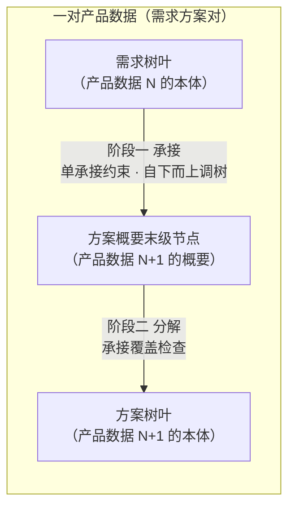
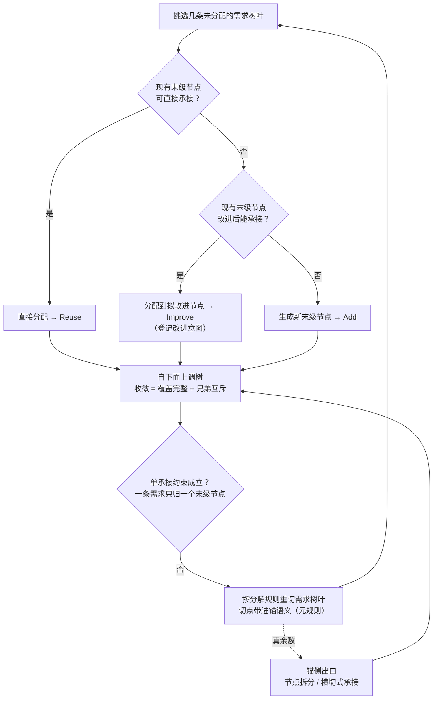
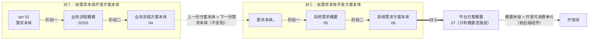

# 20 - 由需求开发方案二阶段：从需求到方案概要以及从方案概要到方案

> 本卡整理自一轮对话线（起点：设计与开发的落地方法——需求与方案之间的一系列产品数据，如何逐对开发），顺次覆盖：
> 需求-方案结对 → 每份产品数据的树形组织（概要/本体）→ 产品数据之相关规则（两条元规则 + 三套执行规则）→ 设计阶段一（需求本体 → 方案概要）→ 设计阶段二（方案概要 → 方案）→ 设计过程整体推进 → 与现有方法论的关系。
> 独立新卡，**未改动任何现有研究报告**。与 `01-设计开发概念研究报告-从需求到质量基座.md` 承接——01 给出设计与开发的定义（ISO 9000 §3.4.8：将需求转换为更详细需求）与内部机制（分解、分配、分析），本卡把"需求→更详细需求"落实为可执行的**逐对算法**：每一对相邻产品数据，如何由需求本体完整开发出方案本体。

---

## 〇、由需求开发方案的结构化方法

**设计与开发落地的本质，是逐对生成产品数据。** 把产品数据链切成相邻的"需求方案对"——**结对就是由需求本体开发出方案本体**，开发过程分两个阶段：**阶段一由需求本体开发方案概要，阶段二由方案概要开发方案本体**。链上每一对都走同一算法，上一份方案本体就是下一份的需求本体；链尾对接开发线——开发线直接消费最后一份产品数据落纸的可消费单元（EOS 链路上即平台方案概要的概要末级）。设计与开发由此统一为：**由需求本体到方案本体的逐对生成**。



---

## 一、基础概念

### 1.1 设计过程之产品数据

**产品数据**：关于产品的信息的形式化表示，适合由人或计算机进行通信、解释或处理（ISO 10303-1）。本方法中，产品数据就是设计过程中每个环节的产出物——EOS 链路上的产品数据清单：

```
1. 相关方需求（含概要及本体；原"规范化的相关方需求"）
2. 业务流程（含概要及本体：业务流程概要、业务流程）
3. 系统需求（含概要及本体：系统需求概要、系统需求）
4. 平台方案（只是概要：平台方案概要）
```

概要态与本体态是同一份逻辑产品数据的两个形态，各自落纸（02/03 与 04、05 与 06）；链尾的平台方案只有概要态落纸——其概要末级（前后端组件等）即开发线可消费的最小单元。此处"产品"取泛指，即被设计的目标产品：需求、业务流程、系统需求、平台方案都是"关于产品的信息"，不限于实物。

产品数据是设计开发加工的对象：设计与开发（ISO 9000 §3.4.8）的输入和输出都是需求，落成文档即产品数据。每份产品数据同时是上一轮的"方案"、又是下一轮的"需求"——这是"需求方案对"能连续推进的前提。形式化与"由人或计算机处理"两项是本方法的地基：形式化表示才能被一致地解释，机械判据（§2.3 收敛判据）与两道门（§3.2、§4.2）才有可执行的比对对象；"由人或计算机处理"直接支撑 §2.1 的人机分工——人类据表示制定规则，算法据规则执行。

### 1.2 产品数据之树形结构

每一份产品数据的内容都能组织成一棵树：

- 根节点为 **0 级**，一般是系统
- 逐级往下：1 级、2 级、……，最后是**树叶层级**
- 层级数量按产品数据实际情况确定，不预设固定深度
- 每一级节点和树叶都可以定义**物理意义**——物理意义主要由人类负责研究和制定（AI 辅助），是承接、构建、分解、审查的共同依据

### 1.3 产品数据之概要与本体

同一棵树的两种形态：

- **概要**（xx概要）：不含树叶的树 = 树结构 + 各级节点，包括末级节点
- **本体**（xx）：含树叶的树 = 概要 + 树叶
- 例：需求概要 / 需求；方案概要 / 方案

"概要"不是另一份产品，而是同一份产品数据的**骨架形态**——先产出骨架（阶段一），再填充树叶（阶段二），同一份产品数据由概要演进为本体。

### 1.4 概要之末级节点

概要中最深一层的节点，是概要的"骨架终点"。它同时承担两个角色：

- **承接方**（向上）：接受需求树叶的分配
- **分解源**（向下）：被分解为方案树叶

因此其物理意义必须**双向可用**——既写"可承接的需求类型"（承接判据），又写"分解产出的树叶类型"（分解源判据）。两条规则共享这一锚点，避免"承接说能来、分解实现不了"的结构性空洞。承接判据还进一步作为**对侧**分解规则的制定输入——见 §2.2。

### 1.5 需求-方案结对

取**一对相邻的产品数据本体**：上序 = **需求本体**，下序 = **方案本体**——结对就是**由需求本体开发出方案本体**，开发过程分两个阶段：阶段一由需求本体开发方案概要（§三），阶段二由方案概要开发方案本体（§四）。概要是方案侧的中间形态，不是对的端点。

整条链是对本体的接力——上一份方案本体就是下一份的需求本体，逐对推进。EOS 链路实例化：

```
01 相关方需求本体 ──对①──> 业务流程本体（02/03 概要态 → 04 本体态）
04 = 需求本体₂ ──对②──> 系统需求本体（05 概要态 → 06 本体态）
06 = 需求本体₃ ──对③──> 平台方案概要（07，只有概要态落纸）──> 开发线
```

每对都是完整的设计与开发（3.4.8）：方案方的每一份产出，都是对需求方某一组内容的设计与开发结果。

### 1.6 树形假设的边界

本方法有一个基础假设：**需求或方案类产品数据都可以被组织成树形结构**。该假设**成立，但依据是组织性的，不是内容性的**——"组织成树"指每条内容有一个唯一的归属位置，不指内容之间只有父子关系。

需求/方案的语义本质是**图**，有四类内容纯树放不下：

| 内容类型 | 现象 | 树形处理 |
|---------|------|---------|
| **横切** | 一条约束影响多个分支（如"可用性 ≥ 99.9%""所有操作需审计留痕"） | 给它独立的树位置（如 NFR 分支），用**影响面标注**勾连被影响的节点 |
| **共享** | 一个定义被多处引用（如"客户"贯穿多个流程、接口契约被多个组件消费） | 归属到一处，其余**引用**（跨文档引用只记录引用、不复制正文） |
| **多维** | 同一批需求可按功能/场景/性能/相关方多个维度切分 | 选一个稳定的**主组织维度**作树的轴，其余维度降为节点属性 |
| **循环/递归** | 业务流程自调用、嵌套，调用拓扑是环 | 树按归属组织层级，调用拓扑记在节点内容里（分形：每级元素的设计开发都是一个完整的 3.4.8） |

由此得出本方法对"树"的读法：**树是存储骨架，引用/追溯是关系载体**。相应地，承接分两种形态并存：

- **归属式承接**（功能性分配）：受单承接约束（§2.5、§3.2）
- **横切式承接**（NFR、约束、安全策略等）：留在独立分支作树叶，对多个方案节点的承接用**影响面标注**表达，不走归属分配

假设在两种情况下不成立：**①**要求树同时表达全部关系（把横切、共享也塞进分支结构）——方法已给出路：横切走独立分支 + 标注；**②**选不出稳定的主组织维度——树组织变成任意的，内容增长时会反复重构。对②的解法是：每一对在定义三套规则（§二）前，先定死主组织维度（对应"用户角色架构锚定法 / 输出产品架构锚定法"的选择）。

---

## 二、产品数据之相关规则

对每一个需求-方案结对，先制定规则，再执行两阶段算法。产品数据之相关规则共五条，分两层：两条**元规则**管规则如何制定——规则由谁制定（§2.1）、分解规则怎么制定（§2.2）；三套**执行规则**管算法怎么执行——分解规则（§2.3）、构建规则（§2.4）与承接规则（§2.5）。三套执行规则是方法级常设规则，对每一对通用；各对按它们制定的具体规定，才是"这一对的本钱"——没有它，阶段一、阶段二都没有可执行的依据。

### 2.1 人类负责定义产品数据结构规则

结对开发所需的产品数据结构规则，**主要由人类负责定义**（AI 辅助）——**定义**各级节点的物理意义与父子节点关系，**选定**主组织维度，并**制定**本对的具体规则（即三套执行规则的本对实例化，含由子节点生成父节点的构建规则）。这些都是判断性工作，不存在机械算法：语义归纳、边界界定的制定权在人；AI 承担三类辅助——候选生成、一致性检查、反例检验——并按规则执行两阶段算法与机械验收。父节点的生成是最典型的一例：只有人类制定的语义与质量判据下的检查（§2.4 构建规则），没有机械的生成算法。

### 2.2 定义末级节点分解规则的考量

分解规则决定概要末级节点如何长出树叶（§2.3）。定义这条规则时，主要考量有四：

- **消费方语义域**：把**消费方承接结构的末级节点物理意义及其特征**作为分解规则的构成性输入——切点落在其语义域边界上，使树叶**按构造**可被消费方单点承接/消费，单承接由分解规则内置保证，而非迭代试错的目标
- **语义原子性**：树叶保有独立语义、可独立验证，防止为迁就锚的切法把语义整体切碎
- **切不动不硬切**：消费方语义域切不动的语义整体（一致性约束、接口语义等关系性内容）走锚侧出口——节点拆分（§2.5）、横切式承接（§1.6）
- **随消费方结构演进**：阶段一中消费方的末级节点被新增或改进（§3.3）时，受影响的分解规则随影响面复查同步修订——"先制定规则"指对当前消费方结构的首次制定

元规则只落在分解向：构建规则与承接规则的制定输入都在本侧，由 §2.1 的人类定义直接覆盖，无需另立元规则。

### 2.3 分解规则：概要末级节点 → 树叶

适用于任何概要类产品数据。本对内它有两处现身：方案概要的树叶由它在阶段二产出；需求侧树叶则是上一对应用同一规则的产出（首对由预处理链产出），本对只在违规路径上用它重切（§3.2）。无论哪次应用，树叶都沿**消费方末级节点的语义域边界**切分——需求树叶的消费方是本对的方案概要，方案树叶的消费方是下一对的承接结构（§5.2），末对的消费方是开发线（§5.4）。定义这条规则的四条考量见 §2.2，此处只立它的两条机械判据：

- **单承接**：每片树叶天然可分配/可消费于单个末级节点——按构造可单点承接，粒度均匀、边界清晰
- **语义原子性**：树叶保有独立语义，可独立验证/交付；切不动、再分即碎的语义整体不硬切（真余数，走锚侧出口：§2.5 节点拆分、§1.6 横切式承接）

### 2.4 构建规则：子节点 → 父节点

决定各级父节点的语义、层级划分、兄弟节点边界，是**阶段一"自下而上调树"的依据**。

父节点的生成按 §2.1 由人类制定（AI 辅助候选生成、一致性检查与反例检验）：在定死的主组织维度上归组子节点、归纳公共类、为父节点写物理意义、定父子边界。人类制定的父语义按三条质量判据自查，AI 据此辅助检查：**独立可定义**——父语义能独立于子节点清单表述，回答"这一组共同是什么"，不是清单的拼接；**非兜底**——"其他/杂项"式语义筐不合格，无独立语义域的父节点会在后续承接中变成语义黑洞；**最小泛化**——选能覆盖子语义之并的最小类域，父语义域贴近子并，只留生长余量、不留模糊空间。

- **收敛判据**（两条机械可查）：
  - **覆盖完整**：每个非叶节点语义 ⊇ 其子节点语义之并
  - **兄弟互斥**：同层兄弟节点语义两两不重叠
- 两者满足即收敛；新末级节点归不进任何现有父节点的语义域时，才在更高层新增父节点

**链自相似注记**：需求树在本对没有独立的构建规则——本对的需求树就是上一对的方案树，其构建由上一对的构建规则管辖；首对的需求树（相关方需求）由预处理链制定。

### 2.5 承接规则：需求 → 方案概要

决定需求树叶如何分配到概要末级节点（语义匹配判据），是**阶段一的分配依据**。

- **核心约束（单承接）**：一条需求只能被一个概要末级节点承接——可 N:1，不可 1:N
- **对称约束（承载量）**：一个末级节点承接的需求超限（粒度不匹配/数量过多）时，触发节点拆分（Split）

**配套两道门**：阶段一的单承接检查（§3.2）与阶段二的承接覆盖检查（§4.2），是这条承接规则在两个阶段的执行面。

---

## 三、设计阶段一：从需求到方案概要

**本阶段执行**：承接规则（分配）+ 构建规则（自下而上调树）+ 分解规则（违规时重切需求树叶）。

**目标**：把需求树叶分配到位，产出完整的方案概要（树结构 + 末级节点）。

### 3.1 从需求到方案概要的流程



1. **挑选几条未分配的需求树叶**作为本轮对象
2. **查直接承接**：方案概要中有没有现成末级节点可直接承接
   - 有 → 分配需求树叶到该节点
   - 没有 → 进入 3
3. **查改进承接**：基于需求语义和概要末级节点语义，看有没有末级节点**改进后能承接**
   - 能 → 分配需求到拟改进的末级节点（登记改进意图，待后续执行改进）
   - 不能 → 进入 4
4. **新增承接**：基于需求语义和末级节点的物理意义，**生成新的末级节点**承接需求
5. **自下而上调树**：若产生新增/改进的末级节点，由人类主导、AI 辅助，归组子节点并归纳/修订各级父节点的物理意义，自下而上调整或新增各级节点，直至机械收敛（覆盖完整 + 兄弟互斥）

### 3.2 单承接约束：一条需求只归一个末级节点

- **约束**：一条需求只能被一个概要末级节点承接（可 N:1，不可 1:N）。单承接**由构造保证**——分解规则按元规则以锚语义定切点，树叶天然可单点分配，迭代试错不是常态机制
- **违规处理**：仍出现 1:N 时先判类型——分解规则未按元规则制定（切点未带进锚语义）属**程序违规**，回炉重制定后重切；**真余数**（消费方语义域切不动的语义整体）走锚侧出口：承载量超限触发节点拆分（§2.5），约束/策略类内容走横切式承接（§1.6）
- **下界守护**：语义原子性——树叶保有独立语义、可独立验证，防止为迁就锚的切法把语义整体切碎
- **方向是单向的**：概要末级节点是锚，需求是适配方——锚不只被动接收分配，还通过分解规则**预先整形**需求侧的切法；违反时重切需求，而不是迁就需求改概要

这与"需求分解分配分析"的单分配约束同构：需求方负责把树叶切到可单点分配，方案方概要保持稳定，只在必要时（§3.4）调整。

### 3.3 改进末级节点：影响面复查

"改进后承接"不是局部操作。对末级节点的 Extend/Split/Merge 会扰动**已承接**的其他需求树叶：

- Split 后，原已承接的需求要重分配到子节点
- Merge 后，语义域收敛，某些既有需求可能失配

**任何改进操作后必须执行"影响面复查"**：重新核对既有承接，失配则批量重分配或回退改进。否则会在阶段一留下隐性失配，到符合性审查才暴露。改进同时改变分解规则的制定输入（新增或改动的末级节点物理意义进入锚语义），受影响的分解规则须随影响面复查同步修订——制定随锚演进。

### 3.4 承接动作的优先级：复用 → 改进 → 新增

| 阶段一动作 | 资产优先原则 | 说明 |
|-----------|-------------|------|
| **直接承接** | Reuse（复用） | 现有末级节点语义域直接覆盖需求 |
| **改进后承接** | Improve（Extend/Split/Merge） | 扩展/拆分/合并现有末级节点后承接 |
| **新增承接** | Add（新增） | 现有节点改进后也无法承接，才新增 |

优先级始终：**复用 → 改进 → 新增**。改进的代价（影响面复查）决定了它排在新增之前——能复用就不改进，能改进就不新增。三动作与仓库既定的资产优先原则（Reuse > Improve > Add）一一对应。

---

## 四、设计阶段二：从方案概要到方案

**本阶段执行**：分解规则（产出方案树叶）+ 承接覆盖检查（§4.2，第二道门）。

**目标**：把方案概要末级节点分解为方案树叶，产出完整方案（本体）。

### 4.1 从方案概要到方案的流程

1. **选择拟改进的或新增的概要末级节点**作为本轮对象
2. 基于语义和末级节点及树叶的物理意义，**对末级节点分解**，产出方案树叶
3. 执行承接覆盖检查（§4.2）

### 4.2 承接覆盖检查：承接了的一定被实现

每个末级节点分解完成后，检查：

> **该末级节点承接的所有需求树叶的语义 ⊆ 其方案树叶语义之并**（满足度）

这是需求符合性审查第 3 层（满足度）的**设计期预演**。未覆盖 → 回阶段二补树叶，或回阶段一调整承接关系。这防止"承接了但没实现"的空洞。

覆盖检查是两阶段之间的门禁：阶段一决定"谁承接谁"，阶段二决定"承接的有没有被实现"，两者在此对上。

---

## 五、设计过程整体推进

### 5.1 设计过程的需求追溯矩阵自然生成

- 阶段一每次承接建立"需求树叶 → 概要末级节点"追溯边
- 阶段二延伸为"需求树叶 → 概要末级节点 → 方案树叶"

**追溯矩阵是设计过程自然生成的**，不需要另起炉灶——每一对的两阶段跑完，追溯边就落一条完整的链。

### 5.2 需求是相对的，需求是方案的输入

"需求"与"方案"是相对角色：同一份产品数据，对上一对是方案，对下一对是需求——需求是方案的输入。

- 每一份产品数据的本体视图（树叶）直接作为下一份概要的承接输入
- 链条连续、无中间态冗余
- 例：业务流程方案（04）既是业务流程概要的本体，又是系统需求概要（05）的承接对象

这保证整条链不需要额外的"交接文档"或"中间状态"，上一份的树叶就是下一份的需求。

### 5.3 产品数据设计逐对推进：EOS 链路实例化

在 EOS 当前链路上：



EOS 把概要态与本体态落为各自的文档（如 02/03 与 04、05 与 06）——逻辑上是一份产品数据的两个形态，物理上是两份文档；对的两端是本体，概要文档是阶段一的中间产物落纸。

末份产品数据平台方案只有概要态落纸（07）：对③的阶段二产物不再另行落纸本体文档，开发线直接接手——07 的概要末级（前后端组件等）即开发可消费的最小单元，详细级内容即组件规格。

每对都执行"两阶段算法"。

概要类产品数据由**架构级**（定树结构 + 末级节点清单）与**详细级**（定末级节点内容，为承接提供判断依据）两档构成——树形骨架加内容深度，共同支撑阶段一的承接判断。

### 5.4 与开发对接

- 最后一份产品数据是**平台方案概要（07）**，只有概要态落纸——其概要末级（前后端组件、配置单元、引擎模型等）就是开发线可消费的最小单元
- 设计终点通过它直接对接开发输入，不需要再造一份"开发需求"
- 设计与开发统一为：**由需求本体到方案本体的逐对生成**

---

## 六、与现有方法论的关系

本算法不是凭空新造，而是把仓库里已定案的方法论落实为可执行流程：

| 本算法概念 | 层级 | 现有方法论 | 对应关系 |
|-----------|------|-----------|---------|
| 规则制定主体元规则 | 主体型元规则 | 元流水线角色分工（人类主导设计、AI 执行自动化任务） | 判断性工作制定权在人，AI 辅助制定并执行算法与机械验收 |
| 承接锚定分解元规则 | 内容型元规则 | 概要末级节点双向可用·承接判据（§1.4）+ 锚定法同型推广 | 分解规则以消费方语义域为构成性输入，单承接由构造保证 |
| 承接 → 改进 → 新增 | 树间·阶段一动作 | 资产优先原则 Reuse > Improve > Add | 阶段一的分配策略 |
| 单承接约束 | 树间规则（承接规则） | 需求分解分配分析的单分配约束 | 一条需求只归一个末级节点 |
| 阶段一 / 阶段二 | 算法 | 概要 → 方案两阶段工作法 | 先出骨架再填树叶 |
| 承接覆盖检查 | 树间门禁（阶段二） | 需求符合性审查第 3 层（满足度） | 阶段二的门禁 |
| 概要末级节点识别 | 树内 | 架构末级节点识别方法 | 概要骨架的终点 |
| 自下而上调树收敛 | 树内·构建规则验收 | 覆盖完整 + 兄弟互斥 | 树自洽的两条机械判据 |
| 追溯边贯穿 | 链 | 追溯矩阵 | 设计过程自然生成，不另起炉灶 |

---

## 七、结论

由需求开发方案，落地为**需求方案对的逐对生成**：

1. 每对先制定规则——**主体型元规则**定规则由谁制定：各级节点物理意义、父子关系规则与三套规则（分解规则、构建规则、承接规则）主要由人类负责研究和制定，AI 辅助；执行与机械验收交给算法。**内容型元规则·承接锚定分解**定分解规则怎么制定：制定时把消费方末级节点的物理意义及其特征带进来，切点与粒度由消费方语义域锚定
2. 阶段一以概要末级节点为锚，用"承接 → 改进 → 新增"把需求树叶分配到位，自下而上调出方案概要的树形骨架；单承接由构造保证，违规仅剩程序违规（回炉重制定）与真余数（锚侧出口：节点拆分/横切式承接）两种情形
3. 阶段二把概要末级节点分解为方案树叶，以承接覆盖检查为门禁，保障"承接了的一定被实现"
4. 追溯边贯穿每一对，上一份的本体直接成为下一份的输入，链条连续无冗余
5. 链尾的平台方案只有概要态落纸（07），概要末级对接开发线——**设计与开发由此统一为：由需求本体到方案本体的逐对生成**

---

## 八、参考文献

仅收录公开的标准、书籍与期刊论文。**研究报告不作为参考文献**——本系列各研究报告、教材书、仓库规范等项目内部文档均为内部引用，见开头"来源对话线"互参说明。

| 概念 | 标准出处 | 关键原文/位置 | 引用方式 |
|------|---------|--------------|---------|
| **设计与开发** | ISO 9000:2015 §3.4.8 | 将客体的**需求**转换为对其**更详细的需求**的一组过程；注1：输入需求通常是研究的结果，通常从**特性**方面规定；一个项目可有多个设计开发阶段（递归） | 直接引用（§〇、§1.1、§1.6） |
| **需求** | ISO 9000:2015 §3.6.4 | 需要或期望（明示/隐含/必须履行三形态） | 概念支撑——横切/多维需求的需求来源 |
| **产品数据** | ISO 10303-1:2021 §3.1.29 | data＝"representation of information in a formal manner suitable for communication, interpretation, or processing by human beings or computers"；product data＝关于产品的信息的此类形式化表示（§3 术语和定义） | 直接引用（§1.1） |
| **设计开发输入** | ISO 9001:2015 §8.3.3 | 输入应满足可转化判据（完整、无歧义、不冲突、隐含需求已识别） | 概念支撑——隐含需求识别并入 |
| **好需求特性** | ISO/IEC/IEEE 29148:2018 | 单条需求 11 特性 + 需求集 5 特性（可验证性等） | 概念支撑——语义原子性/可验证性判据（§2.1） |
| **架构描述** | ISO/IEC/IEEE 42010:2022 | 架构描述与架构视图（概要与详细的关系） | 概念支撑——概要/本体框架（§1.3） |

---

**与其他报告的关系**：本卡涉及的设计与开发、产品数据、架构、需求完整性、工程角色等概念的专述，见系列各研究报告；教材形态见 [教材书第 6 章「设计开发落地：需求与方案结对」](../03-架构师是个怎样的物种/06-第6章-设计开发落地-需求与方案结对.md)，方法论来源见 [通用设计规范](../../00-generalspec/01-generalspec-sysdev.md)。
