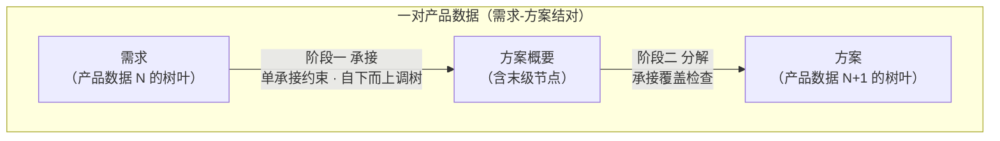
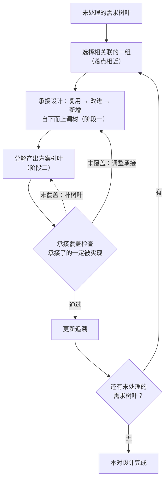
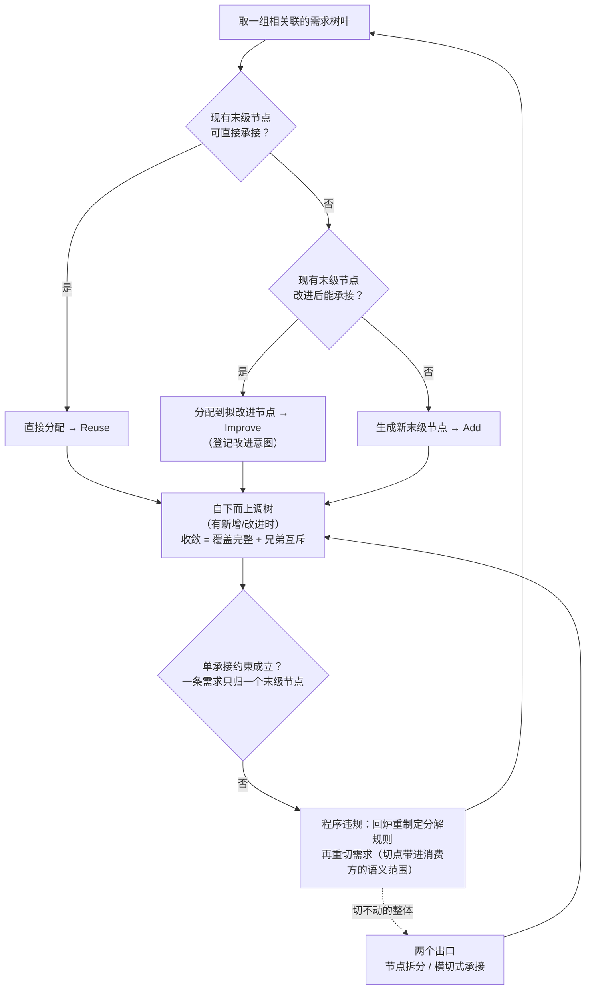
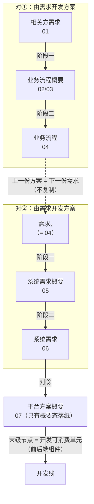

# 20 - 由需求开发方案：预处理过程与正式设计过程

> **摘要**：把产品数据链切成相邻的"需求-方案结对"，由需求开发出方案，逐对推进——本方法记作 **Y=F(X) 函数法**。X 为需求，Y 为方案，F 为三部分规则：X 侧与 Y 侧的树形结构、各层节点物理意义与分解/构建规则，以及 Y 的概要末级节点承接 X 树叶的承接规则。每对先定义规则，再走两段过程：预处理过程（定义规则、结构化存量材料、初步承接），正式设计过程（需求树叶驱动的循环：承接设计走复用→改进→新增，分解产出方案树叶）。单承接约束即函数的单值性（可 N:1、不可 1:N），承接覆盖检查保障"承接了的一定被实现"，追溯矩阵自然生成——由符合规则的 X，即可按照函数规则生成符合规则的 Y。链上上一份方案就是下一份的需求，逐对接力；链尾平台方案概要的末级节点直接对接开发线。设计与开发由此统一为：**由需求到方案的逐对生成**。

---

## 〇、核心思路：由需求到方案的逐对生成

**设计与开发落地的本质，是逐对生成产品数据。** 本方法记作 **Y=F(X) 函数法**：对每一对产品数据，X 为需求，Y 为方案，F 为 Y 与 X 的函数关系，由三部分规则构成——设计并定义 X 的树形结构、各层节点物理意义与各层节点构建规则；设计并定义 Y 的树形结构、各层节点物理意义与各层节点构建规则；设计并定义 Y（概要末级节点）与 X（树叶节点）的承接关系和规则——三部分即预处理第 1 步定义的三块规则（§3.1）。函数必须单值：多个 X 可以映射同一个 Y（承接可 N:1），一个 X 映射多个 Y 则 F 不成其为函数（不可 1:N）——单承接约束（§2.5）就是函数的单值性。按 Y=F(X) 的一整套规则和方法定义，由符合规则的 X，即可按照函数规则生成符合规则的 Y。

把产品数据链切成相邻的"需求-方案结对"——**结对就是由需求开发出方案**，开发过程分两段：**预处理过程**先做准备——定义规则、把存量材料结构化成树、初步承接可分配的需求树叶；**正式设计过程**以相关联的一组需求树叶为单位循环推进——循环体内阶段一由需求开发方案概要，阶段二由方案概要开发方案。链上每一对都走同一过程，上一份方案就是下一份的需求；链尾对的阶段二移交开发线——设计线交付平台方案概要即止，开发线按其末级节点（EOS 链路上的可消费单元）分解出最后的方案树叶。设计与开发由此统一为：**由需求到方案的逐对生成**。



---

## 一、基础概念

### 1.1 设计过程之产品数据

**产品数据**：关于产品的信息的形式化表示，适合由人或计算机进行通信、解释或处理（ISO 10303-1）。本方法中，产品数据就是设计过程中每个环节的产出物——EOS 链路上的产品数据清单：

```
1. 相关方需求（含概要与完整态；原"规范化的相关方需求"）
2. 业务流程（含概要与完整态：业务流程概要、业务流程）
3. 系统需求（含概要与完整态：系统需求概要、系统需求）
4. 平台方案（只是概要：平台方案概要）
```

概要态与完整态是同一份逻辑产品数据的两个形态，各自落纸（如 02/03 与 04、05 与 06）；链首的相关方需求只有完整态落纸——首对的需求侧由预处理过程直接给出完整态（规则见 §2.3、§2.4，执行见 §3.2）；链尾的平台方案只有概要态落纸——其末级节点（前后端组件等）即开发线可消费的最小单元，末级节点的分解（阶段二）移交开发线执行（§5.4）。此处"产品"取泛指，即被设计的目标产品：需求、业务流程、系统需求、平台方案都是"关于产品的信息"，不限于实物。

产品数据是设计开发加工的对象：设计与开发（ISO 9000 §3.4.8）的输入和输出都是需求，落成文档即产品数据。每份产品数据同时是上一对的"方案"、又是下一对的"需求"——这是"需求-方案结对"能连续推进的前提。形式化与"由人或计算机处理"两项是本方法的地基：形式化表示才能被一致地解释，机械判据（§2.3、§2.4）与两道关口（§4.3、§4.5）才有可执行的比对对象；"由人或计算机处理"直接支撑 §2.1 的人机分工——人类据表示制定规则，算法据规则执行。

### 1.2 产品数据之树形结构

每一份产品数据的内容都能组织成一棵树：

- 根节点为 **0 级**，一般是系统
- 逐级往下：1 级、2 级、……，最后是**树叶层级**
- 层级数量按产品数据实际情况确定，不预设固定深度
- 每一级节点和树叶都可以定义**物理意义**——即这一节点/树叶实际代表、实际负责的内容是什么；物理意义主要由人类负责研究和制定（AI 辅助），是承接、构建、分解、审查的共同依据

### 1.3 产品数据之概要与完整态

同一棵树的两种形态：

- **概要**（xx概要）：不含树叶的树 = 树结构 + 各级节点，包括末级节点
- **完整态**（xx 本名）：含树叶的树 = 概要 + 树叶——树叶上的条目即需求/方案本身
- 例：需求概要 / 需求；方案概要 / 方案

"概要"不是另一份产品，而是同一份产品数据的**骨架形态**——先产出骨架（阶段一），再填充树叶（阶段二），同一份产品数据由概要演进为完整态。

### 1.4 概要之末级节点：向上承接，向下分解

概要中最深一层的节点，是概要的"骨架终点"。它同时承担两个角色：

- **承接方**（向上）：接受需求的分配
- **分解源**（向下）：被分解为方案的树叶

因此其物理意义必须**双向可用**——既写"可承接的需求类型"（承接判据），又写"分解产出的树叶类型"（分解源判据）。两条规则共享这一依据，避免"承接说能来、分解实现不了"的结构性空洞。承接判据还进一步作为上一对分解规则的制定输入——本对承接的树叶正是上一对切出的（见 §2.2）。链尾对上，分解源判据随阶段二移交开发线——它就是开发线把末级节点分解为树叶的规则接口（§5.4）。

### 1.5 需求-方案结对

取**一对相邻的产品数据**（各取完整态）：上序 = **需求**，下序 = **方案**——结对就是**由需求开发出方案**——一次 Y=F(X) 的求值（§〇）：预处理过程做准备（§三），正式设计过程循环推进（§四），循环体内阶段一由需求开发方案概要、阶段二由方案概要开发方案。概要是方案侧的中间形态，不是对的端点。

整条链是完整态的接力——上一份方案就是下一份的需求，逐对推进。EOS 链路实例化：

```
01 相关方需求（完整态进场）──对①──> 业务流程（02/03 概要态 → 04 完整态）
04 = 需求₂ ──对②──> 系统需求（05 概要态 → 06 完整态）
06 = 需求₃ ──对③──> 平台方案概要（07，只有概要态落纸）──> 开发线（阶段二移交）
```

每对都是完整的设计与开发（3.4.8）：方案侧的每一份产出，都是对需求侧某一组内容的设计与开发结果。

### 1.6 树形结构假设的边界：哪些内容树装不下

本方法有一个基础假设：**需求或方案类产品数据都可以被组织成树形结构**。该假设**成立——"组织成树"只要求每条内容有一个唯一的归属位置，不要求内容之间只有父子关系**。

需求/方案的语义本质是**图**，有四类内容纯树放不下：

| 内容类型 | 现象 | 树形处理 |
|---------|------|---------|
| **横切** | 一条约束影响多个分支（如"可用性 ≥ 99.9%""所有操作需审计留痕"） | 给它独立的树位置（如 NFR 分支），用**影响面标注**勾连被影响的节点 |
| **共享** | 一个定义被多处引用（如"客户"贯穿多个流程、接口契约被多个组件消费） | 归属到一处，其余**引用**（跨文档引用只记录引用、不复制正文） |
| **多维** | 同一批需求可按功能/场景/性能/相关方多个角度切分 | 选一个稳定的**主组织维度**（按哪个角度分类）作树的轴，其余角度的信息降为节点上的一条属性 |
| **循环/递归** | 业务流程自调用、嵌套，调用关系成环（A 调 B、B 又调 A） | 树按归属组织层级，谁调用谁记在节点内容里（递归：每一级元素的设计开发都是一个完整的 3.4.8） |

由此得出本方法对"树"的读法：**树是存储骨架，引用/追溯是关系载体**。相应地，承接分两种形态并存：

- **归属式承接**（功能性分配）：受单承接约束（§2.5、§4.3）
- **横切式承接**（NFR、约束、安全策略等）：留在独立分支作树叶，对多个方案节点的承接用**影响面标注**表达，不走归属分配

假设在两种情况下不成立：**①**要求树同时表达全部关系（把横切、共享也塞进分支结构）——方法已给出路：横切走独立分支 + 标注；**②**选不出稳定的主组织维度——树组织变成任意的，内容增长时会反复重构。情况②的解法是：每一对在预处理定义规则（§3.1，规则本体见 §二）前，先定死主组织维度（对应"用户角色架构锚定法 / 输出产品架构锚定法"的选择）。

---

## 二、产品数据之相关规则：怎么定，怎么用

对每一个需求-方案结对，先定义规则（预处理过程第 1 步，§3.1），再执行设计动作——预处理做准备，正式设计循环推进。产品数据之相关规则共五条，分两层：前两条管**规则如何制定**——规则由谁制定（§2.1）、分解规则怎么制定（§2.2）；三套**执行规则**管设计动作怎么执行——分解规则（§2.3）、构建规则（§2.4）与承接规则（§2.5）。三套执行规则是方法级常设规则，对每一对通用；各对按它们制定的具体规定，才是"这一对的本钱"——没有它，预处理与正式设计都没有可执行的依据。

### 2.1 人类负责定义产品数据结构规则

结对开发所需的产品数据结构规则（Y=F(X) 中的 F，§〇），**主要由人类负责定义**（AI 辅助）——**定义**各级节点的物理意义与父子节点关系，**选定**主组织维度，并**制定**本对的具体规则（即三套执行规则的本对实例化，含由子节点生成父节点的构建规则）。这些都是判断性工作，不存在机械算法：语义归纳、边界界定的制定权在人；AI 承担三类辅助——候选生成、一致性检查、反例检验——并按规则执行设计动作与机械验收。父节点的生成是最典型的一例：只有人类制定的语义与质量判据下的检查（§2.4 构建规则），没有机械的生成算法。

### 2.2 分解规则怎么定：四条考量

分解规则决定末级节点如何长出树叶（§2.3）。树叶长出来是给下游用的：**消费方**就是承接、使用这些树叶的一方。定义这条规则时，主要考量有四：

- **消费方的语义范围**：把**消费方承接结构的末级节点物理意义及其特征**作为分解规则的制定输入——切点落在其语义范围的边界上，使树叶**天然**可被消费方单点承接/消费，单承接由分解规则直接保证，而非迭代试错的目标
- **语义原子性**：树叶保有独立语义、可独立验证，防止为迁就消费方的切法把语义整体切碎
- **切不动不硬切**：消费方语义范围切不动的语义整体（一致性约束、接口语义等关系性内容）走两个出口——节点拆分（§2.5）、横切式承接（§1.6）
- **随消费方结构演进**：阶段一中消费方的末级节点被新增或改进（§4.4）时，受影响的分解规则随影响面复查同步修订——"先制定规则"指对当前消费方结构的首次制定

这些考量只落在分解向：构建规则与承接规则的制定输入都在本侧，由 §2.1 的人类定义直接覆盖。

### 2.3 分解规则：末级节点 → 树叶

适用于任何概要类产品数据。本对内它有两处现身：方案概要的树叶由它在阶段二产出；需求侧的树叶则是上一对应用同一规则的产出（首对由预处理过程产出，§3.2），本对只在违规路径上用它重切（§4.3）。无论哪次应用，树叶都沿**消费方末级节点的语义范围边界**切分——需求的消费方是本对的方案概要，方案的消费方是下一对的承接结构（§5.2），末对的消费方是开发线：链尾对不再在本对内分解，末级节点由开发线按分解源判据（§1.4）分解为树叶（§5.4）。定义这条规则的四条考量见 §2.2，此处只立它的两条机械判据：

- **单承接**：每片树叶天然可分配/可消费于单个末级节点——粒度均匀、边界清晰
- **语义原子性**：树叶保有独立语义，可独立验证/交付；切不动、再分即碎的语义整体不硬切（走两个出口：§2.5 节点拆分、§1.6 横切式承接）

### 2.4 构建规则：子节点 → 父节点

决定各级父节点的语义、层级划分、兄弟节点边界，是**阶段一"自下而上调树"的依据**。

父节点的生成按 §2.1 由人类制定（AI 辅助候选生成、一致性检查与反例检验）：在定死的主组织维度上归组子节点、归纳公共类、为父节点写物理意义、定父子边界。人类制定的父语义按三条质量判据自查，AI 据此辅助检查：**独立可定义**——父语义能独立于子节点清单表述，回答"这一组共同是什么"，不是清单的拼接；**非兜底**——"其他/杂项"式语义筐不合格，没有独立语义范围的父节点会在后续承接中变成语义黑洞；**最小覆盖**——选能覆盖子节点语义之并的最小类，父节点的语义范围贴近子节点语义之并，只留生长余量、不留模糊空间。

- **收敛判据**（两条机械可查）：
  - **覆盖完整**：每个非叶节点语义 ⊇ 其子节点语义之并
  - **兄弟互斥**：同层兄弟节点语义两两不重叠
- 两者满足即收敛；新末级节点归不进任何现有父节点的语义范围时，才在更高层新增父节点

**需求树的来历**：需求树在本对没有独立的构建规则——本对的需求树就是上一对的方案树，其构建由上一对的构建规则管辖；首对的需求树（相关方需求）由预处理过程制定（§3.1）。

### 2.5 承接规则：需求 → 方案概要

决定需求如何分配到方案概要的末级节点（承接判据），是**阶段一的分配依据**。

- **核心约束（单承接）**：一条需求只能被一个末级节点承接——可 N:1，不可 1:N
- **承载量约束**：一个末级节点承接的需求超限（粒度不匹配/数量过多）时，触发节点拆分（Split）

**配套两道关口**：阶段一的单承接检查（§4.3）与承接覆盖检查（§4.5）——后者在预处理承接（§3.3）与阶段二执行，是这条承接规则的执行面。

---

## 三、预处理过程：正式设计前的准备

**过程定位**：正式设计前的准备——定义规则、把存量材料结构化、做初步承接。三步各自条件性执行（"如果需要"）：入口材料已完备则直通（如对②③的入口材料已是上一对产出的完整态，三步全直通）。

**本过程执行**：三套执行规则的制定（§3.1）与应用——分解规则与构建规则用于结构化产品数据（§3.2），承接规则用于处理可分配需求树叶（§3.3）。

### 3.1 定义规则

对本对制定三套规则（§二）——Y=F(X) 中的 F 在本对的具体化（§〇），按动作对象分三块：

- **定义需求之相关规则**：需求侧的分解规则（需求概要末级节点 → 需求树叶）与构建规则（需求树归组）
- **定义方案之相关规则**：方案侧的构建规则（方案概要归组）与分解规则（末级节点 → 方案树叶）
- **定义需求到方案规则**：承接规则（需求 → 方案概要末级节点）

规则由谁制定、分解规则怎么制定，见 §2.1、§2.2——人类主导定义（AI 辅助），分解规则以消费方的语义范围为制定输入。定义规则前先定死主组织维度（§1.6）。

### 3.2 结构化产品数据

- **结构化需求文档**：如果需要，将已有需求按需求相关规则整理或重构成树形结构，包括分解为需求树叶——产出完整态的需求
- **结构化方案文档**：如果需要，将已有方案按方案相关规则整理或重构成树形结构，包括分解为方案树叶——产出完整态的方案

两条路径殊途同归：存量整理与正式设计的新增路径里，**概要是共同的中间形态**。入口材料已是完整态（如对②的 04）则本步直通。

### 3.3 处理可分配需求树叶

- 如果需要，针对已有方案概要末级节点，查找**可以直接承接**的需求树叶进行承接——预处理只做直接承接（Reuse），不动已有方案概要结构：需要改进或新增才能承接的树叶，留给正式设计过程
- 预处理承接与循环共用第二道关口：承接落定后，对被承接的末级节点执行承接覆盖检查（§4.5）——这些节点的树叶已在手（§3.2 的完整态方案已含树叶），按节点级口径核对；核对未通过的树叶不算直接承接，退回未处理的需求树叶
- 构建需求到方案的追溯关系——预处理落的承接边与循环里落的追溯边是同一类，追溯矩阵仍自然生成（§5.1）

处理完可直接承接的树叶，其余全部作为**未处理的需求树叶**进入正式设计过程。

---

## 四、正式设计过程：需求树叶驱动的循环

**过程定位**：树叶驱动的迭代循环，直到全部需求树叶处理完。循环体内分两阶段——**阶段一**由需求开发方案概要，**阶段二**由方案概要开发方案。阶段二在本对循环内执行；链尾对移交开发线执行（§5.4）。

**本过程执行**：承接规则（分配）+ 构建规则（自下而上调树）+ 分解规则（产出方案树叶、违规时重切需求）+ 承接覆盖检查（第二道关口，§4.5）。

### 4.1 正式设计循环



每轮循环五步：

1. **选择待设计的需求树叶**：选择**相关联的一组**未处理的需求树叶——预计由同一个（或同一小簇）方案概要末级节点承载的树叶归为一组（判据方向是落点相近，可查信号：同一业务场景、同一功能主题、内容互相牵连——拆开设计会导致重复承接或互相等待；每对可在规则中细化归组判据）
2. **承接设计**（阶段一动作）：走 复用 → 改进 → 新增（§4.2）把这组树叶落到方案概要末级节点，受单承接约束（§4.3），改进伴随影响面复查（§4.4）；有新增/改进则自下而上调树至收敛（覆盖完整 + 兄弟互斥）
3. **分解产出**（阶段二动作）：基于需求语义、末级节点与树叶的物理意义，把本轮涉及的末级节点按分解规则分解，产出方案树叶（§2.3）；上轮覆盖检查要求补树叶的节点一并处理
4. **承接覆盖检查**（第二道关口）：对本轮涉及的末级节点执行 §4.5 的节点级检查——该节点承接的所有需求（含预处理与此前各轮落的承接）的语义 ⊆ 其树叶语义之并；未覆盖回第 2 步调整承接，或回第 3 步补树叶
5. **更新追溯**，进入下一轮；无未处理的需求树叶时循环终止

### 4.2 承接设计：复用 → 改进 → 新增

承接设计对这组树叶逐条走三个动作：



自下而上调树由人类主导、AI 辅助（§2.1）——归组子节点、归纳/修订各级父节点的物理意义，直至机械收敛（覆盖完整 + 兄弟互斥）。

| 阶段一动作 | 资产优先原则 | 说明 |
|-----------|-------------|------|
| **直接承接** | Reuse（复用） | 现有末级节点的语义范围直接覆盖需求 |
| **改进后承接** | Improve（Extend/Split/Merge） | 扩展/拆分/合并现有末级节点后承接 |
| **新增承接** | Add（新增） | 现有节点改进后也无法承接，才新增 |

优先级始终：**复用 → 改进 → 新增**。改进的代价（影响面复查，§4.4）决定了它排在新增之前——能复用就不改进，能改进就不新增。三动作与仓库既定的资产优先原则（Reuse > Improve > Add）一一对应。

### 4.3 单承接约束：一条需求只归一个末级节点

- **约束**：一条需求只能被一个末级节点承接（可 N:1，不可 1:N——F 的单值性，§〇）。单承接**由分解规则保证**——分解规则以消费方的语义范围定切点，树叶天然可单点分配，迭代试错不是常态机制
- **违规处理**：仍出现 1:N 时先判类型——分解规则未按 §2.2 制定（切点未带进消费方的语义范围）属**程序违规**，回炉重制定后重切；**切不动的语义整体**走两个出口：承载量超限触发节点拆分（§2.5），约束/策略类内容走横切式承接（§1.6）
- **防止切得过碎**：树叶保有独立语义、可独立验证（语义原子性判据，§2.2），防止为迁就消费方的切法把语义整体切碎
- **方向是单向的**：末级节点是基准，需求是适配方——基准不只被动接收分配，分解规则还**预先定好了需求侧怎么切**；违反时重切需求，而不是迁就需求改概要

这与"需求分解分配分析"的单分配约束说的是同一条约束：需求侧负责把树叶切到可单点分配，方案概要保持稳定，只在必要时（§4.4）调整。

### 4.4 改进末级节点：影响面复查

"改进后承接"不是局部操作。对末级节点的扩展（Extend）、拆分（Split）、合并（Merge）会影响**已承接**的其他需求：

- Split 后，原已承接的需求要重分配到子节点
- Merge 后，节点的语义范围变窄，某些既有需求可能失配

**任何改进操作后必须执行"影响面复查"**：重新核对既有承接，失配则批量重分配或回退改进。否则会在循环内留下隐性失配，到符合性审查才暴露。改进同时改变分解规则的制定输入（新增或改动的末级节点物理意义即时更新消费方的语义范围），受影响的分解规则须随影响面复查同步修订——制定随消费方结构演进。

### 4.5 承接覆盖检查：承接了的一定被实现

每个末级节点分解完成后，检查：

> **该末级节点承接的所有需求的语义 ⊆ 其树叶语义之并**（满足度）

这是需求符合性审查第 3 层（满足度）的**设计期预演**。未覆盖 → 回第 2 步调整承接，或回第 3 步补树叶。这防止"承接了但没实现"的空洞——这道关口预处理承接（§3.3）同样要过。

覆盖检查是两阶段之间的关口：阶段一决定"谁承接谁"，阶段二决定"承接的有没有被实现"，两者在本对会合。

---

## 五、从一对到整条链

### 5.1 设计过程的需求追溯矩阵自然生成

- 预处理过程的初步承接（§3.3）落"需求 → 方案概要"追溯边
- 循环内阶段一每次承接建立"需求 → 方案概要"追溯边
- 阶段二延伸为"需求 → 方案概要 → 方案"（链尾对停在"需求 → 方案概要 → 末级节点"，阶段二由开发线执行，§5.4）

**追溯矩阵是设计过程自然生成的**，不需要另起炉灶——每一对的预处理与循环跑完，追溯边就落一条完整的链。

### 5.2 需求是相对的，需求是方案的输入

"需求"与"方案"是相对角色：同一份产品数据，对上一对是方案，对下一对是需求——需求是方案的输入。

- 每一份产品数据的完整态（其树叶）直接作为下一份概要的承接输入
- 链条连续、不需要中间交接
- 例：业务流程方案（04）既是业务流程概要的完整态，又是系统需求概要（05）的承接对象

这保证整条链不需要额外的"交接文档"或"中间状态"，上一份的树叶就是下一份的需求。

### 5.3 产品数据设计逐对推进：EOS 链路实例化

在 EOS 当前链路上：



链上每对的入口都先走预处理过程（§三）：对①的需求侧（01）由预处理从存量需求材料结构化产出；对②③的入口材料（04、06）已是上一对产出的完整态，预处理三步直通。

EOS 把概要态与完整态落为各自的文档（如 02/03 与 04、05 与 06）——逻辑上是一份产品数据的两个形态，物理上各自落纸；对的两端是完整态，概要文档是阶段一的中间产物落纸。

末份产品数据平台方案只有概要态落纸（07）：对③只有阶段一，阶段二移交开发线执行（§5.4）——07 的末级节点（前后端组件等）即开发可消费的最小单元。每对都走同一过程（§三~§四），链尾对的阶段二由开发线接棒；概要类产品数据由**架构级**（定树结构 + 末级节点清单）与**详细级**（定末级节点内容，为承接提供判断依据）两档构成——树形骨架加内容深度，共同支撑阶段一的承接判断。

### 5.4 设计终点对接开发线

最后一份产品数据是**平台方案概要（07）**，只有概要态落纸——其末级节点（前后端组件、配置单元、引擎模型等）就是开发线可消费的最小单元。

**链尾对的阶段二移交开发线**：对③的循环只走阶段一（选组、承接设计与调树、更新追溯）；末级节点的分解不在设计线执行——**分解源判据（§1.4）就是移交开发线的分解规则接口**，开发线按它把末级节点分解为组件规格，即本对的方案树叶——其落纸在开发线的组件规格文档中，设计线的产品数据链止于概要（§1.1）。实现覆盖也在这一步核验：§4.5 检查的"承接了的一定被实现"，在链尾不再是设计期预演，而是组件规格评审中的正式审查。追溯链相应停在"需求 → 方案概要 → 末级节点"（§5.1）。

设计终点通过 07 直接对接开发输入，不需要再造一份"开发需求"——设计线交付的末级节点带着分解源判据，开发线接手的是带规则的消费单元。设计与开发统一为：**由需求到方案的逐对生成**——同一个两阶段算法贯穿全链，链尾只是阶段二换了执行者。

---

## 六、与现有方法论的关系

Y=F(X) 函数法不是凭空新造，而是把仓库里已定案的方法论落实为可执行流程：

| 本算法概念 | 层级 | 现有方法论 | 对应关系 |
|-----------|------|-----------|---------|
| 规则制定主体（§2.1） | 规则如何制定 | 元流水线角色分工（人类主导设计、AI 执行自动化任务） | 判断性工作制定权在人，AI 辅助制定并执行算法与机械验收 |
| 承接锚定分解（§2.2） | 分解规则怎么制定 | 末级节点双向可用·承接判据（§1.4）+ 用户角色/输出产品架构锚定法 | 分解规则以消费方的语义范围为制定输入，单承接由分解规则保证 |
| 承接 → 改进 → 新增 | 阶段一动作 | 资产优先原则 Reuse > Improve > Add | 阶段一的分配策略 |
| 单承接约束 | 承接规则 | 需求分解分配分析的单分配约束 | 一条需求只归一个末级节点 |
| 阶段一 / 阶段二 | 算法 | 概要 → 方案两阶段工作法 | 先出骨架再填树叶 |
| 承接覆盖检查 | 阶段二关口 | 需求符合性审查第 3 层（满足度） | 阶段二的检查关口 |
| 末级节点识别 | 树结构 | 架构末级节点识别方法 | 概要骨架的终点 |
| 自下而上调树收敛 | 构建规则验收 | 覆盖完整 + 兄弟互斥 | 树自洽的两条机械判据 |
| 追溯边贯穿 | 链 | 追溯矩阵 | 设计过程自然生成，不另起炉灶 |
| 预处理过程 | 过程 | 规范化需求预处理链 | 存量材料的立法、结构化与初步承接入口 |
| 正式设计循环 | 过程 | 系统设计任务链（瀑布式/敏捷式等） | 树叶驱动的循环，逐对推进设计 |

---

## 七、结论

由需求开发方案——**Y=F(X) 函数法**，落地为**需求-方案结对的逐对生成**，过程分两段：

1. 每对先定义规则（预处理第 1 步）——**规则由谁制定**：各级节点物理意义、父子关系规则与三套规则（分解规则、构建规则、承接规则）主要由人类负责研究和制定，AI 辅助；执行与机械验收交给算法。**分解规则怎么制定**：制定时把消费方末级节点的物理意义及其特征带进来，切点与粒度由消费方的语义范围确定
2. 预处理过程做准备：把存量材料结构化成树（含树叶），直接承接可分配的需求树叶——只做直接承接（Reuse），不动已有结构，改进与新增留给正式设计
3. 正式设计过程以相关联的一组需求树叶为单位循环推进：阶段一以末级节点为基准，用"承接 → 改进 → 新增"把需求分配到位，自下而上调出方案概要的树形骨架（单承接由分解规则保证，违规仅剩程序违规与切不动的整体两种情形）；阶段二把方案概要分解为树叶，以承接覆盖检查为关口，保障"承接了的一定被实现"——直到全部树叶处理完
4. 追溯边从预处理初步承接落起，循环内持续追加；上一份的完整态直接成为下一份的输入，链条连续无冗余
5. 链尾的平台方案只有概要态落纸（07），对③只走阶段一——阶段二移交开发线，末级节点按分解源判据产出组件规格；**设计与开发由此统一为：由需求到方案的逐对生成**

---

## 八、参考文献

仅收录公开的标准、书籍与期刊论文。**研究报告不作为参考文献**——本系列各研究报告、教材书、仓库规范等项目内部文档均为内部引用，见开头"来源对话线"互参说明。

| 概念 | 标准出处 | 关键原文/位置 | 引用方式 |
|------|---------|--------------|---------|
| **设计与开发** | ISO 9000:2015 §3.4.8 | 将客体的**需求**转换为对其**更详细的需求**的一组过程；注1：输入需求通常是研究的结果，通常从**特性**方面规定；一个项目可有多个设计开发阶段（递归） | 直接引用（§〇、§1.1、§1.6） |
| **需求** | ISO 9000:2015 §3.6.4 | 需要或期望（明示/隐含/必须履行三形态） | 概念支撑——横切/多维需求的需求来源 |
| **产品数据** | ISO 10303-1:2021 §3.1.29 | data＝"representation of information in a formal manner suitable for communication, interpretation, or processing by human beings or computers"；product data＝关于产品的信息的此类形式化表示（§3 术语和定义） | 直接引用（§1.1） |
| **设计开发输入** | ISO 9001:2015 §8.3.3 | 输入应满足可转化判据（完整、无歧义、不冲突、隐含需求已识别） | 概念支撑——输入可转化底线（§2.3 语义原子性） |
| **好需求特性** | ISO/IEC/IEEE 29148:2018 | 单条需求 11 特性 + 需求集 5 特性（可验证性等） | 概念支撑——语义原子性/可验证性判据（§2.2、§2.3） |

---

**与其他报告的关系**：本卡整理自一轮对话线（起点：设计与开发的落地方法——需求与方案之间的一系列产品数据，如何逐对开发），独立成卡，**未改动任何现有研究报告**。与 [01-设计开发概念研究报告](01-设计开发概念研究报告-从需求到质量基座.md) 分工承接——01 给出设计与开发的定义（ISO 9000 §3.4.8：将需求转换为更详细需求）与内部机制（分解、分配、分析），本卡把"需求→更详细需求"落实为可执行的**逐对过程**：每一对相邻产品数据，如何由需求完整开发出方案。其余设计与开发、产品数据、架构、需求完整性、工程角色等概念的专述，见系列各研究报告；教材形态见 [教材书第 6 章「设计开发落地：需求与方案结对」](../03-架构师是个怎样的物种/06-第6章-设计开发落地-需求与方案结对.md)，方法论来源见 [通用设计规范](../../00-generalspec/01-generalspec-sysdev.md)。
