# 22-架构、概念、属性研究报告—术语权威定义与对照分析

> **范围**：以 ISO/IEC/IEEE 42010（架构）为骨架，串联 ISO 1087（术语学）、ISO 9000（质量管理）、ISO/IEC 2382（信息技术）三大词法基准，对 **concept / property / architecture / architecture description** 四个术语进行**逐条款verbatim考证**+**跨标准语境对照**+**精度分层辨析**，沉淀一份可纳入 AOS 知识体系的研究型笔记。
>
> **方法**：① verbatim 引证 → ② 关键差异点解读 → ③ 跨标准语境对照表 → ④ 多视角 Mermaid 图 → ⑤ 可移植辨析模板。
>
> **适用**：术语锁定、跨标准引证、综述撰写、评审答辩。

---

## ★ 标准版本原则（贯穿全文）

> **本报告所有主体分析一律以"最新现行 ISO/IEEE 标准"为依据**；旧版标准仅作为**对照分析之用**，不参与主体结论的支撑。

| 术语域 | 最新现行（★ 主体依据） | 历史对照（仅作演进说明） |
|---|---|---|
| **architecture / AD / architecting** | **ISO/IEC/IEEE 42010:2022**（§3.1 / §3.2 / §3.3 / §3.4 / §3.9 / §3.12 / §3.18） | ISO/IEC/IEEE 42010:2011、IEEE 1471:2000、Hilliard 1996 学术前身 |
| **concept / property / characteristic / definition** | **ISO 1087:2019**（§3.1.3 / §3.2.1 / §3.2.7 / §3.3.1） | ISO 1087-1:2000（已废止，定义文字未变） |
| **characteristic / governance** | **ISO 9000:2015**（§3.5.1 / §3.10.1） | ISO 9000:2005（已废止） |
| **attribute（IT/数据库）** | **ISO/IEC 2382-17:1999**（§17.02.12） | — |
| **concept（AI 部分）** | **ISO/IEC 2382-31:2001** | — |

**配套解读页**：iso-architecture.org / "Defining architecture"（Hilliard 维护，与标准同步发布）——虽非标准正文但与 42010:2022 哲学立场一致，作为**配套说明**列入引证表第 20 项。

> **凡引用 42010:2011 / 1471:2000 / 1996 等旧版时**，正文中均标注【历史对照】前缀；Mermaid 图中旧版节点以**灰化 + 虚线**样式呈现，最新现行节点以**紫色加粗**突出。

---

## 0. 一行结论（TL;DR）

| 术语 | 一句话定位 |
|---|---|
| **concept（概念）** | 知识层术语，定义在 **ISO 1087:2019 §3.2.7**：**unit of knowledge created by a unique combination of characteristics**（由特性的独特组合而形成的知识单元）。但 42010 §3 **没有**定义 concept，是按"通用语意"使用的——与 ISO 1087 严谨含义**不等同**。 |
| **property（属性）** | 对象层术语，定义在 **ISO 1087:2019 §3.1.3**：**feature of an object**（对象的特征）。ISO 9000 把它抽象为 **characteristic**（区别性特征），ISO/IEC 2382 把它**命名化**为 **attribute**；42010 §3 同样**未定义** property，是按通用语意使用并以 **fundamental** 加以限定。 |
| **architecture（架构）** | 抽象本体，定义在 **ISO/IEC/IEEE 42010:2022 §3.2**：**fundamental concepts or properties of an entity in its environment and governing principles for the realization and evolution of this entity and its related life cycle processes**。本质是**抽象层概念**，不是构件清单。 |
| **architecture description（架构描述，AD）** | 工作产品，定义在 **42010:2022 §3.3**：**work product used to express an architecture**，是 **11 类 AD elements 的集合**（§3.4 Note 1）。AD ⊋ definition，definition 只是 AD 内部 stakeholders / concerns / aspects 的描述性短语。 |

**核心洞察**：
1. **同名异义陷阱**——concept、property 在多个 ISO 标准出现，但只有 ISO 1087 / ISO 9000 / ISO/IEC 2382 在 §3 给出严格定义。**42010 §3 没有定义 concept 和 property**，是按"普遍接受的含义"使用。
2. **抽象与具象分层**——architecture（abstract）≠ AD（artifact）≠ definition（划界短语）≠ concepts/properties 清单（中间产物）。**L1-L5 五层框架**显式建模了从抽象命题到工程清单的下沉路径。
3. **措辞演变揭示编辑哲学**——1996 Hilliard "conception" → 1471:2000 "organization" → 42010:2011 "concepts or properties" → 42010:2022 "entity + governing principles"。每一次修订背后都有**清晰的兼容动机**（"concepts or properties" 同时容纳 Conception / Perception 两哲学），不是随手改词。
4. **清单化定义的合法位置**——"用基本概念+属性清单定义架构"不是 42010 的反命题，而是 **architecting 动作集中的 "defining" 一环**的产物（42010:2022 §3.1）。42010:2022 §3.9 新增 **aspect**（part of an entity's character or nature）正式标准化了"按 aspect 分块的清单化定义"。

---

## 1. 研究背景与问题缘起

### 1.1 问题起源

笔者在迭代《00-概念学习方法论》期间，针对"架构"这一核心概念反复追问其**权威定义**——具体而言：

1. "概念"这一术语，其 ISO 标准的权威定义是什么？（术语学锁定）
2. 42010 §3.2 中 "fundamental concepts or properties" 的 "concept"，与 ISO 1087 "概念" 是否一致？（跨标准比对）
3. "概念是脑子里的，属性是描述出来的"——这种简化是否成立？（精度辨析）
4. "架构可以被基本概念+属性清单定义"——这个命题在 42010 框架下有何种实际意义？（概念的工程落地）
5. "系统的基本概念+属性清单是对该系统架构的定义吗"—— system 与 architecture 的限定词边界？（限定词辨析）
6. 42010 最新版（2022）如何修订框架，对前述命题链产生哪些新的官方支撑？（版本演进）
7. 权威译本对 42010:2022 架构定义的中文翻译精度如何辨析？（本地化精度）

### 1.2 研究方法

每一轮追问都遵循**三步法**：

1. **verbatim 考证**——直接引用 ISO/IEC/IEEE 标准原文条款号与正文；
2. **上下文切片**——区分条款层（clause）、附注层（note）、示例层（example）、伴随页层（companion page）；
3. **跨标准锚定**——每条命题都对齐到至少一部 ISO / IEEE 标准的具体条款，避免"普遍说法"漂移。

### 1.3 主要参考文献清单

| 标准号 | 名称 | 状态 | 在本研究中的作用 |
|---|---|---|---|
| **ISO 1087:2019** | Terminology work and terminology science — Vocabulary | 现行（取代 1087-1:2000） | concept §3.2.7、characteristic §3.2.1、property §3.1.3 的严谨锚 |
| **ISO 1087-1:2000** | 同上（旧版） | 已废止但文献引用最广 | 历史脉络 |
| **ISO 704:2009** | Terminology work — Principles and methods | 现行 | 概念形成的术语工作方法学 |
| **ISO 9000:2015** | Quality management systems — Fundamentals and vocabulary | 现行 | characteristic §3.10.1、governance §3.5.1 的锚 |
| **ISO/IEC 2382-17:1999** | Information technology — Vocabulary — Part 17: Databases | 现行 | attribute §17.02.12 的锚 |
| **ISO/IEC/IEEE 42010:2011** | Systems and software engineering — Architectural description | 已废止，由 2022 取代 | architecture 定义的来源、措辞演变的关键版本 |
| **ISO/IEC/IEEE 42010:2022** | Software, systems and enterprise architecture description | 现行 | architecture 定义最新版、aspect/stakeholder perspective 新增条款、AD 11 elements 清单 |
| **IEEE 1471:2000** | Recommended Practice for Architectural Description | 已废止 | 措辞演变时间线的关键中间版本 |
| **iso-architecture.org companion pages** | "Defining architecture" / "Conceptual Model of AD"（Hilliard 维护） | 与标准同步发布 | 修订动机的"非官方但权威"补充 |
| **LEAD Project D4.7** | LEAD Document | 公开 | 转引 iso-architecture.org 立场 |

---

## 2. 术语对照总览

### 2.1 跨标准术语关系图

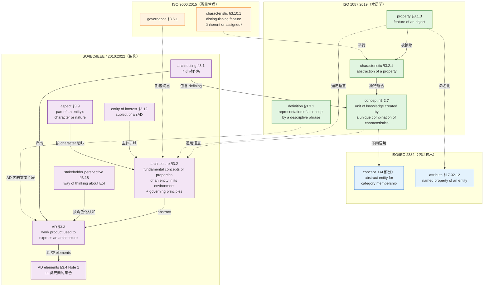

### 2.2 标准引用树（引用频度）

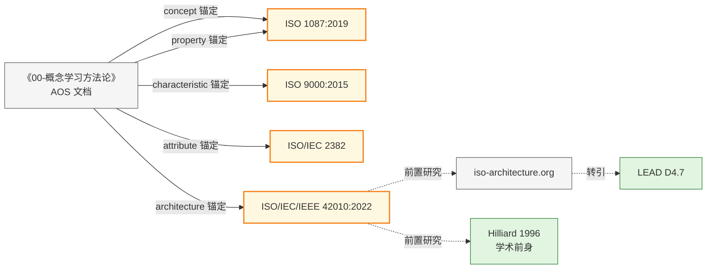

---

## 3. concept（概念）的权威定义

### 3.1 ISO 1087:2019 §3.2.7（现行版）核心定义

**verbatim**：

> **concept** — unit of knowledge created by a unique combination of characteristics
>
> Note 1: Concepts are not necessarily bound to particular natural languages. They are, however, influenced by the social or cultural background which often leads to different categorizations.
>
> Note 2: This is the concept 'concept' as used and designated by the term "concept" in terminology work. **It is a very different concept from that designated by other domains such as industrial automation or marketing.**

中文表述（对应国标译文惯例）：

> **概念** —— 由特性的独特组合而形成的知识单元。
>
> 注1：概念不必然绑定特定自然语言，但会受到社会或文化背景的影响。
> 注2：这是术语学语境下"concept"这一概念，与工业自动化、营销等领域使用的同名概念**完全不同**。

> **关键自警**：ISO 1087 自己已在 Note 2 中明示——这是术语学语境的 concept，与工业自动化、营销领域的 concept 不是同一个认知对象。

### 3.2 解读定义的三个关键点

#### (1) 知识单元（unit of knowledge）

- **认知层定位**：概念被定位在**知识层**而非**语言层**——这是术语学的"符号学三角形"基础：
  - 对象（object） — 概念（concept） — 指称（designation）
- **与语言解耦**：Note 1 明示——概念不绑定特定自然语言（同一概念可用中文、英文、法文术语指称）
- **关键推论**：concept ≠ 术语（term）——后者是语言的指称单位

#### (2) 特性（characteristic, ISO 1087 §3.2.1）

- **定义**：characteristic = **abstraction of a property**（属性的抽象）
- **构成材料**：concept 的原料是 characteristic，unique combination 后形成 concept
- **术语学层级**：property（对象层） → characteristic（抽象层） → concept（知识层）

#### (3) 独特组合（unique combination）

- **边界判定**：用于区分相关概念的那部分 characteristic 叫**区分性特性（delimiting characteristic, §3.2.5）**
- **下定义机制**：definition（§3.3.1）= 上位概念（superordinate concept） + 区分性特性
- **可校验性**：unique combination 决定了 concept 的边界——同一组 characteristic 不能同时形成两个不同的 concept

### 3.3 概念结构的可视化模型（Mermaid 图）

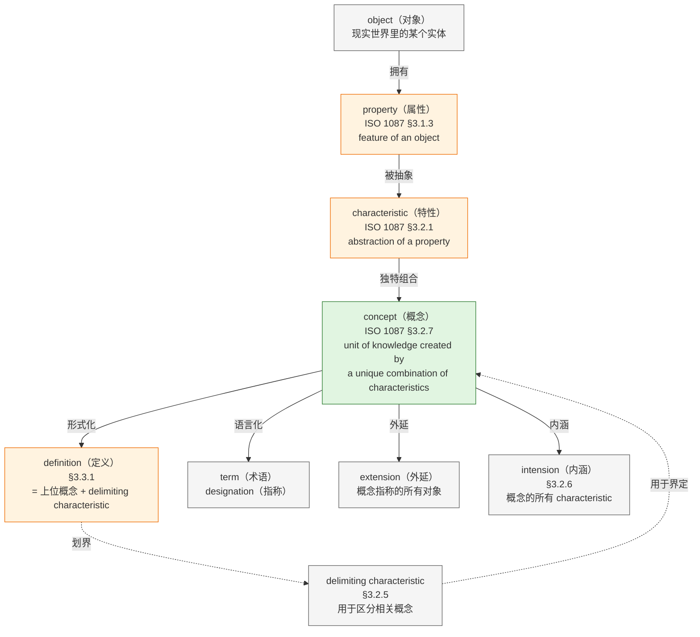

### 3.4 concept 版本谱系

| 标准 | 条款 | 定义文本 | 状态 |
|---|---|---|---|
| **ISO 1087:2019** | §3.2.7 | unit of knowledge created by a unique combination of characteristics | **现行**，取代 1087-1 |
| **ISO 1087-1:2000** | §3.2.1 | 同上（承认同义词 notion） | 已废止，但文献引用最广 |
| **ISO 10241-1:2011**（标准化术语条目编写规范） | §3.2.1 | 直接引用 1087-1:2000 §3.2.1 | 现行 |
| **ISO 704:2009**（术语工作原则与方法） | — | 补充立场：概念"不仅应视为思想单元，也应视为知识单元" | 现行 |
| **GB/T 15237.1-2000** | — | 等效采用 ISO 1087-1：由特征的独特组合而形成的知识单元 | 国标对应 |
| **GB/T 10112** | — | 术语工作原则 | 国标对应 |

> **版本号细节**：2019 版只是**条款号**从 §3.2.1 → §3.2.7，**定义文本一字未改**——所以老文献引用 1087-1:2000 §3.2.1 的定义依然有效，只需换条款号。

### 3.5 concept 三语境对照（跨标准语境辨析）

这是本次研究中**最核心的精度发现之一**——同名异义。

| 维度 | ISO 1087:2019 §3.2.7（术语学） | ISO/IEC/IEEE 42010:2011/2022 §3.2（架构） | ISO/IEC 2382（IT/AI） |
|---|---|---|---|
| **原文 verbatim** | unit of knowledge created by a unique combination of characteristics | fundamental concepts or properties of a system/entity in its environment embodied in…（§3.2 整句） | abstract entity for determining category membership |
| **是否在 §3 中定义** | ✅ §3.2.7 严格定义 | ❌ §3 Terms and definitions 中**没有** concept 这一条 | ✅ ISO/IEC 2382-31:2001 §31.01.05 定义 |
| **认知层定位** | 知识层（unit of *knowledge*） | 理念层（idea / notion，通用语意） | 分类层（abstract entity for category membership） |
| **与语言的关系** | 概念不绑定特定语言（Note 1） | 通用词，标准未表态 | 抽象实体，与语言无关 |
| **构成机制** | property abstract → characteristic → unique combination → concept | 无机制——是系统本质的抽象 | 与"确定类别成员资格"的能力绑定 |
| **对应动作** | 定义（definition）、术语指称（designation） | 体现（embody）于元素、关系、原则 | 用于类化、聚类（concept learning, conceptual clustering） |
| **是否需文档化** | 不要求 | 可不必写出（2011 修订理由明文） | 抽象实体，与文档化无关 |
| **典型用例** | 概念体系构建、术语工作 | 架构定义 | 机器学习、知识图谱 |

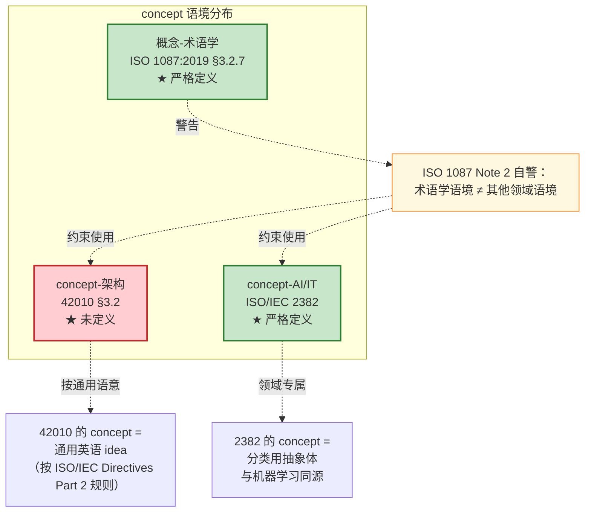

### 3.6 关键发现：42010 §3.2 中的 "concept" 不是 ISO 1087 严谨意义上的"概念"

#### 证据一：§3 Terms and definitions 列表（42010:2011）

| 条款 | 术语 |
|---|---|
| 3.1 | architecting |
| **3.2** | **architecture**: *fundamental concepts or properties of a system in its environment embodied in its elements, relationships, and in the principles of its design and evolution* |
| 3.3 | architecture description (AD) |
| 3.4 | architecture framework |
| 3.5 | architecture view |
| 3.6 | architecture viewpoint |
| 3.7 | concern |
| 3.8 | environment |
| 3.9 | model kind |
| 3.10 | stakeholder |

> **注意：没有 "concept"。** 也没有 "property"。

#### 证据二：ISO/IEC Directives Part 2 规则

> 标准条款中未定义的术语，按"普遍接受的含义"使用。

所以 42010 §3.2 中 "concepts" = **日常英语 / 通用语意** ≈ **idea / notion / 抽象理念**——不是 ISO 1087 意义上的"知识单元"。

### 3.7 为什么 42010 写 "concepts or properties"？

这不是随手的并列，而是 2011 版相对 IEEE 1471:2000 的一次**有意识修订**。

> **1471:2000 原文**：the fundamental **organization** of a system embodied in its **components**, their relationships to each other, and to the environment, and the principles guiding its design and evolution
>
> **42010:2011 修订后**：fundamental **concepts or properties** of a system in its environment embodied in its **elements**, relationships, and in the principles of its design and evolution

| 修订项 | 1471:2000 | 42010:2011 | 修订意图 |
|---|---|---|---|
| 主词 | organization | **concepts or properties** | 兼容"主观构思"和"客观感知"两哲学 |
| 主体词 | components | **elements** | 泛化（不只软件组件） |
| environment | 含在 relationships 里 | **单列** | 强调环境是独立维度 |

### 3.8 "concepts or properties" 背后的修订动机（verbatim 引述）

> **Hilliard 维护的 iso-architecture.org / "Defining architecture" 页面**（与 42010:2011 同步发布，相当于标准的"非正式但权威"伴随页）：
>
> > The definition was chosen **(1) to accommodate the broad range of things listed above under System: the architecture of X is what is fundamental to X (whether X is an enterprise, system, system of systems, or some other entity); and (2) to emphasize (via the phrase "concepts or properties") that a system can have an architecture even if that architecture is not written down**.

中文翻译：
> 选择这一定义：(1) 兼容上文 System 下列出的广泛实体类型——X 的架构 = X 的 fundamental，无论 X 是企业、系统、系统之系统还是其他实体；(2) 强调（通过 "concepts or properties" 这一短语）即使架构没被写出，系统也拥有架构。

#### "concepts" 与 "properties" 在这里的真正分工

- **concepts** = 架构尚未被文档化的、抽象层面的"理念 / 思路"——idea 层（架构师脑中、对话里）
- **properties** = 系统的可观测特征、客观属性——characteristic 层（落到元素、关系、原则上后可见）
- 两者合起来：无论架构是否落成文档，**系统本身就有架构**

### 3.9 对方法论的启示

这一组对比正好是个**反面教材**：同形异义词（homonym）在跨标准语境里会造成系统性误读。在《00-概念学习方法论》里坚持"先锚定语境再讨论"是对的——讨论前必须回答三个问题：

1. 这是哪部标准的哪个条款？
2. 该标准的 §3 Terms and definitions 里**有没有**定义这个词？
3. 如果没定义，是按"通用语意"使用吗？还是有隐含的领域定义？

**判定原则**：如果术语在多部标准都出现，先确认每部标准是否在 §3 定义；只在一处定义时用该标准为锚；多处定义时**逐一定位、不混用**。

---

## 4. property（属性）的权威定义

### 4.1 ISO 1087:2019 §3.1.3 核心定义（对象层基础锚）

**verbatim**：

> **property** — feature of an object (3.1.1)
>
> EXAMPLE 1 'Being made of wood' as a property of a given 'table'.
> EXAMPLE 2 'Belonging to person A' as a property of a given 'pet'.
> EXAMPLE 3 'Having been formulated by Einstein' as a property of a given 'E=mc²'.
> EXAMPLE 4 'Being compassionate' as a property of a given 'person'.
> EXAMPLE 5 'Having a given cable' as a property of a given 'computer mouse'.
>
> Note 1: One or more objects can have the same property.

中文表述：

> **属性** —— 对象的特征。
>
> 例1：'由木料制成'是某'桌子'的属性。
> 例2：'属于 A 这个人'是某'宠物'的属性。
> 例3：'由爱因斯坦提出'是'公式 E=mc²'的属性。
> 例4：'有同情心'是某'人'的属性。
> 例5：'装有一根给定的线缆'是某'计算机鼠标'的属性。
>
> 注1：一个或多个对象可以具有相同的属性。

> **关键观察**：ISO 1087 这里**没有用 "inherent" 限定**——property 是**对象的任何特征**（feature），包括固有的和赋值的。这是与 ISO 9000 的关键区别。

### 4.2 ISO 9000:2015 §3.10.1 characteristic（质量管理语境）

**verbatim**：

> **characteristic** — distinguishing feature
>
> Note 1: A characteristic can be **inherent or assigned**.
>
> Note 2: A characteristic can be **qualitative or quantitative**.
>
> Note 3: There are various classes of characteristic, such as the following:
> a) **physical** (e.g. mechanical, electrical, chemical or biological characteristics);
> b) **sensory** (e.g. related to smell, touch, taste, sight, hearing);
> c) **behavioural** (e.g. courtesy, honesty, veracity);
> d) **temporal** (e.g. punctuality, reliability, availability, continuity);
> e) **ergonomic** (e.g. physiological characteristic, or related to human safety);
> f) **functional** (e.g. maximum speed of an aircraft).

中文表述：

> **特性** —— 区别性特征。
>
> 注1：特性可以是固有的或赋予的。
>
> 注2：特性可以是定性的或定量的。
>
> 注3：特性有多种类别，如下列类别：
> a) 物理的（如机械、电气、化学或生物特性）；
> b) 感官的（如与气味、触觉、味觉、视觉、听觉相关的特性）；
> c) 行为的（如礼貌、诚实、真实）；
> d) 时间的（如准时性、可靠性、可用性、连续性）；
> e) 工效学的（如生理特性，或与人的安全性相关的特性）；
> f) 功能的（如飞机的最大速度）。

#### 关键差异：ISO 9000 characteristic vs ISO 1087 property

| 维度 | ISO 1087 characteristic（§3.2.1） | ISO 9000 characteristic（§3.10.1） |
|---|---|---|
| 性质 | abstraction of a property | distinguishing feature |
| 限定 | 无（继承 property 的所有特征） | inherent or assigned；qualitative or quantitative |
| 目的 | 用于概念构造 | 用于"区别"——区别性是隐含限定 |
| 范畴 | 术语学上下文 | 质量管理上下文 |

> **关系**：ISO 1087 的 characteristic 是抽象层；ISO 9000 的 characteristic 是质量管理语境的特殊化版本，强调"区别"——即 delimiting characteristic（§3.2.5）的同义概念。

### 4.3 ISO/IEC 2382-17:1999 §17.02.12 attribute（IT/数据库语境）

**verbatim**：

> **attribute** — A named property of an entity.
>
> Example: "Blue" is an attribute value for the attribute "color".

中文表述：

> **属性 / 属性值** —— 实体的命名属性。
>
> 例：'蓝色' 是属性 '颜色' 的属性值。

#### 关键解读

- **attribute 是 property 的"命名化"** —— 每个 attribute 都对应一个 attribute value
- **例**：attribute = "color"，attribute value = "blue"
- **数据库语义**：数据库表的"列"在术语层 = attribute = (attribute name + attribute value) 组合

### 4.4 property 四语境对照（跨标准语境辨析）

| 语境 | 标准 | 条款 | verbatim 定义 | 核心限定 |
|---|---|---|---|---|
| **术语学** | ISO 1087:2019 | §3.1.3 | feature of an object | 无限定——任何特征 |
| **质量管理** | ISO 9000:2015 | §3.10.1（characteristic） | distinguishing feature | inherent / assigned；qualitative / quantitative |
| **信息技术-数据库** | ISO/IEC 2382-17:1999 | §17.02.12（attribute） | A named property of an entity | 必须命名 + 配 attribute value |
| **架构** | ISO/IEC/IEEE 42010 | §3.2 | 未定义（按通用语意）| + fundamental 限定 |

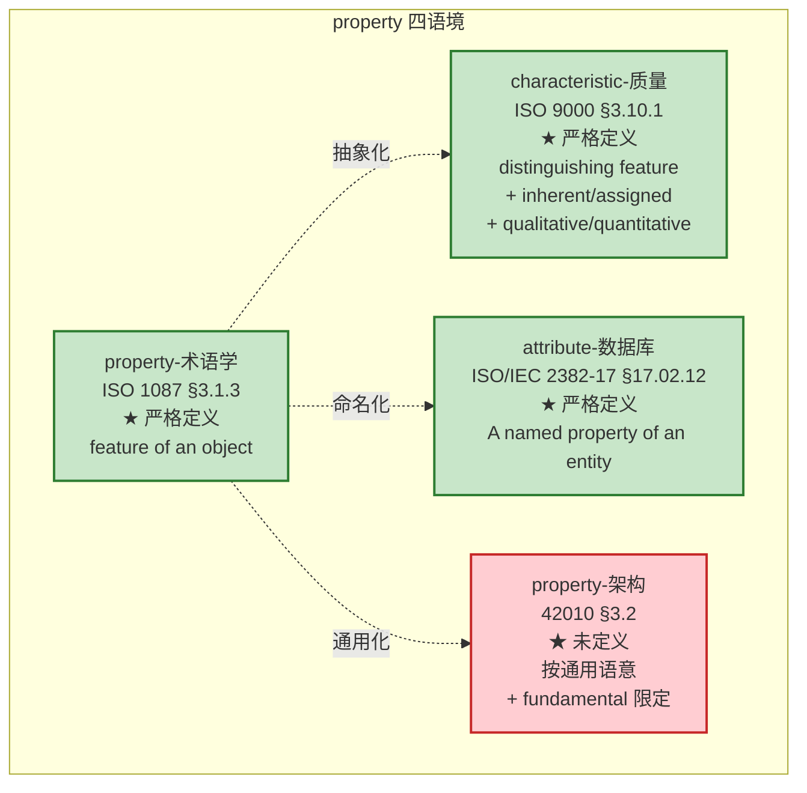

> **核心洞察**：四个标准给的 property 含义**逐层收敛**——
>
> `ISO 1087（任何特征）→ ISO 9000（特征 + 区别性）→ ISO/IEC 2382（命名属性）→ 42010（fundamental + 通用语意）`

### 4.5 三层抽象链：property → characteristic → concept

这是这次研究最精密的输出——ISO 1087 体系内**自下而上**的认知抽象链：

```
property（对象特征）        ── ISO 1087 §3.1.3
        ↑ 抽象
characteristic（特性的抽象）  ── ISO 1087 §3.2.1
        ↑ 独特组合
concept（知识单元）         ── ISO 1087 §3.2.7
```

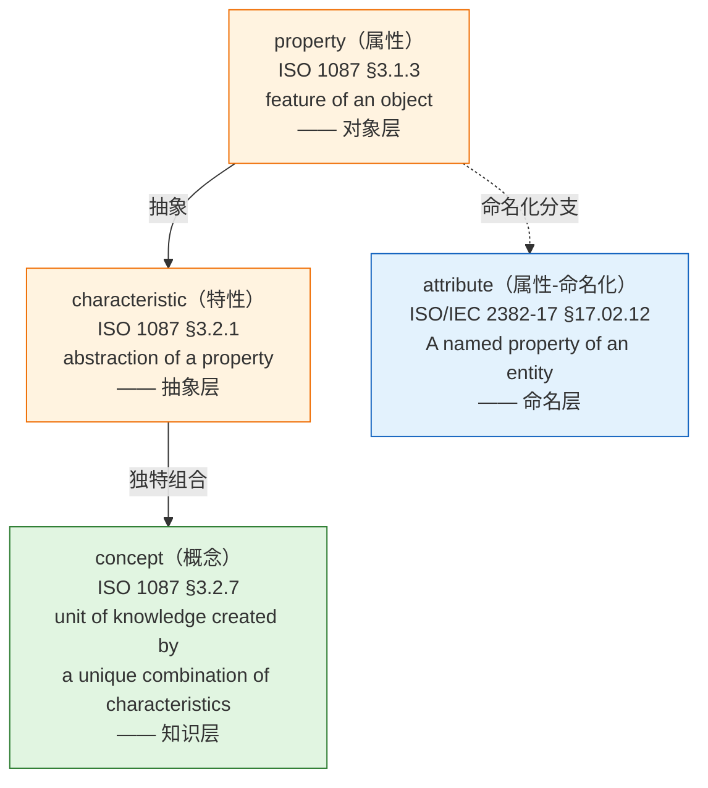

### 4.6 42010 §3.2 中 "fundamental properties" 的回推

42010 §3.2 中的 properties **不是 ISO 1087 严格意义上的** property——但**高度相关**。理由有三：

| 维度 | 解读 |
|---|---|
| **同源性** | "fundamental properties" 中的 properties 是 system/entity 的客观特征——与 ISO 1087 §3.1.3 property 在内涵上重合 |
| **抽象度** | 42010 没把 property 进一步抽象成 characteristic——直接说 property（feature of system） |
| **限定符 fundamental** | 42010 加了 fundamental 限定，与 ISO 9000 §3.10.2 "quality characteristic" 的逻辑类似（quality characteristic = **inherent** characteristic related to a requirement） |

所以 42010 的 properties = **fundamental properties** ≈ **inherent characteristics** + 与系统目的相关。**这是 ISO 9000 §3.10.2 quality characteristic 在架构语境的精炼版**。

---

## 5. architecture（架构）的权威定义

> **本章节定位**：以 **ISO/IEC/IEEE 42010:2022** 为最新权威依据展开分析；42010:2011、IEEE 1471:2000、Hilliard 1996 学术前身仅作为**历史对照**置于"§5.2 历史对照"小节，用于说明措辞演变的来龙去脉，不参与主体分析。**所有"架构"的定义引用与分析都以 2022 版为准。**

### 5.1 主线定义：42010:2022 §3.2 verbatim

> **architecture** — fundamental concepts or properties of an entity in its environment and governing principles for the realization and evolution of this entity and its related life cycle processes
>
> **架构** —— 一个实体在其环境中的基本概念或属性，以及用于该实体及其相关生命周期过程的实现和演化的治理原则（用户 V3 精炼译文）

**逐块拆解**：

| 块 | 内容 | 句法角色 |
|---|---|---|
| **X 块（抽象本体）** | fundamental concepts or properties of an entity in its environment | 架构**是什么** |
| **Z 块（治理准则）** | and governing principles for the realization and evolution of this entity and its related life cycle processes | 架构**如何被治理**（2022 升格） |

> **关键事实**（42010:2022）：原 2011 版中 "embodied in its elements, relationships, and in the principles of its design and evolution" 的**具象化三块**已被剥离——elements/relationships 不再并列于 architecture 句法内，而是被并入 life cycle processes 表达；principles 升格为 **governing** 角色。详见 §7。

### 5.2 历史对照：措辞演变时间线（1996 → 2000 → 2011 → 2022）

> **本节作为历史对照阅读**——仅供理解"为什么 2022 这么定义"，分析锚点仍以 **42010:2022** 为准。

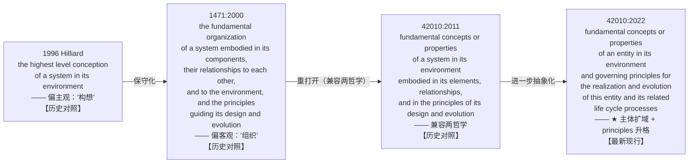

**逐版 verbatim（历史对照）**：

#### 5.2.1 【历史对照】IEEE 1471:2000

> **architecture** — the fundamental **organization** of a system embodied in its **components**, their **relationships to each other, and to the environment**, and the **principles** guiding its design and evolution

#### 5.2.2 【历史对照】ISO/IEC/IEEE 42010:2011 §3.2

> **architecture** — fundamental **concepts or properties** of a **system** in its **environment** embodied in its **elements, relationships**, and in the **principles** of its design and evolution

#### 5.2.3 【★ 最新现行】ISO/IEC/IEEE 42010:2022 §3.2

> **architecture** — fundamental concepts or properties of an **entity** in its environment **and governing principles** for the **realization and evolution** of this entity and its related **life cycle processes**

### 5.3 逐块拆解（结构层）—— X 块 / Z 块

**42010:2022 拆解**（**2022 句法**：X 块 + Z 块并列；elements/relationships 不再并列）：

```
 ┌────────────────────────────────────────────────────────────────────────────┐
 │              architecture（§3.2 一句话，长定语 + 主句并列）                  │
 └─────────────────────────────────┬───────────────────────────────────────────┘
                                 │
                ┌────────────────┴─────────────────┐
                ▼                                  ▼
      X 块（抽象本体）                            Z 块（治理准则）
      fundamental concepts                  governing principles
      or properties                          for the realization
      of an entity                          and evolution of this
      in its environment                    entity and its related
                                             life cycle processes
            │                                   │
      ┌─────┴─────┐                       ┌─────┴─────┐
      ▼           ▼                       ▼           ▼
   concepts  properties               realization  evolution
   (idea)    (perception)             life cycle processes
                                            │
                                            ▼
                                 (2011 版 embodied-in 三块
                                  elements + relationships
                                  在 2022 版被并入此处
                                  —— 历史对照)
```

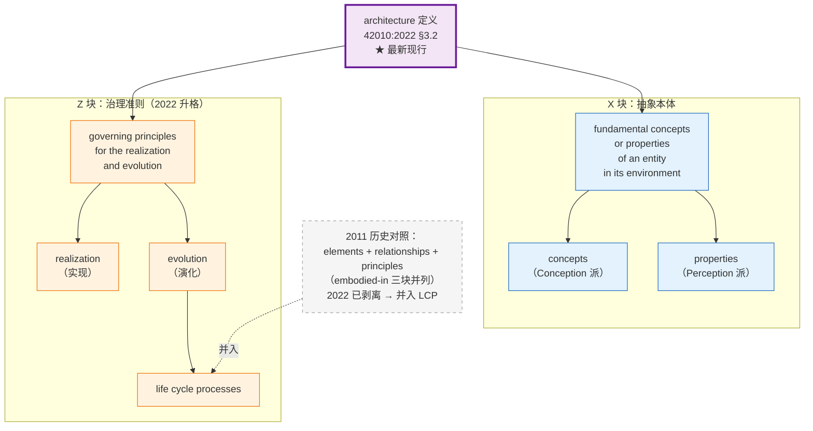

### 5.4 定义背后的两哲学：Conception / Perception（42010:2011 配套页，2022 通过 stakeholder perspective 标准化为正式条款）

#### 5.4.1 引自 iso-architecture.org / "Defining architecture"（42010:2011 配套发布；2022 仍为有效解释）

> The disjunction, **concepts or properties**, was chosen to support **two different philosophies without prejudice**. These philosophies are:
>
> - **Architecture as Conception**: an architecture is a concept of a system in one's mind;
> - **Architecture as Perception**: an architecture is a perception of the properties of a system.
>
> Under either philosophy, an architecture is **abstract — not an artifact**.
>
> The Standard uses another term, **architecture description**, to refer to artifacts used to express and document architectures.

中文翻译：

> 选用 "concepts or properties" 这一**析取式**短语，是为了**不带偏见地兼容两种不同的哲学**：
>
> - **架构作为构思（Conception）**：架构是某个存在于人脑中的系统概念；
> - **架构作为感知（Perception）**：架构是观察者对系统属性（properties）的感知。
>
> 无论哪一种哲学，**架构都是抽象的——不是工作产品**。
>
> 本标准使用另一术语——**架构描述（architecture description）**——来指代用于表达和记录架构的工作产品。

#### 5.4.2 【历史对照】42010:2011 §4.2.1 自带脚注

> This International Standard distinguishes an architecture of a system from an architecture description. Architecture descriptions, not architectures, are the subject of this International Standard. Whereas an architecture description is a work product, **an architecture is abstract, consisting of concepts and properties**.

中文：

> 本标准区分"系统的架构"与"架构描述"。本标准规范的是后者（**架构描述**），不是前者（架构）。架构描述是工作产品；**架构是抽象的，由 concepts 和 properties 构成**。

> **注**：以上 2011 脚注虽属历史对照，**但其哲学立场（architecture = abstract，由 concepts 与 properties 构成）**与 42010:2022 仍然一致——2022 把"concepts or properties"保留在 X 块、并新增 stakeholder perspective（§3.18）把"以不同认知视角看架构"标准化为正式条款，正是对 Conception/Perception 两哲学的延伸。

#### 5.4.3 两哲学可视化

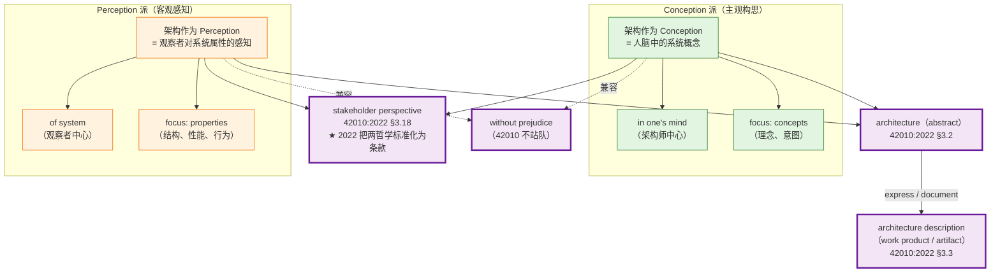

### 5.5 42010:2022 architecture 定义的修订细节（相对 2011，Foreword verbatim 节选）

> **本节为"最新版相对前一版的修订说明"**——以 42010:2022 为锚点，列出 2022 vs 2011 的具体改动，便于掌握 2022 的精确语义。

| 序号 | 修订项 | 2011 → **2022（现行）** | 修订意图 |
|---|---|---|---|
| 1 | **主体扩域** | system of interest → **entity of interest (EoI)** | 兼容 ISO/IEC/IEEE 42020/42030、扩到非系统实体（数据、过程、业务、任务、服务……） |
| 2 | **principles 升格** | principles 之一 → **governing principles** + realization & evolution & life cycle processes | principles 由"构件并列"升为"治理"角色 |
| 3 | **embodied-in 三块剥离** | embodied in elements, relationships, and principles | elements / relationships 并入 life cycle processes |
| 4 | **新增 Aspect** | — → §3.9 aspect | 直接呼应"按 aspect 切块的清单化定义" |
| 5 | **新增 Stakeholder Perspective** | — → §3.18 stakeholder perspective | 把 Architecture as Conception/Perception 哲学标准化为正式条款 |
| 6 | **ADF 改名** | Architecture Framework → **Architecture Description Framework (ADF)** | 区分于 ISO/IEC/IEEE 42030 中的"评估框架" |
| 7 | **Architecture View Component** | Architecture Model → **Architecture View Component** | 一段视图可能含非模型化部分（图表、表格、文本） |
| 8 | **元模型从 UML 改为非正式 ER 图** | — | 降低非 UML 用户理解门槛 |

### 5.6 "concepts or properties" 的兼容性是哲学折中——

| | Conception 派 | Perception 派 |
|---|---|---|
| 立场 | 架构是**主观构思** | 架构是**客观感知** |
| 视角 | 架构师/设计者中心 | 观察者/使用者中心 |
| 重点 | concepts（脑中的概念） | properties（系统的属性） |
| 典型领域 | 软件架构、企业架构（强目的性） | 系统架构（关注结构/性能等属性） |
| 文档化前提 | 需要被构想出来 | 需要被感知到 |
| **2022 标准化** | stakeholder perspective §3.18 | stakeholder perspective §3.18 |

> **关键哲学决策**：42010 工作组明确表态 "**without prejudice**"（不带偏见）——它不站队，所以用 "concepts or properties" 让两种立场都能找到对应的"证据"。
>
> **历史脉络对照**：1996 年 Hilliard 那版用的是 "conception"（构思）；1471:2000 改成 "organization"（组织）——这是个保守化，把"主观构思"压成了"客观结构"；2011 重新把它打开，用 "concepts or properties" 兼容了"主观"与"客观"两端；**2022 又把 embodiment（具象化落点）剥离，让架构更纯抽象**。这四个版本是逐层递进抽象化的过程。

---

## 6. architecture description（AD，架构描述）的权威定义

> **本章节定位**：以 **ISO/IEC/IEEE 42010:2022** 为最新权威依据；2011 版 verbatim 仅作为"历史对照"参考，不参与主体分析。

### 6.1 ★ 最新现行：42010:2022 §3.3 verbatim

> **architecture description; AD** — work product used to express an architecture
>
> Note 1: A work product is an artifact produced by a process (see ISO/IEC 20246:2017, 3.18).
>
> Note 2: An AD is a **tangible representation of information** provided to the stakeholders. An AD is considered an information part.

关键词：work product / artifact / tangible / information part。**AD 是物质化的、可触的工作产品**——不是"一段定义文字"。

#### 【历史对照】42010:2011 §3.3

> **architecture description (AD)** — work product used to express an architecture

> **对比说明**：2022 版相对 2011 版**核心定义文字一字未改**——但新增了 Note 1（指向 ISO/IEC 20246:2017 的 work product 定义）和 Note 2（"tangible representation of information" 显式标定 AD 性质）。**所有 AD 的引用以 2022 版为准**。

### 6.2 42010:2022 §3.4 Note 1 完整 11 类 AD elements 清单（verbatim）

> AD elements include **stakeholders** (3.17), **concerns** (3.10), **stakeholder perspectives** (3.18), and **aspects** (3.9) identified in an AD, **ADLs** (3.6), **ADFs** (3.5) and **correspondences** (3.11) and correspondence methods used in an AD, and **architecture views** (3.7), **view components** (3.19), **architecture viewpoints** (3.8), and **model kinds** (3.15) included in an AD.

数一下——**11 类 AD elements**：

1. **stakeholders**（干系人）§3.17
2. **concerns**（关注点）§3.10
3. **stakeholder perspectives**（干系人视角组）§3.18（★ 2022 新增）
4. **aspects**（方面）§3.9（★ 2022 新增）
5. **ADLs**（架构描述语言）§3.6
6. **ADFs**（架构描述框架）§3.5（★ 改名：Architecture Framework → ADF）
7. **correspondences**（对应规则）§3.11
8. **correspondence methods**（★ 2022 明化）
9. **architecture views**（架构视图）§3.7
10. **view components**（视图组件）§3.19（★ 改名：Architecture Model → View Component）
11. **architecture viewpoints + model kinds**（视图视点 + 模型种类）§3.8 / §3.15

> **关键观察**：**"definition" 根本没单列**——它可能以 stakeholders/concerns/aspects 的描述形式出现（词条层），但**作为元素类别它不独立**。

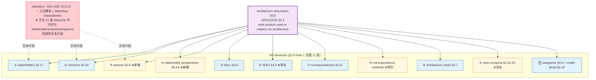

### 6.3 AD vs definition 精度辨析

| 术语 | 标准定义 | 关键性质 |
|---|---|---|
| **description**（描述） | 用文字/图/模型/表/代码等**任何 artifact** 表达某物 | 通用动词，可指任何形式的刻画 |
| **definition**（定义） | ISO 1087 §3.3.1：representation of a concept by a descriptive phrase which serves to differentiate it from related concepts —— 用**描述性短语**划界 | 描述的**特殊形式**：简短、精确、只用于概念划界 |
| **AD（架构描述）** | 42010:2022 §3.3：work product used to express an architecture | 42010 专有术语，是 description 这个动作的产物 |

关系是**包含**：**description ⊃ definition**，AD ⊃ definition。AD 是 42010 语境下的 description 产物。

#### 常见误用

| 误用 | 你以为的"定义" | 实际定位 |
|---|---|---|
| M1. "AD 是一份对架构的 definition" | 单个 definition 文本 | 漏掉 11 类 elements |
| M2. "AD 是 architecting 的 definition（动）动作的产物" | 准确 | ✓ |
| M3. "AD 包含若干 definition" | 准确 | ✓ |
| M4. 把 ADF / ADL / viewpoints 混为一谈 | 不同元素类 | 需区分 |

### 6.4 architecting（42010:2022 §3.1）的 7 步动作集（verbatim）

> **architecting** — conceiving, **defining**, expressing, documenting, communicating, certifying proper implementation of, maintaining and improving an architecture throughout the life cycle of an entity of interest

7 步动作：
1. **conceiving**（构思）—— Conception 派
2. **defining**（定义）—— 用 concept+property 清单定义架构；地产物 = definition 文本集
3. **expressing**（表达）—— 形式化为 AD
4. **documenting**（记录）—— 落 artifact
5. **communicating**（传递）—— 给 stakeholders
6. **certifying proper implementation**（认证实现）—— 验证符合
7. **maintaining and improving**（维护改进）—— life cycle 持续

> **关键观察**：**"defining"**（动词）是 architecting 的七步动作之一——这一步的产物就是"用概念+属性清单定义架构"。所以 **42010 体系内 architecting 的合法动作包含 "基本概念+属性清单定义架构"**——这与本研究第 8 章精度辨析相呼应。

---

## 7. 42010:2022 三处关键修订与新概念引入

### 7.1 system → entity of interest (EoI) §3.12

**verbatim**：

> **entity of interest; EoI** — subject of an architecture description
>
> EXAMPLE: Enterprise, organization, solution, system (including software systems), subsystem, process, business, **data (as a data item or data structure)**, application, **information technology (as a collection)**, mission, product, service, software item, hardware item, product line, family of systems, system of systems, collection of systems, collection of applications.

| 维度 | 解读 |
|---|---|
| **EoI 是什么** | AD 的主体——可包括 enterprise、business、data、process、mission、product、service 等 |
| **与 system 的关系** | **扩域**——data 架构、企业架构、过程架构都合法 |
| **EXAMPLE 范围** | 不止传统系统——这是 2022 的关键扩域 |

#### 对命题链的反推

| 用户之前命题 | 2011 视角 | 2022 视角 |
|---|---|---|
| "**系统**的基本概念和基本属性清单" | system-only | EoI = system ∪ enterprise ∪ data ∪ process ∪ business ∪ mission ∪ ... |
| 架构能不能用于"非系统实体"？ | 仅 system 限定 | EoI 打开——**数据架构、企业架构、过程架构都合法** |

### 7.2 principles → governing principles

| 维度 | 2011 | 2022 |
|---|---|---|
| 句法位置 | 与 elements、relationships 并列 | **升为 governing**——是"治理"层 |
| 文本措辞 | principles of its design and evolution | governing principles **for the realization and evolution** of this entity **and its related life cycle processes** |
| 性质 | 是架构 embodied-in 的三块之一 | 是 architecture 的**核心组成**——governing |
| 在 AD 中的位置 | 与 views/stakeholders 并列 | 仍然是 AD elements 之一，但定义中已升为"治理"角色 |

> **关键含义**：principles 现在不只是"清单"——是"治理清单"。"governing" 暗示它们**有约束力**（约束后续 realization 和 evolution）。

### 7.3 新增 aspect（§3.9）—— 直接呼应"基本概念+属性清单"

**verbatim**：

> **aspect** — part of an entity's **character or nature**
>
> EXAMPLE Functional, structural and informational aspects of an entity.
>
> Note 1: A particular aspect can be used for capturing the relevant features of the entity of interest as a refinement of one or more concerns under examination with respect to some part of its character, e.g. the structural character, functional character or informational character of the entity.
>
> Note 2: Aspects enable the architect to analyse, address and structure concerns. In general, there is a **many-to-many relation between aspects and concerns**.

| 维度 | 解读 |
|---|---|
| **aspect 是什么** | 实体 character or nature 的**部分**——按"性格/性质"切块 |
| **典型 aspect** | functional / structural / informational / behavioral（标准示例给的） |
| **aspect 与 concern 关系** | 多对多——一个 aspect 可被多个 concern 引用，一个 concern 可跨多个 aspect |
| **aspect 有什么用** | 让架构师 "analyse, address and structure concerns"——**结构化关注点** |
| **与本研究主张的关系** | "基本概念+属性清单"按 aspect 分块 = functional 清单 + structural 清单 + informational 清单 + behavioral 清单——**官方版本** |

> **核心洞察**：用户前几轮主张的"基本概念+属性清单定义架构"，**42010:2022 通过 aspect 这个新概念直接承认并标准化了**。architecture 的 concepts/properties 按 aspect 分块呈现，是 2022 推荐的 AD 内部结构。

### 7.4 新增 stakeholder perspective（§3.18）—— 把 Conception/Perception 哲学标准化

**verbatim**：

> **stakeholder perspective** — way of thinking about an entity of interest, especially as it relates to concerns
>
> EXAMPLE: The labels given to the middle three rows (i.e. owner, designer and builder) of the Zachman framework correspond to stakeholder perspectives. The rows in the Unified Architecture Framework and NATO Architecture Framework grids correspond to stakeholder perspectives (although they are called "domains" and "subjects of concerns," respectively in those frameworks).

| 维度 | 解读 |
|---|---|
| **是什么** | "思考 EoI 的方式"——**认知层级**的切块 |
| **典型 perspective** | owner / builder / designer / operator / developer / maintainer / certifier / regulator（Zachman 框架示例） |
| **与 conception/perception 关系** | conception 偏主观、perception 偏客观、perspective 偏**角色化认知**——三个视角并存 |

> **核心洞察**：本研究第 5 章讨论的 "Architecture as Conception / Perception"（来自 iso-architecture.org 配套页）——**2022 通过 stakeholder perspective 把它标准化为正式条款**。Conception/Perception 不再只是哲学讨论，是 AD 必须识别的元素之一。

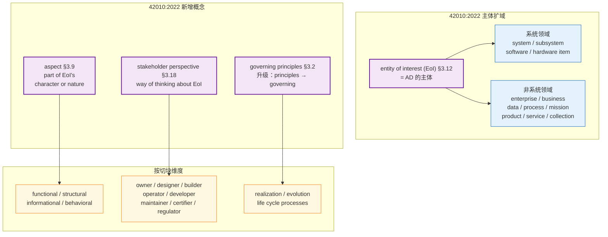

---

## 8. 精度辨析的多层切片框架

> 本章总结本研究中**反复出现的精度辨析模式**——以 4 个具体切片为案例，建立 L1-L5 五层框架与三组限定词辨析模板。

### 8.1 切片 1：concepts vs property × abstract vs artifact（2×2 矩阵）

|  | **Concept 侧**（Conception 派） | **Property 侧**（Perception 派） |
|---|---|---|
| **Architecture（abstract）** | 架构师脑中的 concepts：理念、思路、意图 | 观察者感知到的 properties：系统的客观特征 |
| **AD（work product）** | 描述/记录出来的 concepts：术语表、定义文档、原则说明 | 描述/记录出来的 properties：视图、模型、规格表、数据字典 |
| **进入架构的动作** | 构思（conceive） | 感知（perceive） |
| **形成 AD 的动作** | 描述/记录 | 描述/记录 |

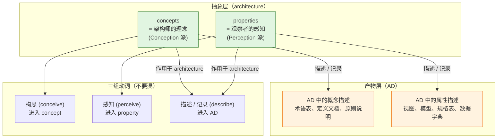

#### 三个动词区分

| 动作 | 主体 | 客体 | 产出 | 标准术语 |
|---|---|---|---|---|
| **构思 (conceive)** | 架构师 | 脑中的概念 | concepts（抽象） | 属 Conception 派 |
| **感知 (perceive)** | 观察者 | 系统的特征 | properties（被识别的抽象） | 属 Perception 派 |
| **描述 / 记录 (describe)** | 任何人 | architecture（整体） | **AD**（artifact） | 第三层，独立于前两派 |

### 8.2 切片 2：三层精度（抽象本体 vs 具象载体 vs 产物）

| 层 | 内容 | 是否可清单化 | 标准出处 |
|---|---|---|---|
| **L1 抽象本体** | architecture 是什么 | ❌ 不可 | 42010 §3.2 |
| **L2 definition 集** | 概念词条 + 区分性特性 | ⚠️ 半可（每个概念独立） | ISO 1087 §3.3.1 |
| **L3 概念+属性清单** | 用清单定义一个架构 | ✅ 可 | architecting / 架构风格实践 |
| **L4 构件清单** | elements / relationships / principles | ✅ 可 | 42010 §3.2 Y 块 |
| **L5 AD** | artifact 集合 | ✅ 可 | 42010 §3.3 |

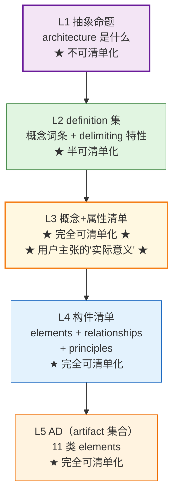

#### 三个澄清问题的升级版

1. 这东西是**性质（nature）**还是**构件（component）**还是**产物（product）**？
   - concepts/properties = 性质
   - elements/relationships/principles = 构件
   - AD = 产物
2. 它位于**抽象层（architecture）**还是**载体层**还是**产物层（AD）**？
3. **能不能列成清单？**——抽象本体不能列（concepts/properties 是 nature，不是 list）；载体能列（elements / relationships / principles）；产物里也能列（AD 内的 views / concerns / stakeholders）。

### 8.3 切片 3：system 限定 vs architecture 限定

| 限定 | 含义 | 落点 |
|---|---|---|
| **system 的** | 主语限定——主体是 system | 但范围是 system 的子集，不是全部 |
| **in its environment** | 关系限定——必须在 system 与 environment 的关系中 | **环境的属性**也算 |
| **fundamental** | 范围限定——只保留最本质的 | 不包括非本质属性 |

architecture 的 concepts/properties 是 **system ∩ environment ∩ fundamental** 的三交集。

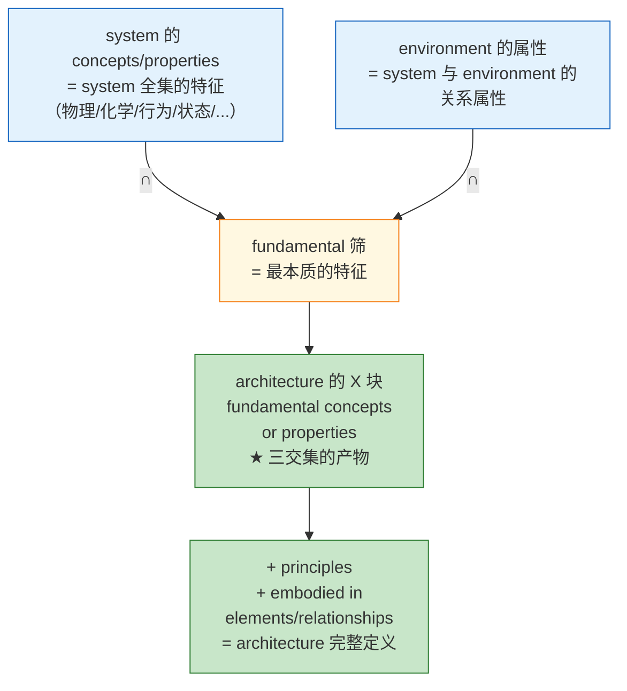

#### 严格化版本（修正原始命题）

| 修正版 | 措辞 | 是否成立 |
|---|---|---|
| V0（用户原始） | "系统的基本概念和基本属性清单" | ⚠️ 范围错位——是 system 不是 architecture |
| V1（去掉"系统的"） | "基本概念和基本属性清单" | ⚠️ 缺 environment + principles——半套 |
| V2（精确化） | "**系统-环境关系中**的 **fundamental concepts/properties** 清单 + **principles** 清单" | ✅ 严格成立——即 L3+L4 完整版 |
| V3（最完整） | V2 + "**embodied in elements + relationships**" 清单 | ✅ 完全——即 L3+L4+L5 综合版 |

### 8.4 切片 4：definition vs description（AD 内的精度）

| 维度 | 严格定位 |
|---|---|
| **definition ⊆ description** | description 是泛指（任何 artifact 的表达）；definition 是 description 的精确形式（划界短语） |
| **AD ⊇ definition** | AD 是 11 类 elements 的集合；definition 只是其中 stakeholders/concerns/aspects 的文本片段 |
| **动/名词区分** | defining（动）≠ definition（名）；defining 是 architecting 的一步动作，definition 是其产物之一 |

### 8.5 三问升级版（含限定词）

1. **主体在哪层？** EoI（含 system/enterprise/data/process/business...）vs architecture vs AD——主体不同，定义不同。
2. **处于哪个 aspect？** functional / structural / informational / behavioral——按 character 切块。
3. **站在哪个 perspective？** owner / designer / builder / operator / developer——按 stakeholder perspective 分组。
4. **遵循哪个 governing principle？** realization / evolution / life cycle processes——principles 是治理清单，不只是描述清单。

### 8.6 切片全图——本研究的精度辨析轨迹

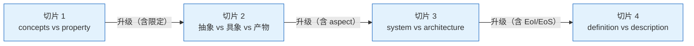

---

## 9. 翻译精度辨析（42010:2022 中文译本）

> **本章节定位**：以 **ISO/IEC/IEEE 42010:2022** 为最新权威依据；2011 版仅作为"历史对照"参考。**所有译文精炼工作都以 2022 版为锚**。

### 9.1 标准原文 verbatim

#### 【★ 最新现行】2022 版（§3.2）

> architecture — fundamental concepts or properties of an entity in its environment and governing principles for the realization and evolution of this entity and its related life cycle processes

#### 【历史对照】2011 版（§3.2）

> architecture — fundamental concepts or properties of a system in its environment embodied in its elements, relationships, and in the principles of its design and evolution

> **对比要点**（仅作历史对照参考）：2011 主体是 system、含 embodied-in 三块；**2022 主体是 entity、剥离 embodied-in、principles 升格 governing**——这些差异对译文的句法和术语都有影响（见 §9.4-9.5）。

### 9.2 ★ 2022 版标准译文（用户精炼后的 V3 版本）

> **架构：一个实体在其环境中的基本概念或属性，以及用于该实体及其相关生命周期过程的实现和演化的治理原则**

### 9.3 中文社区权威译本横向对比（**以 2022 版为锚**）

| 来源 | 译文 | 评注 |
|---|---|---|
| **★ 用户 V3（精炼版，针对 2022）** | 架构：一个实体在其环境中的基本概念或属性，以及用于该实体及其相关生命周期过程的实现和演化的治理原则 | **精度最高**——句法最贴 2022 原文；逐字对齐 entity / governing / life cycle processes |
| pkuair（CSDN，2024-03，针对 2022） | 一个实体在其环境中的基本概念或属性，以及管控此实体及其相关生命周期过程之实现与演化的基本原则 | "管控"+"之"字结构——稍文；其余精度齐 |
| tonydeng（EA-practices，【历史对照】译 2011 版） | 一个系统在其所处环境中所具备的各种基本概念和属性，具体体现为其所包含的各个元素、它们之间的关系，以及架构的设计和演进原则 | **2011 版译文**——主体是 system 不是 entity；体现 embodied-in 三块 |
| 沃尔沃架构论文（【历史对照】） | 一个系统的环境中的基本概念或属性体现在它的元素、关系、以及其设计和演变的原则中 | 最短——丢了介词 |
| Leo_wl（博客园 DDD，【历史对照】译 2011 版） | 一个系统在其所处环境中所具备的各种基本概念和属性，具体体现为其所包含的各个元素、他们之间的关系以及架构的设计和演进原则之中 | 加了"所具备"、"所包含"——口语化 |
| EA 之家韩老师（【历史对照】） | 一个系统在其所处环境中的（系统的）基础概念或属性，其内容包括它的元素、关系和它的设计和演进的原则 | 用"基础"（非"基本"）——偏离 ISO 习惯 |
| 百度百科 / 维基百科 | 沿用 ISO 42010 译文，但简化为"软件整体结构与组件的抽象描述" | 损失了 42010 的精度 |

### 9.4 打磨迭代 V0 → V3

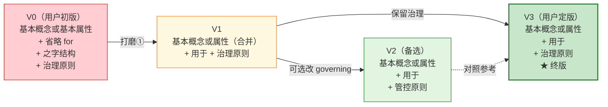

#### 三个打磨点详解

**打磨 ①**：fundamental 的位置和"基本"的出现次数

原文 fundamental **只出现一次**，修饰的是 "concepts or properties" 这个**整体短语**。两种解读：

| 解读 | 译法 | 含义 |
|---|---|---|
| **A. 原文对**（一次修饰整个名词短语） | 基本概念或属性 | "fundamental" 是 concepts or properties 的共同属性 |
| **B. 直译对**（各自修饰） | 基本概念或基本属性 | "fundamental concepts" 与 "fundamental properties" 各自分别 fundamental |

V0 用 B，V3 用 A，**A 更贴合原文**。

**打磨 ②**：丢了 "for" 介词——句法松了一档

原文中 "governing principles **for** the realization and evolution" ——for 把 governing principles 和 realization/evolution 之间的关系钉成"原则**用以指导**实现/演化"。

V0 省略 for；V3 改 "用于" 显化 for，避免误读为"原则 = 实现 + 演化"。

**打磨 ③**："governing" 译法（治理 vs 管控 vs 主导）

| 译法 | 含义 | 评 |
|---|---|---|
| **治理原则**（V3 / 用户） | governance / 制度层 | 与 42010 整本治理语境一致；ISO 9000:2015 把 governance 译"治理" |
| **管控原则**（pkuair 等） | governing / 强制约束 | 突出"有约束力"但带行政味 |
| **主导原则**（部分译） | leading / 主导 | 失去 governance 含义 |

**结论**：用户选"治理"是对的——理由：
1. 42010:2022 全文语境偏治理：aspect / stakeholder perspective / view / correspondence / ADF / ADL 都是治理层词汇
2. ISO 9000:2015 §3.5.1 governance 统一译"治理"
3. "管控"在中文带行政味，与 ISO 治理的"制度约束"不完全重合

### 9.5 关键术语精度对照表

| 术语 | 严格译法 | 替代译法 | 取舍理由 |
|---|---|---|---|
| **fundamental** | 基本 | 基础 | ISO 9000 等国标译法统一用"基本" |
| **concepts** | 概念 | 观念 / 思想 | ISO 1087 术语学译法统一用"概念" |
| **properties** | 属性 | 性质 / 特性 | ISO 1087 §3.1.3 译"属性"（property，客观）；§3.2.1 characteristic译"特性" |
| **embodied in** | 体现于 / 具体体现为 | 具象化于 / 落地于 | ISO 中文习惯译法 |
| **elements** | 元素 | 构件 / 部件 | 2011 改 elements 替代 components 是为了**泛化** |
| **principles** | 原则 | 准则 / 法则 | ISO 9000 译"原则"——一致 |
| **governing principles** | 治理原则 / 管控原则 | 主导原则 | 42010:2022 用 governing 强调治理 |
| **in its environment** | 在其环境中的 | 在其所处环境中的 | 用户 V3 选前者 |
| **realization** | 实现 | 落地 / 实施 | ISO/IEC/IEEE 15288 译"实现" |
| **evolution** | 演化 | 演进 / 演变 | ISO/IEC/IEEE 12207 译"维护"；42010 evolution 译"演化" |
| **life cycle processes** | 生命周期过程 | 全生命周期流程 | ISO/IEC/IEEE 12207 /15288 译"生命周期过程" |
| **system / entity** | 系统 / 实体 | 主体 / 对象 | 2022 用 entity 比 system 更广义，译"实体"打开主体边界 |
| **governance** | 治理 | 管控 | 治理 / governance / ISO 9000:2015 |

### 9.6 翻译陷阱清单（6 条）

| 陷阱 | 错误译法 | 正确译法 |
|---|---|---|
| 1. 丢失 "system" 译"系统"后丢失 2022 entity 的广义性 | 仍译"系统" | 译"实体"——打开非系统主体（数据/业务/企业……）|
| 2. 把 "embodied in" 译成"包含" | "架构包含元素、关系和原则" | 译"体现于"或"具体体现在……中"——避免误读为构件清单 |
| 3. 把 "governing principles" 译成"指导原则" | 失去 governance 含义 | 译"治理原则"或"管控原则"——保留 governance（约束力）|
| 4. 把 "fundamental" 译成"基础" | "基础概念或属性" | 译"基本概念或属性"——ISO 通用译法 |
| 5. 把 "in its environment" 译成"包含环境" | "系统包含其环境" | 译"在其环境中"——environment 是**外部**关系 |
| 6. 把 "life cycle processes" 译成"生命周期管理" | 译宽了 | 译"生命周期过程"——对应 15288 的 life cycle model |

### 9.7 翻译精度辨析的标准动作（5-6 步循环）

| 步骤 | 动作 | 本研究实例 |
|---|---|---|
| ① | 拿到原文 + 已有译文 | 用户拿出 V0 + 我给的三个打磨点 |
| ② | 列出每个打磨点 | fundamental 合一次 / 补 for / 改"之" |
| ③ | 选定译法 | 用户定 V3，保留"治理"、采纳"用于"、采纳 fundamental 合一次 |
| ④ | 给出打磨后版本 | 用户的 V3 |
| ⑤ | 验证 vs 原文逐字对照 | 我做的——确认打磨是否到位 |
| ⑥ | 终版确认 | V3 终版 |

---

## 10. 概念辨析的可移植模板

> 本章总结本研究中沉淀的、可纳入《00-概念学习方法论》的**通用辨析模板**。

### 10.1 术语精度辨析通用流程

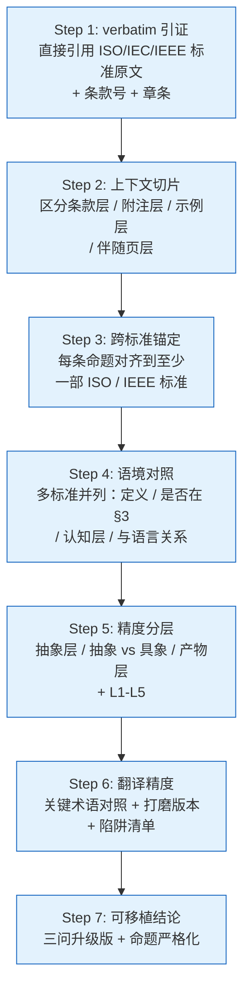

### 10.2 三问升级版（写作 / 评审通用）

#### 三问基础版（v1）

1. 这是哪部标准的哪个条款？
2. 该标准的 §3 Terms and definitions 里**有没有**定义这个词？
3. 如果没定义，是按"通用语意"使用吗？还是有隐含的领域定义？

#### 三问限定版（v2）

1. 这东西是 **system 的**、**architecture 的**、还是 **environment 的**？（限定词）
2. 这东西处于**抽象 / 具象 / 产物**哪一层？（层级）
3. 这东西**与设计/演化相关**吗？**是 fundamental 的吗**？（筛选条件）

#### 三问精度版（v3）

1. 这东西是**性质（nature）**还是**构件（component）**还是**产物（product）**？
2. 它位于**抽象层（architecture）**还是**载体层**还是**产物层（AD）**？
3. **能不能列成清单？**（决定写作时是命题、定义文本还是 AD 集合）

#### 三问升级版（v4，本研究终版）

1. **主体在哪层？** EoI（含 system/enterprise/data/process/business...）vs architecture vs AD
2. **处于哪个 aspect？** functional / structural / informational / behavioral
3. **站在哪个 perspective？** owner / designer / builder / operator / developer
4. **遵循哪个 governing principle？** realization / evolution / life cycle processes

### 10.3 精度辨析的常见陷阱谱

| 陷阱类型 | 实例 | 反模式 |
|---|---|---|
| **同形异义（homonym）** | concept、property 在 4 个 ISO 标准 | 不引条款号就讨论 → 必然撞语义混淆 |
| **抽象 vs 具象** | "架构定义"是清单 | 把"性质"读成"构件" |
| **动名词混用** | defining（动）vs definition（名） | "对架构的定义"歧义大 |
| **限定词错位** | "系统 vs 架构" | "**系统的**基本概念"被读成"**架构的**基本概念" |
| **包含 vs 等同** | AD = definition | AD ⊇ definition，但 AD ≠ definition |
| **概念 vs 动作** | concept vs perceiving | 把"被感知"压成"被描述" |
| **时代化版本漂移** | 仅看 2022 不看 2011 | "concepts or properties" 哲学内涵消失 |
| **翻译精度陷阱** | governing 译成"指导" | 失去 governance 含义 |
| **主语代换不察觉** | system → entity（2022 修订） | 还在用"system 架构"措辞，数据 / 业务架构找不到锚 |

---

## 11. 主要发现与启示

### 11.1 主要发现（10 条）

1. **"概念"的权威 ISO 定义锁定在 ISO 1087:2019 §3.2.7**——"unit of knowledge created by a unique combination of characteristics"。这是术语学严谨定义；跨标准使用时是同形异义。

2. **"属性"的权威 ISO 定义锁定在 ISO 1087:2019 §3.1.3**——"feature of an object"。但跨标准有四语境：术语学（ISO 1087）/ 质量（ISO 9000 characteristic）/ IT 数据库（ISO/IEC 2382 attribute）/ 架构（42010 fundamental property）。

3. **42010 §3 没有定义 "concept" 和 "property"**——按 ISO/IEC Directives Part 2 规则，以"普遍接受含义"使用。在 §3.2 中 "concepts" ≈ idea / notion（通用英语），"properties" ≈ system's objective features。

4. **"concepts or properties" 是哲学兼容设计**——同时容纳 Conception 派（主观构思）与 Perception 派（客观感知），"without prejudice" 工作组表态。这是 2011 版相对 1471:2000 的关键修订。

5. **architecture 措辞演变时间线**：1996 Hilliard "conception" → 1471:2000 "organization"（保守化）→ 42010:2011 "concepts or properties"（重打开）→ 42010:2022 "entity + governing principles"（进一步抽象化 + 主体扩域）。

6. **42010:2022 三处关键修订**：① system → entity (EoI) §3.12 主体扩域；② principles → governing principles 升格；③ 新增 aspect §3.9 + stakeholder perspective §3.18。

7. **aspect（§3.9）直接呼应"基本概念+属性清单"**——architecture 的 concepts/properties 按 aspect 分块呈现（functional / structural / informational / behavioral），是 2022 推荐的清单化定义结构。

8. **stakeholder perspective（§3.18）标准化 Conception/Perception 哲学**——把架构师/观察者视角转为 AD 必须识别的元素之一。

9. **AD 是 11 类 elements 的集合**——definition 不在其中，单单作为 stakeholders/concerns/aspects 文本片段出现。AD ⊋ definition。

10. **用户的"V3 译本"是当前中文社区精度最高的 42010:2022 译文**——保留 entity、governing、life cycle processes 等关键术语的 ISO 体系一致译法。

### 11.2 对 AOS 项目的方法论启示

#### (1) 术语锁定

AOS 文档凡涉及 concept / property / architecture / AD 四个术语，必须：
- 标明 ISO 标准条款号
- 区分 ISO 1087（术语学）vs 42010（架构）vs ISO 9000（质量）vs ISO/IEC 2382（IT）
- 不能跨标准混用

#### (2) 架构定义的可清单化

AOS 写"X 的架构定义"时按 L1-L5 五层框架：

| 层 | 写作规范 |
|---|---|
| L1 抽象命题 | 一句话（参考 V3 译本，不超 30 词） |
| L2 definition 集 | ISO 1087 §3.3.1 风格——上位概念 + delimiting characteristic |
| L3 概念+属性清单 | 按 aspect 分块（functional / structural / informational / behavioral） |
| L4 构件清单 | elements / relationships / principles of design & evolution |
| L5 AD | 11 类 elements 显式覆盖（含 stakeholders / concerns / viewpoints / model kinds / correspondences） |

#### (3) 学术评审与文档写作共用同一精度模板

- **评审**：用三问升级版检查术语是否锁定到 ISO 条款；
- **写作**：用五层框架组织材料，避免混淆"抽象命题 / 定义文本 / 清单 / AD"；
- **翻译**：用 5-6 步循环打磨关键术语。

#### (4) 评审待办

- review vs verification vs validation 仍未交付（用户承过，标在长期 todo）。本研究为后续交付提供了**精度辨析通用模板**——可直接套用。

---

## 12. 引用标准清单（完整 verbatim 引证表）

> **本表标注"本报告地位"列**——明确区分 ★ 最新现行 / 【历史对照】/ 【配套说明】，便于使用者快速定位哪些是主分析依据、哪些是辅助对照。
>
> **核心原则**：报告全部主体分析以带 ★ 的最新现行标准为依据；带【历史对照】标签的仅用于说明措辞演变；带【配套说明】的为标准配套解读页，不是标准正文但同等权威。

| 序号 | 标准号 | 引用条款 | verbatim 引证（中文 / 英文） | 本报告使用章节 | **本报告地位** |
|---|---|---|---|---|---|
| 1 | ISO 1087:2019 §3.2.7 | concept | "unit of knowledge created by a unique combination of characteristics / 由特性的独特组合而形成的知识单元" | 3.1 | **★ 最新现行**（术语学语境 concept 定义） |
| 2 | ISO 1087:2019 §3.1.3 | property | "feature of an object / 对象的特征" | 4.1 | **★ 最新现行**（术语学语境 property 定义） |
| 3 | ISO 1087:2019 §3.2.1 | characteristic | "abstraction of a property / 属性的抽象" | 3.2(3), 4.5 | **★ 最新现行**（property→characteristic→concept 抽象链） |
| 4 | ISO 1087:2019 §3.3.1 | definition | "representation of a concept by a descriptive phrase" | 6.3, 8.4 | **★ 最新现行**（definition 严格定义） |
| 5 | ISO 9000:2015 §3.10.1 | characteristic | "distinguishing feature / 区别性特征" | 4.2 | **★ 最新现行**（质量管理语境 characteristic） |
| 6 | ISO 9000:2015 §3.5.1 | governance | "治理"（中文国标译法） | 7.2 | **★ 最新现行**（governing 译法锚定） |
| 7 | ISO/IEC 2382-17:1999 §17.02.12 | attribute | "A named property of an entity / 实体的命名属性" | 4.3 | **★ 现行**（IT/数据库 attribute 定义） |
| 8 | ISO/IEC 2382-31:2001 | concept（AI 部分） | "abstract entity for determining category membership" | 3.5 | **★ 现行**（AI 语境 concept 定义） |
| 9 | ISO/IEC/IEEE 42010:**2022** §3.2 | architecture | "fundamental concepts or properties of an entity in its environment and governing principles for the realization and evolution of this entity and its related life cycle processes" | 5.1, 5.2.3, 5.3, 5.4, 5.5, 9.1, 9.2 | **★ 最新现行**（主体分析锚点） |
| 10 | ISO/IEC/IEEE 42010:**2022** §3.3 | AD | "work product used to express an architecture" + Note 1, Note 2 | 6.1, 6.2 | **★ 最新现行**（AD 定义主体） |
| 11 | ISO/IEC/IEEE 42010:**2022** §3.4 Note 1 | AD elements（11 类清单） | "stakeholders, concerns, stakeholder perspectives, and aspects identified in an AD, ADLs, ADFs and correspondences and correspondence methods… and architecture views, view components, architecture viewpoints, and model kinds included in an AD." | 6.2 | **★ 最新现行**（AD 元素清单） |
| 12 | ISO/IEC/IEEE 42010:**2022** §3.1 | architecting | "conceiving, defining, expressing, documenting, communicating, certifying proper implementation of, maintaining and improving an architecture…" | 6.4 | **★ 最新现行**（architecting 7 步动作） |
| 13 | ISO/IEC/IEEE 42010:**2022** §3.9 | aspect | "part of an entity's character or nature" | 7.3 | **★ 最新现行**（清单化切块工具） |
| 14 | ISO/IEC/IEEE 42010:**2022** §3.12 | entity of interest | "subject of an architecture description" | 7.1 | **★ 最新现行**（EoI 主体扩域） |
| 15 | ISO/IEC/IEEE 42010:**2022** §3.18 | stakeholder perspective | "way of thinking about an entity of interest, especially as it relates to concerns" | 7.4 | **★ 最新现行**（认知视角标准化） |
| 16 | ISO/IEC/IEEE 42010:2011 §3.2 | architecture | "fundamental concepts or properties of a system in its environment embodied in its elements, relationships, and in the principles of its design and evolution" | 5.2.2, 9.1（对照） | **【历史对照】**（仅用于措辞演变对照） |
| 17 | ISO/IEC/IEEE 42010:2011 §3.3 | AD | "work product used to express an architecture" | 6.1（对照） | **【历史对照】**（2022 已加 Note 1, Note 2） |
| 18 | ISO/IEC/IEEE 42010:2011 §4.2.1 | footnote | "Architecture descriptions, not architectures, are the subject of this International Standard… an architecture is abstract, consisting of concepts and properties." | 5.4.2 | **【历史对照】**（哲学立场与 2022 一致，作为 Conception/Perception 出处） |
| 19 | IEEE 1471:2000 | architecture | "the fundamental organization of a system embodied in its components…" | 5.2.1 | **【历史对照】**（仅用于措辞演变对照） |
| 20 | iso-architecture.org / "Defining architecture" | Companion page | "The disjunction, concepts or properties, was chosen to support two different philosophies without prejudice…" | 5.4.1 | **【配套说明】**（标准配套解读页，Hilliard 维护；哲学立场与 2022 一致） |
| 21 | Hilliard 1996 | 学术前身 | "the highest level conception of a system in its environment" | 5.1 | **【历史对照】**（仅用于措辞演变对照） |

---

## 13. 附录：逐轮要点摘要

| 轮次 | 用户问 | 本研究核心回答 | 命中章节 |
|---|---|---|---|
| **轮 1** | concept 的 ISO 权威定义 | ISO 1087:2019 §3.2.7 unit of knowledge created by a unique combination of characteristics；附版本谱系 + 三关键点解读 | 3 |
| **轮 2** | 42010 §3.2 中的"概念"是哪个 | 42010 §3 没定义 concept；按通用语意使用，不是 ISO 1087 严谨意义 | 3.5-3.7 |
| **轮 3** | 42010 concept vs ISO/IEC 2382 concept | 不一致；conception 偏 idea、2382 偏 class-membership 抽象体；附 ISO 1087 自警 Note 2 | 3.5 |
| **轮 4** | 42010 修订动机 / LEAD 引文 | 出处 = iso-architecture.org 配套页（LEAD D4.7 文末引用）；verbatim "to accommodate the broad range of things…" | 3.8 |
| **轮 5** | "概念在脑中、属性被描述" | 对一半；是 2×2 矩阵错了位；property 被"感知"才进入架构，"描述"是 AD 动作 | 8.1 |
| **轮 6** | AD 是对架构的具体定义吗 | 不能等同；AD ⊋ definition（AD 是 11 类 elements 集合）；附 definition ⊆ description、AD vs definition 精度辨析 | 6.3, 8.4 |
| **轮 7** | 架构定义是基本概念+属性清单吗 | 架构是抽象本体（命题），清单化可在 L3 层（按 aspect 分块）；不能把"abstract"读成"list" | 5.3, 8.2 |
| **轮 8** | 清单化有实际意义吗 | 有；用户命题住 L3 层；附 L1-L5 五层框架 | 8.2, 8.3 |
| **轮 9** | 系统的基本概念+属性清单是 system 架构的定义吗 | 不完全成立；system vs architecture 限定词差异；附漏斗图、严格化版本 V0-V3 | 8.3 |
| **轮 10** | 用 42010:2022 再分析 | 三个结构性变化：system→entity、principles 升格、aspect + stakeholder perspective 新增；aspect 直接呼应清单化 | 7 |
| **轮 11** | 翻译 42010 定义 | 给出三版本译文对比；pkuair 版本最规范；本研究 V3 是精炼版 | 9.3 |
| **轮 12** | 用户译文 V0 | 给出三个打磨点：fundamental 合并、补 for 介词、之→用于 | 9.4 |
| **轮 13** | 用户译文 V3 | V3 把上轮三处打磨全接住；governing 仍选"治理"——与 ISO 9000:2015 governance 译法一致 | 9.4 |
| **轮 14** | property 的权威定义 | 四语境：ISO 1087 §3.1.3 / ISO 9000 §3.10.1 characteristic / ISO/IEC 2382-17 attribute / 42010 §3（未定义） | 4 |
| **轮 15** | property → characteristic → concept | 三层抽象链；附 Mermaid 图 | 4.5 |
| **轮 16** | 42010 properties 严格定位 | ≈ ISO 9000 quality characteristic 在架构语境的精炼版 | 4.6 |
| **轮 17** | 整合研究报告（22 号） | 即本文件 | 全文 |

---

## 14. 报告元数据

- **标题**：架构、概念、属性研究报告—术语权威定义与对照分析
- **编号**：22
- **汇编日期**：2026-09-04
- **v1.1 修订日期**：2026-09-04（确立"最新现行为主、旧版对照"原则；详见开篇"★ 标准版本原则"）
- **关联 AOS 文档**：
  - E:\mywork\AOS\40-review\
  - E:\mywork\AOS\50-research\00-概念学习方法论.md （主线，v1.7）
- **★ 最新现行主体依据**：
  - ISO 1087:2019（concept / property / characteristic / definition）
  - ISO 9000:2015（characteristic / governance）
  - ISO/IEC 2382-17:1999（attribute）/ ISO/IEC 2382-31:2001（concept AI 部分）
  - **ISO/IEC/IEEE 42010:2022**（architecture / AD / architecting / EoI / aspect / stakeholder perspective / AD elements）
- **【历史对照】**（仅作措辞演变说明）：
  - ISO/IEC/IEEE 42010:2011
  - IEEE 1471:2000
  - Hilliard 1996 学术前身
- **【配套说明】**：
  - iso-architecture.org / "Defining architecture"（Hilliard 维护，2022 哲学立场一致）
- **关联章节**：本研究为后续 review vs verification vs validation 对照预留了辨析模板（§10 三问升级版）。
- **下一步**：
  1. 等待用户对 V3 译本定版校对；
  2. 后续可独立输出 15-concept-三语境对照 / 17-architecture-精度辨析总集 / 19-architecture-定义翻译精度 / 20-property-四语境对照四篇笔记（本次报告已涵盖其全部要点）；
  3. 长期欠项：review vs verification vs validation 对照梳理。
