# 设计开发概念精讲：从需求到质量基座

> **基于 ISO 9000:2015（GB/T 19000-2016）的概念推演笔记**
>
> 本文梳理"需求—设计与开发—质量"三个核心概念及其相互关系，回答：设计开发的起点、终点、边界，质量的判定方式，以及它们如何构成产品开发领域工作原理与方法的基座。
>
> 整理日期：2026-08-19

---

## 0. 文档说明与术语约定

本文所有术语遵循以下约定（与 GB/T 19000-2016 官方译文略有差异，按约定统一）：

| 英文 | 本文用词 | 备注 |
|---|---|---|
| requirement | 需求 | GB/T 原文用"要求"，按约定统一为"需求" |
| need | 需要 | 与"需求"严格区分 |
| expectation | 期望 | 与"需求"严格区分 |
| specified requirement | 规定需求 | 验证（3.8.12）的参照 |
| object | 客体 | 3.6.1 |
| characteristic | 特性 | 3.10.1 |

**ISO 9000:2015 §3.6.4 需求定义**：明示的、通常隐含的或必须履行的需要或期望。
（stated / generally implied / obligatory 三者并列，无主次。）

**验证的参照 = 规定需求（specified requirement，即被明示的需求）。**

---

## 1. 核心概念定义速查（ISO 9000:2015）

| 条款 | 术语 | 定义 |
|---|---|---|
| 3.6.1 | 客体 object | 可感知或可想象到的任何事物（产品、服务、过程、系统等） |
| 3.6.4 | 需求 requirement | 明示的、通常隐含的或必须履行的需要或期望 |
| 3.4.8 | 设计和开发 design and development | 将客体（3.6.1）的需求（3.6.4）转换为对其更详细的需求的一组过程（3.4.1） |
| 3.10.1 | 特性 characteristic | 可区分的特征（固有/赋予；定性/定量；物理/感官/行为/时间/人体工效/功能） |
| 3.6.2 | 质量 quality | 客体（3.6.1）的一组固有特性（3.10.1）满足需求（3.6.4）的程度 |
| 3.6.11 | 符合性 conformity | 满足需求 |
| 3.6.3 | 等级 grade | 对功能用途相同的客体按不同需求所做的分类或分级 |
| 3.8.12 | 验证 verification | 通过提供客观证据（3.8.3），对规定需求（3.6.4）已得到满足的认定 |
| 3.8.13 | 确认 validation | 通过提供客观证据（3.8.3），对特定的预期用途或应用需求（3.6.4）已得到满足的认定 |
| 3.11.1 | 确定 determination | 查明一个或多个特性（3.10.1）及特性的值 |
| 3.4.1 | 过程 process | 将输入转化为输出的相互关联或相互作用的一组活动 |
| 3.4.2 | 项目 project | 由一组有起止日期的、相互协调的受控活动组成的独特过程 |

**关键词汇关系**：质量（3.6.2）定义中同时引用"客体""固有特性""需求"——这三个词恰好也是设计开发（3.4.8）定义中的构件，三个概念由此互相咬合。

---

## 2. 设计与开发（3.4.8）：定义与详细解读

### 2.1 定义原文

> **设计和开发（3.4.8）**：将客体（3.6.1）的需求（3.6.4）转换为对其更详细的需求的一组过程（3.4.1）。
>
> *Design and development: set of processes (3.4.1) that transform requirements (3.6.4) for an object (3.6.1) into more detailed requirements for that object.*

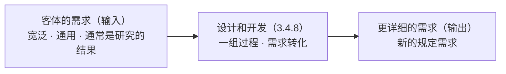

### 2.2 四个构件逐一拆解

1. **客体（3.6.1）——设计开发的对象**
   可以是产品、服务、过程、系统，甚至管理体系本身。设计开发绝不局限于硬件产品——服务设计开发、过程设计开发同样成立（见注3）。

2. **需求（3.6.4）——输入必须是"需求"**
   输入是需求，不是点子、灵感或想法。创意不经过"表述为需求"这一步，就进不了设计开发的流程。需求 = 明示的、通常隐含的或必须履行的需要或期望。

3. **转换为——动词才是灵魂**
   输入与输出必须是**不同的东西**。流程走完了输出需求跟输入一个样——那不是设计开发，那是走流程。

4. **更详细的需求——唯一的判定标准**
   "更详细"是相对输入而言的。定义没说"更正确""更优化"，只说了"更详细"——设计开发的职责是把需求展开、分解、落到可实现和可验证的粒度；方案优劣由评审和验证把关。

5. **一组过程（3.4.1）——性质与归类**
   ① 是"一组"（集合），不是单个活动，跨部门、跨阶段是常态；② 它被收在 3.4"有关过程的术语"之下，而不是 3.3"活动"类——**标准把设计开发定性为"过程"而不是"活动"**，这是它可管理、可审核、可控制的前提。

### 2.3 三个注的详细解读

**注1**（信息密度最高，四点）：

- **输入需求通常是研究的结果**——起点是探索性的：市场调研、技术预研、前代产品经验教训。这解释了设计开发天然带不确定性。
- **输出比输入更宽泛、更通用**——"宽泛"指概括程度：输入说"一台能低温运行的设备"，输出要落到"-40℃下连续工作72小时、误差≤±0.5℃"。
- **需求通常以特性（3.10.1）来规定**——特性 = 可区分的特征。把抽象需求落到特性上，需求才变得可测量、可验证：

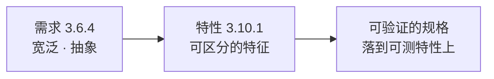

  特性可区分 → 可测量 → 需求可验证。特性类别：物理 · 感官 · 行为 · 时间 · 人体工效 · 功能。

- **一个项目（3.4.2）中可有多个设计和开发阶段**——定义在项目内部是**递归**的：

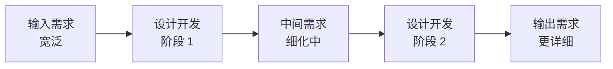

  概念设计把客户需求变成系统需求，详细设计把系统需求变成部件规格，工艺设计把部件规格变成可生产、可检验的要求——每一级都在执行同一个 3.4.8。**每个阶段的输出需求，就是下一阶段的输入需求，直到需求足以支撑实现和验证。**

**注2——用词辨析**：英语里 design（设计）、development（开发）与 design and development 三者，有时完全同义，有时用来指整个设计开发的不同阶段（如 design 指概念/方案阶段，development 指详细化/实现阶段）。**用哪个词不重要，重要的是整体是一个需求转化过程。**

**注3——可加限定词**：为指明"设计开发什么"，可加修饰语，如**产品设计开发、服务设计开发、过程设计开发**。再次确认：设计开发的对象不限于产品。

### 2.4 从定义推出的关键结论

1. **"更详细"是判定设计开发是否发生的唯一试金石**。输入输出同样详细 = 没发生设计开发。这是判断"这个变更算不算设计开发"的核心抓手——只改外观颜色、不产生任何新需求细节的变更，严格说就不构成设计开发。
2. **设计输出 = 新的规定需求**。定义把输出明确为"需求"，所以设计输出文件（规格书、图纸、工艺文件）本质是规定需求集合，直接成为后续**验证（3.8.12）**的参照。
3. **需求 → 特性 → 可验证**是设计开发的"质量命脉"：需求不落到特性上，验证就没有对象。
4. **设计开发是递归的、可分阶段的**（注1），每一阶段都是完整的 3.4.8。

### 2.5 四个常见误区

| 误区 | 正解 |
|---|---|
| 设计开发 = 画图 / 创意活动 | 是需求转化的过程集合 |
| 只有硬件产品才有设计开发 | 产品、服务、过程都可（注3） |
| 输入需求必须一开始就完整明确 | 输入本来就宽泛，正是设计开发把它变详细 |
| 一个设计开发项目只有一个阶段 | 注1明确可以有多个阶段 |

---

## 3. 设计开发的终点：止于"可实现"

### 3.1 推导过程（四轮修正）

| 轮次 | 候选终点 | 为什么被修正 |
|---|---|---|
| 1 | 确认通过 | 错位：确认（3.8.13）锚定"产品"，定义的设计开发锚定"需求"；且确认常发生在设计开发形式结束之后很久 |
| 2 | 责任移交点（设计基线发布） | 只是制度动作，不是内在判据 |
| 3 | 可验证 | 逻辑倒置：验证（3.8.12）以"规定需求"为参照，而规定需求是设计开发的输出——**验证能发生，前提是设计开发已经结束** |
| 4 | **可实现** ✅ | 定义内部唯一的自然终止条件 |

**关键论证（为什么"可验证"不对，用验证定义反推）**：

- 3.8.12 验证 = 对**规定需求**已得到满足的认定 → 验证的前提是规定需求已经存在（设计开发已产出）。
- 把"可验证"当终点 = 让设计开发结束在验证的起跑线上——循环倒置。
- 且验证注1：客观证据可以是"文件评审"——几乎所有写清楚的需求都"可验证"，这个判据区分不了完成与未完成。

### 3.2 结论

> **设计与开发止于"可实现"：需求被细化到足以支撑客体实现、生产和服务提供可直接执行的程度（输出成为完整的规定需求）。**
>
> 验证与确认以这份规定需求为参照、在其后把关；"可实现"是入场券（必要条件），验证通过是及格线（符合），确认通过是目的达成——但**终点在验证之前**。

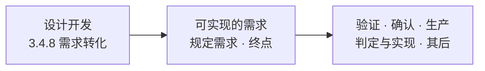

### 3.3 实物产品的具体化：八个方案全部完成

> **实物产品的设计与开发，止于技术方案、物料采购方案、制造方案（工艺）、测试方案、交付方案、部署方案、操作方案、运维方案全部完成。**

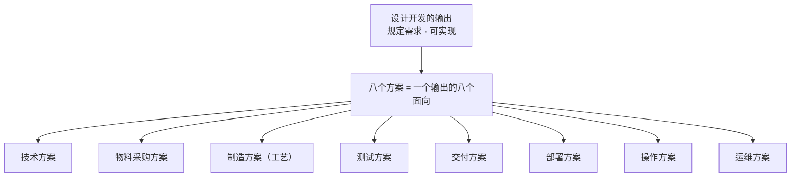

**八个方案的本质**：不是八件独立的事，而是一个东西的八个面向——**"规定需求"按下游环节的分配**：采购照着买、生产照着做、检验照着测、实施照着装、用户照着用、维护照着修。每个方案 = 给一个下游环节的"可实现需求"。这正是 8.3.5 b"满足后续产品和服务提供过程的需要"的完整展开。

**每个方案的条款落点**：

| 方案 | 条款落点 |
|---|---|
| 技术方案 | 8.3.5 d：规定对预期目的至关重要的特性 |
| 物料采购方案 | 8.4：外部提供的要求 |
| 制造方案（工艺） | 8.5.1：生产和服务提供的受控条件 |
| 测试方案 | 8.3.5 c：监视和测量要求 + 接收准则 |
| 交付/部署/操作/运维 | 8.5.1 及生命周期各环节 |

**用词精确性**："方案"不是"结果"——测试方案属于设计开发（规定测什么、判据是什么）；测试执行和测试结论属于验证（3.8.12）。停在"方案完成"正好守住"设计开发止于可实现"这条线。

**判据（可操作）**：

> **还有哪个环节会在执行时反问"这到底怎么做"？——有，设计开发就没结束。**
>
> **设计开发的终点，由"最后一个配齐的方案"决定，不由"第一个完成的技术方案"决定。**

**技术方案为什么不够**：技术方案只回答"客体本身长什么样、怎么实现"——它是八个方案里最先完成、最显眼的，但只是第一个面。只到技术方案就宣布终点，后果是连环空转：采购没有物料规格和合格准则（8.4 空转）、生产没有工艺依据（8.5.1 空转）、测试没有判据（验证无法启动）、交付/部署/操作/运维没有指令（产品出门即"失联"）。

### 3.4 三层次"可实现"

> 技术方案只是**原理层面**的可行，"真正实现并运行"是**事实层面**的证明——两者之间隔着整个验证与确认。

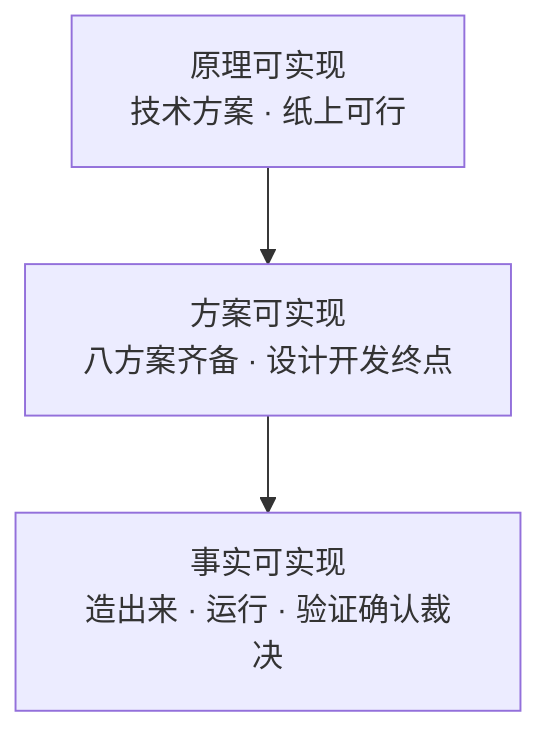

- **层1 原理可实现**：技术方案给的——只证明"从技术原理上走得通"，是纸上的。
- **层2 方案可实现**：八方案齐备给的——**设计开发终点**。从"原理可行"跨到"可执行指令齐备"。
- **层3 事实可实现**：验证/确认给的（终点之后）——"能否真正实现并运行"这个未知，由验证（对照规定需求）和确认（对照预期用途）回答。

**设计开发的"诚实边界"**：设计开发交付的不是**事实**，而是**声明**——一份"可信的可实现声明"（八方案齐备、逻辑自洽、经评审/样机/仿真提高置信度），最终裁决权在终点之后的验证/确认。

---

## 4. 设计开发的起点：需求规格确立

### 4.1 结论

> **设计与开发的起点 = 一份满足"可转化"判据（完整、无歧义、不冲突、隐含需求已识别）的需求规格，被正式确立为设计输入的时刻。**

与终点对称：

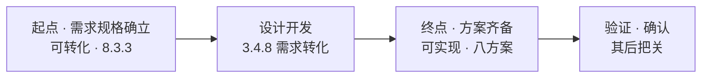

### 4.2 起点判据：需求"可转化"（8.3.3）

1. **完整**：功能、性能、以及由产品和服务性质导致的潜在失效后果——一个不缺；
2. **无歧义**：每个需求只能有一种理解；
3. **不冲突**：需求之间自洽（资源、法规、性能之间不打架）；
4. **隐含需求已识别**：最容易被忽略的一条——隐含需求（3.6.4）不会自己开口，需要组织主动识别（8.2.2）。起点最贵的部分：它没写进规格，却最决定规格对不对。

### 4.3 起点之前：研究

注1：输入需求"通常是研究的结果"。设计开发不始于"点子"，而始于"被研究确认过的需求"：

> 点子 / 灵感 / 想法 →（研究：市场调研、可行性分析、技术预研、客户需求识别）→ **确定的需求** → 设计开发开始

需求未确定就开工 = 拿半成品当原料——设计开发会白白转化一堆错误需求，终点越完美，偏离越远。**很多项目"设计得很辛苦、产品没人要"的根源：不是终点没管好，是起点没收好。**

### 4.4 起点与终点对称总表

| | 起点 | 终点 |
|---|---|---|
| 判据 | 需求**可转化** | 需求**可实现** |
| 含义 | 输入完整、无歧义、隐含已识别 | 八方案齐备、可执行指令配齐 |
| 资格 | 设计开发可以启动 | 设计开发可以结束 |
| 条款 | 8.3.3 设计输入 | 8.3.5 设计输出 |

> 设计开发始于"需求被确定"（可转化），止于"方案被配齐"（可实现）。起点没收好，转化的是错误需求；终点没守好，交付的是残缺声明。

### 4.5 需求规格是"要什么"，八方案是"怎么做"

- 需求规格 = **what**：客体的需求，宽泛、可转化；
- 终点八个方案 = **how**：怎么实现。

设计开发本质 = **what → how 的转化**。验证（3.8.12）就是拿 how（设计输出）对 what（输入规格）——起点规格的质量直接决定验证有没有靠谱的参照。

**补充：需求规格不止一份**——系统级规格 → 子系统级规格 → 部件级规格，每一级设计开发阶段的输入都是一份规格（呼应注1"多个阶段"）。"起点"是第一份：产品/系统级需求规格被确立的时刻。

---

## 5. 需求开发与设计开发的边界

**问题**：需求规格之前那段（需求调研、可行性研究、需求说明书 URS 等文档的开发）算不算设计与开发？

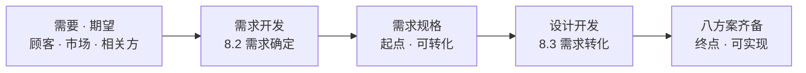

### 5.1 三层答案

**概念上（ISO 9000）：算，而且同构。**
3.4.8 定义"不挑段"：顾客说"我要一台能低温运行的小型设备"，需求开发把它变成"工作温度-40℃、体积≤0.5m³、…"——这本身就是一次"需求变详细"。需求开发也是需求转化，同样具备 3.4.8 的定义特征。**它和设计开发是同一种认知活动的不同阶段**，只是转化发生在更靠前、更粗的层级。

**标准组织上（ISO 9001）：可合可分，由组织策划决定。**
- 需求确定（顾客沟通、要求确定、要求评审）→ **8.2**；
- 设计开发 → **8.3**。

这不是因为"需求开发不是需求转化"，而是**职责组织方式**：8.2 管"要什么"（面向顾客与市场），8.3 管"怎么实现"（面向技术与实现）。复杂组织常把需求开发作为设计开发第一阶段纳入 8.3；简单组织放在 8.2 即可。**两种策划都合规**。

**实用判据：看"客体"是否确立 / "特性"是否被规定。**
- 客体边界还没确立（还在定"我们要做什么产品"）→ 需求开发（8.2）；
- 客体已确立、开始细化它的需求 → 设计开发（8.3）。

用质量定义（3.6.2"客体（3.6.1）的固有特性"）加固：需求开发阶段，客体还没确立，**特性压根不存在**，质量没有承载体；设计开发阶段才开始"把需求落到客体固有特性上"。判据升级为更硬的一条：

> **特性是否被规定**——特性还没开始规定，是需求开发（8.2）；特性开始被规定，才是设计开发（8.3）。需求规格就是那道闸门。

### 5.2 必须补的提醒

不管这些文档（市场调研、可行性研究、URS）归 8.2 还是 8.3 第一阶段，**它们都是设计输入的来源，直接影响产品质量特性**——审核时"这些文档不在受控范围"过不去。它们可以不属于"设计开发"，但**不能不受控、不可追溯**。

---

## 6. 质量（3.6.2）深入

### 6.1 质量定义与设计开发的关系

> **质量**：客体（3.6.1）的一组固有特性（3.10.1）满足需求（3.6.4）的程度。

质量定义里的三个词——客体、固有特性、需求——恰好就是设计开发定义（3.4.8）的三个构件：

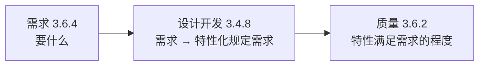

**核心定位**：

> **设计开发 = 质量的定义者**（把需求落到客体固有特性上，3.4.8 注1）；
> **验证/确认 = 质量的度量者**（判定特性满足需求的程度，3.8.12 / 3.8.13）。

- 起点（需求规格确立）＝需求确定，特性尚未规定——质量还不可度量；
- 终点（八方案齐备）＝客体固有特性被完整规定、附接收准则——**质量被完整"定义"了**，从此可以度量；
- 验证/确认＝客观证据测量特性满足需求的程度——**质量的度量**。

设计开发的全程，本质是**从"需求确定"走到"质量定义完成"**。这也解释了 8.3.5 d 为什么要求输出"规定对预期目的至关重要的特性"。

**"固有"二字的含义**：质量只算**固有特性**（存在于客体中的，如功能、性能、材质），不算**赋予特性**（如价格、品牌、交付时间）。设计开发的范围也被"固有"框住——价格、交付周期这类赋予特性是 8.2 等其他过程的事，**设计开发管不着，也不该管**。

### 6.2 质量是"吻合度"，不是"特性 ÷ 需求"

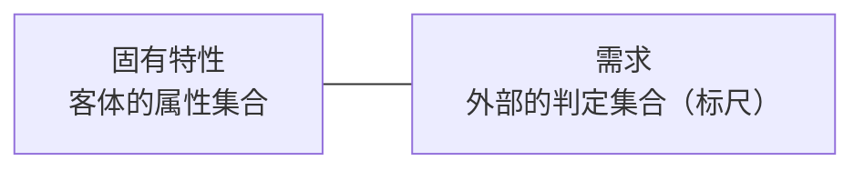

1. **两边不同质，除不了**：特性在客体里，需求在客体外，不是一个量纲。需求是**标尺**，特性是**测量结果**——质量问的是"结果在标尺上的位置"，不是"标尺除以结果"。
2. **"满足"是符合性判定，不是数量比**：特性达到需求规定的水平 → 满足；达不到 → 不满足。这是吻合/符合的逻辑。
3. **"程度"是评价概念**：注1 说质量可用**差、好、优秀**修饰——形容词，不是数字。质量是被"认定"出来的，不是被"计算"出来的（靠验证/确认用客观证据判定）。
4. **比值直觉的错误推论**：特性**恰好满足**需求 → 质量成立；特性**超出**需求（过度设计）→ 满足程度并不增加，只增加成本和复杂度。**出了需求区间，质量不升反降。**

### 6.3 "程度"如何得出：确定（3.11.1）

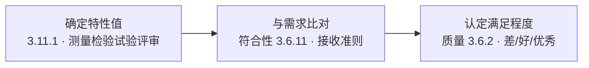

**三步得出法**：
1. **确定特性值（3.11.1）**——查明特性及其值。手段：测量（定量）、检验（符合性确定）、试验（按需求确定规定特性）、评审、计算。产出叫**客观证据（3.8.3）**。
2. **与需求比对——判符合性（3.6.11）**——用**接收准则**（设计输出 8.3.5 c 里提前写好的判定标准）比对。
3. **认定满足程度——得出质量（3.6.2）**——综合一组特性的符合情况，认定程度。动作上就是验证（3.8.12）和确认（3.8.13）。

**三个关键性质**：
- "程度"是**认定**出来的，不是算出来的——需要评价者基于客观证据；
- **单项是二元（符合/不符合），整体是程度（差/好/优秀）**——整体程度按特性重要度综合评价（关键特性优先，8.3.5 d）；
- **标尺是设计开发提前定的**——接收准则写在测试方案里（终点八方案之一）。设计开发定标尺（特性+接收准则），验证/确认执行"读标尺"。

> **四个条款，一步不缺，程度才出得来**：工具在 3.11，标尺在 8.3.5，动作在 3.8.12 / 3.8.13。缺了测试方案里的接收准则，程度就永远只能"感觉"，不能"认定"。

### 6.4 质量能有具体分值吗？

**标准层面：没有。** 三个近亲都不是分值：

| 概念 | 条款 | 形态 |
|---|---|---|
| 质量 | 3.6.2 | 程度：差 / 好 / 优秀（注1，形容词） |
| 符合性 | 3.6.11 | 符合 / 不符合（二元判定） |
| 等级 | 3.6.3 | 分类分级（如高档/低档） |

注意：**等级高 ≠ 质量好**（3.6.3 注）——高档车可以是差质量，低档车可以是好质量。因为等级是"按不同需求分类"，质量是"满足各自需求的程度"。标准在整个评价体系里**刻意不用单点分值**：特性多维不同质，加不成一个数；隐含需求无法完整数值化；注1 明确质量用形容词修饰。

**组织层面：分值可以造，但它是组织的度量，不是标准概念。** 打分 = 定权重（特性重要度）→ 单项评分（接收准则映射分数）→ 加权汇总 → "85分"。三个前提，缺一个分就是假的：

1. **需求完整**（起点）——漏了需求，评分体系就没覆盖它；
2. **特性规定完整**（终点）——漏了特性，分值少算一项；
3. **证据可靠**（验证）——分数必须挂在客观证据上。

**最要命的一条**：**关键特性不能被摊平**——8.3.5 d 说"对预期目的至关重要的特性"要优先。加权公式若把安全性、可靠性这种一票否决的特性摊进平均数，安全项失分被其他项补回来，"85分"就是用假象掩盖致命问题。**分值的最大陷阱：它给了你一个精确的错误。**

### 6.5 质量、符合性、等级三者定位

- 符合性回答：满足了吗？（二元）
- 程度（质量）回答：满足到什么程度？（评价）
- 等级回答：按哪套需求分类？（分级）
- 三者共同点：都以"需求"为参照——而需求（标尺）是设计开发定出来的。

---

## 7. 质量与进度冲突的解决

### 7.1 先拆伪前提

**质量不是时间的函数**（3.6.2：质量 = 特性满足需求的程度，与花多少时间无必然关系）。而且**进度本身就是一种需求**（8.2.2：交付时间和交付条件也是顾客要求的一部分）。

所以"质量 vs 进度"本质是**同一份需求集合内部打架**：性能/功能需求 vs 交付时间需求。解法不是二选一，是**重新平衡这份需求集合**。

### 7.2 四步解法

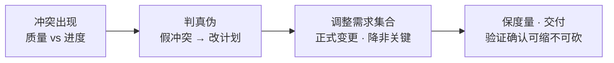

1. **判真伪**：一半以上的"质量进度冲突"是估算失真、计划虚报、范围蔓延造成的假冲突——进度算错了，却怪质量太慢。假冲突，改计划，不动质量。
2. **用需求谈判，不用质量谈判**：调整的是需求集合（哪个需求可降、可删、可延），不是"质量原则"。必须走**正式变更**（8.2.4 要求的更改 / 8.3.6 设计更改）：书面、评审、通知相关方。**口头"差不多就行"是最危险的变更形式**——需求被悄悄偷换，验证确认全在跟一个没被承认的靶子打。
3. **分清可妥协与不可妥协**：
   - 不可动：必须履行的需求（安全、法规——3.6.4"必须履行"一类）、关键特性（8.3.5 d 对预期目的至关重要的）；
   - 可动：非关键特性、性能裕量、**过度设计**——特性超出需求范围不增加质量，只增加成本。**砍过度设计，是唯一"既省时间又不伤质量"的操作**（不是牺牲质量，是给质量做减法）。
4. **度量环节可缩不可砍**：最蠢的赶进度方式是"先交付，验证确认后补"。验证/确认是质量的度量——砍掉等于不度量就宣布合格，风险全部后移成现场返工（失败成本是质量成本里最贵的）。正确姿势：**把验证范围缩到关键特性，而不是把验证整个砍掉**——只验关键的，别全验；但不验，不行。

### 7.3 三大禁忌

1. 砍验证/确认赶进度——最贵，风险后移，返工爆炸；
2. 口头改需求——最危险，需求被偷换，整个定义链失效；
3. 把"降需求"说成"降质量"——概念错。等级（3.6.3）≠ 质量（3.6.2）：降低需求水平（砍非关键）是合法变更；交付不满足已承诺需求的东西，才是真降质量。

### 7.4 正道：与相关方一起剪裁需求

> **单方面砍需求叫偷换，和顾客一起剪裁才叫变更——中间差着整个需求的所有权。**

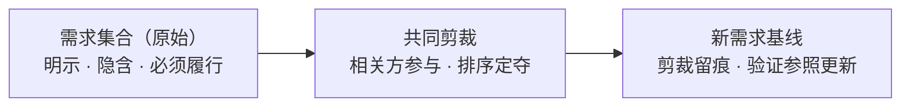

**为什么"一起"是硬要求**：

1. **需求的所有权在相关方手里**。需求（3.6.4）是"需要或期望"的表述——是相关方（尤其顾客）的资产，组织只是受托转化。单方面剪裁 = 拿别人的东西替别人做主：剪掉的那块可能恰是顾客最在乎的隐含需求——他没说，但你剪了，事后必炸。
2. **剪裁改变的是验证的靶子**。验证（3.8.12）对照"规定需求"——需求一剪，靶子就变了。不和相关方一起剪，验证就是在打一个自己偷偷移动的靶子。
3. **剪裁的正确动作是"排序"，不是"删减"**。让相关方排优先级：命根子（不可动）、想要的（可降）、贪多的（可剪）。
4. **剪裁要留痕，剪下来的部分要存档**。走 8.2.4 / 8.3.6 正式变更：剪了什么、为什么剪、谁决定的、哪天恢复——全部记录。剪掉的需求不是消失了，是**挂账**：本轮进度解了，下一轮迭代（持续改进、改型）时就是现成输入。**剪裁是暂存，不是销毁。**

**隐藏收益**：

> **当顾客被迫说"先保这个、砍那个"的时候，隐藏的需求和真实的优先级才第一次浮出水面。** 平时问"你还有什么要求"他答不出，但你说"进度不够，必须砍一样，砍哪个？"——他立刻知道答案。**进度冲突是隐含需求的显影剂。**

---

## 8. 三概念基座三角

### 8.1 三角关系

**需求、设计与开发、质量构成产品开发领域工作原理和方法的基座**——三者不是并列的三个概念，而是**互相咬合的三角**，每个定义里都引用另两个：

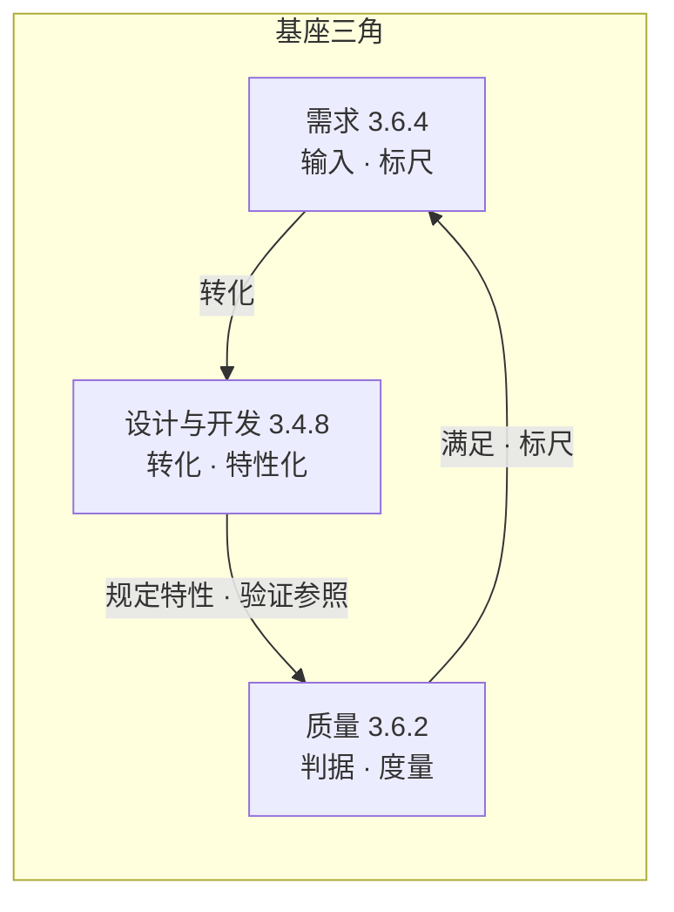

- **需求 = 输入**：定义"要什么"（标尺）；
- **设计与开发 = 转化**：把需求变成特性化的规定需求（制造标尺）；
- **质量 = 判据**：度量特性满足需求的程度（读标尺）。

一个产品开发流程，无非是"定标尺 → 造标尺 → 读标尺"。

### 8.2 基座的三层证据

1. **定义互相引用——拆不掉**：设计开发（3.4.8）引用需求（3.6.4）；质量（3.6.2）引用需求和特性（3.10.1）；设计开发注1说需求"以特性来规定"。抽掉任何一个，另外两个悬空。**自洽且不可拆。**
2. **角色不可替代**：需求管输入、设计开发管转化、质量管判据——原理层讲完了。
3. **能推出现有的全部方法——基座的终极检验**：
   - 需求管理、需求评审、变更控制（8.2）← 从"需求"推出；
   - 设计输入/输出、评审/验证/确认（8.3）← 从"设计开发 + 质量判据"推出；
   - 质量控制、质量策划、质量改进（3.3 系列）← 从"质量"推出。

### 8.3 两个精确化

1. **三角里还嵌着两个承重构件：客体（3.6.1）和特性（3.10.1）**。没有客体，质量定义（"客体的固有特性"）和设计开发定义（"对客体的需求"）无处安放；没有特性，需求落不到客体上，质量也无从度量。它们是三角内部的横梁。
2. **三个概念的层级不完全平级**：需求和质量是"元概念"（横跨一切领域，不只是产品开发）；设计开发是"领域机制"（需求和质量在产品开发场景里的中介桥梁）。**基座的最底层是"需求 + 质量"两个元概念，设计开发是架在它们之间的桥——桥是承重的，但地基是那两个元概念。**

### 8.4 工程方法论从基座长出

系统工程、软件工程、硬件工程、IPD、过程方法等，都是在这个基座上长出来的——但需要分类：

| 类别 | 方法论 | 与三角的关系 |
|---|---|---|
| 直接展开 | 系统工程（V模型）、软件工程、硬件工程、DFSS | 三角的工程化形态 |
| 流程框架 | IPD | 三角的流程化、组织化形态 |
| 运行容器 | 过程方法 | 三角的运行骨架（设计开发本身就是一组过程） |
| 扩展学科 | 可靠性工程、安全性工程 | 质量里"随时间/失效"的专门化 |

**逐个检验**：

- **系统工程（SE）**——三角最直接的"长子"：V模型左半边（需求→系统设计→详细设计）是需求逐级转化，右半边（部件验证→系统验证→确认）是质量判据逐级回收。**V 的左右两边就是设计开发和验证确认的镜像**。为什么 V 是 V？因为需求从哪一级分解下去，验证就必须从哪一级收回来。
- **软件工程 / 硬件工程**——三角 + 各自技术本体：需求工程、架构设计、测试（V&V）、需求追溯矩阵是三角直接展开；算法、物理、材料是**另一支根**。
- **IPD**——三角的生命周期展开：需求管理（OR/$APPEALS）→ 概念/计划/开发（设计开发）→ 验证/发布（质量判据）→ 生命周期。IPD 的技术评审点（TR）/决策评审点（DCP）为什么必须设？因为**质量判据不能等到最后才看，要在每个关口用"特性满足需求的程度"检查一遍**——TR 就是质量判据关口化的产物。
- **过程方法**——设计开发本身就是"一组过程"（3.4.8）；需求是过程输入，质量判据是过程输出要求。过程方法给三角装骨架系统。

**精确化（刹车）**：对管理/质量侧成立，对技术本体不成立：

> **工程 = 概念基座（需求-设计开发-质量，管"要什么、怎么证明做对"）× 技术本体（物理、材料、算法、化学，管"怎么做"）。**
> 三角长不出牛顿定律，也长不出快速排序——它长出的，是**如何组织"做什么"和"如何证明做对了"**的全部方法。

**终极检验——能不能解释"为什么长这样"**：

- V模型为什么是 V？→ 需求分解层级必须与验证回收层级对齐；
- IPD 为什么有 TR/DCP？→ 质量判据必须关口化，不能等最后；
- 为什么需求要追溯矩阵？→ 需求是质量标尺，标尺断了，度量就无据；
- 为什么变更要控制？→ 改需求就是改标尺，不改参照，验证就是打移动靶。

**每一个"为什么"都能从三角推出来——这就是"基座"和"几个相关概念"的区别。**

### 8.5 方法论光谱：管理侧 vs 技术本体

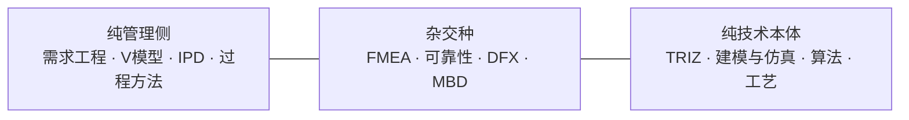

**技术本体不是一个方法论，是一整个知识家族**，分三层：

1. **知识本体（不是方法论）**：物理、化学、数学、材料科学——不提供"方法"，提供**规律**；
2. **方法层（纯技术方法论）**：建模与仿真（FEA/CFD）、TRIZ（发明问题解决）、算法与数据结构/设计模式、工艺方法、控制理论——共同特征：**换一个行业，这套方法要换**（方法跟着客体走，不跟着需求走）；
3. **杂交种**：FMEA（质量侧发问 × 技术侧作答）、可靠性工程（质量 × 失效率模型）、DFX（技术侧约束反向改进设计）、MBD/数字孪生（技术侧建模，服务验证）。

**一条判别标准，把任何方法论归位**：

> **看问题的主语是谁：**
> - 主语是"做不做得出、怎么做" → **技术本体**（跟着客体走）
> - 主语是"做没做对、值不值得、怎么保证" → **管理侧**（跟着需求/质量走）
> - 两者都在 → **杂交种**

真正的产品开发方法论，几乎都是两者站在光谱两端的杂交产物——**越靠中间，越值钱。**

---

## 9. 全篇核心结论速览

1. **设计与开发（3.4.8）** = 将客体的需求转换为更详细的需求的一组过程——本质是"需求的转化"，判定标准是"更详细"。
2. **起点** = 满足"可转化"判据的需求规格被确立为设计输入（8.3.3：完整、无歧义、不冲突、隐含需求已识别）。
3. **终点** = 止于"可实现"——实物产品具体化为技术、采购、制造、测试、交付、部署、操作、运维**八个方案全部完成**。终点由最后一个配齐的方案决定，不由第一个完成的技术方案决定。
4. **验证（3.8.12）/ 确认（3.8.13）** = 设计开发的看门人，锚定产品（规定需求 / 预期用途），发生在终点之后——"可验证"因验证定义以设计输出为前提而不能作终点。
5. **质量（3.6.2）** = 客体固有特性满足需求的程度——是"吻合度"不是"除法"，标准给不了单点分值，组织可自定义但需满足：需求完整、特性完整、证据可靠、关键特性优先。
6. **设计开发 = 质量的定义者；验证/确认 = 质量的度量者**。"程度"由确定（3.11.1）→ 符合性比对（3.6.11，接收准则）→ 认定，三步得出。
7. **质量与进度冲突** = 需求集合内部打架（进度本身也是需求）——解法：判真伪、正式变更调整需求、砍过度设计、验证确认可缩不可砍；**正道是与相关方一起剪裁需求**（排序、留痕、挂账；进度冲突是隐含需求的显影剂）。
8. **基座三角** = 需求（输入·标尺）、设计开发（转化·造标尺）、质量（判据·读标尺）——定义互相引用、角色不可替代、能推出全部领域方法。承重构件：客体与特性；底层元概念：需求与质量。
9. **工程 = 概念基座 × 技术本体**——管理/质量侧方法论从三角长出，技术侧（物理、材料、算法、工艺）是另一支根；判别标准看问题主语。

---

*本文档整理自 2026-08-19 概念讨论，术语遵循既定约定（requirement→需求、specified requirement→规定需求）。*
