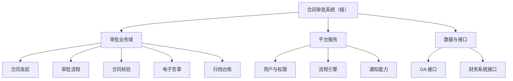
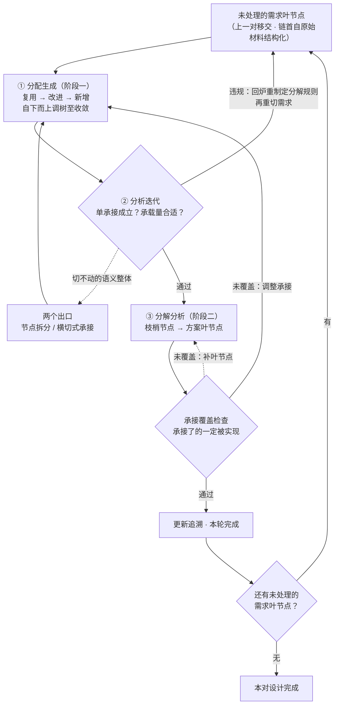
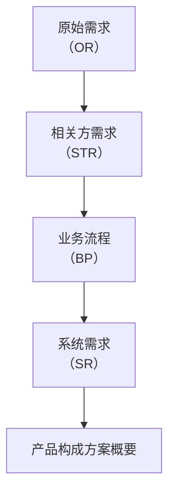
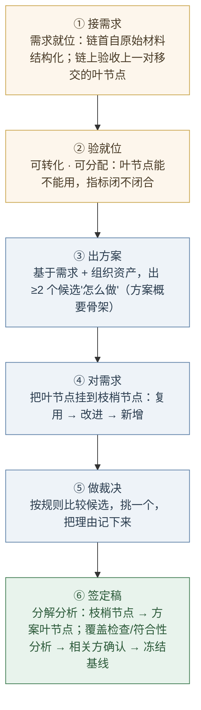

# 第6章 设计开发落地：需求与方案结对

> 本章概念：概要定义 / 详细定义 / 分配生成 / 分析迭代 / 分解分析 / 符合性分析
> 英文来源：preliminary definition / detailed definition / allocation & generation / analysis & iteration / decomposition & analysis / compliance analysis
> 主案例：恒信集团合同审批系统（IT侧）｜ 镜照：冰链科技冷链温控箱（产品侧）

---

## 6.1 章首 · 误解现场

恒信集团合同审批系统项目评审会，下午两点，会议室坐满了人。

万辉在投影上打开了《合同审批系统总体设计方案》——六十页，他花两个月写成，评审会前夜还在改格式。他清了清嗓子："这份方案覆盖了需求调研的全部三百条需求，下面我按章节过一遍——"

法务部的人翻开打印稿，翻了十几页，打断他："审批链上，谁能驳回、谁不能？"

万辉："在第23 页的流程图里。"

财务的人翻到第31 页："月底对账的统计口径，合同 25 号之后签的算哪个月？"

万辉："这个……在需求文档里写过。"

业务部的小周问："我们上线之后，发起一份合同，先点哪里？"

万辉："……界面上。"

运维的玉杰补了一句："那它部署在哪、监控什么、怎么回滚？"

万辉翻了翻稿子，没翻到："……这些后面会写。"

产品开发经理满海坐在后排，把六十页掂了掂："两个月、六十页、三百条需求，都在了。可我们要的是一份'评审完就能开工'的方案，不是一本要通读的书。"

会议室安静下来。徐漾坐在角落，把六十页从头翻到尾，又翻回第一页，轻声说了一句：

"万辉，这不是一篇方案。这是一本小说。"

万辉一愣："什么意思？"

"方案不该是一篇文章，应该是一棵树。"徐漾把打印稿合上，"一篇文章是线性的，只能从头读到尾。可你的方案有五种读者——法务要看审批规则、财务要看校验和台账、业务要看怎么发起、开发要知道模块边界、运维要知道怎么部署。**五个人的问题分散在六十页里，谁也找不到自己那一枝。**"

万辉不服："树？树能装下三百条需求吗？"

"正因为有三百条需求，才必须是树。"徐漾说，"文章装不下三百条需求——文章没有叶节点。"

"叶节点？"

"接下来，我讲给你听。"徐漾看了一眼墙上的钟，"一个函数，三个动作。"

---

如果你坐在这间会议室里，你大概会觉得徐漾在故弄玄虚。方案不是写出来的吗？写得越详细、越全面，不是越好吗？**六十页的方案难道不比一页的树更负责任吗？**

这一章要推翻的，正是这个直觉。它错在一个词上——**"设计方案"的"设计"，不是"写"，是"种"。** 每份设计文档都是一棵树，不是一篇散文；方案的质量不取决于你写了多长，而取决于你有没有把那三百条需求，一条一条地"种"到这棵树上，种得准、种得全、种得可验证。

这背后是一整套可以照着走的方法，本书把它记成一个函数：**Y=F(X)**——X 是需求，Y 是方案，F 是"由 X 怎么得到 Y"的规则。设计开发的舞台，是一对"需求-方案"：**由需求开发出方案，并由方案迭代需求**，正反交替、逐对收敛。落在动作上，是三个：**分配生成、分析迭代、分解分析**。

第4章（需求工程）的结尾说过：需求工程产出"规定需求"；上一章（第5章 需求的完整性）说：标尺要全。这一章看这三百条需求怎么种进设计开发的树形结构——种得全不全，取决于标尺立得全不全。现在，徐漾要兑现第4章的伏笔了。

---

## 本章问题

读完本章，你应该能回答：

1. 设计开发的单元为什么是一对"需求-方案"？为什么说每一对都是一次 Y=F(X) 的求值——X、Y、F 各是什么？
2. 每份文档为什么必须是树、不能是散文？概要与完整态是什么关系？枝梢节点为什么必须双向可用？
3. 为什么每对开工要先立法？规则由谁制定？分解规则为什么必须带着消费方的语义范围来定？
4. 分配生成在做什么？为什么走复用→改进→新增？树的骨架怎么长、长到什么样算收敛？
5. 分析迭代在分析什么？"一条需求只归一个枝梢节点"为什么是函数的单值性？违规了怎么办？
6. 分解分析在做什么？叶节点切到多细算好？"承接了的一定被实现"靠什么检查保障？
7. 概要定义和"架构"是什么关系？为什么叫"概要"不叫"架构"？
8. 整条链怎么接力？追溯矩阵为什么是自然生成的？六步（接·验·想·对·裁·签）各在做什么？
9. 链尾怎么对接构件设计方？"设计与开发是一个概念"和"链尾换手"矛盾吗？

---

## 开篇 · 本章枢纽（骨架先行）

这一章要立的是"需求-方案"这一对。先把骨架立起来——后面三幕，都是给它添血肉。

> **方案不是写出来的，是种出来的：设计开发的舞台是一对"需求-方案"结对——一次 Y=F(X) 的求值（X 是需求、Y 是方案、F 是三套规则）。每份文档都是一棵树（枝干概要 + 叶节点详细）；每对先立法、再走三个动作（分配生成、分析迭代、分解分析）；一条链上逐对接力，设计与开发统一为"由需求到方案的逐对生成"。方案不是凭空想出来的——骨架靠分配生成长出来，叶节点靠分解分析填出来。**

**一对**——设计开发的单元是"需求-方案"结对：一份需求文档、一份方案文档，有需求必有方案。结对是双向的——正向由需求设计方案，反向由方案迭代需求；记成函数，就是一次 Y=F(X) 的求值（§6.2.1 展开）。

**一棵树**——每份设计文档（需求或方案）都是一棵树，不是一篇散文：枝干（概要定义）管结构、叶节点（详细定义）管内容，结构不轻易变、内容随时长；同一份产品数据先出概要、再演进为完整态。

**先立法，三个动作**——每对开工先把 F 立起来：三套规则（分解、构建、承接）由人类主导制定。然后走三个动作：**分配生成**（把需求叶节点挂上枝梢节点、长出骨架）、**分析迭代**（守住"一条需求只归一个枝梢节点"，违规就迭代需求分解）、**分解分析**（枝梢节点长出自己的叶节点，并检查"承接了的一定被实现"）。

**一条链**——五层链上每对"需求-方案"都走这三遍功课，四对结对串成一条链（原始需求→相关方需求→业务流程→系统需求→产品构成方案概要）。上一份的完整态就是下一份的需求，追溯边自然生成；链尾的枝梢节点带着分解源判据移交构件设计方——执行换手，概念不分。

这一章的方法底座时刻，是第1章概念能力里的**织关系**：方案是结构，不是堆——把条目织成树、让每个部件各就其位彼此承接，而不是排成一列堆起来。

---

## 6.2 第一幕 一对文档，各是一棵树（定界）

> 这一幕把设计开发的单元看清：先立"需求-方案"这一对——一次 Y=F(X) 的求值（有需求必有方案、每份文档都是一棵树），再看散文怎么死（三宗罪）、树怎么活（枝干的三个构件），再推"为什么必须是树"，最后把概详两层、概要≠架构、树形假设的边界分开。

### 6.2.1 设计开发的单元：一对"需求-方案"，一次 Y=F(X) 的求值

先回答一个问题：设计开发的**对象**是什么？不是一份文档，是一**对**——**一份"需求"文档，配一份"方案"文档**。

有需求必有方案，有方案必有需求（§6.4.1）：需求说"要什么"，方案说"怎么做"；上一层的需求，靠下一层的方案承接；而这份"方案"接住了需求，转过身又成为更下一层的"需求"——中间每一层，既是方案，又是需求。

**结对是双向的。** 正向，由需求开发出方案——按规则把需求一步步转换成方案；反向，由方案迭代需求——方案造出来之后发现需求切得不合用，就回头重切需求、调整承接（§6.3.4）。正反交替，直到这一对收敛：需求是合规的需求，方案是合规的方案。

这个"由 X 按规则得到 Y"的过程，记成一个函数最清楚：**Y=F(X)**。X 是需求，Y 是方案，F 是三套规则——需求侧的树形结构与节点规则、方案侧的树形结构与节点规则、方案枝梢节点承接需求叶节点的承接规则。F 由每对开工时先定义（§6.3.2）。

函数有一条铁律：**必须单值**。多个 X 可以映射同一个 Y——多个需求叶节点挂上同一个枝梢节点（N:1），没问题；一个 X 映射多个 Y——一个需求叶节点归两个枝梢节点（1:N），F 就不成其为函数。**单承接约束，就是函数的单值性**（§6.3.4 磨开）。

> **Y=F(X)：由符合规则的 X，按函数规则生成符合规则的 Y。**
>
> 术语注：这一记法是本书对设计开发落地方法的凝练命名，非标准条文——欢迎检验、欢迎校准。

所以，这一章说"一棵树"时，先记住：**树是对一份文档而言的**。需求文档是一棵树，方案文档也是一棵树——**一个"需求-方案"结对，就是两棵树**：一棵需求树、一棵方案树。这一幕先看清"每份文档都是一棵树"；第二幕的三个动作，正是这两棵树之间的事。

现在回到万辉——他的六十页方案，就是这对里的"方案"那一半。它为什么失败？不是他写得不好——他写得**太像文章**了。一篇文章有三个弱点，恰好是设计文档不能有的。

#### 散文的三宗罪

**第一，不可定位。** 一篇文章是线性流动的，从第2 页读到第60 页。但"审批驳回的规则"在第几页？"对账的统计口径"在第几页？读者只能从头找起。

而方案从来不是给一个人从头读到尾的——**方案是给五类人（法务、财务、业务、开发、运维）分别"查询"的**：法务只找审批规则，财务只看校验与台账，开发只管模块边界。

一篇文章逼着五类人都通读全文，白费功夫；更糟的是通读之后还是找不到，于是开始"猜"。

评审会开到第四十分钟还在讨论"这条需求到底有没有被方案覆盖"，不是大家不认真，是**文章没有给"覆盖"一个可定位的位置**。

**第二，不可承接。** 下游开发拿到六十页文章，怎么开工？他需要三件事：负责哪一块、要满足哪些需求、做到什么程度算完成。文章没有模块边界，开发只能"全文通读，然后自己揣摩"，各揣出各的边界，集成必然撞车。**文章没有"叶节点"，需求没有地方落。**

**第三，不可追溯。** 需求是会变的（第4章刚讲完）。一条需求变了，影响设计方案的哪几页？文章时代只能重读全文、靠人肉找相关性——找不全就漏改。**文章没有映射，变更没法定位到具体位置。**

树的回答，恰好是三件事：

#### 枝干的三个构件

| 构件 | 是什么 | 干什么 |
|------|--------|--------|
| **根与层级** | 从根节点到枝梢节点的完整分级 | 层层细化，同层保持同一抽象级别 |
| **分类节点** | 非枝梢节点（如"审批业务域""平台服务"） | 组织架构层级——像文件夹，本身没有实体含义 |
| **枝梢节点** | 概要骨架的终点 | 承接需求——需求挂在这个枝梢节点上（一个枝梢节点可挂多条） |

一篇文章 vs 一棵树，差别不在"长短"，在"有没有叶节点"：

- 文章里，"审批驳回"是正文里的一个段落；树里，它是"审批流程"这个枝梢节点上挂着的一条需求。
- 文章的段落不能被"承接"——你不能说"这一段归张三做"；树的枝梢节点可以——**枝梢节点是需求挂靠的钩子，也是开发认领的任务单。**
- 文章的段落不能被"追溯"——需求变了你不知道哪段要改；树的枝梢节点可以——沿着"需求→枝梢节点"的映射，一步命中。

所以树的关键，是枝梢节点和叶节点怎么咬合。它有两个判据，一个管"挂"，一个管"搬"：

> **枝梢节点 = 需求挂靠的落脚点**——一个枝梢节点可以挂多条需求（N:1）。
> **叶节点（详细条目）= 能 1:1 搬走的原子条目**——一个叶节点只能属于下一棵树的一个枝梢节点。
>
> 术语注："枝干管结构、叶节点管内容"与"详概分离"命名，是本书（通用设计规范）的落地操作，非标准条文；英译与标准参照见章首及章末参考文献，欢迎检验、欢迎校准。后记四角色清单里，概要定义/详细定义这对文档为模块级（模块架构师/模块工程师），系统级对应物为系统架构师的架构描述。

"1:1"是这一章最要紧的一个约束，先记住它，第二幕会展开：**一个叶节点，只能被搬到下一棵树的唯一一个枝梢节点上。**

#### 为什么人总是写成散文？

这是最值得问的问题：既然树这么好，为什么大家天然写散文？

因为**写作是线性的，而树是被"种"出来的**。写文章，一支笔顺着思路走；种树，要知道怎么长出枝桠、怎么让需求挂上枝梢节点、怎么让叶节点长出来——这需要方法。

大多数团队没有这个方法，方案就退化成文章。翻一翻公司里任何一份"总体设计"，十有八九是按章节排列的文章——不是大家不愿意写树，是**没人教过怎么种树**。

### 6.2.2 为什么必须是树：织关系

前面三宗罪回答"散文为什么不行"——从读者角度看。还有个更根本的问题：**"树"为什么就行？** 树的形状是拍脑袋定的吗？不是——树的每个构件，都是设计开发的内涵逼出来的。这一节把这条必然性推一遍。

**第一步：内涵要求可验证、可落实 → 内容必须条目化。**

设计开发（design and development）的本质，是把"尚未存在的东西"变成"可以被建造的东西"，带着两个内在要求：

- **可验证**：设计结果必须能被检验——对不对、满不满足需求；可整体没法检验，只能一条一条做，检验的最小单元就是一条条目。
- **可落实**：一个系统要分工交给许多团队去造，前提是"可独立认领的工作单元"——这个叶节点交给张三，那个交给李四。

两条合起来推出第一件事：**设计内容必须条目化**——一条条目是能独立定义、验证、分配、追溯的原子。散文的段落不行：不能被单独验证、认领。这就是"文章没有叶节点"的根源：**文章根本不存在"可验证、可落实"的最小单元。**

**第二步：条目化带来数量爆炸 → 必须组织 → 树。**

条目化之后，真实系统几百上千条，平铺着三条都不成立：

- **理解不了**：人脑装不下几个概念，需要"先看结构、再进细节"；
- **管理不了**：一条需求变了，影响哪些条目，要聚类才能定位；
- **分工不了**：要按领域把条目分给不同团队。

所以条目必须被组织。

而组织成什么形态？这里藏着树最深的理由——**为什么偏偏是树，不是列表、不是表格、不是网状？**

> **因为树是唯一能让"导航路径"与"承接路径"合一的形态。**

列表没层次，一多就应付不了；表格能表达"谁承接谁"，但那是映射表，不是内容组织；网状能表达复杂关系，但需求必须"从根落到叶节点"——网状没有唯一根，答不了"这条需求归谁"。

只有树，从根到叶节点有唯一路径：**既是读者找路的导航，也是需求落地的承接。** 顺着树走一遍，就是一次完整的承接验证。

这个"合一"，就是第1章概念能力里的**织关系**：把散点织成结构，让导航和承接走同一条路。设计做的是把三百条需求织成一棵树，每条需求有唯一的家。方案是结构，不是堆：堆是线性排列，结构是有承接关系的网。

**第三步：管理理解要"概要"，落实验证要"详细" → 树要分成枝干和叶节点。**

树组织好了，还差最后一步：细到什么程度？细到每条需求都被承接、每个叶节点都可验证——可**整棵树都细到叶节点，你就看不见树了**。管理与理解需要先看骨架（结构、分类、承接关系）；落实与验证需要逐个看叶节点（定义、指标、验收标准）。

两种抽象级别、两种目的、两种变更频率——于是树天然分成两大部分：**枝干（概要定义）和叶节点（详细定义）**。这不是谁规定的，是"既要看懂、又要做实"这两件事逼出来的。

至此，从设计开发的内涵推出"一棵树"的全部形态：**条目化（叶节点）→ 树形（枝干）→ 概详两层（一棵完整的树）**，但都是**静态形态**——回答"树长什么样"，还没回答"树怎么长出来"。

让形态活起来的是三个动作：**分配生成，为了把叶节点挂上枝梢节点；分析迭代，为了守住挂得对；分解分析，为了长出枝梢节点自己的叶节点。** 形态是为动作服务的——而动作的舞台不是单独一棵树，是一对"需求-方案"：三个动作都在这对结对上展开。这正是本章题名"需求与方案结对"的意思。

所以万辉的病，表在"没人教过怎么种树"，里在**散文同时违背了可验证、可落实两条**。看清这一层，下一幕就不是记住两个名词，而是顺着必然性长出来的东西。

### 6.2.3 树干树枝是概要，叶节点是详细

一棵完整的树，只有两种东西：**树干树枝**和**叶节点**。设计树也一样，这两种东西就是这棵树的两大部分：

| 部分 | 叫什么 | 管什么 | 回答什么问题 |
|------|--------|--------|--------------|
| 树干树枝（结构） | **概要定义** | 组织与承接 | "结构是什么、承接了谁、往下分解出什么" |
| 叶节点（内容） | **详细定义** | 定义与验证 | "每个模块具体做什么" |

**概要定义就是树的枝干**：从根节点一路分叉到枝梢节点，每个枝梢节点回答"结构是什么、承接了谁"——系统被组织成哪几大块，每个枝梢节点上要挂哪些需求。

**详细定义就是树的叶节点**：长在枝梢节点上的每一个叶节点，回答"每个模块具体做什么"——一条可独立定义、独立验证的条目，有编号、需求描述、性能指标、验收标准、映射目标。

最关键的一点：**叶节点不是漂浮的，它长在枝梢节点上。** 每个叶节点都明确属于某个枝梢节点——"顺序审批"这个叶节点长在"审批流程"这个枝梢节点上。树正是用"叶节点属于哪根枝"这件事，把结构和内容连成了一个整体。

这也回答了"为什么是同一棵树"：**枝干上没有叶节点是枯树，叶节点没有枝干是落叶——缺一，不成其为树。**

为什么必须既有枝又有叶？因为设计要干的两件事，需要两种不同的东西（第二幕展开，这里先立起来）：

- **分配生成**：把叶节点一条一条挂到方案树的枝梢节点上——**叶节点是一个一个的，不是和枝干焊死的**，否则就搬不动。
- **分解分析**：把枝梢节点的内容，展开成一组更细的叶节点——这个起点就是枝梢节点，展开出的细叶节点都长在同一个枝梢节点上。

如果只有枝干（只有概要定义），树就是空骨架，枝梢节点上没有内容；如果只有叶节点（只有详细定义），叶节点就散落一地，风一吹就乱。**一棵好树：枝干挂得住，叶节点长得出。**

画出来，就是一棵实实在在的树——枝干部分，是概要定义：



中间层的"审批业务域""平台服务"是**分类节点**（枝干的分叉、负责组织的文件夹）；"合同发起""审批流程"……这些**枝梢节点**就是概要树的终端。每个枝梢节点上长着叶节点——叶节点就是详细定义：

```
「审批流程」这个枝梢节点上，长着四个叶节点：
  · SYS-002.01  顺序审批   支持按法务→财务→业务顺序审批，审批后 5 分钟内进入下一节点
  · SYS-002.02  驳回回退   支持驳回，驳回后回到发起人并可修改重提，响应 < 1s
  · SYS-002.03  会签       支持多方同时审批，会签发起后同步通知各方
  · SYS-002.04  超时提醒   审批超过 48 小时未处理自动提醒，提醒后 24 小时内升级
```

注意这个例子里已经藏着三个动作的影子：**"审批流程"的这四个叶节点，是一把分解的刀切出来的；每个叶节点都要挂到下一棵树的枝梢节点上——挂靠在分配生成时对账（§6.3.3）。** 枝干和叶节点这两个部分，正是为这些动作而生的。

> **一棵树：枝干是概要定义，叶节点是详细定义。枝干管结构（组织与承接），叶节点管内容（定义与验证）。结构不轻易变，内容随时长。**

这里补一对名字，把同一件事说全：**概要与完整态**。概要（每份产品数据的"xx概要"）不含叶节点——树结构 + 各级节点 + 枝梢节点；完整态（xx 本名）含叶节点——概要 + 叶节点。例：需求概要 / 需求、方案概要 / 方案。

**概要不是另一份产品，而是同一份产品数据的骨架形态**——先产出骨架，再填充叶节点，同一份产品数据由概要演进为完整态。两阶段工作法正是这个：阶段一"需求 → 方案概要"先立骨架，阶段二"方案概要分解"再填叶节点。

这也点明枝梢节点的双重身份——它同时是**承接方**（向上，接受需求叶节点的分配）与**分解源**（向下，被分解为方案叶节点）。物理意义，是承接、构建、分解、审查的共同依据。

因此枝梢节点的物理意义必须**双向可用**：既写"可承接的需求类型"（承接判据），又写"分解产出的叶节点类型"（分解源判据）——两条规则共享这一依据，避免"承接说能来、分解实现不了"的结构性空洞。而且承接判据还是**上一对分解规则的制定输入**——本对承接的叶节点，正是上一对切出来的（§6.3.2）。

有两个特殊位置值得提一句（不必现在展开）：

- 链首的需求侧——**原始需求**，只有条目清单、没有树。它不是退化，是**存量材料**：链首对开工时，把它结构化成第一棵需求树（含叶节点）。需求树从这里"无中生有"，全链只此一家。
- 链尾的方案侧——**产品构成方案概要**，止步于概要加枝梢节点：叶节点（构件规格）由构件设计方按分解源判据展开（§6.4.2 收口）。

一首一尾，刚好对称：**链首只有完整态从材料里来，链尾只有概要交给构件设计方。**

> **概念卡片 · 概要定义**（四问为纲，九格为目；格号=九格尺子）
>
> | 四问 | 格 | 内容 |
> |---|---|---|
> | **它是什么** | ① | 设计树的枝干：从根到枝梢节点的树形结构 + 映射表 |
> | **它不是什么** | ⑥⑦ | 对立=详细定义（叶节点）——枝干组织与承接，叶节点定义与验证，合起来才是一棵完整的树；辨析=概要定义 ≠ 架构——前者是结构骨架（一份文档），后者是系统不可还原的涵义（第10章）；文档层面不等于，描述层面可作架构的一种描述（见 §6.2.4） |
> | **它从哪来** | ②③⑨ | 从"详概分离"原则来：设计文档先立结构骨架、再填内容条目，组织法随工程共同体演化成型；原叫"架构定义"，为拆掉"架构 = 文档"的词汇病改名（见 §6.2.4）；英文 preliminary definition，preliminary ← 拉丁 praeliminaris（门槛之前） |
> | **它往哪去** | ④⑤⑧ | 没有它，方案不可整体看懂、需求没地方落（不可定位、不可承接）；在设计树结构搭建、需求挂靠定位时用；误区 ✗ "概要定义就是画一张系统结构图"——画图只是第一半，还必须有映射表说明每个叶节点承接了谁 |
> | **判据** | 挂枝问 | 任取一条需求，能说出它挂在哪个枝梢节点上吗？说不出的，树还没种全。失效边界：链首的需求侧是存量材料（开工时直接结构化成树）、链尾的方案侧止于概要（叶节点归构件设计方）——这两处退化成最简形态 |

> **概念卡片 · 详细定义**（四问为纲，九格为目；格号=九格尺子）
>
> | 四问 | 格 | 内容 |
> |---|---|---|
> | **它是什么** | ① | 设计树的叶节点：长在枝梢节点下的条目列表，每条可独立定义、独立验证 |
> | **它不是什么** | ⑥⑦ | 对立=概要定义（枝干）——叶节点给枝干填内容，枝干给叶节点定位；辨析=详细定义 ≠ 需求文档——既写"是什么"也写"做到什么程度"（指标+验收标准），是设计内容的最终落点 |
> | **它从哪来** | ②③⑨ | 与概要定义同源孪生：详概分离把"可验证、可落实"的最小单元独立成层（见 §6.2.2 条目化推导）；"详细"之名与"概要"对称而成；英文 detailed definition，detail ← 拉丁 talis（如此） |
> | **它往哪去** | ④⑤⑧ | 它回答"每个模块具体做什么、做到什么程度"——可逐条验证、可 1:1 搬走；在逐条定义、验收核对时用；误区 ✗ "叶节点越多越详细越好"——叶节点必须长在枝梢节点上（每条能归属一个枝梢节点），散落的条目只是段落 |
> | **判据** | 五件套 | 每条叶节点都有编号、需求描述、性能指标、验收标准、映射目标吗？缺一，叶节点还不完整 |

### 6.2.4 概要定义 ≠ 架构定义

细心的读者会发现：我在前面给概要定义取了个名字，却没提"架构定义"。在很多方法论的文档里，这份树形文档明明就叫**架构定义**（architecture definition）——听着多顺耳，一棵树的形状，不就是架构吗？

**正是这个"听着顺耳"，是个词汇病。** 这一章要竖起的又一个反直觉命题，就在这里：

> **概要定义 ≠ 架构定义。**

三个理由，每一个都值得想清楚。

**理由一：与"架构"撞车。** "架构"（architecture）在全书极其重量级——第10章会给它一个精确的定义：**系统不可还原的涵义**（ISO/IEC/IEEE 42010），那是关于系统根本性质的决定：几个要素、怎么连接、哪条不可推倒重来。

换个更硬的说法：**架构是系统的基本概念或基本属性**（第11章的五块设计）——它不是概要，也不是视图。概要是一份文档，视图是一种描述；架构是系统本身的那组根本决定。

镜照一眼冰链，同一个病，换了世界。冰链把 M3 的方案结构文档直接叫"架构定义"——这名字一听就重：架构都"定义"了，还动什么？

于是人人都以为架构已定、画完即可，文档再没人维护。水忠不是不爱维护——他是觉得这个名字太重了：架构定了，还维护什么？可那棵设计树明明是要天天长的：加一点需求、改一条逻辑，树就得跟着长。

等第10章把"架构"说清楚，水忠才明白：被他们叫"架构定义"的只是一棵还没种完的树；真正的架构（那组"去掉就不是 M3"的决定）一直活着，只是从没人写下来。

**用已经承担重量级含义的词，去命名轻量级文档，是给自己埋词汇病的坑**——第10章是"架构 = 框图"，第6章就是"概要定义 = 架构定义"。

**理由二：不对称。** 它的孪生兄弟叫"详细定义"。既然另一半叫"详细"，按对称，这一半就该叫"概要"——而且这对兄弟合称的原则，名字本来就是**"详概分离"**（详=详细定义，概=概要定义）。叫"架构定义"，反而和原则自己的名字打架了。

**理由三：名实相符。** 它回答"结构是什么、承接了谁"——是设计的**结构骨架**，比"架构"轻：初步、概要，用于组织与承接。

真正"不可还原的决定"——系统最重要的那几项选择——确实藏在树的枝条走向里，但那是**从树里读出来的判断**，不是树本身。第10、11、12 章会专门去挖。先立一条线：

> **概要定义是目录，详细定义是正文，架构是这本书真正要表达的思想。目录不是思想，但好的目录帮你定位思想。**

不过，把"不等于"说死之前，得分清两层。**文档层面，概要定义不等于架构**——概要定义是一份设计文档（结构骨架 + 映射表），架构是系统不可还原的涵义（第10章），两者不在一个层面。

**但在"把系统结构写下来"的描述层面，概要定义可以作为架构的一种描述**——它把结构写下来，本身就是架构描述的一种。第10章正是这样接的：架构是概要定义背后那些"去掉就不是它"的决定。

两层不打架：不等于，是在文档与涵义之间划线；可作描述，是在描述与涵义之间搭桥。

所以这一章里，我们统一用**概要定义**这个名字。它比"架构定义"少一分误导，多一分老实。

万辉后来问徐漾："为什么不叫架构定义？"徐漾反问："你那六十页'总体设计方案'，叫不叫架构？"万辉哑然。徐漾："所以名字上就要分开——**文档是文档，架构是架构。**"

### 6.2.5 树形假设的边界：哪些内容树装不下

本方法有一个基础假设：**需求或方案类产品数据都能组织成树形结构——这个假设成立，但依据是组织性的，不是内容性的**。说"组织成树"，只保证每条内容有一个唯一的归属位置；不保证内容之间只有父子关系。

需求/方案的语义本质是图，有四类内容，纯树放不下：

| 内容类型 | 现象 | 树形处理 |
|---------|------|---------|
| **横切** | 一条约束影响多个分支（"可用性 ≥ 99.9%""所有操作需审计留痕"） | 给它独立的树位置（如 NFR 分支），用**影响面标注**勾连被影响的节点 |
| **共享** | 一个定义被多处引用（"客户"贯穿多个流程、接口契约被多个组件消费） | 归属到一处，其余**引用**——跨文档只记引用、不复制正文 |
| **多维** | 同一批需求可按功能/场景/性能/相关方多个维度切分 | 选一个稳定的**主组织维度**作树的轴，其余维度降为节点属性 |
| **循环/递归** | 业务流程自调用、嵌套，调用关系成环（A 调 B、B 又调 A） | 树按归属组织层级，调用关系记在节点内容里（递归：每一级元素的设计开发都是一次完整的设计开发） |

由此读出本方法对"树"的读法：**树是存储骨架，引用/追溯是关系载体**。承接因此分两种并存——**归属式承接**（功能性分配，走单承接约束）与**横切式承接**（NFR、约束、安全策略：留在独立分支作叶节点，用影响面标注表达对多个方案节点的承接，不走归属分配）。

假设在两种情况下不成立：①要求树同时表达全部关系（把横切、共享也塞进分支结构）——解法已给出：横切走独立分支 + 标注；②选不出稳定的主组织维度——树组织变成任意的，内容增长会反复重构。②的解法是：每对开工前先定死主组织维度（对应下一幕"每个结对找到自己的规则"）。

## 案例进展①｜六十页文章变成一棵树

评审会散了之后，万辉回去熬了一夜。

他把六十页文章揉碎了，提炼成一页树：合同审批系统 = 三个枝（审批业务域 / 平台服务 / 数据与接口），十个枝梢节点（发起、流程、校验、签章、归档 / 权限、流程引擎、通知能力 / OA、财务接口）。

第二天他把这一页树拿给徐漾看。徐漾点头："好多了。现在你告诉我，法务关心的审批规则，在哪个枝上？"

万辉指向"审批流程"那个枝梢节点。

"那这个枝梢节点上，挂了哪几条需求？"

万辉愣住了。树还只是一张图，枝梢节点上还没有叶节点。

"这就对了。"徐漾说，"树还只是骨架。要变成方案，得把三百条需求一条一条挂上枝梢节点——挂得准、挂得全、挂得能验证。"

"怎么挂？"

"三个动作：**分配生成、分析迭代、分解分析**。"徐漾竖起三根手指，"第一个动作，就是把三百条需求挂上这十个枝梢节点——先学挂，再学查，最后学长叶节点。先学会这个，再谈别的。"

---

## 6.3 第二幕 先立法，再结对（磨边界弧）

> 这一幕先立规矩、再磨动作——每对开工先立法：F（三套规则）由人类主导制定，分解规则必须带着消费方的语义范围来定。然后三个动作各靠反例定型：分配生成不是"简单分派"、分析迭代不是"返工丢人"、分解分析不是"多列几条"更不是"空话"；最后概详不焊死。

### 6.3.1 三个动作在哪儿做

第一幕的树，回答了"设计文档长什么样"。现在的问题更根本：**树是怎么种出来的？** 答案是先立法、再走三个动作——分配生成、分析迭代、分解分析。

它们不是三个先后的大阶段，而是每对"需求-方案"都要走完的动作，各有各的"发生地"：

| 动作 | 在哪儿做 | 做什么 | 自检 |
|------|----------|--------|------|
| **分配生成** | 需求叶节点 → 方案概要（两棵树之间 + 树上） | 叶节点挂上枝梢节点（复用 → 改进 → 新增），新节点自下而上调树 | 三自检 + 收敛判据 |
| **分析迭代** | 两棵树之间（查）+ 回需求侧（迭代） | 检查分配与生成的正确性：单承接成立吗、承载量合适吗、改进波及谁——违规就迭代需求分解 | 违规两分类处理 |
| **分解分析** | 方案树上（枝梢节点 → 叶节点） | 枝梢节点按分解规则分解为方案叶节点，再做承接覆盖检查 | 语义四查三场景 + 覆盖公式 |

一句话记住它们：

> **分配生成把叶节点挂上枝梢节点，分析迭代守住一条需求只归一个枝梢节点，分解分析让枝梢节点长出自己的叶节点——并检查承接了的一定被实现。**

很多新手把三个动作当成三个步骤，走一遍就完。**它们是叶节点驱动的循环**——每轮处理"相关联的一组"需求叶节点（预计由同一个或同一小簇枝梢节点承载的归为一组，判据是落点相近：同一业务场景、同一功能主题、内容互相牵连），循环推进，直到全部叶节点处理完：



细心的读者会发现一个问题：**需求侧的"分解"去哪了？** 答案在整条链上看——本对的需求叶节点，正是上一对分解分析切出来的；本对开工时验收移交，只在分析迭代检出不合规时才重切。分解只有一条规则、两处现身（§6.3.2）。

### 6.3.2 每对先立法：规则从哪来

结对是 Y=F(X) 的求值，而 F——三套规则——**每对开工时先定义**。规则不是从天上掉下来的通用教条，是这一对自己的"本钱"：没有它，三个动作没有可执行的依据。

**规则由谁制定？人类主导，AI 辅助。** 定义各级节点的物理意义与父子关系、选定主组织维度、制定本对的具体规则——这些是判断性工作，不存在机械算法：语义归纳、边界界定的制定权在人。AI 承担三类辅助——候选生成、一致性检查、反例检验——并按规则执行设计动作与机械核对。父节点的生成是最典型的一例：只有人类制定的语义与质量判据下的检查，没有机械的生成算法。

F 按动作对象分三块：

| 规则块 | 内容 |
|--------|------|
| **需求侧规则** | 需求侧的分解规则与构建规则（首对在本步制定；链上各对沿用上一对——本对的需求树就是上一对的方案树） |
| **方案侧规则** | 方案侧的构建规则与分解规则（每对新立） |
| **承接规则** | 需求叶节点 → 方案枝梢节点（每对新立） |

三套**执行规则**长这样：

| 执行规则 | 管什么 | 机械判据 / 收敛判据 |
|---------|--------|-------------------|
| **分解规则** | 枝梢节点 → 叶节点（两处现身：本对方案侧在分解分析中产出；需求侧叶节点是上一对同规则的产出） | 单承接 + 语义原子性（防止切得过碎） |
| **构建规则** | 子节点 → 父节点（自下而上调树的依据） | 覆盖完整 + 兄弟互斥（收敛）；父语义三查：独立可定义 · 非兜底 · 最小覆盖 |
| **承接规则** | 需求叶节点 → 方案枝梢节点（分配依据） | 单承接（可 N:1、不可 1:N）+ 承载量约束（超限触发节点拆分） |

**分解规则怎么定，是最要紧的一条：制定时必须把消费方的语义范围带进来。** 叶节点长出来是给下游用的，消费方就是承接、使用这些叶节点的一方。四条考量：

- **消费方的语义范围**：把消费方承接结构的枝梢节点物理意义及其特征作为制定输入——切点落在其语义范围的边界上，叶节点**天然**可被单点承接。**单承接由分解规则直接保证，而不是迭代试错的目标。** 本对内，需求的消费方是方案概要，方案的消费方是下一对的承接结构（§6.4.1）。
- **语义原子性**：叶节点保有独立语义、可独立验证——它的作用是**防止切得过碎**：不为迁就消费方的切法把语义整体切碎。
- **切不动不硬切**：消费方语义范围切不动的语义整体（一致性约束、接口语义等关系性内容）走两个出口——节点拆分、横切式承接（§6.2.5）。
- **随消费方结构演进**：分配生成中消费方的枝梢节点被新增或改进时，受影响的分解规则随影响面复查同步修订——"先制定"指对当前消费方结构的首次制定，不是一劳永逸。

构建规则再补两句。父节点的语义按三条质量判据自查：**独立可定义**——父语义能独立于子节点清单表述，回答"这一组共同是什么"，不是清单的拼接；**非兜底**——"其他/杂项"式语义筐不合格，没有独立语义范围的父节点会在后续承接中变成语义黑洞；**最小覆盖**——选能覆盖子节点语义之并的最小类，只留生长余量、不留模糊空间。

收敛判据两条机械可查：**覆盖完整**（每个非叶节点语义 ⊇ 其子节点语义之并）+ **兄弟互斥**（同层兄弟两两不重叠）——两者满足即收敛；新枝梢节点归不进任何现有父节点的语义范围时，才在更高层新增父节点。

**立法的组织方式**，还有一层容易被忽略的分工：

|  | 切法（内容规则） | 判据（形式判据） |
|---|-----------------|------------------|
| 回答的问题 | 按什么维度切 | 切得好不好 |
| 典型例子 | 按相关方 / 按流程 / 按能力 / 按职责拆 | 语义四查、三场景、单承接、覆盖公式 |
| 性质 | 领域经验 | 逻辑要求 |
| 适用范围 | 结对特有（每对结对不同） | 全链通用（所有结对相同） |
| 该不该统一 | 不该——必须业务化 | 必须——不统一则对账失败 |

**判据必须统一**：分配要做对账，需要一套所有结对都认的账本语言——A 结对送来的叶节点，在 B 结对的下层能对上账。**切法必须业务化**：业务专家直接参与分解规则制定与评审，每次退回重切的裁决都沉淀成新的切法经验——切法指南是项目自己的记忆，越用越准。**两装置把切法与分配接上**：候选声明（每个叶节点在切出时声明一个候选枝梢节点——声明是给分配的输入，不是切法的验收）、骨架先行（对着已约好的下层枝梢节点清单切，候选声明才有枝梢节点可指）。

> **立法 = 人类主导（AI 辅助）× 切法业务化（结对独有）× 判据统一（全链共用）× 契约共享（候选声明 + 骨架先行）。**
>
> 术语注：这套"切法/判据/契约"三分与解耦公式，是本书对通用设计规范"分解分配解耦"的凝练命名，非标准条文——欢迎检验、欢迎校准。

解耦之外还有**组织级约定**：术语表、命名规则、验收模板、反模式案例库。判据全链通用、切法结对独有，但都要落到组织的本地语言——统一叫法、统一格式，否则各对结对写出的叶节点长得不一样，全链照样对不齐。

### 6.3.3 分配生成：不是"简单分派"

**分配生成**（allocation & generation）：把需求叶节点分配到方案概要的枝梢节点上，并为新增或改进的节点自下而上调树——**阶段一：由需求长出方案骨架。**

它回答的问题：**这个叶节点，归下一棵树的哪个枝梢节点负责？这棵树的骨架该怎么长？**

恒信走到这里，万辉手上有"系统需求"这棵树的叶节点（SYS-002.01 顺序审批、SYS-003.01 金额校验……），下一棵树是"产品构成方案概要"——前端、审批引擎、合同台账、签章服务、通知服务。分配就是给每一个叶节点找一个归宿：

```
需求叶节点（系统需求详细条目）      →    产品构成方案枝梢节点
SYS-002.01 顺序审批               →    审批引擎
SYS-002.04a 超时检测             →    审批引擎
SYS-002.04b 提醒发送             →    通知服务
SYS-003.01 金额校验               →    审批引擎
SYS-005.02 电子签章               →    签章服务
SYS-006.01 合同归档               →    合同台账
```

（SYS-002.04a/b 系由 SYS-002.04"超时提醒"重切而来，故事见 §6.3.4。）

#### 分配三自检

分配完成不是结束，要过三关：

| 自检 | 问的问题 | 违反的后果 |
|------|----------|-----------|
| **全覆盖** | 所有叶节点都挂上了吗？ | 没挂的叶节点在下层方案中无对应设计，需求直接遗漏 |
| **单承接（1:1）** | 每个叶节点都只挂到一个枝梢节点吗？ | 重复实现，浪费资源、无法验证 |
| **N:1 合理性** | 每个枝梢节点挂的叶节点数合理吗？ | 太少→枝梢节点太碎；太多→枝梢节点承载过宽 |

- **全覆盖**最容易被"觉得没问题"带过。万辉第二次分配，数一遍叶节点总数、再数一遍挂上去的，数字对不上——有一个"审批历史查询"没地方放。方案树里压根没有"检索"这个枝梢节点，补也没处补，这个叶节点还是从需求里消失了，直到上线后用户问"审批历史哪去了"才发现。
- **N:1 合理性**的经验值：一个枝梢节点挂 2~5 个叶节点较优，超过 8 个就该考虑枝梢节点是否太宽、要不要触发节点拆分。但这是经验不是铁律——**判断标准永远是语义相关**：挂在同一个枝梢节点上的叶节点，应该确实是一类事。

#### 先复用，再改进，最后新增

分配不是把叶节点贴到一张现成的树上——方案概要本身就是分配生成长出来的。三步，优先级从高到低：

| 动作 | 资产优先原则 | 说明 |
|------|-------------|------|
| **直接承接** | Reuse（复用） | 现有枝梢节点的语义范围直接覆盖需求，挂上即完成 |
| **改进后承接** | Improve（Extend/Split/Merge） | 现有枝梢节点扩展、拆分、合并后能承接，就挂到拟改进节点，登记改进意图 |
| **新增承接** | Add（新增） | 基于需求语义与枝梢节点的物理意义，生成新的枝梢节点 |

优先级始终：**复用 → 改进 → 新增**。改进有代价（影响面复查，§6.3.4），所以能复用就不改进；但既有结构仍应先用尽——能改进就不新增，新增只留给改进也承接不了的叶节点。三动作与资产优先原则（Reuse > Improve > Add）一一对应。

#### 自下而上调树：骨架是长出来的

新增或改进之后，**自下而上调树**——归组子节点、归纳或修订各级父节点的物理意义，直至收敛：**覆盖完整 + 兄弟互斥**（§6.3.2 的收敛判据）。调树由人类主导、AI 辅助（§6.3.2）；每长一个新父节点，先过三条质量判据：独立可定义、非兜底、最小覆盖。新枝梢节点归不进任何现有父节点的语义范围时，才在更高层新增父节点。

分配生成的两块契约，把"切"与"挂"接上（§6.3.2）：**骨架先行**——对着已约好的下层枝梢节点清单分配，候选声明才有枝梢节点可指；**候选声明**——每个叶节点在切出时声明了候选枝梢节点，分配"验证对不对"，不用猜。

> 术语注："分配生成"合称与三步优先级，是本书对阶段一动作的凝练命名（与通用设计规范"资产优先原则"同构），非标准条文——欢迎检验、欢迎校准。

注意一层同名不同物：SEBoK 的架构定义活动有三动词（partition 分割 / align 对齐 / allocate 分配），是架构级把边界落到元素与契约上的动作（第11章六步第④步"分配与接口"）；本章的"分配"是需求叶节点与方案枝梢节点之间的挂靠——两级同名，说的是两件事。

> **概念卡片 · 分配生成**（四问为纲，九格为目；格号=九格尺子）
>
> | 四问 | 格 | 内容 |
> |---|---|---|
> | **它是什么** | ① | 把需求叶节点挂上方案枝梢节点（复用→改进→新增），并为新节点自下而上调树——阶段一：由需求长出方案骨架 |
> | **它不是什么** | ⑥⑦ | 对立=分析迭代（查与迭代）——分配生成负责"长"，分析迭代负责"查"，查出的违规才回炉；辨析=分配生成 ≠ 简单分派——单承接是硬约束（一个叶节点一个归宿），N:1 是枝梢节点聚合，且必须先复用再改进后新增 |
> | **它从哪来** | ②③⑨ | 源自系统工程的需求分配（allocation）与资产复用实践（Reuse > Improve > Add）；"分配生成"合称是本书对阶段一动作的凝练命名；英文 allocation & generation，allocation ← ad-（向）+ locare（放置） |
> | **它往哪去** | ④⑤⑧ | 在两棵树之间接力时用；边界=骨架先行（候选声明对着已约好的枝梢节点清单）、改进伴随影响面复查；误区 ✗ "把叶节点贴到一张现成的树上"——方案概要本身就是分配生成长出来的 |
> | **判据** | 三自检 | 三自检过了吗？全覆盖 / 单承接 / N:1 合理；调树收敛了吗（覆盖完整+兄弟互斥）？改进做影响面复查了吗？ |

## 案例进展②｜万辉的第一次结对

万辉撸起袖子，把系统需求的叶节点往产品构成方案概要的枝梢节点上搬。

徐漾拦住他："搬之前，叶节点验过了吗？父需求里'金额 ≥ 500 万或三年期以上要重点审'这条——你的叶节点齐吗？"

万辉一愣，回去一查："合同校验"枝梢节点的叶节点只切了金额校验、条款校验、资格校验三个，**期限校验漏了**。"合同期 ≥ 3 年进入重点校验"这条要求，叶节点里没有对应。

"这批叶节点是上一对切出来交到你手上的，开工前就要验收。"徐漾说，"漏一个叶节点，下层方案就不会做期限校验。将来五年期合同不走重点审，出了事追溯回来，就是这个漏洞。"

万辉补切了期限校验，又看了一遍，越看越不对劲："我好像还多切了一个'合同打印'……这不是校验该干的。"

徐漾："那叫影子需求——**切叶节点是精确切分，不是顺手多切。** 删掉。"

万辉删掉，又复查约束继承——把"数据留档十年"这条系统约束，确保归档那个枝梢节点的叶节点显式承接了。

小白凑过来看了一遍，她是开发，问："这批叶节点齐了，我是不是就能照着开工了？"

徐漾："还早。叶节点齐了、挂上了枝梢节点，才算走完分配生成；接着要分解分析——让枝梢节点长出自己的叶节点，再查一遍'承接了的一定被实现'。这两步没过，开工就是白干。"

"好。"徐漾说，"现在，先把挂上去的每一个都查一遍——下一个动作，分析迭代。"

### 6.3.4 分析迭代：不是"返工丢人"

**分析迭代**（analysis & iteration）：检查分配与生成的正确性，并根据检查结果迭代——**迭代的主对象，是需求分解。**

它回答的问题：**叶节点挂对了吗？挂得下吗？错了，回哪一步修？**

很多团队怕这两个字——"迭代"听着像返工、像前面的活白干了。恰恰相反：**分析迭代是有方向的修正**，不是推倒重来。方向规定只有一条：

> **枝梢节点是基准，需求是适配方。** 违规时重切需求，而不是迁就需求改概要。

为什么？基准不只被动接收分配——分解规则预先定好了需求侧怎么切（切点带进消费方的语义范围，§6.3.2）；叶节点天然可单点挂靠，**迭代试错不是常态机制，而是兜底**。改进与新增属正向承接设计——概要为承接切好的叶节点而生长，不是修正；修正只在检查出违规时发生，方向只指向需求侧。

#### 单承接：函数的单值性

分析迭代守的核心约束只有一条，也是这一章最重要的约束：

> **一条需求叶节点，只能挂到下一棵树的唯一一个枝梢节点上（单承接：可 N:1、不可 1:N）。**

这就是 Y=F(X) 的单值性：多个叶节点挂同一个枝梢节点（N:1）是聚合，一个叶节点挂两个枝梢节点（1:N）让函数不成其为函数。为什么这么严？三个理由：

1. **避免重复实现。** 一个叶节点（比如"金额校验"）同时挂到"审批引擎"和"前端"，两个模块各实现一遍——同一逻辑两处实现，改一处漏一处，这是重复代码的根源。
2. **保证验证有唯一对象。** "金额校验"对不对，该测哪个模块？单承接让验证有唯一目标；1:N 让验证不知道该查谁。
3. **让变更可定位。** 需求改了金额校验，只改一个模块；分到两处就要找齐两处，漏一处就是 bug。

注意一个对称：**枝梢节点承接叶节点是 N:1**（一个枝梢节点挂多个叶节点），**叶节点归宿枝梢节点是单承接**（一个叶节点只有一个归宿）。前者是"聚合"，后者是"定位"。很多团队把方向搞反——让叶节点挂多个枝梢节点（违反单承接），却让一个枝梢节点只挂一个叶节点（浪费聚合能力）。

#### 违规两分类：回炉，还是走出口

仍出现 1:N 时，先判类型，别急着返工：

- **程序违规**——分解规则没按四条考量制定（切点没带进消费方的语义范围）。处理：**回炉重制定分解规则，再重切需求**——把消费方枝梢节点的物理意义带进来重新定切点。
- **切不动的语义整体**——一致性约束、接口语义这类关系性内容，怎么切都要跨枝梢节点。走两个出口：**承载量超限触发节点拆分**（Split，比如"超时提醒"拆成超时检测与提醒发送）；**约束/策略类内容走横切式承接**（留在独立分支作叶节点，用影响面标注表达，§6.2.5）。

顺带把"防切过碎"说全：重切不是越切越细——语义原子性判据守着下界：叶节点保有独立语义、可独立验证，防止为迁就枝梢节点的切法把语义整体切碎。

这与"需求分解分配分析"的单分配约束说的是同一条：需求侧负责把叶节点切到可单点分配，方案概要保持稳定，只在必要时调整。

#### 改进有涟漪：影响面复查

"改进后承接"不是局部操作。对枝梢节点的扩展（Extend）、拆分（Split）、合并（Merge）会影响**已承接**的其他需求：Split 后，原已承接的需求要重分配到子节点；Merge 后，节点的语义范围变窄，某些既有需求可能失配。

**任何改进操作后必须执行"影响面复查"**：重新核对既有承接，失配则批量重分配或回退改进。否则会在循环内留下隐性失配，到符合性审查才暴露。改进同时改变分解规则的制定输入——新增或改动的枝梢节点物理意义即时更新消费方的语义范围，受影响的分解规则须随影响面复查同步修订。

> **概念卡片 · 分析迭代**（四问为纲，九格为目；格号=九格尺子）
>
> | 四问 | 格 | 内容 |
> |---|---|---|
> | **它是什么** | ① | 检查分配与生成的正确性（单承接、承载量、影响面），并根据检查结果迭代——迭代的主对象是需求分解 |
> | **它不是什么** | ⑥⑦ | 对立=分配生成（长骨架）——迭代不是否定生成，是修正输入（重切叶节点）或补全结构（节点拆分/新增）；辨析=分析迭代 ≠ 需求分析（第4章·加工）——需求分析往前看（需求清不清楚），分析迭代往回修（叶节点合不合用） |
> | **它从哪来** | ②③⑨ | 源自单承接约束（Y=F(X) 的单值性）与资产变更管理实践；"分析迭代"是本书对阶段一关口的凝练命名，非标准条文；英文 analysis & iteration |
> | **它往哪去** | ④⑤⑧ | 每轮分配生成后立刻用；违规两分类——程序违规回炉重制定分解规则再重切需求，切不动的整体走节点拆分/横切式承接；改进伴随影响面复查；误区 ✗ "检查不过就推倒重来"——迭代有方向：枝梢节点是基准，重切的是需求 |
> | **判据** | 两问一查 | 单承接成立吗（可 N:1、不可 1:N）？承载量合适吗（超限触发拆分）？改进后既有承接核对了吗（影响面复查）？ |

## 案例进展③｜一个"悬空"的叶节点

万辉把系统需求的叶节点往产品构成方案概要上搬，搬到最后，剩下一个没人要：

**SYS-004.01 合同全文检索 —— 支持对已归档合同按全文检索，响应 < 3s。**

"全文检索……"万辉先看系统需求树：三个枝干——审批业务域、平台服务、数据与接口；再看产品构成方案概要的枝梢节点——哪个都不像。硬塞给"合同台账"？台账只管存储，不做检索。（SYS 编号按需求流水编排、不对应枝梢节点序——004 是"数据与接口"域下的需求，不表示缺了第 4 个枝梢节点。）

顺带分清两层名字：系统需求树里叫"流程引擎""通知能力"（能力），产品构成方案概要里叫"审批引擎""通知服务"（构件）——名字别跨层混用。

分析迭代检出了这个悬空叶节点。徐漾让他先别硬塞："一个叶节点没有归宿，只有两种可能：要么**叶节点切粗了**（欠切分，该重切成'建索引'和'查索引'两个），要么**方案树没长够**（缺一个'检索服务'的枝梢节点，生成新节点）。你先判断是哪种。"

万辉想了半天："这个叶节点拆不开——'对已归档合同全文检索'就是一件事，再拆就把'建索引'和'查索引'的接口写进去了，那是设计不是需求。所以是方案树缺枝梢节点。"

于是分配生成走了一步 Add：产品构成方案概要新增一个枝梢节点"检索服务"，叶节点有了归宿。至此产品构成方案概要六个枝梢节点齐了。

玉杰一直在旁边听着，他是运维，接过话茬："这根'检索服务'立住了，我运维就有得部署、有得监控了——一个枝梢节点，就是一样要上线伺候的东西？可反过来，树没种全，我连该部署几样都数不清，少一个枝梢节点就少一样要伺候的东西，到上线那天才露馅。"

徐漾点头："对。方案里的枝梢节点，就是你运维要伺候的对象。你的部署清单，就是这棵树的全覆盖检查——你数得清几样，树就种了几个枝梢节点。"

他顿了顿，补了一句：**"分析迭代检出来的问题，一半是分配的错——缺枝要生成新节点；一半是上游的错——叶节点切粗了要重切。三个动作是互相把门的。"**

### 6.3.5 分解分析：不是"多列几条"，更不是"空话"

**分解分析**（decomposition & analysis）：方案枝梢节点按分解规则分解为方案叶节点（**阶段二**），并做承接覆盖检查——**"承接了的一定被实现"。**

它回答两个问题：**这个枝梢节点要长出哪些叶节点，才能把挂着的叶节点全部实现？长出来的叶节点，真的把承接的需求都实现了吗？**

先回头看一眼叶节点的来历。需求叶节点是**上一对**用同一条分解规则切出来的（首对由链首从原始材料结构化产出）；本对的方案叶节点，由本对在分解分析中产出——**同一条分解规则，全链两处现身**。链尾对例外：枝梢节点的分解移交构件设计方执行（§6.4.2）。

#### 切到哪为止：分解终止判据

万辉面对的"合同校验"这个枝梢节点（上一对的产物），挂着几条需求。它被切成了四个叶节点（SYS-003.01~04）。**"拆成几条"谁都会，难的是拆得对。** 分解规则的执行，先记住切法：

> **切点沿消费方枝梢节点的语义范围边界切分**——本对方案叶节点的消费方是下一对的承接结构，链尾对的消费方是构件设计方。叶节点天然可被消费方单点承接（单承接由分解规则直接保证，§6.3.2）；"再分就失去独立语义"只是**下界**——防止切得过碎；切不动的语义整体不硬切（走节点拆分/横切式承接两个出口）。

切出来对不对，过**语义四查**：

| 检查 | 问的问题 | 违反的样子 |
|------|----------|-----------|
| **覆盖完整性** | 父节点里的每条要求，叶节点都有对应吗？ | 漏——父里有的，叶节点缺了 |
| **不超出性** | 叶节点引入父范围外的新内容了吗？ | 超出——凭空冒出来的要求 |
| **逻辑一致性** | 叶节点之间互相矛盾吗？ | 冲突——两个叶节点打架 |
| **约束继承** | 父的非功能约束，至少一个叶节点承接了吗？ | 丢失——约束在分解中消失 |

- **覆盖完整性**："合同校验"要审"金额、期限、条款"三件事，只长出"金额校验""条款校验"，期限校验就漏了——这是最常见的失败（案例进展②刚抓过一次），漏一个，下层就不知道要支持它。
- **不超出性**：如果顺手长出第五个叶节点"合同打印"，这是"校验"枝梢节点上不该有的——**分解不是多列几条，是精确切分**。没经上游确认，就是范围蔓延（也叫"影子需求"）。
- **逻辑一致性**："金额 ≥ 500 万进入重点校验"和"所有合同一视同仁"不能同时存在——两个叶节点打架，下层方案无所适从。
- **约束继承**："合同数据留档十年"是系统级约束，分解时必须至少一个叶节点显式承接（比如"归档台账"的叶节点写"数据保存 10 年"）。约束在分解中丢了，下层根本不知道，直到审计才发现没留档。

四条检查里，"覆盖完整"和"不超出"是姊妹对：**一个防漏，一个防多。** 漏了，需求在方案里消失；多了，长出没被授权的需求——方向相反，都让"树"偏离它该承接的需求。

#### 指标分解三场景

分解还有第二个工作面：**性能指标怎么分。** 父需求带着一个指标（比如"整笔审批在 48 小时内完成"），分解后指标怎么落到各个叶节点？三种情况，按顺序判断：

**场景一：可拆分——子指标之间有函数关系。**
响应时间、可靠度、功耗这类指标，子项可按运算关系拆。恒信例："整笔审批 48 小时完成" → "发起 + 各级审批 + 签章 + 归档"各段加起来不超过 48 小时（串联可加），每个子项分到预算，总和不超过父值。

镜照一眼冰链，这是最漂亮的一类：M3 温控箱的"全程可靠度 ≥ 0.99"，拆成硬件可靠度 × 固件可靠度 × 云端可靠度 ≥ 0.99（**串联乘积**——任何一个环节断链，整条链就断）。于是硬件分到 0.995、固件 0.995、云端 0.999，三者乘积约 0.989——不对，不够 0.99！

**数字一旦落纸，立刻发现预算不够，就得回炉——这正是"可拆分"的价值：把账算清楚，不靠感觉。**

**场景二：下放——所有子需求各自独立满足同一指标。**
工作温度范围这类指标没法拆分：M3 的"工作温度 -20℃~60℃"（设备工作环境温度；箱内冷链货温是另一档 -20℃~8℃，见第3章），是指每个部件——传感器、电池、压缩机、主控板——都必须在 -20℃~60℃ 正常工作，不是把温度区间分给不同部件。所以所有叶节点**同值继承**。恒信例："操作日志不可篡改"是系统级约束，全部下放。

**场景三：暂不分解——系统级耦合，需求阶段算不清。**
M3 的"整机噪声 ≤ 45dB"：噪声是"声源—传播路径—接收者"的系统级问题，需求分解阶段还没有结构数据，没法预先分给某个部件。这时候**不做假分解**，在分解记录里标注"**向下一层传递**"——指标不消失，留到方案设计阶段再算。

最怕的是第三种情况当成第二种，硬塞给一个叶节点，结果那个叶节点怎么都满足不了。

> **指标分解三场景：能拆就拆（按函数关系）、拆不动就下放（同值继承）、算不清就传递（标注"向下一层传递"）。最忌讳的是假装能拆。**

#### 反模式：七种切法错误

分解的错误不止"漏"和"多"，一共七种，值得一次记全：

| 类 | 反模式 | 表现 | 后果 |
|----|--------|------|------|
| 语义 | **过分解** | 把实现步骤当功能切（"先加热→再保温→最后冷却"） | 需求里混入实现细节，压缩下层设计空间 |
| 语义 | **欠分解** | 一条需求含多个独立功能（"上料、加工、检测、分拣一起做"） | 无法分配——一条要多个枝梢节点承接 |
| 语义 | **影子需求** | 凭空长出父需求没有的内容 | 范围蔓延，未经上游确认 |
| 语义 | **约束丢失** | 父的非功能约束在叶节点中消失 | 下层不知有约束，交付后才发现不满足 |
| 指标 | **指标错配** | 子指标口径变了（父"响应 < 2s（95 分位）"→ 子"< 2s（平均）"） | 名义继承、实质偏移，验证时对不上 |
| 指标 | **指标落空** | 父有量化指标，子只保留功能描述（"加热响应 < 5s"→"支持加热"） | 指标约束彻底丢失 |
| 指标 | **指标超预算** | 子指标之和超过父指标（成本 5000 → 2000+2000+1500） | 预算被突破——子项之和超父值，整体无法收敛达标 |

过分解最值得多说一句：它把"怎么做"混进"做什么"。第3章讲过需求答"要什么"、设计开发答"怎么做"（What 与 How）——**分解是精确切分，只切 What，不写 How。**

"支持温度控制"是需求，"先加热再保温"是设计——后者一旦写进需求，下游就失去选"怎么实现"的自由（万一有更好的方案呢），这是"需求被过度约束"最常见的形式。

#### 承接覆盖检查：承接了的一定被实现

叶节点切完、挂好，是不是就结束了？没有。**分配只保证"每个叶节点都有归宿"，不保证"每个枝梢节点都接住了叶节点"。** 这是分解分析的第二半——分析：

每个枝梢节点分解完成后，检查：

> **该枝梢节点承接的所有需求的语义 ⊆ 其叶节点语义之并**（满足度）

这是需求符合性审查第 3 层（满足度）的**设计期预演**。未覆盖 → 回分配生成调整承接，或回分解分析补叶节点。这防止"承接了但没实现"的空洞——这道关口，分配生成里落了承接的每个枝梢节点都要过。

覆盖检查是两阶段之间的关口：分配生成决定"谁承接谁"，分解分析决定"承接的有没有被实现"，两者在本对会合。

#### 符合性分析：把"接住了"说成句子

覆盖检查落成文档动作，就是**符合性分析**（compliance analysis）：检查每个方案枝梢节点，是否**充分满足**了它挂着的全部需求——分语义、指标两个维度。

先清一个词。"分析"这个词，到本章已经一分为三：第4章的"需求分析"是**加工**（往前看，需求清不清楚）；§6.3.4"分析迭代"是**查分配与生成**（往回修，叶节点合不合用）；这里的"符合性分析"是**查承接的实现**（往后看，方案接没接住）。同词三义，各指各的——评审会上听到"分析"，先问一句查的是什么。

##### 语义符合性：方案的定义覆盖了需求吗？

三问：

| 问 | 充分的样子 | 不充分的样子 |
|----|-----------|-------------|
| **覆盖度** | 方案枝梢节点的定义里，提到了每条承接需求的对应处理 | 定义只覆盖了部分需求 |
| **映射正确性** | 需求的术语和方案的术语能对应 | 需求是"安全审计"，方案是"操作日志"——范围不同 |
| **分析具体性** | "通过实现 X 机制满足 Y 需求，具体体现在 Z" | "本节点满足上述需求" |

**"本节点满足上述需求"是最典型的空话**——它什么都没说。合格的符合性分析长这样：

> 本节点（审批引擎）通过以下方式满足所承接的需求：
> - 针对 SYS-002.01（顺序审批）：实现状态机驱动的审批流，支持法务→财务→业务顺序流转，覆盖了"按序审批"的全部语义；
> - 针对 SYS-003.01（金额校验）：实现金额规则引擎，校验金额 ≥ 500 万进入重点审，响应 < 1s。

每一个叶节点，都有一个"怎么满足它"的具体回答。写不出来的，就是没接住。

##### 指标符合性：方案指标不低于需求指标吗？

语义接住了，指标也要接住：**方案枝梢节点承诺的指标，不能低于需求要求的指标。**

- 需求"审批响应 < 2s"，方案枝梢节点"审批引擎响应 1.8s" → **满足**；
- 方案枝梢节点"审批引擎响应 2.5s" → **降级**（必须说明理由、经评审确认，不能默默降）；
- 方案枝梢节点根本没提响应时间 → **丢失**（指标在方案里消失了）。

和指标分解一样，比较前要先确认运算关系：需求 2s 是整体（可拆分），方案要算的是组合值；需求是下放（同值继承），方案直接比。指标分析最强形式是**把账算出来**："本节点各环节 0.6+0.7+0.5=1.8s < 2s，结论：满足。"

> **符合性分析的基本句式："针对需求 A，本节点通过 X 机制满足 Y，指标 Z 满足/降级/丢失。" 写不出这句的，等于没分析。**

#### 时机：每层分配完立刻做，不是末次全量验证

符合性分析最容易犯的错是"留到最后做"——等全部设计完成才做一次总检查，这是倒置的：**分析越晚，缺陷离源头越远，返工越贵。** 正确做法是每对"需求-方案"分配完成，立刻对每层枝梢节点做分析（在结对六步里，它是⑥签定稿内的检查关——④对需求只是轻量挂接，见 §6.4.1）。逐层清账，而不是算总账。

这呼应着第8章要讲的评审验证确认——那时我们会看到，"验证"把"符合性分析"纳入了更完整的框架：设计期这一遍是**预演**，链尾构件规格评审上是**正式审查**（§6.4.2）。这里先记住：**分析是每层都要做的动作，不是最后的仪式。**

> **概念卡片 · 分解分析**（四问为纲，九格为目；格号=九格尺子）
>
> | 四问 | 格 | 内容 |
> |---|---|---|
> | **它是什么** | ① | 枝梢节点按分解规则分解为方案叶节点（阶段二），并做承接覆盖检查——"承接了的一定被实现" |
> | **它不是什么** | ⑥⑦ | 对立=分配生成（树间挂靠）——分解分析在树内（枝梢节点→叶节点）；辨析=分解分析 ≠ 多列几条——切点由消费方语义范围定，语义四查+指标三场景防切过碎、七反模式防切错 |
> | **它从哪来** | ②③⑨ | 源自工程分解实践：把整体拆回组成部分，让复杂设计可逐个验证、逐个分配；同一条分解规则全链两处现身（需求侧叶节点=上一对的产出，方案侧叶节点=本对阶段二的产出）；"分解分析"是本书凝练命名；英文 decomposition & analysis，de-（反）+ compose（组成） |
> | **它往哪去** | ④⑤⑧ | 每个枝梢节点分配落定后用；链尾对例外——枝梢节点分解移交构件设计方（分解源判据就是规则接口，§6.4.2）；误区 ✗ "叶节点越多越详细越好"——切过细把语义整体切碎，下游消费不了 |
> | **判据** | 四查一式 | 切点带消费方语义范围了吗？语义四查/指标三场景过了吗？覆盖检查公式过了吗（该节点承接的所有需求的语义 ⊆ 其叶节点语义之并）？ |

> **概念卡片 · 符合性分析**（四问为纲，九格为目；格号=九格尺子）
>
> | 四问 | 格 | 内容 |
> |---|---|---|
> | **它是什么** | ① | 检查承接的实现：每个方案枝梢节点是否充分满足所承接的全部需求（语义 + 指标）——承接覆盖检查的落纸形态 |
> | **它不是什么** | ⑥⑦ | 对立=需求分析（第4章·加工）与分析迭代（查分配与生成）——符合性分析查的是"承接的实现"；辨析=符合性分析 ≠ 评审——它是设计动作（每层分配后立刻做），评审是关口（第8章）；分析是评审的输入 |
> | **它从哪来** | ②③⑨ | 源自验证实践：检查方案是否满足所承接的需求，从"评审验证确认"家族分出，成为每层分配后立即执行的动作（见 §6.3.5 时机）；英文 compliance analysis，comply（符合）；区别于质量"符合性"conformity（程度判定） |
> | **它往哪去** | ④⑤⑧ | 每层分配完成后立刻用；设计期是满足度预演，链尾构件规格评审上是正式审查（§6.4.2）；误区 ✗ "本节点满足上述需求"——空话；要逐个叶节点说清怎么满足、指标多少 |
> | **判据** | 满足句式 | 每个枝梢节点都有语义 + 指标结论（满足/降级/丢失）吗？降级有理由并经评审确认吗？ |

## 案例进展④｜覆盖检查抓住的"重要合同"

恒信走到这一步，徐漾组织了一次覆盖检查（符合性分析）——对产品构成方案概要的每个枝梢节点，逐条核对"承接了的需求，它的定义接得住吗"，再报"满足/降级/丢失"。

报到"审批引擎"这个枝梢节点，万辉卡住了。枝梢节点上挂着：SYS-002.01 顺序审批、SYS-003.01 金额校验……

但**第4章徐漾好不容易澄清的那条"重要合同要审批"——触发条件"金额 ≥ 500 万或三年期以上"——在审批引擎的定义里，没有对应的处理。**

"那条需求哪去了？"万辉翻了半天："我把它归到'合同校验'去了，校验过了就触发重点审……"

徐漾摇头："那你看看'审批引擎'的承接判据，有没有写'承接重点审触发'？"——没有。校验触发只是触发，**"进入重点审批流程"这个动作本身，没有枝梢节点认领。** 覆盖检查失败：需求写着"重要合同要审批"，方案里"审批"这一环没人认领。

这不是小事。没有这个承接，重点合同会和其他合同一样走普通流程——三年期合同漏掉重点审，是合规事故。

黄程坐直了，他是业务方："'金额 ≥ 500 万或三年期以上要重点审'，这是我们业务方定的红线。方案里没接住，业务上就是漏审。"

万辉在"审批引擎"的承接判据里补上：承接"重要合同触发重点审流程"，实现"校验结果 → 重点审路由"。

徐漾合上本子："**这就是为什么覆盖检查每层都要做。** 分配让每个叶节点有归宿，但归宿了不等于接住了——树是不是真的长起来，要靠分解分析来验。"

### 6.3.6 概详不焊死：分开维护

动作的边磨完了，还有一个容易焊死的地方——概详。

这是设计文档里最容易被低估的一件事。**枝干和叶节点必须分开维护、各自演进**——因为它们的变更频率和变更原因完全不同：

- **修剪枝条**（调整分类层级，比如"归档台账"从"审批业务域"挪到"数据与接口"）→ **只动概要定义**，叶节点一个都不用动。
- **长新叶节点**（新增需求，挂在已有枝梢节点下）→ **动的是内容**（详细定义加叶节点、概要定义映射表补一行承接），枝干结构不用动。
- 只有当**枝梢节点本身变了**（新增或删除枝梢节点）时，枝干和叶节点才同时动。

第4章刚讲过需求变更控制——这里你看到了"结构"和"内容"分离带来的变更弹性：**枝干管结构，结构不轻易变；叶节点管内容，内容随时长。**

把结构和内容焊死在同一份文档里，每次内容变更都要拖着结构一起动，变更成本成倍上升。这呼应着第13章的配置管理：枝干和叶节点是两个配置项，分别纳入基线。

---

## 6.4 第三幕 不止一对（运用）

> 这一幕把一对放大成链：逐对接力、需求方案相对、六步走完一对、追溯自然生成、链尾对接构件设计方——设计开发的可靠性，不靠写得长，靠每对"需求-方案"咬合得好。

### 6.4.1 一条链：从原始需求到产品构成方案概要的接力

前面两幕在讲"一对需求-方案之间"怎么干活：叶节点挂上枝梢节点、骨架长出来（分配生成），违规就迭代需求（分析迭代），枝梢节点长出自己的叶节点、检查承接的实现（分解分析）。但真实设计不止一对"需求-方案"。

从一个真实的链条看起，恒信的项目从头到尾是这样：

- 老总一句话"合同审批要数字化"——**原始需求**，还没被组织；
- 徐漾访谈法务、财务、业务，把"数字化"展开成各方需要的集合——**相关方需求**：法务要条款校验、财务要对账口径、业务要流程时效；
- ConOps 写清"一份合同怎么被三方审批"——**业务流程**；
- 业务流程翻译成系统必须提供的能力——**系统需求**（上一幕的 SYS 叶节点）；
- 系统需求变成可交给构件设计方的构件骨架——**产品构成方案概要**（审批引擎、前端、合同台账……）。

五层，从"一句话"到"可设计的构件"，每层之间都是一个"需求-方案"结对：



> 与 §3.2.3"一个项目可有多个设计开发阶段"的递归（概念→详细→工艺）区分：那是设计开发**内部**的需求转化阶段；本章的五层链是文档结对链——同一件事的两张视图，每个结对内部都可发生多次递归细化。

> 术语注：链尾这一层，不少团队习惯叫"产品架构"——本章特意不这么叫。**架构是系统的基本概念或基本属性**（第10、11章），不是一份概要，也不是一张视图；这一层是一份方案概要——产品由哪些构件构成、各自承接什么。名字上，把"架构"二字还给系统本身（呼应 §6.2.4）。

#### 需求/方案相对：中间层是双面人

关键在中间层。**"相关方需求""系统需求"这两层，同时扮演两个角色：向上，它是方案；向下，它是需求。** 这就是"需求/方案相对"——需求不是文档的固有标签，而是相对相邻文档扮演的角色：

| 层 | 对上层 | 对下层 |
|----|--------|--------|
| 原始需求 | — | 存量材料（链首开工时直接结构化成第一棵需求树） |
| 相关方需求 | 方案（承接原始需求） | 需求（驱动业务流程） |
| 业务流程 | 方案（承接相关方需求） | 功能需求来源（驱动系统需求） |
| 系统需求 | 方案（承接业务流程） | 需求（驱动产品构成方案概要） |
| 产品构成方案概要 | 方案（承接系统需求） | —（链尾：枝梢节点=构件设计方可消费单元，§6.4.2） |

这个相对关系不是纯概念——它是三个动作能接力工作的前提：**上一对的分解分析刚切完叶节点，下一对的分配生成紧接着就从这批叶节点开工。** 相关方需求刚当完"方案"，转过身就当"需求"。

这也是为什么概详两层的树结构在每层都长得一样：**树不挑角色，需求是树，方案也是树。**

#### 文档结对：一对一的固定配合

每对"需求-方案"的正式名字叫**文档结对**：上层叶节点（详细定义条目）是**需求方**，下层枝梢节点（概要定义骨架的终端）是**方案方**。有需求必有方案，有方案必有需求——这是结对的第一条律。

每对结对都遵循同样的工作法——**两阶段**：

1. **骨架阶段**：先约定下层方案的概要树——长哪几根枝、每个枝梢节点叫什么——并建立初步映射；
2. **填充阶段**：上下层并行填充——上层完善叶节点（详细定义），下层完善枝梢节点（节点定义、承接、分析）。

为什么骨架先行？回到案例进展③那个"悬空叶节点"。它如果放在骨架阶段，第一天就会暴露"方案树缺一个检索枝梢节点"——因为骨架阶段就要约定"方案有哪些枝梢节点、哪些叶节点挂哪些枝"。万辉先长完叶节点再统一搬，悬空叶节点到最后才浮出。

**先约骨架、再填内容，缺枝问题最早暴露，而不是最晚。**

#### 一对结对，六步走完

两阶段说的是时间怎么组织；真正把一对"需求-方案"从头走完，是六步——**接 · 验 · 想 · 对 · 裁 · 签**：

| # | 步骤 | 白话 | 概念归属 | 三动作的展开 |
|---|------|------|----------|------------|
| ① | **接需求** | 需求就位：链首对把原始材料结构化成需求树（含叶节点）；链上各对验收上一对移交的完整态——不新拆 | 需求就位（做） | 上一对分解分析的产出，本对的输入 |
| ② | **验就位** | 检查移交来的叶节点能不能用：可转化（完整·无歧义·不冲突·隐含已识别）、可分配（原子性·全覆盖·单承接·候选声明） | 需求就位的检查关 | 验 · 做 |
| ③ | **出方案** | 照着需求，想出 ≥2 个候选"怎么做"（方案概要骨架：枝梢节点怎么长） | 分配生成 · 目标（先造树） | 生成 · 想 |
| ④ | **对需求** | 把每个叶节点挂到方案对应的部分上：复用 → 改进 → 新增 | 分配生成（做） | 分配 · 做 |
| ⑤ | **做裁决** | 按规则比较候选，挑一个（改进谁、新增谁），把理由记下来 | 分配生成 · 裁决 | 生成 · 裁 |
| ⑥ | **签定稿** | 分解分析：枝梢节点 → 方案叶节点，覆盖检查/符合性分析（语义+指标过）→ 相关方确认 → 冻结成基线 | 分解分析 + 定稿 | 分解 · 做 + 核 + 封存 |

六步不是六个并列的动作，而是**三个动作各自的展开**——每件都缺一样它特定的东西，于是各长成一对：

- **需求就位长成接与验（①②）**：叶节点是上一对的产出，接手必须验收（可转化、可分配），不合格退回上一对或走分析迭代重切；
- **分配生成长成想、对与裁（③④⑤）**：下一棵树不会自己出现，分配前必须先想出骨架——**骨架不是第四样，而是分配的目标树：没有目标树，分配无处可挂**；候选多个，必须先裁一个才算落定；
- **分解分析长成签（⑥）**：骨架落定后切叶节点、查覆盖、确认冻结——阶段二的活全在⑥里收口。

> **六步 = 三个动作 + 各自缺的那件东西（验 · 想 · 裁）。**

把六步画成一张图（①②=需求就位：接·验；③④⑤=分配生成：想·对·裁；⑥=分解分析+定稿：签）：



**② 验就位：三把尺子 + 两把数值尺子**：

| 尺子 | 检查什么 | 不过怎么办 |
|------|----------|-----------|
| 尺一 · 可转化（入口） | 移交来的概要定义本身够不够格用：完整 · 无歧义 · 不冲突 · 隐含已识别 | 退回上一对补识别——不是自己重切 |
| 尺二 · 可分配（出口） | 拆出来的叶节点能不能用：原子性 · 全覆盖 · 单承接 · 候选声明 | 不合格的叶节点登记待迭代——分析迭代重切（§6.3.4） |
| 尺三 · 边界不越位（深度） | 切到哪为止：止于"可被分配"，太细就侵入方案层 | 调粒度：太粗继续切，太细把细节剥回方案侧 |

**还有两把数值尺子**（指标链断没断）：三把尺子管"切得规不规范"——看形状、不动数值；两把数值尺子管"指标断没断"——指标从概要分到方案，两处必须闭合。


| 尺子 | 问什么 | 怎么查 | 不过怎么办 |
|------|--------|--------|-----------|
| **指标闭合**（分解） | 切出来的指标组合，能回到概要指标吗？（整机 ≤10W → 各模块之和 ≤10W；误差、可靠性同理） | 计算 / 仿真（②验就位时即可算） | 退回重切指标（哪块超了改哪块） |
| **分配预判**（分配） | 需求指标给方案留了满足空间吗？（方案枝梢指标 S_j ≥ 需求叶节点指标 D_i，且留裕量） | 组织资产比对（达得到吗）+ 冲突检查（同元素指标互斥）——②预判、④分配时核对 | 退回平衡指标（太紧的放宽） |

为什么这两查更重要：切得再规整，指标闭合不了，系统照样不达标——**指标闭合不过 = 返工全链；分配预判不过 = ③白想、④必然撞墙**。

三个精化点，处处咬着本章既有概念：

1. **④ 先挂接、⑤ 后权衡**：④ 是轻量覆盖映射（候选声明：只挂不细），只给⑤ 的裁决提供覆盖率、均衡性、冲突性证据；正式细化留到⑤ 选定之后——被否掉的方案不白做工。
2. **派生需求回流**：⑥ 定稿会派生对需求侧的新需求（接口约束、性能指标、可行性限制）——必须回流需求基线、双向对账，方案侧不能单方面定义。这正是"结对双向"的一个落点：**方案也在迭代需求。**
3. **⑥"相关方确认"双重身份**：内部评审对质（决策理由、备选死因）+ 相关方确认承诺——确认通过才冻结基线。（此处"确认"是相关方认可承诺，属理解确认/签认——第8章三把尺子里的确认 validation 要等真实使用场景取证。）

> 与第11章划清：第11章另有"架构生成六步"（构思①②→定义③④→表达⑤→认证⑥），是架构设计这一级的生成动作；本章的结对六步是每对"需求-方案"结对的通用功课。两套六步层级不同、对象不同，别混为一谈。

#### 三个动作在每一层重复

五层链上有四对结对。但核心规律只有一条：

> **三个动作在每对结对上重复执行：分配生成 → 分析迭代 → 分解分析。五层链不是四个大步骤，而是四遍"挂叶节点、守单承接、长叶节点"。**

这解释了为什么是"三个动作"而不是"三个步骤"——**步骤是串行的一次性流程，动作是每层都要重复的固定功课。** 这层树完整吗？叶节点全吗？都挂到下一层了吗？下一层枝梢节点都接住了吗？而且循环是叶节点驱动的：每轮处理相关联的一组，循环推进，直到全部叶节点处理完——六步是整对的完整弧，循环是弧内的推进节奏。

整条链的追溯边，是设计过程**自然生成的**——分配生成每次承接建立"需求叶节点 → 枝梢节点"追溯边，分解分析延伸为"需求叶节点 → 枝梢节点 → 方案叶节点"。追溯矩阵不需要另起炉灶：每一对跑完，追溯边就落一条完整的链。

衔接的另一半，是**上一份的完整态直接成为下一份的输入**——不复制、无中间态冗余。最后一份（产品构成方案概要）的枝梢节点，带着分解源判据移交构件设计方（§6.4.2）。系统设计终点直接对接构件设计，不需要再造"构件设计需求"——设计与开发统一为：**由需求到方案的逐对生成**。

### 6.4.2 链尾：系统设计终点对接构件设计方

先把一句常被说错的话立正。**理论上，设计的终点是生产的起点**——设计画到"可以照着造"，就该交给生产了。但它不能说成"设计的终点是开发的起点"：设计与开发是一个概念（第3章），没有"设计完了才开始开发"这回事。

真正发生的，是**设计层级之间的换手**。本章这条链，走的是系统设计——**系统设计的终点，是构件设计的起点**。

整条链走到最后一份——产品构成方案概要。它的枝梢节点（审批引擎、前端、合同台账这些**构件**）就是构件设计方可直接消费的最小单元。**系统设计的终点，是一份带分解源判据的枝梢节点清单。**

每个枝梢节点都带着两样东西：它的**承接判据**（它承接了哪些需求）和**分解源判据**（它该展开成哪类规格）。构件设计方接手后的第一件功课，就是照着分解源判据，把构件展开成规格——**这仍然是一次设计开发**（第3章的递归：每一级都是一次完整的设计开发），只是执行者从系统设计换成了构件设计。

规格落定，照着规格把构件造出来——**生产的起点，就在这条链的终点上**。

所以链尾的换手，不是概念的断裂，是**执行的接力**：整条链每一对都是一次完整的设计开发；链尾这一次设计开发（构件 → 规格），由构件设计方执行——因为最后一刀的切法由消费方（构件设计方的实现结构）锚定，自然由构件设计方来切（§6.3.2 分解规则的制定输入）。**设计与开发是一个概念，贯穿全链；换的只是谁来执行这一级。**

实现覆盖也在这一步核验：§6.3.5 检查的"承接了的一定被实现"，在链尾不再是设计期预演，而是**构件规格评审中的正式审查**。追溯链相应停在"需求 → 方案概要 → 枝梢节点"。

系统设计终点直接对接构件设计输入，不需要再造一份"构件设计需求"——设计方交付的枝梢节点带着分解源判据，构件设计方接手的是带规则的消费单元。**设计与开发统一为：由需求到方案的逐对生成**——同一过程贯穿全链，链尾只是换了执行者。

### 6.4.3 设计开发的可靠性：验收与追溯

做了这么多功课，设计开发怎么验收？答案是回到树本身——五个维度，每个都呼应着本章的一个概念（这五维是喂给第8章三道验收签字的检查内容：评审、验证、确认依次签下去，签的是这五维过了没有）：

| 维度 | 检查什么 | 合格线 |
|------|----------|--------|
| 枝干（概要定义） | 树完整（根到枝梢节点无中断、同层抽象一致）、每个枝梢节点四要素齐（节点定义/承接需求/符合性分析/映射关系） | 100% |
| 叶节点（详细定义） | 分解完成、叶节点原子（防止切得过碎的下界守住）、指标完整（数值+单位+测量条件；口径见§5.2.6） | 100% |
| 分配生成 | 全覆盖、单承接（1:1）、N:1 合理 | 100% |
| 分解分析 | 每个枝梢节点语义+指标都过（覆盖检查+符合性分析），无"满足"空话 | 100% |
| 追溯 | 从原始需求→构件正向走通，从构件→原始需求反向走通 | 100% |

"枝干叶节点"验收的是"一棵树"本身；"分配生成"是三自检；"分解分析"是覆盖检查与符合性分析；而**追溯**是把五层树串起来的总验证——任取一条原始需求，看能否一路走到对应构件（正向）；任取一个构件，看能否说清它由哪些需求而来（反向）。走不通处，就是树与树之间断了。

最后回到第3章的一句话：**设计开发止于可实现。** 现在你看到了"可实现"在树上的样子——叶节点切到可被单点挂靠，枝梢节点具体到能被开发承接（带着分解源判据），每个枝梢节点都做过覆盖检查与符合性分析。设计开发的可靠性，不靠写得长，靠每对"需求-方案"咬合得好。

## 案例进展⑤｜一条线从老总画到开发

恒信第一次把整条链走通，徐漾和万辉坐在白板前，从下往上推了一遍。

最顶层，老总的一句话："合同审批要数字化。"——原始需求。第二层，三方需求：法务要条款校验、财务要对账口径、业务要流程时效。第三层，业务流程：一份合同从发起、法务初审、财务校验、业务终审、签章、归档——ConOps 里的故事，现在长成了树。

第四层，系统需求：SYS 叶节点——上一对分解分析切出来的那批（顺序审批、金额校验、期限校验……）。第五层，产品构成方案概要：审批引擎、前端、合同台账、签章服务、通知服务、检索服务。

徐漾在白板上画了一条线，从"金额 ≥ 500 万要重点审"这条原始要求，一路画到"审批引擎"那个枝梢节点：

"一条需求，从老总嘴里到开发手里，过了四对结对——每对都是一次分配生成、分析迭代、分解分析。中间任何一道断了，这条需求就丢了。"

万辉盯着那条线看了很久，说："所以方案不是写出来的，是每对结对都走一遍三个动作、接力接出来的。"

徐漾笑了："你现在才懂。那六十页文章，就是四层功课都没做，只写了一篇感想。"

---

## 本章概念总图

```
一对（需求-方案结对 = 一次 Y=F(X) 求值）：由需求开发出方案、并由方案迭代需求——正反交替、逐对收敛
  Y=F(X)：X=需求、Y=方案、F=三套规则（分解/构建/承接）——每对先立法，规则由人类主导制定（AI 辅助）
  分解规则以消费方的语义范围为制定输入——单承接由分解规则直接保证，迭代试错只是兜底
  单承接约束 = 函数的单值性：可 N:1、不可 1:N

一棵树（对一份文档而言）：设计文档是树，不是散文（三宗罪：不可定位 / 不可承接 / 不可追溯）
  枝干 = 概要定义（管结构：根到枝梢节点 + 映射表；枝梢节点双向可用：承接判据 + 分解源判据）
  叶节点 = 详细定义（管内容：五件套，单承接搬走）
  概要与完整态：同一份产品数据两形态——先出骨架再填叶节点，概要演进为完整态
  树形假设有边界：横切 / 共享 / 多维 / 循环四类纯树放不下——树是存储骨架、引用/追溯是关系载体
  概详分开维护：结构不轻易变、内容随时长；焊死则变更成本成倍上升
  概要定义 ≠ 架构定义：文档层面≠（结构骨架 vs 不可还原涵义）；描述层面可作架构的一种描述

三个动作（叶节点驱动的循环：每轮处理相关联的一组，直至处理完）：
  分配生成（阶段一）—— 叶节点挂上枝梢节点：复用 → 改进 → 新增（资产优先）
          自下而上调树：收敛 = 覆盖完整 + 兄弟互斥；父语义三查：独立可定义 / 非兜底 / 最小覆盖
          三自检：全覆盖 / 单承接 / N:1 合理
  分析迭代 —— 检查分配与生成：单承接成立吗？承载量合适吗？改进波及谁？
          违规两分类：程序违规回炉重制定分解规则再重切需求 / 切不动的整体走节点拆分、横切式承接
          改进必做影响面复查；修正方向单向（枝梢节点是基准），生成双向
  分解分析（阶段二）—— 枝梢节点 → 方案叶节点：切点沿消费方语义范围；语义四查 + 指标三场景
          七反模式：过分解 / 欠分解 / 影子需求 / 约束丢失 / 指标错配 / 指标落空 / 指标超预算
          承接覆盖检查：该节点承接的所有需求的语义 ⊆ 其叶节点语义之并（语义+指标；满足/降级/丢失）

一条链：五层（原始需求 → 相关方需求 → 业务流程 → 系统需求 → 产品构成方案概要）＝四对结对
  需求/方案相对：中间层是双面人（对上是方案、对下是需求）；上一份的完整态就是下一份的需求（不复制）
  文档结对：有需求必有方案；骨架先行、填充并行；六步：接 · 验 · 想 · 对 · 裁 · 签
  追溯边自然生成；链尾枝梢节点带分解源判据移交构件设计方——执行换手、概念不分
  验收五维：枝干 / 叶节点 / 分配生成 / 分解分析 / 追溯；设计开发止于可实现
```

## 章末 · 认知反转

一个月后，恒信又开了一次方案评审会。还是那间会议室，还是那些人。

万辉在投影上打开的，不再是六十页文档，而是三页：

- 第一页：合同审批系统的概要树——一页纸，三个枝、十个枝梢节点；
- 第二页：需求叶节点与映射表——每个叶节点各有编号、描述、指标、验收标准、映射目标；
- 第三页：三张自检表——分配三自检、分解分析四查、每个枝梢节点的覆盖检查与符合性分析。

法务一秒钟定位到"审批流程"，找到驳回规则；财务翻到"合同校验"，看到对账口径；业务的小周指着"合同发起"说"这就是我要的"。

会议开了一小时，散会。万辉对徐漾说："我第一次觉得，这份方案是'活'的——每一个叶节点都能被找到，每个决定都有来路。"

回到章首那场会。你以为设计开发是"写方案"，质量取决于文笔和长度。这一章告诉你四件事：

**第一，设计开发的对象，是一对"需求-方案"，一次 Y=F(X) 的求值。** 由需求开发出方案，并由方案迭代需求；每份文档都是一棵树——需求是树，方案也是树。

**第二，设计开发不是写，是种——而且种树先立规矩。** 三套规则（分解、构建、承接）由人类主导制定，分解规则带着消费方的语义范围来定；三个动作照规则跑：分配生成长骨架，分析迭代守单承接，分解分析填叶节点。

**第三，方案不是凭空想出来的。** 万辉原来靠经验和灵感写六十页，现在靠"分配生成→分析迭代→分解分析"循环接力，每层都为下一层负责；方案质量的真相是咬合质量——承接了的一定被实现。

**第四，概要定义不是架构。** 名字上分开，才不会犯"架构 = 一份文档"的词汇病。目录不是书的思想，但好目录帮你找思想。

四件事背后，是同一次方法时刻——第1章说的**织关系**。万辉把三百条需求排成一列（堆），徐漾教他织成树（结构）：堆起来的方案找不到路，织起来的每条需求都有家——第10章说架构是压缩，也是同一个原理：用结构消化复杂度。

用第1章的话收一次束：对"设计方案""概要定义""分配生成""分析迭代""分解分析"这些词，你原来只是"见过"——知道设计开发对着"需求-方案"一对、每份文档是棵树、有三个动作。

这一章把它们推到"拥有"：能答全四问——

- **它是什么**：一对"需求-方案"、一次 Y=F(X) 求值、每份文档是棵树（概详两层）、三个动作；
- **不是什么**：不是单独一份文档、不是散文、不是简单分派、不是返工丢人、不是多列几条、不是空话、不是架构；
- **从哪来**：从"可验证、可落实"的内涵推出来，从 Y=F(X) 的规则里长出来；
- **往哪去**：五层链上每对"需求-方案"逐对接力，链尾交给构件设计方。

**能答全四问才算拥有——你手里有了一对"需求-方案"，一个函数、一棵树一棵树往下走。**

> **方案不是写出来的，是种出来的——一对"需求-方案"、一次 Y=F(X) 求值、三个动作，在整条链上逐对接力。**

## 本章判据

> 这九条判据是本书的主张与命名，不是任何标准的条文——它们都当场可检验：欢迎检验、欢迎校准。

1. **设计开发的单元是一对"需求-方案"结对——一次 Y=F(X) 的求值：由需求开发出方案，并由方案迭代需求；每份文档都是一棵树**——枝干（概要定义）+ 叶节点（详细定义），缺一不完整；概要与完整态是同一份产品数据的两个形态。**违反即崩：万辉的六十页文章没有叶节点，需求没处落——法务、财务、业务谁也找不到自己那一枝，评审会开到四十分钟还在问"这条需求覆盖了没有"。**
2. **枝梢节点的物理意义必须双向可用**：既写承接判据（可承接哪类需求），又写分解源判据（分解产出哪类叶节点）——两条规则共享这一依据；详细定义每个叶节点五件套齐（编号、描述、指标、验收标准、映射目标）。**违反即崩：承接判据说能来、分解源判据实现不了——结构性空洞，到开发才发现这个枝梢节点什么都长不出来。**
3. **每对先立法：三套规则（分解、构建、承接）由人类主导制定（AI 辅助），分解规则以消费方的语义范围为制定输入——单承接由分解规则直接保证**；切法（内容规则）业务化、判据（形式判据）全链统一、候选声明+骨架先行共享契约。**违反即崩：切法没带消费方语义范围，叶节点切得再细也挂不上枝梢节点——悬空叶节点成批出现，分配变猜谜。**
4. **分配生成走复用 → 改进 → 新增**（改进有代价，所以能复用就不改进；既有结构先用尽，新增只留给改进也承接不了的）；自下而上调树至收敛（覆盖完整+兄弟互斥；父语义独立可定义、非兜底、最小覆盖）；三自检：全覆盖、单承接、N:1 合理。**违反即崩："合同全文检索"没人要就硬塞给"合同台账"——台账只管存储不做检索，需求在方案里消失，上线后用户问"检索呢"才发现。**
5. **单承接约束就是函数的单值性**：一条需求只归一个枝梢节点（可 N:1、不可 1:N）；违规两分类——程序违规回炉重制定分解规则再重切需求，切不动的语义整体走节点拆分/横切式承接；修正方向单向（枝梢节点是基准，需求是适配方）；改进必做影响面复查。**违反即崩：金额校验同时分给审批引擎和前端——同一逻辑两处实现，改一处漏一处，验证不知道查谁。**
6. **分解分析：切点沿消费方语义范围边界，语义原子性守"防切过碎"下界；语义四查（覆盖完整、不超出、逻辑一致、约束继承）+ 指标三场景（可拆分/下放/暂不分解）；承接覆盖检查保障"承接了的一定被实现"**（该节点承接的所有需求的语义 ⊆ 其叶节点语义之并；语义+指标，满足/降级/丢失）。**违反即崩：期限校验漏切——五年期合同不走重点审，出了事追溯回来就是这片漏洞。**
7. **每个文档结对都走完整六步：接·验·想·对·裁·签**——①接需求（就位：链首结构化/链上验收）、②验就位（可转化/可分配/边界 + 指标闭合/分配预判）、③出方案（≥2 候选骨架）、④对需求（复用→改进→新增）、⑤做裁决（写下理由）、⑥签定稿（分解分析 → 相关方确认 → 冻结基线）；派生需求回流双向对账。**违反即崩：只接需求不落方案——验收完叶节点就宣布设计开发完成，方案侧没人长骨架、没人切叶节点、没人签定稿，需求验得再细也只是半棵树。**
8. **概要定义 ≠ 架构定义**：文档层面——概要定义是结构骨架（一份文档），架构是系统不可还原的涵义（第10章）；描述层面——把系统结构写下来的概要定义，可作为架构的一种描述。两层划线，不把话说满。**违反即崩：把概要定义叫成"架构定义"——冰链的 M3 方案文档人人都以为架构已定、画完即可，那棵天天要长的树再没人维护。**
9. **整条链是逐对接力：上一份的完整态就是下一份的需求；追溯边自然生成；链尾枝梢节点带着分解源判据移交构件设计方**——执行换手、概念不分，设计与开发统一为"由需求到方案的逐对生成"。**违反即崩：再造一份"构件设计需求"——同一条需求两本账，从第一版改到第五版，链早就对不上了。**

## 自查 · 这些说法对吗？

1. "设计方案写得越详细越好，六十页比一页树强。"——**错**。散文不可定位、不可承接、不可追溯；没有结构的详细只是堆砌。
2. "结对就是由需求开发出方案，需求侧等着就行。"——**错**。结对是双向的：由需求开发出方案，**并由方案迭代需求**（重切需求、调整承接、修订规则）——正反交替、逐对收敛。
3. "一条需求分给两个模块做，双保险。"——**错**。违反单承接（函数的单值性），重复实现、验证无对象、变更难定位。
4. "叶节点切得越细越好，切到不可再分才负责。"——**错**。切点由消费方的语义范围定；语义原子性只是防止切得过碎的下界——为迁就枝梢节点把语义整体切碎，下游消费不了。
5. "分解规则应该全项目统一，一套切法拆所有结对。"——**错**。切法（内容规则）必须业务化——每个结对按自己的领域经验定；全链统一的是判据（形式判据）。
6. "符合性分析写'本节点满足上述需求'就够了。"——**错**。那是空话；要对每个承接的叶节点说清"怎么满足、指标多少"。
7. "指标拆不动的就先不管。"——**错**。要标注"向下一层传递"，指标不消失，留到方案阶段再算。
8. "先把需求全部写完、切完，再开始设计。"——**错**。结对设计是骨架先行、并行填充；叶节点驱动的循环逐轮推进，否则"悬空叶节点""方案缺枝"要到最后才暴露。
9. "第4章的需求分析和本章的分析迭代是一回事。"——**错**。需求分析是加工（往前看，需求清不清楚），分析迭代是检查分配与生成并迭代需求分解（往回修，叶节点合不合用）。
10. "分配生成、分析迭代、分解分析是三个先后大阶段，走一遍就完。"——**错**。它们是叶节点驱动的循环：每轮处理相关联的一组叶节点，循环推进直到全部处理完。
11. "概要定义和详细定义焊在一起维护，省得两处对不上。"——**错**。变更频率与原因不同：结构不轻易变、内容随时长；焊死则每次内容变更都拖着结构动。
12. "设计文档交付一次就完了，画完即定型。"——**错**。需求会变；不可追溯就漏改；枝干和叶节点分开演进，文档是活的。
13. "规则立法一次，终生不动。"——**错**。分解规则随消费方结构演进：改进或新增枝梢节点时，受影响的分解规则随影响面复查同步修订。
14. "链尾系统设计方把构件规格也写完，才算交付到位。"——**错**。执行换手：设计方交付到枝梢节点（带分解源判据），构件规格是构件设计方接手后的第一件功课——它仍是一次设计开发，只是换了执行者。

## 练习

1. 找一份你们团队最近的设计文档，判断它是树还是散文。如果是散文，找出它"不可定位""不可承接""不可追溯"各一个具体例子。
2. 把你们系统的一个功能域画成一棵概要树（根→枝梢节点），标出分类节点和枝梢节点，再给一个枝梢节点写出它的承接判据和分解源判据（双向可用）。
3. 用语义四查检验一批需求叶节点：覆盖完整吗？不超出吗？一致吗？约束继承了吗？每查都给出你检查到的证据。
4. 取一条带指标的需求，用指标分解三场景走一遍：先判断是"可拆分 / 下放 / 暂不分解"，写出你的判断过程和结论。
5. 给你们的方案枝梢节点做一次分配三自检：全覆盖吗？单承接吗？N:1 合理吗？有没有"悬空叶节点"？
6. 找一个"不知道该归谁"的叶节点，判断它是"叶节点切粗了（迭代重切）"还是"方案树缺枝（生成新节点）"，并说明你的判断依据。
7. 用承接覆盖检查核一个方案枝梢节点：它承接的所有需求的语义，⊆ 它的叶节点语义之并吗？试按"针对需求 A，本节点通过 X 机制满足 Y，指标 Z 满足/降级/丢失"写一句。
8. 解释"概要定义"和"架构"为什么不能混，并举一个你们团队（或你听过的项目）"架构 = 一份文档"的词汇病例子。
9. 一棵树的枝干和叶节点为什么能独立演进？举一个"修剪枝条不动叶节点、长新叶节点不动枝干"的例子，说明这对变更控制的好处。
10. 把一个文档结对走一遍：取上层三个叶节点，分配到下层两个枝梢节点（复用/改进/新增各至少试一次），再对每个枝梢节点做覆盖检查，记录每一步的自检结果。
11. 用第1章的四问法量"分配生成"（或"分解分析"）：它是什么、不是什么、从哪来、往哪去？哪一问最薄？——最薄处往往正是最易混用处。
12. 取一个文档结对，走一遍六步：①接需求 → ②验就位（三把尺子 + 两把数值尺子）→ ③出方案（至少两个候选）→ ④对需求（复用→改进→新增）→ ⑤做裁决（写下选择的理由）→ ⑥签定稿（分解分析 + 相关方确认 + 冻结基线），并说明每一步对应本章的哪个动作或概念。

（答案要点见书末附录，与训练教材题卡同源）

## 小结

这一章讲的是"标尺怎么被造"：第4章产出规定需求、第5章把它们立全，这一章把它们种进一棵棵设计树里——每一对"需求-方案"，就是一次 Y=F(X) 的求值。

**一对**——设计开发的单元是"需求-方案"结对：由需求开发出方案，并由方案迭代需求；每份文档都是一棵树；**一棵树**——枝干（概要定义）管结构、叶节点（详细定义）管内容，结构不轻易变、内容随时长；**先立法**——三套规则（分解、构建、承接）由人类主导制定，分解规则带着消费方的语义范围来定，单承接由分解规则直接保证；**三个动作**——分配生成（复用→改进→新增，长出骨架）、分析迭代（守住函数的单值性，违规就迭代需求分解）、分解分析（枝梢节点长出叶节点，承接了的一定被实现）。

**一条链**——从原始需求到产品构成方案概要，四对结对逐对接力：上一份的完整态就是下一份的需求，追溯边自然生成；链尾枝梢节点带着分解源判据移交构件设计方——执行换手、概念不分。设计与开发统一为：**由需求到方案的逐对生成**。

方案是结构，不是堆——第1章说的织关系，这一章在"需求-方案"这一对上长成了两棵树。

下一章，我们先看这棵树长成什么——**产品数据：开发产品就是开发产品数据**。一棵树的枝干、叶节点、根，全是产品数据。再下一章，评审、验证与确认——三个看门人上场，这一章的"覆盖检查与符合性分析"在更完整的验证框架里归位。

小白的工作夹里，多了一个"合同校验"的叶节点。以前她得追着万辉问"做到什么程度算完"；这一章之后，编号、指标、验收标准都写在叶节点上——不用问人了。

---

## 参考文献

**标准**
- R-09 ISO/IEC/IEEE 15288:2015 —— 系统生命周期
- R-04 ISO/IEC/IEEE 42010:2011 —— 架构描述（"概要定义 vs 架构"的层次参照）
- R-02 ISO 9000:2015 —— §3.4.8 设计开发（design and development）
- R-03 ISO 9001:2015 —— §8.3.3 设计开发输入（可转化判据）
- R-12 ISO/IEC/IEEE 29148:2018 —— 单条需求 11 特性（语义原子性〔防止切得过碎〕的判据来源）

**经典文献**
- R-70 SEBoK —— 架构定义活动（partition / align / allocate）——与本章"分配生成"两级同名不同物

> 对照阅读：本章"需求与方案结对"呼应第3章"三基座"、第4章"需求工程"、第5章"需求的完整性"、第8章"评审验证确认"。

---

## 版本变更记录

| 版本 | 日期 | 变更说明 |
|------|------|---------|
| v3.3 | 2026-09-03 | 结构术语全章统一（用户裁决"全落"，依 20 号报告终定词）：概要末级节点/末级节点/口语"枝梢"→"**枝梢节点**"；树叶/叶子→"**叶节点**"（含需求叶节点/方案叶节点复合，片/根量词随改"个"）；派生随迁——概要末级指标→概要枝梢指标、方案末级指标→方案枝梢指标、非末级节点→非枝梢节点、根到末级→根到枝梢节点、止步于概要加枝梢节点；§6.2.3 概要与完整态定义句、§6.3.1 三动作发生地表、概念卡/判据/自查/练习/概念总图/mermaid 追溯与指标图全部随迁；版本表历史行保留原词；判据9/自查14/练习12/问题9 条数与节号零动 |
| v3.2 | 2026-09-03 | 三术语（评审/验证/确认）用法审视修复：①案例④「覆盖检查评审」→「覆盖检查（符合性分析）」（消活动名与"评审≠核对需求"反模式相撞——覆盖检查按判例①是设计层的验证）；②两把数值尺子表「④分配时验证」→「④分配时核对」（纸面预判无客观证据，非验证）；③六步精化点③「相关方确认」后补理解确认/签认划界括注（指向第8章 §8.2.7）；④「机械验收」→「机械核对」（AI 按规则核对，验收是三看门人签字总和非机械动作）；⑤§6.4.3 开头补半句——五维核查是喂给第8章三道验收签字的检查内容（防"验收五维"被读成设计期独立第四关）；判据/自查/练习/问题 条数与节号零动 |
| v3.1 | 2026-09-03 | 用户二修（慎用"架构"概念 + 链尾对接口径 + 语义把关）：①链尾层名"产品架构"→"**产品构成方案概要**"（正文 19 处：枢纽/6.2.3 例外/6.3.3 映射与案例②③/6.3.5/案例④/6.4.1 叙述+链图〔去 PA 缩写〕+双面人表/6.4.2/案例⑤/概念总图/判据 9/小结；§6.2.4 补论据"架构是系统的基本概念或基本属性——它不是概要，也不是视图"；6.4.1 链图后新增术语注〔名字上把"架构"二字还给系统本身，呼应 §6.2.4〕）；②§6.4.2 改题"链尾：**系统设计终点对接构件设计方**"+全章"开发方"→"构件设计方"（18 处）、链尾语境"组件（规格/骨架）"→"构件（规格/骨架）"、"设计开发的终点"→"系统设计的终点"、"执行者从设计方换成开发方"→"从系统设计换成构件设计"、"开发需求"→"构件设计需求"、"组件正向走通"→"构件正向走通"；本章问题 Q9/自查 14/练习 5 同步；③语义把关（"设计的终点是开发的起点"两重错误正立）——6.4.2 开篇新增两段：**理论上，设计的终点是生产的起点**（不能说成"设计的终点是开发的起点"：设计与开发是一个概念，没有"设计完了才开始开发"）+ 真正发生的是**设计层级之间的换手**（本章链=系统设计，**系统设计的终点，是构件设计的起点**）；构件规格落定段后补"生产的起点，就在这条链的终点上"；6.2.3 对称句"链尾只有概要交给开发"→"交给构件设计方"；6.4.1 末段"再造开发需求"→"构件设计需求"。目录 6.4.1/6.4.2 行、框架 §三 ch6 行随改 |
| v3.0 | 2026-09-03 | 依 20 号报告终态（Y=F(X) 函数法）全章重新编制（用户定）：①章枢纽与全章方法骨架对齐报告"概念→规则→过程→链"——结对定义双向化（由需求开发出方案、并由方案迭代需求）+ Y=F(X) 函数法入章（单承接=函数单值性）；②三动作重构（用户定名）：分解/分配/分析 → **分配生成**（复用→改进→新增+自下而上调树，阶段一）/ **分析迭代**（单承接检查+违规两分类〔程序违规回炉重制定分解规则再重切需求、切不动整体走节点拆分/横切式承接〕+影响面复查+方向单向，迭代主对象=需求分解）/ **分解分析**（末级节点→方案树叶+承接覆盖检查"承接了的一定被实现"，阶段二）；需求树叶改为"上一对分解分析的产出、本对的输入"，对内不正向分解需求树（首对自原始材料结构化）；③新增 §6.3.2 每对先立法（人类主导制定规则+AI 三类辅助、分解规则四条考量〔消费方语义范围定切点·语义原子性=防切过碎下界·切不动不硬切·随消费方结构演进〕、三套执行规则表、父语义三质量判据、切法/判据/契约解耦并入）；④新增 §6.4.2 链尾对接开发方（末级节点+分解源判据移交开发方、组件规格=开发方第一件功课仍是一次设计开发、执行换手概念不分、链尾覆盖检查=组件规格评审中的正式审查、追溯链停于末级节点）；⑤树叶/组件对象摆正（末级节点=组件=开发可消费单元，规格=树叶）；⑥"本体"→"完整态"、"两阶段算法"→两阶段工作法、锚→基准/依据、门禁→关口、调用拓扑→调用关系、分形→递归；⑦六步重映射：拆·验·想·对·裁·签 → **接·验·想·对·裁·签**（①接需求=需求就位〔链首结构化/链上验收〕②验就位 ③出方案 ④对需求 ⑤做裁决 ⑥签定稿=分解分析+确认冻结）；⑧两个例外段改链首/链尾对称叙事；⑨概念卡：分解/分配卡退役，新增分配生成/分析迭代/分解分析三卡，符合性分析卡更新（设计期预演 vs 正式审查两档）；⑩判据 9 条、自查 14 条、练习 12 条全量重写，本章问题 9 问重写，概念总图/认知反转/小结重写；⑪案例线保留（误解现场/五类读者/满海一句/玉杰两场/黄程红线），账本重归因（案例进展②=验收+迭代补切、③=分析迭代检出悬空树叶、④=覆盖检查评审、⑤=四对结对三动作）；判据/自查/练习/问题条数：9/14/12/9。待联动：目录、框架 §三、案例设定 §十、附录 C/E、跨章 ch3/ch4/ch5/ch15 指向、训侧重萃取 |
| v2.22 | 2026-08-30 | 20 号研究卡「由需求开发方案：需求方案对与两阶段设计算法」联动：§6.2.2 补树形假设的边界（横切/共享/多维/循环四类纯树放不下 + 树是存储骨架、引用/追溯是关系载体 + 归属式/横切式承接）；§6.2.3 补概要/本体（同一份产品数据先出骨架再填树叶、由概要演进为本体）+ 概要末级节点双向角色（承接方/分解源·物理意义双向可用）+ 桥描述修正（业务流程 = 概要→本体一对，以报告为准）；§6.3.2 分解终止判据改以语义原子性为准（规则一，原"1:1 可搬"降为检查）+ 新增四套规则总览表；§6.3.3 补方案概要长法（承接 Reuse → 改进 Improve → 新增 Add + 自下而上调树收敛〔覆盖完整+兄弟互斥〕+ 影响面复查 + 方向单向〔概要末级是锚、需求是适配方〕+ 资产优先同构术语注）；§6.3.4 补承接覆盖检查（阶段一/阶段二门禁·满足度预演）；§6.4.1 补追溯边自然生成 + 上一份本体=下一份输入 + 方案树叶=开发输入；概念总图同步；参考文献补 R-03（§8.3.3 可转化判据）+ R-12（29148 语义原子性判据来源）。判据9/自查14/练习12/问题9 条数与节号零动；段落≤150 |
| v2.21 | 2026-08-27 | 精磨轮批次3：七反模式「指标超预算」后果方向修正 + 四件套统一「一对/一棵树/三个动作/一条链」+ 叶子标枝梢候选声明口径 + 解耦层数 + 业务流程桥指针改「见上表」+ 工作温度括注（设备 vs 箱内货温）+ 开篇/第二幕导语模板腔分化 |
| v2.20 | 2026-08-27 | 批次2 精磨（可读性·雅致性）：概念总图排比第四项改同构 + 认知反转收束句分化（需求-方案结对意象）+ 小结收束句改「工作夹」开头（产品数据镜头保留）；判据9/自查14/练习12/问题9 条数与节号零动 |
| v2.19 | 2026-08-27 | 满海轻量在场（全员戏份）：章首评审会补一句——"两个月、六十页、三百条需求，都在了。可我们要的是一份'评审完就能开工'的方案，不是一本要通读的书"（散文不可承接的产品负责人视角）；判据9/自查14/练习12 条数与节号零动 |
| v2.18 | 2026-08-27 | 深度重构·对象立为"需求-方案结对"（承接 v2.17 章题定名）：开篇枢纽立"一对"柱（有需求必有方案、每份文档都是一棵树）；第一幕改题「一对文档，各是一棵树」+ 6.2.1 改题并就地扩立结对（两份文档两棵树，不加节/不重编号）；第二幕 6.3.1 发生地表点名需求树内/需求树→方案树/方案树 + 「两棵树之间」接"一对需求-方案"；第三幕改题「不止一对」；§6.4.2 改题「设计开发的可靠性」；概念总图加"一对"、三动作挂两棵树；认知反转三件事→四件事（对象居首）+ 四问同步；判据1 改"设计开发的单元是一对需求-方案；每份文档都是一棵树"；自查9/本章问题Q1/小结/6.1桥句同步；目录/框架/训侧/附录联动。判据9/自查14/练习12 条数与节号零动 |
| v2.17 | 2026-08-26 | 章题定名「设计开发落地：需求与方案结对」（用户定题，原「一棵树、三个动作」）：章题行 + §6.1 章首补结对桥句（舞台=需求-方案结对）+ §6.2.2 本章标题句改题名由来（动作的舞台=结对）+ §6.4.1「本章标题叫三个动作」→「叫三个动作」+ 参考文献·对照阅读「一棵树、三个动作」→「需求与方案结对」；文件名 git mv；跨章 ch9/ch11/ch12 引用同步；框架 §三/目录/培训总览同步 |
| v2.16 | 2026-08-26 | 精简（正文 23,809→21,868 汉字，约-8%）：删重复+收紧散文+章末压缩+案例措辞收紧；判据9/自查14/练习12 条数与节号零动 |
| v2.15 | 2026-08-26 | 后记对齐审计·概详归口：术语注补「概要定义/详细定义=模块级（模块架构师/模块工程师），系统级对应物=架构描述」 |
| v2.14 | 2026-08-26 | 第7章标题定名同步：小结"下一章"指针「产品数据：开发产品就是开发产品数据」（ch7 v2.9，旧"开发产品，开发的是数据"） |
| v2.13 | 2026-08-26 | 书名主轴收束落地：小结末尾补小白收束句（详细定义叶子夹进工作夹——验收标准写在叶子上、不用问人，暗线·产品数据） |
| v2.12 | 2026-08-25 | 案例优化铺开（玉杰戏份加重至两处）：章首玉杰（运维）补第四类读者提问——"部署在哪、监控什么、怎么回滚？"万辉答不上来（"这些后面会写"），法务/财务/业务/运维四连答不上来后徐漾点破"五种读者"（运维=第五类）——"不可定位"的演示更完整；概念钉"方案给五类人分别查询"，与案例进展③（枝梢=运维伺候的对象）呼应；不动判据/编号 |
| v2.11 | 2026-08-25 | 三章衔接审视修复：①§6.3.4 时机补括注（分析在结对六步里是⑤裁决后、⑥签定稿前的检查关——④对需求只是轻量挂接，见 §6.4.1），缝合「分配完立刻分析」与桥接段口径；②划界注 ⑥ 归组修正「③⑤⑥（构思/定义/定义收敛）」→「③⑤（构思/定义）与⑥（定稿·含符合性分析）」+ 补半句「三动词链是动作序、结对六步是流程序」；③ch3 递归句补第6章交叉引用（ch3 v2.8）；框架 v2.38；记忆同步 |
| v2.10 | 2026-08-25 | 三动作↔六步口径定案（用户多轮讨论）：六步 = 三动作的扩展（三动作 × 各自缺的验/想/裁）——①开篇原则限界「方案不是凭空想出来的：骨架分解出来，候选构思出来」；②六步表加「三动作的展开」列（①②=分解做+验、③④=分配目标+做、⑤⑥=分析定对象+核封存），⑥白话补符合性分析（入口关）；③桥接段替换原「需求侧动作…/分析也没落下」两句，立推导「分解长成拆与验、分配长成想与对、分析长成裁与签」（构思=分配缺的目标树，逻辑必然）；④精化点1 笔误「⑥ 选定之后」→「⑤ 选定之后、⑥ 签定稿之前」；⑤判据5 补「六步⑥入口关」、判据6 补「六步内芯」注、判据9 ⑥补符合性分析 + ①③④⑤补动作归属；⑥概念定案：设计开发=一个概念（ISO 9000 §3.4.8），三动作=展开与验证操作，不拆「设计+…」；链级 01 笔记/附录E/框架 §八 同步 |
| v2.9 | 2026-08-25 | 待核裁决修复：①§6.2.4「第三个反直觉命题」→「又一个」（前两个未编号，免读者找序号）；②案例进展③ SYS-004.01 补编号口径注（SYS 按需求流水编排、不对应枝梢序，004 不悬空） |
| v2.8 | 2026-08-25 | 章节内一致性修复：①§6.4.1「前四步你在第二幕已经见过」→「需求侧的动作（①分解/④分配/②验分解评审关）你在第二幕已经见过」（③出方案不在第二幕，原"前四步"含③自相矛盾）；②补「分析（符合性分析）落在签定稿前——逐枝梢核'方案接没接住'才许冻结」（六步表原无"分析"对应步，与判据6三动作口径衔接）；③§6.4.1 标题「产品方案」→「产品架构」（对齐正文/概念总图）；④自查14「六个动作只做了前两个」→「六步只走了前两步」（避免与"三个动作"术语撞）；⑤§6.3.3 全覆盖示例调和（发现数字对不上→方案树缺"检索"枝梢补也没处补→仍丢失，检查成功与失败不再并置矛盾）；⑥参考文献 R-70（SEBoK）移入「经典文献」组（原误置"标准"，对齐附录 D.2 分类） |
| v2.6 | 2026-08-25 | 01 号研习笔记图示并入：§6.4.1 结对六步补 mermaid 流程图（配色按本章表格概念归属调整——④对需求归需求侧、与"方案侧三步③⑤⑥"口径一致；③补组织资产、①③补术语与表格对齐） |
| v2.5 | 2026-08-25 | 01 号研习笔记同步：§6.4.1 文档结对后新增「结对六步」（拆·验·想·对·裁·签 + 验分解三把尺子 + 三个精化点，与第11章生成六步划界）；§6.3.2 分解规则补第三层「组织级约定」；本章问题 8→9、判据 8→9（新增判据9 结对六步）、自查 13→14、练习 11→12 |
| v2.4 | 2026-08-25 | 16 号研习笔记并入（支撑章）：§6.3.3 末补 SEBoK 架构定义活动 vs 本章"分配"两级同名不同物（参考文献补 R-70） |
| v2.3 | 2026-08-25 | 案例线层界自洽修复：产品架构"6 组件末级"与 SR 树"三个枝干"对账、跨层同名显式区分；SYS-002.04 拆片叙事前置+保留 48h/24h 升级语义 |
| v2.2 | 2026-08-24 | 第6章对齐四参照系审视+布局逻辑（7 项）：①§6.3.2 过分解「第4章刚讲过需求回答 What、方案回答 How」→「第3章讲过需求回答'要什么'、设计开发回答'怎么做'」（ch4 无 What/How 表述，定标尺/造标尺在 ch3）；②§6.3.4 词汇病「近亲混用」→「同词异义（同一个'分析'，各指各的）」（ch1 词汇病为病二同词异义，正文自己写'同一个分析'）；③§6.2.1 L103 散文段总字符>150 从严拆分；④§6.2.1 表题「树的三个构件」→「枝干的三个构件」（对齐§6.2.3 两大部分口径，枝干管结构、叶子管内容）；⑤头部去「对应来源：通用设计规范」行（其余章头部均无此栏）；⑥第二幕幕导语补「先看三个动作各在哪儿发生（6.3.1）」（布局逻辑A：6.3.1 总览不在'三个动作不是什么'标题内）；⑦联动：案例设定 v2.10、附录 v1.22、ch15「分解四查」→「语义四查」、训侧 06 同步 |
| v2.1 | 2026-08-24 | 规则符合性打磨（方法底座 v1.3 第 7~12 条）：本章判据八条补「违反即崩」画面 + 判据区署名前导（八条为本书主张非标准条文）；署名注两处（§6.2.1 概详术语口径、§6.3.2 解耦公式）；段落机械复验 ≤150 汉 0 超限 |
| v2.0 | 2026-08-23 | 案例角色终审名单 v2.0：改名（徐颺→徐漾、万晖→万辉、黄成→黄程、董猛→董勐、李戌→李旭、黄韬→逸人）+ 性别统一（徐漾/李旭「她」→「他」）+ 主案例团队全员戏份补写 |
| v1.12 | 2026-08-23 | 案例角色名替换（案例圣经 v1.9 定案）：冰链 老周→水忠、小林→黄韬、阿凯→文正、小赵→董猛、老陈→李戌，后角色轮换+黄韬水忠对调（最终 产品经理=文正、嵌入式=水忠、云端=董猛、测试=李戌、制造=黄韬）；恒信 Ada→徐颺、李工→万晖、小王→小白、开发 3 人→玉杰等 3 人、财务老王/法务张总→黄成；小白与玉杰角色对调（最终 小白=开发、玉杰=运维）；业务方多部门同台场景改用部门称谓；判词「万晖缺①④⑥ / 水忠缺②⑥」全链同步 |
| v1.11 | 2026-08-23 | 新增第7章产品数据（中篇 ch6 后）联动：小结"下一章"预告改指第7章（再指第8章评审验证确认） |
| v1.10 | 2026-08-23 | 编号体系范式丙重排（框架 §五 第 9 条）：节号改「章号.幕序.节序」、章首/幕入编号、层级降级（章#→幕##→节###→小标题####）、同章/跨章引用改「§章号.幕序.节序」（C 双轨） |
| v1.9 | 2026-08-22 | 章末延伸阅读段升级为「参考文献」节（标准/经典文献两类 + R 编号；= 附录 D 切片；研习笔记为内部原料、不列入参考文献） |
| v1.8 | 2026-08-22 | 阶段二一致性修复：恒信「业务部的小陈」→「业务部的小周」×2（防与冰链硬件新人小陈撞名，00-案例设定 §二 已登记恒信配角） |
| v1.7 | 2026-08-22 | 按重构方法（方法底座 §六）重构为三幕骨架【按对象切幕：树→动作→链】：新增开篇·本章枢纽（一棵树+三动作+一原则+方法底座时刻织关系）；第一幕 一棵树是什么（1.1 树不是散文 / 1.2 为什么必须是树·织关系显名 / 1.3 概详两层 / 1.4 概要≠架构·统一项6分层+冰链镜照升满200-400字）；第二幕 三个动作不是什么·磨边界弧（2.1 总览 / 2.2 分解不是多列几条 / 2.3 分配不是简单分派 / 2.4 符合性分析不是空话 / 2.5 概详不焊死·分开维护移入）；第三幕 不止一棵树（3.1 五层链 / 3.2 验收追溯 / 案例进展⑤移幕末）；五卡四问化（四问为纲九格为目，格号保留）；新增本章概念总图；章末补"见过→拥有"显式收束+织关系贯穿；判据 7→8（补概要≠架构·统一项6）；案例进展①~⑤前移三幕末 |
| v1.6 | 2026-08-22 | 主线程复核：修正陈旧章节号"第3章 §3.3 递归"→"§2.3"（第3章 v1.3 重编号后实际位置；ch5 代理检出、ch6 代理漏检） |
| v1.5 | 2026-08-22 | 审查优化：§1.2 分开维护「长新叶子」条与概念卡片口径对齐——新增需求动的是内容（详细定义加叶子 + 概要定义映射表补一行承接），枝干结构不动 |
| v1.4 | 2026-08-22 | 以第1章「概念-学习方法论」为镜审查修订：五卡补溯源（它从哪来）+ 符合性分析英文口径（compliance≠conformity）+ 补第5章指针/练习四问题/失效边界/冰链镜照改演/读者五类括注 |
| v1.3 | 2026-08-21 | 以研习笔记《分解分配解耦精讲》（后并入 01-设计开发概念精讲）补充「分解分配解耦」：§2.1 新小节，本章问题 7→8、判据 6→7、自查 12→13 |
| v1.2 | 2026-08-21 | 冲突审视：递归 vs 五层链注 |
| v1.1 | 2026-08-20 | 反向优化：本章问题 5→7、自查 8→12、散文段拆分 25 处 + 陈旧引用修正 |
| v1.0 | 2026-08-19 | 本章定稿（一棵树、三个动作） |
