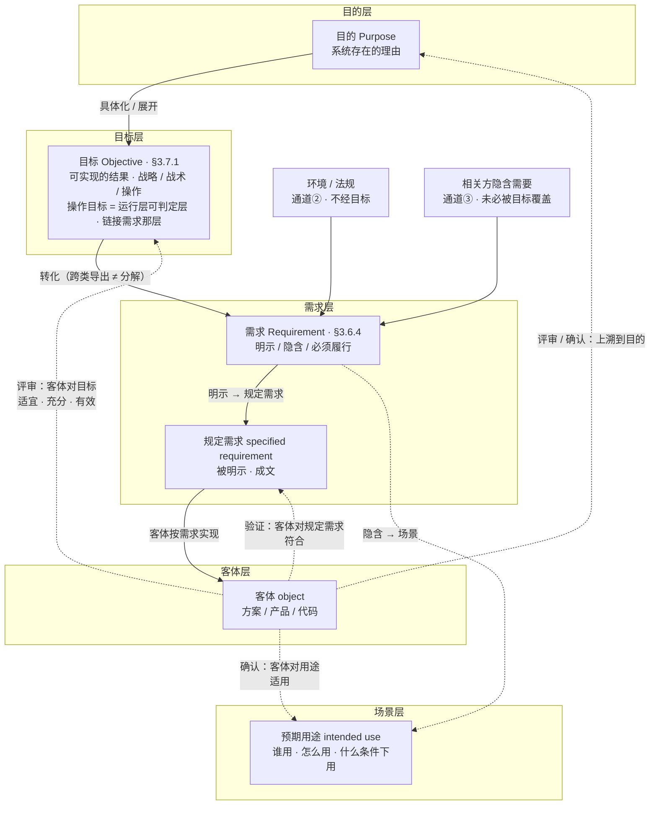
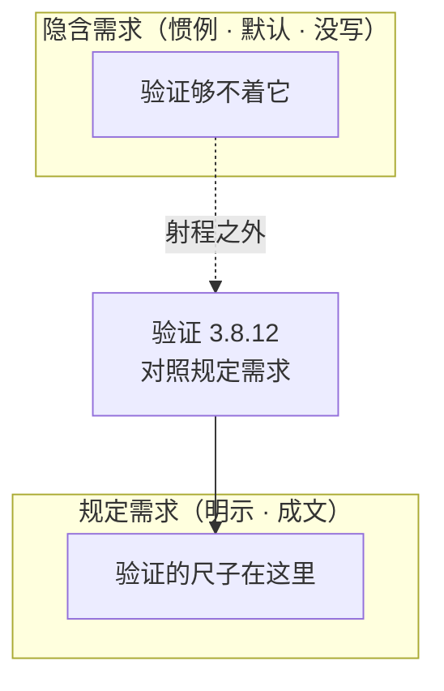
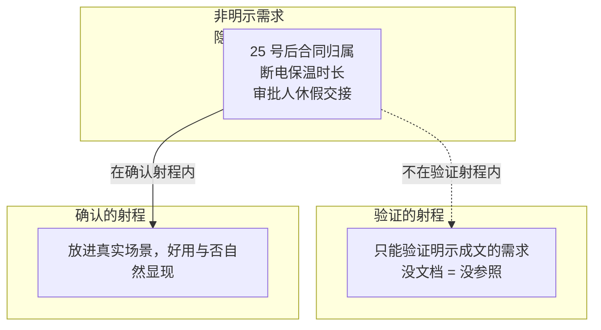
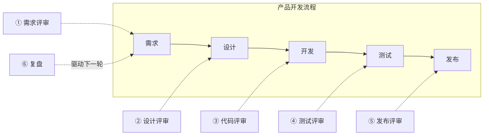

# 第8章 评审、验证与确认：三个看门人

> 本章概念：评审 / 验证 / 确认
> 英文来源：review / verification / validation
> 主案例：恒信集团合同审批系统（IT侧）｜ 镜照：冰链科技冷链温控箱（产品侧）

---

## 8.1 章首 · 误解现场

恒信集团合同审批系统上线前的评审会，周三下午两点，会议室坐满了人。

万辉在投影上打开了 UAT（用户验收测试）报告，语气笃定：

"UAT 全部通过。测试用例通过率 96%，P0/P1 缺陷清零，三条业务主流程全部走通。我们验收合格，可以上线。"

产品开发经理满海已经把报告翻到了最后一页的签字栏，笔尖悬在上面："UAT 全绿，业务方也点了测试环境——验收合格，这个字我签了。"

会议室里有人开始收东西了。财务的人却没动，他盯着报告翻了翻，问了一句：

"你们让我们点的那个测试环境，我们月底对账的场景——25 号之后签的合同算哪个月——测了吗？"

万辉愣了一下："测试用例是照着需求清单写的，需求清单里……没有这条。这是上一轮口头补的需求，还没排进用例。"

"没排进用例？"财务的人皱眉，"那我们月底对账靠什么？"

法务的人也放下手机："等一下。上线前那条'电子签章合同也走审批流'的变更，你们说做了影响分析。可我们法务从头到尾没被拉去评审过这条变更——影响谁、谁审批、出了问题谁兜底，你们自己定的？"

会议室安静下来。徐漾坐在角落，把 UAT 报告合上，轻声说：

"万辉，你把三件事当成一件事办了。"

"哪三件事？"

"评审、验证、确认。"徐漾竖起三根手指，"你说业务方点了测试环境，所以确认过了——不是。那是让业务方当测试员，替你们跑用例。你说测试全绿，所以验证过了——是过了，但你验证的是'按需求做对了'，不是'真实场景能用'。你说上线前评审过了——评审对的是目标，你们只对了需求清单。"

万辉不服："这三样……不都是'把关'吗？方向对、做得对、能用，验收不就是看这个？"

徐漾看着他："正是因为三样都叫'把关'，才必须分清。你这一句话里混了三个词，三个词握着三把不同的尺子——平时混，没事；混到验收签字那一刻，就是合同纠纷。"

如果你坐在这间会议室里，你大概会站在万辉那边。因为大多数人对"评审""验证""确认"的直觉，和他一模一样：**都是"检查一下"，都是"把关"，差不多**——带"评/验/认"字，听起来像近亲。

这一章要推翻的，正是这个直觉。这三个词不是"差不多"的三个说法，而是三把完全不同的尺子——它们的唯一共同点，是中文翻译恰好都带一个"评/验/认"字，而这恰恰是第1章说的第三种词汇病：翻译伪朋友。

这一章，我们把三把尺子分别钉死，再让三个看门人各就各位。

上一章（第7章）我们把产品数据这棵树立了起来——需求数据定义方向、设计数据定义结构、验证数据定义证据。三个看门人查的，正是这棵树：评审对目标，验证对需求，确认对用途。树的每一片叶子（第6章的详细定义），都要过这三道门。

---

## 本章问题

读完本章，你应该能回答：

1. 评审、验证、确认三个词到底差在哪？为什么中文看起来像近亲？
2. 评审为什么以"目标"为参照，而不是以"需求"为参照？
3. 评审为什么必须记录？没记录的评审还算评审吗？
4. 验证的三要素是什么？为什么"测试通过"不等于"验证通过"？
5. 确认为什么能兜住隐含需求？"测试全过、上线没人用"的病根在哪？
6. 确认的三要素是什么？为什么"让业务方点测试环境"不算确认？
7. 复盘和评审是一回事吗？复盘发现的偏差，为什么只是"检测"，不是"裁决"？
8. 三个看门人怎么接力，构成一条需求到上线的三关？缺了任何一关，代价是什么？
9. 架构评审看什么？"架构评审四看"是哪四看、"对质三问"问哪三问？为什么架构靠评审验证、不靠测试？

---

## 开篇 · 本章枢纽（骨架先行）

先把本章要钉的三个词、和它们牵出的三把尺子立起来——后面三幕，都是给这层骨架添血肉。

> **评审对目标，验证对需求，确认对用途。** 三个看门人，三把不同的尺子——方向对不对、做对了吗、真实场景能用吗。

这一章的骨架是**三把尺子 + 一条接力链 + 一条因果链**：

- **三把尺子**（评审 / 验证 / 确认）——各带可检验判据：评审三问（适宜 / 充分 / 有效）、验证三要素（对照 / 证据 / 认定）、确认三要素（同一套三要素，参照换成预期用途）。这是第1章的判据主义：不给没有判据的尺子。
- **一条接力链**——三个看门人依次站岗：评审站在开工前抬头看方向，验证站在交付时低头对规格，确认站在交给用户时走进真实场景。一条需求从起点到上线，要走这三关。
- **一条因果链**——只做验证不做确认 → 隐含需求系统性漏失 → 测试全过、没人用。这不是运气问题，是因果问题。

第一幕把三把尺子并排钉死（它们是什么），第二幕撕开糊纸（它们不是什么：评审不是核对需求 / 测试通过≠验证通过 / 业务方点了≠确认过了），第三幕回答往哪去（三个看门人怎么接力、怎么把把关洒到全程、复盘站在哪）。

---

## 8.2 第一幕 三把尺子并排：三个看门人是谁（定界）

> 这一幕把三个词分开看清——先撕开"翻译伪朋友"那层糊纸、把 ISO 9000 的分家摆到明处（全章的溯源），再立三个参照对象，用五维表把三把尺子并排钉死，最后给每把尺子配上可检验判据。

### 8.2.1 先看病：三个词怎么被糊成一个

万辉的问题不是他笨，是中文给了他一个陷阱。

把三个词摆到英文面前，陷阱当场现形：**review、verification、validation**——三个词源、构词、归属完全不同的英文词，翻译成中文"评审 / 验证 / 确认"，恰好都带一个"评/验/认"字。

这是第1章第三种词汇病"翻译伪朋友"的教科书案例：**英文一眼能看出的不同，中文因为都是"一个动词 + 一个形近字"，看起来像三个近亲。** 三个词不是"检查一下"的三种说法，而是三件不同的事——这一章，就是把被糊纸盖住的分界线一层层撕开。

### 8.2.2 ISO 9000 分家：3.11 与 3.8，一条分界线

更狠的是，在 ISO 9000 的术语体系里，它们**根本不是同一组词**：

- **评审（review）** 在 3.11"有关确定的术语"组——和**确定、监视、测量、检验**是一家人；
- **验证（verification）** 和**确认（validation）** 在 3.8"有关规范的术语"组——和**规范、要求、符合性**是一家人。

标准把评审和验证/确认分家，不是随便分的——**"确定"和"认定"是两种动作，判断和证明是两回事**。评审的动作是"确定"（determination，3.11.1）：查明特性、得出结论，是一次主动调查，不要求客观证据。

验证和确认的动作是"认定"：结果已经在那儿了，去证实它，必须有客观证据。**一个是判，一个是证——判，靠判断力；证，靠客观证据。** 中文的形近字把这层分家糊上了，糊了四十年。

第1章点过的那场"翻译伪朋友"病，最重的代价就是一场合同纠纷：一家医疗器械公司和一家医院，合同里写了"系统通过验收后付清尾款"，但谁也没定义"验收"是什么——公司说验收是功能测试通过，医院说验收是临床科室用得顺，扯皮四个月。

那四个月，就是把"验证"和"确认"糊在一个词"验收"里，等纠纷发生时一次性结算的代价。**这一章三个看门人的分家，就是那场纠纷的预防针。**

### 8.2.3 三个参照对象：目标、规定需求、预期用途

为什么是三把尺子，不是两把，也不是一把？因为三个看门人**看向三个不同的参照物**。把产品开发的世界画成四层（目的 / 目标 / 需求 / 客体），预期用途作为场景层旁挂，两条旁路通道从侧边汇入需求，一眼看清：



- **目的（purpose）**：系统存在的理由——"为什么存在"；目标是它在操作层的展开（§8.3.1 理由四）；
- **目标（objective，3.7.1）**：要实现的结果——可分战略、战术或操作层面的；其中**操作目标**是运行层可判定层，也是链接需求的那层。"我们要让月底对账不再靠手工"是目标；
- **需求（requirement，3.6.4）**：要满足的需要或期望——明示 / 隐含 / 必须履行三形态，不都是规定需求；
- **规定需求（specified requirement，3.6.4 注 2）**：被明示、成文的需求，是"明示形态"的子集——"合同必须经财务、法务、业务三方审批"是规定需求（第3章展开过）；
- **预期用途（intended use）**：这个客体被设计出来，到底要在什么场景、给什么人、干什么用。

**先把两个系统的目的钉在这里**——冰链 M3："让疫苗在冷链运输中一路不失活、安全送达"；恒信合同系统："让合同审批合规、月底账目清楚对得上"。两个系统的目标、需求与案例，都从这两个目的上长出来——恒信的"月底对账不再靠手工"、M3 的"断链即报废时还能撑到接入冷库"，分别是这两个目的的操作展开。

注意这张图里最容易被忽略的几点：**目的在最顶层，目标在其下，规定需求在中间，客体在最下面，而预期用途在旁边的场景层；需求还挂着两条不经目标的旁路通道。** 目的具体化成目标，目标转化出需求，需求明示成规定需求，规定需求规定客体——这是向下的建造；三个看门人则全部从客体出发，分别向三个不同的参照看去：

- 评审看客体对**目标**——方向对不对；
- 验证看客体对**需求**——做对了吗；
- 确认看客体对**用途**——做对的东西了吗。

把三个参照放回六概念闭环，接缝才看清：**目标是系统目的在操作层的展开，需求是目标转化（跨类导出，不是分解）的结果——但需求不只有目标一个来源**，环境 / 法规（通道②）、相关方隐含需要（通道③）不经目标、直接进需求。目标的完备性靠评审的**充分性**把关，两个旁路通道靠需求工程兜底。

**需求再往下，三形态在这里分叉：明示形态成文化，就是规定需求**——验证的尺子在文档里，够得着（§8.3.4）；**隐含形态写不出来，只能靠场景兜**——确认把产品放进真实用途，让它现形（§8.3.5）。三段（目标段 / 规定需求段 / 用途段）的接缝，恰好是需求三形态的分叉口：**明示形态有文档可验，隐含形态只能靠场景兜。**

**评审与确认，都沿链上溯到目的：评审以目标为参照，根子上看的是系统目的（§8.3.1 理由四）；确认在真实场景终审，方向照样对到目的——方向把关是两道闸（§8.3.6）。**

三种参照不是一回事，这一点在后文会决定性地展开——尤其是目标（要实现的结果）和预期用途（真实使用的场景）的区别：目标驱动着需求的推导，用途则要在真实场景里才现形。

三种参照，其实落在三个不同的世界里：**目标属于"想要的"（意图世界），需求属于"写下来的"（转写世界），预期用途属于"真实的"（真实世界）。**

所以三个看门人各守一种"错"：评审守**方向错**（想要的选错了、漂了），验证守**转写错**（写下来的规格没被实现），确认守**匹配错**（做出来的放进真实场景立不住）。

这也解释了一个结构差：目标可以推导出需求（向下建造），唯独预期用途**不能推导**——它不是被想出来的，是真实场景里本来就有的事实，只能放进场景里发现。

一句话定案，三个看门人各就各位：

> **评审对目标，验证对需求，确认对用途。**

换成三个可当场问的问句——按"哪个错最贵"排：

> **产品的方向对不对？（评审）→ 在真实场景里立不立得住？（确认）→ 是不是满足规定需求？（验证）**

方向错，整个产品白做；用途错，做对了也没人用；实现错，可返工。若按站岗先后（开工前 → 做完了 → 交给用户），顺序则是评审 → 验证 → 确认——本章定案句与后文三关（§8.4.1）都按这个排。

> 术语注：这句"评审对目标，验证对需求，确认对用途"是本书对 ISO 9000 三个定义（§3.11.2 / §3.8.12 / §3.8.13）的**凝练**，不是任何标准的原文——三个定义的原文见 §8.2.5~§8.2.7；本书的命名（三个看门人）与判据拆法（三问 / 三要素）同样是作者主张，欢迎检验、欢迎校准。

三个看门人，守着三道门：**评审站在"开工前"，抬头看方向；验证站在"做完了"，低头对规格；确认站在"交给用户"，走进真实场景。** 这里说的"开工前"是评审的本质定位；落地时，这个动作会洒在全程各节点（见 §8.4.2）。

第2章讲过"工程系统"——技术系统造出来了、性能达标，但人不会用、流程不顺，系统就"失败"。确认看门人守的，正是那一扇"工程系统"的门。

### 8.2.4 五个维度，三把尺子

光说参照不同还不够，因为"参照不同"可以只是修辞。把三个词摆成一张五维对比表，你会看到五个维度**一起把三个词分开**——其中验证/确认在"动作"与"证据"上一致、只在"参照"上不同，评审与前两者分族：

| 维度 | 评审 Review 3.11.2 | 验证 Verification 3.8.12 | 确认 Validation 3.8.13 |
|---|---|---|---|
| **定义**（汇总） | 对客体实现**所规定目标**的适宜性、充分性或有效性的确定 | 通过提供**客观证据**，对**规定需求**已得到满足的认定 | 通过提供**客观证据**，对**特定的预期用途**已得到满足的认定 |
| **参照** | 目标 | 规定需求 | 预期用途 / 应用 |
| **动作** | 确定（判断） | 认定（证明） | 认定（证明） |
| **证据** | 不要求客观证据 | 必须有客观证据 | 必须有客观证据 |
| **时机** | 事前 / 事中做判断 | 对结果做证实 | 在真实或模拟场景中做证实 |
| **软件落点** | 需求评审、设计评审、代码评审 | 单元 / 集成 / 系统测试、压测 | UAT、Beta、灰度、试运行 |

> 注：表中"定义"一行是三个词各自权威定义的总览，算**汇总行**；真正的对比维度是下面五维——参照 / 动作 / 证据 / 时机 / 软件落点。

逐词拆开看，三个"最"：

**动作不同，是最根本的分家。** 评审的动作是"确定"、验证确认的动作是"认定"——具体的"判 / 证"辨析见 §8.2.2，这里只留一句增量：**"确定"是从"没有结论"到"有结论"的主动调查，结论是造出来的；"认定"则是结果已在那儿、去证实它。**

这就是为什么评审不要求证据、验证确认必须证据。

**证据要求不同，是最容易踩的坑。** "测试通过了"是验证的证据，但它不是评审本身；评审的结论是"这方案对目标合不合适"，它不是一份证据，是一份判断。很多团队把评审开成"读文档会"——只是把证据念了一遍，没有判断，那不算评审。

**参照不同，是决定性的差异。** 评审对目标，验证对需求，确认对用途。这一条是后面所有部分的骨架，接下来三把尺子各就各位。

三把尺子并排立在这里，判据主义也在这里登场——第1章说过，不给没有判据的工具。三把尺子各带一套可检验判据：评审三问、验证三要素、确认三要素。尺子量不量得出来，先要有能打勾的判据。下面逐把钉死。

### 8.2.5 评审的尺子：适宜 · 充分 · 有效

先看第一把尺子。评审的权威定义（ISO 9000:2015 §3.11.2）：

> **评审 review：对客体实现所规定目标的适宜性、充分性或有效性的确定。**
> *determination of the suitability, adequacy or effectiveness of an object to achieve established objectives.*
>
> 示例：管理评审、设计和开发评审、顾客要求评审、纠正措施评审和同行评审。（注：本书按统一口径写作"设计开发评审"——"设计开发"不拆开。）

拆开定义，四个关键词：客体（被评的东西）、所规定目标（尺子）、确定（动作）、**适宜性 / 充分性 / 有效性**（三个问句）。前三个都好懂，关键是最后这个三连问——评审不是问"对不对"，是问三件事：

| 问句 | 英文 | 通俗 | 恒信的例子（目标：月底对账不再靠手工） |
|---|---|---|---|
| **适宜性** | suitability | 对症吗？ | 想解决月底对账，方案却只做了审批提速 → 不适宜 |
| **充分性** | adequacy | 够全吗？ | 对账口径只覆盖了当月，25 号后的归属没算 → 不充分 |
| **有效性** | effectiveness | 管用吗？ | 功能全上线，月底对账还是要手工算三小时 → 无效 |

三个问句**层层递进**，一个都不能跳过：

> **方向不对，做得再全也是白费（适宜性）；覆盖不全，方向对了也会翻车（充分性）；前两个都过了，还要看结果说话（有效性）。**

ISO 9000 还补了一句注：评审也可包括确定"效率"（efficiency）——不仅管不管用，还要看投入产出比。管理评审（ISO 9001 §9.3）就要求评价质量体系"持续的适宜性、充分性和有效性"——三问是同一套，从产品评审一路用到公司管理。

拿冰链的 M3 走一遍三问，三问的面目会更清楚。目标：断链即报废时，还能撑到接入冷库。

第一问**适宜性**——方案选了双压缩机冗余，断一台还有一台，与"撑到接入冷库"相称（适宜）；第二问**充分性**——方案覆盖了"压缩机故障"，但"运输车抛锚 2 小时"没覆盖——只做了设备级冗余，没做旅程级冗余（不充分）。

第三问**有效性**——就算设备级、旅程级都齐了，真断链时能不能撑到冷库，要等真实运输的结果说话（第二幕那辆会颠的车，会给出答案）。

**三问不是同一个会里一次问完：第一问挡掉方向错的方案，第二问在方案细化时不断追问"还漏了什么场景"，第三问要等真实结果。** 很多人觉得评审是"开一次会"——错了，评审是"一个动作"，这个动作从方案出生那天起，就一直没停过。

> **概念卡片 · 评审**（四问为纲，九格为目；格号=九格尺子）
>
> | 四问 | 格 | 内容 |
> |---|---|---|
> | **它是什么** | ① | 对客体实现所规定目标的适宜性、充分性或有效性的确定（ISO 9000:2015 §3.11.2）；动作是"确定"（判断），不要求客观证据 |
> | **它不是什么** | ⑥⑦ | 与验证构成最接近的辨析——评审对目标（方向对不对，判断），验证对需求（做对了吗，证明）；评审 ≠ 核对需求——核对需求是验证的姿势，评审是唯一在纸面阶段抬头看目标的环节（确认是建成后的实证终审，见 §8.3.6） |
> | **它从哪来** | ②③⑨ | 源自工程"把关"实践——设计评审、代码评审让多双眼睛在缺陷进门前拦一道，没有它，错误只能等验证/确认阶段才被证伪，返工贵数倍；ISO 9000 把评审归 3.11"有关确定的术语"组，与确定、监视、测量、检验一家，验证/确认归 3.8"有关规范的术语"组（见 §8.2.2）——中文把两组合并翻译成"评/验/认"近亲四十年；review ← re-（再）+ view（看）——第一遍是做，第二遍是看 |
> | **它往哪去** | ④⑤⑧ | 它回答"方向对不对"；在需求评审、设计评审、代码评审、发布评审等把关节点用（见 §8.4.2 五个把关节点 + 一个复盘节点）；误区 ✗ "评审就是开会过一遍"——没结论、没记录，最多算聊天 ✗ "评审目标太抽象，评不了"——目标具体化配方（对象 + 时限 + 可衡量结果，见 §8.4.5） |
> | **判据** | 三问 | 三问过了吗（适宜 / 充分 / 有效）？通过标准会前定了吗？团队、结论、记录三属性齐吗？ |

### 8.2.6 验证的尺子：对照 · 证据 · 认定

第二个看门人，也是大家最熟悉的——验证。它的权威定义（ISO 9000:2015 §3.8.12）：

> **验证 verification：通过提供客观证据，对规定需求已得到满足的认定。**
> *confirmation, through the provision of objective evidence, that specified requirements have been fulfilled.*

定义里有三个要素，**缺一个都不算验证**：

| 要素 | 问什么 | 反例 |
|---|---|---|
| **① 对照：规定需求** | 有白纸黑字的尺子吗？ | 口头"大概要快一点"→ 无法验证 |
| **② 证据：客观证据** | 有可复核的证据吗？ | "我认为满足"→ 不算验证 |
| **③ 认定：明确结论** | 有明确结论吗？ | "差不多吧"→ 不是验证 |

第一个要素呼应第4章的规定需求——**验证的参照必须是成文的规定需求**。"口头补的"需求（章首那条"25 号后归属"）没进文档，就永远不在验证的射程里。

第二个要素最容易被低估——"客观证据"三个字，是验证和评审的分水岭：评审可以不依赖证据，验证必须拿证据说话。第三个要素决定了验证的输出是**结论**："已验证 / 未验证"，不是"跑完了"。

三要素背后还藏着一条推论，值得单独看一眼——它是第4章"需求质量六性"里"可验证"一性的真正出处。ISO 9000 定义规定需求（3.6.4 注 2）时，只说它是"被明示的、成文的"，**并没有说"可验证"**。

"可验证"是从哪来的？——从验证的定义（3.8.12）推出来的：验证要求提供客观证据，而验证的参照是规定需求，于是作为验证参照的规定需求，必须能提供客观证据——也就是应当可验证。这是一条逻辑推导，不是定义原话：

> **"规定需求可验证"不是标准直接写的，是从"验证要求客观证据 + 验证以规定需求为参照"推出来的——可验证，是规定需求当验证参照的资格证。**

这条推论解释了第4章为什么把"可验证"列为需求质量六性之一：它不是一个可选的加分项，而是"这条需求能被验证"的入场券。口头那句"大概要快一点"，连被验证的资格都没有——没有资格，就没有证据；没有证据，就永远停在"感觉"，到不了"认定"。

> **概念卡片 · 验证**（四问为纲，九格为目；格号=九格尺子）
>
> | 四问 | 格 | 内容 |
> |---|---|---|
> | **它是什么** | ① | 通过提供客观证据，对规定需求已得到满足的认定（ISO 9000:2015 §3.8.12）；三要素 = 对照规定需求 + 客观证据 + 做出认定 |
> | **它不是什么** | ⑥⑦ | 与评审构成最接近的辨析——验证对需求（做对了吗，证明），评审对目标（方向对不对，判断）；验证 ≠ 测试——测试是提供证据的手段之一，验证要对全部规定需求做认定（见 §8.3.2） |
> | **它从哪来** | ②③⑨ | 随"按规格建造"的工程实践而生——产品对规格的符合性必须能被客观证明，"做对了"才算定案；ISO 9000 把验证归 3.8"有关规范的术语"组，与规范、要求、符合性一家，与确认同组不同条——参照一个在文档、一个在场景（见 §8.2.2）；verification ← verus（真）——求真：对照规定需求，证明为真 |
> | **它往哪去** | ④⑤⑧ | 它回答"做对了吗"；在交付时、逐级回收（V 模型右半边，见 §8.4.7）用；误区 ✗ "测试全绿 = 验证过了"——测试只是证据之一，验证要对全部规定需求做认定 ✗ "隐含需求靠验证兜住"——验证的尺子在文档里，够不着没写下来的需求（见 §8.3.4） |
> | **判据** | 三要素 | 三要素齐吗（对照 / 证据 / 认定）？逐级回收（单元 → 集成 → 系统）了吗？ |
>
> 引：第6章"符合性分析"在这里归位——它和测试一样满足验证三要素，只是证据形式是文档评审（见 §8.3.2）。

### 8.2.7 确认的尺子：同一套三要素，参照换成预期用途

第三个看门人，也是全书最被低估的一个。它的权威定义（ISO 9000:2015 §3.8.13）：

> **确认 validation：通过提供客观证据，对特定的预期用途或应用要求已得到满足的认定。**
> *confirmation, through the provision of objective evidence, that the requirements for a specific intended use or application have been fulfilled.*

注意：确认和验证**共享同一套三要素**——对照、证据、认定。它们唯一的区别，在第一个要素：验证对照"规定需求"（文档），确认对照"特定的预期用途"（场景）。就这一个词的区别，决定了两个看门人完全不同的射程和命运。

"预期用途"不是一句空话，它由三样东西构成：

| 构成 | 问什么 | 恒信的例子 |
|---|---|---|
| **目标用户** | 给谁用？ | 法务、财务、业务三方审批人，不是 IT 测试员 |
| **使用场景 / 任务** | 用来干什么？ | 月底对账、电子签章合同审批、审批人出差时手机处理 |
| **环境与条件** | 什么情况下用？ | 月末高峰并发、弱网、审批人休假交接 |

> **这套三构成，和 UAT 那句"真实用户 + 真实任务 + 真实场景"一一对应：目标用户 → 真实用户，使用场景 / 任务 → 真实任务，环境与条件 → 真实场景。** 后文 §8.3.3、§8.4.8 会反复用它。

确认的尺子上，还有一个更精确的写法值得钉死：ISO 9000 对照的是「特定的预期用途或应用的要求」——注意是"要求"（requirement，§3.6.4）。按标准，要求 = 明示的、通常隐含的、必须履行的需要或期望，**隐含形态天然就在里面**。这把尺子拆开是两半：

- **明示部分**：操作目标（效能度量 MOE）——运行层确认的显性判分线，§8.4.5 那句"月底对账时间 ≤ 2 小时"就挂在这里；
- **隐含部分**：未明示的使用需要与期望——"审批人休假交接也能顺""月末高峰不卡"，靠场景确认兜住（§8.3.5 展开）。

**操作目标不是预期用途要求的全部，只是它的显性子集。** 它当"所确立目标"进评审，是全身进入；进确认，只是参照的一部分——这也预告一句要紧话：**操作目标全绿，确认未必通过**（§8.3.5）。

确认的证据，ISO 9000 注 1 给了：试验结果、变换方法计算、文件评审；注 3 更重要：**使用条件可以是真实的或模拟的**——这句话给了灰度发布、仿真测试的合法性。

M3 温控箱的"真实运输车跑全程"是真实条件；恒信"用测试环境模拟出月底高峰的并发"是模拟条件——都算确认，都满足"放进场景里看结果"。

镜照一眼冰链，把 M3 的预期用途填满三构成：目标用户是疾控中心和运输司机（不是实验室的测试员）；使用场景是疫苗出库到接种的全程运输（不是恒温台架上的模拟）；环境与条件是低温车厢、路面颠簸、信号弱的山区（不是平稳的测试环境）。

**M3 的预期用途，浓缩在"全程温度不断链"这六个字里**——第二幕案例进展④里那辆会颠的车，就是在用真环境填这三个格子。

> **概念卡片 · 确认**（四问为纲，九格为目；格号=九格尺子）
>
> | 四问 | 格 | 内容 |
> |---|---|---|
> | **它是什么** | ① | 通过提供客观证据，对特定的预期用途或应用要求已得到满足的认定（ISO 9000:2015 §3.8.13）；三要素 = 对照预期用途 + 客观证据 + 认定——与验证共享同一套三要素，唯一区别在参照 |
> | **它不是什么** | ⑥⑦ | 与验证构成最接近的辨析——确认对用途（做对的东西了吗），验证对需求（做对了吗）；确认 ≠ UAT 走流程——UAT 必须是真实用户 + 真实任务 + 真实场景；让业务方点测试环境是把确认做成了验证（见 §8.3.3） |
> | **它从哪来** | ②③⑨ | 源于"符合规格≠真实可用"的教训——交付物要放进真实使用情境才算数，确认因此独立出来，专管"预期用途"；ISO 9000 注 3 允许使用条件"真实的或模拟的"，给了灰度发布、试运行合法性（见 §8.4.8）；validation ← validus（强壮、有效）——放进真实场景，看它"立得住"吗 |
> | **它往哪去** | ④⑤⑧ | 它回答"做对的东西了吗"；在交给用户时用——UAT、Beta、灰度、试运行、仿真测试（见 §8.4.8）；误区 ✗ "测试全过 = 能用"——测试证明做对，不证明能用 ✗ "隐含需求先写文档再验证"——很多隐含需求写不出来，只有真实场景能裁决（见 §8.3.5） |
> | **判据** | 三要素 | 真实用户 + 真实任务 + 真实场景齐了吗？隐含需求在真实场景里显现并处理了吗？ |

## 案例进展①｜恒信重开上线评审会

章首那场会散会后，徐漾提议第二天重开。这次他先做的，不是讲方案，是定目标。

"这次评审的目标是什么？"徐漾问。

万辉："上线前评审，目标就是……系统能上线。"

"'能上线'评不了。目标要有对象、有时限、有可衡量结果。"徐漾在白板上写下三行：

- **月底对账**：上线后第一个月底，对账单与台账逐笔核对一致率 100%，对账时间 ≤ 2 小时；
- **法务合规**：电子签章合同的审批链完整、每一步可追溯，法务可随时抽查；
- **业务可用**：业务人员在 3 个工作日内完成一次合同发起到归档，无求助外援。

"今天这场会，就按这三条评审。每条都有通过标准，会前定的，会后逐条打勾。"

万辉对着这三条，忽然卡住了："……'法务合规'这条，我们的方案里，电子签章合同的审批链，到底谁审、谁签？这条变更当初是口头定的，需求清单里没有，方案里也没有。"

会议室安静了。

徐漾没有意外："这就是评审对目标的意义。如果今天只核对需求清单，你会说'全部覆盖，通过'。可你的尺子不是需求清单，是'法务合规'这个目标——目标一摆出来，你立刻发现：这条变更连需求都不是，是口头的一句承诺。"

万辉后来对徐漾说："我以为评审是核对需求，原来评审是先把目标摆出来，再拿目标照需求。"

---

## 8.3 第二幕 撕开糊纸：三个看门人不是什么（磨边界弧）

> 这一幕把三把尺子和它们最常被认错的东西分开——判据主义在这里成为亲身体验：概念靠正例活、靠反例定型。评审不是核对需求，测试通过≠验证通过，业务方点了≠确认过了——把三张糊纸一张张撕开，再磨清两把尺子的射程边界，最后看清方向把关的两道闸（§8.3.6）。

### 8.3.1 评审不是核对需求

这是评审三问背后那个最容易被跳过的问题。如果评审以"需求"为参照，不是更省事吗？需求是现成的文档，一条条核对就是——很多团队就是这么做的（冰链团队的病，案例进展②会看）。

**四个理由，每一条都足以让"以需求为参照"破产：**

**理由一：需求本身可能是错的。** 需求是人写的——理解错、互相矛盾、不完整，都是常态。如果评审拿"需求"当尺子，就等于默认"需求一定对"。那谁来审需求本身？

**需求评审的本质，恰恰是审"需求"对"业务目标"是否适宜、充分、有效。** 恒信的"电子签章变更没被评审"——不是没核对需求，是需求背后那个目标（法务审批合规）没人去看。

这里有个对称值得记下：规定需求是**评审的对象**（需求评审审的就是它），也是**验证的参照**（验证对照的就是它），还是**验收与责任的依据**（争议时以它为准）。

第4章把它立为全章枢纽、定成验证的参照——到这一章，前两样正好各归一个看门人：评审审它、验证对它；确认不参照它——它的尺子在场景里（预期用途），兜住的是验证够不着的东西。

**同一个词，评审和验证都绕不开它；它没成文，这两个看门人就都闭门**——这正是章首那条"口头补的需求"的下场。

**理由二：否则评审和验证就重复了。** 验证（3.8.12）本来就是"以规定需求为参照、确认符合性"。如果评审也以需求为参照，两个术语就变成同一件事——ISO 9000 把评审放在 3.11、把验证放在 3.8，这套体系就塌了。**两个词必须是两件事，否则标准不会分家。**

**理由三：满足所有需求 ≠ 达成目标。** 需求全做完，做出来的可能还是没人要的东西——目标错了，需求再对也是白做。评审是整条链上**唯一在纸面阶段"抬头看目标"的环节**：验证低头对规格、不沾方向，确认走进场景当实证终审——早拦方向，只有评审拿着目标这把尺子（确认也看方向，见 §8.3.6 两道闸）。

理由三值得再往前推一步，因为它是最容易被"需求管理"掩盖的一种失败：恒信的目标是"月底对账不再靠手工"，但需求清单里全是"审批提速、流程优化"——需求一条条满足了，目标一个都没碰到。**需求满足得越彻底，目标的偏离走得越远。**

评审不是要否定需求，是要每隔一段就问一句：我们做的这些需求，还朝那个目标吗？

**理由四：目标（目的）本身会漂移——而漂的，是系统目的。** 前三理由默认"目标是对的、静止的"——这一条戳破它：目标不是钉死的靶子。

先把链点破：**目标（objective）是系统目的（purpose）在操作层的展开**——"月底对账不再靠手工"是目标，系统为什么存在（系统在其环境中的目的）才是系统目的；评审抬头看目标，根子上看的是系统目的（《系统目的或任务理解确认单》锚定的就是它）。

真正会漂移、漂了最危险的正是**系统目的**：产品定位从"专业工具"滑向"大众应用"、业务方在评审里一点一点改口径，没有任何一个环节宣告过"目的变了"，需求却还钉在旧目的上——

这正是第14章说的**目的漂移**：无症状、事后才发现，只能靠**定期评审以系统目的为参照**把它检出来，评审因此是捕捉缓慢漂移的**传感装置**。反过来，系统目的显式变更（战略调整、产品定位改变）就是第14章说的**目的变更**：显式发生的强制扳机，必须靠变更流程强制挂钩、触发架构重审。

**评审以目标而非需求为参照的深层理由就在这里：需求是静止的文档，目标（目的）是活的判据——只有评审，能在目的悄悄漂走时把船拉回来。**

把四条收成一句话：

> **要求是"路"，目标是"目的地"。评审的价值，就是在低头检查路况之外，抬头看看目的地对不对。**

最失败的评审不是没查出问题，而是把评审做成了验证：只核对"满足需求没有"，从不问"这需求本身对吗"。章首万辉那条"UAT 全绿"，就是这个病的晚期。

## 案例进展②｜冰链镜照：需求评审做成了"逐条核对需求"

冰链科技的需求评审会，开了整整一下午。

流程很标准：文正拿着需求清单，逐条念，逐条打勾——"有编号 ✓、有来源 ✓、可测吗 ✓、验收标准有 ✓"。三十条念完，清单上划满了对勾，文正宣布："评审通过。"

测试李旭没有跟着打勾。他翻到第十一条，问了一句：

"这条是'断电保温 ≥ 72 小时'。我们的目标是什么？——疫苗断链即报废，断电后要撑到接入冷库。那这套需求里，有没有写'运输车抛锚 2 小时'这种场景？断电是从哪儿断的、断多久、什么时候算撑不住？"

会议室安静了。文正翻了翻："需求清单里……没写。但这些是应急场景，要不要写进需求，可以后面再说。"

李旭："后面再说，就是评审没过。你刚才的评审，只核对'清单有没有写'——那是验证的姿势，对的是需求清单。可评审要对目标：这套需求，能不能撑起'断链即报废时还能撑到接入冷库'这个目标？——这，才是评审要回答的问题。"

**文正的病，和章首万辉是同一个病的镜像。** 万辉把"确认"做成"验证"（让业务方当测试员）；文正把"评审"做成"验证"（逐条核对需求清单）。两边的病根一模一样：**三个看门人，只认识中间那个**。评审对目标、验证对需求、确认对用途——把中间那个（验证）当成了全部。

文正后来在需求清单顶部加了一行字："评审第一问：这套需求，对目标够不够？"——逐条核对，是评审的最后一小时，不是评审本身。

### 8.3.2 测试通过 ≠ 验证通过

这是验证这一节最要紧的一个辨析。**测试只是提供客观证据的手段之一**——验证的证据形态很多，本书统一列举为五种：测试、检验、审查、计算、文档评审（ISO 9000 注 1 也举过试验结果、变换方法计算、文件评审等例子）。

把"测试过了"等同于"验证过了"，是把手段当成了目的。

拿恒信的例子说透：UAT 报告写"测试用例通过率 96%"——这是一份**测试结果**，是证据的一种。但验证要回答的是"规定需求是否得到满足"，证据要覆盖全部规定需求——96% 意味着 4% 的用例没过或没写，这 4% 对应的需求是否满足，测试没有给出证据。

**测试报告是验证的输入，不是验证本身；验证是拿着全部证据（测试、检验、审查、计算、文档评审）对全部规定需求做出认定。**

顺带把"检验"也请出来。它有双重身份：在 ISO 9000 里归 3.11"有关确定的术语"组、和评审一家（§8.2.2 分家时提过）；但在证据链上又服务于验证——和测试一样，是提供客观证据的手段之一（见上面的统一列举）。

检验（inspection）是"对特性进行测量、检查、试验，与规定要求比较，判定合格与否"——听起来和验证几乎一样，区别在粒度：检验盯着"特性"（温度波动 ≤±0.5℃ 这种单条），验证盯着"规定需求"（一条需求可能含多条特性）。

第6章的符合性分析则展示了另一种证据形式——文档评审：没动一行代码，把"方案枝梢对需求的满足"当证据，也是验证。

第6章说"符合性分析 ≠ 评审——分析是评审的输入"，现在补全另一句：**符合性分析是评审的输入，也是验证的一种。** 同一个动作，在"看它对不对"时是评审的输入，在"证明它满足需求"时是验证的证据——关键是你在哪个门里用它。

> **符合性分析 = 设计层的验证（文档评审式）；测试 = 实现层的验证（试验式）。它们都满足验证三要素，只是证据不同。**

**验证的证据有很多种：测试、检验、审查、计算、文档评审——别把验证窄化成"跑测试"，也别把"跑测试"升级成"验证过了"。**

### 8.3.3 业务方点了 ≠ 确认过了

确认最容易被误解的形态，是 UAT。拿它说透：

> **UAT 不是"让业务方点一遍测试环境"，而是"真实用户 + 真实任务 + 真实场景"的确认。**

章首万辉的 UAT 错在哪？他让法务、财务、业务"在测试环境点了一圈"——那是**让业务方当测试员，替测试团队跑用例**，对照的还是需求清单。

真正的 UAT 是：财务用真实的对账数据、在真实的月底时间点、跑真实的月底对账任务——对照的是"月底对账能用"这个预期用途。前一种 UAT，测的还是需求；后一种 UAT，测的是场景。

**让业务方点测试环境，是把确认做成了验证。** 业务方替你打勾的，还是需求清单上的格子；真实场景里会不会对不上账、审批人休了假怎么办，测试环境替不了真环境回答。

## 案例进展③｜恒信 UAT 的教训

上线前两周，徐漾把那次"UAT"的整个过程调出来，把万辉、玉杰、小白叫到会议室复盘。

"你说业务方点了测试环境，通过了。我问你三个问题——"

"第一，月底对账的数据，用的是真实数据还是造的数据？"——造的数据，20 条，没有一条是 25 号之后签的。

"第二，月底对账，是在真实月底的时间点、真实并发下做的吗？"——不是，周二下午，三个人轮流点。

玉杰说："测试环境那三台机器是我部署的。周二下午三个人轮流点，是'人在点'；月底是几十个人同时冲进去对账，测试环境替不了真环境——那种并发，它扛不住，也测不出来。"

"第三，法务的电子签章审批链，业务方验证过'谁审谁签'吗？"——没有，那条变更压根没排进 UAT。

小白说："UAT 的数据和用例都是我准备的，全照着需求清单写——清单里没有'25 号后归属'，用例里就没有；清单里没有'电子签章'，用例里也没有。我以为跑到 96% 就是确认过了，现在才明白：我验证的只是需求，不是它好不好用。"

徐漾合上文件夹："所以那次不是确认，是让业务方当测试员。**你把确认做成了验证——让业务方对着需求清单替你打勾。** 真正的确认要回答的问题只有一个：真实业务场景里，这套系统转得起来吗？——你没问。"

万辉："那现在怎么办？"

徐漾："补。确认不能后补到上线后——上线后补确认，就叫'上线事故'。把月底对账、电子签章、审批人休假交接三个真实场景，排进下一轮 UAT，用真实数据、真实任务、真实时间点。**验证证明'做对了'，确认证明'能用'——两个都要，缺一个，另一个就是自我安慰。**"

### 8.3.4 验证够不着隐含需求

验证有个致命的边界，这一节把它看清。验证的参照是**规定需求**——规定，意味着明示、成文。那么：

> **没写进文档的需求，验证够不着。因为验证的尺子在文档里，没文档 = 没参照。**

第3、4 章讲过"隐含需求"——"箱体要能扛住装卸磕碰""25 号之后签的合同归属下个统计月"，这些没人写，但漏了用户会骂。它们不是规定需求，于是**不在验证的射程内**：



这就是"只做验证不做确认→测试全过没人用"的**前半截**：如果团队只做验证，那么所有没写进文档的隐含需求，全部在体系外漏着——测试全绿，恰恰是漏光的那批需求绿不了，因为**根本没被测**。后半截，确认看门人来补。

### 8.3.5 确认的尺子在场景里，不在文档里

把验证和确认摆在一起，一句话划界：

> **验证的参照在文档里，确认的参照在场景里。**

规定需求是文档——明示、成文、可复制。预期用途不是一份文档，它是一种**真实使用情境**：把产品放进情境里，好用不好用是自然显现的事实。这个区别带来一个决定性的推论——**确认能兜住验证够不着的东西**：



为什么场景兜得住、文档够不着？因为**真实场景自带答案**。月底对账、运输车颠簸、审批人休假——这些场景不会因为你没写文档就不存在。把产品放进场景，隐含需求漏没漏，当场现形：对不上账、断档 30 秒、待办卡在离职审批人手里，全是看得见的缺陷。

顺着这把尺子再往前一步：**操作目标（MOE）全绿，不等于确认通过。** 操作目标只是预期用途要求的显性子集（§8.2.7）——它达标是确认的**必要条件，不是充分条件**：指标全绿、真实场景却用着别扭，确认照样失败。

确认的独特价值，恰恰在兜住操作目标**没有覆盖**的隐含要求：验证够不着的是文档外的隐含（§8.3.4），确认还要兜住操作目标外的使用期望——两层"外"，都只在场景里现形。

这里有个比喻，值得放进记忆——**隐含需求像冰山，水面下的部分占了大半。** 传递到下游的只能是浮出水面的部分（明示成文）；但如果没有"水下还有冰山"这个认知，船就直接撞上去了。

验证是量吃水线的尺子——它只管浮在水面上的部分；确认是把船开进那片水域的试航——水下撞没撞到，试航时才知道。第4章说过"隐含需求不会自己开口"——它不开口，就靠把船开进真实水域，让水下部分自己撞出声来。

### 8.3.6 方向把关是两道闸：评审早拦，确认终审

三个看门人里，验证是唯一不看方向的——需求本身错了，它照样放行。"抬头看方向"的，是评审和确认两双眼睛，而且不是并列的两道门，是一前一后两道闸：

| | 评审（第一道·早拦） | 确认（第二道·终审） |
|---|---|---|
| **时机** | 事前 / 事中，系统未建成 | 事后，系统投入使用 |
| **方式** | 预测性把关：判断与论证推演"方向应该对" | 实证性把关：真实 / 仿真使用证实"方向确实对" |
| **对象** | 纸面制品（目标、需求、架构、方案） | 系统本身 |
| **覆盖** | 显性部分（写在目标里、可逐条论证的） | 连隐含部分一起兜（真实使用暴露一切） |

评审通过，只代表"基于当时信息的最佳判断"——它可能被确认推翻：纸面上再顺的方案，放进真实场景站不住，终审照样打回。所以两道闸缺一不可：只靠评审，隐含需要无法被论证覆盖——评审对隐性盲区无能为力；只靠确认，方向把关全推到建成之后，纠偏成本爆炸。

**分工的根据在参照：评审的参照只有明示目标（§8.2.7），确认的参照含隐含形态——评审管方向的显性部分，确认管方向的终审与隐含部分。验证在这条线上完全不沾方向。**

> **一句话：方向对不对，评审先拦、确认终审——验证只管"按写下的做对了吗"，从头到尾不抬头。**

## 案例进展④｜冰链镜照：测试全过，一上路就露馅

M3 温控箱交付前，李旭（系统工程师团队·验证侧）组织了一次真实场景测试。不是测试用例，是一场真的运输：疫苗装箱，上真实的疫苗运输车，跑"出库 → 运输 → 到达"全程。

第一天晚上，问题就出来了。车厢过减速带时，温度记录仪因振动断电重启，**断档 30 秒**。温度数据不是连续的。

李旭回看数据，发现断档发生在每次颠簸之后。他试着在测试台架复现——台架没有颠簸，复现不了。翻测试用例——用例里只有"温度记录连续"，没有"振动下温度记录连续"。

"这不是测试用例没写好。"水忠看完数据，说了句，"是测试环境里没有路。测试台架稳得像桌面，真实车厢会颠。**用例全过，说明不了上路能过。**"

他们把 M3 装到真实车上连跑三天，又抓出三个问题：电池在低温下掉电快于预期、箱门在振动下轻微漏温、云端断网重连要 40 秒。

三天，四个问题，没有一个能被测试用例提前发现——因为用例的参照是需求文档，而真实场景的参照是"疫苗能不能安全送到"。

把这四个问题翻回需求清单，一条都对不上：颠簸断电、低温掉电、振动漏温、断网重连，**没有一条被写进过需求文档**——它们是典型的隐含需求，真实存在、没人写过、验证够不着。**确认的价值，正在这里：它把"没写下来的需求"显影成"看得见的缺陷"**——那次颠簸断档 30 秒，就是需求文档里缺"振动下温度记录连续"这一条的证据。

**这，就是确认和验证的差别：验证在文档的尺子上跑，确认在真实世界的尺子上跑。** 冰链的测试台架做得再好，也替代不了那辆会颠的车。

---

## 8.4 第三幕 三关接力 + 因果链：三个看门人往哪去（运用）

> 这一幕把三把尺子用起来——三个看门人怎么接力（三关）、怎么洒到全程（五个把关节点 + 一个复盘节点）、复盘站在哪（检测器，不是裁决者）、以及那条最硬的因果（只做验证不做确认→测试全过没人用）。最后落到三套手法：评审怎么评、验证怎么验、确认怎么确认。

### 8.4.1 三个看门人怎么接力：一个功能的完整三关

三个看门人不是三座孤立的门，它们串起来，就是第3章"'程度'三步得出法"的第三步落地。回顾第3章：质量是"特性满足需求的程度"，程度怎么得来？三步——确定特性值（测量 / 检验 / 试验 / 评审 / 计算）→ 与需求比对（接收准则）→ 认定满足程度。

第三步的"认定"，动作上正是验证和确认：验证认定"特性满足规定需求"，确认认定"客体满足预期用途"。

**所以三个看门人不是质量体系的外挂，是质量判定那个"程度"从"感觉"变成"认定"的必经动作**——第3章说"没有接收准则，程度永远只能感觉"，这一章补全后半句："没有验证确认，连感觉都算不上——因为没人认定。"

把三部分合起来，让一个功能从需求到上线走一遍完整三关——这是本章最重要的一张全景图：

**场景：恒信口头补了一条变更——"电子签章合同也走审批流"，它连需求都不是，只是口头承诺。**

**第一关 · 评审（对目标）**：这条变更的目标是什么？——法务审批合规。评审问：电子签章合同走审批流，谁发起、谁审批、谁签章、谁归档？法务认可这个审批链吗？这条变更对"月底对账""业务可用"两个目标有没有副作用？

**评审在开工前，把目标摆出来照方案**——案例进展①里恒信就是在这一关发现"这条变更连需求都不是"。

**第二关 · 验证（对需求）**：开发完成，这条需求被规定成文："电子签章合同提交后进入审批流，审批通过后自动进入归档。"

验证问：这条需求满足了吗？——单元测试过（签章触发逻辑）、集成测试过（审批引擎 × 签章服务）、系统测试过（全流程走通）、符合性分析过（"审批引擎"枝梢的语义 + 指标）。

**验证在交付时，拿规定需求当尺子，逐条认定。**

**第三关 · 确认（对用途）**：上线前，法务、财务、业务用真实场景跑：一份电子签章的采购合同，从发起、法务初审、财务校验、业务终审、签章、归档，全程能不能走通？月底对账时，电子签章合同的统计口径对不对？

**确认在交给用户时，把产品放进真实场景，问"能用吗"。**

三关缺任何一关，故事都会不一样——每缺一关，缺的是一个具体的看门人，后果完全不同：

| 缺哪一关 | 后果 | 恒信的例子 |
|---|---|---|
| **缺评审** | 需求错了没人发现，白做 | "电子签章变更"没有目标可对照——它连需求都不是，是口头承诺 |
| **缺验证** | 做错了没人知道，返工 | UAT 通过率 96%，剩下 4% 没有证据，却照样宣布"验证通过" |
| **缺确认** | 做对了也没人用，白做 | 真实对账场景从没测过——测试全过，月底对账对不上 |

**三个看门人各看一处，谁也替不了谁。**

反过来，这张表还能做**反向诊断**：系统上线运行了，业务问题却还在——需求做对了、真实场景也能跑，说明转写、匹配都没错，根子只可能在最上游：**评审没把"这系统对达成目标有效吗"这一关**。目标是可度量结果，上线只是系统在跑、不等于目标达成——建外场排故知识库解"排故慢"，需求却写成"支持库存查询"，上线了排故依旧慢，正是缺评审这一关。

三关的产出——评审记录、验证认定、确认结论——合起来，就是后记四角色清单里系统工程师（团队）的《验证与确认报告》：三关怎么过的，都有证据落纸。

同一套三关，在冰链长得一模一样，这是本书最喜欢的双域对照：评审——M3 的目标是"断链即报废时还能撑到接入冷库"，评审拿这个目标照需求清单（案例进展②的教训）。

验证——零部件试验、系统联调、整机低温试验，对照的是各项规定需求；确认——真实运输车跑全程（案例进展④的教训），对照的是"疫苗能不能安全送到"。**一个软件，一个硬件；一条审批流，一辆运输车——三个看门人，两扇世界的门。** 这套概念不挑行业。

### 8.4.2 五个把关节点 + 一个复盘节点：评审洒在全程，不只是上线前

三个看门人不是只在最后出现一次。评审尤其如此——它是洒在整个流程上的门禁，从需求到发布，每个关键节点站一班：



| 把关节点 / 复盘节点 | 目标陈述 | 判定内容 |
|---|---|---|
| **① 需求评审** | 需求达到"可开发"状态 | 符合业务目标（适宜）/ 无遗漏（充分）/ 可落地（有效） |
| **② 设计评审** | 方案可行且满足全部需求 | 对症（适宜）/ 周全（充分）/ 能落地（有效） |
| **③ 代码评审** | 代码正确、可维护 | 正确性 / 可维护性 / 规范性 |
| **④ 测试评审** | 质量达到准出 | 覆盖充分 / 缺陷收敛 / 结果可信 |
| **⑤ 发布评审** | 可安全上线、风险可控 | 就绪度 / 风险 / 兜底 |
| **⑥ 复盘** | 经验沉淀 + 流程改进 | 归因准确 / 行动闭环 / 记录归档（复盘是改进而非把关，见 §8.4.3） |

评审类的把关节点，都是评审三问（适宜 / 充分 / 有效）这一**判据精神**在具体关口的一次落地——上表各关口的判定词不同（如代码评审看正确性/可维护性，测试评审看覆盖/收敛/可信），追问的仍是同一件事：方向对吗、够全吗、管用吗（复盘除外，见 §8.4.3）。

而且注意时机：**问题越早发现，修复成本越低**——需求阶段的缺陷修复成本是 1，发布后是 30~70 倍（第4章讲过）。五个把关节点 + 一个复盘节点的本质，就是把"把关"从终点挪到全程——把返工成本高的那一段，尽量堵在源头。

为什么偏是这些节点？因为它们每个都是一次**转写**——需求译成设计、设计译成代码、代码译成测试、测试译成发布，每译一次，"想要的"就可能被带偏一层：方向带歪、内容漏掉、意思歧义。

五个把关节点，恰好卡在每一次转写之后，对照**上一层的源**检查"转没转偏"：设计评审对需求（源）、代码评审对设计（源）、发布评审对"可上线"（目标）。**评审点的密度，就是转写层的密度——不是评审点选得巧，是转写层本来就有这么多。**

评审类把关节点的"通过标准"，都该是一组**可勾选的硬条件**。拿需求评审和发布评审举例，两组清单的样子：

| 需求评审通过标准 | 发布评审通过标准 |
|---|---|
| □ 每条需求有唯一 ID + 验收标准（可测） | □ 发布 checklist 100% 通过 |
| □ 业务场景覆盖 100% | □ 回滚预案就绪（已演练） |
| □ 无未决 TBD 项、无需求冲突 | □ 无未决 P0/P1 缺陷 |
| □ 每条需求可测 | □ 已知缺陷有缓解方案 |
| □ 资源 / 排期认可 | □ 运营 / 合规 / 安全准备到位 |

两组清单的共同点：**全部由"数字 + 动作"构成，没有"质量要好"这种形容词。** 会前发出去，会后逐条打勾——打勾齐了，才叫"通过"。

这里有个连锁推论：通过标准会前定，意味着**评审的尺子不是评审会当天造出来的，是方案出生时就该有的**。第3章李旭那句"测试判据是什么"问的，就是这个——测试方案里没有接收准则，评审就没有打勾的资格。

镜照一眼冰链，五个把关节点 + 一个复盘节点在硬件侧一个不少：需求评审、设计评审、试产评审、测试评审（出厂检验标准）、上市评审、复盘——名字换成"试产""出厂"，把关的骨架不变。

硬件团队尤其容易犯"评审只在试产时做一次"的错——**这组节点不分行业，分的是你有没有把它洒到全程。**

### 8.4.3 复盘：易混的第四个"评审"，也是治理的检测器

上一节排出的六个节点里，复盘（retrospective）最容易和评审划到一起——复盘与评审都有"回顾审视"的直觉相似。但它和评审是两件事：

| | 评审（review） | 复盘（retrospective） |
|---|---|---|
| **时机** | 干活之前 / 之中把关 | 干完了，事后总结 |
| **归属** | IEEE 1028 五类 / ISO 9000 术语 | 敏捷实践（Scrum Guide）/ 组织过程改进 |
| **目的** | 把关：判断适宜 / 充分 / 有效 | 改进：沉淀经验、驱动下一轮 |
| **位置** | 在流程链条上 | 绕回起点 |

一句话：**评审管"把关"，复盘管"改进"**——复盘不在 IEEE 1028 的五类里，也不是 ISO 9000 的"评审"。它绕回起点，把上一轮的教训变成下一轮评审的目标。

复盘还有一层身份，容易和"治理"混。**复盘是检测器**——它像传感装置一样例行运行：每个迭代、每轮上线后定期复盘，把偏差显影出来（对不上账、漏了场景、口头变更没记录）。

**但复盘发现偏差，不等于治理裁决**：把偏差显影出来的是检测，对偏差做裁决（要不要改字段、谁有资格批准、边界要不要挪）才是治理——那是第14章的事，本章只把检测器立稳。

复盘的通过标准，同样要会前定：**每个行动项有负责人 + 截止日期、上轮行动项关闭率 ≥ 80%、问题按根因归类（而非甩锅）、记录归档可追溯。** 复盘不产出"我们很努力"，产出"下一轮改什么、谁改、何时改完"。

后文案例进展⑤里恒信那次对账事故复盘，产出的就是两条行动项——"变更必须先过评审对目标一关"和"UAT 改真实场景跑"，各配负责人和期限。复盘的价值，一半在诊断，一半在闭环；只诊断不闭环的复盘，是把同样的错再复一遍。

### 8.4.4 因果链：只做验证不做确认 → 测试全过、没人用

现在把第4章的种子、第6章的动作、本章的两个看门人串起来——这是全章最硬核的一条推论：

> **只做验证不做确认 → 隐含需求系统性漏失 → 测试全过、上线没人用。**

拆成三段：

1. **隐含需求没进文档**（第3、4 章）——它真实存在，但验证够不着；
2. **只做验证的团队**——所有没写进文档的需求，全部漏在体系外，**连"被检验"的机会都没有**；
3. **上线后**——功能全对、测试全绿，但用户用起来处处别扭：对账对不上、要的操作找不到、离职审批人把流程卡死。用户嘴上不说，行动上"不用"——**这就是"测试全过、没人用"的完整因果**。

反过来推一句更狠的，这是确认的**第一层意义**：**确认的存在价值，恰恰建立在非明示需求上。** 如果所有需求都能写下来被验证，确认这个活动就不需要存在了——验证就够了。正因为永远有"写不下来的需求"（顺手、直觉、动效、节奏、惯例），确认才不可替代。

而确认兜住的，不止"漏掉的隐含需求"，还有一类**文字说不清的需求**——这是确认的**第二层意义**：冰链 M3 的"手感要高级"、恒信审批系统的"用起来要顺"——这类体验类需求显性化写不出来，只有真实使用能裁决。**确认是这类需求的唯一裁判。**

还有第三层意义，最容易被忽略：**确认把"漏掉的隐含需求"变成"可发现的缺陷"。** 隐含需求没被写下来，所以它不是文档里的一个空洞——它是用户用不出来、卡住、放弃、抱怨。

确认的价值，是把这种隐性缺失显影成缺陷证据：用户卡住了，就是证据；对不上了，就是证据。

**隐性缺失看不见，显影出来的缺陷看得见。** 章首万辉的 UAT 报告里没有一条缺陷——那不是因为他没有缺陷，是因为他把产品放进了一个造不出缺陷的场景（测试环境），缺陷无处显影。

## 案例进展⑤｜月底对账，对不上了

上线两周后，恒信第一个月底对账日。

黄程打开系统，导出对账单，按合同编号逐笔对着台账核对。两个小时，越对脸色越差。下午三点，他把徐漾和万辉叫到了财务办公室：

"对不上。25 号之后签的合同，**合同编号全落在当月**，系统把它们统计进了当月。我们月底对账的口径是——25 号之后算下个月。"

万辉："这条……当初财务提过，后来口头说的，一直没进需求清单。合同编号的归属规则，谁也没定过。"

黄程："我知道没进清单。但现在是真金白银的对不上，不是清单对不上。"

玉杰在边上查完一圈回来："系统本身没坏——月底并发我盯着，没崩、没卡、日志干净。坏的从来不是机器，是'25 号后算哪个月'这条规则，从没被写进系统。"

徐漾让万辉把这次事故从头捋一遍，捋到最后，他在白板上写了六个字：**验证做了，其余没做。**

- 验证：UAT 全绿，测试证明"按需求做对了"——**做了**；
- 评审：这条变更从没评审过，目标（月底对账口径）没人对照过——**没做**；
- 确认：真实对账场景从没测过——当初排进下一轮 UAT 的三个真实场景，上线前被"赶进度"挤回了测试环境——25 号后的合同编号是真实对账时第一次出现——**没做**。

徐漾放下笔："'测试全过、没人用'的下一句，是'测试全过、月底对账对不上'。你们以为它是运气问题，其实它是因果问题——**三个看门人只来了一个，剩下两个，在等一场事故。**"

万辉这次没有反驳。他后来在变更流程里加了一道：任何需求变更，必须先过"评审对目标"这一关，再谈开发；UAT 改成真实场景跑。第二个月底，对账在一个小时内对完——不是系统变聪明了，是三个看门人都站在了门口。

这场复盘，徐漾让万辉把两条行动项记下来——"变更必须先过评审对目标一关"和"UAT 改真实场景跑"。复盘显影了偏差，但偏差的裁决（合同编号归属规则要不要定、归谁定）不是复盘能给的——那是第14章治理的棒。

合同编号这条线，从这次"对不上"开始，后面还会在第12章被当成字段想改就改、在第14章三方编号对不上、在第15章上缝合清单。

### 8.4.5 评审的手法一：把目标变成能打勾的目标

"评审对目标"有个操作性难题：目标是抽象的，怎么评？答案是——**先把目标具体化，再评审**。抽象的目标评不了，"做出高质量的产品"无法评审；具体的目标评得了，"月底对账不再靠手工、对账时间 < 2 小时"可以评审。

目标具体化的配方，三个成分缺一不可：

> **目标 = 对象（谁 / 什么）＋ 时限（何时）＋ 可衡量结果（多少）**

| 抽象（评不了） | 具体（可评审） |
|---|---|
| "做出高质量的产品" | "上线后 3 个月内，月底对账时间从 3 小时降到 2 小时以内" |
| "提升用户体验" | "审批人在手机端完成一次审批平均 < 1 分钟" |
| "做好电子签章" | "本季度完成电子签章与审批流的打通，签章合同可全程追溯" |

评审会开场前，先做一遍**会前三检**——任何一个答不上来，就是目标还没定好，先别开会：

1. 评审结束后，**通过的标准**是什么？（怎么算达标）
2. 这个"达标"有没有**可观察 / 可测量的判定**？（数字、行为、状态）
3. 如果两个人理解不一致，**看什么能裁决**？（哪份文档、哪个数字）

三个都答得上，这个评审有尺子；答不上来，会开了也是白开——因为大家连"过没过"都没共识。而"通过标准"的正确用法，是**随评审邀请一起发出**："本评审通过标准：……全部打勾 = 通过；任一不满足 = 打回修改。"不是开会时现想，是**会前定好，会后逐条打勾**。

还有一个容易踩的点：目标本身还**分层级**。ISO 9000 说目标可以是战略的、战术的或操作层面的——注意这里的**"操作"是 operational（操作/运行层面），不是"动手操作"**：它指管理层级里最贴近执行的那一层，不是让人去操作机器。同一份方案挂不同层级的目标，结论可能完全不同。

"我们要成为行业内合同数字化的标杆"是战略目标，激励人用；"月底对账时间 ≤ 2 小时"是操作目标，评审用。**战略目标负责让大家相信值得做，操作目标负责让评审开得下去。** 评审要挂的是可判定那一层的目标——拿战略目标当评审尺子，等于没有尺子。

还要看清目标的来历：**它不是供方自定的，是需方与供方就"成功判据"达成的约定。** 业务方提方向（要达成什么可度量结果），供方把它翻译成可评审的操作目标，再回来请业务方确认——确认过，它才成为评审的尺子。第4章链头说"立得对不对要业务方点头"，说的就是这一笔。

操作目标还有第二身份：它是确认参照里明示的那一半——进评审全身进入，进确认只是显性子集，所以操作目标全绿不等于确认通过（详见 §8.2.7、§8.3.5）。

还记得第3章文正的"质量绝对没问题"吗？那是评审不了的——因为"没问题"不是标准。把它翻译成"温度波动 ≤±0.5℃、断电保温 ≥72 小时、交付前 100% 通过出厂检验"，才评得起来。**评审对目标，但目标必须是能打勾的目标。**

### 8.4.6 评审的手法二：系统性三属性与五大目的

讲到这里，有人会问：评审这么好，凭什么信它是评审，不是聊天？IEEE 1028-2008（软件评审与审计标准）给"系统性评审"（systematic review）钉了三个必备属性：

> **团队参与、评审结果文档化、评审过程文档化。** 三个属性缺一个，按标准的话说，就是"非系统性评审"——说人话：**没记录的评审不算评审，最多算聊天。**

这一条值得停下来多看一眼，因为它是评审"重形式"的正当理由。为什么非要记录？因为评审的职责是**主动暴露问题**，不是汇报成果——而问题要被人看见、被追踪、被验证已解决，就必须落纸。

第6章讲过"覆盖完整性"——漏一片叶子，下层方案就不知道要做；评审记录同理：不记录的问题，下次评审没人记得它存在过。

IEEE 1028 把评审做法分成五类，各管一段：

| 类型 | 英文 | 干什么 | 落点 |
|---|---|---|---|
| **管理评审** | management review | 评估项目状态，支持管理层决策 | 项目级定期评审（进度/风险/资源） |
| **技术评审** | technical review | 对照规格，识别技术偏差 | 需求评审、设计评审、发布评审 |
| **检查** | inspection | 最正式，逐行检测，缺陷检出率最高 | 代码评审（最正式时） |
| **走查** | walk-through | 作者引导讲解，同行熟悉产品 | 代码评审（非正式时） |
| **审计** | audit | 独立于开发方，核实符合合同与标准 | 上线前独立核查 |

五类的谱系从"轻"到"重"：走查最轻（作者带着看一遍），检查最重（逐行挑刺）。但无论轻重，三个属性不变——**有团队、有结论、有记录**。

ISO/IEC/IEEE 12207 把评审定为软件生命周期里的"支持过程"，并强调评审方与被评方角色分离——评的人不能只评自己写的东西，这正是"有团队"的深层含义。

那评审到底图什么？把 IEEE 1028 和工程实践里的评审目的收拢一下，是五件事，每一件都独立成立：

| 目的 | 说明 | 恒信的例子 |
|---|---|---|
| **质量把关** | 多双眼睛盯同一份产出，把缺陷拦在"上线之前"而不是"出事之后" | 设计评审挡掉"电子签章变更没有审批链" |
| **风险识别** | 不只看"对不对"，更看"会不会出事"——给项目做体检 | 发布评审发现"月底对账场景没人验证" |
| **对齐共识** | 把"每个人脑中的想象差异"摆上桌面当场敲定 | 三方审批人对"谁审谁签"当场对齐 |
| **决策推进** | 给出明确结论：通过 / 有条件通过 / 不通过，不是开完会没下文 | 上线评审给出"暂缓上线，补确认" |
| **经验沉淀** | 新人学团队标准和坑，老手梳理思路 | 复盘沉淀"口头变更必炸"的教训 |

五条里，最容易被轻视的是**决策推进**——因为大多数评审会开完就散，没人敢说"不过"。"开完会没下文"的评审，前三件事全白做。决策推进的落地是三个动作：**明确结论（通过 / 有条件通过 / 不通过）＋ 有条件通过必须写明条件、复核人、期限 ＋ 记录留档**。

这三条对应 ISO 9001 §8.3.4 的两项硬要求：评审发现的问题必须采取必要措施，且保留成文信息。**评审的终点不是散会，是"有一个字面结论、有一份记录、有下一步谁负责"。**

### 8.4.7 验证的手法：V 模型的右半边

验证不是最后做一次就完——它和设计开发的分解一样，是**逐级**的。第3章讲过 V 模型：需求的左半边（需求→设计→详细设计）逐级分解下去，验证的右半边（部件验证→系统验证→确认）逐级回收上来——**左右是镜像**。

需求从哪一级分解下去，验证就从哪一级收回来。这就是 V 模型的形状。

一个具体的样子（恒信合同审批系统）：

| 验证层级 | 验证对象 | 证据 |
|---|---|---|
| **单元验证** | 单个函数 / 模块（金额校验逻辑） | 单元测试、代码走查 |
| **集成验证** | 模块之间（审批引擎 × 签章服务） | 集成测试、接口契约检查 |
| **系统验证** | 整个系统（合同审批全流程） | 系统测试、压测、合规检查 |

关键在"左右镜像"：**"金额 ≥ 500 万触发重点审"这条需求从系统需求层一路分解下去，它对应的验证就必须在每一层收回来**——不是在最后一次性验，是分解到哪一级，验证跟到哪一级。

这个"左右镜像"可以推到底，推演一遍你就明白它为什么不是教条：需求分解到哪一级，说明需求在哪一级被规定；被规定的需求在哪里，验证就在哪里回收。

恒信把"金额 ≥ 500 万触发重点审"分解到系统需求层，系统验证就在这一层回收（系统测试覆盖重点审触发）；它再被分配到审批引擎，集成验证就在审批引擎 × 签章服务的接口处回收（集成测试覆盖引擎与外部服务协同）。

它落进"金额校验"这个函数，单元验证就在这一层回收（单元测试覆盖校验逻辑）。

**每一级分解，都对应一级回收——V 模型的形状不是画出来的，是"需求在哪一级被规定，验证就在哪一级证明"这条逻辑逼出来的。**

只做最后一次性验证，等于让所有分解白做了：需求分解到每一层，验证却只在最后一层收，中间断掉的层级，恰恰是缺陷藏身的地方。

镜照一眼冰链，硬件侧的验证长得不一样，但同一个骨架：单元验证是零部件试验（传感器精度校准、压缩机耐久台架），集成验证是系统联调（温控单元 × 云端 × App 协同），系统验证是整机试验（低温环境箱里跑 -20℃~60℃ 全温域）。

**软件叫测试，硬件叫试验，V 模型的左右镜像纹丝不动。**

你下次听到"我们要加强测试"，先问一句：是加强哪一级的验证？只加强系统级，等于只验最后一层，前面几层的分解没人接。

### 8.4.8 确认的手法：把"场景"放进"测试"

确认怎么落地？关键就在 §8.2.7 提到的那句 ISO 9000 注 3——**使用条件可以是真实的或模拟的**。这句话给了确认一整个手段谱系，按成本从轻到重：

| 手段 | 场景 | 谁当裁判 |
|---|---|---|
| **仿真测试** | 模拟场景（测试环境造一个"月底高峰"让系统跑） | 造出来的场景 |
| **灰度发布** | 一小部分真实用户 + 真实流量先跑 | 真实场景的小样 |
| **试运行** | 全部真实场景 | 真实场景全量 |

**灰度发布的合法性就在这里——它是确认，不是缩小版的验证**：放 10% 的真实流量进去，就是用真实场景当裁判。别把"灰度没出问题"读成"验证过了"，要读成"确认初步通过了，剩下 90% 的真实场景还没当裁判"。

确认还有一类照不到的强制需求，值得提醒：法规、安全强制的要求（第3章 M3 的"断链即报废"、恒信的"合同数据留档十年"），在梳理成清单之前同样是未成文的——它们同样不在验证的射程里，要靠确认（真实场景里法规是否满足）或梳理成合规清单后走验证。

**冰山下面，不只有隐含，还有强制。**

时机上，确认常在设计开发形式结束之后（第3章说过，确认锚定"产品"，不锚定"需求"）——它站在工程系统的门口（第2章）：技术系统上线了 ≠ 工程系统成功，**确认问的正是"整个社会技术系统能转起来吗"**。确认不能后补到上线后——上线后补确认，就叫"上线事故"。

### 8.4.9 架构评审：四看 + 对质三问

**通用评审讲完了，架构评审是它的特化。** 第16章说透了一件事：代码用测试验证，架构用评审验证——架构没有"跑起来给你看"这回事，只能被想清楚、被说明白、被审明白。所以架构评审审的不是图，是理由：rationale 成不成立、权衡是否合理、备选死在哪。

评估架构，标准家族里还专门立了一部：ISO/IEC/IEEE 42030:2019（架构评估框架）——42010 管描述、42020 管过程、42030 管评估，是 42010 家族里唯一专司架构评估的标准；它的评估目的落在"架构对预期目的是否适宜、是否回应了预期目的"，和本章"评审对目标"是同一句话的两个出处。

**先看材料齐不齐——评审四看**（检验评审材料是否齐全的口诀）：

- **① 概念陈述**：架构概念说清了吗（不可还原涵义那组决定）？
- **② 选定 + ADR**：为什么是它、被否掉的备选死因是什么？
- **③ 视图 / 基线**：AD 冻结受控了吗（基线是第13章的事）？
- **④ 回炉痕迹**：上一轮评审的异常闭环了吗？

**四看缺一，材料就是半成品**——评审员不是来替你把理由想明白的。

**再看评审会怎么开——对质三问**（评审时的灵魂三问）：

- **回应了谁的关注点？**（concern，相关方各自在意的方面）——每张视图都要能说出它在回答哪个相关方的什么关注点（第10章）；
- **决策的理由是什么（ADR）？**——理由要活在 ADR 里，不活在脑子里；
- **被否掉的备选死因是什么？**——死因说不出的决策，等于从没权衡过。

**背书这道关不能省。** 架构师主笔评审包、当陈述方——理由只活在脑子与 ADR 里，这步不能外包；系统工程师（SE）主持，评审员有资质且覆盖关注面——性能关注点没有性能专家在场，那张视图等于没审。

**没有背书的架构，只是架构师的个人意见**；TR2/TR3 通过 → 基线生效放行（R-64）。

这层分工，正是后记说的**委托—协商—验收**：系统工程师把架构正确性委托给系统架构师——拍板权在系统工程师，理由权（rationale）在架构师。

**产出落档，只收两样**：异常清单 + 行动项，逐条闭环——IEEE 1028 的评审产出就这两样（R-11）。

§11.4.3 把架构生成收成六步，第⑥步评审背书只写了一句"评审四看；TR2/TR3 通过才放行"，细节就落在这里：本章详、第11章引，六步本体（定驱动→生成备选→权衡选定→分配接口→表达基线→评审背书）不重复展开。

> 术语注：四看口诀、对质三问与背书分工是本书对 IEEE 1028（评审类型与产出）和 IPD TR2/TR3（放行点）的凝练——把它们收成可执行口诀的是这本书，欢迎检验、欢迎校准。

---

## 本章概念总图

```
三个看门人，三把尺子（判据主义：每把尺子各带可检验判据）：
  评审 review 3.11.2 —— 对目标 · 确定（判断）· 不要求客观证据
    · 三问：适宜性（对症）→ 充分性（够全）→ 有效性（管用）
    · 系统性三属性：团队参与 · 结果文档化 · 过程文档化（没记录 = 聊天）
  验证 verification 3.8.12 —— 对规定需求 · 认定（证明）· 必须客观证据
    · 三要素：对照规定需求 + 客观证据 + 做出认定
    · 测试只是证据之一；逐级回收（V 模型右半边）；射程够不着隐含
  确认 validation 3.8.13 —— 对预期用途 · 认定 · 必须客观证据
    · 参照在场景里：真实用户 + 真实任务 + 真实场景（UAT/Beta/灰度/试运行）
    · 兜隐含需求（冰山水下）：只做验证不做确认 → 测试全过没人用

ISO 9000 分家：评审在 3.11"确定"组（判），验证/确认在 3.8"规范"组（证）——中文糊了四十年
接力链：评审（开工前·方向）→ 验证（交付时·需求）→ 确认（交给用户·用途）
五个把关节点 + 一个复盘节点洒全程：需求 → 设计 → 代码 → 测试 → 发布 → 复盘
辨析：评审 ≠ 核对需求｜验证 ≠ 测试（证据 vs 手段）｜确认 ≠ 让业务方点环境｜评审 ≠ 复盘
方向把关是两道闸：评审（早拦·纸面·预测）→ 确认（终审·真实·实证）——验证不沾方向
架构评审特化（第11章六步⑥）：评审四看（概念陈述 / 选定+ADR 备选死因 / 视图·基线受控 / 回炉痕迹闭环）+ 对质三问（谁关注点 / 理由 ADR / 备选死因）——没有背书的架构只是架构师的个人意见（TR2/TR3 放行）
复盘 = 检测器（例行显影偏差），复盘触发的裁决才是治理（第14章）
合同编号对不上（月底对账）：三个看门人只来了一个，剩下两个在等一场事故
```

## 章末 · 认知反转

回到章首那场会。万辉说"UAT 全绿，验收合格，可以上线"——现在我们知道，他说错的不止一处。

**第一处，他把评审做成了核对需求。** 评审对的是目标，不是需求清单。恒信那条"电子签章变更"没被评审，不是没核对——是没有人拿"法务合规"这个目标去照它。核对需求是验证的姿势，评审是唯一在纸面阶段抬头看目标的环节——方向这事，确认还会在真实场景里终审一次（§8.3.6）。

**第二处，他把测试当成了验证。** 测试通过率 96% 是一份证据，验证是对全部规定需求做出认定。测试报告是验证的输入，不是验证本身。

**第三处，也是最深的一处，他把确认做成了验证。** 让业务方点测试环境，是让业务方当测试员；真正的确认是真实用户 + 真实任务 + 真实场景。只做验证不做确认，隐含需求就系统性漏失——**测试全过、没人用，不是运气问题，是因果问题。**

这一章的反转，是一个被翻译糊了四十年的分家被重新撕开：

> **评审对目标，验证对需求，确认对用途。方向对不对、做对了吗、真实场景好用吗——三个看门人，三把不同的尺子，谁也替不了谁。**

而它最后指向的，是第2章那个没算完的账：恒信的系统上线了，但"工程系统"没成功——因为确认那扇门没开。第8章让你看见的是：**工程系统的成功，不靠"上线"这个词，靠三个看门人各自在门口站住。**

回到章首徐漾那句警告——"混到验收签字那一刻，就是合同纠纷"。这一章看完，你应该能说出那句警告的全部含义：**验收不是一句话，是三个看门人依次签字。** 评审签"方向对"，验证签"做对了"，确认签"能用"——三个字都签齐，才轮到"验收通过"四个字。

少了任何一个，验收就是把三个词糊成一个的代价——§8.2.2 那场四个月扯皮的预演。

用第1章的话收一次束：对"评审 / 验证 / 确认"这三个词，你原来只是"见过"——背得出定义、叫得出名字，却分不清三个看门人。这一章把它们推到"拥有"。

能答全三把尺子的四问（各是什么、不是什么、从哪来、往哪去），能用三问和三要素量一张 UAT 报告、一场评审会、一次月底对账。

**能答全四问才算拥有——这三把尺子，现在装进你手里了。**

## 本章判据

> 这套判据里，三问 / 三要素源自 ISO 9000，系统性三属性源自 IEEE 1028，"三把尺子"的提法、因果链与"评审≠复盘"的分法是本书的主张——都当场可检验：欢迎检验、欢迎校准。

1. **三把尺子**：评审对目标（方向对不对）、验证对规定需求（做对了吗）、确认对预期用途（做对的东西了吗）。**违反即崩：三把尺子混成一把——万辉把"UAT 全绿"当验收合格，三关只走一关，月底对账就对不上了。**
2. **评审三问**：适宜性（对症吗）→ 充分性（够全吗）→ 有效性（管用吗），层层递进；目标具体化配方 = 对象 + 时限 + 可衡量结果；通过标准会前定、会后逐条打勾。**违反即崩：目标抽象就开评——"能上线"评不了；把"法务合规"立成可打勾目标，电子签章变更连需求都不是的真相才现形。**
3. **评审系统性三属性**：团队参与、评审结果文档化、评审过程文档化——没记录的评审不算评审，最多算聊天。**违反即崩：开完会没结论、没记录——不记录的问题，下次评审没人记得它存在过，评审就成了聊天。**
4. **验证三要素**：对照规定需求 + 提供客观证据 + 做出认定；测试只是提供证据的手段之一；逐级回收（单元 → 集成 → 系统）。**违反即崩：把测试当验证——UAT 通过率 96% 当"验证通过"，4% 的用例没有证据，验证成了自我安慰。**
5. **确认三要素**：对照预期用途 + 客观证据 + 认定；参照在场景里不在文档里；UAT = 真实用户 + 真实任务 + 真实场景。**违反即崩：让业务方点测试环境当确认——真实月底对账场景从没测过，25 号后的合同编号在真实对账时第一次现形。**
6. **因果链**：只做验证不做确认 → 隐含需求系统性漏失 → 测试全过、没人用。确认的存在价值建立在非明示需求上。**违反即崩：恒信上线两周对账对不上——三个看门人只来了一个，剩下两个在等一场事故。**
7. **评审 ≠ 复盘**：评审管把关（过程关卡），复盘管改进（事后回顾）。复盘是检测器——它例行地显影偏差；复盘触发的裁决才是治理（第14章的事）。**违反即崩：拿复盘当把关——复盘只显影偏差不裁决，对账事故复盘后，合同编号归属规则仍没人定。**
8. **架构评审四看 + 对质三问**：四看（概念陈述 / 选定 + ADR / 视图·基线 / 回炉痕迹）齐，材料才不是半成品；三问（回应谁的关注点 / 决策的理由 / 备选死因）对质，评审才不是汇报；背书落地（架构师主笔陈述、系统工程师（SE）主持、评审员有资质且覆盖关注面），架构才不是个人意见——四看三问与背书分工是本书凝练，评审产出（异常清单 + 行动项）循 IEEE 1028，放行点循 IPD TR2/TR3（R-64）。**违反即崩：评审变汇报，只有陈述没有对质，异常不闭环——TR2/TR3 签下去，放行的是半成品。**

## 自查 · 这些说法对吗？

1. "评审就是开会过一遍需求。"——**错**。评审对目标，不是核对需求；没结论、没记录，最多算聊天。
2. "UAT 跑了就是确认过了。"——**错**。让业务方点测试环境是当测试员，不是确认；确认要真实用户 + 真实任务 + 真实场景。
3. "测试全绿 = 验证过了。"——**错**。测试是提供客观证据的手段之一；验证要对照全部规定需求做出认定。
4. "验证和确认差不多，都是证明没问题。"——**错**。翻译伪朋友：验证对需求（做对了吗），确认对用途（做对的东西了吗）。
5. "满足所有需求 = 达成目标。"——**错**。需求本身可能是错的；评审是唯一在纸面阶段抬头看目标的环节——方向还有一道实证终审（确认，§8.3.6）。
6. "确认是验证的加强版，范围更大而已。"——**错**。参照不同（文档 vs 场景），射程不同（验证够不着隐含，确认兜得住隐含）。
7. "把评审通过标准写出来太形式化。"——**错**。目标不具体就评不了；对象 + 时限 + 可衡量结果，会前三检都答得上才开会。
8. "复盘也是评审，因为都有'回顾审视'的直觉。"——**错**。评审管把关，复盘管改进；复盘是检测器，复盘发现的偏差要等一道裁决才成为治理。
9. "测试全过、没人用是运气问题——多用心就能避免。"——**错**。只做验证不做确认 → 隐含需求系统性漏失 → 测试全过、没人用，是因果问题不是运气问题；确认把隐性缺失显影成缺陷证据。
10. "隐含需求写进文档、排进用例，就能被验证。"——**错**。验证的参照在文档里、确认的参照在场景里；很多隐含需求（顺手/直觉/动效/节奏/惯例）写不出来，只有真实场景能裁决。
11. "验证最后做一次、系统级全量跑一遍就够了。"——**错**。V 模型左右镜像：需求从哪一级分解，验证就从哪一级回收；只做最后一次性验证，中间断掉的层级恰是缺陷藏身的地方。
12. "评审目标太抽象，评不了——先看方案再定标准。"——**错**。目标具体化配方（对象 + 时限 + 可衡量结果）+ 会前三检；通过标准会前定、会后逐条打勾，不是开会时现想。
13. "架构评审就是评审员过一遍图，图没问题就通过。"——**错**。架构评审审的是理由不是图：四看缺一，材料就是半成品；对质三问（关注点 / 决策理由 / 备选死因）答不上，就是没权衡；没有背书的架构，只是架构师的个人意见——评审变汇报、异常不闭环，放行的是半成品。

## 练习

1. 用一张表列出评审、验证、确认的参照、动作、证据、时机四个维度，再用你自己最近一个项目的具体例子各填一行。
2. 找出你们团队最近一次把"评审"做成"逐条核对需求"的例子——把这次评审重做一遍：先写出目标（对象 + 时限 + 可衡量结果），再问三问。
3. 你上一次说"测试全绿"的时候，验证三要素（对照 / 证据 / 认定）齐了吗？缺的是哪一条？
4. 用"评审对目标"检查你们一条正在做的需求：这条需求对应的目标是什么？拿目标照需求，需求够吗？
5. "测试全过、没人用"的病根是什么？用"验证射程 vs 确认射程"解释隐含需求为什么只有确认兜得住。
6. 找出你们一条"口头改的需求"（没进文档、没评审、没验证的）——它现在在哪一步漏着？
7. 设计一次真正的确认：选一个你们系统的核心场景，列出真实用户、真实任务、真实场景、真实数据，写一份确认方案。
8. 用 V 模型解释：为什么"金额 ≥ 500 万触发重点审"这条需求要逐级验证，而不是最后一次性验？
9. "评审"和"复盘"的区别是什么？你们团队最近一次复盘，是"改进"还是"把关"？复盘发现的偏差，后来由谁做了裁决？
10. 你们一次上线前评审，通过标准是会后现想的吗？如果是，把它改成会前定好、会后逐条打勾。
11. 用"三关"走一遍你们最近一次上线：评审（对目标）过了吗？验证（对需求）过了吗？确认（对用途）过了吗？缺的那一关，代价是什么？
12. 拿你们最近一次架构评审，逐条过"评审四看"（概念陈述 / 选定 + ADR / 视图·基线 / 回炉痕迹）：缺了哪一样？再回放评审现场，"对质三问"有哪一问没人答得上来？那次评审有背书吗？

（答案要点见书末附录，与训练教材题卡同源）

## 小结

这一章讲的是三个看门人。**评审对目标**——站在开工前，拿"目标"这把尺，问方向对不对（适宜性 / 充分性 / 有效性三问，目标具体化才评得起来，没记录的评审最多算聊天）。

**验证对需求**——站在交付时，拿"规定需求"这把尺，提供客观证据做认定（测试只是证据之一，第6章的符合性分析在这里归位，V 模型逐级回收）。

**确认对用途**——站在交给用户时，拿"预期用途"这把尺，把产品放进真实场景（真实用户 + 真实任务 + 真实场景，UAT 是确认不是验证）。三者接力，构成一条需求到上线的三关。方向把关是两道闸：评审在纸面早拦，确认在真实场景终审——验证不沾方向（§8.3.6）。

最要紧的那句因果，值得贴在墙上：**只做验证不做确认，隐含需求系统性漏失——测试全过、没人用，不是运气问题，是因果问题。** 月底对账那天"合同编号对不上"的教训，就是这句因果的活例证——三个看门人只来了一个，剩下两个在等一场事故。

复盘站在另一头：它是检测器，例行地显影偏差，但复盘本身不裁决——复盘触发的裁决，才是第14章治理的事。

下一章，我们先去看把关背后那个人——工程师：头衔不定义他，六项能力才定义他，判断换个人接得住才算数。再下一章（第10章），才进入全书概念的重心——架构。

你会看到，第6章那棵树的"枝条走向"里藏着的，正是评审最该抬头看的那批决定：系统的不可还原涵义。

运维的场景表里，添上了"月底对账"一格。以前这些规则在业务方脑子里、不在任何纸上；这一章之后他知道——场景不写下来，确认就够不着它。

---

## 参考文献

**标准**
- R-02 ISO 9000:2015 —— 评审（§3.11.2）/ 验证（§3.8.12）/ 确认（§3.8.13）/ 目标（§3.7.1）；3.11"确定"组 vs 3.8"规范"组——中文糊了四十年
- R-03 ISO 9001:2015 —— §8.3.4（评审验证确认三分：问题须采取措施 + 保留成文信息）、§9.3 管理评审（适宜性/充分性/有效性）
- R-11 IEEE 1028-2008 —— 五种评审类型（管理/技术/检查/走查/审计）+ 系统性评审三属性（团队/结果文档化/过程文档化）+ 评审产出（异常清单 + 行动项）
- R-16 ISO/IEC/IEEE 12207:2017 —— 联合评审是支持过程（评审方/被评方角色分离）
- R-85 ISO/IEC/IEEE 42030:2019 —— 架构评估框架（42010 家族唯一专司评估：42010 管描述 / 42020 管过程 / 42030 管评估；评估目的=架构对预期目的适宜/回应，与本章「评审对目标」同一句话的两个出处，§8.4.9）

**经典文献**
- R-53 Scrum Guide（Schwaber & Sutherland）—— 敏捷实践：复盘归属对照
- R-64 IPD（集成产品开发）—— 技术评审点 TR2/TR3 作架构评审放行点

> 对照阅读：本章"三个看门人"呼应第3章"三基座"、第4章"规定需求"、第6章"符合性分析"。

---

## 版本变更记录

| 版本 | 日期 | 变更说明 |
|------|------|---------|
| v2.27 | 2026-09-01 | 参考答案对照优化：§8.4.1 缺关后果表后补「反向诊断口诀」——系统上线运行但业务问题依旧→需求做对、场景能跑、根子在最上游=评审没把'对达成目标有效吗'这一关（对齐参考答案组七 Q5）；判据8/自查13/练习12/问题9 条数与节号零动 |
| v2.26 | 2026-09-01 | 目的/目标/需求参照对齐两系统：§8.2.3 立两系统目的锚（M3=让疫苗在冷链运输中一路不失活、安全送达 / 恒信=让合同审批合规、月底账目清楚对得上，与 ch3/ch4 口径统一）+ 案例进展④点透确认发现隐含需求的价值（三天四问题全是没写进需求文档的隐含需求，确认把它们显影成看得见的缺陷）；判据8/自查13/练习12/问题9 条数与节号零动 |
| v2.25 | 2026-08-27 | 精磨轮批次3：「合同三方审批」归因指 ch3 + 「三道门」指针→「后文三关（§8.4.1）」+ 月底高峰并发归恒信 + 干系人→相关方 + 「第N章 §」前缀 |
| v2.24 | 2026-08-27 | 17 号对照卡「目标=供需约定的成功判据」落地：§8.4.5 操作目标分层段后补一句——目标不是供方自定、是需方与供方就成功判据达成的约定（呼应第4章链头业务方点头）；判据8/自查13/练习12/问题9 条数与节号零动 |
| v2.23 | 2026-08-27 | 批次2 精磨（可读性·雅致性）：引用去重（§11.4.3 双指删一）+ 定义句引用移句末 + 认知反转收束句保留（三把尺子意象）+ 小结收束句改「场景表」开头；判据8/自查13/练习12/问题9 条数与节号零动 |
| v2.22 | 2026-08-27 | 批次0 精磨（可读性）：散文段拆分三处（三种参照三世界 / 理由四·目的漂移 / 转写节点，语义边界断句，拆后各段 ≤150 汉字）；判据8/自查13/练习12/问题9 条数与节号零动 |
| v2.21 | 2026-08-27 | 03 号研习笔记「图 CL-01 六概念闭环」（06 号 §11.1 镜像同图）对齐：§8.2.3 参照图三层→六概念闭环升级——①顶层加「目的（系统存在的理由）」，目标层标注「目标 Objective · §3.7.1 · 战略/战术/操作 · 操作目标=运行层可判定层 · 链接需求那层」；②需求层拆「需求（明示/隐含/必须履行）」+「规定需求（明示·成文）」两节点，加两条旁路通道（环境/法规→需求、干系人隐含需要→需求，均不经目标）；③加三形态分叉口（需求 明示→规定需求→验证 / 隐含→场景→确认）；④加「评审/确认沿链上溯到目的」虚线路径；保留三层核心与三支箭头（评审/验证/确认）不变；目标→需求措辞「推导」→「转化（跨类导出 ≠ 分解）」（03 号 §3.7.1/§3.6.4 精确表述）；图后文字同步改六概念闭环口径（目的=系统存在的理由·目标=其在操作层展开、需求来源不只目标、旁路通道靠需求工程兜底、分叉口=三形态接缝、上溯目的）——与 §8.3.1 理由四、§8.3.4（验证够不着隐含）、§8.3.5（确认场景兜隐含）、§8.3.6（方向两道闸）呼应；判据 8 / 自查 13 / 练习 12 / 问题 9 零动；待同步：训侧 ch8（第二幕线/题卡/误解库 #，可补六概念闭环一问）、成书 PDF/EPUB 重建（另步） |
| v2.20 | 2026-08-27 | 06 号笔记今日变更对齐（§9.4/§9.5/§11.1）：①§8.2.7 确认参照精确化——对照「预期用途或应用的要求」（§3.8.13 用 requirement，§3.6.4 隐含形态天然在内），拆显性（操作目标·效能度量 MOE·显性子集）+ 隐含（场景确认兜住）；操作目标当"所确立目标"进评审全身进入、进确认只是参照一部分，预告 MOE 全绿≠确认通过；②§8.3.5 补「MOE 全绿 ≠ 确认通过」（操作目标达标=必要非充分，确认独特价值=兜住操作目标没覆盖的隐含要求，两层"外"都在场景现形）；③新增 §8.3.6 方向把关的两道闸——评审=第一道·早拦·预测性把关（纸面制品·显性）、确认=第二道·终审·实证性把关（系统本身·连隐含兜）；评审通过可被确认推翻；只靠评审=隐含无法论证覆盖、只靠确认=纠偏成本爆炸；分工根据=评审参照只有明示目标、确认参照含隐含形态；验证完全不沾方向（需求错了照样放行）；同步「唯一抬头看目标」四处改「唯一在纸面阶段抬头看目标」（§8.2.5 概念卡格⑥⑦ / §8.3.1 理由三 / 章末认知反转 / 自查#5）+ 概念总图补两道闸一行 + 第二幕导读补一句 + 小结补一句；④§8.4.9 补 42030:2019 出处（架构评估框架：42010 管描述 / 42020 管过程 / 42030 管评估，42010 家族唯一专司评估，评估目的=架构对预期目的适宜/回应）+ §8.4.5 操作目标补确认侧第二身份（进评审全身、进确认显性子集）；判据 8 / 自查 13 / 练习 12 / 问题 9 零动；待同步：附录 D 注册 42030 R 编号 + ch8 参考文献切片、框架 §三 ch8 行、目录 8.3.6、训侧 ch8（第二幕线/题卡/误解库 #）——**收口轮已办**（2026-08-27）：附录 D 注册 42030=R-85、ch8 参考文献切片补 R-85、框架 §三 ch8 行、目录 8.3.6、附录 A/C/E 已同步；训侧 ch8 仍挂账 |
| v2.19 | 2026-08-27 | 满海戏份（续入）：章首误解现场补戏——产品开发经理满海把报告翻到签字栏、笔尖悬在上面"UAT 全绿，业务方也点了测试环境——验收合格，这个字我签了"（把 UAT 当确认的签字人，徐漾"混到验收签字那一刻就是合同纠纷"的落点）；判据/自查/练习/问题条数与节号零动 |
| v2.18 | 2026-08-26 | 后记×案例审计·系统工程师团队冠名：真实场景测试处李旭冠名「系统工程师团队·验证侧」（对齐后记系统工程师（一个团队）口径——需求/集成/验证/交付/运行各有专责的人；判据/自查/练习/问题零动） |
| v2.17 | 2026-08-26 | §8.2.3 定案句后补「三连问句」：产品的方向对不对（评审）→ 在真实场景里立不立得住（确认）→ 是不是满足规定需求（验证），按「哪个错最贵」排（方向错白做/用途错没人用/实现错可返工）+ 注明与站岗先后序（评审→验证→确认）的关系 |
| v2.16 | 2026-08-26 | 底层机制补厚：§8.2.3 补「三个世界、三种错」（目标=意图世界·方向错 / 需求=转写世界·转写错 / 预期用途=真实世界·匹配错；用途不能推导只能发现）+ §8.4.2 补「评审点=转写点」（五个节点=五次转写，每层转写后对照上一层的源检查，评审点密度=转写层密度） |
| v2.15 | 2026-08-26 | §8.4.5 目标分层处加强调括注：「操作」=operational（操作/运行层面），不是「动手操作」——指管理层级最贴近执行的那一层，防误读 |
| v2.14 | 2026-08-26 | 理由四精确化（目标/系统目的分链）：§8.3.1 理由四补「目标（objective）是系统目的（purpose）在操作层的展开——评审抬头看目标、根子上看系统目的；目的漂移指的正是系统目的的漂移，动的是 fundamental 判据本身」 |
| v2.13 | 2026-08-26 | 08 号笔记「架构治理深化」第4条深层理由：§8.3.1 评审三理由→四理由，补理由四（目标/目的本身会漂移——目的漂移=时间触发捕捉的缓慢漂移、评审以目的为参照=传感装置；目的变更=事件触发最强扳机、靠变更流程强制挂钩，两类扳机见第14章 §14.3.7） |
| v2.12 | 2026-08-26 | 后记对齐审计·角色与产品数据归位：§8.4.9「SE」→「系统工程师（SE）」（判据8 同步）+ 背书段点破委托—协商—验收；§8.4.1 三关产出归位《验证与确认报告》（系统工程师清单项） |
| v2.11 | 2026-08-26 | 书名主轴收束落地：小结末尾补玉杰收束句（运维场景表补"月底对账"——场景不写下来确认够不着，确认的参照在场景里，暗线·产品数据） |
| v2.10 | 2026-08-25 | 案例优化铺开（玉杰戏份加重至两处）：案例进展⑤玉杰出场——查完一圈"系统本身没坏，月底并发没崩、没卡、日志干净，坏的不是机器，是'25 号后算哪个月'这条规则从没被写进系统"——技术（验证）过了≠规则/用途（确认）缺失的运维证人，与徐漾"验证做了其余没做"互补、与案例进展③（测试环境扛不住真实并发）呼应；不动判据/编号 |
| v2.9 | 2026-08-25 | 待核裁决修复：§8.2.6 验证卡「它从哪来」格「做对了才定得下来案」→「做对了才算定案」（语序修正）；附录D R-18 关键条款注删「ch8」（ch8 未引 CMMI/瀑布，见附录 v1.30） |
| v2.8 | 2026-08-25 | 裁5 人类裁决（判据8 问题覆盖）：本章问题 8→9，追加 Q9「架构评审四看/对质三问/为何评审验证非测试」——判据8（架构评审四看·对质三问）获问题覆盖，全 8 判据全覆盖 |
| v2.7 | 2026-08-25 | 裁3 人类裁决（25 号归属定性）：概念卡规定需求例子「25 号之后签的合同归属下个统计月」→「合同必须经财务、法务、业务三方审批」（25 号归属全链归隐含需求/口头补的没成文，概念卡不再拿它当规定需求例）；§8.4.1 场景「恒信新加一条需求」→「恒信口头补了一条变更…连需求都不是，只是口头承诺」（与 §8.4.5 缺评审行一致） |
| v2.6 | 2026-08-25 | 章节内一致性修复：案例进展③"排进下一轮 UAT 的三个真实场景"→⑤"真实对账场景从没测过"情节补丁（上线前被"赶进度"挤回测试环境）；§8.2.7/§8.4.8「恒信的测试环境模拟月底高峰」例证泛化（恒信并未真做，与案例③"周二下午三人轮流点"相悖，改"用测试环境模拟出月底高峰的并发"）；§8.4.4「三个月后，第二个月底」→「第二个月底」（时间量对齐，首个月底事故在"上线两周后"）；§8.4.7 集成验证「审批引擎 × 通知服务」→「× 签章服务」（与 §8.4.1/§8.4.6 统一） |
| v2.5 | 2026-08-25 | 16 号研习笔记并入（支撑章）：新增 §8.4.9 架构评审（评审四看 + 对质三问 + 背书 + 产出落档，与 §11.4.3 双向关系）；判据 7→8、自查 12→13、练习 11→12；参考文献 R-11 扩展 + 补 R-64（附录 D 已登记） |
| v2.4 | 2026-08-25 | §8.2.3 三参照图边标签「要求」→「需求」（v2.3 只改了节点名，补齐边标签） |
| v2.3 | 2026-08-24 | 对齐四参照系审视 + 布局逻辑审查修复：①案例进展②③④⑤ 紧贴演示概念重排（②→§8.3.1 后、③→§8.3.3 后、④→§8.3.5 后、⑤→§8.4.4 后，原②③ 集中第二幕末、④⑤ 集中第三幕末，隔 2~8 节；§8.2.5/§8.2.7「第三幕」→「第二幕」幕标）；②合同纠纷去归因（§8.2.2/认知反转原「第1章讲过那场合同纠纷」实为误归因——ch1 只点病三原则未讲故事，改 ch8 自行讲述）；③§8.2.3 图「要求层」→「需求层」对齐术语；④§8.4.6 补 12207 联合评审正文实引（R-16 归位，原仅列参考文献）；⑤正文散文段从严拆 24 处超 150 汉字（余对话/判据条目按惯例豁免） |
| v2.1 | 2026-08-24 | 规则符合性打磨（方法底座 v1.3 贯彻规则 7~12）：本章判据七条补「违反即崩」画面 + §8.2.3 三把尺子界定署名词注 + 判据区署名前导 + 陈旧自指修正（三卡 §7.2.2→§8.2.2、§7.4.8→§8.4.8、§8.4.8 注 3 引处 1.7→§8.2.7）+ 小结「不可逆涵义」→「不可还原涵义」（与第10章正式术语统一） |
| v2.0 | 2026-08-23 | 案例角色终审名单 v2.0：改名（徐颺→徐漾、万晖→万辉、黄成→黄程、董猛→董勐、李戌→李旭、黄韬→逸人）+ 性别统一（徐漾/李旭「她」→「他」）+ 主案例团队全员戏份补写 |
| v1.9 | 2026-08-23 | 案例角色名替换（案例圣经 v1.9 定案）：冰链 老周→水忠、小林→黄韬、阿凯→文正、小赵→董猛、老陈→李戌，后角色轮换+黄韬水忠对调（最终 产品经理=文正、嵌入式=水忠、云端=董猛、测试=李戌、制造=黄韬）；恒信 Ada→徐颺、李工→万晖、小王→小白、开发 3 人→玉杰等 3 人、财务老王/法务张总→黄成；小白与玉杰角色对调（最终 小白=开发、玉杰=运维）；业务方多部门同台场景改用部门称谓；判词「万晖缺①④⑥ / 水忠缺②⑥」全链同步 |
| v1.8 | 2026-08-23 | 章首误解现场末尾补桥（三个看门人查的正是第7章那棵产品数据树）+ 章号顺延 7→8（中篇新增第7章产品数据联动） |
| v1.7 | 2026-08-23 | 编号体系范式丙重排：节号改「章号.幕序.节序」（§7.2.1~§7.4.8），章首=§7.1、三幕=§7.2/7.3/7.4 入编号，幕/节降级（#→##、##→###）；同章裸引用改「见 §N.幕序.节序」，章级引用保留「第N章」 |
| v1.6 | 2026-08-22 | 最终校对：参考文献节补 R-53 Scrum Guide（正文实引，分级登记） |
| v1.5 | 2026-08-22 | 章末延伸阅读段升级为「参考文献」节（标准/经典文献两类 + R 编号；= 附录 D 切片；研习笔记为内部原料、不列入参考文献） |
| v1.4 | 2026-08-22 | 按重构方法（方法底座 §六）结构性重构为三幕骨架：开篇·本章枢纽（三把尺子 + 接力链 + 因果链）；第一幕 三把尺子并排（是什么——先看病 / ISO 9000 分家独立成节〔溯源显眼化〕/ 三个参照 / 五维表 / 三把尺子各配判据〔判据主义时刻〕）；第二幕 撕开糊纸磨边弧（不是什么——评审不是核对需求 / 测试通过≠验证通过 / 业务方点了≠确认过了 / 两把尺子的射程）；第三幕 三关接力+因果链（运用——三关 / 六个把关节点 / 复盘=检测器〔统一项1〕/ 因果链 / 三套手法）；三卡四问化；案例进展①②③④⑤前移到三幕末（合同编号对不上首次出场立稳）；重编号 + 章内自引用修正 + 章末补"见过→拥有"显式收束 |
| v1.3 | 2026-08-22 | 第1章方法论镜审查：1.2 前瞻指针修正——"目标与预期用途之别"横跨第二至四部分展开，非仅第二部分（"在第二部分会"→"在后文会"）；跨章引用核验（ch1/2/3/4/6/13、附录B/E）无陈旧；段落≤150字核查 |
| v1.2 | 2026-08-22 | 一致性修订：复盘≠评审口径统一（六类评审→六个把关节点）、五维表表述修正、ch4 引用改实有内容、ISO 示例加注、三卡补溯源、评审定位过渡句、三步法引原标题 |
| v1.1 | 2026-08-20 | 反向优化：本章问题 5→7、自查 8→12、散文段拆分 30 处 + 陈旧引用修正 |
| v1.0 | 2026-08-19 | 本章定稿（三个看门人） |
