# 工程师与架构师能力精讲：从工程师到 CTO 的认知链

> 文档编号：12-（AOS · 50-research）
> 日期：2026-08-21
> 定位：基于工程、需求、设计、开发等概念的认知链延伸。回答四个递进问题——什么是工程师、工程师需要哪些技能、架构师在工程师之上多了哪些技能、架构师再往上是什么。
> 术语约定：requirement→需求；need→需要；expectation→期望；specified requirement→规定需求（参照 ISO 9000:2015 §3.6.4）。
> 补充记录（2026-08-26）：§3.5 新增差异③（判据锚点：规定需求→目的，fundamental 判据）；新增 §3.7「对目的的权责——四职责与一条界线」（含《系统目的或任务理解确认单》）；§8.2 补"目的漂移"行与目的变更触发器。同日可读性优化：§3 标题改名「架构师：增量技能、能力体现与目的权责」；§3.4 补架构决策贯穿性桥句；§3.5 标题「两→三」、§8.2「三→四」、§1.6「一句话→三句话」；§3.6 六项能力补出处（教材书第 9 章 / 11 号笔记）；§9.2 阶梯补「级×方向」分叉；引用口径统一（教材书第N章 / §N）；附录 A·B 补齐。

---

## 0. 总览：一条认知链


核心线索：**工程师是在约束下做决策并担责的人；架构师是决策对象从"元素"扩张到"关系与演化"的工程师；再往上，是决策棋盘从"系统"扩张到"系统之系统"与"组织"。工具不变（判断、权衡、沟通、担责），棋盘变大。**

结构交代：Q3（架构师多了哪些技能）的回答分两段——§3 先给六块增量总览与架构师全景，§4~§8 再逐块展开"怎么做"；Q4（再往上是什么）的回答在 §9。

---

## 1. 什么是工程师

### 1.1 权威定义

**① ABET（美国工程与技术认证委员会，1979 年由 ECPD 批准，沿用至今）**

> Engineering is **the profession** in which a knowledge of the mathematical and natural sciences, gained by study, experience, and practice, is applied **with judgment** to develop ways to utilize, **economically**, the materials and forces of nature **for the benefit of mankind**.

关键词：profession（职业，不是 job/skill）、with judgment（判断）、economically（经济）、for the benefit of mankind（为人类福祉）。

**② ISO/IEC/IEEE 24765:2017**《系统和软件工程—词汇》对 engineering 的定义：

> the application of scientific principles and mathematical methods to achieve objectives of **economy, efficiency, and effectiveness** in the design and construction of structures, machines, processes, and systems.

三个 E：economy（省钱）、efficiency（省资源）、effectiveness（达到目的）——工程是"在代价约束下达到目的"。

**③ NSPE（美国国家专业工程师协会）伦理准则序言：**

> Engineering has a direct and vital impact on the quality of life for all people. Accordingly, the services provided by engineers... **must be dedicated to the protection of the public health, safety, and welfare.**

### 1.2 工程师在工程链路中的角色

把需求（stated / implied / obligatory 的需要或期望）、设计、开发、验证串起来，工程师是**这条链上唯一贯穿始终的人**：

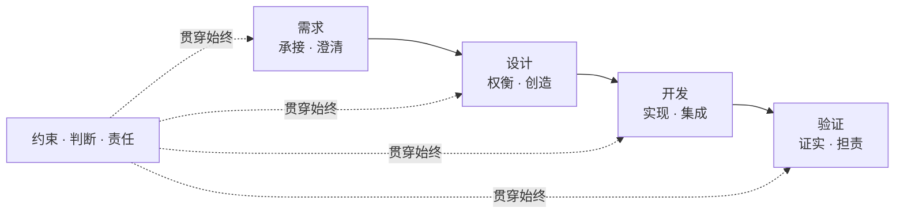

- 需求侧：把明示的、通常隐含的、必须履行的需要或期望转化为可验证的**规定需求**
- 设计侧：在约束下做 trade-off，产出可实现方案
- 开发侧：把方案变为现实
- 验证侧：对规定需求证实（verification），并为真实世界中的后果**担责**

**一句话定义**：

> 工程师，是在约束（时间、成本、法规、技术、伦理）之下，运用科学知识、工程判断与系统性思维，把明示的、通常隐含的或必须履行的需要或期望（requirement）转化为可设计、可开发、可验证（规定需求可证实）的解决方案，并为该方案在真实世界中的后果承担责任的人。

### 1.3 与科学家、技术员、工匠的分界

| **身份** | 问的问题 | 知识来源 | 决策 | 产出 |
|---|---|---|---|---|
| 科学家 | 为什么（自然如何运作） | 发现、假说、实验 | 追求**真** | 知识 |
| **工程师** | **怎么做（在约束下达成目标）** | **科学原理 + 工程判断** | **追求"真且可用"** | **设计** |
| 技术员 | 按什么规程做 | 执行手册、既定程序 | 无决策权，照做 | 数据、操作 |
| 工匠 | 怎么把手艺做到极致 | 经验、试错、师徒传承 | 凭直觉，不可复现 | 实物 |

引用冯·卡门（Theodore von Kármán）：*Scientists discover the world that exists; engineers create the world that never was.*（科学家发现已存在的世界；工程师创造从未存在的世界。）但工程师比科学家多一层枷锁——必须在**真、能用、付得起、不伤人**四个条件同时满足时才算合格。

### 1.4 工程师的五要素

1. **知识（knowledge）**——数学与自然科学，不是经验玄学（与工匠的分界）
2. **判断（judgment）**——约束冲突时做 trade-off（与技术员的分界）
3. **约束（constraints）**——economy、efficiency、effectiveness（与科学家的分界）
4. **系统性（systems）**——处理 system 而非零件堆叠（24765 定义中的 processes, systems）
5. **责任（responsibility）**——对 public health, safety, and welfare 负责（NSPE；profession 而非 skill 的本质）

### 1.5 词源

**engineer** ← 拉丁 **ingenium**（天赋、机巧、匠心），同源 *ingenious*（机巧的）、*ingenuity*（匠心）。最初指"操作战争机械（engine）的人"，后演变为"设计巧妙装置的人"——工程师的核心资产不是知识库存，而是**用机巧把约束变成方案的创造力**（呼应 ABET 对 engineering design 的定位：*an iterative, creative, decision-making process*）。

### 1.6 三句话总结

**三句话版**：对科学家，他回答"怎么做"而不是"为什么"；对技术员，他决定"怎么做"而不是"照做"；对工匠，他靠可复现的科学原理与工程判断，而不是靠不可复现的手感。**知识、判断、约束、系统性、责任——五者齐备才是完整意义上的工程师**；技术能力只是入场券，判断力与责任感才是职业内核。

---

## 2. 工程师需要哪些技能

### 2.1 术语分层（先厘清再列清单）

- **knowledge（知识）**：知道什么——可学、可考、可遗忘
- **skill（技能）**：会做什么——可执行、可训练、可测评的动作
- **competence（能力）**：在真实情境中组合知识+技能+态度达成结果的本领

ISO 9000:2015 §3.10.4：*competence = ability to apply knowledge and skills to achieve intended results*（应用知识和技能实现预期结果的本领）。注意定义里 knowledge 和 skills 是**被应用的对象**，competence 才是"干成事"本身。

### 2.2 ABET 现行 7 条学生成果（Criterion 3，2022-2023 起）

| # | 学生成果（译意） | 层级 |
|---|---|---|
| 1 | 运用工程、科学、数学原理**识别、表述并求解复杂工程问题** | 技术技能 |
| 2 | 应用工程设计，产出**满足规定需求**的方案，考虑公共健康、安全、福祉及全球/文化/社会/环境/经济因素 | 技术技能 |
| 3 | 对**不同受众有效沟通** | 专业能力 |
| 4 | 识别工程情境中的**伦理与职业责任**，做出**知情判断**（informed judgments） | 专业能力 |
| 5 | 在**团队**中有效工作——共同领导、协作包容、定目标、做计划、达成目标 | 专业能力 |
| 6 | 设计并实施**实验**，分析与解读数据，用**工程判断**得出结论 | 技术技能 |
| 7 | 按需**获取与应用新知识**（终身学习） | 专业能力 |

细节：第 2 条是 "specified needs"（规定需求）；第 4 条 "informed judgments"（判断要有依据）；第 6 条把 judgment 定位为实验/数据收尾动作。

### 2.3 能力金字塔

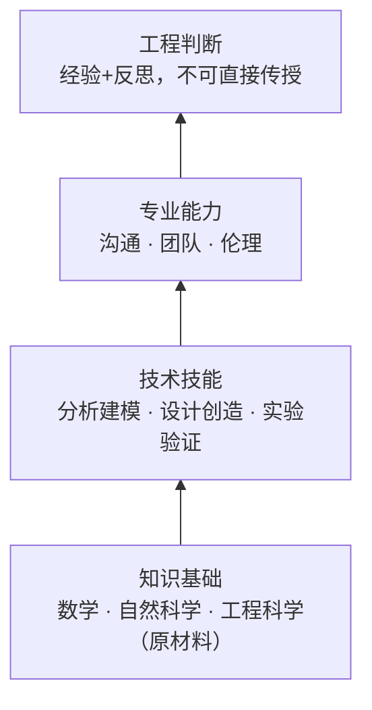

越往上，可传授性越低：知识靠**学习**、技术技能靠**练习**、专业能力靠**实践+反馈**、工程判断靠**经验+反思**。评审制度本质上就是判断力的训练场——流程是组织用来"批量培养判断力"的装置。

**技能不是静态清单，而是一条递进链**：知识支撑技能，技能支撑专业能力，全部沉淀为判断——判断力是金字塔的塔尖，也是工程师最稀缺、最没法速成的东西。

### 2.4 五要素 × 技能 × 行为表现

| 五要素 | 所需技能 | 行为表现（怎么算会） | ABET |
|---|---|---|---|
| 知识 | 数学建模、科学方法 | 把现实问题**翻译成可计算/可验证的模型** | 1, 6 |
| 判断 | 问题求解、设计决策 | 约束冲突时做 **trade-off 并论证** | 1, 2 |
| 约束 | 成本/风险/伦理分析 | 方案主动考虑经济性、安全、法规、可持续 | 2, 4 |
| 系统性 | 系统思维、集成、跨学科协作 | 看到**接口与涌现行为** | 5 |
| 责任 | 沟通、伦理、终身学习 | 对后果负责；对不同受众讲清方案 | 3, 4, 7 |

**落地示例（AOS 语境）**：把客户一句模糊的"想要个能管配置的东西"变成可验证的 *specified requirement*（stated / implied / obligatory 分别列清）——这是技能 1（识别、表述并求解问题）；在"快上线"和"架构干净"之间做权衡并写清楚为什么——这是技能 2 + 4 的合体（设计 + 知情判断）。

---

## 3. 架构师：增量技能、能力体现与目的权责（总览）

### 3.1 前提

**架构师不是另一个职业，是工程师角色体系中的一种 specialization**（ISO/IEC/IEEE 12207/15288 中 architect 是工程过程中的角色）。架构师技能 = **工程师基线 + 增量**。

### 3.2 增量从哪来：42010 定义拆解

ISO/IEC/IEEE 42010:2011：

> architecture: fundamental concepts or properties of a system **in its environment**, embodied in its **elements**, **relationships**, and in the **principles of its design and evolution**.

三个词决定了分工：**工程师的技能围绕 elements（把元素做对）；架构师的增量技能围绕 relationships（元素之间的关系与结构）与 evolution（系统的演化）**。

### 3.3 叠加结构

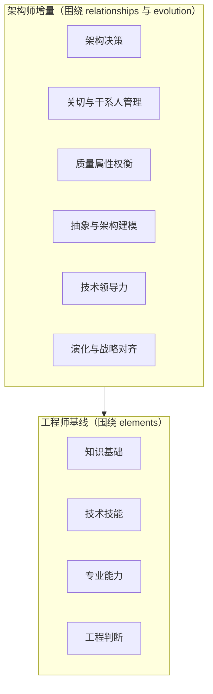

### 3.4 六块增量清单总览

| 增量技能 | 一句话 | 权威锚点 |
|---|---|---|
| 架构决策 | 信息不完备下做影响全局、难逆转的决策并记录 rationale | 42010（AD 含 rationale） |
| 关切与干系人管理 | 识别 stakeholders 与 concerns，把关切翻译为架构输入 | 42010 §5 |
| 质量属性权衡 | 性能/安全/可用/成本间的系统级 trade-off，用方法而非感觉 | SEI ATAM |
| 抽象与架构建模 | 决定架构描述长什么样：抽象层级、视图切分、接口契约 | 42010；Kruchten 4+1 |
| 技术领导力 | 无正式职权地影响团队，守住架构一致性 | INCOSE SE Handbook |
| 演化与战略对齐 | 为系统全生命周期演化负责，与业务战略对齐 | 42010 定义中的 design **and evolution** |

六块中，架构决策是**贯穿性动作**而非独立领域——它的特殊性（影响全局、难逆转、靠评审）将在 §3.5② 与 §3.6 展开；做法融在后五节：关切清单是裁判席（§4.3）、权衡进决策记录（§5.5）、rationale 与 ADR 定型（§3.6）。以下 §4~§8 逐一展开其余五块；完整方法论见教材书第 12 章。

### 3.5 三个更锋利的差异（工程师 → 架构师）

**① 认知对象：requirement → concern**

工程师面对的是 **requirement**——明示的、可验证的规定需求，验证参照明确；架构师面对的是 **concern**——干系人对系统的"兴趣点"，比 requirement 宽得多（目的、质量、成本、进度、甚至组织政治），可以模糊、可以冲突、没有标准格式。所以架构师的第一个动作永远是**识别关切、排优先序**，而不是接需求单子。

**② 验证方式：测试 → 评审**

工程师的产出可以用测试验证（对规定需求 verification）；架构没有"唯一正确解"，只有"在当前关切与约束下最合理的权衡"，无法用测试证实，**只能靠评审（architecture review）验证**：rationale 成不成立、权衡是否合理、有没有更优备选。这就是为什么 42010 逼着架构师把决策理由写下来，也是为什么成熟组织必须有架构评审制度。

**代码用测试验证，架构用评审验证**——架构师技能清单里最隐性也最要命的一条，恰恰是"经得起评审"的论证能力。

**类比（总建筑师）**：结构工程师计算每根梁的承重（elements），总建筑师决定楼有多高、电梯井在哪、加层时荷载怎么转移（relationships + evolution），并要跟业主谈关切、跟市政谈法规、协调各专业施工。**工程师对"这层楼稳不稳"负责，架构师对"这栋楼立得住、住得久、拆得起"负责。**

**③ 判据锚点：规定需求 → 目的（2026-08-26 补）**

工程师的判据锚点是**规定需求**——对就是对、错就是错，验证参照明确；架构师的判据锚点是**目的**——他每天要回答的核心问题是"什么是 fundamental 的"，而 fundamental 的判据是：**对系统在其环境中的目的而言必要且充分**（IEV 831-01-01 Note 2）。

操作化为**不变量判据**：在演化与重实现中必须守住、否则系统就沦为另一个系统（不再能达成其目的）的那些概念与属性——判别问句：「这个东西变了，系统还能不能达成它的目的？」

这是架构师最核心的**新增判断力**：不是把元素做对（工程师已有），而是**判定哪些概念与属性值得变成"难改的"**——选错判据，架构要么漏掉根本（系统走着走着就不是它了），要么锁死细节（琐碎东西被提前固化，演化窒息）。

配套的三重过滤防误判：目的层面失败（而非描述变化）＋角色层面不可缺（而非实例独有）＋本级被架对象视野内（元素内部细节不参与本级判定）。

### 3.6 架构师能力的最终体现：设计开发出本角色负责的产品数据

**一句话**：工程师的能力最终体现，是能否设计开发出本角色负责的产品数据；架构师同理——只是他负责的是**同一棵树的上半棵**。

**为什么成立（对称性不是类比，是同一过程的递归）**：设计与开发（ISO 9000:2015 §3.4.8）= 将客体的需求转换为对其更详细的需求的一组过程——它不挑层级（01-设计开发概念精讲 注1：一个项目可有多个设计开发阶段，每一级都是完整的 3.4.8）。

所以工程师与架构师在"设计开发产品数据"上完全同构：**工程师把详细需求转化为模块内的规定需求（叶子）；架构师把系统级需求转化为系统结构、接口与约束（枝干）**。

且教材书第 9 章前提：架构师首先是一个工程师——没有这六项能力，"架构师"只是头衔。

**架构师的产品数据清单**：

| 架构师的产品数据 | 内容 |
|---|---|
| **系统目的或任务理解确认单**（2026-08-26 补） | 架构工作的入场券——目的判据的锚点凭证（原文引用 + 复述理解 + 业务方签字；纯理解、零架构，详见 §3.7） |
| **系统基本概念和基本属性清单**（2026-08-26 补） | fundamental 成员资格登记——目的判据的裁决产物（每条：定义 + 对目的的必要性论证 + 追溯链）；概要定义与 ADR 的总纲（详见 10 号 §1.5） |
| 概要定义（枝干） | 系统结构、边界、组件划分、承接关系（教材书第6章：枝干即架构的落地形态） |
| 接口契约（枝梢） | 组件之间的"缝"——数据口径、时序依赖、调用契约 |
| 架构决策（ADR） | 为什么这么分——trade-off 的留痕（42010：AD 含 rationale） |
| 架构描述（AD） | 视图 / 视角 / 关切（42010） |
| 系统级验证方案 | 集成验证、系统验收的参照 |

**三个特殊性质**（呼应教材书第2章）：
1. **是"缝"的数据**——系统工程 = 元工程，不造部件，造的是"让部件协同的规则"，这些规则就是架构师的产品数据；
2. **是"关系与演化"的数据**——决策对象从 elements 扩张到 relationships 与 evolution（§3.2），所以数据里天然含演化路径、技术债台账；
3. **是"约束"的数据**——接口契约、技术选型、演化原则，是工程师产品数据的**输入需求**。

**核心洞察：枝梢 = 1:1 搬入点**（教材书第6章）：

> 一片叶子只能搬到下一棵树的一根枝梢——**架构师定的接口契约，就是工程师叶子落下的那根枝梢。**

产品数据不是一份文档，是**一棵树接一棵树的接力**（五层设计链）：架构师种完枝干和枝梢，工程师的叶子从枝梢上长出来——架构师的"输出"（接口契约）就是工程师的"输入需求"（规定需求）。**架构师的产品数据是工程师产品数据的上游规定**：架构决策错，代价是结构性的——上半棵错了，整棵下半棵跟着错。

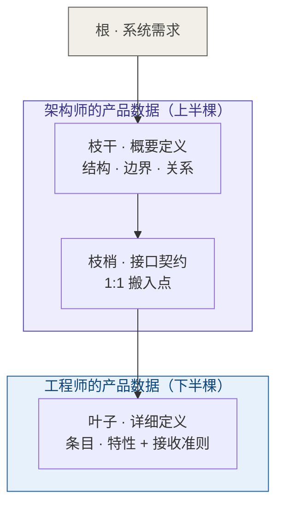

**六项能力在架构师侧的对称映射**（六项能力是教材书第 9 章对工程师能力的整合口径，推导见 11 号笔记《工程师六项能力精讲》§4.2）：

| 能力 | 架构师侧落点 |
|---|---|
| ① 科学素养 | 架构**依据**：为什么这么分（容量模型、性能分析） |
| ② 方法论素养 | 架构**方法**：视图/视角、架构描述语言、评估方法 |
| ③ 实践能力 | 架构**落地**：架构能被实现，不是空中楼阁 |
| ④ 职业伦理 | 决策**真实**：不掩盖技术债、如实记录取舍 |
| ⑤ 工程判断 | 架构**取舍**：系统级权衡——核心战场 |
| ⑥ 可复现意识 | 架构**可接住**：ADR 写得清、演化路径可传承 |

**检验（与工程师对称）**：

> **"你负责的架构描述和决策，换个人能接住吗？"**——答不上来，再大的图也只是装饰。

架构师与工程师的区别不在"是不是做产品数据"，而在**谁做上半棵、谁做下半棵，以及接口契约那根枝梢由谁定得准**。

### 3.7 对目的的权责——四职责与一条界线（2026-08-26 补）

§3.5 差异③说架构师的判据锚点是目的。随之而来的权责问题是：**系统目的和任务由架构师负责定义吗？** 答案是明确的不——

**一条界线**：目的与任务的**定义权和问责在业务方**（赞助人/企业/产品管理；15288 把"定义目的"放在业务或任务分析流程，执行主体是组织层）。架构师对"**架构忠于目的**"负责，不对目的本身负责。**RACI**（Responsible 执行 / Accountable 问责 / Consulted 咨询 / Informed 知情）：目的定义 A 在业务方，架构师是 C；架构定义 A/R 在架构师，业务方是 C。

**四个职责**（不负责定义，但绝不被动）：

| 职责 | 干什么 | 能力落点 |
|---|---|---|
| **理解** | 把目的当作 fundamental 判据吃透 | 判据判断力（§3.5 ③）的输入端 |
| **澄清** | 目的模糊时向上游回溯，推动业务方表达到可判定粒度 | 关切管理（§4）的上游延伸——"成为行业领先"这种话有职责打回去 |
| **质疑** | 用可行性、成本、一致性检验目的，架构权衡反哺目的修正 | 质量权衡（§5）的反向运用；修改**决定权**仍在业务方 |
| **守护** | 全程监控目的漂移，目的变更时触发架构重审 | 演化对齐（§8）的总开关 |

**角色分离 ≠ 人员分离**：小团队同一人可兼戴"产品负责人"与"架构师"两顶帽子，但做每个决定时要意识到自己戴的是哪顶——目的和架构在脑子里互相即兴迁就，是 Cowboy Coding 式架构的常见病因。

**「理解」职责的产品数据（极简定型）**：

| 项 | 内容 |
|---|---|
| 文档名 | **《系统目的或任务理解确认单》** |
| 三要素 | ① 目的或任务原文引用（业务方原话，只引不改）② 架构师复述理解（自己的话）③ 确认记录（业务方意见及偏差修正版） |
| 生效条件 | 业务方签字 |
| 性质 | 「理解」职责的**唯一**产品数据；纯理解、零架构——复述中不出现架构语言 |

命名注意：「目的**或**任务」对齐 15288 "Business **or** Mission Analysis"——两种语境取其一，不是两者叠加。它是架构工作的入场券：签字之前，架构师的一切产出都没有判据锚点。

---

## 4. 关切与干系人管理（怎么做）

### 4.1 术语（42010:2011 原文定义）

- **stakeholder（干系人）** §3.10：*individual, team, organization, or classes thereof, having an interest in a system*（对系统有兴趣的个人、团队、组织或其类别）——关键词是 interest，不是"使用者"
- **concern（关切）** §3.2：*interest in a system relevant to one or more of its stakeholders*——可涵盖目的、质量属性、成本、进度、法规、组织政治
- 关系：关切是架构的**输入素材**，架构描述（AD）围绕关切组织

### 4.2 词源

- **stakeholder** = stake（赌注）+ holder（持有者）：干系人 = **"押了注的人"**——出钱的、出力的、用命的、管你的，都对系统押了东西
- **concern** = 拉丁 *con-*（一起）+ *cernere*（筛、分辨）：**"与你相关、必须分辨清楚的事"**（同源：discern、discriminate）

### 4.3 五步法

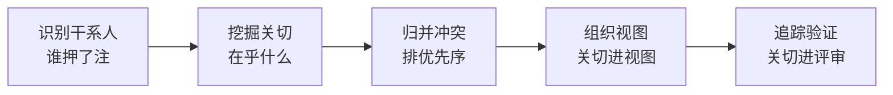

1. **识别干系人**：按"押注"逻辑列全——出资/决策、使用、维护、监管、协作（集成方/供应商）、**未来干系人**（下一任维护者、下一代用户）
2. **挖掘关切**：三类都挖——显性（stated）/ 隐含（implied）/ 必须（obligatory）。技术：访谈、场景推演、"系统失败了会怎样"追问、质量属性清单。**关切管理本质是需求工程的上游工序**
3. **归并冲突**：合并同义词、标出真实冲突、排优先序。**排完序的关切清单 = 架构决策的裁判席**
4. **组织视图**：对每组关切选 viewpoint（视角约定），派生 view（视图）。**viewpoint 选错，视图就失真**——用运营视角画给投资人看，等于答非所问；选 viewpoint 的标准只有一个：它能讲清那组关切
5. **追踪验证**：关切 → 决策 → 证据的追踪矩阵；**没被回应的关切 = 风险**。架构评审的实质是"关切→决策→理由"链的对账

### 4.4 干系人 × 关切 × viewpoint

| 干系人类别 | 典型关切 | 常用 viewpoint |
|---|---|---|
| 客户 / 出资方 | 成本、进度、ROI | business / economic |
| 最终用户 | 易用、功能、性能 | user / operational |
| 运维 / 客服 | 可维护、可观测、容错 | operational / support |
| 安全 / 合规 | 安全、法规、审计 | security / compliance |
| 集成方 / 供应商 | 接口、标准、兼容 | interface / data |
| 未来干系人 | 可扩展、可演进、技术债务 | evolution / infrastructure |

### 4.5 关切清单模板

```
| 干系人 | 关切 | 显性/隐含/必须 | 优先级 | 回应它的决策 | 证据 |
```

**陷阱**：沉默的干系人——没人提但真实存在的关切（法规半年后生效、竞对换了技术栈），只会以上线事故的形式开口。对策：**定期重访关切清单**（干系人变了吗？环境变了吗？关切过期了吗？）。

---

## 5. 质量属性权衡（怎么做）

### 5.1 概念与词源

- **质量属性** = 系统的非功能特性。ISO/IEC 25010 分类：性能效率、可靠性、安全性、可维护性、易用性、可移植性、兼容性、功能适合性。共同点：**由架构决定，不由代码决定**
- **trade-off** = trade（交易）+ off（让出）——"以 A 换 B"。属性天然冲突：缓存（性能↑）付复杂度（可维护性↓）；冗余（可用↑）付成本；多因素认证（安全↑）付易用。最著名实例：**CAP 定理**
- **attribute** = 拉丁 *ad-*（到）+ *tribuere*（分配）：质量属性是"分派给系统的性质"，是**别人（干系人）要求的**，不是系统"想有"的

### 5.2 本质：天平与配比

质量属性不是"要"，是**配比**——没有全优架构，只有按业务目标配比的架构。调节工具是**架构机制（tactics）**：缓存、冗余、分层、队列、异步——每个机制都是"买一个属性、付一个代价"。

相机曝光三角是最贴切的类比：光圈、快门、ISO 互相牵制，没有"全满"配置，只有按拍摄主题配比（拍夜景牺牲画质换进光）。

### 5.3 场景六要素（把属性变成可验证的刻度）

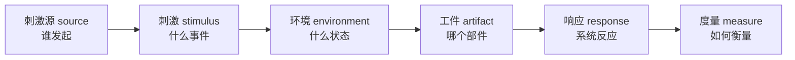

示例（AOS 语境）：**当 10000 个并发用户（刺激源）** 在双十一峰值（环境）**发起配置变更请求（刺激）**，**配置服务（工件）** 应在 **200ms 内返回成功（响应）**，**p99 延迟（度量）**。

### 5.4 冲突对 × 调解机制 × 谁说了算

| 冲突对 | 典型表现 | 调解机制 | 谁说了算 |
|---|---|---|---|
| 性能 ↔ 可维护性 | 微优化难读懂 | 缓存层、异步化 | 业务峰值 |
| 可用性 ↔ 成本 | 双活烧钱 | 冗余度分级（核心 99.99%，边缘 99.9%） | 业务连续性 |
| 一致性 ↔ 可用性 | CAP | 最终一致性、队列削峰 | 数据强约束 |
| 安全 ↔ 易用性 | 多因素认证烦人 | 风险分级认证 | 合规 + 体验 |
| 可扩展 ↔ 交付速度 | 预留抽象拖慢首版 | 扩展点只建在预测处（YAGNI） | 市场窗口 |

### 5.5 四步做法（ATAM 思路）

1. **场景化**：每个质量属性写成六要素场景，获得刻度
2. **找冲突**：冲突矩阵，标出真实冲突与机制
3. **排优先**：utility tree（效用树）——根=属性，叶=带优先级（H/M/L）的场景。纪律：**"都要"等于"没排"**，必须明确谁让位
4. **记录 + 评审**：每个权衡进决策记录（冲突双方、选择、理由、代价、补偿计划）；评审时拿场景当验收标准

本质：**权衡不是砍需求，是管理交换——而且交换明细必须可审计**（我换了什么、为什么换、代价是什么），否则架构评审无从谈起。

---

## 6. 抽象与架构建模（怎么做）

### 6.1 基石区分

> **architecture ≠ architecture description（架构 ≠ 架构描述）**

架构是系统里真实存在的概念/元素/关系/演化原则；架构描述（AD）是文档/模型里对它的表达。**地图不是疆域**——你永远在建"描述"，价值取决于它为关切提供多少真实，而非有多"全"。最贴切的例子是**地铁图**：它故意扭曲真实距离，只为放大"换乘"信息——**每个视图都是一张地铁图，为了讲清换乘，故意扭曲距离**。

### 6.2 词源

- **abstract** = *ab-*（离开）+ *trahere*（拉）：抽象 = **有选择的省略**，把本质"拉出来"（同源：tractor、attract）
- **model** = *modus*（尺度）→ *modulus*（小尺度）：**按比例缩小的摹本**——model 词源里就写着"缩放"

### 6.3 42010 概念链

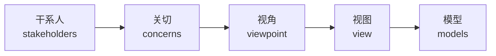

**viewpoint（视角）= 规则（菜谱）**：约定看什么元素、什么关系、用什么表示法；**view（视图）= 实例（菜）**：按 viewpoint 实际产出。一个 viewpoint 可被多个系统复用。

### 6.4 4+1 views（Kruchten）

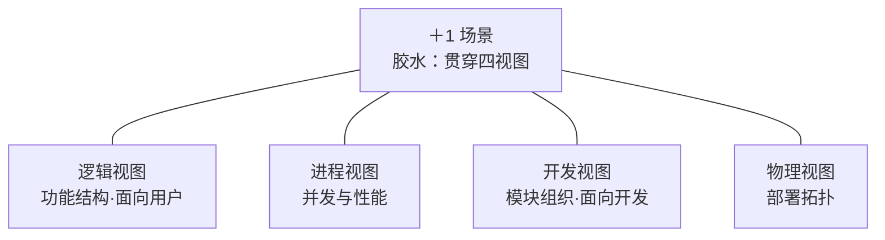

"+1 场景"是胶水：每个场景贯穿四个视图，把它们"钉"在一起，防止各说各话。场景既是权衡的标尺，也是视图的胶水。

### 6.5 常用 viewpoint 清单

| viewpoint | 面向干系人 | 回答的关切 | 常用表示法 |
|---|---|---|---|
| 逻辑/功能 | 用户、业务方 | 做什么、功能组织 | 用例图、类图、C4 Component |
| 进程/并发 | 架构师、性能工程师 | 并发、性能、一致性 | 时序图、状态图 |
| 开发/模块 | 开发者 | 代码组织、依赖规则 | 包图、依赖图 |
| 物理/部署 | 运维、系统工程师 | 拓扑、资源、容灾 | 部署图 |
| 数据 | 数据架构师、DBA | 数据模型、流转 | ER 图、数据流图 |
| 安全 | 安全团队、合规 | 威胁面、信任边界 | 威胁建模图 |

现代软件常用 **C4 model**（Context → Container → Component → Code 四层）做抽象分级。纪律：**视图数量"刚好够"**——每多一个 view 都是要长期维护的配置项。

### 6.6 五步建模流程

1. **定关切与受众**：模型回答谁的什么问题
2. **选 viewpoint**：对每组关切选视角
3. **建 view 与 model**：按约定产出，控制数量
4. **用场景走查**：模型回答不了关切 → 回去改 viewpoint
5. **治理与同步**：**模型会腐化**（drift → erosion）——把模型当**配置项**管：纳入基线、变更受控、评审以模型为准。**架构描述是最贵的一类配置项，它的腐化会带崩整个评审体系**

---

## 7. 技术领导力（怎么做）

### 7.1 定义与词源

> 在无正式职权（或职权不足）的情况下，凭借专业可信度、清晰的愿景与有效沟通，使他人在技术方向上**自愿地、持续地**追随，并为技术决策的后果**承担责任**的能力。

- **lead** = 古英语 *lǣdan*（带着走），不是 push（推）也不是 force（压）
- **influence** = *in-*（入）+ *fluere*（**流**）：想法"流进"别人的决策（同源：fluid）
- **authority** = 拉丁 *auctor*（**创造者**，同源 author）：真正的权威来自你创造的东西，不是头衔

权威锚点：**INCOSE 系统工程手册**把 technical leadership 列为系统工程师核心能力之一（与 systems thinking、communication 并列）——注意它在"能力"而非"职位"里。

### 7.2 管理 vs 技术领导

| 维度 | 管理（management） | 技术领导（technical leadership） |
|---|---|---|
| 依据 | 职位与资源 | 可信度与判断 |
| 手段 | 分配 · 考核 · 控制 | 讲理 · 示范 · 辅导 |
| 方向 | 命令自上而下 | 愿景让人自愿跟随 |
| 焦点 | 进度与预算 | 方向与技术风险 |
| 团队心态 | 服从 | 认同与追随 |

关键：**管理权可以任命，领导力不能任命**。架构从文档变成现实的桥，是团队的自愿执行。

### 7.3 信任飞轮

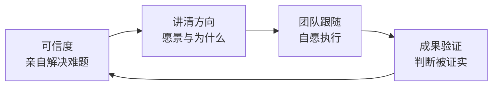

**可信度是货币——积累慢，消耗快**（一次错误决策 + 死不认账，能烧光全部信用）。它无法被任命、无法被购买，只能被挣得——只能靠"让别人因为你的判断而受益过一次"来挣得。词源呼应：可信度（credibility）← *credere*（相信），同源 **credit（信用）**——攒信用慢，烧信用快。

### 7.4 六根支柱

| 支柱 | 行为表现 | 反例 |
|---|---|---|
| 可信度 | 亲自解决 1-2 个最难的工程问题；判断留痕、可复盘 | 只画图不写码 |
| 愿景与方向 | 每个决策能讲"为什么"；方向讲成故事 | "因为我是架构师" |
| 沟通 | 对工程师讲技术、对业务讲价值、对高管讲风险 | 一套术语打天下 |
| 辅导 | 被问时先反问"你觉得呢"；展示推理过程 | 替工程师干活 |
| 治理 | 约束变成自动化护栏（脚手架/lint/评审 gate），敢说"不" | 靠盯人、靠开会 |
| 担责 | 决策错了先认；dogfooding；为团队挡子弹 | 出问题甩锅执行层 |

**专家为自己的判断负责，领导为团队的后果负责**——"担责"是技术领导力与技术专家的分水岭。

### 7.5 两个启动动作

1. 挑一个真实难题**亲自下场**——可信度账户开始充值
2. 把下一个架构决策讲成"为什么"（发 rationale，不只发结论）——影响力开始"流入"

---

## 8. 演化与战略对齐（怎么做）

### 8.1 词源

- **evolution** = *e-*（出）+ *volvere*（滚、卷）：**"展开、翻开"**——系统不是瞬间设计好的，是逐步展开的（同源：volume、revolve）
- **strategy** = 希腊 *strategos*（将军）= *stratos*（军队）+ *agein*（带领）：**在资源有限下带领军队取胜的艺术**
- **align** = *a-*（到）+ *ligne*（线）：**排成一条线**

### 8.2 四个词别混

| 概念 | 是什么 | 主动/被动 |
|---|---|---|
| drift / erosion（漂移/侵蚀） | 实现悄悄偏离架构 | 被动腐化，要防 |
| **purpose drift（目的漂移，2026-08-26 补）** | **目的本身**悄悄变化而架构未跟随 | 被动、更危险——无症状，发现时不变量集合已整体过期 |
| evolution（演化） | 有意识、有方向地演进 | 主动设计 |
| technical debt（技术债） | 为短期速度**有意识借**的长期代价 | 战略杠杆 |

purpose drift 的处置是强制的：**目的一旦变更，即触发架构重审**（见 §3.7 守护职责）。

关键：演化是**有方向的变化**；42010 定义里 "design **and evolution**" 明示——可演化性是架构的**构成要件**。架构决策是**长半衰期决策**（Martin Fowler：*architecture is about the things that are hard to change*）。

注意 drift 与 purpose drift 的方向相反：前者是**实现**偏离了架构（架构对、执行歪）；后者是**目的**偏离了架构（执行对、判据过期）。技术栈旧了但目的没变，架构可能依然健康；目的悄悄变了而架构没跟上，才是大多数"遗留系统之痛"的根——防前者靠合规评审，防后者靠以目的为参照的定期检视（呼应§3.7 守护职责）。

### 8.3 战略对齐四层

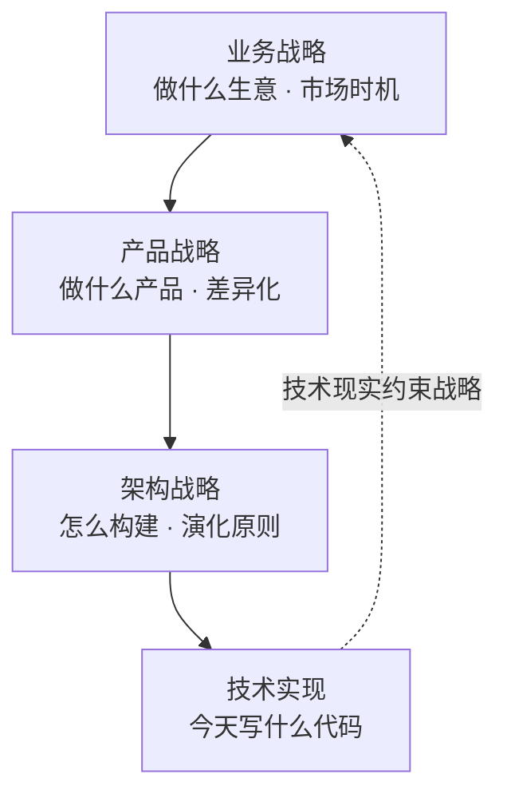

对齐是双向的：战略向下传导，技术向上反馈。两种病：
- **过度工程**：架构领先战略（为全球分布式提前建能力，市场只在本地）
- **欠工程**：架构落后战略（单体扛不住多租户，重构拖垮窗口）

判据读法（2026-08-26 补）：这条链同时是**判据传导链**——每一层的目的都是下一层判定 fundamental 的标尺（fundamental = 对目的必要且充分，IEV 831-01-01 Note 2）。对齐的本质因此不是"内容一致"，而是**判据可追溯**：架构战略里的每个根本决策都能回答"它支撑产品战略/业务战略的哪一条"；断链处就是过度工程与欠工程的发病点。

### 8.4 技术债生命周期

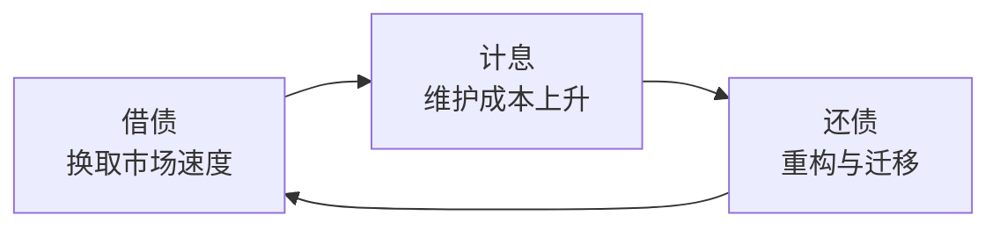

纪律：**台账（register）**——每笔债记"借的原因、当前利息、还款计划"。健康组织不是零技术债，是**每笔债都记得明明白白、有到期日**；无台账的债才是灾难。定期评审债务组合时要**像财务看资产负债表一样看它**：哪些债值得借（换取市场窗口）、哪些债必须还（利息太高）。

### 8.5 演化原则示例（42010 的 evolution principles）

| 原则 | 写法示例 |
|---|---|
| 接口契约 | 所有模块仅通过版本化接口交互，禁止跨模块直接依赖实现 |
| 依赖方向 | 依赖只允许指向抽象层，禁止反向依赖 |
| 版本策略 | 公开接口按语义化版本管理；破坏性变更须提前一个版本弃用 |
| 扩展点 | 扩展点只建在预测处（YAGNI），其余禁止预留抽象 |
| 兼容性 | 数据格式变更须提供迁移路径，禁止静默破坏 |

### 8.6 五步演化管理

1. **识别演化驱动力**：业务/技术/组织/法规四类变化源——不知道会变成什么，也要知道"哪里可能变"
2. **显式声明演化原则**：把"未来怎么变"写进架构描述
3. **架构路线图（roadmap）**：演化拆成里程碑，与业务窗口对齐——**路线图是演化与战略的接口**
4. **技术债台账**：借因/利息/还款计划，定期评审
5. **对齐检查 + 治理演化**：每个决策问"支撑哪个战略目标"；演化受控（变更评审、兼容性测试、迁移指南）——**架构演化是一连串受控的配置项变更，基线是演化的里程碑**

类比：罗马不是一天建成的，但**罗马两千年后的形态，在它最初几十年的街道格局里就注定了**——好规划不是预测两千年，是给未知的未来留空间。

---

## 9. 架构师再往上是什么

### 9.1 核心判断

架构师再往上，**不是更深的架构，而是关注维度的扩张**——每一次上升，你的"用户"变了：工程师的"用户"是组件，架构师的"用户"是系统，再往上是系统之系统，最后是整个组织。

### 9.2 晋升阶梯

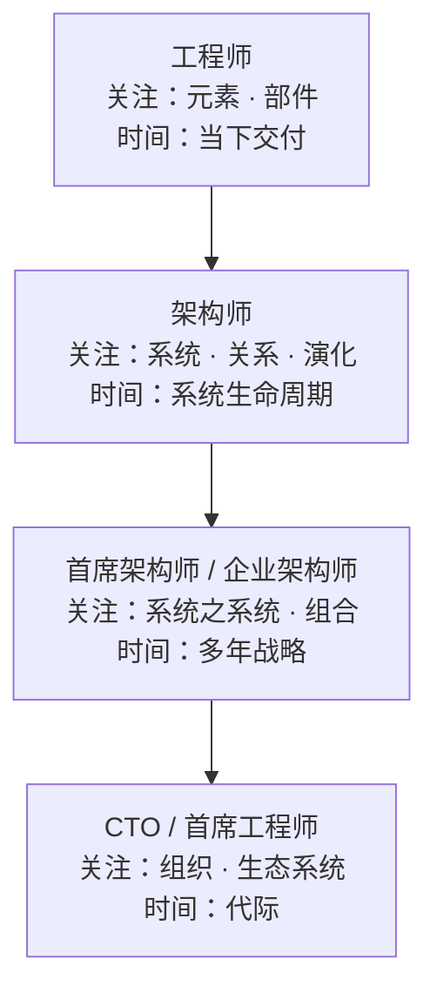

每上升一级：**空间维度与时间维度同时扩张**。阶梯是关注级的升维链；每一级可以分叉——系统之系统级有**深度**（首席架构师）与**宽度**（企业架构师）两向，组织级有**组织**（CTO）与**权威**（首席工程师）两向，且路径可叠加（CTO 常兼首席工程师）。

### 9.3 四条路径

| 路径 | 角色 | 扩张方向 | 核心关切 | 权威锚点 |
|---|---|---|---|---|
| 深度 | 首席架构师 | 从"做架构"到"建架构体系" | 多系统治理、技术标准、评审制度设计者 | 组织实践 |
| 宽度 | 企业架构师 | 从"一个系统"到"系统之系统" | 业务/数据/应用/技术四域整体一致 | **TOGAF** |
| 组织 | CTO / 技术总监 | 从"技术问题"到"业务+组织"融合 | 技术投资组合、组织技术能力 | 管理学领域 |
| 权威 | 首席工程师（Chief Engineer） | 从"管技术"到"技术裁决" | 跨学科技术完整性与最高裁决权 | NASA 系统工程手册 |

两个要点：
- **标准跃迁暴露分界**：42010 只管单个系统的架构描述；进入企业架构（系统之系统）后，标准跳到 **TOGAF**（Business / Data / Application / Technology 四域）。系统之系统的杀手特征：每个子系统都有自己的 owner 和生命周期，**没有全局 owner**
- **质变发生在 CTO 一级**：关切管理对象从干系人变成董事会；技术领导力对象从团队变成管理层；演化对齐从系统生命周期变成企业战略周期——**你不再解决技术问题，你解决"组织用技术创造价值"的问题**

### 9.4 词源

architect = *archi-*（首）+ *tekton*（工匠）——"工匠之首"；**chief** = 拉丁 *caput*（**头**）。链的尽头：从"工匠之首"到"组织之头"。工具不变（判断、权衡、沟通、担责），**棋盘变大**。

### 9.5 AOS 语境下的完整形态

> **工程师（把配置项做对）→ 架构师（把配置管理体系建对、建得能演化）→ 企业架构师（把 AOS 放进企业 IT 组合的整体一致里）→ CTO（让 AOS 成为组织的战略能力）**

---

## 附录 A：引用标准与出处清单

| 标准/文献 | 引用点 |
|---|---|
| ABET（1979 ECPD 批准） | engineering 的 profession 定义；现行 7 条学生成果 |
| ISO/IEC/IEEE 24765:2017 | engineering 定义（economy/efficiency/effectiveness） |
| ISO 9000:2015 §3.6.4 | requirement = stated / generally implied / obligatory |
| ISO 9000:2015 §3.10.4 | competence = ability to apply knowledge and skills |
| ISO 9000:2015 §3.4.8 | 设计开发 = 将需求转换为更详细需求的过程（§3.6） |
| ISO/IEC/IEEE 42010:2011 | architecture 定义；stakeholder §3.10 / concern §3.2 / viewpoint / view / AD |
| ISO/IEC/IEEE 12207 / 15288 | architect 作为工程过程中的角色；Business or Mission Analysis（§3.7 目的定义权） |
| ISO/IEC 25010 | 质量属性模型（SQuaRE） |
| NSPE Code of Ethics | 工程师伦理责任序言 |
| INCOSE SE Handbook | technical leadership 核心能力 |
| SEI ATAM | 架构权衡分析方法、utility tree、场景六要素 |
| Kruchten 4+1 | 软件架构视图模型 |
| TOGAF | 企业架构四域（BDAT） |
| NASA Systems Engineering Handbook | Chief Engineer 角色 |
| IEC 60050-831（IEV 831-01-01） | fundamental 判据：对系统在其环境中的目的必要且充分（§3.5③ / §8.3） |
| Martin Fowler | 架构决策是长半衰期决策（§8.2） |
| 冯·卡门（Theodore von Kármán） | 工程师创造从未存在的世界（§1.3） |
| C4 model | 抽象分级：Context → Container → Component → Code（§6.5） |

## 附录 B：术语表（中英对照）

| 术语 | 译名 | 要点 |
|---|---|---|
| requirement / need / expectation | 需求 / 需要 / 期望 | 三词不混用；requirement = stated/implied/obligatory |
| specified requirement | 规定需求 | 验证的参照（被明示的需求） |
| stakeholder | 干系人 | 对系统有兴趣者（"押注的人"） |
| concern | 关切 | 干系人对系统的兴趣点 |
| viewpoint / view | 视角 / 视图 | 规则 / 实例（菜谱 / 菜） |
| architecture description | 架构描述 | 架构 ≠ 架构描述（地图 ≠ 疆域） |
| architecture | 架构 | 系统在其环境中的本质概念与属性（elements / relationships / evolution，42010） |
| quality attribute | 质量属性 | 非功能特性，由架构决定 |
| trade-off | 权衡 | 属性冲突下的配比管理 |
| architectural decision | 架构决策 | 影响全局、难逆转，须记 rationale |
| technical debt | 技术债 | 有意识借的长期代价，靠台账管理 |
| drift / erosion | 漂移 / 侵蚀 | 实现偏离架构的被动腐化 |
| purpose drift | 目的漂移 | 目的本身悄悄变化而架构未跟随（被动、更危险）；目的变更触发架构重审 |
| fundamental / 不变量判据 | 必要且充分 | 对系统在其环境中的目的而言必要且充分（IEV 831-01-01 Note 2）；演化中必须守住的判别问句 |
| 判据传导链 | — | 业务→产品→架构→技术，每一层目的都是下一层判定 fundamental 的标尺（§8.3） |
| 系统目的或任务理解确认单 | 确认单 | 「理解」职责的唯一产品数据：原文引用 + 复述理解 + 业务方签字（§3.7） |
| 四职责 | 理解 / 澄清 / 质疑 / 守护 | 架构师对"架构忠于目的"负责；目的定义权在业务方（§3.7） |
| RACI | 责任分配矩阵 | Responsible 执行 / Accountable 问责 / Consulted 咨询 / Informed 知情（§3.7） |
| evolution | 演化 | 有方向的变化；42010 定义的构成要件 |
| product data | 产品数据 | 设计开发的物化产物：树形组织的规定需求集合（概要定义 + 详细定义），质量的定义载体与验证的参照标尺；架构师负责上半棵（枝干 + 接口契约），工程师负责下半棵（叶子） |
