# 13-工程角色谱系精讲-从模块工程师到系统架构师

> **文档编号**：13-工程角色谱系精讲-从模块工程师到系统架构师
> **日期**：2026-08-25（v1.4：补充 §6.4 架构师 vs 工程师职责边界与咬合；修订 §6.3 分形不对称表——模块对外架构归上层分配、内部架构归工程师）
> **来源**：AOS 概念框架建设讨论（2026-08-23，多轮问答整理）
> **适用范围**：产品开发 / 系统工程 / 配置管理 / 架构方法论
> **配套文档**：00-概念学习方法论、05-工程概念精讲、06/07-架构概念精讲、10-架构设计方法论全景、11/12-工程师能力精讲

---

## 0. 文档导读

**一句话总纲**：工程角色不是按"职称"划分的，而是按"粒度 × 责任"划分的——系统工程师对"系统成败"负总责（accountability），系统架构师对"系统结构与演化"负专责（responsibility），模块工程师对"系统元素实现"负专责；三者构成"委托—协商—验收"的动态关系链，且互为成长路径的两端。

**阅读地图**：

| 章节 | 内容 | 对应问题 |
|---|---|---|
| §1 | 三角色一句话定位与关系速览 | 三者是什么？ |
| §2 | 系统工程师：定义（权威标准） | 系统工程师的定义是什么？ |
| §3 | 系统工程师：职责（15288 + INCOSE） | 系统工程师的职责是什么？ |
| §4 | 系统工程师 vs 系统架构师：区别 | 两者有什么区别？ |
| §5 | 系统工程师与系统架构师：关系 | 两者的关系是怎样的？ |
| §6 | 模块工程师：定位与分形 | 模块工程师又是什么？ |
| §6.4 | 架构师 vs 工程师：职责边界与咬合 | 两者的职责范围与关系？ |
| §7 | 产品数据责任矩阵 + 各角色文档族 | 各负责哪些产品数据？各角色还要开发哪些文档？ |
| §7.5 | 架构师 / 模块工程师 / 系统工程师文档族 | 各角色的补充产品数据文档是什么？ |
| §8 | 成长路径（模块→系统→架构） | 怎么成长为系统工程师/架构师？ |
| §9 | 术语对照表 | 术语怎么对齐？ |
| §10 | 标准与文献出处汇总 | 依据在哪里？ |
| §11 | 评审 · 验证 · 确认三词对照 | review / verification / validation 怎么区分？ |
| §12 | 架构师与架构治理 | 架构治理负责什么、输出什么产品？ |
| §13 | 待办 / 欠项 | 还有什么没做完？ |

---

## 1. 总览：三个角色的一句话定位

| 角色 | 一句话定位 | 负责粒度 | 责任性质 | 标准锚点 |
|---|---|---|---|---|
| **系统工程师** | 实践系统工程学科的人，对系统全生命周期技术事务负总责 | 系统（全生命周期） | accountability · 系统成败（不可委托） | ISO/IEC/IEEE 15288、24765 |
| **系统架构师** | 角色丛中专责"架构定义"的专门角色，定义系统基本概念与演化原则 | 系统结构（跨生命周期演化） | responsibility · 架构正确性（可委托可追责） | ISO/IEC/IEEE 15288 §6.4.4、42010:2011 |
| **模块工程师** | 系统元素/软件模块的实现责任者，本质是"模块这个系统上的迷你系统工程师" | 系统元素/模块 | responsibility · 元素实现 | 24765（module）、15288（system element） |

**关系速览（一句话）**：系统工程师是"指挥"（对整场演出负责），系统架构师是"作曲/编曲"（决定乐曲结构与演化），模块工程师是"声部长"（负责自己声部的演奏质量）——粒度递减、责任递窄，但通过委托、协商、评审（rationale）机制"斗而不破"。

---

## 2. 系统工程师：定义

### 2.1 权威定义（原文 + 翻译）

**① ISO/IEC/IEEE 24765:2017《系统和软件工程—词汇》（SEVOCAB）**

> **systems engineering** — *interdisciplinary approach governing the total technical and managerial effort required to transform a set of stakeholder **needs**, **expectations**, and **constraints** into a solution and to support that solution throughout its life.*
>
> 译：跨学科方法，管控将一组干系人的**需要**、**期望**与**约束**转化为解决方案、并在其整个生命周期内支持该解决方案所需的全部技术与管理投入。

**"系统工程师"本词**——标准里走角色词条的固定模式（同书 systems security engineer 词条为证）：

> *Individual that practices the discipline of systems security engineering, **regardless of their formal title**.*
>
> 类推：**systems engineer = 实践系统工程学科的个人，与其正式头衔无关。**

> ⚠️ **关键含义**：系统工程师是"角色"而非"头衔"。你叫"架构师"或"CTO"，只要在实践系统工程，你就是系统工程师；反之头衔挂着 SE 却只做单点开发，也不是。

**② INCOSE（国际系统工程学会）2019 官方定义**（比 24765 更强调"跨越学科"）

> *Systems Engineering is a **transdisciplinary and integrative approach** to enable the successful realization, use, and retirement of engineered systems, using systems principles and concepts, and scientific, technological, and management methods.*
>
> 译：系统工程是一种跨学科（超学科）且整合性的方法，运用系统原理与概念，以及科学的、技术的和管理的方法，使工程系统的成功实现、使用与退役成为可能。

**③ ISO/IEC/IEEE 15288:2015 对"角色"的定义**

> *role — set of responsibilities, activities, and authorizations within a party, implemented by one or more individuals*（一方内部的职责、活动与授权集合，由一人或多人履行）

→ 系统工程师是"角色"，与"评审员""架构师"是同一类存在方式。

### 2.2 定义三层解构（WHO / DOES / HOW）

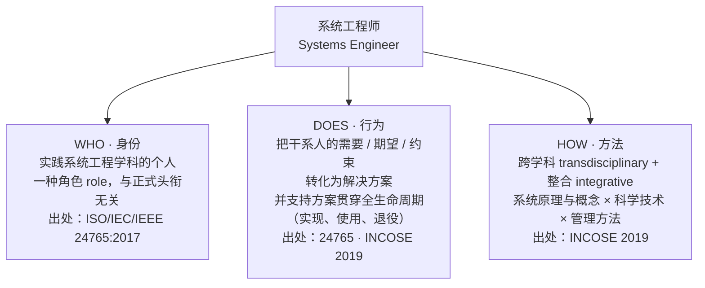

### 2.3 术语约定（与既有框架一致）

| 英文 | 中文 | 说明 |
|---|---|---|
| need | 需要 | 不可与"需求"混用 |
| expectation | 期望 | 同上 |
| constraint | 约束 | — |
| requirement | 需求 | 系统/模块级 |
| specified requirement | 规定需求 | 验证的参照（被明示的需求） |

---

## 3. 系统工程师：职责

### 3.1 职责域：ISO/IEC/IEEE 15288 四类流程（30 个）

**核心结论**：系统工程师的职责域 ≈ **技术流程（14 个）+ 技术管理流程（8 个）**，共 22 个；协定流程（采办/供应）与组织使能流程（生命周期模型/基础设施/组合/人力/质量/知识管理）不是他的主场。

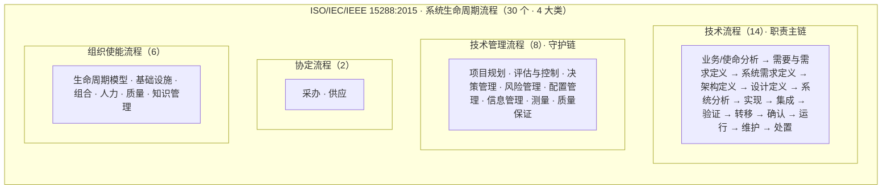

> 15288 定义的是"流程"不是"岗位"——它只规定系统应经历哪些流程、每个流程要达成什么 outcome，"谁去执行"由角色承担。系统工程师的职责 = 他在这些流程中承担的职责。

### 3.2 技术流程主链：与工程概念框架同构

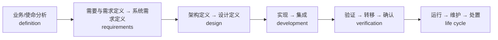

**关键洞察**：《00-概念学习方法论》里的 definition → requirements → design → development → verification 骨架，就是这条 14 流程主链的浓缩。系统工程师对主链上每一环都有"负责人"式职责（INCOSE 原话：responsible for the system concept, architecture, and design；analyze and manage complexity and risk；decide how to measure whether the deployed system actually works as intended）。

### 3.3 技术管理流程（守护链）

不管"造什么"，管"造得对不对、变没变乱"。与 AOS 主线直接撞脸的四项：

- **配置管理**（configuration management）——基线、变更、配置项
- **决策管理**（decision management）
- **质量保证**（quality assurance）——含评审/审查活动
- **测量**（measurement）

> 系统工程师在守护链上是"技术事务的管家"，不是项目经理的"进度/资源管家"——这就是 24765 定义里 *technical and managerial effort* 的含义（技术 + 管理）。

### 3.4 INCOSE 角色丛（SE Roles）

系统工程师落到具体项目里是**一组角色的集合**——再次印证：它是角色，不是头衔。

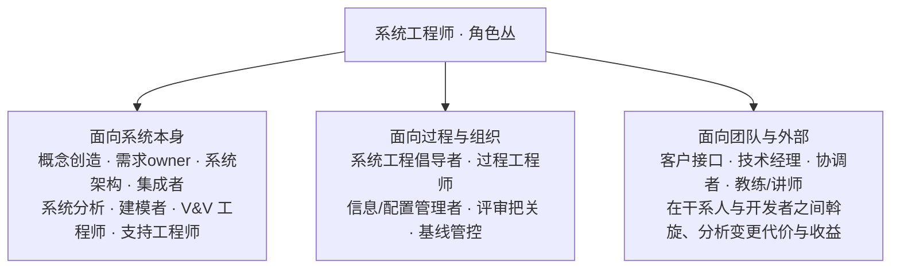

### 3.5 日常六件事（INCOSE，Hutchison IS2022）

1. 建立清晰的**系统愿景**，并让团队买账；
2. 促成技术、业务、运营团队之间（乃至跨文化）的**有效沟通**；
3. 让多元团队**协作开发出系统**；
4. **管理不确定性与涌现**（emergent behavior——系统层面冒出来的、单点看不到的问题）；
5. 在系统层面做**好的技术决策与权衡**（trade-off）；
6. 为系统**支撑商业论证**（business case）。

### 3.6 职责本质：四个动词

| 动词 | 含义 | 对应 15288 锚点 |
|---|---|---|
| **转化** | 把需要/期望/约束翻译成规定需求，再导向方案 | 需要与需求定义、系统需求定义 |
| **统筹** | 跨学科整合，让各专业域协同成一个系统 | 架构定义、设计定义、集成 |
| **把关** | 证明"做对了"且"做了对的东西"，守住质量 | 验证、确认、质量保证、评估与控制 |
| **守护** | 让系统在生命周期内持续正确、可控地演化 | 配置管理、风险管理、运行、维护、处置 |

---

## 4. 系统工程师 vs 系统架构师：区别

**一句话**：不是"平级职业"关系，而是"整体与专门化"关系——系统工程师是学科实践者（职责覆盖全生命周期），系统架构师是其中专责"架构定义"的专门角色。

### 4.1 三层差异

| 层 | 系统工程师 | 系统架构师 |
|---|---|---|
| **概念性质** | 学科实践者（practices the discipline） | 角色丛中的一个专门角色（与需求owner、集成者、V&V 并列） |
| **标准锚点** | 15288 全流程（30 个）+ 24765 | 15288 **§6.4.4 架构定义流程** + 42010:2011 |
| **关注对象** | 系统 + 环境 + 全生命周期 | 系统基本概念：**elements / relationships / principles of design and evolution**（42010 §3.2） |

### 4.2 关键标准原文

**① ISO/IEC/IEEE 42010:2011 核心术语**

> §3.1 **architecting** — *process of conceiving, defining, expressing, documenting, communicating, certifying proper implementation of, maintaining and improving an architecture **throughout a system's life cycle**.*（构思、定义、表达、记录、沟通、认证架构的恰当实现、并在系统生命周期内维护与改进架构的过程）
>
> §3.2 **architecture** — *fundamental concepts or properties of a system in its environment embodied in its elements, relationships, and in the principles of its design and evolution.*
>
> §3.3 **architecture description (AD)** — *work product used to express an architecture.*（用于表达架构的工作产品）

> 💡 **洞察**：42010 甚至没有给"architect"立词条——它定义的是动词 architecting。架构师的"工作产品"是架构描述（AD），不是"架构"本身。

**② 15288 §6.4.4 架构定义流程 purpose（原文）**

> *to generate system architecture alternatives, to select one or more alternative(s) that frame stakeholder concerns and meet system requirements, and to express this in a set of consistent views.*
>
> 译：生成系统架构替代方案 → 选定满足干系人关注点与系统需求的方案 → 用一组一致视图表达。

> ⚠️ 架构定义流程**只做三件事**：生成、选择、表达。它不负责需求溯源到底、不负责实现、不负责验证执行（虽然会迭代反馈）——而系统工程师对整条链都负责。

**③ 42010 §4.3 的微妙张力（词源级洞察）**

> *Architecting is performed throughout the system life cycle, not simply within one stage of the life cycle.*
> *the use of "architectural design" in ISO/IEC 12207 and ISO/IEC 15288 is more narrow than the concept of architecting in this International Standard.*

→ **15288 里的架构定义（一个流程）比 42010 的 architecting（贯穿生命周期的活动）概念更窄**。这是理解两标准关系的钥匙。

### 4.3 覆盖范围对比（流程链上谁覆盖哪里）

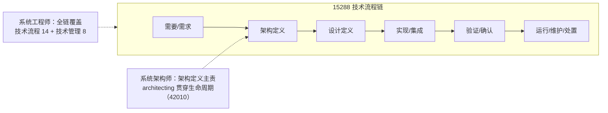

### 4.4 综合对比表

| 维度 | 系统工程师 | 系统架构师 |
|---|---|---|
| 本质 | 学科实践者（头衔无关） | 角色丛中的一个专门角色 |
| 标准锚点 | 15288 全流程（30 个）· 24765 | 15288 **§6.4.4** · 42010:2011 |
| 核心动作 | 转化、统筹、把关、守护 | **生成**架构方案 → **选择** → **表达**为一组一致视图 |
| 关注对象 | 系统 + 环境 + 全生命周期 | elements / relationships / design & evolution principles |
| 核心产出 | 需求规格、架构描述、设计、验证报告、配置基线…… | 架构描述（AD）：视图、视角、模型、架构决策与理由 |
| 决策性质 | 系统级权衡、风险、商业论证 | 架构决策（architecture decisions）+ rationale |
| 职责边界 | 无边界——全链负责 | 有边界——只对架构正确性负责，其余环节是"影响"而非"负责" |

---

## 5. 系统工程师与系统架构师：关系

**一句话**：两者的关系本质是"总责—专责"的委托协作 + "需求↔结构"的协商迭代——SE 把"架构正确性"委托给架构师（但系统整体成败的账仍记在自己头上），架构师以架构描述回馈；双方通过需求与结构之间的反复迭代，共同逼近"协商理解（negotiated understanding）"下的满意解。

### 5.1 关系四层

**L1 · 归属关系**：架构师是 SE 角色丛的一员；同一个人可以在两个角色间切换帽子（小项目兼任，大项目分离）。INCOSE：SE 是 *primary interface between management, customers, suppliers, and specialty engineers*。

**L2 · 问责关系（责任分层）**：

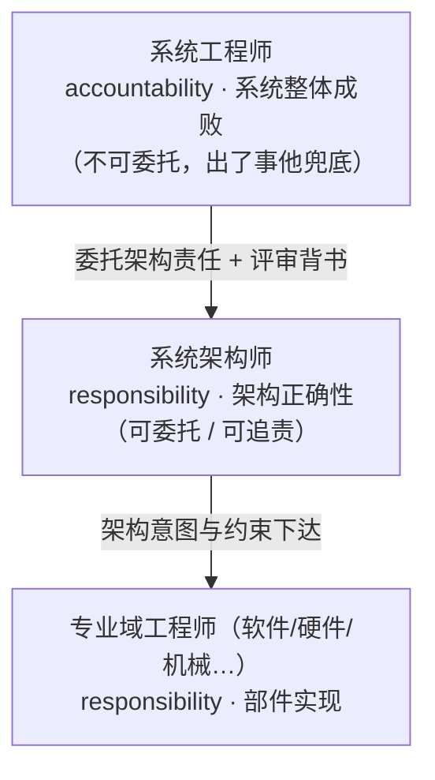

> 经典法则：**accountability 不可委托，responsibility 可以委托**。架构师搞砸了，追责追到他；但对外扛雷的是系统工程师。

**L3 · 信息流关系（协商回路）**：


- **下行流**：需求 → 架构 → 设计。架构师处于需求与设计之间的**咽喉位**。
- **上行反馈 1（派生需求）**：SEBoK 原话 *Define derived system requirements induced by necessary instances of architectural entities*——选了一个架构方案，等于给系统加了一批它本来没有的要求，需回流更新规定需求。**架构师能改变需求**。
- **上行反馈 2（迭代协商）**：SEBoK：架构定义与需求/设计流程"经常迭代（often employed）"，目的是达成 *negotiated understanding*——注意用词：不是"完美的正确解"，而是"各方都接受的满意解"。**两者是持续的谈判对手，不是指挥-执行。**

**L4 · 决策关系**：拍板权在系统工程师手里，理由权（rationale）在架构师手里——架构师提方案必须带 rationale（42010 核心概念），SE 在系统级权衡里做最终取舍（权衡常跨出架构域：成本、进度、需求优先级）。**你提方案+理由，我拍板+兜底。**

### 5.2 常态张力与调和机制

| 张力 | 架构师倾向 | 系统工程师倾向 | 调和机制 |
|---|---|---|---|
| 时间观 | 架构纯洁性、长远演化 | 交付可行、当前约束 | 架构决策必须带 **rationale**，评审时摆出来对质 |
| 关注域 | 只看架构域 | 看全链 + 成本进度 | 系统级评审（TR）由 SE 主持，架构师是陈述方 |

IPD 落地：TR2/TR3 架构评审中，**架构师是材料主笔**（架构描述、视图、理由），**系统工程师是评审主持与技术背书人**——这个分工本身就是两人关系的制度化。

### 5.3 实践形态

- **兼任**：小项目/单系统——一人同时是 SE 和系统架构师（帽子切换）；
- **分离**：大项目/复杂系统——专职架构师，裂变为**系统架构师 → 分系统架构师**层级，分系统架构师向系统架构师对齐，系统架构师向系统工程师汇报；
- 无论哪种形态，**恒等式不变**：SE 对系统负责（accountability），架构师对架构负责（responsibility），SE 保留拍板权，架构师保留理由权。

> **收束**：区别决定分工，关系决定成败——靠委托 + 协商 + rationale 这套机制，把"架构的远见"和"系统的责任"焊在一起。

---

## 6. 模块工程师：定位

### 6.1 标准考证（重要：标准里没有这个词条）

| 证据 | 内容 | 结论 |
|---|---|---|
| IEEE 8540080 论文（*A Standard Description of the Terms Module and Modularity for Systems Engineering*） | "the terms 'module' and 'modularity' **are not standard systems engineering (SE) terms**. The system hierarchy description in the SE standards and handbooks, including SE INCOSE handbook, IEEE 1220, ISO/IEC 15288, SEBOK... do not refer to these terms at all." | **模块不是标准 SE 术语**——"模块工程师"是行业惯用语 |
| ISO/IEC/IEEE 24765:2017（SEVOCAB） | **module** — *program unit that is discrete and identifiable with respect to **compiling, combining with other units, and loading***（可独立编译、与其他单元组合、独立加载的程序单元） | "模块"的正式定义是**纯软件语境** |
| ISO/IEC/IEEE 15288:2015 | **system element** — *member of a set of elements that constitutes a system.* Note 1：系统元素可以是独立组件、产品、服务、**子系统**、系统、基础设施或企业。**Note 3：该术语具有递归性——系统元素可再被视为系统，再分解。** | 系统工程语境的正确对应物是**系统元素** |
| NIST SP 800-160（引 15288） | *one observer's system may be another observer's system element* | 分形思想的源头 |

**层级谱系**（24765 系列）：system（系统）→ subsystem（子系统）→ module（模块）→ component（组件）→ software unit（软件单元）——**模块工程师钉在"元素/模块"这一格**。

### 6.2 粒度谱系（谁在哪里、边界从哪来）

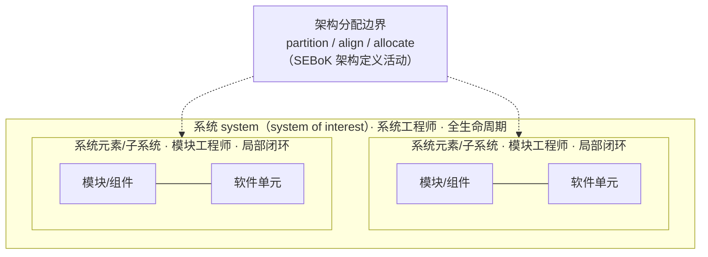

> **关键**：模块工程师的地盘不是自己选的，是架构师用 partition / align / allocate 划出来的（把架构特性与系统需求"划分、对齐、分配"到系统元素）。模块工程师**边界内自治，边界外（接口）听架构的**。

### 6.3 分形：模块工程师 = 迷你系统工程师

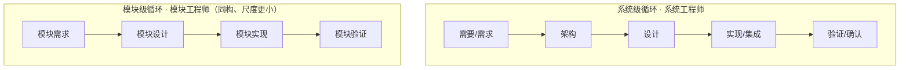

**分形不对称**（模块级比系统级**少**的东西，不是遗漏而是结构；2026-08-25 修订"模块架构"行）：

| 模块级没有 | 原因 |
|---|---|
| 模块**对外**架构（边界/接口/职责） | 模块的对外边界就是上层架构的分配——架构师定，模块工程师不能改 |
| 模块确认 | 确认（validation）必须发生在真实使用环境（系统级） |
| 模块部署 | 部署是系统级行为 |
| 模块集成方案/报告 | 集成主要发生在系统级（把模块组装起来） |

> ⚠️ **修订说明（2026-08-25）**：原表"模块架构：模块的'架构'就是上层架构的分配"——**过于绝对**。精确口径：模块的**对外**架构（边界、接口、承担的职责）确属上层分配，模块工程师不能改；但模块的**内部**架构（内部结构、内部依赖、内部接口、实现策略）是**模块工程师的职责**——模块工程师在自己的模块内做架构定义，就是"模块级迷你架构师"（呼应 §6.3 分形与 §7.5.2 的设计决策记录 DDL）。

**模块工程师的职责**（模块级局部闭环）：模块需求（细化上层分配的派生需求）→ **模块内部架构定义**（边界内自治：内部结构/依赖/内部接口，DDL 留档）→ 模块设计（内聚/耦合，Parnas 意义上的模块化设计）→ 模块实现（可独立编译/组合/加载）→ 模块验证（证明模块满足模块需求——**注意：模块验证证明"模块做对了"，系统级验证/确认仍是系统工程师和架构师的**）。

---

## 6.4 架构师 vs 工程师：职责边界与咬合

**一句话**：架构师管"系统的结构与演化"（棋盘大、约束别人），工程师管"元素的实现与细节"（棋盘小、只管自己）——二者不是上下级，是同一套工程动作在不同棋盘上的分形（§6.3），中间靠接口契约（ICD）咬合、靠评审对质衔接。

### 6.4.1 职责范围对比（八维度）

| 维度 | 架构师（系统棋盘） | 工程师（模块棋盘） |
|---|---|---|
| **认知对象** | 关切（concern）→ ASR | 规定需求（specified requirement） |
| **决策域** | 全局 · 难逆转（接口、质量属性、演化原则） | 局部 · 可逆（模块内结构、实现策略） |
| **棋盘** | 系统 + 关系 + 演化（42010 三分法） | 元素/模块 |
| **产品数据** | 上半棵：AD、ADR、ICD、派生需求 | 下半棵：实现、单元测试、模块文档 |
| **验证方式** | 评审（对质三问 / 评审四看） | 测试（单元 / 集成） |
| **时间尺度** | 跨版本演化 | 当下交付 |
| **责任性质** | responsibility · 架构正确性（可委托可追责） | responsibility · 元素实现 |
| **关键动作** | 定 ASR → 生成候选 → 权衡选定 → 分配接口 → 表达基线 → 评审背书（16 号六步） | 承接接口契约（1:1 搬入）→ 模块内部架构 → 实现 → 测试验证 |

### 6.4.2 边界判据（一句话）

> **凡是"约束别人"的决策，归架构师；凡是"只管自己"的决策，归工程师。**
>
> （即 ASR 三标准：影响面广 / 难逆转 / 约束硬 → 架构师；模块内 / 可逆 / 局部 → 工程师。）

### 6.4.3 四条关系

| # | 关系 | 内容 |
|---|---|---|
| ① | **分形递归** | 同一套工程动作（构思·定义·设计·验证）在不同棋盘上重复——工程师在模块内也是"迷你架构师"（§6.3）；区别只在棋盘大小，不在动作类型 |
| ② | **委托—协商—验收** | 架构师委托契约（ICD + 派生需求），工程师实现，架构师/SE 评审验收；不是上下级，是"斗而不破"的动态链（§5） |
| ③ | **契约咬合** | ICD 是唯一的 1:1 搬入点：接口从上半棵搬进下半棵，工程师不能改；若发现接口有问题，走正式变更回流，不私下改 |
| ④ | **互不替代、互相依赖** | 没有架构师 → 工程师各自为政（Cowboy Coding）；没有工程师 → 架构是空中楼阁 |

### 6.4.4 关系图（图示）

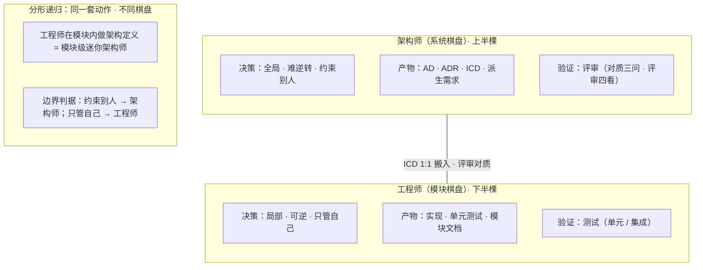

> **收束**：架构师为"结构"负责，工程师为"实现"负责；接口是唯一的交界点——架构师把契约交给工程师，工程师把证据交回架构师。

---

## 7. 产品数据责任矩阵

### 7.1 清单结构与洞察

实际产品研发中的产品数据清单，横跨两层：

- **系统级（13 项）**：相关方需求、运行概念、系统需求、系统架构、系统详细定义、系统技术方案（含系统仿真计算报告）、系统各实现方案、系统集成方案、系统集成测试报告、系统验证报告、系统确认报告、系统部署报告、系统运维报告；
- **模块级（7 项）**：模块需求、模块详细定义（含模块仿真计算报告）、模块各实现方案、模块各实现报告、模块测试报告、模块验证报告、模块运维报告。

**结构洞察**：对照 15288 的"系统 → 系统元素"递归层级，清单恰好两层；且模块级**没有**独立架构工件（模块对外边界来自上层分配，§6.3 修订）/确认/部署/集成——正是 §6.3 的"分形不对称"实证（模块内部架构决策记在模块文档族内，见 §7.5.2 设计决策记录 DDL）。

### 7.2 责任矩阵（主责 / 批准·终责 / 评审把关 / 参与 / —）

| 产品数据（工件） | 系统工程师 | 系统架构师 | 模块工程师 |
|---|---|---|---|
| 相关方需求 | **主责** | 参与 | — |
| 运行概念 · 系统需求 | **主责** | 参与 | — |
| 系统架构 | 批准 | **主责** | — |
| 系统详细定义 · 技术方案（含仿真） | **主责** | 评审 | 参与 |
| 系统实现方案 · 集成方案 | **主责** | 参与 | — |
| 集成测试 · 验证 · 确认报告 | **主责** | 评审 | 参与 |
| 系统部署 · 运维报告 | **主责** | — | 参与 |
| *—— 分隔线：模块级 ——* | | | |
| 模块需求 · 模块详细定义（含仿真） | 批准 | 评审 | **主责** |
| 模块实现方案 · 实现报告 | 批准 | 评审 | **主责** |
| 模块测试 · 模块验证报告 | 批准 | 评审 | **主责** |
| 模块运维报告 | 批准 | — | **主责** |

### 7.3 三角色责任签名（矩阵模式三句话）

1. **系统工程师：系统级主责兼终责 + 模块级"批准者"**——系统级 13 项几乎全是他主责（accountability 的落点）；模块级 7 项全部"批准"（委托的落点：模块工程师干活，他验收）。**他是唯一跨两层的角色**，呼应"角色丛"的总责身份。
2. **系统架构师：唯一主责在"系统架构"，但全链都有"评审"位**——需求侧"参与"、架构"主责"、详细定义/技术方案/集成测试/验证确认"评审"、模块级全部"评审"。真实职责比"画架构"更重：**架构符合性把关**（模块详细定义是否符合架构分配？技术方案是否违背架构原则？——呼应 42010：*certifying proper implementation of*）。
3. **模块工程师：模块级全权 + 系统级"贡献者"**——模块级 7 项全部主责，系统级只参与三处（详细定义提供本模块输入、集成测试提供模块测试数据、运维反馈模块运行数据）。**粒度隔离，这就是模块化的意义**：系统工程师不需要知道模块内部细节，只需要模块的接口 + 验证结果。

### 7.4 遗漏项清单（用户问"可能还有遗漏"）

| 类别 | 遗漏项 | 归属角色 |
|---|---|---|
| **接口类** | 接口定义 / 接口控制文档（ICD） | 架构师定义，双方维护（架构 relationships 的落地） |
| **配置管理类** | 技术基线（baseline）、变更申请/变更评审记录（CR/CCB）、配置项清单 | SE 牵头（衔接配置管理主线） |
| **决策与评审类** | 架构决策记录（ADR / rationale）、评审记录（review record） | 架构师出理由，SE 主持评审 |
| **计划与用例类** | 验证/测试**计划**与用例（清单只有"报告"）、需求追溯矩阵、风险登记册、假设与约束记录 | SE 主责，架构师参与 |
| **生命周期尾部** | 退役/处置计划、保障与培训材料 | SE 主责 |
| **使能系统类** | 开发/测试/仿真工具链相关数据 | SE 牵头（15288 enabling system） |

> **最扎眼的两处**：**ICD**——模块之间协作的"宪法"（没有它，模块工程师只能互相猜接口）；**ADR**——架构决策的"审计底稿"（没有它，评审时架构理由无从对质）。

### 7.5 各角色产品数据文档族（补充清单）

> 本节回答三个对称问题：系统架构师还需要开发什么文档？模块工程师需要补充哪些文档？系统工程师需要补充哪些文档？三份文档族清单可直接并入产品数据清单。

#### 7.5.1 系统架构师的产品数据文档族

**核心结论**：架构师开发的不是一份"系统架构"文档，而是一个以架构描述（AD）为核心的**文档族**，外加贯穿全生命周期的架构决策链。**文档是载体，决策与理由（rationale）才是灵魂。**

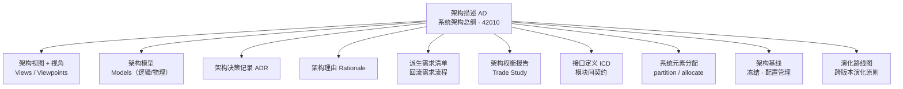

**架构师主责文档全清单（按开发阶段，22 项）**：

| 阶段 | 架构师主责文档 | 依据 |
|---|---|---|
| 概念/需求 | ① 干系人关注点清单（concerns）② 架构约束输入 ③ 候选架构方向 | 15288 §6.4.4 活动、42010 |
| 方案（TR2/3） | ④ 候选架构方案 ⑤ 架构权衡分析报告 ⑥ AD（初版）⑦ ADR ⑧ 派生需求清单 ⑨ 架构基线①（冻结） | §6.4.4 purpose（生成/选择/表达） |
| 设计 | ⑩ 架构视图 + 视角定义 ⑪ 接口定义/ICD ⑫ 系统元素分配说明 ⑬ 设计属性与约束（下发模块） | 42010；SEBoK |
| 实现/集成 | ⑭ 架构符合性检查记录 ⑮ 接口变更裁决记录 ⑯ 实现偏差处理记录 | 42010：*certifying proper implementation* |
| 验证/部署 | ⑰ 架构验证证据（架构层面）⑱ 评审材料（供 TR 与 SE 背书）⑲ 架构基线②（冻结） | 15288 验证/评估 |
| 运行/演化 | ⑳ 架构演化评估报告 ㉑ 演化路线图更新 ㉒ 跨版本架构决策记录 | 42010 §4.3：architecting 贯穿生命周期 |

**与责任矩阵的衔接（重要修正）**：矩阵里架构师在"系统详细定义/技术方案/集成测试"等格子标"评审/参与"，是因为架构师的产出（ICD、ADR、分配说明、权衡报告）以**输入材料**形态嵌进这些文档——**SE 管"文档"（签发的载体），架构师管"架构决策"（内容的来源）**。

#### 7.5.2 模块工程师的补充文档族

**核心结论**：模块工程师的文档族是"系统级文档族在模块粒度的**分形投影**"——以"模块需求 → 模块设计 → 模块验证"闭环为核心；**不产**架构/确认/部署/集成（分形不对称，见 §6.3）；**向上供给**模块验证/测试报告给系统集成与验证。

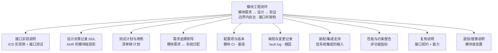

**模块工程师补充文档清单（14 项）**：

| 类别 | 文档 |
|---|---|
| A. 接口与契约 | ① 模块接口实现说明（ICD 实现侧）② 接口测试记录 ③ 接口版本兼容矩阵 |
| B. 需求与设计 | ④ 模块需求追溯矩阵 ⑤ 模块设计决策记录（DDL）⑥ 模块假设与约束记录 ⑦ 模块性能与资源使用报告 |
| C. 验证类 | ⑧ 模块测试计划与测试用例/规程 ⑨ 模块缺陷记录与根因分析 |
| D. 配置与生命周期 | ⑩ 模块配置项（CI）与版本基线 ⑪ 模块变更记录 ⑫ 模块装配/集成支持说明 ⑬ 模块复用说明 ⑭ 模块退役/替换说明 |

**接口流**（模块文档是工程数据链的中转节点）：

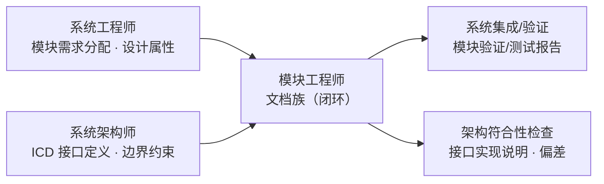

**与架构师文档族的区别**：架构师以"决策与理由"（ADR/rationale）为灵魂，模块工程师以"**契约与证据**"（接口实现 + 测试验证）为灵魂——一个为"为什么这么设计"负责，一个为"按约定实现了、并证明给它看"负责。

#### 7.5.3 系统工程师的补充文档族

**核心结论**：系统工程师的文档族是三角色中唯一**横跨"技术链 + 管理链"**的——已有 13 项偏技术产物（报告类），需要补**计划类**（先计划后执行）与**管理受控类**（15288 技术管理流程产物）：**计划先行 · 基线受控 · 评审把关 · 全链可追溯**。

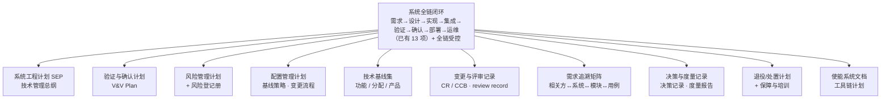

**系统工程师补充文档清单（15 项）**：

| 类别 | 文档 |
|---|---|
| A. 计划类 | ① 系统工程计划（SEP）② 验证与确认计划（V&V Plan）③ 集成测试计划 ④ 风险管理计划 + 风险登记册 ⑤ 配置管理计划 |
| B. 管理受控类 | ⑥ 技术基线集（功能/分配/产品）⑦ 变更申请与评审记录（CR/CCB）⑧ 评审记录（review record）⑨ 决策记录 ⑩ 度量报告 |
| C. 追溯与一致性 | ⑪ 需求追溯矩阵 ⑫ 接口一致性核查记录 |
| D. 生命周期尾部 | ⑬ 退役/处置计划 ⑭ 保障方案与培训材料 |
| E. 使能系统 | ⑮ 使能系统计划（开发/测试/仿真工具链） |

**技术管理流程 → 文档映射**（15288 权威锚点，B 组直接挂靠）：

| 技术管理流程 | 系统工程师主责文档 |
|---|---|
| 项目规划 | SEP 系统工程计划 |
| 项目评估与控制 | 评审记录、技术状态报告 |
| 决策管理 | 决策记录（问题/备选/理由） |
| 风险管理 | 风险登记册 |
| 配置管理 | 功能/分配/产品基线、CR/CCB 记录、配置项清单 |
| 信息管理 | 文档/数据管理计划 |
| 测量 | 度量报告 |
| 质量保证 | 评审/审计记录 |

#### 7.5.4 三角色文档族对比（灵魂）

| 角色 | 文档族核心 | 灵魂 |
|---|---|---|
| 系统架构师 | AD + ADR + ICD + 权衡报告 + 演化路线图 | **决策与理由**（为什么这么设计） |
| 模块工程师 | 模块闭环 + 接口实现 + 测试计划/用例 + 配置版本 | **契约与证据**（按约定实现并证明） |
| 系统工程师 | 全链产物 + 计划类 + 管理受控类 + 追溯 + 尾部 | **受控与闭环**（全链受控、可追溯） |

> **收束**：架构师为"设计"负责，模块工程师为"实现"负责，系统工程师为"整条链的受控与闭环"负责——他的文档最"重"也最易被低估（管理产物不如技术产物显眼，但没有基线、评审与追溯，所有人都是白干）。

---

## 8. 成长路径

### 8.1 两条成长方向：拓宽 vs 抽象

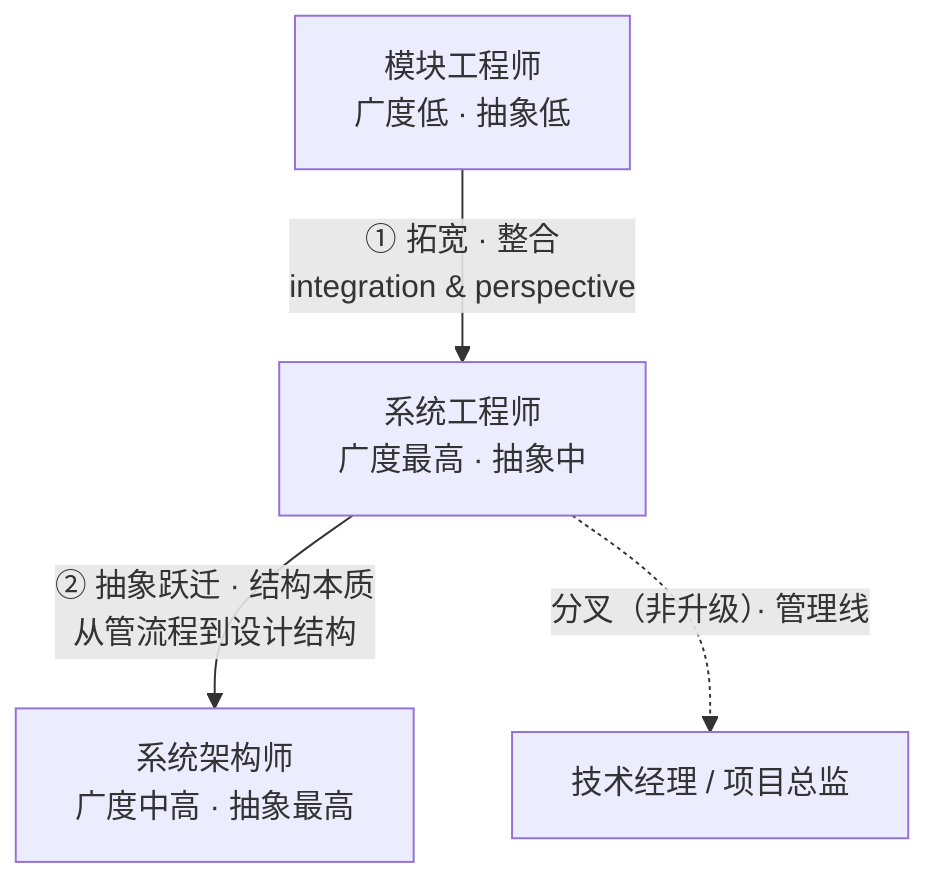

> INCOSE：SE 的核心是 *integration & perspective*（整合与视角）——架构师则是把其中的"结构视角"做到极致。
> **反直觉点**：不是所有系统工程师都会（或该）成为架构师——这是**分叉，不是阶梯**：管理线（技术经理→项目总监）与架构线（系统架构师→首席架构师）两条线都正当，只是方向正交。

### 8.2 模块工程师 → 系统工程师（拓宽）

**本质**：成长的本质不是"技能叠加"，而是"**视角换轨 + 责任接管**"——从对"我的模块"负责，切换到对"整个系统"负责；优化目标从"单点最优"变成"系统最优"（往往要求某个模块"让利"）。

**实证**：INCOSE（Hutchison IS2022）：*40% of systems engineers have never had that title*——从专业域/模块工程师转入是主流路径。

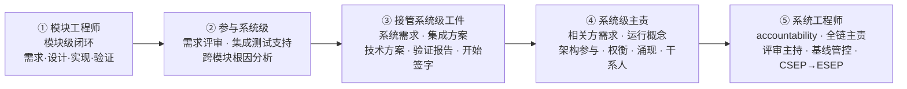

**视角换轨（模块视角 → 系统视角）**：

| 维度 | 模块视角（出发地） | 系统视角（目的地） |
|---|---|---|
| 关注对象 | 我的模块内部：内聚 · 性能 · 实现 | 模块之间 · 系统与环境 |
| 完成标准 | 模块验证通过 = 任务完成 | 验证 + 确认 + 全生命周期 |
| 协作方式 | 接口按文档走，其余不管 | 涌现行为 · 系统级权衡 |
| 优化目标 | 单点最优 | 系统最优（可牺牲单点） |
| 责任 | responsibility · 元素实现 | accountability · 系统成败 |

**能力缺口**（INCOSE Vision 2035 五组能力）：

| 能力组 | 模块工程师现状 | 系统工程师要求 |
|---|---|---|
| Core SE Principles（系统思维、生命周期、批判思维、建模分析） | 基本没有 | **最大缺口**，必须系统补 |
| Technical（需求/设计/集成/V&V/接口） | 有模块级底子 | 从模块级"上翻"到系统级 |
| SE Management（计划监控、决策、配置、风险） | 几乎没有 | 需补：基线、变更、风险、评审主持 |
| Professional（技术领导、谈判、促成、沟通） | 单打独斗为主 | 需补：跨团队斡旋、干系人沟通 |
| Integrating（项目管理、财务、物流、质量） | 没有 | 需补：成本权衡、商业论证 |

**行动清单**（按性价比排序）：

1. 主动认领**跨模块任务**——集成测试支持、跨模块缺陷根因分析（成本最低的换轨：被迫同时看多个模块 + 接口）；
2. 去**需求评审现场坐着**——哪怕旁听，理解"我的模块需求"如何从"系统需求"分配下来；
3. 把"验证"升级为"**验证 + 确认**"——主动问"模块验证通过，但系统真的做对了吗？"（这句问号就是系统工程师的入场券）；
4. 找一个系统工程师/架构师当镜子——观察他们怎么拍板，问"你为什么这么权衡"；
5. 补结构化课程——15288 全流程、需求工程、权衡分析（MAUT/AHP）、MBSE；
6. 换到**多模块系统项目**——单模块项目永远长不出系统工程师；最后用 **INCOSE ASEP → CSEP → ESEP** 认证固化能力，形成职业证据链。

> **换轨标志**：模块工程师的终点不是"更懂模块"，而是"第一次因为系统牺牲了自己的模块，还觉得值"——那一刻，你就换轨了。

### 8.3 系统工程师 → 系统架构师（抽象跃迁）

**本质**：不是"升职"，而是"换一条专精轨道"——从对"系统成败"负总责，转向对"系统的结构与演化"负专责；决策对象从"事实"（方案行不行、预算够不够）变成"本质"（什么结构能同时满足互相冲突的关注点，且未来三年还能演化）。

**核心问题不同**：系统工程师问"系统能不能成？"；架构师问"系统为什么长这样？它凭什么能演化？"——这就是为什么 15288 给架构定义流程 purpose 的第一个词是 **generate（生成）**：架构师要先创造候选结构，再选择，再表达；系统工程师通常不需要"创造"，他要"整合"。

**本质转变对比**：

| 维度 | 系统工程师 | 系统架构师 |
|---|---|---|
| 核心问题 | 系统能不能成？ | 系统为什么长这样？怎么演化？ |
| 决策时间尺度 | 当前生命周期 | **跨版本、跨产品线**（演化原则） |
| 工作对象 | 流程 · 干系人 · 系统级权衡 | 抽象结构 · 关注点（concerns）· 视图 |
| 核心产出 | 全套系统级工件 | 架构描述（AD）+ 架构决策 + rationale |
| 工作方式 | 在流程中推进 | 在抽象中设计（42010：conceiving, defining, expressing…） |
| 责任 | accountability · 系统成败 | responsibility · 架构正确性 |

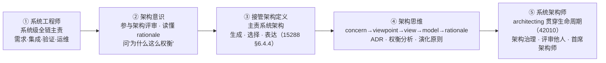

**能力缺口**（Vision 2035 视角——SE 底子厚，缺的是"抽象"那一维）：

| 能力组 | 系统工程师现状 | 架构师要求 |
|---|---|---|
| Technical（需求/集成/V&V/设计） | 宽而全 | 其中 **Systems Architecting** 从"会用"变"精专" |
| Core SE Principles | 有系统思维基础 | 补：**概念建模、抽象能力、批判性设计** |
| SE Management | 全（配置/风险/决策） | 保留（架构基线也要管） |
| Professional | 有领导/谈判 | 补：**设计对话**——用 rationale 说服，而非用职权拍板 |
| （无对应组） | — | **新增维度：设计审美与长期眼光**（架构风格、演化预判） |

**行动清单**（贵在"换脑"）：

1. 从"评审架构"到"被评审"——先以评审员身份坐在架构评审里，反复问"为什么选 A 不选 B"，直到能替架构师辩护；
2. 动手写 **ADR（架构决策记录）**——从记录别人的 rationale 开始，到为自己的一次结构选择写理由（架构思维的最低训练量）；
3. 主责一个**子系统的架构**——在系统架构师划好的边界内，独立完成"生成→选择→表达"三件事，获得第一次"架构责任"；
4. 学 **42010 概念链**——concern → viewpoint → view → model → rationale，把"我脑子里有结构"升级为"我能把结构表达成可评审的架构描述"；
5. 跨版本看演化——跟住一个系统从 V1 到 V3，观察架构哪里被迫改、哪里守住没改；"没改的地方"就是当年架构决策的 payoff；
6. 找资深架构师做**设计复盘**——每次他否定你的方案，别只改方案，逼他讲清 rationale；
7. 终极题：**"如果需求翻一倍，这个架构还成立吗？"**——架构师每天想的就是这句话。

### 8.4 两条成长线收束（乐队类比）

- **模块 → 系统**：乐手变成指挥——开始听整场（横向拓宽）；
- **系统 → 架构**：指挥中的一部分人变成编曲——开始想"这首曲子三十年后的变奏还能不能成立"（纵向抽象）；
- 指挥对当下成败负责，编曲为未来三十年负责。**两条路没有高低，只有时间尺度的不同。**

---

## 9. 术语对照表

| 英文 | 中文 | 备注 |
|---|---|---|
| system engineer | 系统工程师 | 学科实践者，与头衔无关（24765） |
| systems architect | 系统架构师 | 角色丛中的专门角色（15288 §6.4.4、42010） |
| module engineer | 模块工程师 | 行业惯用语，非标准词条 |
| architecting | 架构活动/架构过程 | 42010 §3.1，贯穿生命周期 |
| architecture description (AD) | 架构描述 | 42010 §3.3，架构师核心工作产品 |
| system element | 系统元素 | 15288，可递归视为系统 |
| accountability | 总责/终责 | 不可委托 |
| responsibility | 专责 | 可委托、可追责 |
| rationale | 理由/理由说明 | 架构决策的审计底稿（42010） |
| derived requirements | 派生需求 | 架构实体的必要实例引发（SEBoK） |
| negotiated understanding | 协商理解 | 架构与需求迭代的目标（SEBoK） |
| need / expectation / constraint | 需要 / 期望 / 约束 | 三者并列，无主次（ISO 9000 §3.6.4 精神） |
| specified requirement | 规定需求 | 验证的参照 |

---

## 10. 标准与文献出处汇总

| 标准/文献 | 用途 |
|---|---|
| ISO/IEC/IEEE 24765:2017（SEVOCAB） | systems engineering、module、角色词条模式 |
| ISO/IEC/IEEE 15288:2015 / 2023 | 系统生命周期流程（30 个）、role、system element、§6.4.4 架构定义 purpose |
| ISO/IEC/IEEE 42010:2011 | architecting、architecture、architecture description、§4.3 生命周期论述 |
| INCOSE 2019 官方定义（Fellows Initiative） | systems engineering 定义（transdisciplinary and integrative） |
| INCOSE SE Handbook（4th ed.） | 系统工程师职责、技术流程活动 |
| INCOSE Systems Engineering Vision 2035 | 角色与能力五组（Core SE Principles / Professional / Technical / SE Management / Integrating） |
| INCOSE IS2022（Hutchison） | SE 角色丛、六件日常事、"40% 从未有过头衔"数据、SEP 认证（ASEP/CSEP/ESEP） |
| INCOSE Careers | "career path often begins in other technical fields" |
| SEBoK | negotiated understanding、derived requirements、架构定义活动（partition/align/allocate） |
| IEEE 8540080 论文 | module/modularity 非 SE 标准术语的考证 |
| NIST SP 800-160 | one observer's system is another's system element |
| 24765 系列层级 | system → subsystem → module → component → software unit |
| IEEE 1028-2008 | 评审与审计标准：review 定义、五种类型、"子程序"模型 |
| ISO 9000:2015（§3.8.12/§3.8.13） | verification / validation 定义（客观证据 + 规定需求/预期用途） |
| IEEE 1012（V&V 标准，引用） | 验证与确认流程（评审被其"调用"的示例调用方） |
| ISO/IEC/IEEE 42020:2019 | 架构流程：治理 §6 / 管理 §7 / 概念化 / 评估 / 细化 / 使能；治理 purpose 与六活动 |
| ISO/IEC 38500 | 治理三要素（评估 / 指导 / 监控） |

---

## 11. 评审 · 验证 · 确认：三词对照

**一句话**：三者不是"同一件事的三个名字"——review 是"人的判断活动"（IEEE 1028），verification 是"用客观证据证明满足了规定需求"（15288 §6.4.9），validation 是"用客观证据证明满足了干系人需要与预期用途"（15288 §6.4.11）；而 review 与后两者的关系，IEEE 1028 自己给出了精确答案：它是被验证/确认流程"调用"的**子程序（subroutine）**。

### 11.1 权威定义（原文 + 翻译）

**① review（评审）——IEEE 1028-2008《软件评审与审计标准》**

> *review — a process or meeting during which a software product or process is presented to project personnel for examination, feedback, and approval.*
> 译：评审——一种过程或会议，期间将软件产品或过程呈现给项目相关人员，供其检查、反馈与批准。

IEEE 1028 定义**五种**系统化评审类型：管理评审（management review）、技术评审（technical review）、检查（inspection）、走查（walk-through）、审计（audit）。"系统化"三要素：**团队参与、结果记录成文、程序记录成文**（不满足即"非系统化评审"）。

**② verification（验证）——15288 §6.4.9 + ISO 9000:2015 §3.8.12**

> 15288：*provide objective evidence that a system or system element fulfils its **specified requirements** and characteristics*（提供客观证据证明系统或系统元素满足其**规定需求**与特性）
>
> ISO 9000：*confirmation, through the provision of objective evidence, that **specified requirements** have been fulfilled*（通过提供客观证据对规定需求已得到满足的认定）

**③ validation（确认）——15288 §6.4.11 + ISO 9000:2015 §3.8.13**

> 15288：*provide objective evidence that the system, **when used in its intended operating environment**, fulfils the **stakeholder needs and requirements***（提供客观证据证明系统在其预期运行环境中使用时满足**干系人的需要与需求**）
>
> ISO 9000：*confirmation, through the provision of objective evidence, that the requirements for a **specific intended use or application** have been fulfilled*（通过提供客观证据对特定预期用途或应用的需求已得到满足的认定）

> ⚠️ **措辞分野**：verification 的参照是"规定需求"（specified requirements），validation 的参照是"干系人需要 + 预期用途"（stakeholder needs & intended use）——正好接上 §2.3 的术语约定。

### 11.2 维度对照表

| 维度 | review 评审 | verification 验证 | validation 确认 |
|---|---|---|---|
| **本质** | 人的判断活动（评估/检查/建议/批准） | 客观证据的提供（objective evidence） | 客观证据的提供（objective evidence） |
| **参照对象** | 计划 / 期望 / 标准 / 准则 | **规定需求**（specified requirements） | **干系人需要 + 预期用途**（stakeholder needs & intended use） |
| **核心问题** | 本阶段工件"准备好了吗"？ | Are we building it **right**？（做对了吗） | Are we building the **right thing**？（做对东西了吗） |
| **执行者** | 有资质的团队（管理/技术/外部审计） | 开发方内部（可独立验证） | 干系人 / 客户 / 使用方（真实环境） |
| **时机** | 阶段之间（TR 门）、全生命周期任意节点 | 贯穿各阶段出口（模块→系统逐级） | 系统级、接近交付、真实运行环境 |
| **证据性质** | 评估结论、异常清单、行动项（主观判断） | 测试/分析/检查/演示等客观证据 | 真实使用场景的客观证据 |
| **标准锚点** | IEEE 1028-2008（五种类型） | 15288 §6.4.9、ISO 9000 §3.8.12 | 15288 §6.4.11、ISO 9000 §3.8.13 |
| **角色归属** | 评审主持 = SE，材料主笔 = 架构师 | V&V Engineer（SE 主责） | SE 组织、客户/用户判定 |

### 11.3 关系：IEEE 1028 的"子程序（subroutine）"模型

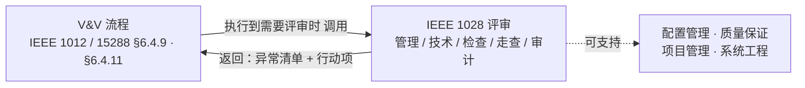

> IEEE 1028 原文：*Software reviews can be used in support of the objectives of project management, system engineering, verification and validation, configuration management, quality assurance and auditing.*——评审是"万能工具"，正因如此最容易被误认为与 V&V 并列；它实际是**被 V&V 流程调用的子程序**。

### 11.4 开发链上的位置：评审是"门" · 验证是"链" · 确认是"端"

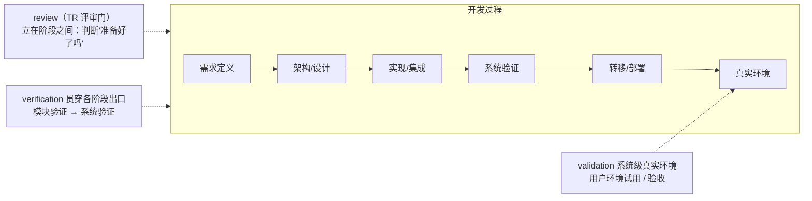

IPD 对应：**TR 评审 = review**；各阶段出口检查 = verification；用户环境试用/验收 = validation。

### 11.5 三个易错点与收束

1. **评审可以作为验证的"方法"之一，但评审 ≠ 验证**——检查（inspection）、技术评审常被"调用"来支持验证活动，但产出的是异常清单和行动项（人的发现），而验证要求客观证据（测试通过、分析结果）。通过评审 ≠ 被验证。
2. **review 是"子程序"，不是与 V&V 并列的第三种验证**——IEEE 1028 自述：V&V 标准（IEEE 1012）执行到需要评审时"调用"IEEE 1028，评审完返回调用方处置结果。
3. **层级不同**——verification 和 validation 是 15288 的**独立技术流程**（§6.4.9/§6.4.11）；review 是**跨流程的把关活动**（可支持五大目标）。

> **收束**：验证锚定"规定需求"，确认锚定"需要与预期用途"，评审锚定"人的判断"——V 和 V 要证据，review 要人；评审是门，验证是链，确认是端。
> **类比**：验证是"按菜谱核对"（盐 3 克、火候 5 分钟——满足规定），确认是"客人吃后说好吃"（满足需要），评审是"大厨试菜点评"（有经验的人判断、建议调整，但不等于证明）——大厨试菜可以随时做，就像评审可嵌在任何阶段之间。

---

## 12. 架构师与架构治理

**一句话**：架构师在治理域是治理的"技术权威与执行主体"——治理的方向权（目标/政策/战略）属组织层，内容权（原则、政策、指令、符合性判断、决策依据）属架构师；产出是一整套**组织级、跨项目跨版本**的制度性产品（广义产品），而非某个系统的开发文档。

### 12.1 权威定义

**① ISO/IEC/IEEE 42020:2019 §6.1 架构治理流程 purpose（正典）**

> *The purpose of the Architecture Governance process is to **establish and maintain alignment of architectures in the architecture collection with enterprise goals, policies and strategies** and with related architectures.*
> 译：建立并保持架构集合中的架构与企业目标、政策和战略以及相关架构的一致性。

**② 治理 vs 管理（42020 最锋利的区分）**

| | 架构治理 Governance | 架构管理 Management |
|---|---|---|
| 内涵 | 设定方向、评估、监控符合性 | *Implement architecture governance directives*（实施治理指令） |
| 范围 | **适用于整个组织**（outcomes apply across the organization） | **适用于整个架构集合**（across the collection of architectures） |
| 对应章节 | 42020 §6 | 42020 §7 |
| 典型问题 | 做什么、为什么、符不符合 | 怎么执行 |

**③ ISO/IEC 38500 治理三要素**：治理 = **评估（Evaluate）+ 指导（Direct）+ 监控（Monitor）**——指导和控制系统当前和未来使用的体系，含战略与政策。

### 12.2 职责与产出：治理三要素

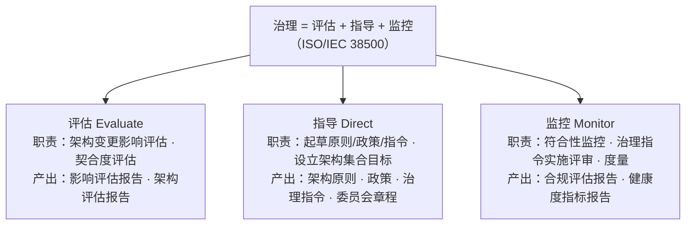

### 12.3 运作闭环（42020 §6.4 六活动 → 广义产品）

```mermaid
flowchart LR
    A1["① 准备与计划<br/>治理计划 · 委员会章程 · 责任矩阵"] --> A2["② 建立集合目标<br/>目标声明 · 对齐企业战略"]
    A2 --> A3["③ 治理决策<br/>决策记录（带 rationale）· 豁免 · 仲裁"]
    A3 --> A4["④ 监控符合性<br/>合规评估报告 · 审计 · 偏差清单"]
    A4 --> A5["⑤ 评审实施<br/>治理实施评审记录"]
    A5 --> A6["⑥ 度量与改进<br/>健康度指标 · 技术债务"]
    A6 -.->|"度量结果回流"| A1
```

### 12.4 架构师治理产出清单（广义产品）

| 类别 | 产品 |
|---|---|
| **A. 治理基础类**（指导的"宪法"） | ① 架构原则 ② 架构政策与治理指令 ③ 架构委员会章程 ④ 治理责任矩阵（RACI）⑤ 架构集合目标声明 |
| **B. 决策类**（治理的"判决书"） | ⑥ 架构治理决策记录（含 rationale，42020 §6.2c）⑦ 架构变更请求与影响评估（ACR）⑧ 豁免（dispensation）申请与批准记录 ⑨ 冲突仲裁记录 |
| **C. 符合性类**（治理的"督察报告"） | ⑩ 合规评估报告（conformance report）⑪ 架构审计报告 ⑫ 偏差清单与整改要求 ⑬ 架构契约（architecture contracts） |
| **D. 监控度量类**（治理的"仪表盘"） | ⑭ 架构健康度指标报告（复杂度/耦合/技术债务）⑮ 治理评审记录 ⑯ 治理状态报告 |
| **E. 传播教育类**（治理的"扬声器"） | ⑰ 架构意图与决策公告 ⑱ 培训与推广材料 |

### 12.5 与本文档框架的衔接

1. **42010 architecting 定义的治理维度**——*certifying proper implementation of, maintaining and improving an architecture*（认证恰当实现、维护与改进）就是治理：前者=符合性监控（④），后者=度量与演化治理（⑥）。架构治理不是额外职责，而是 architecting 定义中本来就包含的组织化落地。
2. **责任矩阵的"全链评审"位**——架构师在 §7.2 几乎全链"评审"，其制度形态就是治理的合规审查；§7.5.1 的"架构符合性检查记录、接口变更裁决记录、偏差处理记录"正是治理产物在系统开发过程中的投影。
3. **与 SE 的分工再确认**——治理决策权在架构委员会（架构师是技术核心），但系统级变更的最终裁决仍要 SE 背书（§5 L4：SE 保留系统级拍板权）。治理是架构师的"常设法庭"，SE 是"系统成败的最终责任人"。

> **收束**：开发域里，架构师为"一个系统怎么设计"负责；治理域里，架构师为"所有系统的架构怎么保持一致、怎么演化、怎么被遵守"负责——前者是作品，后者是制度。

---

## 13. 待办 / 欠项

- [x] ~~review vs verification vs validation 三词对照~~——**已完成**（见 §11）：IEEE 1028 review 定义与五种类型、"子程序"模型；15288 §6.4.9/§6.4.11 与 ISO 9000 §3.8.12/§3.8.13 原文；评审是门、验证是链、确认是端。
- [x] ~~架构师 vs 工程师职责边界与咬合~~——**已完成**（见 §6.4）：八维度职责对比、边界判据（约束别人 vs 只管自己）、四条关系、Mermaid 图示；同步修订 §6.3"分形不对称"表（模块对外架构归上层分配、内部架构归工程师，§7.1 同步精确化）。
- [ ] §7.2 责任矩阵可扩展为完整 RACI（含"知情/咨询"列）；§7.5 各角色文档族清单可作为 RACI 的行来源。
- [ ] 与《架构师》方法论（10-架构设计方法论全景）交叉索引：§4–§5 可作其"角色篇"素材，§7.5.1 架构师文档族可作其"工作产品篇"素材。
- [ ] §11 与 03-评审概念精讲、07-架构概念精讲（评审在 IPD/TR 中的角色）交叉核对，确保术语一致。
- [ ] §12 架构治理与 08-治理概念精讲（词源/翻译史）交叉索引；可选深挖：架构委员会 vs 变更控制委员会（CCB）分工、豁免（dispensation）机制设计。
