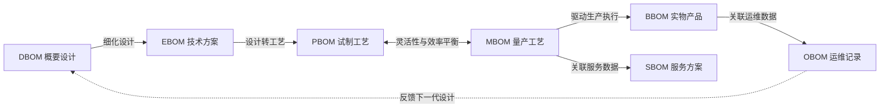

# 高效研制优质低成本产品——正向设计

> **来源**：培训材料《高效研制优质低成本的产品——正向设计》PDF（2025-03-26，32 页），原始文件 `50-research/20250326-高效研制优质低成本的产品——正向设计.pdf`。
> **转录说明**：保留原文 00~25 节 Q&A 结构；明显的重复字/错别字已修正；xBOM 转换链以 Mermaid 重绘；原文「可制造性」与「可生产性」两种表述并存，本文照录不改。
> **关联**：本材料 §4/5/7/8/18/25 是研习笔记 `09-产品需求完整性-从三类需求到验证载体.md` 与教材书第5章的素材依据。

---

## 00、请对此发表意见：削个苹果给客人吃，至于这样麻烦吗

有一个削苹果的段子，意思是本来是削一个苹果给别人吃，但现在要求要围绕着这个事情编制很多文档，如需求、方案、风险分析……大意如下：

**原始意图**：削一个苹果，给对方吃。

**任务过程**：

1. **需求文档**：需要削一个苹果。苹果的类型、大小、成熟度以及期望的切片数量。
2. **方案文档**：确定削苹果的工具（如刀具、砧板），制定操作步骤，包括如何准备苹果，如何削皮，如何切片。
3. **风险分析**：可能遇到的风险：刀具不够锋利，苹果表面有瑕疵，操作过程中可能出现的安全隐患等。
4. **测试计划**：切好的苹果片是否符合预期要求：厚度是否一致，口感是否正常。
5. **实施计划**：安排具体的时间和人员，确保削苹果的任务能够顺利完成，指定负责的工具和资源。
6. **报告文档**：任务完成后的总结报告，包括削苹果的过程、遇到的问题、最终成果以及改进建议。

**总结**：原本只是一个简单的削苹果任务，现在变成了一整套复杂的文档和流程。这种夸张的情况旨在讽刺那些形式主义管理者的做法，并引起大家的思考。

## 01、请对此发表意见：领导让你编制一份报告，至于这样繁琐吗

1. 收集并整理相关方需求
2. 分别向相关方确认需求
3. 基于资产开发系统需求
4. 同行专家评审系统需求
5. 基于资产开发报告架构
6. 同行专家评审报告架构
7. 向主要相关方确认架构
8. 依据架构策划开发任务
9. 确认各节点详细需求
10. 开发各节点详细报告
11. 评审各节点详细报告
12. 集成系统详细报告
13. 评审系统详细报告
14. 交付并确认详细报告

## 02 产品数据的定义

### 1）产品

通过生产或创造活动形成的，能够通过市场交换实现经济收益的有形物品或无形服务。

### 2）产品数据

产品全生命周期中产生的多模态原始数据集。

- **开发阶段**：显性化需求符合性，用于产品实现；
- **生产阶段**：记录设计特征，评价实物产品质量；
- **服务阶段**：构建产品运维档案，支持服务提升；
- **运行阶段**：采集产品状态数据，驱动迭代优化；
- **全生命周期阶段**：通过数据治理形成知识资产，支撑产品创新和业务增值。

### 3）xBOM：七种产品数据清单

| BOM | 中文名 | 定义 | 主要数据 | 转换关系 | 作用 |
|---|---|---|---|---|---|
| **DBOM** | 概要设计 BOM（Design BOM） | 产品顶层功能与架构设计，明确技术可行性 | 功能模块、子系统划分、技术指标、接口定义 | DBOM → EBOM（细化设计数据） | 指导跨部门对齐需求，避免设计偏离 |
| **EBOM** | 技术方案 BOM（Engineering BOM） | 完整工程设计数据，定义产品组成与参数 | 零件清单、三维模型、材料规格、装配关系 | EBOM → PBOM（设计数据转工艺方案） | 确保制造符合设计要求，支撑样机验证与成本核算 |
| **PBOM** | 试制工艺 BOM（Process BOM） | 试制/小批量生产的动态工艺方案 | 工艺路线（多路径）、替代工序、通用设备清单、调试工时 | PBOM ↔ MBOM（工艺灵活性与效率的平衡） | 快速响应试制需求，降低试错成本 |
| **MBOM** | 量产工艺 BOM（Manufacturing BOM） | 大规模量产的固化工艺方案 | 标准工序（流水线节拍）、专用工装参数、自动化设备程序、物料替代规则 | MBOM → BBOM（驱动生产执行）、MBOM → SBOM（关联服务数据） | 通过标准化降低边际成本，确保质量一致性 |
| **SBOM** | 服务方案 BOM（Service BOM） | 售后维修与备件管理的指导方案 | 故障诊断逻辑、备件清单、维修工具要求、旧件回收规则 | MBOM/BBOM → SBOM（生产数据映射服务需求） | 缩短维修周期，提升客户满意度 |
| **BBOM** | 实物产品 BOM（Build BOM） | 实际交付产品的物理构成与批次数据 | 生产批次号、供应商批次追溯码、实际装配记录、质量检验报告 | BBOM → OBOM（关联运维数据） | 支持质量追溯与售后问题定位 |
| **OBOM** | 运维记录 BOM（Operation BOM） | 产品使用阶段的运行状态与维护记录 | 传感器数据、故障日志、维修历史、用户操作行为 | OBOM → DBOM（反馈下一代产品设计） | 驱动产品迭代优化，预测性维护 |

**核心转换逻辑**

**协同价值**

- **设计-制造闭环**：从 DBOM 到 MBOM 实现技术方案到量产方案的逐级落地。
- **生产-服务联动**：BBOM/SBOM 确保产品数据贯穿交付与售后环节。
- **数据驱动迭代**：OBOM 反向优化设计端（DBOM/EBOM），形成全生命周期闭环。

---

## 1. 产品数据的意义

### 1.1 若将产品开发过程视为一组流水线，线上流动的是什么

如果将开发过程看作流水线，流水线上流动的是产品数据中的技术类数据，在流水线的起点是相关方需求，在终点是产品的技术方案，以及其成本、物料采购、生产、测试、交付、部署、运维、回收等实现方案。

开发流水线上的每一个工位以对需求进行进一步分解、分配和分析，或以评审、验证或确认的方式贡献其价值。

### 1.2 在产品研制过程，相关方在围绕着什么开展各自的工作

是产品数据。在产品研制过程中，相关方都是在围绕着产品数据开展各自的工作。

在产品生命周期中，任一相关方都会以各种方式参与产品数据的完善，或开发、或记录、或评审、或确认。

产品相关方包括那些对产品有影响、被产品影响，或感觉到被产品影响的个人或组织。

### 1.3 确认产品相关方需求是否得到了满足，凭什么，为什么

在设计阶段，产品数据是从需求开发，持续对需求进行分解、分配和分析直至可实现；在实现阶段，产品数据是对执行实现方案的记录。因此产品数据是确认产品相关方需求是否得到满足的主要依据。

技术类产品数据负责回答产品技术方案和实现方案是否满足相关方需求，记录类产品数据负责回答实物产品是否满足相关方需求。

### 1.4 产品相关方是否对产品研制贡献价值，具体体现是什么

产品数据是产品相关方对产品研制贡献价值的最主要的体现。

产品数据是相关方对产品价值贡献的记录，如果没有记录，则无法说明或证明其价值贡献。

### 1.5 对产品研制项目实施精益管理，如何判断管理是否精益

产品开发项目管理的真正价值体现是对产品数据的贡献。因此，判断管理活动是否对产品数据贡献了价值，如果是，则该管理活动应该存在，如果否，该管理活动应该被取消。以此为标准评价管理过程中的各个活动是否精益。

## 2. 产品与产品数据

### 2.1 只要有好过程就一定有好产品，这种说法对否，为什么

不太正确。好的过程未必有好产品。

> 好的开发团队 + 好的相关方需求 + 好的研制过程 → 好的产品数据 → 好的产品

### 2.2 产品及其数据是何关系，开发产品就是开发产品数据吗

根据产品数据的定义，在产品开发阶段，开发产品就是开发产品数据。

回顾下产品数据的定义：产品数据是产品全生命周期中产生的多模态原始数据集。

- **开发阶段**：显性化需求符合性，用于产品实现；
- **生产阶段**：记录设计特征，评价实物产品质量；
- **服务阶段**：构建产品运维档案，支持服务提升；
- **运行阶段**：采集产品状态数据，驱动迭代优化；
- **全生命周期阶段**：通过数据治理形成知识资产，支撑产品创新和业务增值。

### 2.3 在产品开发阶段，产品数据质量决定产品质量，为什么

在产品开发阶段，产品数据质量设定了产品质量的理论上限。实际产品质量将在此上限基础上，受制造系统保真度、环境干扰等因素影响产生波动。因此，产品数据质量决定了产品质量。

### 2.4 作为产品开发项目经理，其最重要的管理对象应是什么

产品开发项目经理最重要的管理对象是产品数据。

项目经理的责任是确保项目成功，而对于产品开发项目经理来说，项目成功是指用给定的资源开发出满足相关方需求的产品，而判断产品是否满足相关方需求，以及是否能够生产出满足相关方需求的产品，其唯一依据就是产品数据。

### 2.5 组织依据流程明确产品开发团队各角色职责吗，为什么

在产品开发过程中，各角色负责输出的产品数据，而不是角色负责的流程中的节点，是明确各角色职责的唯一依据。

各相关方对产品的贡献唯一依据是产品数据，不是相关方做了什么事，而是做的事要体现在产品数据上。没有产品数据输出的职责既对产品无价值，对组织知识资产无价值。

## 3. 何为设计与开发

### 3.1 什么是设计与开发，是对需求的持续分解、分配与分析吗

根据 ISO9000-2015，设计与开发（design and development）是将对产品的需求转换为对其更为详细的需求的过程。

根据 ISO9000-2015，设计与开发、设计、开发，这三个术语的内涵是相同的。

根据定义，可以将设计与开发理解为对产品需求的持续分解、分配与分析，直至需求可以被实现。

### 3.2 开发的终点是什么的起点，在终点输出的产品数据是什么

开发的终点是实现的起点。在终点输出的产品数据是产品的实现方案，包括产品及其构件的物料采购方案、制造方案、测试方案、交付方案、部署方案、运行方案、运维方案、拆解回收方案等。

### 3.3 在产品开发过程中，如何显性化需求分解、分配的正确性

需求分解、分配正确性的显性化方式主要有两种，一是需求分解、分配关系的说明和追踪报告；二是需求分解、分配关系的正确性和完整性分析报告。

### 3.4 相关方需求→系统需求→PBS 之间的关系能否实现多对一

相关方需求到系统需求的分配关系通常是多对多的关系，但应该实现多对一的关系；同理，系统需求到 PBS 的分配关系通常也是多对多的关系，也是应该实现多对一的关系。

以相关方需求到系统需求的分配关系为例：相关方需求的开发与系统需求架构开发同步开展；对相关方需求分解时，确保将分解后的相关方需求只能唯一分配到系统需求架构的某一单一节点，而非系统需求的末级节点。这样做的价值是：

1. **降低管理复杂性**：多对多关系会引入复杂的依赖关系，而多对一关系则简化了复杂性，使得产品架构更加清晰和易于管理；
2. **促进模块化设计**：多对一的分配关系使得每个需求有独立的模块处理，可以提高模块的可重用性和扩展性；
3. **减少变更影响**：在多对一的关系中，需求变更通常只影响到与之对应的单一架构节点而非多个节点，这样可以减少变更的扩散范围，降低了整体系统风险。

### 3.5 产品开发过程中，技术报告的评价标准或评审依据是什么

技术报告的评价标准或评审依据只有是本技术报告的需求输入。因为评价报告的目的是给出其质量，而评审报告的目的是给出其对需求输入的符合性，因此，只有报告的需求输入才是评价标准或评审依据。

必须同时获取到技术报告及其需求输入，方可开展对本技术报告的评审或评价。

## 4. 需求与产品质量

### 4.1 在产品研制领域中，请给出质量的定义，你是怎样理解的

根据 ISO9000-2015，质量是客体的一组固有属性满足需求的程度。应该这样理解质量的定义：

- 客体的固有属性是该客体天生就具备的，是根据需求设计和生产出来的。
- 需求是衡量客体质量的前提，需求的全面性、明确性和可度量性直接影响对客体质量的评价和度量。

### 4.2 在产品研制领域中，需求的定义是什么，你是怎样理解的

根据 ISO9000-2015，需求是对需要或期望的规范性陈述，需要或期望往往是隐含的或强制性的。可以这样理解需求的定义：

- 需要或期望的规范性陈述可以理解为对相关方需要或期望的文档化、规范化说明，并得到相关方的确认。
- 需求的隐含性表明需求捕获具有一定专业性和较大的难度，某相关方的需要或期望可能连他自己都没有意识到，需要专业的产品需求分析师开展需求捕获和分析。
- 需求的强制性表明有的需求是标准、法律、文化和风俗的要求，应将这些内容摘录到产品的需求条目中。

### 4.3 需求与产品质量的关系是什么，怎样才能确保产品高质量

根据质量的定义，需求是产品质量的前提条件，没有全面、明确和可度量的需求，就无法评价产品的质量，产品的质量无从谈起。

产品的高质量首先取决于需求的全面性、明确性和可度量性，然后是对需求正确分解、分配和分析以形成高质量实现方案，最后根据实现方案和适合的人机料法环生产出高质量的产品。

### 4.4 需求与设计开发的关系是什么，你是如何做设计与开发的

根据设计与开发的定义，需求是设计与开发的输入。开展设计与开发工作，必须先获取并理解需求，然后对需求条目进行梳理分组，最后对每一组需求给出其实现方案和符合性分析。

### 4.5 质量和效率的关系是什么，在工作中如何平衡质量与效率

效率在质量中。效率以相关方对产品质量满意为前提，而质量以相关方确认的需要实现的需求为前提。

在工作中平衡质量和效率，应在综合考虑成本和进度等效率需求的前提下，与相关方沟通需求范围，在得到相关方确认后，以此需求范围开展高质量的工作，并在工作过程中与相关方及时反馈、沟通和确认。

## 5. 是产品还是样机

### 5.1 从需求的视角看，功能样机、环境样机和产品有什么不同

- **功能样机**：满足主要功能需求或特定非功能需求的原型；
- **环境样机**：满足所有功能需求和环境适应性需求的原型；
- **产品**：满足功能需求、环境需求和可实现性需求的成品。

### 5.2 产品全生命周期有哪些主要过程，各过程对产品有何期望

产品全生命周期包括以下主要过程：物料采购、制造、测试、交付、部署、运维、回收。

各过程对产品的共同期望是方便实现，即方便物料采购、方便制造、方便测试、方便交付、方便部署、方便运维、方便回收。

### 5.3 产品可实现性需求包括哪些方面，这些需求的相关方是谁

产品可实现性需求包括：物料可采购性、可制造性、可测试性、可交付性、可部署性、可运维性、可回收性，以及经济可承受性等 8 个方面。

这些需求的相关方都是产品的承制方，包括物料采购、制造、测试、交付、部署、运维、回收业务代表，以及市场代表。

### 5.4 产品的成本是设计出来的吗，谁对产品成本承担主要责任

产品的成本是相关需求及其分解、分配、分析的结果，并非只是设计出来的。没有成本相关需求，设计就没有依据和目标。

首先在相关方需求中必须包含产品成本相关需求，包括经济可承受性，以及影响产品全生命周期成本的可实现性需求；其次开发满足这些需求的实现方案并以此实现产品，这样才能得到符合成本要求的产品。

市场代表根据对竞品或替代产品的价格和成本的研究，提出产品价格和成本建议，其他人员负责承接和实现成本需求。

### 5.5 产品研制方案只是技术方案吗，为什么，还包括哪些方案

只有技术方案的产品研制方案不支持产品的实现。完整的产品研制方案除了技术方案，还包括物料采购方案、制造方案、测试方案、交付方案、部署方案、运维方案、回收方案，以及成本方案。因为技术方案只回答产品满足需求的技术合理性，其他方案回答了产品满足需求的物理实现可行性。

## 6. 产品开发与工艺

### 6.1 产品各构件的验证方法、测试用例、工艺卡片是什么关系

如果确定以测试方法对构件进行验证时，测试用例即是该构件验证方法；

构件的测试用例是其工艺卡片的组成部分，构件工艺卡片内容既包括构件生产装配内容，也包括装配后的测试内容，测试内容即是测试用例。

### 6.2 产品开发过程包括其构件的加工、装配或检验技术开发吗

产品开发过程包括产品构件的加工、装配或检验技术的开发。

因为产品开发过程的终点是产品实现方案，而实现方案中的生产方案必须以成熟的加工、装配和检验技术为前提。如果这些技术不能成功开发，则必须更改产品的技术实现方案。

### 6.3 产品开发过程包括其所需物料的供应商开发和选择方案吗

产品开发过程包括其所需物料的供应商开发和选择方案。

因为产品开发过程的终点是产品实现方案，而实现方案中的物料采购方案必须以成熟的物料及其供应商为前提。如果出现所需物料无法采购的情况，必须更改技术实现方案。

### 6.4 产品开发过程包括其所需新设备或工装夹具的研制方案吗

产品开发过程包括其所需新设备或工装夹具的研制方案。

因为产品开发过程的终点是产品实现方案，而实现方案中的生产方案必须以可用的生产设备和工装夹具为前提，如果出现所需生产设备或工具无法获得，必须更改技术实现方案。

### 6.5 编制生产线方案、工艺规程和工艺卡片的前提条件是什么

编制产品生产线方案、工艺规程和工艺卡片的前提条件是产品生产所需的各种人、机、料和环等元素皆成熟且可按需获得。

## 7. 系统设计与开发

### 7.1 从产品数据视角看，系统设计过程的起点和终点各是什么

从产品数据视角看，系统设计过程的起点是相关方需求，终点是系统的 PBS 及其各节点需求定义，以及系统节点本身的实现方案。

### 7.2 系统设计起点的产品数据是什么，请列表说明其主要构成

系统设计起点的产品数据是相关方需求。

相关方需求主要构成如下：功能需求及其指标、环境适应性需求及其指标、可实现性需求及其指标。其中：

- **功能需求**：指系统所具备的行为特征，以 IPO（输入、处理、输出）方式定义的需求；
- **环境适应性需求**：包括气候、国家、文化、风俗、法律等各类环境的适应性；
- **可实现性需求**：包括经济可承受性、物料可采购性、可制造性、可测试性、可交付性、可部署性、可运维性、可回收性等需求。

### 7.3 系统设计终点的产品数据是什么，请列表说明其主要构成

系统设计终点的产品数据是 PBS 及其各节点需求定义，以及系统节点本身的实现方案。

其中，系统节点本身的实现方案主要包括：系统节点本身的技术方案、成本方案、物料采购方案、制造（集成）方案、测试方案、交付方案、部署方案、运维方案、回收方案等。

### 7.4 请给出系统设计过程的主要产品数据，并说明它们的关系

系统设计的主要产品数据包括：相关方需求、系统需求、系统架构及架构节点需求定义、系统技术方案、系统实现方案，以及各类分析计算和仿真报告等。

从相关方需求、系统需求、系统架构、技术方案，到实现方案，后序文档是对前序文档的分解和分配，而分析、计算和仿真报告是对需求分解、分配方案的分析。

### 7.5 如果你作为系统设计师的一员，应负责开发哪些产品数据

系统设计师负责系统设计，系统设计的输入是相关方需求，输出是实现方案。相关方需求包括功能需求、环境适应性需求和可实现性需求，从专业领域视角看，系统设计师应是一个团队，既包括系统专业和相关技术专业，也包括环境适应性及各种可实现性专业。

如果你作为系统设计师的一员，无论负责什么专业领域，其负责开发的产品数据都包括所负责领域的相关方需求、系统需求、系统架构、技术方案以及实现方案。

## 8. 构件设计与开发

### 8.1 从产品数据视角看，构件开发过程的起点和终点各是什么

从产品数据视角看，构件开发过程的起点是构件需求，终点是构件的技术实现方案及其物理实现方案。

### 8.2 构件开发起点的产品数据是什么，请列表说明其主要构成

构件开发起点的产品数据是构件的需求定义。

构件需求主要构成如下：功能需求及其指标、环境适应性需求及其指标、可实现性需求及其指标。其中：

可实现性需求包括物料可采购性、可制造性、可测试性、可交付性、可部署性、可服务性、可回收性，以及经济可承受性需求。

### 8.3 构件开发终点的产品数据是什么，请列表说明其主要构成

构件开发终点的产品数据是构件的技术实现方案和物理实现方案。其中：

构件实现方案主要包括：构件的成本方案、物料采购方案、制造（集成）方案、测试方案、交付方案、部署方案、运维方案、回收方案等。

### 8.4 请给出构件开发过程的主要产品数据，并说明它们的关系

构件开发的主要产品数据包括：构件需求、概要设计、技术方案、实现方案，以及各类分析计算和仿真报告等。

从构件需求、概要设计、技术方案，到实现方案，后序文档是对前序文档的分解和分配，而分析、计算和仿真报告是对需求分解、分配方案的分析。

### 8.5 如果你作为构件设计师的一员，应负责开发哪些产品数据

构件设计师负责构件开发，构件开发的输入是构件需求定义，输出是实现方案。构件需求包括功能需求、环境适应性需求和可实现性需求，从专业领域视角看，构件设计师应是一个团队，既包括系统专业和相关技术专业，也包括环境适应性及各种可实现性专业。

如果你作为构件设计师的一员，无论负责什么专业领域，其负责开发的产品数据都包括所负责领域的构件需求、概要设计、技术方案以及实现方案。

## 9. 构件实现与工艺

### 9.1 构件实现过程包括物料采购、生产、测试、交付和运维吗

构件的实现过程包括但不限于物料采购、生产、测试、交付、部署、运维和回收，以及质量问题处理等过程。

### 9.2 基于构件的实现过程，请说明构件实现方案包括哪些方案

构件的实现方案包括但不限于物料采购方案、制造方案、测试方案、交付方案、部署方案、运维方案、回收方案、成本方案等。

### 9.3 构件实现各方案与构件可实现需求是什么关系，举例说明

构件实现各方案是对构件可实现性需求对应内容的符合性解答。

例如，物料采购方案是构件物料可采购性需求的符合性解答。

### 9.4 构件工艺与构件的实现方案是什么关系，应由谁负责开发

狭义的工艺是指制造方案，而广义的工艺是指所有的物理实现方案，因此，广义的构件工艺与构件的物理实现方案是一回事。

构件的实现方案包括技术实现方案和物理实现方案，其中物理实现方案包括但不限于物料采购方案、制造方案、测试方案、交付方案、部署方案、运维方案、回收方案、成本方案等，各个方案由对应专业的构件设计师负责开发。

### 9.5 构件的实现记录与构件实现方案是什么关系，请举例说明

构件的实现记录是执行构件实现方案实现某个构件实物的记录。

例如，构件实物的物料采购记录是构件物料采购方案的执行记录，构件实物的测试记录是构件测试方案的执行记录。

## 10. 系统集成与交付

### 10.1 系统实现过程包括物料采购、集成、测试、交付和运维吗

系统的实现过程包括但不限于系统节点本身所需物料采购、生产、测试、交付、部署、运维和回收，以及质量问题处理等过程。

### 10.2 基于系统的实现过程，请说明系统实现方案包括哪些方案

系统的实现方案包括但不限于物料采购方案、生产（集成）方案、测试方案、交付方案、部署方案、运维方案、回收方案、成本方案等。

### 10.3 系统实现方案与系统可实现需求是什么关系，举例说明

系统实现各方案是对系统可实现性需求对应内容的符合性解答。

例如，系统生产（集成）方案是系统可制造性需求的符合性解答。

### 10.4 系统工艺与系统的实现方案是什么关系，应由谁负责开发

狭义的工艺是指制造方案，而广义的工艺是指所有的物理实现方案，因此，广义的系统工艺与系统的物理实现方案是一回事。

系统的实现方案包括技术实现方案和物理实现方案，其中物理实现方案包括但不限于物料采购方案、生产（集成）方案、测试方案、交付方案、部署方案、运维方案、回收方案、成本方案等，各个方案由对应专业的系统设计师负责开发。

### 10.5 系统的实现记录与系统实现方案是什么关系，请举例说明

系统的实现记录是执行系统实现方案实现某个系统实物的记录。

例如，系统实物的生产（集成）记录是系统生产（集成）方案的执行记录，系统实物的部署记录是系统部署方案的执行记录。

## 11. 产品数据与 xBOM

### 11.1 产品全生命周期包括哪些 xBOM，各自的主要数据是什么

| BOM | 中文名 | 定义 | 主要数据 |
|---|---|---|---|
| **DBOM** | 概要设计 BOM（Design BOM） | 产品顶层功能与架构设计，明确技术可行性 | 功能模块、子系统划分、技术指标、接口定义、关键零部件清单 |
| **EBOM** | 技术方案 BOM（Engineering BOM） | 完整工程设计数据，定义产品完整组成与参数 | 零件清单、三维模型、图纸代码、材料规格、装配关系、设计变更 |
| **PBOM** | 试制工艺 BOM（Process BOM） | 试制/小批量生产的动态工艺方案 | 工艺路线（多路径）、替代工序、通用设备清单、调试工时 |
| **MBOM** | 量产工艺 BOM（Manufacturing BOM） | 大规模量产的固化工艺方案 | 标准工序（流水线节拍）、专用工装参数、自动化设备及程序、物料替代规则 |
| **SBOM** | 服务方案 BOM（Service BOM） | 售后维修与备件管理的指导方案 | 可更换构件清单、故障诊断逻辑、备件清单、维修工具要求、服务历史记录模版、旧件回收规则 |
| **BBOM** | 产品实现 BOM（Build BOM） | 实际交付产品的物理构成与批次数据 | 生产批次号、供应商批次追溯码、实际装配记录、质量检验报告 |
| **OBOM** | 运维记录 BOM（Operation BOM） | 产品使用阶段的运行状态与维护记录 | 传感器数据、故障日志、维修历史、用户操作行为、故障统计与分析 |

### 11.2 请简要说明各 xBOM 的主要作用，及它们之间的转换关系

**DBOM**

- **作用**：定义产品的顶层架构和功能模块，明确技术可行性，并为后续设计提供框架约束，指导跨部门对齐需求，避免设计偏离。
- **转换关系**：DBOM → EBOM（细化设计数据）。

**EBOM**

- **作用**：作为技术设计部门与物理实现部门协同设计核心载体，并确保制造符合设计要求，支撑样机验证与成本核算。
- **转换关系**：EBOM → PBOM（设计数据转工艺方案）。

**PBOM**

- **作用**：将设计数据转化为可执行的试制生产工艺方案，快速响应试制需求，降低试错成本。
- **转换关系**：PBOM ↔ MBOM（工艺灵活性与效率的平衡）。

**MBOM**

- **作用**：指导批量式生产执行，明确物料、工序、工装和设备的精确需求，通过标准化降低边际成本，确保质量一致性。
- **转换关系**：MBOM → BBOM（驱动生产执行）、MBOM → SBOM（关联服务数据）。

**SBOM**

- **作用**：为售后服务（维修、保养、备件更换）提供标准化操作指南，缩短维修周期，提升客户满意度。
- **转换关系**：MBOM/BBOM → SBOM（生产数据映射服务需求）。

**BBOM**

- **作用**：支持质量追溯、交付管理与售后问题定位。
- **转换关系**：BBOM → OBOM（关联运维数据）。

**OBOM**

- **作用**：记录产品使用阶段的运行数据，驱动产品迭代优化，预测性维护。
- **转换关系**：OBOM → DBOM（反馈下一代产品设计）。

### 11.3 产品设计方案包括哪些 xBOM，该设计方案的目的是什么

产品设计方案包括但不限于 DBOM、EBOM、PBOM、MBOM 和 SBOM。

产品设计方案的目的有二，一是显性化需求的符合性；二是用于产品实现。

### 11.4 若把产品研制阶段分为设计和实现，xBOM 应分为哪两类

若把产品研制阶段分为设计和实现两个阶段，xBOM 则可以分为设计 BOM 和实物 BOM。

### 11.5 为什么说对于研发制造类组织，其最重要的资产是 xBOM

xBOM 串联了产品全生命周期数据，是产品研发制造的核心资产。xBOM 数据是组织设计、工艺、生产、服务人员的主要工作成果和知识资产，是组织运营和发展的最重要数据资产且没有之一，也是组织运营和发展的基础。

## 12. 量产方案与 xBOM

### 12.1 EBOM 是技术视角下的 PBS，MBOM 是什么视角下的 PBS

EBOM 是技术视角下的 PBS，而 MBOM 是量产视角下的 PBS。补充说明下，PBOM 是试制生产视角下的 PBS。

如果生产线中流水线无需或不必无间断运行，即各流水线之间甚至是各站位之间独立运行，而非严格按照节拍运行，且各流水线所需物料从库中获取，其生产的构件被要求入库而非直接到下一流水线，则说明该产品的工艺方案是试制生产方案，这种方式的 PBOM 可以只有两个层级，即每个节点只包括本构件及其所需下级物料。

### 12.2 无间断运行的产品生产线分解结构与产品 MBOM 什么关系

无间断节拍式运行的产品生产线分解结构与产品的 MBOM 是同构的。

无间断节拍式运行的产品生产线分解结构定义了产品构件的生产、集成和流动顺序，而 MBOM 是按照产品构件的生产、集成顺序而运行，因此，二者必须同构。

### 12.3 量产产线方案、工艺规程、工艺卡片是研制方案的内容吗

量产产线方案、工艺规程和工艺卡片是量产产品研制方案的内容。如果产品无量产需求，则无需开发量产方案。

无论产品是否有量产需求，试制工艺方案都是研制方案的组成部分，因为小批量产品生产需要试制工艺方案，而量产产品在试制阶段，也需要产品试制生产方案的支持。

### 12.4 谁负责并何时开发产品量产产线方案、工艺规程和工艺卡片

产品量产方案由专业的量产方案开发团队负责设计开发，且应以产品试制生产验证成功为前提。

### 12.5 开展产品批量生产计划的策划与执行，依据哪些产品数据

开展产品量产计划的策划与执行，依据的产品数据就是 MBOM。

注意，开展产品试制生产计划的策划与执行，依据的产品数据是 PBOM。

## 13. 产品业务数字化

### 13.1 请以 CAX 视角理解业务信息化、数据化、数字化、智能化

业务的信息化、数据化、数字化和智能化，本质上体现了计算机在辅助或替代人类处理业务方面，从低到高的程度递进：

- **信息化**：业务可以被计算机记录和流转；
- **数据化**：业务可以被计算机度量和计算；
- **数字化**：业务可以被计算机仿真和执行；
- **智能化**：业务可以被计算机生成和创新。

### 13.2 怎样理解数字化转型中的数字化，是以上四个层级的哪个

数字化转型是指对组织或组织业务的持续信息化、数据化、数字化和智能化改进和优化，旨在持续改善业务质量、效率和成本，持续提升组织的价值创造能力。

### 13.3 什么是产品业务数字化，你们产品研制业务处于哪个层级

产品数字化转型，是对产品全生命周期设计与开发、生产制造、运维服务等全部业务持续数字化改进和优化，旨在持续改善产品全生命周期业务的质量、效率和成本。

### 13.4 从产品数据及其工具链考虑，怎样实现产品的数字化转型

1. **持续提升产品数据的质量**：以持续提升相关方需求的全面性、准确性和可度量性为起点，严格依据设计与开发的理念获取后续产品数据，严格按照产品实现方案开展产品实现，并严格全面真实地记录实现过程数据。
2. **为产品设计与开发、仿真分析、工艺设计、制造和生产业务提供相对先进的网络版 CAX 工具**：网络版的目的是为了 BB 资产共享。
3. **对于同一类产品数据的业务，必须统一 CAX 工具**：以降低组织整体学习成本、员工交流和资产共享。
4. **持续引导和赋能员工持续提升产品数据质量**：并使用先进的 CAX 工具开展产品全生命周期的产品数据开发工作。

### 13.5 为什么说产品业务的数字化是组织数字化转型的核心内容

组织价值来源就在于组织为用户提供的产品，产品的提供或服务效率、质量和成本直接决定客户满意度和利润率，而客户满意度和产品利润率直接决定组织的可持续发展和核心竞争力。

由于产品业务的数字化目的是由计算机辅助或代替人类开展产品数据的开发、分析、记录和预测等工作，以持续改善产品全生命周期（PLC）的效率、质量和成本（TQC），因此，产品数字化是组织数字化转型的核心和主要内容。

## 14. 运营业务数字化

### 14.1 组织运营各业务的流程和规则总是在持续变化吗，为什么

- 组织外部环境总是持续演化，组织的内部环境也必然随着持续演化；
- 业界各类业务的思想、方法、技术和工具也总是在不断发展；
- 为了应对内外部环境的变化，保持或提升竞争力，组织必然处于持续优化、改进，甚至是变革自身的业务过程、业务规则、体制机制和产品战略的状态中。

### 14.2 为什么组织的业务系统应与对应的业务现状持续保持一致

组织推进数字化系统的应用，本质上是以 CAX 工具对业务进行数字化转型，如果数字化的业务与业务现状差异过大，不但导致员工要付出学习业务系统操作的成本，还要改变其业务工作和思维习惯，大概率会遇到较大的阻力。因此，应提供与当前业务（员工）水平基本一致的数字化系统。

当然了，这种模式必然带来一个推论：由于组织各类业务总是在持续发展，不可能长期停留在某个状态或水平，所提供的数字化系统应快速响应组织业务的变化。

### 14.3 除了产品数据，组织运营所生成的数据主要包括哪些类型

- **过程数据**：组织管理和支持业务过程产生的，描述业务过程的数据；
- **资源数据**：各类资源（人、机、料、法、环、技术、资金、信息等）的台账及其业务数据；
- **业务指标**：反映组织各类业务运行的绩效指标数据。

### 14.4 快速持续地与组织业务发展保持一致的业务系统是怎样的

业务系统必须拥有以下固有特性：能够快速方便地扩展和变更业务数据及其业务功能。具体而言：

- 对于**过程数据**的业务系统：应具备快速跟进组织的业务过程变革的能力。
- 对于**资源数据**的业务系统：应具备根据组织资源的扩展和管理颗粒度的细化而生成其对应的台账，以及快速提供台账之上的业务的能力。
- 对于**业务指标**的业务系统：应具备根据组织业务指标的扩展而快速自助生成指标、看板和驾驶舱的能力。

### 14.5 使用 AI 模型实现业务智能化，对业务数据的要求是什么

- **数据量充足**：AI 模型（尤其是深度学习）依赖大量数据训练。
- **数据质量可靠**：无关键字缺失、需清洗错误数据，以及多源数据要对齐。
- **数据多样性**：与业务目标对齐，并覆盖业务全场景。

因此，只有组织积累了大量高质量的业务数据，才具备使用 AI 模型实现业务智能化的前提。否则你的业务智能化只能为你生成富含其他组织知识和智慧而非符合自身需要的结果。

## 15. 基于模型的工程

### 15.1 什么是系统工程、软件工程、硬件工程，你怎么理解工程

**工程**：这里的工程是指设计与构建复杂产品的方法，该方法适用于解决复杂问题，平衡了时间、成本、质量等约束，实现可重复、可验证的解决方案。

工程方法的核心过程包括：需求分析与定义、系统架构设计、详细设计与建模、实现与集成、验证与确认、部署与运维、退役与回收。

**系统（/软件/硬件）工程**：设计与构建复杂系统（/软件/硬件）的工程化方法。

系统工程负责将复杂系统的需求分解、分配到软件和硬件，软件和硬件的设计与构建应使用软件工程和硬件工程方法。

### 15.2 什么是正向设计，其核心特征及与工程方法的关系是什么

正向设计是产品研发领域的一种系统性设计方法，强调从需求分析出发，通过逻辑推导和科研验证，逐步构建产品的完整技术方案。其核心在于从无到有的原创性设计，而非基于现有产品或逆向工程的模仿改进。

**核心特征**：理论推导内核 + 核心技术突破，以建立可复用的技术规则和构建不可替代性。

正向设计是工程方法的一种，工程方法包括正向设计、逆向设计、模块化集成设计等。

> 正向设计 = 工程方法流程 + 基于理论推导研发原创性技术

需要说明的是，应用科学原理进行的设计与开发中的分析/仿真，也属于理论推导。

### 15.3 什么是基于模型的工程、系统工程、软件工程和硬件工程

基于模型的工程，是指以模型为核心驱动复杂产品设计与构建全过程的方法，用形式化模型（而非传统文档）表述需求、设计、验证等环节，支持跨学科协作与自动化分析。

基于模型的 XX 工程，是指以模型为核心驱动复杂 XX 设计与构建全过程的方法。

### 15.4 Rhapsody 是 MBSE 的 CAX，其建模和仿真的对象是什么

Rhapsody 的建模和仿真对象是系统架构、系统及其构件的行为逻辑、构件之间接口，以及系统与外部的接口。

### 15.5 在产品研制过程，你负责什么专业，应使用哪些 MBE 工具

需要调研和收集各专业和各领域的 MBE 工具。

专业包括但不限于：系统、软件、硬件、结构、光学、控制等。

领域包括但不限于：设计与开发、物料采购、生产制造、测试分析、产品交付、现场部署、售后服务等。

## 16. 基于 BB 开发产品

### 16.1 在产品开发过程中，只有系统架构才能基于 BB 资产开发吗

在产品开发过程中，无论是何种产品数据，都可以基于其 BB 资产开展开发工作，只有实现了基于 BB 资产开发，才能够直接提升产品数据开发效率。

### 16.2 相关方需求、系统需求、EBOM、PBOM 等应有 BB 资产吗

在产品开发过程中，相关方、相关方需求、系统需求、产品架构、测试用例、仿真分析报告，以及各种实现方案等等任何产品数据，都应该基于 BB 资产开发，关键是组织应将基于 BB 资产开发产品数据作为设计与开发的重要绩效指标。

### 16.3 用 CAX 开展基于 BB 开发产品数据，BB 的管理工具应是什么

业务数据用什么 CAX 工具开发生成，其 BB 资产数据就应使用同一个 CAX 工具而非其他工具或系统中管理，而且这个 CAX 工具应该是服务器版而非单机版。

BB 资产数据存在的意义就是在开发其对应的产品数据时被复用或参考，因此，产品数据及其 BB 资产数据应该被同一个 CAX 工具生成和管理。

### 16.4 请说明狭义 EBOM 的开发工具及 EBOM 的 BB 资产各是什么

EBOM 开发工具应是 PDM，EBOM 的 BB 资产是组织的物料清单。

需要特别强调的是：为了最大程度地降低产品全生命周期成本，物料清单的构成应优先采用标准的外购商用货架产品（COTS，Commercial Off-The-Shelf Products），避免定制化外包，鼓励开发自己的核心技术模块 BB 资产。

### 16.5 基于 BB 资产开发产品数据，为什么越在设计早期价值越大

从前到后，设计过程的产品数据包括相关方清单、相关方需求、系统需求、系统架构、设计定义，以及各实现方案。

在设计早期的产品数据中，使用 BB 资产的内容，分解分配在后续产品数据中对应的内容，其大概率也会使用对应的 BB 资产，这样必然改善设计与开发的质量、效率和成本。

## 17. 产品研制 PDCA

### 17.1 产品开发流水线中，流水线、工位及工艺卡片各对应什么

在产品开发流水线中，流水线对应 WBS 工作包，工位对应 WBS 工作包中一个任务或一条计划，工艺卡片对应任务或计划的作业检查单。其中作业检查单中包含完成任务所需的人、机、料、法、环、技术、信息等信息。

### 17.2 产品开发策划所需流水线模板，应由谁负责开发，为什么

使用开发流水线模板开展工作策划和执行团队中的高级成员才是开发该模板的责任人。

因为只有他们才真正了解其自身负责业务所输出的产品数据，以及开发各产品数据所需的各种资源。

### 17.3 应由谁负责策划产品开发计划，是项目经理还是项目主管

使用开发流水线模板开展工作策划和执行团队中的高级成员才是产品架构各节点开发计划策划的责任人。

项目经理负责审定开发计划，监控和评价计划执行情况，协调开发所需资源。

项目主管负责协助项目经理收集、整理、分析项目进展数据。

### 17.4 产品开发项目的计划策划，在项目启动时就要全部完成吗

产品开发项目的计划策划至少应包括两个时间点，在项目启动时未知系统组成，因此无法完成构件研制计划。

- 在项目启动时，应依据相关方需求和系统设计计划模板，完成系统设计过程的详细策划，以及构件开发和系统集成和交付的重要里程碑策划。
- 在系统设计结束后，应依据系统 PBS 中各节点的需求定义和节点对应的构件研制计划模板，完成构件研制计划的策划，并依据需要集成的子系统、实现方案及其计划模板，完成子系统、系统集成与交付的计划策划。

### 17.5 请你说明产品的成本、质量和开发进度与产品需求的关系

- **产品成本**：是对产品成本相关需求的分解、分配和分析，以及产品全生命周期的成本记录。
- **产品质量**：是对设计过程中的产品数据对需求的符合性度量，以及产品实现过程中的产品数据对需求的符合性度量。
- **产品开发进度**：在需求开发时，产品开发进度要求、需求范围、成本要求是需要与相关方沟通确认的重要内容。在后续开发过程中，产品开发进度是对产品需求分解、分配和分析花费时间的记录。

## 18. 高效优质低成本

### 18.1 产品全生命周期经济可承受性及可实现性是其固有特性吗

产品全生命周期的经济可承受性、物料可采购性、可制造性、可测试性、可交付性、可部署性、可运维性、可回收性等都是产品的固有特性。这些需求都应体现在相关方需求中，并在产品设计和生产过程中得到体现和满足，因此它们都是产品的固有特性。

### 18.2 列出全面高效准确地捕获相关方需求的过程、资产和工具

使用当前常用的需求开发与管理工具 DOORS，开展以下工作：

- 基于相关方资产，定义产品相关方清单；
- 针对每一相关方，基于相关方需求资产，捕获该相关方需要或期望；
- 基于业务用例和场景资产，开发相关方业务用例和场景；
- 基于非功能相关方需求资产和框架，开发非功能功能相关方需求；
- 基于系统功能架构资产，开发系统功能架构；
- 基于"多对一分配"的原则，对相关方需求进行分解、分配和分析；
- 将相关方需求开发形成的产品数据以评审或其他方法，获取相关方确认。

### 18.3 请以产品数据和流水线为抓手，定义产品设计与实现过程

产品设计与开发过程可分解为以下流水线：

> 1 个系统设计流水线 + N 个各类构件研制流水线 + M 个各子系统集成交付流水线 + 1 个系统集成与交付流水线

其中，各开发流水线上流动的是从需求到实现方案等各类产品数据，生产流水线上流动的是实物各层级产品及其实现记录。

### 18.4 请以产品数据为抓手、说明如何高效开发优质低成本产品

- **高效**：应用先进高效的 CAX 工具，并基于各产品数据 BB 资产进行对应产品数据开发；
- **优质**：应用先进高效的 CAX 工具，并基于全面、准确的相关方需求进行持续的分解、分配和分析，确保设计与开发各活动产生的产品数据符合其前序产品数据的要求；
- **低成本**：1）相关方需求中应包含基于资产的经济可承受性、物料可采购性、可生产性、可测试性、可交付性、可部署性、可运维性等内容；2）应使用先进高效的 CAX 工具，并基于各产品数据的 BB 资产进行对应的产品数据开发。

### 18.5 结合现状，请给出你们产品设计业务急需改进的三个事项

（现场讨论题，无标准答案）

## 19. 基本概念与框架

### 19.1 需求、设计与开发、质量、产品数据、资产化、CAX

（概念速览，见前文各节展开）

### 19.2 产品数据 = 需求、架构、技术方案、实现方案、实现记录

### 19.3 可实现 = 物料采购、制造、测试、交付、部署、运维、回收

### 19.4 流水线/WBS 工作包 = 工位/计划 + 工艺卡/SOP

### 19.5 研制过程 = 系统设计 + 构件研制 + 子系统实现 + 系统实现

## 20. 课后一周内作业

### 20.1 请每人给出最有可能用到的三个知识点

### 20.2 请每人给出部门最应该改进的三个事项

### 20.3 培训组织者给出最大共识的三个知识点

### 20.4 请培训组织者给出最大共识的三个事项

### 20.5 请部门领导对三个事项策划出实施方案

## 21. 试点项目练习一

### 21.1 怎样格式的产品数据便于显性化表达需求持续分解与分配

### 21.2 相关方清单到实现方案，系统设计的主要产品数据有哪些

### 21.3 请以 EXCEL 格式定义以上产品数据模板及各表头主要字段

### 21.4 请基于以上产品数据模板说明需求持续分解与分配的过程

### 21.5 请使用以上模板，说明基于 BB 资产开发各产品数据的思路

## 22. 试点项目练习二

### 22.1 结合你们部门的最主要产品，并列出该产品的相关方清单

### 22.2 请补充完善该产品的相关方需求，考虑功能、环境和产品

### 22.3 选择几条相关方需求，对其进行分解、分配、分析及确认

### 22.4 请选择几条系统需求，对其进行分解、分配、分析及确认

### 22.5 选择产品架构一个节点，对其进行详细设计、评审和确认

## 23. 试点项目练习三

### 23.1 基于 BB 资产，开发相关方需求，并进行相关知识资产管理

### 23.2 请基于 BB 资产，开发系统需求，并进行相关知识资产管理

### 23.3 请基于 BB 资产，开发产品构件，并进行相关知识资产管理

### 23.4 请基于 BB 资产，开发构件工艺，并进行相关知识资产管理

### 23.5 请基于 BB 资产，开发 WBS 模板，并进行相关知识资产管理

## 24. 试点结束总结一

### 24.1 请给出以下三个概念之间的关系：需求、质量、设计与开发

质量是产品的固有特性满足需求的程度，设计与开发是将产品的需求转换为对其更为详细需求的过程。

因此，需求是产品质量的前提，是产品设计与开发的起点。

### 24.2 请给出相关方需求、系统需求、系统架构、设计定义的关系

- 系统需求架构是对相关方需求分解、分配和验证的结果；
- 系统需求是以分配给系统架构为目标的系统需求架构的分解和验证的结果；
- 系统架构是对系统需求分配和验证的结果；
- 设计定义是对系统架构及其各节点的详细设计直至可实现。

### 24.3 除了构件的设计图纸或代码之外，构件方案还包括哪些方案

构件方案还包括：需求分解分配分析、仿真或计算报告，以及构件实现方案，包括但不限于物料采购方案、构件生产方案、构件测试方案、构件运维方案和成本方案等。

### 24.4 请说明 DBOM、EBOM、PBOM、MBOM 以及 SBOM 的关系

- DBOM → EBOM：概要设计转为详细设计。
- EBOM → PBOM：设计数据转工艺方案。
- PBOM ↔ MBOM：工艺灵活性与效率的平衡。
- MBOM → SBOM：关联服务数据。
- MBOM/BBOM → SBOM：生产数据映射服务需求。

### 24.5 说明产品、产品数据、工程方法、CAX、数字化转型的关系

- **产品数据**是产品全生命周期中产生的多模态原始数据集，而**产品**是产品数据的实物孪生。
- **工程方法**是设计与构建产品或产品数据的方法论，旨在确保高效开发出优质低成本的产品。
- **CAX** 是设计与构建产品或产品数据的计算机辅助工具或设备，旨在辅助或替代人工开展产品设计与构建工作。
- **数字化转型**是以 CAX 工具或设备，对产品数据生成持续信息化、数据化、数字化和智能化提升，旨在提升产品开发与实现效率和质量。

## 25. 试点结束总结二

### 25.1 请以系统需求为例，说明基于 BB 资产开发及其知识管理场景

1. 新增一条系统需求，确定其实现方式，实现方式候选为**新增、引用修改、引用复制、引用链接**；
2. 如果实现方式为**新增**，保存时 IT 应自动触发系统需求 BB 审批流程，审批通过后，自动成为系统需求 BB 资产；
3. 如果实现方式为**引用修改**，IT 应为用户提供系统需求 BB 资产清单，用户选定后，将该 BB 资产拷贝到新增的需求之处，用户修改后保存，IT 应自动触发该系统需求 BB 审批流程，审批通过后，自动成为系统需求 BB 资产，IT 记录该 BB 资产引用信息；
4. 如果实现方式为**引用复制**，IT 系统将用户在系统需求 BB 资产清单中选定 BB 拷贝到新增系统需求之处，用户不可以修改，被引用的 BB 资产被修改时不影响该需求，IT 记录该 BB 资产引用信息；
5. 如果实现方式为**引用链接**，IT 系统将用户在系统需求 BB 资产清单中选定 BB 拷贝到新增系统需求之处，用户不可以修改，该需求与 BB 资产内容实时同步，IT 记录该 BB 资产引用信息。

### 25.2 请总结涵盖原理样机、环境样机和产品化的相关方需求框架

- **功能需求**：业务用例、业务场景、系统用例、用例场景；
- **环境需求**：可靠性需求、安全性需求、测试性、保障性、适航性、气候适应性、电磁兼容性、法律合规性等需求；
- **可实现（产品化）需求**：经济可承受性、物料可采购性、可生产性、可测试性、可交付性、可部署性、可运维性等需求。

### 25.3 请以系统需求对相关方需求的符合性为例，说明设计与开发

系统需求对相关方需求的符合性实现：同步开展相关方需求的分解、分配和分析，以及系统需求架构开发，将分解后的相关方需求以多对一的方式分配到系统需求架构的节点上，并以计算或仿真为手段分析相关方需求分解分配的合理性。

### 25.4 请说明产品成本、质量、实现等相关内容的设计与开发过程

产品成本、实现等内容的设计与开发过程都是以对应的相关方需求捕获与开发为起点，后续对其持续分解、分配和分析，直至产品及其构件可实现，而质量内容就是由需求持续分解、分配和分析的合理性而保证。例如：

- **成本**：捕获和开发与成本可接受性相关的需求，在后续的设计与开发过程中，对此类需求持续进行分解、分配和分析，直至产品及其构件可实现；
- **实现内容**：捕获和开发与物料可采购性、可生产性、可测试性、可交付性、可部署性、可运维性等需求，后续对其持续分解、分配和分析，直至产品及其构件可实现；
- **质量内容**：首先全面、准确及正确地捕获相关方需求，并基于各类产品数据 BB 资产，持续分解、分配，并分析分解、分配的合理性，确保需求的符合性即保证了产品质量。

### 25.5 在产品研制语境中，什么是高效、优质、低成本，怎样实现

**1）高效**：是指开发、物料采购、生产、测试、交付、部署、运维的高效。实现方法：

- 基于 BB 资产开发技术方案和实现方案；
- 应用先进高效的 CAX 工具开发产品数据。

**2）优质**：产品的固有特性对需求的高度符合性。实现方法：

- 首先基于相关方 BB 资产定义相关方清单；
- 其次是逐一针对相关方并基于相关方需求 BB 资产和框架捕获、开发和确认其相关方需求，尽力获得全面、准确和正确的相关方需求；
- 然后持续对相关方需求进行分解、分配和分析直至可实现，生成产品实现方案；
- 应用先进高效的 CAX 工具开展产品数据的开发、分析、识别、记录和生成。

**3）低成本**：是指产品全生命周期的成本可接受。实现方法：

- 相关方需求中包含基于资产的经济可承受性、物料可采购性、可生产性、可测试性、可交付性、可部署性、可运维性等内容；
- 基于各产品数据 BB 资产进行对应的产品数据开发；
- 应用先进高效的 CAX 工具开展产品数据的开发、分析、识别、记录和生成。

---

*转录自《高效研制优质低成本的产品——正向设计》PDF（2025-03-26），全文 25 节内容完整保留。*
