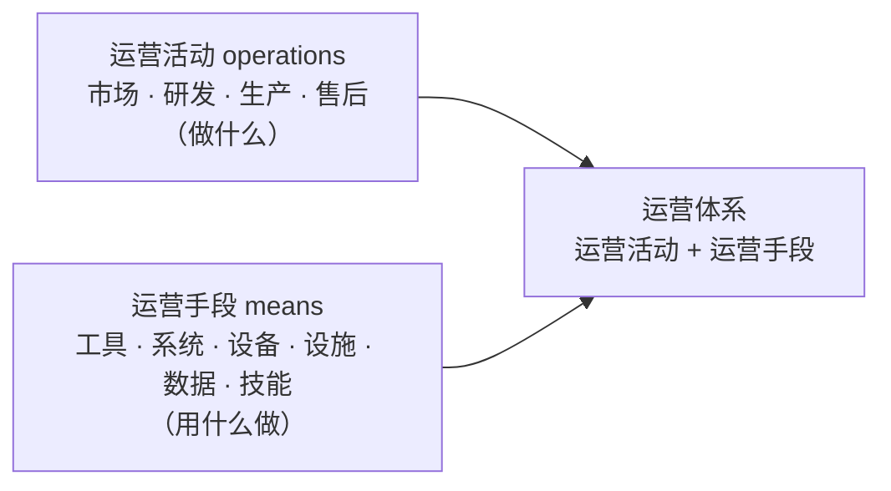
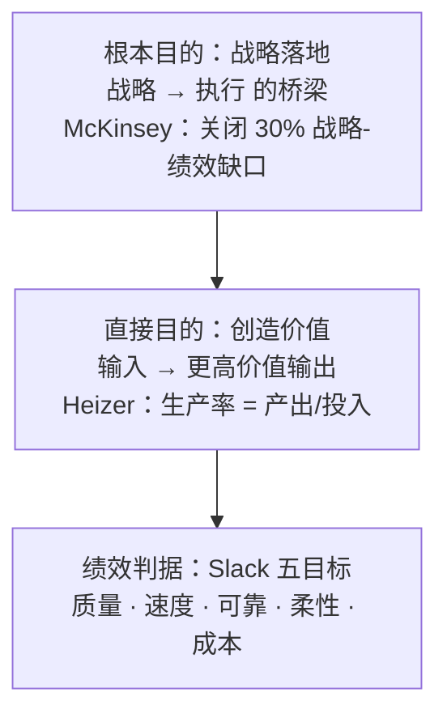
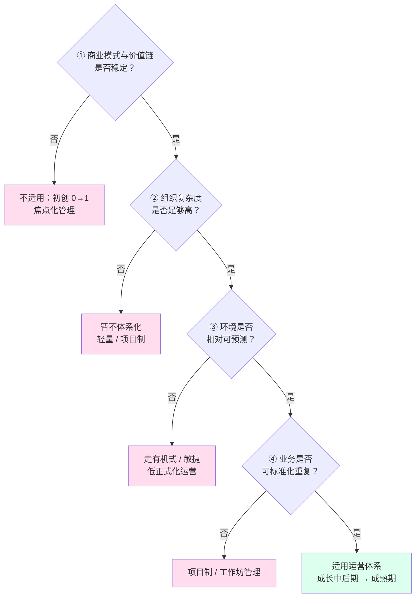
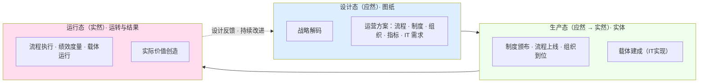
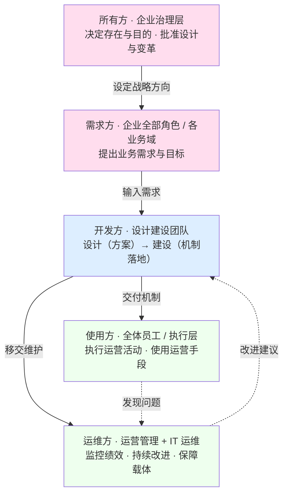

# 21 - 运营体系：从术语定义到产品化视角

> 本卡整理自一轮对话线（起点："什么是运营体系，查查标准或权威"），顺次覆盖：
> 运营体系的权威定义（四层来源）→ 拆解"运营"与"体系"各自的权威定义 → operations（英文）的权威定义 → 运营体系的构成（活动 + 手段）→ 运营体系的目的（两层）与绩效判据 → 适用与不适用的组织（四条判据 + 三个限定）→ 产品化视角（三态/五方）。
> 独立新卡，**未改动任何现有研究报告**。与 `17-设计与开发边界及三层基线治理对照卡`（目的→目标→需求 上游：战略目的企业持有，运营体系是承接执行的机制）、`05-工程概念精讲`（系统思维/系统工程）、`06-架构概念精讲`（体系与架构视角）、`14-产品数据精讲`（运营的产品数据载体）互参；教材侧见 [教材书第 14 章「治理」](教材书/14-第14章-治理.md)（治理把组织保持在目的上、战略目的企业持有）。

---

## 〇、内核一句话

**运营体系 = 运营活动（把输入转化为产品与服务的价值创造活动：市场、研发、生产、售后）+ 支撑运营的手段（工具、信息系统、设备、设施、数据、技能），以战略落地为使命的整体。**

- 它的**目的**是把战略落地为日常运转并持续优化价值创造（以质量/速度/可靠/柔性/成本五维为判据）
- 它的**适用边界**：只适用于"商业模式已稳定、组织复杂度已够高、环境相对可预测、业务可标准化重复"的组织；对"初创探索、动荡环境、极小规模、项目型定制"的组织则不应体系化

---

## 一、核心结论先说

查证结论：**"运营体系"不是一个有统一国家标准的规范术语**——GB 没有给出统一定义；它是横跨企业管理、ISO 管理体系、系统工程、信息化平台四个语境的实践性概念，权威来源各有界定，但拼起来能得到严谨的合成定义：

| 术语 | 权威定义 | 出处 |
|------|---------|------|
| **运营**（operations） | 把输入转化为产品与服务、创造价值的活动与过程 | Heizer & Render / Stevenson / APICS |
| **运营管理**（operations management） | 对运营活动的计划、组织、实施、控制与改进 | APICS / Cambridge / 中文通用定义 |
| **体系**（system） | 相互关联或相互作用的一组要素 | ISO 9000:2000/2015 |
| **运营体系**（operations system） | 运营活动与支撑运营的手段相互关联、相互作用构成的整体 | 上述合成 |

> **工程侧的关键区分**：ISO/IEC/IEEE 24765 中 operation 是"在预期环境中运行系统以执行其预期功能"——那是"运行"，不是业务意义上的"运营"；两义不同，讨论时应避免混淆。

---

## 二、术语分解："运营"、"运营管理"、"体系"

### 2.1 "运营"（operations）的权威定义

#### 2.1.1 词源

《辞海》："运"本义为移动、运行、运转（强调"转动起来、在动"）；"营"本义为谋划、营谋、管理（强调"加以经营管理"）。合起来即：**让（企业/业务）转动起来，并加以谋划经营管理**。

《现代汉语词典》：本为运输部门用语（亦称"营运"），指运用运输工具从事运输生产经营活动；后受英文 operation 影响泛化，泛指各项业务活动的运作。

#### 2.1.2 业务侧权威定义（运营管理领域，三系一致）

> **运营 = 把输入转化为产品与服务、创造价值的活动与过程。**

| 出处 | 定义原文 |
|------|---------|
| Heizer & Render《Operations Management》 | "the set of activities that creates value in the form of goods and services by transforming inputs into outputs" |
| Stevenson《Operations Management》 | "the management of systems or processes that create goods and/or provide services" |
| APICS Online Dictionary | "the planning, scheduling, and control of the activities that transform inputs into finished goods and services" |

历史脉络：西方学者曾有形产品生产叫 production/manufacturing、服务活动叫 operations，现统称 operations——"运营"天然涵盖产品生产 + 服务创造两端，且强调过程管理。

#### 2.1.3 工程侧义项（与"运营"区分）

ISO/IEC/IEEE 24765:2010 §3.1977（系统与软件工程词汇）第 3 义项：

> **operation = 在预期环境中运行一个计算机系统以执行其预期功能的过程**（the process of running a computer system in its intended environment to perform its intended functions）。

这对应中文的"运行"，是 IT 视角；GB/T 19000（ISO 9000 国标）同样没有单列"运营"词条，而以"运行（operation）"一词承载（"运行过程""组织运行所必需的设施"）。

#### 2.1.4 小结

运营的语义内核 = **使业务运行起来，并对其过程进行计划、组织、实施、控制（管理）——对象是产品生产与服务创造**。

### 2.2 "运营管理"（operations management）的权威定义

> **运营管理 = 对运营（价值创造）活动的计划、组织、实施、控制与改进。**

- **Cambridge Business English Dictionary**：*"The control of the activities involved in producing goods and providing services, and the study of the best ways to do this."*（对生产产品与提供服务活动的控制，及对其最佳方式的研习）
- **APICS 双重定义**：① 作为活动 = 对把投入转化为成品与服务活动的计划、调度与控制；② 作为学科 = 研究制造或服务组织有效规划、调度、使用与控制的领域
- **中文通用定义**：对运营过程的计划、组织、实施和控制，与产品生产和服务创造密切相关的各项管理工作的总称

### 2.3 "体系"（system）的权威定义

#### 2.3.1 ISO 9000 术语定义（中文世界最权威）

> **体系（系统，system）= 相互关联或相互作用的一组要素。**（ISO 9000:2000 给出，2015 沿用）

递进定义：

- **管理体系**：建立方针和目标并实现这些目标的体系
- **质量管理体系**：在质量方面指挥和控制组织的管理体系

要点：**"体系"与"系统"是英文 system 的两种译法**，"体系"是管理科学上的习惯译法，故"质量管理体系"即"质量管理系统"。

#### 2.3.2 中国工程界的狭义用法：体系 = SoS

系统工程/体系工程视角下，"体系"不再等于 system，而专指 **SoS（System of Systems，系统的系统）**——若干可独立运行的系统为达成更高目标松耦合联结、涌现出单一系统没有的能力。与"系统"的关键区别：

| 维度 | 系统 | 体系（SoS） |
|------|------|------------|
| 核心要素 | 结构 | 能力 |
| 联系特征 | 组元紧密联系 | 要素松散耦合 |
| 结构形态 | 集中控制、有层级 | 网状、开放边界 |
| 分析起点 | 从功能 | 从目标 |

#### 2.3.3 小结

"体系"的语义内核 = 一组相互关联要素构成的整体（system）；工程语境更窄，专指松耦合、面向目标能力涌现的"系统的系统"（SoS）。

---

## 三、运营体系的定义与构成

### 3.1 合成权威定义

> **运营体系 = 运营活动与支撑运营的手段相互关联、相互作用构成的整体。**

### 3.2 构成：运营活动 + 运营手段

> **运营体系 = 运营活动（做什么） + 支撑运营的手段（用什么做）。**

- **运营活动**（价值创造活动）：市场、研发、生产、售后、管理等——把输入转化为产品与服务
- **运营手段**（活动得以执行的前提）：工具（CAX、机床）、信息系统（ERP、OA、MES、PLM）、设备、设施、数据、技能

**归属判据（产品化三态口径，2026-08-30 统一）**：把运营体系看作产品，业务需求、合规要素、制度流程、IT系统及运行**都属于运营体系**——它们不是"属于/不属于"之别，而是运营体系作为产品在全生命周期三个状态（三态）的体现：

| 状态 | 属于 | 具体体现 |
|------|------|---------|
| **设计态**（应然·图纸） | 业务需求、合规要素、制度流程 | 需求定义要创造什么、合规划红线、制度流程以制度文本与流程文件存在 |
| **生产态**（应然→实然·实体） | IT 实现（系统建成） | 制度颁布、流程上线、组织到位、系统建成 |
| **运行态**（实然·运转） | IT 运行（日常运转） | 流程流动、制度执行、绩效度量、载体运行 |

**判定要点**：三态是完整链，缺一环都不算建成运营体系——单写制度或单建系统只到设计态/生产态，体系要在运行态真正转起来才算建成；同时运营体系还有"两种成分"视角：运营活动（做什么）+ 支撑运营的手段（用什么做），活动与手段是构成成分之分，不是属于/不属于之分；手段是活动存在的前提，没有 CAX、现代研发运营就不存在，手段不是活动附件。

**ERP 与 CAX 同属，角色不同**：

| | ERP | CAX |
|---|---|---|
| 支撑的运营域 | 采购 / 生产运营 | 研发运营 |
| 在运营中的角色 | 流程在其上运行的**载体** | 子活动（建模/仿真）的**作业工具** |
| 是否属于运营体系 | ✅ | ✅ |

差异在角色（载体 vs 工具）、在支撑的运营域，不在"属于/不属于"。（辨析过程：初稿曾用"CAX 不是活动"误推"CAX 不属于运营体系"——混淆了 operations（活动）与运营体系（活动 + 手段）两个概念，已修正。）

### 3.3 两种读法

"运营体系"可按两种读法理解，对应两种设计取向：

| 读法 | 视角 | 强调 | 适用设计取向 |
|------|------|------|-------------|
| **ISO 式（过程方法）** | 体系 = system | 运营活动与手段构成一条紧密关联的整体，强调"运营是一体的、可管理的" | 单一业务域内的精细化管理 |
| **SoS 式（体系工程）** | 体系 = SoS | 企业各业务域是可独立运行的活动与手段组合，松耦合联结、面向整体目标涌现能力，强调"跨域协同、开放演进" | 多业务域组合成整体运营能力 |

### 3.4 信息化形态

运营体系的运营手段在信息化语境下常表现为**数字化运营平台 / 运营管控平台**（ERP、OA、MES 等业务管理系统）：它们是承载运营流程的载体，属于运营手段。构建这些手段的活动（IT实现）即运营体系的生产态、保障其运行的活动（IT运行）即运行态，与设计态一起构成运营体系全生命周期（三态口径见 §3.2）。

---

## 四、运营体系的目的（两层）与绩效判据

### 4.1 直接目的：创造价值、提升生产率（运营管理学）

Heizer & Render：运营的职能就是把输入转化为更高价值输出，**通过转化创造价值**，以**生产率 = 产出/投入**为衡量——生产率提升是企业盈利与长期发展的唯一来源。

### 4.2 根本目的：战略落地的桥梁（operating model / McKinsey）

> **运营体系是战略与执行之间的桥梁（bridge）。** "没有运营体系的战略只是一张愿望清单——它描述了企业想达成什么，却没说清如何组织自己去达成。"战略执行在运营体系处"要么成功要么断裂"。

- **30% 绩效缺口**：表现优异的企业，战略潜能也有约 30% 未能兑现，症结大多在运营模式——运营模式是 CEO 可直接掌控、对绩效影响最深远的变量之一
- **四大成果**：清晰（资源权责对齐战略）、敏捷（决策与流程快）、人才（能力匹配未来）、协同（员工认同承诺）

中文管理文献同构表述："流程是价值创造的路径，运营是执行落地的保障"；运营体系承担"战略解码的桥梁"。

### 4.3 绩效判据：Slack 五目标

| 目标 | 定义 |
|------|------|
| 质量 Quality | 做对事（零差错、满足客户） |
| 速度 Speed | 做得快（需求提出到获得的时间最短） |
| 可靠 Dependability | 按时交付（兑现承诺） |
| 柔性 Flexibility | 能变（适应变化、个性化、推新品） |
| 成本 Cost | 做得省（低成本仍可盈利） |

五者构成沙锥模型（质量→可靠→速度→柔性→成本），企业按竞争策略取舍。

**口径限定**：五目标是衡量运营绩效（目的兑现与否）的尺子；评判者=客户与企业双方：质量/速度/可靠主要为客户感知，成本/柔性为企业自身口径，每维兼有内外两面。

### 4.4 目的层次图

一句话：**运营体系的目的 = 作为战略与执行之间的桥梁，把战略落地为日常运转，通过价值创造过程的持续优化（五目标为判据），系统性地兑现战略潜能。**

---

## 五、适用与不适用的组织（四条判据 + 三个限定）

### 5.1 核心判据（两条硬标准）

判断一个组织**是否需要**运营体系（最权威判据）：

1. **商业模式和价值链是否稳定**——根本前提；模式未跑通时建体系，只会拖死探索
2. **组织复杂度是否足够高**（职能细分度和层级数）——复杂度与协同成本，才让"体系"产生价值

两条同时满足，运营体系才是"需要"的；不满足，体系是负担。

### 5.2 适用的组织

| 维度 | 适用条件 |
|------|---------|
| 发展阶段 | 成长期中后期 → 成熟期（商业模式已验证、进入复制/精细化） |
| 规模与结构 | 组织复杂、多层级多职能、跨部门协作密集 |
| 环境 | 相对稳定可预测（Burns & Stalker：稳定环境适合高正式化的**机械式**组织） |
| 业务形态 | 高重复、可标准化、大流量（product-process 矩阵：批量/流水线/连续流程，高 volume 低 variety） |
| 竞争方式 | 靠效率、成本、可靠性与规模化交付 |

管理进阶路径：焦点化管理（初创）→ 职能化管理（成长）→ 体系化管理（成熟）→ 全流程梳理。

### 5.3 不适用的组织（或不该过早体系化）

1. **初创 0→1 期**：创新工作比重大，最有价值的是项目制和协同能力；"管理都是有成本的"，商业模式没跑通就建全组织会出问题。只需"焦点化管理"（管住钱、关键决策、重大任命）
2. **创新/探索型敏捷组织**：Burns & Stalker 明确指出动荡环境中高正式化会降低适应性、增加失败风险，应采**有机式**（低正式化）结构。重流程会把"注意力从结果转向合规、抑制实验探索、催生部门孤岛"
3. **快速扩张、需灵活应变的企业**：标准化流程带来僵化冗余，逆境中"化整为零"激活小团队灵活性更重要
4. **极小规模组织**：几个人不需要体系，体系本身成负担
5. **项目型/单件定制业务**：最低量最高品种、资源临时组织、流程不重复——运营管理理论明确此类走**项目制/工作坊管理**，而非重复性流程管理

### 5.4 三个关键限定

1. **所有组织都有"运营"，区别在于"是否值得体系化"**——任何组织都要把输入变输出，但小组织、探索组织用头脑和协调即可，成熟复杂组织才需要把运营"立成体系"。这是轻重问题，不是有无问题
2. **"不适用"精确说是"不适用僵化的、标准化的重型体系"**——运营体系本身可以设计成敏捷/柔性的，创新组织不是不要运营，而是不要重流程合规型运营
3. **判定随阶段迁移**——初创期不需要 → 成长期必须标准化沉淀可复制能力 → 成熟期体系化精细化；成熟期也须防"大企业病"对创新的抑制

### 5.5 适用边界判定图

---

## 六、产品化视角：三态与五方

把运营体系看作产品，它有自己的三态体现（设计/生产/运行）与五方（所有/需求/开发/使用/运维）。

### 6.1 三态体现

> **设计态 = 图纸（应然），生产态 = 实体（应然→实然），运行态 = 运转与结果（实然）。**

| 状态 | 本质 | 体现（以什么形态存在） |
|------|------|---------------------|
| **设计态** | 应然 | 运营方案文档：业务蓝图（业务整体怎么运转的概要设计，其余各项的总纲）、流程文件、制度文本、组织设计、指标体系、IT 需求 |
| **生产态** | 应然→实然 | 落地实体：颁布的制度、上线的流程、到位的组织、建成的系统 |
| **运行态** | 实然 | 日常运转：流动的流程、执行的制度、度量的绩效、运行的载体 + 实际交付的产品/服务 |

三态是循环不是直线：运行态持续反馈设计态（PDCA 持续改进），运营体系的设计没有终稿。与 ISO/IEC/IEEE 15288 同构——设计态≈概念+开发（6.4.1 业务或任务分析 → 6.4.5 设计定义）、生产态≈实现/集成/验证/确认（6.4.7~6.4.10）、运行态≈运行/维护（6.4.11~6.4.12）。

### 6.2 五方

运营体系作为产品，五方通常都在同一企业内部，按治理/经营/职能/执行/支持五个层级区分，而非按组织边界区分：

| 角色 | 是谁 | 在运营体系中的体现 |
|------|------|-------------------|
| **所有方** | 企业治理层（董事会/最高决策层） | 拥有运营体系的存在权与目的，批准设计与变革，对结果负责（问责） |
| **需求方** | 企业全部角色（市场/研发/生产/售后/管理等各业务域） | 各自提出业务需求：运营体系要支撑各自业务、达成什么目标 |
| **开发方** | 设计建设团队，含制度、流程、IT 开发等相关方（可内可外） | 把需求转成方案并建成机制 |
| **使用方** | 全体员工/执行层 | 日常执行运营活动、使用运营手段 |
| **运维方** | 运营管理团队 + IT 运维 | 监控绩效、发现偏差、持续改进；保障载体持续运行 |

---

## 七、参考文献

仅收录公开的标准、书籍、期刊论文与权威网络来源。项目内部文档（研习卡、教材书、仓库规范）为内部引用，见开头"来源对话线"互参说明，不列为参考文献。

### 7.1 标准与书籍（主表）

| 概念 | 标准出处 | 关键原文/位置 | 引用方式 |
|------|---------|--------------|---------|
| **体系 / 管理体系 / 质量管理体系** | ISO 9000:2000/2015 | 体系 = 相互关联或相互作用的一组要素；管理体系 = 建立方针和目标并实现这些目标的体系 | 直接引用（§2.3） |
| **运营管理（OM）** | Heizer & Render《Operations Management》 | "the set of activities that creates value in the form of goods and services by transforming inputs into outputs" | 直接引用（§2.1、§4.1） |
| **运营管理（OM）** | Stevenson《Operations Management》 | "the management of systems or processes that create goods and/or provide services" | 直接引用（§2.1） |
| **operation（工程侧）** | ISO/IEC/IEEE 24765:2010 §3.1977 | 在预期环境中运行系统以执行其预期功能 | 直接引用（§2.1.3） |
| **机械式 / 有机式组织** | Burns & Stalker《The Management of Innovation》（1961） | 稳定环境→机械式（高正式化）；动荡环境→有机式（低正式化） | 概念支撑（§5.2、§5.3） |
| **运营绩效五目标** | Slack, Chambers & Johnston《Operations Management》 | quality / speed / dependability / flexibility / cost | 概念支撑（§4.3） |
| **体系 vs 系统（SoS）** | 《工程实践中的体系与系统》（科技导报，2018） | 体系 = 系统的系统：松耦合、重能力、网状开放边界 | 概念支撑（§2.3.2） |
| **运营词源** | 《辞海》《现代汉语词典》 | 运 = 运行转动；营 = 谋划管理 | 概念支撑（§2.1.1） |
| **operating model** | MIT Sloan J. Ross（2006） | 为交付产品与服务所必需的业务流程集成与标准化程度 | 概念支撑（§4.2） |

### 7.2 权威网络来源

| 来源 | 内容 |
|------|------|
| [APICS Online Dictionary（operations management）](http://www.apics.org/docs/default-source/principles/operations-management-foundations.pdf) | 运营管理 = 计划/调度/控制转化活动（活动定义 + 学科定义） |
| [McKinsey《What is an operating model》](https://www.mckinsey.com.br/en/our-insights/what-is-an-operating-model) | operating model = 战略执行的桥梁；12 要素；四大成果 |
| [McKinsey 未来组织：12 要素运营法则（中文）](https://www.mckinsey.com.cn/%E6%9C%AA%E6%9D%A5%E7%BB%84%E7%BB%87%EF%BC%9A%E9%BA%A6%E8%82%AF%E9%94%A912%E8%A6%81%E7%B4%A0%E8%BF%90%E8%90%A5%E6%B3%95%E5%88%99/) | 运营模式驱动四大成果：权责清晰/决策敏捷/人才专业/协同高效 |
| [Cambridge Business English Dictionary](https://dictionary.cambridge.org/us/dictionary/english/operations) | 运营管理 = 对生产产品与提供服务活动的控制 |
| [中欧国际工商学院（为什么从头到尾都是总经理签字）](https://cn.ceibs.edu/emba/student-view/25750) | 是否需要体系的两条判据：商业模式稳定 + 组织复杂度；焦点化→职能化→体系化进阶 |
| [华中大 MBA 大讲堂（胡云峰）](http://mba.hust.edu.cn/info/1043/1857.htm) | 运营管理五大要素（战略/流程/组织/绩效/信息化），流程是核心 |
| [城市轨道交通运营指标体系 GB/T 38374-2019](https://wap.cnki.net/qikan-DZBH202103003.html) | GB 层面无统一"运营体系"定义，只有行业性标准 |
| [环境保护设施运营组织服务评价 GB/T 38221-2019](http://www.bozrz.com/upload/files/2025/09/18/11173152256.pdf) | 同上，行业性"运营"落地 |
| [百度百科·运营](https://baike.baidu.com/item/%E8%BF%90%E8%90%A5/5144034) | 运营 = 计划/组织/实施/控制，与产品生产和服务创造相关的管理工作总称 |
| [百度百科·运营管控平台](https://baike.baidu.com/item/%E8%BF%90%E8%90%A5%E7%AE%A1%E6%8E%A7%E5%B9%B3%E5%8F%B0/7682836) | 运营体系信息化形态：业务管理信息化的运营管控层 |
| [Product-process matrix / process types（ecampusontario）](https://ecampusontario.pressbooks.pub/opsmgmt/chapter/5-4-decisions-in-process-management-process-choice/) | volume-variety：项目→单件→批量→流水线→连续，标准化递增 |

---

*卡片创建：2026-08-30（独立新文件，未修改 00~20 号卡的既有内容）。*
*更新：2026-08-30 归属判据改按产品化三态口径——业务需求/合规要素/制度流程=设计态、IT实现=生产态、IT运行=运行态，都属于运营体系（对齐培训课件统一思路）；§6.2 开发方明确含制度/流程/IT 开发等相关方、需求方改为企业全部角色（各业务域）。*
