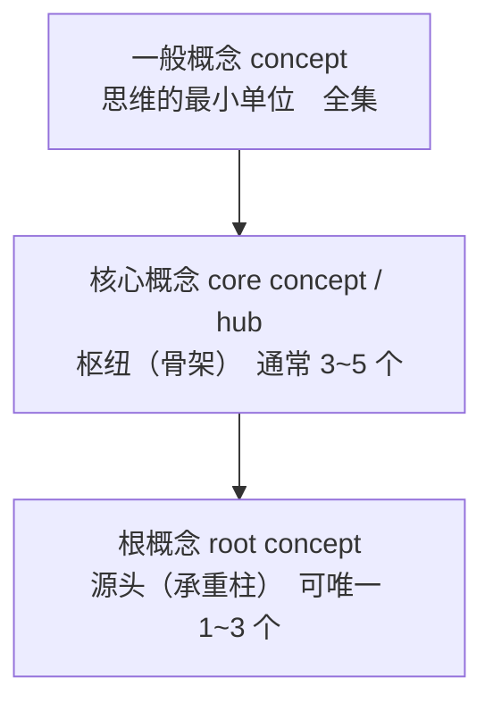
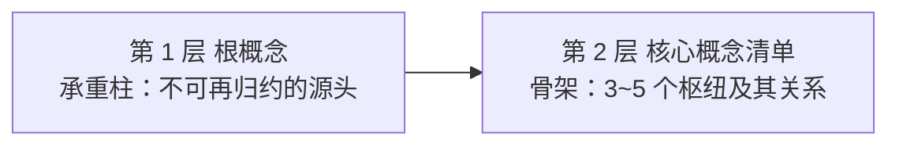
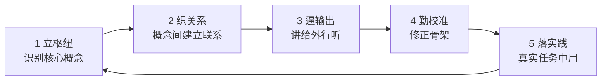
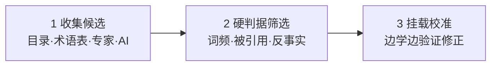
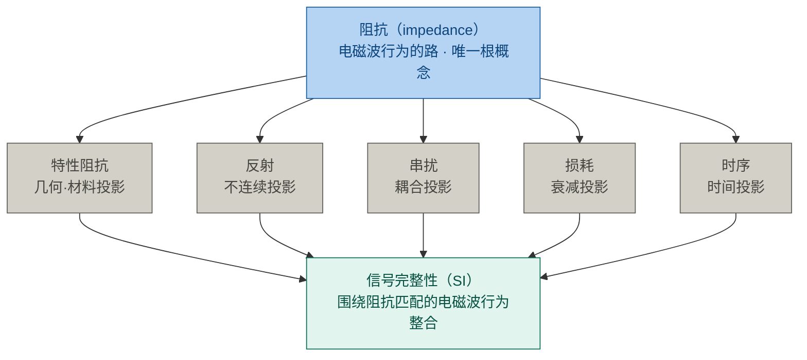
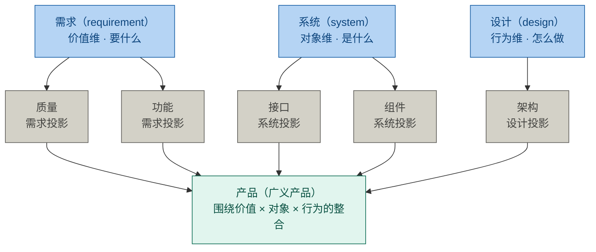
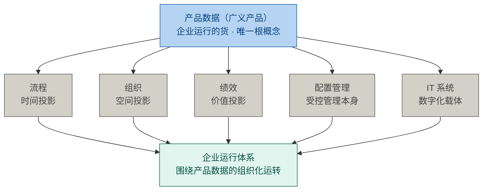
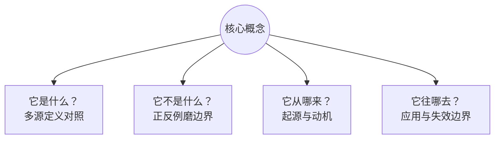

# 第1章 概念体系能力：学习能力的杠杆

> 本章主题：概念体系能力（学习能力的杠杆）/ 三层概念体系 / 杠杆模型 / 压缩学习 / 五环模型 / 识别枢纽 / 四问法
> 英文来源：conceptual ability / hub / root concept / concept
> 演示对象：架构（architecture）——全书被误解最深的词之一

---

## 1.1 章首 · 误解现场

同一周，两个会议室，两场会。

**冰链科技**——造 M3 医疗温控箱的**工程团队**——在开二代会：

文正先说："架构就是 M3 的模块边界怎么划——**产品架构**。"

水忠皱眉："我说的是**硬件架构**——传感器、主控、通信怎么布。"

董勐摇头："云端才是**系统架构**——服务边界、数据所有权。"

李旭插话："你们说的架构，测试到底按哪个拆用例？"

逸人敲桌："架构不定，物料清单和批次追溯都没法跟着定。"

五个人，五句话，五个"架构"。

**恒信集团**——做合同审批系统的**设计团队**——也在开改造会：

黄程抱怨："我们公司的**架构**不行，审批链跨三个部门扯皮。"

万辉纠正："你们说的都不是架构。系统架构是服务边界、数据所有权。"

小白接话："架构定了，前后端接口才好按它对齐。"

玉杰追问："那部署架构呢？怎么上线不炸？"

徐漾放下笔："等一下，'架构'在我们嘴里是五件事——先各自说清你指的是哪一件。"

五个人，五句话，五个"架构"。

一个在硬件工程的世界，一个在软件设计的世界。**同一个词，两个世界，都是五张脸。** 这一幕每天都在发生——因为问题不在人，在**词**。

可是，把词当场对齐了，就真的懂"架构"了吗？十个人就算同意"架构"指系统架构，你让他们各答四问——它是什么、不是什么、从哪来、往哪去——多半还是答不齐。**词可以当场对齐；概念，要花功夫才能真正拥有。**

而"真正拥有概念"的能力，是有名字的——**概念体系能力**：以概念为单位的压缩与组织能力，是学习能力的杠杆。

这本书的第一课，教的不是某个概念，而是一套能力。它回答三个更根本的问题：为什么这套能力值得花功夫练？它靠什么起作用？怎样才算真正拥有一个概念？这套能力里，读者要记的是一把四问的尺子；它展开成一把九格的尺子（§1.7.5），是给作者和审稿人查全用的。

---

## 本章问题

读完本章，你应该能回答：

1. 什么是概念？为什么说概念是一个三层包含的体系？核心概念和根概念各是什么？
2. 什么是概念体系能力？它由哪四个构件组成？怎么检验它强不强？
3. 为什么说概念体系能力是学习能力的杠杆？杠杆模型的四部件是什么？
4. 为什么"杠杆的第一性是方向"？方向分哪两层？方向盘是哪个子能力？
5. 压缩学习实验证明了什么？为什么"先立枢纽"会越学越轻松？转述为什么是压缩测试？
6. 掌握一个专业领域的五环模型是什么？为什么"会用才算掌握"？
7. 怎么识别一个领域的核心概念与核心原理？三步识别法是什么？怎么进一步辨出其中的根概念？
8. 真正理解一个概念的四问法是什么？为什么"能答全四问才算拥有"？
9. 概念从哪来、为什么是共识不是真理？

---

## 开篇 · 本章枢纽

这一章发的不是概念，是**能力**。先把整章的枢纽立起来：

- **概念是一套三层包含的体系**——一般概念（全集，管"可界定"）⊃ 核心概念（骨架，管"连接多"，通常 3~5 个）⊃ 根概念（承重柱，管"是源头"，可唯一 1~3 个）；层级越深、判据越严、数量越少；
- **概念体系能力是学习能力的杠杆**——学习产出 = 根概念能力（方向）× 概念体系能力（力臂）× 学习投入（施力）× 实践场景（支点）；四个部件是乘号，杠杆的第一性是方向；
- **能力有可训练路径，也有可检验判据**——五环模型是生产线，四问法是检验尺；能答全四问才算拥有一个概念，只会背定义只是"见过"。

---

## 1.2 第一部分 概念体系：三层包含，判据逐层收严

### 1.2.1 概念：思维的最小单位

"工程""需求""质量""架构""评审""治理"——这些词有什么共同点？它们都是各自领域的概念，而概念，是思维的最小单位。

> **概念（concept）**：对一类对象共同特征的抽象概括，思维的最小单位。判据：可指称（一个词或短语）+ 可界定（内涵与外延）。依据：ISO 1087-1——"通过对特征的独特组合而形成的知识单元"。概念与术语的区别（能指 vs 所指），见 §1.7.4 病二。

**概念是从哪里来的？** 三种出生方式，多数不是天才发明的：

| 方式 | 含义 | 例子 |
|------|------|------|
| 创造（invented） | 人造的工具，无自然界对应物 | 变量（笛卡尔/韦达）、图灵机 |
| 发现（discovered） | 规律本来就在，被揭开 | 万有引力、能量守恒 |
| 凝结（distilled） | 共同体长期实践经验的结晶被固化 | baseline（源自军品工程实践，后由 ISO 10007 固化） |

**baseline 不是哪位科学家发明的。** 它来自军品工程"版本失控、改坏了找不回来"的惨痛教训——工程共同体逐步摸索出"受控快照"的做法，最后才被标准组织写成条文。（军品起源是工程史的一般叙述，ISO 10007 条文本身不讲述这个词的来历。）无数无名工程师，用教训"酿"出了这个概念。

概念不是孤立的词，而是一张网。这张网不是平的——它有骨架、有承重柱。下面看它的结构。

### 1.2.2 三层体系：一般概念 ⊃ 核心概念 ⊃ 根概念

一个领域里的概念，不是一堆平级的名词，而是一套**三层包含的体系**：



| 层级 | 名称 | 管什么 | 判据 | 数量 |
|---|---|---|---|---|
| 全集 | 一般概念 | 可界定 | 可指称 + 可界定 | 全部 |
| 骨架 | 核心概念 | 连接多 | 反事实检验 + 被引用度 + 前置数 | 3~5 个 |
| 承重柱 | 根概念 | 是源头 | 原子性 + 生成性 + 不可替代性 + 递归性 | 1~3 个 |

三个关键性质，必须一起理解：

**第一，递进包含。** 根概念 ⊂ 核心概念 ⊂ 一般概念。每个根概念必然是核心概念（被全域依赖），每个核心概念必然是一般概念（可指称、可界定）；反过来都不成立——大多数概念、甚至大多数核心概念，都不是根。

**第二，判据逐层收严。** 一般概念只要求"能指称、能界定"，领域里绝大多数词都满足；核心概念加收"枢纽性"——反事实检验（去掉它领域不成立）+ 被引用最多 + 前置最少；根概念再加收"源头性"——不可再向下归约、其余由它导出、领域因它成立、多层反复生效。一句话：**能界定 → 是概念；被依赖多 → 是核心概念；依赖它的一切、它却不依赖域内任何概念 → 是根概念。**

**第三，视角不同，不冲突。** 三者不是"重要性"的等级，而是"网络地位"的刻画：核心概念（hub，轮毂）管"连接多不多"——辐条都连到轮毂；根概念（root，植物的根）管"是不是源头"——营养从根流向枝叶。

一个概念可以连得多又是源头，也可以连得多却非源头。"治理"很重要、被反复引用，但它本身由"对什么治理"定义——是派生的。**"重要"和"源头"是两个维度。** 质量也是这样：它在产品开发里被到处引用（核心概念），但它是需求/系统的派生（不是根概念）。

> **领域边界注记**：层级判定绑定领域边界。同一概念在不同领域，层级可变——先定领域，再定层级。

### 1.2.3 核心概念：骨架（枢纽）

三层体系里的中间层，是整张网最先要抓的——**核心概念，常被直接称作枢纽**。

> **核心概念（core concept / hub）**：概念网络中处于枢纽地位的概念——解释领域内其他概念都要用到它，而理解它自己只需要很少前置知识。判据：反事实检验 + 被引用度 + 前置数（＝理解它所需的前置知识量，越少越是枢纽）。

比如你要解释"符合性"，得先解释"需求"；要解释"架构"，得先解释"系统"。"需求""系统"被别的概念反复调用，自己却几乎不需要前置——它们就是枢纽。

核心概念在专业学习中承担六个功能，每一件都是"离了它，别的都立不住"：

| 功能 | 含义 | 类比 |
|------|------|------|
| 词汇表 | 概念是领域内"说话的方式"，没有共同词汇就无法精确沟通 | 学外语先学字母与语法 |
| 构建块 | 人的知识以概念网络存储，新知识必须挂载到已有概念上才有意义 | 乐高基础件 |
| 骨架 | 学科是有层级、有关系的体系，概念决定知识如何组织 | 地图的经纬度与主地标 |
| 公理 | 领域内论证从概念定义出发，定义含糊则推导皆飘 | 数学公理、游戏规则 |
| 迁移引擎 | 概念知识属深层结构，可跨场景迁移；事实知识绑定场景 | "输入—处理—输出"看遍所有系统 |
| 标尺 | 概念精确才能识别概念偷换与术语忽悠 | 分得清"需求"与"期望" |

**枢纽决定了领域里所有讨论的语言、边界和推理逻辑。** 不研究它们，你学到的只是碎片化的招式；研究透它们，你才拥有可迁移的体系。**核心概念变动的速度，远慢于外围知识。** 地基打得越早，复利越大；地基打错了，之后每盖一层都在错上加错。

### 1.2.4 根概念：承重柱；基本原理：法则的源头

比核心概念更深一层，是根概念——整张网的**承重柱**。

> **根概念（root concept）**：领域中不可再向下归约的源头概念，其余概念（含核心概念）都由它导出。四条判据：**原子性**（不可由域内其他概念定义）+ **生成性**（其余概念从它派生）+ **不可替代性**（去掉它领域崩塌）+ **递归性**（多个抽象层级反复生效）。

根概念 ⊂ 核心概念（承重柱 ⊂ 骨架），可唯一 1~3 个。判定方法不是靠感觉，要用判定矩阵 + 演绎链——那是第五部分的事。现在先记住它的位置：**核心概念管"连接多不多"，根概念管"是不是源头"。**

概念（节点）有层级，原理（边）同样有层级。概念之间反复出现的规律——如"基线一经批准，变更须走受控流程"——是**核心原理**（枢纽命题）；再往上，还有**基本原理**（root principle，法则的公理层）：领域中不可再被推导的法则，是根概念（母体）的语义内蕴被展开成的显式命题。

> 术语注：一个概念是否含子概念，先讲父概念的内涵、把子概念作为其中一项，再讲子概念的内涵——本章第一部分正是这样做的。**"根概念"四标准、"基本原理"（root principle）为本方法论命名，不是任何标准的条文；"概念体系能力"是本书的操作化命名，源出 Katz 1955 的概念技能研究（见参考文献 R-30）。**

一句话收束这一部分：**一般概念是思维的最小单元（全集）；核心概念是领域骨架的枢纽（管"连接多"）；根概念是领域不可再归约的承重柱（管"是源头"）。学习先抓根，再展骨架，后填一般概念。**

---

## 1.3 第二部分 概念体系能力：学习能力的杠杆

### 1.3.1 概念体系能力：不是单点，是四构件

前面讲了概念的三层体系。现在讲把握这套体系的能力——**概念体系能力**（conceptual ability，简称"概念能力"）。

> **概念体系能力（conceptual ability）**：以概念为单位的压缩与组织能力——识别枢纽 × 织关系 × 迁移 × 辨边界。判据：转述测试 + 辨伪测试。

它不是一个单点技能，而是四个构件：

| 构件 | 做什么 | 反面对照 |
|------|--------|---------|
| 识别枢纽 | 抓出决定其余部分的核心概念 | 被细节淹没，分不清主次 |
| 织关系 | 把概念连成有结构的网络 | 孤立记点，学一个丢一个 |
| 迁移 | 把网络搬到新场景 | 绑定场景，换个题就失灵 |
| 辨边界 | 用反例划清适用与失效范围 | 只举正例，不知何时失效 |

四个构件合起来，可以用两个测试检验：

- **转述测试**：陌生领域，三五句话讲清楚——讲不清，说明结构没成型（织关系没到位）；讲到卡壳处，说明边界没划清（辨边界没到位）。**转述同时检验织关系（结构）与辨边界（卡壳处）两构件**；
- **辨伪测试**：能举反例划清边界——举不出反例，说明只见过正例（辨边界没到位）。

> 概念能力强，不是"懂得多"，而是**组织得好**：同样的信息量，有人堆成一盘散沙，有人织成一张网。判断能力强弱，看的是这张网，不是信息量。

概念体系能力有一个子能力，专管方向——**根概念能力**（root-concept ability）：识别、验证并运用根概念的能力。它的判据很硬：**20 分钟对一个陌生领域给出"根概念 + 核心概念清单及其关系"，并能用判定矩阵与演绎链为每个候选辩护。** 方向盘管的是"根"（源头），不是整副骨架——这个概念，下一节就用到。

### 1.3.2 杠杆模型：四个部件、三个限定

为什么要单独立一个词叫"概念体系能力"？因为它有一个别的能力没有的位置——**它是学习能力的杠杆**。

**杠杆**是个物理意象：用一根杆撬动重物，小的投入换来大的位移。概念体系能力也这样：压缩学习实验里，先花 20 分钟立枢纽，换来整张学习网络数百轮的优势扩散——投入产出比极高。完整写出来，学习产出由四个部件共同决定：

> **学习产出 = 根概念能力（方向）× 概念体系能力（力臂）× 学习投入（施力）× 实践场景（支点）**

- **方向——根概念能力**：先抓承重柱、后展骨架。方向错了，后面全是白费；
- **力臂——概念体系能力**：把枢纽织成网、搬去新场景、划清边界。力臂越长，同样的力气撬得越多；
- **施力——学习投入**：时间、注意力、练习量。没有施力，力臂再长也是零产出；
- **支点——实践场景**：概念要落在真实任务上才有支点。没有支点，杠杆只是根棍子，撬不动任何东西。

这四个部件正好把概念体系能力的四构件分成两股：识别枢纽（尤其深化的根概念识别）就是方向盘，归**方向位**；织关系、迁移、辨边界三构件构成**力臂**。方向 × 力臂，合起来正是完整的四构件——不重叠，也不遗漏。

四个部件是**乘号**关系，不是加号：任何一个为零，整体归零。而"杠杆"这个说法本身，自带三个限定，每一限定都对应一个部件：

| 限定 | 物理对应 | 方法论对应 | 含义 |
|------|---------|-----------|------|
| 杠杆是双向的 | 放大的是力，不分方向 | 勤校准 | 枢纽选错则放大错误——学得越快，偏得越远 |
| 需要支点 | 无支点只是根棍子 | 落实践 | 概念不落真实任务，力臂悬空撬不动任何东西 |
| 自己不发力 | 杠杆只放大施力，不产生力 | 学习投入 | 没有投入，力臂无穷长也是零产出 |

### 1.3.3 杠杆的第一性是方向

四个部件里，最根本的不是力臂，是**方向**。为什么？

因为杠杆的其他三个部件都在"放大"，只有方向在"指路"。**放大没有方向感**：方向对了，力臂越长撬得越多；方向错了，力臂越长、撬得越欢、偏得越远。压缩学习实验里，枢纽优先组的全部优势，正来自"先识别枢纽"这一下——其后 800 轮正式学习，都只是这个方向上的展开。

**方向不是一次选定的，而是两层递进**（先抓承重柱、后展骨架）：



承重柱定错了，骨架再漂亮也是空中楼阁——领域边界不同，根就不同（见第五部分）。**根概念能力 = 方向盘 = 把两层都定准的那一下。**

这就是本章标题的意思：**概念体系能力是学习能力的杠杆，而杠杆的第一性是方向。** 所以整本书反复强调"先立枢纽"——不是在教你一个技巧，是在教你把方向盘握住。

一个澄清，防止误读：

- **对内（学习能力）**：概念体系能力是学习引擎的入口与放大器，不是全部引擎。五环的每一环都在训练它的四构件，但它主导的是前两环——立枢纽（识别枢纽）、织关系（织关系）；第三、四、五环（逼输出、勤校准、落实践）还要靠另三股力量支撑：**输出检索**、**元认知校准**、**动机坚持**。概念体系能力决定学得多快、看得多深；后三者决定学不学得动、学不学得远。

### 1.3.4 有框架 vs 无框架：两条学习路径

"先立概念"和"只背结论"的差别，是理解整套方法论的关键对照：

| 先学核心概念（先立骨架） | 只背结论和招式（无框架） |
|---|---|
| 知识有挂载点——新概念迅速入网 | 碎片化记忆——学完就忘 |
| 举一反三——跨场景自由迁移 | 绑定具体场景——换个题就失灵 |
| 能辨伪——识别概念偷换 | 易被带偏——分不清概念边界 |

**先立骨架再填血肉，会越学越轻松；先切入细节，会越学越累。** 这不是经验之谈——第三部分的压缩学习实验，证明了这一点。

**为什么在 AI 时代尤其重要**：记忆与信息处理已经外包给机器，人剩下的稀缺能力，正是概念性的——压缩、组织、迁移、辨伪。机器比你记得多，但它不替你"理解"。

回看章首那两场会：工程团队和设计团队，十个人对"架构"各说各的，表面是词没对齐，深处是每个人脑子里的概念网络各自缺了一根关键的枢纽。**掌握概念不到位，连讨论的前提都立不起来。** 这一章教的能力，就是让这种事不再发生。

---

## 1.4 第三部分 压缩学习：杠杆为什么成立

上一部分说"先立枢纽"是杠杆的方向。凭什么？这一部分给出科学证据：2026 年，北京大学团队的一项研究，用实验证明了"枢纽优先"为什么对。

### 1.4.1 高手与普通人的差距，在"压缩"

2026 年，北京大学心理与认知科学学院等团队在《自然·通讯》发表了一项研究。它给出了一个反直觉的答案：**高手和普通人的差距，不在于记性好，而在于擅长"压缩"——把全量信息转化成关键信号。**

> 术语注：这是本书对实验的读法。实验直接测量的是"枢纽优先的知识结构更容易掌握"（§1.4.2）；从"结构更易学"引申到"高手与普通人的差距在压缩"，是本书的一步引申——它经得起检验，但不是论文的原话。

经验医生把成千上万种疾病的知识，压缩成几个关键信号；资深调查记者在堆成山的文件里，只盯着"异常"的部分。他们都在做同一件事：压缩学习。

### 1.4.2 实验：人脑偏爱有枢纽的结构

团队设计了几类结构相同、但连接方式不同的人工知识网络，让被试学习。结果很清楚：**少数枢纽占据大量连接的网络（无标度网）最好学；均匀对称、没有主次的结构反而难掌握。**

另一个实验更有说服力。同一批知识，一组先学枢纽再学细节（枢纽优先），一组先学边缘再学枢纽（边缘优先），还有一组随机学。进入完全相同的正式学习后，**枢纽优先组的优势随时间越来越大，而且扩散到整张网络**——包括那些从没直接学过的纯细节节点。

脑成像也印证了这一点：枢纽优先的学习者在大脑里维持着更稳定的知识结构表征；先学边缘的人，早期也有表征，但迅速衰减。**人脑不是存储器，是压缩机器。** 先搭建框架，新信息只需判断"挂在框架哪个位置"，越学越轻松；先切入细节，后期积压太多零散节点，整合不动，越学越累。

### 1.4.3 三步：把"压缩"用到自己身上

研究给了我们一个可以直接用的三步法：

1. **找到枢纽**：学任何新东西前，先花 20 分钟找枢纽节点——翻书目录、读百科开头、问 AI、问行家都行。例：《思考，快与慢》的枢纽，是系统一、系统二、偏见。
2. **建立联系，填充细节**：先弄清枢纽之间的关系，再学细节。关系没通，细节学一个丢一个。
3. **转述**：把学到的东西讲给完全外行的人听，三五句话讲清楚，就是压缩成功。**转述是"压缩测试"**——它强迫大脑把散落信息重新组织成有骨架的结构。费曼技巧的机制，正是压缩学习。

学习不是做加法（获取更多信息），也不是做减法（减去不重要部分），而是**做除法**——先搭好四梁八柱，之后输入再多信息，看一眼就知道该存放在哪里，结构只会更坚固，不会变乱。

### 1.4.4 一句冷静的话

论文也有它的边界。实验用的是抽象的知识网络，真实领域（教科书、标准、行业惯例）的结构复杂得多；**"怎么识别真实领域的枢纽"仍是手艺活**，论文没有替你解决——这正是第五部分要做的事：三步识别法 + 判定矩阵，就是它的显式工具。另外，别把"框架形成后表征更稳定"过度引申成"框架不可改"——框架可改，见第四部分勤校准。

---

## 1.5 第四部分 五环模型：把能力炼出来的生产线

### 1.5.1 掌握线：会用才算掌握

先说"掌握"是什么意思。教育学界有一个公认的认知目标阶梯——布鲁姆分类学：**知道 → 理解 → 应用 → 分析 → 评价 → 创造**六级。

大多数人的学习，停在"知道"和"理解"：能复述，能听懂，考试能过。但换个场景，就用不出来。**掌握线划在"应用"之上——会用才算掌握。** 你背得出"质量＝特性满足需求的程度"，不算掌握质量；你拿着它评一份验收标准、判断一次分歧算不算质量问题，才算掌握。

### 1.5.2 五环：一条把知识推到掌握线的生产线

掌握五环模型，是一个循环。每转一圈，骨架更准、网络更密、输出更顺：



| 环节 | 做什么 | 为什么（依据） |
|------|--------|----------------|
| 1 立枢纽 | 学新领域前先花 20 分钟识别枢纽概念 | 压缩学习：枢纽优先的优势扩散全网络；认知负荷最低 |
| 2 织关系 | 弄清枢纽间关系（包含/依赖/对立）再填细节 | 知识是网络不是列表；记忆靠连接检索；细节挂在关系上才有意义 |
| 3 逼输出 | 三五句话讲给外行、写成文档、做题、教别人 | 测试效应：检索比重读记忆更强；输出暴露认知缺口 |
| 4 勤校准 | 随时准备推翻自己：枢纽选错、关系画反就改 | 概念转变：错误概念须被更准确解释主动替换；专家与新手差距在骨架准确性 |
| 5 落实践 | 在真实任务中用：做项目、审文档、解真问题 | 惰性知识：不拿来解决问题的知识是死的；技能＝概念结构×情境经验 |

**掌握 = 用结构消化信息，用输出验证结构，用实践淬炼结构。** 学习不是把知识装进脑子，而是让脑子长出一棵能结知识的树。

### 1.5.3 五环，就是概念体系能力的训练流水线

五环是五件事：**立枢纽 → 织关系 → 逼输出 → 勤校准 → 落实践**。概念体系能力不是天生的，是练出来的——怎么练？五环模型本身就是那条流水线，四个构件在五环里各就各位：

- **识别枢纽** → 第 1 环"立枢纽"：概念体系能力的第一个构件，就是五环的第一步；
- **织关系** → 第 2 环"织关系"：把概念连成网，正是织关系构件；第 3 环"逼输出"讲不清，说明结构没成型，也是织关系没到位；
- **辨边界** → 第 3 环"逼输出"：讲给外行听，讲到卡壳处，就是边界没划清的地方；第 4 环"勤校准"：用反例推翻旧骨架，也是辨边界；
- **迁移** → 第 5 环"落实践"：换场景用，正是迁移构件。

所以五环不是五件事，是**概念体系能力的四构件在循环里转**。每转一圈，四构件都更准一点——这是概念体系能力最实在的训练路径，也是"能力是练出来的，不是天生定死的"这句话的操作版。

### 1.5.4 校准的依据：概念是共识，不是真理

五环的最后一根柱子，是第 4 环"勤校准"。它凭什么立得住？因为**概念是共识，不是真理**。

化学的"燃素"、物理的"以太"，都曾是各自时代的核心概念，后来被推翻。库恩把它叫做"范式转换"——**每个时代的枢纽清单，是那个时代认知的天花板，不是终点。**

所以，学核心概念 = 以最小成本继承共同体几百年的最大公约数智慧；但它是共识，不是真理——**枢纽是起点，不是天花板**。这也正是第 4 环"勤校准"的意思：连领域公认的枢纽，都可以怀疑、修正。

对握方向盘的概念体系能力来说，这条尤其要紧：**方向不是一次定死的，要一路校准。** 你今天立的枢纽，明天可能被证明是错的——那不是失败，是杠杆在正常纠偏。枢纽清单是活的，方向盘就永远是活的。

---

## 1.6 第五部分 识别枢纽：握住方向盘

### 1.6.1 两个层级：概念是节点，原理是边

找枢纽，先分清两个层级：

- **核心概念 = 节点（名词）**：领域的"词汇"，如需求、配置、基线、版本。
- **核心原理 = 边/规则（命题）**：概念之间反复出现的规律，通常用"当……必须……""……取决于……"表达，如"基线一经批准，变更须走受控流程"、"验证以规定需求为参照"。**原理是更高级的枢纽——掌握原理，概念自动串联。**

原理也有层级：核心原理之上，是基本原理——原理侧的源头（见 §1.2.4）。

### 1.6.2 三步识别法

找核心概念（枢纽），有三条路，合成三步：



**第一步：收集候选（借现成的标尺，20 分钟）。** 领域共同体已经帮你压缩过，直接"抄"：

| 来源 | 为什么有效 |
|------|-----------|
| 教材目录/章节标题 | 好教材的顺序本身是枢纽优先的（先基础后应用） |
| 专业术语表 Glossary | 共同词汇的浓缩，出现即被共同体认可 |
| 课程大纲/综述论文 | 专家设计并经多年检验；综述是高手压缩成的"地图" |
| 问 AI/问专家 | 直接要"10 个核心概念及其关系"，再交叉验证 |

收集阶段宁多勿少：判据要求"20 分钟给出 3~5 个核心概念"，那是收敛后的答案口径；收集时先要"10 个"，多出来的正好用来交叉验证、挂载校准。

**第二步：硬判据筛选（用枢纽的定义验证）。** 三条硬指标：

- **词频**：领域文本里被反复提到的名词，多半是枢纽；**词频是判据里"前置数"在识别场景的可操作代理**——一个概念被反复提及，往往说明它解释别的概念用得多、自己却几乎不需要前置。
- **被引用度**：统计概念定义中被引用的其他概念，被引用最多者最基础——比如"需求"的定义，被整个质量体系引用；
- **反事实检验**：问一句"如果这个概念/原理不存在，这个领域还成立吗？"经济学少了"供需"，整个框架就塌了——它是枢纽。反事实检验是三条里最狠的一条。

**第三步：挂载校准（让骨架自己浮出来）。** 每学一个新概念，问一句"它挂在哪个枢纽下？"挂不上去，说明枢纽清单有漏洞。清单是活的——随理解加深增删。**专家与新手的区别，不是清单长度，而是清单准不准。**

### 1.6.3 进阶：判定矩阵与演绎链

三步识别法给出的是核心概念清单（骨架）；要辨出其中哪几个是根概念（承重柱），还要过判定矩阵与演绎链——根概念 ⊂ 核心概念，这正好对应第一部分的包含关系。

识别根概念不能靠感觉，要用两件可审计的工具：**判定矩阵**（横向打分）与**演绎链**（纵向论证）。

**判定矩阵**：四标准（原子性 / 生成性 / 不可替代性 / 递归性）× 候选概念，逐格打分并附证据：

| 候选 | 原子性 | 生成性 | 不可替代性 | 递归性 | 判定 |
|------|--------|--------|-----------|--------|------|
| 候选 A | ✅/⚠️/❌ + 一句证据 | …… | …… | …… | 根 / 派生 / 子类 |

**演绎链**：把结论写成可审计的论证链——每个前提（P）附出处，结论（C）由前提逐条推出：

```
P1: 候选 = 三步识别法收集的候选清单（§1.6.2）
P2: 根概念 = 不可再归约的源头概念，四标准判定（§1.2.4）
P3: 判定证据 = 标准族 / 工程现实（可核验）
P4: 候选 X 通过四标准判定矩阵（见上表）
——→ C: X 是该领域的根概念
```

> 演绎链的意义：把"我觉得是"变成"因为 P1、P2、P3、P4，所以是"——每一环都可以被反驳、被替换，结论因此可辩护。这正是根概念能力判据里的"为每个候选辩护"的完整操作。

### 1.6.4 示例一：高速信号传输——根是阻抗

判定矩阵和演绎链不是抽象的，它们落在真实领域里长这样。先看第一个：高速信号传输。

说起高速信号，你多半先想到速率、带宽——但它们都是结果，不是根。信号一上高频就失真：反射、串扰、衰减、损耗、时序，根子都在阻抗；去掉阻抗，传输分析就失去了起点，连"匹配""失配"都无从谈起。

用四标准核验：**原子**——阻抗由传输线本身的特性（线宽、介质、间距）决定，不依赖域内其他概念；**生成**——特性阻抗、反射、串扰、损耗、时序都由它派生；**不可替代**——去掉它，信号完整性领域不成立；**递归**——从芯片引脚到背板到系统，层层都生效。



> 图注：特性阻抗是阻抗的几何·材料投影；反射、串扰、损耗、时序是阻抗行为在失配、耦合、衰减、时间维度上的展开——投影可改、根不变，全链路性能（信号完整性）是各投影的综合表现。

所以高速信号传输的根概念，是**阻抗**（1 个）。

### 1.6.5 示例二：产品开发——根是需求、系统、设计

第二个：产品开发。

这个领域的根概念有三个：**需求、系统、设计**。很多人以为产品开发的根是"质量"——产品开发不就是为了质量吗？但质量是需求被满足的程度，是需求/系统/设计的派生，不是根。

也有人以为是"产品"本身——但"产品"只是一个交付物的名称，决定它长成什么样的，是三个源头：需求回答"要什么"，系统回答"承载在什么上"，设计回答"怎么造出来"。

三根各有判据：**原子**——都不可再定义，其他概念要靠它们才说得清；**生成**——质量、功能、接口、组件、架构都从它们派生；**不可替代**——去掉任何一个，产品开发就失去立足点；**递归**——从产品级到模块级，层层都生效。



> 图注：质量是需求投影（ISO 9000：固有特性满足需求的程度）、架构是设计投影（42010：系统的基本组织）、接口与组件是系统的边界与部分——派生层可重组，三个根不变。

所以产品开发的根概念，是**需求、系统、设计**（3 个）。

### 1.6.6 示例三：企业运行体系——根是产品数据

第三个：企业运行体系。

这个领域的根概念是**产品数据**。为什么不是"产品"？设计与制造之间传递的不是实物而是模型与图纸，质量与合规证明的是数据记录，产品的"身份"就是它的数据档案——在企业运行层面，产品以数据形态存在。

更反直觉的是，根也不是**流程**。企业运行不就是跑流程吗？但流程由"数据的流转次序"定义——它不原子；去掉流程，数据仍在，只是无序。流程只是产品数据在时间上的投影。

同理，组织是产品数据在空间上的投影、绩效是产品数据在价值上的投影；配置管理管的是产品数据的受控状态、IT 系统是它的数字化载体——投影可再造、可重组，都不是根。

真正过得了四标准的是产品数据：自身即事实（原子）、一切由它派生（生成）、去掉它企业只剩空壳制度（不可替代）、概念级/流程级/实例级都生效（递归）。



> 图注：流程、组织、绩效是产品数据在时间、空间、价值三个维度上的投影；配置管理、IT 系统是它的受控管理与数字化载体——投影可重组，产品数据这一个根不变。

所以企业运行体系的根概念，是**产品数据**（1 个）。

（三个示例是本书按四标准判定的结果，供对照——不是任何标准的条文。）

---

## 1.7 第六部分 检验"真拥有"：四问、九格与词汇病（主工具）

### 1.7.1 假懂 vs 真懂

前面讲了概念体系能力是学习杠杆，方向由枢纽识别决定。现在剩最后一个问题：**怎么才算真正拥有一个枢纽概念？** 这一部分是全书最重要的工具——四问法。

先看"假懂"长什么样：

| | 假懂（记忆层） | 真懂（理解层） |
|---|---|---|
| 定义 | 能背诵原文 | 能用自己的话重述 |
| 例子 | 举不出或照抄 | 能举正例，更能举反例 |
| 边界 | 不知道何时失效 | 知道它不是什么、何时不成立 |
| 关系 | 孤立记住 | 知道挂在哪个枢纽下、与谁冲突 |
| 来源 | 不关心 | 知道解决什么问题、为何被发明 |
| 检验 | 考试能答 | 讲给外行能懂、新情境能用 |

理论依据是维特根斯坦的一句话：**"意义即用法"（meaning is use）**——概念的意义不在字典里，在它的用法里。理解一个概念，就是会用它，而不是会背它。

### 1.7.2 四问法

怎么判断自己真懂了？把上面六维压成四个问题：



| 问 | 操作 | 理由 |
|----|------|------|
| 它是什么？ | 找三四个来源（标准、教材、百科、高手著作）对照定义，差异处即本质处 | 定义的差异暴露概念本质；同一个词，标准与教材表述不同，差的那一点往往就是本质 |
| 它不是什么？ | 找正例和反例，用反例磨边界 | 边界靠反例定型；概念靠典型例子活，靠反例定型 |
| 它从哪来？ | 回到概念被创造时的问题现场：解决什么问题？没有它之前人们怎么受苦 | 动机是记忆钩子；词源让概念"活" |
| 它往哪去？ | 挂在什么流程、被谁使用、何时失效 | 用得越熟越知道适用条件；掌握失效边界＝深度理解 |

**能答全四问，才算拥有它；只能答第一问，只是见过它。** 大多数人的"懂"，其实是"见过"——背得出定义，却答不出它"不是什么"的边界，也答不出它"往哪去"。

### 1.7.3 现场演示：四问量"架构"

用四问量一遍被吵翻天的"架构"——量的是正确的那个所指（系统架构）：

- **它是什么**：系统在其环境中，体现在元素、关系及设计演进原则中的基本概念或属性（ISO 42010）。
- **它不是什么**：不是一张架构图——图会过时，架构的基本概念持续起作用；不是一次技术选型；更不是组织架构、产品形态。
- **它从哪来**：从建筑学借入软件与系统领域；1970 年代结构化设计、1990 年代软件架构热，2011 年 ISO 42010 定稿。
- **它往哪去**：在不可逆决策被做出之前用；在变更影响评估时用；在团队边界定义时用。失效边界——当组织架构、产品形态混进来时，它就说不清了。

答完四问，章首那两场吵架的解法已经出来了：他们吵的是各自不同的"它"。四问先帮他们分清在谈哪一个，再谈要不要改。

### 1.7.4 词汇病：三种最常见的“见过”

四问法为什么必要？因为“见过”的样子是有规律的——最常见的三种，合起来叫“词汇病”：

| 病 | 症状 | 例子 |
|---|---|---|
| 病一 说不出定义 | 用例子代替定义，问不到判据 | “评审就是开会过一遍” |
| 病二 同词异义 | 同一个词，各指各的概念 | 章首的“架构” |
| 病三 翻译伪朋友 | 英文原词不同，中文翻译形近 | 评审 / 验证 / 确认 |

- **病一，说不出定义，只能举例。** 例子是插图，不是定义——定义回答“它是什么”，例子只回答“它长这样”；要判断“一次不走流程的聊天算不算评审”，例子答不了，判据才答得了。治病的药是给定义，且定义要带**可检验的判据**：“评审”的定义是“对客体实现所规定目标的适宜性、充分性或有效性的确定”，所以判据就是——有没有得出结论？有没有留下记录？没有结论、没有记录，按定义就不是评审。
- **病二，同词异义，各指各的。** 同一个能指（词），挂在不同的人身上（不同所指）——这正是章首“架构”吵架的机制（索绪尔：符号 = 能指 + 所指；弗雷格再区分符号、涵义、指称）。词还会漂移：“架构”从建筑学漂到软件、组织、数据，每次借用叠一个新所指。漂移无害，**不对齐才可怕**。治病的药是**把词和概念分开**——不谈“架构是什么意思”，改谈“你说的架构，指称的是什么”。
- **病三，翻译伪朋友。** 几个英文原词完全不同，中文翻译后听起来像一类。本书第8章的主角评审（review）、验证（verification）、确认（validation），在 ISO 9000 里分属两个术语组（3.11 组 vs 3.8 组），中文都带“评/验/认”像近亲，其实不是。治病的药是回英文原词、查词根、看归组。

（这本书每章章首的“误解现场”，大多落在这三种词汇病里；比词更深的还有“乱用”——概念本身没认错，却用在不该用的场景，那是“往哪去”没答全，见 §1.7.5 ④⑤ 格。）

### 1.7.5 四问为纲，九格为目

四问好记，但还粗。要查全，就把每一问展开成九格——九格 = 四问的展开：

| 层次 | 格 | 治哪类误解 | 问什么 |
|---|---|---|---|
| **定界**（它是什么） | ①定义 | 病一 | 一句话是什么？判据呢？ |
| | ⑥对立面 | 病一 | 它站在谁的对立面？（远界） |
| | ⑦辨析 | 病一 | 和谁最像但不一样？（近界） |
| | ⑨术语英文来源 | 病三 | 中文对应哪个英文原词？词根是什么？ |
| **溯源**（它从哪来） | ②背景 | 病二 | 诞生于什么处境？为什么造它？ |
| | ③演化的历史 | 病二 | 词源 / 标准版本 / 机构改写 / 翻译定译 / 跨域迁移？ |
| **致用**（它干什么） | ④拟解决的问题 | 乱用 | 没有它之前世界什么样？它回答什么？ |
| | ⑤适应场景 | 乱用 | 什么时候用？边界？什么时候不该用？ |
| **纠误**（它错在哪） | ⑧误区 | 一切误解的残余 | 最常见的误解？“你以为的”vs“精确的”？ |

对照四问：它是什么 → ①；它不是什么 → ⑥⑦⑧；它从哪来 → ②③；它往哪去 → ④⑤；⑨专治病三。**四问是纲，九格是目**——读者记四问，作者和审稿人查全用九格。

**一条使用规则，必须遵守**：九格不是每格都必须填——薄格可省，但不可被跳过。跳过的格，往往是误解潜伏的地方。全书要用这张尺子量约四十张核心档案，完整九格收在书末附录 B“概念档案集”；后面每一章给概念“钉死定义”，用的都是这把尺子。

---
## 章末 · 认知反转

回到章首那两场会。

其实十个人都没有错。冰链的五张脸——产品、硬件、云端、测试、制造——各有各的立场；恒信的五张脸——组织、系统、接口、部署、需求——也各有各的道理。**错的是这两场会本身**：一场没有对齐概念的会议，注定是一场各说各话的表演。

如果当时有人带着四问尺子，会议会是另一个样子：

> "等一下，我们说的'架构'是五件不同的事。先各自答四问：它是什么、不是什么、从哪来、往哪去？——产品架构管模块边界，硬件架构管器件布局，系统架构才管服务边界和数据所有权。分清在谈哪个，再谈要不要改。"

这一章的认知反转，比"你没有错，但你说的话没法验证对错"更深一层：**你不是不懂那个词，你是还没拥有它。** 能把"架构"背出来、能画出架构图，都只是"见过"它；能回答它是什么、不是什么、从哪来、往哪去，才算拥有它。四问答不出后两问的人，和那两场会里的十个人，站在同一条起跑线上。

顺手把一个更深的念头也放进你的口袋：如果连"架构"这么核心的枢纽词，都只是"见过"而非"拥有"——那你脑子里其他天天用的词呢？你真正拥有几个？而"架构"这个词在概念体系里的位置，你又停在哪一层：是停在"背得住定义"的一般概念层，还是看清了它作为核心概念（骨架）的位置，甚至沿着它追到了"系统"这个承重柱？

一个在造温控箱的工程世界，一个在做审批系统的设计世界——同一把尺子量过来，同一个词都是五张脸。**这正是这本书从第2章开始，每章要帮你做的一件事：把一个枢纽概念，从"见过"变成"拥有"。而做这件事的能力——概念体系能力——你正在用它读完这一章。**

> **能答全四问，才算拥有；只能答第一问，只是见过。**

---

## 本章概念总图

```
概念体系能力（以概念为单位的压缩与组织——学习能力的杠杆）
  ├─ 三层概念体系 ──→ 一般概念 ⊃ 核心概念（骨架/枢纽 3~5）⊃ 根概念（承重柱 1~3）；判据逐层收严
  │                    —— 原理侧：核心原理 ⊃ 基本原理（边/命题）；"重要"≠"源头"
  ├─ 概念体系能力四构件 ──→ 识别枢纽 × 织关系 × 迁移 × 辨边界（转述 / 辨伪测试）
  │                    —— 子能力：根概念能力（方向盘：先抓承重柱，再展骨架）
  ├─ 杠杆模型 ──→ 学习产出 = 方向（根概念能力）× 力臂（概念体系能力）× 施力（投入）× 支点（实践）
  │                  ── 杠杆第一性是方向；方向两层：根概念 → 核心概念清单
  ├─ 压缩学习 ──→ 先立枢纽，越学越轻松；转述 = 压缩测试（科学证据）
  ├─ 五环模型 ──→ 立枢纽→织关系→逼输出→勤校准→落实践 = 概念体系能力训练流水线
  ├─ 识别枢纽 ──→ 三步识别法（收集候选 → 硬判据：词频/被引/反事实 → 挂载校准）
  │                    —— 进阶：判定矩阵 + 演绎链（为根概念辩护）
  ├─ 四问法（主）──→ 是什么 / 不是什么 / 从哪来 / 往哪去 —— 能答全四问才算拥有
  ├─ 来源与本质 ──→ 创造/发现/凝结；共识 ≠ 真理，枢纽可修正（勤校准依据）
  └─ 九格（辅）──→ 四问的展开：定界→溯源→致用→纠误（§1.7.5；薄格可省不可跳过）
```

## 本章判据

1. **概念是一套三层体系**——一般概念（可界定）⊃ 核心概念（连接多）⊃ 根概念（是源头）；判据逐层收严，根概念 ⊂ 核心概念 ⊂ 一般概念。**违反即崩：把"重要"当"源头"——质量很重要，但它是需求/系统的派生，不是根。**
2. **核心概念就是枢纽**——解释别的概念要用到它、解释它自己却不需要太多前置知识；它们决定领域的语言、边界与推理逻辑。**违反即崩：枢纽选错，地基就打错——之后每盖一层都在错上加错。**
3. **根概念是承重柱**——原子性/生成性/不可替代性/递归性四条判据；去之领域崩塌。**违反即崩：承重柱没找对，整副骨架悬空——再好看的细节都接不住。**
4. **概念体系能力是学习杠杆**——学习产出＝根概念能力（方向）×概念体系能力（力臂）×学习投入（施力）×实践场景（支点）；**杠杆的第一性是方向**。**违反即崩：方向错了，力臂越长、撬得越欢、偏得越远。**
5. **概念体系能力是四构件**——识别枢纽×织关系×迁移×辨边界；检验＝转述测试＋辨伪测试。**违反即崩：只举正例、举不出反例——辨边界没到位，换个场景就失灵。**
6. **先立枢纽再填细节**——压缩学习：有框架越学越轻松，先切细节越学越累；转述是压缩测试。**违反即崩：没搭框架就先硬学细节，学得越多、积压越多，最后整合不动。**
7. **五环模型：掌握＝会用**——立枢纽→织关系→逼输出→勤校准→落实践；掌握线划在"应用"之上。**违反即崩：背得出定义，拿着它评一份验收标准就抓瞎。**
8. **识别枢纽有可操作方法**——三步识别法（收集候选→硬判据→挂载校准）给出核心概念骨架；进阶用判定矩阵＋演绎链从骨架中辨出根概念。**违反即崩：只凭感觉挑"重要的词"当枢纽——换个人就认不出同一套清单。**
9. **四问法钉死概念**——是什么/不是什么/从哪来/往哪去；能答全四问才算拥有，只能答第一问只是见过。**违反即崩：背得出定义，却答不出它"不是什么"和"往哪去"——那只是见过它。**
10. **概念是共识不是真理**——枢纽是起点，不是天花板；随时准备用更准确的解释替换它。**违反即崩：把枢纽当天花板——燃素、以太曾是核心概念，后来都被推翻。**

## 自查 · 这些说法对吗？

1. "概念是专业术语，背熟定义就算懂了。"——**错**。懂＝能答四问、能用、能迁移；背熟定义只是"见过"。
2. "概念能力＝知识渊博，懂得多能力就强。"——**错**。组织得好才关键；知识多不等于会抓枢纽。
3. "概念体系能力＝根概念能力，两个词是一回事。"——**错**。概念体系能力是全集（四构件）；根概念能力是它的子能力（方向盘：先抓承重柱，再展骨架）。
4. "杠杆的力臂越长越好，投入越多产出越大。"——**错**。杠杆的第一性是方向；方向错了，力臂越长偏得越远。
5. "先学细节再搭框架，殊途同归，反正最后都学全了。"——**错**。压缩学习：先立枢纽越学越轻松，先切细节越学越累。
6. "把概念讲给外行听是浪费时间。"——**错**。转述是压缩测试，讲不清＝结构没成型，正好暴露缺口。
7. "四问法答出'它是什么'就够了。"——**错**。能答全四问才算拥有；答不出"不是什么/往哪去"＝只是见过它。
8. "核心概念一旦记住就不用再改。"——**错**。概念是共识不是真理，枢纽是起点，随时可修正（勤校准）。
9. "掌握一个领域＝记住更多信息。"——**错**。学习是做除法：先搭四梁八柱，输入再多知道往哪放。
10. "识别枢纽靠天赋，没有方法。"——**错**。有可操作的三步识别法：收集候选、硬判据筛选、挂载校准；辨根概念还要过判定矩阵＋演绎链。
11. "核心概念都是科学家发明的。"——**错**。三种出生方式：创造/发现/凝结；多数是共同体长期实践"酿"出来的。
12. "枢纽就是最重要的那一个词，记住它就够。"——**错**。核心概念是骨架（3~5 个）；之上还有根概念（承重柱 1~3 个）；还有原理一层。
13. "根概念就是最重要的概念。"——**错**。根概念是最"源头"的概念（原子/生成/不可替代/递归），未必最"重要"——质量很重要，但它不是根。
14. "概念只有节点，没有边。"——**错**。概念是节点、原理是边；核心原理之上还有基本原理（§1.2.4），掌握原理，概念自动串联。
15. "九格的每一格都必须填满。"——**错**。薄格可省、不可跳过（§1.7.5）；读者记四问，查全用九格。

## 练习

1. 用四问法量你工作里天天用的一个词（架构/需求/质量/评审……）——哪一问最薄？为什么最薄的那一问，恰恰是你最容易出错的地方？
2. 用三步识别法找出你领域的核心概念：收集候选（目录/术语表/专家/AI）、硬判据筛选（词频/被引/反事实）——"如果没有它，这个领域还成立吗？"再试着用判定矩阵辨出其中哪几个是根概念。
3. 把某个概念讲给一个完全外行的人，三五句话讲清楚。卡在哪一步？暴露了什么缺口？
4. 用五环模型给最近一次学习做个体检：你停在第几环？下一环是什么？为什么卡在那？
5. 用四问法重开章首那两场会：十个人对"架构"各持所指，哪些是同一个所指、哪些不是？怎么让工程团队和设计团队先各自对齐，再谈别的？
6. 你领域里哪个概念是"凝结"出来的？它的共同体是谁？哪个是"发现"或"创造"的？
7. 你有没有"曾经坚信、后来修正"的概念？是五环哪一环让你改的？
8. 用杠杆模型给你的学习做个诊断：方向（根概念能力）、力臂（概念体系能力）、施力（学习投入）、支点（实践场景）各缺什么？杠杆的第一性是方向——你的方向对吗？

（答案要点见书末附录，与训练教材题卡同源）

---

## 小结

这一章发的不是概念，是**能力**——概念体系能力，学习能力的杠杆。三句话收束：概念是一套三层体系，把握它的能力就是方向盘；先立枢纽再填细节，越学越轻松；四问答得全，才算拥有一个概念。从第2章起，我们用这套杠杆量第一个枢纽概念——工程：工程是什么，不是什么，以及为什么"用敏捷 + CI/CD"不等于"在做软件工程"。

---

## 参考文献

**标准**
- R-01 ISO 1087-1 —— 概念定义依据（"通过对特征的独特组合而形成的知识单元"）
- R-02 ISO 9000:2015 —— 评审/验证/确认术语组（§3.11.2 / §3.8.12 / §3.8.13，伪朋友辨析）
- R-04 ISO/IEC/IEEE 42010:2011 —— 架构定义（§1.7.3 演示、概念档案·架构）
- R-08 ISO 10007:2017 —— baseline 由军品工程实践固化（凝结三方式举例）

**经典文献**
- R-24 Xiangjuan Ren 等《Compressive learning scaffolds higher-order network structure to enhance human knowledge acquisition》（Nature Communications, 2026, DOI: 10.1038/s41467-026-75843-7）—— 压缩学习实验
- R-25 Bloom 教育目标分类学（Anderson & Krathwohl 修订版, 2001）—— 五环掌握线"会用才算掌握"
- R-30 Katz《Skills of an Effective Administrator》(1955) —— 概念技能（"概念体系能力"的管理学源头）
- R-26 Roediger & Karpicke (2006) —— 测试效应
- R-27 Posner 等 (1982) —— 概念转变
- R-28 Whitehead《The Aims of Education》(1929) —— 惰性知识
- R-29 Lave & Wenger《Situated Learning》(1991) —— 情境学习
- R-22 索绪尔《普通语言学教程》—— 符号=能指+所指；语言（langue）与言语（parole）
- R-23 弗雷格《论涵义与指称》(1892) —— 符号→涵义→指称
- R-48 维特根斯坦《哲学研究》(1953) —— 意义即用法（假懂 vs 真懂）
- R-49 库恩《科学革命的结构》(1962) —— 范式转换（共识 ≠ 真理）
- R-50 Kahneman《思考，快与慢》(2011) —— 系统一/系统二（"找枢纽"的读者参照）
- 费曼技巧 —— 转述=压缩测试的机制（无正式书目，沿用研习笔记 00 的标注）

---

## 版本变更记录

| 版本 | 日期 | 变更说明 |
|------|------|---------|
| v2.5 | 2026-08-24 | 误解现场改两司团队戏份（用户方案 A）：§1.1 重写为冰链（工程团队）/恒信（设计团队）双会、各 5 人全吵"架构"各五张脸、全员出场，点破"概念不挑行业"；§1.3.4 回看句、§1.7.3 四问演示衔接句与收束句、认知反转（十个人都没错 + 五张脸归类 + 工程/设计世界收束）、练习#5 共四处适配；书头"演示对象：架构"不变（§1.7.3 仍演示架构） |
| v2.4 | 2026-08-24 | 三文件对齐审查：§1.7.4 末尾补「乱用」第四类点破——章首误解现场「都是这三病里的一种」→「大多落在这三种词汇病里」（与 §1.7.5 九格表④⑤行「乱用」口径闭合），并注明「乱用=概念本身没认错、用在不该用的场景，是"往哪去"没答全」 |
| v2.3 | 2026-08-24 | 依用户指令精简重排：删第七部分「这本书怎么走」（认知链/案例线/误解预告/三种读法，章节安排内容）；删「第0步本体论」整节与相关字眼（方向三层→两层、判据#8/自查#10/#14/练习#2/问题#7#9 改写、参考文献删 R-74）；删商业内容（跨域示范、聪明的对手、R-31、对外澄清、操作系统类比）；「补充·概念的语法」并入第六部分——词汇病 §1.7.4、九格 §1.7.5（删索绪尔/弗雷格长文/使用手册/常见问题）；三个领域根概念示例拆为独立三节 §1.6.4~1.6.6（高速信号→阻抗 / 产品开发→需求·系统·设计 / 企业运行→产品数据，各配概念体系图 + 四标准核验）；修逻辑（五环=四构件训练流水线统一口径、杠杆公式点破方向/力臂切分、识别顺序理顺、§1.6.1 病句）；正文 ≈22.3k→≈12.5k |
| v2.2 | 2026-08-24 | 改题「概念体系能力：学习能力的杠杆」（基于 00 文档，依方法论底座重写）：核心概念由「核心概念能力」升级为「概念体系能力」（全集四构件）+ 新增「根概念/根概念能力」（方向盘）、「基本原理」（边侧源头）、三层体系（一般⊃核心⊃根）、第0步本体论一问、判定矩阵+演绎链；杠杆公式方向部件改根概念能力；概念来源本质并入五环「校准的依据」；判据 9→10、自查 13→15；档案 4→6 张（概念/核心概念/根概念/基本原理/概念体系能力/根概念能力）；文件 git mv → 01-第1章-概念体系能力-学习能力的杠杆.md |
| v2.1 | 2026-08-24 | 规则符合性打磨：§1.6.4 九格提前展开压缩为定位句；判据九条补「违反即崩」画面；署名注（压缩归因引申 / baseline 词源 / 定义链判据）；计数修正（等级档案十格→九格、档案章范围 第1~8 与第10~14 章）；病二表/认知链工程公式口径同步 ch2（判断创造 / 有用且安全）；枢纽-核心概念关系澄清 + 前置数口径 |
| v2.0 | 2026-08-23 | 案例角色终审名单 v2.0：改名（徐颺→徐漾、万晖→万辉、黄成→黄程、董猛→董勐、李戌→李旭、黄韬→逸人）+ 性别统一（徐漾/李旭「她」→「他」）+ 主案例团队全员戏份补写 |
| v1.10 | 2026-08-23 | 案例角色名替换（案例圣经 v1.9 定案）：冰链 老周→水忠、小林→黄韬、阿凯→文正、小赵→董猛、老陈→李戌，后角色轮换+黄韬水忠对调（最终 产品经理=文正、嵌入式=水忠、云端=董猛、测试=李戌、制造=黄韬）；恒信 Ada→徐颺、李工→万晖、小王→小白、开发 3 人→玉杰等 3 人、财务老王/法务张总→黄成；小白与玉杰角色对调（最终 小白=开发、玉杰=运维）；业务方多部门同台场景改用部门称谓；判词「万晖缺①④⑥ / 水忠缺②⑥」全链同步 |
| v1.9 | 2026-08-23 | 新增第7章产品数据（中篇 ch6 后）联动：认知链/逐章问题/误解预告/档案分配表插第7章行，档案 35→38 |
| v1.8 | 2026-08-23 | 编号体系范式丙重排（框架 §五 第 9 条）：节号改「章号.幕序.节序」、章首/幕入编号、层级降级（章#→幕##→节###→小标题####）、同章/跨章引用改「§章号.幕序.节序」（C 双轨） |
| v1.7 | 2026-08-22 | 最终校对：参考文献节补 R-48 维特根斯坦 / R-49 库恩 / R-50 Kahneman（正文实引，分级登记） |
| v1.6 | 2026-08-22 | 章末延伸阅读段升级为「参考文献」节（标准/经典文献两类 + R 编号；= 附录 D 切片；研习笔记为内部原料、不列入参考文献） |
| v1.5 | 2026-08-22 | 阶段二一致性修复：档案分布表第4章行补「运行概念 ConOps」+「约三十四张」→「约三十五张」+ ch4 归入多档案章（对齐裁决3 ConOps 立卡 / 框架 §四 约35张） |
| v1.4 | 2026-08-22 | 改题「核心概念能力：学习的杠杆」+ 全章重排为能力导向新骨架：新增术语定义链（概念→核心概念→概念能力→核心概念能力）+ 杠杆模型（方向×力臂×施力×支点）+ 杠杆第一性是方向 + 概念能力四构件；五环补训练流水线 3.3、识别枢纽补跨域示范 4.4、四问法前移为第五部分（5.1~5.4）、来源后移为第六部分（6.1~6.3 校准依据）；判据 6→9、自查 10→13、练习 8→9；联动 00-框架 v1.7 / 16-附录 v1.6 / 第13章 5.1→6.1 |
| v1.3 | 2026-08-22 | 重构为「概念-学习方法论」：主体改学习方法论（枢纽/压缩学习/五环/识别枢纽/概念来源/四问法），四问为主九格为辅；原「概念的语法」移入章末补充（术语/词汇病/九格）；认知链重写为第七部分「这本书怎么走」 |
| v1.2 | 2026-08-21 | 打磨批次一：档案数 27→30（对齐第11章插入后） |
| v1.1 | 2026-08-20 | 萃取反观修订 3 处（任意≠随意等）+ 档案数修正 + 陈旧章节号 8 处 |
| v1.0 | 2026-08-19 | 本章定稿（概念的语法，九格尺子） |
