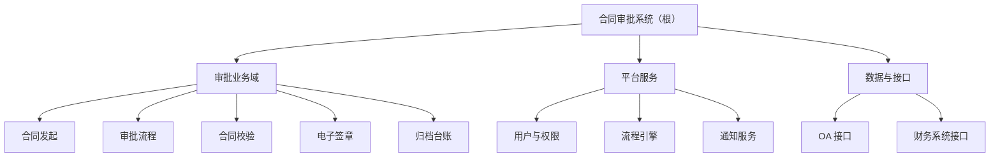
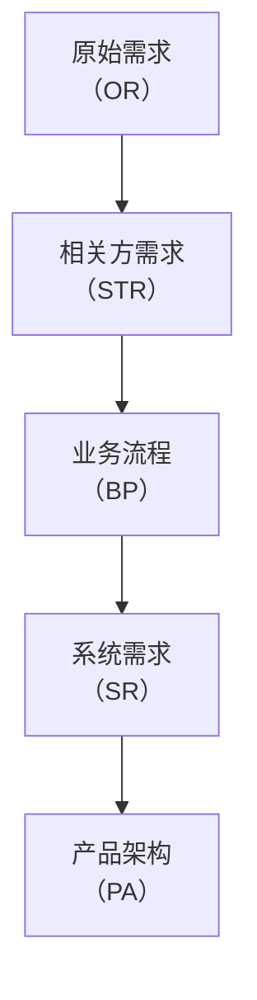

# 第6章 设计开发落地：一棵树、三个动作

> 本章概念：概要定义 / 详细定义 / 分解 / 分配 / 符合性分析
> 英文来源：preliminary definition / detailed definition / decomposition / allocation / compliance analysis
> 主案例：恒信集团合同审批系统（IT侧）｜ 镜照：冰链科技冷链温控箱（产品侧）
> 对应来源：通用设计规范（详概分离 / 分解·分配·符合性分析 / 五层设计链）

---

## 章首 · 误解现场

恒信集团合同审批系统项目评审会，下午两点，会议室坐满了人。

李工在投影上打开了《合同审批系统总体设计方案》——六十页。他花两个月写成，评审会前夜还在改格式。他清了清嗓子："这份方案我写了两个月，覆盖了需求调研的全部三百条需求。下面我按章节过一遍——"

法务部的张总翻开打印稿，翻了十几页，打断他："审批链上，谁能驳回、谁不能？"

李工："在第23 页的流程图里。"

财务的老王翻到第31 页："月底对账的统计口径，合同 25 号之后签的算哪个月？"

李工："这个……在需求文档里写过。"

业务部的小周问："我们上线之后，发起一份合同，先点哪里？"

李工："……界面上。"

会议室安静下来。Ada 坐在角落，把六十页从头翻到尾，又翻回第一页，轻声说了一句：

"李工，这不是一篇方案。这是一本小说。"

李工一愣："什么意思？"

"方案不该是一篇文章，应该是一棵树。"Ada 把打印稿合上，"一篇文章是线性的，读者只能从头读到尾。可是你的方案有五种读者——法务要看审批规则、财务要看校验和台账、业务要看怎么发起、开发要知道模块边界、运维要知道怎么部署。**五个人的问题分散在六十页里，谁也找不到自己那一枝。**"

李工不服："树？树能装下三百条需求吗？"

"正因为有三百条需求，才必须是树。"Ada 说，"文章装不下三百条需求——文章没有叶子。"

"叶子？"

"接下来，我讲给你听。"Ada 看了一眼墙上的钟，"三个动作。"

---

如果你坐在这间会议室里，你大概会觉得 Ada 在故弄玄虚。方案不是写出来的吗？写得越详细、越全面，不是越好吗？**六十页的方案难道不比一页的树更负责任吗？**

这一章要推翻的，正是这个直觉。它错在一个词上——**"设计方案"的"设计"，不是"写"，是"种"。** 设计文档是一棵树，不是一篇散文；方案的质量不取决于你写了多长，而取决于你有没有把那三百条需求，一条一条地"种"到这棵树上，种得准、种得全、种得可验证。

这背后是三个动作：分解、分配、分析。这一章，我们把"一棵树"和"三个动作"分别讲清楚。

第4章（需求工程）的结尾说过：需求工程产出"规定需求"；上一章（第5章 需求的完整性）说：标尺要全。这一章看这三百条需求怎么种进设计开发的树形结构——种得全不全，取决于标尺立得全不全。现在，Ada 要兑现第4章埋下的伏笔了。

---

## 本章问题

读完本章，你应该能回答：

1. 设计文档为什么必须是树，不能是散文？树的叶子是什么？
2. 概要定义和详细定义各回答什么问题？为什么一份文档要分成枝干和叶子两部分？
3. 分解、分配、符合性分析三个动作分别在做什么？各自的自检是什么？
4. "1:1 约束"是什么意思？为什么一条需求不能分给两个模块？
5. 概要定义和"架构"是什么关系？为什么叫"概要"不叫"架构"？
6. 一片叶子没有归宿，怎么判断该拆片还是该加枝？
7. 为什么三个动作不是三个步骤？从原始需求到产品架构，整条链是怎么靠"长叶子、搬叶子、查叶子"接力出来的？
8. 分解的规则是什么？为什么切法必须业务化、判据必须统一？只要每个结对找到自己的规则，分解与分配为什么就能解耦？

---

## 开篇 · 本章枢纽（骨架先行）

先把本章要钉的东西立起来——后面三幕，都是给这层骨架添血肉。

> **方案不是写出来的，是种出来的：一棵树（枝干概要 + 叶子详细）、三个动作（分解、分配、分析）、一个原则（方案是分解出来的，不是想出来的）。**

这一章的骨架是**一棵树 + 三个动作 + 一个原则**。

**一棵树**——设计文档是一棵树，不是一篇散文：枝干（概要定义）管结构，叶子（详细定义）管内容。结构不轻易变，内容随时长；枝干上没有叶子是枯树，叶子没有枝干是落叶。

**三个动作**——分解（在枝梢上长叶子）、分配（把叶子 1:1 搬到下一棵树的枝梢）、分析（检查每片叶子挂得对）。每个动作各带一套自检判据，第二幕会一条条磨开。一棵树内部只能发生分解；一旦到了分配，你已经站在两棵树之间了。

**一个原则**——方案是分解出来的，不是想出来的。五层链上每一对"需求-方案"都走这三遍功课，整条链靠"长叶子、搬叶子、查叶子"接力。

这一章的方法底座时刻，是第1章概念能力里的**织关系**：方案是结构，不是堆——把条目织成树，让每个部件各就其位、彼此承接，而不是把内容排成一列堆起来。

第一幕把"一棵树"看清（它是什么），第二幕把三个动作的边磨开（它们不是什么），第三幕把树放大成链（它们往哪去）。

---

# 第一幕 一棵树是什么（定界）

> 这一幕把"一棵树"看清：先看散文怎么死（三宗罪）、树怎么活（三个构件），再推"为什么必须是树"，最后把概详两层分开、把概要定义和架构分开。

## 1.1 设计文档是树，不是散文

李工的六十页方案为什么失败？不是他写得不好——他写得**太像文章**了。一篇文章有三个弱点，恰好是设计方案不能有的三个弱点。

### 散文的三宗罪

**第一，不可定位。** 一篇文章是线性流动的，从第2 页读到第60 页。但"审批驳回的规则"在第几页？"对账的统计口径"在第几页？读者只能从头找起。

而方案从来不是给一个人从头读到尾的——**方案是给五类人（法务、财务、业务、开发、运维）分别"查询"的**。法务只关心审批规则那几页，财务只关心校验与台账那几页，开发只关心模块边界那几页。一篇文章逼着五类人都通读全文，这本身就是巨大的浪费；而更糟的是，他们通读之后，还是找不到自己关心的内容，于是开始"猜"。

评审会开到第四十分钟还在讨论"这条需求到底有没有被方案覆盖"，不是大家不认真，是**文章没有给"覆盖"一个可定位的位置**。

**第二，不可承接。** 下游开发拿到六十页文章，怎么开工？他需要知道三件事：我负责哪一块、这一块要满足哪些需求、做到什么程度算完成。一篇文章没有模块边界，开发只能"全文通读，然后自己揣摩"。每个人揣摩出来的边界都不一样，集成时必然撞车。**文章没有"叶子"，需求没有地方落。**

**第三，不可追溯。** 需求是会变的（第4章刚讲完，恒信的需求天天在变）。一条需求变了，影响设计方案的哪几页？文章时代，只能重读全文，靠人肉寻找相关性——找不全，就漏改。**文章没有映射，变更没法定位到具体位置。**

树的回答，恰好是三件事：

### 树的三个构件

| 构件 | 是什么 | 干什么 |
|------|--------|--------|
| **根与层级** | 从根节点到末级节点的完整分级 | 层层细化，同层保持同一抽象级别 |
| **分类节点** | 非末级节点（如"审批业务域""平台服务"） | 组织架构层级——像文件夹，本身没有实体含义 |
| **末级节点** | 树的枝梢 | 承接需求——需求挂在这根枝梢上（一根枝梢可挂多条） |

一篇文章 vs 一棵树，差别不在"长短"，在"有没有叶子"：

- 文章里，"审批驳回"是正文里的一个段落；树里，它是"审批流程"这根枝梢上挂着的一条需求。
- 文章的段落不能被"承接"——你不能说"这一段归张三做"；树的枝梢可以——**枝梢是需求挂靠的钩子，也是开发认领的任务单。**
- 文章的段落不能被"追溯"——需求变了你不知道哪段要改；树的枝梢可以——沿着"需求→枝梢"的映射，一步命中。

所以树的关键，是枝梢和叶子怎么咬合。它有两个判据，一个管"挂"，一个管"搬"：

> **枝梢（末级节点）= 需求挂靠的落脚点**——一根枝梢可以挂多条需求（N:1）。
> **叶子（详细条目）= 能 1:1 搬走的原子条目**——一片叶子只能属于下一棵树的一根枝梢。

"1:1"是这一章最要紧的一个约束，先记住它，第二幕会展开：**一片叶子，只能被搬到下一棵树的唯一一根枝梢上。**

如果一片叶子搬不到任何枝梢，说明方案树没种全（需求会漏）；如果一片叶子同时搬到两根枝梢，说明下一棵树的枝梢分得不清楚（实现会重）。叶子存在的意义，就是让每一条细化后的需求**恰好有一个家**。

### 为什么人总是写成散文？

这是最值得问的问题：既然树这么好，为什么大家天然写散文？

因为**写作是线性的，而树是被"种"出来的**。写文章，只需要一支笔顺着思路走；种树，需要知道怎么长出枝桠、怎么让需求挂上枝梢、怎么让叶子在枝梢上长出来——这需要方法。

大多数团队没有这个方法，于是方案就退化成文章。你翻一翻公司里任何一份"总体设计"，十有八九是一篇按章节排列的文章——不是大家不愿意写树，是**没人教过怎么种树**。

## 1.2 为什么必须是树：织关系

前面三宗罪回答的是"散文为什么不行"——从读者角度看。还有一个更根本的问题没回答：**"树"为什么就行？** 树的形状，难道是拍脑袋定的吗？不是。树的每一个构件，都是设计开发的内涵逼出来的。这一节把这条必然性推一遍。

**第一步：内涵要求可验证、可落实 → 内容必须条目化。**

设计开发（design and development）的本质，是把"尚未存在的东西"变成"可以被建造的东西"。这个本质带着两个内在要求：

- **可验证**：设计结果必须能被检验——设计对不对、满不满足需求。可整体没法检验，检验只能一条一条做。检验的最小单元，就是一条条目。
- **可落实**：一个系统不是一个人造的，要分工交给许多团队去造。分工的前提，是"可独立认领的工作单元"——这片叶子交给张三，那片交给李四。

两条合起来推出第一件事：**设计内容必须条目化**。一条条目，是能独立定义、独立验证、独立分配、独立追溯的原子。散文的段落不行——段落不能被单独验证，也不能被单独认领。这就是"文章没有叶子"的根源：**文章根本不存在"可验证、可落实"的最小单元。**

**第二步：条目化带来数量爆炸 → 必须组织 → 树。**

条目化之后，一个真实系统是几百上千条。几百上千条平铺着，三条都不成立：**理解不了**（人脑装不下几个概念，需要"先看结构、再进细节"）、**管理不了**（一条需求变了，影响哪些条目，要聚类才能定位）、**分工不了**（要按领域把条目分给不同团队）。所以条目必须被组织。

而组织成什么形态？这里藏着树最深的理由——**为什么偏偏是树，不是列表、不是表格、不是网状？**

> **因为树是唯一能让"导航路径"与"承接路径"合一的形态。**

列表没有层次，数量一多就退回应付不了；表格能表达"谁承接谁"，但那是映射表，不是内容的组织形态；网状能表达复杂关系，但需求必须"从根落到叶子"——网状没有唯一根，回答不了"这条需求归谁"。

只有树，从根到叶子有唯一路径：**这条路径既是读者找路的导航，也是需求落地的承接。** 你顺着树走一遍，就是一次完整的承接验证。

这个"合一"，就是第1章概念能力里的**织关系**：把散点织成结构，让导航和承接走同一条路。学习做的是除法、先搭四梁八柱；设计做的是同一件事——把三百条需求织成一棵树，每条需求有唯一的家。方案是结构，不是堆：堆是线性排列，结构是有承接关系的网。

**第三步：管理理解要"概要"，落实验证要"详细" → 树要分成枝干和叶子。**

树组织好了，还差最后一步：树该"细"到什么程度？细到每条需求都被承接、每片叶子都可验证——可**如果整棵树都细到叶子，你就看不见树了**。管理与理解需要先看骨架（结构、分类、承接关系）；落实与验证需要逐片看叶子（定义、指标、验收标准）。

两种抽象级别、两种目的、两种变更频率——于是树天然分成两大部分：**枝干（概要定义）和叶子（详细定义）**。这不是谁规定的，是"既要看懂、又要做实"这两件事逼出来的。

至此，从设计开发的内涵，推出了"一棵树"的全部形态：**条目化（叶子）→ 树形（枝干）→ 概详两层（一棵完整的树）**。但注意，这些都是**静态形态**——它们回答"树长什么样"，还没回答"树怎么长出来"。

让形态活起来的是三个动作，而且每个动作都能在形态里找到影子：**为什么条目化？为了能逐片搬走（分配）。为什么有树？为了有地方承接（分配与分析）。为什么概详？概详正是分解的对象与产物。**

形态是为动作服务的——这就是本章标题把"一棵树"和"三个动作"放在一起的原因。

所以李工的病，表在"没人教过怎么种树"，里在"设计的本质被违背了"：**散文同时违背了可验证、可落实、可管理三条。** 看清这一层，下一幕的内容就不是记住两个名词，而是顺着必然性长出来的东西。种树的方法，就是第二幕要讲的三个动作。

## 1.3 树干树枝是概要，叶子是详细

一棵完整的树长什么样？只有两种东西：**树干树枝**和**叶子**。设计树也一样——这两种东西，就是这棵树的两大部分：

| 部分 | 叫什么 | 管什么 | 回答什么问题 |
|------|--------|--------|--------------|
| 树干树枝（结构） | **概要定义** | 组织与承接 | "结构是什么、承接了谁" |
| 叶子（内容） | **详细定义** | 定义与验证 | "每个模块具体做什么" |

**概要定义就是树的枝干**：从根节点一路分叉到末级节点，每根枝梢（末级节点）回答"结构是什么、承接了谁"——系统被组织成哪几大块，每根枝梢上要挂哪些需求。

**详细定义就是树的叶子**：长在枝梢上的每一片叶子，回答"每个模块具体做什么"——一片叶子就是一条可独立定义、独立验证的条目，有编号、有需求描述、有性能指标、有验收标准。

最关键的一点：**叶子不是漂浮的，它长在枝梢上。** 每片叶子都明确属于某根枝梢——"顺序审批"这片叶子长在"审批流程"这根枝梢上，"金额校验"这片叶子长在"合同校验"这根枝梢上。树正是用"叶子属于哪根枝"这件事，把结构和内容连成了一个整体。

这也回答了"为什么是同一棵树"：**枝干上没有叶子是枯树，叶子没有枝干是落叶——两者缺一，都不成其为树。**

为什么必须既有枝又有叶？因为设计要干的两件事，需要两种不同的东西（第二幕会展开这两个动作，这里先把它们立起来）：

- **分解**：要把"审批流程"这根枝梢的内容，展开成一组更细的叶子（顺序审批、驳回、会签……）。分解需要一个起点——"从哪展开"，这个起点就是枝梢；展开出来的每一片细叶子，都长在同一根枝梢上。
- **分配**：要把叶子一条一条搬到下一棵树上去。分配需要叶子能"逐条拎起"——**叶子是一片一片的，不是和枝干焊死的**，否则就搬不动。

如果只有枝干（只有概要定义），树就是一副空骨架，枝梢上没有内容；如果只有叶子（只有详细定义），叶子就散落一地，风一吹就乱，谁也不知道谁属于谁。**一棵好树：枝干挂得住，叶子长得出。**

画出来，就是一棵实实在在的树——枝干部分，是概要定义：



中间层的"审批业务域""平台服务"是**分类节点**（枝干的分叉，负责组织的文件夹）；"合同发起""审批流程"……这些**末级节点是枝梢**。而每一根枝梢上，长着叶子——叶子就是详细定义：

```
「审批流程」这根枝梢上，长着四片叶子：
  · SYS-002.01  顺序审批   支持按法务→财务→业务顺序审批，审批后 5 分钟内进入下一节点
  · SYS-002.02  驳回回退   支持驳回，驳回后回到发起人并可修改重提，响应 < 1s
  · SYS-002.03  会签       支持多方同时审批，会签发起后同步通知各方
  · SYS-002.04  超时提醒   审批超过 48 小时未处理自动提醒，提醒后 24 小时内升级
```

注意这个例子里已经藏着三个动作的影子：**"审批流程"被展开成四片叶子，是分解**（在枝梢上长叶子）；**每一片叶子都要标"属于下一棵树的哪根枝梢"，是分配**（叶子要被搬走）。枝干和叶子这两个部分，正是为这两个动作而生的。

> **一棵树：枝干是概要定义，叶子是详细定义。枝干管结构（组织与承接），叶子管内容（定义与验证）。结构不轻易变，内容随时长。**

有两个例外值得提一句（不必现在展开）：设计链最起点的**原始需求**，只有条目清单、没有树——因为起点是混沌的诉求，还没被组织；有一座**桥**（业务流程层），只有枝干、没有叶子——因为它的末级（输入→处理→输出）本身就是产出，不需要再展开成详细规格。

这两个例外不是破坏规则，而是提醒我们：**树是为"承接需求"而生的，最上游没有需求可承接、桥不需要再被承接，树就退化成最简形态。**

> **概念卡片 · 概要定义**（四问为纲，九格为目；格号=九格尺子）
>
> | 四问 | 格 | 内容 |
> |---|---|---|
> | **它是什么** | ① | 设计树的枝干：从根到末级的树形结构 + 映射表，回答"结构是什么、承接了谁" |
> | **它不是什么** | ⑥⑦ | 对立=详细定义（叶子）——枝干组织与承接，叶子定义与验证，两者合起来才是一棵完整的树；辨析=概要定义 ≠ 架构——前者是结构骨架（一份文档），后者是系统不可还原的涵义（第9章）；文档层面不等于，描述层面可作架构的一种描述（见 §1.4） |
> | **它从哪来** | ②③⑨ | 从"详概分离"原则来：设计文档先立结构骨架、再填内容条目，组织法随工程共同体演化成型；原叫"架构定义"，为拆掉"架构 = 文档"的词汇病改名（见 §1.4）；英文 preliminary definition，preliminary ← 拉丁 praeliminaris（门槛之前）——进入细节之前的那道门 |
> | **它往哪去** | ④⑤⑧ | 没有它，方案不可整体看懂、需求没地方落（散文三宗罪之不可定位、不可承接）；它回答"结构是什么、承接了谁"；在设计树结构搭建、需求挂靠定位时用；误区 ✗ "概要定义就是画一张系统结构图"——画图只是第一半，还必须有映射表说明每片叶子承接了谁 |
> | **判据** | 挂枝问 | 任取一条需求，能说出它挂在哪根枝梢（末级节点）上吗？说不出的，树还没种全。失效边界：最上游原始需求无树、桥无叶子——树为承接需求而生，这两处退化成最简形态 |

> **概念卡片 · 详细定义**（四问为纲，九格为目；格号=九格尺子）
>
> | 四问 | 格 | 内容 |
> |---|---|---|
> | **它是什么** | ① | 设计树的叶子：长在末级节点下的条目列表，每条可独立定义、独立验证 |
> | **它不是什么** | ⑥⑦ | 对立=概要定义（枝干）——叶子给枝干填内容，枝干给叶子定位；辨析=详细定义 ≠ 需求文档——它既写"是什么"也写"做到什么程度"（指标 + 验收标准），是设计内容的最终落点 |
> | **它从哪来** | ②③⑨ | 与概要定义同源孪生：概详分离把"可验证、可落实"的最小单元独立成层（见 §1.2 条目化推导）；"详细"之名与"概要"对称而成；英文 detailed definition，detail ← 拉丁 talis（如此）→ 切割成细部 |
> | **它往哪去** | ④⑤⑧ | 它回答"每个模块具体做什么、做到什么程度"——让内容可逐条验证、可 1:1 搬走；在逐条定义、验收核对时用；误区 ✗ "叶子越多越详细越好"——叶子必须长在枝梢上（每条能归属一个末级节点），散落的条目只是段落 |
> | **判据** | 五件套 | 每条叶子都有编号、需求描述、性能指标、验收标准、映射目标吗？缺一，叶子还不完整 |

## 1.4 概要定义 ≠ 架构定义

细心的读者会发现：我在前面给概要定义取了个名字，却没说"架构定义"四个字。而在很多方法论的文档里，这份树形文档明明就叫**架构定义**（architecture definition）——听着多顺耳，一棵树的形状，不就是架构吗？

**正是这个"听着顺耳"，是个词汇病。** 这一章要竖起的第三个反直觉命题，就在这里：

> **概要定义 ≠ 架构定义。**

三个理由，每一个都值得想清楚。

**理由一：与"架构"撞车。** "架构"（architecture）在全书是一个极其重量级的概念——第9章会给它一个精确的定义：**系统不可还原的涵义**（ISO/IEC/IEEE 42010）。那是关于系统根本性质的决定：几个要素、怎么连接、哪个决定不可推倒重来。

镜照一眼冰链，同一个病，换了世界。冰链把 M3 的方案结构文档直接叫"架构定义"——这名字一听就重：架构都"定义"了，还动什么？

于是人人都以为架构已定、画完即可，文档再没人维护。老周不是不爱维护——他是觉得这个名字太重了，重到不该动，也重到不用动：架构定了，还维护什么？可那棵设计树明明是要天天长的：加一点需求、改一条逻辑，树就得跟着长。

名字上的错觉，把一件"天天要动"的事，变成了"定了就完了"的事。等第9章把"架构"说清楚，老周才明白：被他们叫"架构定义"的那份文档，只是一棵还没种完的树；真正的架构（那组"去掉就不是 M3"的决定）一直活着，只是从没人把它写下来。

**用一个已经承担了重量级含义的词，去命名一份轻量级的文档，是给自己埋词汇病的坑**——第9章的版本是"架构 = 一张框图"，第6章的版本就是"概要定义 = 架构定义"。

**理由二：不对称。** 它的孪生兄弟叫"详细定义"。既然另一半叫"详细"，按对称，这一半就该叫"概要"——而且设计方法里把这对兄弟放在一起的那个原则，名字本来就是**"详概分离"**（详 = 详细定义，概 = 概要定义）。叫"架构定义"，反而和原则自己的名字打架了。

**理由三：名实相符。** 它回答的是"结构是什么、承接了谁"——这是设计的**结构骨架**。它比"架构"轻得多：它是初步的、概要的、用来组织与承接的。

真正"不可还原的决定"——系统最重要的那几项选择——确实藏在树的枝条走向里，但那是**从树里读出来的判断**，不是树本身。第9、10、11 章会专门去挖。这里先立一条线：

> **概要定义是目录，详细定义是正文，架构是这本书真正要表达的思想。目录不是思想，但好的目录帮你定位思想。**

不过，把"不等于"说死之前，得分清两层，才不把话说满。**文档层面，概要定义不等于架构**——概要定义是一份设计文档（结构骨架 + 映射表），架构是系统不可还原的涵义（第9章），两者不在一个层面。

**但在"把系统结构写下来"的描述层面，概要定义可以作为架构的一种描述**——它把系统的结构写了下来，本身就是架构描述的一种。第9章正是这样接的：概要定义是架构的一种描述；架构是概要定义背后那些"去掉就不是它"的决定。

两层不打架：不等于，是在文档与涵义之间划线；可作描述，是在描述与涵义之间搭桥。

所以这一章里，我们统一用**概要定义**这个名字。它比"架构定义"少一分误导，多一分老实。

李工后来问 Ada："为什么不叫架构定义？"Ada 反问："你写的那个叫'总体设计方案'的六十页文章，叫不叫架构？"李工说："那当然不是。"Ada："所以别把文档叫成架构——**文档是文档，架构是架构，名字上就要分开。**"

## 案例进展①｜六十页文章变成一棵树

评审会散了之后，李工回去熬了一夜。

他把六十页文章揉碎了，提炼成一页树：合同审批系统 = 三个枝（审批业务域 / 平台服务 / 数据与接口），十根枝梢（发起、流程、校验、签章、归档 / 权限、流程引擎、通知 / OA、财务接口）。

第二天他把这一页树拿给 Ada 看。Ada 点头："好多了。现在你告诉我，法务关心的审批规则，在哪个枝上？"

李工指向"审批流程"那根枝梢。

"那这根枝梢上，挂了哪几条需求？"

李工愣住了。他还没来得及把需求挂上去——树还只是一张图，枝梢上还没有叶子。

"这就对了。"Ada 说，"树还只是骨架。要把它变成方案，得把三百条需求一条一条挂到枝梢上，再从每根枝梢上长出叶子——把'这条需求怎么做到'细化成一条一条具体要求。挂得准、挂得全、挂得能验证——这就是接下来的事。"

"怎么挂？"

"三个动作：分解、分配、分析。"Ada 竖起三根手指，"第一个动作，就是把你这根'审批流程'枝梢，展开成一条一条具体的要求。先学会这个，再谈挂。"

---

# 第二幕 三个动作不是什么（磨边界弧）

> 这一幕把三个动作的边磨开——判据主义在这里登场：概念靠正例活，靠反例定型。分解不是多列几条、分配不是简单分派、分析不是一句空话；概详也不焊死。一条条磨过去。

## 2.1 三个动作在哪儿做

第一幕的树，回答了"设计文档长什么样"。现在的问题更根本：**树是怎么种出来的？** 答案是三个动作——分解、分配、分析。

它们不是三个先后的大阶段，而是每一对"需求-方案"之间都要走完的三个动作。而且它们各有各的"发生地"：

| 动作 | 在哪儿做 | 做什么 | 自检 |
|------|----------|--------|------|
| **分解** | 树内（一棵树内部） | 枝梢长出叶子：概要定义末级节点 → 详细定义条目 | 语义四查 + 指标三场景 |
| **分配** | 树间（两棵树之间） | 叶子搬到下一棵树的枝梢：详细条目 1:1 → 方案概要末级 | 全覆盖 / 1:1 / N:1 合理 |
| **分析** | 树间（两棵树之间） | 检查叶子挂得对不对：方案枝梢是否充分承接所挂的需求 | 语义符合 + 指标符合 |

一句话记住它们：

> **分解让枝梢长出叶子，分配让叶子搬到下一棵树，分析检查每一片叶子都挂得对。**

注意一个容易混淆的地方：这里只有"分解"是树内的动作（在枝干和叶子之间），"分配""分析"都在树和树之间。

很多新手把三个动作当成同一棵树的三个步骤，其实**一棵树内部只能发生"分解"**；一旦到了"分配"，你已经站在两棵树之间了。这一层"一棵树不够，需要多棵树接力"的道理，第三幕再展开。现在先把三个动作一个一个看仔细。

## 2.2 分解不是"多列几条"

**分解**（decomposition）要做的事：把概要定义的一个末级节点（枝梢），展开成一组详细定义的条目（叶子）。

它回答的问题：**这根枝梢上，到底要长出哪些叶子，才能把它挂着的需求说清楚、说全？**

李工面对的"合同校验"这根枝梢，挂着第4章澄清过的几条需求（金额 ≥ 500 万要审、三年期以上要审、条款要完整……）。他要做的，是把"合同校验"展开成一组叶子：

```
「合同校验」这根枝梢，长出四片叶子：
  · SYS-003.01  金额校验   金额 ≥ 500 万时进入重点校验，校验精度到分
  · SYS-003.02  期限校验   合同期 ≥ 3 年时进入重点校验
  · SYS-003.03  条款校验   必填条款缺失时阻断提交，并提示缺失项
  · SYS-003.04  资格校验   审批人无权限时拒绝并提示，响应 < 1s
```

这就是分解：一根枝梢 → 一组叶子。但**"把一条拆成几条"谁都会，难的是拆得对。** 分解有四条语义检查，一条都不能少：

### 语义分解四检查

| 检查 | 问的问题 | 违反的样子 |
|------|----------|-----------|
| **覆盖完整性** | 父需求里的每条要求，叶子都有对应吗？ | 漏——父里有的，叶子缺了 |
| **不超出性** | 叶子引入父范围外的新内容了吗？ | 超出——凭空冒出来的要求 |
| **逻辑一致性** | 叶子之间互相矛盾吗？ | 冲突——两片叶子打架 |
| **约束继承** | 父的非功能约束，至少一片叶子承接了吗？ | 丢失——约束在分解中消失 |

- **覆盖完整性**："合同校验"要审"金额、期限、条款"三件事，如果只长出"金额校验""条款校验"两片叶子，期限校验就漏了——这是分解最常见的失败，漏掉一条，下层方案就不知道要支持它。
- **不超出性**：如果李工顺手长出第五片叶子"合同打印"，这是"校验"这根枝梢上不该有的——**分解不是多列几条，是精确切分**。多出来的内容没经过上游确认，就是范围蔓延（也叫"影子需求"）。
- **逻辑一致性**："金额 ≥ 500 万进入重点校验"和"所有合同一视同仁，不做分级校验"不能同时存在——两片叶子打架，下层方案无所适从。
- **约束继承**：第4章那条"合同数据留档十年"是挂在系统级的约束，分解到各枝梢时，必须至少有一片叶子显式承接它（比如"归档台账"的叶子写着"数据保存 10 年"）。如果约束在分解中丢了，下层方案根本不知道有这条约束——直到审计才发现没有留档。

四条检查里，"覆盖完整"和"不超出"是姊妹对：**一个防漏，一个防多。** 漏了，需求在方案里消失；多了，方案里长出没被授权的需求。一漏一多，是两个方向相反的错误，但都让"树"偏离了它该承接的需求。

### 指标分解三场景

分解还有第二个工作面：**性能指标怎么分。** 父需求带着一个指标（比如"整笔审批在 48 小时内完成"），分解成子需求后，指标怎么落到各片叶子上？三种情况，按顺序判断：

**场景一：可拆分——子指标之间存在函数关系。**
响应时间、可靠度、功耗这类指标，子项之间可以按运算关系拆。恒信例："整笔审批 48 小时完成" → "发起 + 各级审批 + 签章 + 归档"各段加起来不超过 48 小时（串联可加）。每个子项分到一个预算，总和不超过父值。

镜照一眼冰链，这是最漂亮的一类：M3 温控箱的"全程可靠度 ≥ 0.99"，拆成硬件可靠度 × 固件可靠度 × 云端可靠度 ≥ 0.99（**串联乘积**——任何一个环节断链，整条链就断）。于是硬件分到 0.995、固件 0.995、云端 0.999，三者乘积约 0.989——不对，不够 0.99！

**数字一旦落纸，立刻发现预算不够，就得回炉。这正是"可拆分"的价值：把账算清楚，而不是靠感觉。**

**场景二：下放——所有子需求都必须各自独立满足同一指标。**
工作温度范围这类指标没法拆分：M3 的"工作温度 -20℃~60℃"，是指每一个部件——传感器、电池、压缩机、主控板——都必须在 -20℃~60℃ 正常工作，不是把温度区间分给不同部件。所以所有叶子**同值继承**。恒信例："操作日志不可篡改"是系统级约束，每个模块都要满足，全部下放。

**场景三：暂不分解——系统级耦合，需求阶段算不清。**
M3 的"整机噪声 ≤ 45dB"：噪声是"声源—传播路径—接收者"的系统级问题，在需求分解阶段还没有结构数据，没法预先分给某个部件。这时候**不做假分解**，而是在分解记录里明确标注"**向下一层传递**"——这个指标不消失，只是留到方案设计阶段再算。

最怕的是第三种情况当成第二种，硬塞给一片叶子，结果那片叶子怎么都满足不了。

> **指标分解三场景：能拆就拆（按函数关系）、拆不动就下放（同值继承）、算不清就传递（标注"向下一层传递"）。最忌讳的是假装能拆。**

### 反模式：七种拆法错误

分解的错误不止"漏"和"多"，一共七种，值得一次记全：

| 类 | 反模式 | 表现 | 后果 |
|----|--------|------|------|
| 语义 | **过分解** | 把实现步骤当功能拆（"先加热→再保温→最后冷却"） | 需求里混入实现细节，压缩下层设计空间 |
| 语义 | **欠分解** | 一条需求含多个独立功能（"上料、加工、检测、分拣一起做"） | 无法分配——一条要多个枝梢承接 |
| 语义 | **影子需求** | 凭空长出父需求没有的内容 | 范围蔓延，未经上游确认 |
| 语义 | **约束丢失** | 父的非功能约束在叶子中消失 | 下层不知有约束，交付后才发现不满足 |
| 指标 | **指标错配** | 子指标口径变了（父"响应 < 2s（95 分位）"→ 子"< 2s（平均）"） | 名义继承、实质偏移，验证时对不上 |
| 指标 | **指标落空** | 父有量化指标，子只保留功能描述（"加热响应 < 5s"→"支持加热"） | 指标约束彻底丢失 |
| 指标 | **指标超预算** | 子指标之和超过父指标（成本 5000 → 2000+2000+1500） | 无谓收缩设计空间，子不必比父更严 |

过分解最值得多说一句：它把"怎么做"混进了"做什么"。第4章刚讲过需求回答 What、方案回答 How——**分解是需求侧的动作，应该只切 What，不写 How。**

"支持温度控制"是需求，"先加热再保温"是设计——后者一旦写进需求，下游就失去了选择"怎么实现"的自由（万一有个更好的方案呢）。这是"需求被过度约束"最常见的形式。

**分解终止判据**：叶子细化到"每片都能被 1:1 搬到下一棵树的唯一一根枝梢"为止。拆到这片叶子依然需要两个枝梢才能承接——继续拆；拆到每片叶子都恰好能落在一个枝梢——停。

### 分解规则：判据统一，切法业务化

学到这里，李工问了一个更深的问题："合同校验"到底该按什么拆？按校验对象，还是按流程阶段？有没有一套全项目通用的分解规则？

Ada："没有。但'分解规则'这四个字，藏着这一章最容易被混过的一个误解——它其实是两种性质完全不同的东西。"

**第一层，切法（内容规则）：怎么切。** 按什么维度把需求切开，每一对"需求-方案"（结对）都不同：原始需求按相关方拆，业务流程按流程阶段拆，系统需求按系统能力拆，产品架构按职责内聚拆。

"按流程阶段拆"对审批域成立，对硬件域就是错的——硬件域按物理边界拆，检索域按数据流拆。切法是领域经验，必须业务化。

每个结对把自己领域"什么东西该是一件事"的知识，编码成自己的切法指南。**试图写一条全项目通用的切法，是自欺欺人。**

**第二层，判据（形式判据）：切得好不好。** 四查、三场景、1:1、全覆盖……这些是全链通用、所有结对共用的尺子。它们不回答"怎么切"，只回答"切出来的条目合不合格"。

|  | 切法（内容规则） | 判据（形式判据） |
|---|-----------------|------------------|
| 回答的问题 | 按什么维度切 | 切得好不好 |
| 典型例子 | 按相关方 / 按流程 / 按能力 / 按职责拆 | 四查、三场景、1:1、全覆盖 |
| 性质 | 领域经验 | 逻辑要求 |
| 适用范围 | 结对特有（每对结对不同） | 全链通用（所有结对相同） |
| 该不该统一 | 不该——必须业务化 | 必须——不统一则解耦失败 |

**判据必须统一，这是解耦的根基。** 分配要做全覆盖、1:1 的对账，需要一套所有结对都认的账本语言：A 结对送来的叶子，在 B 结对的下层能对账。如果每个结对各自定义"合不合格"，A 的尺子和 B 的尺子互相不通，分配就没法检查——那不是解耦，是回到更糟的耦合。

**切法必须业务化，这是解耦的另一半。** 切法交还给懂这个领域的人：业务专家直接参与分解规则的制定与评审，首拆率提高、退回次数减少。而退回重拆的每一次裁决，都会沉淀成新的切法经验——切法指南是项目自己的记忆，越用越准。

**解耦的最后一环：契约。** 切法独有、判据统一，分解与分配已经基本独立。但分配还差一件事：怎么知道一片叶子该归谁？两个装置把它接上——

1. **候选声明**：每片叶子在分解时声明一个候选枝梢。分解"声明我归谁"，分配"验证对不对"。声明是给分配的输入，不是分解的验收——这是分解与分配之间唯一的耦合点，有它，分配不用猜。
2. **骨架先行**：分解要对着已约好的下层枝梢清单拆，候选声明才有枝梢可指。骨架就是"水电点位图"：两拨工人各自施工（工作解耦、可并行），共享一张图（信息耦合）。

> **解耦 = 判据统一（全链共用）× 切法业务化（结对独有）× 契约共享（候选声明 + 骨架先行）。**
> 只要每个结对找到自己的分解规则，分配就有据可查——从"猜谜"变"对账"。规则保证可分配性可被检查，正确分配永远属于人的语义裁决。

## 案例进展②｜李工的第一次分解

李工第一次做分解，对着"合同校验"拆了一下午，拿给 Ada 看。

Ada 只问了一句："父需求里'金额 ≥ 500 万或三年期以上要重点审'这条，你的四片叶子都覆盖了吗？"

李工一愣，回去一查：他拆了金额校验、条款校验、资格校验三片，**期限校验漏了。** "合同期 ≥ 3 年进入重点校验"这条要求，在他拆的叶子里没有对应——覆盖完整性检查失败。

Ada："漏一片叶子，下层方案就不会做期限校验。将来一份五年期合同不走重点审，出了事，追溯回来，就是这个漏洞。"

李工补上期限校验。他又看了一遍自己的叶子，越看越不对劲："Ada，我好像加了一片'合同打印'……这不是校验该干的。"

Ada："那叫影子需求。**分解是精确切分，不是顺手多列。** 删掉。"

李工删掉，又复查了一遍约束继承——把"数据留档十年"这条系统约束，确保归档那根枝梢的叶子显式承接了。这一次，四查齐了。

"好。"Ada 说，"现在，把叶子搬走。"

> **概念卡片 · 分解**（四问为纲，九格为目；格号=九格尺子）
>
> | 四问 | 格 | 内容 |
> |---|---|---|
> | **它是什么** | ① | 在枝梢上长叶子：把概要定义的末级节点展开成详细定义的条目 |
> | **它不是什么** | ⑥⑦ | 对立=分配（树间搬运）——分解在一棵树内部（枝干 ↔ 叶子），分配在两棵树之间（叶子 → 下一棵树枝梢）；辨析=分解 ≠ 多列几条——是语义 + 指标双维度的精确切分，配四查三场景 |
> | **它从哪来** | ②③⑨ | 源自工程分解实践：把整体拆回组成部分，让复杂设计可逐片验证、逐片分配；"判据统一、切法业务化"的规则是分解经验沉淀的结果；英文 decomposition，de-（反）+ compose（组成）——把整体拆回组成部分 |
> | **它往哪去** | ④⑤⑧ | 它回答"这根枝梢上要长出哪些叶子，才能把挂着的需求说清楚、说全"；在枝梢长叶子时用；边界=只切 What 不写 How（过分解把"怎么做"混进"做什么"）；误区 ✗ "把一条需求多列几条就是分解"——可能是过分解（混入实现）、欠分解（无法分配）、影子需求、约束丢失 |
> | **判据** | 四查三场景 | 语义四查过了吗？指标三场景判定做了吗？每片叶子都能 1:1 搬走吗？ |

## 2.3 分配不是"简单分派"

**分配**（allocation）要做的事：把一棵树长出来的叶子（详细定义条目），**1:1 地搬到下一棵树的枝梢上**（下层方案的概要定义末级节点）。

它回答的问题：**这片叶子，归下一棵树的哪根枝梢负责实现？**

分解在树内（枝干 ↔ 叶子），分配在树间（这棵树的叶子 → 下一棵树的枝梢）。

恒信走到这里，李工手上有"系统需求"这棵树长出的叶子（SYS-002.01 顺序审批、SYS-003.01 金额校验……），下一棵树是"产品架构"——前端、审批引擎、合同台账、签章服务、通知服务。分配就是给每一片叶子找一个归宿：

```
叶子（系统需求详细条目）        →    下一棵树的枝梢（产品架构末级）
SYS-002.01 顺序审批             →    审批引擎
SYS-002.04a 超时检测           →    审批引擎
SYS-002.04b 提醒发送           →    通知服务
SYS-003.01 金额校验             →    审批引擎
SYS-005.02 电子签章             →    签章服务
SYS-006.01 合同归档             →    合同台账
```

### 1:1 约束：一片叶子，一个归宿

分配的核心约束只有一条，也是这一章最重要的约束：

> **一片叶子，只能搬到下一棵树的唯一一根枝梢上（1:1）。**

为什么？三个理由：

1. **避免重复实现。** 一片叶子（比如"金额校验"）如果同时搬到"审批引擎"和"前端"，两个模块都实现一遍金额校验——同一逻辑两处实现，改一处漏一处，这是重复代码的根源。
2. **保证验证有唯一对象。** "金额校验"做得对不对，该测哪个模块？1:1 让验证有唯一目标；1:N 让验证不知道该查谁。
3. **让变更可定位。** 需求改变了对金额校验的要求，只改一个模块；分到两处，就要找齐两处，漏一处就是 bug。

注意一个对称：**枝梢承接叶子是 N:1**（一根枝梢可以挂很多片叶子），**叶子归宿枝梢是 1:1**（一片叶子只有一个归宿）。前者是"聚合"，后者是"定位"。很多团队把这两个方向搞反——让叶子挂多个枝梢（违反 1:1），却让一个枝梢只挂一片叶子（浪费聚合能力）。

### 分配三自检

分配完成不是结束，要过三关：

| 自检 | 问的问题 | 违反的后果 |
|------|----------|-----------|
| **全覆盖** | 所有叶子都搬走了吗？ | 没搬的叶子在下层方案中无对应设计，需求直接遗漏 |
| **1:1** | 每片叶子都只搬到一个枝梢吗？ | 重复实现，浪费资源、无法验证 |
| **N:1 合理性** | 每个枝梢挂的叶子数合理吗？ | 太少→枝梢太碎；太多→枝梢职责过宽 |

- **全覆盖**最容易被"觉得没问题"带过。李工第二次分配，数了一遍叶子总数，再数一遍搬走的，发现数字对不上——有一片"审批历史查询"没地方放，被漏掉了。这片叶子于是从需求里消失了，直到上线后用户问"审批历史哪去了"才发现。
- **N:1 合理性**的经验值：一个枝梢挂 2~5 片叶子较优，超过 8 片就该考虑这根枝梢是不是太宽、要不要再分叉。但这是经验不是铁律——**判断标准永远是语义相关**：挂在同一根枝梢上的叶子，应该确实是一类事。

分配里最真实的场景，是**一片叶子不知道该归谁**——这时候往往意味着两个枝梢的边界没划清。恒信的"审批超时自动提醒"：归"审批引擎"还是"通知服务"？

引擎管流程、通知管消息——按职责内聚，超时的"检测逻辑"归引擎（它知道什么时候超时），"发送"归通知服务。最后 Ada 把它拆成两片：SYS-002.04a 超时检测、SYS-002.04b 提醒发送。

**一片叶子需要两个枝梢才能承接，本身就是一个信号：该拆片了。** 这就是 1:1 约束真正的作用——它逼你拆得足够细。

## 案例进展③｜一片"悬空"的叶子

李工把系统需求的叶子往产品架构上搬，搬到最后，剩下一片没人要：

**SYS-004.01 合同全文检索 —— 支持对已归档合同按全文检索，响应 < 3s。**

"全文检索……"李工看着产品架构的三个枝干——审批业务域、平台服务、数据与接口——哪个都不像。硬塞给"合同台账"？台账只管存储，不做检索。

Ada 让他先别硬塞："一片叶子没有归宿，只有两种可能：要么**欠分解**（这片叶子太粗，其实该拆成'建索引'和'查索引'两片），要么**方案树没种全**（确实缺一根'检索服务'的枝梢）。你先判断是哪种。"

李工想了半天："这片叶子拆不开——'对已归档合同全文检索'就是一件事，再拆就把'建索引'和'查索引'的接口也写进去了，那是设计不是需求。所以是方案树缺枝梢。"

于是产品架构新增了一根枝梢"检索服务"。叶子有了归宿。

Ada 补了一句：**"分配检出来的问题，一半是分配自己的错，一半是上游的错——欠分解要找分解，方案缺枝要找方案。三个动作是互相把门的。"**

> **概念卡片 · 分配**（四问为纲，九格为目；格号=九格尺子）
>
> | 四问 | 格 | 内容 |
> |---|---|---|
> | **它是什么** | ① | 把叶子搬到下一棵树的枝梢：详细定义条目 1:1 映射到下层方案概要末级节点 |
> | **它不是什么** | ⑥⑦ | 对立=分解（树内长叶子）——分配在两棵树之间，是树与树接力的接口；辨析=分配 ≠ 简单分派——1:1 是硬约束（一片叶子一个归宿），N:1 是枝梢聚合（一根枝梢挂多片），方向别搞反 |
> | **它从哪来** | ②③⑨ | 源自系统工程的需求分配（allocation）：把上层定义条目指派给下层承接单元，保证每条需求有唯一归宿；"1:1"约束是工程分配实践里长出来的铁律；英文 allocation，ad-（向）+ locare（放置）——把东西放置到某处 |
> | **它往哪去** | ④⑤⑧ | 它回答"这片叶子归下一棵树的哪根枝梢负责实现"；在两棵树之间接力时用；边界=一片叶子一个归宿（1:1）；误区 ✗ "一片叶子分给两个模块更保险"——违反 1:1，重复实现、验证无对象、变更难定位 |
> | **判据** | 三自检 | 三自检过了吗？全覆盖 / 1:1 / N:1 合理；有悬空叶子，要判断是欠分解还是方案缺枝梢 |

## 2.4 符合性分析不是"空话"

叶子搬完了，归位了，是不是就结束了？没有。**分配只保证"每片叶子都有归宿"，不保证"每个枝梢都接住了叶子"。** 这是第三个动作的事：

**符合性分析**（compliance analysis）要做的事：检查下一棵树的每一个枝梢（方案末级节点），是不是**充分满足**了它挂着的全部叶子（所承接的需求）。

它回答的问题：**这个方案枝梢，真的能把这片叶子做到吗？做到什么程度？**

先清一个词。第4章讲过"需求分析"（澄清、分解、排序、协商）——那是**加工**动作，对"需要"做加工，往前看，问"需求本身清不清楚"。这里的"符合性分析"是**检查**动作，对"承接关系"做检查，往后看，问"方案接没接住需求"。

同一个"分析"，两件事——这正是第1章说的词汇病：**近亲混用**。如果你在评审会上听到"我们做一下需求分析"，先问一句：是对需求做加工，还是对承接做检查？

> **第4章的"分析"是加工（往前看，需求清不清楚）；本章的"分析"是检查（往后看，方案接没接住）。**

符合性分析分两个维度：语义 + 指标。

### 语义符合性：方案的定义覆盖了需求吗？

三问：

| 问 | 充分的样子 | 不充分的样子 |
|----|-----------|-------------|
| **覆盖度** | 方案枝梢的定义里，提到了每条承接需求的对应处理 | 定义只覆盖了部分需求 |
| **映射正确性** | 需求的术语和方案的术语能对应 | 需求是"安全审计"，方案是"操作日志"——范围不同 |
| **分析具体性** | "通过实现 X 机制满足 Y 需求，具体体现在 Z" | "本节点满足上述需求" |

**"本节点满足上述需求"是最典型的空话**——它什么都没说。合格的符合性分析长这样：

> 本节点（审批引擎）通过以下方式满足所承接的需求（SYS-002.01、SYS-003.01）：
> - 针对 SYS-002.01（顺序审批）：实现状态机驱动的审批流，支持法务→财务→业务顺序流转，覆盖了"按序审批"的全部语义；
> - 针对 SYS-003.01（金额校验）：实现金额规则引擎，校验金额 ≥ 500 万进入重点审，响应 < 1s。

每一片叶子，都有一个"怎么满足它"的具体回答。写不出来的，就是没接住。

### 指标符合性：方案指标不低于需求指标吗？

语义接住了，指标也要接住：**方案枝梢承诺的指标，不能低于需求要求的指标。**

- 需求"审批响应 < 2s"，方案枝梢"审批引擎响应 1.8s" → **满足**；
- 方案枝梢"审批引擎响应 2.5s" → **降级**（必须说明理由、经评审确认，不能默默降）；
- 方案枝梢根本没提响应时间 → **丢失**（指标在方案里消失了）。

和指标分解一样，比较前要先确认运算关系：需求 2s 是整体（可拆分），方案要算的是组合值；需求是下放（同值继承），方案直接比。指标分析的最强形式是**把账算出来**："本节点各环节 0.6+0.7+0.5=1.8s < 2s，结论：满足。"

> **符合性分析的基本句式："针对需求 A，本节点通过 X 机制满足 Y，指标 Z 满足/降级/丢失。" 写不出这句的，等于没分析。**

### 时机：每层分配完立刻做，不是末次全量验证

符合性分析最容易犯的错是"留到最后做"——等全部设计完成，做一次总检查。这是倒置的：**分析越晚，发现的缺陷离源头越远，返工越贵。** 正确做法是每一对"需求-方案"分配完成，立刻对这层的每个枝梢做符合性分析。逐层清账，而不是最后算总账。

这呼应着第7章要讲的评审验证确认——那时我们会看到，"验证"把"符合性分析"纳入了更完整的框架。这里先记住：**分析是每层都要做的动作，不是最后的仪式。**

## 案例进展④｜符合性分析抓住的"重要合同"

恒信走到这一步，Ada 组织了一次"符合性分析评审"。李工对着产品架构的每个枝梢，逐条报"满足/降级/丢失"。

报到"审批引擎"这根枝梢，李工卡住了。他挂在这根枝梢上的叶子有：SYS-002.01 顺序审批、SYS-002.02 驳回回退、SYS-002.03 会签、SYS-003.01 金额校验、SYS-003.02 期限校验……

但**第4章 Ada 好不容易澄清的那条"重要合同要审批"——触发条件"金额 ≥ 500 万或三年期以上"——在审批引擎的定义里，没有对应的处理。**

"那条需求哪去了？"李工翻了半天："我把它归到'合同校验'去了，校验过了就触发重点审……"

Ada 摇头："那你看看'审批引擎'的定义，有没有写'承接重点审触发'？"——没有。校验触发只是触发，**"进入重点审批流程"这个动作本身，没有枝梢承接。** 语义覆盖失败：需求写着"重要合同要审批"，方案里"审批"这一环没人认领。

这不是小事。没有这个承接，重点合同会和其他合同一样走普通流程——三年期合同漏掉重点审，是合规事故。

李工在"审批引擎"的定义里补上：承接"重要合同触发重点审流程"，实现"校验结果 → 重点审路由"。

Ada 合上本子："**这就是为什么每层都要做分析。** 分配让每片叶子有归宿，但归宿了不等于接住了。树是不是真的长起来了，要靠分析来验。"

> **概念卡片 · 符合性分析**（四问为纲，九格为目；格号=九格尺子）
>
> | 四问 | 格 | 内容 |
> |---|---|---|
> | **它是什么** | ① | 检查叶子挂得对不对：每个方案枝梢是否充分满足所承接的全部需求（语义 + 指标） |
> | **它不是什么** | ⑥⑦ | 对立=需求分析（第4章·加工）——那个分析往前看（需求清不清楚），这个分析往后看（方案接没接住）；辨析=符合性分析 ≠ 评审——它是设计动作（每层分配后立刻做），评审是门禁（第7章）；分析是评审的输入 |
> | **它从哪来** | ②③⑨ | 源自验证实践：检查方案是否满足所承接的需求，从"评审验证确认"家族分出，成为每层分配后立即执行的动作（见 §2.4 时机）；英文 compliance analysis，comply（符合）——树间检查动作；区别于质量"符合性"conformity（程度判定） |
> | **它往哪去** | ④⑤⑧ | 它回答"这个方案枝梢真的能把这片叶子做到吗、做到什么程度"；每层分配完成后立刻用；误区 ✗ "本节点满足上述需求"——空话；要逐片叶子说清怎么满足、指标多少 |
> | **判据** | 满足句式 | 每个枝梢都有语义 + 指标结论（满足/降级/丢失）吗？降级有理由并经评审确认吗？ |

## 2.5 概详不焊死：分开维护

动作的边磨完了，还有一个容易焊死的地方——概详。

这是设计文档里最容易被低估的一件事。**枝干和叶子必须分开维护、各自演进**——因为它们的变更频率和变更原因完全不同：

- **修剪枝条**（调整分类层级，比如把"归档台账"从"审批业务域"挪到"数据与接口"）→ **只动概要定义**，叶子一片都不用动。
- **长新叶子**（新增一条需求，挂在已有枝梢下）→ **动的是内容**（详细定义加叶子、概要定义的映射表补一行承接），枝干结构不用动。
- 只有当**枝梢本身变了**（新增或删除末级节点）时，枝干和叶子才同时动。

第4章刚讲过需求变更控制——这里你看到了"结构"和"内容"分离带来的变更弹性：**枝干管结构，结构不轻易变；叶子管内容，内容随时长。**

把结构和内容焊死在同一份文档里，每一次内容变更都要拖着结构一起动，变更成本成倍上升。这还呼应着第12章要讲的配置管理：枝干和叶子是两个配置项，分别纳入基线。

---

# 第三幕 不止一棵树（运用）

> 这一幕把树放大成链：五层链怎么接力、需求方案怎么相对、文档结对怎么配合、最后怎么验收追溯——一棵树的可靠性，不靠写得长，靠每一对"需求-方案"咬合得好。

## 3.1 五层链：从原始需求到产品方案的接力

前面两幕，我们一直在讲"一对需求-方案之间"怎么干活：一棵树长出叶子（分解），叶子搬到下一棵树的枝梢（分配），下一棵树的枝梢接受检查（分析）。但真实的系统设计，从来不止一对"需求-方案"。

从一个真实的链条看起。恒信的项目，从头到尾是这样的：

- 老总说"合同审批要数字化"——这是**原始需求**，还没被组织，只是一句话；
- Ada 访谈法务、财务、业务，把"数字化"展开成各方需要的集合——**相关方需求**：法务要条款校验、财务要对账口径、业务要流程时效；
- ConOps 里写清楚了"一份合同怎么被三方审批"——**业务流程**；
- 把业务流程翻译成系统必须提供的能力——**系统需求**（上一幕的 SYS 叶子）；
- 把系统需求变成可以交给开发的产品组件——**产品架构**（审批引擎、前端、合同台账……）。

五层，从"一句话"到"可开发的组件"。每一层之间，都是一个"需求-方案"结对：



> 与第3章 §1.3"一个项目可有多个设计开发阶段"的递归（概念→详细→工艺）区分：那是设计开发**内部**的需求转化阶段；本章的五层链是文档结对链。两者是同一件事的两张视图——每个结对内部都可以发生多次递归细化。

### 需求/方案相对：中间层是双面人

关键在中间层。**"相关方需求""系统需求"这两层，同时扮演两个角色：向上，它是方案**（承接原始需求 / 承接业务流程）；**向下，它是需求**（规定业务流程 / 规定产品组件）。这就是"需求/方案相对"——需求不是文档的固有标签，而是它相对于相邻文档扮演的角色：

| 层 | 对上层 | 对下层 |
|----|--------|--------|
| 原始需求 | — | 纯需求（设计链起点） |
| 相关方需求 | 方案（承接原始需求） | 需求（驱动业务流程） |
| 业务流程 | 方案（承接相关方需求） | 功能需求来源（驱动系统需求） |
| 系统需求 | 方案（承接业务流程） | 需求（驱动产品架构） |
| 产品架构 | 方案（承接系统需求） | —（纯方案，设计链终点） |

这个相对关系不是纯概念——它是三个动作能接力工作的前提：**上一对的"分析"刚结束，下一对的"分解"紧接着从同一份文档开始。** 相关方需求刚作为"方案"被分析完，转过身就作为"需求"被分解。

接力棒是同一份文档，只是换了角色。这也是为什么"概要定义"和"详细定义"的树结构在每一层都长得一样：**树不挑角色，需求是树，方案也是树。**

### 文档结对：一对一的固定配合

每一对"需求-方案"的正式名字，叫**文档结对**：上层的叶子（详细定义条目）是**需求方**，下层的枝梢（概要定义末级节点）是**方案方**。有需求必有方案，有方案必有需求——这是结对的第一条律。

而每一对结对，都遵循同样的工作法——**两阶段**：

1. **骨架阶段**：先约定下层方案的概要树——长哪几根枝、每根枝梢叫什么——并建立初步映射；
2. **填充阶段**：上下层并行填充——上层完善叶子（详细定义），下层完善枝梢（节点定义、承接、分析）。

为什么骨架先行？回到案例进展③那片"悬空叶子"。那片叶子如果放在骨架阶段，第一天就会暴露"方案树缺一根检索枝梢"——因为骨架阶段就要约定"方案有哪些枝梢、哪些叶子挂哪些枝"。而李工是先把全部叶子长完、再统一搬，悬空叶子到最后才浮出来。

**先约骨架、再填内容，就是让"缺枝"这种问题最早暴露，而不是最晚。**

### 三个动作在每一层重复

五层链上有四对结对（严格说还有一座特殊的桥——业务流程作为桥，把相关方需求的功能翻译成系统需求，细节留到第9章架构再讲）。但核心规律只有一条：

> **三个动作在每一对结对上重复执行：分解 → 分配 → 分析。五层链不是四个大步骤，而是四遍"长叶子、搬叶子、查叶子"。**

这解释了为什么本章标题叫"三个动作"而不是"三个步骤"——**步骤是串行的一次性流程，动作是每一层都要重复的固定功课。** 每一层都欠着同样的功课：这一层的树完整吗？叶子全吗？都挂到下一层了吗？下一层的枝梢都接住了吗？

## 3.2 一棵树的可靠性：验收与追溯

做了这么多功课，设计开发怎么验收？答案是回到树本身——五个维度，每一个都呼应着本章的一个概念：

| 维度 | 检查什么 | 合格线 |
|------|----------|--------|
| 枝干（概要定义） | 树完整（根到末级无中断、同层抽象一致）、每根枝梢四要素齐（定义/承接/分析/关系） | 100% |
| 叶子（详细定义） | 分解完成、叶子原子（不可再分）、指标完整（数值+单位+测量条件） | 100% |
| 映射（分配） | 1:1 满足率、N:1 合理、覆盖 100% | 100% |
| 分析（符合性） | 每个枝梢语义+指标都过，无"满足"空话 | 100% |
| 追溯 | 从原始需求→产品组件正向走通，从组件→原始需求反向走通 | 100% |

"枝干叶子"验收的是"一棵树"本身；"映射"是分配的三自检；"分析"是第三动作；而**追溯**是把五层树串起来的总验证——任取一条原始需求，能不能一路走到它对应的产品组件（正向）；任取一个组件，能不能说清它由哪些需求而来（反向）。走不通的地方，就是树与树之间断了。

最后回到第3章的一句话：**设计开发止于可实现。** 现在你看到了"可实现"在树上的样子——叶子细化到能被 1:1 分配，枝梢具体到能被开发承接，每个枝梢都做过符合性分析。一棵树的可靠性，不靠写得长，靠每一对"需求-方案"咬合得好。

## 案例进展⑤｜一条线从老总画到开发

恒信第一次把整条链走通，Ada 和李工坐在白板前，从下往上推了一遍。

最顶层，老总的一句话："合同审批要数字化。"——原始需求。第二层，三方需求：法务要条款校验、财务要对账口径、业务要流程时效——相关方需求。第三层，业务流程：一份合同从发起、法务初审、财务校验、业务终审、签章、归档——ConOps 里的故事，现在长成了树。

第四层，系统需求：SYS 叶子——李工分解出来的那批（顺序审批、金额校验、期限校验……）。第五层，产品架构：审批引擎、前端、合同台账、签章服务、通知服务、检索服务。

Ada 在白板上画了一条线，从"金额 ≥ 500 万要重点审"这条原始要求，一路画到"审批引擎"那根枝梢：

"一条需求，从老总嘴里到开发手里，过了四道分解、四道分配、四道分析。中间任何一道断了，这条需求就丢了。"

李工盯着那条线看了很久，说："所以方案不是写出来的。是每一层都走一遍分解分配分析，接力接出来的。"

Ada 笑了："你现在才懂。那六十页文章，就是四层功课都没做，只写了一篇感想。"

---

## 本章概念总图

```
一棵树：方案是树，不是散文（散文三宗罪：不可定位 / 不可承接 / 不可追溯）
  枝干 = 概要定义（管结构：根到末级 + 映射表，回答"结构是什么、承接了谁"）
  叶子 = 详细定义（管内容：每条可独立定义、独立验证，1:1 搬走）
  概详分开维护：枝干结构不轻易变、叶子内容随时长；焊死则变更成本成倍上升
  概要定义 ≠ 架构定义：文档层面≠（结构骨架 vs 不可还原涵义）；描述层面可作架构的一种描述

三个动作（不是三个步骤，每一对"需求-方案"都要重复的固定功课）：
  分解 —— 在枝梢上长叶子（树内）
          语义四查（覆盖完整 / 不超出 / 逻辑一致 / 约束继承）+ 指标三场景（可拆分 / 下放 / 向下一层传递）
          七种反模式：过分解 / 欠分解 / 影子需求 / 约束丢失 / 指标错配 / 指标落空 / 指标超预算
          分解规则 = 切法业务化（结对独有）× 判据统一（全链共用）× 契约共享（候选声明 + 骨架先行）
  分配 —— 叶子 1:1 搬到下一棵树的枝梢（树间）
          三自检：全覆盖 / 1:1 / N:1 合理；悬空叶子 = 欠分解（拆片）or 方案缺枝（加枝）
  分析 —— 检查叶子挂得对不对（树间）
          语义符合（覆盖度 / 映射正确性 / 分析具体性）+ 指标符合（满足 / 降级 / 丢失）
          "本节点满足上述需求"是空话；每层分配完立刻做，不是末次全量验证

一条链：五层（原始需求 → 相关方需求 → 业务流程 → 系统需求 → 产品架构）
  需求/方案相对：中间层是双面人（对上是方案、对下是需求）
  文档结对：有需求必有方案；骨架先行、填充并行
  验收五维：枝干 / 叶子 / 映射 / 分析 / 追溯；设计开发止于可实现
```

## 章末 · 认知反转

一个月后，恒信又开了一次方案评审会。还是那间会议室，还是那些人。

李工在投影上打开的，不再是六十页文档，而是三页：

- 第一页：合同审批系统的概要树——一页纸，三个枝、十根枝梢；
- 第二页：详细定义——每根枝梢上长出的叶子，每条有编号、有描述、有指标、有验收标准；
- 第三页：三张自检表——分解四查的记录、分配三自检的结果、每个枝梢的符合性分析。

法务的张总一秒钟定位到"审批流程"，找到了自己关心的驳回规则。财务的老王翻到"合同校验"，看到了对账口径。业务的小周指着"合同发起"，说"这就是我要的"。

会议开了一小时，散会。李工对 Ada 说："我第一次觉得，这份方案是'活'的——每一片叶子都能被找到，每一个决定都有来路。"

回到章首那场会。你以为设计开发是"写方案"，方案的质量取决于文笔和长度。这一章告诉你的是三件事：

**第一，设计开发不是写，是种。** 方案是一棵树——枝干（概要定义）管结构，叶子（详细定义）管内容。树不是凭空想出来的，是三个动作长出来的：分解让枝梢长出叶子，分配让叶子搬到下一棵树，分析检查每一片叶子都挂得对。

**第二，方案是分解出来的，不是想出来的。** 李工原来靠经验和灵感写六十页；现在靠"分解→分配→分析"接力，每一层都为下一层负责。方案质量的真相不是文笔，是每一对"需求-方案"的咬合质量。

**第三，概要定义不是架构。** 名字上分开，才不会犯"架构 = 一份文档"的词汇病。目录不是书的思想，但好的目录帮你找到思想。

三件事背后，是同一次方法时刻——第1章说的**织关系**。李工原来把三百条需求排成一列（堆），Ada 教他把它们织成树（结构）：堆起来的方案找不到路，织起来的方案每条需求都有家。方案是结构，不是堆——第9章说架构是压缩，也是同一个原理：用结构消化复杂度。

用第1章的话收一次束：对"设计方案""概要定义""分解""分配""符合性分析"这些词，你原来只是"见过"——知道方案是棵树、听说过三个动作。

这一章把它们推到"拥有"：能答全四问——它是什么（树、概详两层、三个动作）、不是什么（不是散文、不是多列几条、不是简单分派、不是空话、不是架构）、从哪来（从"可验证、可落实、可管理"的内涵推出来）、往哪去（五层链上每一对"需求-方案"接力）。**能答全四问才算拥有，这把尺子现在装进你手里了。**

> **方案不是写出来的，是种出来的——一棵树、三个动作，在整条链上接力。**

## 本章判据

1. **设计文档是一棵树**：枝干（概要定义）+ 叶子（详细定义），缺一不完整；枝干管结构、叶子管内容，分开维护——结构不轻易变，内容随时长。
2. **概要定义回答"结构是什么、承接了谁"；详细定义回答"每个模块具体做什么"**——每片叶子都有编号、描述、指标、验收标准、映射目标。
3. **分解四查**：覆盖完整（不漏）、不超出（不多）、逻辑一致（不矛盾）、约束继承（不丢）；指标三场景：可拆分 / 下放 / 暂不分解（标注"向下一层传递"）。
4. **分配三自检**：全覆盖（都搬了）、1:1（一片叶子一个归宿）、N:1 合理（每个枝梢挂 2~5 片较优，以语义为准）。
5. **符合性分析**：每个方案枝梢语义+指标都过；"本节点满足上述需求"是空话。
6. **每个文档结对都走"分解→分配→分析"**；骨架先行、填充并行；五层链是四遍"长叶子、搬叶子、查叶子"。
7. **分解规则分两层**：切法（内容规则）必须业务化——每个结对按领域经验定义怎么切；判据（形式判据）必须统一——四查、三场景全链共用；候选声明 + 骨架先行，让分解与分配解耦。
8. **概要定义 ≠ 架构定义**：文档层面——概要定义是结构骨架（一份文档），架构是系统不可还原的涵义（第9章）；描述层面——把系统结构写下来的概要定义，可以作为架构的一种描述。两层划线，不把话说满。

## 自查 · 这些说法对吗？

1. "设计方案写得越详细越好，六十页比一页树强。"——**错**。散文不可定位、不可承接、不可追溯；没有结构的详细只是堆砌。
2. "概要定义就是架构定义，换个名字而已。"——**错**。概要定义是结构骨架（一份文档），架构是系统不可还原的涵义；改名的意义是拆掉"架构 = 文档"的误区。
3. "一条需求分给两个模块做，双保险。"——**错**。违反 1:1，导致重复实现、验证无对象、变更难定位。
4. "分解就是多列几条。"——**错**。有语义四查 + 指标三场景；还要防七种反模式（过分解/欠分解/影子需求/约束丢失/指标错配/指标落空/指标超预算）。
5. "符合性分析写'本节点满足上述需求'就够了。"——**错**。那是空话；要对每片承接的叶子说清"怎么满足、指标多少"。
6. "指标拆不动的就先不管。"——**错**。要标注"向下一层传递"，让指标不消失，留到方案阶段再算。
7. "先把需求全部写完，再开始设计。"——**错**。结对设计是骨架先行、并行填充；否则"悬空叶子""方案缺枝"要到最后才暴露。
8. "第4章的'分析'和第6章的'分析'是一回事。"——**错**。需求分析是加工（往前看，需求清不清楚），符合性分析是检查（往后看，方案接没接住）。
9. "三个动作是同一棵树的三个步骤。"——**错**。分解在树内（枝干 ↔ 叶子），分配、分析在树间（两棵树之间）；动作是每一层都要重复的固定功课。
10. "一片叶子没地方放，硬塞给最近的枝梢就完了。"——**错**。一半是上游的错：欠分解要找分解、方案缺枝要找方案；先判断是哪种，再动。
11. "概要定义和详细定义焊在一起维护，省得两处对不上。"——**错**。变更频率与原因不同：结构不轻易变、内容随时长；焊死则每次内容变更都拖着结构一起动。
12. "设计文档交付一次就完了，画完即定型。"——**错**。需求会变；不可追溯就漏改；枝干和叶子分开演进，文档是活的，不是交付一次就定型。
13. "'分解规则'应该全项目统一，一套切法拆所有结对。"——**错**。切法（内容规则）必须业务化——每个结对按自己的领域经验拆；全链统一的是判据（形式判据）。只要每个结对找到自己的切法，分配就有据可查，分解与分配就解耦。

## 练习

1. 找一份你们团队最近的设计文档，判断它是树还是散文。如果是散文，找出它"不可定位""不可承接""不可追溯"各一个具体例子。
2. 把你们系统的一个功能域画成一棵概要树（根→末级），标出分类节点和末级节点（枝梢），再取一根枝梢分解成 3~5 片叶子。
3. 用语义分解四查检验你刚分解的叶子：覆盖完整吗？不超出吗？一致吗？约束继承了吗？每查都给出你检查到的证据。
4. 取一条带指标的需求，用指标分解三场景走一遍：先判断是"可拆分 / 下放 / 暂不分解"还是需要多轮判断，写出你的判断过程和结论。
5. 给你们的方案组件做一次分配自检：全覆盖吗？1:1 吗？N:1 合理吗？有没有"悬空叶子"？
6. 找一片"不知道该归谁"的叶子，判断它是欠分解还是方案树缺枝梢，并说明你的判断依据。
7. 用符合性分析检查一个方案枝梢：它的定义覆盖了所承接叶子的全部语义吗？试按"针对需求 A，本节点通过 X 机制满足 Y，指标 Z 满足/降级/丢失"写一句。
8. 解释"概要定义"和"架构"为什么不能混，并举一个你们团队（或你听过的项目）"架构 = 一份文档"的词汇病例子。
9. 一棵树的枝干和叶子为什么能独立演进？举一个"修剪枝条不动叶子、长新叶不动枝干"的例子，说明这对变更控制的好处。
10. 把一个文档结对走一遍：取上层三片叶子，分配到下层两根枝梢，再对每根枝梢做符合性分析，记录每一步的自检结果。
11. 用第1章的四问法量"分解"（或"概要定义"）：它是什么、不是什么、从哪来、往哪去？哪一问最薄？——最薄的那一问，往往正是最容易混用的地方。

（答案要点见书末附录，与训练教材题卡同源）

## 小结

这一章讲的是"标尺怎么被造"：第4章产出规定需求、第5章把它们立全，这一章把它们种进一棵一棵设计树里。

**一棵树**——枝干（概要定义）管结构、叶子（详细定义）管内容，结构不轻易变、内容随时长；**三个动作**——分解（在枝梢上长叶子）、分配（把叶子 1:1 搬到下一棵树的枝梢）、分析（检查每个枝梢是否充分承接）；分解的规则，是切法业务化、判据统一——只要每个结对找到自己的规则，分解与分配就解耦；

**一条链**——从原始需求到产品架构，每一对"需求-方案"都走完这三遍功课。

方案是结构，不是堆——第1章说的织关系，这一章在方案上长成了树。

下一章，我们离开"造标尺"的动作，回到第4章埋下的那个话题：评审、验证与确认——三个看门人。你会看到，这一章的"符合性分析"如何在更完整的验证框架里归位。

---

*延伸阅读：通用设计规范（详概分离 / 分解·分配·符合性分析 / 五层设计链与文档结对）；ISO/IEC/IEEE 15288:2015（系统生命周期）；ISO/IEC/IEEE 42010:2011（架构描述）；ISO 9000:2015（设计开发 design and development）。对照第3章"三基座"、第4章"需求工程"、第5章"需求的完整性"、第7章"评审验证确认"。*

---

## 版本变更记录

| 版本 | 日期 | 变更说明 |
|------|------|---------|
| v1.8 | 2026-08-22 | 阶段二一致性修复：恒信「业务部的小陈」→「业务部的小周」×2（防与冰链硬件新人小陈撞名，00-案例设定 §二 已登记恒信配角） |
| v1.7 | 2026-08-22 | 按重构方法（方法底座 §六）重构为三幕骨架【按对象切幕：树→动作→链】：新增开篇·本章枢纽（一棵树+三动作+一原则+方法底座时刻织关系）；第一幕 一棵树是什么（1.1 树不是散文 / 1.2 为什么必须是树·织关系显名 / 1.3 概详两层 / 1.4 概要≠架构·统一项6分层+冰链镜照升满200-400字）；第二幕 三个动作不是什么·磨边界弧（2.1 总览 / 2.2 分解不是多列几条 / 2.3 分配不是简单分派 / 2.4 符合性分析不是空话 / 2.5 概详不焊死·分开维护移入）；第三幕 不止一棵树（3.1 五层链 / 3.2 验收追溯 / 案例进展⑤移幕末）；五卡四问化（四问为纲九格为目，格号保留）；新增本章概念总图；章末补"见过→拥有"显式收束+织关系贯穿；判据 7→8（补概要≠架构·统一项6）；案例进展①~⑤前移三幕末 |
| v1.6 | 2026-08-22 | 主线程复核：修正陈旧章节号"第3章 §3.3 递归"→"§2.3"（第3章 v1.3 重编号后实际位置；ch5 代理检出、ch6 代理漏检） |
| v1.5 | 2026-08-22 | 审查优化：§1.2 分开维护「长新叶子」条与概念卡片口径对齐——新增需求动的是内容（详细定义加叶子 + 概要定义映射表补一行承接），枝干结构不动 |
| v1.4 | 2026-08-22 | 以第1章「概念-学习方法论」为镜审查修订：五卡补溯源（它从哪来）+ 符合性分析英文口径（compliance≠conformity）+ 补第5章指针/练习四问题/失效边界/冰链镜照改演/读者五类括注 |
| v1.3 | 2026-08-21 | 以研习笔记《分解分配解耦精讲》（后并入 01-设计开发概念精讲）补充「分解分配解耦」：§2.1 新小节，本章问题 7→8、判据 6→7、自查 12→13 |
| v1.2 | 2026-08-21 | 冲突审视：递归 vs 五层链注 |
| v1.1 | 2026-08-20 | 反向优化：本章问题 5→7、自查 8→12、散文段拆分 25 处 + 陈旧引用修正 |
| v1.0 | 2026-08-19 | 本章定稿（一棵树、三个动作） |
