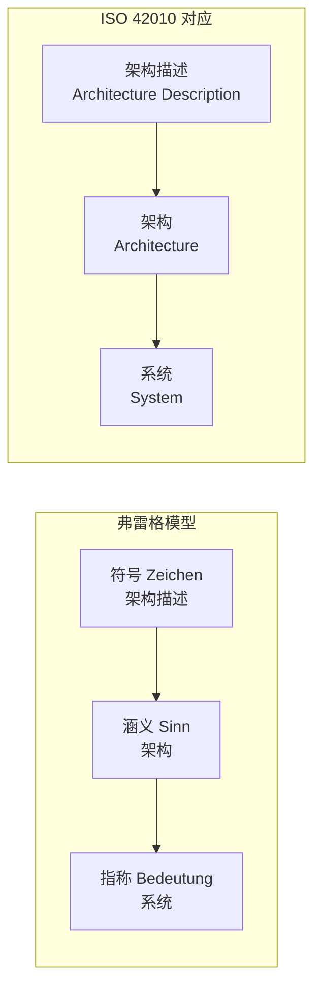
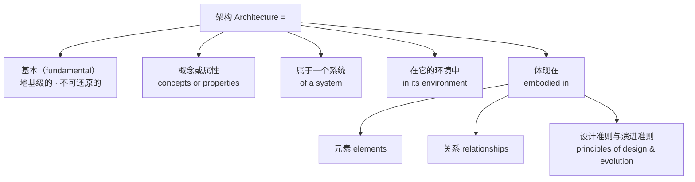
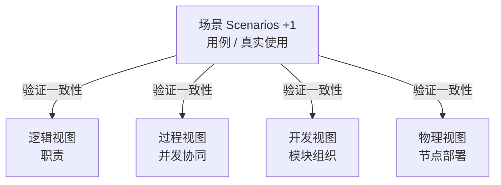

# 第10章 架构：系统最重要的决定

> 本章概念：架构 / 架构描述
> 英文来源：architecture / architecture description（ISO/IEC/IEEE 42010）
> 主案例：冰链科技冷链温控箱（产品侧）｜ 镜照：恒信集团合同审批系统（IT侧）
> 对应研习笔记：06-架构概念精讲-从术语到实践（§一~§三）+ 07-架构概念精讲-从概念设计到架构

---

## 10.1 章首 · 误解现场

架构评审会，冰链科技，周四上午。老周把 U 盘插上投影，屏幕上出现一张图。

四层方块，从下到上：硬件层（温控单元、传感器、电池）、固件层、云端层（数据采集、追溯平台）、App 层。箭头从传感器一路画到 App，旁边标着"温度数据"。

"这就是我们 M3 的架构。"老周讲得很快，十分钟，把四层方块过了一遍。"硬件和固件是我这边，云端是阿凯他们三个，App 是老李。测试的小赵，验证确认归她。有问题的现在提。"

没人提。散会。图被存进共享盘，文件名"M3-架构v1.0"。再没人打开过它。

三个月后，三个问题先后找上门。

第一个问题，产品经理小林要调需求："温度数据实时上传间隔，从 1 分钟改成 5 分钟。影响什么？"——会议室里没人能答。那张图只画了"温度数据"一根箭头，没画采集间隔在哪个环节定、改它要动固件还是云端。

第二个问题，老周想加"断电补传"：运输途中断电，数据回传漏了，恢复后自动补传。他问云端团队："重连逻辑到底在哪一端？"云端说："这你固件的事。"可固件就是老周自己写的，他知道固件里根本没有重连逻辑。

老周反问："那断电后谁负责补传？"——两个团队都答不上来。他们在图里找依据——图里只有四层方块和一根箭头，没有答案。

第三个问题最致命。客户问："你们 M3 到底是什么系统？"——老周答："温控箱。"云端团队答："追溯平台。"App 团队答："冷链管理 App。"三个人，三个答案。

老周后来把图翻出来，想维护一版新的。他对着那张图看了很久，忽然意识到一个让他后背发凉的事实：**这张图，从来没有描述过真正的 M3。**

如果你坐在这间会议室里，你可能觉得他们挺冤——架构画了，评审开了，还要怎样？这一章要推翻的，正是这个直觉。

那张四层方块图，在架构领域有个准确的名字——它叫**架构描述**，而且只是架构描述里极其粗糙的一小块。老周他们把这块"描述"当成了架构本身，于是图烂掉的时候，他们以为架构也烂掉了——可 M3 的架构一直活着，只是从没人把它说清楚。

这一章，我们把"架构"和"架构描述"这两把词分开钉死。你会发现三件反直觉的事：**架构不是一张框图；系统、架构、架构描述是三个不同的东西；而好的架构，是约束，也是解放。**

---

## 本章问题

读完本章，你应该能回答：

1. 架构到底是什么？为什么"画一张框图"不算做架构？
2. 什么是架构的"免疫系统"？为什么设计准则和演进准则缺一个，系统要么一改就坏、要么建出来就不对？
3. 系统、架构、架构描述，三者差在哪？为什么架构"不长什么样"？
4. "业务架构、数据架构、应用架构、技术架构"——它们是一个架构，还是四个架构？
5. 架构描述怎么组织，才能让硬件、软件、客户、监管各取所需？
6. 相关方和关注点是什么？为什么关注点天然冲突、不可消除只能权衡？
7. 为什么说"约束即解放"？架构用约束，换来了什么自由？
8. "用了 Spring Cloud 就是微服务架构"——这句话错在哪？框架和架构差在哪？

---

## 开篇 · 本章枢纽（骨架先行）

先把本章要钉的两个词、和它们牵出的三层立起来——后面三幕，都是给这层骨架添血肉。

> **系统 ≠ 架构 ≠ 架构描述**（第1章补充里弗雷格模型：指称 ≠ 涵义 ≠ 符号）。
> 系统是实际存在的那台 M3；架构是它不可还原的涵义——"断链即报废还能撑到接入冷库、全程可追溯"那组决定；架构描述是把涵义写下来给人看的图或文档。

这一章的骨架是**三层 + 一把尺子 + 一个原则**：三层（系统 / 架构 / 架构描述）；一把尺子（**三判据**——去掉不是它 / 缺了垮掉 / 换了变质）；一个原则（**一个系统只有一个架构**，满大街的"XX 架构"都只是它的视角）。第一幕钉"架构"这个词本身，第二幕把它和容易混的东西分开，第三幕回答"怎么描述、有什么用"。

---

## 10.2 第一幕 架构是什么（定界）

> 这一幕把"架构"看清：先立三个词三层（我们到底在谈哪一层），再逐词拆开权威定义，给一把辨认架构的尺子（三判据），最后看它"体现在"哪里——元素与关系。

### 10.2.1 三个词，三层：把三个东西分开

老周的故事里其实混着三个不同的东西，一直没被分开：**M3 这台真实的箱子（系统）、M3 不可还原的涵义（架构）、老周画的那张图（架构描述）**。这一节，把这三个词钉在三层上。

第1章的补充里讲过"概念的语法"，里面有一个德国哲学家弗雷格（Frege）的经典模型：符号、涵义、指称。还记得"晨星"和"暮星"吗？两个词（符号）不同，呈现方式（涵义）不同，但它们指向的是同一个东西（指称）——金星。弗雷格最重要的一句话是：**涵义不等于指称。**

架构领域的三层结构，几乎就是弗雷格模型的翻版：



| 弗雷格 | ISO 42010 | 是什么 | M3 的例子 |
|---|---|---|---|
| 指称（Bedeutung） | **系统** | 实际存在的那个东西 | 产线上的 M3：温控硬件、固件、云端服务器、App，运行中的那一台 |
| 涵义（Sinn） | **架构** | 系统的不可还原本质 | "断链即报废还能撑到接入冷库、全程可追溯"——去掉就不是 M3 的那组决定 |
| 对涵义的表达 | **架构描述** | 把本质写下来给人看的东西 | 老周那张四层方块图，或任何一份架构文档 |

> 术语注：此处"架构描述"取宽义——任何把架构写下来给人看的东西（含概要定义）；严口径（按"相关方 → 关注点 → 视点 → 视图"组织的制品集合）见第三幕。

三个词之间，藏着两个必须记住的推论：

**推论一：同一个架构，可以有无数种描述。** M3 的架构可以画成四层框图（老周画的），可以画成数据流图（数据从传感器到追溯平台的每一跳），可以画成时序图（断电补传的完整过程），可以画成合规视图（监管怎么看追溯链）。

这些图长得完全不同，但它们都在描述**同一个** M3 架构。反过来也成立：**同一张图，可能根本没描述对架构**——老周那张图就是，它只画了元素，没画关系，更没画原则。

**推论二：系统不等于架构。** 这句话初看像废话，实则是全章最硬的一个区分。M3 的系统会报废、会换代、会被拆掉——**系统有生命周期**。

而 M3 的架构（那组不可还原的决定），在系统消失之后，还可能作为经验、作为教训、作为下一代产品的设计前提继续存在。架构是"这一个系统的涵义"，但它活的时间，往往比系统本身更长。

第6章埋过伏笔，第8章结尾也预告过同一句话——"第6章那棵树的枝条走向里藏着的，正是系统的不可逆涵义"。现在把这句话展开：第6章讲的概要定义，是设计树的树干树枝，它管结构、管承接。

而架构，是那棵树里**不可还原的部分**——树干长多粗、向哪分叉，决定了树长什么样；但"这棵树为什么而种"（它的不可还原涵义），才是架构。

**概要定义是架构的一种描述；架构是概要定义背后那些"去掉就不是它"的决定。**

### 10.2.2 权威定义：ISO/IEC/IEEE 42010 逐词拆解

架构不是软件和系统领域的原住民。它最初是建筑学的词——指承重结构、空间布局。软件工程在 1970 年代借用了它：结构化设计把模块划分、层次关系叫"架构"。

1990 年代系统越做越大，"软件架构"成为一门显学；2011 年，ISO/IEC/IEEE 42010 把"架构"从行业用语定稿成系统与软件工程标准。下面这份，就是被引用最多的权威定义，原文是这样的：

> **Architecture: Fundamental concepts or properties of a system in its environment embodied in its elements, relationships, and in the principles of its design and evolution.**
>
> 中文：架构是系统在其环境中的基本概念或属性，体现在其元素、关系以及设计演进原则之中。

这句话读起来像绕口令，但它是整个架构领域的"宪法条款"。逐词拆开，每个词都压着一个分量：



**第一块分量，"基本"（fundamental）。** 这是整句定义的核心。架构不关心系统的全部细节，只关心那些"如果改变就会让系统变成另一种系统"的东西。这划清了架构和详细设计的边界——后文 §10.2.3 专门拆它。

**第二块分量，"概念或属性"（concepts or properties）。** 注意原文用的是"或"（or），不是"和"（and）。这个细节值得停下来——因为中文翻译常写成"概念和属性"，把两个视角当成必须同时具备的两半。

原文的"or"更宽松：你可以从"这个系统的核心概念是什么"切入（订单是一种交易意图的记录），也可以从"这个系统的核心属性是什么"切入（这套系统最关键的不可变性质是数据可追溯）。**两条路都能走到架构，不必同时具备。**

**第三块分量，"在它的环境中"（in its environment）。** 架构不是孤立地描述一个盒子，而是描述这个盒子"放在什么环境里"。M3 的环境是冷链运输：低温车厢、路面颠簸、信号弱的山区、监管要追溯——环境定义了哪些属性才算"基本"。

同一个温控设备，放在实验室台架上，它的架构可以是"温度控制单元"；放在冷链运输里，它的架构必须包括"断链检测与补传"——**环境变了，什么算"基本"就变了。**

**第四块分量，"元素、关系、原则"（elements, relationships, principles）。** 这是架构的三个载体。元素是系统的组成部分（构件、模块、服务）；关系是元素之间的连接（接口、依赖、数据流、调用拓扑）；原则是约束设计和演化的规则。

我们常见的一个误区是只盯着元素——数出"有几个模块"——而忽略了关系和原则。可恰恰是关系和原则，承载着架构最硬的部分（1.4 展开，原则见 §10.3.3）。

**第五块分量，藏在最后半句："设计准则和演进准则"（principles of design and evolution）。** 架构不是一张静态的快照，它自带"怎么造"和"怎么变"两套规则。这一块在 §10.3.3 单独讲——它是架构成为"免疫系统"的关键。

### 10.2.3 "不可还原"三判据：什么才算基本

定义里那个"基本"（fundamental），是整句最容易被一带而过、却分量最重的词。它来自拉丁语 **fundamentum**——地基。地基在建筑最底层，承托一切；地基一动，整栋楼都要动；地基决定楼能盖多高、多稳。

但"地基"还是个比喻。怎么把一个概念或属性是不是"基本"的判断，变成可以操作的三条检验？ISO 42010 的语境里没有逐字给出，但从"fundamental"的本义可以推出三条判据：

| 判据 | 含义 | 通俗问法 | 微服务的例子 |
|---|---|---|---|
| **不可再分**（Irreducible） | 去掉它，就不再是它了 | 少了它还叫这个系统吗？ | "服务独立部署"是基本概念，不能再拆成更小的概念 |
| **不可缺失**（Necessary） | 缺少它，系统就垮掉 | 少了它系统还能成立吗？ | 没有"服务独立部署"，微服务就不是微服务了 |
| **不可替代**（Sufficient） | 换掉它，性质就变了 | 换成别的，还是同一个系统吗？ | 用"单体部署"替代"独立部署"，架构性质就变了 |

这三条判据，是把第1章三步识别法里最狠的那一步——**反事实检验**（去掉它，这个领域还成立吗）——用在了系统上：去掉它还是这个系统吗、缺少它系统垮吗、换掉它性质变吗。第1章用它识别"领域枢纽"，本章用它识别"系统架构"，同一个动作，换个对象。

用这三条，可以把"架构"从一堆"重要的事"里筛出来。为什么"采集间隔 1 分钟还是 5 分钟"不是架构？因为改了它，M3 还是 M3——可逆、可调、影响局部。

为什么"温度数据的所有权归云端还是归硬件"是架构？因为换了所有权，整个追溯链的职责、接口、合规口径全部跟着动——改了它，M3 就不是现在的 M3 了。

**架构决策和普通实现决策的分界线，就在这里：改它要花多大代价、影响多大范围、是不是几乎不可逆。**

回到 M3，用三判据筛一遍，什么浮上来了？——**"全程冷链可追溯、断链即报废时还能撑到接入冷库"**。这是 M3 不可还原的涵义：

- **不可再分**：去掉"断链即报废还能撑到接入冷库"，M3 就不是医疗冷链箱了，它退化成一只普通温控箱；
- **不可缺失**：没有全程可追溯，疫苗运输的合规底线没了，系统在监管意义上"垮掉"；
- **不可替代**：把"冷链可追溯"换成"只要温度对就行"，M3 的性质就变了——它从"运输保障系统"变成"保温容器"。

一个系统能拥有这样一组"去掉就不是它"的决定，正是我们说"M3 有架构"的全部含义。

最后，把方法论的那个瞬间点破：老周把"架构"从"一张框图"修正为"不可还原的涵义"，是一次枢纽修正。第1章说过，概念是活的、可修正的——勤校准是正常纠偏，不是失败。§10.2.2 那段行业史，本身就是"架构"被一路校准的轨迹。老周这一章要做的，不是背一条新定义，而是完成一次校准：把"架构"从"见过的框图"推到"拥有的涵义"。

> **概念卡片 · 架构**（四问为纲，九格为目；格号=九格尺子）
>
> | 四问 | 格 | 内容 |
> |---|---|---|
> | **它是什么** | ① | 系统在其环境中的基本概念或属性，体现在其元素、关系以及设计演进原则之中（ISO/IEC/IEEE 42010:2011） |
> | **它不是什么** | ⑥⑦ | 与"详细设计"构成最接近的辨析——架构是"去掉就不是这个系统"的决定（不可还原），详细设计是"改了系统还是它"的细节（可还原）；架构 ≠ 一张图——图是架构描述，架构是系统里那组不可还原的决定，真实存在但没有视觉形态 |
> | **它从哪来** | ②③⑨ | 从建筑学借入软件与系统领域——系统太复杂、一个人装不下时，用"最重要的决定"压复杂度；早期"架构=图纸" → 1970s 结构化设计 → 1990s 软件架构热 → 2011 ISO 42010 定稿；architecture ← 希腊语 architekton（首席工匠）、fundamental ← fundus（地基）——承托一切的底层决定 |
> | **它往哪去** | ④⑤⑧ | 它回答"如何把系统复杂度压成可管理"；在不可逆决策做出来之前、变更影响评估时、团队边界定义时用；误区 ✗ "架构就是那张图"（图会过时，决策可一直有效）✗ "架构等于技术选型"（选型只是"概念或属性"的一种体现） |
> | **判据** | 三问 | 去掉它还是这个系统吗？缺少它系统垮吗？换掉它性质变吗？——三问都答"是"，才是架构 |

### 10.2.4 元素与关系：系统的秘密藏在关系里

架构定义说，架构"体现在元素、关系以及原则之中"。元素和关系，是架构的两个基本构件。很多人理解架构，习惯先数元素——"我们系统有订单服务、库存服务、用户服务、通知服务"——元素好数，因为它们是名词，看得见。关系才是那个被漏掉的动词。

为什么关系比元素更要紧？因为系统的**涌现属性**（emergent property）来自关系，不来自单个元素。这个道理在第2章讲过一遍——每个发动机都正常、每块机翼都达标，飞机未必能飞；涌现属性来自元素之间的关系。放在架构层面，它有一个非常具体的推论：

> **可靠性的瓶颈，通常不在单个组件，而在组件之间的交互模式。**

单个温度传感器精度再高，也拦不住"传感器→固件→云端"这条链上某个环节的重传超时；单个微服务再健康，也拦不住调用链上的一次超时重试风暴。系统里最容易出事的，从来不是"某个零件坏了"，而是"零件之间的配合在特定场景下集体失灵"。

M3 的架构，如果只画元素，就是四层方块（章首老周那张图）；如果加上关系，画面完全变了。

它要回答的是：**数据从传感器出发，经过固件、云端、追溯平台，最终到达"谁的眼睛"？每一跳之间，如果断了，谁负责补？谁负责告警？** 这些"跳"和"断"，就是关系。

老周那张图只画了一根叫"温度数据"的箭头，等于只画了元素，没画关系——而 M3 架构里最硬的秘密，恰恰全在关系里。

把元素和关系摆在一起，架构才完整。而决定"哪些关系必须成立、断不得"，就是架构里的原则——下一幕 §10.3.3 展开。

## 案例进展①｜"M3 到底是什么系统？"——老周开始找那个不可还原的东西

章首那场会之后，老周被"三个人三个答案"刺痛了。他把小林、小赵拉到会议室，想搞清一件事：我们到底守着一个什么样的系统？

小林先开口："M3 就是个温度记录仪加个箱子，能调温、能记录、能上传。你说的什么'系统'，不就是这些功能的集合吗？"

老周摇头："如果是功能的集合，那'加个摄像头记录装卸过程'也只是加个功能，M3 还是 M3。可我直觉不是这样——加上摄像头，M3 就变味了。它就不再是'冷链运输的守护者'，变成'能录像的箱子'。"

小赵接话："那你觉得 M3 是什么？"

老周在纸上写："**断链即报废的疫苗，能从出库一路撑到接入冷库，全程可追溯。** 这是 M3 不可还原的东西。去掉它，M3 就是一只能调温的箱子；有它，M3 才是一台医疗冷链运输的保障设备。"

"你这不是 M3 的功能，"小赵盯着那行字，"这是 M3 为什么存在的理由。"

"对。所以我不问'M3 有哪些模块'，我问'少了什么 M3 就不是 M3'。**一问模块，你会数出十个；一问'少了什么不是它'，你会筛出那三四个真正要命的。** 要命的，才是架构。"

三个人都不说话了。他们第一次意识到，自己守着一个系统快两年，却从没讨论过它"不可还原"的部分是什么。

---

## 10.3 第二幕 架构不是什么（磨边界）

> 这一幕把"架构"和它容易混的东西分开——判据主义在这里登场：概念靠正例活，靠反例定型。它不是一张图、不是技术选型、不是一个而是"一个"，更不是静态的——它是一套活的学习系统。

### 10.3.1 不是一张图：先看病

老周的病，不是"没画好图"，是**把图当成了架构**。这一节把"架构"和"架构描述"之间的那道分界线，先用直觉划出来。

"架构"这个词，在日常里被用得非常泛滥。有人说"我们的架构是微服务"，有人说"架构图在共享盘"（指一张图），有人说"这次上架改了架构"（指改了技术选型），还有人把系统拓扑图、部署图、ER 图统统叫"架构"。这些用法有一个共同的毛病：**把"架构"当成了一样能画出来、能保存、能过期的东西。**

它甚至还能漂移出完全不同的所指：**组织架构**（管理层级、汇报关系）、**产品形态**（产品模块怎么划）——那是别的领域的词，不是本书要讲的"架构"。第1章章首那场会，吵的正是这三种"架构"。

但你想过一个问题吗——**如果一个系统的架构"过时了"，系统本身会怎样？**

老周的团队遇到的情况就是这样的：那张图三个月没更新，可 M3 温控箱一直在正常工作，温度一直在采集、一直在上传、冷链一直在被追溯。图是旧的，系统是新的，两者早已分道扬镳。

如果图就是架构，那架构早就该和系统脱节了——可实际上，M3 的"根本逻辑"并没有变：温度数据依然从传感器流向追溯平台，断链依然会触发告警。**变的只是细节（上传间隔），没变的是那组更底层的决定。**

这个对照，指向一个反直觉的结论：

> **架构和图，不在同一个世界。图是纸上的、可见的、会过时的；架构是系统里那些不可还原的决定，真实存在，但不会因为你没更新一张图就消失。**

顺着这个直觉再走一步——既然架构不是图，那它"长什么样"？答案同样是反直觉的：**架构不长什么样。** "长什么样"是一个视觉范畴的问题，而架构是一个逻辑范畴的存在——它是"一组基本决策及其衍生的约束关系"，真实存在，但不可直接视见。

这听上去有点玄，但日常生活里到处都是同类的东西：

- **宪法长什么样？** 你看到的永远是宪法文本，宪法本身是一套治理规则；
- **DNA 长什么样？** 你看到的是双螺旋结构图，DNA 本身是碱基序列里编码的生命信息；
- **一个公司的组织架构长什么样？** 你看到的永远是组织架构图，真正的组织架构是汇报关系、决策权限、协作路径——这些东西真实存在，但没有"样子"。

架构是同一类存在。你能画出来的永远是架构描述——从某个视角、回答某组关注点的一份投影：

```
架构（不可视见——一组基本决策及其约束）
  │
  │  不等于你能画出来的任何一张图
  │
  └── 通过架构描述（文档/图）来表达
        │
        ├── 系统上下文视图：画出来的是边界和外部交互
        ├── 功能/行为视图：画出来的是功能分解和动态协作
        ├── 构建/开发视图：画出来的是构件清单和接口契约
        └── ……

      只有投影，没有"原图"。
```

反过来说，如果有人问"给我看一下你们系统的架构"，他能得到的永远是一组视图——边界图、构件图、数据模型——而不是一张叫"架构"的图。这不是因为你不肯给，而是因为**不存在这样一张图**。

这个区分不是故弄玄虚，它有非常实在的后果。如果把架构等同于某张图，那么图过时了，人就会觉得"架构过时了"——而实际上，过时的只是那张图；架构决策本身（数据按域划分、构件间通过接口通信、变更通过追溯链路评估影响）可以持续有效。老周的团队，就是被这个区分困住的典型：**图可以烂掉，决策可以活着。**

### 10.3.2 不是一个而是一堆"XX 架构"：一个系统，一个架构

现在到了架构领域最热闹、也最混乱的一个问题：市面上有"业务架构""数据架构""应用架构""技术架构"，还有"需求架构""功能架构""逻辑架构""物理架构"，甚至"微服务架构""事件驱动架构"——这些到底是不是多个架构？

先把结论钉死，再解释：

> **一个系统只有一个架构。** 所有"XX 架构"，都是对**同一个架构**从不同角度、不同抽象层次上的描述——它们是架构的视图，不是多个独立的架构。

一个系统为什么会有这么多"架构"？因为日常用语把"架构描述"简称成"架构"，把"架构视图"也简称成"架构"，简称来简称去，听起来就好像系统有多个架构了。**就像一个只有一副骨骼的人，医生可以正面拍 X 光、侧面拍 X 光、横切面拍 CT 切片——这些是同一副骨骼的影像，不是多副骨骼。**

市面上那些"XX 架构"，其实来自**两套独立的分类维度**，叠在一起就产生了混乱：

**维度一：关注域（按"看什么"切分）**——TOGAF 等企业架构框架的习惯：

| 传统称呼 | 实际含义 | 关注的问题 |
|---|---|---|
| 业务架构 | 从业务视角描述架构 | 业务能力是什么？业务流程怎么走？组织怎么分配？ |
| 数据架构 | 从数据视角描述架构 | 数据资产有哪些？数据从哪来、归谁管、怎么用？ |
| 应用架构 | 从应用视角描述架构 | 有哪些应用系统？它们之间怎么交互？ |
| 技术架构 | 从技术视角描述架构 | 用什么技术平台？基础设施怎么部署？ |

**维度二：抽象层次（按"多详细"切分）**——系统工程传统的分层习惯：

| 传统称呼 | 实际含义 | 关注的问题 |
|---|---|---|
| 概念架构 / 需求架构 | 最抽象的架构描述 | 系统要做什么？有哪些相关方？ |
| 逻辑架构 / 功能架构 | 中间的架构描述 | 系统提供什么功能？逻辑数据流是什么？ |
| 物理架构 / 部署架构 | 最具体的架构描述 | 功能跑在哪些物理节点上？用什么技术实现？ |

这两个维度交叉，任何一个具体的架构视图，都同时落在某个"关注域 × 抽象层次"的交叉点上：

```
关注域 \ 抽象层次 │ 概念层       │ 逻辑层         │ 物理层
────────────────┼─────────────┼───────────────┼──────────────
业务            │ 业务能力图   │ 业务流程图     │ 业务组织图
数据            │ 概念数据模型 │ 逻辑数据模型   │ 物理数据模型
应用            │ 应用功能列表 │ 应用交互图     │ 应用部署图
技术            │ 技术选型原则 │ 技术平台架构   │ 网络拓扑图
```

**第三类最容易混的——架构风格/架构模式：**"微服务架构""事件驱动架构""分层架构""六边形架构"……这些甚至不是架构的视图，而是**架构决策的套路**——相当于建筑里的框架结构、剪力墙结构、钢结构：这是结构体系的选择，不是建筑本身。

你选微服务，只是选了一种"怎么组织元素和关系"的风格；具体你的系统是什么架构，还要看你拿这种风格做了什么不可还原的决定。

**第四类——框架：把套路"物化"成现成的东西**

还有一种说法，比"微服务架构"更常见、也更唬人——**框架**。老周团队里有人张嘴就是"M3 用的某某嵌入式框架"，恒信那边开口就是"我们技术栈全是 Spring 全家桶"。软件圈几乎每天都能听见一句话："用了 Spring Cloud，所以我们系统是微服务架构。"

这句话错在哪？Spring Cloud 是一套开源**框架**：服务注册、配置中心、熔断降级，现成的轮子一堆。你下载、引入、按它的规则把业务代码填进去，一个微服务项目的骨架就搭起来了。**但骨架搭起来，不等于架构有了。** 服务边界划在哪、数据归哪个域、接口契约怎么定——这三样，Spring Cloud 一个都没替你决定。你下载的是工具，工具替你做不了决定。

那么"框架"到底是什么？可以给一个跨领域的通用定义：

> **框架** = 对某一类事物或活动，预先提供的"骨架 + 位置 + 组织规则"——它规定内容的结构、边界和相互关系，但本身不填充具体内容，留待使用者填入。

> 术语注：此"框架"指可复用的制品（软件框架/架构框架），区别于第1章"有框架 vs 无框架"里的"认知框架"（知识骨架）——那是学习方法论里的所指，两者同名不同物。

三个特征，逐条看：

- **骨架性（结构先行）**：先定结构，不定血肉——框架把应用的骨架和调用流预定义好了；
- **留白性（扩展点）**：刻意留出填白的位置——扩展点、钩子，就是留给你填业务代码的地方；
- **复用性（一类多用）**：面向一类场景，不面向一个实例——一个框架被无数系统反复实例化。

"框架"和"架构"，最根本的一条分界：

> **架构是"这一个"的组织本质，框架是"这一类"的组织方式。架构属于系统，框架属于领域。**

一个系统有且只有一个架构；框架是系统**借来**的——可以换，甚至可以完全不用、自己发明。换掉 Spring Cloud，你的系统还是那个系统，对外功能和业务逻辑可以一个字节不变；改动服务边界，你的系统就不是那个系统了。**试金石一句话：删掉它，系统还在吗？**

把这一章的三层和框架摆成一条链，关系就全清楚了：

```
架构风格 / 模式（Pattern）＝ 抽象的决策套路（微服务、事件驱动、分层）
      ↓  固化成可复用制品 / 规范
框架（Framework）＝ 套路的具体化
      ├─ 软件框架：套路变成代码骨架 + 控制反转
      │             （控制反转 = 框架调用你的代码，不是你的代码调用框架）
      └─ 架构框架：套路变成描述架构的规范（4+1、TOGAF，见后文 §10.4.4）
      ↓  应用到具体系统 + 叠加系统的独特决策
架构（Architecture）＝ 这个系统的本质属性（套路被实例化后的结果 + 系统独有的选择）
```

这条链解释了"为什么用框架不等于有架构"：**框架给你的是骨架，不是决策。** 系统的架构 = 框架提供的骨架 + 你针对这个系统做出的独特决策。框架把"这一类"的组织方式给了你；"这一个"是什么，框架永远回答不了。

> 注：这个家族里还有一类"架构框架"——4+1、TOGAF 那些"预定义的视点集合"（后文 §10.4.4）。它是同一种"骨架 + 规则"，只不过骨架是视点和使用规则，填进去的是每个系统的架构描述，而不是架构本身。

把几种说法总结成一张表，一眼分清：

| 说法 | 实际含义 | 类比 |
|---|---|---|
| "业务架构 + 数据架构 + 应用架构 + 技术架构" | 同一个架构的四个**关注域视角** | 一栋楼的平面图 + 结构图 + 管线图 + 立面图 |
| "概念架构 → 逻辑架构 → 物理架构" | 同一个架构从抽象到具体的**描述层次** | 概念草图 → 方案设计 → 扩初设计 → 施工图 |
| "微服务架构 / 事件驱动架构 / 分层架构……" | **架构模式 / 架构风格**——架构决策的套路 | 框架结构 / 剪力墙结构 / 钢结构——结构体系选择 |
| "用了 Spring Cloud" | **框架**——把决策套路物化成的可复用制品 | 预制构件 + 装配手册——不是楼本身 |

理解了这个，老周团队里"三个人三个答案"的病根就清晰了：他们不是有三个架构，他们是**从三个不同的视角看同一个 M3 架构，却从没把三个视角对齐过**。

硬件团队看到的 M3、软件团队看到的 M3、客户看到的 M3，是同一个 M3 的三个视图——视图之间对不上，不是架构有多个，是**描述没有统一**。

这，正是第三幕要讲的事：怎么把架构描述组织好，让每个相关方都看到自己该看的那一面，而且各面能拼回同一个整体。

### 10.3.3 不是静态图——是活的学习系统：设计准则 + 演进准则

上一幕的定义里有最后半句——"设计演进原则"——很多人读定义时滑过去，却在系统活到第三年时被反复捶打。上一节刚说架构"不是静态图"，这一节把它说透：**架构不是一张静态的快照，它自带"怎么造"和"怎么变"两套规则，是一套活的学习系统。** 架构里其实有两类原则，分工完全不同：

| 准则类型 | 管什么 | 定义"什么是对的" | 微服务的例子 |
|---|---|---|---|
| **设计准则**（Design Principles） | 怎么造 | 约束从无到有的创建过程 | 每个服务独立部署；服务间通过 API 通信、不共享数据库；服务按业务能力划分 |
| **演进准则**（Evolution Principles） | 怎么变 | 约束随时间变化的过程 | 新增服务不能耦合已有服务的内部实现；服务拆分必须保持向后兼容；技术栈升级逐个服务进行 |

> 术语注：ISO 42010 原文为 principles of design and evolution——设计的原则与演进的原则。本书把这半句作为五块设计的两块工作名，统一译作"设计准则 / 演进准则"，与第11章一致。

为什么两类准则缺一不可？分别缺掉看看：

- **只有设计准则，没有演进准则**：系统建出来是对的，但一改就坏。微服务建好了，第二个月有人为了省事直接改同事服务的内部实现——架构还标着"服务独立部署"，实际已经耦合了；
- **只有演进准则，没有设计准则**：系统知道怎么变，但建出来就不对。规则写了一大堆"变更要保持向后兼容"，可最初的服务边界就是划错了，怎么变都在错的框架里打转。

两类原则合在一起，才构成一个完整的闭环——**既定义正确，又维护正确**。这个闭环有个非常贴切的名字，在架构文献里被反复使用：

> **架构是系统的免疫系统。**

免疫系统的比喻，精准在两点。其一，**它定义什么是"自我"**——设计准则说清"哪些决定构成了这个系统的本质"，偏离这些决定，系统就"病变"了。

其二，**它主动防御变化**——演进准则说清"变化可以怎么来、不能怎么来"，让系统在持续变化中仍然保持"还是这个系统"。

没有演进准则的微服务，会退化成架构圈著名的病名——**分布式单体**（distributed monolith）：服务越来越多，耦合越来越紧，最终变成分布在不同进程里的单体应用。名字还叫微服务，本质已经塌了。

把 M3 放进来，演进准则立刻变得血肉分明。M3 的演进准则可以长这样："新增传感器类型，不得破坏已有追溯链路；固件升级必须向后兼容已出厂的设备；云端采集协议的变更，要先过追溯完整性评审。"

注意，这些原则没有一条在说"怎么造 M3"，它们全部在说"M3 造出来之后，怎么变才不散架"。老周的团队如果早把这些写下来，三个月里那三个问题至少有两个当场能答。

还有一层，是"免疫系统"最容易被人忽略的延伸——**架构是一个学习系统**。每次架构层面的变更失误，都应该沉淀为一条架构原则的更新。

"为什么这个接口契约的设计没有预见到这种使用场景？"——下次设计类似接口时，这个教训变成原则的一部分。老周的图三个月没更新，但架构知识如果能持续沉淀，M3 的"免疫系统"就一直在长。

## 案例进展②｜图过时了，决策还活着

加"断电补传"功能的那个月，老周一直憋着一口气。直到有一天，他无意间听到云端阿凯和硬件组新人小陈的一段对话，才豁然开朗。

阿凯："补传的数据，还是归'追溯库'吧？按老规矩，温度数据归属追溯域，谁都不许随便改字段。"

小陈："那必须的。数据所有权是定死的——传感器只管采，云端只管传，追溯平台管存管管看，这个边界动不得。"

老周在旁边听完，忽然愣住了。他翻出那张三个月没更新的架构图——图上根本没有"数据所有权"这回事，图里只有四层方块和一根箭头。可这两个人，刚刚遵守了一条**图里从来没有画出来过的决定**。

他把这个发现说给小林听："我们以为架构是那张图。其实不是。我们团队真正在遵守的那些'老规矩'——数据所有权归追溯域、断链必须实时告警、固件升级不能毁已出厂的箱子——才是 M3 的架构。图早就烂了，这些规矩一直活着。"

小林："那这些规矩哪来的？"

老周想了想："有些是当初吵出来的，有些是出事之后定的，有些是……不知不觉就有的。反正都在大家脑子里，就是没人写下来。"

小林低头写了个字："所以问题不是'图过时了'，是'这些要命的规矩从没被写下来过'。图过时了可以再画，规矩要是丢了，M3 就真的散了。"

老周那天晚上，把那些"老规矩"一条条写了下来。他后来说，那比他画过的任何一张架构图都更像 M3 的架构——**因为图描述的是长得像的东西，那些规矩描述的是"少了它 M3 就不是 M3"的东西。**

---

## 10.4 第三幕 架构往哪去（运用）

> 这一幕把"架构"用起来：怎么把它说清楚（架构描述——把同一个涵义切给不同的人看），它有什么用（认知/决策/变更/组织四维回报），以及它最深的回报——约束即解放。最后落到人：谁来识别这些决定。

### 10.4.1 为什么需要架构描述

如果架构是系统的涵义，那么一个自然的追问是：**既然架构"不长什么样"，为什么我们还要写文档、画图、做架构描述？**

答案是：**涵义锁在脑子里，没有用。** M3 的架构再清晰，如果只存在于老周一个人的脑子里，它就不产生任何协作价值——没人知道数据所有权的边界，新来的工程师不知道断链检测为什么是刚性边界，客户无从理解 M3 为什么值得信任。

架构必须被**表达**出来，才能被共享、被讨论、被检查、被传承。架构描述，就是这个"表达"。

但"表达"立刻撞上一个难题：**不同的人关心不同的东西。** 给司机看固件的内存布局没有意义，给疾控中心看 App 的界面层级也没有意义。老周关心的温控电路，阿凯关心的云端吞吐，监管关心的追溯完整性，老板关心的成本——他们的关注点几乎没有交集。

于是架构描述必须回答一个"一个涵义，多种表达"的问题。ISO 42010 用一条精密的链条解决了它，这是整个架构描述领域最重要的一条链：


这条链从左往右，是"谁想看 → 关心什么 → 按什么规则看 → 看到什么 → 拼成完整的描述 → 表达哪个涵义 → 属于哪个系统"。后面三节，把它逐环拆开。

### 10.4.2 相关方与关注点：关注点天然冲突

链条的第一环，是**相关方**（Stakeholder）——对系统有利益关系的任何个体、团队或组织。注意"任何"两个字：不只是用户。开发者、运维、安全团队、业务方、监管、甚至未来的维护者和审计员，都是相关方。

每个相关方都有自己对系统的**关注点**（Concern）——任何对系统的兴趣：功能性的（能不能做？）、非功能性的（快不快？安不安全？）、约束性的（合规吗？预算够吗？）。一个相关方可以有多个关注点，一个关注点也可以被多个相关方共享。

M3 的相关方和关注点，摆出来是一张这样的表：

| 相关方 | 核心关注点 | 一句话关心的问题 |
|---|---|---|
| 运输司机 | 可用性 | 我在驾驶舱里能不能一眼看到温度正常？报警了我能不能听懂？ |
| 疾控中心 / 客户 | 可追溯性 | 这批疫苗全程温度谁负责证明？断过链的我能查出来吗？ |
| 维修工程师 | 可维修性 | 坏了一个传感器，能不能快速定位、不拆整机？ |
| 监管 | 合规性 | 追溯记录留存多久？数据有没有被改过的可能？ |
| 老板 | 成本与进度 | 这一版要多少钱、多久、能不能按期上市？ |

然后是最关键的一个事实——**这些关注点天然冲突。** ISO 42010 的原文说得毫不客气：

> *"The concerns of stakeholders are frequently broad, varied, and conflicting."*（相关方的关注点是宽泛的、多样的、且相互冲突的。）

怎么个冲突法？给上面那张表加几根拉扯的线：监管要更多加密和留存，会拖慢数据链路、增加存储成本；老板要快上线，会积累技术债、牺牲可维修性；司机要报警简单粗暴，和追溯要记录详尽精确互相打架。**M3 的架构，不是"找一个让所有关注点都满意的解"，而是"在互相冲突的关注点之间，做出一个有意识的权衡"。**

"权衡"这个词，是这一节的重点。因为关注点冲突**不可消除，只能权衡**——没有任何架构能让"快、便宜、安全、全功能"同时到顶。而权衡有一个前提：**你得先能看到每个方面。**

看不见安全，就不会为安全取舍；看不见运维，就不会为可运维取舍。老周的团队为什么翻车？因为他们连"M3 有哪些相关方、各关心什么"都没摆出来过——没有这张表，所谓"架构评审"就只能对着四层方块图走个过场。

看到每个方面，靠什么？靠下一环——视点与视图。

### 10.4.3 视点与视图：相机比喻

"看到每个方面"这句话，字面上就指向一个比喻——**照相机**。这个比喻是理解视点（Viewpoint）和视图（View）最快的门：

| | 照相机 | 架构 |
|---|---|---|
| 规则 / 设置 | 角度、镜头、滤镜 | **视点**（Viewpoint） |
| 产物 | 照片 | **视图**（View） |
| 被拍的对象 | 风景 / 人物 | **系统** |

同一个建筑，正面拍和俯拍是两张不同的照片（视图）；用什么角度、什么镜头、开不开滤镜，是拍摄规则（视点）。**一张照片服从一套拍摄规则，一套规则可以拍出很多张照片。**


对应到架构描述，视点是一套"怎么画"的规则，它规定了：这个视角关注哪些关注点、服务于哪些相关方、用什么建模语言（类图？部署图？数据流图？）、必须画什么、可以忽略什么。视图是按某套视点的规则**实际画出来的那一张图**——是具体的东西，一张类图、一份部署拓扑、一个用例模型。

这里有一个容易产生抵触的细节，值得说透：**每个视图都是刻意的"不完整"。** 逻辑视图不展示部署，物理视图不展示类关系——这不是缺陷，是设计目的。

因为"完整地"画出系统的每一面，等于把所有关注点糊在一张图上——那张图对任何人都没有用。

每个视图的价值，恰恰在于**剥离掉你不关心的部分，只保留本质**——从无限细节里提取可操作的本质，正是"概念"的本义（研习笔记 06/07 的界定）。**视图，就是架构的概念化切片。**

那么，一个系统需要几个视图？这个问题曾经吵得天翻地覆，而 ISO 42010 给出的答案异常清爽：

> **视图的完备性由相关方及其关注点决定，不由方法论决定。** 3 个也好、7 个也好、12 个也好——只要每一个视图你都能说出"它在回答谁的什么问题"，且没有重要相关方的核心关注点被遗漏，就是完备的。

推导路径，是一套可以在白板上走完的三步：

```
1. 识别重要相关方 → 2. 明确每个相关方的核心关注点 → 3. 按语言和表达方式聚类关注点 → 每个聚类成为一个视图
→ 最后检查：有没有重要相关方的关注点被漏掉了？
```

这个答案把"我们需要几个视图"这个永远吵不清楚的问题，转化成了"我们的相关方是谁、他们关心什么"这个可以具体讨论的问题。**前者是方法论之争，后者是项目分析。**

### 10.4.4 4+1 视图模型：场景是胶水

有了视点这个工具，剩下的问题就是：**有没有一套"够用"的视点集合？** 业界最经典的回答，是 Philippe Kruchten 在 1995 年提出的 **4+1 视图模型**——最早、最经典，也是理解"视图怎么分工、怎么拼回整体"最好的范本：

| 视图 | 服务谁 | 关注什么 | 常用表示 |
|---|---|---|---|
| **逻辑视图**（Logical） | 设计师 / 用户 | 类、对象、职责、关系 | 类图 |
| **过程视图**（Process） | 集成者 | 进程、线程、并发、时序 | 活动图、时序图 |
| **开发视图**（Development） | 程序员 | 模块、层次、包、依赖 | 组件图 |
| **物理视图**（Physical） | 系统工程师 | 节点、网络、部署 | 部署图 |
| **场景 +1**（Scenarios） | 所有人 | 用例——验证其余四个视图 | 用例图 |

前四个视图各管一个关注面：逻辑视图回答"系统有什么职责"，过程视图回答"这些职责怎么协同跑起来"，开发视图回答"代码怎么组织"，物理视图回答"跑在哪些机器上"。这些都是我们熟悉的"XX 架构"的老面孔。

真正的神来之笔，是那个"+1"。**Scenarios（场景）不是第五个视图，而是胶水。** 它的职责是拿一条真实的使用场景，横着穿过去，检验前四个视图是否互相矛盾：

> "用户下单"这个场景，能不能一路走通——从逻辑视图（哪些类参与？）→ 过程视图（哪些线程跑？）→ 开发视图（哪些模块实现？）→ 物理视图（哪些节点部署？）？走不通，说明四个视图之间藏着矛盾。



这就是"多个视图能拼回同一个整体"的验证机制：视图之间不是各画各的，而是**用真实场景当试金石，看它们是不是同一个架构的四个切面**。

老周团队"三个人三个答案"的病，用 4+1 的话说是：三个视角（硬件/软件/客户）各画各的，**没有一条真实场景横着穿过去检查它们是否对得上**——于是 M3 在三个团队眼里变成了三个系统。

4+1 之后，业界又长出了一批"预定义的视点集合"，术语上叫**架构框架**（Architecture Framework）——把一组视点和使用规则打包，让不同项目用同一套语言，从而可积累、可比较、可复用：

| 框架 | 领域 / 来源 | 核心视点 | 特点 |
|---|---|---|---|
| 4+1 视图模型 | 软件 / Kruchten 1995 | Logical, Process, Development, Physical, Scenarios | 最早最经典 |
| C4 模型 | 软件 / Simon Brown | Context, Container, Component, Code | 简洁实用，4 层缩放 |
| TOGAF | 企业 / The Open Group | Business, Data, Application, Technology | 企业级 + ADM 方法论 |
| Zachman | 企业 / John Zachman | 6 行 × 6 列矩阵 | 分类法，非流程 |

框架不是"对错"的选择，是"适配"的选择——软件系统常用 4+1 或 C4，企业架构常用 TOGAF 或 Zachman。**框架的价值在于"大家用同一套语言"：如果每个项目都自己发明视点，A 项目的架构描述 B 项目就看不懂。**

## 案例进展③｜恒信镜照：四张图，四个对不上的"架构"

恒信的架构师李工，最近也在为"架构"头疼。他把合同审批系统的架构，画成了四张图：业务架构图、数据架构图、应用架构图、技术架构图——四张，挂满了一面墙。

Ada 路过，站住看了五分钟，问了一个问题："李工，合同审批里'一份合同'，在这四张图里分别是什么？"

李工指着四张图："业务架构里，一份合同是从发起、法务初审、财务校验、业务终审到归档的一条流程；数据架构里，一份合同是'合同主表 + 审批记录 + 附件'三个实体；应用架构里，一份合同是审批引擎里的一个流程实例；技术架构里……呃，技术架构我没画合同。"

"就凭这最后一句，"Ada 说，"你的四张图是四个系统。"

李工皱眉："不会吧？我是按标准模板画的——业务、数据、应用、技术，四个架构各画各的，没错啊。"

"模板没错，错的是你把它当成了四个架构。"Ada 在白板上画了一根横线，"合同审批系统只有一个架构。业务、数据、应用、技术，是对**同一个架构**的四个关注域视角。

那它们之间就必须对得上：业务架构里那份合同走到'法务初审'，数据架构里'审批记录'这个实体就得有'法务初审'这条记录；技术架构里就必须有支撑它的服务。

**你的四张图，用的是同一个词'合同'，却在四个图里指了四种东西——这才是四张图对不上的原因。**"

李工："那我怎么知道对没对上？"

Ada："拿一条真实场景横着穿过去。比如'法务老张在 App 上审批一份 500 万的合同'——这条场景，在你的业务架构里走哪条流程？数据架构里动哪些表？应用架构里调哪个服务？技术架构里跑在哪台机器上？**一条场景走不完四张图，四张图就是四个系统。**"

李工那天把四张图撤下来，重新画。他后来说，他画的不是"四个架构"，是一个架构的四个切面——而让四个切面对得上的，不是模板，是一条真实场景。

> **概念卡片 · 架构描述**（四问为纲，九格为目；格号=九格尺子）
>
> | 四问 | 格 | 内容 |
> |---|---|---|
> | **它是什么** | ① | 对架构的表达——按"相关方 → 关注点 → 视点 → 视图"组织起来的制品集合（ISO/IEC/IEEE 42010） |
> | **它不是什么** | ⑥⑦ | 架构是涵义（不可视见），架构描述是符号（可读可看可存档）——涵义 ≠ 符号；架构描述 ≠ 某一张视图（视图是组成部分），也不只是画图（还包括原则、决策记录） |
> | **它从哪来** | ②③⑨ | ISO 42010 看到"架构"被图、文档、视图混着叫，于是把"对架构的表达"单独命名出来——表达要给人看，就要按相关方切分；1990s 软件架构热催生"视点/视图"研究 → 2000s IEEE 1471 → 2011 并入 ISO 42010 定稿；description ← de-（向下）+ scribere（写）——把本来无形的涵义"写下来" |
> | **它往哪去** | ④⑤⑧ | 它回答"如何把不可视见的涵义变成可共享、可讨论、可检查、可传承的表达"；在架构评审、跨团队协作、新人入门、监管合规时用；误区 ✗ "图过时了=架构过时了"（过时的只是描述，决策可以一直有效）✗ "架构描述=画一张总图"（它是一组按视点组织的视图，让每个相关方看到该看的那一面） |
> | **判据** | 链条 | 相关方 → 关注点 → 视点 → 视图的链条完整吗？每个视图能说出"在回答谁的什么问题"吗？有一条真实场景验证视图间的一致性吗？ |

### 10.4.5 架构是压缩：认知层面的心智模型

讲到现在，我们一直在回答"架构是什么"。这一幕后半段回答另一个更现实的问题：**架构到底有什么用？值得投入吗？**

从认知层面说起。一个人同时能有效处理的信息量是有限的（心理学经典说法是 7±2 个组块）。一个真实的企业系统可能有两三百个服务、上千张表、上万个接口——远超任何单个人的认知容量。而 M3 这种"硬件 + 固件 + 云端 + App"的复合系统，哪怕团队只有六个人，也没有任何一个人能把全部细节装进脑子。

架构做的事情，本质上就是**压缩信息**：

```
没有架构时的复杂度：500 个服务 × 200 个接口 × 50 个数据对象 = 不可管理
有架构后的可管理度：12 个业务域 × 每域 5-8 个核心构件 × 域间 3-5 个接口 = 可管理
```

第1章说过，人脑不是存储器，是压缩机器；学习做的是除法——先搭四梁八柱，输入再多也知道往哪放。架构对系统做的，正是同一件事：把两三百个服务、上千张表，压成"12 个业务域 × 每域 5-8 个构件"的骨架，让人不需要一次记住全部、需要时能定位到。**压缩学习的对象是知识，架构压缩的对象是系统——同一个原理：用结构消化复杂度。**

注意，这是**保真压缩**，不是丢信息。丢掉信息意味着你无法还原；保真压缩意味着你不需要一次记住全部，但需要的时候能定位到。一个好的架构让你获得一种能力——**处理任何具体问题时，只需要关心系统的一小部分，而不用把整个系统装进脑子。**

一个需求变更进来（"采集间隔改成 5 分钟"），没有架构的人要翻遍代码找所有涉及点，漏一个就是线上事故；有架构的人先定位域（数据采集域）→ 定位构件（固件采集模块）→ 再深入细节。

前者是在 500 个服务里大海捞针，后者是在三个域里精确落点。

这背后是一个更重要的副产品——**共享心智模型**：新成员加入时，架构是最有效的入门材料；跨团队协作时，架构定义了各团队的责任边界；决策讨论时，架构提供了共同的语言。

老周团队"三个人三个答案"，本质就是没有共享心智模型。

### 10.4.6 决策、变更、组织：架构在三个时间维度上起作用

认知之外，架构还在三个更硬的维度上起作用——每一个都对应一个"省的其实不是钱，是返工"的故事。

**决策层面——架构划定解空间。** 架构的作用不是给出所有答案，而是**划定哪些答案是可接受的**。没有架构时，每次加需求都要重新争论"要不要拆服务、数据放哪个库、接口怎么定义"——选择空间无穷大，选择瘫痪。

有架构后（"订单域数据归属订单服务自有数据库"），同样的问题变成"订单服务自有库。下一个问题。"架构削减的不是工作量，而是**决策量**——它把无穷的选择，收敛成一个可管理的框。

**变更层面——架构是免疫系统。** §10.3.3 节说过，设计准则 + 演进准则构成架构的免疫系统。把这个比喻在时间轴上展开，它做三件事：

| 时间 | 架构在做什么 | 例子（M3） |
|---|---|---|
| **事前** | 预判变更的影响范围 | 改"上传间隔"，追溯链路立即知道波及固件 + 云端 + 追溯平台，而不是翻代码 |
| **事中** | 吸收变更而不崩溃 | 新传感器类型接入，追溯链路不被破坏（演进准则兜底）——新增不炸，改旧不变味 |
| **事后** | 从变更中学习 | 一次接口契约没预见到的场景，沉淀为一条新的演进准则 |

**组织层面——架构是团队的组织原则。** 架构圈有一条著名的经验定律，叫康威定律（Conway's Law）：

> 任何组织设计出来的系统，其结构都是该组织沟通结构的副本。

反过来说，也成立——**逆康威定律**：如果你想让系统有某种结构，就先让团队有对应的组织结构。产品架构的构件边界，天然就是团队的边界。

如果架构定义"温控单元"和"追溯平台"是两个独立构件，它们可以由两个团队独立开发、独立测试、独立部署；如果它们被定义成一个构件的两个子模块，它们大概率就在同一个团队里。

M3 的"固件和云端互相推卸重连责任"，在架构层早就埋下了种子——**如果"数据链路"作为一个整体被定义成一个构件，责任就清晰了；把它切成两层，中间就出现了一个没人认领的缝。**

把四层作用收成一张表，就是架构的全部回报：

| 维度 | 架构的作用 |
|---|---|
| **认知** | 压缩信息，提供共享心智模型——每次只需关心系统的一小部分 |
| **决策** | 划定解空间，消除低价值选择——削减的不是工作量，是决策量 |
| **变更** | 预判影响、吸收变更、从变更中学习——系统在时间维度上的免疫系统 |
| **组织** | 定义团队边界和协作接口——构件边界就是团队边界 |

### 10.4.7 约束即解放

现在到了全章第三个反直觉命题，也是架构哲学里最容易被误解的一条——**约束即解放**。

直觉上，架构是约束：它规定数据放哪、接口怎么定、哪里不能越界——听着像给团队上枷锁。自由主义者会抗议："我们想要灵活，想要敏捷，架构把我们绑死了！"这一节要说的恰恰相反：**架构约束不是限制，而是回收积极自由。**

先区分两种自由。这是政治哲学里的一对老概念，放在架构语境里出奇地好使：

| 自由 | 含义 | 架构语境 |
|---|---|---|
| **消极自由**（freedom from） | 不受约束——"我想怎么做都行" | 没有架构：可以随便加服务、随便定义接口、随便放数据 |
| **积极自由**（freedom to） | 有能力高效做成——"我知道怎么做是对的" | 有架构：每个常规问题都有标准答案，精力省下来做真正需要判断的事 |

没有架构的时候，你拥有消极自由（没人拦着你），但你同时丧失了积极自由——**每个决策都需要重新推演上下文**：

```
架构决策前：
  "这个功能的数据应该放哪个库？" → 要评估 7 个数据库 × 3 种访问模式 = 21 种可能
  团队每天在各种"要不要拆服务""数据放哪""接口怎么定"里消耗

架构决策后（"订单域数据全部归属订单服务自有数据库"）：
  "这个功能的数据应该放哪个库？" → 订单服务自有库。下一个问题。
  同样的精力，可以花在真正需要创造力的地方
```

所以好的架构，从来不是"管得最多"，而是**"管得最准"**——只约束那些不改就会造成灾难的东西，剩下的交给执行者自由发挥。这也推出一条关于架构师能力的重要结论：

> **架构师的核心能力，不是"做出正确的决策"，而是"识别哪些决策如果不正确，后果会很严重"——对不重要的事情不决策，本身就是一种好的架构决策。**

这句话成立的前提是：**架构师首先应该是一个工程师**——第9章立的六项能力，一项都不能少。没有它们，"架构师"只是名片上的头衔；有了它们，才谈得上 §10.4.9 那份能力清单。

老周们之所以怕"加架构就是加约束"，是因为他们把"约束"理解成了"限制所有事"。

实际上，M3 的架构约束的只有那几条要命的规矩（数据所有权、断链刚性、追溯完整性）——而这几条约束，恰恰是解放：采集间隔调成 5 分钟，不用开会讨论；新传感器加不加，不用重新吵架构。

**约束换来的是把注意力从重复决策里解放出来，投到真正不可逆的决定上。**

### 10.4.8 架构师的理论：什么是"重要"的，本身需要判断

最后一个话题，是架构里最见功力、也最接近"思想"的一环。软件思想家 Ralph Johnson（《设计模式》四位作者之一）有一句精辟得近乎俏皮的话：

> **Architecture is about the important stuff. Whatever that is.**
> （架构是关于重要的东西。不管那是什么。）

前半句好懂：架构关心重要的东西，不关心琐碎的细节。真正深刻的是后半句——"whatever that is"。它把一个问题推到你面前：**"什么是重要的"，本身就需要判断。而判断的依据，是你对这个系统的理论。**

所谓"你对这个系统的理论"，是你对这个系统核心运作逻辑的基本判断——它回答三个问题：这个系统靠什么成功？它会面临的最大压力在哪？什么东西做错了最致命？

拿 M3 来演一遍。假设冰链有两个架构师，各有一套理论：

| | 老周的理论 | 另一位架构师的理论 |
|---|---|---|
| **核心判断** | M3 靠"冷链可追溯"取胜——客户买的不是温控，是"断链即报废时能证明我没事" | M3 靠"温控精度"取胜——客户买的是一台温度控制得准的设备 |
| **"什么重要"完全不同** | 数据所有权、追溯链完整性、断链告警的实时性 | 传感器校准精度、压缩机响应速度、箱体保温性能 |
| **"什么可以推迟"完全不同** | 极端低温下的绝对精度可以先忍一忍 | 追溯平台的多角色权限可以先做一个简单的 |

同一个 M3，两种理论，画出的架构图、做的架构决策、优先投入的资源方向，完全不同。**这就是"理论"在起作用。**

一个没有理论支撑的架构，就像没有物理学原理的工程——你可能碰巧做对，但不知道为什么对，换个上下文就错。

而好的架构师，不是能画出最漂亮架构图的人，而是**对自己系统的理论最清醒的人**——他知道自己的判断依据是什么，因此也知道在什么条件下这个判断会失效。

### 10.4.9 架构师：首先是一个工程师

架构师的看家本领，前面已经一件件摆过：识别后果严重的决策（§10.4.7）、对系统有理论（§10.4.8）、把架构说清楚（第三幕 §10.4.1~9.4.4）。但它们都架在一个前提上：**架构师首先应该是一个工程师。**

第9章给工程师立过六项能力：科学素养、方法论素养、实践能力、职业伦理，加上横切的工程判断、可复现意识。底座六项，一项都不能少——缺了科学素养，判断不了"系统靠什么成功"；缺了工程判断，"识别后果严重的决策"只是空话；缺了职业伦理，判断越准、破坏越大。本书不在这里重复展开这六项（第9章已讲透），只提醒一句：**没有底座，"架构师"只是头衔，不是物种。**

在六项底座之上，架构师再长出四项系统级的能力：识别后果严重的决策、对系统的理论、把架构说清楚、判断不可逆性（第12章展开）。**十项合起来，才是"架构师是个怎样的物种"的完整答案——完整的清单、角色边界、成长路径与失败模式，第16章《架构师：把整条链背在身上的人》会给全。**

## 案例进展④｜冰链：把 M3 的架构说清楚

功能上线后的一次复盘，老周把那天下班后写的"老规矩"投影出来，给全团队过了一遍。那不是一张图，是一份清单：

**M3 不可还原的涵义**：断链即报废的疫苗，能从出库一路撑到接入冷库，全程可追溯。

**设计准则**（怎么造 M3）：
- 温度数据归属追溯域，传感器只管采、云端只管传、追溯平台管存管管看——数据所有权边界谁都不许动；
- 断链检测是刚性边界：检测到断链，必须实时告警并记录，不得吞掉、不得延迟；
- 追溯链路上每个环节都可独立验证——每一跳的数据都能对得上。

**演进准则**（M3 怎么变才不散架）：
- 新增传感器类型，不得破坏已有追溯链路；
- 固件升级必须向后兼容已出厂的设备；
- 云端采集协议变更，先过追溯完整性评审。

阿凯看完，忽然说："老周，这些就是 M3 的架构吧？"

老周："是。我以前以为架构是那张图。其实图只是给'长什么样'画的——这些规矩，才是'少了它 M3 就不是 M3'的东西。"

小林接着问："那客户想看架构，我们给他看什么？"

老周想了想，掏出手机，把几样东西发给客户看。

**给疾控中心看追溯链路的视图**（数据从传感器到追溯平台的每一跳、断链在哪、补传在哪）、**给司机看状态视图**（驾驶舱里温度、电量、报警一目了然）。

**给维修看结构视图**（传感器、电池、电路板的位置和替换步骤）、**给监管看合规视图**（追溯记录留存和防篡改机制）。

"这四样，没有一样是老周那张四层方块图。"小林说。

"对。"老周说，"图是死的，视图是活的——**每个相关方看到自己该看的那一面，而它们合起来，说的是同一个 M3。**"

---

## 本章概念总图

```
系统 ≠ 架构 ≠ 架构描述（弗雷格：指称 ≠ 涵义 ≠ 符号）
  系统     —— 实际存在的那个东西（M3 实物）
  架构     —— 不可还原的涵义：系统在其环境中的基本概念或属性
              体现在元素 · 关系 · 设计准则与演进准则（ISO 42010）
  架构描述 —— 把涵义写下来给人看：相关方 → 关注点 → 视点 → 视图 → 完整描述

"不可还原"三判据：不可再分（去掉不是它）· 不可缺失（缺了垮掉）· 不可替代（换了变质）
一个系统只有一个架构：业务/数据/应用/技术 = 关注域视角；概念/逻辑/物理 = 描述层次；
                        微服务/事件驱动 = 架构风格（决策套路）
                        框架 = 把套路"物化"成的可复用制品（软件框架/架构框架）——用框架 ≠ 有架构（骨架 ≠ 决策）
架构不是静态图，是活的学习系统：设计准则（怎么造）+ 演进准则（怎么变）= 免疫系统
架构描述：相关方 → 关注点（天然冲突）→ 视点（怎么看的规则）→ 视图（刻意的"不完整"）
          4+1：逻辑 · 过程 · 开发 · 物理 + 场景（胶水，验证四视图一致性）
约束即解放：消极自由（没人拦）vs 积极自由（知道怎么做对）——架构回收积极自由
架构的回报：认知（压缩/心智模型）· 决策（划定解空间）· 变更（免疫系统）· 组织（康威定律）
架构师的理论：什么是"重要的"需要判断——"Architecture is about the important stuff. Whatever that is."
```

## 章末 · 认知反转

回到章首那场架构评审会。老周在投影上放出那张四层方块图，讲了十分钟，散会。现在我们知道了，那场会的问题，不止"图没画细"这么简单——它连错三次，一次比一次深。

**第一处，他把"架构描述"当成了"架构"。** 那张图不是 M3 的架构，只是架构描述里一个粗糙的切片——它画了元素，没画关系，更没画原则。

真正的 M3 架构，是"断链即报废还能撑到接入冷库、全程可追溯"这个不可还原的涵义，以及数据所有权、断链刚性、追溯完整性那一组决定。

图会过时，决定活着——老周团队其实一直在守这些决定，只是从没把它们写下来过。

**第二处，他把"画了图"当成了"做了架构"。** 做架构不是画一张漂亮的框图，是识别出那组"去掉就不是这个系统"的决定，并把它们组织成系统。

老周的图三个月没更新，可 M3 一直在被正确地造出来——不是因为图有用，是因为那组决定一直有人在脑子里守着。**图是投影，决定才是实体。**

承认这一点，团队才第一次开始讨论"M3 到底是什么系统"，而不是"M3 的图应该长什么样"。

**第三处，也是最深的一处，他看不见"约束"里的"解放"。** 老周一直以为，架构是给团队上枷锁——定了数据所有权、定了断链刚性、定了兼容规则，这不是绑住手脚吗？

可实际上，正是因为这几条约束在，改采集间隔不用吵、加新传感器不用翻案、跨团队不用互相猜。**约束把团队从无穷的重复决策里解放出来，让他们把精力投到真正不可逆的决定上。**

这就是全章最深的反转：好的架构不是"管得最少"，而是"管得最准"。

这一章的三次反转，其实是同一个反转的三种说法：

> **架构不是一张图，是系统不可还原的涵义；架构描述是把涵义切给不同的人看的视图；而正是这些看似约束的不可还原决定，解放了团队。**

把三次反转收成第1章的一个词：老周对"架构"，完成了从**见过到拥有**的跨越。"见过"，是他背得出"架构"这个词、画得出四层方块图；"拥有"，是他能答全四问——它是什么（定义）、不是什么（不是图、不是选型、不是组织架构）、从哪来（建筑学到 ISO 42010）、往哪去（第三幕怎么描述、第三幕怎么用）。

第1章说，能答全四问才算拥有——老周现在答得出了。你也应该答得出：这一章给你的，就是把这把尺子装进你手里。

回看第8章的结尾——三个看门人站在系统的门口，评审对目标、验证对需求、确认对用途。而评审拿"目标"去照的，恰恰包括架构：**架构评审，审的是架构描述是否对得起系统的不可还原涵义**。

这组决定是不是真的不可还原、这些原则能不能兜住未来的变化、相关方的关注点有没有都被看到。

第6章的树也一样：那棵树的枝干（概要定义）不是架构，但它把架构的"结构面向"表达了出来——树的走向里藏着的，正是这一章说的不可还原涵义。

而"不可还原"这个词，给下一章埋下了最重要的一颗种子。一个决定之所以"去掉就不是这个系统"，是因为**改它的代价大到几乎不可逆**。不可逆，意味着成本曲线在后期爆炸；不可逆，意味着做错了很难回头。

于是架构的另一个名字浮出水面——**架构，是对不可逆决策的提前投资。**

但"投资"之前还有一层更基本的问题：这一组不可还原的决定，到底是怎么被设计出来的？不是画张图、做个选型、定几条规矩就完了——那只是表达、候选和规则。真正的架构设计，是把需求翻译成系统结构的五块工作：基本概念怎么想、基本属性具备什么、设计准则怎么造对、演进准则怎么变不破坏对、元素关系怎么连。

下一章，我们专讲这一件事：架构设计——五块工作，一块一块怎么落地。至于"哪些决策不可逆、怎么判断不可逆、什么时候做"，那是再下一章的事。

## 本章判据

1. **架构三问**：这个决定"去掉还是这个系统吗 / 缺少系统垮吗 / 换掉性质变吗"——三问都答"是"，才是架构；答"否"的，是详细设计，不是架构。
2. **三个词三层**：系统（指称，实际存在的那个东西）≠ 架构（涵义，不可还原的本质）≠ 架构描述（对涵义的表达）。图过时了 ≠ 架构过时了——决策可以一直有效。
3. **一个系统一个架构**："业务/数据/应用/技术"是关注域视角，"概念/逻辑/物理"是描述层次，"微服务/事件驱动"是架构风格——都不是多个架构。
4. **架构描述组织链**：相关方 → 关注点 → 视点（怎么看的规则）→ 视图（产出的切片）→ 组合成完整架构描述。每个视图要能说出"它在回答谁的什么问题"。
5. **关注点天然冲突**：相关方的关注点是宽泛、多样、且相互冲突的——冲突不可消除，只能权衡；权衡的前提是能看到每个方面。
6. **约束即解放**：架构只约束"不改会灾难"的决定，把团队从重复决策里解放出来，回收积极自由。"管得最准"好过"管得最多"。
7. **设计准则 + 演进准则 = 免疫系统**：设计准则管"怎么造"，演进准则管"怎么变"；缺一个，系统要么一改就坏，要么建出来就不对。架构不是静态图，是活的学习系统。
8. **框架 ≠ 架构**：框架是"这一类"的组织方式（骨架+位置+组织规则，内容后填），架构是"这一个"的组织本质。用框架 ≠ 有架构——框架给骨架，决策得自己做。

## 自查 · 这些说法对吗？

1. "我们画了架构图，架构工作就完成了。"——**错**。画图是架构描述，不是架构；架构是识别那组不可还原的决定并把它组织成系统。
2. "架构就是那张框图，图过时了架构就过时了。"——**错**。图是描述，会过时；架构决策（数据所有权、断链刚性）可以持续有效——图可以烂掉，决策可以活着。
3. "我们有业务架构、数据架构、应用架构、技术架构四个架构。"——**错**。一个系统只有一个架构，那四个是对同一架构的不同关注域视角，必须能对得上。
4. "微服务架构是架构。"——**不准确**。微服务是架构风格/模式——架构决策的套路；具体你的系统是什么架构，取决于你拿它做了哪些不可还原的决定。
5. "架构就是技术选型。"——**错**。技术选型是架构的体现之一；架构首先是系统不可还原的涵义，它决定了哪些技术选型"重要"。
6. "约束越少越灵活，架构是给团队上枷锁。"——**错**。约束即解放：架构只约束要命的地方，把团队从无穷的重复决策里解放出来（消极自由 vs 积极自由）。
7. "视图要画得越完整越好，一张图覆盖所有关注点。"——**错**。每个视图是刻意的"不完整"；把一切都糊在一张图上，对任何人都没用。
8. "架构是设计师的事，开发照着做就行。"——**错**。架构是团队共享的心智模型和组织原则（康威定律）；定义构件边界，就是定义团队边界。
9. "好的架构，是找一个让所有相关方都满意的方案。"——**错**。相关方的关注点天然冲突（监管要更多加密留存→拖慢链路、老板要快上线→积技术债），冲突不可消除、只能权衡；权衡的前提是先看到每个方面。
10. "架构定了'怎么造'的设计准则就够了，'怎么变'的演进准则可有可无。"——**错**。设计准则 + 演进准则 = 免疫系统；只有设计准则，系统一改就坏——微服务退化成"分布式单体"。
11. "视图各画各的没关系——'场景'是第五个视图，画不画都行。"——**错**。场景不是第五个视图，是胶水——拿一条真实场景横穿四个视图，验证它们是不是同一个架构；走不通，就是四个系统。
12. "架构约束越多越好，把团队的每个决策都管起来。"——**错**。好的架构是"管得最准"不是"管得最多"——只约束"不改会灾难"的决定，剩下的交给执行者自由发挥。
13. "用了 Spring Cloud，所以我们是微服务架构。"——**错**。框架给你骨架和工具，不给你决策；服务边界、数据归属、接口契约仍要自己定——用框架 ≠ 有架构。

## 练习

1. 挑一个你正在做的系统，回答"架构三问"：有哪些决定是"去掉就不再是它"的？写下至少三条。
2. 找出你们系统里一个"改了它成本极高"的决定（数据归属、服务边界、接口契约），用三判据检验它是不是架构。
3. 你上次讨论"架构"时，说的是系统、架构、还是架构描述？把最近一次架构讨论里的用词分类整理一遍，看看混了几个层面。
4. 列出你们系统的相关方清单和每个相关方的核心关注点——你能说出至少五个吗？有没有哪个相关方的关注点你从来没考虑过？
5. 找出你们团队所有叫"XX架构"的图/文档（业务架构、数据架构、技术架构……），用一条真实使用场景横着穿过去：这条场景在各张图里走得通吗？走不通的地方，就是"多个架构"的病根。
6. 用"视点 → 视图"分析你们某一张架构图：它采用的是什么视点（规则）？它在回答谁的什么问题？它刻意忽略了什么？
7. "约束即解放"——写出你们系统的三条架构约束，再写下这三条约束分别把团队从什么重复决策里解放了出来。
8. 选一个你们最近的一次架构变更，用"设计准则 + 演进准则"检验：这次变更是维护了架构，还是破坏了架构？缺的是哪类原则？
9. 反思你对自己系统的"理论"：你的系统靠什么成功？最大压力在哪？什么东西做错了最致命？——把三个答案写下来，比较一下你和同事的答案差在哪。
10. 你们团队现在有没有一份"从没写下来、但大家都在守"的规矩？把它们写下来，标出哪些是不可还原的（架构），哪些只是习惯（非架构）。
11. 你们用过的"某某框架"，替你们定了什么、没替你们定什么？没替你们定的那些，就是架构决策——列出来，看看团队是否真的意识到过。
12. 用四问的"它从哪来"量一次"架构"：从建筑学到软件，这个词经历了哪几个阶段？每个阶段它被用来指什么？——答不出这一问，你对架构就只是"见过"，不是"拥有"。

（答案要点见书末附录，与训练教材题卡同源）

## 小结

这一章把"架构"和"架构描述"分开钉死。**架构**是系统在其环境中的基本概念或属性，体现在元素、关系以及设计演进原则之中（ISO/IEC/IEEE 42010）——它是系统不可还原的涵义，用"不可再分 / 不可缺失 / 不可替代"三判据辨认；它不是静态图，而是设计准则 + 演进准则构成的活的学习系统（免疫系统）。

**架构描述**是把涵义写下来给人看的东西：通过"相关方 → 关注点 → 视点 → 视图"这条链，把同一个架构切成给不同的人看的切片，再拼回一个整体——而"一个系统只有一个架构"，所有"XX 架构"都只是它的视角。

全章最硬的三条反直觉命题：**架构不是一张框图**（图会过时，决定活着）；**系统 ≠ 架构 ≠ 架构描述**（指称 ≠ 涵义 ≠ 符号）；**约束即解放**（架构只约束要命的决定，把团队从重复决策里解放出来）。

下一章，我们把"不可还原"这四个字放大——但不是直接跳到"不可逆"，而是先回答一个更基本的问题：**这一组不可还原的决定，到底是怎么被设计出来的？** 下一章讲架构设计——把需求翻译成系统结构的五块工作（基本概念/基本属性/设计准则/演进准则/元素关系），概念怎么幸存、属性怎么涌现、原则怎么自加。

再下一章，我们讲架构决策：哪些决策不可逆、怎么判断不可逆、以及为什么"我们没有做架构决策"这件事，本身就是一种（很晚才做的）架构决策。

---

## 参考文献

**标准**
- R-04 ISO/IEC/IEEE 42010:2011 —— 架构定义（基本概念或属性 / 元素·关系·设计演进原则）；相关方→关注点→视点→视图链；一个系统一个架构
- R-19 TOGAF（架构框架语境）—— 预定义视点集合（架构框架）；与 4+1/Zachman 同属"骨架+规则"

**经典文献**
- R-23 弗雷格《论涵义与指称》(1892) —— 符号→涵义→指称；"系统 ≠ 架构 ≠ 架构描述"的哲学底座
- R-32 Kruchten, "The 4+1 View Model of Architecture"（IEEE Software, 1995）—— 场景是验证其余视图的胶水
- R-33 Simon Brown, "C4 model" —— 四层缩放（Context/Container/Component/Code）
- R-34 John Zachman, "A Framework for Information Systems Architecture"（1987）—— 企业架构 6×6 分类矩阵
- R-43 Ralph Johnson —— "Architecture is about the important stuff. Whatever that is."
- R-54 Conway's Law, "How Do Committees Invent?"（1968）—— 组织沟通结构与系统设计同构（康威定律）
- R-61 Miller, "The Magical Number Seven, Plus or Minus Two"（Psychological Review, 1956）—— 工作记忆 7±2 个组块
- R-62 IEEE Std 1471-2000 —— 架构描述推荐实践（ISO 42010 的前身）

> 对照阅读：本章"概要定义 ≠ 架构定义"呼应第6章；"评审对目标"（架构评审审的是架构描述对目标）呼应第8章。

---

## 版本变更记录

| 版本 | 日期 | 变更说明 |
|------|------|---------|
| v1.13 | 2026-08-23 | 编号体系范式丙重排（框架 §五 第 9 条）：节号改「章号.幕序.节序」、章首/幕入编号、层级降级（章#→幕##→节###→小标题####）、同章/跨章引用改「§章号.幕序.节序」（C 双轨） |
| v1.12 | 2026-08-22 | 参考文献节补 R-61 7±2 Miller / R-62 IEEE 1471（正文实引） |
| v1.11 | 2026-08-22 | 最终校对：参考文献节补 R-54 康威定律（正文实引，分级登记） |
| v1.10 | 2026-08-22 | 章末延伸阅读段升级为「参考文献」节（标准/经典文献两类 + R 编号；= 附录 D 切片；研习笔记为内部原料、不列入参考文献） |
| v1.9 | 2026-08-22 | 按重构方法（方法底座 §六）结构性重构为三幕骨架：第一幕 架构是什么（定义/三判据/元素关系）/ 第二幕 架构不是什么（不是图·不是多个·不是静态图）/ 第三幕 架构往哪去（描述/回报/约束/架构师）；免疫系统重新定性（1.5→2.3"不是静态图——是活的学习系统"）；三个词三层前移为 1.1；案例进展①②③④改为每幕推进主线；幕首导语 + 重编号 + 内部引用修正；两卡四问化保留；方法论贯穿保留 |
| v1.8 | 2026-08-22 | 能力导向深改（按方法论的底座）：开篇新增「本章枢纽（骨架先行）」——系统≠架构≠架构描述三层 + 三判据 + 一个系统一个架构，先立骨架再填血肉；两卡四问化（架构/架构描述卡按四问为纲九格为目分组，补④⑤致用格）；方法论贯穿（1.3 三判据=反事实检验用在系统上、4.1 架构是压缩=压缩学习的同一原理）；章末显式「见过→拥有」收束 |
| v1.7 | 2026-08-22 | 按方法论的底座六条之「勤校准」补显影——§1.3 末新增枢纽修正段（架构=框图→不可还原涵义；把"见过的框图"推到"拥有的涵义"）；余无改动 |
| v1.6 | 2026-08-22 | 补齐架构溯源（两卡②③ + 正文演化链）；修正第1章残留引用；术语协调（对立格/框架/架构描述宽窄义）；练习补溯源题 |
| v1.5 | 2026-08-22 | 新增「第四类——框架」辨析；联动本章问题/概念总图/判据/自查/练习 |
| v1.4 | 2026-08-21 | 全章节重排（第9章→第10章） |
| v1.3 | 2026-08-21 | 冲突审视：引用错位修正 + 术语统一「设计准则/演进准则」 |
| v1.2 | 2026-08-21 | 反向优化：本章问题 5→7、自查 8→12、散文段拆分 34 处 |
| v1.1 | 2026-08-20 | 陈旧章节号全量修复 |
| v1.0 | 2026-08-19 | 本章定稿（原第9章，架构/架构描述，冰链主） |
