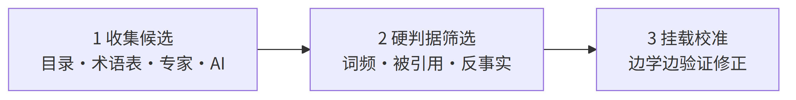
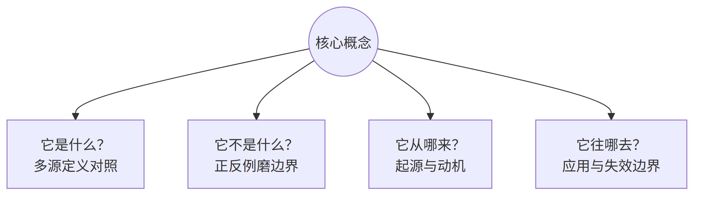
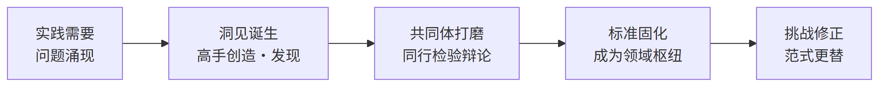
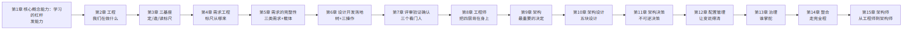

# 第1章 核心概念能力：学习的杠杆

> 本章主题：核心概念能力（学习的杠杆）/ 杠杆模型 / 压缩学习 / 五环模型 / 识别枢纽 / 四问法
> 英文来源：core-concept ability / hub / concept
> 演示对象：架构（architecture）——全书被误解最深的词之一
> 对应研习笔记：00-概念学习方法论-从压缩学习到知识掌握
> 原「概念的语法」工具内容（术语 / 词汇病 / 九格尺子）见章末补充

---

## 1.1 章首 · 误解现场 {.unlisted}

周三上午的季度会，会议室坐了三个部门的人。

老板先说："我们公司的**架构**不行，管理层级太多，决策太慢。"

产品总监接话："我说的是产品**架构**——M3 的模块边界该重新划了。"

技术总监皱眉："你们说的都不是**架构**。系统**架构**是服务边界、数据所有权这些事。"

三个人，三句话，三个"架构"。然后他们吵了四十分钟，谁也没说服谁，散会时觉得"对方不可理喻"。

这一幕每天都在发生。不是在这家公司，是在几乎所有公司——因为问题不在人，在**词**。

可是，把词当场对齐了，就真的懂"架构"了吗？三个人就算同意"架构"指的是系统架构，你让他们各答四问——它是什么、不是什么、从哪来、往哪去——多半还是答不齐。**词可以当场对齐；概念，要花功夫才能真正拥有。**

而"真正拥有概念"的能力，是有名字的——**核心概念能力**：识别、验证并运用核心概念的能力。这本书的第一课，教的不是某个概念，而是一套能力。它回答三个更根本的问题：为什么这套能力值得花功夫练？它靠什么起作用？怎样才算真正拥有一个概念？这套能力里，读者要记的是一把四问的尺子；它展开成一把九格的尺子，放在章末补充里，是给作者和审稿人查全用的。

---

## 本章问题 {.unlisted}

读完本章，你应该能回答：

1. 什么是核心概念？为什么说核心概念就是这个领域的枢纽？它承担哪几个功能？
2. 什么是概念能力？它由哪四个构件组成？怎么检验它强不强？
3. 什么是核心概念能力？为什么说它是学习杠杆？杠杆模型的四部件是什么？
4. 为什么"杠杆的第一性是方向"？方向错了会怎样？
5. 压缩学习实验证明了什么？为什么"先立枢纽"会越学越轻松？转述为什么是压缩测试？
6. 掌握一个专业领域的五环模型是什么？为什么"会用才算掌握"？
7. 怎么识别一个领域的核心概念与核心原理？三步识别法是什么？
8. 真正理解一个概念的四问法是什么？为什么"能答全四问才算拥有"？
9. 概念从哪来、为什么是共识不是真理？四问和九格是什么关系？这本书按什么认知链组织？

---

## 1.2 第一部分 核心概念能力：学习能力的杠杆

### 1.2.1 术语定义链：从"概念"到"核心概念能力"

"工程""需求""质量""架构""评审""治理"——这些词有什么共同点？它们都是各自领域的核心概念。用这套方法里的话说，它们都是这个领域的**枢纽**。

要讲清楚"核心概念能力"，先看一条术语定义链，从最小的单位往上走：

- **概念（concept）**：对一类对象共同特征的抽象概括，思维的最小单位。判据：可指称（一个词或短语）+ 可界定（内涵与外延）。依据：ISO 1087-1——"通过对特征的独特组合而形成的知识单元"。概念与术语的区别（能指 vs 所指），见补充一。
- **核心概念（core concept / hub）**：概念网络中处于枢纽地位的概念——解释领域内其他概念都要用到它，而理解它自己只需要很少前置知识。判据：反事实检验 + 被引用度 + 前置数。
- **概念能力（conceptual ability）**：以概念为单位的压缩与组织能力——识别枢纽 × 织关系 × 迁移 × 辨边界。判据：转述测试 + 辨伪测试。
- **核心概念能力（core-concept ability）**：识别、验证并运用核心概念的能力——概念能力的子能力（枢纽识别），学习杠杆的方向盘。判据：20 分钟对一个陌生领域给出 3~5 个核心概念及其关系，并能用反事实检验为每个候选辩护。

这条链的走向，就是本章的走向：先看枢纽为什么重要，再看握枢纽的能力为什么是学习杠杆的方向盘。

**枢纽（hub）**的定义很朴素：**解释别的概念要用到它，解释它自己却不需要太多前置知识的概念。** 比如你要解释"符合性"，得先解释"需求"；要解释"架构"，得先解释"系统"。"需求""系统"被别的概念反复调用，自己却几乎不需要前置——它们就是枢纽。

一个领域里，大部分词只是挂在枢纽上的细节；真正的枢纽往往只有几十个。**枢纽决定了领域里所有讨论的语言、边界和推理逻辑。** 不研究它们，你学到的只是碎片化的招式；研究透它们，你才拥有可迁移的体系。

核心概念在专业学习中承担六个功能，每一件都是"离了它，别的都立不住"：

| 功能 | 含义 | 类比 |
|------|------|------|
| 词汇表 | 概念是领域内"说话的方式"，没有共同词汇就无法精确沟通 | 学外语先学字母与语法 |
| 构建块 | 人的知识以概念网络存储，新知识必须挂载到已有概念上才有意义 | 乐高基础件 |
| 骨架 | 学科是有层级、有关系的体系，概念决定知识如何组织 | 地图的经纬度与主地标 |
| 公理 | 领域内论证从概念定义出发，定义含糊则推导皆飘 | 数学公理、游戏规则 |
| 迁移引擎 | 概念知识属深层结构，可跨场景迁移；事实知识绑定场景 | "输入—处理—输出"看遍所有系统 |
| 标尺 | 概念精确才能识别概念偷换与术语忽悠 | 分得清"需求"与"期望" |

所以先研究核心概念，不是爱抠定义，是因为它们承担公理和骨架的功能。**核心概念变动的速度，远慢于外围知识。** 地基打得越早，复利越大；地基打错了，之后每盖一层都在错上加错。

### 1.2.2 概念能力：不是单点，是四构件

注意，术语定义链里有两个"能力"，别把它们当成同一件事。**概念能力是全集，核心概念能力是它的子能力。** 先看全集。

概念能力，是以概念为单位的压缩与组织能力。它不是一个单点技能，而是四个构件：

| 构件 | 做什么 | 反面对照 |
|------|--------|---------|
| 识别枢纽 | 抓出决定其余部分的核心概念 | 被细节淹没，分不清主次 |
| 织关系 | 把概念连成有结构的网络 | 孤立记点，学一个丢一个 |
| 迁移 | 把网络搬到新场景 | 绑定场景，换个题就失灵 |
| 辨边界 | 用反例划清适用与失效范围 | 只举正例，不知何时失效 |

四个构件合起来，可以用两个测试检验：

- **转述测试**：陌生领域，三五句话讲清楚——讲不清，说明结构没成型（织关系没到位）；
- **辨伪测试**：能举反例划清边界——举不出反例，说明只见过正例（辨边界没到位）。

> 概念能力强，不是"懂得多"，而是**组织得好**：同样的信息量，有人堆成一盘散沙，有人织成一张网。判断能力强弱，看的是这张网，不是信息量。

### 1.2.3 杠杆模型：四个部件、三个限定

为什么要单独立一个词叫"核心概念能力"？因为它有一个别的能力没有的位置——**它是学习能力的杠杆**。

**杠杆**是个物理意象：用一根杆撬动重物，小的投入换来大的位移。核心概念能力也这样：压缩学习实验里，先花 20 分钟立枢纽，换来整张学习网络数百轮的优势扩散——投入产出比极高。完整写出来，学习产出由四个部件共同决定：

> **学习产出 = 核心概念能力（方向）× 概念能力（力臂）× 学习投入（施力）× 实践场景（支点）**

- **方向——核心概念能力**：往哪学、先立哪几个枢纽。方向错了，后面全是白费；
- **力臂——概念能力**：把枢纽织成网、搬去新场景、划清边界。力臂越长，同样的力气撬得越多；
- **施力——学习投入**：时间、注意力、练习量。没有施力，力臂再长也是零产出；
- **支点——实践场景**：概念要落在真实任务上才有支点。没有支点，杠杆只是根棍子，撬不动任何东西。

四个部件是**乘号**关系，不是加号：任何一个为零，整体归零。而"杠杆"这个说法本身，自带三个限定，每一限定都对应一个部件：

| 限定 | 物理对应 | 方法论对应 | 含义 |
|------|---------|-----------|------|
| 杠杆是双向的 | 放大的是力，不分方向 | 勤校准 | 枢纽选错则放大错误——学得越快，偏得越远 |
| 需要支点 | 无支点只是根棍子 | 落实践 | 概念不落真实任务，力臂悬空撬不动任何东西 |
| 自己不发力 | 杠杆只放大施力，不产生力 | 学习投入 | 没有投入，力臂无穷长也是零产出 |

### 1.2.4 杠杆的第一性是方向

四个部件里，最根本的不是力臂，是**方向**——方向由核心概念能力（枢纽识别）决定。为什么？

因为杠杆的其他三个部件都在"放大"，只有方向在"指路"。**放大没有方向感**：方向对了，力臂越长撬得越多；方向错了，力臂越长、撬得越欢、偏得越远。压缩学习实验里，HubToLeaf 组的全部优势，正来自"先识别枢纽"这一下——其后 800 轮正式学习，都只是这个方向上的展开。

这就是本章标题的意思：**核心概念能力是学习的杠杆，而杠杆的第一性是方向。** 所以整本书反复强调"先立枢纽"——不是在教你一个技巧，是在教你把方向盘握住。

两个澄清，防止误读：

- **对内（学习能力）**：核心概念能力是学习引擎的入口与放大器，不是全部引擎。它主导五环模型的第 1 环（立枢纽）与第 2 环（织关系）；输出检索、元认知校准、动机坚持是其余气缸。概念能力决定学得多快、看得多深；后三者决定学不学得动、学不学得远。
- **对外（竞争力）**：核心竞争力从来是组合结构，不是单点能力。核心概念能力是枢纽节点，执行落地、人际信任、情境经验、专业技能挂载其上——相乘关系，任一归零，整体归零。**枢纽决定上限，挂载决定下限。**

> 类比：核心概念能力是能力系统的枢纽——应用跑在它上面，价值却在应用。它决定上限，不决定一切。

**为什么在 AI 时代尤其重要**：记忆与信息处理已经外包给机器，人剩下的稀缺能力，正是概念性的——压缩、组织、迁移、辨伪。机器比你记得多，但它不替你"理解"。**概念能力，是个人版的"底牌放大器"。** 商业世界的《聪明的对手》讲的是同一逻辑：传统企业不学巨头（均匀化必败），而是守住自己的异质优势（暗知识、信任、非标）并用数字技术放大——异质结构原理，在认知层与商业层同时成立。

### 1.2.5 有框架 vs 无框架：两条学习路径

"先立概念"和"只背结论"的差别，是理解整套方法论的关键对照：

| 先学核心概念（先立枢纽） | 只背结论和招式（无框架） |
|---|---|
| 知识有挂载点——新概念迅速入网 | 碎片化记忆——学完就忘 |
| 举一反三——跨场景自由迁移 | 绑定具体场景——换个题就失灵 |
| 能辨伪——识别概念偷换 | 易被带偏——分不清概念边界 |

**先立骨架再填血肉，会越学越轻松；先切入细节，会越学越累。** 这不是经验之谈——下一部分的压缩学习实验，证明了这一点。

回看章首那场会议：三个部门的"架构"各说各的，表面是词没对齐，深处是三个人脑子里的概念网络各自缺了一根关键的枢纽。**掌握概念不到位，连讨论的前提都立不起来。** 这一章教的能力，就是让这种事不再发生。

---

## 1.3 第二部分 压缩学习：杠杆为什么成立

上一部分说"先立枢纽"是杠杆的方向。凭什么？这一部分给出科学证据：2026 年，北京大学团队的一项研究，用实验证明了"枢纽优先"为什么对。

### 1.3.1 高手与普通人的差距，在"压缩"

2026 年，北京大学心理与认知科学学院等团队在《自然·通讯》发表了一项研究。它给出了一个反直觉的答案：**高手和普通人的差距，不在于记性好，而在于擅长"压缩"——把全量信息转化成关键信号。**

经验医生把成千上万种疾病的知识，压缩成几个关键信号；资深调查记者在堆成山的文件里，只盯着"异常"的部分。他们都在做同一件事：压缩学习。

### 1.3.2 实验：人脑偏爱有枢纽的结构

团队设计了几类结构相同、但连接方式不同的人工知识网络，让被试学习。结果很清楚：**少数枢纽占据大量连接的网络（无标度网）最好学；均匀对称、没有主次的结构反而难掌握。**

另一个实验更有说服力。同一批知识，一组先学枢纽再学细节（枢纽优先），一组先学边缘再学枢纽（边缘优先），还有一组随机学。进入完全相同的正式学习后，**枢纽优先组的优势随时间越来越大，而且扩散到整张网络**——包括那些从没直接学过的纯细节节点。

脑成像也印证了这一点：枢纽优先的学习者在大脑里维持着更稳定的知识结构表征；先学边缘的人，早期也有表征，但迅速衰减。**人脑不是存储器，是压缩机器。** 先搭建框架，新信息只需判断"挂在框架哪个位置"，越学越轻松；先切入细节，后期积压太多零散节点，整合不动，越学越累。

### 1.3.3 三步：把"压缩"用到自己身上

研究给了我们一个可以直接用的三步法：

1. **找到枢纽**：学任何新东西前，先花 20 分钟找枢纽节点——翻书目录、读百科开头、问 AI、问行家都行。例：《思考，快与慢》的枢纽，是系统一、系统二、偏见。
2. **建立联系，填充细节**：先弄清枢纽之间的关系，再学细节。关系没通，细节学一个丢一个。
3. **转述**：把学到的东西讲给完全外行的人听，三五句话讲清楚，就是压缩成功。**转述是"压缩测试"**——它强迫大脑把散落信息重新组织成有骨架的结构。费曼技巧的机制，正是压缩学习。

学习不是做加法（获取更多信息），也不是做减法（减去不重要部分），而是**做除法**——先搭好四梁八柱，之后输入再多信息，看一眼就知道该存放在哪里，结构只会更坚固，不会变乱。

### 1.3.4 一句冷静的话

论文也有它的边界。实验用的是抽象的知识网络，真实领域（教科书、标准、行业惯例）的结构复杂得多；**"怎么识别真实领域的枢纽"仍是手艺活**，论文没有替你解决——这正是第四部分要做的事。另外，"框架一旦形成，只强化不改变"的说法不可过度引申——框架可改，见第六部分。

---

## 1.4 第三部分 五环模型：把能力炼出来的生产线

### 1.4.1 掌握线：会用才算掌握

先说"掌握"是什么意思。教育学界有一个公认的认知目标阶梯——布鲁姆分类学：**知道 → 理解 → 应用 → 分析 → 评价 → 创造**六级。

大多数人的学习，停在"知道"和"理解"：能复述，能听懂，考试能过。但换个场景，就用不出来。**掌握线划在"应用"之上——会用才算掌握。** 你背得出"质量＝特性满足需求的程度"，不算掌握质量；你拿着它评一份验收标准、判断一次分歧算不算质量问题，才算掌握。

### 1.4.2 五环：一条把知识推到掌握线的生产线

掌握五环模型，是一个循环。每转一圈，骨架更准、网络更密、输出更顺：


| 环节 | 做什么 | 为什么（依据） |
|------|--------|----------------|
| 1 立枢纽 | 学新领域前先花 20 分钟识别枢纽概念 | 压缩学习：枢纽优先的优势扩散全网络；认知负荷最低 |
| 2 织关系 | 弄清枢纽间关系（包含/依赖/对立）再填细节 | 知识是网络不是列表；记忆靠连接检索；细节挂在关系上才有意义 |
| 3 逼输出 | 三五句话讲给外行、写成文档、做题、教别人 | 测试效应：检索比重读记忆更强；输出暴露认知缺口 |
| 4 勤校准 | 随时准备推翻自己：枢纽选错、关系画反就改 | 概念转变：错误概念须被更准确解释主动替换；专家与新手差距在骨架准确性 |
| 5 落实践 | 在真实任务中用：做项目、审文档、解真问题 | 惰性知识：不拿来解决问题的知识是死的；技能＝概念结构×情境经验 |

**掌握 = 用结构消化信息，用输出验证结构，用实践淬炼结构。** 学习不是把知识装进脑子，而是让脑子长出一棵能结知识的树。

### 1.4.3 五环，就是核心概念能力的训练流水线

概念能力不是天生的，是练出来的。怎么练？五环模型本身就是那条流水线——四个构件在五环里各就各位：

- **识别枢纽** → 第 1 环"立枢纽"：概念能力的第一个构件，就是五环的第一步；
- **织关系** → 第 2 环"织关系"：把概念连成网，正是织关系构件；
- **辨边界** → 第 3 环"逼输出"：讲给外行听，讲到卡壳处，就是边界没划清的地方；第 4 环"勤校准"：用反例推翻旧骨架，也是辨边界；
- **迁移** → 第 5 环"落实践"：换场景用，正是迁移构件。

所以五环不是五件事，是**概念能力的四构件在循环里转**。每转一圈，四构件都更准一点——这是核心概念能力最实在的训练路径，也是"能力是练出来的，不是天生定死的"这句话的操作版。

---

## 1.5 第四部分 识别枢纽：握住方向盘

### 1.5.1 两个层级：概念是节点，原理是边

找枢纽，先分清两个层级：

- **核心概念 = 节点（名词）**：领域的"词汇"，如需求、配置、基线、版本。
- **核心原理 = 边/规则（命题）**：概念之间反复出现的规律，通常用"当……必须……""……取决于……"表达，如"基线一经批准，变更须走受控流程"、"验证以规定需求为参照"。**原理是更高级的枢纽——掌握原理，概念自动串联。**

### 1.5.2 三步识别法

找枢纽有三条路，合成三步：





**第一步：收集候选（借现成的标尺，20 分钟）。** 领域共同体已经帮你压缩过，直接"抄"：

| 来源 | 为什么有效 |
|------|-----------|
| 教材目录/章节标题 | 好教材的顺序本身是枢纽优先的（先基础后应用） |
| 专业术语表 Glossary | 共同词汇的浓缩，出现即被共同体认可 |
| 课程大纲/综述论文 | 专家设计并经多年检验；综述是高手压缩成的"地图" |
| 问 AI/问专家 | 直接要"10 个核心概念及其关系"，再交叉验证 |

**第二步：硬判据筛选（用枢纽的定义验证）。** 三条硬指标：

- **词频**：领域文本里被反复提到的名词，多半是枢纽；
- **被引用度**：统计概念定义中被引用的其他概念，被引用最多者最基础——比如"需求"的定义，被整个质量体系引用；
- **反事实检验**：问一句"如果这个概念/原理不存在，这个领域还成立吗？"经济学少了"供需"，整个框架就塌了——它是枢纽。反事实检验是三条里最狠的一条。

**第三步：挂载校准（让骨架自己浮出来）。** 每学一个新概念，问一句"它挂在哪个枢纽下？"挂不上去，说明枢纽清单有漏洞。清单是活的——随理解加深增删。**专家与新手的区别，不是清单长度，而是清单准不准。**

### 1.5.3 实战示范：这本书的枢纽清单

用三步法看这本书：它的枢纽是什么？打开目录——工程、需求、设计开发、质量、评审、验证、确认、架构、配置、治理……它们正是工程领域的枢纽。每一个，都满足"解释别的概念要用到它，解释它自己却不需要太多前置知识"。

第七部分会把这张清单画成一条链——那是这本书的认知链，也是这套方法的应用示范。

### 1.5.4 跨域示范：商业战略的枢纽识别

异质结构原理不只适用认知层——商业层同样成立。企业找"底牌"就是找枢纽：巨头复制不了的，正是异质优势；均匀化（照抄巨头）必败，守住枢纽再用技术放大必胜。用反事实检验验证（去掉它，企业还成立吗？）：

| 企业 | 枢纽（底牌） | 反事实检验 | 放大器 |
|------|------------|-----------|--------|
| 达美乐 | 配送网络效率（出餐与配送衔接的暗知识） | 没有配送优势，它只是普通披萨店 | 数字订餐系统、订单预测 AI |
| 胖东来 | 信任（面对面互动积累） | 没有信任，它就是普通超市 | 无 APP，把人性化服务做到极致 |
| 诺基亚 | 通信基础设施能力 | 没有通信技术，转型无路可走 | 聚焦诺基亚网络 |
| 新东方 | 名师表达力（把复杂知识讲得引人入胜） | 没有表达力，直播带货无门 | 东方甄选直播间 |

枢纽识别三步法可跨域复用：候选（行业里"最笨、最重、最不怕算法"的东西）→ 硬判据（反事实检验：去掉它企业是否还成立）→ 挂载校准（验证放大器是否真的放大了它，不行就换）。**概念能力不挑行业**——它挑的是"有没有枢纽"这件事。

---

## 1.6 第五部分 四问法：检验"真拥有"（主工具）

### 1.6.1 假懂 vs 真懂

前面讲了核心概念能力是学习杠杆，方向由枢纽识别决定。现在剩最后一个问题：**怎么才算真正拥有一个枢纽概念？** 这一部分是全书最重要的工具——四问法。

先看"假懂"长什么样：

| | 假懂（记忆层） | 真懂（理解层） |
|---|---|---|
| 定义 | 能背诵原文 | 能用自己的话重述 |
| 例子 | 举不出或照抄 | 能举正例，更能举反例 |
| 边界 | 不知道何时失效 | 知道它不是什么、何时不成立 |
| 关系 | 孤立记住 | 知道挂在哪个枢纽下、与谁冲突 |
| 来源 | 不关心 | 知道解决什么问题、为何被发明 |
| 检验 | 考试能答 | 讲给外行能懂、新情境能用 |

理论依据是维特根斯坦的一句话：**"意义即用法"（meaning is use）**——概念的意义不在字典里，在它的用法里。理解一个概念，就是会用它，而不是会背它。

### 1.6.2 四问法

怎么判断自己真懂了？把上面六维压成四个问题：





| 问 | 操作 | 理由 |
|----|------|------|
| 它是什么？ | 找三四个来源（标准、教材、百科、高手著作）对照定义，差异处即本质处 | 定义的差异暴露概念本质；同一个词，标准与教材表述不同，差的那一点往往就是本质 |
| 它不是什么？ | 找正例和反例，用反例磨边界 | 边界靠反例定型；概念靠典型例子活，靠反例定型 |
| 它从哪来？ | 回到概念被创造时的问题现场：解决什么问题？没有它之前人们怎么受苦 | 动机是记忆钩子；词源让概念"活" |
| 它往哪去？ | 挂在什么流程、被谁使用、何时失效 | 用得越熟越知道适用条件；掌握失效边界＝深度理解 |

**能答全四问，才算拥有它；只能答第一问，只是见过它。** 大多数人的"懂"，其实是"见过"——背得出定义，却答不出它"不是什么"的边界，也答不出它"往哪去"。

### 1.6.3 现场演示：四问量"架构"

用四问量一遍章首被吵翻天的"架构"——量的是正确的那个所指（系统架构）：

- **它是什么**：系统在其环境中，体现在元素、关系及设计演进原则中的基本概念或属性（ISO 42010）。
- **它不是什么**：不是一张架构图——图会过时，架构的基本概念持续起作用；不是一次技术选型；更不是组织架构、产品形态。
- **它从哪来**：从建筑学借入软件与系统领域；1970 年代结构化设计、1990 年代软件架构热，2011 年 ISO 42010 定稿。
- **它往哪去**：在不可逆决策被做出之前用；在变更影响评估时用；在团队边界定义时用。失效边界——当组织架构、产品形态混进来时，它就说不清了。

答完四问，章首那场吵架的解法已经出来了：他们吵的是三个不同的"它"。四问先帮他们分清在谈哪一个，再谈要不要改。

### 1.6.4 四问为纲，九格为目

四问好记，但还粗。要查全，就把每一问展开：它是什么 → 定义（①）；它不是什么 → 对立面（⑥）、辨析（⑦）；它从哪来 → 背景（②）、历史（③）；它往哪去 → 问题（④）、场景（⑤）、误区（⑧）；再加上破除"翻译伪朋友"的术语英文来源（⑨）。合起来，就是一把九格的尺子。

**读者记四问，作者和审稿人查全用九格。四问是纲，九格是目。** 九格的完整模板、推导过程、使用规则，见章末补充三——它是这套方法在书里的落地工具。后面每一章给概念"钉死定义"，用的都是它。

---

## 1.7 第六部分 概念的来源与本质：校准的依据

### 1.7.1 概念是共同体"酿"出来的

核心概念不是天上掉下来的，也不是哪个人拍脑袋定的。它们大多是领域共同体长期实践智慧的结晶：





概念的出生，有三种方式：

| 方式 | 含义 | 例子 | 归因 |
|------|------|------|------|
| 创造（invented） | 人造的工具，无自然界对应物 | 变量（笛卡尔/韦达）、图灵机 | 可归功于个人或机构 |
| 发现（discovered） | 规律本来就在，被揭开 | 万有引力、能量守恒 | 归功于揭示者 |
| 凝结（distilled） | 共同体长期实践经验的结晶被固化 | baseline（源自军品工程实践，后由 ISO 10007 固化） | 无单一发明者 |

**baseline 不是哪位科学家发明的。** 它来自军品工程"版本失控、改坏了找不回来"的惨痛教训——工程共同体逐步摸索出"受控快照"的做法，最后才被标准组织写成条文。无数无名工程师，用教训"酿"出了这个概念。

贡献者也不只是个人天才：牛顿、图灵、爱因斯坦是个人高手；ISO、IEEE 是把概念写进标准的权威机构；国防工程、医疗、法律，是让概念先在实践里长出来的共同体。

### 1.7.2 共识 ≠ 真理

化学的"燃素"、物理的"以太"，都曾是各自时代的核心概念，后来被推翻。库恩把它叫做"范式转换"——**每个时代的枢纽清单，是那个时代认知的天花板，不是终点。**

### 1.7.3 枢纽是起点，不是天花板

所以，学核心概念 = 以最小成本继承共同体几百年的最大公约数智慧；但它是共识，不是真理——**枢纽是起点，不是天花板**。这也正是五环模型第 4 环"勤校准"的意思：连领域公认的枢纽，都可以怀疑、修正。

对握方向盘的核心概念能力来说，这条尤其要紧：**方向不是一次定死的，要一路校准。** 你今天立的枢纽，明天可能被证明是错的——那不是失败，是杠杆在正常纠偏。枢纽清单是活的，方向盘就永远是活的。

---

## 1.8 第七部分 这本书怎么走：用杠杆走完全程

### 1.8.1 认知链全景图：这本书的枢纽清单

方法有了，现在看这本书用它量什么。十五个章节不是十五个并列话题，是一条递进的认知链——**这本书的枢纽清单**：

```
第1章 核心概念能力：学习的杠杆 —— 发能力（核心概念能力 / 杠杆模型 / 五环模型 / 四问法；九格为辅）
第2章 工程 —— 我们在做什么（科学原理×判断×约束×系统方法×有用物）
第3章 三基座 —— 定标尺 → 造标尺 → 读标尺（需求 / 设计开发 / 质量）
第4章 需求工程 —— 标尺从哪来（开发造血，管理防腐）
第5章 需求的完整性 —— 标尺要全（三类需求，三个载体）
第6章 设计开发落地 —— 标尺怎么被造（一棵树枝干叶子 + 分解分配分析）
第7章 评审、验证与确认 —— 三个看门人（评审对目标，验证对需求，确认对用途）
第8章 工程师 —— 谁在做（把四层背在身上的人；六项能力；一个物种三种粒度）
第9章 架构 —— 系统最重要的决定（不可还原涵义）
第10章 架构设计 —— 最重要的决定怎么被造出来（五块设计）
第11章 架构决策 —— 不可逆决策的提前投资
第12章 配置管理 —— 让一直在变的东西说得清（基线 / 版本 / 变更）
第13章 治理 —— 谁掌舵，谁划桨
第14章 整合 —— 从一条需求到上线运维（两条案例线走完全程）
第15章 架构师 —— 谁在背这条链（从工程师到架构师，回答书名；专责≠终责）
```

每章回答一个"你的日常工作里绕不开的问题"：

- 第2章：别人说"我们在做工程"，他真的在做工程吗？还是在用手艺的壳子？
- 第3章：设计开发从哪开始、到哪结束？质量到底是靠"做得多"还是"对得上"？
- 第4章：需求是开发出来的，还是管出来的？两者的分工为什么必须分清楚？
- 第5章：原理样机通过，产品就成功了吗？需求怎么才算全？
- 第6章：设计方案是一篇文章还是一棵树？方案是写出来的，还是分解出来的？
- 第7章：评审、验证、确认三个看门人，各看什么？
- 第8章：谁在做？把四层背在身上的人，需要哪六项能力？
- 第9章：架构到底是不是"一张图"？如果不是，它是什么？
- 第10章：架构是怎么被设计出来的？"画图 + 选型 + 定规矩"为什么不算？
- 第11章：哪些决策改不得？怎么判断一个决策不可逆？
- 第12章：一个一直在变的产品，怎么做到任何时刻都说得清？
- 第13章：谁掌舵、谁划桨？治理和管理到底差在哪？
- 第14章：把前面所有概念，在一件真实的事情上从头走到尾。
- 第15章：架构师是个怎样的物种？从工程师到架构师，中间发生了什么？

把这条链画成图，每章在链上的位置一目了然：





这个顺序不是随便排的，每章都依赖前一章的概念：第2章立"我们在做什么"的台；第3章在这台上立标尺；第4章解释标尺从哪来；第5章回答标尺要全——三类需求、三个验证载体。

第6章讲标尺怎么被造出来（一棵树、三个动作）；第7章请来看门人；第8章认识那个把四层背在身上的人；第9、10、11 章进入系统的核心——最重要的决定。

第12章让这些决定在时间上说得清；第13章上升到谁掌舵；第14章收束成一件真实的事（系统）；第15章，链上的最后一步，回到那个把链背在身上的人——架构师。

**越往后，越接近"整个组织的运转"——这是从"一个概念"到"一个系统"的爬升。**

这本书本身就是压缩学习的实践：先立枢纽（第2章工程），每章填一个枢纽概念，章末用练习和自查逼你输出，附录把发过的尺子收进五个抽屉供你查全。你正握着第1章发的杠杆，一路走到底。

### 1.8.2 两条案例线

书里有两个贯穿始终的虚构案例，从第2章开始一路跟到第15章：

- **冰链科技**——做医疗冷链运输温控箱（硬件 × 嵌入式 × 云端 × App）。产品团队：产品经理小林、嵌入式工程师老周、测试小赵、制造/供应链代表老陈；
- **恒信集团**——做跨部门合同审批系统（业务流程系统）。IT 团队：需求分析师 Ada、架构师李工、三名开发、一名运维。

**同一个概念，在两个世界里各长各的样子**——这是本书想证明的事：质量既可以是温控箱的温度精度，也可以是审批系统的查询响应时间；架构既可以是硬件模块划分，也可以是服务边界设计。

**这套概念，不挑行业。** 书里每个概念至少用一条线深度演示，另一条线做"镜照"——当你看到同一个概念在硬件和软件里长得一样，你才真的信了它是中立的。

### 1.8.3 各章要破除的误解预告

这一节的最后，提前看一眼后面每一章要破除的那条最大误解——它们都是"词汇病"的延伸：

| 章 | 要破除的误解 |
|---|---|
| 第2章 工程 | "我们用了敏捷 + CI/CD + 测试，所以我们在做软件工程。"——方法论只是工程的一层 |
| 第3章 三基座 | "参数比竞品高，质量绝对没问题。"——那是等级，不是质量；设计开发止于可实现 |
| 第4章 需求工程 | "需求管理包含需求开发。"——开发管"生"，管理管"养"，是并列不是包含 |
| 第5章 需求的完整性 | "原理样机验证通过了，产品就成功了。"——样机只验证了功能需求；缺了可实现性需求，交付物停在环境样机 |
| 第6章 设计开发落地 | "设计方案就是一篇大文章。"——设计文档是树，不是散文；方案是分解出来的 |
| 第7章 评审验证确认 | "评审 = 核对需求。"——评审对目标、验证对需求、确认对用途 |
| 第8章 工程师 | "会写代码 / 有职称 / 经验多 = 工程师；工程师是一个统一的物种。"——头衔、证书、年限都不定义工程师；一个物种三种粒度（模块/系统/架构） |
| 第9章 架构 | "架构 = 一张框图。"——架构是系统不可还原的涵义 |
| 第10章 架构设计 | "架构设计 = 画架构图 + 做技术选型 + 定规矩。"——架构设计是五块工作：概念、属性、设计准则、演进准则、关系 |
| 第11章 架构决策 | "架构决策可以以后再说。"——不做架构 = 把决策推迟到成本爆炸时 |
| 第12章 配置管理 | "配置 = 参数文件。"——配置是被记录下来的样子；基线是被冻结的版本 |
| 第13章 治理 | "治理 = 管理。"——治理是决策系统，管理是执行系统 |
| 第14章 整合 | "每件事我们都做对了，系统还是出问题。"——概念是同一系统的不同切片，切片之间要靠接缝缝合 |
| 第15章 架构师 | "架构师就是更高级的工程师 / 画架构图的人 / 什么都管的人 / 系统工程师的升级。"——架构师是一个方向、一张清单，不是头衔；专责不是终责 |

每一条，都会在对应章节用一张档案、一个案例、一次反转来钉死。如果你读到这里时，心里对某一行闪过"这不是很明显吗"——**恭喜，你正好是那一章的读者。**

### 1.8.4 三种读法

- **通读**：按章节顺序，一条链走下去——推荐第一次读；
- **查概念**：遇到说不清的词，翻书末附录"概念档案集"，九格查一个算一个；
- **做练习**：每章末尾的题（与训练教材同源），先答题再看附录答案——检验你有没有真的"把话说准"。

---

## 1.9 补充 · 概念的语法：四问法怎么展开成九格

> 四问法是读者记的骨架，九格是作者/审稿人查全的清单。以下三部分是原「概念的语法」的工具内容：先看术语与概念的关系，再看误解的三个形态，最后领走那把九格尺子。正文会反复引用这里——它们是这本书给概念"钉死定义"的地基。

### 1.9.1 术语是能指，概念是所指

#### 一个三分钟的思想实验

天刚亮，你指着东方天空最亮的那颗星说："晨星。"

晚上，你指着西方天空最亮的那颗星说："暮星。"

它们是同一颗星——金星。同一个东西，两个名字；每个名字都让人以为那是另一个东西。如果你没学过天文学，你会认为"晨星"和"暮星"是两颗不同的星——它们出现在不同的时间、不同的方位，凭什么说是同一个？

现在把这个游戏的规模放大一点：不是两颗星，而是几百个词。每一个词，都可能被不同的人理解为不同的东西；同一个东西，也可能被好几个词指来指去。**语言的世界里，到处都是"晨星"和"暮星"。** 这一部分的后面，我们会把这个游戏的规则彻底看清。

语言和符号为什么会有这种"同物异名"？因为语言不是精确的编码系统，而是一套**约定**——大家都这么叫，就这么叫。约定是历史积累的结果，不是逻辑推导的结果。

所以语言的模糊不是 bug，是 feature：它足够灵活，才能让几亿人用同一套符号表达千差万别的意思。**但灵活的另一面，就是歧义**——同一个符号，在不同人的约定里指向不同的东西。

这一部分的整套工具，都是在"语言的灵活"和"对齐的必要"之间搭桥。

#### 索绪尔：符号 = 能指 + 所指

一百多年前，瑞士语言学家索绪尔（Ferdinand de Saussure）提出了一个至今无法绕开的二元结构：

> **符号（sign）= 能指（signifier）+ 所指（signified）**

- **能指**：符号的形式——声音、文字标记。你听到"苹果"这两个音，或看到"苹果"这两个字，这是能指；
- **所指**：符号的内容——概念、心理印象。你脑子里浮现的"那种圆圆的、红红的、可以吃的水果"，这是所指。

能指和所指不是一一绑定的关系，而是**约定**——社会约定。为什么"苹果"这两个字能让你想到那种水果？因为大家都这么用。如果当初大家都管它叫"banana"，你现在想到的就是同样的东西。**能指是任意的，所指才是实质。**注意：**任意 ≠ 随意**——"苹果"是苹果没有必然理由（社会约定），不是你可以随便给任何东西起名（那没人听得懂）。

用这个框架看"架构"：三个部门的"架构"两个字，是同一个能指；但三个人脑子里浮现的所指——组织层级、产品模块、技术结构——完全不同。**他们用了同一个能指，指向了三个不同的所指。**

索绪尔还有一对概念值得记住：**语言（langue）与言语（parole）**。语言是社会共有的那套规则系统——每个说中文的人脑子里都装着一份；言语是具体某个人的某一次具体使用。

术语的漂移就发生在这里：**语言的规则是全社会慢慢变的，而每一次漂移都始于某个人的某一次言语**——有人把"架构"用在了软件上，别人跟着用，用得多了，语言就多了一个所指。

理解这对概念，你就明白为什么"对齐概念"不是吹毛求疵：每一个不精确的使用，都在为语言的漂移添一块砖。反过来，正因为语言会漂移，**主动对齐才显得必要**——我们不可能等到全社会把词都钉死了再工作，只能每次开会、每份文档，当场钉一次。

#### 弗雷格：符号 → 涵义 → 指称

索绪尔的两元模型告诉我们"符号有形式和内容"，但还差一步。德国哲学家弗雷格（Gottlob Frege）补充了关键的一元：

> **符号（Zeichen）→ 涵义（Sinn）→ 指称（Bedeutung）**

- **符号**：那个标记本身；
- **涵义（Sinn）**：符号呈现对象的方式——"清晨天边那颗亮的"；
- **指称（Bedeutung）**：符号实际指向的对象——金星。

回到思想实验："晨星"和"暮星"是两个符号、两种涵义（一个出现在清晨、一个出现在傍晚），但指称相同——都是金星。**涵义不等于指称**，这是弗雷格模型的核心贡献：同一个指称可以有多种涵义，同一种涵义也可以被多个符号表达。

把两套模型拼到我们的话题上：

| 弗雷格 | 我们的话题 | 一句话 |
|---|---|---|
| 符号 | **术语（term）** | 那个标签、那个名字 |
| 涵义 | **概念（concept）** | 标签背后的本质 |
| 指称 | **事物本身** | 实际存在的那东西 |

得到一个全书反复使用的比喻：

> **术语是名牌，概念是名牌背后的人。** 名牌可以换（同一个概念可以有好几个词，比如"微服务"和"微服务架构"指同一个概念），但人没变；同名名牌也可以挂在不同人身上（同一个词在不同领域指向不同概念，比如章首的"架构"）。

现在把弗雷格的三元用到你身边的日常，你会发现概念争议其实只有两种游戏：

**第一种：同物异名**——同一个指称，多个涵义（多个词）。"订单"和"order"指同一个业务对象；"SRS"和"需求规格说明书"指同一份文档。这种游戏的无害版本是别名，有害版本是**你以为在谈两件事、其实在谈同一件**——两个团队各管一个叫法的同一份数据，合并时才发现重复建设。

**第二种：同名异物**——同一个符号，多个所指（多个概念）。章首的"架构"是典型：一个词，三个所指。这种游戏的无害版本是多义词，有害版本是**你以为在谈同一件事、其实在谈三件**——四十分钟的吵架就是这么来的。

记住这两个名字，后面每一章都会遇到它们：**同物异名是漏的根源，同名异物是吵的根源。**

#### 术语会漂移：一个词如何积累出多个概念

"架构"这个名词，最初是建筑学的——指一栋建筑的承重结构、空间布局。后来软件工程借用了它（"软件架构"），再后来企业组织借用了它（"组织架构"），数据领域借用了它（"数据架构"）。每一次借用，旧概念没消失，新概念叠加上去。于是"架构"从一个所指，变成一个能指挂着一串所指。

这不是谁的错，是语言的**自然演化**——词汇跟着行业走，行业多了，词就长了。术语漂移本身无害，**有害的是没人察觉漂移**：

- 你说"架构"，他说"架构"，你以为你们在讨论同一件事，其实在讨论三件；
- 讨论了三十分钟，各自的观点都没错，但谁也没说服谁——因为根本没在对话。

术语漂移在我们这本书的每一个核心词上都发生过，只是程度不同：

- **需求**：从"要的东西"漂移出"明示/隐含/必须履行"三形态的精细含义——同一词，工程视角和管理视角各指一半；
- **配置**：从硬件行业的"组件选配"漂移到软件的"参数文件"再到数据的"元数据治理"——同一词，三个行业三种所指；
- **治理**：从政治学的"国家治理"漂移到企业的"数据治理""架构治理"——同一个词，从国家用到一张数据表。

每个词的漂移史，都不是单线演化，而是**一次次借用叠出来的**。看清这一点，你再看后面各章给词"钉死定义"，就不会觉得是刻板——**钉死不是反对语言演化，是反对在同一个会议里用三个版本演化。**

漂移不可怕，**不对齐才可怕**。这本书从头到尾做的第一件事，就是对齐——把每一个要用的词，先钉死它现在指的是哪个概念。下一部分，我们先看清"误解"这个病到底长什么样。

### 1.9.2 误解的三种形态：词汇病

从这一部分开始，我们把"误解"当成一种病来诊断。不建模板、不谈理论，先看三种最常见的病——它们合起来，就是"词汇病"。

#### 病一：说不出定义，只能举例

"评审是什么？""就是开会过一遍。"——这是病一的典型症状：**用例子代替定义**。

例子不是定义。定义回答"它是什么"，例子只回答"它长这样"。你说"评审就是开会"，那只描述了你见过的一种评审；你没法用这个回答去判断"一次不走流程的聊天算不算评审"——因为你的回答里没有判据。

> **例子是插图，不是定义。** 插图让你认得出它长什么样，但定义才让你分得清它和别的东西的边界。

病一的危险在于：说得出口的例子，往往让人误以为自己懂了。"验证就是测试""架构就是画图""质量就是档次高"——这些话在闲聊里无伤大雅，但在评审结论、验收标准、需求变更这些关键时刻，一个没有判据的理解，就是一场事故的种子。

比"只能举例"更隐蔽的变种，是**拿名词当定义**——"评审？我天天评审，还用定义吗？"一个头衔挡住追问。可头衔不是判据，挡住的正是最该检验的地方。

**治病的药**：给定义，且定义要带**可检验的判据**。什么叫可检验？用"评审"举例：如果"评审"的定义是"对客体实现所规定目标的适宜性、充分性或有效性的确定"，那么判据就是——有没有得出结论？有没有留下记录？如果一场"评审"开完没有结论、没有记录，按定义它就不是评审，最多算聊天。**判据让定义从"一句话"变成"一把尺"。**

#### 病二：同词异义，各指各的

病二是最普遍的——**同一个词，不同的人指不同的概念**。这本书要处理的核心词，几乎全部处于这种状态：

| 词 | 第一个人以为 | 第二个人以为 |
|---|---|---|
| 质量 | 档次高、用料好 | 符合需求的程度 |
| 评审 | 开会过一遍 | 对目标的三问判定 |
| 验证 | 测试跑过了 | 对照规定需求、提供客观证据、做出认定 |
| 确认 | 领导签字了 | 对照预期用途、放进真实场景裁决 |
| 需求 | 用户说要什么 | 明示/隐含/必须履行的需要或期望 |
| 基线 | 最新版本 | 被批准冻结、作全生命周期参照的受控快照 |
| 架构 | 一张架构图 | 系统不可还原的涵义 |
| 工程 | 写代码 / 做项目 | 科学原理×判断×约束×系统方法×有用物 |
| 配置 | 参数文件 | 被记录下来的关联功能+物理特性 |
| 治理 | 管理 / 管事情 | 决策系统：定规则、裁例外、监督问责 |

每一行都是"同名不同人"。为什么平时不爆、关键时刻爆？因为平时大家各干各的，默认了各自的定义没被发现；一旦到关键决策——评审结论怎么写、验收标准定什么、需求变更批不批——两个人突然发现"我们说的不是一回事"。**不是人不对付，是词对不齐。**

为什么"平时不爆、关键时刻爆"，还有一层机制：**平时讨论的是"加个功能"这种增量，双方各自脑内的定义没被放到台面比较；关键时刻讨论的是"这件事对不对、算不算、该不该"——定义第一次成为判定依据，裂缝才显形。** 就像两份合同，平时各自执行各自的条款都没问题，一旦合并，条款冲突才暴露。所以"词对齐"不能等矛盾出现再做——**矛盾出现时的对齐，已经是在收拾残局了。**

病二的机制，在补充一已经讲透了：同一个能指（词），挂在不同的人身上（不同所指）。治病的药也在补充一：**把词和概念分开**——不谈"架构是什么意思"，改谈"你说的架构，指称的是什么"。

#### 病三：翻译伪朋友

中文里还有一类更隐蔽的坑：**翻译伪朋友**——几个英文原词是完全不同的东西，翻译成中文后听起来像一类。

最经典的三个，就是本书第7章的主角：

- **评审（review）**：对客体实现所规定目标的适宜性、充分性或有效性的**确定**（判断）——参照是**目标**，不要求客观证据；
- **验证（verification）**：通过提供客观证据，对**规定需求**已得到满足的**认定**——参照是需求，必须有证据；
- **确认（validation）**：通过提供客观证据，对特定的**预期用途**已得到满足的**认定**——参照是用途，必须有证据。

三个词的中文都带"评/验/认"，听起来像近亲。但它们不是——在 ISO 9000 的术语体系里，评审（3.11.2）和验证/确认（3.8.12 / 3.8.13）**根本不在同一个术语组**：评审和"确定、监视、测量、检验"（3.11 组）是一家；验证/确认和"规范"（3.8 组）是一家。英文一摆出来，伪朋友当场现形：review、verification、validation，三个完全不同的词，只是中文翻译凑巧都带"评/验/认"。

类似的还有：治理（governance）与统治（rule）——中文都有"治"字，一个是掌舵，一个是支配；需求（requirement）与要求——国标译"要求"，本书按约定统一译"需求"。

为什么中文尤其容易踩翻译伪朋友的坑？三个历史原因叠在一起：一是中文术语大量来自**翻译**，而翻译是逐词对应，把英文里本不相关的词译成了形近字；二是 1990 年代起大量西方管理/工程术语集中涌入，翻译风格不一，同一批词各译各的。

三是中文是**意合语言**，不像英文能靠词根一眼看出词族关系——"review""verification""validation"的拉丁词根明摆着不同，译成"评审/验证/确认"后，字面看不出任何区别。

**中文的模糊，是翻译和历史共同造成的，不是词本身的问题。** 所以这本书坚持每张档案带"术语英文来源"一格——中文看不清的地方，回到英文就看清了。

**治病的药**，是三个动作：

1. **回英文原词**——中文模糊处，英文现形；
2. **查词根**——configuration = con + figurare（共同塑造），词根直接解释定义；
3. **看归组**——它在标准术语表里和谁是近亲、属于哪一组（这组词，往往就是它该放在一起辨析的对象）。

> **术语的英文来源这一维（概念档案第⑨格）存在的意义，就在这里。**

#### 一个因词没对齐而翻车的案例

有个做医疗器械的公司，跟一家医院签了验收条款："系统通过验收后，尾款付清。"合同写得很正式，但谁也没定义"通过验收"是什么。

半年后系统上线，医院说"验收没过，尾款先不付"。公司问："为什么没过？功能都上线了。"医院说："验收的标准是临床科室用得顺。"公司说："验收的标准是功能测试通过。"

两边都觉得自己有理，扯了四个月。最后查合同，"验收"一次都没有定义——没有验收标准、没有验收流程、没有验收记录模板。

**双方用同一个词"验收"，指了两个完全不同的概念**：公司以为验收是验证（功能符合规格），医院以为验收是确认（临床真实场景用得好）。

这个差异在 ISO 9000 里清清楚楚——验证（verification）和确认（validation）是两个词、两种参照。而合同里只用了一个中文词"验收"，把两种概念的缝隙用胶水糊上了。

四个月的扯皮，最后花了两天把"验收"拆成两条：功能验收（对照技术规格）+ 临床确认（对照实际使用）。分开了，各自都有明确的标准，纠纷消失。

这个案例里没有谁恶意，也没有谁愚蠢——只有一个没对齐的词，和一个用胶水糊起来的缝隙。**概念不对齐的代价，平时看不见，到合同纠纷、验收分歧、需求变更时才一次性结算。**

三种病合起来，就是"词汇病"的完整画像：说不出定义（病一）、同词异义（病二）、翻译伪朋友（病三）。要同时治三种病，靠一条定义不够——于是有了下一部分的九格尺子。

### 1.9.3 九格尺子

#### 为什么是九格：从三类误解反推

我们要造一把尺子，能治上面三种病。造法不是拍脑袋，是**反推**：每种病需要什么信息，就给它一格。

- 病一"说不出定义"→ 需要**定义**（①）；
- 病一还有个变种"说不出边界"→ 需要**对立面**（⑥，它站在谁的对立面）和**辨析**（⑦，它和谁最像但不一样）；
- 病二"同词异义"→ 需要**溯源**（②背景、③演化的历史——知道词从哪来、怎么变的，就明白它为什么在不同语境长得不一样）；
- 病三"翻译伪朋友"→ 需要**术语英文来源**（⑨）；
- 剩下的是"乱用"——不知道它为什么存在（→④拟解决的问题）、不知道什么时候该用（→⑤适应场景）、以及一切误解的残余（→⑧误区）。

于是九格按四个层次排开：

| 层次 | 格 | 治哪类误解 | 问什么 |
|---|---|---|---|
| **定界**（它是什么） | ①定义 | 病一·说不出定义 | 一句话是什么？判据呢？ |
| | ⑥对立面 | 病一·不知边界 | 它站在谁的对立面？（远界） |
| | ⑦辨析 | 病一·近亲混用 | 和谁最像但不一样？（近界） |
| | ⑨术语英文来源 | 病三·翻译伪朋友 | 中文对应哪个英文原词？词根是什么？ |
| **溯源**（它从哪来） | ②背景 | 病二·不知为什么有它 | 诞生于什么处境？为什么造它？ |
| | ③演化的历史 | 病二·不知它怎么变的 | 词源/标准版本/机构改写/翻译定译/跨域迁移？ |
| **致用**（它干什么） | ④拟解决的问题 | 乱用·当装饰词 | 没有它之前世界什么样？它回答什么？ |
| | ⑤适应场景 | 乱用·过度用/误用 | 什么时候用？边界？什么时候不该用？ |
| **纠误**（它错在哪） | ⑧误区 | 上面所有病的残余 | 最常见的误解？"你以为的"vs"精确的"？ |

对照第五部分的四问法，你会发现九格就是四问的展开：它是什么 → 定义（①）；它不是什么 → 对立面（⑥）、辨析（⑦）、误区（⑧）；它从哪来 → 背景（②）、历史（③）；它往哪去 → 问题（④）、场景（⑤）。多出来的术语英文来源（⑨），专治病三。**四问是纲，九格是目。**

#### 九格档案：模板与使用规则

九格完整地描出一张**概念肖像**：定义是圆心，对立面画远界，辨析画近界，误区标注雷区，背景/历史/问题/场景补全身形。

全书要用这张尺子量约三十五张核心档案，分布在后面的章节里：

| 章 | 档案 |
|---|---|
| 第1章 | 概念 · 核心概念 · 概念能力 · 核心概念能力（学习方法论档案，完整九格见附录 B） |
| 第2章 | 工程 · 工程系统 |
| 第3章 | 需求 · 设计开发 · 质量 |
| 第4章 | 规定需求 · 需求工程 · 运行概念（ConOps） |
| 第5章 | 三类需求 · 验证载体 · 承制方主导 |
| 第6章 | 概要定义 · 详细定义 · 分解 · 分配 · 符合性分析 |
| 第7章 | 评审 · 验证 · 确认 |
| 第8章 | （工程师 · 角色章，无新档案，六项能力清单 + 三粒度谱系） |
| 第9章 | 架构 · 架构描述 |
| 第10章 | 架构设计 · 基本概念 · 基本属性 |
| 第11章 | 架构决策 · 不可逆性 |
| 第12章 | 配置 · 版本 · 基线 |
| 第13章 | 治理 · 管理 |
| 第14章 | （整合章 · 无新档案，概念收束） |
| 第15章 | （架构师 · 角色章，无新档案，十项能力清单 + 架构师文档族） |

每张档案的填写深度不同：第1、3、4、5、6、7、10、12 章是"多档案章"（第1章为学习方法论档案四张，其余每章三张以上），第2、9、11、13 章各两张，第8章是角色章（工程师，以六项能力清单 + 三粒度谱系替代档案）、第14章是整合章、第15章是角色章，都不再开新档案。

档案填得最满的，往往是全书最容易误解的词——质量、架构、治理——它们值得你每章停下来专门看。**本书的叙述逻辑是：档案藏进正文，只在最需要的地方亮出来（卡片）；完整版收在书末附录"概念档案集"。**

> **名词：概念档案（concept profile）**——按这九格为某个概念建立的完整档案。全书第1~7 章与第9~13 章，每个核心概念都填一张档案；书末附录有一本"概念档案集"，可查。

模板：

```
概念档案 · XX
┌─ 定界 · 它是什么 ────────────────────────┐
│ ① 定义        一句话 + 一个可检验判据      │
│ ⑥ 对立面      它站在谁的对立面（远界，常分维度）│
│ ⑦ 辨析        和谁最像但不一样（近界）     │
│ ⑨ 术语英文来源 中文术语↔英文原词（含词根）  │
├─ 溯源 · 它从哪来 ────────────────────────┤
│ ② 背景        诞生于什么处境、为什么造它    │
│ ③ 演化的历史   词源/标准版本/机构改写/翻译定译/跨域迁移 │
├─ 致用 · 它干什么 ────────────────────────┤
│ ④ 问题        没有它之前世界什么样、它回答什么 │
│ ⑤ 场景        什么时候用、边界在哪、何时不用 │
├─ 纠误 · 它错在哪 ────────────────────────┤
│ ⑧ 误区        最常见的误解 · "你以为的"vs"精确的" │
└──────────────────────────────────────────┘
```

**一条使用规则，必须遵守**：

> **九格不是每格都必须填——薄格可省，但不可被跳过。** 跳过的那一格，往往是误解潜伏的地方。如果一个概念你填不出它的"背景"（②），很可能你根本不知道为什么用它；填不出"误区"（⑧），很可能你正处在某个误区里而不自知。

#### 现场演示：量"架构"

用这把尺子，现场量一遍章首那个被吵翻天的"架构"——注意，量的是**正确的那个所指**（系统架构，不是组织架构）：

```
概念档案 · 架构（architecture，ISO 42010）
① 定义  系统在其环境中，体现在元素、关系及设计演进原则中的基本概念或属性
⑥ 对立  ——（架构没有"对立面"，但经常被当成：一张图 / 一份文档 / 一次技术选型）
⑦ 辨析  架构 ≠ 架构描述（描述会过时，架构的基本概念持续起作用）
⑨ 英文  architecture ← 希腊 arkhitekton（chief builder，总建造者）
② 背景  从建筑学借入软件/系统领域；ISO 42010:2011 定稿为系统与软件工程标准
③ 历史  早期"架构=图纸"→ 1970s 结构化设计 → 1990s 软件架构热 → 2011 ISO 42010
④ 问题  系统太复杂，一个人装不下 → 用"最重要的决定"把复杂度压成可管理
⑤ 场景  在不可逆决策被做出来之前；在变更影响评估时；在团队边界定义时
⑧ 误区  ✗ "架构=一张框图" ✗ "架构=技术选型" ✗ "我们不需要架构"
```

注意第⑥格：架构没有"对立面"，但"经常被当成"的三个东西填进去了——这是因为辨析格（⑦）已经接住了那些"伪概念"。这提示九格的灵活性：**格子是为治误解服务的，不是为填满服务的**——该填空的时候空着，是对概念诚实。

示范一张"薄格"档案——一个简单到只填得满一半格子的概念：**等级（grade）**。

```
概念档案 · 等级（grade）
① 定义  对功能用途相同的客体按不同需求所做的分类或分级
⑦ 辨析  等级 ≠ 质量：高档车可以是差质量，低档车可以是好质量
⑨ 英文  grade ← 拉丁 gradus（台阶、级）
④ 问题  需求不同 → 需要不同的规格档位 → 用等级区分
⑤ 场景  选配/分档/商务报价时用；质量判定时别用
⑧ 误区  ✗ "等级高 = 质量好"——等级回答按哪套需求分类，质量回答满足需求的程度
② 背景  （薄）从制造业"规格档位"来
③ 历史  （薄）无显著演化
⑥ 对立  （空）无明确对立面
```

看这十格怎么填的：定义、辨析、英文、问题、场景、误区填了；背景、历史很薄（各一句话）；对立面空着。**这就是"薄格可省"的实战**——等级这个概念的误解集中在"等级≠质量"一处，所以其他格点到为止，不必硬凑。填档案不是写论文，是**把误解可能藏的地方都查一遍，没藏的地方就跳过**。

#### 案例进展①｜重新开那场会

回到章首那场吵架。假设散会后，有人提议："明天重开一场，这次带尺子。"

第二天，会议流程变成这样：

**第一步，摆词。** 三个人先把"架构"写下来，各自说一句"我指的是什么"：

- 老板："我指的是管理层级、汇报关系——组织架构。"
- 产品总监："我指的是 M3 的模块划分——产品形态。"
- 技术总监："我指的是服务边界、数据所有权——系统架构。"

**第二步，对齐。** 三个人发现：三个所指，只有技术总监那个是这本书第9章要讲的"架构"；老板那个属于管理学，产品那个需要单独谈。**他们确认了不是在吵同一件事。**

**第三步，分头处理。** "组织架构"交给 HR 议题，"产品形态"另开产品评审，"系统架构"留下做专项——每件事各归各位。

四十分钟的争吵，变成十五分钟的对齐加三十五分钟的各干各的。**同一场会，从"各说各话"变成"各指各的"——这是把话说准的第一步。** 案例里的三个人，谁都没错；错的是没有先对齐再讨论的流程。

#### 使用手册：九格在三种场景怎么用

九格不是书架上的摆设，它在三种真实场景里直接干活。

**场景一：开会前——术语对齐清单。** 重要会议开场前，花三分钟问一句："今天用到的核心词，大家的所指一样吗？"把最容易出歧义的几个词（质量、评审、需求、基线）列出来，各自用一句话定义。五分钟的对齐，省掉的是散会后的三十分钟扯皮。这也是为什么很多成熟团队的开会邀请函里，会附一页"术语口径"。

**场景二：审文档时——九格当检查单。** 评审一份需求规格或设计文档时，不用从头读到尾，先对文档里的每个核心概念过一遍九格：定义给了吗？判据有吗？误区避开了吗？哪个概念只有例子没有定义（病一）？哪个概念和文档里另一个词是近亲却没辨析（病一）？——**九格是审文档的显微镜**。

**场景三：写规格时——先填档案再写正文。** 写任何规格、方案、评审报告之前，先把涉及的核心概念各填一张九格档案，再动笔。档案填完了，正文里的每个词都经得起追问，写作速度反而更快——因为不用边写边纠结"这个词到底什么意思"。

**三个场景的共同点**：九格不是知识，是**动作**——每一次使用，都是把"我以为"变成"它定义上是什么"。

还有一个经常被问的问题：九格用在哪一层？答案分三层——

- **个人层**：写文档、填方案前，自己把核心概念过一遍九格。成本两分钟，收益是文档里的每个词都经得起追问；
- **团队层**：评审会、对齐会开场前，主持人带头把最容易歧义的词各说一句"我指的是什么"。成本五分钟，收益是省掉散会后几小时扯皮；
- **组织层**：术语表不是一份躺在共享盘里的文档，而是每次会议、每份模板都在引用的活标准。成本是一次建立、长期维护，收益是新人入职、跨团队协作时不靠悟性靠定义。

三层里的每一层，九格都只做同一件事：**把"我以为"变成"定义上是什么"。** 它不解决所有问题——它只解决"话没说准"这一类问题；但这类问题不解决，后面所有问题都无从谈起。

#### 常见问题

**问：字典定义不就行了吗？为什么还要九格？**
字典给你定义，但定义治不了病一、病二、病三。字典说"架构是系统的组织结构"，你依然不知道它和"技术选型"的区别、它什么时候该用、人们最常怎么用错它。九格多出来的八格，全是误解真正藏身的地方。

**问：九格是不是太繁琐？每次开会都填九格，谁受得了？**
九格是**作者和审稿人**的完整性清单，不是每次开会的仪式。日常使用只动其中两三格：开会前对齐用①定义，审文档用⑧误区+⑦辨析，写规格用①+⑤。九格是那把"该查的时候查全"的尺子，不是"每次都要量全"的尺子。

**问：一个词有多个概念，我到底该用哪个？**
看语境。"架构"在组织管理语境指组织架构，在系统语境指系统架构——**语境决定所指**。九格不是规定"只能用哪个"，是要求你"说清楚用的哪个"。

**问：这本书会不会给每个词都填九格？**
不会。全书约三十五张核心档案（见 §1.9.3），其余概念一两格带过。九格是尺子，不是表格工厂——**书只对值得钉死的词钉钉子。**

**问：四问法和九格是什么关系？我该记哪个？**
记四问，用九格。四问是纲，好记，是读者随身带的那把；九格是目，查全，是作者和审稿人核对用的那把。日常讨论里四问够用；进入判定时刻（评审结论、验收标准、需求变更），展开成九格查全。

---

## 章末 · 认知反转 {.unlisted}

回到周三上午那场会议。

其实三个人都没有错。老板谈组织，产品谈形态，技术谈系统——他们各自手里都有真东西。**错的是这场会议本身**：一场没有对齐概念的会议，注定是一场各说各话的表演。

如果当时有人带着四问尺子，会议会是另一个样子：

> "等一下，我们说的'架构'是三件不同的事。先各自答四问：它是什么、不是什么、从哪来、往哪去？——组织架构管层级，产品形态管模块，系统架构才管服务边界和数据所有权。分清在谈哪个，再谈要不要改。"

这一章的认知反转，比"你没有错，但你说的话没法验证对错"更深一层：**你不是不懂那个词，你是还没拥有它。** 能把"架构"背出来、能画出架构图，都只是"见过"它；能回答它是什么、不是什么、从哪来、往哪去，才算拥有它。四问答不出后两问的人，和那场会里的三个人，站在同一条起跑线上。

顺手把一个更深的念头也放进你的口袋：如果连"架构"这么核心的枢纽词，都只是"见过"而非"拥有"——那你脑子里其他天天用的词呢？你真正拥有几个？这正是这本书从第2章开始，每章要帮你做的一件事：**把一个枢纽概念，从"见过"变成"拥有"。而做这件事的能力——核心概念能力——你正在用它读完这一章。**

> **能答全四问，才算拥有；只能答第一问，只是见过。**

---

再设想一下，如果这场会没带尺子、也没人提出对齐——四十分钟的争吵之后，老板拍板"架构要改"，产品和技术各按自己的理解去改：产品改产品形态，技术改技术结构。两个月后，系统集成不上，两边互指"你改的不对"。

**一场没有对齐概念的会议，不仅浪费四十分钟，还会把错误的决定付诸执行。** 对齐的代价是三分钟，不对齐的代价是两个月——这就是为什么这本书把"核心概念能力：学习的杠杆"放在第1章：它是所有后续动作的前提，是握方向盘的第一课。

## 本章概念总图 {.unlisted}

```
核心概念能力（识别、验证并运用核心概念——学习杠杆的方向盘）
  ├─ 术语定义链 ──→ 概念 → 核心概念（枢纽）→ 概念能力 → 核心概念能力
  ├─ 概念能力四构件 ──→ 识别枢纽 × 织关系 × 迁移 × 辨边界（转述 / 辨伪测试）
  ├─ 杠杆模型 ──→ 学习产出 = 方向（核心概念能力）× 力臂（概念能力）× 施力（投入）× 支点（实践）
  │                  ── 杠杆第一性是方向；三限定：双向 / 要支点 / 自己不发力
  ├─ 压缩学习 ──→ 先立枢纽，越学越轻松；转述 = 压缩测试（科学证据）
  ├─ 五环模型 ──→ 立枢纽→织关系→逼输出→勤校准→落实践 = 概念能力训练流水线
  ├─ 三步识别 ──→ 收集候选 → 硬判据（词频/被引/反事实） → 挂载校准
  ├─ 四问法（主）──→ 是什么 / 不是什么 / 从哪来 / 往哪去 —— 能答全四问才算拥有
  ├─ 来源与本质 ──→ 创造/发现/凝结；共识 ≠ 真理，枢纽可修正（勤校准依据）
  └─ 九格（辅）──→ 四问的展开：定界→溯源→致用→纠误（补充三；薄格可省不可跳过）

认知链：第1章发能力 → 第2章工程 → 第3章三基座 → 第4章需求工程 → 第5章需求的完整性
        → 第6章设计开发落地 → 第7章评审验证确认 → 第8章工程师 → 第9章架构 → 第10章架构设计 → 第11章架构决策 → 第12章配置管理 → 第13章治理 → 第14章整合 → 第15章架构师
```

## 本章判据 {.unlisted}

1. **核心概念就是枢纽**——解释别的概念要用到它、解释它自己却不需要太多前置知识；它们决定领域的语言、边界与推理逻辑。
2. **核心概念能力是学习杠杆**——学习产出＝核心概念能力（方向）×概念能力（力臂）×学习投入（施力）×实践场景（支点）；**杠杆的第一性是方向**。
3. **概念能力是四构件**——识别枢纽×织关系×迁移×辨边界；检验＝转述测试＋辨伪测试。
4. **先立枢纽再填细节**——压缩学习：有框架越学越轻松，先切细节越学越累；转述是压缩测试。
5. **五环模型：掌握＝会用**——立枢纽→织关系→逼输出→勤校准→落实践；掌握线划在"应用"之上。
6. **三步识别法**——收集候选→硬判据（词频/被引/反事实）→挂载校准；清单是活的。
7. **四问法钉死概念**——是什么/不是什么/从哪来/往哪去；能答全四问才算拥有，只能答第一问只是见过。
8. **概念是共识不是真理**——枢纽是起点，不是天花板；随时准备用更准确的解释替换它。
9. **四问为纲、九格为目**——读者记四问，作者/审稿人查全用九格；薄格可省，不可跳过。

## 自查 · 这些说法对吗？ {.unlisted}

1. "概念是专业术语，背熟定义就算懂了。"——**错**。懂＝能答四问、能用、能迁移；背熟定义只是"见过"。
2. "概念能力＝知识渊博，懂得多能力就强。"——**错**。组织得好才关键；知识多不等于会抓枢纽。
3. "核心概念能力＝概念能力，两个词是一回事。"——**错**。核心概念能力是概念能力的子能力（枢纽识别＝方向）；概念能力是全集（四构件）。
4. "杠杆的力臂越长越好，投入越多产出越大。"——**错**。杠杆的第一性是方向；方向错了，力臂越长偏得越远。
5. "先学细节再搭框架，殊途同归，反正最后都学全了。"——**错**。压缩学习：先立枢纽越学越轻松，先切细节越学越累。
6. "把概念讲给外行听是浪费时间。"——**错**。转述是压缩测试，讲不清＝结构没成型，正好暴露缺口。
7. "四问法答出'它是什么'就够了。"——**错**。能答全四问才算拥有；答不出"不是什么/往哪去"＝只是见过它。
8. "核心概念一旦记住就不用再改。"——**错**。概念是共识不是真理，枢纽是起点，随时可修正（勤校准）。
9. "掌握一个领域＝记住更多信息。"——**错**。学习是做除法：先搭四梁八柱，输入再多知道往哪放。
10. "识别枢纽靠天赋，没有方法。"——**错**。有三步识别法：收集候选、硬判据筛选（词频/被引/反事实）、挂载校准。
11. "核心概念都是科学家发明的。"——**错**。三种出生方式：创造/发现/凝结；多数是共同体长期实践"酿"出来的。
12. "枢纽就是最重要的那一个词，记住它就够。"——**错**。枢纽还有原理（边/规则）一层；掌握原理，概念自动串联。
13. "九格的每一格都必须填满。"——**错**。薄格可省、不可跳过（补充三）；读者记四问，查全用九格。

## 练习 {.unlisted}

1. 用四问法量你工作里天天用的一个词（架构/需求/质量/评审……）——哪一问最薄？为什么最薄的那一问，恰恰是你最容易出错的地方？
2. 用三步识别法找出你领域的 5 个枢纽概念，对每个做一次反事实检验："如果没有它，这个领域还成立吗？"
3. 把某个概念讲给一个完全外行的人，三五句话讲清楚。卡在哪一步？暴露了什么缺口？
4. 用五环模型给最近一次学习做个体检：你停在第几环？下一环是什么？为什么卡在那？
5. 用四问法重开章首那场会议：三个"架构"各答四问，差异在哪？解法是什么？
6. 你领域里哪个概念是"凝结"出来的？它的共同体是谁？哪个是"发现"或"创造"的？
7. 你有没有"曾经坚信、后来修正"的概念？是五环哪一环让你改的？
8. 用杠杆模型给你的学习做个诊断：方向（核心概念能力）、力臂（概念能力）、施力（学习投入）、支点（实践场景）各缺什么？杠杆的第一性是方向——你的方向对吗？
9. 这本书三种读法（通读/查概念/做练习），你打算用哪种？为什么？

（答案要点见书末附录，与训练教材题卡同源）

---

## 小结 {.unlisted}

这一章发的不是概念，是**能力**——核心概念能力，学习能力的杠杆。三句话收束：核心概念就是枢纽，握枢纽的能力就是方向盘；先立枢纽再填细节，越学越轻松；四问答得全，才算拥有一个概念。从第2章起，我们用这套杠杆量第一个枢纽概念——工程：工程是什么，不是什么，以及为什么"用敏捷 + CI/CD"不等于"在做软件工程"。

---

## 参考文献 {.unlisted}

**标准**
- R-02 ISO 9000:2015 —— 评审/验证/确认术语组（§3.11.2 / §3.8.12 / §3.8.13，伪朋友辨析）
- R-04 ISO/IEC/IEEE 42010:2011 —— 架构定义（补2"概念的语法"、概念档案·架构）
- R-01 ISO 1087-1 —— 概念定义依据（"通过对特征的独特组合而形成的知识单元"）
- R-08 ISO 10007:2017 —— baseline 由军品工程实践固化（凝结三方式举例）

**经典文献**
- R-24 Xiangjuan Ren 等《Compressive learning scaffolds higher-order network structure to enhance human knowledge acquisition》（Nature Communications, 2026, DOI: 10.1038/s41467-026-75843-7）—— 压缩学习实验
- R-25 Bloom 教育目标分类学（Anderson & Krathwohl 修订版, 2001）—— 五环掌握线"会用才算掌握"
- R-30 Katz《Skills of an Effective Administrator》(1955) —— 概念技能（"概念能力"的管理学源头）
- R-26 Roediger & Karpicke (2006) —— 测试效应
- R-27 Posner 等 (1982) —— 概念转变
- R-28 Whitehead《The Aims of Education》(1929) —— 惰性知识
- R-29 Lave & Wenger《Situated Learning》(1991) —— 情境学习
- R-22 索绪尔《普通语言学教程》—— 符号=能指+所指；语言（langue）与言语（parole）
- R-23 弗雷格《论涵义与指称》(1892) —— 符号→涵义→指称
- R-31 朱峰、曹沂宁《聪明的对手》—— 商业层异质结构原理
- R-48 维特根斯坦《哲学研究》(1953) —— 意义即用法（假懂 vs 真懂）
- R-49 库恩《科学革命的结构》(1962) —— 范式转换（共识 ≠ 真理）
- R-50 Kahneman《思考，快与慢》(2011) —— 系统一/系统二（"找枢纽"的读者参照）
- 费曼技巧 —— 转述=压缩测试的机制（无正式书目，沿用研习笔记 00 的标注）
