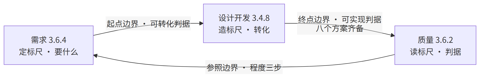

# 第3章 三基座：需求、设计与质量

> 本章概念：需求 / 设计开发 / 质量
> 英文来源：requirement / design and development / quality
> 主案例：冰链科技 M3 冷链温控箱 ｜ 镜照：恒信集团合同审批系统

---

## 3.1 章首 · 误解现场 {.unlisted}

周五下午四点，冰链科技的产品评审会开了整整两个小时，会议室里飘着咖啡和争论的气味。

产品经理文正把一页参数对比表拍到桌上，指着一个加粗的数字：

> "兄弟们，我们 M3 温控箱的温度精度做到 ±0.3℃，竞品只有 ±0.5℃；保温时长 72 小时，竞品 48 小时；重量还轻了 2 公斤。**质量绝对没问题。** 现在唯一的悬念是宣传口径——是打'行业精度第一'还是'保温时长远超竞品'。"

会议室里一片点头，有人甚至轻轻鼓了掌。气氛从紧张变成了轻松，仿佛刚打赢了一场仗。

只有坐在角落的测试李旭，弱弱地举起手："那……测试判据是什么？"

文正摆摆手："技术方案都定了，测试判据后面自然会有。先定宣传口径。"

李旭张了张嘴，又闭上。会议继续。

如果你坐在这间会议室里，你大概也会点头。因为大多数人对"质量"和"设计开发"这两个词的直觉，和文正一模一样：

- **质量 = 东西做得比人强、指标压过竞品**；
- **设计开发 = 做出技术方案**，方案定了，后面的测试、采购、生产、交付，都是"自然会有"的事。

这两个直觉，是这一章要推翻的东西。错的不是文正——错的是这两个词在他脑子里指向的那个东西。李旭那句被淹没的"测试判据是什么"，其实是一句判决书：它宣告设计开发**根本没有结束**。我们到章末会回来审判它。

---

## 本章问题 {.unlisted}

读完本章，你应该能回答：

1. 需求、设计开发、质量三个词，各自是什么？为什么说它们是"三基座"？
2. 需求和点子有什么区别？需求开发与设计开发的边界画在哪？
3. 设计开发从什么时候开始、到什么时候结束？"技术方案做完了"够吗？
4. 质量是"特性÷需求"吗？"等级高"等于"质量好"吗？过度设计是加分还是减分？
5. "质量 vs 进度"的冲突，本质是什么？怎么解？
6. 三兄弟怎么咬合成一个基座？为什么它们互为定义、拆不掉？

---

## 开篇 · 本章枢纽（骨架先行） {.unlisted}

先把本章要钉的三个词、和它们牵出的一条链立起来——后面三幕，都是给这层骨架添血肉。

第2章我们立起了"工程"这面台：工程不是手艺，是可复现的方法。这一章在这面台上立标尺——需求、设计开发、质量三把尺。先把三兄弟的关系摆出来，后面的路才不迷路：

> **需求（requirement）= 定标尺**（定义"要什么"，是设计开发的输入）；**设计开发（design and development）= 造标尺**（把需求转化为更详细的需求，造出规格）；**质量（quality）= 读标尺**（度量特性满足需求的程度，读出结果）。三词一条链：**定标尺 → 造标尺 → 读标尺**——一个产品开发流程，无非是走完这条链。

这一章的骨架是**三个词 + 一条链 + 一把尺子**：三个词（需求 / 设计开发 / 质量）；一条链（定标尺 → 造标尺 → 读标尺，三兄弟互为定义、拆不掉）；一把尺子（**判据主义**——第1章的方法论在这里落地：质量 = 特性满足需求的程度，可检验；设计开发止于"可实现"，可检验）。

第一幕把三个词各是什么钉清楚（含溯源），第二幕沿三条边把兄弟之间的边界磨开（判据主义成为你的亲身体验），第三幕把链用起来——读标尺、解冲突、咬合成基座。

---

## 3.2 第一幕 三兄弟是什么（定界）

> 这一幕把三个词看清：先立"定标尺 / 造标尺 / 读标尺"各是哪位兄弟，再逐个亮相——每词给定义、给溯源、给它到底干什么。三个词都在这一刻出场，后面的边界与运用才有话可说。

### 3.2.1 需求：定标尺——定义与三种形态

三兄弟里打头的是需求。ISO 9000:2015 给它的定义只有一行，却可以拆出整本书：

> **需求（requirement）**：明示的、通常隐含的或必须履行的需要或期望。
> *need or expectation that is stated, generally implied or obligatory*

注意后半句的三个词是**并列**的——明示的（stated，说出来了）、通常隐含的（generally implied，惯例默认、没说出口）、必须履行的（obligatory，法规强制）。**三个都是需求，没有主次。** 这不是修辞。

拿 M3 温控箱展开，三种形态全占：

**明示的（stated）**——写在纸上的。客户在合同里明确要求"箱体尺寸可放入标准疫苗运输车""箱门可单手打开"。白纸黑字，谁都能看到，谁都赖不掉。

**通常隐含的（generally implied）**——没人写，但行业默认。冷链运输箱"应该扛得住装卸时的磕碰""外壳不能有锐角划伤搬运工""电池要能撑过全程并显示余量"——这些没人写进合同，但你要是漏了，客户在使用第一天就会认定"这产品不行"。**隐含需求漏了是缺陷，不是"没写文档所以不算"**——它不会自己开口，需要组织主动识别（这正是起点判据里最贵的一条，见 §3.3.1）。

**必须履行的（obligatory）**——法规强制，无条件满足。GSP 药品冷链法规要求疫苗运输全程"-20℃~8℃ 不断链"，断链即报废；不满足这条，M3 连上市资格都没有。法规需求没有讨价还价的余地，它是一条"不满足就出局"的红线。

镜照一眼恒信集团：合同审批系统的明示需求是"合同在三个部门间流转审批"，隐含需求是"审批人能在手机上快速通过""离职审批人自动移交待办"，必须履行的是"合同数据按公司法要求留档十年"。三兄弟在 IT 世界里一个不缺。

三种形态的差异，落在后面第8章会变得性命攸关：**验证**（verification）对照的是"规定需求"——也就是明示成文的那些；**确认**（validation）对照的是"预期用途"——真实场景。隐含需求没进文档，验证够不着它，只有确认兜得住。那是第8章的故事，这里先埋下种子。

"需求"这个词本身也有来处：requirement ← 拉丁 requirere（要求、寻求）。而"需求"的所指，经历了一次漂移——它原指"要的东西"，后来才分出"明示 / 隐含 / 必须履行"三种形态（这正是第1章 §1.7.4 病二说的术语会漂移：一个词如何积累出多个概念）。ISO 9000 把这场漂移固化成了标准定义。

### 3.2.2 需要、期望与需求：三个词，三个量级

英文来源这一格在这里特别值钱。中文习惯把"需要""期望""需求"糊成一个词，英文是三个：

| 英文 | 中文 | 含义 | M3 的例子 |
|---|---|---|---|
| need | 需要 | 硬性诉求，缺了会痛 | 疫苗不能坏 |
| expectation | 期望 | 软性诉求，缺了会失望 | 精度越高越好、App 越顺手越好 |
| requirement | 需求 | 需要或期望 × 呈现方式 | 上面两者的全集 |

"需要"和"期望"是**内容**——你要的那个东西本身；"明示/隐含/必须履行"是**呈现方式**——这个内容是怎么出现的。**两个维度交叉，才是需求的完整图景**：一个 need 可以是明示的（"我们要 72 小时保温"），也可以是隐含的（"要能扛磕碰"）；一个 expectation 可以是隐含的（"手感要高级"），也可以是明示的（"外壳要金属拉丝"）。

> 术语注："需要/期望是内容、明示/隐含/必须履行是呈现方式"这个两维图景是本书的梳理主张——ISO 9000 只并列给出 need / expectation / requirement 三个词，不这样分维度；两维画法是本书为方便使用而做的凝练。

为什么要较真这个区别？因为后面所有的设计开发、质量判定、评审验证，锚的都是"需求"这个完整图景，而不是某一个形态。文正心里想的"质量"，八成只有"期望"那一层——"越高级越好"；而法规、客户合同、行业惯例这些真正决定成败的部分，不在他的射程里。**把三个词糊成一个，等于把最重要的一半需求扔出视野。**

还有一个更常见的混用——**需求 ≠ 目标**。目标（objective，3.7.1）是"要实现的结果"，回答"为什么做"；需求是"必须满足的需要或期望"，回答"做成什么样"。"我们要成为冷链行业的精度第一"是目标；"温度波动 ≤±0.5℃"是需求。

目标定方向，需求定规格——把目标当需求写进规格，设计开发会茫然：它不知道怎么把一个"成为第一"转化成可测量的特性。**目标可以激励人，需求必须可判定。**

镜照一眼恒信：黄程的"需要"是月底账能对上——缺了会痛；"期望"是查询响应再快一点——缺了会烦；而"合同审批查询响应有明确指标、数据留档十年"才是落到纸上的需求。IT 世界里同样是"内容 × 呈现方式"的两维图景。

### 3.2.3 设计开发：造标尺——定义与四个构件

第二个兄弟，也是全章的主角。ISO 9000:2015 的定义，信息密度高到几乎每个词都是关键词：

> **设计和开发（design and development）**：将客体的需求转换为对其更详细的需求的一组过程。
> *set of processes that transform requirements for an object into more detailed requirements for that object.*

拆开四个构件，逐个看：

**① 客体（object）**——被设计的东西。定义用的是"客体"（3.6.1，可感知或可想象到的任何事物），不是"产品"——因为设计开发的对象绝不限于硬件：产品设计开发、服务设计开发、过程设计开发都成立。M3 温控箱是客体，恒信集团的合同审批系统是客体，连一条"疫苗出库流程"也可以是客体。

**② 需求（requirement）**——输入必须是需求，不是点子、灵感、创意。创意不表述为需求，就进不了设计开发的流程。这直接呼应了 §3.3.1 的"起点之前是研究"——研究把点子变成需求，设计开发才接手。

**③ 转换为（transform）**——动词才是灵魂。输入与输出必须是**不同的东西**。流程走完了，输出需求和输入一个样——那不是设计开发，那是走流程。这个"不同"体现在"更详细"上。

**④ 更详细的需求（more detailed requirements）**——**唯一的判定标准**。注意：定义没说"更正确""更优化"，只说"更详细"。设计开发的职责是把需求展开、分解、落到可实现和可验证的粒度；方案优劣由评审和验证把关，不是设计开发自己说了算。

> **辨析栏 · 设计 vs 开发 vs 设计开发**
> 英语里 design（设计）、development（开发）与 design and development（设计开发）三者，有时完全同义，有时指整个流程的不同阶段——design 偏概念/方案阶段，development 偏详细化/实现阶段。用哪个词不重要，重要的是整体是一个需求转化过程。落到中文，"设计开发"是对应 3.4.8 的完整术语，别把它拆成"设计+开发"两件事。

**"更详细"判据的实战用法**：既然"更详细"是设计开发是否发生的唯一试金石，判断"这个变更算不算设计开发"就有了硬抓手——**输入输出同样详细 = 没发生设计开发**。只改外观颜色、不产生任何新需求细节的变更，严格说不构成设计开发，可以走快速通道。

而"把温度控制从单路改成双路冗余"——产生了新的可靠性需求、新的接口需求、新的测试需求——就是一次实实在在的设计开发，必须走完整设计流程。这个判据在变更管理和审核时极有用：它把"改一下"和"重新设计"区分开，后者不能图省事。

还有一条容易被忽略的注——**注脚一：一个项目（3.4.2）中可有多个设计和开发阶段**。这意味着设计开发在项目内部是**递归**的：

```
客户需求（宽泛）→ 概念设计 → 系统需求（细化中）
                        → 详细设计 → 部件规格（更细）
                              → 工艺设计 → 可生产可检验的要求（最细）
```

概念设计把客户需求变成系统需求，详细设计把系统需求变成部件规格，工艺设计把部件规格变成可生产、可检验的要求——**每一级都在执行同一个 3.4.8**。每个阶段的输出需求，就是下一阶段的输入需求，直到需求足以支撑实现和验证。

这对 M3 意味着什么？文正以为"设计开发 = 做一次技术方案"。不对——M3 的温度控制系统需求 → 制冷子系统规格 → 压缩机/温控板件规格 → 生产工艺要求，是四五个"设计开发阶段"叠在一起的递归链。任何一个阶段的"更详细"没做透，下游就在半成品上盖房子。这也是为什么"终点"的判断那么重要——你总得知道整条递归链在哪里算走完。

定义里还有两个注脚——注脚二、三与注脚一同属 3.4.8 注 1 的含义（不是 ISO 给了三个注），信息密度极高。**注脚二：输出比输入更宽泛、更通用。** 输入说"一台能低温运行的设备"，输出要落到"-40℃ 下连续工作 72 小时、误差 ≤±0.5℃"。注意这里有个反直觉的方向：**"更详细"不等于"更窄"**——输入的"低温设备"只有一句，输出的规格覆盖了温度、体积、功耗、可靠性、接口……是几十条，是信息量的扩张。

**注脚三：需求通常以特性来规定。** 特性（characteristic，3.10.1）= 可区分的特征。把抽象需求落到特性上，需求才变得可测量、可验证：需求（宽泛·抽象）→ 特性（可区分的特征）→ 可验证的规格（落到可测特性上）。特性可区分 → 可测量 → 需求可验证。这条链条，是后面整个质量判定体系的地基——需求不落到特性上，验证就没有对象。

"设计开发"这个词的来处：design ← 拉丁 designare（标注、指明）。它不是中文里"设计"与"开发"两件事的拼合——ISO 9000 用 design and development 完整表述"需求转化"这一件事，中文标准统一译作"设计开发"，强调它是整体，别拆成两半。

设计开发是递归的（第11章三动词链的"分形递归"：系统→子系统→模块，每一层重复同一轮构思-定义-设计，ISO 9000 §3.4.8 的需求→更详细需求可逐层套用）。

### 3.2.4 质量：读标尺——定义与三个关键词

第三个兄弟，也是全章最容易被误解的一个。

> **质量（quality）**：客体的一组固有特性满足需求的程度。
> *degree to which a set of inherent characteristics of an object fulfils requirements.*

三个关键词，一个都不能松：

**① 固有（inherent）特性**——存在于客体本身的：功能、性能、材质。"固有"二字把范围框死了：价格、品牌、交付时间这类**赋予特性（assigned characteristic）**不算。这意味着设计开发的范围也被"固有"框住——价格、交付周期是 8.2 等其他过程的事，**设计开发管不着，也不该管**。

（成本例外见 §5.4.8：作为"经济可承受性"需求仍会进入设计输入——"管不着"的是价格这一质量特性，成本需求本身要接。）文正在评审会上比"精度、保温时长、重量"——这些是固有特性，比对了；但要是比"价格比竞品便宜"——那不是质量，是经营。

镜照一眼恒信：合同审批系统的固有特性是查询响应时间、正确性——功能和性能；"用的是哪家平台""上线时间"是赋予特性，设计开发管不着。文正式的"比参数"，在 IT 世界里换成"比平台名气、比上线速度"——一样比错了地方。

**② 满足（fulfils）**——符合性判定，不是数量比。特性达到需求规定的水平 → 满足；达不到 → 不满足。这是一次**判定**，不是一道除法。质量问的是"结果在标尺上的位置"，不是"标尺除以结果"——两边不同质，一个在客体里，一个在客体外，除不了。

**③ 程度（degree）**——差、好、优秀，形容词，不是数字。质量是被**认定**出来的，不是被**计算**出来的——靠验证/确认用客观证据判定。

这里藏着全书的一个方法时刻，值得当场点破：**判据主义**。第1章说，判断一个概念，要问它的可检验判据——不给没有判据的定义。质量的定义，恰恰把"质量好"从一个主观印象，变成了一个可检验的判据——"特性满足需求的程度"。

程度可以用客观证据认定（测量、比对、验证），因此"质量好不好"可以争论、可以复核、可以裁决。这不是给质量泼冷水，这是让质量第一次成为工程上的一把尺子。整章后面每一次"磨边界"，都是这把尺子在用。

"质量"这个词的来处，同样是一次漂移：quality ← 拉丁 qualitas（"如何"）。它原指"档次、用料"——好东西 = 好质量；ISO 9000 把它纠正为"特性满足需求的程度"——符合需求的程度，与档次无关（呼应第1章 §1.7.4 术语会漂移）。这一漂，是本章要立的最大一个反转。

### 3.2.5 三张概念卡：把三个词钉在档案里

三个词亮相完毕。把三张档案钉在这里——四问为纲，九格为目（格号 = 九格尺子；薄格可省，不可跳）：

> **概念卡片 · 需求**（四问为纲，九格为目；格号=九格尺子）
>
> | 四问 | 格 | 内容 |
> |---|---|---|
> | **它是什么** | ① | 明示的、通常隐含的或必须履行的需要或期望（ISO 9000:2015 §3.6.4）——定标尺，定义"要什么" |
> | **它不是什么** | ⑥⑦ | 对立：点子 / 创意——点子不表述为需求，就进不了设计开发的流程；辨析：需要（内容·硬性）→ 期望（内容·软性）→ 需求（需要或期望 × 呈现方式）；需求 ≠ 目标 |
> | **它从哪来** | ②③⑨ | requirement ← 拉丁 requirere（要求、寻求）；"需求"原指"要的东西"，后漂移出"明示/隐含/必须履行"三形态（呼应第1章 §1.7.4 术语会漂移）；ISO 9000 将其固化为标准定义 |
> | **它往哪去** | ④⑤⑧ | 它回答"要什么"，是设计开发的输入、质量的标尺；在需求获取、需求评审、变更控制时用；误区 ✗ "需求 = 用户说出来的"（隐含、强制需求漏掉是缺陷）✗ "需求 = 目标"（目标回答为什么做，需求回答做成什么样） |
> | **判据** | 起点 | 起点判据"可转化"：完整、无歧义、不冲突、隐含需求已识别（见 §3.3.1） |

> **概念卡片 · 设计开发**（四问为纲，九格为目；格号=九格尺子）
>
> | 四问 | 格 | 内容 |
> |---|---|---|
> | **它是什么** | ① | 将客体的需求转换为对其更详细的需求的一组过程（ISO 9000:2015 §3.4.8）——造标尺，把需求变成规格 |
> | **它不是什么** | ⑥⑦ | 对立：走流程——输入输出同样详细，没发生设计开发；辨析：设计（阶段）vs 开发（阶段）vs 设计开发（完整过程）；需求开发（8.2）vs 设计开发（8.3）——看"特性是否被规定"（见 §3.3.1） |
> | **它从哪来** | ②③⑨ | design ← 拉丁 designare（标注、指明）；"设计开发"由"设计"+"开发"合并而来——ISO 9000 以 design and development 完整表述需求转化过程，中文标准统一为"设计开发"，强调它是整体，别拆成两件事 |
> | **它往哪去** | ④⑤⑧ | 它回答"怎么把要什么变成做得出来、验得了的规格"；从需求进入设计、到规格足以支撑实现和验证时用；误区 ✗ "设计开发 = 画图 / 创意活动"（是需求转化）✗ "技术方案做完 = 设计开发完成"（八方案齐备才算，见 §3.3.2） |
> | **判据** | 终点 | 止于"可实现"；"还有哪个环节会在执行时反问'这到底怎么做'？有，设计开发就没结束"（见 §3.3.2） |

> **概念卡片 · 质量**（四问为纲，九格为目；格号=九格尺子）
>
> | 四问 | 格 | 内容 |
> |---|---|---|
> | **它是什么** | ① | 客体固有特性满足需求的程度（ISO 9000:2015 §3.6.2）——读标尺，读出"满足到什么程度" |
> | **它不是什么** | ⑥⑦ | 对立：等级 grade——等级 ≠ 质量；辨析：符合性（满足了吗）→ 质量（满足到什么程度）→ 等级（按哪套需求分类）——三词分工与"等级≠质量"的判据推导，见 §3.3.3 |
> | **它从哪来** | ②③⑨ | quality ← 拉丁 qualitas（"如何"）；"质量"从日常的"档次、用料"漂移到"符合需求的程度"——ISO 9000 把 quality 定义为特性满足需求的程度，纠正"好东西=好质量"的直觉（呼应第1章 §1.7.4） |
> | **它往哪去** | ④⑤⑧ | 它回答"东西做出来，到底好不好"；在验证/确认、评审、接收时用；误区 ✗ "特性越多/越高，质量越好"（过度设计，见 §3.3.3）✗ "质量能算分（85分）"（见 §3.4.2） |
> | **判据** | 判据主义 | 质量 = 特性满足需求的程度，可检验；特性超出需求区间 = 过度设计（判据见 §3.3.3） |

## 案例进展①｜没做调研的文正 {.unlisted}

冰链科技立项 M3 的第七周，产品、研发、销售开联合评审。

文正拿着方案书进场，标题是"M3：行业精度第一的冷链温控箱"。他开口第一句："客户要的是精度，我们直接把精度做到行业第一。"

销售小冯打断他："谁告诉你的？上周我拜访了三个省疾控中心，他们问的第一句话全是——**能不能塞进我们现有的疫苗运输车**？你的 M3 尺寸比现在那款大了一圈，塞不进去。"

会议室安静了。

文正愣住："……合同里没写这条。"

"是没写，"小冯说，"但这是他们所有人都在问的。你立项前做过市场调研吗？"

文正没做过。他的起点，是一个点子——"把精度做上去，就能赢"——跳过了研究，直接进了设计开发。七周后，方案书被推倒重来，重新做尺寸、重新评估保温层厚度、重新谈供应链。

**这一轮返工，损失的七周，就是"起点没收好"的全部代价。** 设计开发转化的是需求，起点给错了需求，转化得越彻底，浪费得越彻底。

---

## 3.3 第二幕 三条边：兄弟之间磨边界（磨边界弧）

> 这一幕把三兄弟之间最容易混的地方分开——判据主义在这里成为读者的亲身体验：概念靠正例活，靠反例定型。三条边，一条一条磨：起点边界（需求 × 设计开发）、终点边界（设计开发 × 质量）、参照边界（需求 × 质量）。

### 3.3.1 起点边界（需求 × 设计开发）：研究先于需求，特性划分天下

兄弟之间最容易打架的地方，是交接处。第一条边，在需求与设计开发的交接处——**设计开发从什么时候开始？**

先说清"开始之前"。设计开发不始于"点子"，而始于"被研究确认过的需求"：

> 点子 / 灵感 / 想法 →（市场调研、可行性分析、技术预研、客户需求识别）→ **确定的需求** → 设计开发开始

为什么必须插这一步？因为设计开发的输入是需求，而需求（按 3.4.8 注 1）"通常是研究的结果"。一个没经过研究确认的点子，就像没筛过的面粉——里面藏着沙子和石子，设计开发会把它老老实实做成一个"错误的需求"的完美实现。

很多项目"设计得很辛苦、产品没人要"，根源不是终点没管好，是起点没收好——**不是房子盖歪了，是地基的图纸就画错了。**

那"开始"这道闸门怎么过？设计开发的起点，是**一份需求规格被正式确立为设计输入的时刻**。而这份需求规格，必须先满足"可转化"判据——四道闸门，一道都不能松：

1. **完整**——功能、性能、以及由产品和服务性质导致的潜在失效后果，一个不缺。M3 不只是"能制冷"，还包括"制冷失效时自动告警""断电后保温时长""结霜影响"这些潜在失效的处置。缺一项，设计开发就可能在错误的方向上越走越远。
2. **无歧义**——每个需求只能有一种理解。"精度要高"不是需求，"温度波动 ≤±0.5℃"才是。歧义就是留给未来的争吵。
3. **不冲突**——需求之间自洽。"重量轻 2 公斤"和"保温 72 小时"可能打架（保温靠保温层，保温层厚则重）——这要在需求阶段协调掉，而不是等设计开发做完再发现。
4. **隐含需求已识别**——最容易被忽略、却最决定规格对不对的一条。它没写进规格，却决定规格对不对；它不会自己出现，需要主动去挖。

> **起点没收好，转化的是错误需求——终点越完美，偏离越远。**

第一幕说过，设计开发把需求"转化为更详细的需求"。可管理评审时一定会遇到一个划界问题：市场调研、可行性研究、URS（用户需求说明书）这些"需求开发"的文档，算不算设计开发？

**概念上：算，而且同构。** 3.4.8 的定义"不挑段"——顾客说"我要一台能低温运行的小型设备"，需求开发把它变成"工作温度 -40℃、体积 ≤0.5m³、……"——这本身就是一次"需求变详细"。需求开发也是需求转化，同样具备 3.4.8 的定义特征。**它和设计开发是同一种认知活动的不同阶段**，只是转化发生在更靠前、更粗的层级。

**标准组织上：可合可分。** ISO 9001 把需求确定（8.2：顾客沟通、要求确定、要求评审）和设计开发（8.3）分成两条，不是因为"需求开发不是需求转化"，而是**职责组织方式**不同：8.2 管"要什么"（面向顾客与市场），8.3 管"怎么实现"（面向技术与实现）。复杂组织常把需求开发作为设计开发的第一阶段纳入 8.3；简单组织放在 8.2 即可。**两种策划都合规。**

**实用判据：看"特性是否被规定"。** 这是把质量定义（3.6.2"客体的固有特性"）用起来的硬判据：

> 需求开发阶段，客体还没确立，**特性压根不存在**，质量没有承载体；设计开发阶段才开始"把需求落到客体固有特性上"。
>
> **特性还没开始规定，是需求开发（8.2）；特性开始被规定，才是设计开发（8.3）。需求规格就是那道闸门。**

**必须补的提醒**：不管这些文档（市场调研、可行性研究、URS）归 8.2 还是 8.3 第一阶段，它们都是设计输入的来源，直接影响产品质量特性——审核时"这些文档不在受控范围"是过不去的。它们可以不属于"设计开发"，但**不能不受控、不可追溯**。文正的"M3 立项调研"如果能受控存档，案例进展①那七周返工至少不会连个"当时为什么这么做"的记录都没有。

### 3.3.2 终点边界（设计开发 × 质量）：止于"可实现"，把裁判权交出去

第二条边，在设计与质量的交接处——**设计开发什么时候算结束？** 绝大多数团队（包括冰链科技）说"技术方案做完就结束了"。但我们要严谨地推出正确结论——不是拍脑袋，是把候选终点一个一删：

| 候选终点 | 为什么被否定 |
|---|---|
| **确认通过** | 错位：确认（3.8.13）锚定"产品"（对预期用途的认定），而设计开发锚定"需求"；且确认常发生在设计开发形式结束之后很久 |
| **责任移交点** | 只是制度动作（设计基线发布），不是定义内部的内在判据 |
| **可验证** | **逻辑倒置**——详见下面 |
| **可实现** ✅ | 定义内部唯一的自然终止条件 |

**"可验证"为什么不对——这是全书最重要的一个推理，值得单独看：**

验证（3.8.12）的定义是"通过提供客观证据，对**规定需求**已得到满足的认定"。注意：验证的参照是"规定需求"，而规定需求正是设计开发的**输出**。也就是说——

> 验证能发生，前提是设计开发已经结束（输出了规定需求）。
> 拿"可验证"当设计开发的终点，等于让设计开发结束在验证的起跑线上——**循环倒置**。

更致命的是第二层：验证的注 1 说，客观证据可以是"文件评审"。那么几乎所有写清楚的需求都"可验证"——这个判据**区分不了完成与未完成**。你说"需求写完了所以可验证了所以设计开发完了"——那"写完了"还是"可验证"？绕回去了。

所以终点只能落在"可实现"：

> **设计开发止于"可实现"：需求被细化到足以支撑客体实现、生产和服务提供可直接执行的程度（输出成为完整的规定需求）。**
>
> 验证与确认以这份规定需求为参照、在其后把关。"可实现"是入场券（必要条件），验证通过是及格线（符合），确认通过是目的达成——**但终点在验证之前。**

"可实现"在实物产品上具体化为——**八个方案全部完成**：

```
技术方案 · 物料采购方案 · 制造方案（工艺）· 测试方案
交付方案 · 部署方案 · 操作方案 · 运维方案
```

这八个方案不是八件独立的事，是**一个东西的八个面向**——"规定需求"按下游环节的分配：采购照着买、生产照着做、检验照着测、实施照着装、用户照着用、维护照着修。每个方案，都是给一个下游环节的"可实现需求"。这正是"满足后续产品和服务提供过程的需要"（ISO 9001:2015 §8.3.5 b）的完整展开。

> 术语注："止于可实现"与"八个方案"是本书的主张——本书对 ISO 9001:2015 §8.3.5 b（设计输出应"足以支撑后续产品和服务提供"）的操作化，不是 ISO 原文的列举。标准给的是判据方向，拆成哪几个方案、如何命名，由组织按自己的下游环节裁剪。

每个方案的条款落点，也都对应着下游过程的要求：

| 方案 | 条款落点 | 下游环节 |
|---|---|---|
| 技术方案 | §8.3.5 d：规定对预期目的至关重要的特性 | 设计本身 |
| 物料采购方案 | §8.4：外部提供的要求 | 采购 |
| 制造方案（工艺） | §8.5.1：生产和服务提供的受控条件 | 生产 |
| 测试方案 | §8.3.5 c：监视和测量要求 + 接收准则 | 检验/验证 |
| 交付/部署/操作/运维 | §8.5.1 及生命周期各环节 | 交付/实施/使用/维护 |

> **终点由"最后一个配齐的方案"决定，不由"第一个完成的技术方案"决定。**

为什么技术方案不够？因为技术方案只回答"客体本身长什么样、怎么实现"——它是八个方案里**最先完成、最显眼**的，但只是第一个面。只到技术方案就宣布终点，后果是**连环空转**：

- 采购没有物料规格和合格准则——采购方案空转；
- 生产没有工艺依据——制造方案空转；
- 测试没有判据——验证无法启动，李旭那句"测试判据是什么"没人能答；
- 交付/部署/操作/运维没有指令——产品出门即"失联"，客户拿到手不知道怎么装、怎么用、怎么修。

这四连空转，就是冰链 M3 后面要吞的全部苦果。

镜照一眼软件世界——恒信集团的合同审批系统，"八方案"长这样：技术方案（架构/技术选型）、数据方案（表结构/数据字典）、接口方案（与法务/财务系统的对接契约）、测试方案（验收标准）、部署方案（环境/发布）、操作方案（用户操作手册）、运维方案（监控/升级/容灾）、安全方案（权限/审计）。

八个面向一个不少——**"八方案"对软件同样成立，只是名字从"物料/制造"换成了"数据/接口/部署"**。凡是只做了技术方案就宣布"设计完成"的软件项目，和只有技术方案的 M3 一样，都会在下游环节连环空转。

"可实现"这个词容易引起误会——好像设计开发完了，东西就能跑起来。所以要分清三个层次：

| 层 | 谁给的 | 性质 |
|---|---|---|
| **层1 原理可实现** | 技术方案 | 纸上可行——证明"从技术原理上走得通"，是纸上的 |
| **层2 方案可实现** | 八方案齐备 | **设计开发终点**——从"原理可行"跨到"可执行指令齐备" |
| **层3 事实可实现** | 验证/确认 | 终点之后——"能否真正实现并运行"由它们裁决 |

落到 M3：双压缩机冗余在纸面上完全成立，这是**原理可实现**（层1）；八个方案齐备、可执行指令齐全，这是**方案可实现**（层2，设计开发终点）；真造出样机、在真实冷链运输里跑通验证与确认，才是**事实可实现**（层3）——而这一层，是冰链连边都没摸到的。**从"纸面可行"到"真能跑"，中间隔着整个验证与确认。**

设计开发交付的不是**事实**，而是**声明**——一份"可信的可实现声明"：八方案齐备、逻辑自洽，靠评审、样机、仿真来提高置信度，但最终裁决权在终点之后的验证与确认。守住这条"诚实边界"，设计开发就不会把"我们觉得能做"当成"我们做完了"。

这就是第二条边的全部内容：**设计开发把"裁判权"交在终点之外——它只负责把规格造到"可实现"，把"到底行不行"交给读标尺的质量判定。** 兄弟各管一段，边界在这里。

### 3.3.3 参照边界（需求 × 质量）：等级 ≠ 质量，需求区间是唯一标尺

第三条边，在需求与质量的交接处。中文里最容易和"质量"混的，是"等级"和"符合性"。它们三个不是同一个词的不同说法，而是回答三个不同的问题：

| | 回答的问题 | 形态 | M3 的例子 |
|---|---|---|---|
| **符合性** conformity | 满足了吗？ | 二元（符合/不符合） | 温度波动是否 ≤±0.5℃？ |
| **质量** quality | 满足到什么程度？ | 程度（差/好/优秀） | 一组特性综合下来，好不好？ |
| **等级** grade | 按哪套需求分类？ | 分级（高档/低档） | M3 是高配冷链箱，还是经济型？ |

三者都以"需求"为参照——而需求（标尺）是设计开发定出来的。

关键的反直觉点：**等级高 ≠ 质量好**。高档车可以是差质量（功能设计有缺陷），低档车可以是好质量（按它的需求做到了极致）。因为等级是"按不同需求分类"，质量是"满足各自需求的程度"。M3 把精度做到行业第一——它只是**等级**定得高，如果需求只要 ±0.5℃，那么超出部分对"质量"没有贡献。

这条边磨到底，就得到过度设计的一个硬判据：**特性超出需求范围的，不是质量加分，是过度设计——只加成本，不加质量。** 这给"砍需求"提供了一个干净的抓手：砍过度设计，是唯一"既省时间又不伤质量"的操作——不是牺牲质量，是给质量做减法。

回到冰链那场评审会：文正比的"±0.3℃ vs ±0.5℃"是等级之争；要问质量，得先问需求要 ±0.5℃ 还是 ±0.3℃。需求区间之外的那 0.2℃，就是过度设计的起点。

镜照一眼恒信：质量在 IT 世界里长的是另一个样子。合同审批系统的需求标尺是"合同在三部门间流转审批"；设计开发把这条需求造进审批流设计；质量读的是**查询响应时间、审批时效、正确性**——同一套"定标尺 → 造标尺 → 读标尺"，标尺从"温度精度"换成了"审批流转"。

一个硬件、一个软件，三条边磨开的方式一模一样。这正是本书用两条线讲故事的原因：**这套概念不挑行业。**

三条边磨完，判据主义的手法也亮了相——幕引那句"概念靠正例活，靠反例定型"，在这里落到三条边上：等级靠"高档车可以是差质量"定型，过度设计靠"超出需求区只加成本"定型，终点靠"可验证是循环倒置"定型。每一条边，都有一条可检验的判据在收口。这正是判据主义：不给没有判据的定义，不给没有失效边界的工具。

## 案例进展②｜只有技术方案的 M3 {.unlisted}

时间回到章首那场评审会之后。

M3 的技术方案确实漂亮：双压缩机冗余、±0.3℃ 恒温控制、全数字监控。文正拿着它宣布"设计完成"，产品进入"等待量产"状态。

量产准备会上，采购问："压缩机我们按什么型号采？合格准则是什么？"——**采购方案：没有。**

制造与供应链的逸人顺着技术方案往下追。他翻到装配那页，问："装配工艺文件呢？"文正没接上。他又问："低温密封测试怎么做、用哪套工装？"还是没接上。他敲着纸面追问："这套方案，产线上到底可不可实现？"文正这才意识到，自己那句"设计完成"只到纸面——**制造方案：没有。**

李旭问："测试判据是什么？验收标准是什么？"——**测试方案：没有。** 他章首那句被淹没的问题，在这里第二次冒出来，这次没人能再忽略。

交付团队问："客户拿到箱子，怎么装、怎么部署、怎么培训？"——**交付/部署/操作方案：没有。**

云端软件的董勐问："追溯平台的数据谁备份、App 断连了谁发现？"——**运维方案：没有。**

七个问题，七个方案，七个"没有"。会议室从"技术方案真漂亮"的气氛，跌进"我们离能交付还差得远"的沉默。

水忠，那个一直不怎么说话的嵌入式工程师，说了句："**我们以为设计开发结束了。其实它连一半都没走完。**"

设计开发止于"可实现"——八个方案齐备的那一刻。冰链只完成了八分之一，就宣布了胜利。

> **还有哪个环节会在执行时反问"这到底怎么做"？——有，设计开发就没结束。**

---

## 3.4 第三幕 读标尺 → 冲突 → 咬合（运用）

> 这一幕把尺子用起来：先读标尺（质量"程度"怎么认定、能不能打分），再解冲突（质量 vs 进度到底是场什么架），最后咬合（三兄弟怎么互为定义、推不翻——整个基座三角站起来）。

### 3.4.1 读标尺：质量"程度"三步得出法

第二幕把"程度"这个词磨清了——它是认定出来的，不是计算出来的。那"程度"到底怎么得出来？三步，一步不缺：

```
第一步 确定特性值（3.11.1）     查明特性及其值
        手段：测量（定量）/ 检验（符合性）/ 试验 / 评审 / 计算
        产出：客观证据（3.8.3）

第二步 与需求比对（3.6.11）     判符合性
        用接收准则（设计输出 8.3.5 c 里提前写好的判定标准）比对

第三步 认定满足程度（3.6.2）    得出质量
        综合一组特性的符合情况，认定程度：差 / 好 / 优秀
        动作上就是验证（3.8.12）和确认（3.8.13）
```

**四个条款，一步不缺，程度才出得来**：工具在 3.11，标尺在 8.3.5（接收准则写在测试方案里——它是终点八方案之一），动作在 3.8.12 / 3.8.13。缺了测试方案里的接收准则，程度就出不来。

注意一个重要的不对称：

- **单项是二元**——每一条特性：符合 / 不符合；
- **整体是程度**——综合一组特性：差 / 好 / 优秀。

整体程度按特性重要度综合评价——关键特性优先（8.3.5 d 对预期目的至关重要的特性）。这是后面第8章"评审三问"和质量判定的地基，这里先立起来。

**"接收准则"落地的样子**——M3 测试方案里必须写清楚：温度波动 ±0.5℃ 判"符合"还是"不符合"，用什么设备测、测多久、抽多少样本，判定结论写在哪份记录上。**没有这些，程度就出不来**——你说 M3"质量好"，拿什么证据？哪条特性符合了、哪条没符合、符合到什么程度？

接收准则就是那个"提前写好的标尺"，它让"质量好"从一句感觉，变成一次可复核的认定。这也就是为什么"测试方案"必须是终点八方案之一——**没有接收准则，质量永远只能"感觉"，不能"认定"。**

镜照一眼恒信：合同审批的"查询响应"怎么读？测试方案里写清楚——在多大数据量下测、多少并发、响应超过几秒判"不符合"、结论记在哪张记录上。

### 3.4.2 质量能有具体分值吗？

既然"程度"是形容词，那能不能给它打分——比如 M3"质量 85 分"？

**标准层面：没有。** 符合性（二元）、质量（程度）、等级（分级）三个近亲都不是分值，而且标准在整个评价体系里**刻意不用单点分值**：特性多维不同质，加不成一个数；隐含需求无法完整数值化；注 1 明确质量用形容词修饰。

**组织层面：分值可以造，但它是组织的度量，不是标准概念。** 打分 = 定权重（特性重要度）→ 单项评分（接收准则映射分数）→ 加权汇总 → "85 分"。三个前提，缺一个分就是假的：需求完整（起点）、特性规定完整（终点）、证据可靠（验证）。

**最要命的一条：关键特性不能被摊平。** 8.3.5 d 说"对预期目的至关重要的特性"要优先。加权公式若把安全性、可靠性这种一票否决的特性摊进平均数——安全项失分，被"精度超强"补回来，结果还是 85 分——**这个 85 分，就是用假象掩盖致命问题**。分值的最大陷阱：**它给了你一个精确的错误。**

## 案例进展③｜"85分"的温控箱 {.unlisted}

质量评审会上，李旭拿着刚做出来的评分表："我给 M3 打了 85 分——温度控制 92 分、保温 88 分、外壳做工 90 分、重量 70 分……"

水忠打断他："权重怎么算的？"

李旭："平均。"

水忠指着评分表一行小字："你把'断电告警'放进去了吗？"

李旭："放了，权重和其他项一样，20 分里得 18 分。"

水忠："**断电告警是保命的。它不合格，产品就不能上市——它是 8.3.5 d 说的'对预期目的至关重要的特性'，不是平均分里的一项。**你把它的失分摊进平均数，安全项失 2 分，被'温度控制 92 分'补回来，最后 85 分——这 85 分，是在替一个致命缺陷打掩护。"

会议室安静了。水忠继续说："要么给关键特性设'一票否决'，要么用加权而不是平均。**否则这个分数，就是给了你一个精确的错误。**"

李旭默默改评分规则。他在心里想：原来"打分"看起来比"程度"精确，但精确的前提是把权重量对——量错了，精确就是假象。

### 3.4.3 冲突：质量 vs 进度——一场被误判为"打架"的协调

读标尺读到最后，一定会撞上一个绕不开的"冲突"：**质量 vs 进度**。这一节的主题是：这场冲突，是一场被误判为打架的协调。

#### 先拆伪前提

第一个伪前提：**质量不是时间的函数**。质量 = 特性满足需求的程度，和花多少时间没有必然关系——你不能说"多给我三个月，质量就自动变好"。

第二个伪前提，也是更深的那个：**进度本身就是一种需求**。ISO 9001 §8.2.2 说得很清楚——交付时间和交付条件也是顾客要求的一部分。所以"质量 vs 进度"本质是**同一份需求集合内部打架**：性能/功能需求 vs 交付时间需求。不是两个系统在拔河，是一份需求清单自己起内讧。

**解法不是二选一，是重新平衡这份需求集合。**

#### 四步解法

**第一步：判真伪。** 一半以上的"质量进度冲突"是估算失真、计划虚报、范围蔓延造成的**假冲突**——进度算错了，却怪质量太慢。假冲突，改计划，不动质量。M3 的"八周做不完"里，有多少是因为七周返工浪费的？那一部分不是质量的问题，是起点的债。

**第二步：用需求谈判，不用质量谈判。** 调整的是需求集合（哪个需求可降、可删、可延），不是"质量原则"。必须走**正式变更**（8.2.4 要求的更改 / 8.3.6 设计更改）：书面、评审、通知相关方。

**口头"差不多就行"是最危险的变更形式**——需求被悄悄偷换，验证确认全在跟一个没被承认的靶子打。这种降级（"实时推送"降成"两小时同步"）必须落在变更记录里，而不是散会后的记忆里。

**第三步：分清可妥协与不可妥协。**

- **不可动**：必须履行的需求（安全、法规——3.6.4"必须履行"一类）、关键特性（8.3.5 d 对预期目的至关重要的）。"断电告警"，就是命根子；
- **可动**：非关键特性、性能裕量、**过度设计**（可砍，见 §3.3.3）。

**第四步：度量环节可缩不可砍。** 最蠢的赶进度方式是"先交付，验证确认后补"。验证/确认是质量的度量——砍掉等于不度量就宣布合格，风险全部后移成现场返工（失败成本是质量成本里最贵的）。正确姿势：**把验证范围缩到关键特性，而不是把验证整个砍掉**——只验关键的，别全验；但不验，不行。

#### 三条禁忌

1. **砍验证/确认赶进度**——最贵，风险后移，返工爆炸；
2. **口头改需求**——最危险，需求被偷换，整个定义链失效；
3. **把"降需求"说成"降质量"**——概念错。等级（3.6.3）≠ 质量（3.6.2）：降低需求水平（砍非关键）是合法变更；交付不满足已承诺需求的东西，才是真降质量。

#### 正道：与相关方一起剪裁需求

> **单方面砍需求叫偷换，和顾客一起剪裁才叫变更——中间差着整个需求的所有权。**

为什么"一起"是硬要求？四个理由，层层递进：

1. **需求的所有权在相关方手里。** 需求（3.6.4）是"需要或期望"的表述——是相关方（尤其顾客）的资产，组织只是受托转化。单方面剪裁 = 拿别人的东西替别人做主：剪掉的那块可能恰是顾客最在乎的隐含需求——他没说，但你剪了，事后必炸；
2. **剪裁改变的是验证的靶子。** 验证（3.8.12）对照"规定需求"——需求一剪，靶子就变了。不和相关方一起剪，验证就是在打一个自己偷偷移动的靶子；
3. **剪裁的正确动作是"排序"，不是"删减"。** 让相关方排优先级：命根子（不可动）、想要的（可降）、贪多的（可剪）；
4. **剪裁要留痕，剪下来的部分要存档。** 走 8.2.4 / 8.3.6 正式变更：剪了什么、为什么剪、谁决定的、哪天恢复——全部记录。剪掉的需求不是消失了，是**挂账**：本轮进度解了，下一轮迭代（持续改进、改型）时就是现成输入。**剪裁是暂存，不是销毁。**

把这一幕的三兄弟放回原位看：**质量 = 特性满足需求的程度**——需求集合变了，质量判定跟着变；所以"解进度冲突"从来不是牺牲质量，而是和需求相关方一起，重新把标尺摆正。

## 案例进展④｜进度不够，客户被迫说真话 {.unlisted}

**§3.4.3 的正道是"与相关方一起剪裁"——排序、留痕、挂账。** M3 的量产进度亮起红灯，逼出了冰链第一次真正的剪裁：距离向省疾控中心首批交付还剩八周，但制造方案、测试方案都还没影。文正算了一笔账：按现在的开发速度，八周不可能全做完。

他走进会议室，对面坐着疾控中心的刘主任——这个"客户"其实是采购方代表。

文正硬着头皮说："刘主任，进度不够了。我们可能需要砍掉一部分需求才能按时交付。"

刘主任："砍哪部分？"

文正："比如把'箱门单手打开'这个……"

刘主任打断他："**不行，护士经常一手抱孩子一手开箱。这条不能砍。**"

文正："那'App 实时温度推送'呢？"

刘主任想了想："这个可以降级——不用实时推送，两小时同步一次就行。**但断电告警必须保留**——那是保命的。"

文正："还有'重量再轻 2 公斤'？"

刘主任笑了："那条本来就是你们销售自己吹出来的，我从没要过。砍。"

三十分钟，需求清单被重新排了序：命根子（断电告警、箱门单手开）、可降的（实时推送→定时同步）、可砍的（重量减 2 公斤、宣传用的"行业精度第一"）。李旭在旁边记录，每一条都写下了谁决定、为什么、什么时候恢复。

散会后，李旭对文正说："你知道吗，我们开产品会开了七周，问客户'你还有什么要求'，刘主任每次都说'没有了'。今天让他砍需求，他十分钟就把真正在意的全说出来了。"

**进度冲突，是隐含需求的显影剂。** 平时问"你还有什么要求"他答不出，你说"进度不够，必须砍一样，砍哪个"——他立刻知道答案。

这也是本章判据主义的一课：文正一直以为"质量 vs 进度"是两件事在拔河，真坐下来和顾客一起排需求，才知道那是同一份需求集合的内部排序——命根子、可降的、可砍的，各归其位，标尺重新摆正。

### 3.4.4 咬合：基座三角

三兄弟各自亮相、三条边磨完、一场冲突解开——最后一步，是把它们拼起来。把三张档案拼在一起，为什么叫"基座三角"而不是"三个并列概念"？因为三个定义**互相引用，拆不掉**：

- **需求**（3.6.4）是输入，是标尺——定义"要什么"；
- **设计开发**（3.4.8）是转化，是**造**标尺——把需求变成特性化的规定需求；
- **质量**（3.6.2）是判据，是**读**标尺——度量特性满足需求的程度。

> **一个产品开发流程，无非是：定标尺 → 造标尺 → 读标尺。**

两条案例线在三角上完全同构：冰链定标尺（-20℃~8℃ 断链即报废的法规需求）、造标尺（八方案）、读标尺（温度精度符合性）；恒信定标尺（合同三部门审批流转）、造标尺（接口/数据/部署方案）、读标尺（查询响应、审批时效）。**一个是硬件，一个是软件，基座三角纹丝不动**——这正是这套概念"不挑行业"的证据，也是全书用两条线讲故事的原因。

说它是"基座"，有三层证据：

**证据一：定义互相引用——拆不掉。** 设计开发（3.4.8）引用需求（3.6.4）；质量（3.6.2）引用需求和特性（3.10.1）；设计开发注 1 说需求"以特性来规定"。抽掉任何一个，另外两个悬空——**自洽且不可拆**。

**证据二：角色不可替代。** 需求管输入、设计开发管转化、质量管判据——三个角色各司其职，谁也替不了谁。

**证据三：能推出现有的全部方法——基座的终极检验。**

- 需求管理、需求评审、变更控制（8.2）← 从"需求"推出；
- 设计输入/输出、评审/验证/确认（8.3）← 从"设计开发 + 质量判据"推出；
- 质量控制、质量策划、质量改进 ← 从"质量"推出。

三角里还嵌着两个**承重构件**：客体（3.6.1）和特性（3.10.1）。

**客体（3.6.1）**——没有客体，质量定义（"客体的固有特性"）和设计开发定义（"对客体的需求"）无处安放。

**特性（3.10.1）**——没有特性，需求落不到客体上，质量也无从度量。它们是三角内部的横梁。

而三个概念的层级**不完全平级**：需求和质量是"元概念"——横跨一切领域，不只是产品开发；设计开发是"领域机制"——需求和质量在产品开发场景里的中介桥梁。**基座的最底层是"需求 + 质量"两个元概念，设计开发是架在它们之间的桥——桥是承重的，但地基是那两个元概念。**

> 术语注："需求与质量是元概念、设计开发是领域机制/桥"是本书对基座三角内部层级关系的凝练主张，不是任何标准的术语——ISO 9000 只分别定义三个词、不划定三者层级；"地基—桥"画法是本书的解释。

这也是本书能一路推到后面所有章节的原因。任何主流方法，都能从这个三角推出它的"为什么长这样"：

- **V 模型为什么是 V？** ——需求从哪一级分解下去，验证就必须从哪一级收回来。V 的左半边（需求→系统设计→详细设计）是需求逐级转化（设计开发），右半边（部件验证→系统验证→确认）是质量判据逐级回收（读标尺）。左右是镜像；
- **IPD 为什么有 TR/DCP？** ——质量判据必须关口化，不能等最后才看。技术评审点（TR）/决策评审点（DCP）就是在每个关口用"特性满足需求的程度"检查一遍；
- **为什么需求要追溯矩阵？** ——需求是质量标尺，标尺断了，度量就无据；
- **为什么变更要控制？** ——改需求就是改标尺，不改参照，验证就是打移动靶。

**每一个"为什么"都能从三角推出来——这就是"基座"和"几个相关概念"的区别。** 后面第4章到第14章，除了第9章是回到"工程师"这个人的角色章，其余都是这个三角在不同方向上的展开，到第15章收束成一件真实的事，第16章回到那个把这条链背在身上的人。

第2章立过"工程"这面台：工程不是手艺，是可复现的方法。这一章的三把尺子，就立在这面台上——台承托尺子，尺子定义台。三基座不是终点，是后面所有章节的出发点。

---

## 章末 · 认知反转 {.unlisted}

回到周五下午那场评审会。文正拍着参数对比表说"质量绝对没问题"。

现在我们知道，他说错了一个字。他想说的不是"质量高"，是**"等级高"**。M3 按更高标准设计制造、精度行业第一——它是高档产品，等级高。但等级高 ≠ 质量好：高档车可以是差质量，低档车可以是好质量。M3 的精度远超需求（±0.3℃ vs ±0.5℃），对"质量"没有贡献，只贡献了成本和复杂度——**那部分不是质量，是过度设计。**

而真正决定 M3 成不成的是另外两件事，一个在终点、一个在起点：

**终点没守住。** 冰链团队只做了技术方案就宣布"设计完成"，采购、制造、测试、交付、部署、操作、运维七个方案一个都没有。李旭那句被淹没的"测试判据是什么"，不是一句无关紧要的问话——它是**判决书**：设计开发没有结束的判决书。我们在案例进展②里看到它第二次冒出来，这次谁都无法再忽略。

**起点没收好。** 文正跳过研究、从"把精度做上去"的点子直接开工，把七周浪费在一个没有经过需求验证的方向上。"箱体能塞进标准疫苗车"这种最显眼的明示需求，反而在立项七周后才被销售带回来。

这一章其实给了三个反转：一个术语（等级 ≠ 质量）、一个流程（设计开发止于可实现）、一个起点（研究→需求→设计开发的链条不能跳）。它们都从同一个动作出发：

> **把一个你以为懂、其实各指各的词，摆到定义面前；把一条你以为是流程的链条，从起点到终点重新走一遍。**

而磨这三条边、解这一场冲突的工具，正是第1章那套方法里的**判据主义**：每个概念都给一个可检验的判据——质量 = 特性满足需求的程度，设计开发止于"可实现"，需求要过"可转化"四闸门。三兄弟（需求/设计开发/质量）从此咬合成一个基座。

这就是本章的"方法底座时刻"：判据主义不是第1章的抽象口号，它在这一章被从头用到了尾——第一幕钉定义、第二幕磨边界、第三幕解冲突，靠的全是"可检验"三个字。

用第1章的话收一次束：对"需求""设计开发""质量"这三个词，你原来只是"见过"——背得出定义、说得出"质量好""设计完成了"。这一章把它们推到"拥有"——能答全四问（各是什么、不是什么、从哪来、往哪去），能用"定标尺 → 造标尺 → 读标尺"把任何一个项目从头走到尾，能说出每条边界的判据。**能答全四问才算拥有，这把尺子现在装进你手里了。**

---

## 本章概念总图 {.unlisted}

三兄弟在三角里的关系，一张图收住：





- **第一幕 · 三兄弟是什么**：需求（明示/隐含/必须履行 + 需要/期望/需求三量级）、设计开发（更详细判据 + 递归）、质量（固有/满足/程度）；三词各带溯源；
- **第二幕 · 三条边（不是什么）**：起点边界（需求×设计开发——研究先于需求、可转化四闸门、特性是否被规定）；终点边界（设计开发×质量——止于可实现、八方案、声明≠事实）；参照边界（需求×质量——符合性≠质量≠等级、过度设计）；
- **第三幕 · 运用**：读标尺（程度三步、85分不可摊平关键特性）→ 冲突（质量vs进度=需求集合内部打架；与相关方一起剪裁：排序、留痕、挂账）→ 咬合（基座三角：定标尺→造标尺→读标尺；客体/特性是承重构件；需求/质量是元概念、设计开发是桥）。

M3 走完这张图的正确姿势：定标尺（-20℃~8℃ 断链即报废的法规需求）→ 造标尺（八方案）→ 读标尺（温度精度 ±0.5℃ 符合性）→ 全程让相关方参与剪裁。恒信集团走的是同一张图，只是标尺从"温度"换成了"审批流转"。

## 本章判据 {.unlisted}

> 七条判据是本书的主张，不是任何标准的条文——它们都当场可检验：欢迎检验、欢迎校准。

1. **起点判据**：需求"可转化"——完整、无歧义、不冲突、隐含需求已识别；起点没收好，转化的是错误需求，终点越完美偏离越远。**违反即崩：文正跳过研究、从"把精度做上去"的点子直接开工，七周后方案书被推倒重来——地基图纸画错，下游盖得越漂亮偏离越远。**
2. **终点判据**：设计开发止于"可实现"——"还有哪个环节会在执行时反问'这到底怎么做'？有，设计开发就没结束。" 终点由最后一个配齐的方案决定。**违反即崩：冰链只到技术方案就宣布"设计完成"，量产准备会上采购/制造/测试/交付/运维被逐一问倒——七个方案七个"没有"。**
3. **需求开发与设计开发的边界**：看"特性是否被规定"——特性还没开始规定，是需求开发（8.2）；特性开始被规定，才是设计开发（8.3）。需求规格就是那道闸门。**违反即崩：把需求开发阶段当设计开发做完，等于拿还没落到特性的规格去实现、去验证——下游全在半成品上开工。**
4. **质量是"程度"不是"除法"**：质量被认定，不被计算；特性超出需求范围 = 过度设计，只加成本不加质量；砍过度设计是唯一既省时间又不伤质量的操作。**违反即崩：M3 把精度做到 ±0.3℃、需求只要 ±0.5℃，那 0.2℃ 只加成本和复杂度——把过度设计当加分，砍需求时就下不了手。**
5. **符合性 ≠ 质量 ≠ 等级**：一个回答"满足了吗"，一个回答"满足到什么程度"，一个回答"按哪套需求分类"；高档车可以是差质量。**违反即崩：把"等级高"当"质量好"——文正拿 ±0.3℃ 的等级之争当质量胜利，法规与客户需求这些真正决定成败的部分反被扔出视野。**
6. **质量 vs 进度 = 需求集合内部打架**：判真伪 → 走正式变更 → 验证可缩不可砍；正道是与相关方一起剪裁需求（排序、留痕、挂账）。**违反即崩：砍验证赶进度 = 不度量就宣布合格，风险全后移成现场返工；单方面砍需求 = 偷换，剪掉的那块恰是顾客最在乎的隐含需求，事后必炸。**
7. **基座三角**：定标尺 → 造标尺 → 读标尺；需求与质量是元概念，设计开发是架在中间的桥；"每一个为什么都能从三角推出来"是基座的终极检验。**违反即崩：把三兄弟当三个并列概念——抽掉任何一个，另外两个悬空；追问任何一个"为什么"，三角答不上来，基座就立不住。**

---

## 自查 · 这些说法对吗？ {.unlisted}

1. "我们把参数做得比竞品高一倍，质量肯定没问题。"——**错**。参数超出需求区是等级高、过度设计，不是质量好；质量 = 特性满足需求的程度。
2. "技术方案完成了，设计开发就结束了。"——**错**。止于"可实现"，八个方案齐备才算；只到技术方案，下游七个环节连环空转。
3. "质量进度冲突，砍掉测试先上线，后面再补。"——**错**。验证是质量的度量，可缩不可砍；砍了等于不度量就宣布合格，风险后移成现场返工。
4. "客户没说要，我们就不用做。"——**错**。隐含需求是需求，漏了是缺陷；它没进文档，验证够不着，只有确认兜得住。
5. "这个变更只是改个颜色，不用走设计流程。"——**对**。输入输出同样详细 = 没发生设计开发，可以走快速通道；但"把温控改成双路冗余"这种产生了新需求细节的，就是设计开发，不能图省事。
6. "我们和客户一起砍需求，是降低质量。"——**错**。和客户一起剪裁需求是合法变更（排序、留痕、挂账）；单方面砍需求才叫偷换。
7. "把'成为行业第一'写进需求规格，设计开发就知道怎么做了。"——**错**。那是目标，回答"为什么做"；需求回答"做成什么样"，必须可判定。目标可以激励人，需求必须可判定。
8. "质量能打分，M3 质量 85 分，就是客观结论。"——**错**。程度是认定不是计算；关键特性（安全、可靠）不能摊进平均数——那个 85 分是"一个精确的错误"。
9. "需求开发是需求的事，设计开发是画图的事，两不相干。"——**错**。需求开发也是需求转化，和设计开发同构（同一个 3.4.8）；边界只看一条——特性是否被规定。

## 练习 {.unlisted}

1. 设计开发的输入必须是"需求"。一个"点子"算不算输入？用你产品的一个例子，指出"点子"和"需求"的分界线在哪。
2. 设计开发什么时候算结束？"技术方案做完了"够吗？列出至少三个还缺的方案，并说明为什么终点由"最后一个配齐的方案"决定。
3. 质量 = 客体固有特性满足需求的程度。"特性超出需求范围"（过度设计），质量是升了还是降了？为什么？
4. "质量 vs 进度"的冲突本质是什么？砍掉验证/确认赶进度为什么最贵？口头改需求为什么最危险？
5. "和顾客一起剪裁需求"和"单方面砍需求"的本质区别是什么？为什么剪下来的需求是"挂账"而不是"消失"？
6. 符合性、质量、等级三者各自回答什么问题？"高档车可以是差质量"这句话为什么成立？
7. 用"特性是否被规定"这个判据，判断你们公司一个正在进行的工作，是需求开发还是设计开发？
8. 检查你当前一个项目："要什么"（需求规格）满足"完整、无歧义、不冲突、隐含需求已识别"吗？哪一条最弱？会造成什么后果？
9. 用四问法的"它从哪来"量一遍三兄弟：需求、设计开发、质量各自为什么被造出来、如何演化成今天的定义？哪个词曾从"档次/用料"漂移成"符合需求的程度"？
10. 用"定标尺 → 造标尺 → 读标尺"把你最近的一个项目走一遍：标尺定全了吗？造到"可实现"了吗？读出来的是"程度"还是"感觉"？三条边各在哪里容易混？

（答案要点见书末附录，与训练教材题卡同源）

---

## 小结 {.unlisted}

这一章是三兄弟（需求 / 设计开发 / 质量）的入场，也是全书的方法论基座：**定标尺、造标尺、读标尺**。第2章立起"工程"这面台，这三把标尺就立在台上。

第一幕把三个词各是什么钉清楚：需求 = 定标尺（明示/隐含/必须履行三种形态），设计开发 = 造标尺（"更详细"是唯一判据，还递归成多阶段），质量 = 读标尺（固有/满足/程度三关键词）。

第二幕沿三条边磨边界：起点（研究先于需求、可转化四闸门、特性是否被规定）、终点（止于"可实现"、八方案、声明≠事实）、参照（等级≠质量、过度设计）——判据主义在这里成了亲身体验。

第三幕把尺子用起来：读标尺（程度三步）、解冲突（质量 vs 进度 = 需求集合内部打架，与相关方一起剪裁）、咬合（基座三角，互相引用、拆不掉）。

它们互相咬合、推不翻，还能推出后面所有章节的方法——V 模型为什么是 V、IPD 为什么有 TR、为什么需求要追溯矩阵、为什么变更要控制，答案全在这个三角里。

下一章，我们看标尺是怎么被开发出来的——需求工程。

---

## 参考文献 {.unlisted}

**标准**
- R-02 ISO 9000:2015 —— 需求（§3.6.4：明示的、通常隐含的或必须履行的需要或期望）、设计开发（§3.4.8：需求→更详细的需求）、质量（§3.6.2：特性满足需求的程度）、等级（§3.6.3）、符合性（§3.6.11）、验证/确认（§3.8.12 / §3.8.13）、确定（§3.11.1）、特性（§3.10.1）
- R-03 ISO 9001:2015 —— 需求确定（§8.2，§8.2.2 交付时间和条件也是顾客要求）、设计开发（§8.3，§8.3.5 b 满足后续产品和服务提供过程的需要、§8.3.6 设计更改）、§8.2.4 需求评审变更

**经典文献**
- R-63 V 模型（V-Model）—— 开发过程模型：验证与确认的 V 形对应（从基座三角推出的主流方法）
- R-64 IPD（集成产品开发）—— 技术评审点 TR / 决策检查点 DCP（从基座三角推出的主流方法）
