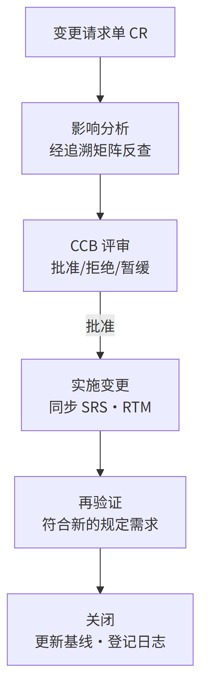

# 第4章 需求工程：标尺从哪来

> 本章概念：需求工程 / 需求开发 / 需求管理 / 规定需求 / 运行概念 ConOps / 需求管理计划 RMP
> 英文来源：requirements engineering / requirements development / requirements management / specified requirement / concept of operations / requirements management plan
> 主案例：恒信集团合同审批系统（IT侧）｜ 镜照：冰链科技冷链温控箱（产品侧）

---

## 4.1 章首 · 误解现场 {.unlisted}

恒信集团合同审批系统项目启动后的第三周，管理层开了个会。

IT 总监拍板："需求最近总是变来变去，合同评审、财务对账、法务条款，改一版崩一版。**我们要加强需求管理。** 谁负责？徐漾，你来。"

徐漾是需求分析师。他没接话，先问了三个问题：

"需求为什么会变？变之前，我们的需求**开发**做到位了吗？——需求调研做了吗？需求分析做了吗？每条需求写得可验证吗？"

会议室安静了几秒。IT 总监皱眉："这些不都是'需求管理'的一部分吗？管好需求，自然就都做了。"

如果你坐在这间会议室里，你大概也会点头。因为大多数人对"需求"的直觉，和 IT 总监一模一样：**需求乱，是因为管理没跟上；把需求管理做好，需求就稳了。**

这一章要推翻的，正是这个直觉。它错在一个词上——**"需求管理"不包含"需求开发"**。需求不是被"管"出来的，是被"开发"出来的。管理做得再严，来源没摸清、分析没做透，一样出烂需求。

这一章先把"需求工程 = 需求开发 + 需求管理"这个并列立起来，再磨清它周围的边界，最后看它怎么用——标尺就是这样立起来的。

这一章承接第3章的三基座：需求、设计与质量立在那里，需求是第一把标尺——本章回答：标尺从哪来。

---

## 本章问题 {.unlisted}

读完本章，你应该能回答：

1. 需求工程、需求开发、需求管理三者是什么关系？"需求管理包含需求开发"错在哪？
2. 需求开发的四个活动是什么？验证和确认为什么要分开？
3. 规定需求（specified requirement）为什么是验证的参照？"说了"为什么不等于"规定"？
4. 需求"总在变"时，怎么先分清是"需求变了"还是"当初没说清"？两张单子分别是什么？
5. 运行概念（ConOps）在整条链的什么位置？"先立问题域，再写条款"为什么顺序不能反？
6. 需求管理的四个活动是什么？变更控制闭环怎么走？基线为什么是分界线？
7. "另存为 v2"为什么不是版本管理？改名、留档缺了什么？
8. 骨架五份文档是哪五份？为什么任何规模项目都不可省？

---

## 开篇 · 本章枢纽（骨架先行） {.unlisted}

先把本章要钉的东西立起来——后面三幕，都是给这层骨架添血肉。

> **需求工程 = 需求开发 + 需求管理**（CMMI：需求管理 REQM 与需求开发 RD 是**并列**的过程域；IEEE 29148 同样并列）。
> 需求开发管"生"（**造血**）：把需要与期望转化为规定需求——获取、分析、规格、确认；
> 需求管理管"养"（**防腐**）：对规定需求进行基线化受控——基线、变更、追溯、状态度量。
> **开发管"生"，管理管"养"；两者并列，不是包含。**

这一章的骨架是**一个并列 + 一条链 + 三条铁律**。

一个并列：需求开发造血、需求管理防腐——先立这个枢纽，再分别看"生"与"养"。

一条链：**ConOps 在分析之后、规格之前——先立问题域，再写条款**。这是本章的方法底座时刻——第1章叫它"先立枢纽再填细节"，本书称之为"先立枢纽 vs 陷细节（LeafToHub）"。

还有三条铁律：**无 CR 不得变更；不分析不得上会；验证通过方可关闭。**

第一幕钉"需求工程是什么"（开发怎么生、管理怎么养），第二幕把它和容易混的东西分开（四条边界走廊），第三幕回答"往哪去"（先立问题域，再写条款；以及怎么检验写得好不好）。

---

## 4.2 第一幕 需求工程是什么：开发造血，管理防腐（定界）

> 这一幕把"需求工程"看清——先立"开发+管理"的并列枢纽，再分别看开发怎么"生"、管理怎么"养"，最后看它落在恒信的两张欠账单上。

### 4.2.1 一个定义，两大过程

"需求工程"这个词，比"需求管理"大，也比它准确。标准划分（CMMI：需求管理 REQM 与需求开发 RD 是**并列**的过程域；IEEE 29148 同样并列）给出的是一个总称下的两个子过程：

> **需求工程（Requirements Engineering）= 需求开发 + 需求管理**

- **需求开发（Requirements Development）**：把需要与期望**转化**为规定需求——获取、分析、规格、确认。管"生"。
- **需求管理（Requirements Management）**：对规定需求进行**基线化受控**——基线、变更、追溯、状态度量。管"养"。

一句话：**开发管"生"，管理管"养"。** 一个是创造性活动，一个是控制性活动。

为什么叫"工程"而不是"需求活动"？因为它占全了工程化的六个方面——有结构、有方法、可重复、全覆盖、受控、可验证（第2章展开过）。

需求获取讲方法、规格说明讲结构、规定需求讲可验证、管理讲受控——六方面在需求工程里各有着落（细节后文逐节展开），这正是"需求工程"配得上"工程"二字的原因。

它和方法论/手艺的分野也在这里：**可复现、可检验，换个人也能做。**

### 4.2.2 为什么是并列，不是包含

这是全书又一个"词汇病"现场（第1章 §1.7.4 词汇病的诊断在这里复发）。流行的说法是"广义的需求管理包含需求开发"——这个说法错在，它把两类本质不同的活动揉成一团：

| | 需求开发 | 需求管理 |
|---|---|---|
| 性质 | **创造性**：收集、分析、建模、写规格 | **控制性**：冻结、变更、追溯、跟踪 |
| 回答 | 需求是什么、合理吗 | 需求定了吗、变了吗、谁改的 |
| 比喻 | 造血 | 防腐 |
| 失败模式 | 来源没摸清、分析没做透 | 基线乱、变更失控 |

把开发包进管理，会模糊一个关键事实：**需求是开发出来的，不是管出来的。** 管理再严，开发没做好，一样出烂需求——章首恒信的困境，就是"只谈管理、不谈开发"的典型。

> **管理再严，来源没摸清、分析没做透，一样出烂需求。**

这两种欠账的后果也完全不同：开发欠账是"源头脏"，再好的管理只是把脏水存进干净的罐子；管理欠账是"过程乱"，再好的开发也会被无序变更慢慢腐蚀。

章首恒信"改一版崩一版"，如果只加强管理，等于给没有清源的水流修水渠——水还是脏的。**先清源（开发），再修渠（管理），顺序不能反。**

> **概念卡片 · 需求工程**（四问为纲，九格为目；格号=九格尺子）
>
> | 四问 | 格 | 内容 |
> |---|---|---|
> | **它是什么** | ① | 需求开发 + 需求管理（总称，两大子过程**并列**）——开发管"生"（创造性·造血），管理管"养"（控制性·防腐） |
> | **它不是什么** | ⑧ | ✗ "需求管理包含需求开发"——把创造性包进控制性，模糊"需求是开发出来的"（对立/辨析并入正文：需求工程 ⊃ 需求开发、需求管理；需求工程 ≠ 需求管理） |
> | **它从哪来** | ②③⑨ | 从系统工程的需求过程演化来——CMMI 把需求管理（REQM）与需求开发（RD）分列**并列**过程域（REQM 成熟度 2 级、RD 3 级），IEEE 29148 承袭"开发+管理"二分；engineering ← 拉丁 ingenium（天生的才智、巧思） |
> | **它往哪去** | ④⑤ | 它回答"需求从哪里来、定了之后怎么管"；在需求全生命周期用——先开发（生）后管理（养），接口咬合在"批准 → 基线"处；误区 ✗ "加强需求管理=往流程上加东西"（先问源头清了吗）✗ "需求工程=写需求文档"（文档是载体，开发+管理才是活动） |
> | **判据** | 三问 | 能说清"生/养"分工吗？两者并列而非包含吗？——需求是开发出来的，不是管出来的 |

### 4.2.3 术语不混用

需求工程文档里，四个词必须钉死（这是第1章"四问为纲、九格为目"尺子的直接应用）：

| 英文 | 中文 | 定义 |
|---|---|---|
| requirement | 需求 | 明示的、通常隐含的或必须履行的需要或期望 |
| need | 需要 | 硬性诉求，缺了会痛 |
| expectation | 期望 | 软性诉求，缺了会失望 |
| specified requirement | **规定需求** | 被明示的、成文的需求——**验证的参照** |

"规定需求"这一条是全章枢纽，第二幕第一条走廊会把它磨开。

为什么值得为三个词较真？因为混用它们的代价，是需求工程里最贵的一种模糊：把"期望"当"需求"，会造出过度设计（第3章：出了需求区间，质量不升反降）；把"需要"漏成"期望"，会漏掉命根子需求。

恒信的"重要合同要审批"——"重要"是期望还是需求？不澄清，就永远是悬案。

### 4.2.4 需求开发：造血

需求开发把"模糊的诉求"变成"可靠的依据"，走四个活动——CMMI 单列需求开发（RD）一个过程域，正因为把模糊诉求变成可靠依据，是一组跟"管住已定需求"性质相反的创造性活动。

```
需求获取（Elicitation）→ 需求分析（Analysis）→ 需求规格说明（Specification）→ 需求确认（Validation）
  收集需要与期望            澄清/分解/排序/协商冲突      写成可验证条文            对照预期用途确认
```

| 活动 | 做什么 | 典型输出 |
|------|--------|---------|
| 获取 | 访谈、调研、竞品分析，收集需要与期望 | 干系人登记册、访谈记录 |
| 分析 | 澄清、分解、排序、协商冲突 | 需求池、优先级排序表、业务规则清单 |
| 规格说明 | 把分析结果写成可验证条文 | SRS、术语表、追溯矩阵初版 |
| 确认 | 对照预期用途，确认是不是用户要的 | 验证确认记录 |

> 注：活动4 沿用 IEEE 29148 四活动命名，称"需求确认（Validation）"——对照预期用途，确认是不是用户要的；验证与确认这对词的完整展开见 §4.3.2。

四活动不是一次跑完就完——它们是一个**循环**，分析中发现缺信息就回获取，规格中发现问题就回分析。

为什么是循环而不是直线？因为"模糊的诉求"不会一次被看清——访谈时对方说"重要合同要审批"，分析时发现"重要"没定义，回获取再问"多重要算重要"，得到"金额 ≥ 500 万或三年期以上"，才进入规格。

**需求开发的每一步都可能推翻前一步的假设**——循环不是低效，是正视"需求天然是渐进的"这个事实。

**获取与分析：来源与澄清。** 获取是需求的"第一手证据"。恒信的合同审批系统，获取的对象是三个部门的人：法务（条款、合规）、财务（金额、账期、对账）、业务（审批流、时效）。

获取做没做到位的判据只有一个：**每条需求有没有来源**——"无来源需求不得入需求池"。

分析是需求的"第一道加工"，四件具体的事：

1. **澄清**：把"重要合同要审批"问成"金额 ≥ 500 万或涉及三年期以上的合同须审批"；
2. **需求分解**：把父需求拆成子需求（这是第6章"分解"在需求侧的同构动作——注意与设计侧"分解"区分）；
3. **排序**：MoSCoW / Kano，决定先做什么、做什么（第3章"与相关方剪裁需求"在这里落地）；
4. **协商冲突**：三个部门的"合同状态"口径不一致，在这里拍平，而不是等集成时炸。

优先级排序值得单独说一句：MoSCoW（必须/应该/可以/不要）和 Kano（基本/期望/兴奋）不是两张玩具表，它们直接决定第3章"与相关方剪裁需求"怎么落地——需求不够时，砍哪条、保哪条，靠的就是排序结果。

恒信的"合同数据留档十年"（公司法强制）在 MoSCoW 里是 Must，在 Kano 里是基本型——两个框架指向同一个结论：**它不在被砍的清单里。**

**需求缺陷的成本：为什么值得投入。** 一个常被引用的数据：**同一缺陷在需求阶段修复成本为 1，发布后修复为 30~70 倍。**

需求阶段写错一个字，可能意味着设计、开发、测试全部返工。需求工程的每一分投入，都在给下游省十倍百倍的返工钱——这也是"需求质量六性"和"规定需求可验证"这些纪律存在的经济理由。

### 4.2.5 规格与规定需求：SRS 六章

**规格说明**把分析结果写成可验证的条文——核心交付物是需求规格说明书（SRS），骨架六章：

```
引言（目的·范围·读者）→ 总体描述（产品视角·环境·约束）
→ 功能需求（逐条 REQ-xxx）→ 非功能需求（性能·安全·可用性）
→ 外部接口（用户·硬件·软件·通信）→ 验证方法（每条需求的验收标准）
```

六章各有职责：引言把读者领进来（这份文档给谁看、覆盖什么）；总体描述给出产品视角（系统是什么、在什么环境、受什么约束）；功能需求逐条编号（REQ-xxx，无歧义可验证）；非功能需求写性能/安全/可用性；外部接口定义与外部世界的边界。

验证方法给每条需求配验收标准——**最后这一章最容易被砍，但它正是"规定需求可验证"的落点**：没有验收标准，需求就退化成愿望。

> 承接 §3.3.1：那章说"特性开始被规定，才是设计开发（8.3）"——指把需求落到具体客体结构上的特性（设计输出）；本章的 SRS 是需求侧把需要写成可验证条文（规定需求），特性仍停留在需求级。两道闸门不是同一道：SRS 是需求开发与设计开发的边界文档——写完之后，才谈得上"把需求落到客体特性"的设计开发。

这里的枢纽概念，就是前面埋下的**规定需求**：

> **规定需求（specified requirement）**：被明示的、以成文信息记录的需求（ISO 9000:2015 §3.6.4 注 2）。它是**验证的参照**——没有它，验证（verification）无从谈起。

> **概念卡片 · 规定需求**（四问为纲，九格为目；格号=九格尺子）
>
> | 四问 | 格 | 内容 |
> |---|---|---|
> | **它是什么** | ① | 被明示的、以成文信息记录的需求（ISO 9000:2015 §3.6.4 注 2）；验证的参照——没有它，验证（verification）无从谈起 |
> | **它不是什么** | ⑥⑦ | 对立：口头明示——说了不等于规定（"页面要快一点"无法验证）；辨析：明示 ⊃ 规定——所有规定需求都明示过，但口头明示不等于规定（成文+具体+可验证） |
> | **它从哪来** | ②③⑨ | ISO 9000 把需求按"明示的、通常隐含的、必须履行的"三态并立，其中"明示并成文"的一条被单列——因为验证需要一个能对账的稳定参照，口头表述对不了账；specified ← 拉丁 specificare（明确指明） |
> | **它往哪去** | ④⑤ | 它回答"怎么验证需求写对了"；在需求规格、评审、验证、测试设计时用；失效边界——还在探讨、没跟相关方确认的诉求先别规定（规定早了，把还没定下来的东西写死） |
> | **判据** | 三问 | 一条需求可验证吗？能设计测试证明 → 是规定需求；只能"感觉" → 还不是 |

### 4.2.6 需求管理：防腐

需求开发把需求"生"出来了，之后归需求管理"养"——这个词在标准里出现得更早：CMMI 把需求管理（REQM）列为成熟度 2 级过程域，比需求开发（RD，3 级）先被要求，"管住已批准的需求"是源头质量的地基。

```
基线管理（Baseline）→ 变更控制（Change Control）→ 可追溯性（Traceability）→ 状态·度量（Status·Metrics）
```

| 活动 | 解决什么问题 | 典型产出 |
|---|---|---|
| 基线管理 | 需求"定了吗" | 需求基线、基线登记表 |
| 变更控制 | 需求"变了吗、谁改的" | 变更请求单 CR、CCB 评审记录 |
| 可追溯性 | 需求"从哪来、到哪去" | 追溯矩阵 RTM |
| 状态·度量 | 需求"整体什么状态" | 需求状态报告、度量报告 |

四个活动不是均分的：**变更控制是核心战场**（大多数团队的需求管理问题都出在这里），基线是它的前提，追溯是它的地图，状态度量是它的仪表盘。

四者合起来回答需求管理的完整问题——"定了吗、变了吗、影响谁、整体什么状态"。

**变更控制闭环：需求管理的核心战场。** 需求管理最容易失控的地方，是变更。一个标准的闭环：

```
变更请求单 CR → 影响分析（经追溯矩阵反查）→ CCB 评审（批准/拒绝/暂缓）
→ 实施变更（同步 SRS·RTM）→ 再验证（符合新的规定需求）→ 关闭（更新基线·登记日志）
```

三条铁律：

> **无 CR 不得变更；不分析不得上会；验证通过方可关闭。**
>
> 术语注：三条铁律是本书对变更控制纪律的操作化凝练（源出 CMMI 配置管理 / IEEE 29148 的变更管理要求，非标准原文照录）——可当场检验。

把闭环画成图，一眼看清：





每个节点都是一个"必须可判定"的关卡：CR 有没有立案、影响分析有没有做、CCB 有没有结论、验证有没有通过——任何一个答不上来，变更就在流程外流窜。

变更还要分级：微小（需求负责人批）/ 一般（PM 批）/ 重大（CCB 全体评审）。

时限上有组织级约定（如 SRS 完成后 5 个工作日内评审、影响分析 3 个工作日、CCB 5 个工作日内决策、紧急变更 24 小时内追认）；度量上有预警阈值（变更率 ≥15%、稳定性 ≤80%、追溯覆盖率 <100%、变更平均周期 ≥10 天，触发即启动根因分析）。

这些数字是组织级示例，重点是：**变更控制的每一步都要可判定**——"以什么标准"必须写死，否则流程就是摆设。

一个走完闭环的例子：恒信法务提出"电子签章的合同也走审批流"——这是一条 CR。影响分析经 RTM 反查，发现影响审批状态机、签章模块、归档模块共 3 处；CCB 评审通过；实施后同步 SRS、RTM，再验证"电子签章合同审批通过后进入归档"；关闭，更新基线。

整个过程有 6 份记录——**任何一环断了，这条变更就成了"查无实据"的暗改。**

**基线是分界线。** 基线是分界线——线左是需求开发的产物（还在流动），线右进入需求管理（一切改动走变更控制）。

> **基线 = 被批准冻结、作为全生命周期参照的配置信息。**
>
> 术语注：此定义是本书对基线概念的操作化凝练（配置管理的通用概念，第13章展开全貌）。

第13章（配置管理）会把这个概念讲透。这里只需要记住它在需求链上的作用：基线是"变更的出发原点"——从基线出发，一切变更都可描述；离开基线，一切变化都不可言说。

基线和追溯是需求管理的一体两面：基线给"变"一个参照原点，追溯给"变"一张影响地图。没有基线，追溯无从谈起（没有"从哪变起"）；没有追溯，基线一建立就失效（不知道改了什么、波及谁）。恒信先建基线、再建 RTM——顺序对了。

**需求管理计划（RMP）。** 程序文件（组织级"怎么管需求"的通用要求）与 RMP（项目级执行计划）是两个层级。每个项目启动时，按程序文件编制 RMP。

六模块，各自回答一个问题：

| 模块 | 回答的问题 |
|---|---|
| 目的范围 | 这份计划管什么 |
| 角色职责 | 谁是 CCB、谁批微小变更 |
| 需求组织规则 | 需求怎么编号、怎么入池 |
| 基线策略 | 什么时候建基线、什么算重大变更 |
| 变更控制流程 | CR 怎么走、时限多久 |
| 追溯与度量安排 | RTM 怎么建、什么指标预警 |

**RMP 是程序文件的项目版——把"组织怎么管需求"翻译成"这个项目怎么管需求"。**

需求管理的正式产出，以"台账/凭证"为命根子——审计、扯皮、追责全靠它们：

| 活动 | 文档 |
|---|---|
| 计划 | 需求管理计划 RMP |
| 基线 | 需求基线 · 基线登记表 |
| 变更 | 变更请求单 CR · 影响分析报告 · CCB 评审记录 · 变更验证记录 |
| 追溯 | 覆盖分析记录 · 追溯矩阵 RTM |
| 状态度量 | 需求状态报告 · 变更日志 · 需求度量报告 |

其中 CR、CCB 记录、变更日志是"命根子"——它们是"改了没有、谁批的、为什么改"的唯一凭证。**变更日志只追加不修改**，审计时调取。需求管理域最忌"口头的变更"——第3章讲过，口头改需求是最危险的变更形式；落到文档层面，就是"没有凭证的变更"。

需求开发与需求管理的接口，咬合在"批准 → 基线"处：需求开发的最后一步是需求批准记录（验证通过、相关方确认），批准之后建立需求基线，进入需求管理的领地。

**这个接口是整条需求工程的铰链**——批准前需求还可以流动（开发负责），批准后一切变更走 CR（管理负责）。铰链不咬合，开发和管理各管一段，需求就会在中间断层。

## 案例进展①｜徐漾的"需求管理"升级会议 {.unlisted}

会议结束后，徐漾把"加强需求管理"的指令翻译成了两件事。

第一件，他去翻了恒信最近三个月的需求变更记录——发现一大半"变更"根本不是需求变了，而是**当初就没说清楚**：合同评审的触发条件是"重要合同"要审批，但"重要"从没定义过；财务要的"对账报表"从没说清统计口径。这些是**需求开发的欠账**，不是需求管理的漏洞。

第二件，他列了两张单子：一张是"开发欠账"（没调研、没分析、没写可验证的规格），一张是"管理欠账"（没基线、没变更流程、没追溯）。他跟万辉说："你要的'加强需求管理'，其实一半是'补需求开发的课'。管理管的是已经说清楚的需求；没说清楚的需求，管理管不了，只能开发。"

**这两张单子，就是这一章的地图：第二幕磨它们的边界，第三幕看怎么用起来。**

这两张单子后来成了恒信需求工作的起点：开发欠账，徐漾用两周补了需求调研和需求池；管理欠账，他建立了第一版基线。两周后万辉说"需求好像稳了一点"——徐漾心里清楚：不是需求变了，是**欠账开始还了**。

## 案例进展②｜合同的"隐需求" {.unlisted}

恒信做合同审批系统需求调研时，徐漾访谈法务、财务、业务各三场。每次他最后都问一句："还有别的吗？"——得到的都是"没有了"。

直到财务随口说了一句："对了，我们月底要对账，合同如果 25 号之后才签，能不能算到下个月？"

徐漾记下了。这句话暴露了一条**隐含需求**：合同审批的"统计归属月份"规则。没人把它写进任何需求文档——它"通常隐含"，是行业惯例默认。但如果漏了，月底对账会错，财务会觉得"这系统根本不能用"。

需求开发里，**隐含需求不会自己开口**。它需要主动去挖：访谈里的随口一句、业务流程里的惯例、前代产品的教训。

挖出来的隐含需求，要显性化、写进规格、变成规定需求——否则验证够不着它（验证对照规定需求），只有确认（真实场景）兜得住它。这是第8章的核心，这里先埋种子。

**开发造血到底造什么血？不是抄需求，是把不开口的、没成文的、说不清的，都挖出来、写下来、确认对。**

---

## 4.3 第二幕 需求工程不是什么：四条边界走廊（磨边界）

> 这一幕把"需求工程"和它容易混的东西分开——判据主义在这里登场：概念靠正例活、靠反例定型。四条走廊，一条条走过去，每一条都是把"不是什么"钉成一句可检验的判据。

### 4.3.1 走廊一：需求 ≠ 规定需求（说了不等于规定）

"页面要快一点""系统要好用""审批要严谨"——这些话，客户说了，领导也说了，它们算需求吗？

**算，但只算一半。** 它们是明示的需求，却还不是**规定需求**——没成文、没具体、不可验证。验证（verification）需要一个能对账的靶子，口头表述对不了账："快一点"是几秒？"好用"怎么证明？

**说了不等于规定：规定需求 = 成文 + 具体 + 可验证**（§4.2.5 那张卡）。

这条走廊的判据问句：**一条需求，能设计测试证明吗？能，才是规定需求；只能"感觉"，还不是。**

这也呼应了 §4.2.3 那句"恒信的'重要合同要审批'永远是悬案"——"重要"是期望还是需求？不把它规定成"金额 ≥ 500 万或三年期以上"，它就永远停留在"说了"那一层。

### 4.3.2 走廊二：验证 ≠ 确认（写对了吗 vs 是要的吗）

需求开发里最容易混的一对词——验证（verification）对照规定需求，确认（validation）对照预期用途：

| | 验证 verification | 确认 validation |
|---|---|---|
| 对照 | **规定需求** | **预期用途** |
| 问的问题 | "表述对不对" | "是不是用户要的" |
| 输出 | 验证记录 | 验证确认记录 |

验证回答"我们把需求写对了吗"，确认回答"我们写的是用户要的吗"。两者必须分开，因为**把需求写得很正确、但完全不是用户要的东西，是需求开发最常见的失败**——这一条的根源，是隐含需求（第一幕案例进展②展开，第8章全展开）。

把 §4.2.5 立的规定需求串起来看：规定需求是验证的参照，验证回答"表述对不对"；但"对不对"不等于"是不是用户要的"——那是确认的事。所以一条合格的需求，要过两道关：先验证（写得对吗），再确认（是要的吗）。

**只验证不确认，需求可能写得很漂亮、但根本没人要；只确认不验证，需求可能是用户要的、但没法执行。** 两道关，缺一不可。

落在恒信上的一个反例：你把"合同审批在 5 分钟内完成"写得无可挑剔，但用户真正要的是"法务在移动端先审"——**写得对，不等于写的是要的**。

案例进展②那条"25 号之后签的合同算下个月"，就是这条走廊的活标本：隐含需求没显性化，验证（对照规定需求）照不到它——规定需求里根本没这一条；只有确认（真实场景）兜得住它。

**隐含需求，是"必须分开验证与确认"最深的原因。**

判据问句：**一条需求，能对照规定需求说清"表述对不对"，又能对照预期用途说清"是不是用户要的"吗？** 只说清前者、说不清后者，就是只验证不确认——写得再漂亮，也可能没人要。

### 4.3.3 走廊三：需求变了 ≠ 当初没说清（欠账二分）

案例进展①里徐漾翻了三个月变更记录，发现一大半"变更"根本不是"需求变了"，而是**当初就没说清楚**——"重要合同"的"重要"从没定义过、"对账报表"的统计口径从没说清。

这条走廊钉死的是一条诊断判据：**当需求"总在变"，先别急着上管理手段——先分清它是哪个病。**

| 病 | 症状 | 药 |
|---|---|---|
| **开发欠账**（源头脏） | 没调研、没分析、没写可验证规格 | 补开发：调研、分析、写规格 |
| **管理欠账**（过程乱） | 没基线、变更失控、查无实据 | 补管理：基线、变更流程、追溯 |

开发欠账是"源头脏"，再好的管理只是把脏水存进干净的罐子；管理欠账是"过程乱"，再好的开发也会被无序变更腐蚀（§4.2.2 那对比喻）。**先清源（开发），再修渠（管理），顺序不能反。**

判据问句：**最近这次需求混乱，是"当初没说清"（开发欠账）还是"定了之后没人管"（管理欠账）？** 答错了病，药就开错了——这正是章首 IT 总监的错误处方。

### 4.3.4 走廊四：改名留档 ≠ 版本管理（"另存为 v2"）

这是全章最后一条走廊，也是最容易被当"小事"放过去的一条——需求管理里最"像"版本管理的动作，是给文件改名。

**改名、留档，不等于版本管理。** 版本管理要有三样：**基线**（批准的参照）、**变更控制**（怎么变、谁批）、**追溯**（从哪变起、波及谁）。

"另存为 v2"只做到了"留档"——留下了每一版的快照，却没回答三件事：哪一版是权威基线？这次改为什么、谁批的？这条需求从哪来、影响谁？

没有基线，**每一次变更都说不清"从什么变到什么"**。这是全书"另存为 v2"的首次出场——第13章 合同版本 final_2.zip 是它的回声，同一个病，换了文件后缀。

判据问句：**这次"版本管理"，能回答"哪一版是基线、这次为什么改、从什么变到什么"吗？答不上来，就只是改名。**

## 案例进展③｜"另存为 v2"的合同需求 {.unlisted}

恒信的合同审批需求，改了六版。前四版靠什么管版本？——靠文件名："合同需求 v2.doc""合同需求 最终版 v3.doc""合同需求 真最终版 v4.doc"。

后果是：需求池里同一合同的需求散落六个文件，追溯矩阵没法建，验证没有参照。小白是开发，她接口写到一半，对着六个文件名发愁："照着哪个版本写？"

玉杰是运维，他把发布记录也摊到桌上："文件名记不下谁批的、为什么改。我们发布认的是可复现——哪个包配哪套环境参数，能复现出当时的运行形态，才算数。你们这六个文件，连哪一版是基线都对不上。"

万辉终于承认："我们不是需求变太多，是根本没建基线。"

徐漾补了第一版需求基线，之后每个变更走 CR 流程。六周后，变更失控率降了七成——**不是需求变少了，是每次变更都留下了痕迹。**

---

## 4.4 第三幕 需求工程往哪去：先问题域，再条款（运用）

> 这一幕把"需求工程"用起来——先立问题域（ConOps），再写条款（SRS），最后看怎么检验写得好不好（质量六性）与哪些文档不可省（骨架五份）。

### 4.4.1 为什么需要 ConOps：条款需要上下文

SRS 回答"系统必须做什么"，但在这之前，还有一个更根本的问题：**系统怎么被用？** 法务怎么审合同、财务怎么对账、业务怎么发起审批——这些"怎么被用"的叙事，是 SRS 的上下文。

没有它，SRS 的每一条都像悬空条款——你知道要做什么，但不知道为什么、为谁、在什么场景下。

运行概念（Concept of Operations, ConOps）就是回答"系统怎么被用"的那份文档（IEEE 1362 定义其结构）——需求工程里**唯一一份"叙事性"的正式输出**。

### 4.4.2 ConOps 的位置：分析之后、规格之前

这是需求开发里最重要的位置判断之一。ConOps 不在流程最前，也不在最后，而是：

```
业务目标 → 需求获取/分析 → 运行概念 ConOps（系统怎么被用）→ SRS（系统必须做什么）→ 设计·测试
```

为什么在"分析之后、规格之前"？因为 ConOps 的完整定稿（运行场景、异常、应急、角色）**必须建立在已经摸清需要的基础上**——先获取分析，再综合成运行概念，最后翻译成 SRS 条文。

跳过 ConOps 直接写 SRS，等于从"问题域"直接跳到"解空间"，中间的桥没了。

> **ConOps 讲"故事"，SRS 讲"条款"——先讲清楚系统怎么被用，才谈得上系统必须做什么。**

这正是本章的方法底座时刻：**先立问题域（ConOps），再写条款（SRS）**——第1章叫它"先立枢纽再填细节"。

ConOps 是问题域的枢纽骨架，SRS 条款是挂上去的细节；先扎进条款、不立骨架，条款越多越悬空。开篇立的"需求工程=开发+管理"是第一个枢纽，ConOps 是第二个——**先立枢纽，再填细节，是这一章从头到尾反复出现的那只手。**

### 4.4.3 ConOps 六部分（IEEE 1362）

| 部分 | 内容 |
|---|---|
| 引言 | 目的、范围、读者 |
| 系统概述 | 系统的使命与地位 |
| 运行环境 | 部署环境、外部接口 |
| 运行场景 | 正常·异常·应急（核心） |
| 干系人与角色 | 谁用什么、谁管什么 |
| 运行支持 | 部署、培训、维护、升级 |

六部分里，**运行场景**是核心——它要写正常、异常、应急三种：正常（一份合同走完审批全流程）、异常（法务驳回、财务校验不过、审批人离职）、应急（系统宕机时的线下替代流程）。

写 ConOps 有个实用诀窍：**让一个不熟悉系统的人读完，能画出审批流程图**——画得出来，ConOps 合格；画不出来，故事没讲清楚。

ConOps 的失效边界：它服务的是"怎么被用"的复杂度——运行方式一眼看透的小系统（单机、单场景）可以省掉；场景越复杂、角色越多，越不能省。

> **概念卡片 · 运行概念 ConOps**（四问为纲，九格为目；格号=九格尺子）
>
> | 四问 | 格 | 内容 |
> |---|---|---|
> | **它是什么** | ① | 需求工程里**唯一一份"叙事性"的正式输出**——回答"系统怎么被用"（法务怎么审、财务怎么对账、业务怎么发起），IEEE 1362 定义其结构 |
> | **它不是什么** | ⑥⑦ | 对立：SRS——ConOps 讲"故事"（怎么被用），SRS 讲"条款"（必须做什么）；辨析：不是运营手册（不含运维操作细节）、不是需求清单（是运行叙事）、不是系统设计（不落入解空间） |
> | **它从哪来** | ②③⑨ | 系统工程早期发现：只写"系统必须做什么"，相关方对"系统将怎么被用"各想各的——于是把"运行方式"单独立成一份文档；Concept of Operations（运行概念）→ IEEE 1362 定义其结构 → 需求工程标准收编，缩写 ConOps |
> | **它往哪去** | ④⑤ | 它回答"SRS 的上下文是什么"；在分析之后、规格之前用——先讲清怎么被用，才谈得上必须做什么；失效边界：运行方式一眼看透的小系统（单机、单场景）可省，场景越复杂、角色越多越不能省 |
> | **判据** | 三问 | 让一个不熟悉系统的人读完，能画出审批流程图吗？画得出来 → 合格；画不出来 → 故事没讲清楚 |

### 4.4.4 需求质量六性

一条需求工程意义上合格的需求，须同时满足六个性质（SRS 编写与评审的准绳）：

> **完整**（该有的都有，含隐含需求）· **一致**（互不打架）· **无歧义**（只能有一种理解）· **可验证**（能设计测试证明）· **可追溯**（知道从哪来、到哪去）· **有优先级**（知道先做哪个）
>
> 术语注：六性不是任何标准的固定清单——它从 ISO/IEC/IEEE 29148 的需求特征（完整/一致/无歧义/可验证/可追溯/必要/可行/可修改等）中选取六项凝练而成，是本书对"SRS 写得好不好"的判据。

> 与 §3.3.1 的起点判据四闸门（完整/无歧义/不冲突/隐含需求已识别）的关系：那是六性在"设计输入"场景的收缩——不冲突≈一致、隐含⊂完整，六性另补可验证/可追溯/有优先级。四闸门管"能不能进入设计开发"，六性管"SRS 写得好不好"。

六性不是六个并列的形容词，它们互相支撑：无歧义是可验证的前提，可验证是规定需求的门槛，可追溯是变更影响分析的地图，有优先级是"与相关方剪裁需求"（第3章）的操作基础。

**六性里最常被牺牲的，往往是"可追溯"**——因为它不立刻显形，直到需求变更时才发现"这条需求当初为什么加、影响谁"全答不上来。

落地表现：SRS 中禁止"快速/大约/友好"等不可验证表述——这正是"无歧义 + 可验证"的检查项。恒信的"重要合同要审批"为什么烂？因为它违反"无歧义"（"重要"有两种以上理解）和"可验证"（没法设计测试证明）。

### 4.4.5 骨架五份与文档体系

需求工程文档体系可以有十几份（获取的、分析的、规格的、验证的、管理的），但任何规模项目，**骨架五份不可省**：

```
SRS（需求规格说明书）· 需求池 · RTM（追溯矩阵）· 评审报告 · 基线
```

- **SRS**：规定需求的载体；
- **需求池**：需求统一入口，无来源需求不得入池；
- **RTM**：追溯矩阵——变更影响分析的"地图"、测试覆盖的"账本"、合规审计的"证据"；
- **评审报告**：验证的凭证；
- **基线**：变更的参照。

RTM 的终极检验：**任取一条需求，能不能双向走通——往上游知道它从哪来，往下游知道它影响谁？** 走不通，RTM 就是一张漂亮的表格，不是追溯。

恒信补了 RTM 之后，一次"合同金额校验规则"变更，五分钟内定位了受影响的 17 条需求、3 个模块——没有 RTM，这要翻遍六个版本文件找两天。五份缺一份，需求工程链就有断点。

完整体系按"素材→分析→正式交付→验证交接"四类组织：

| 类 | 文档 | 用途 |
|---|---|---|
| 素材类 | 干系人登记册 · 访谈调研记录 · 竞品分析 · 用户故事 | 需要与期望的第一手证据 |
| 分析类 | 需求池 · 优先级排序表 · 业务规则清单 · 原型 · 可行性分析 | 需求怎么定 |
| 正式交付 | SRS · 术语表 · 追溯矩阵 RTM | 需求是什么 |
| 验证交接 | 需求评审报告 · 验证确认记录 · 需求批准记录 | 对不对、交出去 |

素材类文档即使不写成正式文档，也要留原始记录——**它们是追溯链的最底层**。

也许有人问：文档体系是不是太重了？判据很简单——**没有文档的环节，就是不可追溯的环节**。裁掉文档不是省事，是把追溯链砍断——而追溯链断了，需求变更时你就只能靠记忆和运气。

文档可以统一编号（如 QR-01~23）。

开发域 QR-01~12（干系人登记册、访谈记录、需求池、优先级、业务规则、ConOps、SRS、术语表、RTM、评审报告、验证确认记录、批准记录）+ 支撑 QRS-01~04（竞品分析、用户故事、原型、可行性）。

管理域 QR-13~23（RMP、基线、基线登记表、CR、影响分析、CCB 记录、变更验证记录、覆盖分析、状态报告、变更日志、度量报告）。

编号让"哪个文档属于哪个活动"一目了然，也方便追溯链的引用。**编号不是目的，可引用才是**——需求管理里"这条需求在哪个文档、哪一条"要能指到具体位置，否则追溯就是空谈。

用恒信走一遍 SRS 六章：引言（这份 SRS 覆盖合同审批系统 1.0 的功能与非功能需求）；总体描述（系统替代线下纸质审批，部署于内网，用户为法务/财务/业务三方）；功能需求 REQ-001~REQ-187（发起、初审、校验、终审、签章、归档）——功能需求 187 条，连非功能与接口需求共约三百条。

非功能需求（月末高峰 500 并发、合同数据留档十年、操作日志不可篡改）；外部接口（与 OA、电子签章平台、财务系统的接口契约）；验证方法（每条需求的验收标准，如"审批通过后 5 分钟内通知相关方"）。**六章写完，一个不熟悉项目的人能独立判断"这份规格全不全"。**

## 案例进展④｜恒信没人写的 ConOps {.unlisted}

恒信的第一版 SRS 写得飞快——三个月，三百条需求。但评审会上，法务负责人翻了两页就问："你们写'合同审批通过后自动通知相关方'——哪个相关方？审批链上有几个人？通知不到会怎样？"

没人答得上。因为**没人写过 ConOps**——"法务、财务、业务三方怎么用这套系统审批一份合同"这个叙事，从没被写成过文档。三百条 SRS 条款悬在半空，每一条都缺上下文。

徐漾花了三周补 ConOps：把"一份 200 万的采购合同从发起、法务初审、财务校验、业务终审、签章、归档"的完整过程写成了故事，标注每个环节的角色、异常（法务驳回怎么办、财务校验不过怎么办）、应急（审批人离职怎么办）。

审批链的细节，业务方的黄程陪着徐漾一段段对——谁发起、谁初审、谁终审，哪一环会卡在谁手里。对到一半他提醒："审批人要是离职了，谁接得上？"——应急这一栏，就是他这一句问出来的。

写完，三百条 SRS 里有一半需要改写——因为**先写条款后补故事，顺序反了**。

**需求规格的问题，往往要到 ConOps 里才看得出来。**

这正是第1章"先立枢纽再填细节"的反面——**陷细节而不立枢纽**（LeafToHub）：ConOps 是枢纽骨架、SRS 条款是挂上去的细节，这句 §4.4.2 已经立过，这里不再重复——这一章从开篇就立这个枢纽，到这里，它用恒信三百条条款把它演了一遍。

镜照一眼冰链：M3 温控箱的 ConOps 是"疫苗从出库到接种全程温度不断链"——运行场景里写着"疫苗运输车在高速上抛锚 2 小时"这种应急，直接决定了"断电保温时长"这条硬需求（第3章讲过）。**ConOps 写不出来的场景，就是将来要出事故的场景。**

冰链的镜照另一面在需求管理：文正评审会上随口一句"精度差不多就行"——没有 CR、没有记录，一句口头变更把验证的靶子当场偷换（第3章讲过，口头改需求是最危险的变更形式）。ConOps 没写、口头变更没管，冰链欠的账和恒信是同一枚硬币的两面。

---

## 本章概念总图 {.unlisted}

```
需求工程 = 需求开发（生·造血）+ 需求管理（养·防腐）—— 并列，不是包含
需求开发：获取 → 分析 → 规格（SRS·规定需求）→ 需求确认（Validation）——循环
需求管理：基线 → 变更控制（CR→影响分析→CCB→实施变更→再验证→关闭）→ 追溯 → 状态度量；无 CR 不得变更
ConOps：分析之后、规格之前 —— 先立问题域，再写条款（LeafToHub：先立枢纽 vs 陷细节）
规定需求 = 验证的参照；验证对照规定需求，确认对照预期用途
需求质量六性 = 完整·一致·无歧义·可验证·可追溯·有优先级
骨架五份：SRS · 需求池 · RTM · 评审报告 · 基线
四条边界走廊：需求≠规定需求 / 验证≠确认 / 需求变了≠当初没说清 / 改名留档≠版本管理
```

## 章末 · 认知反转 {.unlisted}

回到章首那场会。IT 总监说"我们要加强需求管理"——现在我们知道，他说错了一半。

需求工程 = 需求开发 + 需求管理，**并列**，不是包含。恒信的需求乱，一大半是**需求开发的欠账**：没调研（来源不清）、没分析（"重要合同"没澄清）、没写可验证规格（300 条悬空条款）。

这些欠账，管理管不了——**管理管的是已经说清楚的需求；没说清楚的需求，只能开发。**

而徐漾补的三样东西，分别补在了正确的位置上：ConOps 补"问题域的桥"（先立问题域，再写条款），需求基线补"变更的参照"（改名留档不等于版本管理），CR 流程补"变更的痕迹"（无 CR 不得变更）。三件事，把两类欠账补到位。

这一章的反转是：**"需求管理"这四个字被用得太多，以至于人们忘了它不包含"需求开发"。** 需求是开发出来的，不是管出来的——这句话值得贴在每个团队的白板上。

> **开发的活是"造血"，管理的活是"防腐"；管理再严，来源没摸清、分析没做透，一样出烂需求。**

还有一层更深的反转：恒信以为"加强需求管理"是往流程上加东西，结果发现一半是要**补开发的课**。这提示一个普遍规律——**当一个团队说"要管起来"的时候，先问一句：源头清了吗？** 管理的价值永远建立在开发的质量之上；这是需求工程里最容易被倒置的一对关系。

用第1章的话收一次束：这一章从头到尾演示的是同一只手——**先立枢纽，再填细节**。开篇立"需求工程=开发+管理"的并列枢纽，ConOps 立"问题域"的枢纽，四条走廊一条条磨边——都在对"陷细节而不立枢纽"（LeafToHub）说不。

对"需求工程"这个词，你原来只是"见过"——背得出"需求工程=开发+管理"；这一章把它推到"拥有"——能答全四问：它是什么（并列）、不是什么（四条走廊）、从哪来（CMMI/IEEE 二分）、往哪去（先问题域再条款）。**能答全四问才算拥有，这把尺子现在装进你手里了。**

## 本章判据 {.unlisted}

> 本章判据一部分有标准出处（CMMI / IEEE 29148 / ISO 9000），可直接对账；另一部分是本书的凝练（欠账二分、变更三铁律、改名留档、骨架五份）——同样当场可检验：欢迎检验、欢迎校准。

1. **需求工程 = 需求开发 + 需求管理**（并列）——开发管"生"（创造·造血），管理管"养"（控制·防腐）；需求是开发出来的，不是管出来的。**违反即崩：只谈管理、不补开发——恒信"改一版崩一版"，水渠修得再平，水还是脏的。**
2. **规定需求 = 验证的参照**——被明示的、成文的需求；不能设计测试证明的，还不是规定需求（说了 ≠ 规定）。**违反即崩：把"页面要快一点"当规定需求写进 SRS，验证没有可对照的靶子，只能靠感觉。**
3. **验证对照规定需求，确认对照预期用途**——"写对了吗" vs "是要的吗"，必须分开；两道关缺一不可。**违反即崩：只验证不确认——"合同审批 5 分钟完成"写得无可挑剔，用户真要的却是移动端先审，上线没人用。**
4. **欠账二分**——需求"总在变"时，先分清是"需求变了"（管理漏洞）还是"当初没说清"（开发欠账）；先清源（开发）再修渠（管理），顺序不能反。**违反即崩：把"当初没说清"当成"需求变了"去加强管理——章首 IT 总监就开错了药，药不对病。**
5. **ConOps 在分析之后、规格之前**——先讲清系统怎么被用（问题域），才谈得上必须做什么（解空间条款）。**违反即崩：跳过 ConOps 直接写 SRS——恒信三百条条款悬空，评审会上一问三不知。**
6. **无 CR 不得变更，不分析不得上会，验证通过方可关闭**——变更控制三铁律。**违反即崩：无 CR 变更、不分析上会、未验证就关闭——变更在流程外流窜，出事"查无实据"。**
7. **改名留档 ≠ 版本管理**——版本管理要有基线、变更控制、追溯；没有基线，变更就不可言说。**违反即崩：只改名留档、不立基线——恒信六个版本文件，连哪一版是基线都对不上。**
8. **骨架五份不可省**：SRS、需求池、RTM、评审报告、基线。**违反即崩：砍掉 RTM，一次变更翻遍六个文件找两天；砍掉基线，"从什么变到什么"说不清。**

## 自查 · 这些说法对吗？ {.unlisted}

1. "需求管理包含需求开发，管好需求自然就开发好了。"——**错**。并列不是包含；开发是创造、管理是控制；需求是开发出来的，不是管出来的。
2. "客户说了'页面要快一点'，这就是需求。"——**对了一半**。这是明示的需求，但还不是**规定需求**——没成文、不可验证。
3. "验证和确认是一回事，都是确认需求没问题。"——**错**。验证对照规定需求（表述对不对），确认对照预期用途（是不是要的）。
4. "需求变更多，说明需求管理没做好。"——**错**。先分清是"需求变了"还是"当初没说清"——后者是需求开发的欠账，不是管理的漏洞。
5. "版本文件名改一改，就是需求管理。"——**错**。那是版本，不是基线；改名留档不等于版本管理；没有基线，变更就不可描述。
6. "ConOps 是给运营部门看的故事，跟开发没关系。"——**错**。它是问题域到解空间的桥；跳过它直接写 SRS，条款悬空。
7. "需求分析就是开会讨论一下需求。"——**错**。分析有四项具体动作（澄清/分解/排序/协商冲突），每项都有可检验的产出。
8. "写需求文档就是抄用户的话。"——**错**。那是获取的原始记录；规格说明要把分析结果写成可验证条文（SRS 六章）。
9. "隐含需求会自己冒出来，客户没提就是没有。"——**错**。隐含需求不会自己开口；要主动去挖，挖出来显性化写进规格，否则验证够不着它。
10. "需求开发四活动一次跑完就完。"——**错**。四活动是循环：分析发现缺信息回获取，规格发现问题回分析；需求天然渐进。

## 练习 {.unlisted}

1. 用"需求工程 = 开发 + 管理"给恒信的困境做诊断：徐漾列的两张单子（开发欠账/管理欠账）分别是什么？你们团队最近一次需求混乱，属于哪张单子？
2. 找出你们公司一条"明示但未规定"的需求（说了但不可验证），把它改写成可验证的规定需求。
3. 你最近一次写需求（或接收需求），有没有跳过"分析"直接进"规格"？跳过了，代价是什么？
4. 验证和确认分开——用你们最近的一次交付，举一个"写得很对但没人要"或"有人要但没法执行"的例子。
5. ConOps 和 SRS 的区别是什么？"先写条款后补故事"为什么顺序反了？（LeafToHub：先立问题域，再写条款）
6. 用需求质量六性给一条你正在做的需求打分：完整/一致/无歧义/可验证/可追溯/有优先级，哪一性最弱？后果是什么？
7. 你们当前项目的"需求基线"在哪？没有基线的话，最近一次变更"从什么变到什么"说得清吗？
8. 需求变更走闭环（CR→影响分析→CCB→实施→再验证→关闭），你们哪一环最常被跳过？跳过的后果是什么？
9. "隐含需求不会自己开口"——用恒信财务那句"25号之后签的合同算下个月"举例，说明隐含需求怎么被挖出来、怎么显性化。
10. 用 MoSCoW 给恒信合同审批系统的需求排一次序（必须/应该/可以/不要），"合同数据留档十年"属于哪一档？为什么？
11. "需求工程"这个词从哪来？标准为什么把需求管理与需求开发分列为并列过程域（CMMI/IEEE 演化史）？你们团队把这两个过程分开了吗？

（答案要点见书末附录，与训练教材题卡同源）

## 小结 {.unlisted}

承接第3章的三基座，这一章讲了第一把标尺从哪来：需求工程把模糊的诉求变成可靠的依据——**需求开发负责"生"**（获取、分析、规格、确认，以 ConOps 为桥、SRS 为载体、规定需求为枢纽），**需求管理负责"养"**（基线、变更、追溯、状态度量），两者并列构成需求工程，接口在"批准 → 基线"处咬合。

它磨清了四条边界走廊（需求≠规定需求、验证≠确认、需求变了≠没说清、改名留档≠版本管理），并在整章反复演示了同一个方法底座时刻——**先立枢纽，再填细节**（先立问题域，再写条款）。

下一章，我们看标尺要全到什么程度——需求的完整性：三类需求、三个载体。你会看到，功能、环境适应性、可实现性三类需求及其指标齐备，标尺才算立全；而需求工程产出的"规定需求"如何进入设计开发的树形结构，被分解、分配和分析，是再下一章（第6章 设计开发落地）的事。

---

## 参考文献 {.unlisted}

**标准**
- R-02 ISO 9000:2015 —— §3.6.4 注 2（规定需求：被明示的、以成文信息记录的需求；验证的参照）
- R-12 ISO/IEC/IEEE 29148:2018 —— 需求工程（需求开发与需求管理并列；四活动命名含"需求确认 Validation"）
- R-13 IEEE 1362 —— 运行概念 ConOps（六部分结构，运行场景为核心）
- R-18 CMMI（REQM / RD）—— 需求管理与需求开发是并列过程域

**经典文献**
- R-51 MoSCoW 优先级方法（源自 DSDM）—— 需求优先级排序（Must / Should / Could / Won't）
- R-52 Kano 模型（1984）—— 基本型/期望型/兴奋型需求分类——"与相关方剪裁需求"
