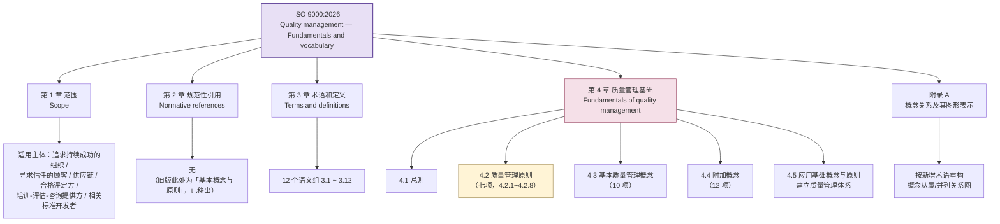
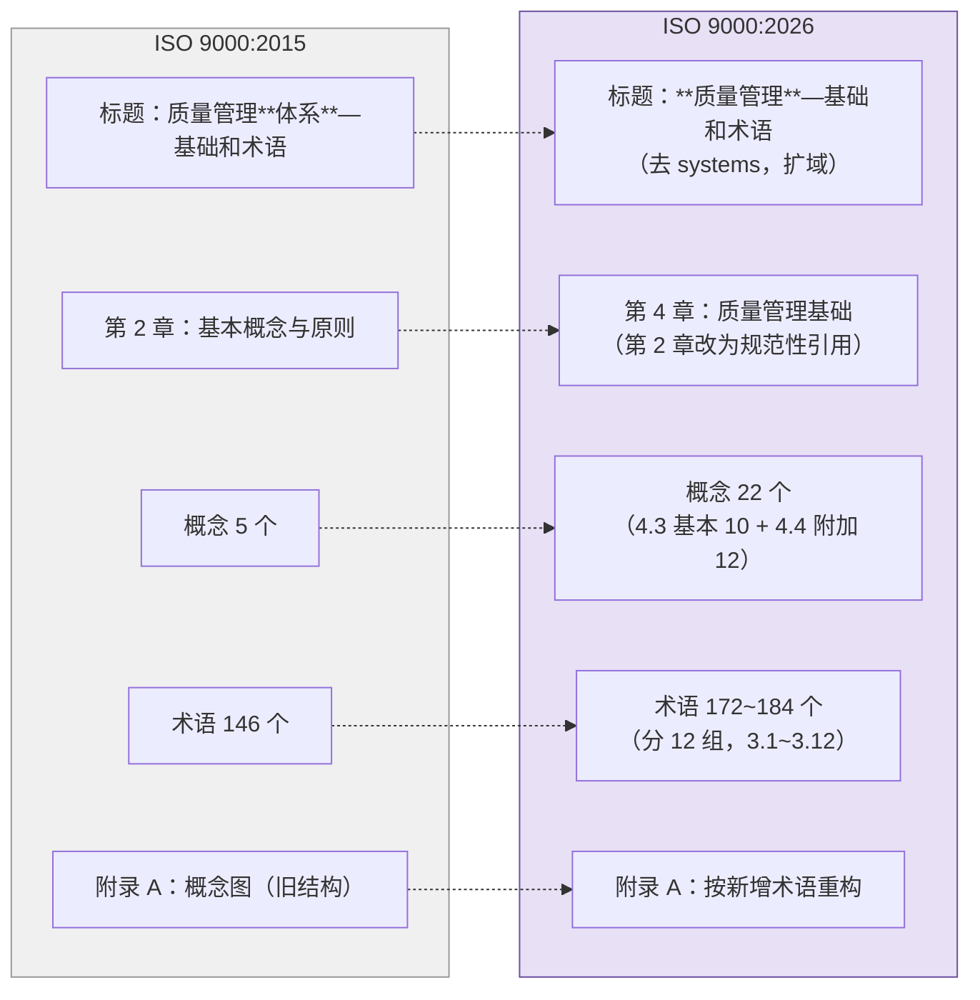
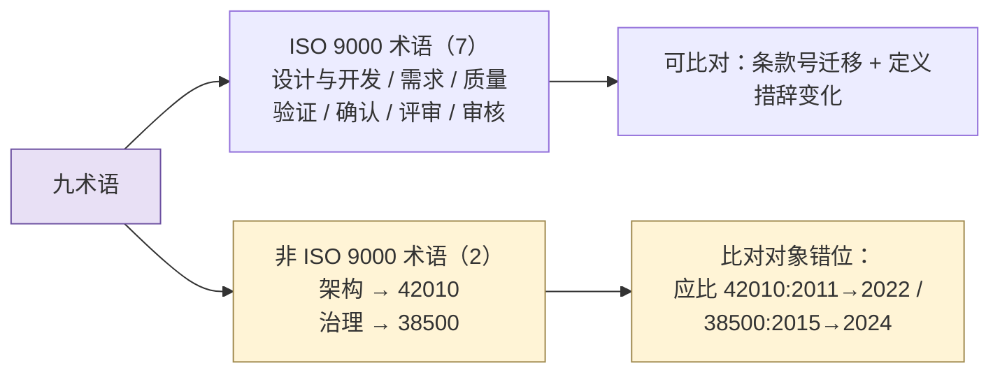

# 26-ISO 9000:2026 研究报告—结构与术语框架导航图

> **范围**：ISO 9000:2026《Quality management — Fundamentals and vocabulary》（第 5 版）的**文档骨架**——发布信息、章节组织、七项质量管理原则、术语分类框架、附录 A 概念图重构，以及与 2015 版的差异。
>
> **方法**：**二手资料汇编 + 结构化归纳**。来源为各国家标准机构（BSI / NEN / AFNOR / UNI / DIN / SIST）的公开预览页与变更说明、ISO/TC 176 公开材料、以及行业媒体的解读文章（清单见文末）。**不含任何 verbatim 引证。**
>
> **适用**：版本升级影响评估、术语溯源导航、教材/培训材料的版本合规检查。

---

## ★ 资料性质与合规声明（**先读这一条**）

> **本报告不是 ISO 9000:2026 的替代品，也不构成对原文的引用依据。**

三条必须遵守的边界：

1. **非 verbatim**——全文为二手资料的**归纳与转述**，术语定义的具体措辞一律未收录。凡需在正式文档（教材、培训材料、评审答辩）中引用 ISO 9000 术语定义者，**必须回到正版原文核对**，不得以本报告为据。
2. **未取用 OBP 内容**——ISO Online Browsing Platform 的使用条款明确禁止复制、再分发，并**禁止将内容用于机器学习/AI/数据挖掘**。本报告刻意未从 OBP 取用任何内容。
3. **不含原文副本**——本报告及本仓库**不存放 ISO 9000:2026 的 PDF/正文副本**。ISO 标准为受版权保护的商业出版物，全文入库属再分发。采购件请放本地参考，不进 git。

> **使用姿势**：把本报告当**导航图**用——它告诉你"这份标准里有什么、在哪个位置、和旧版差在哪、我们需要动哪些地方"；具体文字请查原文。

---

## 0. 一行结论（TL;DR）

| 维度 | 结论 |
|---|---|
| **发布** | 2026-05-27 发布，第 5 版，53 页（英文），替代 ISO 9000:2015 |
| **最大结构性变化** | 标题**去掉 "systems"**——从《质量管理**体系**—基础和术语》改为《**质量管理**—基础和术语》，适用范围从 QMS 架构扩到质量管理全域 |
| **最易踩坑的变化** | **章节重排**：根本概念从旧的第 2 章移到**第 4 章**，第 2 章改为"规范性引用"。**旧版条款号大范围失效** |
| **对本子项目的影响** | 约 **90 个文件、40+ 处条款级引用**（§3.6.4 / §3.7.6 / §3.4.8 / §3.11.2 / §3.8.13 …）锚在 **2015 版**上，**版本依据需重新评估**（详见 §6） |
| **术语规模** | 146 → **172 或 184**（来源冲突，见 §5.1），分 12 个语义组（3.1~3.12） |
| **概念规模** | 5 → **22**（4.3 基本概念 10 项 + 4.4 附加概念 12 项） |
| **性质提醒** | ISO 9000 是**基础与术语标准**，不是认证标准——**不改变 ISO 9001 的要求，不产生新的审核条款** |

---

## 1. 发布信息与版本定位

| 项 | 内容 |
|---|---|
| 标准号 | ISO 9000:2026 |
| 英文正题 | Quality management — Fundamentals and vocabulary |
| 版本 | 第 5 版（第 1 版 1987，前版 2015） |
| 发布日期 | **2026-05-27** |
| 页数 | 53 页（英文版；EN 采纳版 56 页，BS EN 版 66 页） |
| 编制 | ISO/TC 176「质量管理与质量保证」/ SC 1「概念与术语」 |
| 前版 | ISO 9000:2015（沿用 11 年） |
| 采纳情况 | 经维也纳协定由 CEN 采纳为 **EN ISO 9000:2026**（2026-05-14 通过），各国转版：BS EN / UNI EN / SIST EN / DIN EN ISO 9000:2026-09 等 |
| 规范性引用 | 无（正文明确"无规范性引用文件"） |

### 1.1 与 ISO 9001 的区分（**高频混淆点**）

这两个标准在中文媒体上被大量混为一谈，务必分开：

| | ISO 9000 | ISO 9001 |
|---|---|---|
| 性质 | **基础和术语**（fundamentals & vocabulary） | **要求**（requirements） |
| 作用 | 概念与术语的统一语言底座 | 可认证的体系要求 |
| 2026 版状态 | **已发布**（2026-05-27） | 本报告撰写时（2026-09-12）处于 DIS 草案→正式版过渡期，UNI 预告 9/16 上市 |
| 关系 | ISO 9000 **不改变** ISO 9001:2015 的要求 | 新版 9001 将以新版 9000 的概念体系为基础重建 |

> **实操提醒**：中文渠道（中质捷、品质协会、搜狐号等）标题常写"ISO 9000"，正文夹带 9001 的 DIS 稿。据此下载的"ISO 9000:2026"可能是 9001 草案，或版本真伪不明。**以国家标准机构商店的版本信息为准。**

---

## 2. 文档结构



### 2.1 第 1 章 范围

确立质量管理的**基本概念与原则**，声明通用性——适用于任何规模、复杂度和业务模式的组织。列出的适用主体包括：借 QMS 实现持续成功的组织、寻求"组织能稳定提供合格产品和服务"之信心的顾客、寻求供应链信心的组织、需要共同术语理解的组织和相关方、对 ISO 9001 做合格评定的组织、提供质量管理培训/评估/咨询的机构、以及相关标准的开发者。

> 范围从"QMS 标准用户"扩到"质量管理全域参与者"，与标题去 "systems" 是同一件事的两面。

### 2.2 第 2 章 规范性引用

**空**——正文声明无规范性引用文件。旧版第 2 章承载的"基本概念与原则"整块迁往第 4 章，第 2 章腾给规范性引用。这一调整是为对齐 **ISO/IEC Directives Part 2** 对管理体系标准章节布局的统一要求。

### 2.3 第 3 章 术语和定义

按质量管理的内在逻辑分为 **12 个语义组**（条款号 3.1~3.12）：

| 组 | 主题 | 组 | 主题 |
|---|---|---|---|
| 3.1 | 与组织有关的术语 | 3.7 | 与结果有关的术语 |
| 3.2 | 与管理有关的术语 | 3.8 | 与数据、信息、成文信息有关的术语 |
| 3.3 | 与过程有关的术语 | 3.9 | 与顾客、相关方有关的术语 |
| 3.4 | 与体系有关的术语 | 3.10 | 与特性有关的术语 |
| 3.5 | 与要求有关的术语 | 3.11 | 与**测定/判定**有关的术语 |
| 3.6 | 与**活动/措施**有关的术语 | 3.12 | 与审核有关的术语 |

**分组语义变化（值得注意）**：本组列表体现了两处概念重心的移动——旧版偏"措施"（action）的位置，2026 版表述为"**活动/措施**"；旧版偏"确定"（determination）的位置，2026 版表述为"**测定/判定**"。措辞调整背后是分组内涵的重新划定，**不是简单改名**。

> ⚠️ **由此产生的最大风险**：分组边界一动，组内条款号几乎必然整体平移。详见 §5.2 与 §6。

### 2.4 第 4 章 质量管理基础

| 条款 | 内容 |
|---|---|
| 4.1 | 总则 |
| **4.2** | **质量管理原则**——4.2.1 总则 + 4.2.2~4.2.8 七项原则（见 §3） |
| **4.3** | **基本质量管理概念**（10 项） |
| **4.4** | **附加概念**（12 项） |
| 4.5 | 应用基础概念与原则建立质量管理体系 |

**4.3 基本质量管理概念（10 项）**：质量、质量管理、质量管理体系（QMS）、质量保证、质量控制、质量策划、过程管理、**基于风险的思维**、组织质量文化、持续改进。

**4.4 附加概念（12 项）**：组织环境、相关方、一体化管理体系、**循环经济**、**新兴技术**、创新、变更管理、**顾客体验**、知识管理、信息管理、人的因素、业务连续性。

> **两层框架的意义**：4.3 是"质量管理的骨架概念"（每个 QMS 都必须用到），4.4 是"有效应用质量的语境概念"（现代经营环境带来的新变量）。旧版只有 5 个概念且不加分层，新版把"必需"和"语境"分开，教学上更清晰。

### 2.5 附录 A 概念关系及其图形表示

- 依 DIN 变更说明（Änderungsvermerk），附录 A 的图形**为容纳新增术语而重构并更新**。
- 图形表达概念之间的**从属关系与并列关系**（属种/整体部分/并列），构成术语关系的视觉索引。
- 效果：为"关键概念之间如何相互关联"提供更新后的参考结构，降低理解门槛，支撑术语解释的一致性。

---

## 3. 七项质量管理原则（§4.2）

| # | 原则 | 一句话要旨 |
|---|---|---|
| 1 | **以顾客为关注焦点**（Customer focus） | 满足顾客要求并努力超越期望 |
| 2 | **领导作用**（Leadership） | 各层级领导者确立统一的宗旨与方向，创造条件让人员投入 |
| 3 | **全员参与**（Engagement of people） | 各层级有能力、被赋权且敬业的人，是创造价值的关键 |
| 4 | **过程方法**（Process approach） | 把活动作为相互关联、协调一致的过程来管理，以取得一致且可预测的结果 |
| 5 | **改进**（Improvement） | 成功的组织持续关注改进 |
| 6 | **循证决策**（Evidence-based decision-making） | 基于对数据和信息的分析与评价所做的决策，更可能产生预期结果 |
| 7 | **关系管理**（Relationship management） | 管理与相关方的关系以实现持续成功 |

**每项原则的固定展开式**：陈述（Statement）→ 理由（Rationale）→ 主要收益（Key benefits）→ 可能的行动（Possible actions）。七项原则相互关联，应综合应用。

> **可靠性说明**：七项原则的名称与条目在多来源间一致，可视为稳定事实。但**各原则的陈述句措辞本报告未收录**——二手来源对其表述不一，引用前须核原文。

---

## 4. 2026 版相对 2015 版的主要变化



| # | 变化 | 影响面 |
|---|---|---|
| 1 | **标题去 "systems"** | 概念性：从"QMS 的标准"变成"质量管理的标准" |
| 2 | **根本概念 §2 → §4**，第 2 章改为规范性引用 | **结构性：旧条款号全面失效** |
| 3 | **概念从 5 个扩到 22 个**，分"基本/附加"两层 | 概念框架重建 |
| 4 | **术语 146 → 172/184**，分 12 组 | 规模 +26%~+38% |
| 5 | **附录 A 概念图重构** | 术语关系索引更新 |
| 6 | 新增概念三大方向：数字化与新兴技术、循环经济与可持续、质量文化与伦理 | 与 ISO 9001 新版修订方向呼应 |
| 7 | **基于风险的思维**从"贯穿主线"升格为与"过程方法""PDCA"并列的**基本概念** | 方法论地位变化 |
| 8 | 据称逾百条既有定义被修订 | **待核实**（见 §5.3） |

**三大新增方向的具体落点**（二手来源归纳，术语名以原文为准）：

- **数字化 / 新兴技术**：人工智能、大数据、物联网、区块链追溯、电子成文信息、数据溯源、数字化知识管理等首次纳入术语体系。标准同时提示——**新兴技术若未被充分认知而盲目引入，可能严重损害 QMS 绩效**。
- **循环经济 / 可持续**：循环经济、产品全生命周期、资源回用、碳足迹、气候相关质量风险等，把资源循环与环境考量绑进质量管理的基础语言——**打破了质量与环境管理标准的术语壁垒**。
- **质量文化与伦理**：组织质量文化、质量伦理、诚信质量、相关方质量诉求等；"组织质量文化"同时进入 §4.3 基本概念。

---

## 5. 存疑点与待核实清单

### 5.1 ⚠️ 术语数量：172 还是 184

不同来源分别给出 **146 → 172** 与 **146 → 184**（+26 与 +38）。两组数字在多篇中文解读中都能见到，无法从二手资料判定。

> **处置**：引用术语数量时**不要写具体数字**，或写"约 170~185（待核原文）"。

### 5.2 ⚠️ 2015 → 2026 的条款号映射：**部分已有、尚不完整**（v1.1 修正）

> **v1.0 曾断言"映射未知、严禁凭推断编制"。该断言不准确**——本子项目 **24、25 号报告已记录了一批 2015→2026 条款迁移**（详见本报告 §9）。现将状态修正如下。

**已确立的组级重排**（来源：25 号报告）：

| 2015 版术语组 | 2026 版术语组 |
|---|---|
| §3.4 过程相关 | **§3.3** |
| §3.5 系统相关 | **§3.4** |
| §3.6 要求相关 | **§3.5** |

即 3.4~3.6 段整体**下移一号**；而「需求/客体」组迁入 3.5，组内顺序也做了重排（requirement 提到首位）。

**仍未建立的部分**：3.7~3.12 段的映射、以及**绝大多数术语的逐条条款号**。九术语核查见 §9。

> **处置（修订）**：①**已有映射可直接沿用**，但须标注置信度（§9.2 分级）；②**未覆盖部分严禁凭推断补**；③优先事项由"建立映射表"改为"**补齐未覆盖段 + 复核既有映射**"，后者需正版原文或 GB/T 19000 征求意见稿（§9.5）。

### 5.3 ⚠️ "逾百条定义被修订"

该说法仅见于单一二手来源，未获交叉印证。对教材影响极大（若定义措辞变了，教材里的转述需逐条复核）。

> **处置**：标为待核实。采购正版后应优先做 **2015 vs 2026 的 Redline 对照**——ANSI / Techstreet / JSA 均提供 Redline 版，这是做这件事最省力的工具。

### 5.4 ⚠️ 原则陈述句措辞

七项原则的**名称**可靠；**每项的陈述/理由/收益/行动四段式措辞**在各二手来源间表述不一，不可据以引用。

---

## 6. 对本子项目的影响评估

### 6.1 影响面：约 90 个文件、40+ 处条款级引用

本子项目对 ISO 9000 的引用是**条款号级的深度锚定**，不是泛泛提及。分布：

| 板块 | 文件数 | 典型引用 |
|---|---|---|
| `00-系统工程相关研究报告/` | ~20 | 22 号（30 处）、23 号（54 处）、06 号（25 处）、14 号（18 处）、03 号（15 处） |
| `03-架构师是个怎样的物种/`（教材书，含 `成书/build/`） | ~30 | 08 章（28 处）、03 章（22 处）、17 附录（18 处） |
| `02-架构工程师培训材料/`（含 `旧版归档/`） | ~20 | 08 单元（9 处）、17 单元（8 处）、03 单元（7 处） |
| `01-流程工程师培训课件/` | 3 | 参考答案（20 处）、PPT 编制规则（13 处） |

**被引用的 2015 版条款号（部分）**：§3.6.4（需求）、§3.7.6（产品）、§3.7.1（目标）、§3.4.8（设计与开发）、§3.11.2（评审）、§3.8.13（确认）、§3.8.12、§3.6.2、§3.8.5、§3.5.1（特性）、§3.2.4。

### 6.2 性质判定：**不是错误，是版本依据过期**

须厘清一件事：现有引用**在 2015 版下是正确的**，报告 22 甚至明写了"★ 标准版本原则——所有主体分析一律以最新现行标准为依据"。问题不在引用错了，而在**"最新现行"这个前提已经变了**：ISO 9000:2015 已于 2026-05-27 被替代。

于是产生一个**自洽性缺口**：子项目自己定的原则要求锚最新现行版，而全项目实际锚在已被替代的版本上。这不是内容错误，是**治理状态与自定原则不符**。

### 6.3 建议的处置顺序

**第一步（可立即执行，无需正版）：盘点分级。** 把 40+ 处引用按"引用性质"分三级——
- **A 级｜定义性引用**：直接把某术语定义当作论据（如"产品依 §3.7.6 定义为…"）。**风险最高**，定义措辞若变则论证受影响。
- **B 级｜定位性引用**：只借条款号说明"某概念在标准中的分组归属"（如"ISO 9000 把评审放在 3.11、把验证放在 3.8"）。**受影响最大**，因分组已重排。
- **C 级｜提及性引用**：泛指"依 ISO 9000"而不给条款号。**风险最低**。

**第二步（需正版）：建立新旧条款对照表。** 持正版 2026 版逐条核对，产出映射表。**在映射表建立前，不做任何条款号替换。**

**第三步：按级替换 + 版本标注。** A/B 级逐条核定义、换条款号；C 级可维持。全项目统一版本标注口径（写明 `ISO 9000:2026 §x.y.z` 或标注所据版本）。

**第四步：先在 22 号报告试点。** 报告 22 是术语对照的枢纽文件（30 处引用 + 版本原则声明），且方法论最严谨。**以它为试点修正版本原则与引用，形成模板后再向教材书和培训材料铺开**——这比大面积同时改更安全。

### 6.4 不必恐慌的部分

- ISO 9000 是基础与术语标准，**不改变 ISO 9001 的要求**，子项目的论证**不因新版而失去效力根基**。
- 七项原则**名称未变**，兜底叙述稳定。
- 多数受影响的引用集中在"产品/需求/设计开发/评审/验证/确认"这一组核心术语——**这组正是 4.3 基本概念的落点，恰恰也是 2026 版重写最用力的地方**，所以值得认真做。

---

## 7. 获取渠道与合规边界

### 7.1 合法免费（可读，不可再分发）

| 渠道 | 可得内容 |
|---|---|
| ISO OBP `iso.org/obp` | 目录、前言、引言、范围、**第 3 章术语和定义**、参考文献；部分标准有 Redline 视图 |
| 各国标准机构预览页 | 前 3 页左右（封面 + 前言含"相对旧版变化"说明 + 范围）。BSI 3 页、NEN 预览 PDF、UNI preview、EVS DownloadPreview、iTeh 含 Scope 与 European foreword |

> **OBP 使用条款红线**：仅限信息、研究、评估目的的浏览检索；禁止复制/再分发/商用/系统化提取（含自动化）；**禁止用于机器学习、AI、数据挖掘**。且 OBP 内容为"部分、非穷尽、非官方版本"——**不可作为引用依据**。

### 7.2 正版采购（需全文者走此路）

| 渠道 | 说明 |
|---|---|
| [ANSI Webstore](https://webstore.ansi.org/) | PDF 即时下载；**含 Redline 版**（做新旧对照的首选） |
| [Accuris / Techstreet](https://store.accuristech.com/ieee/publishers/ISO) | ISO 9000:2026 及 Plus Redline，多用户 PDF |
| [国家数字标准馆 NDLS](https://www.ndls.org.cn/standard/detail/6bc572e8e2c8a490baf67480e57e22dd) | 中文场景到馆查阅 |
| AFNOR / Austrian Standards / KSSN / SFS / DIN Media | 各国转版，价差较大（€200~€300 / ¥1,800~2,300 区间），建议比价 |

### 7.3 明确不推荐

中文论坛（品质协会 PinZhi.org）、网盘直链、自媒体"文末附下载"、文档分享站等渠道流通的 ISO 全文副本**均为未授权件**。两条理由：一是 ISO 标准受版权保护，上传/下载/入库属侵权；二是来源不明，**版本真伪与完整性无法核实**——对做术语溯源是致命的。

> **本仓库口径**：ISO 9000:2026 **不进版本管理**。可入库的是本报告这类**归纳笔记**（自有语言、标注出处与版本），以及将来的**新旧条款对照表**（核对后产出的自有成果）。这与 22 号报告、`20241014-系统工程手册5.0中文版.pdf` 的处置差异在于——后者的版权状况允许入库，ISO 标准不允许。

---

## 8. 来源清单

**国家标准机构公开页**
- [BSI — BS EN ISO 9000:2026](https://knowledge.bsigroup.com/products/quality-management-fundamentals-and-vocabulary)（3 页预览）
- [NEN — 预览 PDF](https://www.nen.nl/en/norm/pdf/preview/document/352727/)
- [AFNOR — ISO 9000:2026](https://www.boutique.afnor.org/en-gb/standard/iso-90002026/quality-management-fundamentals-and-vocabulary/xs147235/599826)
- [UNI — UNI EN ISO 9000:2026（Certifico）](https://www.certifico.com/normazione/documenti-riservati-normazione/organismi-normazione/documenti-uni/uni-en-iso-9000-2026)
- [iTeh — EN ISO 9000:2026](https://www.standards.iteh.ai/catalog/standards/cen/7a09e76c-3ae4-409c-9027-a05022ba5f4c/en-iso-9000-2026)（含 Scope 与 European foreword）
- [EVS — 下载预览](https://www.evs.ee/et/StandardDownload/DownloadPreview?productId=167090&language=EnglishLanguage)
- [Austrian Standards — ISO 9000:2026](https://www.austrian-standards.at/de/shop/iso-9000-2026-2026-05-27~p4887138)
- [SFS — ISO 9000:2026 on julkaistu](https://sfs.fi/iso-9000-2026-on-julkaistu/)
- [DIN — ISO 9000:2026 记录](https://www.din.de/de/wdc-beuth:din21:403145152)（含变更说明 Änderungsvermerk）
- [国家数字标准馆 NDLS — ISO 9000:2026](https://www.ndls.org.cn/standard/detail/6bc572e8e2c8a490baf67480e57e22dd)

**机构与媒体解读**
- [中国标准化研究院 CNIS — ISO 9000 修订重要进展](https://en.cnis.ac.cn/News/CNISNews/202607/t20260708_63295.html)
- [国家标准计划 20264414-T-469（GB/T 19000 修订，等同采用 ISO 9000:2026）— 全国标准信息公共服务平台](https://std.samr.gov.cn/gb/search/gbDetailed?id=5A7BF1C508FC8432E06397BE0A0A8F1E)
- [CNIS — GB/T 19000、GB/T 19001 两项国家标准修订预研工作讨论会](https://www.cnis.ac.cn/ynbm/shehuizl/zhxw/202607/t20260730_63411.html)
- [中国质量报 — 国际质量管理基础标准修订取得重要进展](https://www.cqn.com.cn/zgzlb/content/2026-04/27/content_9154278.htm)
- [UNI — ISO 9001 edizione 2026](https://www.uni.com/la-nuova-era-della-qualita-uni-en-iso-9001-edizione-2026/)（9001 时间线，用于区分）
- [My ISO Consultants — What the Updated Vocabulary Means for ISO 9001 Users](https://www.myisoconsultants.com/post/iso-9000-2026-what-the-updated-quality-management-vocabulary-means-for-iso-9001-users-jay-wiessne)

**合规依据**
- [ISO OBP Terms of Use](https://www.iso.org/es/footer-links/obp-tems-of-use.html)
- [ANSI ISOT Guidance Note 010 — ISO's Online Browsing Platform](https://share.ansi.org/isot/isot%20guidance%20notes/isot%20guidance%20note%20010%20-%20iso%27s%20online%20browsing%20platform.pdf)

---

## 9. 九术语逐项核查（2015 → 2026）

> **核查对象**：设计与开发、需求、质量、架构、验证、确认、评审、审核、治理。
> **核查结论先行**：**七个是 ISO 9000 术语，两个不是。**——"架构"属 ISO/IEC/IEEE 42010，"治理"属 ISO/IEC 38500，**不存在"它们与 ISO 9000:2015 版的区别"这一问题**，那是跨标准对照，不是版本差异。见 §9.3。

### 9.1 术语分流



### 9.2 ISO 9000 七术语：条款迁移（**v1.2 实测核对版**）

> **v1.2 数据来源变更**：本表 2026 侧条款号已由"二手转述"改为**直接实测**——解析子项目内 ISO 9000:2026（EN ISO 版英语正文）的 `word/document.xml` 文本层，定位条款号。关键条款号均在**多处交叉引用句中重复出现**（如 `design and development (3.3.11)` 出现于 3 个不同句子），故可视为确证而非推定。**v1.1 的四个"未确立"项已全部结清。**
>
> ⚠️ **本表只记条款号与迁移类型，不录定义正文**——条款号是事实性元数据，定义措辞是受版权保护的表达。

| 术语 | 2015 条款 | **2026 条款** | 迁移类型 | 置信度 |
|---|---|---|---|---|
| **设计与开发**<br/>design and development | §3.4.8 | **§3.3.11** | 组迁移（过程组 3.4→3.3） | **实测确证** |
| **需求**<br/>requirement | §3.6.4 | **§3.5.1** | 组迁移 + 组内重排至首位 | **实测确证** |
| **质量**<br/>quality | §3.6.2 | **§3.5.2** | 同上 | **实测确证** |
| **验证**<br/>verification | §3.8.12 | **§3.11.12** | **组迁移（3.8 → 3.11）** | **实测确证** |
| **确认**<br/>validation | §3.8.13 | **§3.11.14** | 同上 | **实测确证** |
| **评审**<br/>review | §3.11.2 | **§3.11.2** | **未动** | **实测确证** |
| **审核**<br/>audit | 未记录 | **§3.12.1** | 3.12 组共 18 条（`3.12.1`~`3.12.18`） | **实测确证** |

#### 9.2.1 定义层面：**六项实质未变，审核有实质删除**（v1.4 修正）

> 读 2026 侧定义正文，与子项目记录的 2015 侧口径逐项比对。**只报差异，不复述定义原文。**
>
> **v1.4 修正**：v1.3 曾记为"七项实质未变"。用户补入 **ISO 9000:2015 版 audit 定义原文**后复核，**audit 实有两处实质删除**——v1.3 结论对 audit 不成立，已更正（见下方专项）。其余六项的"未变"判断依据仍是子项目既存中文口径，**同类风险未排除**，须以 2015 原文逐条复核。

| 术语 | 定义实质 | 2026 相对 2015 的实际差异 |
|---|---|---|
| 设计与开发 §3.3.11 | **未变** | 定义句与注 1/注 2/注 3 **三段注全部保留**；只有句内交叉引用号更新（如示例里的 product/service 改为指向 2026 的 3.7.9/3.7.10） |
| 需求 §3.5.1 | **未变** | 三形态表述与注 1~注 5 结构均保留；注 2（specified ≡ stated）仍在同一位次 |
| 质量 §3.5.2 | **未变** | 定义句同义；注 1（可用 poor/good/excellent 修饰）、注 2（inherent vs assigned）保留 |
| 验证 §3.11.12 | **未变** | 定义句**唯一差别是句内引用号**：所据"规定需求"由旧号改指 §3.5.1。注 1（客观证据含检验/替代计算/文件评审）、注 2（qualification process）、注 3（verified 表状态）保留 |
| 确认 §3.11.14 | **未变** | 同上；注 3「使用条件可为真实或模拟」**保留**（子项目教材曾据此立论，**该论据有效**） |
| 评审 §3.11.2 | **未变** | 定义句同义；注 1（可含效率 determination）保留 |
| **审核** §3.12.1 | **实质变更（两处删除）** | 见下方专项——**本节唯一有实质定义变更的一项** |

##### 专项：审核 §3.12.1 —— 2026 版删掉了两个限定词

| | 2015（§3.13.1） | 2026（§3.12.1） |
|---|---|---|
| 过程性质 | systematic, independent and **`documented`** process | systematic and independent process |
| 所获证据 | obtaining **`objective`** evidence（并交叉引用 §3.8.3） | obtaining **evidence**（**无**交叉引用） |
| 交叉引用号 | process §3.4.1 ／ audit criteria §3.13.7 | process §3.3.1 ／ audit criteria §3.12.14 |

**两处删除都指向同一方向——放宽：**

1. **`documented` 被删**：2015 要求审核是"文件化的"过程；2026 不再要求。审核过程本身是否落纸，已不由定义强制。
2. **`objective` 被删**：2015 要求取得的是"**客观**证据"（`objective evidence`，2015 §3.8.3 有独立定义）；2026 只说取得"证据"，**且丢掉了对该术语的交叉引用**。注意：`objective evidence` 在 2026 中**仍然存在**（§3.8.6），并在**验证/确认**的定义里照常使用（*through the provision of objective evidence (3.8.6)*）——**唯独审核这一条不再用它**。

→ 评价仍须客观（*evaluating it objectively* 保留），但**被评价的证据不再被限定为"客观"**。

**可能的方向（属解读，非结论）**：与同日发布的 **ISO 19011:2026**（审核指南第 4 版，引入远程审核、虚拟位置、数字证据）方向一致——审核正从"文件化＋客观证据"的形态向容纳数字化与远程形态放宽。

**对子项目的影响**：凡以"审核是文件化过程"或"审核须取得客观证据"立论的段落需复核。**教材 ch13（受控分级）、ch8（评审/验证/确认）与培训材料对应单元是重点排查位。**

**关键洞察（v1.4 修正版）**：**六项**（设计开发／需求／质量／验证／确认／评审）的文本级差异**只有句内嵌的交叉引用号**；**审核是唯一有实质定义变更的一项**（两处删除）。

> **教材与培训材料中的定义级引用与推理——六项成立，审核一项需复核定义论据。**
> 需要处置的总共**三类**：① 条款号替换（机械）；② **审核定义两处删除**（复核论据，v1.4 新增）；③ **基于"术语分组"的论证**（P6）。

改动面因此为"换号 + 两处论据复核"，而非全线崩塌。

> ⚠️ **方法论提醒**：v1.3 之所以把 audit 误判为"未变"，是因为拿 2026 原文去比**子项目既存的中文口径**——中文转写会**吞掉 `documented`、`objective` 这类限定词**。audit 之所以被查出来，恰恰是因为用户直接提供了 2015 原文。**其余六项的"未变"结论建立在同类转写之上，同一盲区仍在。** 要彻底关掉这个风险，只有一条路：以 2015 原文逐条复核，而非以转写比对。

> **置信度说明**：2026 侧为原文实测。2015 侧**只有 audit 一项**是用户提供的英文原文（故该项结论为"确证"）；**其余六项依据的是子项目既存中文口径**，本会话未逐字复核 2015 原文。两侧措辞高度吻合，但 audit 的先例证明**转写会吞掉限定词**——故六项的"实质未变"应视为**待证**，而非已证。

#### ★★ 最重大的一条发现：「评审 vs 验证/确认 分家」在 2026 版消失

2015 版中 **review 属 3.11 组**、**verification/validation 属 3.8 组**——**两个不同的组**。子项目据此立过教学要点（*"ISO 9000 分家：评审在 3.11「确定」组（判）、验证在 3.8"*），并在教材与培训材料中反复使用。

**2026 版把三者收进了同一个 3.11 组**（组标题 *Terms related to determination*）：

```
3.11.1  determination        3.11.11 inspection
3.11.2  review               3.11.12 verification   ← 原 3.8.12
3.11.3  monitoring           3.11.13 test
3.11.4  measurement          3.11.14 validation     ← 原 3.8.13
```

> **影响**：**凡以"标准把评审与验证分成两组"为论据的段落，在 2026 版下论据失效**——须重立论据，或显式限定"依 ISO 9000:2015"。这是本次核查中**唯一一处会导致教材论证失效**（而非仅条款号需替换）的发现。子项目内该表述的落点需专项清查。

#### 12 组标题（实测原文）

| 组 | 标题（英） | 组 | 标题（英） |
|---|---|---|---|
| 3.1 | Terms related to **organization** | 3.7 | Terms related to **result** |
| 3.2 | Terms related to **management** | 3.8 | Terms related to **data** |
| 3.3 | Terms related to **process** | 3.9 | Terms related to **customer** |
| 3.4 | Terms related to **system** | 3.10 | Terms related to **characteristic** |
| 3.5 | Terms related to **requirement** | 3.11 | Terms related to **determination** |
| 3.6 | Terms related to **action** | 3.12 | Terms related to **audit** |

#### 组号迁移实测

| 组 | 2015 | 2026 | 变化 |
|---|---|---|---|
| 组织 / 管理 | 3.1 / 3.2 | 3.1 / 3.2 | **未动** |
| 过程 | §3.4 | **§3.3** | 号减一 |
| 体系 | §3.5 | **§3.4** | 号减一 |
| 要求 | §3.6 | **§3.5** | 号减一 |
| 结果 | §3.7 | §3.7 | 组号**未动**，但**组内重排**（objective §3.7.1→**§3.7.11**、product §3.7.6→**§3.7.9**） |
| 测定/判定 | §3.8 | **§3.11** | 号加三；**并吸收原 3.11 组**（review 未动即因此） |
| 特性 | §3.10 | §3.10 | **未动** |
| 审核 | — | **§3.12** | 末组 |

> 3.4/3.5/3.6 三段齐减一号、而 3.1/3.2 未动，说明**前部（3.2 与 3.4 之间）有一组被撤并**。机制未核，此处只记观测。

**相邻术语（实测，可用于交叉校验）**：

| 术语 | 2026 条款 | 2015 条款 | 备注 |
|---|---|---|---|
| object | §3.5.3 | §3.6.1（推定） | — |
| quality management system | **§3.1.13** | 未记录 | ⚠️ 落在**组织组**而非体系组，与直觉不符，引用前留意 |
| **characteristic** | **§3.10.1** | §3.10.1 | **未动** → 直接结清 P4（见 §9.4） |
| result | §3.7.1 | — | — |
| output | §3.7.8 | — | — |
| product | **§3.7.9** | §3.7.6 | 组内重排 |
| service | **§3.7.10** | — | — |
| objective | **§3.7.11** | §3.7.1 | 组内重排 |
| conformity | §3.5.9 | — | **Note 1 声明 "conformance" 为同义词但已废弃** → 统一用 conformity。实质性的措辞裁决，影响全部合规类论述 |
| nonconformity | §3.5.13 | — | — |
| defect | §3.5.14 | — | — |
| management review | 未作术语 | — | 系 ISO 9001 条款名，非 ISO 9000 术语 |

> **勘误（二手来源讹传已排除）**：此前二手来源称 "product design and development (**3.7.9**)、service design and development (**3.7.10**)" 为独立术语。实测证明 **3.7.9 是 product、3.7.10 是 service**——该来源把注 3 示例里 `product (3.7.9) design and development`、`service (3.7.10) design and development` 的**交叉引用号误读成了示例自身的条款号**。原文确为**注 3 的示例**，25 号说法正确。**此讹传已排除，不再列为待核项。**

### 9.3 "架构"与"治理"：比对对象错位

| 术语 | 真正的权威定义处 | 该比对的是 |
|---|---|---|
| **架构**（architecture） | **ISO/IEC/IEEE 42010:2022 §3.2** | 42010:**2011 → 2022**——这才是架构的"版本差异"所在，24 号报告已系统梳理（system of interest→**entity of interest**、architecture framework→**ADF**、architecture model→**view component**、Conformance 由第 6 章移入第 4 章 等） |
| **治理**（governance） | **ISO/IEC 38500:2024 §3.3** | 38500:2015 → **2024**——2024 版四活动（相关方参与/评估/指导/监督），子项目教材 ch14、08 号报告已按 2024 版对齐 |

**两处必须留意的连锁问题：**

1. **ISO 9000:2026 未收"架构"与"治理"为术语——已实测确证。** 全文词频检索：**`architect*` 0 次**（连词根都不出现）；**`governance` 仅 1 次**，且出现在散文句中（"…enabling structured governance, measurement and improvement where applicable"），**不是术语条目**。12 组标题（§9.2）与 4.3/4.4 的 22 个概念中亦均无二者。→ **凡在 ISO 9000 名下引"架构/治理"定义者，均为误引，无例外。**
2. **22 号报告的表 1 需复核**。其"标准版本原则"表把 `characteristic / governance` 一并挂到 **ISO 9000:2015（§3.5.1 / §3.10.1）**——但同时：子项目别处又标注 `characteristic = ISO 9000 §3.10.1`。**同一术语两组条款号并存，必有一误**，且若治理本非 ISO 9000 术语，则该行双重失实。详见 §9.4。

### 9.4 本次核查发现的既有资料问题（5 项，均待处置）

| # | 问题 | 状态（v1.2） |
|---|---|---|
| **P1** | **声称的交付物不存在**：25 号对话记录第 23 轮写明"本轮操作：抓取 OBP 第 3 章 3.1–3.12 共 170 条术语，整理并交付 `ISO-9000-2026-术语速查表.html` 与 `.md` 双格式"——**全库检索无此二文件，git 历史亦无**。且同一轮的前文刚声明"任何号称直接下 PDF 的站点来的都是盗版——这条我不碰"，同一文档内**自相矛盾** | **仍待处置**（记录失实／交付物缺失） |
| **P2** | **术语总数多说并存**：170（25 号）/ 172（一家认证机构称按官方正本勘误）/ 184（多个中文来源） | **部分收窄**：实测提取到 **160 个不同条款号**（提取有损，实际略多）；最大号 `3.12.18`。**184 说基本可排除**，170／172 更可能，但仍未定死 |
| **P3** | **verification 的 2015 条款号内部矛盾**：多数处 §3.8.12，另一处 §3.8.5 | **未结清**——需 2015 版原文（2026 版文件中不含旧号）。以多数处口径 §3.8.12 为准 |
| **P4** | **characteristic 的条款号内部矛盾**：`§3.10.1`（多处，含 22 号图表）vs `§3.5.1`（22 号正表） | **已结清**：2026 版实测为 **§3.10.1**，且与 2015 同号（未动）→ **22 号报告正表的 §3.5.1 是错的**，别处的 §3.10.1 正确 |
| **P5** | **治理被误挂 ISO 9000**：ISO 9000:2026 全文 `governance` 仅 1 次散文、非术语 | **已确证**：22 号报告表 1 该行**双重失实**（characteristic 号错 + governance 本非 ISO 9000 术语） |
| **P6** | **新增：「评审 vs 验证分家」论据在 2026 版失效**（见 §9.2） | **新发现**——唯一会导致教材论证失效（非仅换号）的发现，需专项清查 |

> **P1 的合规提醒**：即便该速查表日后被补做，其内容系 **OBP 抓取的 ISO 正文字段**——依 OBP 使用条款（禁止复制/再分发/系统化提取）**不得入库本仓库**。正确形态是"自有语言归纳 + 条款号指路"，而非逐条定义抄录。**请勿将速查表作为本仓库的期望交付物。**

### 9.5 合法获取 2026 全文的确定路径（**新发现，最值得盯**）

| 项 | 内容 |
|---|---|
| 标准 | **GB/T 19000**《质量管理 基础和术语》（已去"体系"） |
| 计划号 | **20264414-T-469** |
| 采标 | **等同采用 ISO 9000:2026**（官方页面确认） |
| 下达日期 | 2026-08-28 |
| 状态 | **正在起草**（截至 2026-09-12 未进入征求意见） |
| 周期 | 6 个月 |
| 归口 | SAC/TC151；起草单位 中国标准化研究院 |

**机制**：国标一旦进入**「征求意见」阶段，征求意见稿 + 编制说明的 PDF 在全国标准信息公共服务平台免费下载**。

- 入口：`std.samr.gov.cn/gb/gbPlanDraft`（推标草案征求意见）
- 预计窗口：**2026 年底 ~ 2027 年初**

**这条路径的战略意义**：它是目前**唯一合法、免费、能拿到 2026 版全文**的通道——一旦开放，本报告的 §9.2 全部"未确立"项与 §9.4 的 P2~P5 可一次性结清，且不必触碰版权红线。

> **对照**：GB/T 19000—2016（IDT ISO 9000:2015）**不可免费获取全文**——国家标准全文公开系统对**采标的推荐性国标只给题录**，不给正文。这不是网页故障，是规则如此。

---

## 附：本报告未做的事（留给后续）

| # | 待办 | 门槛 |
|---|---|---|
| 1 | **2015 → 2026 条款号对照表**：3.4~3.6 段与 7 术语已建（§9.2）；**待补 3.7~3.12 段 + 验证/确认/评审/审核四项** | 需正版或 GB/T 19000 征求意见稿（§9.5） |
| 2 | 40+ 处引用的 A/B/C 分级盘点 | 无门槛，可立即做 |
| 3 | 术语数量确证（**170 / 172 / 184** 三说） | 需正版 |
| 7 | **§9.4 的 P1~P5 五项既有资料问题** | P1/P4/P5 无门槛，可立即处置 |
| 4 | 逐条定义差异核验（"逾百条被修订"真伪） | 需正版 Redline |
| 5 | 22 号报告版本原则的修正试点 | 依赖 #1 |
| 6 | 子项目术语体系（`06-generalspec-glossary` 等）与 4.3/4.4 的 22 个概念的对照 | 需正版 |

---

> **版本**：v1.4 · 2026-09-12（**更正 §9.2.1**：audit 有两处实质删除，「七项未变」改为「六项未变 + 审核变更」；新增转写盲区的方法论提醒）
> **v1.3** · 2026-09-12（新增 §9.2.1 定义层面对比）
> **v1.2** · 2026-09-12（§9.2 改为**实测核对版**，四个"未确立"项全部结清；新增 ★★「评审 vs 验证分家」失效发现；P4/P5 结清、P6 新增）
> **v1.1** · 2026-09-12（增 §9 九术语核查；修正 §5.2 原"映射未知"判断；§9.4 记录 5 项既有资料问题）
> **资料基础**：公开二手来源（详见 §8），**非 verbatim，不得作为引用依据**
> **关联**：[22-架构、概念、属性研究报告—术语权威定义与对照分析](22-架构、概念、属性研究报告—术语权威定义与对照分析.md)（其 ISO 9000:2015 版本依据已被本报告判定过期）
