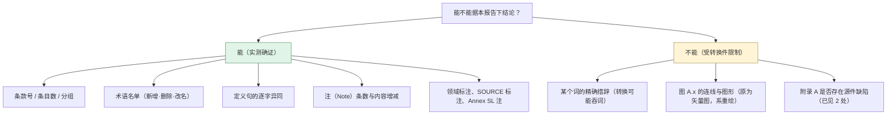
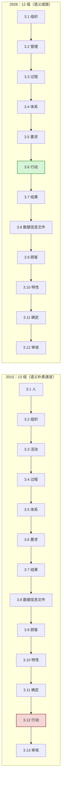
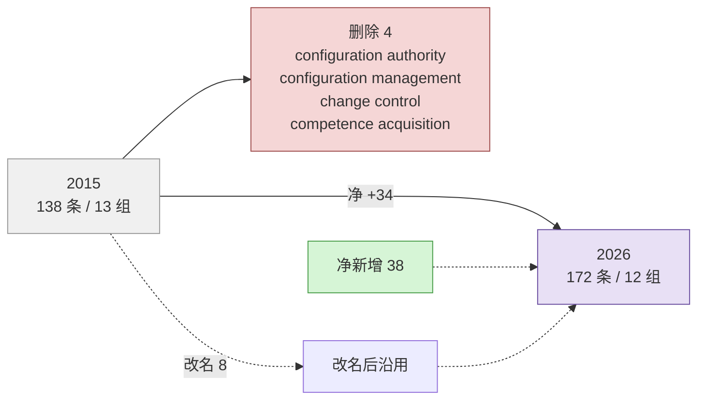
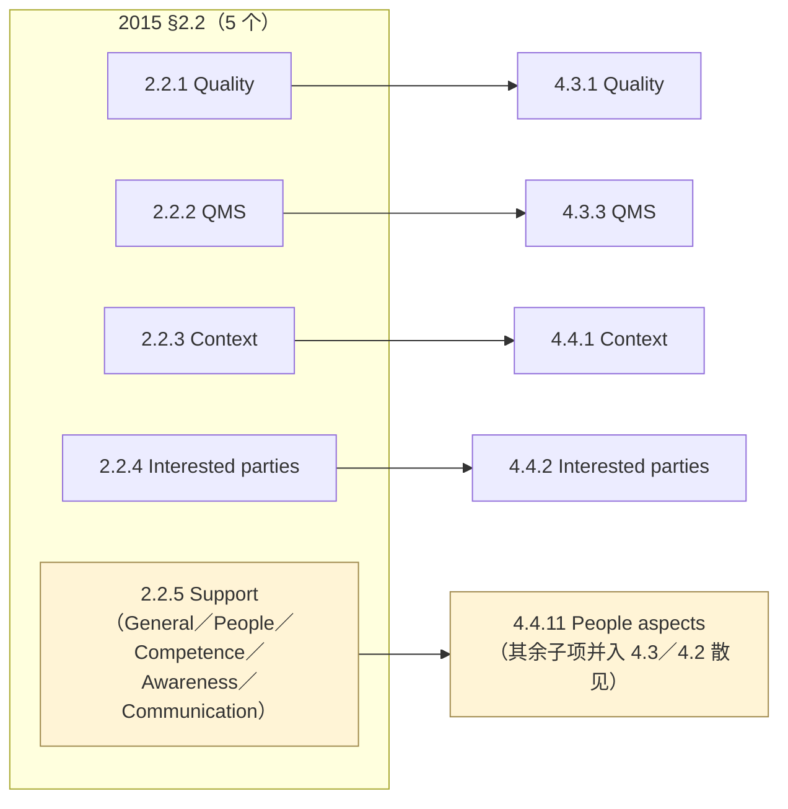
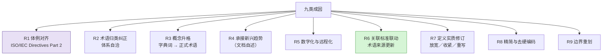

# 27-ISO 9000:2026 相对 2015 版差异研究报告—从全文对照到版本迁移清单

> **范围**：ISO 9000:2026（第 5 版，EN ISO 采纳版英语正文）**相对** ISO 9000:2015（第 4 版，ISO 官方英文电子版）的**全部差异**——结构、术语条目、定义、章 4 概念层、附录 A，以及每一项差异的**成因分析**。
>
> **方法**：**两侧全文逐条机器对照 + 人工判读**。以本目录内两份转换文本为基础——`ISO 9000-2026-质量管理基础和术语-英文版.md`（源 `ISO 9000 2026.docx`，含 CEN 封面与 EN 采纳声明）与 `ISO9000-2015-质量管理体系基础和术语-英文版.md`（源 ISO 官方英文电子版 PDF，58 页）。条款号、条目数、术语名单、定义字样比对**全部为实测**，非二手转述。
>
> **适用**：版本迁移影响评估（接地 26 号报告的未结项）、教材/培训材料的条款级换号与论据复核、术语溯源导航。

---

## ★ 资料性质与合规声明（**先读这一条**）

> **本报告只记"差异"与"条款号"，不录定义正文。**

三条边界：

1. **不录定义正文**——凡涉及定义差异，本报告只摘取**区别性词句**（如 `documented`、`objective`、`outcome`→`result`），不复述整句定义。条款号是事实性元数据，定义措辞是受版权保护的表达，两者必须分开。
2. **比对对象是转换件，不是正版**——两份 md 分别由 DOCX 与 PDF 转换而来，**转换有损耗**（本报告已定位 2 处，见附 D）。凡结论依赖某个词的有无者，正版在手时仍应抽验。
3. **文件状态提示**：两份全文 md 及其源 DOCX/PDF 已于 2026-09-12 连同 26 号报告一并入库（提交 `be0ac7a2`、`a9a6176f`）。这与 26 号报告 §7.3 声明的"ISO 9000:2026 不进版本管理"口径**已不一致**。此处只作事实记录，是否调整入库口径由用户决定，本报告不代为处置。

> **使用姿势**：本报告是 26 号报告（导航图）的**续篇与校正篇**——26 号回答"新版有什么、在哪"，本报告回答"**与旧版差在哪、为什么差**"，并把 26 号里靠二手来源写下的存疑项**逐条结清或更正**。

---

## 0. 一行结论（TL;DR）

| 维度 | 2015 | 2026 | 性质 |
|---|---|---|---|
| 标题 | Quality management **systems** — … | Quality management — … | **去 "systems"**，域扩到质量管理全域 |
| 章结构 | 1、2（基本概念与原则）、3、附录 A | 1、2（规范性引用）、3、**4（质量管理基础）**、附录 A | **§2→§4**，章号整体变动 |
| 术语分组 | **13 组**（3.1~3.13） | **12 组**（3.1~3.12） | 撤销"人"组与"活动"组，新立"管理"组 |
| 术语条目 | **138 条** | **172 条** | 净 +34：新增 38、删除 4、改名 8 |
| 定义 | — | — | 共有 126 条中 **95 条（75%）逐字未变**，31 条（24%）有变动 |
| 概念（章 2/4） | **5 个** | **22 个**（基本 10 + 附加 12） | 框架重建 |
| 附录 A | 16 图，**图内重复定义** | 15 图，**图内不含定义** | 图依新增术语重构 |
| Annex SL 通用术语注 | **21 处** | **0 处** | 系统性删除 |
| SOURCE 来源标注 | **45 处**（其中 43 处来自自家 10000 系列/19011） | **6 处**（**全部**来自家族外标准） | 定义权收回本体 |
| 领域标注（subject field） | 7 类 19 处 | 13 类 44 处 | 新增"财务与经济收益""组织变更管理""质量文化"等 8 类 |
| **最重的一条** | — | — | **audit 定义删掉 `documented` 与 `objective` 两个限定词** |
| **最反直觉的一条** | — | — | 4.5.2 把"有形与无形证据"**改成**"客观证据"——与 audit 的放宽**方向相反** |
| **最需辟谣的一条** | — | — | 外部流传的"新增人工智能/大数据/物联网/区块链术语"**不成立**，全文零命中 |

**一句话**：这不是一次改写，是一次**重排 + 补新 + 定点修订**——四分之三的定义原封不动，但**条款号几乎全表失效**（138 条中仅 9 条保持原号）、**分组归类大范围调整**、**audit 一条有实质放开**。

---

## 1. 文本基础与比对方法

### 1.1 两侧文本

| | 2015 侧 | 2026 侧 |
|---|---|---|
| 文件 | `ISO9000-2015-质量管理体系基础和术语-英文版.md` | `ISO 9000-2026-质量管理基础和术语-英文版.md` |
| 源件 | ISO 官方英文电子版 PDF（58 页） | `ISO 9000 2026.docx`（CEN 采纳版，含封面与 Endorsement notice） |
| 正题 | Quality management systems — Fundamentals and vocabulary | Quality management — Fundamentals and vocabulary |
| 版次 | 第四版（2015-09-15），替代 2005 | 第五版（2026-05，CEN 2026-05-14 通过），替代 2015 |
| 篇幅 | 正文 1~13 章 + 附录 A（16 图）+ 参考文献 + 索引 | 正文 1~4 章 + 附录 A（15 图）+ 参考文献 + 索引 |

### 1.2 可比性边界：本报告能证什么、不能证什么

**实测口径的可靠性**：2015 侧 138 条条目、2026 侧 172 条条目**全部抓取成功**（定义句覆盖率 138/138 与 172/172），故"定义逐字比对"覆盖**全部 126 条共有术语**，无抽样偏差。这是本报告与 26 号报告的分水岭——26 号的 2015 侧依据是**子项目既存中文口径**，本报告是**英文原文对英文原文**。

### 1.3 四项机械统计口径（后文反复引用）

| 统计项 | 2015 | 2026 | 说明 |
|---|---|---|---|
| 术语条目数 | **138** | **172** | `#### 3.x.y` 标题计数 |
| 术语分组数 | **13**（3.1~3.13） | **12**（3.1~3.12） | 组标题计数 |
| 共有术语 | — | **126** | 按名称匹配（含 8 处改名经映射后匹配） |
| 定义字面一致 | — | **95 / 126 = 75%** | 剔除交叉引用号后逐字比对 |

> **术语总数三说结清**：26 号报告 §5.1 曾并列 170 / 172 / 184 三说，§9.4 P2 又提到"实测提取到 160 个不同条款号"。**现实测为 172 条（2026）**，最大条款号 `3.12.18`。26 号 §9.2 相邻术语表记"`3.12.1`~`3.12.18`"正确；"170"与"184"两说排除。
>
> **2015 侧的「146」之谜也解开了**：138 条编号条目 + 8 个 admitted term（索引中单列的别名条目：configuration control board、dispositioning authority、entity、item、external supplier、supplier、stakeholder、dispute resolution process provider）= **146 个索引项**。所以"146 → 172"的说法两边口径不同（146 含别名，172 不含），**并非同一口径下的增长**。

---

## 2. 结构性差异（7 项）

### 2.1 标题去掉 "systems"

| | 标题 |
|---|---|
| 2015 | Quality management **systems** — Fundamentals and vocabulary |
| 2026 | Quality management — Fundamentals and vocabulary |

**文档自述的理由**（Foreword）：改为 "to better represent the enhanced content"。

**实质含义**：旧版的定位是"**QMS 这条例外的标准**"，新版是"**质量管理这门学科的标准**"。这一改动与另外两处联动，构成同一个动作的三面：

1. **适用范围扩张**——第 1 章适用主体从"QMS 标准用户"扩到"质量管理全域参与者"（组织／顾客／供应链／共同术语的使用者／对 ISO 9001 做合格评定的组织／培训评估咨询提供方／相关标准开发者）。
2. **词汇适用面收窄**——引言同时声明"**不收录行业特定术语**"，而 2015 是覆盖"基于之的行业特定 QMS 标准"的。见 §2.7。
3. **不再为 Annex SL 记账**——取消全部通用术语注（§2.6）。

### 2.2 章序重排：§2 基本概念与原则 → §4

| | 2015 | 2026 |
|---|---|---|
| §1 | Scope | Scope |
| §2 | **Fundamental concepts and quality management principles** | **Normative references**（空——"There are no normative references in this document."） |
| §3 | Terms and definitions | Terms and definitions |
| §4 | — | **Fundamentals of quality management** |
| 附录 A | Concept relationships … | Concept relationships …（不变） |

**文档自述的理由**：*"to align with the structure in the ISO/IEC Directives, Part 2"*——ISO/IEC 导则第 2 部分规定管理体系标准的固定章序为"1 范围 / 2 规范性引用 / 3 术语和定义 / 4 后续技术内容"。2015 把内容塞在第 2 章，属**体例不合规的遗留**，2026 纠正之。

**代价**：**这是本次迁移最大的机械成本来源。** 2015 侧的 §2.2.x / §2.3.x / §2.4.x 引用全部失效（本子项目对 §2.3 七原则、§2.4 QMS 模型有引用）。对照关系：

| 2015 | 2026 |
|---|---|
| §2.1 General | §4.1 General |
| §2.2 Fundamental concepts（5 个） | §4.3（10 个）+ §4.4（12 个） |
| §2.3 Quality management principles（七项） | §4.2（七项，4.2.2~4.2.8） |
| §2.4 Developing the QMS（2.4.1~2.4.3） | §4.5（4.5.1~4.5.3） |

### 2.3 术语分组：13 组 → 12 组（**撤销两组、新立一组**）

| | 2015 组标题 | | 2026 组标题 |
|---|---|---|---|
| 3.1 | Terms related to **person or people** | 3.1 | Terms related to **organization** |
| 3.2 | Terms related to **organization** | 3.2 | Terms related to **management** |
| 3.3 | Terms related to **activity** | 3.3 | Terms related to **process** |
| 3.4 | Terms related to **process** | 3.4 | Terms related to **system** |
| 3.5 | Terms related to **system** | 3.5 | Terms related to **requirement** |
| 3.6 | Terms related to **requirement** | 3.6 | Terms related to **action** |
| 3.7 | Terms related to **result** | 3.7 | Terms related to **result** |
| 3.8 | Terms related to **data, information and document** | 3.8 | Terms related to **data, information and documents**（复数） |
| 3.9 | Terms related to **customer** | 3.9 | Terms related to **customer** |
| 3.10 | Terms related to **characteristic** | 3.10 | Terms related to **characteristic** |
| 3.11 | Terms related to **determination** | 3.11 | Terms related to **determination** |
| 3.12 | Terms related to **action** | 3.12 | Terms related to **audit** |
| 3.13 | Terms related to **audit** | — | — |

**净变化 = 13 − 2（撤"人"组、"活动"组）+ 1（立"管理"组）= 12。**

**最值得点出的一处**：`action` 组在 2015 被搁在**倒数第二位**（3.12，紧随"确定"之后），2026 把它**前提到第 6 位**（3.6），使组序读成：

> 组织 → 管理 → 过程 → 体系 → **要求 → 行动 → 结果** → 数据/信息/文件 → 顾客 → 特性 → 确定 → 审核

即 **"要求—行动—结果"三组连成一条因果链**。2015 的组序里"行动"是孤悬的，这是 2026 组序最实质的**语义改进**，不是随意挪位。

### 2.4 章 4 概念：5 个 → 22 个

见 §5 详述。此处只记事实：

| | 2015 §2.2 | 2026 |
|---|---|---|
| 数量 | **5**（Quality、QMS、Context、Interested parties、Support） | **22**（§4.3 基本 10 + §4.4 附加 12） |
| 分层 | 不分层 | **两层**：§4.3"骨架概念"（每个 QMS 都要用）+ §4.4"语境概念"（有效应用的现代变量） |

**文档自述的理由**：*"additions have been made to the fundamentals, dividing them into two congruent groups … to address emerging trends in quality"*。

**分层理由（原文另有一句）**：§4.1 末尾声明 4.3/4.4 的分组 *"is to enhance readability and understanding of this document without intent to separate the application of the concepts"*——即**分层只为可读性，不表示可以割裂应用**。

### 2.5 附录 A：16 图 → 15 图，且**图内不再重复定义**

| | 2015 | 2026 |
|---|---|---|
| 图数 | **16**（A.1~A.3 关系图 + A.4~A.16 十三张组图） | **15**（A.1~A.3 + A.4~A.15 十二张组图） |
| 图内内容 | **重复该术语的定义**（A.5 原文自述 "the definitions of the terms are repeated without any related notes"） | **不含定义**（A.5 原文自述 "the definitions of the terms are not included in the concept diagrams, it is necessary to refer to Clause 3"） |
| 关系示例 | A.1/A.2 用 season，A.3 用 sunshine/summer/swimming | A.1~A.3 **全部改用 computer mouse**（属种：pointing device→computer mouse；整体部分：optomechanical mouse→mouse button；关联：computer mouse↔mouse pad） |
| 示例来源 | ISO 704:**2009** | ISO 704:**2022** |
| 图的根节点 | 部分为**字典词**：`person <dictionary>`、`activity <dictionary word>`、`result <dictionary word>`、`action <dictionary word>`、`permission <dictionary word>` | 一律为**已定义术语**：3.1.1 organization、3.2.1 management、3.6.1 action、3.7.1 result 等 |

**两条实质含义**：

1. **图从"自足的随身卡片"变成"第 3 章的索引"**——2015 的图可脱离正文独立阅读，2026 的图必须回正文。这与第 3 章的定位提升（"a unified language"）一致。
2. **字典词脚手架被拆掉**——见 §6.4。

### 2.6 著录体例：三处系统性收缩

| 体例项 | 2015 | 2026 | 变化幅度 |
|---|---|---|---|
| **Annex SL 通用术语注**（*"This constitutes one of the common terms and core definitions for ISO management system standards given in Annex SL…"*） | **21 条术语**承载 | **0** | **全部删除** |
| **SOURCE 来源标注** | **45 处** | **6 处** | 减 87% |
| **领域标注**（subject field，尖括号） | 7 类、19 处 | 13 类、44 处 | 类 +6，处 +132% |

**Annex SL 注的 21 个承载条目（2015）**：top management、organization、interested party、continual improvement、process、outsource、management system、policy、requirement、nonconformity、conformity、objective、performance、risk、effectiveness、documented information、competence、monitoring、measurement、corrective action、audit。

**SOURCE 标注的构成（2015，45 处）**：

| 来源 | 处数 | 归属 |
|---|---|---|
| ISO 10001/10002/10003/10004/10005/10006/10007/10012/10018/10019（10000 系列指南） | 30 | **自家**（ISO/TC 176/SC 3） |
| ISO 19011 | 13 | **自家**（ISO/TC 176） |
| ISO 1087-1:2000、IEC 60050-192 | 2 | 家族外 |

**2026 的 6 处 SOURCE——全部是家族外**：ISO 1087:2019（object）、IEC 60050-192:2015（dependability）、ISO/IEC Guide 99:2007（measurement result）、ISO/IEC Guide 76:2020（consumer）、ISO 30400:2022（skill）、ISO/IEC TS 17012:2024（remote auditing method）。

> **读法**：2026 版把"从**自家**指南文件借来的定义"的出处标注**清零**（43 处），只保留"从**家族外**标准借来的"6 处。方向是**定义权收回 ISO 9000 本体**——术语的定义权威在 SC 1 的术语标准，不在各条 10000 系列指南；只有真正外部借用的才依导则标源。

**领域标注新增的 8 类**（2026 独有）：`<financial and economic benefits>`（8 处）、`<organizational change management>`（3）、`<projects>`（5）、`<documentation>`（3）、`<quality culture>`（2）、`<training>`（2）、`<statistical techniques>`（1）、`<business-to-consumer electronic commerce transaction>`（4）。
**消失的 3 类**：`<project management>`（被 `<projects>` 取代）、`<quality management system>`（information system 的标注被撤）、`<quality plan>`（变为 `<quality planning>`）。

### 2.7 适用范围的**一对反向**变动

这是最容易读漏的一条——标题说"扩"，引言说"收"，两者**同时成立**：

| 方向 | 内容 | 出处 |
|---|---|---|
| **扩** | 第 1 章适用主体从"QMS 标准用户"扩到"质量管理全域参与者"（7 类） | §1 Scope |
| **收** | 引言声明**不收录行业特定（sector-specific）术语**；2015 则是"覆盖**基于之的行业特定 QMS 标准**" | Introduction |

即：**学科面扩了，词汇面收窄了。** 2026 的术语表只服务"ISO/TC 176 开发的全部质量管理文件与 QMS 标准"，不再为派生其上的行业标准背书。

另有一处**位置迁移**：2015 把"适用于任何规模、复杂度或业务模式的组织"放在**引言**，2026 移到**第 1 章范围**末尾——属于把声明放进它该在的规范位置。

---

## 3. 术语条目级差异（清单主体）

### 3.1 总量与流量

**账要平**：138 − 4（删除）+ 38（净新增）= **172**。✓

### 3.2 组级映射

| 2015 组 | 2026 组 | 移动 | 说明 |
|---|---|---|---|
| 3.1 person or people | — | **撤销** | 6 条散入 3.1（4 条）与 3.9（1 条），1 条删除 |
| 3.2 organization | **3.1** organization | 号不变 | customer 移出至 3.9；metrological function 移出至 3.11 |
| 3.3 activity | — | **撤销** | 管理类 8 条并入新组 3.2；过程类并入 3.3；配置类移往 3.10；2 条删除 |
| 3.4 process | **3.3** process | **−1** | project 移出至 3.2 |
| 3.5 system | **3.4** system | **−1** | 计量簇 2 条移出至 3.11 |
| 3.6 requirement | **3.5** requirement | **−1** | innovation 移出至 3.1；配置信息移出至 3.10 |
| 3.7 result | **3.7** result | **不变** | **组内整体重排**（objective §3.7.1→§3.7.11、product §3.7.6→§3.7.9） |
| 3.8 data, information and document | **3.8** data, information and documents | **不变** | **组内大改**：verification/validation 移出、configuration status accounting 移出、project management plan 移出 |
| 3.9 customer | **3.9** customer | **不变** | customer 移入；dispute resolver 移入；新增 5 条 |
| 3.10 characteristic | **3.10** characteristic | **不变** | 收编配置管理簇（4 条移入） |
| 3.11 determination | **3.11** determination | **不变** | 收编计量簇（3 条）+ 验证/确认（2 条） |
| 3.12 action | **3.6** action | **−6（前移）** | 语义链重构，见 §2.3 |
| 3.13 audit | **3.12** audit | **−1** | 末组 |

> **注意一个易错点**：`determination` 组两版**都是 §3.11**，但这**不意味着**"这个组没动"。实际上——2015 的 `verification`(§3.8.12) 与 `validation`(§3.8.13) 在**数据组**里，2026 把它们**搬进了确定组**（§3.11.12 / §3.11.14）。26 号报告 §5.2 曾把这写成"测定/判定 §3.8→§3.11，号加三；并吸收原 3.11 组"，**表述有误导**——移动的是**术语**（从数据组迁入确定组），不是**组**（确定组原地未动）。准确说法见本条。

### 3.3 净新增 38 条（按组归置）

| 组 | 条款 | 术语 | 成因 |
|---|---|---|---|
| 3.2 管理 | §3.2.4 | good practice | R4 |
| | §3.2.5 | benchmarking | R4／R6 |
| | §3.2.13 | project organization | R6 |
| | §3.2.16 | project life cycle | R6 |
| | §3.2.17 | project phase | R6 |
| 3.3 过程 | §3.3.3 | process owner `⟨quality culture⟩` | R4 |
| | §3.3.4 | process approach `⟨financial and economic benefits⟩` | R6 |
| | §3.3.5 | workflow `⟨documentation⟩` | **R5**（含 semi-automated／automated workflow 注） |
| | §3.3.7 | change matrix `⟨organizational change management⟩` | R6 |
| | §3.3.8 | aggregation model `⟨organizational change management⟩` | R6 |
| | §3.3.9 | intervention `⟨organizational change management⟩` | R6 |
| | §3.3.10 | people development `⟨training⟩` | R4／R6 |
| 3.4 体系 | §3.4.7 | culture `⟨quality culture⟩` | R4 |
| | §3.4.8 | quality culture | **R4**（与概念 §4.3.9 呼应） |
| | §3.4.13 | economic benefit `⟨financial and economic benefits⟩` | R6 |
| | §3.4.14 | financial benefit `⟨financial and economic benefits⟩` | R6 |
| 3.5 要求 | §3.5.7 | metrological requirement | R6 |
| 3.6 行动 | **§3.6.1** | **action**（无领域标注，是全组根词） | **R3**（概念升格） |
| 3.7 结果 | **§3.7.1** | **result** | **R3**（概念升格） |
| | §3.7.4 | lagging indicator `⟨financial and economic benefits⟩` | R6 |
| | §3.7.5 | leading indicator `⟨financial and economic benefits⟩` | R6 |
| | §3.7.6 | metric `⟨financial and economic benefits⟩` | R6 |
| | §3.7.7 | productivity `⟨financial and economic benefits⟩` | R6 |
| | §3.7.15 | measurement result | R6（源 ISO/IEC Guide 99） |
| 3.8 数据 | §3.8.2 | dashboard `⟨financial and economic benefits⟩` | **R5** |
| | §3.8.3 | statistical technique `⟨statistical techniques⟩` | R6 |
| | §3.8.13 | work instruction `⟨documentation⟩` | R4／R5 |
| | §3.8.15 | form `⟨documentation⟩` | R4 |
| 3.9 顾客 | §3.9.6 | complainant | R7（争议解决链补全） |
| | §3.9.8 | consumer | R6（源 ISO/IEC Guide 76:2020） |
| | §3.9.9 | B2C ECT | **R5** |
| | §3.9.10 | content | **R5** |
| | §3.9.11 | B2C ECT code | **R5** |
| | §3.9.12 | B2C ECT provider | **R5** |
| 3.10 特性 | §3.10.4 | knowledge | **R4** |
| | §3.10.5 | skill `⟨training⟩` | R6（源 ISO 30400:2022） |
| 3.11 确定 | §3.11.10 | measurement service | R6 |
| 3.12 审核 | **§3.12.18** | **remote auditing method** | **R5**（源 ISO/IEC TS 17012:2024） |

**结构性看点**：
- **`⟨financial and economic benefits⟩` 是新增的最大簇（8 条）**——全部对应 ISO 10014《质量管理体系—组织质量结果的实现—财务与经济收益实现指南》修订后的内容：metric、lagging/leading indicator、productivity、dashboard、economic/financial benefit、process approach。
- **组织变更管理簇（3 条）**——对应 `ISO/TS 10020`（引用文献 [8]）。
- **B2C 电子商务簇（4 条）**——对应 ISO 10008，且是**首次**以完整簇形态进入 9000 术语表（2015 仅在参考文献列了 ISO 10008，未立术语）。
- **"字典词"升格为正式术语 2 条**（action、result）——见 §6.4。

### 3.4 删除 4 条

| 2015 条款 | 术语 | 归属组 | 成因 | 判断 |
|---|---|---|---|---|
| §3.1.5 | configuration authority | 人 | **R6** | 配置管理体系重构后，配置决策组织不再是 9000 该管的层 |
| §3.3.9 | configuration management | 活动 | **R6** | 定义权交回 ISO 10007；9000 只保留"配置信息"簇 |
| §3.3.10 | change control | 活动 | **R6** | 同上；且与新增的 §4.4.7 "变更管理"概念职能重叠 |
| §3.4.4 | competence acquisition | 过程 | **R7** | 与 §3.10.6 competence 定义（"apply knowledge **and skills**"）重复——能力定义已内含获取 |

> **只有 4 条真删除，不是"大删大砍"。** 且 3 条集中在配置管理，属**单一来源的整簇重构**，不是分散的术语淘汰。

### 3.5 改名 8 条

| # | 2015 | 2026 | 类型 |
|---|---|---|---|
| 1 | configuration object §3.3.13 | **configuration item** §3.10.9 | **实质改名**（object→item） |
| 2 | product configuration information §3.6.8 | **configuration information** §3.10.10 | **实质改名**（去 "product"，扩到服务） |
| 3 | audit findings §3.13.9 | **audit finding** §3.12.16 | **实质改名**（复数→单数） |
| 4 | outsource (verb) §3.4.6 | **outsource, verb** §3.3.12 | 著录格式 |
| 5 | provider §3.2.5 | **provider supplier** §3.1.9 | 别名并入标题行 |
| 6 | interested party §3.2.3 | **interested party stakeholder** §3.1.4 | 同上 |
| 7 | external provider §3.2.6 | **external provider external supplier** §3.1.10 | 同上 |
| 8 | quality management system §3.5.4 | **quality management system QMS** §3.4.9 | 缩写并入标题行 |

> **前 3 条需在子项目内做术语替换检查**：凡引用"configuration object""product configuration information""audit findings"的段落，须改词。
>
> **插入一个 26 号的更正**：26 号 §9.2 的"相邻术语（实测）"表把 **`quality management system` 记为 §3.1.13** 并加了警示"落在组织组而非体系组，与直觉不符"。**该条实为提取截断所致——§3.1.13 是 `quality management system consultant`（QMS 咨询师）。真正的 QMS 是 §3.4.9，在体系组内，与直觉一致。** 该警示可以撤销。

---

## 4. 定义级差异（清单主体）

### 4.1 实测总量

对 **126 条共有术语**做定义句逐字比对（剔除句内交叉引用号）：

| 结果 | 条数 | 占比 |
|---|---|---|
| **定义逐字未变** | **95** | **75.4%** |
| 定义有字面变动 | **31** | 24.6% |

**31 条变动再分两类**：

| 类 | 条数 | 内容 |
|---|---|---|
| **A. 语义性改动** | ~20 | 增删限定词、改写、拆分、收窄 |
| **B. 仅措辞／引用号／领域标注** | ~11 | configuration 三连、measuring equipment（标点）、customer service（the→an）、customer（could→can）、feedback（去冠词）、dispute／dispute resolver（DRP-provider 全称展开）、project management plan（the→a）、progress evaluation／specific case（领域标注与冠词）、rework（"the requirements"→"requirements"） |

**31 条全名单**：
activity、audit、audit conclusion、audit criteria、audit programme、configuration、configuration baseline、configuration status accounting、context of the organization、corrective action、customer、customer service、dispute、dispute resolver、feedback、management system、measurement management system、measuring equipment、metrological function、monitoring、observer、preventive action、process、progress evaluation、project、project management plan、quality manual、quality plan、quality planning、rework、specific case

### ★★ 4.2 一条结论先行：**"逾百条定义被修订"不成立**

26 号报告 §5.3 把"据称逾百条既有定义被修订"列为**待核实**，理由是"仅见于单一二手来源"。**现可判定：该说法不成立。**

**证据链**：
- 2015 的 138 条术语中，只有 **126 条**被 2026 沿用（其余 4 删 8 改名，改名的 8 条已计入 126）。
- 这 126 条里，**95 条定义逐字未变**（75%）。
- 即便假设 26 号未覆盖的部分全部改写，**上限也只有 31 条**——离"逾百"差三倍。
- 若把 38 条净新增也算作"修订过的定义"，总计 31 + 38 = **69 条**，仍不过百。

> **对子项目的意义**：教材与培训材料里**逐条转述的术语定义，四分之三是安全的**。需要复核的是那 31 条的引用点，而不是"全部定义"。

### 4.3 六条结构性重写（**逐条讲**）

六条的定义被整句重写，需逐条评估影响。

| # | 术语 | 2015 → 2026 的实质 | 成因 |
|---|---|---|---|
| 1 | **quality manual** §3.8.8→§3.8.9 | **上位概念换了**：从"**specification**（规范）for the QMS"改为"**documented information**（成文信息）describing the organization… and specifying its QMS"。质量手册不再是"一种规范"，而是"一种成文信息" | R7 |
| 2 | **quality plan** §3.8.9→§3.8.10 | **构成要素换了**：从"**procedures** … to be applied **when and by whom**"改为"**actions, responsibilities** and associated resources"。且**三条注全删**（含"质量计划通常是质量策划的结果之一"这条——该注被**降级**为 §3.2.6 quality planning 的隐含关系） | R7／R8 |
| 3 | **quality planning** §3.3.5→§3.2.6 | "specifying necessary **operational processes**" → "specifying **processes necessary for providing products and services**"。即从"运作过程"改到"产品服务的交付过程"，**与 §4.3.6 质量策划的正文对齐** | R7 |
| 4 | **measurement management system** §3.5.7→§3.11.5 | 从"set of interrelated or interacting **elements** necessary to achieve **metrological confirmation and control of measurement processes**"改为"**management system with regard to measurement**"。即**归入标准句式**（与 QMS、QPolicy 同构） | R7／R2 |
| 5 | **project** §3.4.2→§3.2.11 | **长定义拆家**：定义句只留"unique process undertaken to achieve an objective"，把"a set of coordinated and controlled activities with start and finish dates… the constraints of time, cost and resources"**降为注 1** | R1（著录体例） |
| 6 | **process** §3.4.1→§3.3.1 | 两处：① "that **use** inputs" → "that **uses or transforms** inputs"；② "deliver **an intended result**" → "deliver **a result**"。① 把"转换型过程"（制造）纳入；② 与新增的 §3.7.1 result 定义对接，**去掉 "intended"** | R3／R7 |

> **第 6 条值得展开**：2015 的 process 定义带 "intended"，而同条注 6 又自承"定义已被修改以避免 process 与 output 的循环"。2026 的解法是**另立 §3.7.1 result 作为上位术语**，process 直接交付 result，循环自然消解。这是"用新术语解旧结"的典型手法。

### ★★ 4.4 三条"限定词增删"——**audit 是最重的一条**

| 术语 | 增/删 | 具体 |
|---|---|---|
| **audit** §3.13.1→§3.12.1 | **删 2 词** | ① 过程性质：`systematic, independent and **documented** process` → `systematic and independent process`；② 所获证据：obtaining **`objective`** evidence（并交叉引用 §3.8.3） → obtaining **evidence**（**无交叉引用**） |
| **monitoring** §3.11.3 | **定义收窄** | 2015 定义含"…a **product**, a **service**, or an activity"；2026 定义只到"a system, a process or an activity"，product／service 被**降为注 2** |
| **audit criteria** §3.13.7→§3.12.14 | **定义收窄** | 2015："set of **policies, procedures or** requirements used as a reference…"；2026："set of **requirements** used as a reference…"。policies／procedures 被**降为注 2**（"Requirements may include policies, procedures, work instructions, legal requirements, contractual obligations"） |

**audit 两处删除的读法（承 26 号 §9.2.1 专项，此处补完整）**：

1. **`documented` 删除** → 2015 要求审核是"文件化的"过程，2026 不再要求。**审核过程本身是否落纸，不再由定义强制。**
2. **`objective` 删除** → 2026 只说取得"证据"，且**丢掉了对 objective evidence 的交叉引用**。注意 `objective evidence` **在 2026 中仍然存在**（§3.8.6），并在**验证/确认**的定义里照常使用——**唯独审核这一条不再用它**。
3. **评价仍须客观**（`evaluating it objectively` 保留）——**被评价的证据不再被限定为"客观"**。

**定义之外，audit 的注也被重构**（2015 五注 → 2026 六注），其中一处是**实质替换**：

| | 2015 §3.13.1 注 1 | 2026 §3.12.1 注 3 |
|---|---|---|
| 独立性判据 | "carried out by **personnel not being responsible for the object audited**" | "carried out by **people selected to ensure impartiality and objectivity of the audit process**" |

即**从"与被审对象无责任关系"的负向排除，改为"经甄选以保证公正与客观"的正向要求**。这是一条容易被漏掉的定义外实质变更。

> **对子项目的影响（与 26 号口径一致）**：凡以"审核是文件化过程"或"审核须取得客观证据"立论的段落需复核。26 号点名的**教材 ch13（受控分级）、ch8（评审/验证/确认）与培训材料对应单元**仍是重点排查位；本报告**新增**一处——**凡引用 audit 独立性判据的段落，须改按"公正与客观的甄选"口径重述**。

### ★ 4.5 一条方向相反的变动：4.5.2 的证据口径反而收紧

| | 2015 §2.4.2 | 2026 §4.5.2 |
|---|---|---|
| 审计证据 | "**tangible and intangible** evidence needs to be collected" | "**objective** evidence should be collected" |

**注意这一条的方向**：在第 3 章 audit 定义**放开**"客观证据"要求的同时，第 4 章 4.5.2 反而把"有形与无形证据"**收紧为"客观证据"**。

**两处并不矛盾**，因为**规范层级不同**：
- **§3.12.1 是术语定义**——规定"audit 这个词是什么意思"，属**描述性**；
- **§4.5.2 是基础指导**——指导"审核怎样才能有效"，属**规范性建议**（用 should）。

**但实务上会造成阅读困惑**，需在教材里说明。这是本次版本中**唯一一处"同一版内两处口径张力"**，值得单独提示。

### 4.6 其余语义性改动（速览表）

| 术语 | 改动 |
|---|---|
| activity | 重写："smallest identified **object of work in a project**" → "**identified piece of work that is required to be undertaken to complete a project**"；领域标注 `<project management>`→`<projects>` |
| audit conclusion | "**outcome** of an audit" → "**result** of an audit"（术语统一到 §3.7.1 result） |
| audit programme | 增"**arrangements for** a set of one or more audits…" |
| context of the organization | "approach to **developing** and achieving its objectives" → "approach to **specifying** and achieving its objectives" |
| corrective action | "the **cause**" → "the **cause(s)**"；注 1（"可能不止一个原因"）**删除** |
| management system | "and processes to achieve" → "**as well as** processes to achieve"；注由 4 条扩为 5 条（原注 2 长句**拆为两条**，并新增"An organization manages its interrelated elements in an orderly manner…"） |
| metrological function | "**functional unit** with administrative and technical responsibility…" → "**function** with…"；且**从组织组迁到确定组** |
| observer | "**person** who accompanies the audit team but does not act as an auditor" → "**individual** who… **nor a technical expert**"；注 1 **删除** |
| preventive action | "the cause of a potential nonconformity or **other potential undesirable situation**" → "the cause(s) of a potential nonconformity or **a potential undesired situation**" |
| **technical expert**（注） | 注 1 范围扩大：增列 **product、service** 与 discipline |
| **audit scope**（注） | 注 1 增列 **virtual locations** 与 **time period covered**；**新增注 2** 定义 virtual location |
| **audit finding**（注） | 注 3 增列 **risks**（"can lead to the identification of **risks**, opportunities for improvement or recording good practices"） |
| **object**（注） | "**non-material**" → "**immaterial**"；示例重写（"the future state of the organization" → "**unicorn**", "**scientific hypothesis**"） |
| **requirement**（注） | 注 3 的限定词清单增列 **service requirement** |
| **organization**（注） | 注 1 示例清单**删去 association**（避免与 §3.1.8 association 循环）；注 2 改为"若组织是更大实体的一部分…"（**该注系从 2015 的 top management 注 2 迁来**） |
| **top management** | 上述注迁出后，**只剩注 1** |
| **competence** | 注 1（"demonstrated competence is sometimes referred to as **qualification**"）与注 2（Annex SL）**全删**；定义改为引用 §3.10.4 knowledge 与 §3.10.5 skill |
| **documented information** | 注 3（Annex SL）**删除** |
| **document** | 注 3 的换行前移，**内容未变** |
| **design and development** | 注 2 中的**法语同义说明整句删除** |
| **conformity** | 注 1 中的**法语同义说明删除**，只保留"conformance 为同义但已废弃" |
| **specific case** | 领域标注 `<quality plan>` → `<quality planning>`；注 1 重写（改列 process/product/project/contract/**other intended output**） |
| **record** | 注 2（"records need not be under revision control"）**删除** |
| **information system** | 领域标注 `<quality management system>` **删除** |
| **vision / mission** | 领域标注 `<organization>` **删除**（而 success / sustained success / policy / infrastructure 的 `<organization>` 保留） |
| **risk**（注） | 注 3、注 4 中"as defined in **ISO Guide 73:2009, 3.x.x**"**删除** |
| **measurement**（注） | 注 1 引用由"ISO 3534-2"精确到"**ISO 3534-2:2006, 3.2.1**" |

---

## 5. 章 4 概念层差异

### 5.1 5 → 22 的构成

**§4.3 基本质量管理概念（10）**：
质量、质量管理、**质量管理体系（QMS）**、质量保证、质量控制、质量策划、过程管理、**基于风险的思维**、**组织质量文化**、持续改进

**§4.4 附加概念（12）**：
组织环境、相关方、**一体化管理体系**、**循环经济**、**新兴技术**、创新、**变更管理**、**顾客体验**、**知识管理**、**信息管理**、**人的因素**、**业务连续性**

### 5.2 2015 五个概念的落点

**两处值得记的**：
1. **2015 的 5 个概念里，只有 5 条命脉被继承**；其余 **17 个概念是全新的**。
2. **`2.2.5 Support` 的五个子项被打散**：People／Competence／Communication 归入 **4.4.11 People aspects**；**`Awareness`（意识）没有对应概念**——其内容散在 §4.4.11 正文里（"increases awareness and understanding…"），**从概念降为散文**。
3. **§4.4.2 相关方**里出现一句 2015 没有的判断：相关方"**既是机会也是风险**"——"can provide a significant opportunity for organizational sustained success if their needs and expectations are met, and **a risk if they are not**"。

### 5.3 七项原则：**名称全同，展开全改**

| # | 原则 | 2015 位置 | 2026 位置 |
|---|---|---|---|
| 1 | Customer focus | §2.3.1 | §4.2.2 |
| 2 | Leadership | §2.3.2 | §4.2.3 |
| 3 | Engagement of people | §2.3.3 | §4.2.4 |
| 4 | Process approach | §2.3.4 | §4.2.5 |
| 5 | Improvement | §2.3.5 | §4.2.6 |
| 6 | **Evidence-based decision making** → **Evidence-based decision-making**（加连字符） | §2.3.6 | §4.2.7 |
| 7 | Relationship management | §2.3.7 | §4.2.8 |

**七项名称稳定**——26 号报告的判断成立。**但每项的"陈述／理由／主要收益／可能行动"四段式全部改写**，差异集中在：

| 原则 | 典型改动 |
|---|---|
| Customer focus | **Key benefits 换血**：删"increased customer value""increased revenue and market share"，改列"**improved customer experience**""**enhanced reputation**"；Possible actions 新增"**determine and address risks and opportunities that can affect customer satisfaction and experience**" |
| Leadership | Possible actions **新增三条**：establish and promote a **quality culture and ethical behaviour**；**encourage risk-based thinking**；ensure leaders at all levels are **positive examples**。"create and sustain… ethical models for behaviour"与"establish a culture of trust and integrity"两句被替换 |
| Engagement of people | 陈述句末尾由"create and deliver **value**"改为"create and deliver **value for customers and other interested parties**"；行动项增"**recognize and acknowledge people's motivation**" |
| Process approach | 理由句"optimize the system"改为"**improve** the system"；收益句"consistent and predictable **outcomes**"改为"**results**"（**术语统一**）；行动项"**monitor**, analyse and evaluate"改为"**measure, monitor**, analyse and evaluate" |
| Improvement | 理由句增"**to manage risks**"；行动项"improvement **projects**"→"improvement **actions**"（**术语统一**） |
| Evidence-based decision-making | 陈述句增"**and lead the organization to improve**"；理由句增"**for the benefit of all the organization's interested parties**"；行动项"data"→"**data and information**"，并新增"**secure and available**" |
| Relationship management | 陈述句由"with **relevant** interested parties, **such as providers**"改为"with **interested parties**"（去掉限定与举例）；行动项增"**regulators, people, communities**"，"investors"取代"employees"；收益句"**quality related** risks"→"**relevant** risks and opportunities"、"a well-managed supply chain"→"**enhanced supply chain management**" |

> **对子项目的影响**：教材/培训材料若逐句转述原则的"收益"或"行动"，**需全文复核**。七项名称可放心引用。

### 5.4 §4.5（原 §2.4）的三处实质变化

| # | 变化 | 内容 |
|---|---|---|
| 1 | **"组织如生命体"比喻被删** | 2015 §2.4.1.1 开篇："Organizations share many characteristics with humans as a **living and learning social organism**…" → 2026 §4.5.1.1："A QMS is **adaptive** and provides structure for processes and activities."（比喻整段消失） |
| 2 | **指南文件清单去硬编码** | 2015 §2.4.3 逐一列出 ISO 10001、10002、10003、10004、10005、10006、10007、10008、10012、10014、10015、10018、10019、ISO/TR 10013、10017、ISO/TS 16949 → 2026 §4.5.2 压缩为"**ISO 10001 to ISO/TS 10020**"并点名 ISO 9001／ISO 9004；同时**首次标注归口"ISO/TC 176/SC 3"** |
| 3 | **审计证据口径收紧** | 见 §4.5——"tangible and intangible evidence" → "**objective evidence**" |

**另有几处小改**：
- 2015 "meet challenges presented by an environment that is **profoundly different from recent decades**" → 2026 "meet the challenges of **ongoing change in both internal and external issues**"；2015 "globalization of markets" → 2026 "**global markets and supply chains, new technologies, information technology, innovation**"（**技术维度显性化**）。
- 2015 "**Society has become better educated and more demanding**, making interested parties increasingly more influential"**整段删除**。
- 2026 §4.5.2 新增一句关于审计目的的完整表述："Auditing is a means of evaluating the effectiveness of the QMS and its implementation, **to identify risks** and to determine the fulfilment of requirements."
- 2026 的 ISO 14001／ISO 45001／ISO/IEC 27001／ISO 50001 并列清单**新增 ISO 45001**（2015 无）。
- 2026 新增"**governance**"一词（§4.5.1.3 "enabling structured governance…"、§4.5.1.4 "…to maintain consistency and governance"）——**仅作散文用词，不是术语条目**（承 26 号 §9.3 结论，此处补上实际位置）。

---

## 6. 差异成因分析

### 6.1 成因总表

| 成因 | 覆盖面 | 最典型落点 |
|---|---|---|
| **R1 体例对齐** | 标题、章序、著录体例、Annex SL 注、SOURCE 标注 | §2→§4；21 处 Annex SL 注清零 |
| **R2 术语归类纠正** | 组撤销／新立、术语归组 | verification/validation 从数据组迁入确定组 |
| **R3 概念升格** | 2 条新术语 + 连带的重排 | action、result |
| **R4 承接新兴趋势** | 概念层 + 术语层 | 循环经济、组织质量文化、知识 |
| **R5 数字化与远程化** | 7 条术语 + 注 | remote auditing method、virtual location |
| **R6 关联标准联动** | 38 条新增中的约 22 条；4 条删除 | 财务与经济收益簇、配置簇重构 |
| **R7 定义实质修订** | 31 条变动中的 20 条 | audit、quality manual、quality plan |
| **R8 精简与去硬编码** | 各注的删除、清单压缩 | 指南清单压成区间；删法语同义说明 |
| **R9 边界重划** | 标题 + 引言的一对反向 | 学科面扩、词汇面收 |

**分布判断**：**R6（关联标准联动）是单一最大的成因**——38 条新增里约 22 条、4 条删除里 3 条、31 条定义变动里 configuration 三连，全部由关联标准（ISO 10007／10014／10015／10006／TS 10020／19011／30400／Guide 76／Guide 99／TS 17012）驱动。**2026 版首先是一次"与 9000 家族各指南对齐"的版本，其次才是一次"回应时代"的版本。**

### 6.2 R1 体例对齐（ISO/IEC Directives Part 2）

**证据**：文档 Foreword 明写两处——

- 章序："the document has been restructured by moving the fundamental concepts and quality management principles from **Clause 2 to Clause 4** to align with the structure in the **ISO/IEC Directives, Part 2**; Clause 2 is now Normative references"
- 标题："the title has been changed … to better represent the enhanced content"

**推论（非文档自述，属解读）**：以下三项同属 R1，但**文档未明说**，系从"结果与导则要求一致"反推——

1. **Annex SL 通用术语注清零（21→0）**：2015 用注标记"哪些是 ISO 管理体系标准的通用术语"。2026 不再记账，方向是**通用术语的维护权已移出 ISO 9000**（归 ISO/IEC 导则体系）。**此条属推断，未见明文。**
2. **SOURCE 标注从 45 缩到 6、且留下的全是家族外来源**：与导则"仅对**外部**借用定义标注来源"的要求一致。
3. **`project` 定义拆句、`audit` 注重排、题名行合并别名**：属导则第 2 部分对术语条目著录格式的规定（定义句应短、注承载细节）。

### 6.3 R2 术语归类纠正（体系自洽）

**这是本次改版里"最讲道理"的一类**——把历史遗留的错误归类改正。

| 移动 | 从 | 到 | 为什么这是纠正 |
|---|---|---|---|
| verification、validation | §3.8 数据/信息/文件组 | §3.11 确定组 | 它们是"**确定**活动"，不是"数据"。2015 把它们放在数据组，是 2005 版遗留的结构错位——数据组只因为"验证要审文件"才收纳了它们 |
| metrological function、metrological confirmation、measurement management system | 组织组／体系组 | §3.11 确定组 | 计量是"确定"的分支，应与 measurement 同组 |
| project management plan | §3.8 数据/信息/**文件**组 | §3.2 管理组 | 它是"项目管理文件"，不是"一般文件"。放在文件组只因它的上位概念是 document |
| progress evaluation | §3.11 确定组 | §3.2 管理组 | 它是"进度**管理**"，不是"确定"活动 |
| customer | §3.2 组织组 | §3.9 顾客组 | 顾客有专组，却把 customer 放在组织组——两版都有此怪，2026 改正 |
| innovation | §3.6 **要求**组 | §3.1 组织组 | 创新是组织能力，不是要求 |
| continual improvement | §3.3 活动组 | §3.1 组织组 | 与 organization 的持续性挂钩 |
| configuration 簇 5 条 | 散在 3.1／3.3／3.6／3.8／3.10 **五组** | 集中到 §3.10 特性组 | **一个概念簇散落五组，是 2015 最严重的归类混乱**，2026 收敛为单组 |

**一个连带结论**：2015 的"活动"组（3.3，13 条）之所以被撤销，是因为它是个**杂项篮子**——同时装着"管理"（management、quality management、project management）、"过程"（无）、"配置"（configuration management、change control）、"改进"（improvement、continual improvement）。2026 把它按语义**分流到 3.2 管理组、3.3 过程组、3.10 特性组**，篮子清空。**同理由，"人"组（3.1，仅 6 条，且根节点是字典词 person）同被撤销。**

### 6.4 R3 概念升格（字典词 → 正式术语）

**现象**：2015 附录 A 的概念图用**字典词**作树根或上位节点——`person <dictionary> individual human`、`activity <dictionary word> doing something`、`result <dictionary word>`、`action <dictionary word> activity to achieve something`、`permission <dictionary word> action of giving formal authority`。**2026 拆掉了这副脚手架。**

| 字典词 | 2026 处置 |
|---|---|
| **action** | **升格为正式术语 §3.6.1**（"activity to achieve something"），并成为行动组（11 条）的**根节点术语** |
| **result** | **升格为正式术语 §3.7.1**（"consequence of something"），并成为结果组的上位术语 |
| **activity** | 2015 已在 §3.3.11 有定义（但为 `<project management>` 领域专用）；2026 保留并重新定义（§3.2.12） |
| person | **不升格**——"人"组整体撤销，无对应术语 |
| permission | **不升格**——2026 图 A.9 仍用"action related to **permission**"作中间概念标签，但**不再给字典定义** |

**连带效应（这是升格最实际的价值）**：`result` 一升格，**一串术语的定义跟着统一到它**——

| 术语 | 2015 | 2026 |
|---|---|---|
| process | deliver **an intended result** | deliver **a result §3.7.1** |
| performance | measurable result | measurable result **§3.7.1** |
| efficiency | relationship between **the result** achieved… | …the **result §3.7.1** achieved… |
| audit conclusion | **outcome** of an audit | **result §3.7.1** of an audit |
| outsource（注）、project、objective… | — | 均已挂 §3.7.1 |

即：**"outcome" 与 "result" 两个词在两版混用，2026 统一到 result。** 凡教材里用 "outcome" 转述 ISO 9000 语境者，宜一并统一。

### 6.5 R4 承接新兴趋势

**文档自述的理由**（Foreword 第三条 main change）：*"additions have been made to the fundamentals, dividing them into two congruent groups … to **address emerging trends in quality**"*。

**落到概念层的三大方向**（26 号 §4 的判断，此处以原文实测校正）：

| 方向 | 概念落点 | 术语落点 |
|---|---|---|
| **数字化／技术** | §4.4.5 新兴技术 | 见 §6.6（R5） |
| **循环经济／可持续** | §4.4.4 循环经济（含"设计消除废物—保持材料在用—再生自然系统"三原则、"take, make, use and dispose"的替代）；§4.4.12 业务连续性 | 无新增术语 |
| **质量文化与伦理** | §4.3.9 组织质量文化（**基本概念**）；§4.4.7 变更管理；§4.4.9 知识管理；§4.4.10 信息管理；§4.4.11 人的因素 | culture §3.4.7、quality culture §3.4.8、process owner §3.3.3、knowledge §3.10.4、people development §3.3.10、good practice §3.2.4、benchmarking §3.2.5 |

**气候维度**：§4.4.1 组织环境的外部议题清单**新增 "impact of climate change"**；§4.4.4 循环经济点名 "climate change, biodiversity loss, waste and pollution"。**这与 ISO 2021 年《伦敦宣言》把气候考量纳入所有标准的决议方向一致。**
**伦理维度**：`ethic*` 词频 2015=2 → 2026=5；`culture` 词频 5 → 29（**六倍**）。

### 6.6 R5 数字化与远程化

**这是"新增术语"中最有辨识度的一簇**——但要注意它的**确切边界**：

| 落点 | 内容 |
|---|---|
| **§3.12.18 remote auditing method**（新术语，源 **ISO/IEC TS 17012:2024**） | 含 3 条注，涵盖"与现场方法结合使用""虚拟场所""同一受审核方的异地审计" |
| audit scope §3.12.12 注 1、注 2 | "**physical and virtual locations**"；首次给出 **virtual location** 的定义（"在线环境中执行过程，不论物理位置"） |
| workflow §3.3.5 注 1 | **semi-automated workflow** 与 **automated workflow** |
| dashboard §3.8.2 | 仪表板（含 traffic light / Pareto / pie / trend charts 示例） |
| §4.4.10 信息管理 | 提及数据完整性、**个人数据**保护、防范**恶意实体**（`cyber`／`privacy` 词频 2015=0 → 2026=1） |
| §4.4.5 新兴技术 | 明示**风险**："The use of emerging technologies can **adversely affect the performance of the QMS** if their impact is not fully understood." |

#### ⚠️ 一处必须辟谣：**AI／大数据／物联网／区块链术语并不存在**

26 号报告 §4 曾据二手来源写："**数字化／新兴技术**：人工智能、大数据、物联网、区块链追溯、电子成文信息、数据溯源、数字化知识管理等首次纳入术语体系"。

**全文实测（2026 侧词频）**：

| 检索词 | 命中 |
|---|---|
| artificial (intelligence) | **0** |
| big data | **0** |
| Internet of Things | **0** |
| blockchain | **0** |
| machine learning | **0** |
| metaverse | **0** |
| data science | **0** |
| digital | **0** |

**结论**：**这七类技术词在 2026 版全文零命中**。2026 处理"新兴技术"的方式是**一个抽象概念（§4.4.5）+ 一条具体术语（remote auditing method）+ 若干注中的数字化形态（virtual location、automated workflow）**，而非罗列技术名词。

> **更正**：26 号 §4 的该段**应作废**。其来源系中文自媒体解读，未经原文核验。**本报告以实测取代之。** 这也是本子项目"二手来源须以原文复核"这条方法论的一次实证。

### 6.7 R6 关联标准联动（**最大成因**）

**逐簇对应表**（术语来源——关联文件——新增条款）：

| 关联文件 | 驱动的新增／改动 | 条款 |
|---|---|---|
| **ISO 10007**（配置管理） | 配置簇重构：**删除** configuration management／change control／configuration authority；**改名** object→configuration item、product configuration information→configuration information；把 configuration status accounting 从 §3.8 迁入 §3.10 | §3.10.8~§3.10.12 |
| **ISO 10014**（财务与经济收益） | **8 条新增**：economic benefit、financial benefit、metric、lagging indicator、leading indicator、productivity、dashboard、process approach | §3.4.13／§3.4.14／§3.7.4~§3.7.6／§3.7.7／§3.8.2／§3.3.4 |
| **ISO/TS 10020**（组织变更管理） | **3 条新增**：change matrix、aggregation model、intervention（标注 `<organizational change management>`） | §3.3.7~§3.3.9 |
| **ISO 10006 / ISO 21500**（项目管理） | **3 条新增**：project organization、project life cycle、project phase；project management plan 从 §3.8 迁入；progress evaluation 从 §3.11 迁入；activity 重定义；领域标注统一为 `<projects>` | §3.2.10~§3.2.17 |
| **ISO 19011:2018/2026** | audit 定义放宽（删 documented／objective）；注重构；audit criteria／scope／finding 的注扩写 | §3.12 全组 |
| **ISO 10015 / ISO 30400**（培训／人力资源） | skill §3.10.5（源 ISO 30400:2022）、people development §3.3.10 | — |
| **ISO 10010**（质量文化） | culture §3.4.7、quality culture §3.4.8、process owner §3.3.3（标注 `<quality culture>`） | — |
| **ISO 10008**（B2C 电子商务） | **4 条新增**：B2C ECT、content、B2C ECT code、B2C ECT provider | §3.9.9~§3.9.12 |
| **ISO/IEC TS 17012:2024**（远程审核） | remote auditing method §3.12.18 | — |
| **ISO/IEC Guide 76:2020** | consumer §3.9.8 | — |
| **ISO/IEC Guide 99:2007**（VIM） | measurement result §3.7.15 | — |
| **ISO 1087:2019** | object 定义的来源更新（1087-1:2000 → 1087:2019） | §3.5.3 |
| **ISO 704:2022** | **附录 A 的关系示例全部改用 computer mouse** | A.1~A.3 |
| **IEC 60050-192:2015** | dependability 的来源版本更新 | §3.5.12 |
| **ISO 9001**（新版 DIS） | 呼应："组织质量文化""循环经济""顾客体验""业务连续性"等概念方向与 9001 修订一致 | §4.3／§4.4 |

**一个副作用是正面的**：2015 的参考文献列到 34 项，含 **ISO/TS 16949**（2016 年撤销，现由非 ISO 体系的 IATF 16949 承担）。**2026 参考文献精简为 20 项，不再引用 16949**，同时所有引用版本号更新到现行。

### 6.8 R7 定义实质修订（放宽／收紧／重写）

| 方向 | 术语 | 判断 |
|---|---|---|
| **放宽** | audit（删 documented、objective） | 与同日发布的 ISO 19011 第 4 版引入远程／虚拟／数字证据的方向一致 |
| **放宽** | monitoring（product/service 移入注） | 定义瘦身，外延未缩（注 2 明确"Monitoring can also determine the status of a product or a service"） |
| **收紧** | audit criteria（policies/procedures 移入注） | 定义从"政策／程序／要求"收为"要求"，但注 2 明确"Requirements **may include** policies, procedures, work instructions…"——**外延亦未缩** |
| **收紧** | §4.5.2 审计证据（tangible and intangible → objective） | **规范层级不同，非定义**，见 §4.5 |
| **重写** | quality manual、quality plan、quality planning、measurement management system、project、process | 见 §4.3 |
| **判据重构** | audit 注 3（独立性由"无责任关系"改为"经甄选保证公正客观"） | 实质 |

**归纳**：**绝大多数"放宽／收紧"是"定义句瘦身、外延不变"**——细节挪到注里，判断边界并未移动。**真正移动了边界的只有 audit 一条**（去 documented）和 **audit 独立性判据**一条。

### 6.9 R8 精简与去硬编码

| 项 | 2015 | 2026 |
|---|---|---|
| 指南文件清单 | 逐一列 16 项（含 ISO/TR、ISO/TS） | 压缩为 "ISO 10001 to ISO/TS 10020" |
| 比喻性表述 | "living and learning social organism" | 删除 |
| 法语同义说明 | design and development 注 2、conformity 注 1 含法语说明 | 删除（单语化） |
| 交叉引用 | risk 注引 ISO Guide 73 具体条款号 | 删除 |
| 冗余注 | competence 注 1、record 注 2、corrective action 注 1 | 删除 |
| 外部链接 | glossary 的裸 URL 写在引言 | 移入参考文献 [19]（ISO 2025 版 Glossary Guidance） |
| 参考文献 | 34 项 | 20 项 |

### 6.10 R9 边界重划

见 §2.7：**学科面扩张**（去 systems、适用主体扩至 7 类）与**词汇面收窄**（不收录行业特定术语）**同时发生**。这不是矛盾，是**标准的角色转换**——从"QMS 生态的中枢"改为"质量管理学科的语言底座"。

---

## 7. 对本子项目的直接影响

### 7.1 26 号报告待核项的结清情况

| 26 号条目 | 原状态 | 本报告结论 |
|---|---|---|
| §5.1 术语总数 170／172／184 三说 | 待核 | **结清：2026 为 172 条**；"146"是 2015 的**索引项**数（138 条 + 8 别名），两侧口径不同 |
| §5.2 3.7~3.12 段条款映射缺失 | 未建立 | **结清**：全 138 条映射已建（附 A） |
| §5.3 "逾百条定义被修订" | 待核 | **否决**：126 条共有术语中仅 31 条有变动，其中语义性约 20 条 |
| §5.4 原则措辞不可据以引用 | 存疑 | **部分结清**：七项**名称**稳定；**四段式展开全部改写**，须全文复核 |
| §9.2 相邻术语表 `quality management system` §3.1.13 | 标注"与直觉不符" | **更正**：§3.1.13 是 **QMS consultant**；QMS 是 §3.4.9，在体系组。**该警示撤销** |
| §9.3 ISO 9000:2026 未收"架构／治理"术语 | 已确证 | **维持**：`architect*` 0 次；`governance` 2 次，**均为散文**（§4.5.1.3、§4.5.1.4），非术语条目 |
| §9.4 P2 术语总数 | 部分收窄 | **完全结清**（见上第 1 行） |
| §9.4 P4 characteristic §3.10.1 | 已结清 | **维持**：2026 实测 §3.10.1，与 2015 同号 |
| §9.4 P5 治理被误挂 | 已确证 | **维持** |
| §9.4 P1 25 号记录的交付物不存在 | 仍待处置 | **本报告不涉**，维持挂账 |
| §9.4 P3 verification 的 2015 条款号矛盾 | 未结清 | **结清**：2015 实测为 **§3.8.12**（非 §3.8.5）。§3.8.5 是 document |
| §4 "新增 AI／大数据／物联网／区块链术语" | 二手来源 | **作废**（见 §6.6） |

### 7.2 26 号报告需更正的三处

1. **§4 "三大新增方向的具体落点"中"数字化／新兴技术"一段**——AI／大数据／物联网／区块链**不存在**，须作废重写。
2. **§9.2 相邻术语表的 `quality management system — §3.1.13`**——正确为 §3.4.9；原警示语（"落在组织组而非体系组"）删除。
3. **§5.2 的"测定/判定组号加三"表述**——改为"**verification／validation 两条术语从数据组迁入确定组；确定组本身组号未动**"。另 §9.2 的"组号迁移实测"表把 verification／validation 标为"组迁移（3.8 → 3.11）"**是正确的**，与 §5.2 的措辞不一，以 §9.2 为准。

### 7.3 引用迁移的总口径建议

按 26 号 §6.3 的 A/B/C 三级，本报告补上**可执行的判定表**：

| 引用形态 | 处置 | 依据 |
|---|---|---|
| **条款号引用**（§3.x.y） | **全表替换**——138 条中仅 **9 条**原号未变（data §3.8.1、complaint §3.9.3、characteristic §3.10.1、quality characteristic §3.10.2、human factor §3.10.3、determination／review／monitoring／measurement §3.11.1~§3.11.4） | 附 A |
| **§2.2／§2.3／§2.4 引用** | 换成 §4.3／§4.4、§4.2、§4.5 | §2.2 |
| **定义性引用**（把定义当论据） | 95 条可直接沿用；**31 条须逐条核**，重点是 audit、quality manual、quality plan、quality planning、measurement management system、project、process | §4.1 |
| **基于分组的论证** | 26 号 §9.2 的 P6（"评审与验证分家"）**仍然失效**——2026 把 review／verification／validation 收进同一 §3.11 组 | §2.3 |
| **基于"文件化审核"或"客观证据"的论证** | **须复核**；另**新增**：基于"审核独立性＝与被审对象无责任关系"的论证亦须改口径（见 §4.4） | §4.4 |
| **术语用词**（configuration object、product configuration information、audit findings） | **须改词**为 configuration item、configuration information、audit finding | §3.5 |
| **"outcome" 与 "result" 混用** | 统一为 **result** | §6.4 |

### 7.4 教材与培训材料的重点排查位（汇总）

| 位点 | 触发原因 |
|---|---|
| ch8（评审／验证／确认） | 分组论证失效 + audit 定义放宽（**P6 未结**） |
| ch13（受控分级） | audit 定义放宽 + 独立性判据重构（**本报告新增**） |
| ch3 / 附录各卡 | 条款号替换（§3.6.4→§3.5.1、§3.7.6→§3.7.9、§3.4.8→§3.3.11、§3.8.12→§3.11.12、§3.8.13→§3.11.14、§3.6.2→§3.5.2） |
| 22 号报告表 1 | 版本原则与 P4／P5 的更正（26 号已提） |
| 引述七项原则"收益／行动"的段落 | 四段式展开全部改写 |
| 引述"组织如生命体"比喻的段落（若有） | 该比喻被删 |
| 用 "outcome" 表述结果的段落 | 术语统一为 result |

---

## 附 A｜全量新旧条款号对照表（138 条）

> **读法**：本表是**迁移施工图**——左列 2015 条款号，右列 2026 条款号。**"删除"4 条无右列。**
> **注意**：右列条款号是事实性元数据，可直接用；左列术语名是本报告的表述，非定义正文。

| 2015 条款 | 术语 | 2026 条款 | 2015 条款 | 术语 | 2026 条款 |
|---|---|---|---|---|---|
| §3.1.1 | top management | §3.1.3 | §3.7.1 | objective | §3.7.11 |
| §3.1.2 | quality management system consultant | §3.1.13 | §3.7.2 | quality objective | §3.7.12 |
| §3.1.3 | involvement | §3.1.5 | §3.7.3 | success | §3.7.13 |
| §3.1.4 | engagement | §3.1.6 | §3.7.4 | sustained success | §3.7.14 |
| §3.1.5 | configuration authority | **删除** | §3.7.5 | output | §3.7.8 |
| §3.1.6 | dispute resolver | §3.9.5 | §3.7.6 | product | §3.7.9 |
| §3.2.1 | organization | §3.1.1 | §3.7.7 | service | §3.7.10 |
| §3.2.2 | context of the organization | §3.1.2 | §3.7.8 | performance | §3.7.3 |
| §3.2.3 | interested party | §3.1.4 | §3.7.9 | risk | §3.7.2 |
| §3.2.4 | customer | §3.9.1 | §3.7.10 | efficiency | §3.7.16 |
| §3.2.5 | provider | §3.1.9 | §3.7.11 | effectiveness | §3.7.17 |
| §3.2.6 | external provider | §3.1.10 | §3.8.1 | data | **§3.8.1**（原号） |
| §3.2.7 | DRP-provider | §3.1.11 | §3.8.2 | information | §3.8.4 |
| §3.2.8 | association | §3.1.8 | §3.8.3 | objective evidence | §3.8.6 |
| §3.2.9 | metrological function | §3.11.6 | §3.8.4 | information system | §3.8.5 |
| §3.3.1 | improvement | §3.2.3 | §3.8.5 | document | §3.8.7 |
| §3.3.2 | continual improvement | §3.1.12 | §3.8.6 | documented information | §3.8.14 |
| §3.3.3 | management | §3.2.1 | §3.8.7 | specification | §3.8.8 |
| §3.3.4 | quality management | §3.2.2 | §3.8.8 | quality manual | §3.8.9 |
| §3.3.5 | quality planning | §3.2.6 | §3.8.9 | quality plan | §3.8.10 |
| §3.3.6 | quality assurance | §3.2.7 | §3.8.10 | record | §3.8.12 |
| §3.3.7 | quality control | §3.2.8 | §3.8.11 | project management plan | §3.2.14 |
| §3.3.8 | quality improvement | §3.2.9 | §3.8.12 | verification | **§3.11.12** |
| §3.3.9 | configuration management | **删除** | §3.8.13 | validation | **§3.11.14** |
| §3.3.10 | change control | **删除** | §3.8.14 | configuration status accounting | §3.10.11 |
| §3.3.11 | activity | §3.2.12 | §3.8.15 | specific case | §3.8.11 |
| §3.3.12 | project management | §3.2.10 | §3.9.1 | feedback | §3.9.2 |
| §3.3.13 | configuration object | §3.10.9 | §3.9.2 | customer satisfaction | §3.9.13 |
| §3.4.1 | process | §3.3.1 | §3.9.3 | complaint | **§3.9.3**（原号） |
| §3.4.2 | project | §3.2.11 | §3.9.4 | customer service | §3.9.7 |
| §3.4.3 | quality management system realization | §3.3.6 | §3.9.5 | customer satisfaction code of conduct | §3.9.14 |
| §3.4.4 | competence acquisition | **删除** | §3.9.6 | dispute | §3.9.4 |
| §3.4.5 | procedure | §3.3.2 | §3.10.1 | characteristic | **§3.10.1**（原号） |
| §3.4.6 | outsource (verb) | §3.3.12 | §3.10.2 | quality characteristic | **§3.10.2**（原号） |
| §3.4.7 | contract | §3.3.13 | §3.10.3 | human factor | **§3.10.3**（原号） |
| §3.4.8 | design and development | **§3.3.11** | §3.10.4 | competence | §3.10.6 |
| §3.5.1 | system | §3.4.1 | §3.10.5 | metrological characteristic | §3.10.7 |
| §3.5.2 | infrastructure | §3.4.3 | §3.10.6 | configuration | §3.10.8 |
| §3.5.3 | management system | §3.4.2 | §3.10.7 | configuration baseline | §3.10.12 |
| §3.5.4 | quality management system | §3.4.9 | §3.11.1 | determination | **§3.11.1**（原号） |
| §3.5.5 | work environment | §3.4.4 | §3.11.2 | review | **§3.11.2**（原号） |
| §3.5.6 | metrological confirmation | §3.11.7 | §3.11.3 | monitoring | **§3.11.3**（原号） |
| §3.5.7 | measurement management system | §3.11.5 | §3.11.4 | measurement | **§3.11.4**（原号） |
| §3.5.8 | policy | §3.4.5 | §3.11.5 | measurement process | §3.11.8 |
| §3.5.9 | quality policy | §3.4.6 | §3.11.6 | measuring equipment | §3.11.9 |
| §3.5.10 | vision | §3.4.10 | §3.11.7 | inspection | §3.11.11 |
| §3.5.11 | mission | §3.4.11 | §3.11.8 | test | §3.11.13 |
| §3.5.12 | strategy | §3.4.12 | §3.11.9 | progress evaluation | §3.2.15 |
| §3.6.1 | object | §3.5.3 | §3.12.1 | preventive action | §3.6.2 |
| §3.6.2 | quality | **§3.5.2** | §3.12.2 | corrective action | §3.6.4 |
| §3.6.3 | grade | §3.5.4 | §3.12.3 | correction | §3.6.3 |
| §3.6.4 | requirement | **§3.5.1** | §3.12.4 | regrade | §3.6.6 |
| §3.6.5 | quality requirement | §3.5.6 | §3.12.5 | concession | §3.6.9 |
| §3.6.6 | statutory requirement | §3.5.5 | §3.12.6 | deviation permit | §3.6.10 |
| §3.6.7 | regulatory requirement | §3.5.8 | §3.12.7 | release | §3.6.11 |
| §3.6.8 | product configuration information | §3.10.10 | §3.12.8 | rework | §3.6.8 |
| §3.6.9 | nonconformity | §3.5.13 | §3.12.9 | repair | §3.6.7 |
| §3.6.10 | defect | §3.5.14 | §3.12.10 | scrap | §3.6.5 |
| §3.6.11 | conformity | §3.5.9 | §3.13.1 | audit | §3.12.1 |
| §3.6.12 | capability | §3.5.10 | §3.13.2 | combined audit | §3.12.2 |
| §3.6.13 | traceability | §3.5.11 | §3.13.3 | joint audit | §3.12.3 |
| §3.6.14 | dependability | §3.5.12 | §3.13.4 | audit programme | §3.12.11 |
| §3.6.15 | innovation | §3.1.7 | §3.13.5 | audit scope | §3.12.12 |
| | | | §3.13.6 | audit plan | §3.12.13 |
| | | | §3.13.7 | audit criteria | §3.12.14 |
| | | | §3.13.8 | audit evidence | §3.12.15 |
| | | | §3.13.9 | audit findings | §3.12.16 |
| | | | §3.13.10 | audit conclusion | §3.12.17 |
| | | | §3.13.11 | audit client | §3.12.4 |
| | | | §3.13.12 | auditee | §3.12.5 |
| | | | §3.13.13 | guide | §3.12.6 |
| | | | §3.13.14 | audit team | §3.12.7 |
| | | | §3.13.15 | auditor | §3.12.8 |
| | | | §3.13.16 | technical expert | §3.12.9 |
| | | | §3.13.17 | observer | §3.12.10 |

**原号未变的条款（仅 9 条）**：§3.8.1 data、§3.9.3 complaint、§3.10.1 characteristic、§3.10.2 quality characteristic、§3.10.3 human factor、§3.11.1 determination、§3.11.2 review、§3.11.3 monitoring、§3.11.4 measurement。
（另有 2 条"号同组不同"的：§3.5.2 quality 与 §3.5.1 requirement 是**新组号**，勿与 2015 的 §3.5.2 infrastructure／§3.5.1 system 混淆——**这是本表最危险的陷阱：同一串号在两版指向完全不同的术语**。）

---

## 附 B｜净新增 38 条速查（按条款号）

| 条款 | 术语 | | 条款 | 术语 |
|---|---|---|---|---|
| §3.2.4 | good practice | | §3.8.2 | dashboard |
| §3.2.5 | benchmarking | | §3.8.3 | statistical technique（别名 statistical method） |
| §3.2.13 | project organization | | §3.8.13 | work instruction |
| §3.2.16 | project life cycle | | §3.8.15 | form |
| §3.2.17 | project phase | | §3.9.6 | complainant |
| §3.3.3 | process owner | | §3.9.8 | consumer |
| §3.3.4 | process approach | | §3.9.9 | B2C ECT |
| §3.3.5 | workflow | | §3.9.10 | content |
| §3.3.7 | change matrix | | §3.9.11 | B2C ECT code |
| §3.3.8 | aggregation model | | §3.9.12 | B2C ECT provider |
| §3.3.9 | intervention | | §3.10.4 | knowledge |
| §3.3.10 | people development | | §3.10.5 | skill |
| §3.4.7 | culture | | §3.11.10 | measurement service |
| §3.4.8 | quality culture | | §3.12.18 | remote auditing method |
| §3.4.13 | economic benefit | | **§3.6.1** | **action** |
| §3.4.14 | financial benefit | | **§3.7.1** | **result** |
| §3.5.7 | metrological requirement | | §3.7.4 | lagging indicator |
| | | | §3.7.5 | leading indicator |
| | | | §3.7.6 | metric |
| | | | §3.7.7 | productivity |
| | | | §3.7.15 | measurement result（别名 result of measurement） |

---

## 附 C｜章 4 概念对照（22 个）

| 2026 条款 | 概念 | 2015 对应 |
|---|---|---|
| §4.3.1 | Quality | §2.2.1（同一概念） |
| §4.3.2 | Quality management | **新** |
| §4.3.3 | Quality management system (QMS) | §2.2.2（同一概念） |
| §4.3.4 | Quality assurance | **新** |
| §4.3.5 | Quality control | **新** |
| §4.3.6 | Quality planning | **新** |
| §4.3.7 | Process management | **新** |
| §4.3.8 | Risk-based thinking | **新**（2015 全文 0 次） |
| §4.3.9 | Organizational quality culture | **新** |
| §4.3.10 | Continual improvement | **新**（2015 仅为术语 §3.3.2） |
| §4.4.1 | Context of an organization | §2.2.3（同一概念） |
| §4.4.2 | Interested parties | §2.2.4（同一概念） |
| §4.4.3 | Integrated management system | **新**（2015 在 §2.4.3 有散文，无概念） |
| §4.4.4 | Circular economy | **新** |
| §4.4.5 | Emerging technologies | **新** |
| §4.4.6 | Innovation | **新**（2015 仅为术语 §3.6.15） |
| §4.4.7 | Change management | **新** |
| §4.4.8 | Customer experience | **新** |
| §4.4.9 | Knowledge management | **新** |
| §4.4.10 | Information management | **新** |
| §4.4.11 | People aspects | **部分继承** §2.2.5 Support |
| §4.4.12 | Business continuity | **新** |

**2015 有而 2026 无对应者**：**§2.2.5.4 Awareness（意识）** ——降为 §4.4.11 正文中的散文表述，不再是概念。

---

## 附 D｜存疑与待核（6 项）

| # | 存疑项 | 性质 | 处置建议 |
|---|---|---|---|
| D1 | **characteristic §3.10.1 注 3 的 a)~f) 六类分类**（physical／sensory／behavioural／temporal／ergonomic／functional）在 2026 转换件中**只有引导句、无列表** | 疑为**转换丢失**（2015 该列表完整） | **不得据本报告判定为"删除"**。正版在手时优先核这一处 |
| D2 | **§4.1 末句** "The grouping of concepts in 4.3 and 4.4 is to enhance readability…" | 2026 转换件的说明自承"第 4 章首句在转换中丢失，已按上下文补为…" | 该句是**转换者的重建**，非原文。引用前须核原文 |
| D3 | **Annex SL 注清零的确切机制** | 本报告 §6.2 的推论（通用术语维护权移出 ISO 9000）**无文档明文** | 待 ISO/IEC Directives Part 2 或 TC 176 决议公开后核实 |
| D4 | **SOURCE 标注收缩的确切规则** | 同上——"仅对外部来源标源"系从结果反推 | 同上 |
| D5 | **31 条定义变动中"语义性"的边界** | 本报告按改动词的性质人工分类（约 20 条语义性／11 条措辞性），**分类边界带主观性** | 审核引用点时应逐条看，不依赖分类 |
| D6 | **2015 侧的 4 条删除是否有"事实上的替代"** | 如 change control 的职能是否被 §3.3.7 change matrix 或 §4.4.7 变更管理承接，属功能判断 | 需结合 ISO 10007、TS 10020 原文 |

---

## 附 E｜本报告未做的事

| # | 待办 | 门槛 |
|---|---|---|
| 1 | **逐条定义的完整措辞对照**（本报告只做"字面异同"判定与区别词摘录，未做全文并排） | 需正版 Redline（ANSI／Techstreet 提供） |
| 2 | 图 A.4~A.15 的**连线差异**逐图核对 | 原图为矢量图，转换件为重绘 |
| 3 | **ISO 9001:2026** 与新版 9000 的联动（概念方向一致的验证） | 需 9001 正式版 |
| 4 | GB/T 19000 征求意见稿的比对（等同采用 ISO 9000:2026） | 待国标进入征求意见（预计 2026 年底~2027 年初） |
| 5 | 子项目 90 个文件、40+ 处条款引用的**实际替换施工** | 无门槛，可依附 A 立即执行 |
| 6 | 26 号报告 §4 与 §9.2 的**更正落笔** | 无门槛，可依 §7.2 立即执行 |

---

> **版本**：v1.0 · 2026-09-13（初版：两侧全文实测对照，建立全 138 条新旧条款号对照表，结清 26 号报告的 6 项待核，更正 3 处）
> **资料基础**：本目录内 ISO 9000:2026（EN ISO 版英语正文转换件）与 ISO 9000:2015（ISO 官方英文电子版 PDF 转换件）**全文实测**；二手来源仅用于对照辟谣（§6.6）
> **关联**：
> - [26-ISO 9000-2026研究报告-结构与术语框架导航图](26-ISO%209000-2026研究报告-结构与术语框架导航图.md)——本报告为其续篇与校正篇
> - [22-架构、概念、属性研究报告—术语权威定义与对照分析](22-架构、概念、属性研究报告—术语权威定义与对照分析.md)——其 ISO 9000:2015 版本依据已过期（26 号已判定，本报告提供迁移数据）
> - [25-设计定义与实现边界对话记录-从方案归属到活动性质](25-设计定义与实现边界对话记录-从方案归属到活动性质.md)——其"组级重排"记录已被本报告修正
