# EN ISO 9000:2026

> **转换说明 / About this file**
> 
> 本文件由 `ISO 9000 2026.docx` 转换生成：正文逐段转为 Markdown；原文中的 15 幅插图（图 A.1–A.15）为矢量绘图与逐词位图，无法直接提取文字，故按原图版面重绘为 **Mermaid** 图。
> 
> **图例（Mermaid 约定）**
> 
> | 原图记号 | Mermaid 写法 | 关系含义 |
> |---|---|---|
> | 扇形/树形连线（无箭头） | `---` | 属种关系（generic） |
> | 耙形连线（无箭头） | `-.-` | 整体–部分关系（partitive） |
> | 有向箭头 | `-->` | 属种关系；Mermaid 中统一为“上位→下位”，原图箭头方向相反（下位→上位） |
> | 双向箭头 | `<-->` | 关联关系（associative） |
> 
> 图中尖括号 `&lt;…&gt;` 为原文的适用领域标注（subject field），如 `<projects>`、`<documentation>`。
> 
> **源文件缺陷（已尽量修补，仍存疑处已标注）**
> 
> 1. 第 4 章首句在转换中丢失，已按上下文补为 “The grouping of concepts in 4.3 and 4.4 is to enhance readability…”。
> 2. 3.6.8 定义中若干词首字母在转换中丢失（onconforming / ervice / equirements），已补全。
> 3. 图 A.10 中 3.7.13、3.7.14 与图 A.11 中 3.8.9–3.8.11 在原文件版面上没有可见连线，故仅列出节点。
> 4. 目录在源文件中为点线制表符（页码不可靠），已替换为按标题层级生成的 Markdown 目录。

---

## 文档信息

| 项 | 内容 |
|---|---|
| 标准号 | EN ISO 9000:2026（等同采用 ISO 9000:2026） |
| 英文正题 | Quality management — Fundamentals and vocabulary |
| 法文正题 | Management de la qualité — Principes essentiels et vocabulaire |
| 德文正题 | Qualitätsmanagement — Grundlagen und Begriffe |
| 发布日期 | May 2026（CEN 于 2026-05-14 通过） |
| ICS | 01.040.03; 03.120.10; 03.100.70 |
| 替代 | EN ISO 9000:2015 |
| 编制 | ISO/TC 176「Quality management and quality assurance」/ SC 1「Concepts and terminology」，与 CCMC 合作 |
| 版权 | © 2026 CEN，保留一切形式与方式的利用权 |

---

## Contents

- [CEN cover page (source lay-out, verbatim)](#cen-cover-page-source-lay-out-verbatim)  
- [European foreword](#european-foreword)  
- [Endorsement notice](#endorsement-notice)  
- [Foreword](#foreword)  
- [Introduction](#introduction)  
- [1 Scope](#1-scope)  
- [2 Normative references](#2-normative-references)  
- [3 Terms and definitions](#3-terms-and-definitions)  
- [3.1 Terms related to organization](#31-terms-related-to-organization)  
- [3.2 Terms related to management](#32-terms-related-to-management)  
- [3.3 Terms related to process](#33-terms-related-to-process)  
- [3.4 Terms related to system](#34-terms-related-to-system)  
- [3.5 Terms related to requirement](#35-terms-related-to-requirement)  
- [3.6 Terms related to action](#36-terms-related-to-action)  
- [3.7 Terms related to result](#37-terms-related-to-result)  
- [3.8 Terms related to data, information and documents](#38-terms-related-to-data-information-and-documents)  
- [3.9 Terms related to customer](#39-terms-related-to-customer)  
- [3.10 Terms related to characteristic](#310-terms-related-to-characteristic)  
- [3.11 Terms related to determination](#311-terms-related-to-determination)  
- [3.12 Terms related to audit](#312-terms-related-to-audit)  
- [4 Fundamentals of quality management](#4-fundamentals-of-quality-management)  
- [4.1 General](#41-general)  
- [4.2 Quality management principles](#42-quality-management-principles)  
- [4.3 Fundamental quality management concepts](#43-fundamental-quality-management-concepts)  
- [4.4 Additional concepts relevant to quality management](#44-additional-concepts-relevant-to-quality-management)  
- [4.5 Developing a QMS using fundamental concepts and principles](#45-developing-a-qms-using-fundamental-concepts-and-principles)  
- [Annex A (informative)](#annex-a-informative)  
- [Concept relationships and their graphical representation](#concept-relationships-and-their-graphical-representation)  
- [A.1 General](#a1-general)  
- [A.2 Generic relation](#a2-generic-relation)  
- [A.3 Partitive relation](#a3-partitive-relation)  
- [A.4 Associative relation](#a4-associative-relation)  
- [A.5 Concept diagrams](#a5-concept-diagrams)  
- [Bibliography](#bibliography)  
- [Index](#index)  

## CEN cover page (source lay-out, verbatim)

EUROPEAN STANDARD NORME EUROPÉENNE

EUROPÄISCHE NORM

EN ISO 9000

May 2026

ICS 01.040.03; 03.120.10; 03.100.70 Supersedes EN ISO 9000:2015

English Version

Quality management - Fundamentals and vocabulary (ISO        9000:2026)

Management de la qualité - Principes essentiels et vocabulaire (ISO 9000:2026)

Qualitätsmanagement - Grundlagen und Begriffe (ISO 9000:2026)

This European Standard was approved by CEN on 14 May 2026.

CEN members are bound to comply with the CEN/CENELEC Internal Regulations which stipulate the conditions for giving this European Standard the status of a national standard without any alteration. Up-to-date lists and bibliographical references concerning such national standards may be obtained on application to the CEN-CENELEC Management Centre or to any CEN member.

This European Standard exists in three official versions (English, French, German). A version in any other language made by translation under the responsibility of a CEN member into its own language and notified to the CEN-CENELEC Management Centre has the same status as the official versions.

CEN members are the national standards bodies of Austria, Belgium, Bulgaria, Croatia, Cyprus, Czech Republic, Denmark, Estonia, Finland, France, Germany, Greece, Hungary, Iceland, Ireland, Italy, Latvia, Lithuania, Luxembourg, Malta, Netherlands, Norway, Poland, Portugal, Republic of North Macedonia, Romania, Serbia, Slovakia, Slovenia, Spain, Sweden, Switzerland, Türkiye and United Kingdom.

EUROPEAN COMMITTEE FOR STANDARDIZATION  COMITÉ EUROPÉEN DE NORMALISATION  EUROPÄISCHES KOMITEE FÜR NORMUNG

CEN-CENELEC Management Centre:  Rue de la Science 23,  B-1040 Brussels

© 2026 CEN      All rights of exploitation in any form and by any means reserved Ref. No. EN ISO 9000:2026 E worldwide for CEN national Members.

Contents Page

# European foreword

This document (EN ISO 9000:2026) has been prepared by Technical Committee ISO/TC 176 "Quality management and quality assurance" in collaboration with CCMC.

This European Standard shall be given the status of a national standard, either by publication of an identical text or by endorsement, at the latest by November 2026, and conflicting national standards shall be withdrawn at the latest by November 2026.

Attention is drawn to the possibility that some of the elements of this document may be the subject of patent rights. CEN shall not be held responsible for identifying any or all such patent rights.

This document supersedes EN ISO 9000:2015.

This document has been prepared under a standardization request addressed to CEN by the European Commission. The Standing Committee of the EFTA States subsequently approves these requests for its Member States.

Any feedback and questions on this document should be directed to the users’ national standards body/national committee. A complete listing of these bodies can be found on the CEN website.

According to the CEN-CENELEC Internal Regulations, the national standards organizations of the following countries are bound to implement this European Standard: Austria, Belgium, Bulgaria, Croatia, Cyprus, Czech Republic, Denmark, Estonia, Finland, France, Germany, Greece, Hungary, Iceland, Ireland, Italy, Latvia, Lithuania, Luxembourg, Malta, Netherlands, Norway, Poland, Portugal, Republic of North Macedonia, Romania, Serbia, Slovakia, Slovenia, Spain, Sweden, Switzerland, Türkiye and the United Kingdom.

## Endorsement notice

The text of ISO 9000:2026 has been approved by CEN as EN ISO 9000:2026 without any modification.

CEN members are the national standards bodies of Austria, Belgium, Bulgaria, Croatia, Cyprus, Czech Republic, Denmark, Estonia, Finland, France, Germany, Greece, Hungary, Iceland, Ireland, Italy, Latvia, Lithuania, Luxembourg, Malta, Netherlands, Norway, Poland, Portugal, Republic of North Macedonia, Romania, Serbia, Slovakia, Slovenia, Spain, Sweden, Switzerland, Türkiye and United Kingdom.

---

# ISO 9000:2026(en)

**International Standard**

## Quality management — Fundamentals and vocabulary

---

# Foreword

ISO (the International Organization for Standardization) is a worldwide federation of national standards bodies (ISO member bodies). The work of preparing International Standards is normally carried out through ISO technical committees. Each member body interested in a subject for which a technical committee has been established has the right to be represented on that committee. International organizations, governmental and non-governmental, in liaison with ISO, also take part in the work. ISO collaborates closely with the International Electrotechnical Commission (IEC) on all matters of electrotechnical standardization.

The procedures used to develop this document and those intended for its further maintenance are described in the ISO/IEC Directives, Part 1. In particular, the different approval criteria needed for the different types of ISO document should be noted. This document was drafted in accordance with the editorial rules of the ISO/IEC Directives, Part 2 (see www.iso.org/directives).

ISO draws attention to the possibility that the implementation of this document may involve the use of (a) patent(s). ISO takes no position concerning the evidence, validity or applicability of any claimed patent rights in respect thereof. As of the date of publication of this document, ISO had not received notice of (a) patent(s) which may be required to implement this document. However, implementers are cautioned that this may not represent the latest information, which may be obtained from the patent database available at www.iso.org/patents. ISO shall not be held responsible for identifying any or all such patent rights.

Any trade name used in this document is information given for the convenience of users and does not constitute an endorsement.

For an explanation of the voluntary nature of standards, the meaning of ISO specific terms and expressions related to conformity assessment, as well as information about ISO’s adherence to the World Trade Organization (WTO) principles in the Technical Barriers to Trade (TBT), see www.iso.org/iso/foreword.html.

This document was prepared by Technical Committee ISO/TC 176, Quality management and quality assurance, Subcommittee SC 1, Concepts and terminology, in collaboration with the European Committee for Standardization (CEN) Technical Committee, in accordance with the Agreement on technical cooperation between ISO and CEN (Vienna Agreement).

This fifth edition cancels and replaces the fourth edition (ISO 9000:2015), which has been technically revised.

The main changes are as follows:

- the title has been changed from “Quality management systems — Fundamentals and vocabulary” to “Quality management — Fundamentals and vocabulary” to better represent the enhanced content;
- the document has been restructured by moving the fundamental concepts and quality management principles from Clause 2 to Clause 4 to align with the structure in the ISO/IEC Directives, Part 2; Clause 2 is now Normative references;
- additions have been made to the fundamentals, dividing them into two congruent groups, “Fundamental quality management concepts” and “Additional concepts relevant to quality management”, to address emerging trends in quality;
- terms have been added and definitions modified to reflect changes to ISO/TC 176 documents;
- the diagrams in Annex A have been restructured to illustrate the relationship between terms.

Any feedback or questions on this document should be directed to the user’s national standards body. A complete listing of these bodies can be found at www.iso.org/members.html.

# Introduction

This document provides the fundamentals of quality management. It provides the foundation and the vocabulary for quality management documents and quality management standards. This document is intended to help the user understand the fundamental principles, concepts and vocabulary of quality management, in order to be able to effectively and efficiently implement a quality management system (QMS) and realize value from quality management documents and QMS standards. This document proposes a well-planned QMS, based on a framework that integrates established principles and concepts relevant to quality management, in order to help organizations realize their objectives. It aims to increase an organization’s awareness of its duties and commitment in fulfilling the needs and expectations of its customers and other interested parties, and in achieving satisfaction with its products and services.

To gain the most value for their organization’s QMS, the user should first seek to understand the quality management principles and their rationale. The quality management principles form the basis of quality management documents. This document contains seven quality management principles in 4.2. For each quality management principle, there is a “Statement” describing the principle, a “Rationale” explaining why the organization would address the principle, “Key benefits” attributed to the principle, and “Possible actions” an organization can take in applying the principle.

The user should then understand the fundamental concepts in 4.3 and additional concepts relevant to quality management in 4.4 to seek insight into how they are used to develop QMS standards. Fundamental concepts are those which are integral to the understanding of quality management in general. Additional concepts are those relevant to the effective application of quality management within an organization.

The vocabulary in Clause 3 serves as a unified language for quality management documents, ensuring the terms are clearly and accurately defined as used within the quality management documents developed by ISO/TC 176. This document contains the terms and definitions that apply to all quality management documents and QMS standards developed by ISO/TC 176, at the time of publication. This document does not contain sector-specific terms and definitions for sector-specific QMS standards. The terms and definitions are arranged in conceptual order, with an alphabetical index of the terminological entries provided at the end of this document. Annex A includes a set of concept diagrams on which the thematic grouping of the terms and definitions in Clause 3 is based.

NOTE Guidance on some additional frequently used words in the QMS standards developed by ISO/TC 176, and which have an identified dictionary meaning, is provided in Reference [19].

## 1 Scope

This document establishes the fundamental concepts and principles of quality management which are universally applicable to the following:

- organizations seeking sustained success through the implementation of a quality management system (QMS);
- customers seeking confidence in an organization’s ability to consistently provide products and services conforming to their requirements;
- organizations seeking confidence in their supply chain that product and service requirements will be met;
- organizations and interested parties seeking to improve communication through a common understanding of the vocabulary used in quality management;
- organizations performing conformity assessments against the requirements of ISO 9001;
- providers of training, assessment or advice in quality management;
- developers of related standards.

This document defines terms that apply to all quality management documents and QMS standards developed by ISO/TC 176.

This document is applicable to all organizations, regardless of size, complexity or business model.

## 2 Normative references

There are no normative references in this document.

## 3 Terms and definitions

### 3.1 Terms related to organization

#### 3.1.1 organization

person or group of people that has its own functions with responsibilities, authorities and relationships to achieve its objectives (3.7.11)

> **Note 1 to entry:** The concept of organization includes, but is not limited to, sole-trader, company, corporation, firm, enterprise, authority, partnership, charity or institution, or part or combination thereof, whether incorporated or not, public or private.

> **Note 2 to entry:** If the organization is part of a larger entity, the term “organization” refers only to the part of the larger entity that is within the scope of the quality management system (3.4.9).

#### 3.1.2 context of the organization

combination of internal and external issues that can have an effect on an organization’s (3.1.1) approach to specifying and achieving its objectives (3.7.11)

> **Note 1 to entry:** The organization’s objectives can be related to its products (3.7.9) and services (3.7.10), investments and behaviour towards its interested parties (3.1.4).

> **Note 2 to entry:** The concept of “context of the organization” is equally applicable to not-for-profit or public service organizations as it is to those seeking profits.

> **Note 3 to entry:** Understanding the infrastructure (3.4.3) can help to define the context of the organization.

#### 3.1.3 top management

person or group of people who directs and controls an organization (3.1.1) at the highest level

> **Note 1 to entry:** Top management has the power to delegate authority and provide resources within the organization.

> **Note 2 to entry:** If the scope of the management system (3.4.2) covers only part of an organization, then top management refers to those who direct and control that part of the organization.

#### 3.1.4 interested party stakeholder

person or organization (3.1.1) that can affect, be affected by, or perceive itself to be affected by a decision or activity (3.2.12)

> **EXAMPLE** Customers (3.9.1), owners, people in an organization, providers (3.1.9), bankers, regulatory authorities, unions, partners or society that can include competitors or opposing pressure groups.

#### 3.1.5 involvement

taking part in an activity (3.2.12), event or situation

#### 3.1.6 engagement

involvement (3.1.5) in, and contribution to, activities (3.2.12) to achieve shared objectives (3.7.11)

#### 3.1.7 innovation

new or changed object (3.5.3) realizing or redistributing value

> **Note 1 to entry:** Activities (3.2.12) resulting in innovation are generally managed.

> **Note 2 to entry:** Innovation is generally significant in its effect.

#### 3.1.8 association

organization (3.1.1) consisting of member organizations or persons

#### 3.1.9 provider supplier

organization (3.1.1) that provides a product (3.7.9) or a service (3.7.10)

> **EXAMPLE** Producer, distributor, retailer or vendor of a product or a service.

> **Note 1 to entry:** A provider can be internal or external to the organization.

> **Note 2 to entry:** In a contractual situation, a provider is sometimes called “contractor”.

#### 3.1.10 external provider external supplier

provider (3.1.9) that is not part of the organization (3.1.1)

> **EXAMPLE** Producer, distributor, retailer or vendor of a product (3.7.9) or a service (3.7.10).

#### 3.1.11 DRP-provider

*dispute resolution process provider*

person or organization (3.1.1) that supplies and operates an external dispute (3.9.4) resolution process (3.3.1)

> **Note 1 to entry:** Generally, a DRP-provider is a legal entity, separate from the organization or person as an individual and the complainant (3.9.6). In this way, the attributes of independence and fairness are emphasized. In some situations, a separate unit is established within the organization to handle unresolved complaints (3.9.3).

> **Note 2 to entry:** The DRP-provider contracts with the parties to provide dispute resolution, and is accountable for performance (3.7.3). The DRP-provider supplies dispute resolvers (3.9.5). The DRP-provider also utilizes support, executive and other managerial staff to supply financial resources, clerical support, scheduling assistance, training, meeting rooms, supervision and similar functions.

> **Note 3 to entry:** DRP-providers can take many forms including not-for-profit, for-profit and public entities. An association (3.1.8) can also be a DRP-provider.

#### 3.1.12 continual improvement

recurring activity (3.2.12) to enhance performance (3.7.3)

#### 3.1.13 quality management system consultant

person who assists the organization (3.1.1) on quality management system realization (3.3.6), giving advice or information (3.8.4)

> **Note 1 to entry:** The consultant can also assist in realizing parts of a quality management system (3.4.9).

> **Note 2 to entry:** ISO 10019 provides guidance on how to distinguish a competent quality management system consultant from one who is not competent.

### 3.2 Terms related to management

#### 3.2.1 management

coordinated activities (3.2.12) to direct and control an organization (3.1.1)

> **Note 1 to entry:** Management can include establishing policies (3.4.5) and objectives (3.7.11), and processes (3.3.1) to achieve these objectives.

> **Note 2 to entry:** The word “management” sometimes refers to people, i.e. a person or group of people with authority and responsibility for the conduct and control of an organization. When “management” is used in this sense, it should always be used with some form of qualifier to avoid confusion with the concept of “management” as a set of activities defined above. For example, “management shall…” is deprecated whereas “top management (3.1.3) shall…” is acceptable. Otherwise different words should be adopted to convey the concept when related to people (e.g. managerial or managers).

#### 3.2.2 quality management

management (3.2.1) with regard to quality (3.5.2)

> **Note 1 to entry:** Quality management can include establishing quality policies (3.4.6) and quality objectives (3.7.12), and processes (3.3.1) to achieve these quality objectives through quality planning (3.2.6), quality assurance (3.2.7), quality control (3.2.8) and quality improvement (3.2.9).

#### 3.2.3 improvement

activity (3.2.12) to enhance performance (3.7.3)

> **Note 1 to entry:** The activity can be recurring or singular.

#### 3.2.4 good practice

method that has been proven to work well and produce good results (3.7.1), and is therefore recommended to be adopted as a model

> **Note 1 to entry:** A method described as a good practice has usually been tested over time and validated through repeated trials before being accepted as worthy of broad adoption.

> **Note 2 to entry:** In some circumstances “good practice” is referred to as “best practice”.

#### 3.2.5 benchmarking

comparative evaluation or analysis of similar practices with the aim of improving performance (3.7.3)

> **Note 1 to entry:** Benchmarking can be applied to policies (3.4.5), strategies (3.4.12) and objectives (3.7.11), processes (3.3.1) and their operation, products (3.7.9), services (3.7.10) and the organization’s (3.1.1) structures.

#### 3.2.6 quality planning

part of quality management (3.2.2) focused on setting quality objectives (3.7.12) and specifying processes (3.3.1) necessary for providing products (3.7.9) and services (3.7.10), and related resources to achieve the quality objectives

> **Note 1 to entry:** Establishing quality plans (3.8.10) can be part of quality planning.

#### 3.2.7 quality assurance

part of quality management (3.2.2) focused on providing confidence that quality requirements (3.5.6) will be fulfilled

#### 3.2.8 quality control

part of quality management (3.2.2) focused on fulfilling quality requirements (3.5.6)

#### 3.2.9 quality improvement

part of quality management (3.2.2) focused on increasing the ability to fulfil quality requirements (3.5.6)

> **Note 1 to entry:** The quality requirements can be related to any aspect such as effectiveness (3.7.17), efficiency (3.7.16) or traceability (3.5.11).

#### 3.2.10 project management

planning, organizing, monitoring (3.11.3), controlling and reporting of all aspects of a project (3.2.11), and the motivation of all those involved in it to achieve the project objectives

#### 3.2.11 project

unique process (3.3.1) undertaken to achieve an objective (3.7.11)

> **Note 1 to entry:** A project generally consists of a set of coordinated and controlled activities (3.2.12) with start and finish dates, conforming to specific requirements (3.5.1), including the constraints of time, cost and resources.

> **Note 2 to entry:** An individual project can form part of a larger project structure and generally has a defined start and finish date.

> **Note 3 to entry:** In some projects, the objectives and scope are updated and the product or service characteristics (3.10.1) defined progressively as the project proceeds.

> **Note 4 to entry:** The output (3.7.8) of a project can be one or several units of a product (3.7.9) or service (3.7.10).

> **Note 5 to entry:** The project’s organization is normally temporary and established for the lifetime of the project.

> **Note 6 to entry:** The complexity of the interactions among project activities is not necessarily related to the project size.

#### 3.2.12 activity

*<projects>*

identified piece of work that is required to be undertaken to complete a project (3.2.11)

> **Note 1 to entry:** The activity in a project can generally be recognized as the smallest identified entity.

#### 3.2.13 project organization

*<projects>*

temporary structure that includes project (3.2.11) roles, responsibilities, and levels of authority and boundaries that need to be defined and communicated to all interested parties (3.1.4) of a project

#### 3.2.14 project management plan

document (3.8.7) specifying what is necessary to meet the objective(s) (3.7.11) of a project (3.2.11)

> **Note 1 to entry:** A project management plan should include or refer to the project’s quality plan (3.8.10).

> **Note 2 to entry:** The project management plan also includes or references such other plans as those relating to organizational structures, resources, schedule, budget, risk management, environmental management, health and safety management and security management, as appropriate.

#### 3.2.15 progress evaluation

*<projects>*

assessment of progress made on achievement of project (3.2.11) objectives (3.7.11)

> **Note 1 to entry:** This assessment should be carried out at appropriate points in the project life cycle (3.2.16) across project processes (3.3.1), based on criteria for project processes and products (3.7.9) or services (3.7.10).

> **Note 2 to entry:** The results (3.7.1) of progress evaluations can lead to revision of the project management plan (3.2.14).

#### 3.2.16 project life cycle

*<projects>*

defined set of phases from the start to the end of a project (3.2.11)

#### 3.2.17 project phase

*<projects>*

division of a project life cycle (3.2.16) into manageable sets of activities (3.2.12), such as conception, development, realization and termination

### 3.3 Terms related to process

#### 3.3.1 process

set of interrelated or interacting activities (3.2.12) that uses or transforms inputs to deliver a result (3.7.1)

> **Note 1 to entry:** Whether the result of a process is called an output (3.7.8), a product (3.7.9) or a service (3.7.10) depends on the context of the reference.

> **Note 2 to entry:** Inputs to a process are generally the outputs of other processes and outputs of a process are generally the inputs to other processes.

> **Note 3 to entry:** Two or more interrelated and interacting processes in series can also be referred to as a “process”.

> **Note 4 to entry:** Processes in an organization (3.1.1) are generally planned and carried out under controlled conditions to add value and to ensure that intended results can be achieved.

> **Note 5 to entry:** A process where the conformity (3.5.9) of the resulting output cannot be readily or economically validated is frequently referred to as a “special process”.

#### 3.3.2 procedure

specified way to carry out an activity (3.2.12) or a process (3.3.1)

> **Note 1 to entry:** Procedures can be documented or not.

#### 3.3.3 process owner

*<quality culture>*

person (or team) responsible for defining and maintaining a process (3.3.1)

> **Note 1 to entry:** At the organizational level, the process owner is the person (or team) responsible for the description of a standard process; at the project level, the process owner is the person (or team) responsible for the description of the defined process. A process can therefore have multiple owners at different levels of responsibility.

#### 3.3.4 process approach

*<financial and economic benefits>*

systematic approach to management (3.2.1) in which an organization (3.1.1) identifies, monitors and manages its internal processes (3.3.1) and their interactions

#### 3.3.5 workflow

*<documentation>*

series of activities (3.2.12) necessary to complete a task

> **Note 1 to entry:** A workflow that is partially carried out without manual interference can be referred to as a “semi-automated workflow”. A workflow that is completely carried out without manual interference can be referred to as an “automated workflow”.

> **Note 2 to entry:** Workflows can be documented.

#### 3.3.6 quality management system realization

process (3.3.1) of establishing, documenting, implementing, maintaining and continually improving a quality management system (3.4.9)

#### 3.3.7 change matrix

*<organizational change management>*

two-dimensional array showing the relationship between product (3.7.9) or service (3.7.10) realization stages and organizational change stages

> **Note 1 to entry:** The product or service realization stages are presented on the x-axis and organizational change stages on the y-axis.

#### 3.3.8 aggregation model

*<organizational change management>*

combined view of the current state of organizational change

> **Note 1 to entry:** The combined view presents the positions of interested parties (3.1.4) on the change matrix (3.3.7).

#### 3.3.9 intervention

*<organizational change management>*

process (3.3.1) through which the behaviour of an organization (3.1.1) is changed

#### 3.3.10 people development

*<training>*

encouragement of employees to acquire new or advanced competence (3.10.6) by creating learning and training opportunities with circumstances to deploy the outcomes that have been acquired

#### 3.3.11 design and development

set of processes (3.3.1) that transform requirements (3.5.1) for an object (3.5.3) into more detailed requirements for that object

> **Note 1 to entry:** The requirements forming input to design and development are often the result (3.7.1) of research and can be expressed in a broader, more general sense than the requirements forming the output (3.7.8) of design and development. The requirements are generally defined in terms of characteristics (3.10.1). In a project (3.2.11), there can be several design and development stages.

> **Note 2 to entry:** The words “design” and “development” and the term “design and development” are sometimes used synonymously and sometimes used to define different stages of the overall design and development.

> **Note 3 to entry:** A qualifier can be applied to indicate the nature of what is being designed and developed (e.g. product (3.7.9) design and development, service (3.7.10) design and development, process design and development).

#### 3.3.12 outsource, verb

make an arrangement where an external organization (3.1.1) performs part of an organization’s function or process (3.3.1)

> **Note 1 to entry:** An external organization is outside the scope of the management system (3.4.2), although the outsourced function or process is within the scope.

#### 3.3.13 contract

binding agreement

### 3.4 Terms related to system

#### 3.4.1 system

set of interrelated or interacting elements

#### 3.4.2 management system

set of interrelated or interacting elements of an organization (3.1.1) to establish policies (3.4.5) and objectives (3.7.11), as well as processes (3.3.1) to achieve those objectives

> **Note 1 to entry:** A management system can address a single discipline or several disciplines.

> **Note 2 to entry:** The management system elements include the organization’s structure, roles and responsibilities, planning and operation.

> **Note 3 to entry:** The management system elements can include the organization’s policies, practices, rules and beliefs.

> **Note 4 to entry:** An organization manages its interrelated elements in an orderly manner to achieve its objectives.

> **Note 5 to entry:** The scope of a management system can include the whole of the organization, specific and identified functions of the organization, specific and identified sections of the organization, or one or more functions across a group of organizations.

#### 3.4.3 infrastructure

*<organization>*

system (3.4.1) of facilities, equipment and services (3.7.10) needed for the operation of an organization (3.1.1)

#### 3.4.4 work environment

set of conditions under which work is performed

> **Note 1 to entry:** Conditions can include physical, social, psychological and environmental factors (such as temperature, lighting, recognition schemes, occupational stress, ergonomics and atmospheric composition).

#### 3.4.5 policy

*<organization>*

intentions and direction of an organization (3.1.1) as formally expressed by its top management (3.1.3)

#### 3.4.6 quality policy

policy (3.4.5) related to quality (3.5.2)

> **Note 1 to entry:** The quality policy:

>   - is generally consistent with the overall policy of the organization (3.1.1);
>   - can be aligned with the organization’s vision (3.4.10) and mission (3.4.11);
>   - provides a framework for the setting of quality objectives (3.7.12).

> **Note 2 to entry:** The quality management (3.2.2) principles presented in this document can form a basis for the establishment of a quality policy.

#### 3.4.7 culture

*<quality culture>*

integrated shared values, beliefs, history, ethics, attitudes and observed behaviours

#### 3.4.8 quality culture

culture (3.4.7) supporting the achievement of a quality policy (3.4.6) and objectives (3.7.12), and the delivery of products (3.7.9) and services (3.7.10) that meet the needs and expectations of customers (3.9.1) and other interested parties (3.1.4)

#### 3.4.9 quality management system QMS

part of the overall management system (3.4.2) of an organization (3.1.1) related to quality (3.5.2)

#### 3.4.10 vision

aspiration of what an organization (3.1.1) would like to become as expressed by top management (3.1.3)

#### 3.4.11 mission

organization’s (3.1.1) purpose for existing as expressed by top management (3.1.3)

#### 3.4.12 strategy

plan to achieve a long-term or overall objective (3.7.11)

#### 3.4.13 economic benefit

*<financial and economic benefits>*

benefit attained through the effective implementation of management system (3.4.2) processes (3.3.1) and resources to generate value and improve the health and overall worth of an organization (3.1.1) and its relevant interested parties (3.1.4)

#### 3.4.14 financial benefit

*<financial and economic benefits>*

organizational improvement (3.2.3) expressed in monetary form

> **Note 1 to entry:** Financial benefits should be realized by implementing cost-effective management system (3.4.2) processes (3.3.1).

### 3.5 Terms related to requirement

#### 3.5.1 requirement

need or expectation that is stated, generally implied or obligatory

> **Note 1 to entry:** “Generally implied” means that it is custom or common practice for the organization (3.1.1) and interested parties (3.1.4) that the need or expectation under consideration is implied.

> **Note 2 to entry:** A specified requirement is one that is stated, e.g. in documented information (3.8.14).

> **Note 3 to entry:** A qualifier can be used to denote a specific type of requirement, e.g. product (3.7.9) requirement, service (3.7.10) requirement, quality management (3.2.2) requirement, customer (3.9.1) requirement, quality requirement (3.5.6).

> **Note 4 to entry:** Requirements can be generated by different interested parties or by the organization itself.

> **Note 5 to entry:** It can be necessary for achieving high customer satisfaction (3.9.13) to fulfil an expectation of a customer even if it is neither stated nor generally implied or obligatory.

#### 3.5.2 quality

degree to which a set of inherent characteristics (3.10.1) of an object (3.5.3) fulfils requirements (3.5.1)

> **Note 1 to entry:** The term “quality” can be used with adjectives such as poor, good or excellent.

> **Note 2 to entry:** “Inherent”, as opposed to “assigned”, means existing in the object.

#### 3.5.3 object

anything perceivable or conceivable

> **EXAMPLE** Product (3.7.9), service (3.7.10), process (3.3.1), person, organization (3.1.1), system (3.4.1), resource.

> **Note 1 to entry:** Objects can be material (e.g. an “engine”, a “sheet of paper”, a “diamond”), immaterial (e.g. “conversion ratio”, “project plan”) or imagined (e.g. “unicorn”, “scientific hypothesis”).

*[SOURCE: ISO 1087:2019, 3.1.1, modified — Example added. Articles added in Note 1 to entry.]*

#### 3.5.4 grade

category or rank given to different requirements (3.5.1) for an object (3.5.3) having the same functional use

> **EXAMPLE** Class of airline ticket, category of hotel in a hotel brochure.

> **Note 1 to entry:** When establishing a quality requirement (3.5.6), the grade is generally specified.

#### 3.5.5 statutory requirement

obligatory requirement (3.5.1) specified by a legislative body

#### 3.5.6 quality requirement

requirement (3.5.1) related to quality (3.5.2)

#### 3.5.7 metrological requirement

set of requirements (3.5.1) for measurement processes (3.11.8) that include criteria and practices necessary to ensure that measurements (3.11.4) are reliable and comply with applicable requirements and regulations

> **Note 1 to entry:** This may include, among other things, the accuracy and precision of the measurement process, metrological traceability (3.5.11), calibration frequency, personnel training levels, necessary maintenance operations.

> **Note 2 to entry:** Metrological requirements for measurement processes are generally separate from product (3.7.9) requirements and are not specified in the latter (usually given as an upper or lower specification limit or both).

#### 3.5.8 regulatory requirement

obligatory requirement (3.5.1) specified by an authority mandated by a legislative body

#### 3.5.9 conformity

fulfilment of a requirement (3.5.1)

> **Note 1 to entry:** The term “conformance” is synonymous but deprecated.

#### 3.5.10 capability

ability of an object (3.5.3) to realize an output (3.7.8) that will fulfil the requirements (3.5.1) for that output

> **Note 1 to entry:** Process (3.3.1) capability terms in the field of statistics are defined in ISO 3534-2.

#### 3.5.11 traceability

ability to trace the history, application or location of an object (3.5.3)

> **Note 1 to entry:** When considering a product (3.7.9) or a service (3.7.10), traceability can relate to:

>   - the origin of materials and parts;
>   - the processing history;
>   - the distribution and location of the product or service after delivery.

> **Note 2 to entry:** In the field of metrology, the definition in ISO/IEC Guide 99 is the accepted definition.

#### 3.5.12 dependability

ability to perform as and when required

*[SOURCE: IEC 60050-192:2015, 192-01-2, modified — Notes to entry deleted.]*

#### 3.5.13 nonconformity

non-fulfilment of a requirement (3.5.1)

#### 3.5.14 defect

nonconformity (3.5.13) related to an intended or specified use

> **Note 1 to entry:** The distinction between the concepts “defect” and “nonconformity” is important as it has legal connotations, particularly those associated with product (3.7.9) and service (3.7.10) liability issues.

> **Note 2 to entry:** The intended use as intended by the customer (3.9.1) can be affected by the nature of the information (3.8.4), such as operating or maintenance instructions, provided by the provider (3.1.9).

### 3.6 Terms related to action

#### 3.6.1 action

activity (3.2.12) to achieve something

#### 3.6.2 preventive action

action (3.6.1) to eliminate the cause(s) of a potential nonconformity (3.5.13) or a potential undesired situation

> **Note 1 to entry:** There can be more than one cause for a potential nonconformity.

> **Note 2 to entry:** Preventive action is taken to prevent occurrence whereas corrective action (3.6.4) is taken to prevent recurrence.

#### 3.6.3 correction

action (3.6.1) to eliminate a detected nonconformity (3.5.13)

> **Note 1 to entry:** A correction can be made in advance of, in conjunction with or after a corrective action (3.6.4).

> **Note 2 to entry:** A correction can be, for example, rework (3.6.8) or regrade (3.6.6).

#### 3.6.4 corrective action

action (3.6.1) to eliminate the cause(s) of a nonconformity (3.5.13) and to prevent recurrence

> **Note 1 to entry:** Corrective action is taken to prevent recurrence whereas preventive action (3.6.2) is taken to prevent occurrence.

#### 3.6.5 scrap

action (3.6.1) on a nonconforming (3.5.13) product (3.7.9) or service (3.7.10) to preclude its originally intended use

> **EXAMPLE** Recycling, destruction.

> **Note 1 to entry:** In a nonconforming service situation, use is precluded by discontinuing the service.

#### 3.6.6 regrade

alteration of the grade (3.5.4) of a nonconforming (3.5.13) product (3.7.9) or service (3.7.10) in order to make it conform to requirements (3.5.1) differing from the initial requirements

#### 3.6.7 repair

action (3.6.1) on a nonconforming (3.5.13) product (3.7.9) or service (3.7.10) to make it acceptable for the intended use

> **Note 1 to entry:** A successful repair of a nonconforming product or service does not necessarily make the product or service conform to the requirements (3.5.1). It can be that in conjunction with a repair, a concession (3.6.9) is required.

> **Note 2 to entry:** Repair includes remedial action taken on a previously conforming product or service to restore it for use (e.g. as part of maintenance).

> **Note 3 to entry:** Repair can affect or change parts of the nonconforming product or service.

#### 3.6.8 rework

action (3.6.1) on a nonconforming (3.5.13) product (3.7.9) or service (3.7.10) to make it conform to requirements (3.5.1)

> **Note 1 to entry:** Rework can affect or change parts of the nonconforming product or service.

#### 3.6.9 concession

permission to use or release (3.6.11) a product (3.7.9) or service (3.7.10) that does not conform to specified requirements (3.5.1)

> **Note 1 to entry:** A concession is generally limited to the delivery of products and services that have nonconforming (3.5.13) characteristics (3.10.1) within specified limits and is generally given for a limited quantity of products and services or period of time, and for a specific use.

#### 3.6.10 deviation permit

permission to depart from the originally specified requirements (3.5.1) of a product (3.7.9) or service (3.7.10) prior to its realization

> **Note 1 to entry:** A deviation permit is generally given for a limited quantity of products and services or period of time, and for a specific use.

#### 3.6.11 release

permission to proceed to the next stage of a process (3.3.1) or the next process

> **Note 1 to entry:** In the context of software and documents (3.8.7), the word “release” is frequently used to refer to a version of the software or the document itself.

### 3.7 Terms related to result

#### 3.7.1 result

consequence of something

> **Note 1 to entry:** A result can take the form of an output (3.7.8) or an outcome (i.e. consequence of the use or application of an output or outputs).

#### 3.7.2 risk

effect of uncertainty

> **Note 1 to entry:** An effect is a deviation from the expected — positive or negative.

> **Note 2 to entry:** Uncertainty is the state, even partial, of deficiency of information (3.8.4) related to, understanding or knowledge (3.10.4) of, an event, its consequence, or likelihood.

> **Note 3 to entry:** Risk is often characterized by reference to potential events and consequences, or a combination of these.

> **Note 4 to entry:** Risk is often expressed in terms of a combination of the consequences of an event (including changes in circumstances) and the associated likelihood of occurrence.

> **Note 5 to entry:** The word “risk” is sometimes used when there is the possibility of only negative consequences.

#### 3.7.3 performance

measurable result (3.7.1)

> **Note 1 to entry:** Performance can relate either to quantitative or qualitative findings.

> **Note 2 to entry:** Performance can relate to managing activities (3.2.12), processes (3.3.1), products (3.7.9), services (3.7.10), systems (3.4.1) or organizations (3.1.1).

#### 3.7.4 lagging indicator

*<financial and economic benefits>*

metric (3.7.6) that gives an indication of past performance (3.7.3)

#### 3.7.5 leading indicator

*<financial and economic benefits>*

metric (3.7.6) that gives an indication of expected performance (3.7.3)

#### 3.7.6 metric

*<financial and economic benefits>*

verifiable measurement (3.11.4) used for quantifying or evaluating a result (3.7.1)

> **EXAMPLE** Indicator, performance indicator, key performance indicator.

#### 3.7.7 productivity

*<financial and economic benefits>*

ability to generate, create, enhance or deliver products (3.7.9), services (3.7.10) and knowledge (3.10.4)

#### 3.7.8 output

result (3.7.1) of a process (3.3.1)

> **Note 1 to entry:** Whether an output of the organization (3.1.1) is a product (3.7.9) or a service (3.7.10) depends on the preponderance of the characteristics (3.10.1) involved (e.g. a painting for sale in a gallery is a product whereas the supply of a commissioned painting is a service, a hamburger bought in a retail store is a product whereas receiving an order and serving a hamburger ordered in a restaurant is part of a service).

#### 3.7.9 product

output (3.7.8) of an organization (3.1.1) that can be produced without any transaction taking place between the organization and the customer (3.9.1)

> **Note 1 to entry:** Production of a product is achieved without any transaction necessarily taking place between the provider (3.1.9) and the customer, but can often involve this service (3.7.10) element upon its delivery to the customer.

> **Note 2 to entry:** The dominant element of a product is that it is generally tangible.

> **Note 3 to entry:** Hardware is tangible and its amount is a countable characteristic (3.10.1) (e.g. tyres). Processed materials are tangible and their amount is a continuous characteristic (e.g. fuel and soft drinks). Hardware and processed materials are often referred to as “goods”. Software consists of information (3.8.4) regardless of the delivery medium (e.g. computer program, mobile phone app, instruction manual, dictionary content, musical composition copyright, driver’s licence).

#### 3.7.10 service

output (3.7.8) of an organization (3.1.1) with at least one activity (3.2.12) necessarily performed between the organization and the customer (3.9.1)

> **Note 1 to entry:** The dominant elements of a service are generally intangible.

> **Note 2 to entry:** Service often involves activities at the interface with the customer to establish customer requirements (3.5.1) as well as upon delivery of the service and can involve a continuing relationship such as banks, accountancies or public organizations (e.g. schools, hospitals).

> **Note 3 to entry:** Provision of a service can involve, for example, the following:

>   - an activity performed on a customer-supplied tangible product (3.7.9) (e.g. a car to be repaired);
>   - an activity performed on a customer-supplied intangible product (e.g. the income statement needed to prepare a tax return);
>   - the delivery of an intangible product (e.g. the delivery of information (3.8.4) in the context of knowledge transmission);
>   - the creation of ambience for the customer (e.g. in hotels and restaurants).

> **Note 4 to entry:** A service is generally experienced by the customer.

#### 3.7.11 objective

result (3.7.1) to be achieved

> **Note 1 to entry:** An objective can be strategic, tactical or operational.

> **Note 2 to entry:** Objectives can relate to different disciplines (e.g. finance, health and safety, environment). They can be, for example, organization-wide or specific to a project (3.2.11), product (3.7.9), service (3.7.10) or process (3.3.1).

> **Note 3 to entry:** An objective can be expressed in other ways, such as an intended result, as a purpose, as an operational criterion, as a quality objective (3.7.12) or by the use of other words with similar meaning (e.g. aim, goal, target).

> **Note 4 to entry:** In the context of quality management systems (3.4.9), quality objectives are set by the organization (3.1.1), consistent with the quality policy (3.4.6), to achieve specific results.

#### 3.7.12 quality objective

objective (3.7.11) related to quality (3.5.2)

> **Note 1 to entry:** Quality objectives are generally based on the organization’s (3.1.1) quality policy (3.4.6).

> **Note 2 to entry:** Quality objectives are generally specified for relevant functions, levels and processes (3.3.1) in the organization.

#### 3.7.13 success

*<organization>*

achievement of an objective (3.7.11)

> **Note 1 to entry:** The success of an organization (3.1.1) emphasizes the need for a balance between its economic or financial interests and the needs of its interested parties (3.1.4), such as customers (3.9.1), users, investors/shareholders (owners), people in the organization, providers (3.1.9), partners, interest groups and communities.

#### 3.7.14 sustained success

*<organization>*

success (3.7.13) over a period of time

> **Note 1 to entry:** Sustained success emphasizes the need for a balance between the economic–financial interests of an organization (3.1.1) and those of the social and ecological environment.

> **Note 2 to entry:** Sustained success relates to the interested parties (3.1.4) of an organization, such as customers (3.9.1), owners, people in an organization, providers (3.1.9), bankers, unions, partners and society.

#### 3.7.15 measurement result result of measurement

set of quantity values being attributed to a measurand together with any other available relevant information (3.8.4)

> **Note 1 to entry:** A measurement result generally contains “relevant information” about the set of quantity values, such that some may be more representative of the measurand than others. This may be expressed in the form of a probability density function (PDF).

> **Note 2 to entry:** No measurement result is valid without an associated statement of measurement uncertainty.

*[SOURCE: ISO/IEC Guide 99:2007, 2.9, modified — Notes 2 and 3 to entry deleted. New Note 2 to entry added.]*

#### 3.7.16 efficiency

relationship between the result (3.7.1) achieved and the resources used

#### 3.7.17 effectiveness

extent to which planned activities (3.2.12) are realized and planned results (3.7.1) are achieved

### 3.8 Terms related to data, information and documents

#### 3.8.1 data

facts about an object (3.5.3)

#### 3.8.2 dashboard

*<financial and economic benefits>*

combination of numerical and graphical data displays used to present performance (3.7.3) and trends of key results (3.7.1)

> **EXAMPLE** Traffic light charts, Pareto charts, pie charts, trend charts.

#### 3.8.3 statistical technique statistical method

*<statistical techniques>*

methodology for the analysis of quantitative data (3.8.1) associated with variation in products (3.7.9), processes (3.3.1), services (3.7.10) and phenomena under study to provide information (3.8.4) on the object (3.5.3) of the study

> **Note 1 to entry:** Statistical techniques are equally applicable to qualitative (non-numeric) data if such data can be converted to quantitative (numeric) data.

#### 3.8.4 information

meaningful data (3.8.1)

#### 3.8.5 information system

network of communication channels used within an organization (3.1.1)

#### 3.8.6 objective evidence

data (3.8.1) supporting the existence or verity of something

> **Note 1 to entry:** Objective evidence can be obtained through observation, measurement (3.11.4), test (3.11.13) or by other means.

> **Note 2 to entry:** Objective evidence for the purpose of audit (3.12.1) generally consists of records (3.8.12), statements of fact or other information (3.8.4) which are relevant to the audit criteria (3.12.14) and verifiable.

#### 3.8.7 document

information (3.8.4) and the medium on which it is contained

> **EXAMPLE** Record (3.8.12), specification (3.8.8), procedure document, drawing, report, standard.

> **Note 1 to entry:** The medium can be paper, magnetic, electronic or optical computer disc, photograph or master sample, or combination thereof.

> **Note 2 to entry:** A set of documents (e.g. specifications and records) is frequently called “documentation”.

> **Note 3 to entry:** Some requirements (3.5.1) (e.g. the requirement to be readable) relate to all types of documents. However, there can be different requirements for specifications (e.g. the requirement to be revision controlled) and for records (e.g. the requirement to be retrievable).

#### 3.8.8 specification

document (3.8.7) stating requirements (3.5.1)

> **EXAMPLE** Quality manual (3.8.9), quality plan (3.8.10), technical drawing, procedure document, work instruction (3.8.13).

> **Note 1 to entry:** A specification can be related to activities (3.2.12) (e.g. procedure document, process (3.3.1) specification and test (3.11.13) specification) or products (3.7.9) (e.g. product specification, performance specification and drawing).

> **Note 2 to entry:** By stating requirements, a specification can also state results (3.7.1) achieved by design and development (3.3.11) and thus in some cases can be used as a record (3.8.12).

#### 3.8.9 quality manual

documented information (3.8.14) describing the organization (3.1.1), its structure, resources, products (3.7.9) and services (3.7.10) and specifying its quality management system (3.4.9) directly or by reference to other documents (3.8.7)

> **Note 1 to entry:** Quality manuals can vary in detail and format to suit the size and complexity of an individual organization.

#### 3.8.10 quality plan

specification (3.8.8) of the actions (3.6.1), responsibilities and associated resources to be applied to a specific object (3.5.3)

#### 3.8.11 specific case

*<quality planning>*

subject of a quality plan (3.8.10)

> **Note 1 to entry:** The specific case can be a process (3.3.1), product (3.7.9), project (3.2.11), contract (3.3.13) or other intended output (3.7.8) for the quality plan.

#### 3.8.12 record

document (3.8.7) stating results (3.7.1) achieved or providing evidence of activities (3.2.12) performed

> **Note 1 to entry:** Records can be used, for example, to formalize traceability (3.5.11) and to provide evidence of verification (3.11.12), preventive action (3.6.2) and corrective action (3.6.4).

#### 3.8.13 work instruction

*<documentation>*

detailed description of how to perform tasks

> **EXAMPLE** Detailed written descriptions, flow charts, templates, models, technical notes incorporated into drawings, specifications (3.8.8), equipment instruction manuals, pictures, audios and videos, checklists or combinations thereof.

> **Note 1 to entry:** Work instructions describe any materials, equipment and documented information (3.8.14) to be used. When relevant, work instructions include acceptance criteria.

#### 3.8.14 documented information

information (3.8.4) required to be controlled and maintained by an organization (3.1.1) and the medium on which it is contained

> **Note 1 to entry:** Documented information can be in any format and media and from any source.

> **Note 2 to entry:** Documented information can refer to:

>   - the management system (3.4.2), including related processes (3.3.1);
>   - information created in order for the organization to operate (documentation);
>   - evidence of results (3.7.1) achieved (records (3.8.12)).

#### 3.8.15 form

*<documentation>*

documented information (3.8.14) used to record data (3.8.1) required by the quality management system (3.4.9)

> **Note 1 to entry:** A form becomes documented information to be retained (i.e. a record (3.8.12)) when data are entered.

### 3.9 Terms related to customer

#### 3.9.1 customer

person or organization (3.1.1) that can or does receive a product (3.7.9) or a service (3.7.10) that is intended for or required by this person or organization

> **EXAMPLE** Consumer (3.9.8), client, end-user, retailer, receiver of product or service from an internal process (3.3.1), beneficiary and purchaser.

> **Note 1 to entry:** A customer can be internal or external to the organization.

#### 3.9.2 feedback

*<customer satisfaction>*

opinions, comments and expressions of interest in a product (3.7.9), service (3.7.10) or complaints-handling process (3.3.1)

#### 3.9.3 complaint

*<customer satisfaction>*

expression of dissatisfaction made to an organization (3.1.1), related to its product (3.7.9) or service (3.7.10), or the complaints-handling process (3.3.1) itself, where a response or resolution is explicitly or implicitly expected

#### 3.9.4 dispute

*<customer satisfaction>*

disagreement, arising from a complaint (3.9.3), submitted to a dispute resolution process (DRP) provider (3.1.11)

> **Note 1 to entry:** Some organizations (3.1.1) allow their customers (3.9.1) to express their dissatisfaction to a DRP-provider in the first instance. In this situation, the expression of dissatisfaction becomes a complaint when sent to the organization for a response, and becomes a dispute if not resolved by the organization without DRP-provider intervention (3.3.9). Many organizations prefer their customers to first express any dissatisfaction to the organization before utilizing dispute resolution external to the organization.

#### 3.9.5 dispute resolver

*<customer satisfaction>*

individual person assigned by a dispute resolution process (DRP) provider (3.1.11) to assist the parties in resolving a dispute (3.9.4)

> **EXAMPLE** Staff, volunteer, contract (3.3.13) personnel.

#### 3.9.6 complainant

*<customer satisfaction>*

person, organization (3.1.1) or their representative making a complaint (3.9.3)

#### 3.9.7 customer service

interaction of an organization (3.1.1) with a customer (3.9.1) throughout the life cycle of a product (3.7.9) or a service (3.7.10)

#### 3.9.8 consumer

person who is the end user of products (3.7.9) and services (3.7.10)

> **Note 1 to entry:** For the purposes of this document, use of the term “consumer” includes a range of potential and existing product or service users, for example:

>   - those thinking about using or purchasing a product or a service;
>   - those who have purchased a one-off product or service;
>   - those in a short- or long-term product or service contract (3.3.13);
>   - end users of a product or a service paying directly for the product or service;
>   - end users of a product or a service not paying for the product or service.

> **Note 2 to entry:** The end user is not necessarily the customer (3.9.1) who purchased the product or service (e.g. persons having a meal at a restaurant that is paid for either by one person in this group or by a different person).

*[SOURCE: ISO/IEC Guide 76:2020, 3.5, modified — “individual member of the general public” replaced by “person” and “services or service-related goods (e.g. a smart speaker)” replaced by “products and services” in the definition. “product” added before “service” throughout Notes 1 and 2 to entry.]*

#### 3.9.9 business-to-consumer electronic commerce transaction B2C ECT

*<business-to-consumer electronic commerce transaction>*

set of interactions between an organization (3.1.1) and a consumer (3.9.8) for the provision of products (3.7.9) and services (3.7.10), facilitated online

#### 3.9.10 content

*<business-to-consumer electronic commerce transaction>*

wording, images and related mechanisms associated with communicating information (3.8.4) about an organization (3.1.1), its products (3.7.9) and services (3.7.10), and the business-to-consumer electronic commerce transaction (3.9.9)

#### 3.9.11 business-to-consumer electronic commerce transaction code B2C ECT code

*<business-to-consumer electronic commerce transaction>*

promise or set of promises made by organizations (3.1.1) to consumers (3.9.8), and related provisions in support of B2C ECTs (3.9.9)

> **Note 1 to entry:** Promises can include elements of what are commonly referred to as “terms and conditions”.

#### 3.9.12 business-to-consumer electronic commerce transaction provider B2C ECT provider

*<business-to-consumer electronic commerce transaction>*

organization (3.1.1) that supplies a B2C ECT (3.9.9)process (3.3.1) or activity (3.2.12) to an organization and that is external to the organization operating the B2C ECT system

#### 3.9.13 customer satisfaction

customer’s (3.9.1) perception of the degree to which the customer’s expectations have been fulfilled

> **Note 1 to entry:** It can be that the customer’s expectation is not known to the organization (3.1.1), or even to the customer in question, until the product (3.7.9) or service (3.7.10) is delivered. It can be necessary for achieving high customer satisfaction to fulfil an expectation of a customer even if it is neither stated nor generally implied or obligatory.

> **Note 2 to entry:** Complaints (3.9.3) are a common indicator of low customer satisfaction but their absence does not necessarily imply high customer satisfaction.

> **Note 3 to entry:** Even when customer requirements (3.5.1) have been agreed with the customer and fulfilled, this does not necessarily ensure high customer satisfaction.

#### 3.9.14 customer satisfaction code of conduct

promises, made to customers (3.9.1) by an organization (3.1.1) concerning its behaviour, that are aimed at enhanced customer satisfaction (3.9.13) and related provisions

> **Note 1 to entry:** Related provisions can include objectives (3.7.11), conditions, limitations, contact information (3.8.4), and complaints (3.9.3) handling procedures (3.3.2).

### 3.10 Terms related to characteristic

#### 3.10.1 characteristic

distinguishing feature

> **Note 1 to entry:** A characteristic can be inherent or assigned.

> **Note 2 to entry:** A characteristic can be qualitative or quantitative.

> **Note 3 to entry:** There are various classes of characteristic, such as the following:

#### 3.10.2 quality characteristic

inherent characteristic (3.10.1) of an object (3.5.3) related to a requirement (3.5.1)

> **Note 1 to entry:** Inherent means existing in something, especially as a permanent characteristic.

> **Note 2 to entry:** A characteristic assigned to an object (e.g. the price of an object) is not a quality characteristic of that object.

#### 3.10.3 human factor

characteristic (3.10.1) of a person having an impact on an object (3.5.3) under consideration

> **Note 1 to entry:** Characteristics can be physical, cognitive or social.

> **Note 2 to entry:** Human factors can have a significant impact in the implementation of a management system (3.4.2).

#### 3.10.4 knowledge

understanding that enables effective context-specific decisions and action (3.6.1)

> **EXAMPLE** Insights, know-how, good practices (3.2.4).

> **Note 1 to entry:** Knowledge exists within and between individuals, teams and organizations (3.1.1).

#### 3.10.5 skill

*<training>*

learned capacity to perform a task to a specified expectation

*[SOURCE: ISO 30400:2022, 3.14.12]*

#### 3.10.6 competence

ability to apply knowledge (3.10.4) and skills (3.10.5) to achieve intended results (3.7.1)

#### 3.10.7 metrological characteristic

characteristic (3.10.1) which can influence the results (3.7.1) of measurement (3.11.4)

> **Note 1 to entry:** Measuring equipment (3.11.9) usually has several metrological characteristics.

> **Note 2 to entry:** Metrological characteristics can be the subject of calibration.

#### 3.10.8 configuration

interrelated functional and physical characteristics (3.10.1) of a product (3.7.9) or service (3.7.10) defined in configuration information (3.10.10)

#### 3.10.9 configuration item

*<configuration management>*

entity within a configuration (3.10.8) that satisfies an end use function

#### 3.10.10 configuration information

*<configuration management>*

requirements (3.5.1) for product (3.7.9) or service (3.7.10) design, realization, verification (3.11.12), operation and support

#### 3.10.11 configuration status accounting

*<configuration management>*

formalized recording and reporting of configuration information (3.10.10), the status of proposed changes and the status of the implementation of approved changes

#### 3.10.12 configuration baseline

*<configuration management>*

approved configuration information (3.10.10) that establishes the characteristics (3.10.1) of a product (3.7.9) or service (3.7.10) at a point in time that serves as reference for activities (3.2.12) throughout the life cycle of the product or service

### 3.11 Terms related to determination

#### 3.11.1 determination

activity (3.2.12) to find out one or more characteristics (3.10.1) and their characteristic values

#### 3.11.2 review

determination (3.11.1) of the suitability, adequacy or effectiveness (3.7.17) of an object (3.5.3) to achieve established objectives (3.7.11)

> **EXAMPLE** Management review, design and development (3.3.11) review, review of customer (3.9.1) requirements (3.5.1), review of corrective action (3.6.4), peer review.

> **Note 1 to entry:** Review can also include the determination of efficiency (3.7.16).

#### 3.11.3 monitoring

determining (3.11.1) the status of a system (3.4.1), a process (3.3.1) or an activity (3.2.12)

> **Note 1 to entry:** To determine the status, there can be a need to check, supervise or critically observe.

> **Note 2 to entry:** Monitoring can also determine the status of a product (3.7.9) or a service (3.7.10).

> **Note 3 to entry:** Monitoring is generally a determination of the status of an object (3.5.3), carried out at different stages or at different times.

#### 3.11.4 measurement

process (3.3.1) to determine a value

> **Note 1 to entry:** According to ISO 3534-2:2006, 3.2.1, the value determined is generally the value of a quantity.

#### 3.11.5 measurement management system

management system (3.4.2) with regard to measurement (3.11.4)

#### 3.11.6 metrological function

function with administrative and technical responsibility for defining and implementing the measurement management system (3.11.5)

#### 3.11.7 metrological confirmation

set of operations required to ensure that measuring equipment (3.11.9) conforms to the requirements (3.5.1) for its intended use

> **Note 1 to entry:** Metrological confirmation generally includes calibration or verification (3.11.12), any necessary adjustment or repair (3.6.7) and subsequent recalibration, and comparison with the metrological requirements (3.5.7) for the intended use of the equipment, as well as any required sealing and labelling.

> **Note 2 to entry:** Metrological confirmation is not achieved until and unless the fitness of the measuring equipment for the intended use has been demonstrated and documented.

> **Note 3 to entry:** The requirements for intended use include such considerations as range, resolution and maximum permissible errors.

> **Note 4 to entry:** Metrological requirements are usually distinct from, and are not specified in, product (3.7.9) requirements.

#### 3.11.8 measurement process

set of operations to determine the value of a quantity

#### 3.11.9 measuring equipment

measuring instrument, software, measurement standard, reference material or auxiliary apparatus, or a combination thereof, necessary to realize a measurement process (3.11.8)

#### 3.11.10 measurement service

task(s) and associated processes (3.3.1) performed to implement a measurement (3.11.4) or to document a measurement

> **Note 1 to entry:** The term “measurement service” includes tasks such as repair (3.6.7) of equipment where measurements are used in the repair process.

#### 3.11.11 inspection

determination (3.11.1) of conformity (3.5.9) to specified requirements (3.5.1)

> **Note 1 to entry:** If the result (3.7.1) of an inspection shows conformity, it can be used for purposes of verification (3.11.12).

> **Note 2 to entry:** The result of an inspection can show conformity or nonconformity (3.5.13) or a degree of conformity.

#### 3.11.12 verification

confirmation, through the provision of objective evidence (3.8.6), that specified requirements (3.5.1) have been fulfilled

> **Note 1 to entry:** The objective evidence needed for a verification can be the result (3.7.1) of an inspection (3.11.11) or of other forms of determination (3.11.1) such as performing alternative calculations or reviewing documents (3.8.7).

> **Note 2 to entry:** The activities (3.2.12) carried out for verification are sometimes called a “qualification process”.

> **Note 3 to entry:** The word “verified” is used to designate the corresponding status.

#### 3.11.13 test

determination (3.11.1) according to requirements (3.5.1) for a specific intended use or application

> **Note 1 to entry:** If the result (3.7.1) of a test shows conformity (3.5.9), it can be used for purposes of validation (3.11.14).

#### 3.11.14 validation

confirmation, through the provision of objective evidence (3.8.6), that the requirements (3.5.1) for a specific intended use or application have been fulfilled

> **Note 1 to entry:** The objective evidence needed for a validation is the result (3.7.1) of a test (3.11.13) or other form of determination (3.11.1) such as performing alternative calculations or reviewing documents (3.8.7).

> **Note 2 to entry:** The word “validated” is used to designate the corresponding status.

> **Note 3 to entry:** The use conditions for validation can be real or simulated.

### 3.12 Terms related to audit

#### 3.12.1 audit

systematic and independent process (3.3.1) for obtaining evidence and evaluating it objectively to determine the extent to which the audit criteria (3.12.14) are fulfilled

> **Note 1 to entry:** An audit can be an internal audit (first party) or an external audit (second party or third party), and it can be a combined audit (3.12.2) (combining two or more disciplines).

> **Note 2 to entry:** An internal audit is conducted by the organization (3.1.1) itself, or by an external party on its behalf.

> **Note 3 to entry:** The fundamental elements of an audit include the determination (3.11.1) of the conformity (3.5.9) of an object (3.5.3) according to a procedure (3.3.2) carried out by people selected to ensure impartiality and objectivity of the audit process.

> **Note 4 to entry:** Internal audits are conducted for management review (3.11.2) and other internal purposes and can form the basis for an organization’s declaration of conformity. Independence can be demonstrated by the freedom from responsibility for the activity (3.2.12) being audited.

> **Note 5 to entry:** Second-party audits are conducted by parties having an interest in the organization, such as customers (3.9.1), or by other persons on their behalf. Third-party audits are conducted by external, independent auditing organizations such as those providing certification or registration of conformity or governmental agencies.

> **Note 6 to entry:** An audit can also be a joint audit (3.12.3) conducted by two or more auditing organizations.

#### 3.12.2 combined audit

audit (3.12.1) carried out together at a single auditee (3.12.5) on two or more management systems (3.4.2)

> **Note 1 to entry:** The parts of a management system that can be involved in a combined audit can be identified by the relevant management system standards, product standards, service standards or process standards being applied by the organization (3.1.1).

#### 3.12.3 joint audit

audit (3.12.1) carried out at a single auditee (3.12.5) by two or more auditing organizations (3.1.1)

#### 3.12.4 audit client

organization (3.1.1) or person requesting an audit (3.12.1)

#### 3.12.5 auditee

organization (3.1.1) being audited

#### 3.12.6 guide

*<audit>*

person appointed by the auditee (3.12.5) to assist the audit team (3.12.7)

#### 3.12.7 audit team

one or more persons conducting an audit (3.12.1), supported if needed by technical experts (3.12.9)

> **Note 1 to entry:** One auditor (3.12.8) of the audit team is appointed as the audit team leader.

> **Note 2 to entry:** The audit team can include auditors-in-training.

#### 3.12.8 auditor

person who conducts an audit (3.12.1)

#### 3.12.9 technical expert

*<audit>*

person who provides specific knowledge (3.10.4) or expertise to the audit team (3.12.7)

> **Note 1 to entry:** Specific knowledge or expertise relates to the organization (3.1.1), the activity (3.2.12), process (3.3.1), product (3.7.9), service (3.7.10) discipline to be audited, language or culture (3.4.7).

> **Note 2 to entry:** A technical expert to the audit team does not act as an auditor (3.12.8).

#### 3.12.10 observer

individual who accompanies the audit team (3.12.7) but does not act as an auditor (3.12.8) nor a technical expert (3.12.9)

#### 3.12.11 audit programme

arrangements for a set of one or more audits (3.12.1) planned for a specific time frame and directed towards a specific purpose

#### 3.12.12 audit scope

extent and boundaries of an audit (3.12.1)

> **Note 1 to entry:** The audit scope generally includes a description of the physical and virtual locations, organizational units, activities (3.2.12) and processes (3.3.1), as well as the time period covered.

> **Note 2 to entry:** A virtual location is where an organization (3.1.1) performs work or provides a service (3.7.10) using an online environment allowing individuals to perform processes irrespective of physical locations.

#### 3.12.13 audit plan

description of the activities (3.2.12) and arrangements for an audit (3.12.1)

#### 3.12.14 audit criteria

set of requirements (3.5.1) used as a reference against which objective evidence (3.8.6) is compared

> **Note 1 to entry:** If the audit criteria are legal (including statutory or regulatory) requirements, the words “compliance” or “non-compliance” are often used in an audit finding (3.12.16).

> **Note 2 to entry:** Requirements may include policies (3.4.5), procedures (3.3.2), work instructions (3.8.13), legal requirements, contractual obligations, etc.

#### 3.12.15 audit evidence

records (3.8.12), statements of fact or other information (3.8.4), which are relevant to the audit criteria (3.12.14) and verifiable

#### 3.12.16 audit finding

results (3.7.1) of the evaluation of the collected audit evidence (3.12.15) against audit criteria (3.12.14)

> **Note 1 to entry:** Audit findings indicate conformity (3.5.9) or nonconformity (3.5.13).

> **Note 2 to entry:** Audit findings made against audit criteria selected from statutory requirements (3.5.5) or regulatory requirements (3.5.8) can indicate compliance or non-compliance.

> **Note 3 to entry:** Audit findings can lead to the identification of risks (3.7.2), opportunities for improvement (3.2.3) or recording good practices (3.2.4).

#### 3.12.17 audit conclusion

result (3.7.1) of an audit (3.12.1), after consideration of the audit objectives and all audit findings (3.12.16)

#### 3.12.18 remote auditing method

method used for conducting audit activities (3.2.12) from any place other than the location of the auditee (3.12.5)

> **Note 1 to entry:** Remote auditing methods can be used in combination with on-site methods to achieve a full and effective audit (3.12.1).

> **Note 2 to entry:** Remote auditing methods can be used for virtual locations, i.e. where an organization (3.1.1) performs work or provides a service (3.7.10) using an online environment, enabling individuals to execute processes (3.3.1) irrespective of physical locations.

> **Note 3 to entry:** Remote auditing methods can be used by the auditor (3.12.8) at one site of the auditee to audit another site.

*[SOURCE: ISO/IEC TS 17012:2024, 3.1]*

## 4 Fundamentals of quality management

### 4.1 General

The quality management principles and concepts described in 4.2, 4.3 and 4.4 constitute the fundamentals of quality management. They give the organization the ability to meet the challenges of ongoing change in both internal and external issues. The context in which an organization works today can be influenced by accelerated changes, global markets and supply chains, new technologies, information technology, innovation, and knowledge as a principal resource. The impact of quality management extends beyond customer satisfaction: it can also have a direct impact on the organization’s reputation and sustained success.

All concepts, principles and their interrelationships should be seen as a whole and not in isolation. No individual concept or principle is more important than another and the division of concepts between 4.3 and

The grouping of concepts in 4.3 and 4.4 is to enhance readability and understanding of this document without intent to separate the application of the concepts. At any time, finding the right balance in their application is critical.

### 4.2 Quality management principles

#### 4.2.1 General

The quality management principles outlined in this document provide organizations with a solid foundation for developing or improving their QMS.

While each principle can be understood individually, they should be viewed as interrelated and interdependent when applied within the organization.

These principles serve as fundamental guidance and are universally applicable to any organization’s QMS.

#### 4.2.2 Customer focus

#### 4.2.2.1 Statement

The primary focus of quality management is to meet customer requirements and to strive to exceed customer expectations.

#### 4.2.2.2 Rationale

Understanding the current and future needs and expectations of customers and other interested parties contributes to the sustained success of the organization. Every aspect of customer interaction provides an opportunity to build and retain the confidence of customers and other interested parties.

#### 4.2.2.3 Key benefits

Some potential key benefits are:

- improved customer experience;
- increased customer satisfaction;
- improved customer loyalty;
- enhanced repeat business;
- enhanced reputation of the organization;
- expanded customer base.

#### 4.2.2.4 Possible actions

Possible actions include:

- understand and take action on the current and future needs and expectations of customers and other interested parties;
- link the organization’s policies and objectives to customer needs and expectations;
- communicate customer needs and expectations throughout the organization;
- plan, design, develop, produce, deliver, support and improve products and services to meet customer needs and expectations;
- measure and monitor customer satisfaction and take appropriate actions;
- determine and address risks and opportunities that can affect customer satisfaction and experience;
- actively manage relationships with customers to achieve sustained success.

#### 4.2.3 Leadership

#### 4.2.3.1 Statement

Leaders at all levels establish unity of purpose and direction and create conditions in which people are engaged in achieving the organization’s quality objectives.

#### 4.2.3.2 Rationale

Creation of unity of purpose and the direction and engagement of people enable an organization to align its strategies, policies, processes and resources to achieve its objectives.

#### 4.2.3.3 Key benefits

Some potential key benefits are:

- increased effectiveness and efficiency in meeting the organization’s quality objectives;
- better coordination of the organization’s processes;
- improved communication between levels and functions of the organization;
- development and improvement of the capability of the organization and its people to deliver desired results.

#### 4.2.3.4 Possible actions

Possible actions include:

- communicate the organization’s mission, vision, strategy, policies and processes throughout the organization;
- create and sustain shared values, fairness, and trust at all levels of the organization;
- establish and promote a quality culture and ethical behaviour;
- encourage an organization-wide commitment to quality;
- ensure that leaders at all levels are positive examples to people in the organization;
- encourage risk-based thinking to proactively address issues to enhance desired effects;
- provide people with the required resources, training and authority to act with accountability;
- inspire, encourage and recognize the contribution of people.

#### 4.2.4 Engagement of people

#### 4.2.4.1 Statement

Competent, empowered and engaged people at all levels throughout the organization are essential to enhance the organization’s capability to create and deliver value for customers and other interested parties.

#### 4.2.4.2 Rationale

In order to manage an organization effectively and efficiently, it is important to respect and involve all people at all levels. Recognition, empowerment and enhancement of competence facilitate the engagement of people in achieving the organization’s quality objectives.

#### 4.2.4.3 Key benefits

Some potential key benefits are:

- improved understanding of the organization’s quality objectives by people in the organization and increased motivation to achieve them;
- enhanced involvement of people in improvement activities;
- enhanced personal development, initiatives and creativity;
- enhanced people satisfaction;
- enhanced trust and collaboration throughout the organization;
- increased attention to shared values and culture throughout the organization.

#### 4.2.4.4 Possible actions

Possible actions include:

- communicate with people to promote understanding and awareness of the importance of their individual contribution;
- promote collaboration throughout the organization;
- facilitate open discussion and sharing of knowledge and experience;
- empower people to determine constraints to performance and to take initiatives without fear;
- recognize and acknowledge people’s motivation, contribution, learning and improvement;
- enable self-evaluation of performance against personal objectives;
- conduct surveys to assess people’s satisfaction, communicate the results and take appropriate actions.

#### 4.2.5 Process approach

#### 4.2.5.1 Statement

Consistent and predictable results are achieved more effectively and efficiently when activities are understood and managed as interrelated or interacting processes that function as a coherent system.

#### 4.2.5.2 Rationale

The QMS consists of interrelated or interacting processes. Understanding how results are produced by this system enables an organization to improve the system and its performance.

#### 4.2.5.3 Key benefits

Some potential key benefits are:

- enhanced ability to focus effort on key processes and opportunities for improvement;
- consistent and predictable results through a system of aligned processes;
- optimized performance through effective process management, efficient use of resources and reduced cross-functional barriers;
- enabling the organization to provide confidence to interested parties related to its consistency, effectiveness and efficiency.

#### 4.2.5.4 Possible actions

Possible actions include:

- define objectives of the system and processes necessary to achieve them;
- establish authority, responsibility and accountability for managing processes;
- understand the organization’s capabilities and determine resource constraints prior to action;
- determine process interdependencies and analyse the effect of modifications to individual processes on the system as a whole;
- manage processes and their interrelations as a system to achieve the organization’s quality objectives effectively and efficiently;
- ensure the necessary information is available to operate and improve the processes and to measure, monitor, analyse and evaluate the performance of the overall system;
- manage risks which can affect outputs of the processes and overall outcomes of the QMS.

#### 4.2.6 Improvement

#### 4.2.6.1 Statement

Successful organizations have an ongoing focus on improvement.

#### 4.2.6.2 Rationale

Improvement is essential for an organization to maintain current levels of performance, to react to changes in its internal and external conditions, to manage risks and to create new opportunities.

#### 4.2.6.3 Key benefits

Some potential key benefits are:

- improved process performance, organizational capability and customer satisfaction;
- enhanced focus on root cause investigation and determination, followed by prevention and corrective actions;
- enhanced ability to anticipate and react to internal and external risks and opportunities;
- enhanced consideration of both incremental and breakthrough improvement;
- effective use of learning for improvement;
- enhanced drive for innovation.

#### 4.2.6.4 Possible actions

Possible actions include:

- promote the establishment of improvement objectives at all levels of the organization;
- educate and train people at all levels on how to apply basic tools and methodologies to achieve improvement objectives;
- ensure people are competent to successfully promote and complete improvement actions;
- develop and deploy processes to implement improvement projects throughout the organization;
- track, review and audit the planning, implementation, completion and results of improvement actions;
- integrate improvement consideration into development of new or modified products, services and processes;
- recognize and acknowledge improvement.

#### 4.2.7 Evidence-based decision-making

#### 4.2.7.1 Statement

Decisions based on the analysis and evaluation of data and information are more likely to produce desired results and lead the organization to improve.

#### 4.2.7.2 Rationale

Decision-making can be a complex process and it always involves some uncertainty. It often involves multiple types and sources of inputs, as well as their interpretation, which can be subjective. It is important to understand cause and effect relationships and potential unintended consequences. Facts, evidence and data analysis lead to greater objectivity and confidence in decision-making for the benefit of all the organization’s interested parties.

#### 4.2.7.3 Key benefits

Some potential key benefits are:

- improved decision-making processes;
- improved assessment of process performance and ability to achieve objectives;
- improved operational effectiveness and efficiency;
- increased ability to review, challenge and change opinions and decisions;
- increased ability to demonstrate the effectiveness of past decisions.

#### 4.2.7.4 Possible actions

Possible actions include:

- determine, measure and monitor key indicators to demonstrate the organization’s performance;
- make all data and information needed available to the relevant people;
- ensure that data and information are sufficiently accurate, reliable, secure and available;
- analyse and evaluate data and information using suitable methods;
- ensure people are competent to analyse and evaluate data and information as needed;
- make decisions and take actions based on evidence, balanced with experience and intuition.

#### 4.2.8 Relationship management

#### 4.2.8.1 Statement

For sustained success, organizations manage their relationships with interested parties.

#### 4.2.8.2 Rationale

Interested parties influence the performance of an organization. Sustained success is more likely to be achieved when the organization manages relationships with all of its interested parties to optimize their

impact on its performance. Relationship management with its provider and partner networks is of particular importance.

#### 4.2.8.3 Key benefits

Some potential key benefits are:

- enhanced performance of the organization and its interested parties through responding to the opportunities and constraints related to each interested party;
- common understanding of objectives and values among interested parties;
- increased capability to create value for interested parties by sharing resources and competence and managing relevant risks and opportunities;
- enhanced supply chain management that provides a stable flow of products and services.

#### 4.2.8.4 Possible actions

Possible actions include:

- determine interested parties (such as providers, partners, customers, regulators, investors, people, communities or society as a whole) and their relationship with the organization;
- determine and prioritize interested party relationships that should be managed;
- establish relationships that balance short-term gains with long-term considerations;
- gather and share information, expertise and resources with interested parties;
- measure performance and provide performance feedback to interested parties, as appropriate, to enhance improvement initiatives;
- establish collaborative development and improvement activities with providers, partners and other interested parties;
- encourage and recognize improvements and achievements by providers and partners.

### 4.3 Fundamental quality management concepts

#### 4.3.1 Quality

The quality of an organization’s products and services is determined by the extent to which they meet the needs and expectations of customers, and their intended and unintended impacts on other interested parties. Therefore, customers or other interested parties can experience good or poor quality, acceptable or unacceptable quality.

This assessment is not only dependent on the intended function and performance of the products and services, but also their perceived value to the customer and benefit to other interested parties.

An organization focused on quality promotes a culture that results in the behaviour, attitudes, activities and processes that deliver value and benefit through fulfilling the needs and expectations of customers and other interested parties.

#### 4.3.2 Quality management

Quality management applies to the processes of quality planning, quality control, quality assurance and quality improvement to achieve its intended results. It is about managing the organization so that it meets the needs and expectations of its customers and other interested parties.

Quality management focuses on customers, while at the same time enhancing engagement of people in the organization and maintains effective relationships with other interested parties. It supports leadership in the development of policies and practices, as well as maintaining a commitment to evidence-based decision-making. It provides a basis for ongoing development and improvement of processes within a coherent QMS, so that interrelationships and interactions among processes can be managed effectively and efficiently. The quality management principles when applied together form the foundation of quality management and a quality culture in the organization.

#### 4.3.3 Quality management system (QMS)

The QMS provides a framework of interacting and interrelated processes. In addition, the QMS connects these processes with the resources required to deliver value for customers and realize benefits for other interested parties. A QMS is used to manage activities by which the organization determines quality objectives, processes, and resources needed to achieve intended results.

Implementing a QMS enables top management to optimize the use of resources, considering the long- and short-term consequences of their decision. It provides the resources to determine risks and opportunities, and actions to address intended and unintended consequences in providing products and services.

Maintaining and continually improving a QMS enables organizations to improve their performance, while providing confidence in their capabilities to interested parties. This can also provide a competitive advantage.

Providing a structured framework ensures all processes, decisions and resources are coordinated toward a common objective. A QMS can ensure that all activities of an organization are aligned and make people aware of what is required of them to achieve intended results. This can increase engagement of people and assist in establishing a strong organizational quality culture.

#### 4.3.4 Quality assurance

Quality assurance provides customers and other interested parties with a basis for confidence that their needs and expectations will be fulfilled. This can be achieved by providing evidence of the effectiveness of the QMS, and the processes involved in the delivery of products and services. This can be done by providing results of relevant process monitoring and measurement activities.

Confidence that needs and expectations will be fulfilled is an important aspect of the relationship of an organization with its customers and other interested parties. This applies to both current and future relationships. Consistency between what is promised and what is delivered provides a basis for future customer loyalty and support by other interested parties. Effective quality assurance also provides people within the organization with confidence that they are acting with ethics and integrity in the relationship between the organization and its customers and other interested parties.

#### 4.3.5 Quality control

Quality control is used to ensure that the organization consistently meets requirements for products and services. It involves systematic activities designed to monitor, inspect and test products and services at various stages of production or delivery. Effective quality control confirms requirements are met and intended results are delivered. Information from quality control activities provides inputs to quality assurance and quality improvement.

Quality control activities can be planned to be appropriate to the nature and complexity of processes, products and services. By controlling key aspects of processes, quality control can be consistent with optimizing the use of the skills of competent people.

Quality control is essential to meeting the needs and expectations of customers and other interested parties, while preventing or reducing undesired effects. This can have a positive effect on the success and reputation of an organization.

Information from quality control activities is important in providing a basis for confidence in the effectiveness of quality management and the ongoing improvement of processes, products and services.

#### 4.3.6 Quality planning

Quality planning is used to plan for the processes, activities and resources necessary to achieve quality objectives. It ensures:

- there are a clear set of requirements for the product or service to be supplied;
- there is a specified sequence and interaction of processes to realize the product or service.

Like in other fundamental concepts, quality planning is scalable, and quality plans can be nested. Quality planning can occur at the system level, as if one were designing the QMS for a new organization. It can also occur at the level of an individual process or within a specific project. The detail required in quality plans can vary from organization to organization, as well as the point in the development cycle of a product or service.

Quality planning should consider the context in which the organization operates and the requirements determined by the interested parties, and should take into account the risks and opportunities that need to be addressed.

Quality planning connects quality arrangements with the needs of the customer or other interested parties. Quality planning can translate the needs and expectations of the customer into the planned quality management arrangements of an organization. As a result of quality planning, an organization can ensure that it can produce the intended results.

#### 4.3.7 Process management

Process management is the practice of planning, implementing, controlling and continually improving processes to ensure they achieve the organization’s goals and objectives. Process management enables process inputs, activities and outputs to be managed coherently across functional boundaries. Interrelated processes can be managed so that intended results are achieved effectively and efficiently.

Process management can add value by allowing for better resource allocation, monitoring of performance, and continual improvement through analysis and optimization of processes. It also facilitates meeting the needs and expectations of customers and other interested parties.

#### 4.3.8 Risk-based thinking

Risk-based thinking promotes a commitment to prioritizing and managing the effects of uncertainty at all levels of the organization. It involves the consideration of the potential benefits and harms of exercising one choice of action over another when faced with a possibility of something not going as intended, including a missed opportunity.

Risk-based thinking leads to better informed decision-making when planning and performing activities. Promoting risk-based thinking throughout the organization assists people to focus on improving how work is done. Using risk-based thinking also enables the organization to avoid unnecessary complexity by minimizing negative consequences and taking advantage of opportunities.

#### 4.3.9 Organizational quality culture

Organizational quality culture refers to the shared values, beliefs, history, attitudes and observed behaviours of people within an organization. This is influenced and consistently reinforced through the behaviours and attitudes of people at any level of the organization. Evidence of top management commitment to promoting an organizational quality culture is essential. This can be supported by other aspects of behaviour throughout the organization such as ethics and values.

An effective organizational quality culture enables people to work together to meet the needs of customers and other interested parties. A shared commitment to improvement promotes positive relationships within the organization and with external providers, partnering organizations and the community. It is important to note that an organization’s quality culture can be influenced and expressed within the context of local customs, cultures and other organizational characteristics.

An organizational quality culture can provide benefits including an improved work environment, a competitive edge, effective and efficient performance, team cohesiveness, high morale, strong alignment towards goal achievement and increased customer satisfaction. Organizational quality culture influences the way people interact with each other, their customers and other interested parties. It can also influence the context within which knowledge is created, the extent to which people share it and the adaptability to change. Organizational quality culture is an important aspect of quality management, including the effective establishment and maintenance of a QMS.

#### 4.3.10 Continual improvement

Continual improvement is a recurring activity to enhance performance which can take place intermittently, frequently or regularly. It should continue as long as the organization exists. Continual improvement can be applied to any aspect of quality management and encompasses all types of improvement methodologies.

A consistent focus on improvement at all levels of an organization promotes commitment to meeting the needs and expectations of customers and other interested parties. Through continual improvement, an organization consistently uses its knowledge of current performance, assigned resources, and externally provided processes, products and services to plan improvement opportunities. This can result in optimizing the benefits of achieving objectives and delivering value. An organization that embraces continual improvement demonstrates its commitment to achieving better results.

### 4.4 Additional concepts relevant to quality management

#### 4.4.1 Context of an organization

Organizations exist within, and are influenced by, the context of their operating environment. The context of an organization can include internal issues such as mission, vision, values, culture and history, knowledge and performance. It also includes external issues such as legal, technological, competitive, market, cultural, impact of climate change, social, economic, environmental and governmental influences.

By understanding its context, the organization determines issues which influence its ability to achieve the planned quality objectives. Further, understanding its context provides clarity to the organization to manage its risks and opportunities and meet the needs and expectations of interested parties.

#### 4.4.2 Interested parties

There are interested parties that can provide a significant opportunity for organizational sustained success if their needs and expectations are met, and a risk if they are not.

Part of the process for understanding the context of the organization is to identify relevant interested parties, their needs and expectations, and their effect on the organization. The concept of interested parties extends the focus of quality management beyond the customer alone.

By engaging and building positive relationships with interested parties, organizations can, for example, improve their overall performance and reputation, anticipate and mitigate potential risks, improve strategic decision-making, support the development of effective organizational strategies, and ensure compliance with relevant laws, regulations and standards.

#### 4.4.3 Integrated management system

An integrated management system unifies an organization’s approach to managing its functions and processes which when implemented, enable it to achieve its objectives and to meet the needs and expectations of customers and other interested parties.

These objectives can include product and service quality, operational efficiency, environmental performance, information security, and health and safety in the workplace.

Having an integrated management system helps organizations improve performance by providing a comprehensive view of the inputs from the various functional disciplines while designing and executing

effective processes. It also facilitates a more efficient allocation and prioritization of resources and can help to reduce waste or avoid conflicting information.

Examples of benefits include aligned objectives and policies, increased effectiveness and efficiency, reduction in costs and improved communication leading to a strengthened organizational quality culture.

#### 4.4.4 Circular economy

The circular economy includes a wide variety of topics by decoupling economic activity from the consumption of finite resources. Its objective is to maintain the greatest usefulness and value of existing resources, thus contributing to sustainability and the reduction of waste generated. In a circular economy, products and materials are kept in circulation through processes such as maintenance, reuse, refurbishment, repurposing, remanufacture, recycling and composting.

A circular economy involves the design of products that can be used, repaired or re-used, or the components recycled, thereby minimizing the use of raw materials. It also requires a rethinking of design and development, production and service provision, and resource traceability, and the incorporation of post-consumer materials. This change requires adjustments in processes throughout the product life cycle.

A circular economy goes beyond the model of “take, make, use and dispose” and focuses on positive benefits for all of society. Effective communication highlighting an organization’s commitment towards sustainability can enhance people engagement within the organization and its reputation with, and accountability to, interested parties.

Using a life cycle perspective, a circular economy generates economic, natural and social capital based on three principles:

- design to eliminate waste and pollution;
- keep products and materials in use;
- regenerate natural systems.

This aims to tackle global challenges such as climate change, biodiversity loss, waste and pollution to reduce the consumption of finite resources.

#### 4.4.5 Emerging technologies

Emerging technologies are new and innovative technologies or improvements of already existing technologies. They can have high impact and uncertainty in their application and affect various aspects of society, economic sectors and organizations. These technologies often have the ability to disrupt traditional methods and create new opportunities for organizations and individuals.

Emerging technologies play a crucial role in quality management because they can enable organizations to streamline processes, improve efficiency and enhance overall performance. These technologies provide advanced methods that can help organizations determine and address quality requirements more effectively, ultimately leading to better processes, products and services. The use of emerging technologies can adversely affect the performance of the QMS if their impact is not fully understood.

Emerging technologies can also help organizations stay ahead of the competition by enabling them to adapt quickly to changing market trends and the needs and expectations of customers and other interested parties. Regardless of the technologies used, there are issues that can include design, dependability, information security, resources, organizational knowledge, competence and organizational change management.

#### 4.4.6 Innovation

Innovation can relate to changes in technology, products or services, processes, the structure of the organization, business models and management systems. It is beneficial to have a systematic approach, rather than random innovation activity.

Innovation can result in added value for customers or benefits for other interested parties. Innovation begins with an understanding of needs and expectations. From there, innovation can be achieved through new or changed products or services, performance, processes or market position, enabling realization or redistribution of value.

The opportunity and practicality of innovation can vary depending on various factors such as the organization’s size, industry, culture, resources and market conditions.

Innovation is a way to meet new or anticipated needs and expectations of customers and other interested parties, and also can enhance sustainability.

Innovation can be a key factor to enhance effectiveness and efficiency, quality, sustained growth, value to customers and benefits to other interested parties, and the ability to address risks and opportunities.

Innovation can provide a competitive advantage by increasing productivity, reducing costs and solving complex business problems.

#### 4.4.7 Change management

Change management can be used to facilitate the implementation and control of change within the organization to improve performance, mitigate or avoid adverse outcomes, and achieve intended results. This involves determining the need for change, developing a strategy for managing the change, engaging and communicating with people in the organization, and providing support and training to implement the change.

Change management can be applied at all levels of the organization. The change can be a result of an internal decision or the response to an external issue from an interested party that affects the organization.

Change management enables the organization to adapt to the environment and improve organizational performance, thus mitigating risk, taking advantage of opportunities and optimizing results. It includes important issues to be considered and managed such as human, social and cultural aspects along with technological and structural aspects.

Change management helps organizations navigate the complex process of change, minimize resistance, increase engagement of people, ensure continuity, improve communication, and increase the likelihood of successful outcomes.

#### 4.4.8 Customer experience

Customer experience reflects how a customer feels about an organization. It includes the emotional, physical and psychological connection customers have with the product or service provided.

Customer experience extends through the full life cycle of the organization’s engagement with the customer, including all interactions, from first discovering and researching a product or service, to its purchase, use and associated follow up. This helps to improve customer satisfaction and loyalty that is not always achieved by solely fulfilling stated needs and expectations.

Building trust and personal relationships by involving the customer in the organization’s activities can improve the customer experience beyond what can be achieved through product or service performance alone.

#### 4.4.9 Knowledge management

Knowledge management is a discipline and set of practices that facilitate knowledge creation and application to improve organizational performance. Knowledge management is established to acquire, create, retain, use, maintain, protect and share knowledge. Knowledge management aids consistent performance over time, despite changing availability of people and their knowledge.

Knowledge includes experience, expertise and insights held by individuals, groups or organizations. To prevent loss of knowledge in the organization, it is important to manage knowledge in a systematic way.

It helps the organization achieve its objectives and create value or benefit by improving the organization’s effectiveness, efficiency and sustainability.

Knowledge management ensures that valuable insights and experiences are not lost but are accessible at the point of use to people in the organization. It supports continual improvement and innovation by enabling organizations to learn from past experiences and adapt to changing environments.

Knowledge management can help organizations to better understand the needs and expectations of customers, enabling the organization to provide more personalized and effective products and services. It can also contribute to the development of people in the organization.

#### 4.4.10 Information management

Information comprises meaningful facts about anything perceivable or conceivable. The accuracy, relevance, timeliness, completeness and accessibility of information significantly impact quality management. Information management controls the acquisition, integrity, storage, preservation and protection of data, and can prevent the misuse of an organization’s information. It supports decision-making and operational efficiency by providing reliable and timely information.

The adequacy of information management can impact such things as the fulfilment of interested parties’ needs and expectations and can affect customer satisfaction/loyalty, compliance with legislation, reputation of the organization, etc. Effective management of information is a key performance factor in quality management. Many processes are dependent on the availability of accurate information at the point of use and in decision-making. Protecting the integrity of information is important for proper and consistent use, especially where there is immediacy between the generation and consumption of information.

Information beyond the immediate control of the organization, such as that generated through external sources, can impact the context of the organization. It is also important to consider and provide safeguards to protect data, including personal data, from malicious entities which can create legal, financial or performance disruptions.

#### 4.4.11 People aspects

People are essential resources within the organization. It is important that people have the appropriate competence to work within the QMS, and that they have the necessary training, education and experience. It is the responsibility of top management to provide opportunities for people to develop these necessary competencies, so that they will understand their responsibilities and how their actions contribute to the achievement of the organization’s objectives.

People aspects include attracting, developing, deploying and supporting people within an organization. These enable the QMS to function effectively and efficiently.

Effective communication between top management and the people they manage enhances engagement with the organization. Planned and effective internal (i.e. throughout the organization) and external (i.e. with relevant interested parties) communication increases awareness and understanding of the context of the organization, the needs and expectations of customers and other interested parties, and the QMS.

The engagement of people within the QMS enables the organization to provide the necessary resources, monitor processes and results, determine and evaluate risks or opportunities and implement appropriate actions.

#### 4.4.12 Business continuity

Business continuity is the ability of an organization to continue delivery of products and services during and following a disruption.

Business continuity management enables an organization to prepare for, protect against, respond to and recover from disruptions. Examples of disruptions include acts of nature, infectious diseases, acts of sabotage or terrorism, and infrastructure failure.

Once the impact of such threats and risks is determined, a plan of action in the form of a business continuity plan can be introduced to eliminate, or at least minimize, the identified risks.

Business continuity management determines an organization’s priorities and prepares solutions to address disruption. It includes determining risks, avoiding or minimizing the impact of those risks, creating response structures to clarify roles and responsibilities, and producing business continuity plans. It involves issues such as facilities management, supply chain management, health and safety, knowledge management, emergency management, training and exercises, crisis communications, and public relations.

Confidence that needs and expectations will be fulfilled when disruptions occur is a key aspect of the relationship of organizations with their customers and other interested parties.

### 4.5 Developing a QMS using fundamental concepts and principles

#### 4.5.1 Attributes of a QMS

#### 4.5.1.1 General

A QMS is adaptive and provides structure for processes and activities. To remain effective, organizations should adapt to changing contexts. A QMS provides a structured framework for managing change, ensuring consistency, and supporting organizational improvement.

Organizations can innovate to drive both incremental and breakthrough improvements. While some systems, processes, and activities require flexibility to respond to changing conditions, others remain structured to ensure consistency and conformity. A QMS provides a structured framework that enables organizations to manage complexity, adjust strategies, and maintain operational effectiveness.

#### 4.5.1.2 System

Organizations seek to understand the internal and external context to identify the needs and expectations of relevant interested parties. This information is used in the development of the QMS to achieve the objectives and sustainability of the organization. The outputs from one process can be the inputs into other processes. Although often appearing to be comprised of similar processes, each organization and its QMS is unique.

#### 4.5.1.3 Processes

Processes are described within the framework of a QMS, which includes their definition and specified parameters where necessary, enabling structured governance, measurement and improvement where applicable. These processes interact to deliver results consistent with expectations of interested parties, organizational objectives, and boundaries between functions. Some processes are critical due to their impact on quality, conformity, and operational effectiveness, while others play a supporting role.

#### 4.5.1.4 Activity

People collaborate in carrying out their activities within the framework of a QMS, which defines roles, responsibilities, and interactions to ensure alignment with organizational objectives. Some activities are formally established, based on an understanding of the objectives of the organization and the needs and expectations of interested parties. Some activities require adaptability, depend on external inputs and are not formally established. They all operate within a structured framework to maintain consistency and governance.

#### 4.5.2 Development of a QMS

A QMS should be developed as necessary by the organization in response to changes in its strategic plan, changes to the context of the organization and continual improvement. Every organization has policies and practices it uses to manage the quality of its products and services, whether they have been formally planned or not. This document provides information on developing a formal system to manage quality management activities. It is necessary to determine those which already exist in the organization and their suitability

within the context of the organization. This document, along with ISO 9001 and ISO 9004 and other relevant quality management documents, can then be used to assist the organization to develop a cohesive QMS. The documents on quality management developed by ISO/TC 176/SC 3 (i.e. ISO 10001 to ISO/TS 10020) provide guidance in developing certain processes needed for an effective QMS. A QMS provides a framework for planning, executing, monitoring and improving the performance of quality management activities. The QMS should not be complicated; rather it should accurately reflect the needs, objectives, and processes of the organization. In developing the QMS, the fundamental concepts and principles given in this document can provide valuable guidance.

Planning a QMS is an ongoing activity. Plans evolve as the organization learns and circumstances change. A plan takes into account the quality management activities of the organization and should ensure that it covers the guidance of this document and other quality management documents.

The organization should monitor and evaluate both the implementation of the requirements of its QMS and the performance of the organization following implementation. Carefully considered indicators can facilitate these monitoring and evaluation activities.

Auditing is a means of evaluating the effectiveness of the QMS and its implementation, to identify risks and to determine the fulfilment of requirements. For audits to be effective, objective evidence should be collected. Actions are taken for correction and improvement based upon analysis of the evidence gathered. The knowledge gained can lead to innovation, taking the organization’s performance to higher levels.

#### 4.5.3 QMS standards, other management system standards and organizational excellence models

The approaches to a QMS described in QMS standards developed by ISO/TC 176, in other management system standards and in organizational excellence models are based on common principles. They all enable an organization to identify risks and opportunities and contain guidance for improvement. In the current context, many issues such as innovation, ethics, trust and reputation can be regarded as parameters within the QMS. Standards related to quality management (e.g. ISO 9001), environmental management (e.g. ISO 14001), occupational health and safety (e.g. ISO 45001) and energy management (e.g. ISO 50001), as well as other management standards and organizational excellence models, have addressed this.

The quality management documents and QMS standards developed by ISO/TC 176 provide a comprehensive set of requirements and guidance for a QMS. ISO 9001 specifies requirements for a QMS. ISO 9004 provides guidance on a wide range of objectives of a QMS for sustained success and improved performance. Requirements for a QMS are also provided in sector-specific International Standards.

> **NOTE** 1 Examples of standards with guidance for components of a QMS and technical subjects in support of a QMS are ISO 9001, ISO/IEC 27001 and ISO 14001.

The requirements of an organization’s management system and other management system standards can be integrated into one management system. The organization can perform an audit of its management system against the requirements of multiple International Standards, such as ISO 9001, ISO 14001, ISO/IEC 27001 and ISO 50001. ISO 19011 provides guidance on auditing an organization’s management system.

> **NOTE** 2 Reference [20] provides useful guidance.

# Annex A (informative)

## Concept relationships and their graphical representation

### A.1 General

In terminology work, the relationships between concepts are based on the hierarchical formation of the characteristics of a species so that the most economical description of a concept is formed by naming its species and describing the characteristics that distinguish it from its parent or sibling concepts.

There are three primary forms of concept relationships indicated in this annex: generic (see Clause A.2), partitive (see Clause A.3) and associative (see Clause A.4).

### A.2 Generic relation

Subordinate concepts within the hierarchy inherit all the characteristics of the superordinate concept and contain descriptions of these characteristics which distinguish them from the superordinate (parent) and coordinate (sibling) concepts, e.g. the relation of mechanical mouse, optomechanical mouse, and optical mouse to computer mouse.

Generic relations are depicted by a fan or tree diagram without arrows (see Figure A.1).

> **NOTE** Example adapted from ISO 704:2022, 5.5.4.2.1, Example 1.

**Figure A.1 — Graphical representation of a generic relation**

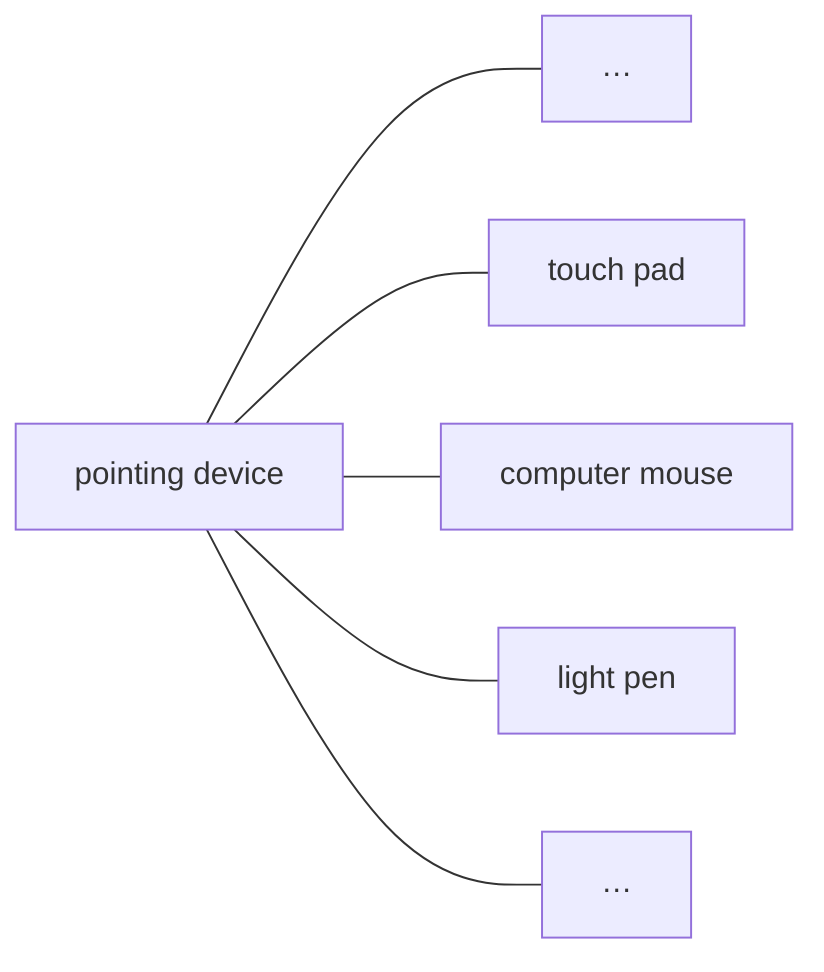

### A.3 Partitive relation

Subordinate concepts within the hierarchy form constituent parts of the superordinate concept, e.g. mouse button, mouse cord, infrared emitter, and mouse wheel can be defined as parts of the concept optomechanical mouse. In comparison, it is inappropriate to define cord (one possible characteristic of mouse cord) as part of an optomechanical mouse.

Partitive relations are depicted by a rake without arrows (see Figure A.2).

> **NOTE** Example adapted from ISO 704:2022, 5.5.4.3.1, Example 1.

**Figure A.2 — Graphical representation of a partitive relation**

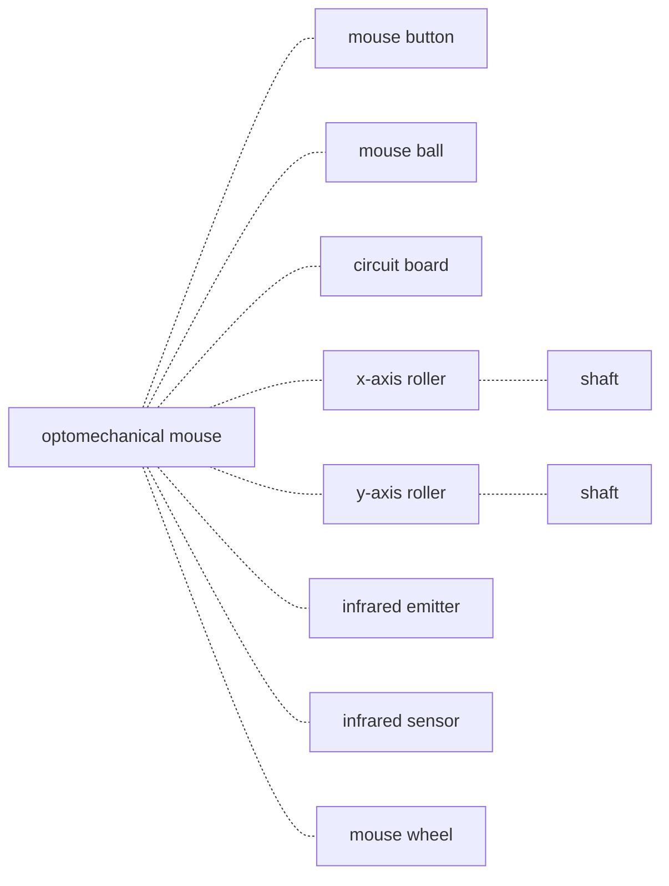

### A.4 Associative relation

Associative relations cannot provide the economies in description that are present in generic and partitive relations but are helpful in identifying the nature of the relationship between one concept and another within a concept system, e.g. cause and effect, activity and location, activity and result, tool and function, material and product. Associative relations are the most encountered in terminology practical work as they correspond to the concepts relations established in the real world.

Associative relations are depicted by a line with arrowheads at each end (see Figure A.3).

**Key**

1. dependency relation
2. enhancement relation
3. attachment relation
4. tool relation

> **NOTE** Example adapted from ISO 704:2022, 5.6.3, Example 1.

**Figure A.3 — Graphical representation of an associative relation**

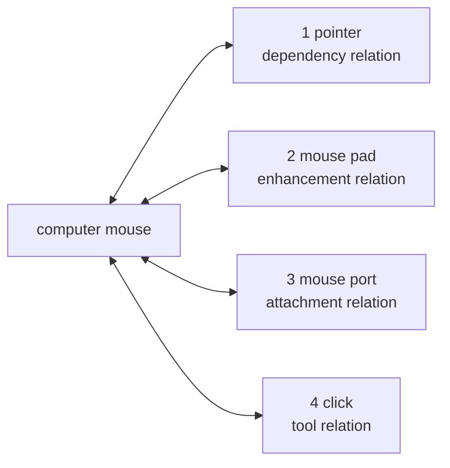

### A.5 Concept diagrams

Figures A.4 to A.15 show the concept diagrams on which the thematic groupings of Clause 3 are based.

Since the definitions of the terms are not included in the concept diagrams, it is necessary to refer to Clause 3 to see the definitions and any related notes.

The words in angle brackets below some terms indicate the specific subject fields where the terms are used.

**Figure A.4 — 3.1 Terms related to organization**

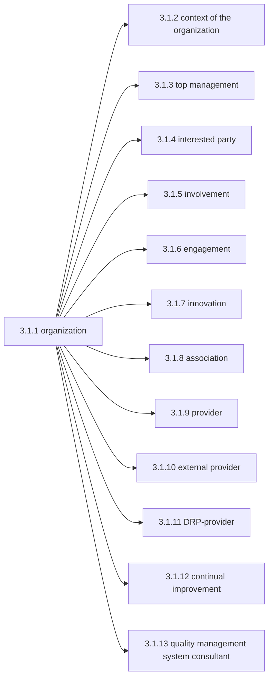

**Figure A.5 — 3.2 Terms related to management**

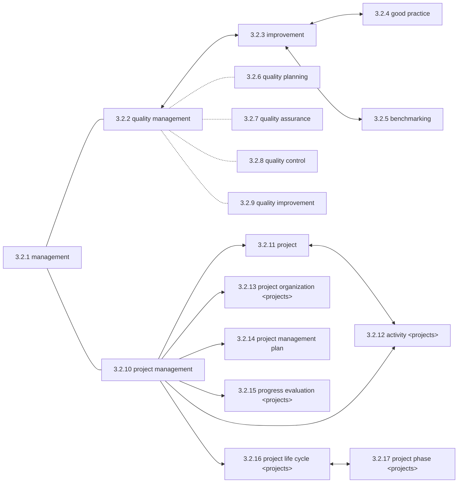

**Figure A.6 — 3.3 Terms related to process**

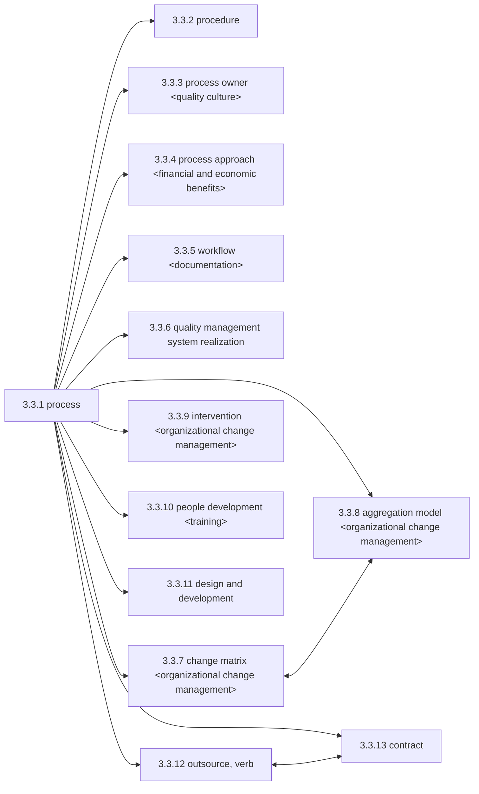

**Figure A.7 — 3.4 Terms related to system**

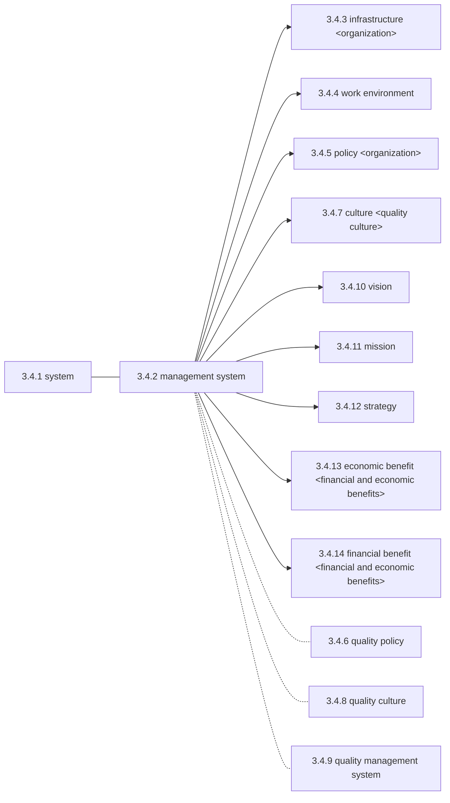

**Figure A.8 — 3.5 Terms related to requirement**

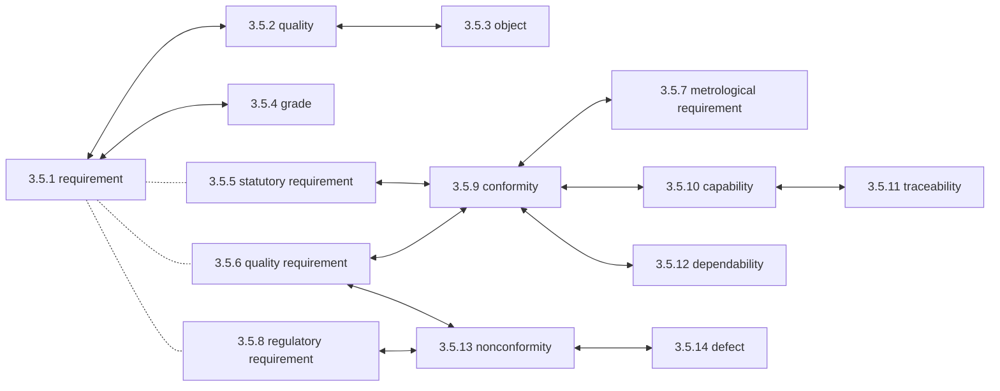

**Figure A.9 — 3.6 Terms related to action**

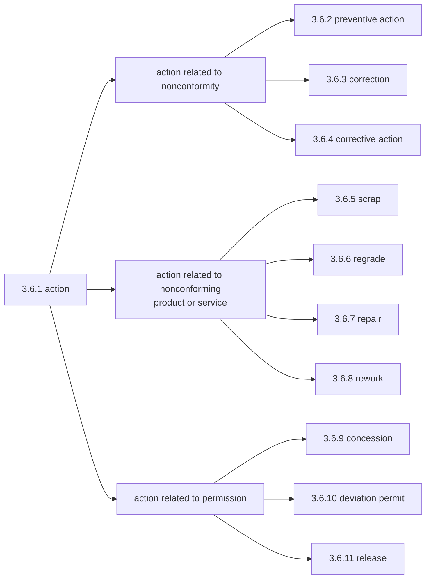

**Figure A.10 — 3.7 Terms related to result**

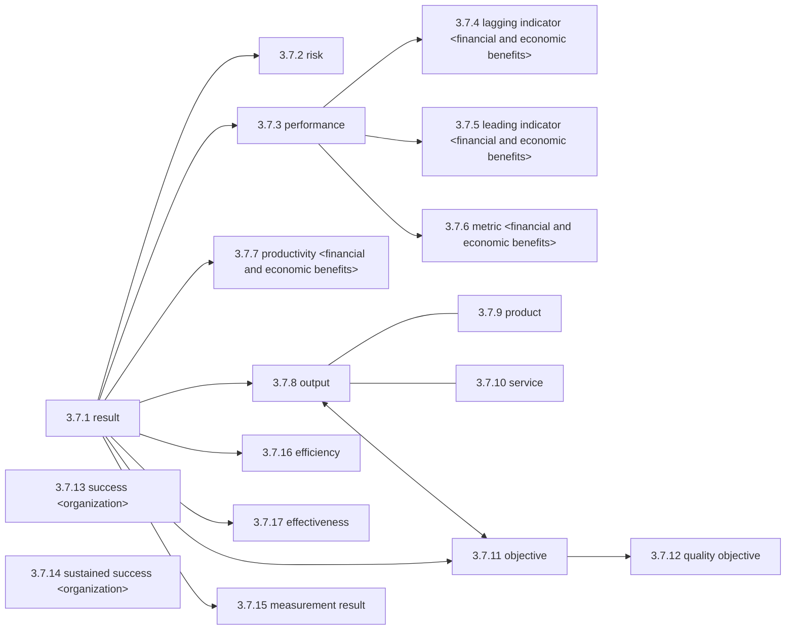

**Figure A.11 — 3.8 Terms related to data, information and documents**

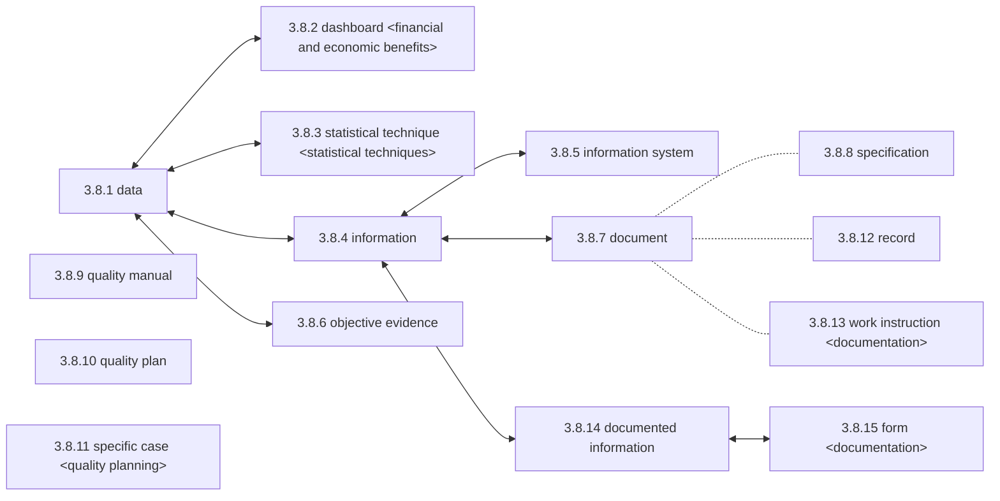

**Figure A.12 — 3.9 Terms related to customer**

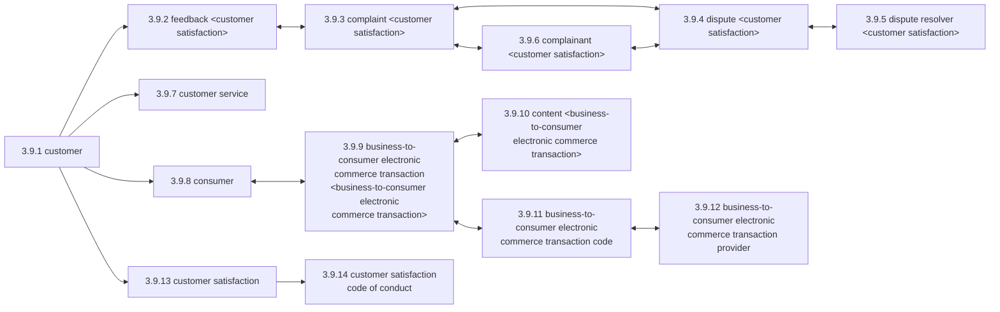

**Figure A.13 — 3.10 Terms related to characteristic**

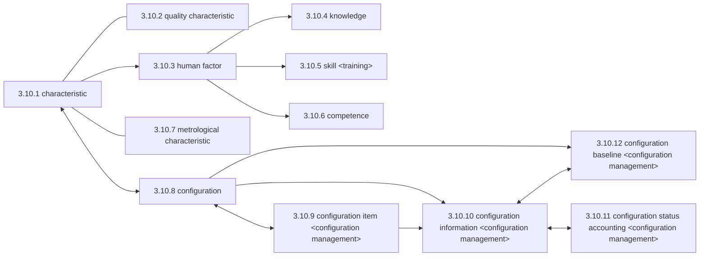

**Figure A.14 — 3.11 Terms related to determination**

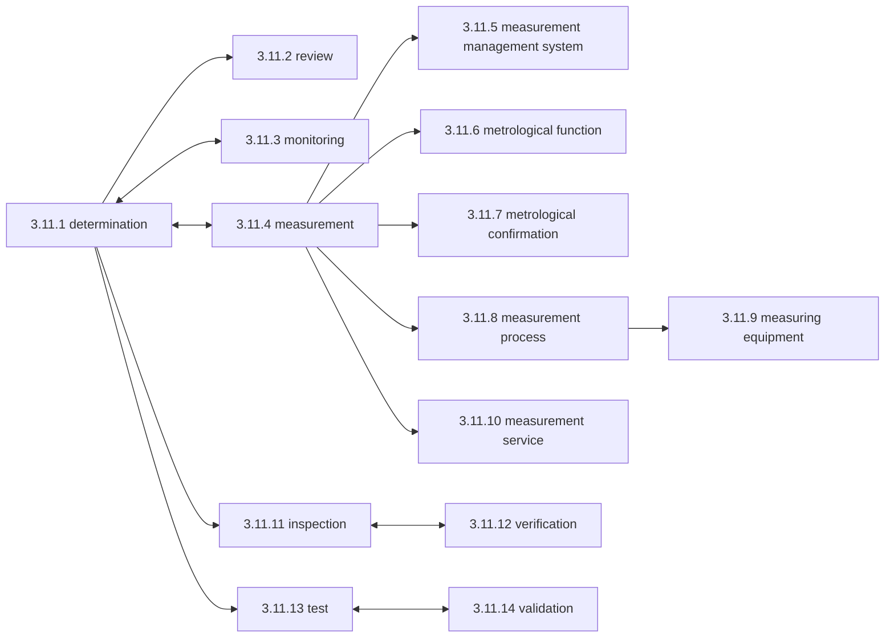

**Figure A.15 — 3.12 Terms related to audit**

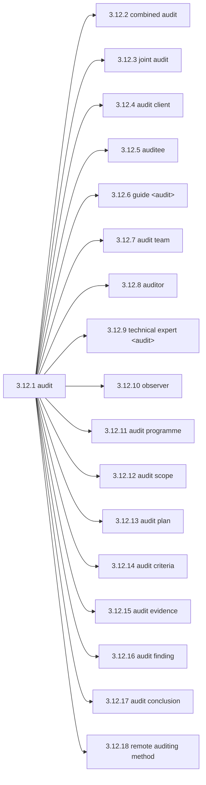

# Bibliography

[1] ISO 704:2022, Terminology work — Principles and methods

[2] ISO 1087:2019, Terminology work and terminology science — Vocabulary

[3] ISO 3534-2:2006, Statistics — Vocabulary and symbols — Part 2: Applied statistics

[4] ISO 9001, Quality management systems — Requirements

[5] ISO 9004, Quality management — Quality of an organization — Guidance to achieve sustained success

[6] ISO 10001, Quality management — Customer satisfaction — Guidelines for codes of conduct for organizations

[7] ISO 10019, Guidelines for the selection of quality management system consultants and use of their services

[8] ISO/TS 10020, Quality management systems — Organizational change management — Processes

[9] ISO 14001, Environmental management systems — Requirements with guidance for use

[10] ISO/IEC TS 17012:2024, Conformity assessment — Guidelines for the use of remote auditing methods in auditing management systems

[11] ISO 19011, Guidelines for auditing management systems

[12] ISO 30400:2022, Human resource management — Vocabulary

[13] ISO 45001, Occupational health and safety management systems — Requirements with guidance for use

[14] ISO 50001, Energy management systems — Requirements with guidance for use

[15]  ISO/IEC 27001, Information security, cybersecurity and privacy protection — Information security management systems — Requirements

[16]  ISO/IEC Guide 76:2020, Development of service standards — Recommendations for addressing consumer issues

[17] ISO/IEC Guide 99, International vocabulary of metrology — Basic and general concepts and associated terms (VIM)

[18] IEC 60050-192:2015, International electrotechnical vocabulary — Part 192: Dependability

[19] ISO. Glossary Guidance on selected words used in the ISO 9000 family of standards. Geneva: ISO, 2025. Available from: https://w ww. iso .org/f iles/ live/ sites/i soorg/ files/ standards/d ocs/ en/ terminology -ISO9000- family .pdf

[20] ISO. Integrating Management System Standards - A Practical Guide. ISO Handbook. Geneva: ISO, 2025. Available from: https:// www .iso. org/p ublication/ PUB100435. html

# Index

### A

- action — 3.6.1
- activity — 3.2.12

- aggregation model — 3.3.8
- association — 3.1.8

- audit — 3.12.1

- audit client — 3.12.4

- audit conclusion — 3.12.17
- audit criteria — 3.12.14
- audit evidence — 3.12.15
- audit finding — 3.12.16
- audit plan — 3.12.13

- audit programme — 3.12.11
- audit scope — 3.12.12

- audit team — 3.12.7
- auditee — 3.12.5
- auditor — 3.12.8

### B

- B2C ECT — 3.9.9

- B2C ECT code — 3.9.11
- B2C ECT provider — 3.9.12
- benchmarking — 3.2.5

- business-to-consumer electronic commerce transaction — 3.9.9

- business-to-consumer electronic commerce transaction code — 3.9.11

- business-to-consumer electronic commerce transaction provider — 3.9.12

### C

- capability — 3.5.10
- change matrix — 3.3.7
- characteristic — 3.10.1
- combined audit — 3.12.2
- competence — 3.10.6
- complainant — 3.9.6
- complaint — 3.9.3
- concession — 3.6.9
- configuration — 3.10.8

- configuration baseline — 3.10.12
- configuration information — 3.10.10
- configuration item — 3.10.9

- configuration status accounting — 3.10.11
- conformity — 3.5.9

- consumer — 3.9.8
- content — 3.9.10

- context of the organization — 3.1.2
- continual improvement — 3.1.12
- contract — 3.3.13

- correction — 3.6.3

- corrective action — 3.6.4
- culture — 3.4.7
- customer — 3.9.1

- customer satisfaction — 3.9.13

- customer satisfaction code of conduct — 3.9.14
- customer service — 3.9.7

### D

- dashboard — 3.8.2
- data — 3.8.1
- defect — 3.5.14

- dependability — 3.5.12

- design and development — 3.3.11
- determination — 3.11.1
- deviation permit — 3.6.10
- dispute — 3.9.4

- dispute resolution process provider — 3.1.11
- dispute resolver — 3.9.5

- document — 3.8.7

- documented information — 3.8.14
- DRP-provider — 3.1.11

### E

- economic benefit — 3.4.13
- effectiveness — 3.7.17
- efficiency — 3.7.16
- engagement — 3.1.6
- external provider — 3.1.10
- external supplier — 3.1.10

### F

- feedback — 3.9.2
- financial benefit — 3.4.14
- form — 3.8.15

### G

- good practice — 3.2.4
- grade — 3.5.4

- guide — 3.12.6

### H

- human factor — 3.10.3

### I

- improvement — 3.2.3
- information — 3.8.4
- information system — 3.8.5
- infrastructure — 3.4.3
- innovation — 3.1.7

- inspection — 3.11.11
- interested party — 3.1.4
- intervention — 3.3.9
- involvement — 3.1.5

### J

- joint audit — 3.12.3

### K

- knowledge — 3.10.4

### L

- lagging indicator — 3.7.4
- leading indicator — 3.7.5

### M

- management — 3.2.1
- management system — 3.4.2
- measurement — 3.11.4

- measurement management system — 3.11.5
- measurement process — 3.11.8
- measurement result — 3.7.15

- measurement service — 3.11.10
- measuring equipment — 3.11.9
- metric — 3.7.6

- metrological characteristic — 3.10.7
- metrological confirmation — 3.11.7
- metrological function — 3.11.6
- metrological requirement — 3.5.7
- mission — 3.4.11

- monitoring — 3.11.3

### N

- nonconformity — 3.5.13

### O

- object — 3.5.3
- objective — 3.7.11

- objective evidence — 3.8.6
- observer — 3.12.10
- organization — 3.1.1
- output — 3.7.8

- outsource, verb — 3.3.12

### P

- people development — 3.3.10
- performance — 3.7.3

- policy — 3.4.5

- preventive action — 3.6.2
- procedure — 3.3.2
- process — 3.3.1

- process approach — 3.3.4
- process owner — 3.3.3
- product — 3.7.9

- productivity — 3.7.7
- progress evaluation — 3.2.15
- project — 3.2.11

- project life cycle — 3.2.16
- project management — 3.2.10

- project management plan — 3.2.14
- project organization — 3.2.13
- project phase — 3.2.17

- provider — 3.1.9

### Q

- QMS — 3.4.9
- quality — 3.5.2

- quality assurance — 3.2.7
- quality characteristic — 3.10.2
- quality control — 3.2.8

- quality culture — 3.4.8
- quality improvement — 3.2.9
- quality management — 3.2.2

- quality management system — 3.4.9

- quality management system consultant — 3.1.13
- quality management system realization — 3.3.6
- quality manual — 3.8.9

- quality objective — 3.7.12
- quality plan — 3.8.10
- quality planning — 3.2.6
- quality policy — 3.4.6
- quality requirement — 3.5.6

### R

- record — 3.8.12
- regrade — 3.6.6

- regulatory requirement — 3.5.8
- release — 3.6.11

- remote auditing method — 3.12.18
- repair — 3.6.7

- requirement — 3.5.1
- result — 3.7.1

- result of measurement — 3.7.15
- review — 3.11.2

- rework — 3.6.8
- risk — 3.7.2

### S

- scrap — 3.6.5
- service — 3.7.10
- skill — 3.10.5

- specific case — 3.8.11
- specification — 3.8.8
- stakeholder — 3.1.4
- statistical method — 3.8.3
- statistical technique — 3.8.3

- statutory requirement — 3.5.5
- strategy — 3.4.12

- success — 3.7.13
- supplier — 3.1.9

- sustained success — 3.7.14

- system — 3.4.1

### T

- technical expert — 3.12.9
- test — 3.11.13

- top management — 3.1.3
- traceability — 3.5.11

### V

- validation — 3.11.14
- verification — 3.11.12
- vision — 3.4.10

### W

- work environment — 3.4.4
- work instruction — 3.8.13
- workflow — 3.3.5
