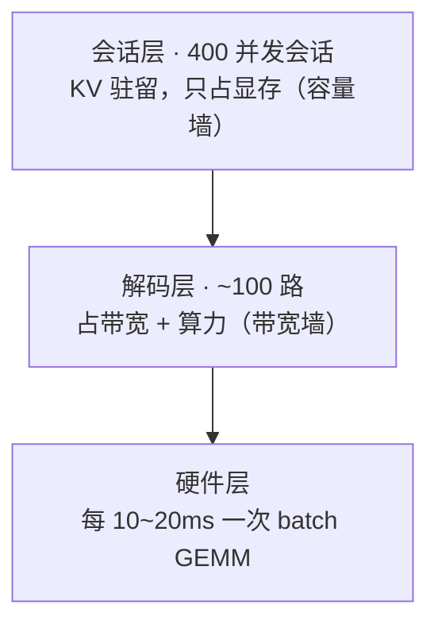
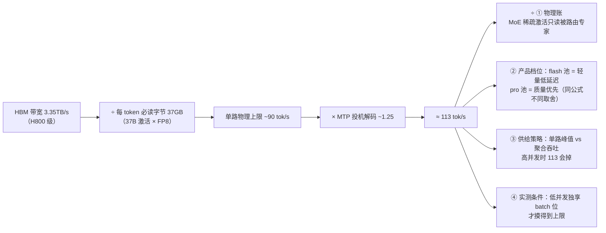
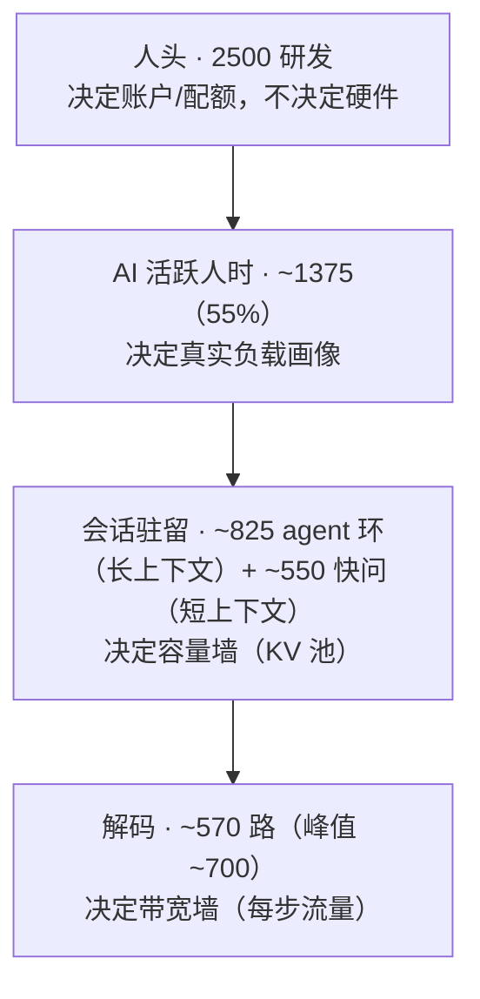
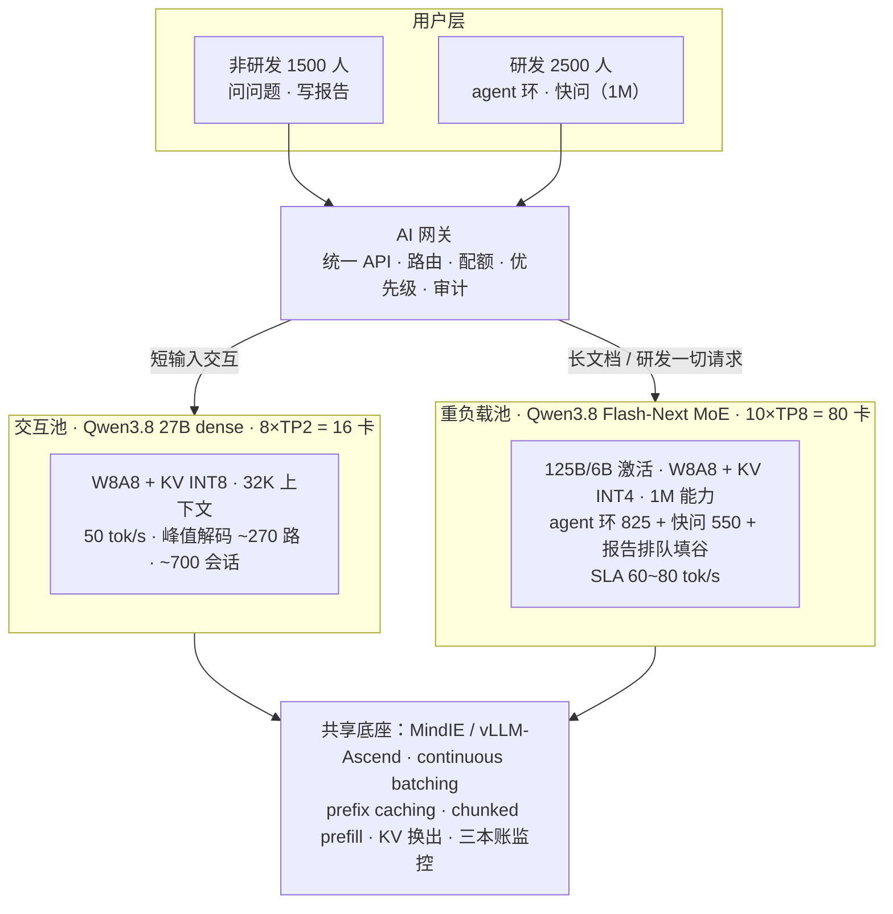
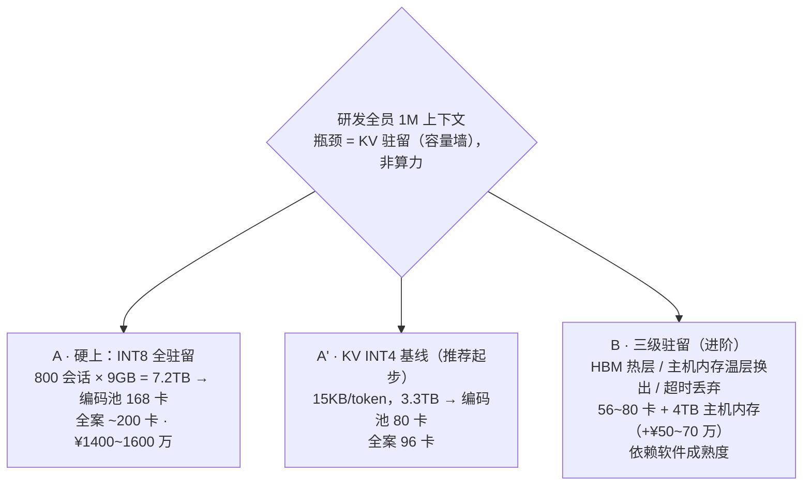
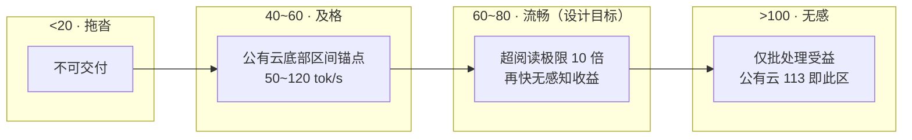
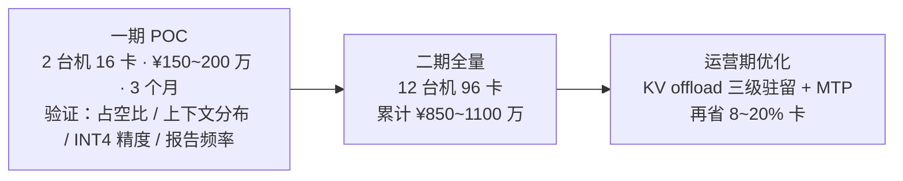

# 01-AI 私有部署推理平台研究报告

| 文档信息 | |
|---|---|
| 编号 | 01- |
| 版本 | v1.1 |
| 日期 | 2026-09-07 |
| 来源 | 企业 AI 私有部署选型咨询完整推演（千问3.8 × 昇腾 Atlas 300I A2） |
| 状态 | 定稿，POC 待验证 |

> **修订记录**：v1.0 成稿时为"研究报告体例"将大量推导过程压缩为速览表；v1.1 据会话推演日志逐条还原——补齐早期单模型推演、对话解剖与上下文甜蜜点论证、极端包络完整论证、113 tok/s 四维度拆解、口径演变卡数账链（86→94→110→96）、A 档全案账，并新增感知阶梯与 113 推导链两张 Mermaid 图。正文为决策摘要，带 ⚙ 标记的章节为推导过程，供技术团队核对假设。

> **一行结论**：4000 人企业（2500 研发 + 1500 非研发）的私域 AI 推理平台 = **双池架构 96 卡（12 台 8 卡机）**，一次性投资 ¥850~1100 万，年运营 ¥110~160 万，3 年 TCO ~¥1200~1550 万；比公有云订阅制省 60~70%，比纯 API 贵 30~100%——差价买的是**数据不出域 + 速率确定性 + 无额度墙**。

---

## 1. 研究背景与问题定义

企业规划私域部署大模型推理平台，服务三类负载：

1. **研发 Agent 环**（编码、调试、设计文档）：要求 1M 上下文，产出与速率感知要求高
2. **交互问答**（问问题）：短上下文、低占空比
3. **吞吐型任务**（扔资料写报告）：重 prefill、可排队

研究路径：从单模型单卡的物理极限出发，逐层推导容量、带宽、算力三本账，经过需求口径的多轮修正（见 §5.1 口径演变），收敛为最终双池方案。

---

## 2. 基础谱系

### 2.1 千问 3.8 模型谱系（2026-08 发布）

| 型号 | 规格 | 特点 | 本方案角色 |
|---|---|---|---|
| Max / Max-0902 | 2.4T MoE / 95B 激活 / 1M ctx | 旗舰 | 不采用（成本过高） |
| **27B dense** | 27B 稠密多模态 | 262K 原生，YaRN 外推 1M；Apache 2.0 | **交互池**（问问题） |
| **Flash / Flash-Next** | MoE 125B 总参 / **6B 激活** | QSA 稀疏注意力（读 ÷8）+ GDN 线性注意力（O(1) 存储）+ MTP 头；Qwen4 架构雏形 | **重负载池**（研发 + 报告） |

### 2.2 华为昇腾推理卡谱系

| 代际 | 代表 | 定位 |
|---|---|---|
| 一代 | 310 | 早期推理 |
| 二代 | 310P | 主流推理 |
| 三代 | 910B → **Atlas 300I A2** | 本方案选型 |
| 四代 | 950PR（Atlas 350） | 下一代 |

**Atlas 300I A2 · 64GB 关键参数**：280 TFLOPS FP16 / 560 TOPS INT8 / HBM 带宽 1.6TB/s / PCIe 5.0 / TDP ~350W。

---

## 3. 核心原理（三本账与漏斗模型）

### 3.1 自回归解码的带宽瓶颈

每生成 1 个 token，卡必须把全部权重从显存读一遍——片上缓存（~64MB）相对权重（27GB）可忽略；解码算术强度 ~2 FLOPs/byte，远低于芯片平衡点（~175 FLOPs/byte），故**解码是带宽瓶颈而非算力瓶颈**：

```
单路速度 ≈ 带宽 ÷（激活权重量化字节 + KV 读）
27B INT8：1.6TB/s ÷ 28GB ≈ 57 tok/s（单卡单路）
```

⚙ 这一步是整个咨询的第一块基石。细拆如下：

- **为什么每 token 都要搬全部权重**：自回归解码是逐 token 生成的，每步只有上一 token 的激活参与运算，但权重必须完整参与——这是解码的串行本质，无法像 prefill 那样复用。
- **算术强度**：解码每字节搬运只做 ~2 次 FLOP（权重 × 激活），芯片的算力/带宽平衡点约 175 FLOPs/byte，差两个数量级——所以解码卡在带宽上，算力闲着。
- **推论**：凡是"提高单路解码速度"的手段，本质只有三类——减每步必读字节（量化、稀疏激活）、让一次读服务更多请求（批量）、一次算多个 token（MTP 投机解码）。

### 3.2 KV Cache：线性律与容量墙

每 token 的 KV 显存 = 2 × 层数 × KV 头数 × 头维 × 字节数：

| 模型/精度 | KV 每 token | 1M 上下文每路 |
|---|---|---|
| 27B INT8（60 层 × GQA 8 头 × 128 维，假设） | ~120KB | ~120GB |
| Flash 混合 INT8（线性层 O(1)，假设） | ~30KB | ~30GB |
| Flash 混合 INT4 | ~15KB | ~15GB |

**推论**：容量墙数会话层（KV 驻留数 × 每 token 字节 × 上下文长度），与解码速度无关；打破线性律的手段分两类——**减常数**（量化、GQA、MLA）与**改复杂度**（稀疏注意力、线性注意力）。业界参照：DeepSeek 用 MLA 把 KV 压到 ~70KB/token 量级，使长上下文下的单路速率上限不被 KV 读拖垮（见 §3.5）。

### 3.3 GEMM 与批量并发：为什么多请求不打架

- **写独立**：batch 内各请求输出列互不依赖，无锁
- **读共享**：权重一次读取服务整批，GEMV 是 GEMM 的 N=1 特例
- 因此批量推理时每路速度基本不降（权重为公共成本，KV 为私有成本）

⚙ 批量的账：把 10 个请求并成一个 batch，每步仍只读一遍权重（公共成本被摊薄 10 倍），每个请求多付的只是自己的 KV 读（私有成本）。这正是 continuous batching 能让"解码层并发远高于单路速度直觉"的原因——**带宽是共享的，速度是均分的**。

### 3.4 并发三层漏斗与占空比



**E[解码路数] = N × 占空比**，波动 ±√(Np(1-p))。占空比谱系：

| 负载类型 | 占空比 | 建模方法 |
|---|---|---|
| 交互对话（人在读） | 10~25% | 并发论（保峰值） |
| Agent 环（等工具返回） | 30~40% | 并发论 + 会话驻留 |
| 批处理/报告（作业期） | →100% 但间歇 | **排队论（保吞吐）** |

⚙ 这是"所有方案最坏值 vs 真实值差异"的总来源：三层漏斗每层数的东西不同——会话层只占显存、解码层才占带宽与算力。**容量墙数会话层、带宽墙数解码层**，两层绝不能混着数。占空比的含义是"一个会话真正在解码的时间占比"：人在读 AI 回答时（交互）解码是停的；agent 在等工具返回时（环）解码也是停的。硬件只服务"正在解码的那一瞬间"。

### 3.5 解码速率的逆向公式（113 tok/s 的四维度拆解）

⚙ 本节还原完整推演。对话中你给出的实测对照是分析的起点：GLM-5.3-flash ~40 tok/s、DeepSeek-V4-flash ~113 tok/s。113 不是自然数，是**物理账 × 产品档位 × 供给策略 × 实测条件**四个乘数/除数叠出来的：



四个考量维度：

1. **物理账**：H800 级 HBM 带宽 3.35TB/s ÷ 每 token 必读字节 37GB（37B 激活 × FP8）≈ 90 tok/s；MoE 稀疏激活意味着只读被路由到的专家，37GB 是激活后实际流量。× MTP ~1.25 ≈ 113。MLA 把 KV 压到 ~70KB/token 使长上下文下该上限仍成立。
2. **产品档位**：flash 是低延迟轻量池（便宜、快），pro 是质量优先池——GLM ~40 是同一条公式下的不同取舍（带宽 ÷ 更大激活字节，且不乘 MTP），不是"更慢的模型"，是"更重的模型"。
3. **供给策略**：厂商用**单路峰值换聚合吞吐**——高峰期把富余速率让给更多并发路数，113 是低并发快照，满载会掉。
4. **实测条件**：只有低并发、独占 batch 位时才摸得到这个数。

**对私域规划的启示**：113 属"体感无差别区"（>100，见 §5.6），厂商拿速率富余换成本；规划要**按聚合账不按单路峰值**，SLA 定 60~80 tok/s + 3 倍余量，即对标业界最优体感而非最高标称。

---

## 4. 场景推演链（需求变体与校准）

### 4.1 变体速览表

| 需求变体 | 结论 | 卡数 |
|---|---|---|
| 27B INT8 部署 | 64GB 版单卡可跑；32GB 版需 2 卡 TP | 1~2 |
| 1M × 5 路 × 50 tok/s | TP8×CP2 池化 + KV INT4 | 16 |
| 1M × 5 路 × 200 tok/s | 跨机 CP 延迟高危，工程配置 64~80 | 64~80 |
| 1M × 500 路 × 200 tok/s | **判需求错误**：最坏值连乘非真实负载 | 4500~5000 |
| 对话 5 路 × 50 tok/s | 32K 上下文是甜蜜点 | 2 |
| 编码 500 路 × 100 tok/s | 换 Flash（三重减免：激活 ÷4.5、稀疏读 ÷8、MTP ÷2.5） | ~300 |

**校准方法论**：三个最大值（上下文 × 并发 × 速率）连乘得到的是上限包络，不是真实负载——真实负载要用占空比和分布还原。这是整个咨询中最重要的纠偏。

### 4.2 ⚙ 对话场景的上下文解剖：32K 为什么是甜蜜点

对话池从"1M×5 路"的极端假设回归现实时，先要回答：一段真实对话会话到底占多长上下文？解剖结果：

| 组成 | 长度 |
|---|---|
| 系统提示 | 2~4K |
| 工具 schema | 1~2K |
| RAG 检索注入 | 2~8K |
| 对话历史 | ~8K |
| **合计** | **13~22K → 按 32K/路设计** |

权衡曲线（27B INT8 KV ~120KB/token，64GB 卡）：

- **单卡 8K 贴线**：8K × 120KB ≈ 1GB/路，单卡能挂的会话数贴线，余量小
- **双卡 TP2 · 64K 贴线**：64K 是双卡的显存极限，贴线无余量
- **双卡 TP2 · 32K 是甜蜜点**：步长 14.2ms → 单路上限 70 tok/s，对 SLA 50 有 40% 余量；会话驻留数与成本均衡

**结论**：交互型对话不需要 1M——1M 是"模型能力"（YaRN 外推），不是"会话需求"。对话解剖证明 32K/路覆盖 95% 以上真实会话，这是交互池与重负载池分池的容量依据之一。

### 4.3 ⚙ 极端包络的完整论证：1M×500×200 为什么是伪需求

把三个上限连乘看账（假设 dense 27B 硬扛）：

| 账本 | 计算 | 结果 |
|---|---|---|
| 聚合吞吐 | 500 路 × 200 tok/s | 10 万 tok/s |
| 带宽账 | 每步 KV 搬运 500×200K×120KB ≈ 30TB → 6 PB/s | **硬堆 ~4500-5000 卡** / 600 台 / 3MW ≈ 半台 Atlas 950 SuperPoD |
| 算力账 | 聚合 5.4 PFLOPS | **只要 20 卡** |

**三本账严重失衡本身就是判据**：带宽要 5000 卡的活，算力 20 卡就够——说明这个需求不是真实负载，是"最坏值连乘"制造出的上限包络。真实世界里 500 人 × 200 tok/s × 1M 上下文不可能同时成立：人时漏斗（§5.2）会把 500 个并发会话还原成 ~200 路解码，且上下文分布是均值远小于极值。

正解两条：**① 分级服务**——按真实占空比与分布建池，而不是按上限包络建池；**② 换稀疏注意力模型**——Qwen3.8-Flash（QSA 稀疏读 ÷8 + MTP）同负载降到 200~300 卡级。这次"伪需求纠偏"直接决定后面所有方案的建模口径。

### 4.4 ⚙ 编码场景的三重减免：为什么 500 路编码换 Flash

dense 27B 扛 1M×500×100 会撞 dense attention 的墙：每步 KV 全量读。换 Flash-Next（MoE 125B 总参 / 6B 激活）后三重减免叠加：

| 减免 | 机制 | 系数 |
|---|---|---|
| 激活参数 | 6B 激活 vs 27B dense | 权重流 ÷4.5 |
| QSA 稀疏注意力 | 只读被路由的分块 | KV 读 ÷8 |
| MTP 投机解码 | 一次前向多 token | ÷2.5 |

三重连乘把同规模负载从 ~3000 卡量级降到 **~300 卡级**（A3 超节点形态 3~4 节点）。**代价是质量假设**：编码质量需对标 27B（SWE-bench Pro 61.7），POC 必验。

---

## 5. 企业整体方案

### 5.1 需求口径演变与卡数账链（自我修正记录）

| 轮次 | 口径 | 卡数账 | 变化动因 |
|---|---|---|---|
| v1 | 1000 agent 开发 + 3000 对话 | **86 卡**（交互 30 + 编码 48 + 1M 槽 8）≈ 11 台 | 初始假设 |
| v2 | 对话岗拆交互/吞吐 | **94 卡**（交互 30 + 编码 56 + 槽 8） | 报告任务并入编码池（6→7×TP8） |
| v3 | 编码全员 1M | A 档 168 / A' 72 / B 56（编码池） | KV 驻留成瓶颈（§5.5） |
| v4 | 研发 2500 | **110 卡**（重负载 80 + 交互 30 沿用） | 人时漏斗：人头 ×2.5 账几乎不变 |
| v5 | 非研发核清 1500 | **96 卡（终版）**（重负载 80 + 交互 16） | 交互池 30→16：1500×15%+3σ≈270 路 |

> 备选方案（v1 时提出，v4 弃用）：**全 Flash 单模型 ~72 卡**——对话也改走 2×TP8 Flash 实例，省 14 卡、统一运维；弃用原因是对话走 MoE 浪费（27B dense 已够用）且交互池需要独立故障域。

**这条卡数链是本咨询最重要的自我修正轨迹**：口径每修正一次，卡数账都重新核一遍——从 86 到 96，净增仅 10 卡，而人口口径从 1000 研发膨胀到 2500。这说明**硬件规模对"人口数"不敏感，对"负载形态"敏感**。

### 5.2 研发工时分布与人时漏斗

研发日活动典型分布（业界区间，POC 校准）：设计+编码 30~35%（AI 参与度 ~85%）、调试 25~30%（~75%）、讨论/评审 15~20%（~15-20%）、试验 10~15%（~35%）、事务 ~10% → **综合 AI 活跃 ~55%**。



**关键洞察**：人头 ×2.5（1000→2500）账几乎不变——之前按 1000 人满负荷建模与 2500 人 × 人时折扣殊途同归。**人头不是负载，人时才是。** 研发 2500 人里只有 ~1375 人时对 AI 活跃，而这 1375 人时里按活动形态拆成 agent 环（长上下文驻留）与快问（短上下文），各自乘占空比才到解码路数。

### 5.3 双池架构（最终版）



**路由规则**：① 研发的一切请求（环 + 快问）→ 重负载池（快问常带代码/日志超 32K）；② 非研发短输入 → 交互池；③ 报告任务 → 重负载池排队填谷（agent 实时优先）。

### 5.4 两池三本账

| 池 | 卡数 | KV 池 | 会话驻留 | 解码峰值 | 每路能力 |
|---|---|---|---|---|---|
| 交互池（27B） | 16（8×TP2） | ~736GB | ~700 @8K 均值 | ~270 路 | 50 tok/s 贴线 |
| 重负载池（Flash） | 80（10×TP8） | ~3.4TB | 3.3TB 需求贴线 | ~700 路 | 200+（SLA 60~80，3 倍余量） |

⚙ 交互池 30→16 的下修理由（v4→v5）：交互负载只来自非研发 1500 人（研发快问已路由到重负载池），1500 × 15% 占空比 + 3σ ≈ 峰值 270 路解码、KV 池 736GB ≈ 700 会话 @8K——8×TP2 足够。之前 30 卡是按 3000 对话人口估的，人口核清后产能富余一倍。

报告负载账（1500 人 × ~2 份/天）：峰值并发 ~40 会话 × 3GB（100K 资料 × 30KB/token）、prefill 均值 ~1.1 PFLOPS、解码 ~40 路——由重负载池空窗吸收（agent 占空比 35% → 65% 解码空窗与报告互补）。报告任务与 agent 环是**时间互补**的两类负载：一个占白天碎片、一个占提交后集中段，天然适合排队填谷。

### 5.5 1M 上下文三档方案



三重减免使解码层极宽松（每路每步 KV 读仅 ~60MB/卡），容量墙独裁。**agent 占空比 35% 意味着 65% 时间会话在睡觉——为睡觉的 KV 买 HBM 不划算**（B 档的物理依据）。

三档取舍：

| 档 | 软件依赖 | 卡数 | 适用 |
|---|---|---|---|
| A 硬上 INT8 全驻留 | 最低（只要 W8A8） | 编码池 168 / 全案 ~200 | 追求零精度风险、预算不敏感 |
| **A' KV INT4 基线** | KV INT4 量化可用即可 | 编码池 80 / 全案 96 | **推荐起步**：容量账 ÷2，须 SWE-bench 验精度 |
| B 三级驻留 | KV offload 成熟（MindIE/vLLM-Ascend） | 56~80 + 4TB 主机内存 | 软件成熟后演进，再省 8~20% 卡 |

### 5.6 速率感知阶梯与 SLA

| 流速 | 体感 | 判断 |
|---|---|---|
| <20 tok/s | 拖沓 | 不可交付 |
| 20~40 | 勉强可用 | 保底 |
| 40~60 | **及格 = 公有云底部区间（50~120）** | 验收线 |
| 60~80 | **流畅（超人类阅读极限 ~6 tok/s 的 10 倍）** | **设计目标** |
| >100 | 体感无差别 | 仅批处理受益 |



感知公式：**体感时延 = TTFT + patch 长度 ÷ 流速**——流速过阅读极限后由首包时延主导。1M 场景 TTFT 分两截：冷加载 ≈ 11s/实例（prefix miss，需预热/错峰），warm 增量 <1s。

⚙ 为什么 60~80 是设计目标而非 113：人的阅读速度 ~6 tok/s，60~80 已是其 10 倍以上——输出快过阅读极限后，人眼成为瓶颈，再快的 token 流不会改善体感；此时体感由"第一行字多久出来"（TTFT）和"整轮 agent 多久跑完"主导。所以 113 是厂商的成本优化位（省卡、省时），不是体验优化位。SLA 定 60~80 留 3 倍余量，快问路径可开 MTP（÷2.5）。

**SLA 验收**：warm 首包 ≤3s（P95）、解码 ≥60 tok/s（P95）、agent 整轮 ≤30s、报告排队 ≤10min。

---

## 6. 成本与采购

### 6.1 一次性投资（CapEx）

| 科目 | 金额（估） | 说明 |
|---|---|---|
| 硬件 | ¥660~845 万 | 12 台 8 卡整机 ¥540~660 + 网络 40~60 + 存储 50~80 + 网关 10~15 + 备件 20~30 |
| 软件 | ¥60~150 万 | MindIE（或 vLLM-Ascend ¥0）+ 量化校准 30~50 + 安全合规 10~20 |
| 机房 | ¥70~105 万（新建）/ ¥30~50 万（利旧） | 见 6.2 细项 |
| **合计** | **¥850~1100 万（新建）** | 单卡 ¥3.5~5 万、整机 ¥45~55 万，以当期报价为准 |

硬件细项：

| 科目 | 规格 | 数量 | 金额（估） |
|---|---|---|---|
| 推理服务器 | 8× 300I A2 64GB，双路 CPU，**512GB~1TB RAM**，NVMe | 12 台 | ¥540~660 万 |
| 前端/管理网络 | 2×100G 以太（业务）+ 2×25G（管理） | 1 套 | ¥40~60 万 |
| 存储 | 模型仓库 + 文档/日志，百 TB 级（NVMe + NAS 双份） | 1 套 | ¥50~80 万 |
| 网关服务器 | x86 双活 + 1 备 | 3 台 | ¥10~15 万 |
| 备件库 | 卡 4 张 + 电源/风扇/内存/硬盘 | 1 套 | ¥20~30 万 |

> TP 全部在单机内 PCIe 5.0 完成，**无需跨机 RDMA 网络**——网络开销比训练集群低一个量级。

### 6.2 电力与机房

- 市电双路 380V 各 ~100kW；IT 额定 65kW / 峰值 72kW / 平均 52kW
- PUE 1.4 → 平均 ~73kW → **年耗电 ~64 万度，电费 ~¥45 万**（¥0.7/度）
- 制冷 ~35kW；风冷即可，无液冷需求；面积 **25~40 m²**（含维护通道），5 个标准柜

机房新建细项：

| 科目 | 规格 | 金额（估） |
|---|---|---|
| UPS + 电池 | 100kVA，30 分钟（推理集群容忍短时切换） | ¥25~35 万 |
| 精密空调 | 2×25kW（N+1） | ¥20~30 万 |
| 机柜 + 配电 + 布线 | 5 柜（4U 服务器 12 台 + 网络/存储/网关） | ¥15~25 万 |
| 消防/动环/门禁 | 常规机房标准 | ¥10~15 万 |
| **小计** | | **¥70~105 万** |

### 6.3 日常运营成本（OpEx/年）

电费 45 + 硬件维保 20~30 + 软件支持 10~20 + 1~2 名运维人力 30~60 + 杂项 5 ≈ **¥110~160 万/年**。

### 6.4 TCO 与公有云对比

| 方案 | 3 年成本 | 短板 |
|---|---|---|
| 公有云纯订阅制（4000 席位） | ¥3600~6000 万 | 最贵；额度墙；1M 吃不饱 |
| 公有云纯 API（中端档 + cache） | ¥750~4500 万 | 方差极大；账单随产能平方级膨胀；全出域 |
| 公有云混合 | ¥1200~2100 万 | 出域问题依旧 |
| **私有化（本方案）** | **¥1200~1550 万** | 需自建自运维 |

- 3 年 TCO ¥1200~1550 万（**年化人均 ~¥1000~1300**）；5 年 ¥1400~1850 万（年化人均 ~¥700~930）
- 人均一次性 CapEx ~¥2000~2500，OpEx ~¥300~400/人/年
- **核心判断**：公有云按 token 收租，私有化按产能投资——**团队越能干、用得越狠，私有化越划算**；若代码/设计文档有出域红线，私有化无对手

⚙ 对纯 API 的"平方级膨胀"解释：API 账单 = token 单价 × 团队产能。团队越用越狠（agent 化越深），人均 token 消耗不是线性涨而是随产能涨——1M agent 环的一次调试轮可消耗数十万 token，重度使用下账单从 ¥250 万/年量级一路失控到 ¥1500 万/年量级，方差两个量级。私有化是一次性锁死产能上限，账单可预测。

### 6.5 分期实施



POC 数据采集：抽样 IDE 插件日志 + 会议系统日历两周，即可标定工时分布。

---

## 7. 风险与待验证假设

| 风险/假设 | 影响 | 缓解 |
|---|---|---|
| 300I A2 整机价格波动 | CapEx ±30% | 多渠道询价锁价 |
| KV INT4 编码精度损失 | 质量 | POC 跑 SWE-bench 类基准，不达标退 INT8（+80 卡） |
| Flash 混合 KV ~30KB/token 为假设 | 容量账 ±50% | POC 实测显存水位 |
| 27B 层数/GQA 结构假设 | KV 记账 | 官方配置核对 |
| MTP 头可用性/加速比 | 解码余量 | 无 MTP 亦不影响 60~80 SLA |
| MindIE/vLLM-Ascend offload 成熟度 | B 档演进 | A' 档不依赖 offload |
| 早高峰 1M 冷加载 ~11s/人 | TTFT | 仓库上下文预热 + 错峰准入 |
| 占空比/上下文分布偏差 | 卡数 ±20% | POC 先行，按实测校准 |
| Flash 编码质量（vs 27B SWE-bench Pro 61.7） | 方案成立性 | POC 同基准对比，不达标考虑 27B 专用编码池 |

---

## 8. 方法论沉淀

1. **三本账**：容量账（KV 池 → 会话驻留数）、带宽账（每步权重 + B×ctx×KB/token ÷ 卡数）、算力账（prefill 与 batch 计算量）——任何推理选型先过三遍
2. **占空比谱系**：交互 10~25% / agent 30~40% / 批处理 →100%；交互与 agent 用并发论（保峰值），批处理用排队论（保吞吐）
3. **人时漏斗**：人头 → 人时（活动占比 × AI 参与度）→ 会话（容量墙）→ 解码（带宽墙）——人头不是负载，人时才是
4. **感知阶梯**：流速 ≥60 tok/s 后体感由首包时延主导；1M 场景守 TTFT（冷加载预热，warm <1s）
5. **速率逆向公式**：带宽 ÷ 激活字节 × MTP ≈ 实测速率——用来审计任何"快"的来源（物理账 × 产品档位 × 供给策略 × 实测条件四层）
6. **最坏值 vs 真实负载**：三个最大值连乘是上限包络，真实负载用占空比与分布还原；三本账失衡本身就是"伪需求"判据
7. **模型能力 ≠ 服务配置**：1M YaRN 外推能力（模型属性）与单卡 KV 池装得下 1M（服务属性）是两回事；同理 1M 是能力不是默认会话长度，按真实分布建池
8. **负载互补**：agent 环（白天碎片）与报告批处理（集中段）时间互补，天然排队填谷——两池容量按"错峰复用"而非"各自峰值相加"设计

---

## 附录：关键参数速查

| 参数 | 值 | 状态 |
|---|---|---|
| 27B INT8 权重 | ~28GB | 确定 |
| 27B INT8 KV | ~120KB/token | 假设（60 层 × GQA 8×128），待实测 |
| Flash-Next 激活 / 总参 | 6B / 125B | 官方 |
| Flash 混合 KV | ~30KB/token（INT8）、~15KB（INT4） | 假设，待实测 |
| 300I A2 64GB | 280 TFLOPS FP16 / 1.6TB/s / 560 TOPS INT8 / PCIe 5.0 | 官方 |
| 1M prefill（27B / Flash） | 54 / 12 PFLOPs | 计算 |
| 冷加载 TTFT | ~11s/实例（Flash 1M） | 计算 |
| 交互池 | 27B · 8×TP2 = 16 卡 | 定稿 |
| 重负载池 | Flash-Next · 10×TP8 = 80 卡 | 定稿 |
| 总计 | **96 卡 = 12 台 8 卡机** | 定稿 |
| CapEx / OpEx / 3 年 TCO | ¥850~1100 万 / ¥110~160 万/年 / ¥1200~1550 万 | 估算，待询价 |
| 口径演变 | 86 → 94 → 110 → **96** 卡 | 自我修正轨迹 |

---

## 附录 B：问答实录（疑问 → 解释）

> 说明：本附录按会话推演日志重建"疑问 → 解释"问答结构，解释为当时论证的要点概括而非逐字原话（会话压缩后原话不可复原）。分两阶段：阶段一为早期单模型概念深挖（27B × 300I A2），阶段二为企业整体方案咨询。若你记得某段重要问答未收录，点名即可补。

### B.1 阶段一：单模型部署的概念追问

| # | 你的疑问 | 当时的解释（要点） | 正文位置 |
|---|---|---|---|
| 1 | 27B 要几张卡才跑得起来？ | 权重 INT8 ~28GB；64GB 版单卡可跑，32GB 版需 2 卡 TP | §4.1 行 1 |
| 2 | 解码为什么这么慢？瓶颈在哪？ | 每 token 必须把全部权重读一遍；算术强度 2 vs 平衡点 175 FLOPs/byte → 带宽瓶颈非算力 | §3.1 |
| 3 | 为什么每 token 都要搬全部权重，不能复用？ | 自回归串行本质：每步只有上一 token 激活参与，但权重全量参与；片上缓存 64MB 对 27GB 权重杯水车薪 | §3.1 ⚙ |
| 4 | 批量推理为什么每路速度不降？ | 权重是公共成本（一次读服务整批），KV 是私有成本；速度均分不叠加 | §3.3 ⚙ |
| 5 | 多请求并发会不会打架/抢锁？ | GEMM 写独立（各请求输出列互不依赖）、读共享 → 无锁 | §3.3 |
| 6 | batch 上限由什么决定？ | 三堵墙：容量（KV 池）、带宽（每步流量）、算力（prefill） | §3.2/§3.4 |
| 7 | KV Cache 怎么记账？1M 上下文为什么单卡装不下？ | 每 token ~120KB × 1M = 120GB/路，超单卡 64GB；线性律 | §3.2 表 |
| 8 | 1M × 200 tok/s 行不行？ | 步长 20→5ms、KV 带宽 15→60TB/s；工程 64~80 卡且跨机 CP 延迟高危；MTP ÷2.5 可降到 24~32 | §4.1 行 3 |
| 9 | 那 1M × 500 路 × 200 呢？ | 伪需求：带宽账要 4500~5000 卡，算力账只要 20 卡——三本账失衡即判据；正解分级服务或换 Flash | §4.3 |
| 10 | 对话场景该配多长上下文？ | 对话解剖：系统 2-4K+工具 1-2K+RAG 2-8K+历史 8K ≈ 13-22K → 32K 是余量与成本甜蜜点 | §4.2 |
| 11 | 编码 500 路怎么办？ | dense 硬扛撞 KV 墙；换 Flash 三重减免（激活 ÷4.5、稀疏读 ÷8、MTP ÷2.5）→ ~300 卡 | §4.4 |

### B.2 阶段二：企业整体方案咨询（按对话轮次）

| # | 你的疑问 | 当时的解释（要点） | 卡数账 |
|---|---|---|---|
| 1 | 4000 人（1000 agent+AI 开发 + 3000 对话）怎么解？ | 双池架构：交互池 27B + 重负载池 Flash；会话层→容量墙、解码层→带宽墙 | 86 |
| 2 | 其他人主要是问问题、或扔资料让 AI 写报告？ | 对话岗拆两类：问问题=交互型（并发论）、写报告=吞吐型（排队论）；报告进重负载池排队填谷 | 94 |
| 3 | 一次性投资、机房、电力、日常成本？ | CapEx ~¥800-1000 万（13 台机）；电力年 67 万度/¥47 万；OpEx ¥110-160 万/年；人均 CapEx ¥2000-2500 | 94 |
| 4 | 编码人员要 1M 上下文？ | 1M 的账不在算力在 KV 驻留；三档 A（INT8 硬上 168 卡）/ A'（INT4 基线，推荐）/ B（三级驻留 56~80） | — |
| 5 | 2500 研发都要 1M，还做调试/讨论/试验，工时占比？ | 工时分布表（设计编码 30-35%…）；人时漏斗：人头×2.5 账几乎不变——人头不是负载，人时才是 | 110 |
| 6 | 业界能让开发者感觉正常的输出速率是多少？ | 感知阶梯：<20 拖沓 / 40-60 及格（公有云底部）/ 60-80 流畅（阅读极限 10 倍）= 设计目标；体感=TTFT+patch÷流速 | — |
| 7 | DeepSeek 113 tok/s 的考量是什么？ | 113=物理账（3.35TB/s÷37GB）×产品档位×供给策略×实测条件；规划按聚合账不按单路峰值 | — |
| 8 | 给个最终方案 + 公有云对比？ | 96 卡定稿（交互 16 + 重负载 80）；CapEx ¥850-1100 万、OpEx ¥110-160 万、3 年 TCO ¥1200-1550 万；比订阅制省 60-70% | **96** |
| 9 | 本轮产生了哪些可用文档？ | 过程稿《私域AI推理平台最终方案.md》+ 6 张架构/推演图 | — |
| 10 | 整场对话整理成编号报告归档 | v1.0 归档至 AOS 50-系统工程研究\20-AI私有部署\01- | — |
| 11 | （v1.0 后）你丢失了好多内容 | 复盘补齐：推导过程（v1.1 正文 ⚙ 节）+ 本问答实录（附录 B） | — |
