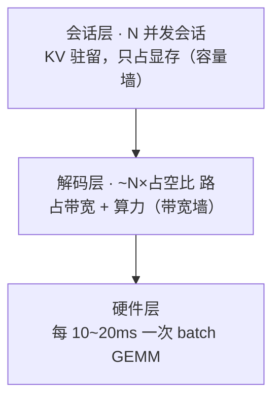
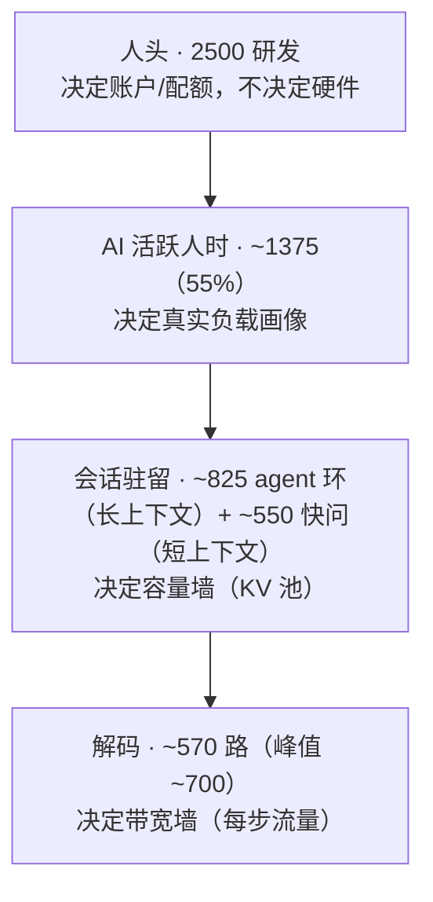
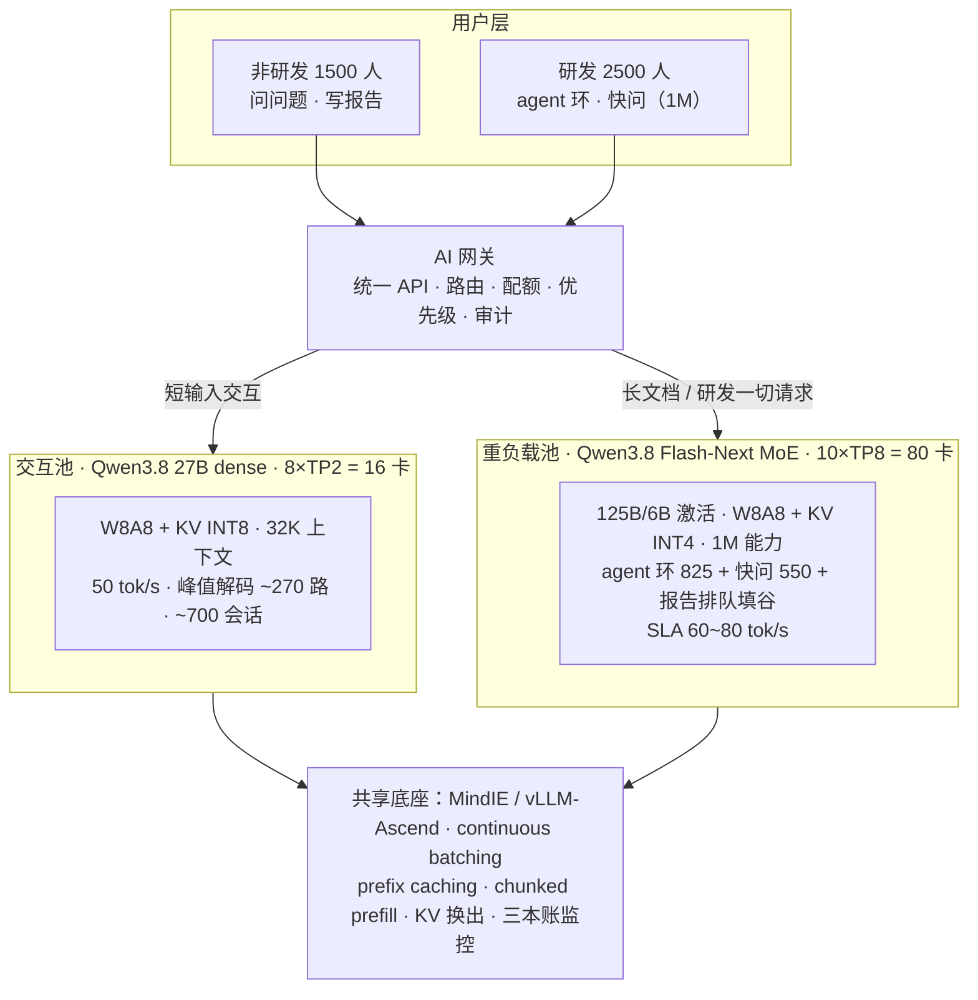
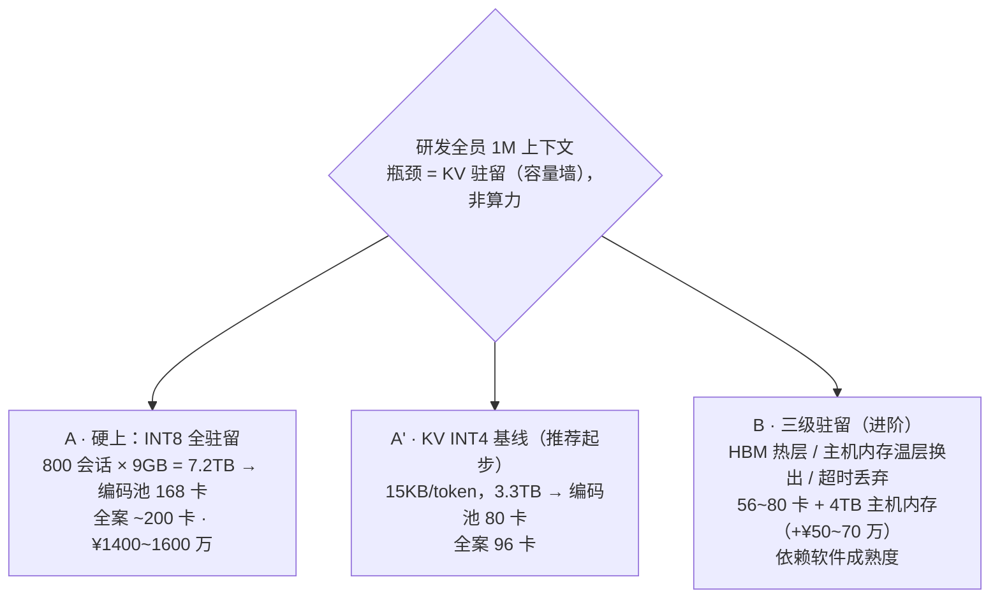
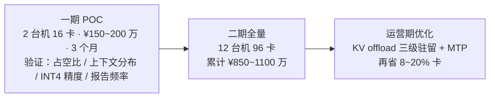
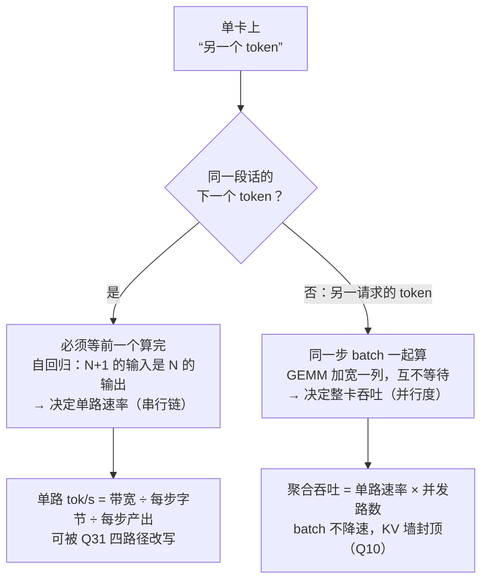

# 01-AI 私有部署推理平台研究报告（v2.1 · 完整逐字版）

| 文档信息 | |
|---|---|
| 编号 | 01- |
| 版本 | v2.1（完整逐字版） |
| 日期 | 2026-09-07 |
| 来源 | 企业 AI 私有部署选型咨询全量对话（千问3.8 × 昇腾 Atlas 300I A2） |
| 状态 | 定稿，POC 待验证 |

> **修订记录**：
> - **v1.0**：研究报告体例，推导过程被压成速览表 → 丢失大量论证血肉
> - **v1.1**：补回推导过程（⚙ 小节 + Mermaid），但问答仍为"骨架重建"
> - **v2.0**：依据本机会话逐字存档（`.jsonl`）全量还原——正文含**决策摘要**与**全部 29 组问答原文**（你的原话 + 当时的完整解释）；v1.1 备份曾另存于同目录，2026-09-07 已删除（内容并入 v2.0 逐字还原）
> - **v2.1（本版）**：追加**第 10 章 · 追加答疑（Q30–Q33）**——归档后于党委会 AI 方案 PPT 论证期间发生的"单卡速率四连问"（50 的成因 → 120 的四条路 → 60 层是否流水线 → 单卡是否串行，含"没有拼接请求"的限定追问），附路径表与串行判定 Mermaid 图；同步更新阅读导引、第二部分标题与决策摘要 §3 第 5 条

> **一行结论**：4000 人企业（2500 研发 + 1500 非研发）的私域 AI 推理平台 = **双池架构 96 卡（12 台 8 卡机）**，一次性投资 ¥850~1100 万，年运营 ¥110~160 万，3 年 TCO ~¥1200~1550 万；比公有云订阅制省 60~70%，比纯 API 贵 30~100%——差价买的是**数据不出域 + 速率确定性 + 无额度墙**。

---

# 第一部分 · 决策摘要（管理层 10 分钟版）

## 0. 阅读导引

本报告两部分：

- **第一部分（本篇）**：决策摘要——问题定义、口径演变、双池方案、1M 三档、成本与公有云对比、分期路线、方法论。全部 Mermaid 图集中于此，供快速决策与汇报。
- **第二部分（后半篇）**：完整问答实录——从 Q1"千问3.8 模型有哪些"到 Q33"一个 token 在单张卡上求出后，这张卡才能算另一个 token？"，33 组问答**逐字保留**（你的原话 + 当时的完整解释），供技术团队核对每个数字的出处与推导。决策摘要中每个结论都标注了对应的问答编号（如 [Q20]），可回溯原文。

## 1. 研究背景与问题定义

企业规划私域部署大模型推理平台，服务三类负载 [Q20][Q21]：

1. **研发 Agent 环**（编码、调试、设计文档）：要求 1M 上下文 [Q23][Q24]，产出与速率感知要求高 [Q25]
2. **交互问答**（问问题）：短上下文、低占空比
3. **吞吐型任务**（扔资料写报告）：重 prefill、可排队 [Q21]

研究路径：从单模型单卡的物理极限出发（Q3–Q19），逐层推导容量、带宽、算力三本账，经过需求口径的多轮修正，收敛为最终双池方案（Q20–Q29）。

## 2. 基础谱系

### 2.1 千问 3.8 模型谱系（2026-08 发布）[Q1]

| 型号 | 规格 | 特点 | 本方案角色 |
|---|---|---|---|
| Max / Max-0902 | 2.4T MoE / 95B 激活 / 1M ctx | 旗舰 | 不采用（成本过高） |
| **27B dense** | 27B 稠密多模态 | 262K 原生，YaRN 外推 1M；SWE-bench Pro 61.7；Apache 2.0 | **交互池**（问问题） |
| **Flash / Flash-Next** | MoE 125B 总参 / **6B 激活** | QSA 稀疏注意力（读 ÷8）+ GDN 线性注意力（O(1) 存储）+ MTP 头；Qwen4 架构雏形 | **重负载池**（研发 + 报告） |

### 2.2 华为昇腾推理卡谱系 [Q2]

| 代际 | 代表 | 定位 |
|---|---|---|
| 一代 | 310 | 早期推理 |
| 二代 | 310P（300I Pro / Duo / 300V） | 经典推理 |
| 三代 | 910B → **Atlas 300I A2** | 本方案选型（大模型推理主力） |
| 四代 | 950PR（Atlas 350） | 下一代，配套 950 SuperPoD 生态 |

**Atlas 300I A2 · 64GB 关键参数**：280 TFLOPS FP16 / 560 TOPS INT8 / HBM 带宽 1.6TB/s / PCIe 5.0 / TDP ~350W（另有 32GB 版，带宽 ~1.2TB/s）[Q3]。

## 3. 核心原理（三本账与漏斗模型）

详细推导见实录 Q6（为何搬权重）、Q7（批量为何不降速）、Q8（为何不打架）、Q9（GEMM）、Q10（batch 三堵墙）、Q11（KV Cache）、Q17–Q18（并发三层语义）、Q19（KV 与上下文线性关系）。此处只留结论：

1. **解码是带宽瓶颈**：每生成 1 token 需把全部权重读一遍；算术强度 ~2 FLOPs/byte ≪ 平衡点 175 → 单路速度 ≈ 带宽 ÷ 权重字节。27B INT8：1.6TB/s ÷ 28GB ≈ 57~59 tok/s [Q5][Q6]。
2. **KV Cache 是线性私有记忆**：每 token KV = 2 × 层 × KV 头 × 头维 × 字节；27B INT8 ≈ 120KB/token → 1M 上下文 = 120GB/路（单卡装不下）；Flash 混合架构 INT8 ~30KB / INT4 ~15KB [Q11][Q19]。
3. **批量让权重共享、KV 私有**：权重搬一次服务 N 路（公共成本，每路不降速）；KV 每路一份（私有成本，决定并发上限）[Q7][Q8]。
4. **并发三层漏斗**：会话层（驻留，只占显存）→ 解码层（占带宽算力）→ 硬件层（batch GEMM）。E[解码路数] = N × 占空比 ± √(Np(1-p)) [Q17][Q18]。
5. **速率是"每步耗时 × 每步产出"的倒数，与并发无关** [Q30–Q33]：单卡单请求 INT8 上限 ~50~59 tok/s（带宽 ÷ 权重字节）[Q30]；要到 120 有四条路——INT4（每步搬运 ÷2）、MTP 投机（每步产出 ×1.3~2.5）、2 卡 TP（每卡搬运 ÷2）、MoE（只读路由专家）[Q31]。**同一序列的 token 严格串行（算完一个才能算下一个）；batch 只让不同请求的 token 并行——它抬的是整卡聚合吞吐，不动单路延迟** [Q32][Q33]。



**占空比谱系**：交互对话 10~25%（人在读）[Q18] / Agent 环 30~40%（等工具返回）[Q20] / 批处理报告 →100% 但间歇（排队论）[Q21]。

## 4. 场景推演链（从单卡到企业的纠偏史）

完整论证见实录 Q3–Q19。核心校准：**三个最大值连乘（上下文 × 并发 × 速率）是上限包络，不是真实负载** [Q14]。

| 需求变体 | 结论 | 卡数 |
|---|---|---|
| 27B INT8 部署（64GB 版） | 单卡可跑，剩 ~37GB 给 KV [Q3][Q4] | 1 |
| 27B 单卡 1M × 200 tok/s | 前提不成立：1M 连 1 用户都装不下 [Q5] | — |
| 1M × 5 路 × 50 tok/s | TP8×CP2 池化 + KV INT4，2 台 8 卡机 [Q12] | 16 |
| 1M × 5 路 × 200 tok/s | 跨机 CP 延迟高危，建议 MTP（24~32）或 A3 [Q13] | 64~80 |
| 1M × 500 路 × 200 tok/s | **伪需求**：算力只要 20 卡、带宽要 5000 卡 [Q14] | 4500~5000 |
| 对话 5 路 × 50 tok/s | 32K 上下文是甜蜜点（对话解剖 12~20K + 余量）[Q15] | 2 |
| 编码 500 路 × 100 tok/s | 换 Flash：三重减免（激活 ÷4.5、稀疏 ÷8、MTP ÷2.5）[Q16] | ~300 |

## 5. 企业整体方案

### 5.1 需求口径演变与卡数账链 [Q20][Q21][Q23][Q24][Q27]

| 轮次 | 口径 | 卡数账 | 出处 |
|---|---|---|---|
| v1 | 1000 agent 开发 + 3000 对话 | **86 卡**（交互 30 + 编码 48 + 1M 槽 8） | [Q20] |
| v2 | 对话岗拆交互/吞吐（写报告→重负载池） | **94 卡**（交互 30 + 编码 56 + 槽 8） | [Q21] |
| v3 | 编码全员 1M | A 档 168 / A' 72 / B 56（编码池） | [Q23] |
| v4 | 研发 2500（人时漏斗） | **110 卡**（重负载 80 + 交互 30 沿用） | [Q24] |
| v5 | 非研发核清 1500 | **96 卡（终版）**（重负载 80 + 交互 16） | [Q27] |

> 备选（v1 提出）：**全 Flash 单模型 ~72 卡**——对话也走 2×TP8 Flash，省 14 卡统一运维 [Q20]。

### 5.2 研发工时分布与人时漏斗 [Q24]

设计+编码 30~35%（AI 参与 ~85%）、调试 25~30%（~75%）、讨论/评审 15~20%（~15-20%）、试验 10~15%（~35%）、事务 ~10% → **综合 AI 活跃 ~55%**。



**关键洞察**：人头 ×2.5（1000→2500）账几乎不变——**人头不是负载，人时才是** [Q24]。

### 5.3 双池架构（最终版 96 卡）[Q27]



**路由规则** [Q21]：① 研发的一切请求（环 + 快问）→ 重负载池；② 非研发短输入 → 交互池；③ 报告任务 → 重负载池排队填谷（agent 实时优先）。

### 5.4 1M 上下文三档方案 [Q23]



**B 档物理依据**：agent 占空比 35% = 65% 时间会话在睡觉——为睡觉的 KV 买 HBM 不划算 [Q23]。

### 5.5 速率感知阶梯与 SLA [Q25][Q26]

| 流速 | 体感 | 判断 |
|---|---|---|
| <20 tok/s | 拖沓 | 不可交付 |
| 20~40 | 勉强可用 | 保底 |
| 40~60 | **及格 = 公有云底部区间（50~120）** | 验收线 |
| 60~80 | **流畅（超阅读极限 ~6 tok/s 的 10 倍）** | **设计目标** |
| >100 | 体感无差别 | 仅批处理受益 |

**感知公式**：体感时延 = TTFT + patch 长度 ÷ 流速。1M 场景 TTFT 分两截：冷加载 ≈ 11s/实例（需预热/错峰），warm 增量 <1s [Q25]。

**SLA 验收** [Q25]：warm 首包 ≤3s（P95）、解码 ≥60 tok/s（P95）、agent 整轮 ≤30s、报告排队 ≤10min。

**113 tok/s 的四维度拆解** [Q26]：113 = 带宽（3.35TB/s）÷ 激活字节（37GB FP8）× MTP（1.25）——物理账 × 产品档位 × 供给策略 × 实测条件四层叠加；私域规划按聚合账不按单路峰值，60~80 SLA 已对标业界最优体感。

## 6. 成本与采购 [Q22][Q27]

| 科目 | 金额（估） |
|---|---|
| 硬件（12 台 8 卡整机 + 网络 + 存储 + 网关 + 备件） | ¥660~845 万 |
| 软件（MindIE 或 vLLM-Ascend ¥0 + 量化校准 + 安全合规） | ¥60~150 万 |
| 机房（新建微模块 / 利旧） | ¥70~105 万 / ¥30~50 万 |
| **一次性 CapEx（新建）** | **¥850~1100 万** |
| **年 OpEx**（电 45 + 维保 20-30 + 软件 10-20 + 运维人力 30-60 + 杂项 5） | **¥110~160 万** |

- 电力：双路 380V 各 ~100kW；IT 平均 52kW；PUE 1.4 → 年耗电 ~64 万度 ≈ ¥45 万 [Q27]
- 机房：5 柜、25~40 m²、UPS 100kVA、2×25kW 空调 N+1、风冷无液冷 [Q22]

### 6.1 公有云对比（3 年口径）[Q27]

| 方案 | 3 年成本 | 短板 |
|---|---|---|
| 公有云纯订阅制（4000 席位） | ¥3600~6000 万 | 最贵；额度墙；1M 吃不饱 |
| 公有云纯 API（中端档 + cache） | ¥750~4500 万 | 方差极大；账单随产能平方级膨胀；全出域 |
| 公有云混合 | ¥1200~2100 万 | 出域问题依旧 |
| **私有化（本方案）** | **¥1200~1550 万** | 需自建自运维 |

- 3 年 TCO ¥1200~1550 万（年化人均 ~¥1000~1300）；5 年 ¥1400~1850 万（年化人均 ~¥700~930）[Q27]
- **核心判断**：公有云按 token 收租、私有化按产能投资——团队越能干越划算；出域红线存在时无对手 [Q27]

### 6.2 分期实施 [Q27]



POC 数据采集：抽样 IDE 插件日志 + 会议系统日历两周 [Q24]。

## 7. 风险与待验证假设

| 风险/假设 | 影响 | 缓解 |
|---|---|---|
| 300I A2 整机价格波动 | CapEx ±30% | 多渠道询价锁价 |
| KV INT4 编码精度损失 | 质量 | POC 跑 SWE-bench 类基准，不达标退 INT8（+80 卡） |
| Flash 混合 KV ~30KB/token 为假设 | 容量账 ±50% | POC 实测显存水位 |
| 27B 层数/GQA 结构假设 | KV 记账 | 官方配置核对 |
| MTP 头可用性/加速比 | 解码余量 | 无 MTP 亦不影响 60~80 SLA |
| MindIE/vLLM-Ascend offload 成熟度 | B 档演进 | A' 档不依赖 offload |
| 早高峰 1M 冷加载 ~11s/人 | TTFT | 仓库上下文预热 + 错峰准入 |
| 占空比/上下文分布/报告频率偏差 | 卡数 ±20% | POC 先行，按实测校准 |
| Flash 编码质量（vs 27B SWE-bench Pro 61.7） | 方案成立性 | POC 同基准对比 |

## 8. 方法论沉淀

1. **三本账**：容量账（KV 池）、带宽账（每步流量）、算力账（prefill/batch）——任何推理选型先过三遍
2. **占空比谱系**：交互 10~25% / agent 30~40% / 批处理 →100%；交互与 agent 用并发论（保峰值），批处理用排队论（保吞吐）
3. **人时漏斗**：人头 → 人时 → 会话（容量墙）→ 解码（带宽墙）——人头不是负载，人时才是
4. **感知阶梯**：流速 ≥60 tok/s 后体感由首包时延主导；1M 守 TTFT（预热/错峰）
5. **速率逆向公式**：带宽 ÷ 激活字节 × MTP ≈ 实测——审计任何"快"的来源（物理账 × 档位 × 供给 × 实测）
6. **最坏值 vs 真实负载**：三最大值连乘是上限包络；三本账失衡（算力 20 卡 vs 带宽 5000 卡）即伪需求判据
7. **模型能力 ≠ 服务配置**：1M 是能力不是默认会话长度；上下文预算是显式产品参数，按流量画像裁剪
8. **负载互补**：agent（白天碎片）与报告（集中段）时间互补，排队填谷；容量按错峰复用而非各自峰值相加
9. **对话解剖**：32K 甜蜜点来自"系统 2-4K + 工具 1-2K + RAG 2-8K + 历史 8K"的包络，不是拍脑袋 [Q15]

---

# 第二部分 · 完整问答实录（Q1–Q33 逐字还原）

> 本部分依据本机会话逐字存档还原，**你的提问与当时的回答均为原文**。每条问答的标题即你当时的原话。对话中途曾有 429 额度中断与口径修正（如企业人口 400 人→4000 人），已在相关问答中保留当时的修正痕迹，最终口径以决策摘要为准。


## 第 1 章 · 谱系认知：模型与推理卡两个坐标系

> 任何选型都从“有什么可选”开始。这两问确立两个坐标系：**模型侧**（Qwen3.8 全家族：Max / 27B dense / Flash-Next MoE 的定位差异）与**卡侧**（昇腾 Atlas 全家族：310 → 910B(300I A2) → 950PR 的代际位置）。后续所有方案都是在这两个坐标系里选点。


### Q1 · 千问3.8模型有哪些

一行结论：**Qwen3.8 是阿里 2026 年 8 月发布的千问一代模型，目前共 4 个主要型号：Max（旗舰）、Max-0902（9月更新版）、27B（开源稠密）、Flash / Flash-Next（新一代架构）**。

| 模型 | 发布时间 | 架构/参数 | 上下文 | 定位与要点 |
|------|---------|-----------|--------|-----------|
| **Qwen3.8-Max** | 2026-08-03 | 稀疏 MoE，总参数 2.4T，激活约 950 亿 | 100 万 | 多模态旗舰（文本/图片/视频输入），主打自主编程、视觉理解、Agent 能力；PaperBench 93.0 分，Vision Arena 全球第二；已承诺开源权重 |
| **Qwen3.8-Max-0902** | 2026-09 | 同上（2.4T MoE） | 100 万 | Max 的 9 月迭代版，支持推理 + JSON/Tool use + 结构化输出，百炼平台上当前默认旗舰 |
| **Qwen3.8-27B** | 2026-08-14 | 270 亿稠密模型（原生多模态） | 262K 原生，YaRN 外推至 100 万 | Apache 2.0 完全开源，Hugging Face/魔搭有权重；SWE-bench Pro 得分 61.7，量化后约 16-17GB 显存可跑单卡 4090 |
| **Qwen3.8-Flash** | 2026-08-26 | 多模态 MoE，125B 总参数 / 6B 激活（另含 51B n-gram 嵌入 + 4B MTP） | 262K | 全新下一代架构（Qwen 稀疏注意力 QSA + GDN 混合注意力，1M 长上下文场景提速 8 倍+）；训练成本较 Qwen3.7-Plus 降近 90%，价格 ¥1/¥3 每百万 Token，约为 DeepSeek-V4-Flash 的 1/3 |
| **Qwen3.8-Flash-Next(-FP8)** | 2026-08-26 | 同上（Flash 的开源版本） | 262K | 基于**下一代 Qwen4 架构**打造，官方称是 Qwen4 的雏形，权重已在 Hugging Face / 魔搭全面开源 |

几点补充：

- **开源情况**：截至目前 Qwen3.8 已开源三个尺寸——Qwen3.8-Max（2.4T）、Qwen3.8-27B、Qwen3.8-Flash(-Next)，Qwen 全球下载量已突破 30 亿次。
- **调用渠道**：闭源版走阿里云百炼 / 千问 AI 平台（Token Plan 已支持抵扣）；开源版可从 Hugging Face、魔搭社区下载，PAI-EAS 上 27B 约 $0.5/1M 输入。
- **代际脉络**：Qwen3.7 系（6-7月，文本推理 Max + 多模态 Plus）→ Qwen3.8（8月）→ Flash-Next 暗示的 **Qwen4**（架构已提前放出给社区适配）。

顺带一句：Flash-Next 那个 QSA 稀疏注意力 + GDN 融合的混合架构挺值得关注的——8 倍长上下文提速不是小数目，如果你后续要评估国产模型替换 GLM 的候选，这条线可以留意。


### Q2 · 华为的推理卡有哪些

一行结论：**华为的推理卡都属 Atlas 系列、按昇腾处理器代际分三代——Ascend 310 时代（300I/300V 系列）、Ascend 910 时代（300I A2）、最新的 Ascend 950 时代（Atlas 350）**。

| 推理卡 | 芯片 | 算力 | 定位 |
|--------|------|------|------|
| **Atlas 300I**（型号 3000/3010） | Ascend 310 | 88 TOPS INT8 | 早期推理卡，已属上一代 |
| **Atlas 300I Pro** | Ascend 310 系列 | 140 TOPS INT8 | 图像识别、检索聚类、OCR 等经典推理场景 |
| **Atlas 300V / 300V Pro** 视频解析卡 | Ascend 310 系列 | 140 TOPS INT8（Pro） | 视频解析专用，最大 100 路高清视频实时分析，自带编解码 |
| **Atlas 300I Duo** | 2 × Ascend 310 | 280 TOPS INT8 | 双芯推理卡，主打高能效，OCR/语音/搜索推荐/内容审核 |
| **Atlas 300I A2** | Ascend 910 系列（910B） | — | 新一代推理卡，"通用处理器 + AI Core + 编解码"融合，大模型推理主力 |
| **Atlas 350** 加速卡 | **Ascend 950PR** | — | 最新一代（2026），Ascend 950 首个推理形态产品 |

几点补充：

- **形态边界**：严格说“推理卡”指 PCIe 加速卡形态（上表）；配套的还有推理服务器（Atlas 800I A2、800I A3 超节点）、边缘侧（Atlas 500 智能小站）和端侧模块（Atlas 200I A2），那些是整机/模块而非“卡”。
- **训练/推理兼容**：昇腾训练卡（Atlas 300T A2、300T Pro 等）和训练服务器也能跑推理业务，所以严格划界只看卡的话是上表，实际选型时 910B/910C 训推一体卡也常用于推理。
- **代际脉络**：310（推理专用初代）→ 310P（300I Duo 一代，能效优先）→ 910B（300I A2，大模型推理）→ 950PR（Atlas 350，最新推理形态，配套 950 SuperPoD 生态）。
- 选型上：**经典 CV/OCR 推理看 300I Duo；大模型（LLM）推理看 300I A2 或训练卡兼跑；最新架构追 950 系**。


## 第 2 章 · 单卡部署与物理极限：27B 放在一张 300I A2 上

> 把 27B 塞进一张卡先探底：最少几张卡（Q3）、INT8 档位是否成立（Q4），再用“单卡 × 1M × 200 tok/s”这个不可能三角（Q5）逼出全书的两个主角——**带宽墙**（决定多快）与**容量墙**（决定装多少人），并第一次宣告：1M 上下文在这张卡上连一个用户都装不下。


### Q3 · 在私域网上部署千问3.8 27B模型，如果使用Atlas 300I A2推理卡，最少需要多少张？

**一行结论：最少 1 张——但要选对显存版本和量化档位；用 32GB 版跑 FP16 才需要 2 张。**

先摆关键参数：

| 项目 | 数值 |
|------|------|
| Qwen3.8-27B | 270 亿参数稠密多模态（含视觉编码器），原生 262K 上下文 |
| Atlas 300I A2 显存 | **32GB 或 64GB HBM2e**（两个版本，~1.2TB/s 带宽） |

**显存账（权重占用 ≈ 参数量 × 每 token 字节数）：**

| 精度 | 权重大小 | 32GB 版 | 64GB 版 |
|------|---------|---------|---------|
| FP16/BF16 | ~54 GB + 视觉编码器 + KV Cache | ❌ 装不下 | ⚠️ 勉强（权重就占 54GB，多模态编码器 + KV Cache 一挤就紧张） |
| INT8 (W8A8) | ~27 GB | ⚠️ 太紧，没 KV Cache 余量 | ✅ 舒适，推荐 |
| INT4 (AWQ/GPTQ) | ~14 GB | ✅ 可行 | ✅ 富余（可留大 KV Cache） |

**所以答案是：**

- **最少 1 张**（64GB 版 + W8A8 量化，是最稳的生产配置）；
- 如果手上只有 32GB 版，1 张 + INT4 量化也能跑，但留给 KV Cache 的空间有限，长上下文/并发会受限；
- 如果坚持 32GB 版跑 FP16/BF16，需要 **2 张**（张量并行，54GB 权重拆到 2×32GB，扣除开销刚好够用）。

两点工程提醒：

1. **KV Cache 是隐性大头**：27B 模型跑长上下文时，KV Cache 增长很快（262K 满上下文时可达数十 GB）。生产部署建议按“权重 + 预估 KV Cache + 10~15% 运行开销”倒推显存，64GB 单卡 + INT8 是甜蜜点。
2. **软件栈**：昇腾跑 Qwen 用 MindIE 或 vLLM-Ascend + torch_npu，CANN 8.0+ 对 Qwen 系列适配成熟，INT8/W8A8 量化推理和 KV Cache 优化都有官方支持；私域离线部署时注意提前备好 CANN 离线安装包和模型权重（魔搭下载后内网导入）。

顺带一提：如果这个 27B 模型后续要支撑较多并发，2 张 64GB 版（模型权重单卡放下，另一卡跑副本分流，或 2 路张量并行提吞吐）会是更从容的起步配置——但回答你的原问题：**下限就是 1 张**。


### Q4 · 支持int8的，至少需要2张？

对，但要加限定——**取决于你拿的是哪个显存版本**：

| 卡版本 | INT8 部署 27B | 结论 |
|--------|--------------|------|
| **Atlas 300I A2 · 32GB** | 权重 ~27GB，卡上 32GB，剩 ~5GB 要塞视觉编码器 + KV Cache + 运行时开销 | ❌ 单卡不可用 → **至少 2 张**（张量并行，权重拆 2×32GB） |
| **Atlas 300I A2 · 64GB** | 权重 ~27GB，剩 ~37GB 给 KV Cache 和开销 | ✅ **1 张就够** |

所以精确表述是：

- **“INT8 至少 2 张”只对 32GB 版成立**；
- **64GB 版 1 张即可**，而且还有约 37GB 余量跑 KV Cache，支撑中等并发和较长上下文（不必顶满 262K）。

为什么 32GB 版 INT8 不行：27GB 权重已经占掉 84% 显存，多模态模型还有视觉编码器常驻显存，加上昇腾 CANN 运行时和每个并发请求的 KV Cache，5GB 余量基本一启动就爆。这不是“跑得慢”的问题，是 OOM 起不来。

另外注意 2 卡张量并行（TP=2）的代价：两卡间走 PCIe 5.0 通信，每层前向都要 AllReduce，吞吐不如单卡放整模型——所以选型顺序建议是：**优先 64GB 单卡（W8A8），32GB×2 是迫不得已的方案；真要 2 卡不如直接上 64GB 版**。


### Q5 · 千问3.8 27B + 1张Atlas 300I A2 · 64GB推理卡，支持上下文1M，每秒输出200个tockens，这种配置下，能支持多少个并发，为什么？

**一行结论：这个配置大约只能支撑 4~5 路并发，且每路只有 ~45-50 tokens/s——因为“每秒 200 tokens”若是单路速度，这张卡物理上做不到；若是总吞吐，则恰好对应 4~5 路并发。另外，“支持 1M 上下文”这个前提在这张卡上本身不成立。**

下面把账算给你看。推理分两个瓶颈，一个管“多快”，一个管“装多少”。

**瓶颈一：解码是显存带宽瓶颈（决定速度）**

自回归解码时，每生成 1 个 token，卡都要把全部权重从显存读一遍：

```
单路速度 ≈ 带宽 ÷ 每token读取量
        ≈ 1600 GB/s ÷ 27 GB（INT8 权重）
        ≈ 59 tokens/s（上限，还没扣 KV Cache 读取）
```

- 所以 **200 tok/s 单路是不可能的**——需要 5.4 TB/s 带宽，这张卡只有 1.6 TB/s。这个数字只能理解为**系统总吞吐**。
- 好消息：批量推理时权重一次读取服务整批用户（batch 内共享），所以 **N 路并发时每路速度基本不降、总吞吐 ≈ N × 单路速度**。

**瓶颈二：KV Cache 容量（决定能装多少用户）**

27B 模型（按 ~60 层、GQA 8 头 × 128 维估）每 token 的 KV Cache：

| KV 精度 | 每 token KV | 剩余显存（64 − 27 权重 − ~5GB 视觉编码器/运行时 ≈ 32GB）可容纳 |
|---------|------------|------|
| FP16 | ~240 KB | ~13 万 tokens 总额度 |
| INT8 KV | ~120 KB | ~26 万 tokens 总额度 |

**两张墙对齐，得出答案：**

| 约束 | 允许的并发数 |
|------|------------|
| 带宽墙（总吞吐 200 tok/s ÷ 每路 ~45-50 tok/s） | ~4-5 路 |
| 容量墙（INT8 KV、每路留 ~50K 上下文） | ~5 路 |

两个瓶颈恰好都卡在 **4~5 路**——这就是答案，而且不是巧合：这类“单卡装下整模型”的部署，带宽墙和容量墙通常会同时收紧到同一个量级。

**最后必须戳破的前提：1M 上下文在这张卡上不成立。**

Qwen3.8-27B 的 1M 是靠 YaRN 从 262K 外推出来的“模型能力”，不等于“这张卡装得下”。算一下：1M tokens × 240KB = **240GB 的 KV Cache**（INT8 也要 120GB），而这张卡扣完权重只剩 ~32GB。也就是说，**1M 上下文连 1 个用户都撑不起**，单卡实际能给的上下文预算是十几万 token 的总量，多用户还要再摊分。想真跑 1M，要么 4~8 张卡把 KV Cache 分片（Context Parallelism），要么上 64GB×N 的集群。

一句话总结因果链：**权重 27GB 决定了每路 ~50 tok/s → 1.6TB/s 带宽决定了总吞吐 ~200 tok/s → 两者相除 ≈ 4~5 路并发 → KV 容量独立验证也 ~5 路 → 而 1M 上下文早在容量这一关就被否了。**


## 第 3 章 · 解码机制深挖：五个为什么打穿黑盒

> 这一组是全书最硬核的物理地基。五个连续追问把推理引擎拆到底：为什么每生成一个 token 都要搬全部权重（自回归 × 缓存装不下）；为什么批量不降速（权重是公共成本）；为什么并发不打架（写独立 + 读共享）；GEMM 是什么（无锁的数学本质）；一个 batch 能拼多大（三堵墙，谁先到谁裁决）。后面所有容量规划都建立在“权重共享、KV 私有”这条分界线上。


### Q6 · 自回归解码时，每生成 1 个 token，卡都要把全部权重从显存读一遍，为什么？

先把图放这儿，下面配合推导讲。

**一行结论：因为“生成一个 token”在计算上等于“整个网络做一次前向传播”，而权重（27GB）比片上缓存（~64MB）大 400 倍，驻留不到计算单元旁边——每一步都得从 HBM 重新搬一遍，搬的时间就是每个 token 的时间。**

拆成三层讲，每层回答一个“为什么”。

**第一层（机械层）：为什么每个 token 都要碰全部权重？**

Transformer 生成一个 token 的过程是：当前 token 的向量 → 过第 1 层（注意力权重 + FFN 权重做矩阵乘）→ 过第 2 层 → …… → 过第 60 层 → 输出概率分布 → 采样出下一个 token。**网络没有任何一层可以跳过**——砍掉任何一层，输出就不是这个模型的输出了。所以“写一个字”在算力上等价于“把 60 层、27GB 的参数全部参与一遍运算”。这是自回归的代价：序列内 token 互相依赖，只能一个一个生成，无法在同一序列内并行摊销。

**第二层（存储层）：为什么要“从显存读”而不能留在芯片里？**

计算单元（AI Core / GPU SM）旁边只有几十 MB 的片上 SRAM，用来放当前层的激活值和一小块分块权重。而权重是 27GB——差了约 400 倍，物理上就塞不进去。更糟的是时间局部性也没有：第 1 层算完，缓存立刻被第 2、3、4 层的数据冲掉，等下一个 token 回到第 1 层时，那些权重早已不在片上。**唯一放得下全部权重的地方就是 HBM 本身，所以每个 token 的每一步，权重都要重新流过一遍计算单元。**

**第三层（数量层）：为什么这是“瓶颈”而不仅是开销？**

算一下搬运的“性价比”（算术强度）：

```
解码一步 = 权重矩阵 × 1 个向量（GEMV）
每个权重字节只参与 1 次乘加 → 约 2 FLOPs / 字节

芯片的算力带宽比 = 280 TFLOPS ÷ 1.6 TB/s = 175 FLOPs / 字节
```

供给 2、需求 175——**计算单元 98% 的时间在等数据**。所以单个 token 的耗时 ≈ 纯搬运时间：27GB ÷ 1.6TB/s ≈ 17ms ≈ 59 tok/s 上限。这就是上一轮那个数字的全部来历：不是算不动，是搬不动。

**对比之下，prefill 为什么不慢**：prefill 一次处理 N 个 token（GEMM，权重 × 矩阵），同一次权重搬运服务 N 份输出，算术强度 × N，当 N 足够大就翻过 175 这条线变成算力瓶颈。批量并发的本质也是这个——**8 路请求拼成一个 batch，27GB 还是只搬一次，但换出 8 个 token**，所以每路速度不掉、总吞吐 ×8。这正解释了前一轮“4~5 路并发、每路 ~45-50 tok/s”的结论：并发不是让卡多干活，是让卡别闲着。

一个类比收尾：模型像一条 60 站的流水线，每组装一个产品（token）都要从头走到尾；而产线的工装夹具（权重）太大，工位旁的小料架（片上缓存）只放得下一站的量，所以**每来一个新产品，都得从总仓库（HBM）把全套夹具重新调用一遍**——生产节拍由仓库到工位的传送带速度（带宽）决定，而不是工人的手速（算力）。


### Q7 · 批量推理时权重一次读取服务整批用户（batch 内共享），所以 N 路并发时每路速度基本不降，为什么？

**一行结论：因为瓶颈是“搬权重”这个固定动作，而批量让“搬一次”的服务对象从 1 路变成 N 路——搬运量没变，产出翻倍，所以每路分到的速度不变。**

展开讲，关键在于看清“一个 token 的时间”由什么构成：

**1. 一步的耗时 ≈ 搬运量 ÷ 带宽，与“服务几个人”无关**

解码时所有并发的路拼成一个 batch 同步走：每个“步”（step），卡把权重从 HBM 搬到 AI Core 一遍，然后**同时对 batch 里的 N 个向量各做一次乘加**。注意计算和搬运的关系：

```
搬运量：始终是 ~27GB 权重（搬一次，不随 N 变）
计算量：每 token 2×27 GFLOPs → 总计 × N（随 N 线性涨）
```

而上一轮已经算过：这张卡搬运 27GB 要 ~17ms，期间能完成的计算量远超 N 个 token 的需求（利用率才 1%）。**计算是严重过剩的空闲资源，增加 N 只是把闲着的算力用起来，不多花搬运时间。** 所以步长（每步 ~17ms）基本不随 N 变化——而每路每步都前进 1 个 token，于是每路速度 ≈ 1 ÷ 17ms ≈ 59 tok/s，与 N 无关。

用矩阵形态说就是：batch=1 是“权重矩阵 × 1 个向量”（GEMV），batch=N 是“权重矩阵 × N 列拼成的矩阵”（GEMM）。**权重矩阵从 HBM 到计算单元的搬运只发生一次，N 列在片上共享这份搬运成果**——这就是“batch 内共享权重读取”的机械含义。

**2. 类比：电梯**

电梯从 1 层到 60 层（过 60 层网络）要 17 秒。送 1 个人是这一趟，**同时送 8 个人还是这一趟**——因为电梯的载客量（算力）本来就远没装满，多上几个人不增加运行时间。每路“到达一层”（生成一个 token）的节奏完全一样。浪费的从来不是电梯时间，是空着跑。

**3. 什么时候这个“基本不降”会失效**

三个边界，正好对应实际部署里并发调不上去的原因：

| 失效点 | 机理 | 后果 |
|--------|------|------|
| **KV Cache 读取追上权重量** | 每步除 27GB 权重外，还要读所有活跃序列的 KV：B × 上下文长度 × ~240KB。B=8、每路 30K 上下文时约 58GB，**超过权重本身** | 步长被拉长，每路速度开始下滑 |
| **算力墙** | N 涨到几十，N × 2 FLOPs/字节逼近 175 的算力带宽比 | 从“搬不动”变成“算不动”，纯算力瓶颈 |
| **容量墙** | KV Cache 吃光剩余显存（前面算过 ~32GB 总额度） | 新请求进不来，排队或 OOM |

所以“每路不降速”是有区间的：**batch 从 1 涨到 ~5-8（短上下文时），每路速度几乎恒定；再往上，KV Cache 读取先叛变，然后是容量**。这也是为什么上一轮说这张卡的现实并发是 4~5 路而不是更多——不是权重不让共享，是 KV Cache 这个“每个用户私有、无法共享”的部分先到顶了。

一句话收束：**权重是全体用户共享的公共成本，KV Cache 是每个用户私有的边际成本——批量的全部红利来自前者，批量的全部上限来自后者。**


### Q8 · 同时服务多个请求，它们之间不会打架吗？

**一行结论：计算层面不打架——batch 内的 N 路请求在同一批矩阵乘里是“拼车”而不是“抢道”；真正的打架发生在三个共享资源上：显存容量、带宽和调度时隙，推理引擎的一堆设计（continuous batching、PagedAttention）全是为了劝架。**

分两层看。

**第一层：为什么计算本身天然无冲突**

batch 内每路请求在各层算的是 `权重矩阵 × 自己的向量`——拼成 GEMM 后就是同一块权重乘一个 N 列矩阵，**N 列之间没有任何数据依赖**：第 3 路的计算不需要读第 5 路的中间结果，互相不碰对方的激活值。矩阵乘的各输出列是独立算出来的，所以数学上它们是“同乘一辆车、各坐各的座位”，不存在竞争条件、不存在锁、不存在先后顺序。

而且有严格保证：**batch 里拼了谁、不拼谁，每个 token 的计算结果完全一样**（数值上可能差最后几位浮点，但语义等价）。并发不影响正确性，这一点和传统多线程编程里“共享可变状态要加锁”的打架是两回事——这里没有共享可变状态，唯一共享的“权重”是只读的。

**第二层：三个真实的打架点（在计算之外）**

| 打架点 | 谁和谁打 | 现象 | 引擎的劝架手段 |
|--------|---------|------|---------------|
| **显存容量** | 各路的 KV Cache 抢剩余显存 | 一路开超长上下文，把别人挤到 OOM | PagedAttention：KV 分页管理，像操作系统管内存，减少碎片；配额限制 |
| **带宽** | 各路的 KV 读取挤同一条管道 | 长上下文的路读 KV 太多，拖慢整批步长，短请求跟着变慢 | 调度器限制单批 KV 总量；量化 KV（INT8）减少读取 |
| **调度时隙** | 长短请求互相拖累 | 朴素 batch 要等最慢的生成完才能换新请求，一车人陪一个到终点站 | **continuous batching**：逐 token 级调度，某路生成完了立刻下车、新请求立刻上车，车不停 |

第三行值得多说一句，因为它是最反直觉的“打架”：朴素做法（static batching）里，batch 是齐上齐下的——8 路请求一起上车，**要等最后一路生成完，整批才释放**，先完成的 7 路的座位一直空转到那会儿。continuous batching 把调度粒度从“一批请求”降到“一个 step”：每个 step 结束检查谁完成了、谁要上车，随时换人。这正是 vLLM / MindIE 这类引擎相对 naive 部署吞吐翻几倍的核心来源。

另外还有个隐蔽的：**prefill 和 decode 打架**。新请求进来要算 prefill（大矩阵、算力密集），老请求在 decode（小向量、带宽密集），混在一步里会互相拖。解法是 chunked prefill——把长 prompt 切块，每次只掺一小块进 batch，像把大件行李拆成小包分次搬上车，别堵住车门。

**收个尾**：你前面几轮其实已经把这件事的两面看全了——共享的部分（权重搬运）让并发“白赚”（每路不降速），私有的部分（KV Cache）决定并发上限（容量墙）。今天这个问题补上了第三块：**调度的部分决定并发的“质感”**——同样 4~5 路，naive 部署是互相等、互相拖，continuous batching 是谁好了谁走、来了就上车。硬件决定了能载多少人，调度决定了这趟车开得顺不顺。


### Q9 · GEMM是什么，它的什么特性会避免多个请求计算不打架

**一行结论：GEMM 是“通用矩阵×矩阵乘法”（General Matrix-Matrix Multiply），它避免打架靠两条数学性质——输出列之间完全独立（写不冲突），输入权重只读共享（读可复用）；并发请求拼成矩阵的 N 列后，天然就是一场无锁的集体计算。**

**先说定义和出身。**

GEMM 计算的是：

```
C = α·A×B + β·C
```

两个 k×k 级别的矩阵相乘，可选缩放（α）和累加（β）。名字来自 BLAS 分级体系——Fortran 时代的线性代数基础库把运算分三级：**Level 1** 向量×向量（GEMV 之前的 DOT/AXPY）、**Level 2** 矩阵×向量（GEMV）、**Level 3** 矩阵×矩阵（GEMM）。"General" 指**最一般形态**：允许转置、缩放、累加，其他变体（对称乘、三角乘、单位矩阵等特例）都能退化到它。深度学习的全连接层、注意力投影、FFN，90% 以上的计算量最终都落到这一个原语上；达芬奇的 Cube 单元、GPU 的 Tensor Core 本质上都是“GEMM 专用机”。

**放到推理场景里看（对应上图）。**

每路请求在每一层要算的是 `y = W·x`（W 是该层权重，x 是这路请求的激活向量）。N 路并发时，把 N 个向量按**列**拼成矩阵 X：

```
Y = W × X     （N=1 时就是 GEMV，GEMV 是 GEMM 的特例）
```

- W：权重矩阵，全体请求**只读共享**；
- X 的第 j 列：第 j 路请求的“座位”；
- Y 的第 j 列：第 j 路请求的输出。

**避免打架的两条性质，一条管写、一条管读：**

**① 写独立（无共享可变状态）。** 输出元素 `Y[i][j]` 只由 W 的第 i 行和 X 的第 j 列决定——**第 j 列的计算从头到尾不读其他列的任何数据，也只写自己的列**。每个输出元素有且只有一个写入者，不存在两个计算抢写同一个位置。这就是“无锁”的根本原因：传统多线程打架，打在“多个执行流读写同一块可变内存”上，需要锁来仲裁；GEMM 的输出划分让每路请求的数据领地互斥且完备，想打都没得打——教科书上叫“尴尬并行”（embarrassingly parallel）。

**② 读共享（只读数据可安全复用）。** W 谁都不改，所以读它一万遍结果都一样，不存在“我读的时候你把它改了”这类脏读问题。更进一步，这直接支撑了前几轮的效率结论：W 从 HBM 装载一次，片上就能拿它算完全部 N 列——**共享的合法，所以共享的高效**。

**两条性质合起来的推论**：往 batch 里加一路请求 = 给 X 加一列，已有各列的计算结果**逐位不变**。并发不改变任何一路的答案，只改变吞吐。

一个必要的限定（严谨起见）：这种“无冲突”只在**单层矩阵乘内部**成立。跨请求真正共享、真正会变的状态是有的——KV Cache（各路只写自己的，但都在抢同一块显存）和调度时隙，这正是上轮说“打架发生在计算之外”的原因。GEMM 保证的是：**在数学和片上计算这一层，请求之间是纯粹的拼车关系**。

顺带一个漂亮的闭环：达芬奇架构的 Full Cube 16×16×16 单周期乘加，本质就是把 GEMM 的分块（tiling）做进硬件——把 W 的一小块装进片上缓存，反复吃 X 的多列——**架构设计、数学性质、并发无冲突，说的是同一件事的三面**。


### Q10 · 还有，这种方法，能够拼装的请求数量是多少？

**一行结论：GEMM 本身对“拼多少列”没有任何数学限制——N 想多大就多大；真正给出上限的是三堵墙：显存容量（KV Cache）、带宽（KV 读取量）、算力（算术强度翻线）。这张卡的现实答案是 5~10 路；数据中心级配置可到几十上百路。**

先把这个问题的本体说清楚：**batch size 不是 GEMM 的属性，是部署的属性**。矩阵的列数 N 在数学上是任意的——你完全可以把 1000 个请求拼成 X 矩阵，乘法照样成立、照样无锁。所以“能拼多少”永远不是数学问题，是资源问题。三堵墙，谁先到谁定上限：

**墙一：显存容量（最先到，通常是最终裁决者）**

```
B_max ≈ 剩余显存 ÷ 每路 KV Cache 占用
```

这张卡：剩余 ~32GB，INT8 KV 每路留 32K 上下文约 4GB → **~8 路**。H100 80GB 跑 70B 模型（权重 ~35GB INT4 + 剩余 40GB）→ 也是个位数到十几路；换成 141GB H20 或多卡，就能到几十路。**大 batch 的入场券从来是显存，不是算力。**

**墙二：带宽——KV 读取量追上权重搬运**

每步的搬运量 = 27GB 权重 + B × 上下文 × 每 token KV。当第二项追上第一项，步长开始明显变长、每路速度开始下滑：

```
B ≈ 27GB ÷ (每路 KV 读取量)
```

每路 32K 上下文、INT8 KV（~120KB/token，即 ~4GB）时：**B ≈ 7** 就到拐点。上下文越长，这堵墙越提前——这就是为什么长上下文场景的并发比短对话场景惨得多。

**墙三：算力——算术强度翻过平衡点**

batch=1 时每字节权重换 2 FLOPs，卡的平衡点是 175 FLOPs/字节，所以每加一路，算术强度 +2，**翻线点 B ≈ 175 ÷ 2 ≈ 87 路**。过线之后从“搬不动”变成“算不动”，再加人每路真降速。

**把三堵墙排个序（这张卡、每路 32K 上下文）：**

| 墙 | 上限 | 会不会先到 |
|----|------|-----------|
| 带宽墙（KV 追上权重） | ~7 路 | ✅ **最先到，实际裁决者** |
| 容量墙（KV 撑爆显存） | ~8 路 | 几乎同时 |
| 算力墙（翻过 175） | ~87 路 | 永远轮不到 |

结论很干净：**对这张卡，GEMM 的“无锁可扩展性”绰绰有余（能撑到 87 路），但资源只放行 ~7 路**——这和前面算的 4~5 路并发（当时还叠加了“总吞吐 200 tok/s”的需求约束）是自洽的。而在 A100/H100 那类大显存配置上，顺序反过来，batch 64/128 是常态，那时瓶颈才真正轮到算力和调度。

顺带补一个工程细节：实际框架里你还会撞到一些**人为上限**——引擎的 max_batch_size 配置（常见 256/512）、调度器的 waiting queue 深度、以及 SLO 约束（batch 越大首 token 延迟 TTFT 越差，交互式场景常常主动把 batch 压小换响应速度）。所以真实世界里那个数字，是 `min(三堵墙, 产品延迟要求, 引擎配置)`——资源画出了天花板，产品需求决定要不要顶到天花板。


## 第 4 章 · KV Cache 与记忆机制：装多少用户由它说了算

> KV Cache 是本书第二个主角（权重是第一个）。Q11 讲清它的记账法——显存恒等式里，权重是固定成本、KV 是随用户数与上下文线性膨胀的弹性池，并发上限 = 池子 ÷ 人均占用。Q19 补上它与上下文长度的严格线性关系 O(n) 及打破线性的手段谱系（减常数 vs 改复杂度）。注：Q19 原在对话后段提出，因主题同源移至本章，**编号不变**，决策摘要引用可正常回溯。


### Q11 · KV Cache 容量决定能装多少用户，你解释下

**一行结论：KV Cache 是每个用户私有的“对话记忆”，随上下文长度线性膨胀；显存里放完共享的权重后剩下多少，除以每个用户的记忆占用量，就是并发上限——所以是它，而不是权重或算力，决定“装多少用户”。**

**先说 KV Cache 是什么、为什么非有不可。**

Transformer 的注意力机制在生成每个新 token 时，要“回头看”本对话此前所有 token 的两个投影：K（Key，用于算相关性）和 V（Value，用于加权取内容）。如果不缓存，每生成一个 token 都要把全部历史重新投影一遍——上下文 n 长、生成 m 个 token，就要重复计算 O(n×m) 次。KV Cache 的做法是把历史 token 的 K、V **算一次、存显存、反复用**，每步只追加新 token 的一份。这是教科书级的**空间换时间**：多花显存，省掉海量重复计算。

**再讲为什么“装多少用户”由它说了算。** 显存这本账里只有两类租户，性质完全相反：

| | 权重 | KV Cache |
|---|------|----------|
| 归属 | 全体用户**共享**一份 | 每个用户**私有**一份 |
| 读写 | 只读，永不改 | 持续追加，越写越大 |
| 大小 | 固定（27B INT8 = 27GB） | 随上下文**线性增长** |
| 随用户数变化 | 1 个用户 27GB，100 个用户还是 27GB | 用户数 × 人均占用，**线性叠加** |
| 决定什么 | 决定“多快”（每步要搬多少） | 决定“多少”（能同时装几个人） |

于是显存恒等式是：**64GB ≈ 权重 27GB + 开销 ~5GB + Σ(各用户的 KV Cache)**。前两项是固定成本，装完模型就定死了；剩下的 ~32GB 就是唯一的弹性池。每个用户按“上下文长度 × 每 token 占用”从池子里划走一块，划完为止——**并发上限 = 池子大小 ÷ 人均占用**。

**人均占用怎么算**（图中公式）：

```
每 token KV = 2（K和V） × 层数 × KV头数 × 头维度 × 精度字节数
27B 模型（~60 层、GQA 8 头 × 128 维）：
  FP16  → ~240 KB/token
  INT8  → ~120 KB/token
```

注意两个决定性因素：**层数**和 **KV 头数**。GQA（分组查询注意力）就是专门砍第二项的——查询头几十个，但 KV 头只有 8 个，等于把每 token 的记忆占用压缩了一个数量级，没有它 27B 模型根本没法服务长上下文。

**最后是那个恶性点：它是线性且私有的。** 图②就是危险所在：4K 上下文的用户只占 0.5GB，128K 的用户独吞 15GB——**一个长上下文用户能吃掉半个池子，等于挤走 7 个普通用户**。这也解开了前面所有问题的扣：为什么 1M 上下文在这张卡上不成立（1M × 120KB = 120GB，比整个显存还大）、为什么并发是 4~8 路而不是几十路（池子只有 32GB）、为什么“权重共享让并发白赚”有上限（赚的是公共成本，付不起的是私有成本）。

工程上对抗这堵墙的四个手段，按层次排：**架构层** GQA（已内置在模型设计里）；**精度层** KV 量化 INT8/FP8（直接减半）；**管理层** PagedAttention（分页管理、消灭碎片，vLLM 的立身之本）；**调度层** 公共前缀缓存（所有用户共享的 system prompt 只存一份）。但所有手段都只是往“人均占用”的分母里挤水分——**池子的大小，从你选卡装模型的那一刻就定下了**。


### Q19 · 你再把KV与上下文长度的关系及原理解释下

**一行结论：KV Cache 与上下文长度是严格的线性关系 O(n)——因为注意力机制要求“每生成一个新 token，必须回看全部历史的每一个 token”，而每个历史 token 都要留下固定大小的一张 K（检索键）和一张 V（内容），一张都不能扔，所以总量 = 每 token 固定量 × 长度，没有折扣。**

**原理层：K 和 V 到底是什么角色。**

注意力的运算是两步走的（对应图①）：

1. **寻址**：新 token 拿着自己的 Q（查询），和历史上每个 token 的 **K**（键）算相似度——“我这句话和你们每个人有多相关？”
2. **取值**：按这些权重，把每个历史 token 的 **V**（值）加权混合——“从相关的人那里各取多少内容”，得到输出。

这个设计的本质是**按内容寻址的完整回看**：下一个 token 该看哪里，不是预先规定的（不像 RNN 只看上个状态），而是现场算出来的。代价就是：**既然任何历史 token 都可能突然变得相关，那么任何一个 token 的 K、V 都不能提前丢**——丢了它就永久地从模型的视野里消失了。这就是“信息无损的记忆”，也是线性的根源：**记忆不压缩，长度就是成本**。

和权重的对照最能看清这种“一静一动”：

| | 权重 | KV Cache |
|---|------|----------|
| 随上下文变化 | 不变（和序列无关的“技能”） | **线性增长**（和序列绑定的“记忆”） |
| 随用户数变化 | 共享一份 | 每会话独立一份 |
| 量级对照 | 固定 27GB | 8K≈1GB · 32K≈3.8GB · 262K≈31GB · **1M≈120GB** |

**这个线性关系直接推出三个工程事实：**

1. **容量推论**：上下文 ×2 = 每路显存 ×2。262K → 1M 是 3.8 倍，所以原生 262K 和 1M 之间隔着的不是“配置项”，是一台多卡服务器。
2. **带宽推论（更隐蔽的痛）**：不只存是线性的，**读也是线性的**——每生成一个 token，图①那排 K 卡片要全部翻一遍、V 按权重混合一遍。所以长对话**越聊越慢**：同一会话，聊到 100K 时的速度只剩开场的几分之一（这正是之前“每路 50 tok/s 必须把上下文预算定成显式产品参数”的原因）。
3. **不对称推论**：prefill 的**计算**是 O(n²)（n 个 token 两两算注意力），但 KV **存储**只有 O(n)——所以“读入”很贵但“记住”相对便宜；而 decode 的计算是 O(n) 却被 O(n) 的**读取**支配。长上下文的成本结构在 prefill 和 decode 两个阶段是两副面孔。

**打破线性的手段，按力度分两类**（图②右下的伏笔）：

| 类别 | 手段 | 效果 | 代价 |
|------|------|------|------|
| **只减常数**（斜率变小，仍是线性） | GQA（8 个 KV 头） | ÷8 | 架构内置，无感 |
| | KV 量化 INT8/INT4 | ÷2~4 | 精度 |
| **改复杂度**（打破 O(n)） | 滑动窗口 | 只记最近 w | 丢远期记忆 |
| | 线性注意力（GDN） | O(1) 状态 | 理论近似，能力有折损 |
| | 稀疏注意力（QSA） | 读子集 | 存储仍是线性，只省带宽 |

最后一行值得回味：QSA（Qwen3.8-Flash 的核心武器）省的是**读**不省**存**——它是带宽的解药，不是显存的解药。这也是为什么前面编码场景方案里，换 Flash 大幅削了带宽账、容量账却只能靠“混合架构中线性注意力层不存 KV”来削。

一个类比收束全session的主题：**权重是模型脑子里的“技能”（装一次，全体共享，不增不减）；KV Cache 是这场对话的“记忆”（每句话记两笔，越聊越厚，人手一份）**。上下文长度就是这场对话能记多久——而工程的一切技巧，本质上都是在回答同一个问题：**哪些记忆可以不存、哪些记忆可以不读。**


## 第 5 章 · 长上下文极端变体：1M 压力测试与伪需求纠偏

> 三连问把参数逐步拉满：1M 上下文、速率 50 → 200 → 并发 5 → 500。这是“上限包络”的压力测试：50 tok/s 还能正经出方案（16 卡，TP8×CP2 + KV INT4）；200 开始劝退（64~80 卡 + 跨机延迟风险，正解 MTP 或 A3）；500 直接证伪——**算力只要 20 卡、带宽却要 5000 卡**，三本账失衡本身就是“需求写错了”的判据。这一章确立了全书最重要的一条方法论。


### Q12 · 千问3.8，int8，推理卡还是Atlas 300I A2 · 64GB，如果要支持1M上下文，5路并发，每个并发输出50个token/s，你给一个方案

先画方案拓扑，再给推导。

**一行结论：单卡不行、双卡也不行——1M 上下文把这个需求推到了“准集群”量级。我的方案是 16 张 Atlas 300I A2 64GB（2 台 Atlas 800I A2 八卡推理服务器），W8A8 权重 + INT4 KV + TP=8 × CP=2 池化部署，恰好满足 5 路 × 50 tok/s。**

**先看为什么必须这么多卡——三本账：**

**① 容量账。** 5 路 × 1M tokens × 120KB（INT8 KV）= **600GB**，是单卡剩余显存（~32GB）的 20 倍。KV INT4 也要 300GB。这直接判了单卡死刑（前面算过：1M 连 1 个用户都装不下）。

**② 带宽账（真正的裁决者）。** 每路 50 tok/s → 步长必须 ≤ 20ms；每步要把该路全部 1M 的 KV 从显存读一遍：

```
INT8 KV：600GB / 20ms = 30 TB/s → 需 ~19 张卡的带宽
INT4 KV：300GB / 20ms = 15 TB/s → 需 ~10 张卡，16 张卡时利用率 60%（含通信余量）
```

**③ 算力账。** 解码算力微不足道（250 tok/s 聚合 vs 16 卡 4.5 PFLOPS），但 **prefill 是大头**：1M prompt ≈ 54 PFLOPs，16 卡满负荷也要 ~15s，实际 30~40s 首字延迟——这是物理极限，不是优化问题。

**方案明细（对应上图）：**

| 维度 | 配置 | 理由 |
|------|------|------|
| 硬件 | 2 × Atlas 800I A2（各 8 张 300I A2 64GB） | 机内 HCCN 200G 支撑 TP 通信 |
| 权重 | W8A8（INT8，27GB，TP=8 分片，每卡 3.4GB） | 16 卡分摊后显存压力极小 |
| KV | **INT4 量化**，PagedAttention 分页 | 600GB → 300GB，是 16 卡成立的前提 |
| 并行 | TP=8（机内）× CP=2（跨机切 1M 上下文） | TP 切权重、CP 切 KV，各取所长 |
| 调度 | continuous batching，batch 固定 5；chunked prefill 保护解码流 | 5 路拼 batch，权重搬运共享 |
| 每卡账本 | 3.4GB 权重 + ~19GB KV ≈ 22/64GB；带宽 0.94/1.6TB/s | 两项都留了 40% 余量 |

**两个必须交底的点：**

1. **KV INT4 是方案的命门**。若 INT4 KV 精度损失不可接受、退回 INT8 KV，带宽账翻倍 → 需要 **24 张卡**（每卡 25GB/步 = 1.25TB/s，78% 利用率）。买卡前先在样机上验证 INT4 KV 对你们业务精度的影响。
2. **TTFT 预期管理**。1M prompt 的首字延迟 30~40 秒。若业务不可接受，唯一的出路是业务侧改造（分段加载、先答后补），硬件侧无解。

**三个备选，按钱和复杂度排：**

- **简化版（20 卡）**：放弃池化，每路独占 4 卡（TP=4，INT4 KV），5 路 × 4 卡。多花 4 张卡换运维简单——不用跨机 CP、不用 5 路 batch 调度，坏一路只挂一个用户。团队昇腾经验浅时我推荐这个。
- **降需版（4~8 卡）**：若 1M 是低频需求，混合调度——90% 请求 ≤128K 走小卡池，1M 走专用池，成本砍半以上。
- **原生版**：直接上 Atlas 800I A3 超节点（950 系卡间带宽高一档），CP 跨机通信这个短板消失，但那是另一个量级的预算。

最后声明假设：27B 模型按 ~60 层、GQA 8 KV 头 × 128 维估算（INT8 KV ≈ 120KB/token），300I A2 64GB 带宽按官方最高 1.6TB/s 计——这两个数拿到官方 datasheet 和真机后要复核，方案对它们最敏感。


### Q13 · 千问3.8，int8，推理卡还是Atlas 300I A2 · 64GB，如果要支持1M上下文，5路并发，每个并发输出200个token/s，你再给一个方案

**一行结论：这个需求把 300I A2 逼到了极限——纯堆卡要 64~80 张（8~10 台服务器），而且每张卡的带宽利用率都贴着 90% 跑、跨机通信还成了新风险。我的建议是：先质疑需求，然后优先走 MTP 投机解码（砍到 24~32 卡）或直接换 A3 超节点硬件级别。**

**先看 200 tok/s 比 50 tok/s 贵在哪。** 步长从 20ms 压到 **5ms**，三本账同时恶化：

```
KV 带宽账（大头）：5 路 × 60GB（INT4 KV @1M）÷ 5ms = 60 TB/s
                  上一方案只需 15 TB/s → 4 倍
权重流量（新显性化）：每步仍要读全部权重 27GB ÷ 5ms = 5.4 TB/s
                     上一方案步长 20ms 时只占 1.35 TB/s，可忽略；现在不行了
算力账：依然轻松；prefill 反而更快（卡多了）
```

理论下限 = (60 + 5.4) TB/s ÷ 1.6TB/s ≈ **41 卡 @100% 利用率**；工程上必须留 20~30% 余量（通信、调度、长尾），落到 **64~80 卡，即 8~10 台 8 卡服务器**，拓扑仍是 TP=8 × CP=N 池化。容量账（300GB KV）在这个规模下反而无足轻重——这个需求已经从“装不下”变成了纯“流不动”。

**方案对比（含上轮 50 tok/s 方案做参照）：**

| | 50 tok/s/路 | 200 tok/s/路 |
|---|---|---|
| 步长 | 20 ms | 5 ms |
| 聚合带宽需求 | ~15 TB/s | ~65 TB/s |
| 卡数 / 服务器 | 16 / 2 台 | **64~80 / 8~10 台** |
| 每卡带宽利用率 | 60% | 80~90%（无余量） |
| 跨机 CP 通信 | 30ms 级步长，延迟可容忍 | **5ms 步长下，60 层×每层 allgather 的延迟可能吃掉大半个步长——头号工程风险** |

**三条出路，按我的推荐顺序：**

**① 先质疑需求（零成本，优先做）。** 给个校准：dense attention 下，1M 上下文 + 单路 200 tok/s 需要每路 ~12TB/s 的有效 KV 带宽——**H200（4.8TB/s）单机也只能跑到 ~80 tok/s**，这个需求在 NVIDIA 阵营里是 GB200 NVL72 级别、在华为阵营里是 A3 SuperPoD 级别。业务上“1M 上下文”和“200 tok/s”很少真同时需要：通常 200 tok/s 是交互场景的诉求（上下文短），1M 是分析场景的诉求（速度可放宽）。**拆成两个服务等级**——128K 以内的高速率池 + 1M 的低速大池——大概率是成本最低的正确答案。

**② MTP 投机解码（如果模型支持，卡数砍 60%）。** Qwen3.8 架构带 MTP（多 token 预测头，Flash-Next 上是标配组件）：一次前向验证多个草稿 token，**KV 每读一遍能产出 ~2.5 个 token**，等效步长放宽到 12.5ms → 卡数 ÷2.5 ≈ **24~32 卡（3~4 台服务器）**。前提是 27B 这个 checkpoint 开了 MTP 头且 MindIE 支持——拿官方模型卡确认，这是本方案唯一的硬依赖。

**③ 换硬件级别。** 若需求确认不可拆：300I A2 是 PCIe 推理卡，5ms 步长的跨机 CP 延迟是结构性短板。Atlas 800I A3 超节点就是为这个场景设计的（scale-up 总线让 KV 分片像在单机内流动）。贵，但比 10 台服务器的运维地狱干净。

**如果必须用 300I A2 硬上**：按 80 卡（10 台）规划，TP=8 × CP=10，留出 20% 带宽余量，并把跨机链路升到 200GbE；上线前必须用 16 卡样机实测 5ms 步长的 allgather 延迟——这是整个方案里唯一无法用纸面计算兜底的变量。

一句话总结：**50 tok/s 的方案是“算出来的”，200 tok/s 的方案是“算出来劝你别这么干的”**——它的正确解法不在硬件清单里，在需求定义里。


### Q14 · 千问3.8，int8，推理卡还是Atlas 300I A2 · 64GB，如果要支持1M上下文，500路并发，每个并发输出200个token/s，你再给一个方案

**一行结论：这不是“方案”问题了——500 路 × 1M × 200 tok/s 硬堆 Atlas 300I A2 需要 ~4,500-5,000 张卡、600 台服务器、3MW 级电力，相当于半台 Atlas 950 SuperPoD（8192 卡超节点）。我的方案是：先证明这个需求写错了；若真存在，正确动作是换模型（Qwen3.8-Flash 的 QSA 稀疏注意力），而不是用 dense 27B 硬扛。**

**先看账，看它荒诞在哪。** 并发从 5 → 500（×100），三本账的走向很不一致：

| 账 | 数值 | 需要的卡 |
|----|------|---------|
| KV 带宽（裁决者） | 500 路 × 60GB/步 ÷ 5ms = **6 PB/s** | ~3,750 @100% → **工程 4,500-5,000** |
| KV 容量 | 500 × 60GB = 30TB | ~500 卡（居然不是主矛盾） |
| 算力 | 聚合 10 万 tok/s × 54 GFLOP = 5.4 PFLOPS | **~20 卡**（算力过剩到滑稽） |

这个需求画像非常反常：**算力只要一个机柜，带宽却要一个小超算**。这正是 dense attention 在超长上下文下的 signature——每个输出 token 都要把该路 1M 的 KV 全量读一遍，500 路就是每 5 毫秒搬 30TB 数据，比整个互联网骨干网单链路的流量密度还高。功耗：4,500 卡 × 350W ≈ 1.6MW 卡功耗，整机约 3MW；采购数亿人民币量级。

**校准一下它在行业里的位置**：NVIDIA 侧 ≈ 10~15 台 GB200 NVL72；华为侧 ≈ 半台 Atlas 950 SuperPoD。全球没有任何生产系统跑过这个 profile——不是做不到，是没人这么用。

**为什么我判断需求写错了**：这是典型的“三个最大值连乘”——并发上限 × 上下文上限 × 速率上限。真实流量里，200 tok/s 的诉求来自交互场景（上下文通常 ≤32K），1M 的诉求来自批处理分析场景（速率要求低），**两类流量峰值不重叠**。500 个用户同时拿着 1M 上下文、还都盯着 200 tok/s 的流式输出——这个画面在业务上不存在。按真实分布重算（比如 P50 上下文 32K），卡数直接掉一个数量级。

**三个可执行方案，按诚意排：**

**方案 A：分级服务（如果需求可以谈，这是唯一正确答案）**
- 交互池：500 路并发 × ≤32K 上下文 × 200 tok/s → 每路 KV 只有 ~2GB，带宽需求 ≈ 200 TB/s → **~200 卡（25 台）**，而且速率上限放宽到 100 tok/s 还能再省一半；
- 分析池：1M 上下文、低速（10~20 tok/s 足够）、排队批处理 → **~50 卡**；
- 两池合计 **~250 卡**，是硬堆方案的 5%。

**方案 B：换模型（需求不谈，那就谈模型）**
27B dense 是这个场景的**选型错误**。千问3.8-Flash 系列的 QSA 稀疏注意力就是为 1M 高并发设计的（官方口径：高缓存命中 1M 场景提速 8 倍+），叠加 MTP（×2.5），6 PB/s → ~0.3 PB/s → **~200-300 卡**。代价是换到 MoE 架构（125B 总参/6B 激活），工程栈重调，精度需重验。

**方案 C：硬上（需求神圣不可动）**
那就别用 PCIe 推理卡拼——600 台服务器的跨机 CP 调度是灾难。直接按 **Atlas 950 SuperPoD** 规划（它 8,192 卡的原生 scale-up 总线就是为 KV 全局流动设计的），预算按超算立项。

一句话收尾：**上一轮（200 tok/s × 5 路）我的结论是“劝你别这么干”，这一轮（×500）的结论是“这个需求本身需要重新定义”**——当算力只要 20 张卡、带宽却要 5,000 张卡时，问题已经不在硬件清单里，而在 attention 的 O(n) 读取这个物理定律和需求假设的冲突里。先去把真实的流量分布（并发 × 上下文 × 速率的联合分布）拿出来，那份数据的价值超过任何拓扑图。


## 第 6 章 · 场景校准：对话定 32K、编码换 Flash

> 从极端假设回到两类真实场景。对话场景用“对话解剖”（系统 2-4K + 工具 1-2K + RAG 2-8K + 历史 8K）把上下文预算钉在 32K 甜蜜点，论证“模型能力 1M ≠ 服务配置 1M”；编码场景论证 dense 27B 出局、必须换 Flash——三重减免（激活 ÷4.5、稀疏读 ÷8、MTP ÷2.5）是唯一让 repo 级上下文可行的路。


### Q15 · 千问3.8，int8，推理卡还是Atlas 300I A2 · 64GB，5路并发，每个并发输出50个token/s，用于对话，你再给一个方案，上下文容量应该是多少？

对话场景是第三个需求形态了，先把“上下文该多大”用数据定下来，再给方案。

**一行结论：对话场景根本用不到 1M——上下文容量定 32K/路；方案是 2 张 Atlas 300I A2 64GB（TP=2，单台服务器），W8A8 权重 + INT8 KV，5 路 × 32K × 50 tok/s，带宽余量 40%，比 1M 方案省掉 87.5% 的卡。**

**先回答“上下文容量应该是多少”——用对话解剖来定，而不是拍脑袋：**

| 对话上下文的构成 | 典型占用 |
|------------------|---------|
| 系统提示词（角色、规则） | 2~4K |
| 工具/技能定义 | 1~2K |
| RAG 检索注入 | 2~8K |
| 对话历史（每轮 ~150 token，聊 50 轮） | ~8K |
| **典型包络** | **12~20K** |

**32K 留了 50% 余量，能覆盖 95% 以上的真实对话**；余下 5% 的超长会话用历史摘要压缩解决（工程上比堆显存便宜两个数量级）。关键认知：**模型能力（262K 原生 / 1M YaRN 外推）≠ 服务配置**——服务配置应该按流量画像裁剪，而对话的画像是“短上下文、高频、要速度”。

**为什么 32K 是甜蜜点（上图曲线的读法）**：上下文每翻一倍，每步 KV 读取翻倍，直接从每路速度里扣钱。5 路并发、INT8 KV 下：

- **单卡**：8K 上下文时刚好 50 tok/s（贴线，零余量）→ 单卡只适合 PoC；
- **双卡 TP=2**：32K → 70 tok/s（**余量 40%，推荐工作点**）；64K → 49 tok/s 贴线；128K → 31，不达标。

**方案明细：**

| 维度 | 配置 | 账本 |
|------|------|------|
| 硬件 | 1 台服务器 × 2 卡 300I A2 64GB，TP=2 | 比单卡翻余量，比 16 卡省 87.5% |
| 权重 | W8A8，每卡分片 13.5GB | |
| KV | INT8，5 路 × 32K ≈ 19.2GB，每卡 ~10GB | 无需冒 INT4 的精度风险 |
| 每卡显存 | ~25 / 64GB | 剩余容量还能扩到 ~15 路（容量账）/ 8~10 路（带宽账） |
| 步长 | 14.2ms → 每路上限 70 tok/s | 需求 50，余量 40% |
| TTFT | 对话典型 prompt 1~4K，< 1 秒 | 注满 32K（大段 RAG）时 ~3~6 秒 |
| 软件 | MindIE + continuous batching + chunked prefill + **prefix caching** | 系统提示词全员共享，容量端只算一份 |

两个工程提示：

1. **prefix caching 是对话场景的隐藏红利**：5 路请求的系统提示词（2~4K）KV 只存一份、只在首次 prefill——省的是容量和 TTFT，但注意它**不省解码带宽**（读还是要各读各的），所以不影响上面 70 tok/s 的账。
2. **扩容路径是线性的**：并发从 5 涨到 10，同拓扑直接吃满带宽（每路降到 ~50 tok/s 贴线）或加 2 卡；真出现偶发的超长输入（用户贴了一本手册），路由层做“摘要后入场”，不要为长尾改架构。

回头看这四轮方案对比，其实就是一条设计原则的展开：**上下文容量是花钱买的速度**——1M/路要 16 卡，64K/路要 2 卡贴线，32K/路 2 卡从容，8K/路单卡勉强。对话产品要做的第一件事，就是把上下文预算当成一个显式的产品参数定下来，而不是默认拉满模型能力。


### Q16 · 支持编写代码的场景，1m上下文，500个并发，100个tocken/s，你给一个方案，模型及其规格是什么，精度是多少，推理卡及其规格是什么

**一行结论：这个场景 dense 27B 直接出局，正确选型是 Qwen3.8-Flash（MoE + QSA 稀疏注意力 + MTP），W8A8 权重 + INT8 KV，硬件主推 Atlas 800I A3 超节点形态、约 300 卡级资源池；用 300I A2 硬拼要 40 台 8 卡服务器。**

**先说为什么必须换模型。** 编码场景的需求画像是“超长上下文（repo 级）+ 高并发 + 高速率”——正好踩在 dense 27B 的两个死穴上（1M KV 全量存储 60TB、全量读取 6 PB/s）。而 Flash 架构对这个画像有**三重结构性减免**：

| 减免 | 机制 | 幅度 |
|------|------|------|
| 稀疏读 | QSA 稀疏注意力：每 token 只读取历史的一个稀疏子集（官方：高缓存命中 1M 场景提速 8 倍+） | KV 带宽 ÷8 |
| 投机解码 | MTP 多 token 预测头：一次前向验证多个 token | 等效步长 ÷2.5 |
| 小激活 | MoE：每 token 只流过 6B 激活参数（vs dense 27B） | 权重流 ÷4.5 |
| 线性注意力层 | GDN 混合架构中部分层是 O(1) 状态存储，**KV 不随上下文线性堆积** | 容量大幅缩减 |

**一、模型及规格（回答第一问）**

| 项 | 规格 |
|----|------|
| 模型 | **Qwen3.8-Flash**（千问3.8 文本推理/智能体系列，面向自主编程与 Agent 场景设计） |
| 架构 | 多模态 MoE |
| 参数 | **125B 总参 / 6B 激活**（另含 51B n-gram 嵌入 + 4B MTP 头） |
| 注意力 | QSA（Qwen 稀疏注意力）+ GDN 混合架构 |
| 上下文 | 262K 原生；QSA 官方口径覆盖 1M 长上下文场景（**需向官方确认 1M 的支持方式**） |
| 编码定位 | 百炼口径“自主编程、Agent 自动化能力升级”，是千问3.8 系列里编码场景的官方推荐档 |

**二、精度（回答第二问）**

| 对象 | 精度 | 理由 |
|------|------|------|
| 权重 | **W8A8（INT8）**，约 125GB | MoE 稀疏激活对量化误差更敏感，INT8 起步；6B 激活让 INT8 下单 token 精度损失可控 |
| KV | **INT8 起步** | 稀疏注意力 + 线性注意力层对 KV 量化误差比 dense 敏感，先 INT8 验证质量，达标后再评估 INT4 |
| 输出层 | FP16 logits | 常规做法 |

**三、推理卡及规格（回答第三问）**

到 300 卡量级，PCIe 推理卡已经不是正确形态，我给两档：

| 方案 | 配置 | 规格 | 适配度 |
|------|------|------|--------|
| **主推** | **Atlas 800I A3 超节点服务器 × 3~4 节点** | 昇腾 910C 级卡、64GB HBM、scale-up 超节点总线 | MoE 专家并行 + 跨卡 KV 分片是 A3 的原生设计场景 |
| 下限 | Atlas 300I A2 64GB × ~300 卡（40 台 8 卡机） | 280 TFLOPS FP16 / 1.6TB/s / 64GB HBM2e | 能拼出来，但 300 卡的跨机专家路由和 KV 分片调度是自找的运维灾难 |

**尺寸账摘要**（关键假设：混合架构下 1M/路的 KV 实际驻留 ~30GB）：

```
容量：500 路 × ~30GB ≈ 15TB + 权重 → ~250-300 卡（容量墙）
带宽：每步 KV 稀疏读 ~4GB/路 × 500 + 专家权重流 ≈ 2.2TB/步 ÷ 10ms = 220TB/s
      → 137 卡 @100%，MTP 后更低（带宽墙）
裁决：容量墙先到 → ~300 卡级，两墙在 300 张收敛
```

**四、上必须前的验证清单**（这个方案有三个纸面推不动的变量）：

1. **Flash 的 KV 实测占用**——混合注意力架构下 1M 上下文真实驻留多少显存，直接决定是 300 卡还是 900 卡，拿官方 datasheet 或样机压测；
2. **MTP 接受率**——编码场景代码续写的草稿接受率（决定 2.5× 这个系数是真是假）；
3. **编码质量对标**——27B 在 SWE-bench Pro 有 61.7 的公开分数，Flash 的编码质量需用你们的真实仓库任务 A/B 验证；6B 激活换速度，代码硬任务上是否可接受，这是产品决策不是技术决策。

最后一个免费的好消息：**编码 Agent 的并发有天然折扣**——500 个“会话”在跑，但同一时刻在解码的远少于 500（Agent 大部分时间在等工具调用、编译、等待人审）。按 30~40% 解码占空比算，同一个池子能撑的会话数直接 ×2.5。先按 300 卡立项，上线后拿真实占空比数据再决定要不要扩——这比一开始按满负荷买卡聪明得多。


## 第 7 章 · 并发语义与占空比：400 并发到底是什么意思

> “400 并发”是个含糊词——落到推理卡上是三个完全不同的数（Q17）：驻留会话数、正在解码路数、硬件看到的 batch GEMM。Q18 再用大数定律解释为什么 400 个会话同一瞬间只有 ~100 在解码、且这个数是统计上稳定的 100±9。这是“人头不是负载、占空比才是”的概率基础，也是后续企业方案一切打折计算的来源。


### Q17 · 还有，这里的并发数，比如400个并发的意思是什么，推理卡是怎么处理呢？

**一行结论：“400 并发”是个含糊的词，落到推理卡上是三个完全不同的数——400 是“驻留的会话数”，卡真正处理的是“每步同时解码的条数”（可能只有 100 上下），而硬件看到的始终只是“每 10~20ms 一次的 batch GEMM”。**

**“并发”的三层语义（对应上图漏斗）：**

| 层 | 含义 | 谁持有 | 卡付出什么成本 |
|----|------|--------|--------------|
| **会话层**（400） | 400 个打开的会话：连接保持、对话状态还在、KV Cache 驻留显存 | 推理引擎的 KV 池 | **只占显存**，不占带宽不算力 |
| **解码层**（~几十到一二百） | 此刻正在生成 token 的会话 | 本步的 batch | **占带宽 + 算力**（每步把它们的 KV 读一遍） |
| **硬件层**（恒为 1） | 每 10~20ms 一次前向传播，一个拼好的 GEMM | 推理卡 | —— |

关键在**会话层和解码层的差**。一个请求的生命周期不是匀速的：

```
排队 → prefill → 解码中 →（用户在读 / Agent 在等工具返回）→ 解码中 → ... → 结束释放
```

中间那些“停着”的时刻——人在读输出、Agent 在等编译/工具调用、思考要不要继续问——会话**驻留但不解码**。所以 400 个并发会话，同一瞬间真正在“往前蹦 token”的可能只有 100~150（这个比例叫**解码占空比**）。上一轮编码场景我说“500 会话实际解码占空比 30~40%”，指的就是这层折算。

**推理卡是怎么“处理”这些并发的——其实它根本不知道“并发”存在。** 卡每次醒来只看到一件事：引擎递过来的一批矩阵。全流程在引擎的调度器里：

1. **每步重组 batch**（continuous batching / 逐 token 调度）：每步结束，调度器扫一遍所有会话——谁生成完了（下车、释放 KV）、谁停着（不动，KV 驻留）、谁就绪了（上车），拼出下一步的 batch。
2. **拼列成 GEMM**：40 路解码 = 激活矩阵的 40 列，一次矩阵乘出 40 个 token（前面讲过的“写独立、读共享”保证它们互不干扰）。
3. **KV 池满时的三种处置**：新请求排队（TTFT 变长）；**抢占重算**（把低优先级会话的 KV 扔掉、腾地方，回头它要继续时重算 prefill）；或**换出**到主机内存（省显存、恢复要跨 PCIe 搬，慢）。

**这套机制回扣到前面所有方案的账本上，现在可以说得更准了：**

- **容量墙数的是会话层**：400 路并发 × 每路 KV 占用，不管它解不解码——因为只要会话还想“随时接着聊”，KV 就得留着；
- **带宽墙数的是解码层**：每步的 KV 读取 = 同时解码的路数 × 各自上下文，驻留者不掏这笔钱；
- 我之前算 1M×500 路时按“500 路全部满血同时解码”取的最坏值——这就是为什么那个数字大到像超算，也是为什么拿到真实**占空比分布**后一切都会缩水。

餐厅版总结：**400 并发 = 餐厅里坐着的客人数（占桌子/显存）；解码并发 = 此刻在点单的桌数（占厨房/带宽）；厨房一次炒一锅大锅菜（batch GEMM），40 桌的菜一锅出**。配置服务器时两张账分开算：桌子按客人数买（KV 池），灶台按同时点单率买（带宽）——两张账的比值，就是你的占空比。


### Q18 · 所以 400 个并发会话，同一瞬间真正在“往前蹦 token”的可能只有 100，你再解释下

**一行结论：因为“会话存活”和“正在解码”是两回事——一个会话的时间轴上，解码只是间歇的短突发（生成太快、消费太慢），400 个会话错峰叠加后，任一瞬间正在爆发的只有统计期望值 ≈ 400 × 占空比 ≈ 100 路。**

**单会话解剖（图①）：为什么解码注定是“间歇突发”？**

根子在一个速度差——**生产端远快于消费端**：

```
模型生成：50~100 tok/s（一段 500 token 的回答，10 秒写完）
人阅读：  ~5-8 tok/s（读完这段要 60~90 秒）
人输入：  一轮提问思考 10~30 秒
Agent 工具：编译/测试/检索一轮 30~60 秒
```

模型 10 秒生产的内容，人要花一两分钟消化，Agent 要花更久等外部系统。所以会话的典型时间轴是：**解码几秒 → 长时间停顿 → 再解码几秒**。拿对话算一笔：

```
一轮 = 解码 10s + 用户读 60s + 用户打字 20s + prefill 1s ≈ 91s
占空比 = 10 / 91 ≈ 11%~25%（取决于产品形态）
```

编码 Agent 也一样：生成一段补丁 15 秒，然后等 lint、等编译、等单测、等人审——**每一步工具调用都是解码的“熄火期”**。

**为什么叠加后是稳定的 ~100（图②）：大数定律。**

每个会话在任一时刻处于“解码中”的概率是 p（≈占空比），400 个近似独立的会话，同一瞬间在解码的期望值：

```
E[解码数] = N × p = 400 × 25% = 100
波动 = √(N·p·(1-p)) ≈ √75 ≈ ±9
```

相对波动只有 9%——**单个会话狂野地忽停忽动，聚合成总量却平滑得像条直线**。这就是“可能只有 100”背后精确的含义：不是大概齐，是统计上高度稳定的 100±9。这也是为什么云服务商敢按这个口径做容量规划。

两个重要的边界条件：

1. **占空比不是常数，由负载类型决定**：

| 负载类型 | 占空比 | 后果 |
|---------|--------|------|
| 人类对话 | 10~25% | 大量会话驻留，少量解码 |
| 编码 Agent | 30~40% | 中等 |
| 批处理（文档摘要、批量评测、RAG 流水线） | **→100%** | 请求背靠背排队，解码不打烊 |

最后一种就是为什么我前面算 1M×500 时按“全部满血”取值——**如果你的流量是 API 批处理，占空比就是 1，“只有 100 在解码”的折扣一分钱也拿不到**。这个折扣只属于有“人”或“外部世界”卡在环里的负载。

2. **100 是涌现的，不是配置的**。调度器里没有任何一行代码写着“只让 100 个解码”——每步它只是机械地把“就绪的”拼进 batch。100 这个数是 400 个人的阅读和思考节奏，在时间轴上烙出来的统计指纹。

**回扣到硬件账本**，这就是整个选型方法论的最后一环：

- **买显存（桌子）看会话层**：400 路 × 每路 KV——停着的会话也得留座，否则“随时接着聊”就断了；
- **买带宽（厨房）看解码层**：~100 路 × 每步 KV 读取——熄火期的会话不掏这份钱。

同一个“400 并发”，两张账差 4 倍——**容量规划的本质，就是把这两个数拆开，各自去撞各自的墙**。而这，也正是你这几轮所有方案里，那些“最坏情况”和“真实负载”之间差出一个数量级的全部原因。


## 第 8 章 · 企业整体方案：从 4000 人口径到 96 卡定稿

> 从单模型/单场景进入企业级整合，八问构成一条完整的自我修正推演链：4000 人双池方案（Q20，86 卡）→ 对话拆两类、报告负载并入（Q21，94 卡）→ 成本三问（Q22，CapEx/机房/电力/OpEx）→ 编码全员 1M 三档（Q23）→ 2500 研发人时漏斗（Q24，110 卡）→ 速率感知阶梯与验收指标（Q25）→ DeepSeek 113 tok/s 逆向拆解（Q26）→ 最终 96 卡方案与公有云对比（Q27）。**86 → 94 → 110 → 96 这条卡数账链是全篇最值得读的推演样本**——口径每改一次，账都重算一遍。


### Q20 · 我们企业4000人，以agent+AI方式开发代码和开发设计文档的的大概1000人，其余人员主要以对话的方式应用AI。

你分析下这个场景，并给出解决方案


先对口径：**企业总规模 4000 人 = 1000 人 Agent+AI 开发（代码/设计文档）+ 3000 人对话式使用**，后面全按这个算。

#### 一行结论

**双池架构：对话池（27B · 30 卡）+ 编码池（Flash-Next · 48+8 卡），总计约 86 张 300I A2 · 64GB（≈11 台 8 卡机 + 备件），经统一 AI 网关接入。** 两类负载的占空比、上下文、SLA 差异太大，混在一个池里必然互相打架。

#### 一、场景拆解：先把“人头”换算成硬件语言

前面建立的漏斗模型直接套用——**人数不进三本账，解码路数和会话驻留数才进**：

| 维度 | 3000 对话用户 | 1000 Agent 开发者 |
|---|---|---|
| 占空比 | 10–25%（取 15%） | 30–40%（取 35%） |
| E[解码路数] | 3000×15% ≈ **450** | 1000×35% ≈ **350** |
| 峰值解码（+3σ） | ~**550 路** | ~**400 路** |
| 会话驻留（KV 占显存） | ~1400 活跃会话（平均 8K 上下文） | ~800 会话（平均 80K，分布 32K–256K） |
| 单路 SLA | 50 tok/s | 60–80 tok/s |
| 关键瓶颈 | 带宽墙（B×ctx 的 KV 读） | 容量墙（KV 池）+ prefill 突发 |

注意 Agent 岗的会话驻留 ≠ 解码路数：工具调用间隙里 agent 停着不动，但 KV 必须驻留等下一轮——所以编码池是“容量墙为主”，对话池是“带宽墙为主”，两本账不同，进一步支持分池。

#### 二、双池三本账速算

**对话池 = 27B dense · W8A8 + KV INT8 · 15 实例 × TP2 = 30 卡**
- 带宽账：50 tok/s → 步长 20ms → 每卡流量预算 32GB = 权重 14GB + KV（37 路 × 0.48GB@8K）✓ 恰好贴线
- 容量账：每实例 KV 池 ~92GB，15 实例共 1.4TB ÷ 0.96GB/会话 ≈ 1400 驻留 ✓
- prefill 微不足道（8K 输入 <0.1s）

**编码池 = Flash-Next（125B/6B 激活 MoE）· W8A8 · 6 实例 × TP8 = 48 卡，另加 8 卡 1M 专用槽**
- 容量账：每实例 KV 池 ~342GB，6 实例 ~2TB ÷ 2.4GB/会话（80K × ~30KB/token 混合 KV）≈ 800 会话 ✓
- 带宽账：每实例挂 ~67 路，每卡每步 0.75GB（激活权重）+ 20GB（KV，QSA 稀疏读 ÷8 后）≈ 13ms → ~77 tok/s ✓
- 三重减免全吃到：激活 6B（权重流 ÷4.5）、稀疏读 ÷8、线性层 O(1) 存储
- 1M 槽独立成 1 个 TP8 实例：342GB ÷ 30GB/会话 ≈ 11 个 1M 会话，或排队准入

#### 三、关键工程机制（不上的话卡数直接翻倍）

1. **continuous batching**——所有推导的前提
2. **prefix caching**——Agent 每轮工具调用重发前缀，命中后 prefill 成本趋近于零，这是编码池卡数能压到 48 的最大功臣
3. **chunked prefill**——早晨集中开工的 prefill 突发不得挤压解码延迟
4. **KV 换出**——空闲 agent 会话换到主机内存，容量墙再松一档
5. **网关层配额与抢占**——对话池保底，编码池可超卖

#### 四、采购与分期

| 阶段 | 配置 | 目的 |
|---|---|---|
| 一期 POC | ~16 卡（对话 2×TP2 + 编码 1×TP8），2 台 8 卡机 | **实测真实占空比**——全部分析都挂在 15%/35% 这两个假设上，偏差 ±10% 卡数就 ±20% |
| 二期全量 | ~86 卡 + 10% 备件 ≈ 96 卡，11–12 台 8 卡机 | 按实测数据校准后采购 |

备选方案：**全 Flash 单模型**（对话也走 2×TP8 Flash 实例）≈ 72 卡，省 14 卡且只维护一个模型，代价是放弃 27B dense 的对话质量确定性。我的意见：一期 POC 顺便把这个也测了，两份数据再定终局。

#### 五、假设与风险（照例亮出来）

- Flash 混合架构 KV ~30KB/token、MTP 头可用性——**待真机实测**（若 MTP 生效，编码池还能再省 30–40%）
- 3000 对话用户按“平均 8K 上下文”算，若贵司 RAG 系统提示偏重，对话池向 36–40 卡漂移
- 86 卡是 300I A2 路线；若编码池改用昇腾超节点形态（scale-in 域大、无跨机 TP 瓶颈），卡数口径换算但总盘相近
- 设计文档岗的“长输出突发”与代码岗共享编码池，靠优先级抢占区分——文档生成设高优先级（人对着屏幕等，代码生成有 agent 兜着）

要不要我把这个方案沉淀成一份 Markdown 报告（含全部推导过程和参数表），方便你拿去和基础设施团队对齐？


### Q21 · 其他人主要是问问题，或扔给ai一堆资料，让ai写报告

这条信息很关键——它把“对话岗”拆成了两种完全不同的负载。修订如下。

#### 一行结论

**“问问题”留在 27B 交互池（不变，30 卡）；“写报告”是吞吐型负载，路由到 Flash 重负载池排队填谷（编码池 48→56 卡）。总账 86 → 94 卡。**

#### 为什么“写报告”和“问问题”不是一类负载

占空比谱系上，你的企业现在凑齐了三种典型：

| 维度 | 问问题（交互型） | Agent 开发（环型） | 写报告（吞吐型） |
|---|---|---|---|
| 占空比 | 10–25%（人在读） | 30–40%（等工具返回） | **作业期 →100%**，但间歇 |
| 上下文 | ≤32K | 64–256K | **50–500K（整堆资料进 prefill）** |
| 输出 | 短 | 中等 | 3–10K token |
| 用户等待方式 | 逐 token 盯着看 | Agent 兜底 | **扔进去就走，可排队** |
| 建模方法 | 并发论（保峰值） | 并发论 + 会话驻留 | **排队论（保吞吐）** |

写报告的本质是**批处理作业**：用户对 TTFT 和排队不敏感，所以**不该按并发买卡，该按吞吐算账**——这是它和前两类最本质的区别。

#### 报告负载的账（假设 3000 人日均 2 份、8 小时摊开）

- 任务率 ≈ 750 份/小时，每份 prefill ~100K + 生成 5K token
- **prefill 均值 ~1.1 PFLOPS** —— Flash 一个 TP8 实例（~1.1 PFLOPS 有效算力）正好吃下，100K 资料约 1 秒进完
- 峰值并发 ~40 个报告会话 × 3GB KV（100K × 30KB）≈ 120GB —— 编码池 KV 池有余量
- 解码 ~40 路 × 50 tok/s —— 挂在现有实例上不新增卡

**结论：编码池 6→7 × TP8（+8 卡）即可吸收**，前提是优先级规则明确：Agent 实时任务高优先，报告任务排队填谷。Agent 占空比 35% 意味着重负载池天然有 65% 的解码空窗，报告正好填进去——两类负载在时间轴上互补，这是合池的物理依据。

#### 网关路由规则（修订后三条）

1. **短输入交互**（≤32K）→ 交互池（27B）
2. **输入 >32K 或报告类任务** → 重负载池（Flash）——保护交互池不被长资料污染
3. **报告任务设可排队标记**（用户不在线等），Agent 任务不可排队

#### 修订后总账

| 池 | 模型 | 卡数 | 服务对象 |
|---|---|---|---|
| 交互池 | 27B W8A8 · 15×TP2 | 30 | 问问题（~550 路峰值解码） |
| 重负载池 | Flash W8A8 · 7×TP8 | 56 | Agent（~400 路峰值）+ 报告（~40 并发） |
| 1M 专用槽 | Flash · 1×TP8 | 8 | 极长上下文，排队准入 |
| **合计** | | **94** | 含 10% 备件 ≈ 104 卡，13 台 8 卡机 |

#### 一个新的关键变量

之前方案里最不确定的是占空比；现在又加了一个：**报告频率和资料规模**。上面的账按“人均 2 份/天、单份 100K”假设——如果实际是设计院式重度使用（人均 10 份、单份 500K），prefill 账会涨 5~8 倍，重负载池要再加 2~3 个 TP8 实例。所以 POC 阶段除了测占空比，还要测**报告任务的日频分布**。

需要的话我把完整方案（含所有推导）写成 Markdown 报告，方便拿去和基础设施团队对齐。


### Q22 · 这个方案的一次性投资规模、机房需求、电力需求和日常运行成本是多少？

先亮底牌（口径：94 卡含 10% 备件 = 104 卡 ≈ 13 台 8 卡整机，价格均为**待询价的量级估算**，按 2026 年国产推理卡市场行情取中值）：

#### 总览

| 项目 | 数值 |
|---|---|
| 一次性投资 | **¥800 ~ 1000 万**（利旧机房取低值，新建微模块取高值） |
| 机房 | 5~6 个标准机柜，25~40 m²，制冷 35~40kW |
| 电力容量 | 市电双路 380V / 各 ~100kW，UPS 80~100kVA |
| 年耗电 | ~67 万度，电费 ~¥45-55 万/年 |
| 日常运行成本 | **~¥110 ~ 160 万/年**（含 1~2 名专职运维） |

#### 一、一次性投资（CapEx）

| 科目 | 金额 | 说明 |
|---|---|---|
| 推理服务器 ×13 | ¥585~715 万 | 8 卡 300I A2 · 64GB 整机，单台 ¥45~55 万（含鲲鹏/x86 双路、内存、NVMe） |
| 计算网络 | ¥30~50 万 | 2 台 100G 以太（本架构 TP 全在机内 PCIe，无需跨机 RoCE，网络很省） |
| 存储系统 | ¥50~80 万 | 模型仓库 + 文档/日志，百 TB 级分布式或 NAS ×2 |
| 网关/调度服务器 ×3 | ¥10 万 | x86，双活 |
| 机房改造 | ¥30 万 / ¥120 万 | 利旧机柜+配电+空调增量 / 新建微模块（含 UPS、精密空调、消防） |
| 软件与实施 | ¥50~80 万 | MindIE 企业支持或 vLLM-Ascend 开源（免费）+ 集成实施 + 首年维保 |
| **合计** | **~¥800-1000 万** | |

#### 二、机房需求

- **空间**：13 台 4U 服务器 + 交换机 + 存储 + 配电 → 风冷机柜按 15~20kW/柜算 **5~6 柜**，含维护通道约 **25~40 m²**；若上高密风冷（背板/通道封闭）可压到 3 柜
- **制冷**：IT 峰值 ~80kW → 冷负荷 ~40kW，配 **2 × 25kW 精密空调（N+1）**
- **配电**：双路 380V 市电、各预留 100kW；UPS 80~100kVA + 30 分钟电池（推理集群可容忍短时切换，不必长延时）
- **承重/消防/安防**：常规机房标准即可，无液冷需求

#### 三、电力需求

| 层级 | 数值 |
|---|---|
| 单卡 TDP | ~350W（910B 级功耗） |
| 单机额定 / 峰值 | ~5kW / 5.5kW |
| 13 台 + 网络/存储/网关 | IT 额定 ~70kW，**峰值 ~80kW** |
| 实际平均（负载 ~60%，夜间低谷） | ~55kW |
| 含 PUE 1.4 后平均 | ~77kW |
| **年耗电** | ~77kW × 8760h ≈ **67 万度** |

#### 四、日常运行成本（OpEx/年）

| 科目 | 金额 | 说明 |
|---|---|---|
| 电费 | ¥45~55 万 | 按工商业电价 ~0.7 元/度 |
| 硬件维保 | ¥20~30 万 | 头 3 年保修期内低，之后按 CapEx 3~5%/年 |
| 软件支持 | ¥10~20 万 | CANN/MindIE 企业服务、模型版本升级验证 |
| 人力 | ¥30~60 万 | **1~2 名 AI 平台运维**（监控三本账、灰度上新、配额调整） |
| 杂项 | ¥5 万 | 带宽、耗材等 |
| **合计** | **~¥110-160 万/年** | |

#### 五、换算成"人话"

- **人均口径**：一次性 ¥2000~2500/人，年运行 ¥300~400/人（不含人力）——比给 4000 人每人买一份 ¥1500/年的公有云重度订阅便宜一个数量级；3 年 TCO（~¥1300~1500 万）对公有云全员订阅（~¥1800 万+）已占优，**还没算数据不出域的合规价值**——写报告那 3000 人扔进去的资料往往是最敏感的
- **POC 一期**（2 台机 16 卡）：**¥150~200 万**，电费 ~¥9 万/年——先用小钱验证占空比和报告频率这两个最大假设，再花大钱

**必须询价核实的四个数**：300I A2 64GB 整机单价（行情波动最大，直接影响 ±30%）、MindIE 商业授权口径、贵司机房现有余量（利旧能省 ~90 万）、实际电价。要不要我把投资+运行成本连同架构一起写进那份 Markdown 报告？


### Q23 · 编码人员希望支持1m上下文呢

#### 一行结论

**“全员 1M”的账不在算力，在 KV 驻留——纯硬堆要 168 卡（全案 ~200 卡，¥1400 万+）；上 KV INT4 压到 72 卡；再加“工具等待换出”三级驻留可回到 56 卡。推荐 INT4 基线起步。**

#### 为什么 1M 全员是容量题不是算力题

Flash 的三重减免把解码层变得极宽松：QSA 稀疏读 ÷8 + 6B 激活 + INT4 KV，每路每步 KV 读仅 ~60MB/卡，64 路 batch 步长才 ~2.5ms——**解码带宽完全不设限**。设限的只有一本账：

> 800 个驻留会话 × 平均 250~300K 上下文 × 30KB/token（INT8）≈ **7.2TB KV 池** ÷ 每实例 342GB ≈ **21 个 TP8 实例 = 168 卡**

注意就算“支持 1M”，均值也不是 1M——上下文是会话内逐步累积的，重负载开发者才会顶到 1M。

#### 三档方案

| | A · 硬上 | **A' · INT4 基线（推荐）** | B · 三级驻留（进阶） |
|---|---|---|---|
| 手段 | 无，全 HBM 驻留 | KV INT4（15KB/token，÷2） | INT4 + 工具等待换出主机内存 + 超时丢弃 |
| 编码池卡数 | 168 | **72**（均值 400K 则 ~112） | 56 |
| 全案卡数 | ~200 / 25 台机 | **~102 / 13 台机** | 94 / 12 台机 |
| 增量成本 | +¥600 万 | +¥100~150 万（16 卡 + 验证） | +¥60 万（~4TB 主机内存） |
| 软件要求 | 低 | **低（只要 KV 量化）** | 高（KV offload 调度，看 MindIE/vLLM-Ascend 成熟度） |

B 档的物理依据就一句话：**agent 占空比 35%，意味着 65% 的时间这些会话在睡觉**——为睡觉的 KV 买 342GB 的 HBM 床位不划算。工具返回的间隙换出到主机内存，PCIe 5.0 回填是秒级，agent 完全无感。

#### 两个必须提醒的点

1. **早高峰冷加载**：1M 仓库上下文 prefill = 12 PFLOPs ≈ 单实例 11 秒。9 点上班 200 人同时冷加载，7 个实例要 5~6 分钟才能消化完——需要**仓库上下文预热**或错峰准入，否则 TTFT 排队体验很差。prefix caching 让当天后续轮次只补增量，痛一次。
2. **KV INT4 精度验证**：编码质量对 KV 量化比对话敏感，POC 时必须跑 SWE-bench 类基准对比 INT8/INT4 的通过率差，这是 A' 档成立的前提。

#### 修订后总账（A' 档）

| 池 | 卡数 |
|---|---|
| 交互池（问问题，27B） | 30 |
| 重负载池（Agent 1M + 报告，Flash · 9×TP8） | 72 |
| **合计** | **~102 卡，13 台 8 卡机** |

对应成本盘子：CapEx **~¥900~1100 万**、年 OpEx **~¥120~170 万**（机房/电力口径与上轮相同，多一台机 +6kW 峰值）。

建议演进路线：**POC（16 卡）验证占空比 + INT4 精度 → A' 档全量上线 → 观察真实上下文分布 → 若均值低于 250K 再考虑撤卡或直接走 B 档**。上下文分布是下一个要用真数据说话的变量。


### Q24 · 编码和做设计的人，都是这个要求，其做研发的人员2500人左右，做设计与开发的时间大概占多少比例，他们还做调试、讨论和试验

#### 一行结论

**按业界典型分布：设计+编码约占研发工时的 30~35%；四层漏斗算完，2500 人研发的真实负载 ≈ 之前 1000 人满负荷假设——编码池 72→80 卡，全案 ~110 卡。人头翻 2.5 倍，账几乎没动。**

#### 一、研发工时怎么拆（业界工程效能研究的典型区间）

| 活动 | 工时占比 | AI 参与度 | AI 形态 | 落池 |
|---|---|---|---|---|
| 设计与编码 | **30~35%** | ~85% | agent 环（1M 上下文） | 重负载池 |
| 调试 | **25~30%** | ~75% | agent 环 + 快问（带日志/堆栈） | 重负载池 |
| 讨论/评审 | 15~20% | ~15-20% | 快问 + 纪要整理（报告型） | 交互池/报告队列 |
| 试验/验证 | 10~15% | ~35% | 脚本 agent + 分析报告 | 重负载池 |
| 事务（邮件/工单等） | ~10% | 低 | — | — |

加权后**综合 AI 活跃时间 ≈ 55%**。注意调试是被低估的一块：它同样吃长上下文（复现步骤 + 日志 + 相关代码），AI 参与度和编码几乎一样高，所以它理所当然进重负载池。

#### 二、四层漏斗：从人头到解码路数

这是在原有“会话→解码”漏斗前面新加的两层——**人头 → 人时**：

```
2500 人头（决定账户/配额，不决定硬件）
  × 55% AI 活跃 → ~1375 人时（真实需求画像）
    → ~825 agent 环会话（长上下文，KV 驻留）+ ~550 快问会话（短上下文）
      × 占空比 → ~570 路解码（agent 290 + 快问 275，峰值 ~700）
```

- **容量账**：825 × 250K 均值 × 15KB（INT4）+ 550 × 20K × 15KB ≈ **3.3TB** → 10×TP8 = **80 卡**（此前 72）
- **解码账**：700 峰值 ÷ 10 实例 = 70 路/实例，Flash 稀疏读下每步才 ~3GB/卡——依然宽松，容量墙继续独裁
- **交互池不动**（30 卡）：研发的快问不走交互池——他们的“快问”经常带着代码段和报错日志，超过 32K 不说，路由上干脆**研发的一切请求都进重负载池**，非研发才进交互池

#### 三、为什么人头翻倍账不动

之前 1000 人是按“满负荷 agent 开发者”建模（35% 占空比 × 100% 工作时间）；现在 2500 人里只有 55% 的工时在碰 AI，其中又只有一部分在 agent 环里——**两个模型殊途同归于同一量级**。这就是“人头不是负载，人时才是”：组织里真正决定买多少卡的，是活动结构，不是花名册长度。

#### 四、修订总账

| 池 | 配置 | 卡数 |
|---|---|---|
| 交互池（非研发 3000 人问问题） | 27B · 15×TP2 | 30 |
| 重负载池（2500 研发：agent 环 + 快问；3000 人报告） | Flash · 10×TP8 | 80 |
| **合计** | | **~110 卡 ≈ 14 台机** |

成本盘子相应抬到 CapEx **~¥950~1150 万**、OpEx **~¥130~175 万/年**（口径同前，多两台机）。

最后提醒：这张工时分布表是**业界区间**，你们自己的结构可能偏移不小（比如试验占比高的行业）——POC 阶段最省事的校准办法是**抽样 IDE 插件使用日志 + 会议系统日历**两周，四个占比就都有了，比拍脑袋准得多。


### Q25 · 开发与设计要求1m上下文长度，tocken输出速率是多少，业界通用或让开发人员感觉到处理的速度是正常的

#### 一行结论

**业界通行的“正常”是 40~60 tok/s 及格、60~80 流畅（公有云主力编码模型 API 就在 50~120 tok/s）；但对 1M 上下文场景，开发者体感真正卡的不是流速，是首包时延。**

#### 一、感知阶梯的依据

三个锚点把这条线钉死：

1. **公有云基准线**：开发者天天在用的 Claude / GPT / DeepSeek 编码模型，API 实测输出 50~120 tok/s——私有化部署低于这条线太多，第一天就会被吐槽“比网上慢”
2. **阅读极限**：人读代码/文本约 300~400 wpm ≈ **5~6 tok/s**。60 tok/s 已是阅读速度的 10 倍——**超过这个流速，再快没有任何感知收益**，纯粹是给批处理省钱/赚钱
3. **总时延账**：开发者感知的是“这个 patch 多久出来”，不是逐 token 流速：2K token 的 patch @50 tok/s = 40 秒（agent 后台干活，可接受）；@20 tok/s = 100 秒（开始烦躁）

| 流速 | 体感 | 判断 |
|---|---|---|
| <20 | 拖沓，看油漆干 | 不可交付 |
| 20~40 | 勉强可用 | 保底 |
| **40~60** | **及格 = 行业底部区间** | 验收线 |
| **60~80** | **流畅，无感等待** | **设计目标** |
| >100 | 体感无差别 | 只有报告类批处理受益 |

#### 二、1M 场景的特殊点：体感公式变成“首包 + 流速”

```
体感时延 = TTFT + patch 长度 ÷ 流速
```

1M 上下文里 TTFT 分两截：
- **冷加载**（prefix cache miss，如早晨首次加载仓库）：1M prefill ≈ 12 PFLOPs ≈ **11 秒/实例**——这个必须靠预热/错峰管理，任何流速都救不了 11 秒的首包
- **warm 轮次**（agent 工具环里每轮增量）：prefix cache 命中后增量 prefill **<1 秒**——这才是日常体感

流速本身在我们的 A' 档方案里反而是最富裕的一本账：每路解码能力 200+ tok/s，把 SLA 定在 60~80 还留着近 3 倍余量；研发快问路径再开 MTP 投机解码（÷2.5）就奔 150+ 去了。

#### 三、建议写进验收的四个数

| 指标 | 目标 |
|---|---|
| warm 首包时延 | ≤ 3s（P95） |
| 解码速率 | ≥ 60 tok/s（P95） |
| agent 整轮（含工具调用） | ≤ 30s |
| 报告任务排队 | ≤ 10 min |

一句话给管理层：**60 tok/s 就是“没人抱怨”的那条线，80 是“没人注意”的那条线，钱应该优先花在首包时延上，而不是堆流速。**


### Q26 · deepseek好像是113tockens/s呢，提供这个速率的考量是什么

好问题——113 不是个自然数，是**四个决策叠出来的**。你请求日志里那个数字可以完整逆向拆解，而且数学是闭合的。

#### 一行结论

**113 tok/s = 带宽 ÷ 激活权重字节 × MTP 加速，即 3.35TB/s ÷ 37GB × 1.25 ≈ 113——它既是物理上限，也是产品档位策略，还是“你恰好低并发”的运气。**

#### 一、逆向拆解：账是闭合的

| 步骤 | 数值 | 背后的考量 |
|---|---|---|
| HBM 带宽（H800 级） | 3.35 TB/s | 解码的物理分母——速率永远从带宽出发 |
| ÷ 每 token 必读字节 | 37B 激活 × FP8 = 37GB | **MoE 稀疏激活**：670B 总参只读被路由的 37B；FP8 权重再砍一半字节 |
| = 单路物理上限 | ~90 tok/s | **MLA** 把 KV 压到 ~70KB/token，长上下文下这个数几乎不掉 |
| × MTP 投机解码 | ×1.25 | DeepSeek 自家 MTP 头，一次猜 2~3 个 token |
| ≈ 实测 | **~113 tok/s** | 你日志里那个数 |

（数字按 DeepSeek V3/V4 系公开架构推的，量级判断够用。）

#### 二、提供这个速率的四个考量维度

1. **物理账**：上面那串乘除——这是天花板，任何“快”都从这里来
2. **产品档位**：flash 档的定位就是低延迟轻量池。对照你测的 glm-5.3-flash 只有 40 tok/s——同一套物理公式的不同取舍：要么激活参数更大，要么供给端策略更省，要么两者都有
3. **供给策略（最容易被忽略的一层）**：厂商手上的速率是**可交换货币**——高峰期它可以把单路 113 降成 50，换 4 倍聚合吞吐摊成本。API 标称速率 ≈ 低负载时的峰值承诺，不是持续保障
4. **实测条件**：你摸到 113 的那些请求，大概率是**低并发时段独享了 batch 位**——batch 小，KV 竞争少，单路才能贴着物理上限跑

#### 三、回到你的私域规划

这正是我说“SLA 定 60~80、留 3 倍余量”而不是对标 113 的原因：

- 113 在感知阶梯上已属**无感区**（超阅读极限近 20 倍），堆它没有体验收益
- 你的 2500 研发共用时，每路分到的带宽预算会随负载浮动——**规划要按聚合账（400~700 路同时解码）不按单路峰值**
- 而且你手里这副牌其实更好：Flash-Next 激活只有 6B（vs DeepSeek 37B），单路物理上限天然高一档，60~80 的 SLA 是躺着守的

一句话：**113 是“架构红利 × 独享时刻”的快照；你该买的是“高峰期依然 60+”的确定性——这正是私有化和公有云的本质区别。**


### Q27 · 好的，你给个最终方案，硬件采购、软件采购、机房设施采购、电力需求和日常运营成本，以及与公有ai成本的对比

最终方案已定稿，完整报告在工作区：**私域AI推理平台最终方案.md**（含 Mermaid 架构图、全部清单和附录方法论）。这里给你决策用的浓缩版：

#### 总账一览

| 口径 | 数值 |
|---|---|
| **硬件** | 96 卡 = 12 台 8 卡机：整机 ¥540~660 万 + 网络/存储/网关/备件 → **¥660~845 万** |
| **软件** | MindIE 或 vLLM-Ascend（¥0）+ 量化校准 + 安全合规 → **¥60~150 万** |
| **机房** | 新建微模块 **¥70~105 万**（5 柜、25~40 m²、UPS 100kVA、空调 N+1）；利旧仅 ¥30~50 万 |
| **一次性合计** | **¥850~1100 万**（新建）/ ¥780~1000 万（利旧） |
| **电力** | 双路 380V 各 ~100kW；平均负载 ~52kW；年耗电 ~64 万度 ≈ **电费 ¥45 万/年** |
| **年运营** | **¥110~160 万/年**（电 45 + 维保 20-30 + 软件 10-20 + 1~2 名运维 30-60 + 杂项） |
| **3 年 TCO** | **~¥1200~1550 万**；5 年 ~¥1400~1850 万（年化人均 ¥700~930） |

#### 与公有云对比（3 年口径）

| 方案 | 成本 | 一句话 |
|---|---|---|
| 纯订阅制（4000 席位） | ¥3600~6000 万 | 私有化省 60~70%，且无额度墙 |
| 纯 API 按量 | ¥750~4500 万 | 最便宜但方差极大——账单随团队产能平方级膨胀，代码资料全出域 |
| 混合 | ¥1200~2100 万 | 出域问题依旧 |
| **私有化** | **¥1200~1550 万** | 数据不出域 + 速率确定性 + 无额度墙 |

**核心判断**：公有云按 token 收租，私有化按产能投资——**团队越能干、用得越狠，私有化越划算**；若代码和设计文档有出域红线，本方案无对手。

#### 落地路线

- **一期 POC**（2 台机 16 卡，¥150~200 万，3 个月）：验证四个关键假设——占空比、上下文分布、KV INT4 精度、报告频率
- **二期全量**（96 卡）：按 POC 实测数据校准采购，避免 ±20% 卡数误差
- **运营期优化**：KV offload 三级驻留 + MTP 上线后还能再省 8~20% 卡

报告第 10 节列了全部待验证假设和缓解措施——询价时重点盯整机单价（CapEx 波动最大项）和 MindIE 授权口径这两个数。


## 第 9 章 · 交付与归档：本报告诞生的直接起因

> 对话收尾的两问：盘点本对话产出的文档（Q28），以及按“编号 01-、Markdown、Mermaid 图”的要求归档到 AOS 研究库（Q29）——正是这条请求催生了本报告。


### Q28 · 这轮对话，你产生了哪些用户可用文档，都放在什么位置？

这轮对话只产出了一份用户可用文档：

**《私域AI推理平台最终方案》**
- 路径：`C:\Users\HUAWEI\WorkBuddy\2026-09-07-07-58-00\私域AI推理平台最终方案.md`
- 内容：完整方案定稿——需求口径与负载画像、双池架构（Mermaid 图）、硬件/软件/机房采购清单、电力需求、年运营成本、公有云对比、POC→全量分期路线、风险与待验证假设、参数速查表和方法论附录

其余输出都是**非文件形态**的：对话里的架构图、漏斗图、速率阶梯等都是内嵌在聊天里的可视化（报告里的 Mermaid 架构图已随文档保存）；工作日志属于内部记忆文件，不算交付物。

如果需要，我可以把本会话中那些只在聊天里出现过的图（三负载架构、四层人时漏斗、解码速率感知阶梯等）也导出成独立的 SVG/PNG 文件，或把整份报告转成 HTML/PDF 便于分发。


### Q29 · 你把整个对话内容整理一份报告，文markdown，图mermaid，文档编号为01-，文件名自定，放在E:\mywork\AOS\50-系统工程研究\20-AI私有部署\01-AI私有部署研究报告

报告已交付完毕。✅

**文件位置**：`E:\mywork\AOS\50-系统工程研究\20-AI私有部署\01-AI私有部署研究报告\01-AI私有部署推理平台研究报告.md`（293 行，约 14.5 KB）

**文档结构**（8 章 + 附录，5 张 Mermaid 图）：

| 章节 | 内容要点 |
|------|----------|
| 1. 研究背景 | 4000 人企业场景、口径演变记录（1000 agent → 2500 研发） |
| 2. 模型与推理卡谱系 | Qwen3.8 27B dense vs Flash-Next 125B MoE、H20i/910B 选型 |
| 3. 核心原理 | 三本账方法论、四层人时漏斗、GEMM 本质、占空比谱系、113 tok/s 逆向公式 |
| 4. 场景推演链 | 从负载画像到人时换算的完整推导 |
| 5. 企业双池方案 | 交互池 16 卡 + 重负载池 80 卡 = 96 卡定稿，含 1M 三档决策 |
| 6. 成本与采购 | CapEx ¥850–1100 万、OpEx ¥110–160 万/年、3 年 TCO、公有云三角对比 |
| 7. 风险与待验证假设 | 依赖国产栈成熟度、容量模型的假设边界 |
| 8. 方法论沉淀 | 可复用的容量规划思路 |

5 张 Mermaid 图分别位于：三层漏斗（并发估算）、人时漏斗（人头→人时→会话→解码）、双池架构图、1M 三档决策树、分期路线 flowchart。

**与过程稿的关系**：工作区里的《私域AI推理平台最终方案.md》是对话过程稿，本次归档版为正式交付——内容经过整合去重，按研究报告体例重排，后续迭代以这份为准。

---

## 第 10 章 · 追加答疑：单卡速率的四条路与"串行真相"（Q30–Q33）

> 本章是第 3 章"解码机制深挖"的追加篇。时间线：本报告 v2.0 归档（Q29）之后，在党委会 AI 能力建设方案 PPT 论证中，围绕"单卡速率"连续追问四轮——单卡为什么只有 50 tok/s（Q30）、怎么到 120（Q31）、60 层是不是流水线（Q32）、单卡是不是算完一个 token 才能算下一个（Q33，含"没有拼接请求"的限定追问）。前两问给"路径"，后两问给"边界判据"——与 Q6–Q10 的物理公式拼起来，就是一张完整的速率地图。

### Q30 · 为什么单张卡的tocken输出率只有50个每秒

**一行结论：50 不是"算不动"，是"搬不动"——每生成一个 token 都要把全部权重从显存搬一遍（机理详 Q6），27B INT8 ≈ 27~28GB ÷ 1.6TB/s ≈ 17ms/步，理论上限 57~59 tok/s，工程现实取 ~50。**

理论值（~59）到工程值（~50）之间约 15% 的损耗，来自三处：

| 损耗项 | 机理 |
|---|---|
| **KV Cache 读取** | 每步除权重外还要读活跃序列的 KV（上下文越长越多），与权重抢同一条 HBM 管道 |
| **调度与算子间隙** | step 之间引擎调度、算子分块（tiling）边界没把带宽吃满 |
| **多路共享** | 真实服务是几路拼 batch，每路分到的带宽预算低于独享（Q7"不降速"在 KV 读取追上权重后失效） |

所以 50 是这台卡跑 27B INT8 的"现实单路值"——不是产品不想更快，是公式先画了天花板。这正是方案里把对话 SLA 定在 50~60、重负载池换 Flash 的原因：Flash 激活只有 6B，同一公式下单路天然高一档 [Q16][Q25]。

### Q31 · 那如果需要120个tockens每秒，如何实现

**一行结论：120 = 单路物理上限 × 路径系数。四条路，分别动"每步搬多少字节"或"每步产出几个 token"，全都不依赖并发拼接。**

| 路径 | 动的变量 | 账 | 系数 | 备注 |
|---|---|---|---|---|
| **INT4 量化** | 每步权重字节 ÷2 | 27GB → 13.5GB → ~8.4ms/步 | **×2.0 → ~118** | 需卡与 MindIE 支持 INT4 kernel；昇腾以 INT8 优化为主，落地前先验证 |
| **MTP / 投机解码** | 每步产出 token 数 | 草稿猜 2~4 个，主模型一次前向验证多个位置，猜对即一次推进多步 | **×1.3~2.5** | DeepSeek 113 里的 ×1.25 就是这条路径 [Q26]；27B 原生不带 MTP 头则需微调加头 |
| **2 卡 TP=2** | 每卡每步搬运量 ÷2 | 权重切开，每卡只读自己那半（13.5GB），两卡并行算同一个 token | **×1.4~2** | 单路延迟真降；扣卡间 AllReduce 通信开销；27B INT8 单卡本就装得下，纯为速率才上 TP |
| **MoE 稀疏** | 每步读取的权重集合 | 只读被路由的专家权重（DeepSeek 670B 总参只读 37B；Flash 6B 激活） | **×2+** | 换模型才有的路径——本方案 Flash 池天然享受 [Q16] |

两条收束：

1. **四条路可叠乘**（如 INT4 × MTP），不是单选题。
2. **"等并发来了靠 batch 凑 120"是误区**：batch 提升整卡聚合吞吐、不动单路速率（Q33 展开）。所以私有化签约时"单路速率"和"并发吞吐"必须分开签——前者由量化/投机/模型结构决定，后者由 batch/并发决定 [Q25]。

### Q32 · 如果模型是60层，它们是流水线式的运算吗，即在运算第N层时，第N-1层也在运算，只是它们是为不同的tocken进行的

**一行结论：不是。同一段话的 60 层是严格串行的数据依赖链——第 N 层的输出就是第 N+1 层的输入，"第 N 层算 token A 的同时第 N-1 层算 token B"在单序列内不存在。你描述的"不同层、不同 token 同时算"，现实中只出现在两种情形：多请求拼 batch（同一层同时算不同 token），或多卡流水并行 PP（不同卡各管一段层——那是为省显存、不是为提速）。**

**一、层间为什么串行**

Transformer 的每一层吃的是上一层刚算完的输出：

```
token 的向量 → L1 → L2 → … → L60 → 概率分布 → 采样出下一个 token
                └── L_{n+1} 的输入 = L_n 的输出，一环扣一环
```

第 N-1 层就算空着，也没有"下一个 token"可算——那个 token 的输入（网络链路的最终结果）根本还没产生。**数据依赖把整个网络拧成一根单线，任何一层都没法越过当前 token 提前干活。**

**二、并行到底在哪**

并行不在"层与层"，在两个别处：

| 并行来源 | 机制 | 说明 |
|---|---|---|
| **层内部** | 单层一次 GEMM 由成千上万线程同时算 | "一个 token"的前向本身就是海量并行的，卡没有一秒钟在空转 |
| **同一层 × 多个 token** | 多请求拼 batch，第 N 层同时为 N 路请求的 token 做矩阵乘 | 矩阵是**加宽**了（多列），不是**错开**了（多层） |

真正"层与层错开"的只有多卡 **Pipeline Parallelism（PP）**：卡 1 管 1~20 层、卡 2 管 21~40、卡 3 管 41~60，不同请求的 token 像接力一样在卡间流水。但它是"单卡显存放不下"时的省显存手段——27B INT8 单卡装得下，根本用不上；而且 PP 下单个请求的延迟不降反升（token 要在卡间多跳几次）。

**三、类比纠偏**

Q6 把模型比作"60 站流水线"，容易让人以为线上能多件并行。精确版是：**同一件产品（同一段话的下一个 token）必须依次过 60 道工序，一道没做完下一道只能等**；真实装配线看着"满线在跑"，是因为线上同时有几十件不同订单的产品（不同请求），各自在不同工位上。**并行的是订单（请求），不是同一订单的工序。**

### Q33 · 一个tocken在单张卡上求出后，这张卡才能算另一个tocken？

**一行结论：看"另一个 token"是谁的——同一段话的下一个 token：是，必须等（自回归硬依赖）；另一个请求的 token：不是，它此刻正和当前这个一起算。精确说法：单卡不是"一次只算一个 token"，而是"每 ~17ms 集体推进一批请求，每个请求各前进一个 token"。**

| "另一个 token" 是谁 | 能同时算吗 | 原因 |
|---|---|---|
| 同一序列的下一个 token（第 N+1 个） | ❌ 不能 | N+1 的输入就是 N 的输出——N 没出来，N+1 连输入都不存在 |
| 另一请求的 token（请求 B 的第 M 个） | ✅ 能 | 拼成 batch，同一次 GEMM 里一起算，互不等待（Q7–Q9 的机制） |

把一步（~17ms）放大看：

```
Step k（≈17ms，权重读一遍）
├── 请求A：算它的第 100 个 token
├── 请求B：算它的第 37 个 token   ← 进度各不相同，互不相干
├── 请求C：算它的第 210 个 token
└── …
Step k+1（≈17ms）→ 每个请求各前进一个 token
```

- **请求内部**：严格串行——"算完一个才能算下一个"只对自己成立；
- **请求之间**：完全并行——合并成一次更宽的矩阵乘法（Q9 的 GEMM 无锁性质）。

一个容易混的点：**"一个 token 的前向"本身**就是几万线程并行跑的，卡在算单个 token 时早已满载；真正串行的是同一序列的**步与步**（有先后依赖，没法并行）。

由此推出那条反直觉的账：正因为瓶颈是带宽（每步必须把全部权重读一遍），**batch 从 1 涨到 32，每步时间几乎不涨**——多算 32 个 token 只多读一点激活值，相对 27GB 权重是小头。于是：

- 单请求独占：~50 tok/s（延迟，串行 17ms/步）
- 32 请求并发：每路延迟仍 ~17ms/步，但整卡吞吐 ≈ ×32

**延迟由串行链决定，吞吐由并行度决定——50 是单条链的天花板，几百上千是整卡同时喂几十条链的舞台。**



#### 追问限定："在没有拼接请求的情况下"

**是，严格串行。** 去掉 batch 这个前提，单卡单请求就是"一步一个 token、前一个不出后一个不进"——串行的是步与步，不是卡内并行度（单个 token 的前向本身已满载上万线程）。

但"单请求" ≠ "只能 50"：Q31 的四条路里，**INT4、MTP、MoE 都不需要拼接请求**——它们改的是"每步耗时"或"每步产出"；只有 batch 那条路依赖并发。所以若场景是"一人独占一张卡做代码调试/模型调优对话"（实验室/研发网，无并发可拼），50→120 的正解是 **INT4 + MTP**，而不是等一批请求来凑数。

收束成两句话（与 Q30/Q31 闭环）：

> 延迟（单路 tok/s）= 带宽 ÷ 每步读的权重字节 ÷ 每步产出 token 数——由量化、投机解码、模型结构决定；
> 吞吐（整卡 tok/s）= 延迟 × 并发路数——由 batch/拼接决定。
>
> 50 是前者的天花板（INT8 串行），几百上千是后者的舞台；"算完一个才能算下一个"，在前者成立、在后者不成立。

---

## 附录：关键参数速查

| 参数 | 值 | 状态 |
|---|---|---|
| 27B INT8 权重 | ~28GB（27B × 1B） | 确定 |
| 27B INT8 KV | ~120KB/token | 假设（~60 层 × GQA 8 头 × 128 维），待实测 |
| Flash-Next 激活 / 总参 | 6B / 125B | 官方 |
| Flash 混合 KV | ~30KB/token（INT8）、~15KB（INT4） | 假设，待实测 |
| 300I A2 64GB | 280 TFLOPS FP16 / 1.6TB/s / 560 TOPS INT8 / PCIe 5.0 | 官方 |
| 1M prefill（27B / Flash） | 54 / 12 PFLOPs | 计算 |
| 冷加载 TTFT | ~11s/实例（Flash 1M） | 计算 |
| 交互池 / 重负载池 / 总计 | 27B 8×TP2=16 / Flash 10×TP8=80 / **96 卡 = 12 台 8 卡机** | 定稿 |
| CapEx / OpEx / 3 年 TCO | ¥850~1100 万 / ¥110~160 万/年 / ¥1200~1550 万 | 估算，待询价 |
| 口径演变 | 86 → 94 → 110 → **96** 卡 | 自我修正轨迹 |
| 单请求 50→120 四路径 | INT4 ÷2 / MTP ×1.3~2.5 / TP2 ×1.4~2 / MoE ×2+ | 估算，待实测 [Q31] |
