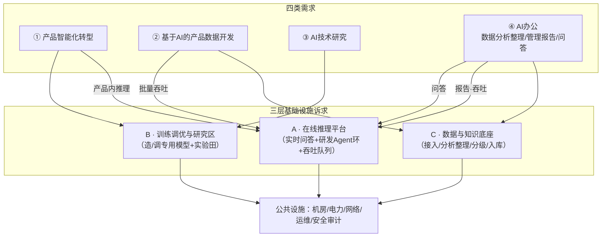
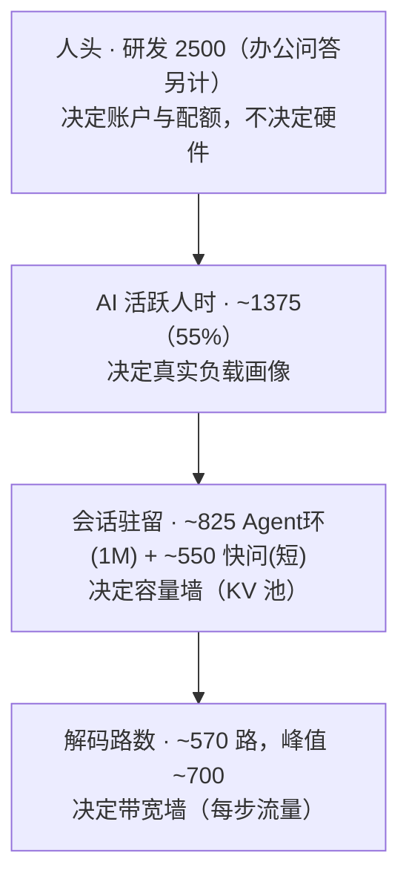
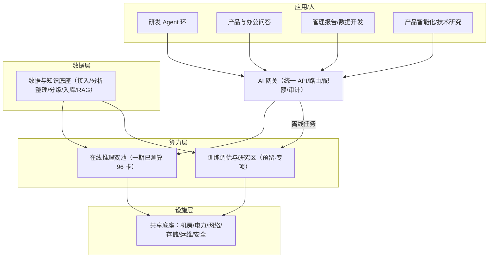
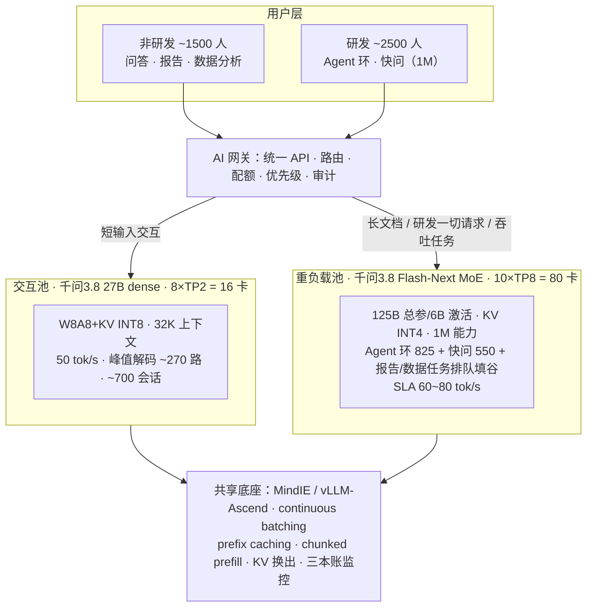
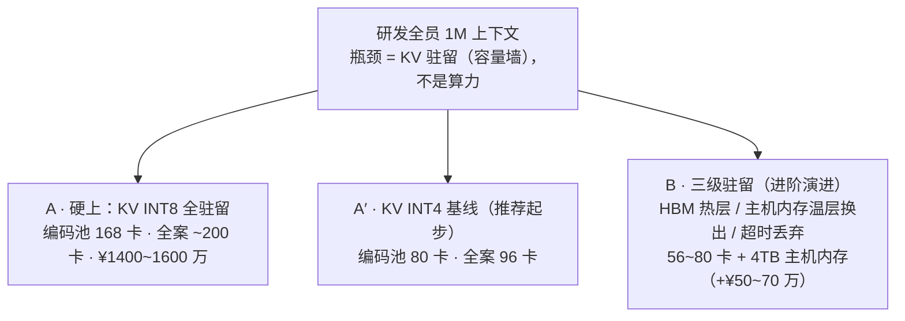
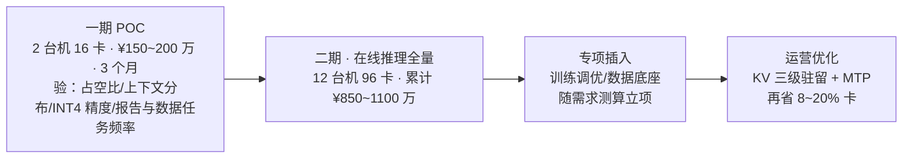

# 11 · 企业 AI 基础设施建设方案建议（高层汇报稿）

| 文档信息 | |
|---|---|
| 编号 | 11 |
| 版本 | v1.0（汇报故事板） |
| 日期 | 2026-09-07 |
| 受众 | 企业高层（汇报，非决议） |
| 来源 | 01-AI 私有部署推理平台研究报告（编号 01）|
| 篇幅 | 40 页 / 约 20 分钟 |

> 体例说明：本文是 **PPT 故事板**，每页 = 大标题 + 上屏要点 + 图/表 + 「备注」（讲者话术与出处，上屏时剔除）。方括号〔Qn〕/〔§〕指向 01 号报告问答与章节，供核对。正文所有金额为**估算、待询价**，卡数为**测算、待 POC 校准**——口径统一在本稿 P03，正文不逐页重复。

---

## P01 · 封面

**企业 AI 基础设施建设方案建议**

- 副题：一个底座，支撑四类企业 AI 需求——产品智能化、产品数据开发、AI 技术研究、AI 办公
- 一句话结论：在线推理一期约 100 张卡（96 卡双池）起步，一次性投入约 ¥850~1100 万、年运营 ¥110~160 万；训练调优与数据底座按需求成熟度分步建设，规模专项测算
- 汇报人 / 日期 / 编号 11

> 备注（约 20 秒）：今天用约二十分钟，向各位汇报企业 AI 基础设施的建设建议——为什么建、建完验收什么、企业需求是什么、方案具体是什么，以及**方案里每一项组成（卡数、软件、电力、机房、运维）为什么是这个量**。所有结论背后都有可追溯的测算（编号 01 报告），不是拍脑袋。

---

## P02 · 汇报主线

1. **为什么建** —— 企业 AI 需要从"零散试点"升级为"基础设施"
2. **建成后验收什么** —— 三层能力 + 可验收的 SLA
3. **企业要用 AI 干什么（四类需求）** —— 需求 → 基础设施诉求
4. **基础设施建什么** —— 在线推理 + 训练调优研究区 + 数据底座
5. **每一组成部分为什么是这个量** —— 从需求推导（本次汇报的重点）
6. **节奏与风险** —— 分期、POC、风险预防

> 备注（约 30 秒）：今天六步讲完。请各位特别留意第五步——我们会把"为什么大约一百张卡、为什么这套软件、为什么这个电力和机房"逐一从需求推出来，让预算的每一项都有出处。

---

## P03 · 一句话方案 + 全稿口径

**一句话方案**：建设**企业 AI 基础设施**——以**在线推理平台**（双池 96 卡，约 100 张）为一期主体，向前预留**专用模型训练调优区**与**数据与知识底座**，共用一个机房/电力/网络/运维底座。

**口径承诺（全稿有效，正文不重复）**：

| 数据类别 | 口径 | 状态 |
|---|---|---|
| 金额（CapEx/OpEx） | 按 01 报告口径 | **估算，待询价** |
| 卡数（16+80=96） | 由需求口径测算 | **测算，待 POC 校准（±20%）** |
| KV/带宽等物理参数 | 官方 + 假设 | 假设项待实测 |
| 训练调优/数据底座规模 | 本期识别并预留 | **待专项测算（本稿不估数）** |
| 报告状态 | 定稿 | POC 待验证 |

> 备注（约 30 秒）：请允许我先立一个规矩——本稿**每个数字都能追到出处**（编号 01 报告的问答实录）；带"估算/测算"的，落地前都要经过询价或一期 POC 验证。哪些是已算清楚的、哪些是需要下一步专门测的，P03 这张表会一路标到底。

---

## P04 · 现状与痛点：今天为什么必须动

- **研发侧**：编码/调试/设计文档的 AI 用量在涨，但受制于公网不稳、速率不确定——真正敢把"整仓代码 + 设计文档"交给 AI 的很少
- **办公与管理侧**：问答、管理类报告主要靠人——业务数据散、整理靠手工，AI 帮助有限、质量不可控
- **共同问题**：数据出境（代码、业务数据在公网服务上）、额度墙（用量一高就受限）、能力无法积累（提示词/知识/模型 Know-how 都留在外部）

> 备注（约 40 秒）：这是今天要解决的问题。各位可以回想：我们这些年用 AI 是"借别人的工具"，能力强弱、稳不稳定、数据去哪，都不由我们控制。基础设施建议，本质是把"借工具"变成"建自己的能力"——让能力、数据、模型都沉淀在自己企业里。这些痛点在 01 报告背景部分有详细展开〔01-§1〕。

---

## P05 · 目的总述：从"零散试点"到"基础设施"

把企业 AI 从**单个试用**升级为**一项基础设施**，三层含义：

1. **算力资产**：一次规划、随业务增长平滑扩容，不再每次单点采购
2. **数据资产**：业务数据有序接入、分级、沉淀，成为企业可复用的原料
3. **模型与 Know-how 资产**：专用模型的训练/调优经验、评测、运维方法都留在企业内

> 备注（约 30 秒）："基础设施"是关键词。就像建了电力和网络，任何新应用都能用；AI 基础设施一旦建成，四类需求（后面会讲）都在这张底座上生长，而不是各买各的、各建各的。

---

## P06 · 目的之支撑：四类企业需求共用一张底座

未来企业 AI 的四大用场，都在这张底座上跑：

| # | 需求 | 一句话 |
|---|---|---|
| ① | 产品智能化转型 | 企业产品要"带 AI"，需要专用模型，能训能调 |
| ② | 基于 AI 的产品各数据开发 | 用 AI 批量开发/加工产品侧数据与语料 |
| ③ | AI 技术研究 | 跟踪、试验、评测新模型与新技术 |
| ④ | AI 办公 | 业务数据分析与整理、管理类报告编制、问答等 |

> 备注（约 30 秒）：这四类不是并列的小工具，而是未来企业运营里会同时出现的四类刚需。它们对基础设施的诉求不同——有的要"在线推理"、有的要"训练调优"、有的要"数据底座"。P06 先立这个全景，第三部分逐类展开。

---

## P07 · 目的之红线：数据不出域、合规与权属

- **数据不出域**：研发代码、业务数据、管理材料，全部在企业内网闭环处理（这是私有化建设的首要红线）
- **权属归企业**：基于开源基座训练的领域专用模型，权属、部署、演进完全自主
- **可审计**：AI 网关对"谁在什么时间调用了什么、数据流向哪"全程留痕——既是内控，也是合规抓手

> 备注（约 30 秒）：为什么选自建而不是继续租公网？很多理由在后面，但**最硬的一条是红线**：当我们认真要把 AI 用到产品、用到研发代码、用到业务数据上时，"数据不出域"就不是可选配置，而是前提。01 报告里有句结论：出域红线存在时，私有化没有对手〔01-§6.1〕。

---

## P08 · 目的之时点：为什么是现在

- **模型就绪**：千问 3.8（2026-08）——27B 稠密（1M 能力、Apache 2.0 可商用）+ Flash-Next MoE（低成本长上下文），首次在可接受成本内覆盖"长上下文研发 + 全员问答/报告"
- **国产卡就绪**：昇腾 Atlas 300I A2（64GB，1.6TB/s）已到推理主力代际，配套 MindIE/vLLM-Ascend 软件栈成熟
- **用量窗口**：各条线 AI 使用量正在爬坡——现在建，爬坡期的每一次使用都在给企业自己积累数据与经验；继续等，用量继续外流、成本难控

> 备注（约 30 秒）：技术选型窗口是 01 报告专门核过的〔01-§2〕。简单说：今天这个时点，"能打的长上下文模型"和"够用的国产推理卡"同时到位，自建第一次在经济上成立。P08 只讲时点，为什么这套组合在第五部分展开。

---

## P09 · 目标总览：建成后验收什么

建成后验收**三层能力 + 一套可验收的体验指标**：

| 能力层 | 内容 |
|---|---|
| A · 在线推理 | 研发 1M 长上下文 Agent 环常态化；全员流畅级问答/报告 |
| B · 训练调优与研究 | 专用模型能训能调；AI 研究有实验田 |
| C · 数据与知识底座 | 业务数据接入—分析整理—分级入库，反哺问答/报告/训练 |
| 体验 | 一套明确 SLA（P13）——"好不好"是可验收的句子，不是感觉 |

> 备注（约 20 秒）：P09 是给大家一张"验收地图"。这一页之后，P10–P13 逐层讲三层能力和一套 SLA。

---

## P10 · 目标 A · 在线推理：研发 1M Agent 环 + 全员流畅问答/报告

- **研发（Agent 环）**：编码、调试、设计文档能放进 **1M 上下文**——整仓代码 + 设计文档一起给 AI，Agent 真正可用
- **全员（问答/报告）**：短问答与报告生成达到"**流畅级**"（60~80 tok/s，见 P13 标尺）
- **三类负载错峰共池**：研发白天碎片 + 报告集中段排队填谷，互不挤死

> 备注（约 30 秒）：这是把"研发 Agent 环"和"办公问答报告"说清楚的一页。1M 上下文不是炫技——研发场景的代码与设计文档天然是长文本，这是 01 报告反复校准过的真实口径〔01-Q23/Q24〕。

---

## P11 · 目标 B · 训练调优与研究：专用模型能训能调、研究有实验田

- **产品智能化**：企业产品要内嵌 AI，通用基座不能直接出厂 → 基于开源基座（千问系）在企业内做**领域专用模型的训练与调优**
- **AI 技术研究**：试验、评测新模型/新方法需要一个**弹性实验田**（利用率天然波动，与在线推理错峰）
- **目标表述**：不是"本期建多大训练集群"，而是"**下一批模型能造、能调、能比，接得上在线推理、不堵生产**"——规模随专项需求定

> 备注（约 30 秒）：01 号报告测算的是"跑模型"；产品智能化要的是"造/调模型"——这是两件事，也是企业未来真正的护城河。本稿对这部分采取诚实口径：**本期识别并预留架构，规模待专项测算**（P29 细讲），不在这份稿子里编数字。

---

## P12 · 目标 C · 数据与知识底座：业务数据能进、能理、能用

- **接入与分析整理**：各业务系统的数据有序接入，做**分级、清洗、分析、整理、入库**（AI 办公场景的核心诉求之一）
- **分级授权**：不同密级的数据服务不同场景，合规边界清晰
- **反哺闭环**：整理后的数据成为三件事的原料——问答/RAG 的知识来源、管理报告的素材、训练调优的语料

> 备注（约 30 秒）：问答好不好、报告像不像样、专用模型训得专不专，底层都取决于**数据有没有被好好整理分级**。所以方案里它是一条独立的"数据与知识底座"，而不是一个散功能。规模与建设节奏放在 P30，同样待专项。

---

## P13 · 目标：一套可验收的体验标尺（SLA）

**感知阶梯**（流速 → 体感）：

| 流速 | 体感 | 判断 |
|---|---|---|
| <20 tok/s | 拖沓 | 不可交付 |
| 20~40 | 勉强 | 保底 |
| 40~60 | 及格（公有云底部区间） | 验收线 |
| **60~80** | **流畅（超阅读极限 ~10 倍）** | **设计目标** |
| >100 | 体感无差别 | 仅批处理受益 |

**四项 SLA 验收**〔01-Q25〕：

- 首包（warm）≤ 3s（P95）｜解码 ≥ 60 tok/s（P95）｜研发 Agent 整轮 ≤ 30s｜报告排队 ≤ 10 分钟

> 备注（约 30 秒）：这一页是把"体验"变成**可验收的句子**。给高层验收就一句话：达到这些数=达标，达不到=我们改进。1M 场景下首包时延比速度更敏感，所以有"首包 ≤3s"这一条〔01-§5.5〕。

---

## P14 · 主要需求全景：企业用 AI 干什么（四类）

| # | 需求 | 落到基础设施 |
|---|---|---|
| ① 产品智能化转型 | 专用模型训练/调优（离线·项目制）+ 产品内推理（在线） | B 造调区 + A 推理 |
| ② 基于 AI 的产品各数据开发 | 批量/吞吐型数据处理（可排队）+ 数据管线 | A 推理（吞吐）+ C 底座 |
| ③ AI 技术研究 | 弹性训练/评测实验田（利用率波动） | B 造调区 |
| ④ AI 办公（业务数据分析与整理、管理类报告编制、问答等） | 数据分析整理（底座）+ 管理报告（吞吐）+ 问答（在线/RAG） | A 推理 + C 底座 |

> 备注（约 40 秒）：这是今天需求章的地图。后面 P15–P18 一页一类，P19 给"需求 → 三层基础设施"的映射总图。请各位留意：**四类需求都跑在线推理与数据底座上，其中产品智能化和技术研究额外要"造调模型"的能力**。

---

## P15 · 需求① · 产品智能化转型：要"造/调专用模型"

- **要什么**：企业产品要内嵌 AI 能力——通用模型不能直接出厂（领域不懂、不可控），须在企业内训出/调出**领域专用模型**
- **形态**：离线为主、随产品迭代项目制进行；训好上线的产品推理回到在线池
- **工作量特征**：调优（微调/LoRA）周期短、量级小可起步；规模化训练按产品线需求单独立项
- **对基础设施的提醒**：本期先保证"**能训能调、不堵在线推理**"，规模专项测算

> 备注（约 30 秒）：产品智能化是四类需求里含金量最高的一类，也是我们坚持"要预留训练调优能力"的原因——没有它，产品智能化只能长期依赖外部模型。具体训多大、多频繁，需要随产品规划做一次专项测算（收口页会再次建议）。

---

## P16 · 需求② · 基于 AI 的产品各数据开发：批量吞吐为主

- **要什么**：用 AI 批量开发/加工产品侧的数据、语料、样本（生成、整理、质检、扩量）
- **负载性质**：**批量、吞吐型、可排队**——不需要抢占式实时，适合排队论调度
- **落在哪**：并入在线推理的"吞吐队列"（与报告类同池），由数据管线承接进出
- **对质量的影响**：这类任务对精度要求分级——能用低精度档跑的就用低档，省卡

> 备注（约 30 秒）：需求②和需求①的区别：①是"造模型"，②是"用 AI 大规模产数据"——都是产品线在为智能化备料。这类负载**可以排队、可以打折精度**，正好填在线推理的谷（P27 的排队填谷机制服务它）。

---

## P17 · 需求③ · AI 技术研究：要一个"实验田"

- **要什么**：跟踪开源模型演进、评测替代方案、验证新技术（如投机解码、新量化位宽、国产软件栈）
- **负载性质**：**弹性、探索性、利用率波动大**——高峰期有、空闲期闲置
- **落在哪**：与训练调优共建一个"造/调 + 研究区"，**与在线推理错峰共享电力/机房/网络/运维**
- **成本策略**：研究负载允许低优先级、可抢占；不为一时的实验去买常年闲置的算力

> 备注（约 30 秒）：技术研究最大的特点是"不确定"——今天不知道下季度要跑什么实验。所以它不能按确定性负载去采购，而是放进预留区、按需弹性调度。这也是为什么训练调优与研究区在 P30 一起规划。

---

## P18 · 需求④ · AI 办公：数据分析整理 + 管理报告 + 问答

- **要什么（三层）**：
  1. **业务数据分析与整理**——把散在各业务系统的数据分级、清洗、分析、结构化入库（数据底座）
  2. **管理类报告编制**——吞吐型：给素材出报告、给口径出汇总，可排队
  3. **问答**——短问答、快问快答、RAG 式基于企业知识的回答（在线）
- **使用者**：管理/职能/办公人群，是"在线推理"里交互问答 + 吞吐报告的主要来源
- **成功标志**：管理者的"要个数据/要份材料"从"找人数天"变成"AI 数十分钟、人审校定稿"

> 备注（约 40 秒）：需求④覆盖人数最广，也最能被高层体感。请注意它的第一层是"业务数据分析与整理"——这决定了问答和报告的质量，所以方案把它作为独立数据底座来建，而不是塞进某个功能。这一人群的用量即 01 报告里非研发侧的问答/报告口径〔01-§5.1〕。

---

## P19 · 需求 → 基础设施诉求映射（总图）

> 备注（约 40 秒）：把四类需求落到三层诉求就一句话——**人人都要"在线推理"，产品智能化和研究要"造调能力"，办公和产品数据离不开"数据底座"，三者共用一套机房电力网络运维**。接下来两页，把"在线推理到底要多少卡"这一步推出来（约 100 张卡的来源），训练调优与数据底座的规模则明确定性为待专项。

---

## P20 · 在线推理量化锚①：人头不是负载，人时才是

- 4000 人 = **研发 2500 + 办公/管理 ~1500**
- 关键：**2500 研发 ≠ 2500 路并发**。决定硬件的不是"多少人"，而是"**同时真正在生成 token 的路数**"
- 研发工时构成〔01-§5.2〕：设计+编码 ~30-35%、调试 ~25-30%、讨论评审 ~15-20%、试验 ~10-15%、事务 ~10% → **AI 活跃占比综合 ~55%**
- 占空比谱系〔01-§3〕：交互问答 10~25%（人在读）｜研发 Agent 环 30~40%（等工具返回）｜批量吞吐 ~100% 但间歇

> 备注（约 40 秒）：这一页是"卡数推导"的第一块基石——**人头不是负载，人时才是**。2500 个研发不等于同时要 2500 条通道，因为有工作间隙、有占空比。把这块想清楚，才不会把预算买在"高峰同时 2500 人都在打字"这种永远不会发生的最坏值上。

---

## P21 · 在线推理量化锚②：卡数怎么推出来（约 100 张卡）

**四层漏斗**〔01-§5.2〕：

**口径五轮修正，收敛到 96 卡**〔01-§5.1〕：

| 轮 | 口径修正 | 卡数 |
|---|---|---|
| v1 | 1000 Agent + 3000 对话 | 86 |
| v2 | 对话拆"交互/吞吐（报告）" | 94 |
| v3 | 编码全员 1M → 三档 | A′档 72（编码池） |
| v4 | 研发核清 2500、人时漏斗 | 110 |
| v5 | 非研发核清 ~1500 | **96（终版）= 重负载 80 + 交互 16** |

**反伪需求判据**：若按"全员 1M × 500 路 × 200 tok/s"最坏值采购 → 算力只要 20 卡、带宽却要 5000 卡——**三本账失衡即伪需求**〔01-§4/§8-6〕。方案只按真实负载买，不为永远不发生的最坏值买单。

> 备注（约 60 秒，本页是"约 100 张卡"的正面回答）：为什么约一百张卡？不是估的，是**推的**——先承认"人头不等于负载"，把人头过四层漏斗压成"峰值约 700 路解码"，再按每路带宽算卡。而且这个口径是**改了五轮**才定的：86→94→110→96，每一轮都对应一次需求核清（比如把 1000 研发核清成 2500、把非研发从 3000 核到 1500）。五轮修改本身，就是这份测算可信的证据。96 ≈ 100，就是各位在封面看到的那张卡数。

---

## P22 · 需求小结：已测算 vs 待专项

| 诉求 | 状态 | 说明 |
|---|---|---|
| A · 在线推理（问答/Agent环/吞吐） | **已测算**（01 号报告） | 96 卡双池，见 P24–P28 |
| B · 训练调优与研究区 | **识别 + 架构预留** | 规模待专项测算（P29） |
| C · 数据与知识底座 | **识别 + 随需构建** | 规模待专项测算（P30） |
| 公共设施（机房/电力/网络/运维） | **按一期推理测算** | 预留训练/数据增量扩容复核 |

> 备注（约 30 秒）：需求章收口一句话——**在线推理这张"产线"今天就能算清楚；"造调研究"与"数据底座"是已经看见、需要专项立账的两块**。后面的内容章与理由章，先按已测算的在线推理把设施建成，同时把两块预留的口子留好。

---

## P23 · 总体架构：一张图 + 一个比喻

**比喻**：企业 AI 基础设施 = 一座 AI 工厂
- **在线推理平台 = 产线**（跑日常问答/研发环/报告，7×24）
- **训练调优与研究区 = 研发车间与实验田**（造/调专用模型、做实验，按项目开停机）
- **数据与知识底座 = 原料库与质检**（业务数据进、分级清洗、按需出料）

> 备注（约 40 秒）：用工厂来记：**产线（在线推理）卖力跑，研发车间（训练调优）出新品，原料库（数据底座）保质量，机房电力是厂房**。这样四类需求和三层基础设施就都能放进同一张图。接下来 P24–P31 一层层看每个车间建什么。

---

## P24 · 内容·在线推理平台：双池 96 卡架构

- **96 卡 = 12 台 8 卡机**：交互池 16（8×TP2）+ 重负载池 80（10×TP8）

> 备注（约 50 秒）：这是在线推理的"产线图"。两个池分工：**交互池**管短问答（轻、省卡），**重负载池**管研发 1M 环 + 报告/数据吞吐（重、贵但能干重活）；中间一个 AI 网关决定请求去哪、谁优先、全程留痕。为什么 16 和 80 这两个数——P32 从需求推给你看。

---

## P25 · 内容·AI 网关：路由、配额、审计

- **统一 API**：企业内部所有 AI 应用走一个入口，不再各接各的外部服务
- **三条路由**〔01-Q21〕：① 研发一切请求 → 重负载池；② 非研发短输入 → 交互池；③ 报告/数据批量任务 → 重负载池排队填谷（Agent 实时优先）
- **配额与优先级**：研究/批量任务低优先级可抢占，生产问答不被挤
- **全量审计**：谁、何时、调了什么、数据流向哪——合规与内控的抓手

> 备注（约 30 秒）：网关是"秩序层"。没有它，四类需求会互相抢资源、数据流向不可控；有了它，预算花在刀刃上，且"数据不出域、用了什么都有账"在技术上成立。P07 那条红线，落点就是这个网关。

---

## P26 · 内容·交互池特写（16 卡）

| 项 | 配置 | 依据 |
|---|---|---|
| 模型 | 千问 3.8 **27B dense**（Apache 2.0） | 短问答足够、成本低〔01-Q1〕|
| 部署 | 8 卡 × TP2 = **16 卡** | 交互峰值 ~270 路解码 / ~700 会话 |
| 上下文 | **32K**（不是 1M——对话甜蜜点） | 对话解剖：系统+工具+RAG+历史 ≈12~20K〔01-Q15〕|
| 精度 | W8A8 + KV INT8 | 精度/容量平衡 |
| 速率 | 50 tok/s 档 | 面向问答，不上限保底 |

> 备注（约 30 秒）：交互池负责"轻活"——为什么 16 卡就够：短问答占空比低（人读的 75% 时间模型在等），峰值 ~270 路解码折算下来 16 卡富余。注意它只给 32K 上下文，不给 1M——**给所有人开 1M 是把钱花在没人用满的能力上**（P21 反伪需求）。

---

## P27 · 内容·重负载池特写（80 卡）

| 项 | 配置 | 依据 |
|---|---|---|
| 模型 | 千问 3.8 **Flash-Next MoE**（125B 总参 / 6B 激活） | 重活成本最优〔01-Q1/Q16〕|
| 部署 | 10 卡 × TP8 = **80 卡** | Agent 环 825 + 快问 550 + 吞吐队列 |
| 上下文 | **1M 能力**（KV INT4） | 研发整仓代码/设计文档〔01-Q23〕|
| 速率 | 60~80 tok/s（SLA） | 流畅级设计目标〔01-Q25〕|
| 调度 | 排队填谷：报告/数据任务填 agent 碎片谷 | 负载时间互补〔01-§5.3〕|

> 备注（约 40 秒）：重负载池是"研发环 + 重活"的家。80 卡是怎么由 ~700 路峰值解码折出来的、为什么用 MoE 低激活模型来省每路带宽，P32 推给你。这里先记结论：**它在 1M 下仍给到 60~80 tok/s 的流畅体验**。

---

## P28 · 内容·1M 上下文怎么给：三档选型，起步 A′

**为什么 A′ 起步**：Agent 占空比 35% = 65% 时间会话在"睡觉"——**不为睡觉的 KV 买 HBM**。先 A′ 上量，软件成熟后演进 B 档再省卡〔01-§5.4/Q23〕。

> 备注（约 40 秒）：1M 是"能力"不是"默认每人都常年挂 1M"。同样给人开 1M，最贵的硬上法要 200 卡，**量化到 KV INT4 只要 96 卡**——卡数差一半，靠的就是"不为睡着的人留床位"和"把缓存压紧"。起步 A′、成熟上 B，是分期里"再省 8~20%"的来源。

---

## P29 · 内容·训练调优与研究区（预留）

**本期定位**：识别需求 + 预留架构，**规模不做硬测算**（待专项）。

- **起步形态**：LoRA / 全参微调**小集群试点**（比在线推理池小得多，先验证"训得动、调得顺"）
- **配套能力**：评测基准（SWE-bench 类，与 27B/Flash 同基准对比〔01-Q15 方法〕）、模型版本管理、上线审批
- **弹性调度**：与在线推理**错峰共享机房/电力/网络/运维**；研究负载低优先级可抢占
- **规模策略**：随①产品智能化与③技术研究的需求专项测算后插入，不堵在线推理、不为闲置买单

> 备注（约 40 秒）：这是"造模型"的车间——本期先建"能接得上"的架构和最小试点，而不是先买一大片训练卡。理由很朴素：**今天还没有哪个产品线告诉我明确要训多大模型**，那就先把口子和方法建好，等专项需求测算后一次买对。规模在收口页会列为第二件待办。

---

## P30 · 内容·数据与知识底座（预留 / 随需构建）

**本期定位**：识别需求 + 明确做法，规模随数据盘点专项。

- **接入与整理**：业务系统数据接入 → 分级、清洗、**分析与整理**、结构化入库
- **分级授权**：不同密级数据服务不同场景（如管理报告用经营数据、问答用制度与知识库），合规边界写进授权
- **反哺三件事**：问答/RAG 的知识来源、管理报告的素材、训练调优的语料
- **依托公共设施**：主要吃存储 + 吞吐推理 + 治理流程，**不是又一座大规模算力池**

> 备注（约 40 秒）：数据底座是需求④（办公）和质量的地基——**问答答得准、报告像样、专用模型训得专，都取决于数据有没有分级整理好**。它主要花钱在存储、数据工程与治理，而不是算力；规模要等"业务数据盘点"后专项定。这一层也让"业务数据分析与整理"第一次有了工程化的落点。

---

## P31 · 内容·公共设施与软件底座

- **软件栈**：MindIE / vLLM-Ascend（昇腾配套推理栈，主力组件开源 ¥0）〔01-Q22〕
- **四项运行时机制**：continuous batching（并发吞吐）、prefix caching + chunked prefill（长上下文 / 冷加载首包）、KV 换出（省卡）、三本账监控（容量/带宽/算力）〔01-§5.3〕
- **设施**：机房 5 柜 / 25~40m²、双路电力 ~100kW、UPS、空调 N+1、风冷（细账见 P35–P36）
- **安全与合规**：网闸/内网闭环、网关审计、量化校准与安全合规软件（计入软件费）

> 备注（约 30 秒）：这一页是"厂房与水电"。在线推理、训练调优、数据底座三层都跑在这套公共底座上——这也是"基础设施"的题中之义：**共用一份机房电力网络运维，而不是三套各建**。每项的"为什么这个量"在第五部分理由里逐条推导。

---

## P32 · 理由·硬件①：为什么是约 100 张卡（正面推导）

**推导链**（不是拍数）：

1. **需求** → 峰值解码 ~700 路（P20–P21 漏斗）
2. **两池拆分**：短问答走 27B（轻卡省电）→ 交互池；长上下文/吞吐走 Flash-Next（重卡省带宽）→ 重负载池
3. **交互池 16 卡**：~270 路峰值解码 ÷ 单卡可用并发 ≈ 16（27B × 8 × TP2）
4. **重负载池 80 卡**：~570~700 路中"长上下文 + 吞吐"部分 ÷ Flash 单卡服务能力 ≈ 80（Flash × 10 × TP8）
5. **16 + 80 = 96 ≈ 100 张**；单台 8 卡 → **12 台 8 卡机**

**为什么"双模型分池"而不是单旗舰**：27B 负责轻问答省 14 卡、Flash 负责重负载——各自在正确的问题上省钱〔01-Q20 备选对照〕；旗舰 Max 成本过高不采用。

**为什么量化省一半卡**：KV INT8→INT4、权重 W8A8，直接压小"每路带宽/每路 KV"两大成本来源〔01-§3〕。

> 备注（约 60 秒）：这一页是回应"为什么约 100 张卡"的正式推导——把 P20–P21 的峰值路数，分别送进两个池，16+80=96。三个"为什么"一句话：**分池让轻活不占重卡、量化让每路成本减半、口径五轮让需求不虚高**。这套推导每一步都在 01 报告里有账〔01-§5〕。

---

## P33 · 理由·硬件②：为什么是"12 台 + 外围"这套组成

- **机器粒度**：8 卡整机（不是散卡）——供电/散热/互联成组、单台故障影响面可控
- **组网**：TP8/TP2 组内高速互联（长上下文 1M 的跨卡协同依赖它）；机间网络满足推理流量
- **存储**：模型权重 + KV 换出（B 档）+ 数据底座共用——大容量、分热温冷
- **网关与安全机**：路由/配额/审计的落点，1~2 台即可
- **备件与冗余**：备 1 台整机量级——保障"产线"可用性（运维内容见 P37）

> 备注（约 30 秒）：96 卡不是 96 张裸卡堆在一起，而是 **12 台 8 卡机 + 组网 + 存储 + 网关 + 备件** 这套工程组成。单台能力 × 台数 → 容量；冗余与备件 → 可用性。这套组成的价值在 01 报告成本里对应"硬件 ¥660~845 万"〔01-§6〕。

---

## P34 · 理由·软件：为什么是这几件，各解哪个问题

| 软件/机制 | 解决什么需求问题 |
|---|---|
| MindIE / vLLM-Ascend | 昇腾国产卡的正确打开方式（不用闭门造车）|
| continuous batching | 几百上千会话同时在线，不排队等死 → 吞吐 |
| prefix caching + chunked prefill | 1M 长文档重复前缀复用 + 冷加载首包 ~11s → 降到 <1s |
| KV 量化 + 换出（INT4/offload） | 每路 KV 减半、B 档三级驻留 → **省卡（96 vs 200）** |
| 量化校准 + 安全合规 | 精度不失控 + 数据/审计合规 |
| 三本账监控 | 容量/带宽/算力实时看，负载画像校准 POC 的依据 |

**软件费 ¥60~150 万构成**：主力推理栈 ¥0（开源）+ 量化校准 + 安全合规 + 集成实施。

> 备注（约 40 秒）：软件钱花在哪、为什么每一件都对应一个真问题——尤其"prefix caching + KV 量化换出"这两件，是**1M 长上下文能在 96 卡上跑、而不是 200 卡**的直接原因（P28）。软件不是成本项，是省卡的关键杠杆。

---

## P35 · 理由·电力：为什么是双路 ~100kW（由设备清单推出）

1. **单卡 TDP**：Atlas 300I A2 ≈ **350W**（64GB 版）
2. **整机 + 外围分摊**：96 卡全上约 33.6kW（卡面），加整机/网络/存储/网关/制冷损耗 → **IT 平均 ~52kW**
3. **双路供电**：380V 各 ~100kW——一路检修/故障另一路顶着（可用性）
4. **PUE 1.4** → 年耗电 ≈ 64 万度 ≈ **¥45 万/年**
5. 预留：训练调优/数据底座增量接入时，按弹性复核扩容（POC 期先测实际水位）

> 备注（约 30 秒）：电力不是拍脑袋的"好像要不少电"——从**单卡 350W × 96** 起算，分摊损耗得 IT ~52kW，双路 ~100kW 是给"一路坏了还能跑"留的冗余〔01-§6/Q22〕。训练区若上，电力在这个基数上做弹性复核即可，机房配电一次做够。

---

## P36 · 理由·机房：为什么是 5 柜 / 25~40m² / 风冷无液冷

| 结论 | 推导 |
|---|---|
| 12 台 8 卡机 + 网络/存储/网关 | 单柜约 2~3 台机（按供电/散热密度）→ **约 5 柜** |
| 25~40m² | 5 柜 + 通道 + 运维空间；新建微模块或**利旧**均可 |
| UPS 100kVA | 对齐 ~100kW 双路，市电掉电时撑到安全关停 |
| 2×25kW 空调 N+1 | 显式 N+1，坏一台不升温——产线不能因空调停机 |
| **风冷，无液冷** | 单柜密度推理规模下风冷足够；液冷是更大密度才需要的复杂度 |

> 备注（约 30 秒）：机房每一项都能从"12 台 8 卡机 + 外围"推出来——**柜数由机器与供电密度出，面积由柜数与运维空间出，空调 N+1 由"产线不停"的要求出，风冷够用就不上液冷**。还保留了利旧选项，新建/利旧两档费用在 01 报告里〔01-Q22〕。

---

## P37 · 理由·运维：为什么是这些内容、对应什么人力

**自运维（企业内）的事项清单**：

1. **容量与健康**：三本账监控、负载画像校准（POC 起持续做）
2. **模型与版本**：基座升级、量化校准、专用模型版本管理与上线审批（与训练区衔接）
3. **系统运维**：升级、补丁、告警、故障响应（含 8 卡整机级备件轮换）
4. **安全与合规**：网关审计、数据分级授权复核、内网闭环巡检
5. **人**：对应年运维人力 **¥30~60 万**——约 2~4 人规模的能力岗（含外包弹性）

**数字可复核示例（"快从哪来"可审计）**：业界 113 tok/s = 带宽（3.35TB/s）÷ 激活字节（37GB）× MTP（1.25）——物理账 × 产品档位 × 供给 × 实测，四层可见，任何厂商宣传都按这个拆〔01-Q26〕。

> 备注（约 40 秒）：运维不是"找个网管看机器"，而是**模型与数据时代的能力岗**——会看三本账、会做量化校准、会把关模型版本、能对厂商说法做"113 拆解"式复核。¥30~60 万对应的是这支小队伍，而不是外包甩手掌柜。这也是"Know-how 留在企业内"的真正含义。

---

## P38 · 经济总账：把每一项理由串成一张表

| 构成 | 推导依据（见 P32–P37） | 金额（估） |
|---|---|---|
| 硬件 | 96 卡·12 台 8 卡机 + 网络/存储/网关/备件 | ¥660~845 万 |
| 软件 | 国产推理栈 ¥0 + 量化校准/安全合规/集成 | ¥60~150 万 |
| 机房 | 新建微模块 5 柜 / 利旧 | ¥70~105 万 / ¥30~50 万 |
| **一次性 CapEx** | | **¥850~1100 万** |
| **年 OpEx** | 电 45 + 维保 20-30 + 软件 10-20 + 运维人力 30-60 + 杂项 5 | **¥110~160 万** |

- **年化人均**：3 年口径 ~¥1000~1300/人/年；5 年 ~¥700~930
- 与"订阅制"只作背景一句：公有云订阅 3 年约 ¥3600~6000 万，本方案约 ¥1200~1550 万——**按产能投资，不是按 token 收租**〔01-§6.1〕（本期理由重心在构成推导，此处点到为止）

> 备注（约 40 秒）：总账不是凭空一张表——**P32–P37 每一项"为什么是这个量"，在这里乘以单价就得到这张账**。850~1100 万一口气投下去，换来的是产线、车间、原料库、厂房四样东西，且三年运营下来人均成本反而低于持续订阅。训练/数据增量未计入本期——这正是收口页要建议的"专项"。

---

## P39 · 落地节奏与风险预防

**关键风险与缓解（指向 POC，不赌）**〔01-§7〕：

| 风险 | 缓解 |
|---|---|
| 硬件价格波动（±30%） | 多源询价、POC 期锁价 |
| KV-INT4 精度损失 | POC 跑 SWE-bench 类基准；不达标退 INT8（+80 卡）|
| 占空比/上下文分布偏差（卡数 ±20%） | POC 用 IDE 插件 + 会议日历采样两周实测校准 |
| 软件 offload 成熟度 | A′ 档不依赖 offload，B 档等成熟再演进 |
| 1M 冷加载首包 ~11s | 仓库上下文预热 + 错峰准入 |

> 备注（约 50 秒）：落地**从 150~200 万、3 个月的 POC 开始，而不是一步 96 卡**。POC 用真实负载验证四个数（占空比、上下文分布、INT4 精度、报告/数据任务频率），达标再进二期。所有风险都有缓解、都指向 POC——这是让"96 卡、850~1100 万"从测算变成可执行交付的唯一路径。

---

## P40 · 汇报收口：三句话 + 建议下一步

**汇报要点（三句话）**：
1. 企业 AI 要走"**能力沉淀在自己手里**"的路——在线推理先落地，训练调优与数据底座为下一步留好口子
2. 在线推理"**约 100 张卡（96）= 从需求推出来**"，预算每一项可追溯、POC 先行再上量
3. 数据不出域、权属自持、运维 Know-how 留在企业——这是一次性投入买的长期资产

**建议下一步（供审议，非决议）**：
1. 启动**在线推理一期 POC** 立项论证（16 卡，¥150~200 万，3 个月）
2. 开展**训练调优与数据底座的专项需求与规模测算**（覆盖产品智能化、产品数据开发、AI 技术研究、AI 办公四类需求）

> 备注（约 30 秒，收尾）：今天不请各位拍板采购，只请两件事进入论证：**先用三个月、两百万级的 POC 验证推理底座**，同时**把产品智能化与数据底座的需求与规模算清楚**。等 POC 数据回来、专项测算出来，再向各位提正式投资方案。谢谢。

---
