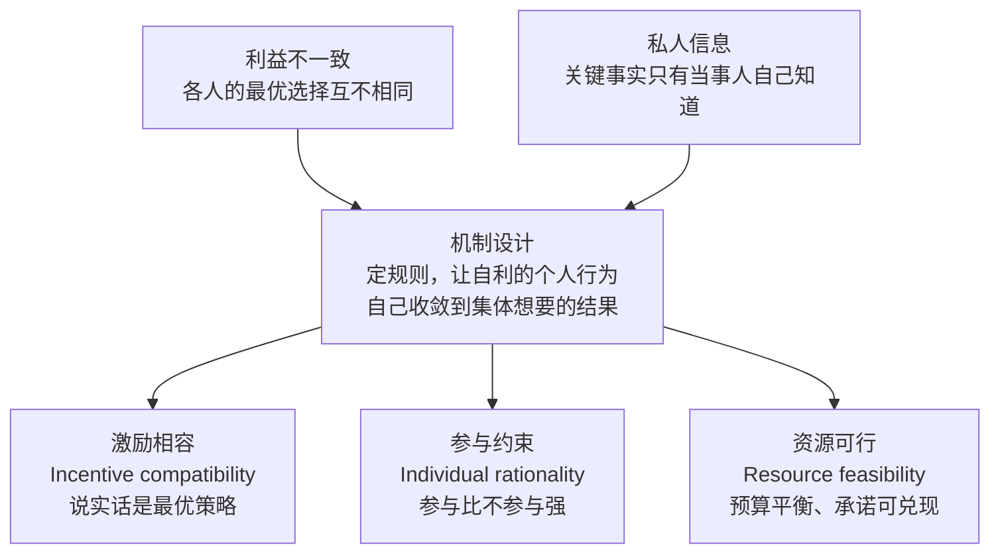
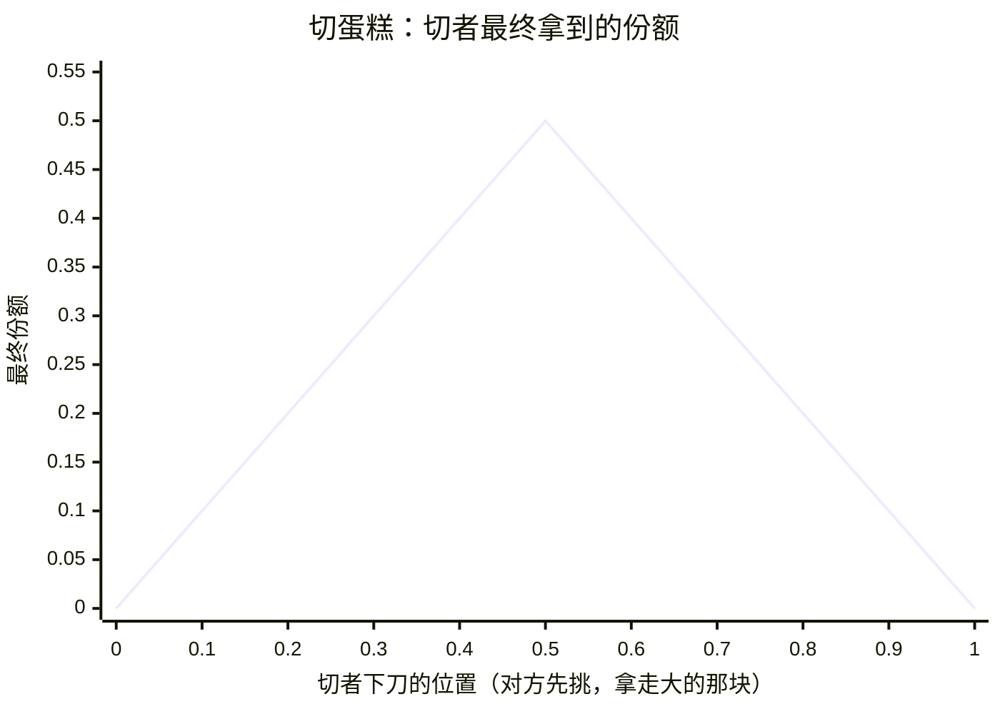
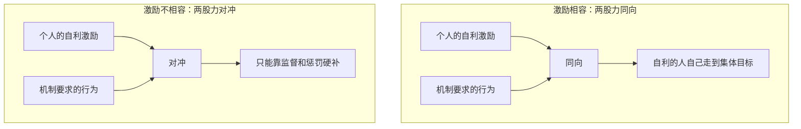
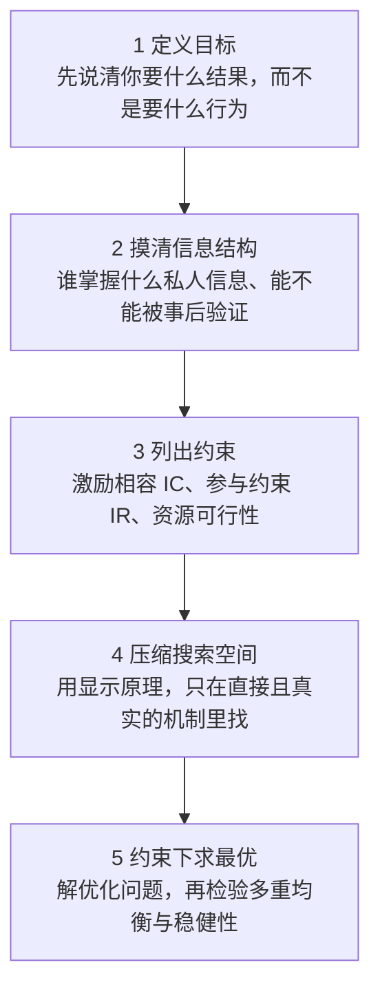
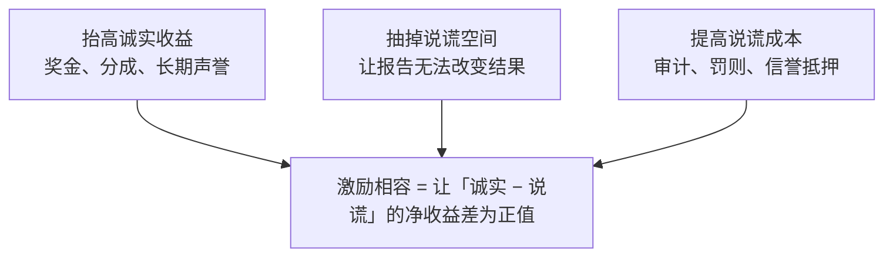
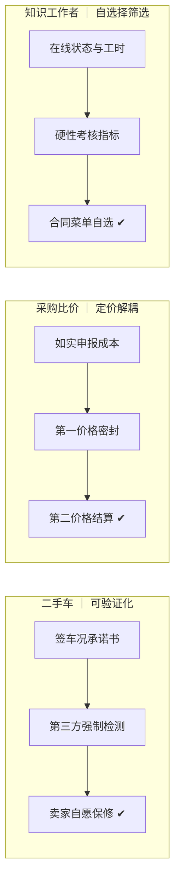
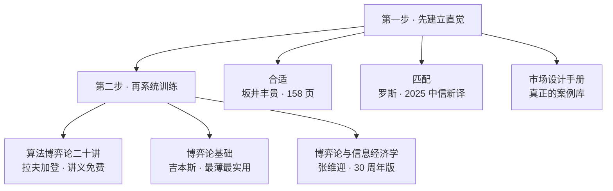
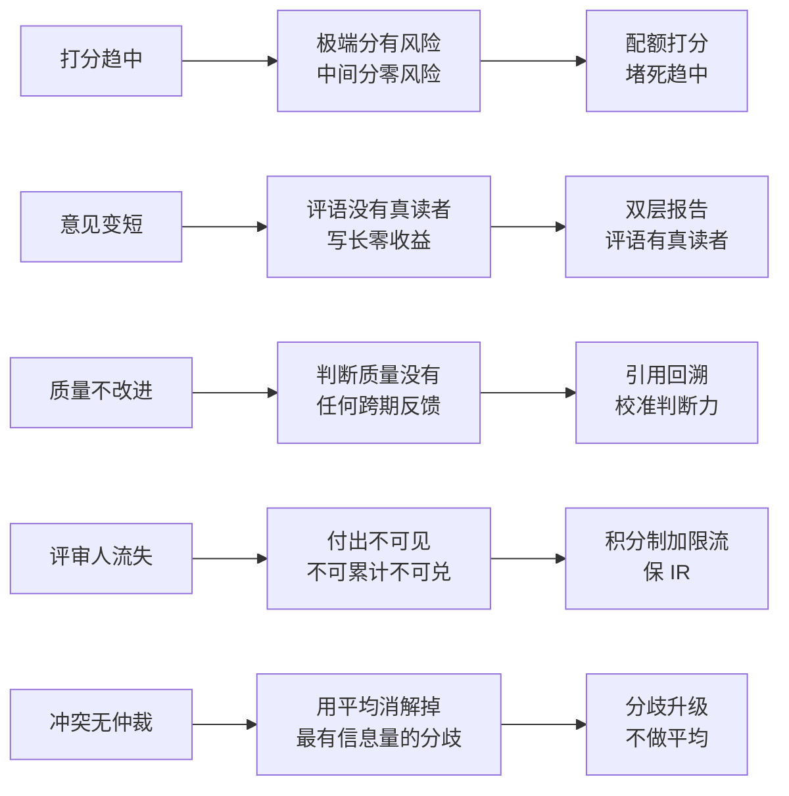

# 01 · 相容理解相关对话记录

> **主题**：激励相容（incentive compatibility）——概念、命名、设计方法、案例与书单
> **记录时间**：2026-09-14
> **来源**：与 WorkBuddy 的对话
> **说明**：正文为对话原文照录；原对话中的示意图已改写为 Mermaid，语义保持等价。

---

## 第 1 轮

### 提问

> 激励相容是什么鬼

### 回答

一句话：**激励相容 = 把"说实话"设计成最划算的选择。**

它不是道德要求，是**机制设计的工程约束**。你不是祈祷参与者诚实，而是把规则改成"说谎会亏"。

这个概念来自机制设计理论（mechanism design），奠基人是 Leonid Hurwicz，1972 年的论文 *On informationally decentralized systems* 首次提出 incentive compatibility。他因此和 Maskin、Myerson 拿了 2007 年诺贝尔经济学奖。

定义（Hurwicz 原意 + 现代标准表述）：

> 在一个机制中，如果每个参与者**如实报告自己的私人信息（真实类型/真实偏好）**是其最优策略，则该机制是激励相容的。

它只在一个特定局面下才有意义：**利益不一致 + 私人信息**。两个条件缺一个，激励相容就不是问题——如果大家利益一致，或者关键信息人人可见，那按最优解执行就行，不需要设计。

形式化就一行——设 $\theta_i$ 是参与者 $i$ 的真实类型、$\hat\theta_i$ 是他报出去的版本：

$$\forall \hat\theta_i,\quad u_i(\text{报}\ \theta_i)\ \geq\ u_i(\text{报}\ \hat\theta_i)$$

也就是"报真话"的收益不低于任何谎报。按这个条件的强弱，分两档：

| 档位 | 英文 | 含义 |
|---|---|---|
| **占优策略 IC（DSIC）** | dominant-strategy IC | 不管别人怎么报，说实话都最划算——最强、最省心 |
| **贝叶斯 IC（BIC）** | Bayesian IC | 在别人的类型服从某个先验分布下，说实话是纳什均衡——更弱、更容易实现 |

最经典的 DSIC 例子是**第二价格密封拍卖**（Vickrey, 1961）：出价最高者赢，但按第二高的价格付钱。此时"按自己真实估值出价"是占优策略——因为你的出价只决定"赢不赢"，不决定"付多少"。这一刀切下去，困扰一切拍卖的"策略性压价"问题消失了。

再看一个不需要任何私人信息的纯粹版本，通常是我给人讲这个概念的开场：

"你切，我先挑"——切者纵有偏心，也会老老实实切成两半。**规则里没有一句"要公平"，公平却是自利行为的唯一均衡。** 这就是激励相容的手感：不改造人性，只改造博弈的收益结构。

（严格说分蛋糕不涉及私人信息，属于"激励对齐"的纯激励版本，但直觉最准。）

带私人信息的真实案例：

| 场景 | 谁知道什么（私人信息） | 怎么做到激励相容 |
|---|---|---|
| 密封拍卖 | 买家知道自己的真实估值 | 第二价格：按真实估值出价最划算 |
| 员工薪酬 | 员工知道自己的努力程度 | 计件 / 分成，让"努力"比"摸鱼"收益高 |
| 保险 | 投保人知道自己的风险水平 | 免赔额 + 共保，低风险者自愿选低保费 |
| 产品定价 | 买家知道自己的支付意愿 | 设几档套餐，让客户自己挑出真实档位 |

反例就是那句老话——**"上有政策，下有对策"**，这是中文世界对激励不相容最精炼的表述：政策制定者以为自己在描述一个目标，实际上发布的是一个博弈，而下面的人总会找到那个让政策失效的策略。

最后两块拼图，决定这东西有多少"硬"：

- **显示原理（Revelation Principle）** —— Gibbard (1973)、Myerson (1979)、Dasgupta–Hammond–Maskin (1979)。任何机制能达成的结果，都存在一个"直接且真实"的机制也能达成。所以研究者只需盯着激励相容的直接机制看，不用去搜遍所有复杂规则。
- **不可能定理** —— Gibbard–Satterthwaite（1973/1975）：三个以上备选、非独裁的投票规则，一定可以被策略性操纵。Myerson–Satterthwaite（1983）：双边私下估值交易，**效率、预算平衡、自愿参与**三者不可兼得。换句话说，激励相容不是"努力一下总能做到"的性能指标，它有硬上限。

---

一句话总结它为什么重要：**只要是"信息不对称 + 利益不一致"的场合，任何规则都在被参与者当博弈来解。** 你不设计激励，别人就会替你设计——只不过设计出来的均衡未必是你想要的那个。

顺手提一句：你手上的需求分配、跨层级评审、供应商协同，本质上都长在"私人信息 + 利益不一致"这片土壤上——需求方知道真实痛点、评审人知道论文真实水平、供应商知道真实成本。所以"上游定规则、下游博弈"的结构性风险是共通的。哪天要往 ISO 15288 的 stakeholder needs → requirements 那条链上锚，这概念是个挺硬的抓手。

---

## 第 2 轮

### 提问

> 为什么叫这个名字，相容是谁与谁之间的相容？

### 回答

好问题——这个名字起得有讲究，而且答案不是"人与人"。

**一句话：相容的不是两拨人，是两股"力"——个体的自利激励（incentive），与机制所要求的行为/集体目标（objective）。**

说人话：机制希望你"如实报告、努力工作"，而你的自利本能正好也想这么干——两者不打架，就叫"相容"。

#### 词源：compatible 的本义是"能共存"，不是"相同"

拉丁语 **compati** = com-（一起）+ pati（承受）。所以 compatible 的原义是"能一起扛住"——同一个词根还长出了 patient（能忍的）、patience、passion。它在数学里的用法更精准：一个**相容（compatible）的方程组 = 有解的系统**。约束之间不打架，解才存在。Hurwicz 是数学家出身，用的就是这层意思。

所以"相容"照字面拆开，是两个东西并存而不冲突：

| 一侧 | 另一侧 |
|---|---|
| 个体的**自利激励**（他说谎/偷懒最划算） | 机制（设计者/集体）**期望的行为或社会最优** |
| 私人信息条件下的**分散决策** | 集体层面想要的**资源配置结果** |

注意——**不是"人 vs 人"**。参与者之间当然也博弈，但那是手段；惩罚"相容"的是"私利方向"与"机制方向"的夹角。

#### Hurwicz 真正想问的是什么

他 1972 年那篇论文的标题就是 *On informationally decentralized systems*（收录在给 Jacob Marschak 的纪念文集里）。他关心的是一个比"人性善恶"硬得多的工程问题：

> 亚当·斯密说，个人追求私利"往往"会促进公共利益。Hurwicz 问：**"往往"能不能变成"必然"？以及——需要什么条件？**

那个条件，他命名为"激励相容"。所以它是**看不见的手的工程化版本**：不是祈祷那只手存在，而是把规则设计到那只手必然伸出来。如果条件不成立（私利方向与机制方向对冲），那就只能靠外部的监督、审计、惩罚去硬补——成本高，而且永远补不干净。

#### 中文和日文都抓住了"两者并存"这层

- 日文译 **インセンティブ両立性**（或"誘因両立性"）——**両立**就是"两者并存"，字面上把"谁和谁"写出来了：个体理性与集体目标两者兼立。
- 中文译 **激励相容**——沿用"相容"这个词的数学味：有解、不矛盾。

对照一下就很清楚：如果它想表达的是"两边完全相同"，该叫**激励一致**（incentive identity）而不是相容；如果是"方向对齐"，后来的文献确实另造了 **incentive alignment**（激励对齐）这个词。Hurwicz 选了 compatibility，要的说的是**"不打架"而不是"长一样"**——门槛低得多，但已经足够让整个机制跑起来。

这一点很关键：激励相容从不要求个人动机变高尚，只要求"说实话/努力干"在两套收益账本里**同时是最优解**。第二价格拍卖里，买家出价 100 万照样是一己私利，只不过这一次，私利的方向恰好也是集体想要的方向。

---

补一句边界：相容与否，取决于**机制设计**，不取决于参与者的品德。同一批人、同一个目标，规则改一行，相容就变成不相容。所以"改进作风"改不动的东西，改收益结构往往一行就动了。

---

## 第 3 轮

### 提问

> 如何基于激励相容的理论设计有效的机制呢

### 回答

机制设计不是"发明巧妙的规则"，而是**在激励相容约束下做优化**——先承认代价，再找最优解。它有一套很标准的路子。

这是教科书式的五步，Myerson 那代人的框架：

**第 1 步最容易做错。** 目标必须用"结果"描述，不能用"行为"描述。"要求各部门如实汇报"是行为——它是手段，不是目标。真正的目标应该是"资源流到真实收益最高的地方"。把手段当目标写进规则，就是刻舟求剑。

**第 2 步的关键二分**是"可验证 / 不可验证"。考勤记录可验证 → 写进合同就行；员工的"尽力程度"不可验证 → 必须付信息租金。这一个判断，决定了后面整个机制的形状。

第 3–5 步是标准的约束优化：把 IC 和 IR 当作不等式约束，在可行集里最大化目标函数。显示原理的价值在于把搜索空间从"所有可能的规则"砍到"报告空间=类型空间、报告即执行"的那一小片——否则你根本无从下手。

#### 设计杠杆其实只有三根

IC 条件的本质是一个净值比较：**诚实净收益 ≥ 说谎净收益**。所以要造出激励相容，能拧的旋钮就这么三个：

三根杠杆里，**中间那根最优雅，也最容易被忽略**。

**抬高诚实收益**是最直觉的做法，但它有个隐性账单：你付的每一分奖励，同时也是"信息租金"——为了让掌握私人信息的人不装傻，你必须让他保留一部分剩余。这笔钱是买真实信息的价钱，省不掉。

**抽掉说谎空间**是结构解法，不需要付钱、不需要监督。第二价格拍卖靠的是"你的出价不决定你付多少钱"；分蛋糕靠的是"切的人后选"；背对背报价、盲评、双盲盘点、分权交叉核对，全是同一个套路——**让说谎在物理上无法变现**。有结构解法时，永远优先用它。

**提高说谎成本**是最后的兜底，因为它有个绕不过去的悖论：监督者本身也有激励问题（who watches the watchmen）。随机抽查 + 重罚通常比全面审计更划算——这是 Becker 那套"低概率 × 高强度"的逻辑。

#### 三笔躲不掉的代价

设计时最需要提前认清的，是这三条硬约束：

1. **信息租金是真金白银。** Myerson 的最优拍卖证明：卖方必须在"抽取剩余"和"维持真实报告"之间做权衡，最终放弃一部分收益。想白拿真话，是幻想。
2. **低效经常是设计的一部分。** Myerson–Satterthwaite（1983）：双边私下估值交易中，**效率、预算平衡、自愿参与**三者不可兼得。所以"明明能成交却没成交"不是失误，是 IC 的代价。看到"为什么不做到最好"，先问 IC 是否被违反。
3. **你必须有承诺能力。** 整个框架假定设计者事后不食言。现实中大量机制失效，是因为设计者自己时间不一致——事前定好的规则，事后看到结果就改。**规则的可信度本身就是机制的一部分。** 这条对配置管理最要命：变更控制规则的稳定性，就是你的承诺能力。

#### 动手前先答四个问题

1. 谁掌握我不知道、但决定结果的关键信息？
2. 他说实话能得到什么？说谎又能得到什么？**差额是正还是负？**
3. 他能不能选择不参与？（IR 是否满足）
4. 我的规则能不能承诺到底、并且被别人相信？（credibility）

四问答完，机制的骨架基本就出来了。至于第 5 步"约束下求最优"——那部分确实需要数学（包络定理、单交叉条件那套工具），但工程场景里，八成的问题在答完前四问时就暴露了：**你要的东西和参与者想走的方向，本来就差着一个负号。**

---

放到你手上的场景里试一下这个体检：派生型文档链如果规定"下游发现上游错误就追责上游"，上游的激励就变成了**隐瞒**而不是**修正**——典型的激励不相容。把它换成"在评审窗口内主动暴露问题免责、并被记录为质量贡献"，同一批人、同一个目标，方向就反过来了。规则改一行，比开十次质量意识宣讲会有用。

---

## 第 4 轮

### 提问

> 你搞几个例子，让我体会下机制设计过程

### 回答

好，来三个。我把每一轮迭代都摊开——**重点不是最后的机制，而是每一版是被哪个约束逼着改的**。

#### 例 1 · 二手车：怎么把"不可验证"变成"可验证"

**目标**｜车况好的车能以匹配其品质的价格成交。
**私人信息**｜卖家知道车况，买家不知道。
**约束**｜IC —— 说"车况良好"的成本是零；IR —— 好车主不愿按均价卖，直接退出市场。

| 版本 | 设计 | 结局 |
|---|---|---|
| v1 | 要求卖家签车况承诺书 | 破 IC：不可验证，签了也白签 |
| v2 | 强制第三方检测 | 检测机构自己也是代理人（谁付钱听谁的），成本高且覆盖不全 |
| v3 | **卖家自愿提供 12 个月保修** | ✅ 车况仍不可验证，但"是否出故障"可验证 |

**v3 的机理**：好车卖家的保修成本低，坏车卖家的保修成本高。于是"敢不敢提供保修"这个动作，把两类卖家**自动分开**了——这就是 Spence 的信号传递（1973）。平台兜底 + 退车窗口是同一逻辑的工业化版本，平台赚的佣金本质是信息租金的转移。

> **破局点**：别去验证不可验证的东西，去设计一个"只有说真话的人用得起"的选项。

#### 例 2 · 采购比价：怎么让说谎没有收益

**目标**｜把订单交给真实总成本最低的供应商。
**私人信息**｜每家知道自己的真实成本。
**约束**｜IC —— 每家有动力抬价；IR —— 报价低于成本会亏，所以不会无限低报。

| 版本 | 设计 | 结局 |
|---|---|---|
| v1 | 让各家如实申报成本 | 破 IC：谁都会低报，买方无从核实 |
| v2 | 第一价格密封（最低价中标） | IC 满足但不优：每家都掺"策略性水分"，加价幅度取决于对对手的猜测 |
| v3 | **第二价格（最低价者得，按第二低价结算）** | ✅ 占优策略 IC：报价不影响结算价，如实报成本最优 |
| v4 | 再叠加质量维度 | 多维类型，IC 难度陡增 |

**v4 的现实教训**：大量采购真的走了"最低价中标"这条路，结果赢家是"质量最差但敢报最低"的那家——劣币驱逐良币。后来的"综合评分法"，本质上是承认了多维问题的复杂性。
**更实用的手术是降维**：把质量做成资格门槛（通过/不通过），只留价格一个维度做竞争。能做成门槛的，别做成评分。

> **破局点**：降低维度，比设计一个高维最优机制现实得多。

#### 例 3 · 知识工作者：行为不可观测时怎么办

**目标**｜团队真实产出最大化。
**私人信息**｜① 员工知道自己投入了多少（道德风险）；② 员工知道自己项目的真实难度（逆向选择）。
**约束**｜IC —— "看起来努力"比"真努力"便宜；IR —— 员工可以选择离职。

| 版本 | 设计 | 结局 |
|---|---|---|
| v1 | 在线状态、工时统计 | 破 IC：整个团队开始表演在线 |
| v2 | 硬 KPI（代码行数、工单数） | Goodhart 定律：指标一旦成为目标，就不再是好指标 |
| v3 | **合同菜单：高底薪低奖金 / 低底薪高奖金** | ✅ 有把握的人选后者，没把握的选前者——自选择暴露了私人信息 |
| v4 | 长期关系 + 声誉 | 重复博弈改变了单次博弈的均衡，且不额外花钱 |

**v3 的机理**：公司永远不需要知道谁强谁弱，只需要摆出两种合同，让人自己归类。这和保险里"低风险者自愿选高免赔额"、定价里"客户自选套餐"是同一个数学结构。
**v4 的机理**：KMRW（1982）证明，哪怕只有很小概率存在"老实人"，重复博弈也能让合作成为均衡。声誉资本让摸鱼的代价跨期化。

> **破局点**：行为不可观测时，不要升级观测手段，要设计分类。

三个案例的迭代路径并排放在一起，模式就浮出来了：

三个案例放在一起，一个**跨领域的顽固模式**就露出来了：

| 迭代 | 手法 | 为什么必然失败或被逼着升级 |
|---|---|---|
| v1 | **要求参与者改变行为**（承诺书、如实申报、在线打卡） | 呼吁没有改变收益结构，IC 原封不动 |
| v2 | **升级观测与监督**（第三方检测、第一价格、KPI） | 成本高、覆盖不全，而且被观测者会去优化指标本身 |
| v3 | **改变收益结构或选择空间**（保修、第二价格、自选菜单） | 让自利动机自己指向想要的结果 |

这张表也解释了为什么"加强管理"往往无效——它一直在 v1 和 v2 之间打转，花钱越来越多，均衡没变。

---

#### 留一道题，你来走一遍

拿你手上的**惯性学会论文评审**试试五步，最能体会"过程"二字：

- **目标**｜把真正好的论文选出来（注意：不是"让评审人认真负责"）
- **私人信息**｜评审人是否真的读懂了、是否带着偏见、判断能力如何
- **约束**｜阅读与写作的努力不可观测；拒稿可被申诉；评审人可以拒绝审稿（IR）
- **症状**｜意见越来越短、分数向中间塌缩、两位评审意见冲突时无处仲裁

三个钩子，对应前面三招：

1. **可验证化**——有没有办法让"这篇论文之后的真实表现"回流给当年的评审人？
2. **降低认真审的成本**——结构化表单和明确判据，是否比反复强调"请认真审稿"更能改变均衡？（如果某一招的边际成本比敷衍更低，它就会被选择）
3. **自选择**——能不能让评审人自己在不同投入档位间选，让高投入者拿到别处拿不到的回报？

你会发现一个反直觉的地方：评审人**没有动力对自己偏爱的东西说谎**，他真正的问题是**敷衍**。所以这里破 IC 的不是"说假话"，而是"不出力"——同一条不等式，处理方式完全不同。

> 最后一句提醒：这套框架假定参与者理性、设计者能承诺。现实中人会犯傻、会讲义气、会为了面子放弃利益。机制设计是**地板**不是天花板——它保证最坏情况下系统还能跑，但不会自动让人变好。

---

## 第 5 轮

### 提问

> 这个机制设计挺好，但需要训练，有没有什么书，尤其是案例多多的书，给推荐下

### 回答

查证完了，给你一条实际能走的线。"案例多多"这个诉求其实指向两类不同的书，得分开看。

#### 第一层 · 案例读物（三本，按顺序）

**1. 坂井丰贵《合适》**（后浪 / 江西人民出版社，蔡晓智译，158 页）
日文原书《マーケットデザイン》，台版叫《如何设计市场机制?》。全书就三章：肾脏配对、择校与相亲配对、拍卖。**最薄、最无痛，一个下午能翻完**，几乎不用数学。适合当引子。

**2. 埃尔文·罗斯《匹配：谁能得到什么，以及为什么》**（中信出版集团，2025 年 10 月，叶晓阳 / 林依凝 译）
诺奖得主亲笔写的大众书，原书 *Who Gets What—and Why*。案例密度极高：美国医生就业市场的"爆炸性要约"、纽约与波士顿的择校改制、肾脏交换链（2007 年那一次连锁启动了 16 例移植）、过早行动与市场拥堵。
⚠️ **认准 2025 中信新版**。之前那个旧中译（当年被包装成"共享经济"那本）与原名关系不大，翻译口碑不好。
顺带说，罗斯自称"经济学家里的工程师"，方法论直接类比桥梁工程师——从坍塌的桥里提炼造桥原则。这句你大概会点头。

**3. 《市场设计手册》**（上海证券交易所金融创新文库）
原书 *Handbook of Market Design*（Vulkan / Roth / Neeman 编）。**这本才是"案例多多"的极致**，目录直接就是二十多个实战案例：肾脏交换、择校机制、经济学家就业市场、思想的市场设计、小额信贷重构、必和必拓的钻石拍卖、网络广告市场设计、通信带宽自动化市场，以及一个 600 亿美元采购规模的多属性组合拍卖实施经验。
当手册翻，不必从头读。

#### 第二层 · 训练教材（按你的背景挑一本就够）

**首推 Roughgarden《斯坦福算法博弈论二十讲》**——有中译本，英文讲义作者官网免费（timroughgarden.org/notes.html）。

选它的理由：这是计算机视角写的机制设计，数学"够用就好"，天然贴合工程思维。而且它第 1 讲的开篇案例就是**2012 年伦敦奥运会女子羽毛球假球丑闻**——赛制要求"必须争小组第一"，但赢了反而会在淘汰赛碰到更强的对手，于是选手开始故意输球，最后被取消资格。作者用这个事故来开篇讲"规则制定这门科学"，你读到会笑出来。后面是 Myerson 引理、VCG、组合拍卖、无线频谱、肾脏交换、自私路由的无政府代价。

**Gibbons《博弈论基础》**（有中译）——薄、全案例驱动，第 4 章委托代理是我见过最省时间的入门。**张维迎《博弈论与信息经济学》**（格致出版社，2026 年 30 周年纪念版）——中文原创，§3.4 就是机制设计理论与显示原理，第 5–7 章是委托代理、逆向选择、信号传递。1996 年初版时杨小凯的评价是"国内最好的一本经济学教科书"。

#### 第三层 · 按方向深挖

| 方向 | 书 |
|---|---|
| 拍卖 | Krishna《Auction Theory》；Milgrom《Putting Auction Theory to Work》（后者讲 FCC 频谱拍卖的真实设计过程） |
| 激励 / 委托代理 | Laffont & Martimort《The Theory of Incentives》 |
| 组织内部机制 | Milgrom & Roberts《Economics, Organization and Management》——对企业流程设计最对口 |
| 理论正面推进 | Börgers《An Introduction to the Theory of Mechanism Design》(2015)；Mas-Colell 等《Microeconomic Theory》第 23 章 |
| 算法视角 | Nisan 等《Algorithmic Game Theory》（出版社可免费下载） |

---

**关于"训练"，多说一句：光读没用，得练。** 三个练法，按性价比排序：

1. **逆向拆解**——看到任何规则就问一句"它诱导什么行为？"考勤、报销、KPI、论文评审、晋升标准，随手拆。这是最便宜的日常训练。
2. **做习题**——张维迎和 Börgers 每章带题，Roughgarden 讲义配了问题集。Börgers 前四章本科高年级可读。
3. **写一页机制备忘录**——挑你手上一个真实流程，按五步写成一页纸，然后找个人讲一遍。这一步最有效，因为**你几乎一定会卡在第 1 步**：发现自己写下的"目标"其实是个行为要求。

---

## 第 6 轮

### 提问

> 你刚才的那道评审论文的题目，答案是什么

### 回答

这题没有唯一答案，但有一个能被检验的解法。我把它走完——**关键在第一步：大多数人会在这儿写错目标。**

#### 第 1 步：目标重写

错的写法："让评审人认真负责"——这是行为，不是目标。
也没好到哪去的写法："把好论文选出来"——不够精确。

准确的写法是两句：

> ① 在**名额约束**下，让录用集合的真实质量分布优于未录用集合；
> ② **评审供给可持续**（评审人愿意继续干）。

第二句是关键。**可持续性是一条 IR 约束，必须写进目标函数里**，不能当约束条件事后补。只优化第①句，结果一定是把评审人榨干——然后系统崩掉，这才是最常见的事故。

#### 第 2 步：信息结构（分层）

| 私人信息 | 性质 | 对应的问题 |
|---|---|---|
| 投入了多少精力 | 不可观测 + 不可验证 | **道德风险** |
| 判断是否准确、是否读懂 | 不可观测，事后也难归因 | 逆向选择 + 噪声 |
| 利益冲突 | 部分可声明、部分可隐瞒 | 逆向选择 |
| 论文的真实贡献 | 不可验证 | 作者侧的逆向选择 |

这里有个必须先看破的事：**破 IC 的不是"说假话"，而是"不出力"。** 评审人对自己偏好说谎没有动机——他为谁谋利呢？他的问题是不想花时间。

而这个不对称是结构性的：**努力的成本即时且明确（今晚三小时），努力的收益延迟且模糊（几年后的声望）**。所有激励破坏都从这个不对称里长出来。

#### 第 3 步：约束

IC 的形式在这里是：`认真读一遍的净收益 ≥ 扫一眼就写的净收益`——当前是反的。
IR 是真瓶颈：学术评审无薪，回报全靠声望，工作量一旦超过声望回报，供给立刻崩。
可行性：名额约束、会前截止、不能引入大规模金钱。

再看两个症状的根因，因为它们经常被误诊成人品问题：

**分数趋中不是性格保守，是理性避险。** 打极端分要担责，打中间分怎么都不算错；而且极端分需要读得足够深才有把握，中间分不读完也能给。**趋中是被机制诱导出来的。**

**意见变短，是因为评语没有真读者。** 写长了谁看？元评审自己也在赶时间。写长的边际收益是零。

这两条加上前两步，对策其实已经自己浮出来了：

#### 第 4–5 步：对策展开

上面每一刀，都刻意优先用**结构解法**（不花钱、不靠监督），只有一条必须动收益。

**① 配额打分**——给每位评审人固定名额：审 6 篇就必须给出 2 个 A、2 个 B、2 个 C。趋中在结构上被禁止，和"你切我先挑"是同一个原理。**诚实的代价**：如果池子里真的全是中等水平，这会逼出虚假区分。所以配额要与池子质量挂钩，或改用池内相对排序。

**② 双层报告**——一份报告不可能同时服务两个读者。让作者可见会压制真实判断（谁都不敢说狠话），但对作者又必须可解释。所以要**分离**：给作者的是结构化、有据可依、可申诉的意见；给元评审的是锐利的判断。不要试图写一份"既能又能"的报告。

**③ 事实项先于价值项**——这是全场最妙的一招。把"你觉得这篇怎么样"（价值判断：认知成本高、策略空间大）换成"方法部分是否报告了样本量""是否做了消融实验"（事实判断：成本低、几乎无策略空间）。一招同时拿下两件事——**降低认真的边际成本**，顺带把趋中也治了。**把"你怎么看"改造成"你看到了什么"。**

**④ 引用回溯校准**——论文发表 3–5 年后，把引用与影响回溯给当年的评审人，形成个人"判断力档案"。只能用于声望与选拔（谁够格当领域主席），不能用于惩罚。这在结构上和二手车保修**完全同构**：当期不可验证的信息，转成了跨期可验证的后果。

**⑤ 积分制 + 限流**——工作量可累计、可展示、可兑换（注册费减免、PC 席位、最佳审稿人）。还要**主动限流**（每人最多审 X 篇）——这是保护 IR，防止短期超量抽取把系统榨干。IR 不是给钱，是让付出被看见。

**⑥ 分歧升级而非平均**——两审冲突时不取平均，而是交第三位评审**只针对分歧点**裁决。**分歧本身是信号**：平均会把"一篇有争议的高价值论文"和"一篇平庸论文"压成同一个分数，等于主动扔掉最有信息量的部分。

**⑦ 投入档位自选**——让评审人在不同档位间自己选，而不是要求所有人同一标准：愿意深审的少审几篇、审难稿、进核心池；只能快筛的多审几篇、只做明显不合格的排除。**让类型匹配岗位，而不是让所有人做同一件事。**

#### 手法映射（和前三个案例对上了）

| 本方案的手法 | 对应案例手法 |
|---|---|
| 配额打分、事实项先于价值项 | **抽掉说谎空间**（采购的第二价格） |
| 引用回溯校准 | **可验证化**（二手车的保修） |
| 投入档位自选 | **自选择筛选**（合同菜单） |

#### 最后：这道题的"做不到"

**必须放弃一样。** 效率（选出最好的论文）、评审人满意、零额外成本——三者不可兼得。学术会议的现实选择是**放弃一部分效率**（容忍一定误判），保住可持续。所以接收率总在 20–25% 徘徊、总有误判，**那不是组织者无能，是三选二的必然**。

**还有一条硬上限**：评审人的判断能力是私人信息，而且**不可通过激励改变**。机制能让人努力，不能让人变聪明。**机制解决"不愿意"，解决不了"不会"**——后者要靠评审人选拔，那是另一个机制，别混在一个设计里解决。

---

顺带说一句：这道题里最值钱的不是七个对策，而是第 1 步那个动作——**当你把"可持续性"写进目标函数时，后面一大半设计就自己长出来了**。大多数人解题失败，不是想不出办法，是目标里漏了一项，于是把一个必然破裂的系统优化到了极致。

---

## 第 7 轮

### 提问

> 你的分析我不太理解

### 回答

是我的问题——我跳过了最关键的一座桥。

前面三个案例（分蛋糕、二手车、采购）都有一样东西：**有东西可以给出去**。蛋糕可以分、保修可以承诺、订单可以授予。可用的工具很多。

**评审场景最根本的不同是：你没有任何东西可以给。** 没有钱、没有订单、没有可分配的实物。你手上只有"规则"。这件事我完全没讲，直接就套了三根杠杆，所以你看着会觉得凭空。

换个讲法，不讲机制，讲处境。

#### 晚上 10 点，你面前有 6 篇论文

明天截止。你打开第一篇，读完摘要大概知道结论了。现在做个选择：花 3 小时认真读，还是花 20 分钟写个"weak accept"？

**认真读，能得到什么？** 你可能会指出别人没发现的问题。但元评审也在赶时间，多半没细看；而且这篇大概率会被录用，你的反对改变不了结果。

**认真读，要付什么？** 3 小时。今晚没了。

**随便写，能得到什么？** 进度 +1。完成一篇。

**随便写，要付什么？** 几乎没有。没有人会来检查你读得深不深。

结论当然是随便写。**这不是人品问题，是任何人在这个处境下的理性选择。** 换成你我都一样。

推下去：6 篇都这么处理 → 分数全是 weak accept → **趋中**。所有人都这么想 → 所有分数都趋中 → 最后录谁不录谁，实际是由名额和随机性决定的，不是由质量排序决定的。

所以第一句话应该是：**这个系统现在在奖励敷衍。**（术语版：IC 不成立）

#### 三条改法

**一、让"认真"变便宜。**（术语：降低努力的边际成本）

现在认真读一篇要 3 小时，因为你要从零搭判断框架。但如果表单直接问你三个具体问题——"样本量写了吗""有没有对照组""结论里的因果表述有实验支撑吗"——你读完就知道该往哪儿看。3 小时变成 40 分钟。

关键在于这个差别：**"你觉得这篇好不好"是一道开放难题；"这篇有没有对照组"是一道查证题。** 查证题便宜得多，而且答案更客观。这一招顺手把趋中也治了。

**二、把"敷衍"这条路堵掉。**（术语：抽掉说谎空间）

规则改成：你审 6 篇，必须给出 2 个 accept、2 个 reject、2 个 borderline。**"全给 weak accept"这个选项在结构上消失了**，你被迫做区分。它不改变你的偏好，只改变你能表达什么。

**三、让"敷衍"有代价。**（术语：提高说谎成本）

这条路这里最难走——没有可用的惩罚，而重罚会直接把人赶跑。唯一可行的是**慢办法**：论文发表几年后，把它的真实影响回溯给你。你当年 reject 的那篇成了高被引，这件事会进你的判断力档案。不用来罚你，但会改变你下次读稿的态度。

#### 那个"IR"到底是什么

就是一句大白话：**人家凭什么继续干？**

你审 6 篇，没有报酬，唯一回报是共同体内的信誉。问题在于这个信誉**看不见**（没人知道你审了多少、审得多好）、**攒不起来**（今年审了 6 篇，明年从零开始）、**兑不出东西**。

所以工作量一涨，理性选择就是退出；有人退出，留下的人负担更重，更多人退出——**系统崩塌**。

这就是我那句"可持续性要写进目标里"的意思。如果只把"选出好论文"当唯一目标，你优化出来的方案一定是"让大家多审几篇、再认真点"。这个方案当年有效，两年后没人给你审了。

#### 不可能三角

你其实想要三样东西：

1. 选出最好的论文
2. 评审人愿意一直干
3. 不额外投入资源

**三选二。** 因为第 1 样要靠第 2 样的资源来换，而维持第 2 样要么花资源、要么牺牲第 1 样。

现实里的会议全都选了 2 和 3，放弃一部分 1。**所以误判是必然的，不是谁失职。**（术语版：Myerson–Satterthwaite 那个不可兼得的结构，在这里换了个样子出现。）

#### 最后一条上限

规则能让人**愿意**花时间，不能让人**有能力**读懂。如果评审人本来就读不懂那篇论文，再精巧的规则也没用——那是评审人选拔的问题，是另一道题。

**机制解决"不愿意"，解决不了"不会"。**

---

这样讲通了吗？还是卡在其中某一条上——比如"配额打分为什么不算强迫"或者"引用回溯到底怎么落地"？你指一下，我往那个点上再拆细。

---

## 附：本记录的图索引

| 序号 | 图名 | 所在轮次 | Mermaid 类型 |
|---|---|---|---|
| 1 | 机制设计的三类约束条件与激励相容的位置 | 第 1 轮 | flowchart TD |
| 2 | 切蛋糕机制下切者的最优下刀位置 | 第 1 轮 | xychart-beta |
| 3 | 激励相容与激励不相容的力方向对照 | 第 2 轮 | flowchart TB + subgraph |
| 4 | 机制设计的五个步骤 | 第 3 轮 | flowchart TD |
| 5 | 制造激励相容的三个设计杠杆 | 第 3 轮 | flowchart TD |
| 6 | 三个案例的机制迭代路径对照 | 第 4 轮 | flowchart LR + 3 subgraph |
| 7 | 机制设计书单的两层阅读路径 | 第 5 轮 | flowchart TD |
| 8 | 论文评审机制的症状根因与对策映射 | 第 6 轮 | flowchart LR |

> 注：图 2 使用 `xychart-beta`，需 Mermaid 10.9.0 及以上版本渲染；更低版本可将其替换为下表。

| 切者下刀位置 | 对方先挑走 | 切者最终所得 |
|---|---|---|
| 0.5（正中） | 0.5 | **0.5（最大）** |
| 0.7 | 0.7 | 0.3 |
| 0.9 | 0.9 | 0.1 |
